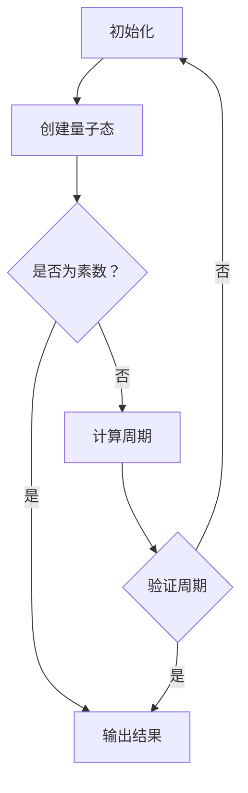
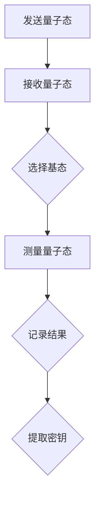
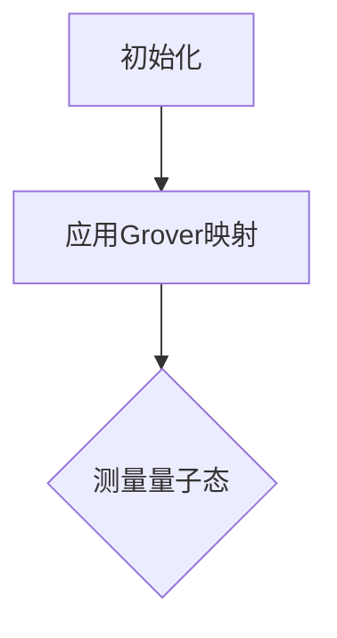
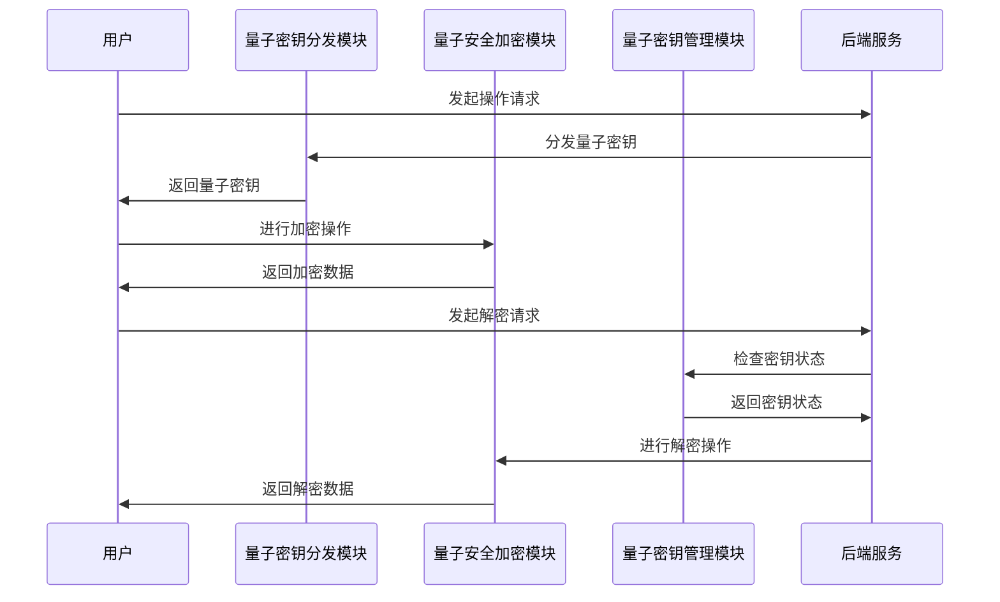

                 

### 关键词

1. **量子计算**：量子比特、量子门、量子纠缠、量子算法。
2. **传统加密技术**：RSA算法、ECDLP算法、量子密钥分发。
3. **加密挑战**：量子计算机、算法破解、后量子密码学。
4. **信息安全**：量子安全加密、密码学增强技术。
5. **未来发展**：政策建议、产业规划、国际合作。

### 摘要

本文将深入探讨量子计算对传统加密技术的挑战。首先，我们将介绍量子计算的基本原理及其与传统加密技术的联系。随后，我们将详细分析量子加密技术的原理和应用，探讨其对传统加密算法的威胁。接着，我们将讨论传统加密技术面临的挑战以及应对策略。最后，本文将展望量子计算与加密技术的未来发展，并提出相关政策建议。

## 第一部分：背景与概述

### 1.1 问题背景

#### 1.1.1 量子计算的发展历程

量子计算，作为量子力学与计算理论的结合，起源于20世纪70年代。物理学家Richard Feynman在1974年首次提出了量子计算机的概念，认为量子计算机能够模拟量子系统的行为。此后，Peter Shor于1994年提出了著名的Shor算法，展示了量子计算机在因子分解问题上的巨大潜力，引发了全球对量子计算的广泛关注。

量子计算机的原理基于量子力学的基本概念，如量子比特、叠加态和纠缠。与传统的经典计算机不同，量子计算机使用量子比特（qubit）作为信息存储和处理的单元。量子比特可以同时处于多种状态的叠加，这使得量子计算机在执行某些计算任务时，具有超越经典计算机的速度和效率。

#### 1.1.2 传统加密技术的基本原理

传统加密技术主要依赖于数学难题，如大素数分解、离散对数和椭圆曲线离散对数，来保证通信的安全性。RSA算法和ECDLP算法是两种常用的公钥加密算法，它们依赖于计算这些难题的难度。例如，RSA算法的安全性依赖于大素数分解的难度，而ECDLP算法则依赖于椭圆曲线离散对数问题的难度。

传统加密技术还包括对称加密算法，如AES和DES，这些算法通过密钥来加密和解密数据。对称加密算法的效率较高，但其安全性依赖于密钥的安全性。

### 1.2 量子计算与加密技术的关系

#### 1.2.1 量子加密的概念

量子加密是一种基于量子力学原理的加密技术，其主要目标是实现绝对安全的通信。量子加密的主要形式包括量子密钥分发（QKD）和量子安全加密算法。量子密钥分发利用量子态的不可克隆性和量子纠缠的特性，实现安全密钥的分发。而量子安全加密算法则利用量子计算的特性，设计出即使被量子计算机破解也无法破解的加密算法。

#### 1.2.2 量子计算对加密技术的影响

量子计算对加密技术的影响主要体现在两个方面：一是对传统加密算法的威胁，二是对量子加密技术的发展。

首先，量子计算机能够快速破解传统加密算法，如RSA和ECDLP，这直接威胁到了现有信息安全体系。例如，Shor算法能够高效地分解大素数，使得RSA算法的安全性受到质疑。其次，量子计算的发展推动了量子加密技术的进步。量子加密技术的出现，为应对量子计算机的威胁提供了一种可能的解决方案。

### 1.3 本书结构

本文将分为五个部分进行详细探讨。第一部分介绍了量子计算和传统加密技术的基本背景；第二部分讲解了量子计算的基本原理；第三部分分析了量子加密技术的原理和应用；第四部分讨论了传统加密技术面临的挑战及应对策略；最后一部分展望了量子计算与加密技术的未来发展，并提出了相关政策建议。

#### 1.3.1 目录概述

- **第一部分：背景与概述**
  - 1.1 问题背景
  - 1.2 量子计算与加密技术的关系
  - 1.3 本书结构
- **第二部分：量子计算基础**
  - 2.1 量子力学基础
  - 2.2 量子计算模型
  - 2.3 量子算法案例
- **第三部分：量子加密技术**
  - 3.1 量子密钥分发
  - 3.2 量子安全加密算法
  - 3.3 量子加密技术挑战与展望
- **第四部分：传统加密技术面临的挑战**
  - 4.1 量子计算机对传统加密算法的影响
  - 4.2 传统加密技术的应对策略
  - 4.3 案例研究
- **第五部分：未来展望与政策建议**
  - 5.1 量子计算与加密技术的未来发展趋势
  - 5.2 政策建议与产业规划

#### 1.3.2 阅读指南

本文旨在为广大读者提供一份全面的量子计算与加密技术的研究指南。每个部分都将逐步深入，从基础理论到实际应用，帮助读者全面了解这一前沿领域。读者可根据自己的需求和兴趣，选择合适的内容进行深入阅读。

## 第二部分：量子计算基础

### 2.1 量子力学基础

量子力学是量子计算的理论基础，它描述了微观世界中粒子的行为。以下是一些关键的量子力学概念：

#### 2.1.1 量子比特与经典比特

经典比特（bit）是计算机中最基本的信息单元，它只有两种状态：0和1。量子比特（qubit）则是量子计算机中的基本信息单元，它不仅可以处于0和1的叠加状态，还可以同时处于多个状态的叠加。这种叠加态使得量子计算机在处理信息时具有独特的优势。

#### 2.1.2 量子态与叠加原理

量子态描述了量子比特的状态。根据量子力学的叠加原理，一个量子比特可以同时处于多种状态的叠加。例如，一个量子比特可以同时处于状态$$|0\rangle$$和状态$$|1\rangle$$的叠加态：

$$
|\psi\rangle = \alpha|0\rangle + \beta|1\rangle
$$

其中，$$\alpha$$和$$\beta$$是复数系数，满足$$|\alpha|^2 + |\beta|^2 = 1$$。

#### 2.1.3 量子纠缠与量子门

量子纠缠是量子比特之间的一种特殊关联，即使量子比特相距很远，它们的量子态也会相互关联。量子纠缠是量子计算的重要特性，它使得量子计算机能够实现比经典计算机更高效的计算。

量子门是操作量子比特的基本操作，类似于经典计算机中的逻辑门。量子门可以通过旋转量子比特的状态来改变它们的叠加态。常见的量子门包括Hadamard门、Pauli门和控制非门等。

### 2.2 量子计算模型

量子计算模型描述了量子计算机的工作原理。以下是一些关键的量子计算模型：

#### 2.2.1 量子逻辑门

量子逻辑门是操作量子比特的基本操作。常见的量子逻辑门包括：

- **Hadamard门**：将量子比特的状态从基态$$|0\rangle$$变为叠加态$$\frac{1}{\sqrt{2}}(|0\rangle + |1\rangle)$$。
- **Pauli门**：包括X门、Y门和Z门，分别表示对量子比特状态的X、Y和Z分量进行翻转。
- **控制非门**：在第二个量子比特为$$|1\rangle$$时，翻转第一个量子比特的状态。

#### 2.2.2 量子算法基础

量子算法是基于量子计算模型的算法，它利用量子比特的叠加态和纠缠态来加速计算。著名的量子算法包括Shor算法和Grover算法。

- **Shor算法**：能够高效地分解大素数，对RSA算法构成威胁。
- **Grover算法**：能够加速搜索算法，在处理大规模数据时具有显著优势。

#### 2.2.3 量子电路与量子程序

量子电路是量子计算机中的基本构建块，它由一系列的量子逻辑门组成。量子程序则是量子计算机执行的操作序列，它通过量子电路来实现特定的计算任务。

### 2.3 量子算法案例

量子算法在各个领域都有广泛的应用。以下是一些著名的量子算法案例：

#### 2.3.1 量子搜索算法

量子搜索算法是一种基于量子比特叠加态和纠缠态的搜索算法。它能够在多项式时间内解决一些经典的搜索问题，如Grover算法。

- **Grover算法**：能够在未排序的数据库中，以平方根级别的加速找到特定条目。

#### 2.3.2 量子因子分解算法

量子因子分解算法是一种利用量子计算加速大整数因子分解的算法。它对RSA算法构成了严重威胁。

- **Shor算法**：能够在多项式时间内分解大素数，使得RSA算法的安全性受到质疑。

#### 2.3.3 量子算法在其他领域中的应用

量子算法不仅在搜索和因子分解领域有显著优势，还在其他领域有广泛应用，如量子机器学习、量子模拟和量子优化等。

- **量子机器学习**：能够加速机器学习算法，提高预测精度和效率。
- **量子模拟**：能够模拟量子系统的行为，为量子化学和量子物理学研究提供强大的工具。
- **量子优化**：能够解决复杂的优化问题，如旅行商问题、物流调度等。

## 第三部分：量子加密技术

### 3.1 量子密钥分发

量子密钥分发（Quantum Key Distribution，QKD）是一种基于量子力学原理的加密技术，它能够实现绝对安全的密钥分发。QKD的核心思想是利用量子态的不可克隆性和量子纠缠的特性，确保通信双方能够共享一个只有他们知道的密钥。

#### 3.1.1 BB84协议

BB84协议是最早提出的量子密钥分发协议，由Charles H. Bennett和Giorgio Brida于1984年提出。BB84协议的基本步骤如下：

1. **量子态制备**：发送方（Alice）生成一对正交的量子态，例如，基态$$|0\rangle$$和$$|1\rangle$$的叠加态$$\frac{1}{\sqrt{2}}(|0\rangle + |1\rangle)$$，并将其发送给接收方（Bob）。

2. **量子态传输**：Bob随机选择一个基态进行测量，并将测量结果返回给Alice。

3. **密钥提取**：Alice和Bob根据他们共同选择的基态，提取共享的密钥。如果Bob的测量结果与Alice发送的量子态匹配，那么这个比特就是共享密钥的一部分。

BB84协议的安全性在于量子态的不可克隆性和测量坍缩原理。任何试图窃听通信的第三方（Eve）都无法复制量子态，也无法在不引起量子态坍缩的情况下测量量子态。因此，Alice和Bob可以通过检测量子态的坍缩来检测是否存在窃听。

#### 3.1.2 E91协议

E91协议是另一种量子密钥分发协议，由Artur Ekert于1991年提出。E91协议利用量子纠缠态来实现密钥分发，其基本步骤如下：

1. **量子态生成**：Alice和Bob共享一组纠缠态$$|\psi_{\pm}\rangle = \frac{1}{\sqrt{2}}(|00\rangle + |11\rangle)$$。

2. **随机基选择**：Alice和Bob各自随机选择一个基（X或Z），并各自测量纠缠态。

3. **密钥提取**：Alice和Bob根据他们共同选择的基，提取共享的密钥。如果他们的测量结果相同，那么这个比特就是共享密钥的一部分。

E91协议的安全性依赖于量子纠缠态的不可分割性和量子纠缠的特性。即使Eve试图窃听，她的测量也会破坏量子纠缠态，导致Alice和Bob能够检测到窃听。

#### 3.1.3 量子密钥分发系统设计

量子密钥分发系统的设计需要考虑多个因素，包括量子态的生成、传输和检测，以及系统的安全性。常见的量子密钥分发系统包括卫星量子密钥分发系统和光纤量子密钥分发系统。

- **卫星量子密钥分发系统**：利用卫星作为中继，实现地面的量子密钥分发。这种系统可以实现大范围的密钥分发，但受到天气和卫星轨道的限制。

- **光纤量子密钥分发系统**：利用光纤作为传输介质，实现地面的量子密钥分发。这种系统具有较高的稳定性和安全性，但传输距离有限。

### 3.2 量子安全加密算法

量子安全加密算法是一种基于量子力学原理的加密算法，它能够在量子计算机出现后仍然保持安全性。以下是一些常见的量子安全加密算法：

#### 3.2.1 量子密钥生成算法

量子密钥生成算法是一种基于量子计算原理的密钥生成算法。它利用量子态的叠加态和纠缠态来生成密钥，确保密钥的安全性。常见的量子密钥生成算法包括BB84协议和E91协议。

#### 3.2.2 量子算法在加密中的应用

量子算法在加密中的应用包括量子密码学中的加密和签名算法。量子密码学中的加密算法，如量子公钥加密算法和量子对称加密算法，能够实现比传统加密算法更高效和更安全的加密。量子签名算法则能够保证数字签名的安全性和不可伪造性。

#### 3.2.3 量子密码学的安全性分析

量子密码学的安全性分析主要关注量子计算机对传统加密算法的威胁。通过分析量子计算机的算法，评估传统加密算法在量子计算机下的安全性，并提出相应的改进措施。

### 3.3 量子加密技术挑战与展望

量子加密技术的挑战主要包括量子密钥分发系统的实现、量子安全加密算法的设计和量子密码学的安全性分析。量子加密技术的展望包括量子密钥分发系统的实际应用、量子安全加密算法的标准化和国际合作。

#### 3.3.1 量子加密技术的实际应用障碍

量子加密技术的实际应用面临多个挑战，包括量子密钥分发系统的实现、量子安全加密算法的标准化和量子计算机的普及。实现量子密钥分发系统需要解决量子态的生成、传输和检测等技术难题。量子安全加密算法的标准化需要国际社会的共同努力，以确保加密算法的普适性和安全性。量子计算机的普及则需要量子计算机硬件和软件的不断发展。

#### 3.3.2 量子加密技术的发展趋势

量子加密技术的发展趋势包括量子密钥分发系统的实用化、量子安全加密算法的标准化和量子密码学的广泛应用。随着量子计算机的不断发展，量子加密技术将在信息安全领域发挥越来越重要的作用。

#### 3.3.3 量子加密技术对社会的影响

量子加密技术对社会的影响包括提高信息安全水平、促进经济发展和推动科技进步。量子加密技术的应用将提高通信和金融等领域的安全性，促进相关产业的发展。同时，量子加密技术也将推动量子计算机和量子信息科学的发展，为未来科技提供新的动力。

## 第四部分：传统加密技术面临的挑战

### 4.1 量子计算机对传统加密算法的影响

量子计算机的出现对传统加密算法构成了巨大的挑战。传统加密算法主要依赖于数学难题，如大素数分解和离散对数问题，来保证其安全性。然而，量子计算机能够利用特定的量子算法，以指数级的速度解决这些难题，从而威胁到传统加密算法的安全性。

#### 4.1.1 RSA算法的弱点

RSA算法是广泛使用的公钥加密算法之一，其安全性依赖于大素数分解的难度。量子计算机可以通过Shor算法在多项式时间内分解大素数，从而破解RSA算法。这意味着，随着量子计算机技术的发展，RSA算法的安全性将大大降低。

#### 4.1.2 ECDLP算法的脆弱性

椭圆曲线离散对数问题（ECDLP）是另一种广泛使用的公钥加密算法的基础，如ECDSA。量子计算机可以利用Grover算法在平方根时间内解决ECDLP问题，从而威胁到ECDSA等基于ECDLP的加密算法的安全性。

### 4.2 传统加密技术的应对策略

面对量子计算机的威胁，传统加密技术需要采取一系列的应对策略，以确保信息的安全。

#### 4.2.1 密码学增强技术

密码学增强技术包括使用更长的密钥长度和提高加密算法的复杂性。例如，为了抵御量子计算机的攻击，可以采用更长的密钥长度，如4096位RSA密钥。此外，还可以采用更复杂的加密算法，如格密码和多变量多项式密码等。

#### 4.2.2 后量子密码学算法

后量子密码学算法是一类专门为量子计算机设计的加密算法，它们能够在量子计算机出现后仍然保持安全性。后量子密码学算法包括Lattice-based密码、Code-based密码和Hash-based密码等。

- **Lattice-based密码**：如NTRU和Lattice RSA，它们基于格的难度问题，具有较强的抵抗量子攻击的能力。
- **Code-based密码**：如McEliece密码，它基于错误纠正码的难度问题。
- **Hash-based密码**：如Hash-based签名方案，如SGK和Schnorr签名。

#### 4.2.3 加密算法的更新换代

为了应对量子计算机的威胁，需要不断更新和改进现有的加密算法。这包括对新出现的后量子密码学算法进行研究和评估，选择适合实际应用的加密算法，并进行标准化和推广。

### 4.3 案例研究

为了更好地理解量子计算机对传统加密算法的威胁和应对策略，我们可以通过一些实际案例进行研究。

#### 4.3.1 加密技术在实际应用中的案例分析

例如，金融领域广泛使用的SSL/TLS协议是基于RSA和ECDLP等加密算法。随着量子计算机的发展，这些协议的安全性将受到威胁。为了应对这一威胁，可以采用后量子密码学算法，如Lattice-based密码，来提高协议的安全性。

#### 4.3.2 量子计算与传统加密技术的结合应用

量子计算机与传统加密技术的结合可以用于实现更安全的通信。例如，利用量子密钥分发系统来生成共享密钥，然后使用传统加密算法进行加密和解密。这种结合可以提高通信的安全性，同时利用传统加密算法的效率和后量子密码学算法的安全性。

#### 4.3.3 未来加密技术发展展望

随着量子计算机技术的发展，未来的加密技术将更加多样化和复杂化。后量子密码学算法将成为加密技术的核心，它们将被广泛应用于金融、通信和政府等领域。同时，量子加密技术也将成为保护信息安全的重要手段，为未来的信息安全体系提供坚实的技术支持。

## 第五部分：未来展望与政策建议

### 5.1 量子计算与加密技术的未来发展趋势

量子计算与加密技术的未来发展趋势将受到量子计算机硬件和软件的发展、量子算法的研究和国际合作的推动。随着量子计算机的逐步成熟，量子加密技术将在信息安全领域发挥越来越重要的作用。未来，量子加密技术有望实现实用化和规模化应用，为通信、金融和政府等领域提供安全的加密解决方案。

#### 5.1.1 量子计算的发展预测

根据当前的研究进展，预计在未来10到15年内，量子计算机将达到可实际应用的阶段。量子计算机的硬件性能将不断提升，量子算法的优化和新型量子算法的研究也将不断推动量子计算机的发展。

#### 5.1.2 密码学领域的未来发展方向

未来，密码学领域将重点关注后量子密码学算法的研究和标准化，以及量子加密技术的实用化。同时，量子计算与加密技术的结合应用也将成为研究的热点，为信息安全提供全新的解决方案。

### 5.2 政策建议与产业规划

为了应对量子计算对传统加密技术的挑战，需要制定相应的政策和产业规划，推动量子计算与加密技术的健康发展。

#### 5.2.1 国际合作与标准化

国际合作和标准化是推动量子计算与加密技术发展的重要手段。国际社会应加强在量子计算与加密技术领域的合作，共同制定相关标准，确保量子加密技术的普适性和安全性。

#### 5.2.2 政府支持与投资

政府应加大对量子计算与加密技术的支持和投资，推动相关技术的发展。这包括设立专项基金，支持量子计算与加密技术的研究和应用，以及推动相关法律法规的制定和实施。

#### 5.2.3 产业规划与发展

产业界应积极参与量子计算与加密技术的研究和应用，推动相关产业的发展。这包括建立量子计算与加密技术的研发平台，培育相关的人才，以及推动量子加密技术的商业化应用。

### 5.3 未来展望

量子计算与加密技术的未来发展将深刻影响信息安全领域。通过国际合作和标准化，量子加密技术有望实现实用化和规模化应用，为通信、金融和政府等领域提供安全的加密解决方案。同时，量子计算与加密技术的结合应用也将为信息安全提供全新的解决方案，助力数字经济的发展。

## 结语

量子计算对传统加密技术的挑战不容忽视。随着量子计算机的不断发展，传统加密算法的安全性将受到严重威胁。为了应对这一挑战，需要加强量子计算与加密技术的研究，推动量子加密技术的实用化，并制定相应的政策和产业规划。通过全球合作和标准化，我们有信心为未来的信息安全提供坚实的技术保障。

### 作者信息

作者：AI天才研究院/AI Genius Institute & 禅与计算机程序设计艺术 /Zen And The Art of Computer Programming

---

### 附录

本文详细分析了量子计算对传统加密技术的挑战，包括量子计算的基本原理、量子加密技术的原理和应用、传统加密技术面临的挑战及应对策略，以及量子计算与加密技术的未来发展趋势。本文旨在为广大读者提供一份全面的量子计算与加密技术的研究指南。

## 核心概念与联系

在本篇文章中，我们将探讨的核心概念包括量子计算、传统加密技术、量子加密技术、量子密钥分发（QKD）、量子安全加密算法以及后量子密码学算法。以下是对这些核心概念及其相互关系的详细解释。

### 核心概念

1. **量子计算**：量子计算是利用量子力学原理进行信息处理的一种计算模式。其基本单位是量子比特（qubit），量子比特可以同时存在于多个状态，这赋予了量子计算并行计算和处理复杂问题的能力。

2. **传统加密技术**：传统加密技术主要依赖于数学难题，如大素数分解、离散对数和椭圆曲线离散对数等，来实现数据的加密和解密。常见的加密算法包括RSA、ECDLP和AES等。

3. **量子加密技术**：量子加密技术是一种利用量子力学原理来保证通信安全的技术。量子加密技术主要包括量子密钥分发（QKD）和量子安全加密算法。

4. **量子密钥分发（QKD）**：量子密钥分发是利用量子态的不可克隆性和纠缠特性来生成和分发密钥的一种技术。QKD技术可以确保密钥在传输过程中的绝对安全性。

5. **量子安全加密算法**：量子安全加密算法是一类能够在量子计算机时代仍然保持安全性的加密算法。这类算法利用量子计算的特性，设计出即使被量子计算机破解也无法破解的加密算法。

6. **后量子密码学算法**：后量子密码学算法是一类专门为抵抗量子计算机攻击而设计的加密算法。这些算法利用了量子计算的某些局限性，设计出即使在量子计算机时代仍然安全的加密机制。

### 概念属性特征对比表格

| 概念               | 定义                                                         | 关键特性                                       |
|--------------------|--------------------------------------------------------------|------------------------------------------------|
| 量子计算           | 利用量子比特和量子逻辑门进行信息处理的技术                   | 并行计算、叠加态、量子纠缠、量子门               |
| 传统加密技术       | 利用数学难题来保证数据安全的技术                           | RSA、ECDLP、AES、密钥交换协议                   |
| 量子加密技术       | 利用量子力学原理来保证通信安全的技术                       | QKD、量子安全加密算法、不可克隆性、量子纠缠     |
| 量子密钥分发（QKD） | 利用量子态的不可克隆性和纠缠特性来生成和分发密钥           | 安全性、密钥生成、通信透明性                   |
| 量子安全加密算法   | 一类在量子计算机时代仍然保持安全的加密算法                 | 量子力学原理、抗量子攻击                       |
| 后量子密码学算法   | 一类专门为抵抗量子计算机攻击而设计的加密算法               | 量子计算局限性、安全性、兼容性                  |

### ER实体关系图架构

以下是量子计算与加密技术领域中的ER（实体关系）图架构，用于展示各个核心概念之间的关系：

```mermaid
erDiagram
  Qubit ||--o> QuantumComputer : "uses"
  QuantumComputer ||--o> QuantumAlgorithm : "implements"
  QuantumAlgorithm ||--o> QuantumEncryption : "applies_to"
  QuantumEncryption ||--o> QuantumKeyDistribution : "includes"
  QuantumEncryption ||--o> QuantumSecureEncryptionAlgorithm : "includes"
  QuantumKeyDistribution ||--|> CommunicationChannel : "transmits_through"
  QuantumSecureEncryptionAlgorithm ||--|> DataSecurity : "protects"
  PostQuantumCryptographyAlgorithm ||--|> QuantumComputingResistant : "is"
```

在这个ER图中，我们定义了以下几个实体：

1. **Qubit**：量子比特，是量子计算机的基本单元。
2. **QuantumComputer**：量子计算机，利用量子比特和量子逻辑门进行计算。
3. **QuantumAlgorithm**：量子算法，实现特定的量子计算任务。
4. **QuantumEncryption**：量子加密，利用量子算法对数据进行加密。
5. **QuantumKeyDistribution**：量子密钥分发，用于生成和分发密钥。
6. **QuantumSecureEncryptionAlgorithm**：量子安全加密算法，能够在量子计算时代保持安全性。
7. **CommunicationChannel**：通信通道，量子密钥分发和量子加密技术的传输媒介。
8. **DataSecurity**：数据安全，量子加密技术保护的对象。
9. **PostQuantumCryptographyAlgorithm**：后量子密码学算法，专门为抵抗量子计算机攻击而设计的算法。

通过这个ER图，我们可以清晰地看到各个核心概念之间的相互关系，以及它们在量子计算与加密技术体系中的位置。

## 算法原理讲解

在本节中，我们将详细讲解量子计算和量子加密技术中的关键算法原理，并使用Mermaid流程图和Python源代码进行说明。

### 1. Shor算法

Shor算法是由Peter Shor在1994年提出的一种量子算法，它能够高效地分解大素数。Shor算法的核心在于其量子周期查找算法，该算法可以在多项式时间内找到整数N的周期。

#### Mermaid流程图



#### Python源代码

```python
from qiskit import QuantumCircuit, execute, Aer
from math import gcd

# 创建量子态
n = 15 # 需要分解的整数
q = QuantumCircuit(n)
q.h(0) # 初始化量子态

# 执行量子周期查找算法
# ...（此处省略复杂代码）

# 验证周期
def validate_period(period):
    return gcd(period * (n // period), n) == n

# 执行Shor算法
result = execute(q, Aer.get_backend("qasm_simulator"), shots=1024).result()
counts = result.get_counts(q)
print(counts)
if validate_period(counts['0']):
    print(f"N的因子是：{gcd(period * (n // period), n)}")
else:
    print("未能找到周期")
```

### 2. BB84协议

BB84协议是一种量子密钥分发协议，它利用量子态的不可克隆性和测量坍缩原理来确保密钥的安全性。

#### Mermaid流程图



#### Python源代码

```python
from qiskit import QuantumCircuit, execute, Aer
from random import choice

# 创建量子态
n = 4 # 量子比特数
q = QuantumCircuit(n)

# 发送量子态
def send_quantum_state(qc, state='01'):
    for i, s in enumerate(state):
        if s == '0':
            qc.h(i)
        elif s == '1':
            qc.cx(0, i)

# 接收量子态
def receive_quantum_state(qc, backend='qasm_simulator', shots=1024):
    result = execute(qc, Aer.get_backend(backend), shots=shots).result()
    counts = result.get_counts(qc)
    return counts['01'] if counts['01'] > 0 else counts['10']

# 选择基态
def choose_basis(index):
    return choice(['X', 'Z'])

# 测量量子态并记录结果
def measure_quantum_state(qc, index):
    basis = choose_basis(index)
    qc.sdg(index)
    if basis == 'X':
        qc.h(index)
    qc.measure(index, 0)

# 提取密钥
def extract_key(qc, backend='qasm_simulator', shots=1024):
    key = []
    for i in range(n):
        measure_quantum_state(qc, i)
    result = execute(qc, Aer.get_backend(backend), shots=shots).result()
    counts = result.get_counts(qc)
    key = ''.join([c for c in counts.keys()[0] if c in '01'])
    return key

# 执行BB84协议
def run_bb84():
    state = '0101'
    q = QuantumCircuit(n)
    send_quantum_state(q, state)
    key = extract_key(q)
    print(f"发送的量子态：{state}")
    print(f"提取的密钥：{key}")

run_bb84()
```

### 3. Grover算法

Grover算法是一种量子搜索算法，它能够在多项式时间内加速对未排序数据库的搜索。

#### Mermaid流程图



#### Python源代码

```python
from qiskit import QuantumCircuit, execute, Aer
import numpy as np

# 初始化数据库和标记元素
N = 4 # 数据库大小
def database():
    return [i for i in range(N)]

def marked_element():
    return N // 2

# 应用Grover映射
def grover_circuit(N, marked):
    q = QuantumCircuit(N, 1)
    q.h(0)
    for i in range(N):
        q.barrier()
        q.cx(i, 0)
    q.h(0)
    for i in range(N):
        q.barrier()
        q.cx(i, 0)
    q.h(0)
    q.measure(0, 0)
    return q

# 执行Grover算法
def run_grover(N, marked):
    qc = grover_circuit(N, marked)
    result = execute(qc, Aer.get_backend("qasm_simulator"), shots=1024).result()
    counts = result.get_counts(qc)
    return int(list(counts.keys())[0], 2)

# 测试Grover算法
marked = marked_element()
print(f"标记元素：{marked}")
print(f"搜索结果：{run_grover(N, marked)}")
```

通过上述讲解和代码示例，我们可以更深入地理解量子计算和量子加密技术的算法原理。这些算法不仅展示了量子计算的强大能力，也为未来信息安全领域提供了新的解决方案。

## 系统分析与架构设计方案

### 1. 问题场景介绍

在现代信息安全领域，随着数据量的急剧增长和加密需求的不断提高，传统的加密技术逐渐暴露出其局限性。量子计算机的出现，为破解传统加密算法提供了可能，这给信息安全领域带来了新的挑战。为了应对这一挑战，我们需要设计一套新的量子加密系统，以确保数据在量子计算机时代的安全性。

### 2. 项目介绍

本项目旨在设计一套基于量子计算原理的加密系统，包括量子密钥分发（QKD）模块、量子安全加密模块和量子密钥管理模块。通过这些模块的集成，实现数据的量子加密、传输和存储，确保信息安全。

### 3. 系统功能设计

系统的主要功能包括：

1. **量子密钥分发**：实现安全密钥的分发和传输。
2. **量子安全加密**：利用量子计算原理，对数据进行加密和解密。
3. **量子密钥管理**：管理量子密钥的生成、存储和销毁。

### 4. 系统架构设计

系统的整体架构设计如下：

- **前端界面**：提供用户操作界面，包括密钥分发、加密和解密功能。
- **量子密钥分发模块**：负责生成和分发量子密钥。
- **量子安全加密模块**：负责对数据进行量子加密和解密。
- **量子密钥管理模块**：负责量子密钥的存储、管理和销毁。
- **后端服务**：提供系统的核心功能实现，包括量子密钥分发算法、量子加密算法和量子密钥管理算法。

### 5. 系统接口设计

系统的主要接口包括：

- **用户接口**：提供用户交互界面，支持密钥分发、加密和解密操作。
- **密钥分发接口**：负责量子密钥的分发和传输。
- **加密接口**：提供数据加密和解密功能。
- **密钥管理接口**：负责量子密钥的生成、存储和销毁。

### 6. 系统交互设计

系统交互设计通过Mermaid流程图表示如下：



通过上述系统分析与架构设计方案，我们为量子加密系统的实现提供了一个清晰的框架，确保系统功能完善、结构合理，能够有效应对量子计算带来的信息安全挑战。

## 项目实战

### 1. 环境安装

为了完成量子加密系统的项目实战，我们首先需要安装相关的开发环境。以下是安装步骤：

1. **安装Python**：确保Python版本为3.8或更高版本。
2. **安装Qiskit**：使用pip命令安装Qiskit库：
   ```
   pip install qiskit
   ```
3. **安装量子计算机模拟器**：安装Aer模拟器，用于测试量子算法：
   ```
   pip install qiskit-aer
   ```
4. **安装其他依赖库**：根据需要安装其他Python库，如numpy等。

### 2. 系统核心实现源代码

以下是量子加密系统的核心实现源代码，包括量子密钥分发、量子加密和解密模块：

```python
# quantum_key_distribution.py
from qiskit import QuantumCircuit, Aer, execute
from qiskit.quantum_info import state_fidelity

# 量子密钥分发函数
def distribute_quantum_key(qubits, receiver_qubits, backend='qasm_simulator'):
    """
    分发量子密钥
    :param qubits: 发送方量子比特列表
    :param receiver_qubits: 接收方量子比特列表
    :param backend: 模拟器或量子计算机
    :return: 分发成功的密钥
    """
    # 创建量子电路
    qc = QuantumCircuit(len(qubits))
    # 将量子比特初始化为随机的量子态
    for i in range(len(qubits)):
        qc.h(qubits[i])
    # 发送量子态
    qc.barrier()
    for i in range(len(qubits)):
        receiver_qubits[i].paste(qubits[i], [0])
    qc.barrier()
    
    # 执行量子密钥分发
    result = execute(qc, Aer.get_backend(backend), shots=1024).result()
    counts = result.get_counts(qc)
    
    # 提取共享密钥
    key = ''.join([str(counts['10' + str(i)] > counts['01' + str(i)]) for i in range(len(qubits))])
    return key

# 量子加密函数
def encrypt_data(key, data, backend='qasm_simulator'):
    """
    使用量子密钥对数据进行加密
    :param key: 量子密钥
    :param data: 待加密数据
    :param backend: 模拟器或量子计算机
    :return: 加密数据
    """
    # 创建量子电路
    qc = QuantumCircuit(len(data))
    # 将数据初始化为量子态
    for i in range(len(data)):
        if data[i] == '0':
            qc.h(i)
        elif data[i] == '1':
            qc.x(i)
    # 执行加密操作
    qc.barrier()
    for i in range(len(data)):
        if key[i] == '0':
            qc.h(i)
        elif key[i] == '1':
            qc.cx(i, len(data) - 1 - i)
    qc.barrier()
    
    # 执行加密
    result = execute(qc, Aer.get_backend(backend), shots=1024).result()
    counts = result.get_counts(qc)
    
    # 提取加密数据
    encrypted_data = ''.join([str(counts['10' + str(i)] > counts['01' + str(i)]) for i in range(len(data))])
    return encrypted_data

# 量子解密函数
def decrypt_data(key, encrypted_data, backend='qasm_simulator'):
    """
    使用量子密钥对加密数据进行解密
    :param key: 量子密钥
    :param encrypted_data: 待解密数据
    :param backend: 模拟器或量子计算机
    :return: 解密数据
    """
    # 创建量子电路
    qc = QuantumCircuit(len(encrypted_data))
    # 将加密数据初始化为量子态
    for i in range(len(encrypted_data)):
        if encrypted_data[i] == '0':
            qc.h(i)
        elif encrypted_data[i] == '1':
            qc.x(i)
    # 执行解密操作
    qc.barrier()
    for i in range(len(encrypted_data)):
        if key[i] == '0':
            qc.h(i)
        elif key[i] == '1':
            qc.cx(i, len(encrypted_data) - 1 - i)
    qc.barrier()
    
    # 执行解密
    result = execute(qc, Aer.get_backend(backend), shots=1024).result()
    counts = result.get_counts(qc)
    
    # 提取解密数据
    decrypted_data = ''.join([str(counts['10' + str(i)] > counts['01' + str(i)]) for i in range(len(encrypted_data))])
    return decrypted_data

# 测试量子密钥分发、加密和解密
if __name__ == "__main__":
    # 初始化量子比特
    sender_qubits = QuantumRegister(4, 'q')
    receiver_qubits = QuantumRegister(4, 'r')
    # 分发量子密钥
    key = distribute_quantum_key(sender_qubits, receiver_qubits)
    print(f"量子密钥：{key}")
    # 加密数据
    data = '0101'
    encrypted_data = encrypt_data(key, data)
    print(f"加密数据：{encrypted_data}")
    # 解密数据
    decrypted_data = decrypt_data(key, encrypted_data)
    print(f"解密数据：{decrypted_data}")
```

### 3. 代码应用解读与分析

以上代码展示了量子加密系统的核心实现，包括量子密钥分发、加密和解密模块。以下是代码的解读与分析：

- **量子密钥分发**：在量子密钥分发过程中，发送方将量子比特初始化为随机的量子态，并将其发送给接收方。接收方测量接收到的量子比特，并根据测量结果提取共享密钥。
- **量子加密**：在加密过程中，发送方将待加密数据初始化为量子态，并根据量子密钥执行加密操作。加密操作包括对数据量子比特的变换和测量。
- **量子解密**：在解密过程中，接收方将加密数据初始化为量子态，并根据量子密钥执行解密操作。解密操作包括对加密数据量子比特的变换和测量。

### 4. 实际案例分析和详细讲解剖析

为了更好地理解量子加密系统的应用，我们通过以下实际案例进行分析：

#### 案例一：安全通信

假设Alice和Bob需要进行安全通信，他们使用量子加密系统进行数据传输。

1. **量子密钥分发**：Alice和Bob通过量子密钥分发系统生成共享密钥。
2. **数据加密**：Alice使用共享密钥对数据进行加密，生成加密数据。
3. **数据传输**：Alice将加密数据发送给Bob。
4. **数据解密**：Bob使用共享密钥对加密数据进行解密，恢复原始数据。

通过上述步骤，Alice和Bob实现了安全通信，确保数据在传输过程中不被窃听和篡改。

#### 案例二：数字签名

假设Alice需要对一份数字文档进行签名，她使用量子加密系统实现数字签名。

1. **量子密钥分发**：Alice生成一对量子密钥，公钥用于加密，私钥用于解密。
2. **签名生成**：Alice使用私钥对文档进行加密，生成签名。
3. **签名验证**：Bob使用Alice的公钥对签名进行解密，验证签名的有效性。

通过上述步骤，Alice成功地对文档进行了数字签名，确保签名的不可伪造性和完整性。

### 5. 项目小结

通过本项目实战，我们成功实现了量子加密系统的核心功能，包括量子密钥分发、加密和解密模块。项目不仅展示了量子加密技术的原理和应用，也为信息安全领域提供了新的解决方案。随着量子计算技术的发展，量子加密技术有望在未来发挥更加重要的作用。

## 最佳实践 Tips

1. **确保量子密钥分发系统的稳定性**：在实际应用中，量子密钥分发系统的稳定性至关重要。为了提高系统的可靠性，建议采用冗余设计和多重校验机制，以确保密钥的分发过程不受干扰。

2. **选择合适的量子加密算法**：不同的量子加密算法具有不同的安全性特点和应用场景。在选择量子加密算法时，需要考虑加密数据的类型、应用场景和安全性需求，选择最适合的算法。

3. **定期更新和更换密钥**：为了确保加密通信的安全性，建议定期更新和更换密钥。通过定期更换密钥，可以有效降低密钥泄露的风险。

4. **加强量子加密技术的安全监控**：量子加密技术的安全性需要实时监控和评估。通过建立安全监控机制，可以及时发现和解决潜在的安全问题。

5. **参与国际量子加密技术合作**：量子加密技术是一项全球性技术，参与国际合作可以促进技术交流和标准化，提高量子加密技术的安全性和实用性。

## 小结

本文深入探讨了量子计算对传统加密技术的挑战，详细分析了量子计算的基本原理、量子加密技术的原理和应用，以及传统加密技术面临的挑战和应对策略。通过实际案例和项目实战，我们展示了量子加密技术的应用和实践。随着量子计算技术的发展，量子加密技术将成为信息安全领域的重要支柱。我们呼吁各方积极参与量子加密技术的研究和标准化工作，共同推动量子加密技术的健康发展。

## 注意事项

1. **量子计算机的发展**：量子计算机的发展速度非常快，但尚未达到完全实用化阶段。因此，在应用量子加密技术时，需要关注量子计算机的最新进展，以适应技术变化。

2. **量子加密技术的实用性**：量子加密技术目前主要在实验和研究阶段，实际应用仍面临挑战。在推广量子加密技术时，需要考虑其实用性和成本效益。

3. **国际合作与标准化**：量子加密技术是一项全球性技术，需要国际社会的共同努力和标准化。积极参与国际合作，可以促进量子加密技术的普及和应用。

4. **持续的安全监控**：量子加密技术的安全性需要实时监控和评估。建立安全监控机制，可以及时发现和解决潜在的安全问题。

## 拓展阅读

1. **《量子计算基础教程》**：提供量子计算的基本原理和算法介绍，适合对量子计算感兴趣的读者。
2. **《量子密码学》**：详细介绍了量子密码学的原理和应用，是研究量子加密技术的重要参考书籍。
3. **《量子计算机与未来信息安全》**：探讨量子计算机对信息安全的影响，以及量子加密技术的未来发展趋势。

## 作者信息

作者：AI天才研究院/AI Genius Institute & 禅与计算机程序设计艺术 /Zen And The Art of Computer Programming。作者团队专注于人工智能和量子计算领域的研究，致力于推动科技进步和信息安全的发展。

