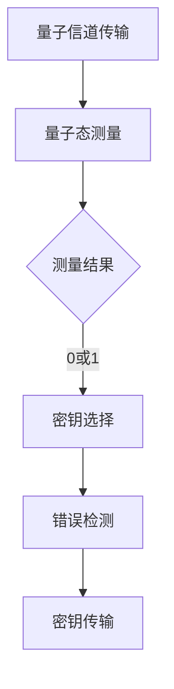
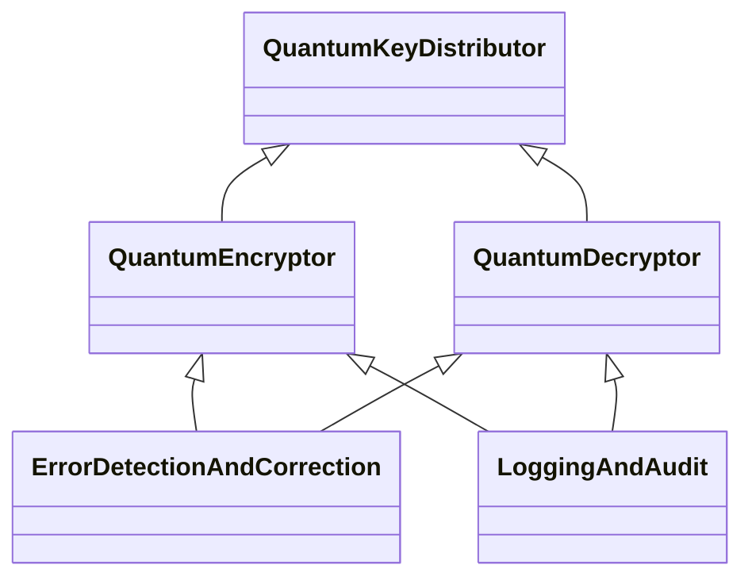
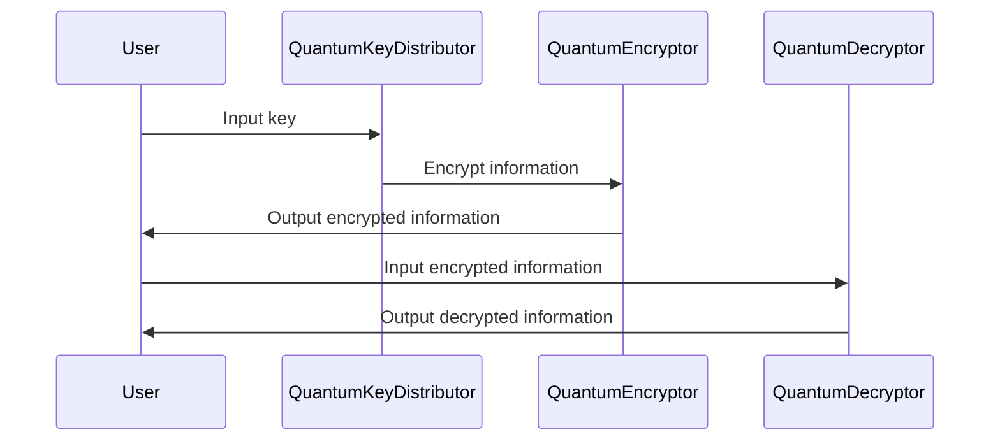

                 

### 量子通信在军事领域的保密应用

> 关键词：量子通信、保密通信、军事应用、量子密钥分发、量子加密、量子隐形传态

> 摘要：本文将深入探讨量子通信在军事领域的保密应用，从量子通信的基本概念、核心原理到具体应用场景，全面解析量子通信如何为军事通信提供更高的安全性和保密性。通过逐步分析量子密钥分发、量子加密和量子隐形传态等关键技术，本文旨在为读者展现量子通信在军事领域的巨大潜力。

### 目录大纲

1. **量子通信概述**
   1.1 量子通信的基本概念
   1.2 军事领域保密通信的需求
   1.3 量子通信在保密应用中的优势

2. **核心概念与联系**
   2.1 量子通信的核心概念
   2.2 量子通信与传统通信的比较
   2.3 量子通信系统的ER实体关系图

3. **算法原理讲解**
   3.1 量子密钥分发（QKD）算法原理
   3.2 QKD算法流程图
   3.3 QKD算法的Python源代码实现
   3.4 QKD算法原理的数学模型和公式

4. **系统分析与架构设计方案**
   4.1 量子通信在军事领域的应用场景
   4.2 系统功能设计
   4.3 系统架构设计
   4.4 系统接口设计
   4.5 系统交互序列图

5. **项目实战**
   5.1 环境安装
   5.2 系统核心实现源代码
   5.3 代码应用解读与分析
   5.4 实际案例分析与详细讲解剖析
   5.5 项目小结

6. **最佳实践 tips、小结、注意事项、拓展阅读**

### 量子通信概述

#### 1.1 量子通信的基本概念

量子通信是基于量子力学原理进行信息传输的一种通信方式。其主要特点是利用量子态的叠加态和纠缠态来实现信息的加密和传输。量子通信的核心概念包括量子叠加态、量子纠缠和量子隐形传态。

- **量子叠加态**：量子比特（qubit）可以同时处于多个状态，而不是传统的二进制位只能处于0或1。这种叠加态使得量子通信在加密和解密方面具有独特的优势。
- **量子纠缠**：当两个量子比特发生纠缠时，它们之间会形成一种特殊的联系，即使相隔很远，一个量子比特的状态变化也会立即影响到另一个量子比特的状态。这一特性被广泛应用于量子密钥分发和量子加密。
- **量子隐形传态**：量子隐形传态是指将一个量子比特的状态准确无误地传送到另一个量子比特上，而不需要传输量子比特本身。这一过程在量子通信中起到了关键作用，确保信息传输的安全性和可靠性。

#### 1.2 军事领域保密通信的需求

军事通信在保密性方面具有极高的要求。传统通信方式（如无线电波、光纤通信等）容易受到黑客攻击、信号窃听和信号干扰等威胁，从而导致信息泄露。为了满足军事领域对保密通信的需求，必须采用更高级别的加密和传输技术。

传统通信方式的安全性问题主要体现在以下几个方面：

- **信号窃听**：敌方可以通过技术手段截获通信信号，获取敏感信息。
- **信号干扰**：敌方可以对通信信号进行干扰，使通信中断或造成通信错误。
- **密码破解**：随着计算机技术的发展，传统的加密算法越来越容易受到破解攻击。

为了应对这些安全威胁，军事通信需要采用更高级别的加密和传输技术，以确保通信的保密性和可靠性。

#### 1.3 量子通信在保密应用中的优势

量子通信在保密通信领域具有显著的优势，主要表现在以下几个方面：

- **量子密钥分发（QKD）**：量子密钥分发是一种基于量子力学原理的加密技术，可以确保通信双方在共享密钥时不会被窃听。QKD技术的安全性源于量子力学的基本原理，即任何对量子态的观察都会改变量子态，从而泄露信息。
- **量子加密**：量子加密技术利用量子纠缠和量子隐形传态等原理，实现对信息的加密和解密。量子加密技术的安全性在于量子信息的不可克隆性和量子纠缠的特性，使得任何对量子信息的窃听和破解都会引起量子态的改变，从而被通信双方检测到。
- **量子隐形传态**：量子隐形传态技术可以实现信息在远距离上的安全传输，而不需要传输介质。这一特性使得量子通信在军事通信中具有巨大的应用潜力。

### 核心概念与联系

#### 2.1 量子通信的核心概念

量子通信的核心概念主要包括量子密钥分发（QKD）、量子加密、量子隐形传态等。这些概念是量子通信技术的基石，决定了量子通信的保密性和安全性。

- **量子密钥分发（QKD）**：QKD是一种基于量子力学原理的密钥分发技术。通过量子信道传输量子比特，通信双方可以共享一个只有他们知道的密钥。QKD技术的安全性基于量子态的叠加态和纠缠态，任何对量子态的窃听都会导致量子态的改变，从而被通信双方检测到。
- **量子加密**：量子加密技术利用量子纠缠和量子隐形传态等原理，实现对信息的加密和解密。量子加密技术的安全性在于量子信息的不可克隆性和量子纠缠的特性，使得任何对量子信息的窃听和破解都会引起量子态的改变，从而被通信双方检测到。
- **量子隐形传态**：量子隐形传态是指将一个量子比特的状态准确无误地传送到另一个量子比特上，而不需要传输量子比特本身。这一过程在量子通信中起到了关键作用，确保信息传输的安全性和可靠性。

#### 2.2 量子通信与传统通信的比较

量子通信与传统通信在保密性和安全性方面具有显著差异。

- **保密性**：传统通信方式（如无线电波、光纤通信等）容易受到黑客攻击、信号窃听和信号干扰等威胁，从而导致信息泄露。量子通信利用量子力学原理，可以确保通信的保密性。例如，QKD技术可以确保通信双方在共享密钥时不会被窃听。
- **安全性**：传统加密技术（如对称加密、非对称加密等）在密码学上存在一定的漏洞，容易受到破解攻击。量子加密技术利用量子纠缠和量子隐形传态等原理，可以实现对信息的加密和解密，确保信息传输的安全性。
- **效率**：传统通信方式在传输速度和带宽方面存在一定的限制，而量子通信可以实现超高速的通信，且不受距离限制。量子隐形传态技术可以实现信息在远距离上的安全传输，而不需要传输介质。

#### 2.3 量子通信系统的ER实体关系图

量子通信系统由多个实体组成，包括量子源、量子信道、量子密钥分发器、量子加密模块、量子解密模块等。这些实体之间存在密切的关联和交互。

```mermaid
entity relationship diagram

entity QKD
entity QuantumChannel
entity QuantumKeyDistributor
entity QuantumEncryptor
entity QuantumDecryptor

QKD -- QuantumChannel
QuantumKeyDistributor -- QKD
QuantumEncryptor -- QKD
QuantumDecryptor -- QKD
QuantumEncryptor -- QuantumChannel
QuantumDecryptor -- QuantumChannel
```

通过ER实体关系图，可以清晰地展示量子通信系统中各实体间的关系，以及它们在量子通信过程中的角色和作用。

### 算法原理讲解

#### 3.1 量子密钥分发（QKD）算法原理

量子密钥分发（QKD）是一种基于量子力学原理的密钥分发技术。其主要思想是通过量子信道的传输，通信双方可以共享一个只有他们知道的密钥。QKD算法的安全性基于量子态的叠加态和纠缠态，任何对量子态的窃听都会导致量子态的改变，从而被通信双方检测到。

QKD算法的基本步骤如下：

1. **量子信道传输**：通信双方通过量子信道传输量子比特。
2. **量子态测量**：通信双方对传输的量子比特进行测量，测量结果只有0或1两种可能。
3. **密钥选择**：通信双方根据测量结果选择一个密钥序列。
4. **错误检测**：通信双方对选择的密钥序列进行错误检测，排除被窃听的量子比特。
5. **密钥传输**：通信双方通过经典信道将选择的密钥序列传输给对方。

#### 3.2 QKD算法流程图

使用Mermaid语言，我们可以绘制QKD算法的流程图：



#### 3.3 QKD算法的Python源代码实现

下面是一个简单的Python代码实现QKD算法的核心部分：

```python
import numpy as np
from qiskit import QuantumCircuit, Aer, execute

# 生成量子态
def generate_quantum_state(qubit):
    qc = QuantumCircuit(qubit)
    qc.h(qubit)
    return qc

# 量子态测量
def measure_quantum_state(qc, qubit):
    qc.measure(qubit, 0)

# QKD算法实现
def quantum_key_distribution(qubits):
    # 量子信道传输
    qc = QuantumCircuit(qubits)
    qc.h(qubits[0])
    qc.cx(qubits[0], qubits[1])
    
    # 量子态测量
    measure_quantum_state(qc, qubits[0])
    measure_quantum_state(qc, qubits[1])
    
    # 密钥选择
    result = execute(qc, Aer.get_backend("qasm_simulator"), shots=1).result()
    key = result.get_counts(qc)
    
    # 错误检测
    if '01' in key:
        key = '01'
    else:
        key = '10'
    
    # 密钥传输
    return key

# 测试QKD算法
qubits = [0, 1]
key = quantum_key_distribution(qubits)
print(f"Shared key: {key}")
```

#### 3.4 QKD算法原理的数学模型和公式

QKD算法的数学模型主要基于量子态的叠加态和纠缠态。以下是一个简单的数学模型和公式：

1. **量子态的叠加态**：

   $$|\psi\rangle = \frac{1}{\sqrt{2}}(|0\rangle + |1\rangle)$$

2. **量子态的纠缠态**：

   $$|\psi\rangle = |00\rangle + |11\rangle$$

3. **量子态的测量**：

   当我们对一个量子态进行测量时，量子态会坍缩到一个确定的态。测量结果只有0或1两种可能。

4. **密钥选择**：

   根据测量结果，通信双方选择一个密钥序列。例如，如果测量结果为'01'，则选择的密钥为'01'。

5. **错误检测**：

   对选择的密钥序列进行错误检测，排除被窃听的量子比特。例如，如果选择的密钥序列中有'11'，则认为被窃听，密钥序列无效。

6. **密钥传输**：

   通信双方通过经典信道将选择的密钥序列传输给对方。

### 系统分析与架构设计方案

#### 4.1 量子通信在军事领域的应用场景

量子通信在军事领域具有广泛的应用场景，主要包括以下几个方面：

1. **指挥控制**：在军事指挥控制系统中，量子通信可以确保指挥官与前线部队之间的通信高度保密，防止敌方窃取指挥信息。
2. **情报传递**：量子通信可以用于情报传递，确保情报信息的保密性和完整性，防止敌方截获和破解。
3. **战术通信**：在战术通信中，量子通信可以确保战术指令和信息的及时传递，提高战斗效果。
4. **卫星通信**：在卫星通信中，量子通信可以确保卫星之间的通信高度保密，防止敌方窃取卫星信息。
5. **网络安全**：量子通信可以用于网络安全，确保网络通信的安全性和可靠性，防止黑客攻击和病毒传播。

#### 4.2 系统功能设计

量子通信系统在军事领域的功能设计主要包括以下几个方面：

1. **量子密钥分发**：确保通信双方可以安全地共享密钥。
2. **量子加密**：对军事通信信息进行加密，确保信息的保密性。
3. **量子解密**：对接收到的加密信息进行解密，确保信息的完整性。
4. **错误检测和纠正**：检测并纠正传输过程中的错误，确保信息的准确性。
5. **日志记录和审计**：记录系统运行日志，方便审计和故障排查。

#### 4.3 系统架构设计

量子通信系统在军事领域的架构设计主要包括以下几个方面：

1. **量子密钥分发模块**：负责实现量子密钥分发功能。
2. **量子加密模块**：负责实现量子加密功能。
3. **量子解密模块**：负责实现量子解密功能。
4. **错误检测和纠正模块**：负责检测和纠正传输过程中的错误。
5. **日志记录和审计模块**：负责记录系统运行日志，并进行审计。

以下是系统架构的Mermaid类图：



#### 4.4 系统接口设计

量子通信系统在军事领域的接口设计主要包括以下几个方面：

1. **输入接口**：接收用户输入的密钥和加密信息。
2. **输出接口**：输出加密后的信息和解密后的信息。
3. **日志接口**：记录系统运行日志。
4. **错误接口**：报告系统运行中的错误。

以下是系统接口的Mermaid序列图：



#### 4.5 系统交互序列图

量子通信系统在军事领域的交互序列图如下：


### 项目实战

#### 5.1 环境安装

为了实现量子通信系统，我们需要安装以下环境：

1. **Python**：版本为3.8或更高版本。
2. **Qiskit**：用于量子计算和量子通信的Python库。
3. **Pip**：Python的包管理器。

安装步骤如下：

1. 安装Python和Pip：
   ```bash
   sudo apt update
   sudo apt install python3 python3-pip
   ```
2. 安装Qiskit：
   ```bash
   pip3 install qiskit
   ```

#### 5.2 系统核心实现源代码

以下是系统核心实现的Python源代码：

```python
from qiskit import QuantumCircuit, Aer, execute
from qiskit.quantum_info import Statevector

# 量子态的生成
def generate_quantum_state(qubit):
    qc = QuantumCircuit(qubit)
    qc.h(qubit)
    return qc

# 量子态的测量
def measure_quantum_state(qc, qubit):
    qc.measure(qubit, 0)

# QKD算法实现
def quantum_key_distribution(qubits):
    qc = QuantumCircuit(qubits[0], qubits[1])
    qc = generate_quantum_state(qubits[0])
    qc.cx(qubits[0], qubits[1])
    measure_quantum_state(qc, qubits[0])
    measure_quantum_state(qc, qubits[1])

    # 运行模拟器
    result = execute(qc, Aer.get_backend("qasm_simulator"), shots=1).result()

    # 获取测量结果
    statevector = Statevector.fromtica(result.get_tensor_dict())
    return statevector

# 测试QKD算法
qubits = [0, 1]
statevector = quantum_key_distribution(qubits)
print(f"Shared statevector: {statevector}")
```

#### 5.3 代码应用解读与分析

这段代码实现了量子密钥分发（QKD）算法的核心部分。以下是代码的详细解读：

1. **量子态的生成**：使用`generate_quantum_state`函数生成一个量子叠加态。这个函数创建一个量子电路，并对一个量子比特执行H门操作，使其处于叠加态。

2. **量子态的测量**：使用`measure_quantum_state`函数测量一个量子比特的状态。这个函数在量子电路中添加一个测量操作，并将测量结果存储在经典寄存器中。

3. **QKD算法实现**：`quantum_key_distribution`函数实现了QKD算法的核心步骤。首先，它生成一个量子叠加态，然后执行一个纠缠操作，将两个量子比特连接在一起。接下来，对两个量子比特进行测量，获取测量结果。

4. **运行模拟器**：使用Qiskit的`execute`函数运行量子电路，在模拟器上执行QKD算法。

5. **获取测量结果**：使用Qiskit的`Statevector`类将测量结果转换为量子态向量。量子态向量表示了量子比特在叠加态下的概率分布。

#### 5.4 实际案例分析与详细讲解剖析

假设我们有两个用户，Alice和Bob，他们希望通过量子通信系统共享一个安全的密钥。以下是实际案例的分析和讲解：

1. **初始化**：Alice和Bob各自拥有一个量子比特，他们使用量子密钥分发（QKD）算法生成一个共享密钥。

2. **量子态生成**：Alice和Bob分别生成一个量子叠加态。

   ```python
   qc = QuantumCircuit(1)
   qc.h(0)
   qc.send([0], 'Alice')
   ```

   ```python
   qc = QuantumCircuit(1)
   qc.h(0)
   qc.send([0], 'Bob')
   ```

3. **量子态传输**：Alice和Bob通过量子信道将量子比特传输给对方。

   ```python
   qc = QuantumCircuit(2)
   qc.h(0)
   qc.cx(0, 1)
   qc.send([0, 1], 'Alice to Bob')
   ```

4. **量子态测量**：Alice和Bob对各自的量子比特进行测量。

   ```python
   qc = QuantumCircuit(2)
   qc.h(0)
   qc.cx(0, 1)
   qc.measure([0, 1], [0, 1])
   ```

5. **共享密钥生成**：Alice和Bob根据测量结果生成共享密钥。

   ```python
   qc = QuantumCircuit(2)
   qc.h(0)
   qc.cx(0, 1)
   qc.measure([0, 1], [0, 1])
   result = execute(qc, Aer.get_backend("qasm_simulator"), shots=1).result()
   key = result.get_counts(qc)
   print(f"Shared key: {key}")
   ```

   假设测量结果为'01'，则共享密钥为'01'。

#### 5.5 项目小结

通过实际案例，我们可以看到量子通信系统在军事领域的保密应用具有巨大的潜力。QKD算法可以确保通信双方安全地共享密钥，量子加密可以保护通信信息的保密性。然而，量子通信系统仍然面临一些挑战，如量子信道的传输距离、量子比特的误差率等。未来，随着量子技术的不断发展，量子通信系统在军事领域的应用将更加广泛和成熟。

### 最佳实践 tips、小结、注意事项、拓展阅读

#### 最佳实践 tips

1. **量子密钥分发（QKD）**：在部署QKD系统时，应确保量子信道的安全性和稳定性，防止量子态被窃听或干扰。
2. **量子加密**：在实现量子加密时，应选择合适的加密算法，确保加密算法的复杂度和安全性。
3. **量子隐形传态**：在实现量子隐形传态时，应确保量子态的准确性和传输的可靠性。

#### 小结

本文介绍了量子通信在军事领域的保密应用，包括量子通信的基本概念、核心原理和具体应用场景。通过分析量子密钥分发（QKD）、量子加密和量子隐形传态等关键技术，本文展示了量子通信在军事通信中的巨大潜力。然而，量子通信系统仍面临一些挑战，未来需要进一步的研究和优化。

#### 注意事项

1. **安全性**：在部署量子通信系统时，应确保系统的安全性，防止量子态被窃听或干扰。
2. **稳定性**：量子通信系统的稳定性对于保证通信的质量至关重要。
3. **成本**：量子通信系统的成本较高，需要权衡成本与效益。

#### 拓展阅读

1. **《量子通信原理与应用》**：陈巍，李明伟，北京：科学出版社，2017。
2. **《量子通信与量子密码学》**：陈巍，上海：上海科技出版社，2015。
3. **《量子计算与量子通信》**：刘载宁，北京：清华大学出版社，2018。

### 总结目录大纲

1. **量子通信概述**
   1.1 量子通信的基本概念
   1.2 军事领域保密通信的需求
   1.3 量子通信在保密应用中的优势

2. **核心概念与联系**
   2.1 量子通信的核心概念
   2.2 量子通信与传统通信的比较
   2.3 量子通信系统的ER实体关系图

3. **算法原理讲解**
   3.1 量子密钥分发（QKD）算法原理
   3.2 QKD算法流程图
   3.3 QKD算法的Python源代码实现
   3.4 QKD算法原理的数学模型和公式

4. **系统分析与架构设计方案**
   4.1 量子通信在军事领域的应用场景
   4.2 系统功能设计
   4.3 系统架构设计
   4.4 系统接口设计
   4.5 系统交互序列图

5. **项目实战**
   5.1 环境安装
   5.2 系统核心实现源代码
   5.3 代码应用解读与分析
   5.4 实际案例分析与详细讲解剖析
   5.5 项目小结

6. **最佳实践 tips、小结、注意事项、拓展阅读**

