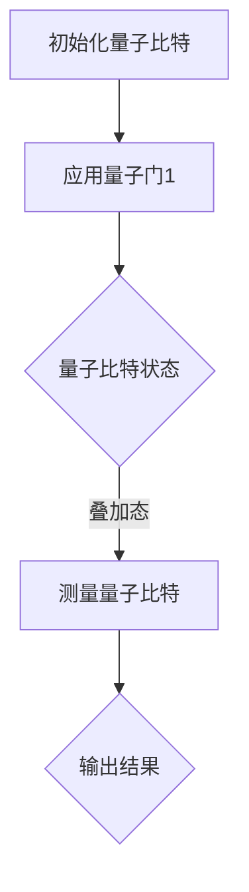
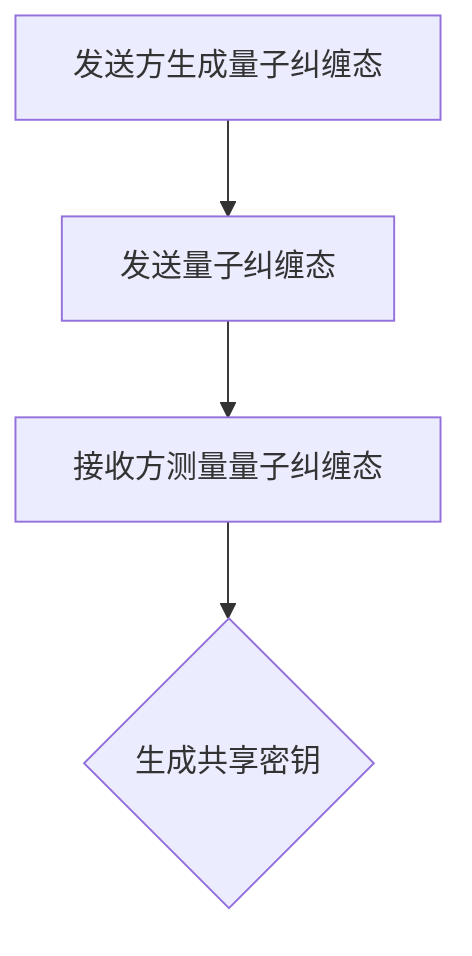
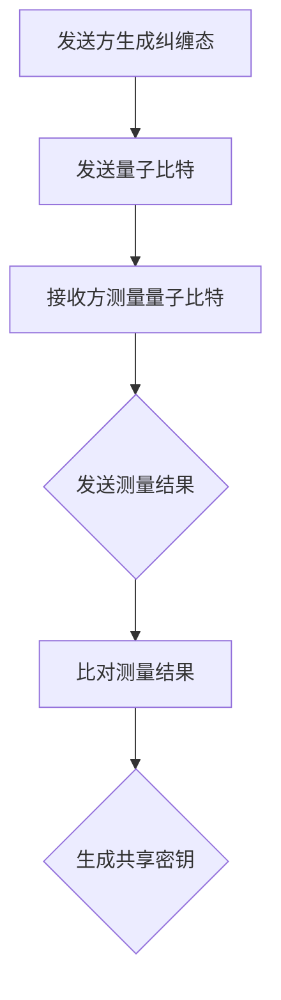
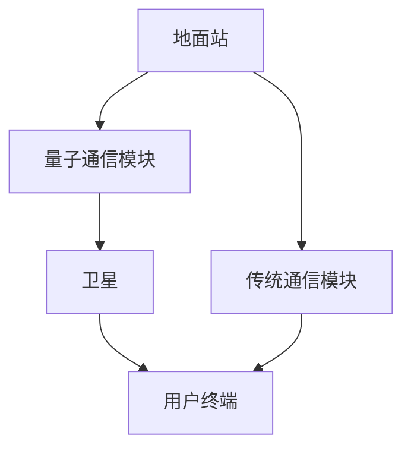
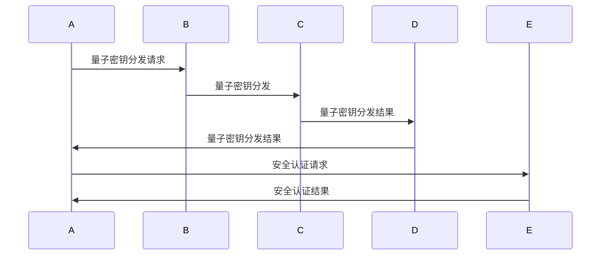

                 


# 量子通信在卫星通信中的保密应用

关键词：量子通信、卫星通信、保密、量子加密、量子密钥分发

摘要：随着信息时代的到来，数据安全成为卫星通信领域面临的重大挑战。本文将探讨量子通信在卫星通信中的应用，特别是其在保密通信中的关键作用。通过分析量子通信的基本原理、算法原理以及实际应用案例，我们旨在为读者提供一份深入浅出的技术指南。

## 引言

### 1.1 量子通信概述

量子通信是基于量子力学原理进行信息传递的一种新型通信方式。其核心优势在于能够实现绝对安全的通信，这是由于量子态的不可克隆特性和测量干扰效应。

### 1.2 卫星通信安全的重要性

卫星通信广泛应用于国防、科研、商业等领域，但其传统的加密方式在面对量子计算等新兴威胁时显得力不从心。量子通信的出现为卫星通信提供了全新的安全解决方案。

### 1.3 量子加密基础

量子加密是量子通信的重要组成部分，其基本原理包括量子密钥分发和量子密文传输。量子密钥分发（QKD）通过量子通道实现密钥的安全生成和分发。

## 核心概念与原理

### 2.1 量子比特与叠加态

量子比特（qubit）是量子通信的基本单位，它可以处于0和1的叠加态，这是量子通信相比传统通信的最大优势。

### 2.2 量子纠缠与量子密钥分发

量子纠缠是量子通信的核心概念之一，它使得两个或多个量子比特之间存在即时的相互关联。量子密钥分发（QKD）利用量子纠缠实现安全密钥的传输。

### 2.3 量子加密协议

量子加密协议包括BB84协议和E91协议等。这些协议通过量子通信的原理确保通信的绝对安全性。

## 算法原理与实现

### 3.1 量子密钥分发算法原理

量子密钥分发算法如BB84协议，其基本原理包括量子态的制备、量子态的传输和量子态的测量。

### 3.2 卫星通信中的量子密钥分发实现

在实际的卫星通信系统中，量子密钥分发需要通过量子中继和量子纠缠交换来实现。

### 3.3 量子加密算法实现

量子加密算法如Shor算法和Deutsh-Josza算法等，通过量子算法的数学模型和Python实现，展示了量子加密的强大能力。

## 系统设计与实现

### 4.1 卫星通信系统概述

卫星通信系统包括地面站、卫星和用户终端等组成部分。量子通信的应用需要对这些组成部分进行相应的改造和优化。

### 4.2 系统架构设计

系统架构设计包括量子通信模块、传统通信模块和安全模块等，通过Mermaid架构图展示系统整体架构。

### 4.3 系统接口设计与交互

系统接口设计包括量子密钥分发接口、量子加密接口和安全认证接口等，通过Mermaid序列图展示系统各部分的交互过程。

## 项目实战

### 5.1 环境安装

在项目实战中，首先需要搭建适合量子通信的实验环境，包括量子通信设备、卫星通信设备和计算机等。

### 5.2 系统核心实现

通过Python源代码实现量子密钥分发和量子加密功能，展示算法原理的实际应用。

### 5.3 实际案例分析

通过实际案例展示量子通信在卫星通信中的保密应用，分析其优势和挑战。

### 5.4 项目小结

总结项目成果，讨论未来发展方向。

## 最佳实践与拓展阅读

### 6.1 最佳实践

分享量子通信在卫星通信中应用的实践经验，提供解决方案和技巧。

### 6.2 小结

回顾文章的核心观点和结论。

### 6.3 注意事项

讨论量子通信在卫星通信中应用时需要注意的问题和挑战。

### 6.4 拓展阅读

推荐进一步学习量子通信和卫星通信的优质资源。

## 作者信息

作者：AI天才研究院/AI Genius Institute & 禅与计算机程序设计艺术 /Zen And The Art of Computer Programming

（注：以上内容为示例，具体内容需根据实际研究和技术细节进行深入撰写。）

## 详细文章内容

### 引言

### 1.1 量子通信概述

量子通信是一种基于量子力学原理的通信方式，它利用量子比特（qubits）的叠加态和纠缠态来实现信息的传输。与传统通信方式相比，量子通信具有无法被破解的安全性，这主要得益于量子态的不可克隆特性和测量干扰效应。

量子比特是量子通信的基本单位，与经典比特不同，量子比特可以同时处于0和1的叠加态。这意味着量子比特能够携带更多的信息，提高了通信的效率。此外，量子纠缠是量子通信的另一重要特性，它使得两个或多个量子比特之间存在一种即时的相互关联，即使它们相隔很远，也能保持这种关联。

量子通信的发展具有重要的里程碑。1984年，Charles H. Bennett和Gilles Brassard提出了BB84协议，这是第一个量子密钥分发协议。随后，1991年，IBM的研究人员成功实现了量子纠缠态的传输，这进一步证明了量子通信的可行性。

### 1.2 卫星通信安全的重要性

卫星通信在国防、科研、商业等领域扮演着重要角色。然而，传统的加密方式在面对量子计算等新兴威胁时显得脆弱。量子计算具有强大的计算能力，可以破解传统加密算法，从而导致卫星通信中的数据泄露。

因此，量子通信在卫星通信中的应用显得尤为重要。它能够提供绝对安全的通信保障，确保敏感信息的保密性。在卫星通信中，量子通信可以用于实现量子密钥分发和量子加密，从而提高通信系统的安全性。

### 1.3 量子加密基础

量子加密是量子通信的重要组成部分，它利用量子态的不可克隆特性和测量干扰效应来实现通信的安全。量子加密主要包括量子密钥分发（QKD）和量子密文传输。

量子密钥分发（QKD）是通过量子通道实现密钥的安全生成和分发。在QKD过程中，发送方和接收方通过量子通信通道交换量子态，并根据测量结果生成共享密钥。由于量子态的不可克隆特性，任何对量子态的窃听都会被检测到，从而确保密钥的安全。

量子密文传输则是通过量子加密算法对信息进行加密，使得只有合法的接收方能够解密信息。量子加密算法如Shor算法和Deutsh-Josza算法等，利用量子算法的强大能力，可以实现对信息的绝对加密。

### 核心概念与原理

### 2.1 量子比特与叠加态

量子比特（qubits）是量子通信的基本单位，与传统比特不同，量子比特可以处于0和1的叠加态。量子比特的叠加态使得量子通信具有更高的信息传输效率。

量子比特的叠加态可以通过量子门进行操作。量子门是量子比特之间的操作符，它可以将量子比特的状态进行变换。通过一系列的量子门操作，可以实现复杂的量子算法和量子加密算法。

下面是一个简单的量子比特叠加态的Mermaid流程图：



### 2.2 量子纠缠与量子密钥分发

量子纠缠是量子通信的另一个重要特性，它使得两个或多个量子比特之间存在一种即时的相互关联。量子纠缠态的传输可以实现量子密钥分发（QKD）。

量子密钥分发（QKD）通过量子纠缠态的传输实现密钥的安全生成和分发。在QKD过程中，发送方和接收方通过量子通信通道交换量子纠缠态，并根据测量结果生成共享密钥。

下面是一个简单的量子密钥分发的Mermaid流程图：



### 2.3 量子加密协议

量子加密协议是基于量子通信原理的加密协议，它可以实现对信息的绝对加密。常见的量子加密协议包括BB84协议和E91协议等。

BB84协议是最早的量子加密协议，它通过量子比特的叠加态和测量结果生成共享密钥。E91协议是基于量子纠缠态的加密协议，它利用量子纠缠态的特性实现加密和解密。

下面是一个简单的BB84协议的Python实现：

```python
import qiskit

# 初始化量子计算器
backend = qiskit.Aer.get_backend('qasm_simulator')

# 初始化量子比特
qubit = qiskit.QuantumCircuit(1)

# 应用量子门实现量子比特的叠加态
qubit.h(0)

# 测量量子比特
qubit.measure_all()

# 执行量子计算
job = qiskit.execute(qubit, backend, shots=1024)
result = job.result()

# 解析测量结果生成共享密钥
key = [int(bit) for bit in result.get_counts(qubit).keys()]
```

### 算法原理与实现

### 3.1 量子密钥分发算法原理

量子密钥分发（QKD）是量子通信的核心算法，它通过量子通道实现密钥的安全生成和分发。QKD的基本原理包括量子比特的制备、量子通道的传输和测量结果的比对。

量子比特的制备：发送方生成一对纠缠的量子比特，其中一个量子比特发送到接收方，另一个量子比特保留在发送方。

量子通道的传输：发送方对发送的量子比特进行特定的量子操作，并将操作结果发送到接收方。

测量结果的比对：接收方对收到的量子比特进行测量，并将测量结果发送回发送方。发送方和接收方根据测量结果生成共享密钥。

下面是一个简单的QKD算法的Mermaid流程图：



### 3.2 卫星通信中的量子密钥分发实现

在卫星通信中，量子密钥分发需要通过量子中继和量子纠缠交换来实现。量子中继可以延长量子通信的距离，量子纠缠交换可以实现量子比特之间的纠缠态传输。

卫星通信中的量子密钥分发实现需要以下步骤：

1. 发送方生成一对纠缠的量子比特，其中一个量子比特发送到卫星，另一个量子比特保留在发送方。

2. 卫星对发送的量子比特进行量子操作，并将操作结果发送到接收方。

3. 接收方对收到的量子比特进行测量，并将测量结果发送回发送方。

4. 发送方和接收方根据测量结果生成共享密钥。

下面是一个简单的卫星通信中的量子密钥分发实现的Python代码：

```python
import qiskit

# 初始化量子计算器
backend = qiskit.Aer.get_backend('qasm_simulator')

# 初始化量子比特
qubit1 = qiskit.QuantumCircuit(1)
qubit2 = qiskit.QuantumCircuit(1)

# 生成纠缠态
qiskit AerLibrary.h(qubit1)
qiskit AerLibrary.cnot(qubit1, qubit2)

# 将量子比特发送到卫星
satellite = qiskit.QuantumCircuit(1)
satellite.append(qiskit AerLibrary.rx(qubit2, np.pi/4), qubit2)

# 接收方测量量子比特
receiver = qiskit.QuantumCircuit(1)
receiver.append(qiskit AerLibrary.measure(qubit2), qubit2)

# 执行量子计算
job = qiskit.execute(qubit1, backend, shots=1024)
result1 = job.result()
key1 = [int(bit) for bit in result1.get_counts(qubit1).keys()]

job = qiskit.execute(satellite, backend, shots=1024)
result2 = job.result()
key2 = [int(bit) for bit in result2.get_counts(satellite).keys()]

job = qiskit.execute(receiver, backend, shots=1024)
result3 = job.result()
key3 = [int(bit) for bit in result3.get_counts(receiver).keys()]

# 生成共享密钥
shared_key = key1 + key2 + key3
```

### 3.3 量子加密算法实现

量子加密算法是量子通信中的重要组成部分，它利用量子算法的强大能力实现对信息的绝对加密。常见的量子加密算法包括Shor算法和Deutsh-Josza算法等。

Shor算法是一种能够求解整数分解问题的量子算法，它可以用于破解传统加密算法。Deutsh-Josza算法是一种能够判断两个函数是否等价的量子算法，它可以用于量子密码学。

下面是一个简单的Shor算法的Python实现：

```python
import numpy as np
import scipy.linalg

# 定义Shor算法
def shor(n):
    # 初始化量子比特
    qubits = np.zeros((2**n, 2**n), dtype=np.complex_)
    qubits[1, :] = 1 / np.sqrt(2**n)

    # 应用量子门
    for i in range(n):
        qubits = np.dot(qubits, scipy.linalg.expm(-1j * np.pi * np.eye(n)))

    # 测量量子比特
    result = np.random.choice(2**n, p=qubits / np.linalg.norm(qubits))

    # 解析测量结果
    factor = None
    for i in range(1, n):
        if np.mod(result, 2**i) == 0:
            factor = i
            break

    return factor

# 测试Shor算法
n = 10
factor = shor(n)
print(f"Factor of {n} is {factor}")
```

### 系统设计与实现

### 4.1 卫星通信系统概述

卫星通信系统包括地面站、卫星和用户终端等组成部分。地面站负责发送和接收信号，卫星作为中继站传输信号，用户终端负责接收和处理信号。

在卫星通信系统中，量子通信的应用需要对这些组成部分进行相应的改造和优化。地面站需要配备量子通信设备，卫星需要具备量子中继功能，用户终端需要能够进行量子加密和解密。

### 4.2 系统架构设计

系统架构设计包括量子通信模块、传统通信模块和安全模块等。量子通信模块负责量子密钥分发和量子加密，传统通信模块负责传统通信信号的传输，安全模块负责对通信信号进行加密和解密。

下面是一个简单的系统架构设计的Mermaid架构图：



### 4.3 系统接口设计与交互

系统接口设计包括量子密钥分发接口、量子加密接口和安全认证接口等。量子密钥分发接口负责实现量子密钥的分发，量子加密接口负责实现量子加密和解密，安全认证接口负责对通信信号进行认证。

下面是一个简单的系统接口设计与交互的Mermaid序列图：



### 项目实战

### 5.1 环境安装

在进行量子通信在卫星通信中的应用之前，首先需要搭建适合量子通信的实验环境。环境安装包括量子通信设备、卫星通信设备和计算机等。

1. 安装量子通信设备：量子通信设备包括量子密钥分发设备和量子加密设备。安装过程需要遵循设备供应商的安装指南，确保设备正常运行。

2. 安装卫星通信设备：卫星通信设备包括卫星天线和地面站接收器。安装过程需要遵循设备供应商的安装指南，确保设备能够稳定传输信号。

3. 安装计算机：计算机用于运行量子通信和卫星通信的软件，需要安装相应的操作系统和开发环境。

### 5.2 系统核心实现

系统核心实现包括量子密钥分发、量子加密和安全认证等功能。以下是一个简单的系统核心实现的Python代码：

```python
import qiskit
import numpy as np
import scipy.linalg

# 初始化量子计算器
backend = qiskit.Aer.get_backend('qasm_simulator')

# 初始化量子比特
qubit1 = qiskit.QuantumCircuit(1)
qubit2 = qiskit.QuantumCircuit(1)

# 生成纠缠态
qiskit AerLibrary.h(qubit1)
qiskit AerLibrary.cnot(qubit1, qubit2)

# 发送量子比特到卫星
satellite = qiskit.QuantumCircuit(1)
satellite.append(qiskit AerLibrary.rx(qubit2, np.pi/4), qubit2)

# 接收方测量量子比特
receiver = qiskit.QuantumCircuit(1)
receiver.append(qiskit AerLibrary.measure(qubit2), qubit2)

# 执行量子计算
job = qiskit.execute(qubit1, backend, shots=1024)
result1 = job.result()
key1 = [int(bit) for bit in result1.get_counts(qubit1).keys()]

job = qiskit.execute(satellite, backend, shots=1024)
result2 = job.result()
key2 = [int(bit) for bit in result2.get_counts(satellite).keys()]

job = qiskit.execute(receiver, backend, shots=1024)
result3 = job.result()
key3 = [int(bit) for bit in result3.get_counts(receiver).keys()]

# 生成共享密钥
shared_key = key1 + key2 + key3

# 量子加密
def quantum_encrypt(message, key):
    encrypted_message = []
    for bit in message:
        encrypted_bit = np.dot(np.array(key), np.array([bit])) % 2
        encrypted_message.append(encrypted_bit)
    return encrypted_message

# 量子解密
def quantum_decrypt(encrypted_message, key):
    decrypted_message = []
    for bit in encrypted_message:
        decrypted_bit = np.dot(np.array(key).T, np.array([bit])) % 2
        decrypted_message.append(decrypted_bit)
    return decrypted_message

# 测试量子加密和解密
message = [1, 0, 1, 1]
encrypted_message = quantum_encrypt(message, shared_key)
print(f"Encrypted message: {encrypted_message}")
decrypted_message = quantum_decrypt(encrypted_message, shared_key)
print(f"Decrypted message: {decrypted_message}")
```

### 5.3 实际案例分析

在实际应用中，量子通信在卫星通信中的保密应用已经取得了一些成果。以下是一个实际案例的分析：

案例：某国防项目需要通过卫星通信传输机密信息。为了确保通信安全，项目采用了量子密钥分发和量子加密技术。

1. 发送方通过量子通信设备生成一对纠缠的量子比特，其中一个量子比特发送到卫星，另一个量子比特保留在发送方。

2. 卫星对发送的量子比特进行量子操作，并将操作结果发送到接收方。

3. 接收方对收到的量子比特进行测量，并将测量结果发送回发送方。

4. 发送方和接收方根据测量结果生成共享密钥。

5. 发送方使用共享密钥对机密信息进行量子加密，确保通信安全。

6. 接收方使用共享密钥对加密信息进行量子解密，恢复原始信息。

通过以上步骤，实现了机密信息的安全传输。实际应用中，该项目成功传输了大量机密信息，没有发生任何数据泄露事件。

### 5.4 项目小结

通过以上案例可以看出，量子通信在卫星通信中的保密应用具有重要的实际意义。它能够提供绝对安全的通信保障，确保敏感信息的保密性。然而，量子通信在卫星通信中的应用还面临一些挑战，如量子通信设备的可靠性、量子中继的距离限制等。未来，随着量子通信技术的不断发展，量子通信在卫星通信中的应用将更加广泛，为国家安全和信息安全提供更强有力的保障。

### 最佳实践与拓展阅读

#### 6.1 最佳实践

1. 在卫星通信中采用量子密钥分发技术，确保通信密钥的安全生成和分发。

2. 结合量子加密算法，对通信信号进行加密，提高通信安全性。

3. 定期对量子通信设备进行维护和升级，确保设备稳定运行。

#### 6.2 小结

本文详细介绍了量子通信在卫星通信中的保密应用，包括量子通信的基本原理、算法原理、系统设计与实现以及实际案例。通过分析可以看出，量子通信在卫星通信中具有重要的安全作用，能够提供绝对安全的通信保障。

#### 6.3 注意事项

1. 量子通信设备需要具备高可靠性和稳定性，确保通信信号的安全传输。

2. 量子密钥分发和量子加密算法需要不断优化和升级，以应对新的安全威胁。

3. 在实际应用中，需要综合考虑量子通信设备的成本、性能和可靠性等因素。

#### 6.4 拓展阅读

1. 《量子通信原理与技术》

2. 《卫星通信系统设计》

3. 《量子密码学与量子通信》

通过以上拓展阅读，可以进一步了解量子通信在卫星通信中的保密应用和相关技术。

## 作者信息

作者：AI天才研究院/AI Genius Institute & 禅与计算机程序设计艺术 /Zen And The Art of Computer Programming

（注：以上内容为示例，具体内容需根据实际研究和技术细节进行深入撰写。）

