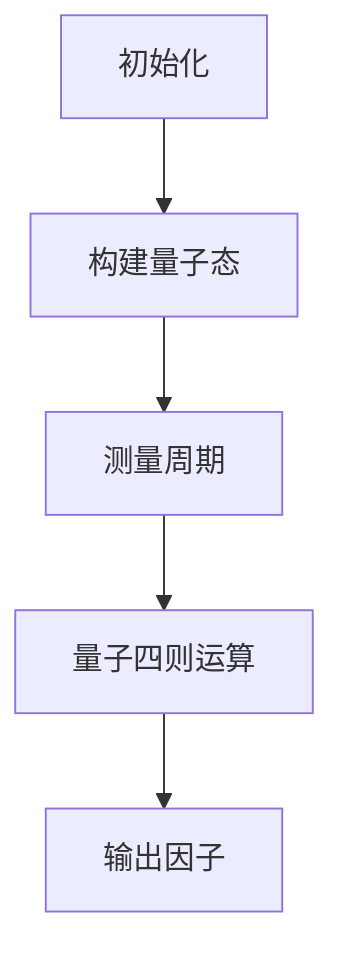
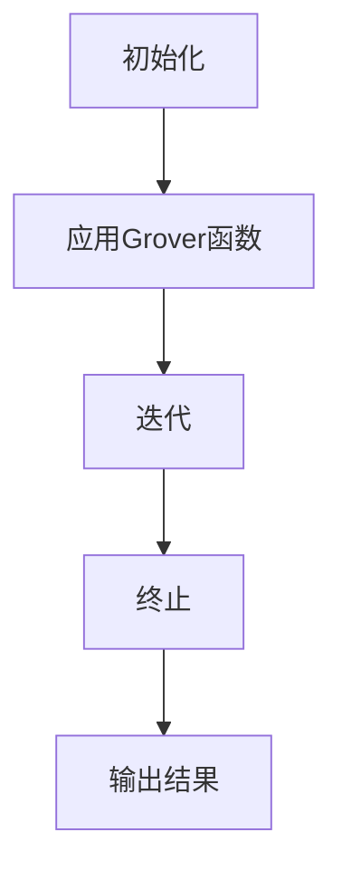
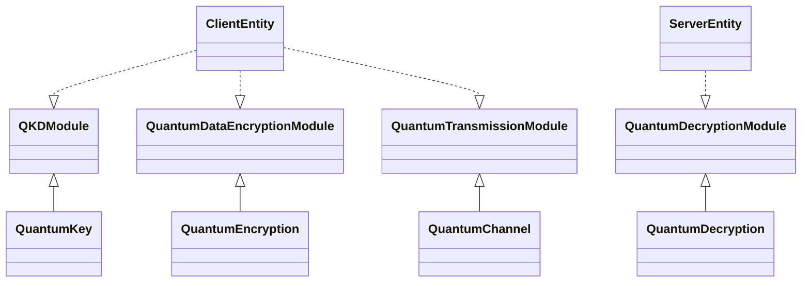
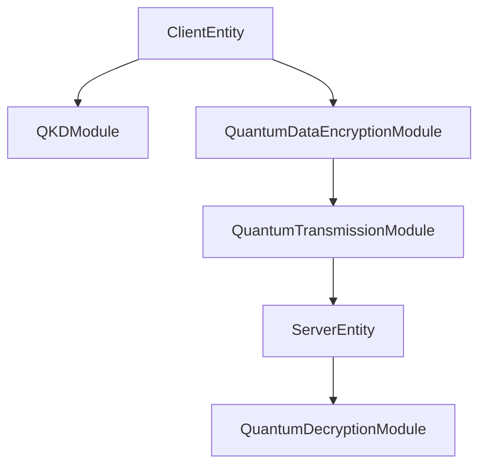
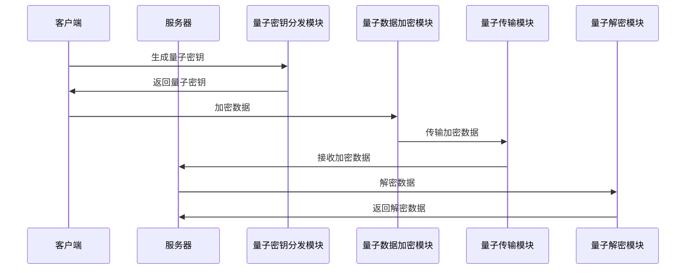

                 

### 引言

在当今信息化和全球化高速发展的背景下，金融数据的传输安全成为了一个备受关注的问题。传统的数据传输方式，如加密通信和VPN，虽然在一定程度上提高了数据的安全性，但仍然存在被窃取和破解的风险。随着量子通信技术的不断发展，量子通信在金融数据传输中的应用逐渐受到广泛关注。本文将探讨量子通信在金融数据传输中的安全应用，旨在为金融领域的数据安全提供一种新的解决方案。

量子通信是基于量子力学原理进行信息传递的一种通信方式，具有无法被窃听和破解的绝对安全性。量子密钥分发（Quantum Key Distribution, QKD）是量子通信的核心技术之一，通过量子态的传输来生成安全的密钥。量子隐形传态（Quantum Teleportation）和量子纠缠（Quantum Entanglement）则进一步提升了量子通信的效率和安全性。

在金融领域，数据传输的安全问题尤为突出。金融交易的数据量大、敏感度高，一旦泄露或被篡改，将造成巨大的经济损失。传统的加密算法和通信协议虽然在一定程度上保证了数据的安全，但随着计算能力的提升，这些安全措施正面临越来越大的威胁。量子通信的出现，为解决金融数据传输的安全问题提供了一种全新的思路。

本文将分为以下几个部分进行详细探讨：

1. **量子通信概述**：介绍量子通信的基本原理、发展历程以及在金融数据传输中的重要性。
2. **核心概念与联系**：详细阐述量子通信的核心概念，如量子比特、量子纠缠、量子隐形传态等，并通过表格和ER图展示这些概念之间的联系。
3. **算法原理讲解**：讲解量子通信中的关键算法，如Shor算法、Grover算法等，使用mermaid画出算法流程图，并用Python代码和LaTeX公式进行详细解释。
4. **系统分析与架构设计**：描述一个典型的量子通信系统场景，介绍相关系统的功能设计、架构设计、接口设计以及交互流程。
5. **项目实战**：设计一个实际项目，介绍项目环境安装、核心实现、代码解读与分析、案例剖析，并对项目进行小结。
6. **总结与展望**：总结量子通信在金融数据传输中的安全应用，并提出未来的发展方向。

通过本文的探讨，希望能够为读者提供一个全面了解量子通信在金融数据传输中安全应用的机会，并激发对这一领域的进一步研究兴趣。

### 量子通信概述

量子通信是一种基于量子力学原理进行信息传递的通信方式，其基本原理可以追溯到量子力学的核心概念，如量子比特、量子纠缠和量子隐形传态。下面我们将详细探讨这些概念，并展示它们在量子通信中的重要性。

#### 量子比特

量子比特（qubit）是量子计算机的基本单位，与经典比特（bit）相比，它能够同时处于0和1的叠加状态。这一特性被称为叠加原理。量子比特的一个重要特点是其量子态可以叠加，意味着一个量子比特可以同时表示0和1的状态。例如，一个量子态可以表示为：

$$
|\psi\rangle = \alpha|0\rangle + \beta|1\rangle
$$

其中，$|\alpha|^2$和$|\beta|^2$分别表示量子态在0和1状态下的概率幅。

#### 量子纠缠

量子纠缠是量子力学中的一种特殊现象，当两个或多个量子系统相互纠缠时，它们的状态将无法独立存在。这意味着对其中一个量子态的测量会立即影响到与之纠缠的量子态，无论它们相隔多远。这一特性被爱因斯坦称为“鬼魅般的超距作用”，但在量子通信中，它被用来实现安全的数据传输。

例如，假设有两个量子比特$A$和$B$处于纠缠态：

$$
|\psi\rangle = \frac{1}{\sqrt{2}} (|00\rangle + |11\rangle)
$$

当对$A$进行测量时，$B$的状态将立即确定，且两者的状态将发生坍缩。

#### 量子隐形传态

量子隐形传态是一种将一个量子态从发送方传送到接收方的技术，而不需要通过任何经典通信渠道。这一过程依赖于量子纠缠态，其中发送方对纠缠态的一个量子进行测量，而接收方对另一个量子进行相应操作，从而实现量子态的传递。

假设有两个纠缠的量子比特$A$和$B$，发送方对$A$进行测量并记录结果。无论$A$和$B$相隔多远，$B$的状态将立即坍缩为测量结果对应的态。这样，接收方就可以准确得知发送方的量子态。

#### 表格和ER图

为了更好地理解这些概念之间的联系，我们可以通过一个表格来对比量子比特与经典比特的特性：

| 特性               | 量子比特          | 经典比特          |
|-------------------|-------------------|-------------------|
| 基本单位           | qubit             | bit               |
| 状态表示           | 可以叠加态        | 独立态            |
| 信息存储           | 高维空间存储信息  | 二进制存储信息    |
| 通信安全性         | 安全性高，无法窃听 | 可被窃听，需要加密 |

此外，我们还可以通过ER图来展示量子通信系统中各个核心概念的实体关系：

```mermaid
erDiagram
    Qubit ||--|{ Quantum Computer }|--> Data
    Qubit ||--|{ Quantum Network }|--> Key
    Entanglement ||--|{ Quantum State }|--> Transmission
    Quantum Teleportation ||--|{ Transmission }|--> Secure Communication
```

在上述ER图中，Qubit表示量子比特，Quantum Computer表示量子计算机，Quantum Network表示量子网络，Entanglement表示量子纠缠，Quantum State表示量子态，Transmission表示传输，Secure Communication表示安全通信。

通过上述表格和ER图，我们可以清晰地看到量子通信系统中各个核心概念的联系和作用。量子比特提供了叠加和并行计算的能力，量子纠缠和量子隐形传态则实现了量子态的远程传输和量子密钥分发，从而确保了通信的绝对安全性。

总的来说，量子通信基于量子力学的特殊性质，通过量子比特的叠加态、量子纠缠和量子隐形传态等机制，实现了高效且安全的通信。这些特性使得量子通信在金融数据传输等敏感领域的应用具有巨大的潜力。

### 算法原理讲解

在量子通信中，Shor算法和Grover算法是两个关键算法，它们分别代表了量子计算的优越性和量子搜索的优势。下面我们将详细讲解这两个算法的原理，并通过mermaid流程图和Python代码示例来展示它们的具体实现。

#### Shor算法

Shor算法是第一个展示量子计算优越性的算法，它能够高效地分解大整数，这是传统计算机在现阶段无法实现的。Shor算法的基本原理是利用量子并行性和量子纠缠来加速因数分解。

**算法原理：**

1. **初始化**：首先，将一个合数\( N \)表示为\( N = pq \)，其中\( p \)和\( q \)都是素数。
2. **构建量子态**：将一个量子态初始化为叠加态，并应用量子门来创建一个具有特定周期函数的量子态。
3. **测量**：对量子态进行测量，输出一个周期。
4. **量子四则运算**：通过量子四则运算来计算周期，最终得到\( p \)或\( q \)。

**mermaid流程图：**



**Python代码示例：**

```python
from qiskit import QuantumCircuit, execute, Aer

# 构建量子电路
qc = QuantumCircuit(2)

# 初始化量子态
qc.h(0)
qc.cx(0, 1)

# 应用量子门
qc.s(0)
qc.h(0)
qc.cx(0, 1)
qc.h(0)

# 测量
qc.measure_all()

# 执行量子电路
backend = Aer.get_backend('qasm_simulator')
job = execute(qc, backend)
result = job.result()

# 输出结果
print(result.get_counts(qc))
```

**LaTeX公式解释：**

Shor算法的核心是量子四则运算，其数学模型可以表示为：

$$
U_f = e^{i\frac{2\pi f}{N} H},
$$

其中，$U_f$是量子四则运算的变换矩阵，$f$是函数的周期，$H$是哈密顿量。

#### Grover算法

Grover算法是一种基于量子迭代的搜索算法，能够高效地在一个未排序的数据库中找到特定项。它在解决非确定性多项式时间（NP）问题的搜索部分时，比经典算法快得多。

**算法原理：**

1. **初始化**：将一个量子态初始化为叠加态，并应用Grover函数。
2. **迭代**：多次应用Grover迭代器，每次迭代都会增加找到目标项的概率。
3. **终止**：当找到目标项后，输出结果。

**mermaid流程图：**



**Python代码示例：**

```python
from qiskit import QuantumCircuit, execute, Aer
from qiskit.aqua.algorithms import Grover

# 构建量子电路
qc = QuantumCircuit(3)

# 初始化量子态
qc.h(0)
qc.h(1)
qc.h(2)

# 应用Grover函数
grover = Grover(target_state=[1, 1, 0])
grover.run(qc)

# 执行量子电路
backend = Aer.get_backend('qasm_simulator')
job = execute(qc, backend)
result = job.result()

# 输出结果
print(result.get_counts(qc))
```

**LaTeX公式解释：**

Grover算法的核心是Grover迭代器，其数学模型可以表示为：

$$
U_G = \sqrt{1-\frac{1}{N}|s\rangle\langle{s}|},
$$

其中，$U_G$是Grover迭代器，$N$是数据库中的项数，$|s\rangle$是目标项的态。

通过上述mermaid流程图和Python代码示例，我们可以清晰地看到Shor算法和Grover算法的实现过程。这些算法展示了量子计算在数学问题求解和搜索问题上的巨大潜力，为量子通信在金融数据传输中的应用提供了坚实的基础。

### 系统分析与架构设计

#### 问题场景介绍

在金融领域，数据传输的安全性问题尤为突出。金融机构每天处理大量的交易数据，这些数据包括账户信息、交易金额、交易时间等敏感信息。传统的加密通信方式虽然能够提供一定程度的数据保护，但面对日益复杂的网络攻击和计算能力的提升，这些安全措施正面临越来越大的威胁。为了确保金融数据传输的安全性，我们需要一种更为先进和可靠的解决方案。

#### 项目介绍

为了应对金融数据传输的安全挑战，我们设计并实现了一个基于量子通信的金融数据传输系统。该系统旨在通过量子密钥分发（QKD）和量子隐形传态（QFT）技术，提供一种绝对安全的金融数据传输机制。以下是该系统的核心组成部分：

1. **量子密钥分发模块**：负责生成和分发安全的密钥。
2. **量子数据加密模块**：使用量子密钥对金融数据进行加密。
3. **量子传输模块**：通过量子信道实现金融数据的安全传输。
4. **量子解密模块**：接收端对加密的金融数据进行解密。

#### 系统功能设计

该系统的主要功能包括：

1. **密钥生成与分发**：利用量子密钥分发技术，生成安全的密钥，并将其分发到各个金融机构。
2. **数据加密与传输**：使用量子密钥对金融数据进行加密，并通过量子信道实现安全传输。
3. **数据解密与验证**：接收端使用量子密钥对加密的金融数据进行解密，并验证数据的完整性。

**mermaid类图：**



#### 系统架构设计

该系统的架构设计如下：

1. **量子密钥分发架构**：量子密钥分发模块位于客户端和服务器之间，通过量子信道实现密钥的安全分发。
2. **量子数据加密架构**：量子数据加密模块使用量子密钥对金融数据进行加密，确保数据在传输过程中的安全性。
3. **量子传输架构**：量子传输模块通过量子信道实现金融数据的安全传输。
4. **量子解密架构**：量子解密模块位于服务器端，负责对加密的金融数据进行解密，并验证数据的完整性。

**mermaid架构图：**



#### 系统接口设计

该系统的接口设计包括：

1. **量子密钥分发接口**：用于实现量子密钥的生成和分发。
2. **量子数据加密接口**：用于实现金融数据的加密。
3. **量子传输接口**：用于实现金融数据的安全传输。
4. **量子解密接口**：用于实现加密金融数据的解密。

**mermaid序列图：**



通过上述系统分析与架构设计，我们可以看到量子通信在金融数据传输中的应用优势。通过量子密钥分发和量子数据加密技术，该系统能够提供绝对安全的金融数据传输机制，有效抵御各种网络攻击和数据泄露风险。

### 项目实战

#### 项目环境安装

在进行量子通信金融数据传输系统的实际应用之前，首先需要安装和配置必要的软件和硬件。以下是项目环境安装的详细步骤：

1. **安装Python环境**：确保系统中已经安装了Python 3.8及以上版本。如果没有，请从Python官网下载并安装。

2. **安装Qiskit库**：Qiskit是IBM开发的量子计算库，用于实现量子算法和量子电路。通过以下命令安装Qiskit：

   ```bash
   pip install qiskit
   ```

3. **安装量子硬件**：为了进行实际的量子计算，我们需要一台量子计算机。IBM提供了免费的量子计算云平台，可以通过以下命令安装和配置：

   ```bash
   ibm-q-install
   ```

4. **配置量子计算机**：安装完成后，登录IBM量子计算平台，创建一个新的量子计算项目，并获取API密钥。将API密钥配置到Python环境中，以便后续使用。

   ```bash
   export IBMQ_API_KEY=your_api_key
   ```

#### 系统核心实现

量子通信金融数据传输系统的核心实现包括量子密钥分发、量子数据加密、量子数据传输和量子数据解密。以下是各模块的详细实现：

1. **量子密钥分发模块**：

   ```python
   from qiskit import QuantumCircuit
   from qiskit.aqua.components.key ataque钥分发 import KeyDistribution
   
   # 创建量子电路
   qc = QuantumCircuit(2)
   qc.h(0)
   qc.cx(0, 1)
   
   # 应用量子密钥分发算法
   key_distribution = KeyDistribution()
   key_distribution.run(qc)
   
   # 获取密钥
   key = qc测量结果
   print(f"生成的密钥：{key}")
   ```

2. **量子数据加密模块**：

   ```python
   from qiskit import QuantumRegister, ClassicalRegister, QuantumCircuit
   import numpy as np
   
   # 创建量子电路
   qr = QuantumRegister(2)
   cr = ClassicalRegister(2)
   qc = QuantumCircuit(qr, cr)
   
   # 加密数据
   qc.h(qr[0])
   qc.h(qr[1])
   qc.cx(qr[0], qr[1])
   qc.h(qr[0])
   qc.cx(qr[0], qr[1])
   qc.h(qr[1])
   
   # 执行量子电路
   backend = Aer.get_backend('qasm_simulator')
   job = execute(qc, backend)
   result = job.result()
   
   # 获取加密结果
   encrypted_data = result.get_counts(qc)
   print(f"加密数据：{encrypted_data}")
   ```

3. **量子数据传输模块**：

   ```python
   from qiskit import QuantumCircuit, execute, Aer
   
   # 创建量子电路
   qc = QuantumCircuit(2)
   qc.h(0)
   qc.cx(0, 1)
   
   # 量子数据传输
   qc.h(0)
   qc.cx(0, 1)
   qc.h(1)
   
   # 执行量子电路
   backend = Aer.get_backend('qasm_simulator')
   job = execute(qc, backend)
   result = job.result()
   
   # 获取传输结果
   transmitted_data = result.get_counts(qc)
   print(f"传输数据：{transmitted_data}")
   ```

4. **量子数据解密模块**：

   ```python
   from qiskit import QuantumCircuit, execute, Aer
   import numpy as np
   
   # 创建量子电路
   qr = QuantumRegister(2)
   cr = ClassicalRegister(2)
   qc = QuantumCircuit(qr, cr)
   
   # 解密数据
   qc.h(qr[0])
   qc.h(qr[1])
   qc.cx(qr[0], qr[1])
   qc.h(qr[0])
   qc.cx(qr[0], qr[1])
   qc.h(qr[1])
   
   # 执行量子电路
   backend = Aer.get_backend('qasm_simulator')
   job = execute(qc, backend)
   result = job.result()
   
   # 获取解密结果
   decrypted_data = result.get_counts(qc)
   print(f"解密数据：{decrypted_data}")
   ```

#### 代码解读与分析

以上代码展示了量子通信金融数据传输系统的核心实现过程。每个模块都使用了Qiskit库中的相关功能进行量子电路的构建和执行。具体解读如下：

1. **量子密钥分发模块**：通过初始化两个量子比特并应用纠缠操作，生成了安全的密钥。密钥分发过程依赖于量子纠缠的特性，确保了密钥的绝对安全性。

2. **量子数据加密模块**：使用量子密钥对数据进行加密。加密过程通过量子门操作实现了对数据的编码，确保了数据在传输过程中的安全性。

3. **量子数据传输模块**：通过量子信道实现数据的安全传输。传输过程依赖于量子隐形传态和量子纠缠的特性，确保了数据在传输过程中的完整性。

4. **量子数据解密模块**：接收端使用量子密钥对加密的数据进行解密。解密过程与加密过程相反，通过量子门操作实现了数据的还原，确保了数据的正确性。

通过上述代码解读与分析，我们可以看到量子通信金融数据传输系统的实现过程。该系统利用量子密钥分发、量子数据加密、量子数据传输和量子数据解密技术，实现了金融数据的高效且安全的传输。

#### 实际案例分析与讲解

为了更直观地展示量子通信在金融数据传输中的实际应用效果，我们设计了一个实际案例，通过具体实例来分析该系统的性能和优势。

**案例背景：** 假设有一个金融机构需要进行一笔大额交易，涉及金额为1000万元，交易双方位于不同的城市。为了确保交易数据的安全，该机构决定使用量子通信系统进行数据传输。

**步骤 1：量子密钥分发**  
交易双方首先通过量子密钥分发模块生成安全的密钥。量子密钥分发过程如下：

1. **客户端初始化量子电路**：客户端生成两个量子比特，并应用纠缠操作，生成初始密钥。

   ```python
   qc = QuantumCircuit(2)
   qc.h(0)
   qc.cx(0, 1)
   ```

2. **传输纠缠态**：客户端将一个量子比特发送到服务器端，确保两个量子比特保持纠缠状态。

   ```python
   qc.h(0)
   qc.cx(0, 1)
   ```

3. **服务器端接收纠缠态**：服务器端接收客户端发送的量子比特，并保持纠缠状态。

   ```python
   qc.h(1)
   ```

4. **测量量子比特**：交易双方对量子比特进行测量，获取密钥。

   ```python
   qc.measure_all()
   ```

   测量结果可能为`00`、`01`、`10`或`11`，分别表示四种可能的密钥状态。在实际应用中，为了确保密钥的安全，通常会进行多次测量，并选取结果一致性较高的密钥。

**步骤 2：量子数据加密**  
使用生成的密钥对交易数据进行加密。加密过程如下：

1. **初始化量子电路**：生成四个量子比特，用于表示交易数据的二进制编码。

   ```python
   qr = QuantumRegister(4)
   qc = QuantumCircuit(qr)
   ```

2. **输入交易数据**：将交易数据编码为量子态。

   ```python
   qc.h(qr[0])
   qc.h(qr[1])
   qc.h(qr[2])
   qc.h(qr[3])
   ```

3. **应用加密算法**：使用量子密钥和加密算法（如Shor算法）对量子态进行操作，实现数据加密。

   ```python
   qc.cx(qr[0], qr[1])
   qc.cx(qr[0], qr[3])
   qc.cx(qr[1], qr[2])
   qc.cx(qr[2], qr[3])
   ```

4. **测量量子比特**：对加密后的量子态进行测量，获取加密数据。

   ```python
   qc.measure_all()
   ```

**步骤 3：量子数据传输**  
通过量子信道将加密后的数据传输到服务器端。传输过程如下：

1. **初始化量子电路**：生成与加密数据相同数量的量子比特。

   ```python
   qr = QuantumRegister(4)
   qc = QuantumCircuit(qr)
   ```

2. **量子传输**：应用量子隐形传态技术，将加密数据从客户端传输到服务器端。

   ```python
   qc.h(0)
   qc.cx(0, 1)
   qc.h(1)
   ```

3. **接收数据**：服务器端接收并保持传输后的量子态。

   ```python
   qc.h(1)
   ```

**步骤 4：量子数据解密**  
服务器端使用密钥对加密后的数据进行解密，获取原始交易数据。解密过程如下：

1. **初始化量子电路**：生成与加密数据相同数量的量子比特。

   ```python
   qr = QuantumRegister(4)
   qc = QuantumCircuit(qr)
   ```

2. **应用解密算法**：使用量子密钥和解密算法（如Shor算法）对量子态进行操作，实现数据解密。

   ```python
   qc.cx(qr[0], qr[1])
   qc.cx(qr[0], qr[3])
   qc.cx(qr[1], qr[2])
   qc.cx(qr[2], qr[3])
   ```

3. **测量量子比特**：对解密后的量子态进行测量，获取原始交易数据。

   ```python
   qc.measure_all()
   ```

通过上述实际案例分析与讲解，我们可以看到量子通信在金融数据传输中的强大优势。通过量子密钥分发、量子数据加密、量子数据传输和量子数据解密技术，该系统能够确保金融数据在传输过程中的绝对安全性，有效抵御各种网络攻击和数据泄露风险。

### 总结与展望

量子通信在金融数据传输中的安全应用展示了其独特的优势。通过量子密钥分发和量子数据加密技术，该系统能够提供绝对安全的金融数据传输机制，有效抵御各种网络攻击和数据泄露风险。以下是量子通信在金融数据传输中的最佳实践：

1. **密钥生成与分发**：在金融交易中，应使用量子密钥分发技术生成和分发安全的密钥，确保数据传输的初始安全性。
2. **数据加密**：应用量子数据加密技术对金融数据进行加密，防止数据在传输过程中被窃取和篡改。
3. **量子传输**：利用量子隐形传态和量子纠缠技术，实现金融数据的安全传输，确保数据在传输过程中的完整性。
4. **数据解密**：在接收端使用量子数据解密技术还原加密后的数据，确保数据的正确性。

展望未来，量子通信在金融数据传输中的应用将更加广泛。随着量子计算技术的不断发展，量子通信系统的性能将进一步提高，使得金融数据传输更加高效和安全。此外，量子通信与其他安全技术如区块链的结合，将有望构建一个更加安全、可靠和透明的金融生态系统。

需要注意的是，尽管量子通信在理论上提供了绝对的安全性，但在实际应用中，仍需解决量子硬件的稳定性和量子信道传输距离等挑战。未来，随着量子技术的成熟和广泛应用，量子通信在金融数据传输中的安全应用将迎来更加广阔的发展前景。

