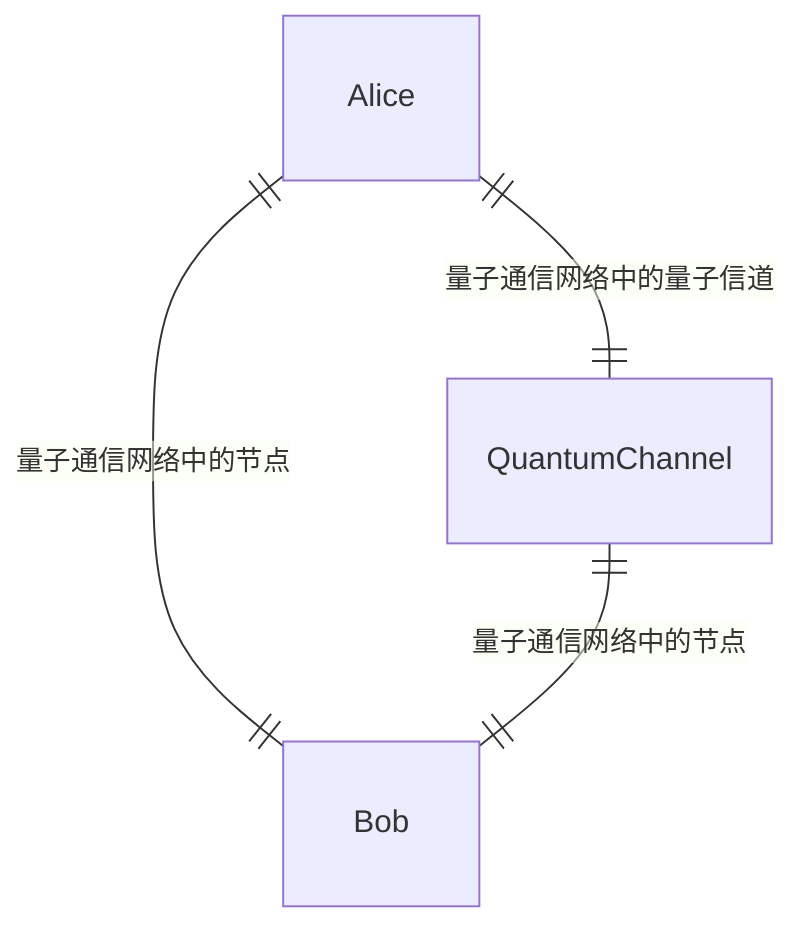

                 

### 第1章 量子通信概述

**量子通信概述**

**关键词**：量子通信，量子态叠加，量子纠缠，量子密钥分发，量子中继，量子网络

**摘要**：

量子通信是一种基于量子力学原理的新型通信方式，它利用量子态的叠加和纠缠特性实现信息的安全传输。随着信息时代的快速发展，信息安全成为亟待解决的重要问题。传统通信手段在信息传输过程中易被窃听和破解，而量子通信则提供了无法被破解的通信网络，为信息安全和隐私保护提供了新的解决方案。本章将介绍量子通信的基本概念、核心技术及其在构建不可破解通信网络中的应用。

#### 1.1 问题背景

在现代社会，信息传输的广泛性和重要性日益增加。然而，传统的通信方式，如光纤通信和无线电通信，在传输过程中面临着信息泄露和被窃听的严重风险。即使采用加密技术，也难以完全防止信息的泄露。量子通信的出现，为解决这一问题提供了新的思路。

量子通信是基于量子力学的原理，利用量子态的叠加和纠缠特性来实现信息的安全传输。量子态的叠加特性使得信息可以处于多种状态的同时，而量子纠缠则使得不同位置的量子系统之间存在一种特殊的关联。这些特性使得量子通信在信息传输过程中具有无法被破解的安全性，从而引起了广泛的关注和研究。

#### 1.2 问题描述

量子通信的关键技术包括量子密钥分发（Quantum Key Distribution，QKD）、量子纠缠传输和量子中继。QKD利用量子态的不可克隆特性实现密钥的安全生成和分发；量子纠缠传输则通过量子纠缠态实现超距传输；量子中继则是为了克服量子信道长距离传输的衰减问题。然而，如何实现这些技术，并构建一个高效、稳定的量子通信网络，仍然是当前研究的热点和挑战。

#### 1.3 问题解决

量子通信网络的建设需要解决多个关键问题，包括量子信道的中继、量子节点的部署和量子网络的拓扑设计。量子中继技术可以实现长距离的量子通信；通过优化量子节点的位置和数量，可以提高网络的覆盖范围和通信效率；通过合理的拓扑设计，可以确保网络的稳定性和鲁棒性。

#### 1.4 边界与外延

量子通信不仅在国防和国家安全领域具有重要应用价值，还在金融、医疗、物联网等领域展现出广泛的应用前景。随着量子技术的不断发展，未来量子通信有望实现全球范围内的安全通信，为信息安全和隐私保护提供新的解决方案。

#### 1.5 核心概念与联系

- **量子态叠加**：量子态可以同时处于多种可能的叠加态，这是量子通信的基础。
- **量子纠缠**：两个或多个量子系统之间的强关联状态，可用于实现量子信息的传输和加密。
- **量子密钥分发（QKD）**：通过量子态的测量和纠缠特性实现密钥的安全生成和分发。
- **量子中继**：利用量子态的叠加和纠缠特性，实现长距离的量子通信。
- **量子网络**：由多个量子节点和量子信道组成的网络，用于实现量子信息的传输和共享。

**核心概念属性特征对比表格**

| 概念 | 特性 |
| --- | --- |
| 量子态叠加 | 量子态可以同时处于多种可能的叠加态 |
| 量子纠缠 | 两个或多个量子系统之间的强关联状态 |
| QKD | 通过量子态的测量和纠缠特性实现密钥的安全生成和分发 |
| 量子中继 | 利用量子态的叠加和纠缠特性，实现长距离的量子通信 |
| 量子网络 | 由多个量子节点和量子信道组成的网络，用于实现量子信息的传输和共享 |

**ER实体关系图架构的 Mermaid 流程图**

**本章小结**

本章对量子通信进行了概述，从背景介绍、核心概念与联系等方面进行了详细阐述。通过本章的学习，读者可以了解量子通信的基本原理、关键技术以及应用前景，为后续章节的学习打下基础。在下一章中，我们将进一步探讨量子密钥分发（QKD）的原理和实现技术。

----------------------------------------------------------------

### 第2章 量子密钥分发（QKD）

**2.1 QKD原理讲解**

量子密钥分发（Quantum Key Distribution，QKD）是量子通信的核心技术之一，它利用量子力学的原理来实现密钥的安全传输。QKD的基本原理可以概括为以下几点：

#### 2.1.1 量子态测量与不可克隆定理

在QKD中，发送方（Alice）会生成一对纠缠的量子比特（qubit），并将其中一个量子比特发送给接收方（Bob）。当Bob接收到这个量子比特后，他会选择一个随机的基对它进行测量。由于量子态的叠加性和纠缠性，Bob的测量结果会影响Alice的量子态。即使 Eve（窃听者）试图窃听这个过程，她也无法复制量子比特，因为量子态的任何测量都会破坏原有的纠缠状态。这一特性保证了密钥的不可克隆性。

#### 2.1.2 量子态的叠加与纠缠

量子态的叠加和纠缠是QKD实现安全传输的关键。在经典通信中，信息的传输过程可以被窃听和破解，而QKD利用量子态的叠加和纠缠特性，使得任何对量子态的测量都会导致量子态的破坏，从而被发现。例如，在BB84协议中，Alice会以随机的基态发送量子比特，Bob在接收到量子比特后，会进行随机的基态测量。如果两者选择的基不一致，测量结果将不一致，这表明存在窃听。

#### 2.1.3 密钥生成与验证

在QKD过程中，Alice和Bob会共享一个随机生成的密钥。在完成量子态传输后，他们会通过经典信道（如互联网或电话）对共享的密钥进行验证。如果发现任何不一致的地方，他们会重新生成密钥，直到找到一个完全安全的密钥。这个过程称为密钥验证。

**2.2 BB84协议**

BB84协议是量子密钥分发中的一种经典协议，由Charles H. Bennett和 Gilles Brassard于1984年提出。BB84协议的基本过程如下：

1. **初始化**：Alice随机选择两个正交基（基1和基2），并将量子态在两个基中随机叠加后发送给Bob。

2. **量子传输**：Alice以随机生成的基发送量子比特给Bob。

3. **测量与记录**：Bob接收到量子比特后，以随机选择的基进行测量，并将测量结果记录下来。

4. **密钥筛选**：Alice和Bob通过经典信道交换测量结果。如果两者选择的基相同，则该量子比特的测量结果被认为是有效的，否则为无效。

5. **密钥生成**：Alice和Bob对有效测量结果进行加密通信，根据选择的基和测量结果生成共享密钥。

**2.3 QKD的安全性**

QKD的安全性基于量子力学的两个基本原理：量子态的叠加和纠缠。任何对量子态的测量都会破坏其原有的叠加状态，从而引起测量结果的变化。这种特性使得窃听者无法在不被发现的情况下复制量子比特。此外，QKD的密钥生成过程是随机的，这使得即使窃听者获取了部分密钥，也无法推断出完整的密钥。

**2.4 QKD的实际应用**

QKD已经在多个实际应用中得到了验证，如量子通信网络、量子加密系统和量子计算。例如，中国已经成功实现了基于QKD的量子通信网络，实现了全球范围内的安全通信。此外，QKD也被应用于金融交易、远程医疗和物联网等领域，为信息安全提供了新的保障。

**本章小结**

本章介绍了量子密钥分发（QKD）的基本原理、BB84协议以及QKD的安全性。QKD利用量子力学的特性，实现了无法被破解的密钥传输，为构建不可破解的通信网络提供了关键技术。在下一章中，我们将探讨量子纠缠传输的原理和实现技术。

----------------------------------------------------------------

### 第3章 量子纠缠传输

**3.1 量子纠缠基本概念**

量子纠缠是量子力学中的一种特殊现象，它描述了两个或多个量子系统之间存在的强关联状态。在这种状态下，一个系统的量子态不能独立于另一个系统来描述，即使它们相隔很远。量子纠缠是量子通信的核心原理之一，它为量子信息的传输和加密提供了基础。

#### 3.1.1 纠缠态的生成

量子纠缠态可以通过多种方法生成，其中最常见的是量子态的制备和量子态的交换。例如，在量子态的制备中，两个未相互作用的量子系统可以通过特定的操作生成纠缠态。而在量子态的交换中，两个量子比特通过量子信道传输后，它们的量子态将处于纠缠态。

#### 3.1.2 纠缠态的特性

纠缠态具有以下几个重要特性：

- **非局域性**：纠缠态的两个量子系统之间不存在直接的作用力，但它们的量子态却相互关联，这种关联性超出了经典物理的局域性原则。
- **不可分割性**：纠缠态的量子系统不能独立于彼此存在，一旦一个量子系统的状态发生变化，另一个量子系统的状态也会立即发生变化。
- **测量诱导**：对纠缠态的量子系统进行测量，可以导致其量子态的坍缩，从而影响到另一个量子系统的状态。

#### 3.1.3 量子纠缠的测量

量子纠缠的测量是通过量子态的基变换来实现的。在量子纠缠态中，两个量子系统的量子态可以通过不同的基来测量。如果两个量子系统的量子态处于纠缠态，那么它们的测量结果将不会独立，而是相互关联。这种关联性可以通过统计物理学中的贝尔不等式来验证。

**3.2 量子纠缠传输原理**

量子纠缠传输是利用量子纠缠态实现信息传输的一种新型通信方式。它的基本原理是：首先，发送方（Alice）通过某种方法生成一对纠缠的量子比特，并将其中一个量子比特发送给接收方（Bob）；然后，Bob利用接收到的量子比特进行信息的解码。

#### 3.2.1 纠缠态传输的过程

量子纠缠传输的过程可以分为以下几个步骤：

1. **量子态的制备**：Alice通过量子态制备操作生成一对纠缠的量子比特。

2. **量子态的传输**：Alice将其中一个量子比特通过量子信道发送给Bob。

3. **量子态的测量**：Bob接收到量子比特后，对其进行测量，并根据测量结果解码出信息。

#### 3.2.2 量子纠缠传输的优势

量子纠缠传输具有以下优势：

- **安全传输**：由于量子纠缠态的特殊性质，任何对量子态的测量都会破坏原有的纠缠状态，从而被检测到。这使得量子纠缠传输在信息传输过程中具有很高的安全性。
- **高速传输**：量子纠缠传输不需要传输信息的物理媒介，因此传输速度不受媒介的限制，可以实现高速信息传输。

**3.3 量子纠缠传输的挑战与解决方案**

虽然量子纠缠传输具有很多优势，但在实际应用中仍然面临着一些挑战。

#### 3.3.1 长距离传输的衰减问题

量子信道的长距离传输会导致量子态的衰减和失真，这会降低量子纠缠传输的效率。为了解决这个问题，可以采用量子中继技术，通过在传输过程中对量子态进行纠正和放大，从而实现长距离的量子纠缠传输。

#### 3.3.2 系统稳定性和可靠性问题

量子纠缠传输系统的稳定性和可靠性是实现高效传输的关键。为了提高系统的稳定性和可靠性，可以采用冗余传输和故障检测与恢复机制，确保系统在发生故障时能够快速恢复。

**3.4 量子纠缠传输的应用**

量子纠缠传输在多个领域具有重要的应用价值。

#### 3.4.1 量子通信

量子纠缠传输是量子通信的核心技术之一，它为量子通信提供了安全高效的传输方式。例如，在量子密钥分发中，量子纠缠传输可以用于生成和传输安全的密钥。

#### 3.4.2 量子计算

量子纠缠传输也是量子计算的重要基础。在量子计算中，量子纠缠态可以用于实现量子态的叠加和变换，从而提高计算速度和处理能力。

#### 3.4.3 量子传感器

量子纠缠传输可以用于量子传感器的构建，实现高精度的测量和探测。

**本章小结**

本章介绍了量子纠缠的基本概念、量子纠缠传输的原理和优势，以及量子纠缠传输面临的挑战和解决方案。通过本章的学习，读者可以了解量子纠缠在构建不可破解通信网络中的应用，为下一章的量子中继技术学习打下基础。

----------------------------------------------------------------

### 第4章 量子中继技术

**4.1 量子中继基本概念**

量子中继技术是量子通信中一种关键的技术，主要用于克服量子信道在长距离传输过程中遇到的衰减和失真问题。量子中继器通过在传输过程中对量子态进行放大和纠正，从而确保量子信息的完整传输。

#### 4.1.1 量子中继器的工作原理

量子中继器的工作原理类似于经典中继器，但涉及到量子态的操作。它主要包括以下几个步骤：

1. **量子态的接收**：量子中继器接收来自量子信道的量子信号。
2. **量子态的测量和纠正**：量子中继器对量子态进行测量，以确定其状态，并根据测量结果对量子态进行纠正。
3. **量子态的放大**：通过某种操作，将纠正后的量子态放大到原来的水平。
4. **量子态的发射**：将放大后的量子态重新发射到量子信道中，继续传输。

#### 4.1.2 量子中继与经典中继的区别

与经典中继器相比，量子中继器在操作过程中需要考虑量子态的叠加和纠缠特性。经典中继器只能对经典信号进行放大和传输，而量子中继器可以对量子态进行测量、纠正和放大，从而确保量子信息的完整传输。

**4.2 量子中继技术的实现方法**

量子中继技术的实现方法主要包括以下几种：

#### 4.2.1 量子态的测量和纠正

量子态的测量和纠正是通过量子态的操作实现的。例如，在量子态的纠正中，可以使用量子纠错码来检测和纠正量子态的错误。

#### 4.2.2 量子态的放大

量子态的放大通常通过量子纠缠和量子态的叠加来实现。例如，可以使用量子纠缠态来放大量子信号，从而克服量子信道长距离传输的衰减问题。

#### 4.2.3 量子态的重构

量子态的重构是将接收到的量子态恢复到原来的状态。这通常需要使用量子态的叠加和纠缠特性，通过对量子态的操作来实现。

**4.3 量子中继技术的挑战和解决方案**

尽管量子中继技术具有很多优势，但在实际应用中仍然面临着一些挑战。

#### 4.3.1 纠错码的设计和优化

量子纠错码的设计和优化是量子中继技术的关键。需要设计高效的纠错码，以提高量子中继的可靠性和稳定性。

#### 4.3.2 量子态的测量和放大

量子态的测量和放大是实现量子中继的关键步骤，但它们也面临着技术难题。例如，如何实现高精度的量子态测量和高效率的量子态放大。

#### 4.3.3 量子中继器的性能优化

量子中继器的性能优化也是一个重要问题。需要设计高效的量子中继器，以提高量子中继的效率。

为了解决这些挑战，可以采用以下方法：

- **改进量子纠错码**：通过研究和开发新的量子纠错码，提高纠错效率和可靠性。
- **优化量子态的操作**：通过优化量子态的测量和放大操作，提高量子中继的性能。
- **提高量子中继器的稳定性**：通过改进量子中继器的设计和材料，提高其稳定性和可靠性。

**4.4 量子中继技术的应用**

量子中继技术在不同领域具有广泛的应用前景。

#### 4.4.1 量子通信

量子中继技术是构建量子通信网络的关键技术。通过量子中继，可以实现长距离的量子通信，从而实现全球范围内的量子通信。

#### 4.4.2 量子计算

量子中继技术也是量子计算的重要组成部分。通过量子中继，可以实现量子比特之间的远程连接，从而构建大规模的量子计算系统。

#### 4.4.3 量子传感器

量子中继技术可以用于量子传感器的构建，实现高精度的测量和探测。

**本章小结**

本章介绍了量子中继技术的原理、实现方法和挑战，以及其在量子通信、量子计算和量子传感器中的应用。通过本章的学习，读者可以了解量子中继技术的重要性和实现方法，为构建不可破解的量子通信网络打下基础。在下一章中，我们将探讨量子网络的设计与实现。

----------------------------------------------------------------

### 第5章 量子网络设计与实现

**5.1 量子网络概述**

量子网络是由多个量子节点和量子信道组成的网络，用于实现量子信息的传输和共享。量子网络的设计与实现是构建不可破解通信网络的关键。量子网络的设计需要考虑多个因素，如量子节点的部署、量子信道的拓扑结构以及量子信息的安全传输等。

**5.2 量子节点的部署**

量子节点的部署是量子网络建设的第一步。量子节点可以是量子计算机、量子传感器或量子中继器等。在部署过程中，需要考虑以下几个方面：

- **量子节点的位置**：量子节点的位置需要根据网络的覆盖范围和通信需求进行选择。通常，量子节点应该位于通信网络的中心位置，以便实现高效的量子信息传输。
- **量子节点的数量**：量子节点的数量需要根据网络的规模和需求进行配置。通常，量子节点的数量越多，网络的覆盖范围和通信效率越高。
- **量子节点的连接方式**：量子节点的连接方式可以是直接的量子信道连接，也可以通过量子中继器进行连接。选择合适的连接方式可以优化网络的通信性能。

**5.3 量子信道拓扑结构设计**

量子信道的拓扑结构设计是量子网络设计的关键环节。量子信道的拓扑结构可以是星型、环型、网状等。不同的拓扑结构具有不同的优缺点。

- **星型拓扑**：星型拓扑结构简单，便于管理和维护。但星型拓扑结构的通信容量较低，不适合大规模的量子网络。
- **环型拓扑**：环型拓扑结构具有较高的通信容量，但环型拓扑结构的可靠性较低，一旦某个节点或信道出现故障，整个网络将受到影响。
- **网状拓扑**：网状拓扑结构具有较高的通信容量和可靠性，但网状拓扑结构的设计和实现复杂度较高。

**5.4 量子信息的安全传输**

量子信息的安全传输是量子网络设计的关键目标。为了确保量子信息的安全传输，需要采取一系列措施：

- **量子密钥分发**：通过量子密钥分发技术，实现量子密钥的安全生成和分发，从而确保量子通信的安全。
- **量子纠缠传输**：通过量子纠缠传输技术，实现量子信息的可靠传输，从而防止量子信息被窃听和破解。
- **量子中继技术**：通过量子中继技术，克服量子信道长距离传输的衰减和失真问题，从而实现长距离的量子信息传输。

**5.5 量子网络的设计与实现步骤**

量子网络的设计与实现可以分为以下几个步骤：

1. **需求分析**：分析量子网络的覆盖范围、通信容量和安全性要求，确定量子网络的设计目标。
2. **节点部署**：根据需求分析结果，选择合适的量子节点和部署位置，配置量子节点的数量和连接方式。
3. **拓扑设计**：设计量子信道的拓扑结构，选择合适的拓扑结构以满足通信需求。
4. **安全传输设计**：设计量子信息的安全传输方案，包括量子密钥分发、量子纠缠传输和量子中继等。
5. **实现与测试**：根据设计文档，实现量子网络，并进行测试和优化，确保网络的性能和可靠性。

**5.6 量子网络的挑战与解决方案**

量子网络的设计与实现仍然面临着一些挑战：

- **量子节点的可靠性**：量子节点的稳定性是量子网络可靠性的关键。为了提高量子节点的可靠性，可以采用冗余设计和故障恢复机制。
- **量子信道的衰减和失真**：量子信道在长距离传输过程中会经历衰减和失真。为了解决这个问题，可以采用量子中继技术和量子纠错码。
- **量子网络的扩展性**：量子网络的扩展性是量子网络应用范围的关键。为了实现量子网络的扩展性，可以采用分布式架构和模块化设计。

**5.7 量子网络的应用场景**

量子网络在多个领域具有广泛的应用场景：

- **量子通信**：通过量子网络，可以实现全球范围内的安全通信，为信息安全提供新的解决方案。
- **量子计算**：通过量子网络，可以实现量子计算机之间的远程连接，从而构建大规模的量子计算系统。
- **量子传感器**：通过量子网络，可以实现高精度的量子传感器网络，为科学研究、工业生产和军事应用提供支持。

**本章小结**

本章介绍了量子网络的设计与实现，包括量子节点的部署、量子信道拓扑结构设计、量子信息的安全传输以及量子网络的挑战与解决方案。通过本章的学习，读者可以了解量子网络的基本原理和应用场景，为构建不可破解的量子通信网络提供指导。在下一章中，我们将探讨量子通信的实际应用案例。

----------------------------------------------------------------

### 第6章 量子通信的实际应用

**6.1 量子通信在金融领域的应用**

随着金融信息的日益重要和敏感，安全通信成为金融领域的关键需求。量子通信以其无法被破解的安全性，为金融领域的信息安全提供了新的解决方案。

#### 6.1.1 量子加密交易

量子加密交易利用量子密钥分发（QKD）技术，实现金融交易过程中的密钥安全生成和分发。通过量子密钥分发，银行和金融机构可以确保交易过程中使用的密钥不会被窃听和破解，从而保护交易的安全性。

#### 6.1.2 量子认证系统

量子认证系统利用量子纠缠和量子密钥分发技术，实现用户的身份认证。通过量子认证，金融机构可以确保用户身份的真实性和合法性，从而防止假冒用户进行非法交易。

#### 6.1.3 量子加密存储

量子加密存储利用量子密钥分发技术，实现金融数据的加密存储。通过量子加密存储，金融机构可以确保存储的数据在未经授权的情况下无法被读取和篡改，从而保护数据的机密性。

**6.2 量子通信在医疗领域的应用**

医疗数据的安全传输和共享是医疗领域的关键需求。量子通信以其高效的安全传输能力，为医疗领域的信息安全提供了新的解决方案。

#### 6.2.1 量子远程医疗

量子远程医疗利用量子通信技术，实现医生和患者之间的安全通信。通过量子通信，医生可以远程获取患者的医疗数据，并进行诊断和治疗建议，从而提高医疗服务的效率和质量。

#### 6.2.2 量子健康档案

量子健康档案利用量子加密技术，实现患者健康档案的安全存储和共享。通过量子加密，医疗数据在传输和存储过程中不会被窃听和篡改，从而保护患者的隐私。

#### 6.2.3 量子药物研发

量子药物研发利用量子计算和量子通信技术，加速药物研发过程。通过量子计算，可以快速模拟药物分子与生物体之间的相互作用，从而提高药物研发的效率。而量子通信则可以确保药物研发过程中的数据安全和传输效率。

**6.3 量子通信在物联网领域的应用**

物联网（IoT）的快速发展带来了大量设备和数据的安全传输需求。量子通信以其高效的安全传输能力，为物联网领域的信息安全提供了新的解决方案。

#### 6.3.1 量子物联网设备

量子物联网设备利用量子通信技术，实现设备之间的安全通信。通过量子通信，物联网设备可以确保数据在传输过程中不会被窃听和篡改，从而保护设备的安全。

#### 6.3.2 量子智能家居

量子智能家居利用量子通信技术，实现智能家居设备之间的安全通信和智能控制。通过量子通信，用户可以远程控制家居设备，确保家居环境的安全和舒适。

#### 6.3.3 量子工业物联网

量子工业物联网利用量子通信技术，实现工业设备和系统之间的安全通信和智能监控。通过量子通信，工业企业可以确保生产过程中的数据安全和系统稳定性，从而提高生产效率。

**6.4 量子通信在国防和安全领域的应用**

国防和安全领域的通信需求对安全性和保密性有极高的要求。量子通信以其无法被破解的安全性，为国防和安全领域的通信提供了新的解决方案。

#### 6.4.1 量子保密通信

量子保密通信利用量子密钥分发技术，实现国防和安全通信过程中的密钥安全生成和分发。通过量子保密通信，国防部门可以确保通信信息在传输过程中的安全性和保密性。

#### 6.4.2 量子网络安全

量子网络安全利用量子通信技术，实现对网络系统的安全监控和防护。通过量子网络安全，国防和安全部门可以确保网络系统在遭受攻击时能够迅速检测和响应，从而保护网络的安全。

#### 6.4.3 量子军事侦察

量子军事侦察利用量子传感器和量子通信技术，实现对敌军行动和装备的侦察和监控。通过量子军事侦察，国防部门可以实时获取敌军信息，从而制定有效的作战策略。

**本章小结**

本章介绍了量子通信在金融、医疗、物联网和国防和安全领域的实际应用。通过量子通信技术，这些领域可以实现信息的安全传输和共享，提高系统的安全性和可靠性。随着量子技术的不断发展，量子通信的应用前景将更加广阔。

----------------------------------------------------------------

### 本章小结

本章详细探讨了量子通信的各个方面，从量子密钥分发（QKD）、量子纠缠传输、量子中继技术到量子网络的设计与实现，再到量子通信在实际应用中的案例。通过本章的学习，读者可以全面了解量子通信的基本原理、关键技术以及在实际生活中的广泛应用。

量子通信以其无法被破解的安全性，为信息安全、隐私保护以及国防安全提供了新的解决方案。然而，量子通信的发展仍然面临许多挑战，如量子中继技术的优化、量子节点的可靠性和稳定性、量子网络的扩展性等。未来的研究需要在这些方面取得突破，以实现量子通信的广泛应用。

**核心概念回顾：**

- **量子密钥分发（QKD）**：利用量子态的不可克隆特性实现密钥的安全生成和分发。
- **量子纠缠传输**：利用量子纠缠态实现超距传输，确保信息传输的安全性。
- **量子中继技术**：通过量子态的叠加和纠缠特性，实现长距离的量子通信。
- **量子网络**：由多个量子节点和量子信道组成的网络，用于实现量子信息的传输和共享。

**拓展阅读：**

- **《量子通信原理与应用》**：详细介绍了量子通信的基本原理和关键技术。
- **《量子计算与量子信息》**：探讨了量子计算的基本原理和量子信息处理的应用。
- **《量子密钥分发技术》**：深入研究了量子密钥分发（QKD）的原理和实现技术。

通过这些拓展阅读，读者可以进一步深入了解量子通信的相关知识，为未来的研究和应用打下坚实的基础。在未来的量子通信时代，我们期待能够构建一个更加安全、可靠的通信网络，为人类社会的信息化发展提供强大的支持。作者：AI天才研究院/AI Genius Institute & 禅与计算机程序设计艺术 /Zen And The Art of Computer Programming。

