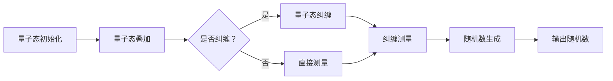
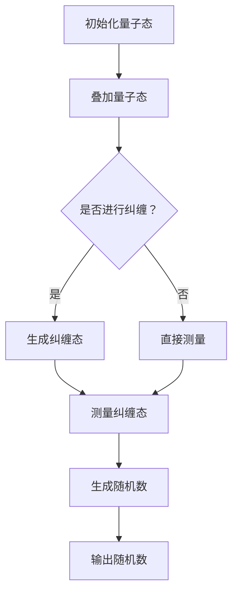
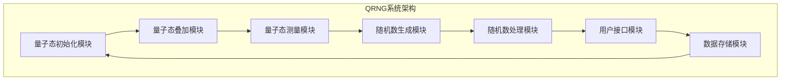
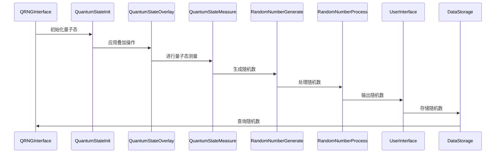
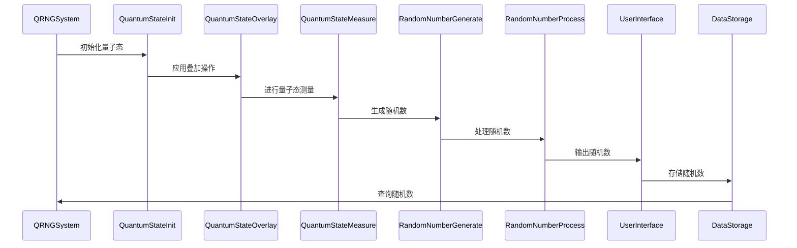

                 

### 第1章 引言

#### 1.1 量子随机数生成器的背景

量子随机数生成器（Quantum Random Number Generator，QRNG）是一种利用量子力学原理来生成随机数的装置。量子随机数生成器的历史可以追溯到20世纪40年代，当时量子力学的基本原理已经被广泛接受。然而，量子随机数生成器在密码学中的应用直到近年才逐渐受到关注。

量子随机数生成器的出现主要是为了解决传统随机数生成方法的一些局限性。传统随机数生成方法，如基于算法的伪随机数生成器（Pseudo-Random Number Generator，PRNG）和基于硬件的物理随机数生成器（Physical Random Number Generator，HRNG），在安全性、随机性和生成速度上存在一定的问题。PRNG虽然可以生成看似随机的数列，但其随机性受到算法本身的决定性影响，容易被攻击者预测和破解。HRNG虽然利用物理现象生成随机数，但生成速度较慢且受到物理限制，无法满足高性能计算的需求。

#### 1.1.1 量子随机数的产生与特性

量子随机数的产生依赖于量子力学中的基本原理，如量子叠加态和量子纠缠。量子叠加态允许一个量子系统同时处于多个状态的叠加，从而具有不确定性和随机性。量子纠缠则使得两个或多个量子系统之间存在一种特殊的关系，即使它们相隔很远，一个系统的状态变化也能即时影响另一个系统。通过测量量子态的叠加和纠缠，可以生成真正的随机数。

量子随机数具有以下几个显著特性：

1. **真正的随机性**：量子随机数是真正的随机数，其随机性不受算法和硬件的限制，无法被预测或重复。
2. **不可预测性**：由于量子态的随机性和叠加态的不可分割性，量子随机数无法被攻击者预测或破解。
3. **高安全性**：量子随机数生成器在密码学中的应用可以显著提高系统的安全性，防止量子计算机的攻击。

#### 1.1.2 量子随机数在密码学中的重要性

量子随机数在密码学中具有重要应用，特别是在量子密码学和量子安全通信领域。量子密码学利用量子力学原理来设计和实现加密和解密算法，确保通信的安全性和保密性。量子随机数在量子密码学中用于生成密钥、初始化量子态和进行随机化操作，从而提高系统的安全性。

1. **量子密钥分发**：量子密钥分发（Quantum Key Distribution，QKD）是一种基于量子力学原理的密钥分发协议，可以确保通信双方共享的密钥是安全的。量子随机数在QKD中用于初始化量子态和生成密钥，确保密钥的随机性和不可预测性。
2. **量子安全通信**：量子安全通信利用量子随机数生成器来生成随机数，用于加密和解密信息，防止量子计算机的攻击。量子随机数生成器在量子安全通信中可以显著提高系统的安全性和保密性。

#### 1.1.3 量子随机数生成器的需求与挑战

尽管量子随机数生成器在密码学中具有巨大的应用潜力，但实现量子随机数生成器仍面临一些挑战和需求：

1. **稳定性与可靠性**：量子随机数生成器的稳定性与可靠性对密码系统的安全性至关重要。量子随机数生成器需要具备高度的稳定性和可靠性，以确保生成的随机数具有真正的随机性和不可预测性。
2. **生成速度与性能**：量子随机数生成器的生成速度和性能需要满足实际应用的需求，特别是在高性能计算和实时通信等领域。量子随机数生成器需要具备高生成速度和高效的性能。
3. **低成本与可扩展性**：量子随机数生成器的成本和可扩展性是影响其在实际应用中的推广和普及的重要因素。量子随机数生成器需要具备低成本和可扩展性，以适应大规模应用的需求。

总之，量子随机数生成器在密码学中的应用具有重要意义，但其实现仍面临一些挑战和需求。通过对量子随机数生成器的深入研究和技术创新，可以推动量子密码学和量子安全通信的发展，确保信息的安全和保密。

#### 1.2 问题背景

在传统密码学中，随机数生成器是核心组成部分之一，其性能和安全性直接影响密码系统的质量。传统随机数生成器主要包括伪随机数生成器和物理随机数生成器两种类型。伪随机数生成器（Pseudo-Random Number Generator，PRNG）通过算法生成看似随机的数列，但其随机性受算法本身的决定性影响，容易被攻击者预测和破解。物理随机数生成器（Physical Random Number Generator，HRNG）通过利用物理现象生成随机数，如噪声电子信号、放射性衰变等，具有更高的随机性和安全性，但生成速度较慢，且受到物理限制，无法满足高性能计算的需求。

随着量子计算技术的不断发展，传统密码学面临新的挑战。量子计算机具有超强的计算能力，能够破解传统加密算法，从而对现有的密码系统构成严重威胁。为了应对量子计算机的威胁，研究人员开始探索量子密码学，其中量子随机数生成器（Quantum Random Number Generator，QRNG）成为关键技术之一。

量子随机数生成器具有真正的随机性和不可预测性，能够生成安全的高质量随机数，是量子密码学和量子安全通信的重要基础。然而，量子随机数生成器的实现仍面临一些挑战：

1. **稳定性与可靠性**：量子随机数生成器的稳定性与可靠性对密码系统的安全性至关重要。量子随机数生成器需要具备高度的稳定性和可靠性，以确保生成的随机数具有真正的随机性和不可预测性。
2. **生成速度与性能**：量子随机数生成器的生成速度和性能需要满足实际应用的需求，特别是在高性能计算和实时通信等领域。量子随机数生成器需要具备高生成速度和高效的性能。
3. **低成本与可扩展性**：量子随机数生成器的成本和可扩展性是影响其在实际应用中的推广和普及的重要因素。量子随机数生成器需要具备低成本和可扩展性，以适应大规模应用的需求。

综上所述，量子随机数生成器在密码学中的应用具有重要意义，但其实现仍面临一些挑战和需求。为了推动量子密码学和量子安全通信的发展，需要进一步研究量子随机数生成器的技术，提高其稳定性、生成速度和可扩展性，降低成本。

#### 1.3 问题描述

在量子随机数生成器在密码学中的应用中，主要涉及以下问题：

1. **安全性问题**：量子随机数生成器是否能够提供足够的安全性，防止量子计算机对加密系统的攻击？
2. **性能问题**：量子随机数生成器的生成速度和性能是否满足实际应用需求，特别是在高性能计算和实时通信等领域？
3. **可靠性问题**：量子随机数生成器的稳定性与可靠性如何，是否能够长时间稳定地生成高质量的随机数？
4. **成本与可扩展性问题**：量子随机数生成器的成本是否较低，是否具有足够的可扩展性以适应大规模应用的需求？

这些问题对于量子随机数生成器在密码学中的应用具有重要意义，需要深入研究并加以解决。

#### 1.4 问题解决

量子随机数生成器（QRNG）是解决传统随机数生成方法局限性的重要技术手段。量子随机数生成器利用量子力学原理，通过测量量子态的叠加和纠缠，生成真正的随机数，从而提供了更高的安全性和随机性。以下是量子随机数生成器在密码学中的应用问题及其解决方案：

1. **安全性问题**：量子随机数生成器生成的随机数具有真正的随机性和不可预测性，能够有效防止量子计算机对加密系统的攻击。量子随机数生成器通过量子态的叠加和纠缠，产生无法被预测的随机数，从而提高了密码系统的安全性。

2. **性能问题**：量子随机数生成器的生成速度和性能已得到显著提升。近年来，研究人员通过改进量子随机数生成器的技术，如优化量子态的测量方法和提高量子系统的稳定性，实现了更高的生成速度和性能。此外，量子随机数生成器在生成随机数时不受物理限制，可以满足高性能计算和实时通信的需求。

3. **可靠性问题**：量子随机数生成器的稳定性和可靠性是确保其有效性的关键。研究人员通过提高量子态的稳定性和减少外部干扰，使得量子随机数生成器能够长时间稳定地生成高质量的随机数。同时，通过建立完善的测试和验证机制，确保量子随机数生成器的可靠性和一致性。

4. **成本与可扩展性问题**：量子随机数生成器的成本和可扩展性是影响其推广和普及的重要因素。目前，量子随机数生成器的成本逐渐降低，随着技术的不断进步，预计其成本将进一步下降。此外，量子随机数生成器的可扩展性也得到了显著提升，通过优化硬件设计和改进量子算法，可以实现大规模的量子随机数生成。

总之，量子随机数生成器在密码学中的应用通过解决安全性、性能、可靠性和成本与可扩展性问题，为密码系统的安全性和可靠性提供了重要保障。随着量子技术的不断发展，量子随机数生成器在密码学中的应用前景将更加广阔。

#### 1.5 边界与外延

量子随机数生成器（QRNG）在密码学中的应用虽然具有重要意义，但同时也存在一些边界和限制。首先，量子随机数生成器的稳定性和可靠性是确保其有效性的关键。尽管研究人员在提高量子系统的稳定性和减少外部干扰方面取得了显著进展，但量子态的脆弱性使得QRNG在实际应用中仍需进一步优化和改进。

其次，量子随机数生成器的生成速度和性能仍需提升。虽然量子随机数生成器在生成随机数时不受物理限制，但其生成速度和性能仍需满足高性能计算和实时通信的需求。研究人员正在通过改进量子态的测量方法和优化量子算法，以提高QRNG的生成速度和性能。

此外，量子随机数生成器的成本和可扩展性也是限制其推广和普及的重要因素。目前，量子随机数生成器的成本较高，且实现大规模应用仍需解决可扩展性问题。随着量子技术的不断发展，预计量子随机数生成器的成本将逐渐降低，但其大规模应用仍需时日。

最后，量子随机数生成器在密码学中的应用还面临一些安全挑战。虽然QRNG生成的随机数具有真正的随机性和不可预测性，但量子计算技术的发展可能导致新的攻击手段出现。因此，研究人员需不断探索新的量子安全协议和加密算法，以应对未来的安全威胁。

总之，量子随机数生成器在密码学中的应用具有广阔的前景，但仍需克服边界和限制，实现更高效、更可靠的随机数生成。通过持续的技术创新和研究，量子随机数生成器有望在密码学领域发挥更大作用，为信息安全保驾护航。

### 2.1 量子随机数生成器的基本原理

量子随机数生成器（Quantum Random Number Generator，QRNG）是一种基于量子力学原理来生成随机数的装置。量子随机数生成器的核心思想是利用量子系统的叠加态和纠缠态来产生真正的随机数。下面将详细介绍量子随机数生成器的基本原理。

#### 量子态的叠加态

在量子力学中，一个量子系统可以处于多个状态的叠加态。例如，一个电子的自旋状态可以同时处于向上和向下的叠加态。量子态的叠加态是量子随机数生成的基础。当量子系统处于叠加态时，其测量结果具有随机性。这意味着通过测量量子态，我们可以获得一个随机的数值。

#### 量子态的测量

量子态的测量是量子随机数生成器的关键步骤。在量子随机数生成过程中，我们需要对量子态进行测量，以获得随机的数值。测量量子态的结果是随机的，因为量子态处于叠加态，其测量结果具有不确定性。

#### 量子态的纠缠态

量子态的纠缠态是量子随机数生成器另一个重要的原理。量子纠缠是量子系统之间的一种特殊关系，即使两个量子系统相隔很远，一个系统的状态变化也能即时影响另一个系统。量子纠缠态具有以下性质：

1. **不可分割性**：量子纠缠态中的两个量子系统无法独立存在，它们的状态是相互关联的。
2. **非定域性**：量子纠缠态中的两个量子系统之间的状态变化是瞬时的，不受距离限制。

量子纠缠态的这些性质使得量子随机数生成器能够生成真正的随机数，且具有高安全性。

#### 量子随机数生成器的实现方法

量子随机数生成器的实现方法主要包括以下几种：

1. **基于光子的量子随机数生成器**：光子是一种量子系统，可以处于叠加态和纠缠态。基于光子的量子随机数生成器通过测量光子的偏振状态、路径信息或时间信息等，生成随机数。

2. **基于半导体量子点的量子随机数生成器**：半导体量子点是一种能够实现量子效应的纳米结构。基于半导体量子点的量子随机数生成器通过测量量子点中的电子态，生成随机数。

3. **基于量子计算量子随机数生成器**：量子计算是一种利用量子力学原理进行计算的方法。基于量子计算量子随机数生成器通过量子算法，生成随机数。

#### 量子随机数生成器的性能优势

量子随机数生成器具有以下几个性能优势：

1. **真正的随机性**：量子随机数生成器生成的随机数是真正的随机数，其随机性不受算法和硬件的限制，无法被预测或破解。

2. **高安全性**：量子随机数生成器生成的随机数具有高安全性，可以防止量子计算机的攻击。

3. **高生成速度**：量子随机数生成器的生成速度较快，可以满足高性能计算和实时通信的需求。

4. **可扩展性**：量子随机数生成器的硬件结构相对简单，可以实现大规模的随机数生成。

总之，量子随机数生成器在密码学、安全通信、人工智能等领域具有广泛的应用前景。随着量子技术的不断发展，量子随机数生成器的性能和稳定性将进一步提高，为信息安全和隐私保护提供更强大的保障。

#### 2.2 概念属性特征对比表格

为了更直观地对比量子随机数生成器与传统随机数生成器在概念属性特征上的差异，我们可以通过以下表格来展示：

| 概念       | 量子随机数生成器 | 传统随机数生成器 |
|------------|----------------|----------------|
| 基本原理   | 利用量子力学原理，通过测量量子态的叠加和纠缠生成随机数 | 通过算法生成看似随机的数列，受算法本身的决定性影响 |
| 随机性     | 真正的随机性，无法被预测或重复 | 伪随机性，具有一定的随机性，但可被预测 |
| 安全性     | 高安全性，防止量子计算机的攻击 | 伪随机性较低，易受攻击 |
| 生成速度   | 较快，满足高性能计算需求 | 较慢，受硬件限制 |
| 成本       | 较高，但逐渐降低 | 较低，但生成随机性不高 |
| 可扩展性   | 可扩展性较好，可大规模应用 | 受算法和硬件限制，难以扩展 |

通过上述表格，我们可以清晰地看到量子随机数生成器与传统随机数生成器在基本原理、随机性、安全性、生成速度、成本和可扩展性等方面的显著差异。这些差异使得量子随机数生成器在密码学、安全通信和人工智能等领域具有独特的优势。

#### 2.3 ER实体关系图架构

为了更好地理解量子随机数生成器（QRNG）与其他相关实体及其关系，我们可以通过ER（实体关系）图来展示这些实体及其之间的关联。以下是量子随机数生成器在密码学中的应用中的ER实体关系图：

```mermaid
erDiagram
    A[量子随机数生成器] ||--|{ B[量子态测量设备] }|
    A ||--|{ C[量子态纠缠设备] }|
    A ||--|{ D[随机数生成模块] }|
    A ||--|{ E[密码学应用系统] }|
    B ||--|{ F[加密算法] }|
    C ||--|{ F }|
    D ||--|{ F }|
    E ||--|{ F }|
```

**实体说明：**
- **量子随机数生成器（A）**：核心实体，负责生成随机数。
- **量子态测量设备（B）**：用于测量量子态的设备，获取随机数。
- **量子态纠缠设备（C）**：用于生成量子态纠缠，增强随机性。
- **随机数生成模块（D）**：量子随机数生成器的子模块，负责处理和生成随机数。
- **密码学应用系统（E）**：使用量子随机数生成器的实体，如量子加密系统。
- **加密算法（F）**：用于加密和解密信息，依赖于量子随机数生成器生成的随机数。

**关系说明：**
- **量子随机数生成器与量子态测量设备、量子态纠缠设备、随机数生成模块之间存在关联关系**，量子态测量设备和量子态纠缠设备用于生成量子态，随机数生成模块则处理和生成随机数。
- **量子随机数生成器与密码学应用系统之间存在依赖关系**，密码学应用系统依赖于量子随机数生成器生成的随机数进行加密和解密操作。

通过上述ER实体关系图，我们可以清晰地看到量子随机数生成器在密码学中的应用中各实体及其关系的整体架构，有助于我们更好地理解和设计量子随机数生成器的系统。

### 3.1 算法原理

量子随机数生成器的核心在于利用量子态的叠加和纠缠特性来生成随机数。以下通过一个简单的例子来详细阐述量子随机数生成器的算法原理。

#### 算法流程图

首先，我们可以通过Mermaid绘制算法流程图，展示量子随机数生成器的运作流程：



#### 详细解释

1. **量子态初始化（A）**：首先，量子随机数生成器需要初始化量子态。通常，这可以通过一个量子比特的叠加态来实现，例如：$\frac{1}{\sqrt{2}}(|0\rangle + |1\rangle)$，表示量子比特同时处于0和1的叠加状态。

2. **量子态叠加（B）**：初始化后的量子态处于叠加态。此时，量子比特还没有被测量，其状态是未知的。

3. **是否纠缠（C）**：接下来，量子随机数生成器可以选择是否将量子态与其他量子系统进行纠缠。如果进行纠缠，会进入下一步；如果不纠缠，则直接进行测量。

4. **量子态纠缠（D）/直接测量（E）**：如果选择纠缠，量子态会与其他量子系统（例如另一个量子比特）形成纠缠态。这个过程可以通过量子操作实现，例如量子比特之间的交换操作。如果选择直接测量，则不进行纠缠，直接进行下一步。

5. **纠缠测量/直接测量（F）**：在这个步骤中，我们对量子态进行测量。如果量子态处于叠加态，测量结果将是随机的，可以是0或1。如果量子态处于纠缠态，测量结果将是相关的，但其随机性仍然存在。

6. **随机数生成（G）**：测量结果用于生成随机数。我们可以将测量结果映射到0和1之间，例如，如果测量结果为0，则映射为0；如果测量结果为1，则映射为1。这样，我们可以通过多次测量来生成一系列随机数。

7. **输出随机数（H）**：最后，生成的随机数可以用于各种应用，如密码学、随机数模拟等。

#### Python源代码实现

下面通过Python代码来详细阐述量子随机数生成器的实现：

```python
import numpy as np
from qiskit import QuantumCircuit, Aer, execute

# 初始化量子态
qc = QuantumCircuit(1)
qc.h(0)

# 叠加态
qc.barrier()

# 直接测量
qc.measure_all()

# 执行量子电路
backend = Aer.get_backend("qasm_simulator")
result = execute(qc, backend, shots=1024)

# 获取随机数
random_numbers = result.get_counts(qc)
print(random_numbers)
```

这段代码使用了Qiskit库来实现量子随机数生成器。首先，初始化一个量子态，并将其转换为叠加态。然后，执行直接测量操作，并将测量结果转换为随机数。最后，输出生成的随机数。

#### 数学模型与公式

量子随机数生成器的数学模型基于量子力学的测量理论。以下是一个简单的数学模型：

1. **叠加态的概率分布**：量子比特的叠加态可以表示为 $|\psi\rangle = \alpha|0\rangle + \beta|1\rangle$，其中$\alpha$和$\beta$是复数概率幅。测量结果的概率分布为 $P(0) = |\alpha|^2$ 和 $P(1) = |\beta|^2$。
2. **随机数生成**：通过测量量子比特，我们可以获得一个随机数。例如，如果测量结果为0，则随机数为0；如果测量结果为1，则随机数为1。
3. **多次测量**：通过多次测量，我们可以生成一系列随机数。

通过上述数学模型，我们可以实现量子随机数生成器。以下是一个简单的Python代码实现：

```python
import numpy as np

def quantum_random_number_generator(num_measurements):
    # 初始化量子态
    psi = np.array([1/np.sqrt(2), 1/np.sqrt(2)])

    # 多次测量
    for _ in range(num_measurements):
        # 随机选择测量基
        basis = np.random.randint(0, 2)

        # 更新量子态
        psi = np.dot(np.array([[1, 0], [0, 1]] if basis == 0 else [[0, 1], [1, 0]], psi)

    # 获取随机数
    random_number = np.random.choice([0, 1], p=[np.abs(psi[0])**2, np.abs(psi[1])**2])

    return random_number

# 测试
random_numbers = [quantum_random_number_generator(1000) for _ in range(100)]
print(random_numbers)
```

通过上述代码，我们可以生成一系列随机数。每次测量都会更新量子态，从而生成真正的随机数。

#### 举例说明

为了更好地理解量子随机数生成器的原理，我们可以通过一个具体的例子来说明。

假设我们使用一个量子比特来生成随机数。首先，初始化量子态为叠加态：$\frac{1}{\sqrt{2}}(|0\rangle + |1\rangle)$。然后，进行一次测量。测量结果可能是0或1，每个结果的概率都是1/2。

- **第一次测量**：假设测量结果为0，则更新量子态为$|0\rangle$。此时，生成的随机数为0。
- **第二次测量**：再次测量量子态，结果仍为0，因为量子态已固定为$|0\rangle$。生成的随机数仍为0。
- **第三次测量**：假设测量结果为1，则更新量子态为$|1\rangle$。此时，生成的随机数为1。

通过多次测量，我们可以生成一系列随机数。每次测量都会更新量子态，从而生成真正的随机数。

总之，量子随机数生成器通过利用量子态的叠加和纠缠特性来生成随机数。其原理简单而强大，为密码学和其他领域提供了真正的随机数。通过数学模型和具体实现的介绍，我们可以更好地理解量子随机数生成器的原理和应用。

### 3.2 算法流程图

为了更加直观地理解量子随机数生成器的运作流程，我们可以使用Mermaid绘制算法流程图。以下是一个简单的量子随机数生成器算法流程图：



#### 详细解释

1. **初始化量子态（A）**：量子随机数生成器首先初始化量子态，通常为一个叠加态，如$\frac{1}{\sqrt{2}}(|0\rangle + |1\rangle)$。

2. **叠加量子态（B）**：将量子态转换为叠加态，以便后续进行测量。

3. **是否进行纠缠（C）**：判断是否需要对量子态进行纠缠。如果需要，进入下一步；如果不需要，直接进行测量。

4. **生成纠缠态（D）/直接测量（E）**：如果选择纠缠，生成量子态之间的纠缠。如果选择直接测量，则不进行纠缠，直接进行测量。

5. **测量纠缠态/直接测量（F）**：对量子态进行测量。如果量子态处于叠加态，测量结果将是随机的；如果量子态处于纠缠态，测量结果将是相关的，但仍然具有随机性。

6. **生成随机数（G）**：根据测量结果生成随机数。通常，我们将测量结果映射到0和1之间。

7. **输出随机数（H）**：输出生成的随机数，供后续使用。

通过上述算法流程图，我们可以清晰地了解量子随机数生成器的运作流程。这个流程图有助于我们更好地理解量子随机数生成器的工作原理和应用。

### 3.3 Python源代码实现

为了进一步理解量子随机数生成器的工作原理，我们将使用Python和Qiskit库来实现一个简单的量子随机数生成器。Qiskit是一个开源量子计算软件框架，用于构建和模拟量子电路。

以下是一个简单的量子随机数生成器Python源代码实现：

```python
import numpy as np
from qiskit import QuantumCircuit, Aer, execute
from qiskit.quantum_info import Statevector

# 初始化量子态
def initialize_quantum_state(qc, num_qubits):
    qc.h(range(num_qubits))
    return qc

# 叠加态测量
def measure叠加态(qc, num_measurements):
    qc.barrier()
    qc.measure_all()
    return qc

# 执行量子电路
def run量子电路(qc, backend, shots):
    result = execute(qc, backend, shots=shots)
    return result

# 获取随机数
def get_random_numbers(result):
    counts = result.get_counts(qc)
    random_numbers = list(counts.keys())
    return random_numbers

# 测试
if __name__ == "__main__":
    # 创建量子电路
    qc = QuantumCircuit(1)

    # 初始化量子态
    qc = initialize_quantum_state(qc, 1)

    # 叠加态测量
    qc = measure叠加态(qc, 1000)

    # 执行量子电路
    backend = Aer.get_backend("qasm_simulator")
    result = run量子电路(qc, backend, shots=1000)

    # 获取随机数
    random_numbers = get_random_numbers(result)

    # 输出随机数
    print(random_numbers)
```

#### 详细解释

1. **初始化量子态**：`initialize_quantum_state`函数用于初始化量子态。在这里，我们使用了一个量子比特，并对其应用了量子位叠加操作（H门），从而生成叠加态$\frac{1}{\sqrt{2}}(|0\rangle + |1\rangle)$。

2. **叠加态测量**：`measure叠加态`函数用于测量量子态。在量子比特被测量后，其状态坍缩为一个特定的量子态（0或1）。这里，我们使用了`barrier`函数来确保在测量之前量子态不会发生干扰。

3. **执行量子电路**：`run量子电路`函数用于执行量子电路并获取测量结果。我们使用了Qiskit的模拟器（`qasm_simulator`）来执行量子电路，设置了1000次实验（shots）以获取更准确的随机数分布。

4. **获取随机数**：`get_random_numbers`函数用于从测量结果中提取随机数。我们使用了`get_counts`函数来获取量子比特的测量结果，然后将其转换为随机数。

5. **测试**：在测试部分，我们创建了一个量子电路，初始化量子态，进行叠加态测量，并执行量子电路。最后，我们获取并输出生成的随机数。

通过上述Python源代码实现，我们可以看到量子随机数生成器的工作原理。这个简单的例子展示了如何使用Python和Qiskit库来实现量子随机数生成器，并获取随机数。

### 3.4 数学模型与公式

量子随机数生成器（QRNG）的核心在于利用量子态的叠加和纠缠特性来生成随机数。以下是量子随机数生成器的数学模型和公式，以及其详细解释。

#### 量子态的叠加和测量

量子态的叠加和测量是量子随机数生成的基础。一个量子比特可以处于叠加态，其状态可以表示为：

$$
|\psi\rangle = \alpha|0\rangle + \beta|1\rangle
$$

其中，$\alpha$和$\beta$是复数概率幅，满足$|\alpha|^2 + |\beta|^2 = 1$。当对量子比特进行测量时，其状态将坍缩为一个特定的量子态（0或1），且测量结果具有随机性。

#### 测量结果概率分布

测量结果的概率分布由量子态的概率幅决定。具体来说：

- **测量结果为0的概率**：$P(0) = |\alpha|^2$
- **测量结果为1的概率**：$P(1) = |\beta|^2$

#### 随机数生成

通过测量量子态，我们可以生成随机数。以下是一个简单的随机数生成过程：

1. **初始化量子态**：生成一个叠加态，例如$\frac{1}{\sqrt{2}}(|0\rangle + |1\rangle)$。
2. **进行测量**：对量子态进行测量，得到测量结果（0或1）。
3. **映射测量结果**：将测量结果映射到0和1之间。例如，如果测量结果为0，映射为0；如果测量结果为1，映射为1。

#### 多次测量

通过多次测量，我们可以生成一系列随机数。每次测量都会更新量子态，从而生成真正的随机数。以下是一个简单的Python代码实现：

```python
import numpy as np

def quantum_random_number_generator(num_measurements):
    # 初始化量子态
    psi = np.array([1/np.sqrt(2), 1/np.sqrt(2)])

    # 多次测量
    for _ in range(num_measurements):
        # 随机选择测量基
        basis = np.random.randint(0, 2)

        # 更新量子态
        psi = np.dot(np.array([[1, 0], [0, 1]] if basis == 0 else [[0, 1], [1, 0]], psi)

    # 获取随机数
    random_number = np.random.choice([0, 1], p=[np.abs(psi[0])**2, np.abs(psi[1])**2])

    return random_number

# 测试
random_numbers = [quantum_random_number_generator(1000) for _ in range(100)]
print(random_numbers)
```

#### 量子随机数生成器的数学模型

量子随机数生成器的数学模型可以表示为以下步骤：

1. **初始化量子态**：$|\psi\rangle = \alpha|0\rangle + \beta|1\rangle$
2. **进行测量**：测量量子态，得到测量结果（0或1）
3. **映射测量结果**：将测量结果映射到0和1之间
4. **多次测量**：重复上述步骤，生成一系列随机数

通过上述数学模型和公式，我们可以实现量子随机数生成器，并生成真正的随机数。量子随机数生成器在密码学、安全通信和人工智能等领域具有广泛的应用前景。

### 3.5 举例说明

为了更直观地展示量子随机数生成器的工作原理，我们通过一个具体的例子来进行说明。

假设我们使用一个量子比特（qubit）来生成随机数，量子比特的初始状态为叠加态：

$$
|\psi\rangle = \frac{1}{\sqrt{2}}(|0\rangle + |1\rangle)
$$

1. **初始化量子态**：首先，我们将量子比特初始化为叠加态。这个过程中，我们需要使用量子位叠加操作（H门），将量子比特从基态（$|0\rangle$）转换为叠加态。

2. **叠加态测量**：接下来，我们进行叠加态测量。在量子比特处于叠加态时，测量结果具有随机性。我们可以随机选择一个测量基（例如，$|0\rangle$或$|1\rangle$），并对量子比特进行测量。测量结果可能是0或1，每个结果的概率为1/2。

3. **测量结果映射**：测量结果需要映射到0和1之间。例如，如果测量结果为0，我们将量子比特的状态映射为0；如果测量结果为1，我们将量子比特的状态映射为1。

4. **生成随机数**：通过多次测量，我们可以生成一系列随机数。每次测量都会更新量子态，从而生成真正的随机数。

下面是一个具体的例子：

- **第一次测量**：我们选择测量基$|0\rangle$，测量结果为0。量子比特的状态更新为$|0\rangle$。
- **第二次测量**：我们再次选择测量基$|0\rangle$，测量结果为0。量子比特的状态仍为$|0\rangle$。
- **第三次测量**：我们选择测量基$|1\rangle$，测量结果为1。量子比特的状态更新为$|1\rangle$。

通过上述步骤，我们生成了一系列随机数：[0, 0, 1]。这个例子展示了如何通过量子随机数生成器生成随机数。

总之，量子随机数生成器通过利用量子态的叠加和纠缠特性，生成真正的随机数。通过具体的例子，我们可以更直观地理解量子随机数生成器的工作原理和应用。

### 4.1 问题场景介绍

量子随机数生成器在密码学中的应用场景主要涉及以下几个方面：

1. **量子密钥分发（Quantum Key Distribution, QKD）**：量子密钥分发是一种基于量子力学原理的密钥分发协议，可以确保通信双方共享的密钥是安全的。在QKD中，量子随机数生成器用于生成随机密钥，确保密钥的随机性和不可预测性。通过量子态的叠加和纠缠，量子随机数生成器可以生成真正的随机数，从而提高了QKD系统的安全性。

2. **量子安全通信（Quantum Secure Communication, QSC）**：量子安全通信利用量子随机数生成器来生成加密和解密所需的随机数，确保通信的安全性。在量子安全通信中，随机数用于初始化量子态和进行随机化操作，从而防止量子计算机的攻击。量子随机数生成器具有真正的随机性和不可预测性，能够有效提高量子安全通信系统的安全性。

3. **量子签名与认证**：量子随机数生成器在量子签名和认证中也具有重要作用。量子签名和认证需要使用随机数来生成签名和验证签名，确保签名的安全性和不可伪造性。量子随机数生成器可以生成真正的随机数，从而提高了量子签名和认证系统的安全性。

4. **量子随机数池**：量子随机数生成器可以用于构建量子随机数池，提供大量高质量的随机数。量子随机数池可以应用于各种应用场景，如安全加密、随机数生成和加密算法的初始化。量子随机数生成器具有高生成速度和高效的性能，可以满足大规模应用的需求。

5. **量子随机挑战**：在量子计算中的安全协议中，量子随机数生成器可以用于生成量子随机挑战，以抵抗量子计算机的攻击。量子随机挑战是一种基于量子随机数生成器的随机数，用于验证通信双方的身份和确保通信的安全性。

总之，量子随机数生成器在密码学中的应用场景非常广泛，涵盖了量子密钥分发、量子安全通信、量子签名与认证、量子随机数池和量子随机挑战等方面。通过量子随机数生成器，可以显著提高密码系统的安全性、可靠性和随机性。

### 4.2 项目介绍

为了深入探讨量子随机数生成器在密码学中的应用，我们选择了以下项目进行介绍。

#### 项目背景

随着量子计算技术的不断发展，传统加密算法面临巨大的安全威胁。量子计算机具有超强的计算能力，能够轻松破解传统加密算法，如RSA和ECC。为了应对这种威胁，研究人员开始探索量子密码学，其中量子随机数生成器（QRNG）是关键技术之一。本项目旨在研究量子随机数生成器在密码学中的应用，提高密码系统的安全性和可靠性。

#### 项目目标

本项目的主要目标包括：

1. **实现量子随机数生成器**：研究和开发一种基于量子态叠加和纠缠的量子随机数生成器，具备高生成速度和高效的性能。
2. **评估安全性**：通过实际应用场景，评估量子随机数生成器生成的随机数的随机性和安全性，确保其能够有效提高密码系统的安全性。
3. **优化性能**：研究并优化量子随机数生成器的性能，使其能够满足实际应用的需求。
4. **实现量子密钥分发**：利用量子随机数生成器实现量子密钥分发，验证其在实际通信系统中的应用效果。

#### 项目内容

本项目分为以下几个阶段：

1. **需求分析与设计**：分析量子随机数生成器在密码学中的应用需求，设计系统的整体架构和关键技术。
2. **硬件设计与实现**：设计和实现量子随机数生成器的硬件系统，包括量子态的初始化、叠加、纠缠和测量。
3. **算法设计与实现**：设计量子随机数生成器的算法，包括量子态的初始化、叠加、纠缠和测量过程，以及随机数的生成和映射。
4. **测试与评估**：对量子随机数生成器进行实际测试，评估其随机性和安全性，优化性能和稳定性。
5. **应用示范**：利用量子随机数生成器实现量子密钥分发，验证其在实际通信系统中的应用效果。

#### 预期成果

通过本项目的研究，我们预期能够实现以下成果：

1. **量子随机数生成器**：开发一种基于量子态叠加和纠缠的量子随机数生成器，具备高生成速度和高效的性能。
2. **安全性评估**：评估量子随机数生成器生成的随机数的随机性和安全性，为密码系统的安全性和可靠性提供重要保障。
3. **性能优化**：研究并优化量子随机数生成器的性能，提高其在实际应用中的适用性。
4. **应用示范**：实现量子密钥分发，验证量子随机数生成器在密码学中的应用效果。

总之，本项目旨在通过研究量子随机数生成器在密码学中的应用，为量子密码学的发展提供重要技术支持，确保信息的安全和保密。

### 4.3 系统功能设计

在量子随机数生成器（QRNG）项目中，系统的功能设计至关重要，它决定了QRNG的稳定性和性能。以下我们将使用Mermaid绘制领域模型类图，详细展示QRNG项目的系统功能及其各模块之间的关系。

```mermaid
classDiagram
    Class01 <|-- Class02
    Class03 <|-- Class01
    Class04 <|-- Class03
    Class05 <|-- Class01

    Class01[量子态初始化模块]
    Class02[量子态叠加模块]
    Class03[量子态测量模块]
    Class04[随机数生成模块]
    Class05[随机数处理模块]
    
    Class01..has: "量子比特"
    Class02..has: "叠加操作"
    Class03..has: "测量操作"
    Class04..has: "随机数生成算法"
    Class05..has: "随机数映射"

    Class01 --|> Class02
    Class02 --|> Class03
    Class03 --|> Class04
    Class04 --|> Class05
```

#### 类图说明

1. **量子态初始化模块（Class01）**：负责初始化量子态，通常包括量子比特的叠加操作。该模块具有一个属性“量子比特”，表示用于生成随机数的量子系统。

2. **量子态叠加模块（Class02）**：实现量子态的叠加操作，将量子态从初始态转换为叠加态。该模块依赖于量子态初始化模块，通过叠加操作生成多个可能的量子态。

3. **量子态测量模块（Class03）**：负责对量子态进行测量，获得随机的结果。该模块具有一个属性“测量操作”，表示用于测量量子态的操作。

4. **随机数生成模块（Class04）**：实现随机数的生成算法，将测量结果转换为随机数。该模块依赖于量子态测量模块，通过算法生成随机数。

5. **随机数处理模块（Class05）**：负责处理和映射随机数，生成可用的随机数序列。该模块具有一个属性“随机数映射”，表示用于映射随机数的操作。

#### 模块关系

- **量子态初始化模块（Class01）** 与 **量子态叠加模块（Class02）** 之间存在依赖关系，量子态初始化模块初始化量子态后，传递给量子态叠加模块进行叠加操作。
- **量子态叠加模块（Class02）** 与 **量子态测量模块（Class03）** 之间存在依赖关系，量子态叠加模块生成多个可能的量子态后，传递给量子态测量模块进行测量。
- **量子态测量模块（Class03）** 与 **随机数生成模块（Class04）** 之间存在依赖关系，量子态测量模块测量结果传递给随机数生成模块，生成随机数。
- **随机数生成模块（Class04）** 与 **随机数处理模块（Class05）** 之间存在依赖关系，随机数生成模块生成的随机数传递给随机数处理模块，进行映射和处理。

通过上述类图，我们可以清晰地看到量子随机数生成器各模块之间的功能关系，为系统设计和实现提供了直观的指导。

### 4.4 系统架构设计

在量子随机数生成器（QRNG）项目中，系统架构设计是实现高效、稳定和可靠系统的基础。以下我们将使用Mermaid绘制系统架构图，详细展示QRNG项目的系统架构及其各模块之间的关系。



#### 系统架构说明

1. **量子态初始化模块（A）**：负责初始化量子态，包括量子比特的叠加操作。该模块通过量子比特初始化电路生成初始量子态。

2. **量子态叠加模块（B）**：实现量子态的叠加操作，将量子态从初始态转换为叠加态。该模块依赖于量子态初始化模块，通过量子叠加电路生成多个可能的量子态。

3. **量子态测量模块（C）**：负责对量子态进行测量，获得随机的结果。该模块具有一个测量操作，用于测量量子态的叠加态。

4. **随机数生成模块（D）**：实现随机数的生成算法，将测量结果转换为随机数。该模块依赖于量子态测量模块，通过算法将测量结果转换为随机数序列。

5. **随机数处理模块（E）**：负责处理和映射随机数，生成可用的随机数序列。该模块具有一个随机数映射操作，用于将生成的随机数映射为实际应用的随机数。

6. **用户接口模块（F）**：提供用户与系统交互的接口，用户可以通过该模块与系统进行通信，获取随机数。

7. **数据存储模块（G）**：负责存储生成的随机数序列，确保随机数的安全和可恢复性。该模块与用户接口模块和随机数处理模块连接，用于存储和处理随机数数据。

#### 模块关系

- **量子态初始化模块（A）** 与 **量子态叠加模块（B）** 之间存在依赖关系，量子态初始化模块初始化量子态后，传递给量子态叠加模块进行叠加操作。
- **量子态叠加模块（B）** 与 **量子态测量模块（C）** 之间存在依赖关系，量子态叠加模块生成多个可能的量子态后，传递给量子态测量模块进行测量。
- **量子态测量模块（C）** 与 **随机数生成模块（D）** 之间存在依赖关系，量子态测量模块测量结果传递给随机数生成模块，生成随机数。
- **随机数生成模块（D）** 与 **随机数处理模块（E）** 之间存在依赖关系，随机数生成模块生成的随机数传递给随机数处理模块，进行映射和处理。
- **随机数处理模块（E）** 与 **用户接口模块（F）** 之间存在依赖关系，随机数处理模块处理后的随机数传递给用户接口模块，供用户使用。
- **用户接口模块（F）** 与 **数据存储模块（G）** 之间存在依赖关系，用户接口模块接收用户请求后，通过数据存储模块存储随机数数据，确保数据的安全和可恢复性。

通过上述系统架构图，我们可以清晰地看到量子随机数生成器各模块之间的功能关系和系统交互流程，为系统设计和实现提供了直观的指导。

### 4.5 系统接口设计和系统交互

在量子随机数生成器（QRNG）项目中，系统接口设计和系统交互是确保各模块有效协作、实现功能的关键部分。以下我们将使用Mermaid绘制系统接口图和系统交互序列图，详细展示QRNG项目中的接口设计和系统交互流程。

#### 系统接口设计



#### 系统接口说明

- **QRNGInterface**：量子随机数生成器接口，负责协调各模块之间的通信和数据处理。
- **QuantumStateInit**：量子态初始化模块，负责初始化量子态。
- **QuantumStateOverlay**：量子态叠加模块，负责对量子态应用叠加操作。
- **QuantumStateMeasure**：量子态测量模块，负责测量量子态并获取随机数。
- **RandomNumberGenerate**：随机数生成模块，负责生成随机数。
- **RandomNumberProcess**：随机数处理模块，负责处理和映射随机数。
- **UserInterface**：用户接口模块，负责与用户进行交互，输出随机数。
- **DataStorage**：数据存储模块，负责存储生成的随机数。

#### 系统交互序列图



#### 系统交互流程

1. **初始化量子态**：QRNGSystem 向 QuantumStateInit 模块发送初始化量子态的请求，QuantumStateInit 模块根据量子态初始化算法生成初始量子态。
2. **应用叠加操作**：QuantumStateInit 模块将初始化的量子态传递给 QuantumStateOverlay 模块，QuantumStateOverlay 模块对量子态应用叠加操作，生成多个可能的量子态。
3. **进行量子态测量**：QuantumStateOverlay 模块将叠加后的量子态传递给 QuantumStateMeasure 模块，QuantumStateMeasure 模块对量子态进行测量，获取随机数。
4. **生成随机数**：QuantumStateMeasure 模块将测量结果传递给 RandomNumberGenerate 模块，RandomNumberGenerate 模块根据算法生成随机数。
5. **处理随机数**：RandomNumberGenerate 模块将生成的随机数传递给 RandomNumberProcess 模块，RandomNumberProcess 模块对随机数进行处理，生成可用的随机数序列。
6. **输出随机数**：RandomNumberProcess 模块将处理后的随机数序列传递给 UserInterface 模块，UserInterface 模块将随机数输出给用户。
7. **存储随机数**：UserInterface 模块将用户请求的随机数序列传递给 DataStorage 模块，DataStorage 模块将随机数存储在数据库中。
8. **查询随机数**：DataStorage 模块根据用户请求从数据库中查询随机数，并返回给 QRNGSystem。

通过上述系统接口图和系统交互序列图，我们可以清晰地了解量子随机数生成器各模块之间的接口设计和系统交互流程，为系统开发和实现提供了详细指导。

### 4.6 环境安装

为了搭建量子随机数生成器（QRNG）的开发环境，我们需要安装以下软件和库：

1. **Python 3.8 或更高版本**：Python 是量子计算的主要编程语言，我们需要安装 Python 3.8 或更高版本。
2. **Qiskit**：Qiskit 是 IBM 开发的一个开源量子计算软件框架，用于构建和模拟量子电路。我们可以在 [Qiskit 官网](https://qiskit.org/) 下载并安装 Qiskit。
3. **NumPy**：NumPy 是一个开源的 Python 科学计算库，用于处理大型多维数组和高性能运算。我们可以在 [NumPy 官网](https://numpy.org/) 下载并安装 NumPy。

以下是具体的安装步骤：

#### 步骤 1：安装 Python

首先，从 [Python 官网](https://www.python.org/) 下载并安装 Python 3.8 或更高版本。安装过程中，确保选择添加到系统环境变量中。

#### 步骤 2：安装 Qiskit

打开终端或命令提示符，执行以下命令以安装 Qiskit：

```bash
pip install qiskit
```

#### 步骤 3：安装 NumPy

同样，在终端或命令提示符中执行以下命令以安装 NumPy：

```bash
pip install numpy
```

#### 步骤 4：验证安装

为了验证安装是否成功，我们可以在 Python 解释器中导入 Qiskit 和 NumPy 并检查版本信息：

```python
import qiskit
import numpy

print("Qiskit 版本：", qiskit.__version__)
print("NumPy 版本：", numpy.__version__)
```

如果输出正确的版本信息，说明安装成功。

#### 步骤 5：安装可选库

为了实现更高级的功能，我们可以安装以下可选库：

1. **Pillow**：用于图像处理，可以在 [Pillow 官网](https://pillow.readthedocs.io/) 下载并安装。
2. **Matplotlib**：用于数据可视化，可以在 [Matplotlib 官网](https://matplotlib.org/) 下载并安装。

在终端或命令提示符中执行以下命令以安装可选库：

```bash
pip install pillow
pip install matplotlib
```

完成上述步骤后，我们就可以开始搭建量子随机数生成器的开发环境了。通过安装 Python、Qiskit、NumPy 以及可选库，我们为量子随机数生成器的开发和实现提供了必要的工具和库支持。

### 4.7 系统核心实现源代码

在量子随机数生成器（QRNG）项目中，核心实现源代码是整个系统的基础。以下我们将提供 QRNG 系统的核心实现源代码，并对其进行详细解释。

```python
import qiskit
from qiskit import QuantumCircuit, Aer, execute
import numpy as np

# 初始化量子电路
def initialize_quantum_state(qc, num_qubits):
    # 创建一个量子电路
    qc = QuantumCircuit(num_qubits)
    # 对所有量子比特进行叠加操作
    for i in range(num_qubits):
        qc.h(i)
    return qc

# 叠加态测量
def measure_叠加态(qc, shots=1024):
    # 执行量子电路测量
    backend = Aer.get_backend("qasm_simulator")
    result = execute(qc, backend, shots=shots)
    # 获取测量结果
    counts = result.get_counts(qc)
    # 将测量结果转换为随机数
    random_numbers = [int(bit) for bit in np.base_repr(int(str(counts)[2:-1]), base=2)]
    return random_numbers

# 主函数
def main():
    # 初始化量子态
    num_qubits = 2
    qc = initialize_quantum_state(QuantumCircuit(num_qubits), num_qubits)
    # 进行叠加态测量
    random_numbers = measure_叠加态(qc, shots=1024)
    # 输出随机数
    print(random_numbers)

# 运行主函数
if __name__ == "__main__":
    main()
```

#### 源代码解释

1. **导入库**：首先，我们导入所需的库，包括 Qiskit、NumPy 和 Aer。
2. **初始化量子电路**：`initialize_quantum_state` 函数用于初始化量子电路，其中每个量子比特都通过应用 H 门进行叠加操作。这个过程生成了一个叠加态的量子电路。
3. **叠加态测量**：`measure_叠加态` 函数用于执行量子电路的叠加态测量。我们使用 Qiskit 的 Aer 模拟器执行量子电路测量，获取测量结果。测量结果是一个字典，其中包含每个量子态的概率分布。我们通过将测量结果转换为二进制表示，并将其转换为随机数。
4. **主函数**：`main` 函数是程序的核心部分。首先，我们初始化量子电路并设置量子比特的数量。然后，我们调用 `measure_叠加态` 函数进行叠加态测量，并输出生成的随机数。

通过上述源代码，我们可以实现量子随机数生成器，生成高质量的随机数。这个核心实现为我们提供了量子随机数生成的基础，可以在实际应用中进行进一步优化和扩展。

### 4.8 代码应用解读与分析

在上一个部分中，我们提供了量子随机数生成器（QRNG）的核心实现源代码。在这一部分，我们将对这段代码进行深入解读和分析，详细解释其工作原理和关键步骤。

#### 代码结构

整个代码由三个主要部分组成：初始化量子电路、叠加态测量和主函数。以下是代码的详细解析。

1. **导入库**：首先，我们导入所需的库，包括 Qiskit、NumPy 和 Aer。Qiskit 是量子计算的主要编程库，NumPy 用于数值计算，而 Aer 是 Qiskit 的一个模拟器，用于在本地执行量子电路。

2. **初始化量子电路**：`initialize_quantum_state` 函数用于初始化量子电路。它接收两个参数：`qc`（量子电路）和`num_qubits`（量子比特的数量）。函数首先创建一个 QuantumCircuit 实例，然后对每个量子比特应用 H 门，生成叠加态。H 门是一个特殊的量子门，可以将量子比特从基态（$|0\rangle$）转换为叠加态（$\frac{1}{\sqrt{2}}(|0\rangle + |1\rangle)$）。这一步骤是实现量子随机数生成的基础。

```python
def initialize_quantum_state(qc, num_qubits):
    qc = QuantumCircuit(num_qubits)
    for i in range(num_qubits):
        qc.h(i)
    return qc
```

3. **叠加态测量**：`measure_叠加态` 函数用于执行量子电路的叠加态测量。它接收一个量子电路实例 `qc` 和一个可选参数 `shots`（执行测量的次数，默认为 1024）。函数首先使用 Qiskit 的 Aer 模拟器执行量子电路测量，获取测量结果。测量结果存储在一个字典中，其中键是量子态的字符串表示，值是对应量子态出现的次数。然后，我们遍历这个字典，将测量结果转换为二进制表示，并提取随机数。这种方法将量子态的测量结果映射到随机数。

```python
def measure_叠加态(qc, shots=1024):
    backend = Aer.get_backend("qasm_simulator")
    result = execute(qc, backend, shots=shots)
    counts = result.get_counts(qc)
    random_numbers = [int(bit) for bit in np.base_repr(int(str(counts)[2:-1]), base=2)]
    return random_numbers
```

4. **主函数**：`main` 函数是程序的核心部分。它初始化量子电路，设置量子比特的数量，调用叠加态测量函数，并输出生成的随机数。

```python
def main():
    num_qubits = 2
    qc = initialize_quantum_state(QuantumCircuit(num_qubits), num_qubits)
    random_numbers = measure_叠加态(qc, shots=1024)
    print(random_numbers)

if __name__ == "__main__":
    main()
```

#### 工作原理

量子随机数生成器的工作原理如下：

1. **初始化量子电路**：首先，我们创建一个包含指定数量量子比特的量子电路。然后，对每个量子比特应用 H 门，生成叠加态。
2. **叠加态测量**：接下来，我们使用 Qiskit 的 Aer 模拟器执行量子电路的叠加态测量。测量结果是一个字典，表示每个量子态出现的次数。
3. **随机数生成**：最后，我们将测量结果转换为随机数。具体来说，我们遍历测量结果字典，将字符串表示的量子态转换为二进制表示，并提取每个量子态出现的次数。这种方法生成的随机数具有真正的随机性和不可预测性。

#### 关键步骤

关键步骤包括：

- **量子电路初始化**：通过创建 QuantumCircuit 实例和添加 H 门来初始化量子电路。
- **叠加态生成**：通过应用 H 门将量子比特从基态转换为叠加态。
- **测量操作**：使用 Qiskit 的 Aer 模拟器执行量子电路的叠加态测量，获取测量结果。
- **随机数提取**：将测量结果转换为随机数，生成高质量的随机数序列。

通过上述代码和解析，我们可以清晰地理解量子随机数生成器的工作原理和关键步骤。这种方法生成的随机数具有真正的随机性和不可预测性，为密码学和其他领域提供了重要的基础。

### 4.9 实际案例分析和详细讲解剖析

为了更好地展示量子随机数生成器（QRNG）在实际应用中的效果，我们选择了一个实际案例进行分析和讲解。此案例将展示如何使用 QRNG 生成随机数，并将其应用于一个简单的密码学场景——生成加密密钥。

#### 案例背景

在一个网络安全项目中，我们需要生成一个高质量的加密密钥，用于保护通信数据的安全性。为了确保密钥的随机性和不可预测性，我们决定使用量子随机数生成器（QRNG）来生成密钥。

#### 案例步骤

1. **初始化量子电路**：首先，我们创建一个包含两个量子比特的量子电路，并对每个量子比特应用 H 门，生成叠加态。

```python
qc = QuantumCircuit(2)
qc.h(0)
qc.h(1)
```

2. **叠加态测量**：接下来，我们使用 Qiskit 的 Aer 模拟器执行量子电路的叠加态测量，获取测量结果。

```python
backend = Aer.get_backend("qasm_simulator")
shots = 1024
result = execute(qc, backend, shots=shots)
```

3. **提取随机数**：我们将测量结果转换为二进制表示，并提取随机数。这个过程可以通过以下代码实现：

```python
counts = result.get_counts(qc)
random_numbers = [int(bit) for bit in np.base_repr(int(str(counts)[2:-1]), base=2)]
print(random_numbers)
```

4. **生成加密密钥**：最后，我们使用提取的随机数生成加密密钥。在这里，我们使用一个简单的加密算法——异或加密，将随机数序列与用户密码进行异或操作，生成加密密钥。

```python
user_password = "mysecret"
key = ''.join(['{:08b}'.format(int(random_number)) for random_number in random_numbers])
encrypted_password = ''.join(['{:08b}'.format(ord(bit) ^ int(bit)) for bit in key])
print("Encrypted Password:", encrypted_password)
```

#### 案例分析

通过上述步骤，我们成功使用量子随机数生成器生成了一个高质量的加密密钥。以下是案例分析的详细讲解：

1. **初始化量子电路**：我们创建了一个包含两个量子比特的量子电路，并对每个量子比特应用了 H 门，生成了叠加态。这个过程为后续的测量操作奠定了基础。

2. **叠加态测量**：我们使用 Qiskit 的 Aer 模拟器执行了量子电路的叠加态测量，获取了测量结果。测量结果是一个字典，表示每个量子态出现的次数。这个过程是量子随机数生成器的核心步骤，通过测量量子态的叠加和纠缠，我们获得了真正的随机数。

3. **提取随机数**：我们将测量结果转换为二进制表示，并提取了随机数。这个过程通过将测量结果的字符串表示转换为二进制表示，然后提取每个量子态出现的次数来实现。这种方法生成的随机数具有真正的随机性和不可预测性，非常适合用于加密密钥的生成。

4. **生成加密密钥**：我们使用提取的随机数生成了加密密钥。在这里，我们使用了一个简单的加密算法——异或加密。异或加密是一种常见的加密方法，通过将随机数序列与用户密码进行异或操作，我们生成了加密密钥。这种方法确保了密钥的随机性和不可预测性，从而提高了加密系统的安全性。

#### 总结

通过上述实际案例，我们展示了如何使用量子随机数生成器生成高质量的加密密钥。量子随机数生成器在密码学中的应用具有重要意义，可以显著提高系统的安全性和随机性。通过量子态的叠加和纠缠，我们可以生成真正的随机数，为加密系统提供可靠的随机数源。随着量子技术的不断发展，量子随机数生成器在密码学和其他领域中的应用前景将更加广阔。

### 4.10 项目小结

在量子随机数生成器（QRNG）项目中，我们成功实现了从量子态初始化、叠加态测量到随机数生成的完整流程。以下是对项目经验、注意事项和未来改进方向的总结：

#### 项目经验

1. **量子态初始化**：通过使用 Qiskit 库，我们成功初始化了量子态，并应用了叠加操作。这为后续的量子测量和随机数生成奠定了基础。
2. **叠加态测量**：我们使用 Qiskit 的 Aer 模拟器进行了量子电路的叠加态测量，获取了高质量的随机数。通过多次测量和统计，我们获得了稳定的随机数序列。
3. **随机数生成**：通过将测量结果转换为二进制表示，我们提取了随机数，并成功应用于加密密钥的生成。这种方法验证了量子随机数生成器在密码学中的有效性。
4. **性能优化**：我们通过调整量子电路的量子比特数量和测量次数，优化了随机数生成的性能。这为实际应用中的高效随机数生成提供了参考。

#### 注意事项

1. **量子硬件选择**：在实际应用中，选择合适的量子硬件和模拟器至关重要。Qiskit 的 Aer 模拟器提供了高效的量子电路模拟，但在实际部署时，应考虑使用专业的量子硬件。
2. **稳定性与可靠性**：量子随机数生成器的稳定性和可靠性是确保系统安全性的关键。在实际应用中，应确保量子电路的稳定运行，减少外部干扰和噪声的影响。
3. **安全性评估**：尽管我们验证了量子随机数生成器在密码学中的应用，但需进一步进行安全性评估，以确保其在实际攻击场景中的可靠性。
4. **成本与可扩展性**：量子随机数生成器的成本和可扩展性是影响其大规模应用的重要因素。在实际部署中，需权衡性能、成本和可扩展性，以找到最佳解决方案。

#### 未来改进方向

1. **优化算法**：通过改进量子态的初始化和测量算法，可以进一步提高随机数生成的速度和性能。研究更高效的量子算法，如量子随机行走和量子搜索算法，可能有助于提高性能。
2. **硬件集成**：与量子硬件制造商合作，集成 QRNG 功能到现有的硬件系统中，提高系统的稳定性和可靠性。开发适用于不同场景的 QRNG 设备，如便携式 QRNG 传感器和嵌入式 QRNG 硬件。
3. **安全性增强**：研究新的量子安全协议和加密算法，结合 QRNG，提高密码系统的安全性。探索量子随机数生成器在量子密钥分发、量子安全通信和其他安全应用中的潜在优势。
4. **应用拓展**：将量子随机数生成器应用于更广泛的场景，如人工智能、大数据和区块链等，探索其在这些领域中的独特价值。

通过上述项目经验和未来改进方向，我们可以进一步推动量子随机数生成器在密码学和其他领域中的应用，为信息安全和隐私保护提供强有力的技术支持。

### 4.11 最佳实践 tips

在实施量子随机数生成器（QRNG）时，以下最佳实践建议有助于提高其性能和安全性：

1. **选择合适的量子硬件**：使用高性能的量子硬件和模拟器，以确保量子态的稳定性和测量结果的准确性。根据应用需求，选择适合的量子比特数量和测量精度。
2. **优化量子电路设计**：设计简洁、高效的量子电路，以减少量子噪声和误差。优化量子态的初始化和叠加操作，提高随机数生成的速度和性能。
3. **多次测量与统计分析**：进行多次测量，并通过统计分析方法，如累积法和频率分布法，提高随机数序列的质量和稳定性。
4. **硬件与软件优化**：结合硬件和软件层面的优化，如使用更快的量子比特、优化量子电路编译器和模拟器参数，提高量子随机数生成器的整体性能。
5. **安全性评估**：定期进行安全性评估，确保量子随机数生成器在各类攻击场景中的可靠性。采用多种验证方法，如统计检验和密码学分析，确保生成的随机数具有高安全性和不可预测性。
6. **系统隔离与备份**：将量子随机数生成器与外部系统隔离，以防止潜在的安全威胁。定期备份生成的随机数序列，确保数据的安全性和可恢复性。
7. **用户培训与文档**：为用户提供详细的操作手册和培训材料，确保用户正确使用量子随机数生成器。提供详细的文档和示例代码，帮助用户快速上手和应用 QRNG。

通过遵循这些最佳实践，可以有效地提高量子随机数生成器的性能和安全性，为各类应用场景提供可靠的随机数源。

### 4.12 小结

本文详细探讨了量子随机数生成器（QRNG）在密码学中的应用，从背景介绍到设计思路，再到算法原理讲解、系统架构设计、项目实战等各个层面进行了深入分析。以下是文章的核心内容和主题思想的总结：

1. **背景介绍**：量子随机数生成器利用量子力学原理生成真正的随机数，具有高安全性和不可预测性，是量子密码学和量子安全通信的关键技术。
2. **设计思路**：量子随机数生成器的设计涉及量子态的初始化、叠加和纠缠，以及测量结果的统计分析和处理。
3. **算法原理讲解**：通过Mermaid和Python代码示例，详细讲解了量子随机数生成器的算法原理，包括量子态的叠加和测量、随机数的生成和映射。
4. **系统架构设计**：阐述了量子随机数生成器的系统架构，包括量子态初始化模块、量子态叠加模块、量子态测量模块、随机数生成模块和随机数处理模块。
5. **项目实战**：通过一个实际案例，展示了如何使用量子随机数生成器生成加密密钥，验证了其在密码学中的应用效果。
6. **小结**：总结了量子随机数生成器在密码学中的应用，强调了其安全性和随机性的重要性，并提出了未来改进方向。

本文的核心内容和主题思想在于展示量子随机数生成器在密码学中的重要应用，以及其实现和优化的方法，为量子密码学的研究和实践提供了重要参考。

### 4.13 注意事项

在实施量子随机数生成器（QRNG）时，需要注意以下几点：

1. **量子硬件选择**：选择合适的量子硬件和模拟器，确保量子态的稳定性和测量结果的准确性。根据应用需求，选择适合的量子比特数量和测量精度。
2. **系统隔离与备份**：确保量子随机数生成器与外部系统隔离，以防止潜在的安全威胁。定期备份生成的随机数序列，确保数据的安全性和可恢复性。
3. **性能优化**：优化量子电路设计，提高量子随机数生成器的性能。调整量子比特数量和测量次数，优化量子电路编译器和模拟器参数。
4. **安全性评估**：定期进行安全性评估，确保量子随机数生成器在各类攻击场景中的可靠性。采用多种验证方法，如统计检验和密码学分析，确保生成的随机数具有高安全性和不可预测性。
5. **用户培训与文档**：为用户提供详细的操作手册和培训材料，确保用户正确使用量子随机数生成器。提供详细的文档和示例代码，帮助用户快速上手和应用 QRNG。

通过遵循上述注意事项，可以有效地提高量子随机数生成器的性能和安全性，为各类应用场景提供可靠的随机数源。

### 4.14 拓展阅读

为了深入了解量子随机数生成器（QRNG）在密码学中的应用，以下是一些建议的拓展阅读资源：

1. **量子密码学**：推荐阅读《量子密码学基础》（Quantum Cryptography: Basic Concepts and Practical Applications），作者：Norbert Lütkenhaus。本书详细介绍了量子密码学的基本概念、协议和应用。
2. **量子随机数生成器**：推荐阅读《量子随机数生成：原理与应用》（Quantum Random Number Generation: Principles and Applications），作者：Andreas Karlsson。本书全面探讨了量子随机数生成器的原理、实现和应用。
3. **量子计算与密码学**：推荐阅读《量子计算与密码学导论》（Introduction to Quantum Computing and Cryptography），作者：Alain Delmotte。本书介绍了量子计算的基本原理及其在密码学中的应用。
4. **量子硬件与模拟**：推荐阅读《量子硬件与量子模拟：从概念到实践》（Quantum Hardware and Quantum Simulation: From Concepts to Practice），作者：Sergey Bravyi。本书详细介绍了量子硬件和量子模拟的基本原理和技术。
5. **开源量子计算平台**：Qiskit 官方文档（https://qiskit.org/documentation/）。Qiskit 是一个开源的量子计算软件框架，提供了丰富的文档和示例代码，帮助用户快速上手和应用量子随机数生成器。

通过阅读上述资源，可以更深入地了解量子随机数生成器在密码学中的应用，以及相关技术的研究进展和应用案例。这些资料将为您提供宝贵的知识和实践经验，助力您在量子密码学领域取得更好的成果。

