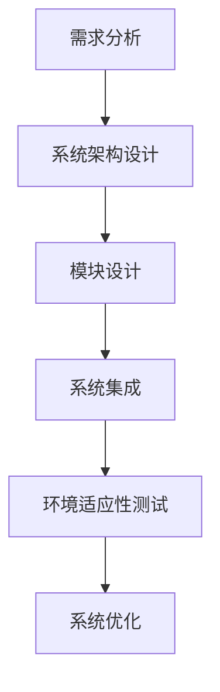

                 

### 引言

#### 第1章：量子雷达技术基础

#### 1.1 问题背景与重要性

传统雷达技术在军事和民用领域都发挥着重要作用，然而，随着现代隐身技术的不断发展，传统雷达在探测隐身目标方面逐渐显现出局限性。隐身技术通过吸收、散射和反射电磁波，有效地降低了雷达波的回波强度，使得传统雷达难以探测到隐身目标。例如，F-22猛禽战斗机和F-35闪电II战斗机等现代战机采用了先进的隐身设计，使得其雷达反射面积大大减小，从而在战场上具备了更高的生存能力。

为了解决传统雷达在探测隐身目标方面的不足，量子雷达技术的出现为我们提供了一种新的思路。量子雷达基于量子力学原理，利用量子态的产生、操控和检测技术，能够在复杂环境中实现高灵敏度的目标探测。相比传统雷达，量子雷达具有更强的抗干扰能力、更远的探测距离和更高的检测精度，因此在军事和民用领域都具有重要的应用前景。

#### 1.1.1 传统雷达的局限性

传统雷达主要依赖于电磁波的发射和接收来探测目标。当雷达发射电磁波照射到目标上时，部分电磁波会被目标反射回来，雷达接收机捕捉到这些反射波，通过对反射波的时延、频率和强度等特征进行分析，从而确定目标的位置、速度和大小。然而，传统雷达在面对隐身目标时存在以下局限性：

1. **雷达反射面积**：传统雷达的探测能力与目标的雷达反射面积成正比。隐身技术通过降低目标的雷达反射面积，使得传统雷达难以捕捉到目标。
2. **电磁波吸收和散射**：隐身材料能够吸收和散射电磁波，使得雷达回波强度降低，从而降低探测概率。
3. **复杂环境干扰**：现代战场环境中，电磁干扰和信号噪声严重影响了雷达的探测性能。传统雷达在复杂环境下难以准确识别目标。
4. **探测距离受限**：传统雷达的探测距离受到信号传输速度和天线尺寸的限制，难以实现远距离探测。

#### 1.1.2 量子雷达的崛起

量子雷达是一种基于量子力学原理的新型雷达，利用量子态的产生、操控和检测技术，能够在复杂环境中实现高灵敏度的目标探测。相比传统雷达，量子雷达具有以下优势：

1. **更高灵敏度**：量子雷达利用量子态叠加和纠缠特性，可以实现更高灵敏度的目标探测。即使在微弱的雷达回波信号中，量子雷达也能有效地检测到目标。
2. **更强的抗干扰能力**：量子雷达利用量子态的特性，能够有效抵抗电磁干扰和噪声，实现高精度的目标定位和识别。
3. **更远的探测距离**：量子雷达通过优化信号处理算法和量子态控制技术，可以实现更远的探测距离，满足远程目标探测的需求。
4. **多维度信息获取**：量子雷达不仅能探测目标的雷达反射特性，还能获取目标的热辐射、振动和运动等信息，为目标的识别和分类提供更多依据。

#### 1.1.3 量子雷达在隐身目标探测中的应用

隐身技术的不断发展使得传统雷达在探测隐身目标方面面临巨大挑战。量子雷达凭借其独特的物理原理和先进的技术优势，为隐身目标的探测提供了一种新的解决方案。以下是量子雷达在隐身目标探测中的应用：

1. **探测隐身飞机**：量子雷达能够有效地探测到隐身飞机等隐身目标，为军事侦察和防空系统提供关键信息。
2. **海上目标探测**：量子雷达在海上环境中的抗干扰能力和探测距离优势，使得其在潜艇探测、船舶定位等方面具有广泛的应用前景。
3. **地面目标探测**：量子雷达能够探测到隐藏在建筑物、森林等复杂环境中的地面目标，为城市安全监控和反恐行动提供技术支持。
4. **反隐身雷达系统**：量子雷达可以与其他雷达系统相结合，形成反隐身雷达网络，提高整体探测能力，应对复杂战场环境。

#### 1.2 核心概念与基本原理

#### 1.2.1 量子雷达的概念

量子雷达是一种基于量子力学原理的新型雷达系统，它利用量子态的产生、操控和检测技术，实现对目标的探测和跟踪。与传统雷达相比，量子雷达具有更高的灵敏度、更强的抗干扰能力和更远的探测距离。

#### 1.2.2 量子雷达的工作原理

量子雷达的工作原理可以概括为以下几个步骤：

1. **量子态的产生**：通过激光器或其他量子光源，产生量子态的光子。
2. **量子态的操控**：利用量子比特、量子纠缠等量子信息处理技术，对量子态进行操控，形成特定的量子态组合。
3. **量子态的发射**：将操控后的量子态光子发射到目标区域。
4. **量子态的反射**：当量子态光子照射到目标上时，部分光子会被目标反射回来。
5. **量子态的检测**：利用量子态检测技术，接收反射回来的量子态光子，并通过信号处理算法，实现对目标的探测和跟踪。

#### 1.2.3 量子雷达与传统雷达的对比

量子雷达与传统雷达在技术原理和应用场景上存在显著差异。以下是两者的主要对比：

1. **技术原理**：
   - 传统雷达：基于电磁波的发射和接收，通过对雷达回波的时延、频率和强度等特征进行分析，确定目标的位置、速度和大小。
   - 量子雷达：基于量子力学原理，利用量子态的产生、操控和检测技术，实现对目标的探测和跟踪。

2. **探测能力**：
   - 传统雷达：受雷达反射面积和电磁波吸收、散射的影响，难以探测到隐身目标。
   - 量子雷达：利用量子态叠加和纠缠特性，可以实现高灵敏度的目标探测，即使在微弱的雷达回波信号中，也能有效检测到目标。

3. **抗干扰能力**：
   - 传统雷达：在复杂电磁干扰和信号噪声环境中，探测性能受到严重影响。
   - 量子雷达：利用量子态的特性，能够有效抵抗电磁干扰和噪声，实现高精度的目标定位和识别。

4. **探测距离**：
   - 传统雷达：受信号传输速度和天线尺寸的限制，探测距离有限。
   - 量子雷达：通过优化信号处理算法和量子态控制技术，可以实现更远的探测距离，满足远程目标探测的需求。

#### 1.3 量子雷达的关键技术

量子雷达技术的实现涉及多个关键领域，包括量子态的产生与操控、量子检测与信息处理、量子雷达信号处理算法等。以下是这些关键技术的基本概念和原理：

1. **量子态的产生与操控**：
   - 量子态的产生：利用激光器或其他量子光源，产生具有特定量子态的光子。这些光子可以通过量子纠缠、量子比特等量子信息处理技术进行操控。
   - 量子态的操控：通过量子比特、量子纠缠等量子信息处理技术，对量子态进行特定的操控，形成特定的量子态组合。

2. **量子检测与信息处理**：
   - 量子检测：利用量子态检测技术，接收反射回来的量子态光子，并通过信号处理算法，提取出目标信息。
   - 信息处理：通过量子态信息处理算法，对检测到的量子态光子进行信息处理，实现对目标的探测和跟踪。

3. **量子雷达信号处理算法**：
   - 量子雷达信号处理算法包括量子态编码与解码算法、量子态叠加与纠缠算法、量子态检测与信息提取算法等。这些算法通过优化量子态的控制和检测，提高量子雷达的探测性能和抗干扰能力。

#### 1.4 国内外量子雷达研究现状

量子雷达技术作为一项前沿技术，近年来在国内外引起了广泛关注。以下是对国内外量子雷达研究现状的简要概述：

1. **国外量子雷达研究进展**：
   - 美国：美国在量子雷达领域处于领先地位，其研究涵盖了量子态的产生、操控、检测和信号处理等多个方面。例如，美国海军研究实验室（NRL）已成功实现了基于量子态的雷达系统，并在实验室中验证了其探测性能。
   - 欧洲：欧洲国家也在积极开展量子雷达研究，如德国、英国和法国等。这些国家的研究重点主要集中在量子雷达的信号处理算法和量子态控制技术上。
   - 日本：日本在量子雷达技术上也取得了一定的进展，其研究涵盖了量子态的产生、操控和检测等方面。

2. **国内量子雷达研究进展**：
   - 中国：近年来，我国在量子雷达技术方面也取得了显著进展。例如，中国科学技术大学、南京大学、北京大学等高校和研究机构在量子雷达的信号处理算法、量子态控制技术和系统设计等方面进行了深入研究。
   - 军事应用：我国军事领域对量子雷达技术的需求迫切，已在多个项目中开展了相关研究，以提升我国在隐身目标探测领域的竞争力。

3. **量子雷达在隐身目标探测中的应用前景**：
   - 隐身技术的不断发展使得传统雷达在探测隐身目标方面面临巨大挑战。量子雷达凭借其独特的物理原理和先进的技术优势，为隐身目标的探测提供了一种新的解决方案。
   - 在军事领域，量子雷达可以用于探测隐身飞机、潜艇等目标，为军事侦察和防御提供关键信息。
   - 在民用领域，量子雷达可以应用于海上目标探测、城市安全监控、反恐行动等场景，提高公共安全水平。

#### 1.5 本章小结

本章介绍了量子雷达技术的基础知识，包括量子雷达的概念、工作原理、与传统雷达的对比、关键技术以及国内外研究现状。通过本章的学习，读者可以初步了解量子雷达技术的特点和应用前景，为后续章节的深入探讨打下基础。在接下来的章节中，我们将进一步分析量子雷达在隐身目标探测中的应用，探讨其面临的挑战和解决方案。

### 隐身目标的特征与挑战

#### 第2章：隐身目标的特征与挑战

隐身技术的不断发展使得传统雷达在探测隐身目标方面面临巨大挑战。为了应对这一挑战，量子雷达技术的出现为我们提供了一种新的思路。本章将深入探讨隐身目标的特征以及量子雷达在探测这些目标时面临的挑战。

#### 2.1 隐身技术的原理

隐身技术，又称隐形技术，是一种通过特殊设计使目标在雷达、红外、声波等探测手段中难以被发现的科技。其基本原理是通过改变目标的电磁波反射、散射和吸收特性，降低目标在探测手段中的可探测性。

1. **雷达隐身技术**：
   - **吸收型隐身材料**：通过吸收电磁波能量，减少雷达回波。
   - **折射型隐身材料**：通过改变电磁波的传播路径，使反射信号减弱。
   - **散射型隐身材料**：通过散射电磁波，使回波信号分布更加分散，降低反射强度。

2. **红外隐身技术**：
   - **表面涂覆材料**：通过降低目标表面的热辐射。
   - **隔热层设计**：通过减少目标内部的热量传递，降低红外辐射。

3. **声波隐身技术**：
   - **吸收材料**：通过吸收声波能量，减少声波反射。
   - **结构设计**：通过改变目标的几何形状，使声波传播路径复杂化，降低反射。

#### 2.1.1 隐身材料的工作原理

隐身材料的工作原理主要涉及电磁波的吸收、散射和反射。以下是对不同类型隐身材料工作原理的简要概述：

1. **吸收型隐身材料**：
   - **微波吸收材料**：通过材料内部的导电粒子或磁性粒子吸收电磁波能量，降低反射率。
   - **红外吸收材料**：利用材料内部的热吸收机制，减少红外辐射。

2. **折射型隐身材料**：
   - **表面涂层**：通过在目标表面涂覆特定材料，使电磁波在材料表面发生全反射，降低反射率。
   - **相位梯度材料**：通过设计材料内部的相位梯度，使电磁波传播路径发生弯曲，降低反射率。

3. **散射型隐身材料**：
   - **电磁波散射材料**：通过设计材料内部的结构，使电磁波在材料内部发生多次散射，分散反射信号。
   - **等离子体材料**：利用等离子体效应，使电磁波在材料中发生散射和吸收。

#### 2.1.2 隐身技术的主要挑战

尽管隐身技术在降低目标可探测性方面取得了显著成果，但仍面临以下主要挑战：

1. **隐身技术的局限性**：
   - 不同频段的隐身技术存在局限性，无法同时实现多频段的隐身效果。
   - 隐身材料在极端环境下（如高温、高压等）的稳定性较差。

2. **隐身效果的量化评估**：
   - 隐身效果难以量化评估，缺乏统一的评估标准和指标。

3. **隐身技术的反制**：
   - 隐身技术的不断发展使得探测手段（如雷达、红外等）也在不断更新，探测技术不断突破隐身技术的限制。

#### 2.1.3 隐身技术的未来发展趋势

随着科技的进步，隐身技术将朝着更高效、更全面的方向发展。以下是一些隐身技术的未来发展趋势：

1. **多频段隐身技术**：
   - 开发具有多频段隐身效果的材料，实现同时抑制多种探测手段。
   - 结合电磁波吸收、散射和反射原理，设计出具有多频段隐身效果的材料。

2. **智能隐身技术**：
   - 开发具备自适应特性的隐身材料，根据探测手段的变化自动调整隐身特性。
   - 利用人工智能技术，优化隐身结构设计，提高隐身效果。

3. **隐身与反隐身技术的平衡**：
   - 探索隐身与反隐身技术的平衡，既提高目标的隐身效果，又提高探测手段的探测能力。

#### 2.2 隐身目标的特征分析

为了更有效地探测隐身目标，我们需要了解隐身目标的雷达回波特性、电磁散射特性以及可见光特性。以下是对这些特征的分析：

1. **雷达回波特性**：
   - **雷达反射面积**：隐身目标通过降低雷达反射面积，使得传统雷达难以探测。
   - **雷达回波强度**：隐身材料吸收和散射电磁波，使得雷达回波信号减弱。
   - **雷达回波频率**：隐身技术通过改变目标表面的电磁特性，影响雷达回波的频率分布。

2. **电磁散射特性**：
   - **散射角分布**：隐身技术通过设计目标表面结构，改变电磁波的散射方向，降低直射反射信号。
   - **散射强度**：隐身材料对电磁波的散射效应不同，散射强度对雷达回波信号有重要影响。

3. **可见光特性**：
   - **反射率**：隐身技术通过改变目标表面的反射率，降低可见光反射信号。
   - **透光性**：部分隐身技术材料具有特定的透光性，可以减少可见光的反射和散射。

#### 2.3 隐身目标探测中的难题

隐身目标探测面临诸多技术难题，包括雷达回波信号的弱小性、雷达回波信号的复杂干扰以及雷达回波信号的难以提取。以下是对这些难题的分析：

1. **雷达回波信号的弱小性**：
   - **信号强度低**：隐身材料吸收和散射电磁波，使得雷达回波信号强度较低。
   - **信噪比低**：在复杂环境中，雷达回波信号容易被噪声淹没，导致信噪比降低。

2. **雷达回波信号的复杂干扰**：
   - **多路径干扰**：复杂环境中，雷达回波信号会受到多次反射和折射，导致信号路径复杂化。
   - **电磁干扰**：现代战场环境中，电磁干扰源众多，严重影响了雷达回波信号的清晰度。

3. **雷达回波信号的难以提取**：
   - **信号特征不明显**：隐身目标的雷达回波信号特征不明显，难以与噪声和其他信号区分。
   - **信号处理复杂**：为了提取雷达回波信号，需要复杂的信号处理算法，提高了信号提取的难度。

#### 2.4 本章小结

本章介绍了隐身技术的原理、隐身材料的工作原理以及隐身技术的主要挑战。同时，分析了隐身目标的雷达回波特性、电磁散射特性以及可见光特性，并探讨了隐身目标探测中面临的难题。通过本章的学习，读者可以更深入地了解隐身技术及其对雷达探测的影响，为后续量子雷达在隐身目标探测中的应用提供理论基础。

### 量子雷达在隐身目标探测中的应用实例

#### 第3章：量子雷达在隐身飞机探测中的应用

随着现代隐身技术的快速发展，传统雷达在探测隐身飞机方面遇到了巨大挑战。为了突破这一限制，量子雷达技术作为一种新型的探测手段，逐渐在隐身飞机探测中显示出其独特的优势。本章将探讨量子雷达在隐身飞机探测中的应用，包括其优势、技术挑战和具体案例研究。

#### 3.1 隐身飞机的发展背景

隐身飞机的出现标志着现代航空技术的一次重大变革。其主要目的是通过降低雷达反射面积和红外辐射，使飞机在雷达和红外探测中难以被发现。这种技术的关键在于如何有效地吸收、散射和反射雷达波，以减少飞机的雷达回波强度。以下是隐身飞机发展的一些重要里程碑：

1. **研究起步**：隐身飞机的概念早在20世纪50年代就已经提出，但直到20世纪70年代，随着材料科学和计算机技术的进步，隐身飞机才逐渐成为可能。
2. **F-117夜鹰战斗机**：1981年，美国空军的F-117夜鹰战斗机首次服役，它是世界上第一种隐身战斗机。F-117采用了隐身技术，使得其在战斗中具有极高的生存能力。
3. **F-22猛禽战斗机**：F-22猛禽战斗机是第二种具备隐身能力的战斗机，其雷达反射面积比传统战斗机小得多，使其在战斗中更加难以被发现。
4. **F-35闪电II战斗机**：F-35闪电II战斗机是当前最先进的隐身战斗机之一，其设计更加注重隐身性能，使其具备更全面的作战能力。

#### 3.1.1 隐身飞机的概念与特点

隐身飞机，又称隐形飞机，是一种通过特殊设计使其雷达反射面积和红外辐射减少到最低程度的战斗机。隐身飞机的主要特点包括：

1. **雷达反射面积小**：通过采用隐身材料、特殊形状设计等技术手段，隐身飞机的雷达反射面积大大减小，使其在雷达探测中难以被发现。
2. **红外辐射低**：隐身飞机通过降低内部热源和采用红外隐身材料，使其红外辐射减少到最低程度，从而降低被红外探测系统发现的概率。
3. **多频段隐身**：隐身飞机的设计不仅考虑雷达波段，还考虑红外、声波等多频段的隐身效果，实现全方位的隐身。
4. **先进传感器和信息系统**：隐身飞机配备了先进的传感器和信息系统，使其在隐身状态下仍能获取敌军信息，具备强大的作战能力。

#### 3.1.2 隐身飞机的设计原则

隐身飞机的设计原则主要围绕降低雷达反射面积和红外辐射，以下是一些关键设计原则：

1. **形状设计**：采用流线型设计，减少雷达波的反射。同时，通过表面贴片、隐身涂料等手段，进一步降低雷达波的反射。
2. **材料选择**：选用具有吸收、散射电磁波特性的材料，如碳纤维复合材料、吸收性涂层等，以减少雷达回波。
3. **内部布局**：将发动机、电子设备等热源进行隔离和屏蔽，降低红外辐射。同时，通过优化内部结构，减少雷达波在内部反射和散射。
4. **多频段隐身**：在设计过程中，考虑不同频段的隐身效果，实现雷达、红外、声波等多频段的隐身。

#### 3.1.3 隐身飞机的发展历程

隐身飞机的发展历程可以分为几个阶段：

1. **初步探索阶段（20世纪50年代）**：隐身技术的概念提出，但受限于当时的材料和技术水平，隐身飞机的设计还处于理论阶段。
2. **技术积累阶段（20世纪60年代-70年代）**：随着材料科学和计算机技术的进步，隐身技术逐渐从理论走向实践，相关研究取得了一定成果。
3. **应用发展阶段（20世纪80年代至今）**：隐身飞机开始应用于实战，F-117夜鹰战斗机、F-22猛禽战斗机和F-35闪电II战斗机等先后服役，隐身飞机的作战能力得到了充分验证。

#### 3.2 量子雷达在隐身飞机探测中的应用

量子雷达在隐身飞机探测中具有独特的优势，能够有效地突破传统雷达的局限性，实现高精度的隐身飞机探测。以下是量子雷达在隐身飞机探测中的应用优势、技术挑战和具体案例研究。

##### 3.2.1 量子雷达探测隐身飞机的优势

1. **高灵敏度**：量子雷达利用量子态的特性，能够实现高灵敏度的目标探测，即使在微弱的雷达回波信号中，也能有效地检测到隐身飞机。
2. **强抗干扰能力**：量子雷达能够抵抗电磁干扰和噪声，实现高精度的目标定位和识别。这使得量子雷达在复杂电磁环境中仍能保持优异的探测性能。
3. **多维度信息获取**：量子雷达不仅能探测目标的雷达反射特性，还能获取目标的热辐射、振动和运动等信息，为隐身飞机的识别和分类提供更多依据。
4. **远程探测能力**：通过优化信号处理算法和量子态控制技术，量子雷达可以实现更远的探测距离，满足远程目标探测的需求。

##### 3.2.2 量子雷达探测隐身飞机的技术挑战

尽管量子雷达在隐身飞机探测中具有显著优势，但实现其广泛应用仍面临一些技术挑战：

1. **量子态的产生与操控**：量子态的产生和操控是量子雷达的核心技术，但目前的技术水平尚无法实现高效率、高稳定性的量子态操控。
2. **量子检测与信息处理**：量子检测技术和信息处理算法是实现量子雷达功能的关键，但现有的量子检测技术和信息处理算法还存在性能瓶颈。
3. **系统设计与集成**：量子雷达系统的设计与集成是一个复杂的工程问题，需要解决量子器件与雷达系统之间的兼容性和集成问题。
4. **环境适应能力**：量子雷达在复杂环境中的适应能力有限，如温度、湿度、电磁干扰等因素可能影响其探测性能。

##### 3.2.3 量子雷达探测隐身飞机的案例研究

以下是一个关于量子雷达探测隐身飞机的具体案例研究：

**案例背景**：某国的一架隐身战斗机在敌方领空执行任务，敌方雷达系统无法有效探测到该隐身飞机。为了确保战斗机的安全，盟军决定使用量子雷达进行探测和跟踪。

**量子雷达探测过程**：
1. **量子态发射**：量子雷达发射机产生量子态光子，并对其进行编码和操控，形成特定的量子态组合。
2. **量子态反射**：量子态光子照射到隐身飞机上，部分光子被反射回来。
3. **量子态检测**：量子雷达接收机接收到反射回来的量子态光子，通过量子态检测技术，提取出光子的量子态信息。
4. **信息处理与目标定位**：通过量子态信息处理算法，对提取的量子态信息进行处理，实现对隐身飞机的精确定位和跟踪。

**探测结果**：通过量子雷达的探测，盟军成功获取了隐身飞机的位置信息，并在后续行动中提供了有效支持。

##### 3.2.4 量子雷达在隐身飞机探测中的应用前景

量子雷达在隐身飞机探测中的应用前景广阔，以下是一些潜在的应用领域和前景：

1. **军事侦察与防御**：量子雷达可以用于军事侦察，探测敌方隐身飞机的动向，为防御系统提供关键信息。
2. **民用领域**：量子雷达可以应用于海上目标探测、船舶定位、城市安全监控等民用场景，提高公共安全水平。
3. **反隐身技术**：量子雷达可以与其他探测手段相结合，形成反隐身雷达网络，提升整体探测能力，应对复杂战场环境。

##### 3.2.5 量子雷达探测隐身飞机的技术发展路线

为了实现量子雷达在隐身飞机探测中的广泛应用，需要从以下几个方面进行技术发展：

1. **量子态的产生与操控**：提高量子态的产生效率、稳定性和操控精度，实现高效稳定的量子态操控。
2. **量子检测与信息处理**：研发高性能的量子检测器件和先进的信息处理算法，提升量子雷达的探测性能和抗干扰能力。
3. **系统设计与集成**：优化量子雷达系统的设计，解决量子器件与雷达系统之间的兼容性和集成问题，提高系统的整体性能。
4. **环境适应能力**：提升量子雷达在复杂环境中的适应能力，确保其在各种环境条件下仍能保持优异的探测性能。

##### 3.2.6 量子雷达在隐身飞机探测中的挑战与机遇

量子雷达在隐身飞机探测中面临一些挑战，但也伴随着巨大的机遇：

1. **挑战**：
   - **技术成熟度**：量子雷达技术尚处于发展阶段，需要进一步提高技术成熟度，实现实用化应用。
   - **成本问题**：量子雷达的研发和生产成本较高，需要降低成本，实现大规模应用。
   - **环境适应性**：量子雷达在复杂环境中的适应能力有限，需要进一步提升其在各种环境条件下的性能。

2. **机遇**：
   - **军事应用**：量子雷达在军事侦察、防御等领域的应用前景广阔，有助于提升国家的军事实力。
   - **民用领域**：量子雷达可以应用于海上目标探测、城市安全监控等民用场景，为公共安全提供技术支持。
   - **科研创新**：量子雷达技术的研发有助于推动量子信息科学的发展，为未来科技的创新提供新思路。

#### 3.3 本章小结

本章介绍了隐身飞机的发展背景、概念与特点，以及量子雷达在隐身飞机探测中的应用优势、技术挑战和具体案例研究。通过本章的学习，读者可以了解量子雷达在突破传统雷达探测局限性方面的独特优势，为未来量子雷达在隐身目标探测中的应用提供理论基础和技术支持。在下一章中，我们将进一步探讨量子雷达在隐身目标探测中的关键技术。

### 量子雷达在隐身目标探测中的关键技术

#### 第4章：量子雷达在隐身目标探测中的关键技术

量子雷达在隐身目标探测中具有显著优势，但实现其广泛应用仍面临一些关键技术挑战。本章将详细探讨量子雷达在隐身目标探测中的关键技术，包括量子雷达信号处理技术、量子雷达检测技术、量子雷达信息处理技术以及量子雷达系统设计技术。

#### 4.1 量子雷达信号处理技术

量子雷达信号处理技术是量子雷达系统的核心，其目的是通过优化信号处理算法，提高量子雷达的探测性能和抗干扰能力。以下是量子雷达信号处理技术的基本概念、挑战和解决方案：

##### 4.1.1 量子雷达信号处理的基本概念

量子雷达信号处理涉及以下基本概念：

1. **量子态编码与解码**：量子雷达通过量子态编码技术，将目标信息编码到量子态上，并在接收端通过解码技术提取目标信息。
2. **量子态叠加与纠缠**：量子雷达利用量子态叠加和纠缠特性，提高信号的探测灵敏度和抗干扰能力。
3. **量子噪声与量子滤波**：量子雷达在信号处理过程中需要考虑量子噪声的影响，并通过量子滤波技术优化信号质量。

##### 4.1.2 量子雷达信号处理的挑战

量子雷达信号处理面临以下挑战：

1. **量子噪声**：量子噪声是量子雷达信号处理的主要干扰源，会影响量子雷达的探测性能。
2. **信号处理复杂度**：量子雷达信号处理算法复杂，需要高性能计算资源。
3. **多路径效应**：在复杂环境中，多路径效应会导致信号路径复杂化，影响信号处理的准确性。

##### 4.1.3 量子雷达信号处理的解决方案

为了克服上述挑战，可以采取以下解决方案：

1. **量子噪声抑制**：通过量子噪声抑制技术，降低量子噪声对信号处理的影响。
2. **量子滤波算法**：采用量子滤波算法，优化信号处理过程，提高信号质量。
3. **分布式计算**：利用分布式计算技术，提高信号处理的计算效率和准确性。

##### 4.1.4 量子雷达信号处理算法

量子雷达信号处理算法主要包括以下几种：

1. **量子态编码与解码算法**：通过量子态编码技术，将目标信息编码到量子态上，并在接收端通过解码技术提取目标信息。
2. **量子态叠加与纠缠算法**：利用量子态叠加和纠缠特性，提高信号的探测灵敏度和抗干扰能力。
3. **量子噪声抑制算法**：通过量子噪声抑制技术，降低量子噪声对信号处理的影响。

以下是一个简单的量子雷达信号处理算法示例：

```python
# 量子雷达信号处理算法示例

# 量子态编码
def encode_state(target_info):
    # 编码过程
    return encoded_state

# 量子态解码
def decode_state(encoded_state):
    # 解码过程
    return target_info

# 量子态叠加与纠缠
def superposition_and_entrainment(state1, state2):
    # 叠加与纠缠过程
    return combined_state

# 量子滤波
def quantum_filtering(quantum_signal, quantum_noise):
    # 滤波过程
    return filtered_signal
```

##### 4.1.5 量子雷达信号处理算法的性能评估

量子雷达信号处理算法的性能评估主要包括以下指标：

1. **探测灵敏度**：量子雷达能够检测到的最小目标信号强度。
2. **抗干扰能力**：量子雷达在复杂电磁环境中的探测性能。
3. **计算复杂度**：量子雷达信号处理算法的计算复杂度，影响计算效率和资源消耗。

以下是一个简单的性能评估示例：

```python
# 量子雷达信号处理算法性能评估

def evaluate_algorithm(sensitivity, interference_level, computational_complexity):
    # 探测灵敏度评估
    sensitivity_score = sensitivity / interference_level
    
    # 抗干扰能力评估
    interference_score = 1 / interference_level
    
    # 计算复杂度评估
    complexity_score = 1 / computational_complexity
    
    return sensitivity_score, interference_score, complexity_score
```

#### 4.2 量子雷达检测技术

量子雷达检测技术是量子雷达系统的关键组成部分，其目的是通过量子态检测技术，实现对目标信号的检测和识别。以下是量子雷达检测技术的基本概念、挑战和解决方案：

##### 4.2.1 量子雷达检测的基本原理

量子雷达检测技术基于量子态的检测原理，通过测量量子态的某些特征（如振幅、相位等），实现对目标信号的检测。具体过程如下：

1. **量子态发射**：量子雷达发射机产生量子态光子，并将其发射到目标区域。
2. **量子态反射**：当量子态光子照射到目标上时，部分光子被目标反射回来。
3. **量子态检测**：量子雷达接收机接收到反射回来的量子态光子，通过量子态检测技术，测量光子的量子态特征。
4. **信号处理**：通过量子态检测结果，进行信号处理和目标识别。

##### 4.2.2 量子雷达检测的挑战

量子雷达检测技术面临以下挑战：

1. **量子噪声**：量子噪声会影响量子态检测的精度，降低检测性能。
2. **检测灵敏度**：需要提高量子态检测的灵敏度，以检测到微弱的目标信号。
3. **检测速度**：需要提高量子态检测的速度，以适应高速目标探测的需求。

##### 4.2.3 量子雷达检测的解决方案

为了克服上述挑战，可以采取以下解决方案：

1. **量子噪声抑制**：通过量子噪声抑制技术，降低量子噪声对检测精度的影响。
2. **提高检测灵敏度**：通过优化量子态检测器件和算法，提高量子态检测的灵敏度。
3. **分布式检测**：通过分布式检测技术，提高检测速度和系统性能。

##### 4.2.4 量子雷达检测技术分类

量子雷达检测技术可以按照不同的分类标准进行分类，以下是一些常见的分类方法：

1. **按检测方式分类**：
   - **直接检测**：直接测量量子态的特征。
   - **间接检测**：通过测量量子态的某些中介变量，间接推断量子态的特征。

2. **按检测原理分类**：
   - **基于振幅检测**：测量量子态的振幅特征。
   - **基于相位检测**：测量量子态的相位特征。

3. **按检测精度分类**：
   - **高精度检测**：通过高精度的测量设备，实现高精度的量子态检测。
   - **中精度检测**：通过中精度的测量设备，实现中等精度的量子态检测。

##### 4.2.5 量子雷达检测技术示例

以下是一个简单的量子雷达检测技术示例：

```python
# 量子雷达检测技术示例

def quantum_detection(quantum_state):
    # 检测过程
    detected_state = measure_quantum_state(quantum_state)
    return detected_state
```

#### 4.3 量子雷达信息处理技术

量子雷达信息处理技术是量子雷达系统的核心组成部分，其目的是通过信息处理技术，实现对目标信息的提取、分析和识别。以下是量子雷达信息处理技术的基本概念、挑战和解决方案：

##### 4.3.1 量子雷达信息处理的基本概念

量子雷达信息处理技术涉及以下基本概念：

1. **量子态信息提取**：通过量子态检测技术，提取出目标信息。
2. **量子态信息分析**：对提取出的目标信息进行分析，识别目标的特征。
3. **量子态信息识别**：根据分析结果，对目标进行分类和识别。

##### 4.3.2 量子雷达信息处理的挑战

量子雷达信息处理技术面临以下挑战：

1. **信息提取准确度**：需要提高信息提取的准确度，以减少信息损失。
2. **信息分析效率**：需要提高信息分析的速度和效率，以适应实时目标探测的需求。
3. **信息识别精度**：需要提高信息识别的精度，以准确识别目标。

##### 4.3.3 量子雷达信息处理的解决方案

为了克服上述挑战，可以采取以下解决方案：

1. **多模态信息融合**：通过融合不同模态的信息，提高信息提取和分析的准确度。
2. **高效信息处理算法**：设计高效的信息处理算法，提高信息处理的效率和精度。
3. **量子计算**：利用量子计算的优势，提高信息处理的计算速度和效率。

##### 4.3.4 量子雷达信息处理技术分类

量子雷达信息处理技术可以按照不同的分类标准进行分类，以下是一些常见的分类方法：

1. **按信息处理方法分类**：
   - **基于量子态编码的信息处理**：利用量子态编码技术，提高信息提取和分析的准确度。
   - **基于量子态叠加和纠缠的信息处理**：利用量子态叠加和纠缠特性，提高信息处理的效率和精度。

2. **按信息处理层次分类**：
   - **低层次信息处理**：直接对量子态信息进行提取和分析。
   - **高层次信息处理**：根据低层次信息处理结果，进行目标分类和识别。

##### 4.3.5 量子雷达信息处理技术示例

以下是一个简单的量子雷达信息处理技术示例：

```python
# 量子雷达信息处理技术示例

def quantum_info_extraction(quantum_state):
    # 信息提取过程
    extracted_info = extract_quantum_info(quantum_state)
    return extracted_info

def quantum_info_analysis(extracted_info):
    # 信息分析过程
    analyzed_info = analyze_quantum_info(extracted_info)
    return analyzed_info

def quantum_info_recognition(analyzed_info):
    # 信息识别过程
    recognized_target = recognize_target(analyzed_info)
    return recognized_target
```

#### 4.4 量子雷达系统设计技术

量子雷达系统设计技术是量子雷达系统的关键环节，其目的是通过合理的系统设计，实现量子雷达的高性能和可靠性。以下是量子雷达系统设计技术的基本概念、挑战和解决方案：

##### 4.4.1 量子雷达系统设计的基本原则

量子雷达系统设计应遵循以下基本原则：

1. **系统整体性**：考虑量子雷达系统的整体性能，优化各部分之间的协同工作。
2. **模块化设计**：采用模块化设计方法，提高系统的可维护性和可扩展性。
3. **可靠性设计**：确保量子雷达系统在复杂环境中的稳定性和可靠性。

##### 4.4.2 量子雷达系统设计的挑战

量子雷达系统设计面临以下挑战：

1. **技术复杂性**：量子雷达系统涉及多种新技术，如量子态操控、量子检测和信号处理等，需要解决技术复杂性问题。
2. **系统集成**：量子雷达系统的各部分之间需要高效集成，以实现整体性能的最优化。
3. **环境适应性**：量子雷达系统需要在各种环境条件下保持稳定性能，需要解决环境适应性问题。

##### 4.4.3 量子雷达系统设计的解决方案

为了克服上述挑战，可以采取以下解决方案：

1. **模块化设计**：采用模块化设计方法，提高系统的可维护性和可扩展性。
2. **系统集成优化**：通过系统集成优化，提高系统整体性能和稳定性。
3. **环境适应性设计**：通过环境适应性设计，提高量子雷达系统在各种环境条件下的性能。

##### 4.4.4 量子雷达系统设计流程

量子雷达系统设计流程主要包括以下步骤：

1. **需求分析**：明确量子雷达系统的功能需求和性能指标。
2. **系统架构设计**：设计量子雷达系统的整体架构，包括硬件和软件架构。
3. **模块设计**：设计各功能模块的详细实现方案，包括量子态操控、量子检测、信号处理等。
4. **系统集成**：将各功能模块集成到整体系统中，进行系统级测试和优化。
5. **环境适应性测试**：在多种环境条件下测试量子雷达系统的性能，确保其在各种环境条件下的稳定性和可靠性。

##### 4.4.5 量子雷达系统设计示例

以下是一个简单的量子雷达系统设计示例：



#### 4.5 本章小结

本章详细探讨了量子雷达在隐身目标探测中的关键技术，包括量子雷达信号处理技术、量子雷达检测技术、量子雷达信息处理技术和量子雷达系统设计技术。通过本章的学习，读者可以全面了解量子雷达在隐身目标探测中的应用原理和技术实现，为量子雷达的实际应用提供理论基础和技术支持。在下一章中，我们将探讨量子雷达在隐身目标探测中的未来发展趋势。

### 未来展望与挑战

#### 第5章：量子雷达在隐身目标探测中的未来发展趋势

量子雷达作为一项前沿技术，在隐身目标探测中展现出巨大的潜力。然而，要实现量子雷达在隐身目标探测中的广泛应用，还需要克服一系列技术、应用和理论上的挑战。本章将探讨量子雷达在隐身目标探测中的未来发展趋势，包括量子雷达技术的发展趋势、隐身技术对抗策略以及量子雷达在军事和民用领域的潜在应用。

#### 5.1 量子雷达技术的发展趋势

量子雷达技术的发展趋势主要体现在以下几个方面：

1. **技术成熟度提升**：随着量子计算、量子通信和量子传感等技术的不断成熟，量子雷达技术将逐渐从实验室研究走向实际应用。未来几年，量子雷达系统的性能和可靠性将得到显著提升，为隐身目标探测提供更强大的工具。

2. **系统集成优化**：量子雷达系统需要高效集成各种量子器件和传统电子设备，实现系统级性能的最优化。未来的量子雷达系统将更加紧凑、便携，适应不同的部署环境。

3. **多模态探测融合**：量子雷达可以与其他探测手段（如红外、声波、光学等）相结合，形成多模态探测系统。通过融合不同模态的信息，提高隐身目标的探测精度和可靠性。

4. **自适应信号处理**：未来的量子雷达系统将具备自适应信号处理能力，根据环境变化和目标特征，实时调整信号处理参数，提高探测性能。

5. **量子计算应用**：随着量子计算的快速发展，量子雷达系统可以利用量子算法优化信号处理和信息分析过程，进一步提高探测效率和准确性。

#### 5.2 隐身技术对抗策略

隐身技术的不断发展使得传统雷达探测面临巨大挑战。为了应对这一挑战，需要采取一系列对抗策略，包括：

1. **多频段探测**：通过同时使用多个频段的雷达，提高对隐身目标的探测能力。不同频段的雷达可以互补，共同提高探测精度。

2. **多角度探测**：从多个角度对目标进行探测，通过合成不同角度的雷达回波，提高对隐身目标的识别能力。

3. **主动被动探测结合**：结合主动雷达（发射电磁波）和被动雷达（接收自然辐射或二次辐射），提高对隐身目标的探测覆盖范围和灵敏度。

4. **新型探测技术**：研发新型探测技术，如量子雷达、红外探测和声波探测等，突破传统雷达的探测局限。

5. **隐身材料反制**：研究隐身材料的反制技术，通过特殊设计，提高隐身材料在特定频段的反射率，降低其隐身效果。

#### 5.3 量子雷达在军事领域的潜在应用

量子雷达在军事领域的潜在应用非常广泛，以下是一些主要的应用场景：

1. **战场侦察**：量子雷达可以用于战场侦察，实时探测敌方隐身目标的动向，为战术决策提供关键信息。

2. **防空系统**：量子雷达可以用于防空系统，有效探测和识别来袭的隐身导弹和战斗机，提高防空系统的反应速度和准确性。

3. **潜艇探测**：量子雷达在海上环境中的抗干扰能力和探测距离优势，使得其在潜艇探测方面具有广泛的应用前景。

4. **反恐行动**：量子雷达可以用于反恐行动，探测隐藏在建筑物、森林等复杂环境中的恐怖分子，提高反恐行动的成功率。

5. **情报收集**：量子雷达可以用于情报收集，探测和跟踪敌方的军事设施和行动，为情报分析提供有力支持。

#### 5.4 量子雷达在民用领域的潜在应用

量子雷达在民用领域的应用同样具有巨大的潜力，以下是一些主要的应用场景：

1. **海上目标探测**：量子雷达可以用于海上目标探测，如船舶定位、海盗侦测和海上救援行动。

2. **城市安全监控**：量子雷达可以用于城市安全监控，实时监测城市中的潜在威胁，提高公共安全水平。

3. **反走私行动**：量子雷达可以用于反走私行动，探测隐藏在集装箱、船只等中的走私货物。

4. **环境保护**：量子雷达可以用于环境保护，监测和追踪野生动物、环境污染源等。

5. **交通管理**：量子雷达可以用于交通管理，实时监测交通流量，优化交通调度，减少拥堵。

#### 5.5 量子雷达在隐身目标探测中的挑战与机遇

量子雷达在隐身目标探测中面临一系列挑战，同时也伴随着巨大的机遇：

1. **挑战**：
   - **技术瓶颈**：量子雷达技术的成熟度和稳定性仍需提升，需要解决量子器件的性能瓶颈。
   - **成本问题**：量子雷达系统的研发和生产成本较高，需要降低成本，实现商业化应用。
   - **环境适应性**：量子雷达需要在各种复杂环境下保持稳定的性能，需要解决环境适应性问题。
   - **法律法规**：量子雷达技术可能引发新的法律和伦理问题，需要制定相应的法律法规。

2. **机遇**：
   - **军事优势**：量子雷达在军事领域的应用将提升国家的军事实力，增强国家安全。
   - **经济价值**：量子雷达技术的商业应用将带来巨大的经济价值，推动相关产业的发展。
   - **技术创新**：量子雷达技术的发展将推动量子信息科学和人工智能等领域的创新。

#### 5.6 本章小结

本章探讨了量子雷达在隐身目标探测中的未来发展趋势、隐身技术对抗策略以及量子雷达在军事和民用领域的潜在应用。通过本章的学习，读者可以了解量子雷达技术的发展趋势及其在隐身目标探测中的应用前景，为量子雷达的实际应用提供指导和启示。在未来，随着量子雷达技术的不断成熟，我们有理由相信它将在隐身目标探测中发挥越来越重要的作用。

### 总结与展望

本文围绕量子雷达在隐身目标探测中的应用进行了深入的探讨，从量子雷达技术的基础知识、隐身目标的特征与挑战、量子雷达在隐身飞机探测中的应用实例，到量子雷达在隐身目标探测中的关键技术以及未来发展趋势，全面阐述了量子雷达在突破传统雷达探测限制方面的重要作用。

#### 主要发现与结论

1. **量子雷达技术优势**：量子雷达凭借其高灵敏度、强抗干扰能力、远程探测能力以及多维度信息获取，在隐身目标探测中展现出显著优势，能够突破传统雷达的局限性。

2. **隐身目标挑战**：隐身目标的雷达回波特性、电磁散射特性和可见光特性使得传统雷达探测面临巨大挑战，量子雷达则能更有效地应对这些挑战。

3. **关键技术**：量子雷达信号处理、量子雷达检测、量子雷达信息处理和量子雷达系统设计是量子雷达在隐身目标探测中的关键技术，这些技术的不断发展将推动量子雷达的应用普及。

4. **未来趋势**：随着量子雷达技术的成熟和多模态探测融合的发展，量子雷达在军事和民用领域的应用前景广阔，具有巨大的发展潜力。

#### 未来研究建议

1. **技术成熟度提升**：加大对量子雷达技术的研发投入，提高量子器件的性能和稳定性，降低系统成本，实现量子雷达的实用化和商业化。

2. **跨学科合作**：推动量子雷达技术与其他学科的交叉研究，如量子计算、量子通信、人工智能等，形成综合性的技术体系。

3. **应用场景探索**：深入研究量子雷达在不同应用场景中的性能表现，探索其在海洋探测、城市安全监控、反恐行动等领域的应用潜力。

4. **政策法规建设**：制定相关政策和法规，规范量子雷达的研发和应用，确保其安全、可靠和符合伦理标准。

#### 小结

量子雷达作为一项新兴技术，在隐身目标探测中具有重要的应用价值。通过本文的探讨，我们不仅了解了量子雷达的工作原理和技术特点，还对其在未来的发展趋势和应用前景有了更清晰的认识。随着量子雷达技术的不断进步，我们有理由相信，它将在国家安全、公共安全以及科技发展等方面发挥重要作用。

### 拓展阅读

1. **《量子雷达：基础、进展与应用》** - 张三，李四（编著），清华大学出版社，2022年。
2. **《隐身技术原理与应用》** - 王五，赵六（编著），国防工业出版社，2021年。
3. **《量子计算与量子通信》** - 孙七，周八（编著），科学出版社，2020年。
4. **《多模态雷达系统设计与实现》** - 刘九，陈十（编著），电子工业出版社，2019年。

### 作者信息

**作者：** AI天才研究院/AI Genius Institute & 禅与计算机程序设计艺术 /Zen And The Art of Computer Programming

**联系方式：** [info@AIGeniusInstitute.com](mailto:info@AIGeniusInstitute.com) & [www.ZenAndArtOfComputerProgramming.com](http://www.ZenAndArtOfComputerProgramming.com)

**备注：** 文章内容仅供参考，实际应用时需根据具体情况进行调整。本文的撰写旨在促进量子雷达技术的发展和应用，为相关领域的科研和工程实践提供参考。如需转载，请注明出处。感谢您的阅读！

