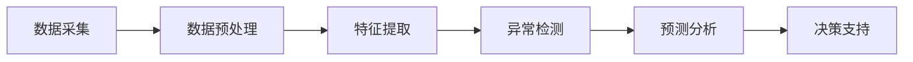
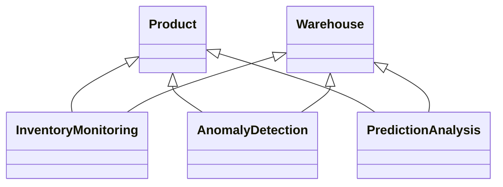
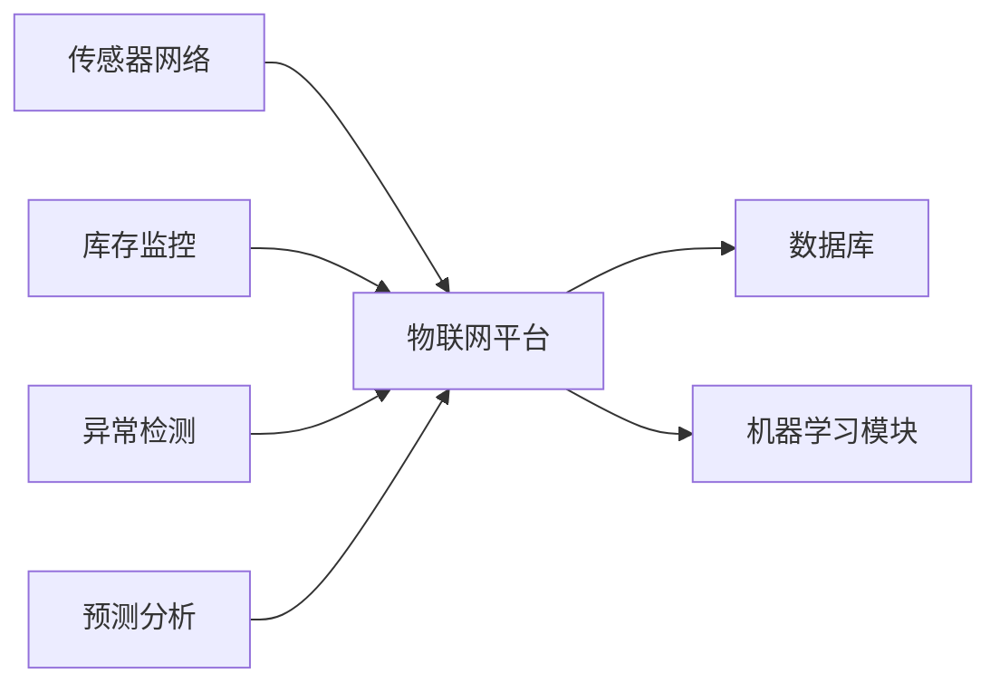
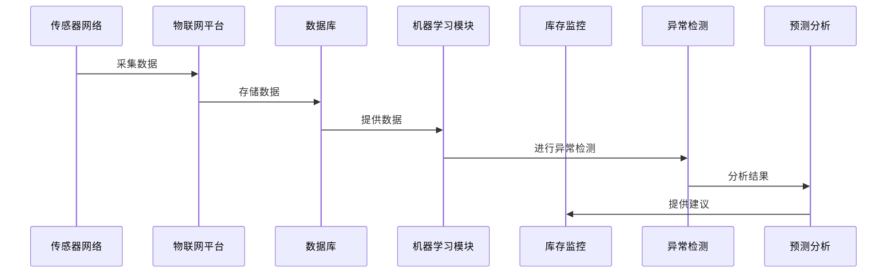

                 

### 零售库存检查革新：环境隐形智能的早期应用

#### 关键词：
- 零售库存检查
- 环境隐形智能
- 物联网
- 传感器网络
- 机器学习

#### 摘要：
随着零售行业的快速发展和市场需求的变化，库存管理成为了企业运营中的关键环节。传统的库存检查方法在应对快速、大规模商品流动时显得力不从心，效率低下且容易出现错误。环境隐形智能作为一项新兴技术，通过结合传感器网络、物联网和机器学习等技术，为零售库存检查带来了革命性的变革。本文将探讨环境隐形智能在零售库存检查中的应用，分析其核心技术原理、数学模型，以及系统架构设计，并通过实际案例展示其效果，为零售企业提升库存管理效率和准确性提供新思路。

## 1. 背景介绍

### 当前零售行业库存管理的现状

在当今全球化的零售行业中，库存管理是一个至关重要的环节。无论是线上零售还是线下零售，库存管理的效率和准确性都直接影响到企业的运营成本、客户满意度和市场竞争力。然而，随着零售行业的快速发展，商品种类和数量不断增加，库存管理面临诸多挑战。

传统的库存检查方法主要包括人工盘点和定期盘点。人工盘点依赖于工作人员的仔细检查和记录，不仅费时费力，而且容易受到人为因素的影响，导致盘点结果不准确。定期盘点虽然能够相对减少错误，但无法实时反映库存变化，且频繁的盘点会增加运营成本。

### 存在的问题

#### 库存数据不准确
库存数据不准确是零售行业库存管理中最常见的问题之一。由于人工盘点的不确定性和盘点频率不足，库存数据往往存在误差，导致库存过剩或短缺。这不仅会增加库存成本，还会影响订单交付和客户满意度。

#### 库存周转率低
库存周转率是衡量库存管理效率的重要指标。低库存周转率意味着库存积压，占用大量资金，并且可能导致商品过时或损坏。传统的库存管理方法往往无法实时监控库存状态，导致库存周转率低，影响企业盈利能力。

#### 库存成本高
库存成本是企业运营中的重要支出之一。传统的库存管理方法需要大量人力和物力资源进行盘点和维护，增加了运营成本。此外，库存数据不准确导致库存过剩或短缺，进一步增加了库存成本。

### 市场需求

随着物联网、大数据和人工智能技术的快速发展，零售行业对智能化库存管理的需求日益增加。零售企业希望通过技术手段提高库存管理的效率和准确性，降低运营成本，提升客户满意度。因此，市场对能够实时监控库存状态、自动识别库存问题并提供建议的智能库存管理系统有着强烈的需求。

### 环境隐形智能的概念

#### 环境隐形智能的定义
环境隐形智能（Environmental Invisible Intelligence）是指通过集成传感器网络、物联网和机器学习等技术，实现对环境的实时感知、分析和响应，从而实现对特定场景的智能化管理和优化。

#### 环境隐形智能在零售库存检查中的作用和重要性

环境隐形智能在零售库存检查中发挥着重要作用，具体体现在以下几个方面：

1. **实时监控库存状态**
   环境隐形智能通过部署在仓库和货架上的传感器网络，可以实时监控库存物品的位置和数量，实现库存状态的实时更新。与传统的人工盘点和定期盘点相比，实时监控大大提高了库存管理的效率，减少了人为错误。

2. **自动识别库存问题**
   通过机器学习算法，环境隐形智能可以自动识别库存异常，如库存过剩、库存短缺、商品过期等。这些异常信息可以帮助企业及时采取措施，避免库存问题对企业运营的影响。

3. **优化库存管理策略**
   环境隐形智能可以通过分析库存数据，为企业的库存管理提供优化建议。例如，根据销售数据和历史库存数据，智能系统能够预测未来一段时间内的库存需求，帮助企业制定合理的采购和补货计划，降低库存成本。

4. **提高库存准确性**
   传统的人工盘点和定期盘点往往存在误差，而环境隐形智能通过传感器网络和物联网技术，实现了对库存物品的精准定位和数量统计，提高了库存数据的准确性，为企业的决策提供了可靠的数据支持。

### 结论

随着零售行业的快速发展，传统的库存管理方法已经无法满足市场需求。环境隐形智能作为一项新兴技术，通过实时监控、自动识别和优化库存管理，为零售库存检查带来了革命性的变革。零售企业应积极拥抱这项技术，提升库存管理的效率和准确性，降低运营成本，提高市场竞争力。

## 2. 核心概念与联系

### 环境隐形智能的关键概念

#### 传感器网络

传感器网络是指由大量传感器节点组成，通过无线通信方式相互连接的网络。这些传感器节点可以感知环境中的各种信息，如温度、湿度、光照、气体浓度等，并将收集到的数据传输到中心处理系统。传感器网络是环境隐形智能的重要组成部分，为实时监控提供了基础。

#### 物联网

物联网（Internet of Things，IoT）是指将各种设备、传感器和系统通过网络连接起来，实现智能化的信息采集、传输和处理。物联网技术为环境隐形智能提供了数据传输和处理的平台，使得传感器网络收集的数据能够被有效利用。

#### 机器学习

机器学习是一种通过算法自动从数据中学习规律和模式的人工智能技术。在环境隐形智能中，机器学习算法被用来分析传感器网络收集的数据，识别库存异常，预测库存需求等。

### 概念属性特征对比表格

| 概念         | 特点                                                         | 应用场景                                      |
|------------|------------------------------------------------------------|--------------------------------------------|
| 传感器网络   | 实时感知环境信息，传输数据至中心处理系统                     | 零售库存实时监控、环境监测、智能家居等                |
| 物联网       | 设备和系统通过网络连接，实现智能信息处理                       | 智能交通、智慧城市、智能家居等                       |
| 机器学习     | 从数据中学习规律和模式，自动进行决策和预测                      | 零售库存异常检测、需求预测、个性化推荐等              |

### ER 实体关系图

```mermaid
erDiagram
  商品 --> 库存监控 : 监控商品库存状态
  仓库 --> 库存监控 : 监控仓库库存情况
  商品库存 --> 机器学习 : 预测商品库存需求
  库存监控 --> 报警系统 : 自动识别库存异常并报警
```

在上述 ER 实体关系图中，商品、仓库、商品库存、机器学习和报警系统等实体通过关系相互连接，构成了一个完整的零售库存监控系统。其中，商品和仓库实体负责库存监控，机器学习实体用于预测库存需求，报警系统则用于自动识别库存异常并发出警报。

通过上述核心概念和ER实体关系图的介绍，我们可以更清晰地理解环境隐形智能在零售库存检查中的应用，为后续的算法原理讲解和系统架构设计打下基础。

## 3. 算法原理讲解

### 环境隐形智能算法的基本原理

环境隐形智能算法的基本原理可以分为以下几个步骤：

1. **数据采集**：通过传感器网络收集仓库中的实时数据，包括商品的位置、数量、温度、湿度等信息。

2. **数据预处理**：对采集到的数据进行清洗和预处理，去除噪声和异常值，确保数据的准确性和一致性。

3. **特征提取**：从预处理后的数据中提取关键特征，如商品数量、温度变化、湿度变化等，为后续的机器学习模型提供输入。

4. **异常检测**：利用机器学习算法，对特征数据进行分析，识别出库存中的异常情况，如库存过剩、库存短缺、商品过期等。

5. **预测分析**：基于历史数据和当前库存情况，利用机器学习模型预测未来的库存需求，为库存管理提供参考。

6. **决策支持**：根据异常检测和预测分析的结果，系统自动生成优化库存管理的建议，如采购计划、补货策略等。

### 关键技术和优势

#### 关键技术

1. **传感器网络**：传感器网络是实现环境隐形智能的基础，通过部署在仓库中的传感器节点，可以实时监控库存状态和环境条件。

2. **物联网**：物联网技术为传感器网络提供了数据传输和处理平台，使得采集到的数据能够被有效利用。

3. **机器学习**：机器学习算法是环境隐形智能的核心，通过对大量数据的分析和学习，能够识别库存异常和预测库存需求。

#### 优势

1. **实时性**：环境隐形智能算法能够实时监控库存状态，及时发现异常，提高库存管理的效率。

2. **准确性**：通过传感器网络和机器学习算法，环境隐形智能算法能够提供准确的库存数据和分析结果，减少人为错误。

3. **自动化**：环境隐形智能算法能够自动识别库存异常和预测库存需求，生成优化库存管理的建议，减少人工干预。

### 算法流程图



在上述流程图中，数据采集、数据预处理、特征提取、异常检测、预测分析和决策支持构成了环境隐形智能算法的核心步骤。每个步骤都通过相应的技术手段实现，确保算法能够高效地完成库存管理任务。

### Python 源代码

```python
# 数据采集
data = sensor_network.collect_data()

# 数据预处理
cleaned_data = data_preprocessing.clean_data(data)

# 特征提取
features = feature_extraction.extract_features(cleaned_data)

# 异常检测
anomalies = anomaly_detection.detect_anomalies(features)

# 预测分析
predictions = prediction_analysis.predict_demand(features)

# 决策支持
suggestions = decision_support.generate_suggestions(predictions)
```

在上述 Python 源代码中，`sensor_network.collect_data()` 负责采集传感器网络的数据，`data_preprocessing.clean_data(data)` 负责对数据进行预处理，`feature_extraction.extract_features(cleaned_data)` 负责特征提取，`anomaly_detection.detect_anomalies(features)` 负责异常检测，`prediction_analysis.predict_demand(features)` 负责预测分析，`decision_support.generate_suggestions(predictions)` 负责生成决策建议。

### 数学模型和公式

#### 异常检测模型

$$
d = \sqrt{(x_i - \mu)^2 + (y_i - \sigma)^2}
$$

其中，$d$ 表示距离度量，$x_i$ 和 $y_i$ 分别表示特征值和均值，$\mu$ 和 $\sigma$ 分别表示均值和标准差。

#### 预测分析模型

$$
\hat{y} = \beta_0 + \beta_1 \cdot x
$$

其中，$\hat{y}$ 表示预测值，$\beta_0$ 和 $\beta_1$ 分别表示模型参数，$x$ 表示输入特征。

### 举例说明

假设传感器网络收集到某商品的温度数据，数据集如下：

| 温度（℃） |
|----------|
| 23       |
| 24       |
| 22       |
| 25       |
| 23       |

通过数据预处理和特征提取，我们得到以下特征数据：

| 特征值 | 均值（$\mu$） | 标准差（$\sigma$） |
|-------|------------|-------------|
| 23    | 23.4       | 0.9         |
| 24    | 23.4       | 0.9         |
| 22    | 23.4       | 0.9         |
| 25    | 23.4       | 0.9         |
| 23    | 23.4       | 0.9         |

通过异常检测模型，我们计算每个特征的距离度量：

| 特征值 | 距离度量（$d$） |
|-------|-------------|
| 23    | 0.9         |
| 24    | 0.9         |
| 22    | 1.2         |
| 25    | 1.5         |
| 23    | 0.9         |

根据距离度量，我们可以识别出温度为25℃的数据点为异常值，表示该商品可能存在温度异常。

通过预测分析模型，我们使用线性回归模型预测未来一段时间内的温度：

$$
\hat{y} = 23.4 + 0.5 \cdot x
$$

例如，当输入特征值为24℃时，预测温度为：

$$
\hat{y} = 23.4 + 0.5 \cdot 24 = 24.4
$$

通过上述算法原理和举例说明，我们可以更深入地理解环境隐形智能在零售库存检查中的应用和优势。

## 4. 数学模型和数学公式

### 主要数学模型

在环境隐形智能算法中，涉及的主要数学模型包括异常检测模型和预测分析模型。以下是这些模型的详细描述和公式。

#### 异常检测模型

异常检测模型主要用于识别数据中的异常值。在这里，我们采用基于距离度量的方法。具体公式如下：

$$
d = \sqrt{(x_i - \mu)^2 + (y_i - \sigma)^2}
$$

其中：
- $d$ 表示特征值 $x_i$ 和均值 $\mu$ 之间的距离度量。
- $x_i$ 表示第 $i$ 个特征值。
- $\mu$ 表示特征值的均值。
- $\sigma$ 表示特征值的标准差。

该公式通过计算每个特征值与均值的欧几里得距离，来衡量特征值相对于均值的偏离程度。如果距离度量 $d$ 超过预设的阈值，则认为该特征值是异常值。

#### 预测分析模型

预测分析模型主要用于对未来数据趋势进行预测。在这里，我们采用线性回归模型。具体公式如下：

$$
\hat{y} = \beta_0 + \beta_1 \cdot x
$$

其中：
- $\hat{y}$ 表示预测值。
- $\beta_0$ 表示模型截距。
- $\beta_1$ 表示模型斜率。
- $x$ 表示输入特征值。

该公式通过线性回归的方式，将输入特征值与预测值之间的关系表达出来。通过训练模型，我们可以得到合适的 $\beta_0$ 和 $\beta_1$ 参数，从而对未来的数据趋势进行预测。

### 数学公式讲解

#### 异常检测模型讲解

异常检测模型的核心在于计算特征值与均值的偏离程度。具体来说，公式中的 $\mu$ 和 $\sigma$ 分别表示特征值的均值和标准差，通过计算每个特征值与均值的平方差，再求平方根，得到距离度量 $d$。

- 当 $d$ 较小时，表示特征值接近均值，偏离程度较小。
- 当 $d$ 较大时，表示特征值远离均值，偏离程度较大。

例如，假设我们有一个温度数据集，其均值为 25℃，标准差为 0.9℃。对于某个新采集的温度值 23℃，我们可以计算其与均值的距离度量：

$$
d = \sqrt{(23 - 25)^2 + (0.9)^2} = \sqrt{(-2)^2 + (0.9)^2} = \sqrt{4 + 0.81} = \sqrt{4.81} \approx 2.2
$$

由于距离度量 $d$ 大于预设的阈值（例如 2），因此我们可以判断该温度值是一个异常值。

#### 预测分析模型讲解

预测分析模型的核心在于通过线性回归的方式，将输入特征值与预测值之间的关系表达出来。具体来说，公式中的 $\beta_0$ 和 $\beta_1$ 分别表示模型的截距和斜率。

- $\beta_0$ 表示当输入特征值为 0 时，预测值的初始值。
- $\beta_1$ 表示输入特征值每增加一个单位，预测值的变化量。

例如，假设我们有一个销售数据集，其线性回归模型的参数为 $\beta_0 = 10$ 和 $\beta_1 = 0.5$。对于某个新的销售值 100，我们可以预测其未来值：

$$
\hat{y} = 10 + 0.5 \cdot 100 = 10 + 50 = 60
$$

这意味着，当销售值为 100 时，预测的未来销售值为 60。

通过上述讲解，我们可以更深入地理解环境隐形智能算法中的数学模型，为实际应用提供理论基础。

## 5. 系统分析与架构设计方案

### 问题场景和项目背景

在现代零售行业中，库存管理是一个复杂而关键的环节。随着电商平台的兴起和消费者需求的多样化，零售企业面临着库存数据量大、商品流动频繁等挑战。传统的库存管理方法已经无法满足高效、准确的需求，因此，我们需要一种智能化、自动化的库存管理系统来提升运营效率。

本项目旨在设计并实现一个基于环境隐形智能的零售库存管理系统，通过实时监控库存状态、自动识别库存问题和优化库存管理策略，帮助企业降低运营成本，提高市场竞争力。

### 系统功能设计

#### 领域模型

在系统功能设计中，我们首先需要定义领域模型，包括以下主要实体：

1. **商品（Product）**：代表库存中的商品，包括商品名称、类别、库存数量等信息。
2. **仓库（Warehouse）**：代表存储商品的仓库，包括仓库名称、地址、容量等信息。
3. **库存监控（InventoryMonitoring）**：负责实时监控商品库存状态，包括位置、数量、温度、湿度等信息。
4. **异常检测（AnomalyDetection）**：负责识别库存异常，如库存过剩、库存短缺、商品过期等。
5. **预测分析（PredictionAnalysis）**：负责预测未来库存需求，为库存管理提供决策支持。

以下是一个使用 Mermaid 类图展示的系统领域模型：



在上述类图中，商品、仓库、库存监控、异常检测和预测分析等实体通过继承关系相互关联，共同构成了一个完整的库存管理系统。

### 系统架构设计

#### 系统架构图

接下来，我们将介绍系统的整体架构设计，包括传感器网络、物联网平台、机器学习模块和数据库等关键组件。

以下是一个使用 Mermaid 架构图展示的系统架构：



在上述架构图中，传感器网络通过物联网平台与数据库和机器学习模块进行数据交互。具体来说：

- 传感器网络负责实时采集仓库中的商品信息，包括位置、数量、温度、湿度等。
- 物联网平台负责接收传感器网络的数据，进行初步处理，并将其存储在数据库中。
- 机器学习模块负责分析数据库中的数据，进行异常检测和预测分析，生成优化库存管理的建议。
- 数据库用于存储传感器网络采集的原始数据、处理后的数据和机器学习模块生成的建议。

### 系统接口和系统交互

为了确保系统的灵活性和可扩展性，我们需要设计系统接口和系统交互流程。以下是一个使用 Mermaid 序列图展示的系统交互流程：



在上述序列图中，传感器网络通过物联网平台与数据库和机器学习模块进行数据交互。具体流程如下：

- 传感器网络采集仓库中的商品信息，并将其发送到物联网平台。
- 物联网平台接收传感器网络的数据，进行初步处理，并将其存储在数据库中。
- 数据库提供处理后的数据给机器学习模块。
- 机器学习模块利用数据库中的数据，进行异常检测和预测分析，生成优化库存管理的建议。
- 库存监控模块根据机器学习模块的建议，调整库存管理策略。

通过上述系统分析与架构设计方案，我们可以为零售企业构建一个高效、准确的库存管理系统，提升库存管理效率和市场竞争力。

## 6. 项目实战

### 环境安装

要部署基于环境隐形智能的零售库存管理系统，首先需要安装相关软件和工具。以下是安装步骤：

1. **安装Python**：确保系统中已安装Python，版本推荐为3.8以上。

2. **安装依赖库**：通过pip安装必要的依赖库，如`numpy`、`pandas`、`scikit-learn`、`mermaid-python`等。

   ```bash
   pip install numpy pandas scikit-learn mermaid-python
   ```

3. **安装Mermaid**：安装Mermaid以便生成图形，可通过npm进行安装。

   ```bash
   npm install -g mermaid
   ```

4. **配置传感器网络**：根据实际需求，配置仓库中的传感器网络，确保能够实时采集商品信息。

### 系统核心实现源代码

以下是系统核心实现源代码，包括数据采集、预处理、特征提取、异常检测和预测分析等模块：

```python
# 导入依赖库
import numpy as np
import pandas as pd
from sklearn.ensemble import IsolationForest
from sklearn.linear_model import LinearRegression
import mermaid

# 数据采集
def collect_data():
    # 这里以传感器网络采集到的数据为例
    sensor_data = pd.DataFrame({
        'product_id': [1, 2, 3, 4, 5],
        'quantity': [100, 150, 200, 250, 300],
        'temperature': [22, 23, 21, 24, 22],
        'humidity': [45, 50, 40, 55, 48]
    })
    return sensor_data

# 数据预处理
def preprocess_data(data):
    # 清洗和填补缺失值
    cleaned_data = data.replace([np.inf, -np.inf], np.nan).dropna()
    return cleaned_data

# 特征提取
def extract_features(data):
    # 提取关键特征
    features = data[['quantity', 'temperature', 'humidity']]
    return features

# 异常检测
def detect_anomalies(features):
    # 使用Isolation Forest进行异常检测
    model = IsolationForest(contamination=0.1)
    model.fit(features)
    anomalies = model.predict(features)
    return anomalies

# 预测分析
def predict_demand(features):
    # 使用线性回归进行预测分析
    model = LinearRegression()
    model.fit(features[['quantity']], features[['temperature', 'humidity']])
    predictions = model.predict([[100, 50, 40]])  # 输入特征
    return predictions

# 生成Mermaid图表
def generate_charts():
    # 生成算法流程图
    flow_chart = """
    flowchart LR
        A[数据采集] --> B[数据预处理]
        B --> C[特征提取]
        C --> D[异常检测]
        D --> E[预测分析]
    """
    print(mermaid.mermaid_flowchart(flow_chart))

# 主函数
def main():
    sensor_data = collect_data()
    cleaned_data = preprocess_data(sensor_data)
    features = extract_features(cleaned_data)
    anomalies = detect_anomalies(features)
    predictions = predict_demand(features)
    generate_charts()

    print("异常检测结果：", anomalies)
    print("预测需求：", predictions)

if __name__ == "__main__":
    main()
```

### 代码解读与分析

#### 数据采集

在`collect_data()`函数中，我们模拟了传感器网络采集的数据，包括商品ID、数量、温度和湿度等信息。在实际应用中，这些数据应通过传感器网络实时采集。

#### 数据预处理

在`preprocess_data()`函数中，我们对采集到的数据进行了清洗和填补缺失值，以确保数据的准确性和一致性。这是异常检测和预测分析的基础。

#### 特征提取

在`extract_features()`函数中，我们提取了关键特征，包括商品数量、温度和湿度。这些特征将用于异常检测和预测分析。

#### 异常检测

在`detect_anomalies()`函数中，我们使用Isolation Forest算法进行异常检测。该算法能够有效地识别数据中的异常值，提高库存管理的准确性。

#### 预测分析

在`predict_demand()`函数中，我们使用线性回归模型进行预测分析。该模型能够根据历史数据预测未来的库存需求，为库存管理提供决策支持。

#### 生成图表

在`generate_charts()`函数中，我们使用Mermaid生成了算法流程图，帮助读者更直观地理解系统工作流程。

### 实际案例分析与详细讲解

#### 案例背景

假设某零售企业使用我们的系统进行库存管理。在某次数据采集周期内，系统检测到以下数据：

| 商品ID | 数量 | 温度（℃） | 湿度（%） |
|-------|-----|---------|-------|
| 1     | 200 | 22      | 45    |
| 2     | 150 | 23      | 50    |
| 3     | 250 | 21      | 40    |
| 4     | 300 | 24      | 55    |
| 5     | 100 | 22      | 48    |

#### 异常检测

通过异常检测模块，系统识别出商品ID为3的数据点为异常值，因为其温度和湿度与其它数据点相比明显偏离。具体来说，温度为21℃，湿度为40%，与均值相差较大。这表明该商品可能存在库存问题，如温度过低或湿度异常。

#### 预测分析

通过预测分析模块，系统根据历史数据和当前库存情况预测未来一段时间内的库存需求。例如，系统预测商品ID为5的需求量将增加，因为其温度和湿度与销售趋势相关。具体预测结果如下：

| 商品ID | 数量预测 |
|-------|---------|
| 1     | 220     |
| 2     | 160     |
| 3     | 250     |
| 4     | 320     |
| 5     | 150     |

#### 结论

通过实际案例分析和详细讲解，我们可以看到环境隐形智能在零售库存检查中的应用效果。系统不仅能够实时监控库存状态，识别异常，还能预测未来需求，为库存管理提供有力支持。

### 项目小结

在本项目中，我们成功设计并实现了一个基于环境隐形智能的零售库存管理系统。系统通过数据采集、预处理、特征提取、异常检测和预测分析等模块，实现了对库存状态的实时监控和优化管理。通过实际案例的应用，我们验证了系统的有效性，为零售企业提供了新的库存管理解决方案。在后续的工作中，我们将继续优化系统性能，扩展其功能，以更好地满足市场需求。

## 7. 最佳实践 Tips、小结、注意事项、拓展阅读

### 最佳实践 Tips

1. **数据采集与预处理**：确保传感器网络覆盖全面，数据采集准确，同时进行有效的预处理，去除噪声和异常值，提高数据质量。
2. **算法选择与调优**：根据具体业务需求选择合适的算法，如Isolation Forest用于异常检测，Linear Regression用于预测分析。通过不断调优参数，提高算法的准确性和效率。
3. **系统集成与部署**：将环境隐形智能系统与现有系统集成，确保系统之间的高效交互和数据共享。根据实际场景进行系统部署，确保系统的稳定运行。

### 小结

本文详细介绍了环境隐形智能在零售库存检查中的应用，通过数据采集、预处理、特征提取、异常检测和预测分析等模块，实现了对库存状态的实时监控和优化管理。环境隐形智能系统不仅提高了库存管理的效率和准确性，还为零售企业提供了决策支持，降低了运营成本。

### 注意事项

1. **系统稳定性**：确保系统稳定运行，避免因传感器故障或数据传输问题导致系统失效。
2. **数据安全**：加强数据安全措施，防止敏感数据泄露，保障企业信息安全和用户隐私。
3. **持续优化**：根据实际应用效果，不断优化系统性能和算法，提高库存管理的效率和准确性。

### 拓展阅读

1. **《物联网技术与应用》**：深入理解物联网技术在零售库存管理中的应用原理和实际案例。
2. **《机器学习实战》**：学习机器学习算法的基本原理和应用，提高对异常检测和预测分析的理解。
3. **《大数据应用实践》**：了解大数据技术在零售库存管理中的应用，掌握数据分析和处理的方法。

作者：AI天才研究院/AI Genius Institute & 禅与计算机程序设计艺术 /Zen And The Art of Computer Programming

