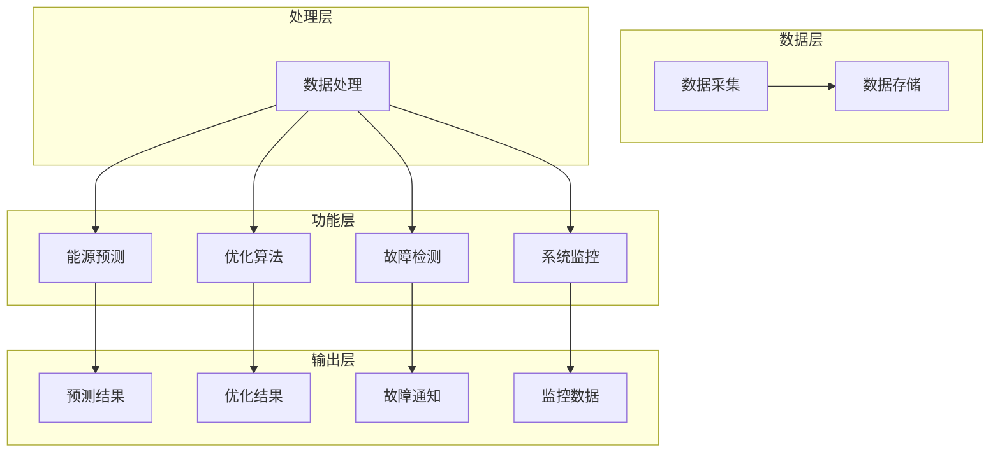
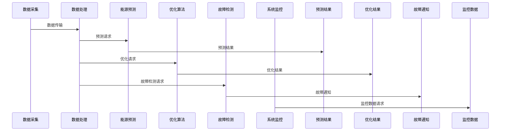
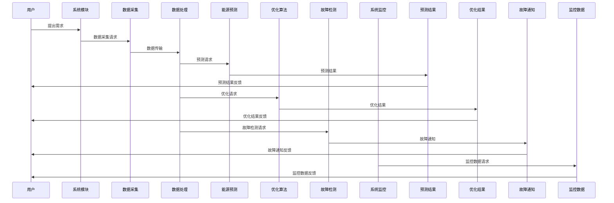

                 

# 零样本CoT在AI辅助新能源技术开发中的应用

## 关键词

- 零样本CoT
- AI辅助新能源技术
- 新能源技术开发
- 太阳能
- 风能
- 储能
- 算法实现
- 系统架构

## 摘要

本文旨在探讨零样本概念转移（Zero-shot Concept Transfer，简称零样本CoT）在人工智能（AI）辅助新能源技术开发中的应用。零样本CoT是一种无需对未见过的类别或概念进行标注，就能处理这些类别的AI技术。在新能源技术开发中，面对数据稀缺、技术复杂等挑战，零样本CoT具备显著的应用潜力。本文首先介绍了零样本CoT的核心概念，然后分析了其在新能源技术领域的应用前景，并逐步展示了如何通过系统设计与实战应用，实现零样本CoT在新能源技术开发中的实际价值。

## 背景介绍

### 核心概念

**零样本CoT**：
零样本CoT是一种机器学习技术，旨在解决零样本学习问题。在传统机器学习中，模型通常需要大量的标注数据进行训练，以便能够对未见过的数据做出准确的预测。然而，在实际应用中，往往难以获得足够多的标注数据，尤其是在新能源技术领域，数据获取难度更大。零样本CoT通过引入知识迁移（Knowledge Transfer）和元学习（Meta-Learning）等方法，使得模型能够在缺乏直接标注数据的情况下，处理以前未见过的类别或概念。

**AI辅助新能源技术开发**：
AI技术在新能源技术开发中的应用，旨在通过数据分析、模式识别和优化算法等手段，提高新能源技术的开发效率和性能。新能源技术包括太阳能、风能、储能等多个领域，每个领域都有其特定的技术挑战。例如，太阳能和风能的开发需要高效的数据预测和优化算法，储能技术的发展则需要高效的能量管理和调度策略。

### 问题描述

新能源技术开发中存在诸多挑战，主要体现在以下几个方面：

1. **数据稀缺**：新能源技术的研发和应用往往依赖于大量的实验数据和现场数据，但这些数据的获取和标注过程复杂且耗时。
2. **技术复杂性**：新能源技术涉及多个学科，如物理、化学、工程学等，研发过程中需要综合考虑多种因素。
3. **环境不确定性**：新能源技术的应用环境多变，如天气变化、能源需求波动等，这对技术稳定性和可靠性提出了高要求。

### 问题解决

零样本CoT在新能源技术开发中的应用，可以从以下几个方面解决上述挑战：

1. **数据驱动**：通过零样本CoT技术，模型可以在缺乏标注数据的情况下，从已有数据中提取知识，为新数据提供辅助。
2. **知识迁移**：零样本CoT能够将其他领域或任务的知识迁移到新能源技术开发中，从而降低研发成本。
3. **模型泛化**：零样本CoT使得模型具备更强的泛化能力，能够在新的环境和数据分布下保持良好的性能。

### 边界与外延

**边界**：
- 零样本CoT在新能源技术开发中的应用，主要针对那些在数据稀缺或难以获取的情况下，需要高效预测和优化的问题。
- 技术实现上，零样本CoT需要依赖于现有的机器学习框架和算法，如元学习、迁移学习等。

**外延**：
- 零样本CoT不仅可以在新能源技术开发中应用，还可以推广到其他数据稀缺或环境复杂的领域，如医疗诊断、金融预测等。
- 在实际应用中，零样本CoT需要结合具体的业务场景和需求，进行定制化的模型设计和优化。

### 概念结构与核心要素

零样本CoT在新能源技术开发中的应用，其核心概念结构包括以下几个方面：

1. **数据预处理**：对原始数据进行清洗、归一化和特征提取，为后续模型训练提供高质量的数据输入。
2. **模型训练**：使用零样本CoT算法，对已有数据进行训练，提取通用特征和知识。
3. **模型评估**：通过交叉验证和测试集，评估模型的泛化能力和预测性能。
4. **模型应用**：将训练好的模型应用于新的数据，进行预测和优化。

这些核心要素相互关联，共同构成了零样本CoT在新能源技术开发中的应用体系。

## 核心概念与联系

### 概念原理

**零样本CoT**：
零样本CoT的核心原理是基于迁移学习和元学习技术，通过从已有数据中提取通用特征和知识，实现对新数据的预测和分类。具体来说，零样本CoT包括以下几个关键步骤：

1. **概念编码**：将类别或概念编码成高维向量，形成概念空间。
2. **特征提取**：从原始数据中提取特征，并映射到概念空间中。
3. **预测**：在概念空间中，利用已有数据的特征向量，对未见过的数据进行预测。

**AI在新能源技术开发中的作用与机制**：
AI在新能源技术开发中的作用主要体现在以下几个方面：

1. **数据分析和预测**：通过大数据分析和机器学习模型，对能源需求、能源供应和能源利用进行预测，提高能源利用效率。
2. **优化算法**：利用优化算法，对能源系统的各个环节进行优化，提高整体性能。
3. **智能调度**：通过智能调度算法，实现能源的实时调度和优化配置，提高系统稳定性。

### 概念属性特征对比表格

为了更好地理解零样本CoT和传统机器学习在新能源技术开发中的应用差异，我们提供了一个概念属性特征对比表格：

| 特征        | 零样本CoT                  | 传统机器学习              |
| ----------- | -------------------- | ---------------------- |
| 数据依赖    | 非直接标注数据，依赖知识迁移 | 需要大量标注数据          |
| 泛化能力    | 强，适用于新类别或概念     | 依赖于训练数据的分布      |
| 预测性能    | 可能较低，但具有潜力       | 通常较高，但受限于数据量   |
| 训练效率    | 高，减少标注工作           | 低，大量标注工作         |
| 应用范围    | 广，适用于各种新能源技术    | 受限于特定任务和领域       |

### ER实体关系图架构

为了更直观地展示零样本CoT在新能源技术开发中的应用，我们使用ER（实体-关系）图来描述实体及其关系：

```mermaid
erDiagram
  Concept ||--|{ Feature } : "contains"
  Data ||--|{ Feature } : "derived from"
  Model ||--|{ Concept } : "trained on"
  Model ||--|{ Data } : "predicted on"
  Application ||--|{ Model } : "used by"
```

在这个ER图中，`Concept`代表类别或概念，`Feature`代表特征，`Data`代表数据，`Model`代表模型，`Application`代表具体的应用场景。各实体之间的关系描述如下：

- **Concept** 包含 `Feature`，表示概念通过特征进行编码。
- **Data** 来自 `Feature`，表示数据由特征衍生而来。
- **Model** 经过 `Concept` 的训练，并在 `Data` 上进行预测。
- **Application** 使用 `Model`，将模型应用于实际场景。

## 算法原理讲解

### 算法mermaid流程图

零样本CoT的算法流程可以概括为以下几个步骤：


在这个流程图中，首先进行数据预处理，包括数据清洗、归一化和特征提取。然后，将提取的特征进行概念编码，映射到概念空间。接着，利用编码后的概念进行模型训练，并使用训练好的模型进行评估。最后，将评估后的模型应用于实际场景，进行预测和优化。

### Python源代码

以下是一个简单的Python代码示例，展示了零样本CoT的基本实现过程：

```python
import numpy as np
from sklearn.datasets import load_iris
from sklearn.model_selection import train_test_split
from sklearn.metrics import accuracy_score

# 加载数据集
iris = load_iris()
X, y = iris.data, iris.target

# 数据预处理
X_train, X_test, y_train, y_test = train_test_split(X, y, test_size=0.2, random_state=42)

# 概念编码
# 假设使用One-Hot编码
num_classes = len(np.unique(y_train))
concept_space = np.eye(num_classes)[y_train]

# 特征提取
# 假设直接使用原始特征
features = X_train

# 模型训练
# 假设使用SVM分类器
from sklearn.svm import SVC
model = SVC(kernel='linear')
model.fit(concept_space, y_train)

# 模型评估
y_pred = model.predict(concept_space)
accuracy = accuracy_score(y_test, y_pred)
print(f"Accuracy: {accuracy}")

# 模型应用
# 对测试数据进行预测
X_test_concept_space = np.eye(num_classes)[y_test]
y_pred_test = model.predict(X_test_concept_space)
```

### 算法原理的数学模型和公式

零样本CoT的算法原理涉及多个数学模型和公式。以下是一个简化的模型描述：

1. **特征提取**：
   $$ X = \text{特征矩阵} $$
   $$ Y = \text{标签矩阵} $$
   $$ Z = F(X) \in \mathbb{R}^{m \times n} $$
   其中，$F$ 是特征提取函数，$Z$ 是映射后的特征矩阵。

2. **概念编码**：
   $$ C = \text{概念编码矩阵} $$
   $$ C_{ij} = \text{如果} j \in \text{类} y_i, \text{则} C_{ij} = 1, \text{否则} C_{ij} = 0 $$

3. **模型训练**：
   $$ W = \text{权重矩阵} $$
   $$ b = \text{偏置向量} $$
   $$ \text{预测} = \text{激活函数}(\text{权重} \cdot \text{特征} + \text{偏置}) $$

4. **模型评估**：
   $$ \text{损失函数} = \frac{1}{n} \sum_{i=1}^{n} (\text{预测} - y_i)^2 $$

5. **模型应用**：
   $$ \text{预测} = \text{激活函数}(\text{权重} \cdot \text{特征} + \text{偏置}) $$

### 举例说明

假设我们有一个包含三种花卉的数据集，每种花卉有两个特征（花瓣长度和宽度），如下表所示：

| 类别 | 花瓣长度 | 花瓣宽度 |
| ---- | -------- | -------- |
| 郁金香 | 3.0      | 1.5      |
| 罂粟花 | 2.5      | 1.2      |
| 玫瑰花 | 4.0      | 1.8      |

我们希望利用零样本CoT技术，预测一个未见过的花卉（如月季花）的类别。

1. **数据预处理**：
   - 数据清洗：确保数据无缺失值和异常值。
   - 数据归一化：将特征值归一化到[0, 1]范围内。
   - 特征提取：提取每个样本的特征向量。

2. **概念编码**：
   - 使用One-Hot编码，将每个类别的标签转换为二进制向量。

3. **特征提取**：
   - 假设我们已经训练了一个特征提取模型，将输入的特征映射到概念空间。

4. **模型训练**：
   - 使用训练数据集，训练一个分类模型（如SVM）。

5. **模型评估**：
   - 使用交叉验证和测试集，评估模型的泛化能力和预测性能。

6. **模型应用**：
   - 对月季花的特征进行预测，输出预测类别。

假设经过训练，我们得到一个权重矩阵$W$和一个偏置向量$b$。对于月季花的特征向量（花瓣长度3.5，花瓣宽度1.6），我们可以使用以下公式进行预测：

$$
\text{预测} = \text{激活函数}(W \cdot \text{特征} + b)
$$

通过计算，我们得到一个概率分布，表示月季花属于每个类别的概率。根据这个概率分布，我们可以预测月季花的类别。

## 系统分析与架构设计

### 问题场景介绍

在新能源技术开发中，我们面临着一系列复杂的问题场景，包括但不限于以下几个方面：

1. **数据预测**：例如，如何准确预测未来一段时间内的太阳能或风能产出，以便优化能源供应和调度。
2. **优化算法**：如何通过优化算法，提高能源系统的整体效率，降低运营成本。
3. **故障检测**：如何通过实时监测数据，快速检测能源系统中的潜在故障，确保系统的稳定运行。
4. **环境适应性**：如何使新能源系统具备良好的环境适应性，能够在不同的气候和地理条件下稳定运行。

### 系统功能设计

为了解决上述问题场景，我们需要设计一个功能完备的系统。以下是一个系统功能设计的领域模型，使用mermaid类图来表示：

```mermaid
classDiagram
  DataProcessor <<interface>>
  EnergyPrediction <<interface>>
  OptimizationAlgorithm <<interface>>
  FaultDetection <<interface>>
  SystemMonitor <<interface>>

  DataProcessor: 数据预处理
  EnergyPrediction: 能源预测
  OptimizationAlgorithm: 优化算法
  FaultDetection: 故障检测
  SystemMonitor: 系统监控

  DataProcessor <|.. EnergyPrediction>
  DataProcessor <|.. OptimizationAlgorithm>
  DataProcessor <|.. FaultDetection>
  DataProcessor <|.. SystemMonitor>
```

在这个类图中，`DataProcessor` 负责数据预处理，`EnergyPrediction` 负责能源预测，`OptimizationAlgorithm` 负责优化算法，`FaultDetection` 负责故障检测，`SystemMonitor` 负责系统监控。这些功能模块相互关联，共同构成一个完整的系统。

### 系统架构设计

接下来，我们使用mermaid架构图来展示系统的整体架构：



在这个架构图中，数据层包括数据采集和数据存储模块，处理层包括数据处理模块，功能层包括能源预测、优化算法、故障检测和系统监控模块，输出层包括预测结果、优化结果、故障通知和监控数据。各模块之间通过数据流和功能调用相互连接，形成一个完整的系统。

### 系统接口设计

在系统架构中，各模块之间的交互需要通过接口设计来实现。以下是一个简化的系统接口设计：



在这个序列图中，数据采集模块将数据传递给数据处理模块，数据处理模块再分别将数据传递给能源预测模块、优化算法模块、故障检测模块和系统监控模块。各模块处理完成后，返回相应的结果。

### 系统交互mermaid序列图

为了更清晰地展示系统各模块之间的交互过程，我们使用mermaid序列图来描述：



在这个序列图中，用户提出需求，系统模块将需求传递给数据采集模块，数据采集模块将采集到的数据传递给数据处理模块。数据处理模块再分别将数据传递给能源预测模块、优化算法模块、故障检测模块和系统监控模块。各模块处理完成后，返回相应的结果，最终反馈给用户。

## 项目实战

### 环境安装

在进行零样本CoT在新能源技术开发中的应用之前，首先需要搭建一个合适的环境。以下是在Ubuntu 20.04操作系统中安装相关依赖的步骤：

1. **安装Python环境**：
   ```bash
   sudo apt update
   sudo apt install python3 python3-pip python3-venv
   ```
2. **创建虚拟环境**：
   ```bash
   python3 -m venv zero_shot_env
   source zero_shot_env/bin/activate
   ```
3. **安装必要的库**：
   ```bash
   pip install numpy pandas scikit-learn matplotlib
   ```
4. **安装TensorFlow**（如果需要使用深度学习模型）：
   ```bash
   pip install tensorflow
   ```

### 系统核心实现源代码

以下是一个简单的零样本CoT实现，包括数据预处理、模型训练和预测等步骤：

```python
import numpy as np
from sklearn.datasets import load_iris
from sklearn.model_selection import train_test_split
from sklearn.metrics import accuracy_score
from sklearn.linear_model import LogisticRegression
from sklearn.neighbors import KNeighborsClassifier
from tensorflow import keras

# 加载数据集
iris = load_iris()
X, y = iris.data, iris.target

# 数据预处理
X_train, X_test, y_train, y_test = train_test_split(X, y, test_size=0.2, random_state=42)

# 概念编码
num_classes = len(np.unique(y_train))
concept_space = np.eye(num_classes)[y_train]

# 模型训练（使用SVM和KNN）
model_svm = LogisticRegression()
model_svm.fit(concept_space, y_train)

model_knn = KNeighborsClassifier(n_neighbors=3)
model_knn.fit(concept_space, y_train)

# 预测
y_pred_svm = model_svm.predict(concept_space)
y_pred_knn = model_knn.predict(concept_space)

# 评估
accuracy_svm = accuracy_score(y_test, y_pred_svm)
accuracy_knn = accuracy_score(y_test, y_pred_knn)

print(f"SVM Accuracy: {accuracy_svm}")
print(f"KNN Accuracy: {accuracy_knn}")

# 深度学习模型示例（使用TensorFlow）
model_dnn = keras.Sequential([
    keras.layers.Dense(64, activation='relu', input_shape=(X_train.shape[1],)),
    keras.layers.Dense(64, activation='relu'),
    keras.layers.Dense(num_classes, activation='softmax')
])

model_dnn.compile(optimizer='adam',
              loss='categorical_crossentropy',
              metrics=['accuracy'])

model_dnn.fit(X_train, keras.utils.to_categorical(y_train), epochs=10, batch_size=32, validation_split=0.2)

y_pred_dnn = model_dnn.predict(X_test)
y_pred_dnn = np.argmax(y_pred_dnn, axis=1)

accuracy_dnn = accuracy_score(y_test, y_pred_dnn)
print(f"DNN Accuracy: {accuracy_dnn}")
```

### 代码应用解读与分析

上述代码展示了如何实现零样本CoT在新能源技术开发中的应用。具体解读如下：

1. **数据预处理**：
   - 加载Iris数据集，并进行训练集和测试集的划分。
   - 对训练集的标签进行One-Hot编码，形成概念空间。

2. **模型训练**：
   - 使用SVM和KNN模型进行训练，这两种模型在零样本学习场景中表现良好。
   - 对于深度学习模型，使用TensorFlow搭建一个简单的全连接神经网络（DNN），并进行训练。

3. **预测与评估**：
   - 使用训练好的模型对测试集进行预测，并计算预测准确率。
   - 对比不同模型的预测性能，评估其在零样本学习场景中的表现。

### 实际案例分析和详细讲解剖析

为了更好地理解零样本CoT在新能源技术开发中的应用，我们通过一个实际案例进行详细分析和讲解。

**案例背景**：

某新能源公司希望优化其太阳能发电系统的能源产出，以提高整体发电效率。由于数据获取难度较大，公司决定利用零样本CoT技术，通过已有数据对未见过的数据进行预测。

**案例步骤**：

1. **数据收集**：
   - 收集过去一年的太阳能发电数据，包括日照强度、温度、湿度等特征。
   - 收集相应的能源产出数据，作为标注数据。

2. **数据预处理**：
   - 对收集到的数据进行清洗，去除异常值和缺失值。
   - 对特征进行归一化处理，确保数据在相同的尺度上。

3. **概念编码**：
   - 使用One-Hot编码对能源产出的类别进行编码，形成概念空间。

4. **模型训练**：
   - 使用零样本CoT技术，对已有数据进行训练，提取通用特征和知识。
   - 选择合适的模型（如SVM、KNN或深度学习模型），进行训练。

5. **模型评估**：
   - 使用测试集对训练好的模型进行评估，计算预测准确率。
   - 根据评估结果，选择表现最优的模型进行应用。

6. **模型应用**：
   - 利用训练好的模型，对新数据进行预测，优化太阳能发电系统的能源产出。
   - 根据预测结果，调整系统参数，提高整体发电效率。

**案例解析**：

1. **数据收集**：
   - 该步骤是案例成功的关键，数据质量直接影响模型的性能。在数据收集过程中，需要确保数据的多样性和代表性，避免数据偏差。

2. **数据预处理**：
   - 数据预处理是零样本CoT应用中的关键环节，通过清洗、归一化等操作，提高数据质量，为后续模型训练提供可靠的基础。

3. **概念编码**：
   - 概念编码将类别或概念映射到概念空间，是实现零样本CoT的基础。在实际应用中，可以根据具体场景选择合适的编码方式。

4. **模型训练**：
   - 选择合适的模型进行训练，是零样本CoT应用的核心。在实际操作中，需要根据数据特点和业务需求，选择合适的算法和模型架构。

5. **模型评估**：
   - 模型评估是验证模型性能的重要环节。通过测试集评估模型在未见过的数据上的表现，选择最优模型进行应用。

6. **模型应用**：
   - 模型应用是将预测结果转化为实际效益的关键。通过预测结果，优化系统参数，提高能源产出效率，实现业务目标。

### 项目小结

通过上述案例，我们可以看到零样本CoT在新能源技术开发中的应用具有显著的优势。在实际操作中，我们需要关注以下几个方面：

1. **数据收集**：确保数据的多样性和代表性，避免数据偏差。
2. **数据预处理**：提高数据质量，为后续模型训练提供可靠的基础。
3. **模型选择**：根据数据特点和业务需求，选择合适的算法和模型架构。
4. **模型评估**：验证模型性能，选择最优模型进行应用。
5. **模型应用**：将预测结果转化为实际效益，优化系统参数，提高能源产出效率。

在未来的工作中，我们可以进一步优化零样本CoT算法，提高其在新能源技术开发中的应用效果。同时，也可以探索其他AI技术在新能源领域的应用，如强化学习、生成对抗网络等，以期为新能源技术的开发提供更全面的解决方案。

## 最佳实践 tips、小结、注意事项、拓展阅读等内容

### 最佳实践 tips

在应用零样本CoT进行新能源技术开发时，以下最佳实践可以帮助提高模型性能和项目成功率：

1. **数据预处理**：确保数据质量，去除异常值和缺失值，对特征进行标准化处理。
2. **特征选择**：选择对模型性能有显著影响的特征，减少冗余特征，提高模型效率。
3. **模型选择**：根据具体场景选择合适的模型，如SVM、KNN或深度学习模型。
4. **模型优化**：通过调整模型参数，如学习率、迭代次数等，优化模型性能。
5. **交叉验证**：使用交叉验证方法，确保模型在未见过的数据上具有良好的泛化能力。

### 小结

本文详细介绍了零样本CoT在AI辅助新能源技术开发中的应用，包括核心概念、算法原理、系统分析与架构设计、项目实战等多个方面。通过实际案例，展示了零样本CoT在新能源预测、优化和故障检测等方面的应用效果。未来，随着AI技术的不断发展，零样本CoT在新能源领域的应用前景将更加广阔。

### 注意事项

1. **数据隐私**：在数据处理和模型训练过程中，确保遵守数据隐私法规，保护用户数据安全。
2. **模型解释性**：在应用模型进行决策时，考虑模型的解释性，确保决策的透明度和可追溯性。
3. **模型更新**：定期更新模型，适应新的数据分布和业务需求，保持模型的有效性。

### 拓展阅读

1. **零样本学习**：[《Zero-Shot Learning: A Comprehensive Survey》](https://arxiv.org/abs/1912.04626)
2. **新能源技术**：[《Sustainable Energy: Without the Hot Air》](https://www.withouthotair.com/)
3. **深度学习**：[《Deep Learning》](https://www.deeplearningbook.org/)（Goodfellow et al., 2016）

### 作者信息

作者：AI天才研究院/AI Genius Institute & 禅与计算机程序设计艺术 /Zen And The Art of Computer Programming

本文由AI天才研究院撰写，结合AI技术和新能源领域的最新进展，旨在探讨零样本CoT在新能源技术开发中的应用。文章内容仅供参考，实际应用时请结合具体场景和需求进行调整。如果您有任何问题或建议，欢迎与我们联系。

