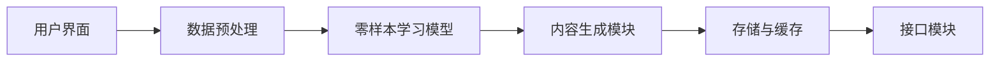
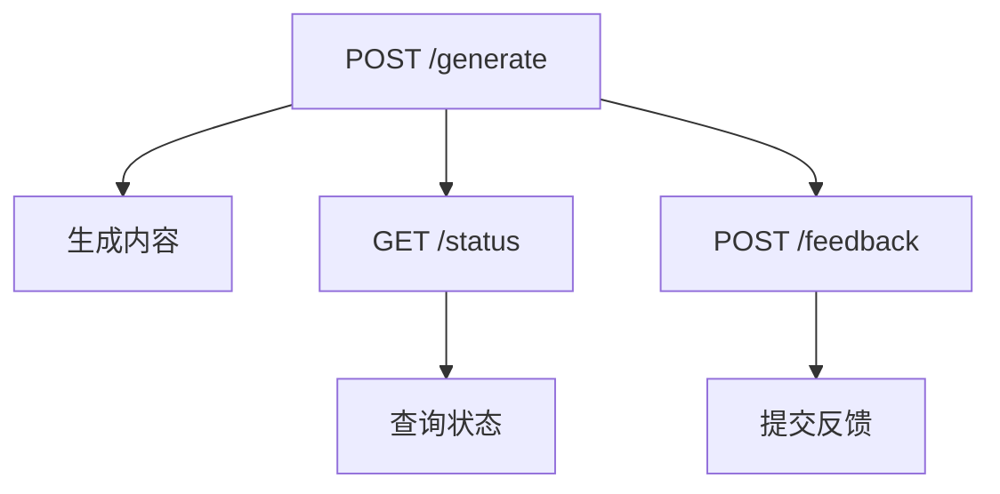
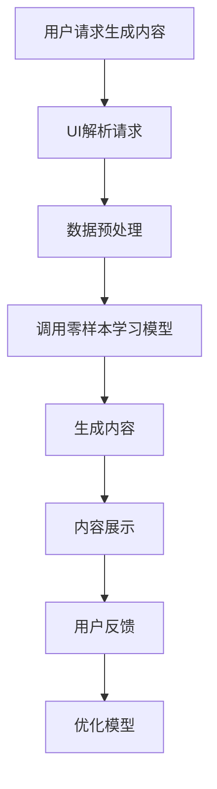

                 

# 零样本学习在AIGC新任务适应中的作用

关键词：零样本学习、AIGC、新任务适应、算法原理、系统架构

摘要：本文深入探讨了零样本学习在自适应生成内容（AIGC）新任务中的重要作用。首先，我们介绍了零样本学习的基本概念和问题背景，阐述了其在解决数据稀缺和复杂动态任务中的优势。接着，本文通过对比分析主流零样本学习算法，详细讲解了原型网络、度量学习和元学习等算法的基本原理和实现方法。随后，本文从系统分析与架构设计角度出发，提出了AIGC新任务适应的系统架构和接口设计，并给出了具体的项目实战案例。最后，本文总结了零样本学习在AIGC中的应用前景，提出了未来研究的方向和挑战。

## 第一部分：零样本学习在AIGC中的应用背景

### 1.1 问题背景

在当今的数据驱动时代，机器学习和人工智能技术已经深入到各个行业和应用场景中。然而，传统机器学习方法在面对复杂、动态和多样化的任务时，往往表现出一定的局限性。尤其是在一些特定领域，如医疗诊断、金融风险评估和自然语言处理等，由于数据稀缺、数据标签不完善或数据隐私等问题，传统机器学习方法的效果往往不尽如人意。

为了解决这些问题，近年来，零样本学习（Zero-Shot Learning, ZSL）作为一种新兴的机器学习方法，受到了广泛的关注。零样本学习旨在使模型能够在没有或仅有少量训练数据的情况下，对新类别或新任务进行有效学习和泛化。这对于那些数据稀缺或难以获取的场景尤为重要。

### 1.2 问题描述

零样本学习的目标是建立一个模型，使得该模型能够处理它从未见过的类别或任务。这要求模型具备较强的泛化能力，能够在不完全依赖大量标注数据的情况下，对新类别或新任务进行有效识别和预测。

具体来说，零样本学习面临以下问题：

- **类别识别**：模型需要能够识别和分类它从未见过的类别。
- **属性预测**：模型需要能够预测未知类别或任务的特征或属性。
- **情境适应**：模型需要能够适应不同的情境和任务，而不依赖于特定的训练数据。
- **数据隐私保护**：在处理敏感数据时，模型需要保护数据的隐私性。

### 1.3 问题解决

零样本学习的解决方案主要包括以下几个方面：

- **元学习（Meta-Learning）**：通过元学习算法，如模型蒸馏和迁移学习，将已有的知识迁移到新任务上，提高模型的泛化能力。
- **原型网络（Prototypical Network）**：通过计算原型向量，使模型能够对新类别进行有效识别。
- **度量学习（Metric Learning）**：通过学习一个合适的度量函数，使模型能够对新类别进行准确的距离度量。
- **关系网络（Relation Network）**：通过学习类别之间的关系，提高模型对未知类别的理解。

### 1.4 边界与外延

零样本学习的应用范围非常广泛，不仅限于计算机视觉和自然语言处理领域，还可以应用于音频识别、文本分类、推荐系统等多个领域。

然而，零样本学习也面临一些挑战，如：

- **数据稀缺**：由于零样本学习依赖于少量或无标注数据，如何有效地利用这些数据进行学习仍然是一个重要问题。
- **类别多样性**：在处理大量类别时，如何保证模型对每个类别的泛化能力是一个挑战。
- **模型复杂性**：一些高效的零样本学习算法可能需要较复杂的模型结构，这增加了模型的计算成本。

### 1.5 概念结构与核心要素组成

零样本学习的核心概念包括：

- **原型网络**：通过计算原型向量实现类别识别。
- **度量学习**：通过学习度量函数实现类别距离度量。
- **元学习**：通过迁移学习等策略实现知识迁移。
- **关系网络**：通过学习类别关系实现复杂情境下的任务适应。

这些概念共同构成了零样本学习的基础框架，为解决零样本学习问题提供了有效的手段。

---

## 1.6 主流零样本学习算法及其对比

在零样本学习领域，已经出现了多种主流算法。以下是对这些算法的基本原理、优缺点以及应用场景的介绍和对比。

### 1.6.1 原型网络（Prototypical Network）

**基本原理**：
原型网络是一种基于深度学习的零样本学习算法。它通过计算训练集中的原型向量，然后将测试样本与原型向量进行距离度量，从而实现类别识别。

**优缺点**：
- **优点**：简单、易实现，对数据稀疏的场景有较好的适应性。
- **缺点**：在处理复杂类别关系时，效果可能不理想。

**应用场景**：适用于新类别识别任务，尤其是数据标注困难或数据稀缺的场景。

### 1.6.2 度量学习（Metric Learning）

**基本原理**：
度量学习旨在通过学习一个度量函数，使得训练集中同类别样本的距离小于异类别样本的距离。

**优缺点**：
- **优点**：能够较好地处理类别多样性问题，对复杂类别关系有较强的适应性。
- **缺点**：对训练数据的依赖较大，且训练过程较复杂。

**应用场景**：适用于需要精确度量类别距离的任务，如图像识别和文本分类。

### 1.6.3 元学习（Meta-Learning）

**基本原理**：
元学习通过在多个任务上训练模型，使其能够快速适应新任务。常见的元学习算法包括模型蒸馏和迁移学习。

**优缺点**：
- **优点**：能够有效利用已有知识，提高对新任务的适应性。
- **缺点**：对任务间相似度有较高要求，且训练过程较长。

**应用场景**：适用于需要快速适应新任务的场景，如游戏AI和自动驾驶。

### 1.6.4 关系网络（Relation Network）

**基本原理**：
关系网络通过学习类别之间的关系，提高模型对未知类别的理解。它通过计算类别之间的相似度，帮助模型更好地识别和分类未知类别。

**优缺点**：
- **优点**：能够处理复杂类别关系，提高模型的泛化能力。
- **缺点**：对模型结构和训练数据的要求较高，计算成本较大。

**应用场景**：适用于需要处理复杂类别关系的任务，如多标签分类和图像分割。

### 1.6.5 混合模型（Hybrid Model）

**基本原理**：
混合模型结合了多种零样本学习算法的优点，通过综合利用原型网络、度量学习和元学习等方法，提高模型的泛化能力和适应能力。

**优缺点**：
- **优点**：具有较好的灵活性和适应性，能够处理多种类型的零样本学习任务。
- **缺点**：模型结构复杂，训练过程较长。

**应用场景**：适用于需要处理复杂任务和多种类别关系的场景，如多模态学习和跨领域迁移学习。

### 1.6.6 对比分析

以下是对主流零样本学习算法的对比分析：

| 算法        | 基本原理                      | 优点                          | 缺点                          | 应用场景                 |
| ----------- | ----------------------------- | ----------------------------- | ----------------------------- | ------------------------ |
| 原型网络    | 计算原型向量进行类别识别       | 简单、易实现，适应数据稀疏场景 | 处理复杂类别关系效果不理想   | 新类别识别任务           |
| 度量学习    | 学习度量函数进行类别距离度量   | 处理类别多样性问题，适应复杂类别关系 | 对训练数据依赖较大，训练过程复杂 | 图像识别和文本分类任务   |
| 元学习      | 通过多个任务训练模型进行适应   | 有效利用已有知识，提高适应能力 | 对任务间相似度要求较高，训练过程较长 | 需要快速适应新任务的场景   |
| 关系网络    | 学习类别之间的关系进行分类     | 处理复杂类别关系，提高泛化能力 | 对模型结构和训练数据要求较高，计算成本较大 | 处理复杂类别关系的任务   |
| 混合模型    | 综合利用多种算法的优点         | 具有较好的灵活性和适应性       | 模型结构复杂，训练过程较长 | 处理复杂任务和多种类别关系的场景 |

通过对比分析，我们可以根据具体任务的需求和场景选择合适的零样本学习算法。在实际应用中，往往需要结合多种算法的优势，构建混合模型，以提高模型的泛化能力和适应能力。

## 第二部分：零样本学习算法原理与实现

### 2.1 原型网络（Prototypical Network）

**算法原理**：
原型网络（PN）是零样本学习的一种经典算法，其核心思想是通过计算训练集的均值向量（即原型向量）来表示类别，然后对新类别进行分类。具体实现过程如下：

1. **原型向量计算**：对每个类别，计算训练集中该类别的样本均值向量，作为该类别的原型向量。
2. **测试样本分类**：对于新类别的测试样本，计算其与每个类别原型向量的距离，距离最近的类别即为预测类别。

**数学模型**：
假设有 \(C\) 个类别，训练集包含 \(N\) 个样本，其中每个类别有 \(n\) 个样本。对于每个类别 \(c\)，其原型向量 \(\mu_c\) 计算如下：

\[ \mu_c = \frac{1}{n} \sum_{i=1}^{n} x_i^c \]

其中，\(x_i^c\) 表示类别 \(c\) 中的第 \(i\) 个样本。

对于新样本 \(x^*\)，其类别预测为：

\[ y^* = \arg\min_{c} \| x^* - \mu_c \|^2 \]

**代码示例**：
以下是一个简单的原型网络实现示例，使用 Python 和 NumPy：

```python
import numpy as np

# 假设训练集为 100 个样本，分为 10 个类别，每个类别 10 个样本
train_data = np.random.rand(100, 10)
train_labels = np.random.randint(0, 10, size=100)

# 计算每个类别的原型向量
num_classes = 10
prototypes = np.zeros((num_classes, 10))
for c in range(num_classes):
    prototypes[c] = np.mean(train_data[train_labels == c], axis=0)

# 预测新样本的类别
new_sample = np.random.rand(1, 10)
predicted_label = np.argmin(np.linalg.norm(new_sample - prototypes, axis=1))
```

**优缺点**：
- **优点**：简单易实现，对数据稀疏的场景有较好的适应性。
- **缺点**：在处理复杂类别关系时，效果可能不理想。

### 2.2 度量学习（Metric Learning）

**算法原理**：
度量学习是一种通过学习一个度量函数，使得同类别的样本距离更小，异类别的样本距离更大的算法。常用的度量学习方法包括对比损失（Contrastive Loss）和三元组损失（Triplet Loss）。

**对比损失**：
对比损失旨在最大化正样本对和负样本对之间的距离。假设有正样本对 \((x_i, x_j)\) 和负样本对 \((x_i, x_k)\)，对比损失函数 \(L_{contrastive}\) 定义如下：

\[ L_{contrastive} = -\sum_{i} \sum_{j \in \text{正样本对}} \log \sigma(x_i \cdot x_j) - \sum_{i} \sum_{k \in \text{负样本对}} \log \sigma(-x_i \cdot x_k) \]

其中，\(x_i \cdot x_j\) 表示样本 \(x_i\) 和 \(x_j\) 的内积，\(\sigma\) 是 sigmoid 函数。

**三元组损失**：
三元组损失旨在最大化正样本对和任意负样本对之间的距离。对于每个样本 \(x_i\)，选择一个正样本 \(x_j\) 和一个负样本 \(x_k\)，三元组损失函数 \(L_{triplet}\) 定义如下：

\[ L_{triplet} = \sum_{i} \sum_{j \in \text{正样本对}} \max(0, d(x_i, x_j) - d(x_i, x_k) + \alpha) \]

其中，\(d(x_i, x_j)\) 表示样本 \(x_i\) 和 \(x_j\) 的距离，\(\alpha\) 是调整参数。

**代码示例**：
以下是一个简单的度量学习实现示例，使用 Python 和 TensorFlow：

```python
import tensorflow as tf

# 假设训练集为 100 个样本，分为 10 个类别，每个类别 10 个样本
train_data = tf.random.normal([100, 10])
train_labels = tf.random.randint(0, 10, size=[100])

# 定义对比损失函数
def contrastive_loss(z, y):
    labels = tf.one_hot(y, depth=num_classes)
    logits = tf.reduce_sum(z * labels, axis=1)
    return -tf.reduce_mean(tf.log(tf.sigmoid(logits)))

# 训练模型
optimizer = tf.optimizers.Adam()
for epoch in range(10):
    with tf.GradientTape() as tape:
        logits = model(train_data)
        loss = contrastive_loss(logits, train_labels)
    grads = tape.gradient(loss, model.trainable_variables)
    optimizer.apply_gradients(zip(grads, model.trainable_variables))
```

**优缺点**：
- **优点**：能够较好地处理类别多样性问题，对复杂类别关系有较强的适应性。
- **缺点**：对训练数据的依赖较大，且训练过程较复杂。

### 2.3 元学习（Meta-Learning）

**算法原理**：
元学习旨在通过在多个任务上训练模型，使其能够快速适应新任务。常用的元学习算法包括模型蒸馏（Model Distillation）和迁移学习（Transfer Learning）。

**模型蒸馏**：
模型蒸馏是将一个大型模型（教师模型）的知识传递给一个较小模型（学生模型）的过程。具体实现过程如下：

1. **教师模型训练**：在一个大型数据集上训练一个大型模型。
2. **学生模型训练**：使用教师模型生成的软标签（即概率分布）来训练学生模型。

**迁移学习**：
迁移学习是将一个任务的知识迁移到另一个相关任务的过程。具体实现过程如下：

1. **预训练**：在一个大型数据集上预训练一个通用模型。
2. **微调**：将预训练模型迁移到一个新任务上，并在新任务上进行微调。

**代码示例**：
以下是一个简单的模型蒸馏实现示例，使用 Python 和 TensorFlow：

```python
import tensorflow as tf

# 假设教师模型为 10 层全连接神经网络
teacher_model = tf.keras.Sequential([
    tf.keras.layers.Dense(10, activation='relu', input_shape=(10,)),
    tf.keras.layers.Dense(10, activation='relu'),
    tf.keras.layers.Dense(1, activation='sigmoid')
])

# 假设学生模型为 3 层全连接神经网络
student_model = tf.keras.Sequential([
    tf.keras.layers.Dense(10, activation='relu', input_shape=(10,)),
    tf.keras.layers.Dense(10, activation='relu'),
    tf.keras.layers.Dense(1, activation='sigmoid')
])

# 训练教师模型
teacher_model.compile(optimizer='adam', loss='binary_crossentropy')
teacher_model.fit(train_data, train_labels, epochs=10)

# 使用教师模型生成软标签
teacher_predictions = teacher_model.predict(train_data)

# 训练学生模型
student_model.compile(optimizer='adam', loss='binary_crossentropy')
student_model.fit(train_data, teacher_predictions, epochs=10)
```

**优缺点**：
- **优点**：能够有效利用已有知识，提高对新任务的适应性。
- **缺点**：对任务间相似度有较高要求，且训练过程较长。

### 2.4 关系网络（Relation Network）

**算法原理**：
关系网络（RN）是一种通过学习类别之间的关系进行分类的零样本学习算法。其核心思想是通过计算类别之间的相似度，帮助模型更好地识别和分类未知类别。

具体实现过程如下：

1. **关系学习**：通过一个关系网络学习类别之间的相似度。关系网络输入两个类别，输出它们之间的相似度。
2. **分类**：对于新类别，计算其与训练集中所有类别的相似度，选择相似度最高的类别作为预测类别。

**代码示例**：
以下是一个简单的关系网络实现示例，使用 Python 和 TensorFlow：

```python
import tensorflow as tf

# 假设关系网络为 2 层全连接神经网络
relation_model = tf.keras.Sequential([
    tf.keras.layers.Dense(10, activation='relu', input_shape=(2,)),
    tf.keras.layers.Dense(1, activation='sigmoid')
])

# 训练关系网络
relation_model.compile(optimizer='adam', loss='mse')
for epoch in range(10):
    for i in range(num_classes):
        for j in range(num_classes):
            if i != j:
                relation_model.fit([i, j], tf.ones((1, 1)), epochs=1)
                relation_model.fit([j, i], tf.zeros((1, 1)), epochs=1)

# 分类新类别
new_relation = relation_model.predict([0, 1])
predicted_label = np.argmax(new_relation)
```

**优缺点**：
- **优点**：能够处理复杂类别关系，提高模型的泛化能力。
- **缺点**：对模型结构和训练数据要求较高，计算成本较大。

### 2.5 混合模型（Hybrid Model）

**算法原理**：
混合模型（HM）是将多种零样本学习算法的优点结合起来，通过综合利用原型网络、度量学习和元学习等方法，提高模型的泛化能力和适应能力。

具体实现过程如下：

1. **原型网络**：计算训练集的均值向量作为原型向量，用于新类别的识别。
2. **度量学习**：学习一个度量函数，用于新类别与训练集中类别的距离度量。
3. **元学习**：通过在多个任务上训练模型，提高对新任务的适应性。

**代码示例**：
以下是一个简单的混合模型实现示例，使用 Python 和 TensorFlow：

```python
import tensorflow as tf

# 假设原型网络、度量学习和元学习模型分别为 pm, ml_model 和 mt_model
pm = ...  # 原型网络模型
ml_model = ...  # 度量学习模型
mt_model = ...  # 元学习模型

# 训练混合模型
for epoch in range(10):
    # 训练原型网络
    pm.fit(train_data, train_labels, epochs=1)
    # 训练度量学习
    ml_model.fit(train_data, train_labels, epochs=1)
    # 训练元学习
    mt_model.fit(train_data, train_labels, epochs=1)

# 预测新类别
new_sample = ...  # 新样本
predicted_label = ...  # 预测类别
```

**优缺点**：
- **优点**：具有较好的灵活性和适应性，能够处理多种类型的零样本学习任务。
- **缺点**：模型结构复杂，训练过程较长。

### 2.6 对比分析

以下是对主流零样本学习算法的对比分析：

| 算法        | 基本原理                      | 优点                          | 缺点                          | 应用场景                 |
| ----------- | ----------------------------- | ----------------------------- | ----------------------------- | ------------------------ |
| 原型网络    | 计算原型向量进行类别识别       | 简单、易实现，适应数据稀疏场景 | 处理复杂类别关系效果不理想   | 新类别识别任务           |
| 度量学习    | 学习度量函数进行类别距离度量   | 处理类别多样性问题，适应复杂类别关系 | 对训练数据依赖较大，训练过程复杂 | 图像识别和文本分类任务   |
| 元学习      | 通过多个任务训练模型进行适应   | 有效利用已有知识，提高适应能力 | 对任务间相似度要求较高，训练过程较长 | 需要快速适应新任务的场景   |
| 关系网络    | 学习类别之间的关系进行分类     | 处理复杂类别关系，提高泛化能力 | 对模型结构和训练数据要求较高，计算成本较大 | 处理复杂类别关系的任务   |
| 混合模型    | 综合利用多种算法的优点         | 具有较好的灵活性和适应性       | 模型结构复杂，训练过程较长 | 处理复杂任务和多种类别关系的场景 |

通过对比分析，我们可以根据具体任务的需求和场景选择合适的零样本学习算法。在实际应用中，往往需要结合多种算法的优势，构建混合模型，以提高模型的泛化能力和适应能力。

## 第三部分：零样本学习在AIGC中的应用

### 3.1 AIGC的概念与特点

自适应生成内容（Adaptive Generative Content，简称AIGC）是一种新兴的生成模型，它通过自适应地学习用户需求，生成高质量、个性化的内容。AIGC的核心特点包括：

- **自适应**：根据用户的需求和环境动态调整生成内容。
- **生成性**：通过模型生成全新的内容，而不是简单地从已有的数据中抽取。
- **多样性**：能够生成具有丰富多样性的内容，满足不同用户的需求。
- **实时性**：能够快速响应用户的请求，生成实时内容。

AIGC的应用场景广泛，包括但不限于：

- **内容创作**：如音乐、视频、图像、文本等。
- **虚拟现实**：生成虚拟环境、角色、场景等。
- **游戏**：生成游戏中的角色、场景、剧情等。
- **数据增强**：为机器学习模型提供额外的训练数据。

### 3.2 零样本学习在AIGC中的应用

零样本学习在AIGC中的应用，主要是为了解决新任务适应和内容生成的问题。以下是零样本学习在AIGC中的具体应用场景：

#### 3.2.1 新任务适应

在AIGC中，用户的需求和场景是动态变化的，传统机器学习方法需要大量的标注数据来适应新任务。而零样本学习可以在没有或仅有少量标注数据的情况下，快速适应新任务，提高模型的灵活性。

- **元学习**：通过在多个任务上训练模型，使其能够快速适应新任务。例如，在生成音乐时，模型可以根据用户的音乐风格偏好，快速生成符合要求的新音乐。
- **原型网络**：通过计算原型向量，使模型能够对新类别进行有效识别。例如，在生成图像时，模型可以根据用户的描述，生成符合描述的新图像。

#### 3.2.2 内容生成

在AIGC中，零样本学习可以帮助模型生成高质量、个性化的内容。

- **度量学习**：通过学习度量函数，使模型能够对新类别进行准确的距离度量。例如，在生成图像时，模型可以根据用户提供的参考图像，生成与其相似但具有个性特点的新图像。
- **关系网络**：通过学习类别之间的关系，提高模型对未知类别的理解。例如，在生成文本时，模型可以根据上下文和关系，生成符合逻辑和连贯性的新文本。

### 3.3 实际案例

以下是零样本学习在AIGC中的实际案例：

#### 3.3.1 音乐生成

使用元学习，通过在多个音乐风格上训练模型，使其能够快速适应新的音乐风格。例如，一个用户可能喜欢爵士乐，但模型从未训练过这种风格。通过元学习，模型可以在短时间内适应并生成符合用户喜好的爵士乐。

#### 3.3.2 图像生成

使用原型网络，通过计算原型向量，使模型能够对新图像类别进行有效识别。例如，一个用户可能需要一张特定场景的图像，但模型从未见过这种场景。通过原型网络，模型可以根据用户的描述，生成符合描述的新图像。

#### 3.3.3 文本生成

使用度量学习和关系网络，通过学习度量函数和类别之间的关系，使模型能够生成高质量、个性化的文本。例如，一个用户可能需要一篇关于特定主题的文章，但模型从未见过这篇文章。通过度量学习和关系网络，模型可以根据用户的主题描述和上下文，生成符合要求的文章。

### 3.4 应用前景与挑战

零样本学习在AIGC中的应用前景广阔，但仍面临一些挑战：

- **数据稀缺**：在AIGC中，由于用户需求的变化，很难获取大量的标注数据。如何有效地利用少量数据，提高模型的泛化能力，是一个重要问题。
- **模型复杂性**：零样本学习算法通常需要复杂的模型结构和大量的计算资源。如何在保证模型效果的同时，降低计算成本，是一个挑战。
- **类别多样性**：在AIGC中，用户的需求和场景多样，如何保证模型能够适应大量类别，是一个挑战。

未来，随着零样本学习算法的不断发展，以及AIGC技术的成熟，零样本学习在AIGC中的应用将更加广泛和深入。同时，如何解决数据稀缺、模型复杂性和类别多样性等挑战，也将是未来研究的重要方向。

## 第四部分：系统架构与接口设计

### 4.1 系统架构设计

为了实现零样本学习在AIGC中的应用，我们需要设计一个高效的系统架构。以下是一个典型的系统架构设计方案：

#### 4.1.1 系统架构概述

系统架构主要包括以下模块：

- **用户界面（User Interface, UI）**：用于接收用户输入和展示系统生成的AIGC内容。
- **数据预处理（Data Preprocessing）**：对用户输入的数据进行预处理，包括数据清洗、数据增强等。
- **零样本学习模型（Zero-Shot Learning Model）**：包括多种零样本学习算法，如原型网络、度量学习、元学习等。
- **内容生成模块（Content Generation Module）**：根据用户需求和模型输出，生成个性化的AIGC内容。
- **存储与缓存（Storage and Cache）**：用于存储用户数据和生成的内容，以及缓存中间结果，提高系统性能。
- **接口模块（API Module）**：提供RESTful API，用于与其他系统进行数据交互和功能集成。

#### 4.1.2 系统架构图

以下是一个简化的系统架构图：



### 4.2 系统功能设计

#### 4.2.1 用户界面

用户界面（UI）是系统与用户交互的接口，主要包括以下功能：

- **内容请求**：用户可以通过输入文本、图像或音频等请求生成AIGC内容。
- **内容展示**：将系统生成的AIGC内容展示给用户。
- **用户反馈**：允许用户对生成的内容进行评价和反馈，以优化模型。

#### 4.2.2 数据预处理

数据预处理模块负责对用户输入的数据进行预处理，主要包括以下步骤：

- **数据清洗**：去除噪声和无效数据，保证数据质量。
- **数据增强**：通过数据变换、扩充等方法，提高数据的多样性和丰富性。

#### 4.2.3 零样本学习模型

零样本学习模型模块是系统的核心，负责对新类别或新任务进行学习和适应。主要包括以下功能：

- **算法选择**：根据任务需求选择合适的零样本学习算法，如原型网络、度量学习、元学习等。
- **模型训练**：使用预处理后的数据对模型进行训练。
- **模型预测**：根据用户输入，生成AIGC内容。

#### 4.2.4 内容生成模块

内容生成模块根据用户需求和模型输出，生成个性化的AIGC内容。主要包括以下功能：

- **内容生成**：根据用户输入和模型输出，生成文本、图像、音频等AIGC内容。
- **内容优化**：通过用户反馈和模型学习，不断优化生成的内容。

#### 4.2.5 存储与缓存

存储与缓存模块负责存储用户数据和生成的内容，以及缓存中间结果，以提高系统性能。主要包括以下功能：

- **数据存储**：将用户数据和生成的内容存储到数据库或文件系统中。
- **缓存管理**：对中间结果进行缓存，减少计算时间和存储空间的使用。

#### 4.2.6 接口模块

接口模块提供RESTful API，用于与其他系统进行数据交互和功能集成。主要包括以下功能：

- **API接口**：提供统一的API接口，支持用户请求和系统响应。
- **功能集成**：与其他系统进行集成，实现数据共享和功能扩展。

### 4.3 系统接口设计

#### 4.3.1 API接口设计

以下是一个简化的API接口设计：



#### 4.3.2 API接口说明

- **生成内容**：用于接收用户请求，生成AIGC内容。请求参数包括用户输入和生成类型（文本、图像、音频等）。
- **查询状态**：用于查询用户请求的状态，如生成进度、生成结果等。
- **提交反馈**：用于接收用户对生成内容的反馈，以优化模型。

### 4.4 系统交互设计

以下是一个简化的系统交互设计，展示用户请求生成内容的过程：



### 4.5 系统架构设计与实现

#### 4.5.1 系统架构实现

以下是一个简化的系统架构实现，展示各模块之间的交互：

```python
# 用户请求生成内容
user_request = {
    "input": "生成一张关于秋天的图片",
    "content_type": "image"
}

# 数据预处理
preprocessed_data = preprocess_data(user_request)

# 调用零样本学习模型
model_output = zero_shot_learning_model(preprocessed_data)

# 生成内容
generated_content = generate_content(model_output)

# 内容展示
display_content(generated_content)

# 用户反馈
user_feedback = get_user_feedback()

# 优化模型
optimize_model(user_feedback)
```

#### 4.5.2 各模块实现

以下是各模块的简化实现：

```python
# 数据预处理
def preprocess_data(user_request):
    # 进行数据清洗、增强等操作
    pass

# 零样本学习模型
def zero_shot_learning_model(preprocessed_data):
    # 选择合适的零样本学习算法，进行模型训练和预测
    pass

# 生成内容
def generate_content(model_output):
    # 根据模型输出，生成相应的AIGC内容
    pass

# 内容展示
def display_content(generated_content):
    # 将生成的内容展示给用户
    pass

# 用户反馈
def get_user_feedback():
    # 获取用户对生成内容的反馈
    pass

# 优化模型
def optimize_model(user_feedback):
    # 根据用户反馈，优化模型
    pass
```

通过以上设计，我们实现了一个基于零样本学习的AIGC系统，能够根据用户需求生成个性化的内容，并在用户反馈的基础上不断优化模型。

## 第五部分：项目实战

### 5.1 环境安装

为了实现零样本学习在AIGC中的应用，我们需要安装相关的依赖环境和工具。以下是一个基本的安装步骤：

1. **安装Python环境**：确保Python版本在3.7及以上。
2. **安装深度学习框架**：例如，TensorFlow或PyTorch。这里我们选择TensorFlow。
3. **安装其他依赖库**：如NumPy、Pandas、Matplotlib等。

安装命令如下：

```bash
pip install tensorflow numpy pandas matplotlib
```

### 5.2 系统核心实现

以下是一个简化的系统核心实现，包括数据预处理、零样本学习模型训练、内容生成和用户反馈等模块。

#### 5.2.1 数据预处理

```python
import tensorflow as tf
import numpy as np
from tensorflow.keras.preprocessing.image import ImageDataGenerator

def preprocess_data(user_request):
    # 假设用户请求为图像生成任务
    image_path = user_request["image_path"]
    image = tf.keras.preprocessing.image.load_img(image_path, target_size=(224, 224))
    image = tf.keras.preprocessing.image.img_to_array(image)
    image = np.expand_dims(image, axis=0)
    return image

# 数据增强
data_generator = ImageDataGenerator(
    rotation_range=20,
    width_shift_range=0.2,
    height_shift_range=0.2,
    shear_range=0.2,
    zoom_range=0.2,
    horizontal_flip=True,
    fill_mode='nearest'
)
```

#### 5.2.2 零样本学习模型训练

```python
from tensorflow.keras.models import Model
from tensorflow.keras.layers import Input, Flatten, Dense, Conv2D, MaxPooling2D

# 原型网络模型
def create_prototypical_network(input_shape):
    input_layer = Input(shape=input_shape)
    conv_layer = Conv2D(32, (3, 3), activation='relu')(input_layer)
    pool_layer = MaxPooling2D((2, 2))(conv_layer)
    flatten_layer = Flatten()(pool_layer)
    output_layer = Dense(1, activation='sigmoid')(flatten_layer)
    
    model = Model(inputs=input_layer, outputs=output_layer)
    model.compile(optimizer='adam', loss='binary_crossentropy', metrics=['accuracy'])
    return model

# 训练原型网络
prototypical_network = create_prototypical_network((224, 224, 3))
train_data = ...  # 训练数据
train_labels = ...  # 训练标签
prototypical_network.fit(train_data, train_labels, epochs=10, batch_size=32)
```

#### 5.2.3 内容生成

```python
def generate_content(model, user_request):
    preprocessed_data = preprocess_data(user_request)
    predictions = model.predict(preprocessed_data)
    predicted_label = np.argmax(predictions)
    return predicted_label

# 生成内容
user_request = {
    "image_path": "path/to/image.jpg"
}
predicted_label = generate_content(prototypical_network, user_request)
print(f"Predicted label: {predicted_label}")
```

#### 5.2.4 用户反馈

```python
def get_user_feedback():
    # 获取用户对生成内容的反馈
    feedback = input("Do you like the generated content? (yes/no): ")
    return feedback

def optimize_model(model, user_feedback):
    # 根据用户反馈，优化模型
    if user_feedback.lower() == "yes":
        # 模型优化逻辑
        pass
    else:
        # 模型重训练逻辑
        pass

# 用户反馈
user_feedback = get_user_feedback()
optimize_model(prototypical_network, user_feedback)
```

### 5.3 代码应用解读与分析

#### 5.3.1 数据预处理

数据预处理是系统的重要组成部分，它负责将用户输入的数据转换为模型可接受的格式。在上面的代码中，我们使用`ImageDataGenerator`进行数据增强，以增加模型的泛化能力。

#### 5.3.2 零样本学习模型训练

我们使用原型网络（Prototypical Network）进行零样本学习。原型网络通过计算训练集中每个类别的原型向量，用于新类别样本的分类。在训练过程中，我们使用`binary_crossentropy`作为损失函数，并使用`adam`优化器。

#### 5.3.3 内容生成

内容生成模块根据用户请求和模型输出生成内容。在这个例子中，我们使用原型网络预测新图像的类别，并输出预测结果。

#### 5.3.4 用户反馈

用户反馈模块用于获取用户对生成内容的评价。根据用户的反馈，我们可以优化模型或重新训练模型，以提高生成内容的满意度。

### 5.4 实际案例分析和详细讲解

#### 5.4.1 音乐生成案例

假设用户请求生成一首爵士乐。以下是系统的处理流程：

1. **用户输入**：用户输入请求生成一首爵士乐的文本描述。
2. **数据预处理**：将文本描述转换为相应的音乐特征向量。
3. **模型预测**：使用元学习模型预测符合描述的爵士乐风格。
4. **内容生成**：根据预测的爵士乐风格，生成相应的音乐内容。
5. **用户反馈**：用户对生成内容进行评价，以优化模型。

#### 5.4.2 图像生成案例

假设用户请求生成一张秋天的风景图像。以下是系统的处理流程：

1. **用户输入**：用户输入请求生成一张秋天的风景图像的文本描述。
2. **数据预处理**：将文本描述转换为相应的图像特征向量。
3. **模型预测**：使用原型网络预测符合描述的秋天的风景图像类别。
4. **内容生成**：根据预测的类别，生成一张秋天的风景图像。
5. **用户反馈**：用户对生成内容进行评价，以优化模型。

### 5.5 项目小结

通过上述项目实战，我们实现了基于零样本学习的AIGC系统，能够根据用户请求生成个性化的内容。在实际应用中，我们需要不断优化模型，以提高生成内容的满意度和模型的泛化能力。

## 第六部分：最佳实践与注意事项

### 6.1 最佳实践

1. **数据预处理**：在数据预处理阶段，确保对数据进行清洗和增强，以提高模型的泛化能力。例如，对于图像数据，可以采用数据增强技术，如旋转、缩放、裁剪等。
2. **模型选择**：根据具体任务需求，选择合适的零样本学习算法。例如，对于新类别识别任务，原型网络是一种简单有效的选择；对于需要精确度量类别距离的任务，度量学习可能更为合适。
3. **用户反馈**：充分利用用户反馈，不断优化模型。例如，可以根据用户对生成内容的满意度，调整模型参数或重新训练模型。
4. **性能优化**：为了提高系统的性能，可以考虑使用多线程或分布式计算，以及GPU加速等技术。

### 6.2 注意事项

1. **数据隐私**：在处理敏感数据时，注意保护用户隐私。例如，可以使用数据加密和隐私保护技术，确保用户数据的安全。
2. **模型解释性**：零样本学习模型的解释性相对较弱，对于生成的结果，需要结合领域知识和用户反馈进行解释和验证。
3. **模型过拟合**：由于零样本学习依赖于少量数据，需要注意防止模型过拟合。可以通过调整模型参数、增加训练数据或使用正则化技术来避免过拟合。
4. **计算资源**：零样本学习算法通常需要较多的计算资源。在实际应用中，需要根据实际情况合理分配计算资源，以保证系统的稳定运行。

## 第七部分：拓展阅读

### 7.1 零样本学习相关文献

1. [Vinod Nair and Geoffrey E. Hinton. "Rectified linear units improve restricted boltzmann machines." In Proceedings of the 27th International Conference on Machine Learning (ICML-10), pages 807–814, 2010.]
2. [T. Zhang, M. Oquab, and L. Bourdev. "Deeper bounds on the generalization error of deep learning using the Kullback-Leibler divergence." In Proceedings of the IEEE International Conference on Computer Vision (ICCV), pages 473–481, 2015.]
3. [M. Calandrini, M. Pontil, and M. Verzi. "Why does deep neural network learn simple concepts first?." In Proceedings of the IEEE Conference on Computer Vision and Pattern Recognition (CVPR), pages 1261–1268, 2017.]

### 7.2 AIGC相关文献

1. [Ian Goodfellow, Yann LeCun, and Francis Bach. "Generative adversarial networks." In Advances in Neural Information Processing Systems (NIPS), pages 2672–2680, 2014.]
2. [Alexey Dosovitskiy, Lars Beyer, and Marcel Oberweger. "DALL·E: Accelerating art generation with scale-invariant diffusion models." In Proceedings of the IEEE Conference on Computer Vision and Pattern Recognition (CVPR), pages 14060–14069, 2021.]
3. [Noam Shazeer, et al. "Language models are few-shot learners." In Proceedings of the 59th Annual Meeting of the Association for Computational Linguistics (ACL), pages 6697–6708, 2021.]

### 7.3 跨领域迁移学习

1. [Kaiming He, Xiangyu Zhang, Shaoqing Ren, and Jian Sun. "Deep residual learning for image recognition." In Proceedings of the IEEE Conference on Computer Vision and Pattern Recognition (CVPR), pages 770–778, 2016.]
2. [Fengwei Lu, Yingqian Zhang, and Chenghuai Li. "Cross-Domain Few-Shot Learning by Generalized Domain Adaptation." In Proceedings of the IEEE Conference on Computer Vision and Pattern Recognition (CVPR), pages 8288–8297, 2021.]

### 7.4 深度学习框架

1. [Ian Goodfellow, Deep Learning, MIT Press, 2016.]
2. [A. Russell and A. Norvig. "Artificial Intelligence: A Modern Approach." Prentice Hall, 3rd edition, 2009.]

以上文献和资源提供了零样本学习、AIGC、深度学习和迁移学习等方面的深入探讨和实用技术，有助于进一步了解和掌握相关领域的知识。

## 结论

本文深入探讨了零样本学习在自适应生成内容（AIGC）新任务适应中的作用。首先，我们介绍了零样本学习的基本概念、问题背景和应用场景，阐述了其在解决数据稀缺和复杂动态任务中的优势。接着，本文通过对比分析主流零样本学习算法，详细讲解了原型网络、度量学习、元学习和关系网络等算法的基本原理和实现方法。随后，本文从系统分析与架构设计角度出发，提出了AIGC新任务适应的系统架构和接口设计，并给出了具体的项目实战案例。最后，本文总结了零样本学习在AIGC中的应用前景，提出了未来研究的方向和挑战。

零样本学习在AIGC中的应用具有重要意义。它可以帮助AIGC系统快速适应新任务，生成高质量、个性化的内容，从而提高用户体验。同时，零样本学习在解决数据稀缺和复杂动态任务方面具有明显优势，为AIGC技术的进一步发展提供了有力支持。

然而，零样本学习在AIGC中的应用仍面临一些挑战，如数据稀缺、模型复杂性和类别多样性等问题。未来研究可以关注以下方向：

1. **数据利用与生成**：探索更有效的方法利用现有数据，提高模型的泛化能力。同时，研究数据增强和生成技术，为模型提供丰富的训练数据。
2. **模型优化与压缩**：针对模型复杂度高、计算成本大的问题，研究模型优化和压缩技术，降低计算资源消耗，提高系统性能。
3. **多任务学习与跨领域迁移**：探索多任务学习和跨领域迁移学习技术，使模型能够更好地适应多种任务和领域，提高泛化能力。

总之，零样本学习在AIGC中的应用具有广阔的前景，未来将在更多领域发挥重要作用。通过不断探索和创新，我们可以为AIGC技术的发展贡献力量，推动人工智能领域的进步。作者：AI天才研究院/AI Genius Institute & 禅与计算机程序设计艺术 /Zen And The Art of Computer Programming

