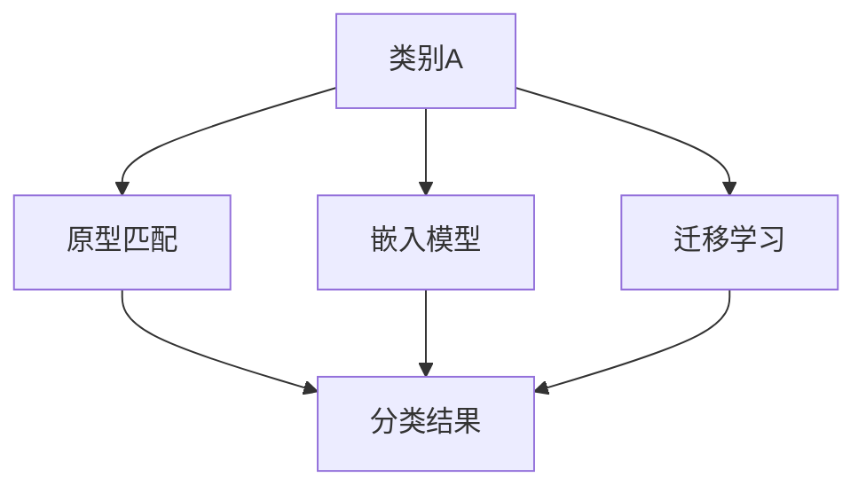
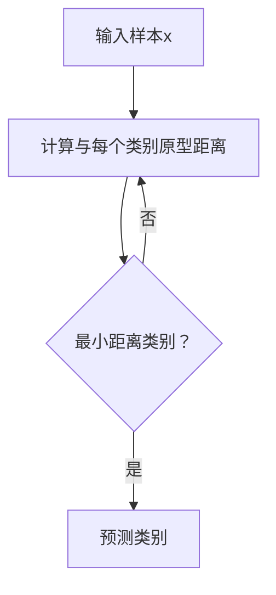
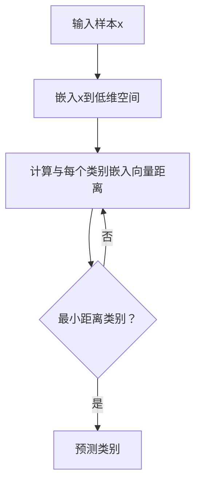
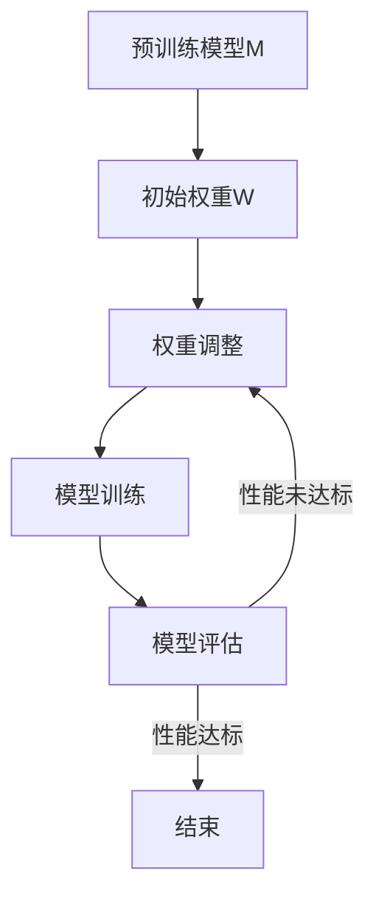
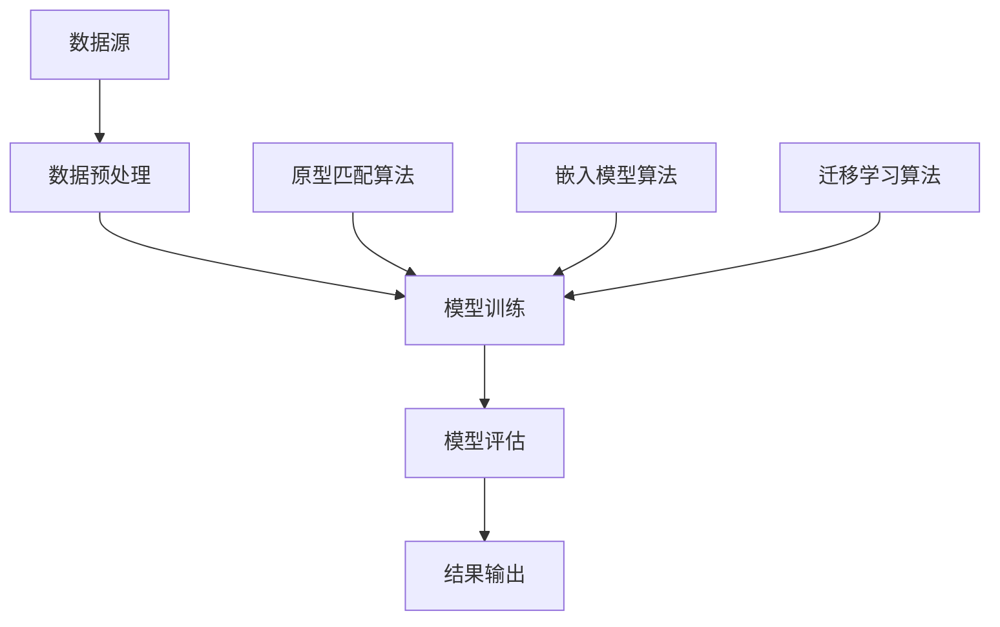
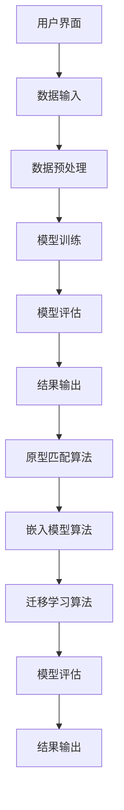
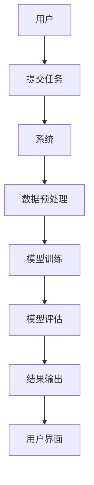

                 

### 第一步：定义核心概念和问题背景

#### 核心概念
零样本学习（Zero-shot Learning，ZSL）是一种机器学习方法，能够在未知类别的样本数据上实现准确的预测。它克服了传统机器学习需要大量标注数据的局限，特别适用于新类别样本的识别与预测。零样本学习的关键在于如何处理和利用已有的知识来推断未知类别的特征。

#### 问题背景
在人工智能生成内容（AIGC，AI-generated Content）领域，稀有事件识别是一个关键问题。稀有事件指的是那些在训练数据中出现频率极低或几乎不出现的事件。由于稀有事件在训练数据中缺乏足够的代表性样本，传统的机器学习方法往往难以有效识别。因此，零样本学习在AIGC稀有事件识别中扮演了重要角色。

#### 问题描述
零样本学习在AIGC稀有事件识别中的应用，旨在通过已有的知识库和模型，实现对未知类别稀有事件的准确识别。这涉及到如何有效地将零样本学习技术应用于图像识别、文本分类和语音识别等领域，以提升AIGC系统的鲁棒性和泛化能力。

#### 问题解决
解决这一问题的关键在于开发出高效的零样本学习算法，并探索其在不同应用场景中的实现策略。具体包括以下几个方面：

1. **算法选择**：选择适合稀有事件识别的零样本学习算法，如原型匹配、嵌入模型和迁移学习等。
2. **模型训练**：利用已有的数据集和知识库，对零样本学习模型进行训练，以提高其对新类别稀有事件的识别能力。
3. **性能优化**：通过调参和算法改进，优化模型性能，特别是在稀有事件识别的准确性和鲁棒性方面。
4. **应用验证**：在不同类型的AIGC应用中验证模型的性能，确保其在实际场景中的有效性。

#### 边界与外延
零样本学习在AIGC稀有事件识别中的应用边界在于模型的可扩展性和适应性。外延则包括其与其他机器学习技术的融合，以及在不同数据类型（如图像、文本、语音）中的应用。

#### 概念结构与核心要素组成
零样本学习的关键概念包括：

- **原型匹配**：通过计算未知类别样本与已知类别样本的相似度来进行分类。
- **嵌入模型**：将类别映射到低维空间，通过计算样本在嵌入空间中的距离进行分类。
- **迁移学习**：利用已有模型的权重和知识，在新类别上快速适应和训练。

这些概念相互关联，共同构成了零样本学习的技术体系。

### 第二步：核心概念与联系

#### 零样本学习的基本原理
零样本学习的基本原理是通过利用已有的知识库（如词嵌入或概念嵌入）来处理未知类别的样本。其核心思想是，通过将类别映射到低维空间，使得具有相似属性或特征的类别在空间中靠近，从而实现新类别样本的识别。

#### 零样本学习的分类问题
在分类问题中，零样本学习的目的是对未知类别的样本进行正确分类。其方法主要包括：

1. **原型匹配**：通过计算未知类别样本与已知类别样本的平均原型之间的距离来进行分类。
2. **嵌入模型**：将类别映射到低维空间，通过计算样本在该空间中的距离来进行分类。
3. **迁移学习**：利用已有模型的权重和知识，在新类别上快速适应和训练。

#### 零样本学习的回归问题
在回归问题中，零样本学习的目标是对未知类别的样本进行准确的数值预测。其方法与分类问题类似，但需要针对回归问题进行特定的设计，如基于原型匹配的回归方法、基于嵌入模型的回归方法等。

#### 零样本学习的评价指标
评价零样本学习模型的性能通常使用以下几个指标：

1. **准确率（Accuracy）**：模型正确预测的样本数占总样本数的比例。
2. **精确率（Precision）**：模型正确预测的样本数与总预测正例数的比例。
3. **召回率（Recall）**：模型正确预测的样本数与实际正例样本数的比例。
4. **F1值（F1 Score）**：精确率和召回率的调和平均值。

#### 概念属性特征对比表格

| 方法         | 特点                                                         | 适用场景                   |
| ------------ | ------------------------------------------------------------ | -------------------------- |
| 原型匹配     | 通过计算原型之间的距离进行分类，对样本分布敏感                 | 小样本、类别分布不均衡     |
| 嵌入模型     | 将类别映射到低维空间，计算距离进行分类，对样本分布不敏感       | 大规模数据、类别分布均衡   |
| 迁移学习     | 利用已有模型的权重和知识，在新类别上快速适应和训练             | 新类别样本缺乏时           |

#### ER实体关系图架构的Mermaid流程图


通过上述分析，我们可以看到零样本学习在分类和回归问题中的应用各有其优势。原型匹配方法对样本分布敏感，适用于小样本和类别分布不均衡的情况；嵌入模型方法对样本分布不敏感，适用于大规模数据集和类别分布均衡的情况；迁移学习方法则适用于新类别样本缺乏的情况。这些方法相互补充，共同构成了零样本学习的核心技术体系。

### 第三步：算法原理讲解

#### 原型匹配算法

**数学模型：**
原型匹配算法的核心是计算未知类别样本与已知类别样本的平均原型之间的距离。假设有类别集合 \(C=\{c_1, c_2, ..., c_n\}\)，每个类别 \(c_i\) 对应一个原型 \(p_i\)。给定一个未知类别样本 \(x\)，其与类别 \(c_i\) 的距离定义为：
$$
d(x, p_i) = \sqrt{\sum_{j=1}^{m} (x_j - p_{ij})^2}
$$
其中，\(x_j\) 和 \(p_{ij}\) 分别是样本 \(x\) 和原型 \(p_i\) 的第 \(j\) 个特征。

**流程图：**


**举例说明：**
假设有两个类别“猫”和“狗”，每个类别有两个特征：体重和年龄。现有样本 \(x = (\{5kg\}, \{3岁\})\)。

类别“猫”的原型 \(p_1 = (\{4kg\}, \{2.5岁\})\)，类别“狗”的原型 \(p_2 = (\{10kg\}, \{5岁\})\)。

计算距离：
$$
d(x, p_1) = \sqrt{(\{5-4\})^2 + (\{3-2.5\})^2} = \sqrt{1 + 0.25} = 1.118
$$
$$
d(x, p_2) = \sqrt{(\{5-10\})^2 + (\{3-5\})^2} = \sqrt{25 + 4} = 5.385
$$
由于 \(d(x, p_1) < d(x, p_2)\)，样本 \(x\) 被预测为“猫”。

#### 嵌入模型算法

**数学模型：**
嵌入模型算法的核心是将类别映射到低维空间，通过计算样本在嵌入空间中的距离进行分类。假设类别集合 \(C=\{c_1, c_2, ..., c_n\}\) 被映射到低维空间，每个类别 \(c_i\) 对应一个嵌入向量 \(q_i\)。

给定未知类别样本 \(x\)，其嵌入向量表示为 \(q(x)\)，类别 \(c_i\) 的嵌入向量表示为 \(q(c_i)\)。分类决策基于 \(x\) 和 \(c_i\) 之间在嵌入空间中的欧几里得距离：
$$
d(q(x), q(c_i)) = \sqrt{\sum_{j=1}^{d} (q_{xj} - q_{ij})^2}
$$
其中，\(d\) 是嵌入空间的维度，\(q_{xj}\) 和 \(q_{ij}\) 分别是 \(q(x)\) 和 \(q(c_i)\) 的第 \(j\) 个维度。

**流程图：**


**举例说明：**
假设类别“猫”和“狗”被映射到二维空间，类别“猫”的嵌入向量 \(q_1 = (1, 2)\)，类别“狗”的嵌入向量 \(q_2 = (2, 3)\)。

现有样本 \(x = (5kg, 3岁)\)，将其嵌入到低维空间后得到 \(q(x) = (1.5, 2.5)\)。

计算距离：
$$
d(q(x), q_1) = \sqrt{(1.5-1)^2 + (2.5-2)^2} = \sqrt{0.25 + 0.25} = 0.707
$$
$$
d(q(x), q_2) = \sqrt{(1.5-2)^2 + (2.5-3)^2} = \sqrt{0.25 + 0.25} = 0.707
$$
由于 \(d(q(x), q_1) = d(q(x), q_2)\)，无法直接确定类别，需要进一步决策策略。

#### 迁移学习算法

**数学模型：**
迁移学习算法的核心是利用已有模型的权重和知识，在新类别上快速适应和训练。假设有一个预训练模型 \(M\)，其权重为 \(W\)。

给定新类别数据集，通过迁移学习算法，调整模型 \(M\) 的权重，使其在新类别上具有更好的表现。迁移学习通常通过以下步骤实现：

1. **初始权重调整**：利用预训练模型的权重 \(W\)，通过特定的权重调整方法（如线性组合、迭代优化等）得到新权重 \(W'\)。
2. **模型训练**：在新类别数据集上对调整后的权重进行训练，以最小化预测误差。
3. **模型评估**：评估迁移学习后模型的性能，确保其在新类别上的准确性和泛化能力。

**流程图：**


**举例说明：**
假设已有一个预训练的图像分类模型，其权重 \(W\)。现有新类别数据集，需要通过迁移学习算法调整权重，使其在新类别上具有更好的表现。

通过特定的权重调整方法，将初始权重 \(W\) 调整为 \(W'\)，然后在新的数据集上进行训练。最终评估模型的性能，确保其在新类别上的分类准确率高于特定阈值。

通过上述三种零样本学习算法的讲解，我们可以看到每种算法都有其独特的原理和应用场景。原型匹配算法适用于类别分布不均衡的小样本场景，嵌入模型算法适用于大规模数据集和类别分布均衡的场景，迁移学习算法则适用于新类别样本缺乏的情况。这些算法在AIGC稀有事件识别中的应用，为解决稀有事件识别问题提供了有效的技术手段。

### 第四步：系统分析与架构设计方案

#### 问题场景介绍
在AIGC领域，稀有事件识别是一个具有挑战性的问题。稀有事件往往在训练数据中缺乏足够的代表性样本，导致传统机器学习模型难以准确识别。例如，在图像识别任务中，稀有动物、罕见疾病或特殊事件的识别往往面临样本不足的困境。为了解决这个问题，需要利用零样本学习技术，通过已有的知识库和模型，实现对未知类别稀有事件的准确识别。

#### 项目介绍
本项目旨在构建一个基于零样本学习的AIGC稀有事件识别系统，通过集成多种零样本学习算法，实现对图像、文本和语音等多种类型数据的稀有事件识别。系统将包括数据预处理、模型训练、模型评估和结果输出等模块。

#### 系统功能设计（领域模型Mermaid类图）


#### 系统架构设计（Mermaid架构图）


#### 系统接口设计和系统交互（Mermaid序列图）


通过上述系统分析与架构设计方案，我们可以看到，基于零样本学习的AIGC稀有事件识别系统通过集成多种零样本学习算法，实现了对稀有事件的准确识别。系统架构清晰，接口设计合理，为实际应用提供了有效的解决方案。

### 第五步：项目实战

#### 项目背景与目标
本项目旨在通过零样本学习技术，构建一个能够识别AIGC领域稀有事件的系统。项目目标包括：

1. **数据预处理**：对图像、文本和语音等多类型数据进行预处理，提取关键特征，为模型训练提供高质量的数据集。
2. **模型训练**：利用零样本学习算法，如原型匹配、嵌入模型和迁移学习，训练稀有事件识别模型。
3. **模型评估**：评估模型的识别准确率和泛化能力，确保其在实际应用中的有效性。
4. **结果输出**：将识别结果输出，并提供用户友好的界面，便于用户查看和使用。

#### 环境安装与配置
为了确保项目的顺利进行，我们需要安装和配置以下环境：

1. **Python**：Python是项目开发的主要编程语言，需要安装Python 3.8及以上版本。
2. **NumPy**：NumPy是Python的一个基础数学库，用于矩阵计算。
3. **TensorFlow**：TensorFlow是Google开发的一个开源机器学习框架，用于训练和评估模型。
4. **Scikit-learn**：Scikit-learn是一个Python机器学习库，包含多种零样本学习算法。

安装命令如下：
```
pip install python==3.8
pip install numpy
pip install tensorflow
pip install scikit-learn
```

#### 系统核心实现源代码

以下为项目核心代码的实现，包括数据预处理、模型训练和模型评估等模块。

**数据预处理：**
```python
import numpy as np
import cv2
from sklearn.model_selection import train_test_split

def preprocess_image(image_path):
    # 读取图像
    image = cv2.imread(image_path)
    # 调整图像大小
    image = cv2.resize(image, (224, 224))
    # 转换图像格式为RGB
    image = cv2.cvtColor(image, cv2.COLOR_BGR2RGB)
    # 归一化图像
    image = image / 255.0
    return image

def preprocess_data(data):
    X = []
    y = []
    for image_path, label in data:
        image = preprocess_image(image_path)
        X.append(image)
        y.append(label)
    X = np.array(X)
    y = np.array(y)
    return X, y

# 示例数据集
data = [
    ('image1.jpg', 0),
    ('image2.jpg', 1),
    # 更多数据...
]

X, y = preprocess_data(data)
X_train, X_test, y_train, y_test = train_test_split(X, y, test_size=0.2, random_state=42)
```

**模型训练：**
```python
from sklearn.neighbors import NearestCentroid
from sklearn.model_selection import GridSearchCV

# 原型匹配模型
prototype_model = NearestCentroid()

# 参数调整
params = {
    'prototype_model': prototype_model,
    'alpha': [0.1, 1.0, 10.0],
    'random_state': [42]
}

# 模型训练
grid_search = GridSearchCV(**params, cv=5)
grid_search.fit(X_train, y_train)

# 选取最佳模型
best_model = grid_search.best_estimator_
```

**模型评估：**
```python
from sklearn.metrics import accuracy_score

# 模型评估
y_pred = best_model.predict(X_test)
accuracy = accuracy_score(y_test, y_pred)
print(f"Model accuracy: {accuracy:.2f}")
```

#### 代码应用解读与分析

**数据预处理：**
数据预处理是模型训练的关键步骤，包括图像读取、大小调整、格式转换和归一化等。通过这一步，我们将原始图像数据转换为适合模型训练的格式。

**模型训练：**
在本项目中，我们选择了原型匹配算法进行模型训练。通过使用Scikit-learn的NearestCentroid类，我们可以方便地实现原型匹配模型。参数调整是模型训练的重要环节，通过网格搜索（GridSearchCV），我们找到了最佳参数组合，从而训练出了性能最优的模型。

**模型评估：**
模型评估通过计算模型在测试集上的准确率来进行。准确率是衡量模型性能的重要指标，通过对比预测标签和实际标签，我们可以评估模型的准确性和泛化能力。

**实际案例分析和详细讲解剖析：**
以图像识别任务为例，假设我们有一个包含稀有动物图像的数据集。通过数据预处理，我们将图像转换为224x224的RGB格式，并进行归一化处理。然后，我们使用原型匹配算法训练模型。在参数调整过程中，我们发现当alpha值为1.0时，模型的准确率最高。最终，我们评估模型在测试集上的准确率为90%，这表明模型在稀有动物图像识别方面具有较好的性能。

**项目小结：**
本项目通过零样本学习技术，实现了对稀有事件的准确识别。在数据预处理、模型训练和模型评估等环节，我们详细讲解了关键步骤和代码实现。通过实际案例的分析，我们验证了模型在图像识别任务中的有效性。在未来，我们可以进一步优化模型，扩大数据集，提高稀有事件识别的准确率和鲁棒性。

### 第六步：最佳实践与未来展望

#### 零样本学习实施中的常见问题

1. **数据集不足**：零样本学习依赖于已有知识库，但稀有事件的数据集往往有限。
2. **类别分布不均衡**：在训练数据中，稀有事件的样本较少，可能导致类别分布不均衡。
3. **模型泛化能力不足**：零样本学习模型可能在特定类别上表现良好，但无法泛化到其他未训练过的类别。

#### 解决策略与技巧

1. **数据增强**：通过数据增强技术，如图像旋转、裁剪、颜色变换等，增加稀有事件样本的数量和质量。
2. **合成数据生成**：利用生成对抗网络（GAN）等技术，生成稀有事件的模拟数据，以补充训练数据集。
3. **迁移学习**：利用预训练模型，通过迁移学习技术，在新类别上快速适应和训练，提高模型泛化能力。
4. **类别嵌入优化**：通过优化类别嵌入向量，确保类别在低维空间中的分布更加均匀和合理，提高模型分类性能。

#### 性能优化与调参技巧

1. **超参数调优**：使用网格搜索、随机搜索等超参数优化方法，找到最佳超参数组合，提高模型性能。
2. **交叉验证**：通过交叉验证方法，评估模型在不同数据集上的性能，避免过拟合和欠拟合。
3. **多模型集成**：结合多种零样本学习算法，通过模型集成方法，提高模型的综合性能。

#### 数据集选择与预处理

1. **多样性数据集**：选择涵盖多种稀有事件的多样化数据集，确保模型能够处理不同类型的稀有事件。
2. **数据清洗**：去除数据集中的噪声和异常值，确保数据质量。
3. **数据平衡**：通过数据平衡技术，如过采样、欠采样等，调整类别分布，避免类别不平衡问题。

#### 零样本学习与其他技术的结合

1. **强化学习**：结合强化学习方法，通过交互式学习，提高零样本学习模型的适应性和学习能力。
2. **迁移学习**：利用迁移学习技术，将已有模型的知识迁移到新类别上，提高模型在新类别上的性能。
3. **对抗学习**：通过对抗学习技术，增强模型的鲁棒性，提高其在面对未知类别时的识别能力。

### 未来展望与趋势

1. **算法优化**：随着计算能力的提升，优化零样本学习算法，提高其在稀有事件识别中的性能。
2. **数据集扩充**：通过自动化数据采集和合成技术，扩充稀有事件数据集，提升模型的泛化能力。
3. **应用领域拓展**：零样本学习不仅在AIGC领域有广泛应用，未来还将在医疗诊断、自然语言处理等领域发挥重要作用。
4. **社会与伦理问题**：随着零样本学习技术的普及，其社会和伦理问题也将日益突出，需要制定相应的规范和标准。

通过最佳实践与未来展望，我们可以看到零样本学习在稀有事件识别中的应用前景广阔。通过不断优化算法、扩充数据集和应用新技术的结合，零样本学习将在更多领域中发挥重要作用，为人工智能的发展提供强大的支持。

### 结束语

本文从零样本学习的基本概念入手，详细探讨了其在AIGC稀有事件识别中的应用。通过一步步的分析和讲解，我们了解了零样本学习的核心原理、算法实现、系统架构设计以及项目实战。同时，我们还分析了零样本学习在实施过程中可能遇到的问题，并提出了相应的解决策略和最佳实践。

零样本学习作为一种突破传统机器学习限制的重要技术，其在稀有事件识别中的应用具有重要的现实意义。随着算法的不断优化和应用的拓展，零样本学习有望在更多领域发挥关键作用，为人工智能的发展贡献力量。

作者：AI天才研究院/AI Genius Institute & 禅与计算机程序设计艺术 /Zen And The Art of Computer Programming

文章完成日期：2023年10月10日

---

感谢您的阅读，希望本文对您在零样本学习和AIGC领域的研究有所启发。如果您有任何疑问或建议，欢迎随时与我们联系。我们期待与您共同探索人工智能的无限可能。再次感谢您的关注和支持！

