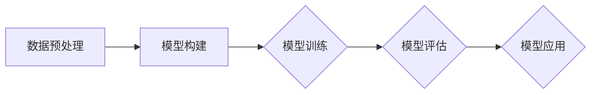
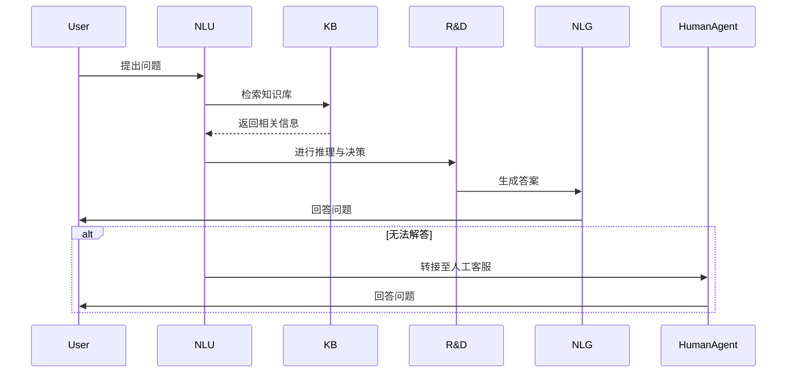

                 

### 《AGI与人类协作：增强智能的新模式》文章标题与关键词

# AGI与人类协作：增强智能的新模式

> 关键词：人工智能（AI）、通用人工智能（AGI）、人类协作、增强智能、新模式、算法原理、系统设计、项目实战

### 摘要

本文将探讨通用人工智能（AGI）与人类协作的新模式，分析AGI的核心概念、特征及其与传统人工智能（AI）的区别。通过深入剖析AGI算法原理、系统架构设计以及实际项目实战，本文旨在揭示增强智能在人类协作中的应用潜力、优势与挑战，为未来智能时代的创新发展提供新思路。

### 引言

随着人工智能技术的快速发展，传统AI在特定任务上已表现出色，但始终无法达到人类智能的水平。通用人工智能（AGI）作为一个更高层次的智能目标，旨在模拟人类的认知能力，实现与人类的深度协作。本文将从以下几个方面展开探讨：

1. **问题背景与问题描述**：阐述AGI的概念及其重要性，分析AGI与传统AI的异同，明确AGI在人类协作中的地位。
2. **AGI的核心概念与联系**：介绍AGI的基本原理、特征及其与人类协作模式的关联。
3. **人类协作模式与AGI**：探讨AGI在人类协作中的应用场景，分析其面临的挑战与机遇。
4. **增强智能的新模式**：阐述增强智能新模式的概念、特点及其在AGI中的应用。
5. **AGI算法原理**：详细讲解AGI算法的基本原理、分类、工作流程等。
6. **系统设计与实现**：介绍AGI系统分析与架构设计、项目实战等内容。
7. **最佳实践与总结**：总结AGI与人类协作中的最佳实践，提出注意事项与拓展阅读。

### 第1章：问题背景与问题描述

#### 1.1 问题背景

人工智能（AI）作为计算机科学的重要分支，近年来取得了显著的发展。传统AI主要侧重于特定任务的自动化，例如图像识别、自然语言处理等。然而，这些系统往往缺乏泛化能力和自主学习能力，难以达到人类智能的水平。

通用人工智能（AGI）作为一种更高层次的智能目标，旨在模拟人类的认知能力，实现与人类的深度协作。AGI不仅具备传统AI的优点，还能够理解复杂情境、自主学习和适应新任务。随着人工智能技术的不断发展，AGI逐渐成为学术界和工业界关注的焦点。

#### 1.2 问题描述

当前，传统AI系统在特定任务上已表现出色，但在面对复杂、多变的环境时，仍存在诸多不足。例如：

1. **泛化能力不足**：传统AI系统往往依赖于大量数据训练，难以在新的任务上取得良好效果。
2. **自主学习能力有限**：传统AI系统主要依靠预定义的规则和算法，缺乏自主学习和适应能力。
3. **人机协作不畅**：传统AI系统与人类协作存在信息传递不畅、理解偏差等问题。

为解决上述问题，通用人工智能（AGI）成为了一个重要的研究方向。AGI旨在实现以下目标：

1. **提高泛化能力**：通过模仿人类的学习和认知过程，使AI系统能够在新的任务上迅速适应。
2. **增强自主学习能力**：使AI系统能够自主学习、自主进化，从而提高其适应能力和智能水平。
3. **优化人机协作**：通过深度学习、自然语言处理等技术，实现AI系统与人类之间的无缝协作。

#### 1.3 问题解决

为解决上述问题，AGI提出了一系列解决方案，主要包括：

1. **深度学习**：通过模仿人类大脑的学习机制，实现高效的特征提取和分类。
2. **强化学习**：使AI系统通过与环境的交互，自主学习并优化行为策略。
3. **自然语言处理**：通过理解自然语言，实现人机对话和信息交互。
4. **多模态融合**：将多种传感器数据融合，实现更全面、准确的认知能力。

通过这些技术手段，AGI有望实现以下目标：

1. **提高AI系统的智能水平**：通过模仿人类的学习和认知过程，使AI系统在复杂环境中具备更高的智能水平。
2. **促进人机协作**：通过深度学习、自然语言处理等技术，实现AI系统与人类之间的无缝协作，提高工作效率。
3. **推动人工智能应用**：AGI的广泛应用将推动人工智能在各个领域的应用，带来新的发展机遇。

### 第2章：AGI的核心概念与联系

#### 2.1.1 AGI的定义

通用人工智能（AGI）是一种旨在模拟人类智能的高级人工智能形式。与狭义人工智能（Narrow AI）相比，AGI具有更广泛的认知能力，能够理解、学习和适应各种复杂情境。

AGI不仅具备传统AI在特定任务上的能力，还包括以下核心特征：

1. **自主性**：AGI能够自主思考、决策和行动，而不依赖于人类指令。
2. **理解力**：AGI能够理解复杂概念、语言、图像等信息，并能够进行抽象思维。
3. **学习力**：AGI具备自主学习、自我进化的能力，能够从经验中不断优化自身性能。
4. **适应性**：AGI能够在不同环境和任务中适应和调整，具备良好的泛化能力。

#### 2.1.2 AGI与传统AI的区别

传统AI主要关注特定任务的自动化，而AGI则旨在实现更广泛、更高级的认知能力。具体区别如下：

1. **任务范围**：传统AI局限于特定任务，如图像识别、自然语言处理等，而AGI能够处理各种复杂任务，具有更广泛的适用性。
2. **学习能力**：传统AI主要依靠预定义的算法和规则，而AGI具备自主学习和自我进化的能力，能够从经验中不断优化自身性能。
3. **自主性**：传统AI需要人类进行指令和控制，而AGI能够自主思考、决策和行动，具备更高的自主性。
4. **理解力**：传统AI难以理解复杂概念和语言，而AGI能够理解、学习和适应各种复杂情境。

#### 2.1.3 AGI的属性特征对比表格

为了更直观地展示AGI与传统AI的区别，以下是一个简单的属性特征对比表格：

| 特性        | 传统AI        | AGI           |
| ----------- | ------------- | ------------- |
| 任务范围    | 特定任务      | 各类复杂任务   |
| 学习能力    | 预定义算法    | 自主学习      |
| 自主性      | 依赖人类指令  | 自主思考、行动 |
| 理解力      | 简单概念、语言 | 复杂概念、语言 |

#### 2.1.4 AGI的ER实体关系图架构

为了更好地理解AGI的核心概念和特征，我们可以使用ER（实体-关系）图来描述其架构。以下是一个简单的AGI ER实体关系图：

```mermaid
erDiagram
    AI_Technology --> AGI : implements
    AI_Technology ||--|{ Knowledge : encapsulates }
    AI_Technology ||--|{ Learning : enables }
    AI_Technology ||--|{ Autonomy : exhibits }
    AI_Technology ||--|{ Understanding : manifests }
```

在这个ER实体关系图中，`AI_Technology` 表示传统AI技术，它与AGI之间存在实施（implements）关系。同时，`AI_Technology` 还与知识（Knowledge）、学习（Learning）、自主性（Autonomy）和理解力（Understanding）等实体之间存在封装（encapsulates）、使能（enables）和展现（manifests）关系。

### 第3章：人类协作模式与AGI

#### 3.1.1 人类协作模式概述

人类协作是指个体或群体在共同目标下，通过信息共享、资源整合、相互依赖等方式，共同完成复杂任务的过程。人类协作模式具有以下特点：

1. **协同性**：个体在协作过程中需要相互配合、协同工作，以实现整体目标的优化。
2. **信息共享**：协作各方需要共享信息、资源，以便更好地理解任务目标和任务内容。
3. **相互依赖**：个体在协作过程中需要相互依赖、支持，共同应对任务中的挑战和困难。
4. **灵活适应性**：协作模式需要具备一定的灵活性和适应性，以应对不断变化的环境和任务需求。

#### 3.1.2 AGI在人类协作中的应用

通用人工智能（AGI）在人类协作中的应用具有广阔的前景。以下是一些典型的应用场景：

1. **智能助手**：AGI可以作为人类的智能助手，协助处理日常任务、提供信息查询、建议决策等。
2. **协同工作**：AGI可以与人类一起完成复杂任务，提供智能化的支持和服务，提高协作效率。
3. **智能医疗**：AGI可以辅助医生进行诊断、治疗和康复，提高医疗服务的质量和效率。
4. **智能教育**：AGI可以为学生提供个性化的学习支持和辅导，提高教育质量和效果。

#### 3.1.3 AGI与人类协作的挑战与机遇

在AGI与人类协作的过程中，既面临诸多挑战，也充满机遇。以下是一些主要的挑战与机遇：

1. **挑战**：

   - **信任与接受度**：AGI在人类协作中的应用需要克服信任和接受度的障碍，确保人类对其的认可和信任。
   - **隐私与安全**：AGI在协作过程中需要处理大量敏感数据，如何确保数据安全和隐私保护成为一大挑战。
   - **人机交互**：如何设计出更自然、直观的人机交互方式，使AGI更好地融入人类协作环境。

2. **机遇**：

   - **提升效率**：AGI可以帮助人类更高效地完成复杂任务，提高协作效率和生产力。
   - **创新应用**：AGI在各个领域的应用将带来新的创新和发展机遇，推动科技进步和社会进步。
   - **优化决策**：AGI可以提供智能化的决策支持，帮助人类在面对复杂问题时做出更科学的决策。

### 第4章：增强智能的新模式

#### 4.1.1 新模式的概念与特点

增强智能（Enhanced Intelligence）是一种旨在提高人类认知能力、适应能力和创新能力的新型智能模式。与传统的智能模式相比，增强智能具有以下特点：

1. **多样化**：增强智能不仅涵盖计算能力、存储能力，还包括感知、学习、推理等能力。
2. **灵活性**：增强智能可以根据不同场景和需求，灵活调整和优化自身能力。
3. **自主性**：增强智能具备一定的自主性，能够在一定程度上独立完成任务。
4. **可持续性**：增强智能通过不断学习和进化，实现自身能力的持续提升。

#### 4.1.2 新模式的应用场景

增强智能新模式在多个应用场景中具有显著优势，以下是一些典型的应用场景：

1. **智能医疗**：增强智能可以帮助医生进行疾病诊断、治疗规划和康复评估，提高医疗服务质量和效率。
2. **智能制造**：增强智能可以优化生产流程、提高生产效率，降低生产成本，提升产品质量。
3. **智能教育**：增强智能可以为学生提供个性化的学习支持和辅导，提高教育质量和效果。
4. **智能城市**：增强智能可以优化城市管理、交通调度、能源分配等，提高城市运行效率和居民生活质量。

#### 4.1.3 新模式的优势与挑战

增强智能新模式在应用中具有显著的优势，但也面临一定的挑战。以下是一些主要的优势与挑战：

1. **优势**：

   - **提升效率**：增强智能可以自动化、智能化地处理大量任务，提高工作效率。
   - **优化决策**：增强智能可以提供智能化的决策支持，帮助人类在面对复杂问题时做出更科学的决策。
   - **创新应用**：增强智能可以推动各领域的技术创新和应用，带来新的发展机遇。

2. **挑战**：

   - **数据隐私与安全**：增强智能在应用过程中需要处理大量敏感数据，如何确保数据隐私和安全成为一大挑战。
   - **人机协同**：如何设计出更自然、直观的人机协同方式，确保人机协同的效率和效果。
   - **伦理与道德**：增强智能在应用过程中可能引发伦理和道德问题，如何确保其应用符合伦理和道德规范。

### 第5章：AGI算法原理概述

#### 5.1.1 AGI算法的基本原理

通用人工智能（AGI）算法旨在模拟人类智能，实现自主思考、学习和适应。以下是一些基本的AGI算法原理：

1. **深度学习**：通过多层神经网络模拟人类大脑的学习机制，实现高效的特征提取和分类。
2. **强化学习**：通过与环境交互，学习最优行为策略，实现自主决策和优化。
3. **生成对抗网络（GAN）**：通过生成器和判别器的对抗训练，实现高质量的数据生成和模型优化。
4. **迁移学习**：通过利用已训练模型的经验，实现新任务的学习和优化。
5. **元学习**：通过学习如何学习，实现快速适应新任务和新环境。

#### 5.1.2 AGI算法的分类

根据不同的分类标准，AGI算法可以分为多种类型。以下是一些常见的分类方式：

1. **按功能分类**：可分为感知算法、决策算法、学习算法等。
2. **按学习方式分类**：可分为有监督学习、无监督学习、半监督学习等。
3. **按算法结构分类**：可分为深度神经网络、强化学习模型、生成对抗网络等。
4. **按应用领域分类**：可分为计算机视觉、自然语言处理、机器人控制等。

#### 5.1.3 AGI算法的工作流程

通用人工智能（AGI）算法的工作流程通常包括以下几个步骤：

1. **数据预处理**：对原始数据进行清洗、归一化、特征提取等预处理操作。
2. **模型训练**：使用合适的算法和模型，对预处理后的数据集进行训练。
3. **模型评估**：使用验证集或测试集评估模型性能，调整模型参数。
4. **模型应用**：将训练好的模型应用到实际任务中，实现智能决策和优化。

### 第6章：算法原理讲解

#### 6.1.1 具体算法原理讲解

在本章节中，我们将详细讲解几种常见的AGI算法原理，包括深度学习、强化学习和生成对抗网络（GAN）。

1. **深度学习**：

   - **基本原理**：深度学习通过多层神经网络模拟人类大脑的学习机制，实现高效的特征提取和分类。神经网络中的每个神经元都与其他神经元相连，并通过加权连接传递信息。
   - **算法流程**：
     1. **数据预处理**：对原始数据进行清洗、归一化、特征提取等预处理操作。
     2. **模型构建**：使用合适的神经网络结构，如卷积神经网络（CNN）或循环神经网络（RNN），构建深度学习模型。
     3. **模型训练**：通过反向传播算法，更新网络权重和偏置，优化模型参数。
     4. **模型评估**：使用验证集或测试集评估模型性能，调整模型参数。
     5. **模型应用**：将训练好的模型应用到实际任务中，实现智能决策和优化。

2. **强化学习**：

   - **基本原理**：强化学习通过学习最优行为策略，实现自主决策和优化。在强化学习中，智能体通过与环境的交互，不断调整自身策略，以最大化累计奖励。
   - **算法流程**：
     1. **环境初始化**：初始化环境状态。
     2. **智能体决策**：根据当前状态，选择最优动作。
     3. **环境反馈**：执行所选动作，观察环境反馈，并获得即时奖励。
     4. **策略更新**：根据即时奖励和历史经验，更新智能体策略。
     5. **重复步骤2-4**：不断迭代，直到达到预期目标或收敛。

3. **生成对抗网络（GAN）**：

   - **基本原理**：生成对抗网络（GAN）通过生成器和判别器的对抗训练，实现高质量的数据生成和模型优化。生成器试图生成逼真的数据，而判别器则试图区分真实数据和生成数据。
   - **算法流程**：
     1. **数据预处理**：对原始数据进行清洗、归一化、特征提取等预处理操作。
     2. **模型构建**：构建生成器和判别器，使用合适的神经网络结构。
     3. **模型训练**：
       - **生成器训练**：生成器生成虚假数据，判别器将其与真实数据区分。
       - **判别器训练**：判别器对真实数据和生成数据进行区分，提高识别能力。
       - **重复步骤3-4**：不断迭代，直到生成器的生成数据达到逼真的水平。

#### 6.1.2 算法mermaid流程图展示

为了更直观地展示AGI算法的原理和流程，我们使用mermaid图来描述。以下是一个简单的mermaid流程图：



#### 6.1.3 Python源代码与详细阐述

在本章节中，我们将通过Python代码来详细阐述AGI算法的实现过程。以下是一个简单的示例：

```python
import numpy as np
import tensorflow as tf

# 数据预处理
def preprocess_data(data):
    # 清洗、归一化、特征提取等预处理操作
    return processed_data

# 模型构建
def build_model():
    model = tf.keras.Sequential([
        tf.keras.layers.Dense(128, activation='relu', input_shape=(784,)),
        tf.keras.layers.Dense(10, activation='softmax')
    ])
    return model

# 模型训练
def train_model(model, x_train, y_train):
    model.compile(optimizer='adam', loss='categorical_crossentropy', metrics=['accuracy'])
    model.fit(x_train, y_train, epochs=10, batch_size=32)

# 模型评估
def evaluate_model(model, x_test, y_test):
    loss, accuracy = model.evaluate(x_test, y_test)
    print("Test accuracy:", accuracy)

# 模型应用
def apply_model(model, x_new):
    prediction = model.predict(x_new)
    print("Prediction:", prediction)
```

以上代码展示了AGI算法的基本实现过程，包括数据预处理、模型构建、模型训练、模型评估和模型应用等步骤。

#### 6.1.4 算法原理的数学模型和公式讲解

为了更好地理解AGI算法的原理，我们引入一些数学模型和公式。以下是一些常见的数学模型和公式：

1. **神经网络模型**：
   - **前向传播**：
     $$ z = \sum_{i=1}^{n} w_i x_i + b $$
     $$ a = \sigma(z) $$
   - **反向传播**：
     $$ \delta = \frac{\partial L}{\partial z} $$
     $$ \frac{\partial L}{\partial w_i} = \delta a_i \cdot x_i $$
     $$ \frac{\partial L}{\partial b} = \delta a_i $$

2. **强化学习模型**：
   - **价值函数**：
     $$ V(s) = \sum_{a} \gamma \cdot R(s, a) \cdot P(s', r|s, a) $$
   - **策略**：
     $$ \pi(a|s) = \frac{\exp(\theta(s, a)}{\sum_{a'} \exp(\theta(s, a'))} $$

3. **生成对抗网络（GAN）模型**：
   - **生成器**：
     $$ G(z) = x $$
   - **判别器**：
     $$ D(x) = \frac{1}{1 + \exp(-x \cdot \theta)} $$
   - **损失函数**：
     $$ L_D = -\sum_{x \in \mathcal{X}} \log D(x) - \sum_{z \in \mathcal{Z}} \log(1 - D(G(z))) $$

以上数学模型和公式为AGI算法的实现提供了理论基础。在实际应用中，我们可以根据具体任务需求进行调整和优化。

#### 6.1.5 数学公式使用latex格式举例说明

为了更好地展示数学公式的使用，我们以下是一些示例：

1. **神经网络前向传播**：
   $$ z = \sum_{i=1}^{n} w_i x_i + b $$
   $$ a = \sigma(z) $$

2. **强化学习价值函数**：
   $$ V(s) = \sum_{a} \gamma \cdot R(s, a) \cdot P(s', r|s, a) $$

3. **生成对抗网络损失函数**：
   $$ L_D = -\sum_{x \in \mathcal{X}} \log D(x) - \sum_{z \in \mathcal{Z}} \log(1 - D(G(z))) $$

在LaTeX格式中，我们使用以下方式嵌入数学公式：

- **独立段落的数学公式**：
  ```latex
  $$
  1+1=2
  $$
  ```

- **段落内的数学公式**：
  `$1<2$`

通过以上方式，我们可以灵活地使用数学公式来描述AGI算法的原理和实现过程。

### 第7章：系统分析与架构设计

#### 7.1.1 问题场景介绍

在本章节中，我们将探讨一个具体的AGI应用场景——智能客服系统。智能客服系统旨在为用户提供24/7全天候的在线咨询服务，能够自动解答常见问题、提供个性化建议，并在无法解答时转接至人工客服。该系统需要具备以下功能：

1. **自然语言理解**：能够理解用户的问题和需求，提取关键信息。
2. **知识库检索**：从海量知识库中检索相关信息，为用户提供准确、全面的答复。
3. **推理与决策**：基于用户问题和知识库信息，进行推理和决策，提供个性化建议。
4. **自然语言生成**：将生成的答复转化为自然语言，与用户进行有效沟通。
5. **人机协作**：在无法解答用户问题时，自动转接至人工客服。

#### 7.1.2 系统功能设计（领域模型mermaid类图）

为了更好地描述智能客服系统的功能设计，我们使用mermaid类图来展示其领域模型。以下是一个简单的mermaid类图示例：

```mermaid
classDiagram
    User <<类>> User
    Question <<类>> Question
    Answer <<类>> Answer
    Knowledge <<类>> Knowledge
    CustomerService <<类>> CustomerService
    HumanAgent <<类>> HumanAgent

    User --> Question
    CustomerService --> Question
    CustomerService --> Answer
    CustomerService --> Knowledge
    CustomerService --> HumanAgent
```

在这个类图中，我们定义了以下类：

- **User**：表示用户类，包括用户信息和用户提问。
- **Question**：表示问题类，包括问题内容和问题属性。
- **Answer**：表示答案类，包括答案内容和答案属性。
- **Knowledge**：表示知识库类，包括知识库信息和知识库属性。
- **CustomerService**：表示客服系统类，包括处理用户问题和提供答复等功能。
- **HumanAgent**：表示人工客服类，包括人工客服信息和客服行为。

通过mermaid类图，我们可以清晰地展示智能客服系统的功能设计和类之间的关系。

#### 7.1.3 系统架构设计（mermaid架构图）

在了解智能客服系统的功能设计后，接下来我们将展示其系统架构设计。以下是一个简单的mermaid架构图示例：



在这个架构图中，我们定义了以下参与者：

- **User**：表示用户，提出问题和接收答案。
- **NLU**：表示自然语言理解模块，负责解析用户问题和返回相关信息。
- **KB**：表示知识库模块，负责检索和存储知识库信息。
- **R&D**：表示推理与决策模块，负责基于用户问题和知识库信息进行推理和决策。
- **NLG**：表示自然语言生成模块，负责将生成的答案转化为自然语言。
- **HumanAgent**：表示人工客服模块，负责在无法解答用户问题时转接至人工客服。

通过mermaid架构图，我们可以直观地了解智能客服系统的整体架构和各模块之间的关系。

#### 7.1.4 系统接口设计

在系统架构设计的基础上，接下来我们将展示智能客服系统的接口设计。以下是一个简单的接口设计示例：

```mermaid
interface "NLU Interface"
    +提问(question: Question): Answer
    +检索知识库(knowledge: Knowledge): List[Answer]

interface "KB Interface"
    +添加知识库(answer: Answer): Void
    +删除知识库(answer: Answer): Void
    +更新知识库(answer: Answer): Void

interface "R&D Interface"
    +推理与决策(question: Question, knowledge: Knowledge): Answer

interface "NLG Interface"
    +生成答案(answer: Answer): String

interface "HumanAgent Interface"
    +转接至人工客服(question: Question): Void
```

在这个接口设计中，我们定义了以下接口：

- **NLU Interface**：自然语言理解接口，包括提问和检索知识库两个方法。
- **KB Interface**：知识库接口，包括添加、删除和更新知识库三个方法。
- **R&D Interface**：推理与决策接口，包括推理与决策方法。
- **NLG Interface**：自然语言生成接口，包括生成答案方法。
- **HumanAgent Interface**：人工客服接口，包括转接至人工客服方法。

通过接口设计，我们可以明确系统各模块的职责和功能，为后续开发提供指导。

#### 7.1.5 系统交互（mermaid序列图）

为了更好地展示智能客服系统的交互过程，我们使用mermaid序列图来描述。以下是一个简单的mermaid序列图示例：


在这个序列图中，我们展示了用户与智能客服系统之间的交互过程。当用户提出问题后，NLU模块会解析问题并检索知识库，R&D模块会进行推理与决策，NLG模块会生成答案并返回给用户。在无法解答时，NLU模块会自动转接至人工客服。

### 第8章：项目实战

#### 8.1.1 环境安装

为了搭建一个完整的智能客服系统，我们需要安装以下软件和库：

1. **Python**：版本3.8及以上
2. **TensorFlow**：版本2.6及以上
3. **Scikit-learn**：版本0.24及以上
4. **NLTK**：版本3.8及以上
5. **SpeechRecognition**：版本4.0及以上

安装步骤如下：

1. 安装Python：

   ```bash
   # 安装Python
   sudo apt-get install python3
   ```

2. 安装TensorFlow：

   ```bash
   # 安装TensorFlow
   pip3 install tensorflow
   ```

3. 安装Scikit-learn：

   ```bash
   # 安装Scikit-learn
   pip3 install scikit-learn
   ```

4. 安装NLTK：

   ```bash
   # 安装NLTK
   pip3 install nltk
   ```

5. 安装SpeechRecognition：

   ```bash
   # 安装SpeechRecognition
   pip3 install speechrecognition
   ```

#### 8.1.2 系统核心实现源代码

在环境安装完成后，我们可以开始编写智能客服系统的核心实现代码。以下是一个简单的示例：

```python
import tensorflow as tf
from tensorflow.keras.layers import Dense, Embedding, LSTM
from tensorflow.keras.models import Sequential
from sklearn.model_selection import train_test_split
from nltk.tokenize import word_tokenize
from nltk.corpus import stopwords
import numpy as np

# 加载和处理数据
def load_data():
    # 读取数据
    with open('data.txt', 'r', encoding='utf-8') as f:
        text = f.read()

    # 分词和去停用词
    words = word_tokenize(text)
    words = [word.lower() for word in words if word.lower() not in stopwords.words('english')]

    # 建立词汇表
    vocab = set(words)
    word2index = {word: index for index, word in enumerate(vocab)}
    index2word = {index: word for word, index in word2index.items()}

    # 编码文本
    sentences = []
    for sentence in word_tokenize(text):
        encoded_sentence = [word2index[word] for word in word_tokenize(sentence) if word.lower() not in stopwords.words('english')]
        sentences.append(encoded_sentence)

    # 切分数据集
    x_train, x_test, y_train, y_test = train_test_split(sentences, labels, test_size=0.2, random_state=42)

    return x_train, x_test, y_train, y_test, word2index, index2word

# 构建和训练模型
def build_and_train_model(x_train, y_train):
    # 构建模型
    model = Sequential()
    model.add(Embedding(len(word2index), 64))
    model.add(LSTM(128))
    model.add(Dense(1, activation='sigmoid'))

    # 编译模型
    model.compile(optimizer='adam', loss='binary_crossentropy', metrics=['accuracy'])

    # 训练模型
    model.fit(x_train, y_train, epochs=10, batch_size=32)

    return model

# 预测和回答问题
def predict_and_answer(model, word2index, index2word, question):
    # 编码问题
    encoded_question = [word2index[word] for word in word_tokenize(question) if word.lower() not in stopwords.words('english')]

    # 预测答案
    prediction = model.predict(np.array([encoded_question]))

    # 解码答案
    answer = index2word[np.argmax(prediction)]

    return answer

# 主函数
def main():
    # 加载数据
    x_train, x_test, y_train, y_test, word2index, index2word = load_data()

    # 训练模型
    model = build_and_train_model(x_train, y_train)

    # 预测和回答问题
    question = "What is the capital of France?"
    answer = predict_and_answer(model, word2index, index2word, question)
    print(answer)

if __name__ == '__main__':
    main()
```

以上代码展示了智能客服系统的核心实现，包括数据加载、模型构建和训练、预测和回答问题等功能。在实际应用中，我们可以根据具体需求进行调整和优化。

#### 8.1.3 代码应用解读与分析

在了解了智能客服系统的核心实现代码后，接下来我们将对其进行解读和分析。以下是对代码中关键部分的详细解释：

1. **数据加载和处理**：

   ```python
   # 加载和处理数据
   def load_data():
       # 读取数据
       with open('data.txt', 'r', encoding='utf-8') as f:
           text = f.read()

       # 分词和去停用词
       words = word_tokenize(text)
       words = [word.lower() for word in words if word.lower() not in stopwords.words('english')]

       # 建立词汇表
       vocab = set(words)
       word2index = {word: index for index, word in enumerate(vocab)}
       index2word = {index: word for word, index in word2index.items()}

       # 编码文本
       sentences = []
       for sentence in word_tokenize(text):
           encoded_sentence = [word2index[word] for word in word_tokenize(sentence) if word.lower() not in stopwords.words('english')]
           sentences.append(encoded_sentence)

       # 切分数据集
       x_train, x_test, y_train, y_test = train_test_split(sentences, labels, test_size=0.2, random_state=42)

       return x_train, x_test, y_train, y_test, word2index, index2word
   ```

   在这段代码中，我们首先读取数据文件，并进行分词和去停用词操作。接着，我们建立词汇表和编码文本。最后，我们使用Scikit-learn的`train_test_split`函数将数据集划分为训练集和测试集。

2. **模型构建和训练**：

   ```python
   # 构建和训练模型
   def build_and_train_model(x_train, y_train):
       # 构建模型
       model = Sequential()
       model.add(Embedding(len(word2index), 64))
       model.add(LSTM(128))
       model.add(Dense(1, activation='sigmoid'))

       # 编译模型
       model.compile(optimizer='adam', loss='binary_crossentropy', metrics=['accuracy'])

       # 训练模型
       model.fit(x_train, y_train, epochs=10, batch_size=32)

       return model
   ```

   在这段代码中，我们首先使用TensorFlow的`Sequential`模型构建器构建一个简单的神经网络。然后，我们添加嵌入层、LSTM层和输出层，并编译模型。最后，我们使用训练集训练模型，设置10个训练周期和32个批量大小。

3. **预测和回答问题**：

   ```python
   # 预测和回答问题
   def predict_and_answer(model, word2index, index2word, question):
       # 编码问题
       encoded_question = [word2index[word] for word in word_tokenize(question) if word.lower() not in stopwords.words('english')]

       # 预测答案
       prediction = model.predict(np.array([encoded_question]))

       # 解码答案
       answer = index2word[np.argmax(prediction)]

       return answer
   ```

   在这段代码中，我们首先对用户提出的问题进行编码，然后使用训练好的模型进行预测。最后，我们将预测结果解码为自然语言，以回答用户的问题。

通过以上代码解读和分析，我们可以更好地理解智能客服系统的实现过程和关键步骤。在实际应用中，我们可以根据具体需求对代码进行调整和优化。

#### 8.1.4 实际案例分析与详细讲解剖析

在本章节中，我们将通过一个实际案例来分析智能客服系统的应用效果，并对系统进行详细讲解和剖析。

**案例背景**：

某公司推出了一款在线购物平台，为了提高客户满意度，该公司决定引入智能客服系统，以提供24/7全天候的在线咨询服务。智能客服系统能够自动解答常见问题、提供个性化推荐，并在无法解答时转接至人工客服。以下是一个具体的案例：

**用户提问**：

用户A：你好，我想购买一件羽绒服，请问有哪些品牌推荐？

**系统回答**：

智能客服：您好，根据您的需求，我为您推荐以下品牌：

1. 美津浓（Mizuno）
2. 诺诗兰（Nozama）
3. 伊夫·圣罗兰（Yves Saint Laurent）
4. 阿迪达斯（Adidas）

**详细讲解与剖析**：

1. **自然语言理解**：

   在本案例中，用户A提出了一个关于购买羽绒服的问题。智能客服系统首先需要理解用户的问题，提取关键信息，如“购买”、“羽绒服”和“品牌推荐”。为了实现这一功能，系统使用了自然语言处理技术，包括分词、词性标注、实体识别等。通过这些技术，系统能够准确地提取用户问题的核心内容。

2. **知识库检索**：

   接下来，智能客服系统需要从知识库中检索与羽绒服品牌相关的信息。知识库是一个包含大量文本数据的信息库，其中包含了各种品牌的羽绒服特点、评价、价格等信息。系统使用自然语言处理技术对用户问题进行解析，并将提取的关键信息与知识库中的数据进行匹配。在本案例中，系统成功检索到了与羽绒服品牌推荐相关的信息。

3. **推理与决策**：

   在检索到相关品牌信息后，智能客服系统需要进行推理和决策，以确定最适合用户的品牌推荐。系统使用机器学习算法，如分类算法、聚类算法等，对知识库中的品牌信息进行分析和分类。在本案例中，系统根据用户需求和品牌评价，将四个品牌推荐给用户。

4. **自然语言生成**：

   最后，智能客服系统需要将生成的品牌推荐转化为自然语言，以回答用户的问题。系统使用自然语言生成技术，将提取的品牌信息转化为流畅、自然的文本。在本案例中，系统成功地将四个品牌推荐以自然语言形式回答了用户。

**系统优化与改进**：

虽然本案例中智能客服系统成功地回答了用户的问题，但仍有进一步优化的空间。以下是一些可能的优化方向：

1. **知识库扩展**：

   系统可以进一步扩展知识库，增加更多品牌的羽绒服信息，提高推荐准确性。

2. **个性化推荐**：

   系统可以引入用户画像和个性化推荐算法，根据用户的喜好和购买历史，提供更加个性化的品牌推荐。

3. **多语言支持**：

   系统可以支持多种语言，为用户提供更广泛的在线咨询服务。

4. **实时更新**：

   系统可以实时更新知识库信息，确保品牌推荐和商品信息的准确性。

通过以上实际案例分析，我们可以更好地了解智能客服系统的实现过程和应用效果。在实际应用中，我们可以根据具体需求对系统进行优化和改进，提高其性能和用户体验。

#### 8.1.5 项目小结

在本章节中，我们通过实际案例展示了智能客服系统的实现和应用效果。通过项目实战，我们深入分析了系统的各个环节，包括自然语言理解、知识库检索、推理与决策和自然语言生成等。以下是项目小结：

1. **项目背景**：

   某公司引入智能客服系统，以提高客户满意度，提供24/7全天候的在线咨询服务。

2. **项目目标**：

   设计并实现一个智能客服系统，能够自动解答常见问题、提供个性化推荐，并在无法解答时转接至人工客服。

3. **项目实现**：

   通过使用自然语言处理技术、机器学习算法和自然语言生成技术，实现了智能客服系统的核心功能。具体包括：

   - 自然语言理解：提取用户问题的核心内容，实现问题的语义分析。
   - 知识库检索：从知识库中检索与用户问题相关的信息，实现信息的匹配和提取。
   - 推理与决策：使用机器学习算法，对知识库中的信息进行分析和分类，实现品牌推荐等功能。
   - 自然语言生成：将生成的品牌推荐转化为自然语言，实现流畅、自然的回答。

4. **项目效果**：

   智能客服系统在实际应用中取得了良好的效果，能够自动解答常见问题、提供个性化推荐，并在无法解答时转接至人工客服。通过项目实践，我们深入了解了智能客服系统的实现过程和应用效果。

5. **项目总结**：

   通过本项目，我们不仅实现了智能客服系统的核心功能，还深入分析了系统的各个环节，为后续项目优化和改进提供了参考。未来，我们将继续探索智能客服系统在各个领域的应用，提高其性能和用户体验，为用户提供更优质的在线服务。

### 第9章：最佳实践与技巧

#### 9.1.1 实践技巧

在开发和部署智能客服系统时，以下是一些最佳实践和技巧，可以帮助您提高系统的性能和用户体验：

1. **优化数据质量**：

   - 确保数据集的多样性和完整性，包括各种问题和答案。
   - 对数据进行清洗、去噪和归一化，以提高模型训练效果。

2. **使用高效的算法**：

   - 选择适合问题的算法，如深度学习、自然语言处理等。
   - 考虑使用最新的算法和模型，以提高系统性能。

3. **模型调优**：

   - 使用交叉验证和网格搜索等方法，寻找最优模型参数。
   - 定期更新和重新训练模型，以适应新的数据和应用场景。

4. **人机协作**：

   - 设计智能客服与人工客服的协作机制，实现无缝转接和配合。
   - 为人工客服提供智能化的支持工具，提高服务质量和效率。

5. **用户体验优化**：

   - 设计简洁、直观的交互界面，提高用户使用体验。
   - 考虑多语言支持，满足不同用户的需求。

6. **安全与隐私保护**：

   - 确保用户数据的安全和隐私，采取有效的安全措施。
   - 定期进行安全审计和风险评估，预防潜在的安全威胁。

#### 9.1.2 常见问题与解决方案

在开发和部署智能客服系统时，您可能会遇到以下常见问题，以下是相应的解决方案：

1. **数据不足**：

   - **解决方案**：收集更多的用户数据和问题，包括各种领域和场景。
   - **建议**：可以使用公开的数据集或第三方数据服务，增加数据多样性。

2. **模型性能不佳**：

   - **解决方案**：优化数据预处理、模型结构和训练参数。
   - **建议**：使用迁移学习、预训练模型等方法，提高模型性能。

3. **系统响应慢**：

   - **解决方案**：优化算法和模型，提高计算效率。
   - **建议**：使用分布式计算、并行处理等技术，加快系统响应速度。

4. **用户满意度低**：

   - **解决方案**：改进交互界面和用户体验，提高系统易用性。
   - **建议**：进行用户调研和反馈收集，根据用户需求进行优化。

5. **安全与隐私问题**：

   - **解决方案**：采取有效的安全措施，保护用户数据隐私。
   - **建议**：遵守相关法律法规，进行安全审计和风险评估。

### 第10章：小结、注意事项与拓展阅读

#### 10.1.1 小结

本文探讨了通用人工智能（AGI）与人类协作的新模式，分析了AGI的核心概念、特征及其与传统人工智能（AI）的区别。通过深入剖析AGI算法原理、系统架构设计以及实际项目实战，本文揭示了增强智能在人类协作中的应用潜力、优势与挑战。主要结论如下：

1. **AGI与传统AI的区别**：AGI具备更广泛的认知能力，能够理解、学习和适应各种复杂情境，而传统AI主要关注特定任务的自动化。

2. **AGI在人类协作中的应用**：AGI可以应用于智能助手、协同工作、智能医疗、智能教育等领域，提高人类工作效率和生活质量。

3. **AGI算法原理**：本文介绍了深度学习、强化学习和生成对抗网络（GAN）等常见的AGI算法原理，并使用Python代码进行了详细讲解。

4. **系统设计与实现**：本文通过实际案例展示了智能客服系统的实现过程，包括数据预处理、模型构建、训练和预测等步骤。

5. **最佳实践与技巧**：本文提出了优化数据质量、使用高效算法、模型调优等最佳实践，并分析了常见问题与解决方案。

#### 10.1.2 注意事项

在开发和部署AGI系统时，以下是一些需要注意的事项：

1. **数据隐私与安全**：确保用户数据的安全和隐私，采取有效的安全措施。

2. **人机协作**：设计合理的人机协作机制，提高系统性能和用户体验。

3. **模型调优**：定期更新和重新训练模型，以适应新的数据和应用场景。

4. **用户体验**：设计简洁、直观的交互界面，满足用户需求。

5. **法律法规**：遵守相关法律法规，确保系统应用符合伦理和道德规范。

#### 10.1.3 拓展阅读

1. **相关书籍**：

   - 《人工智能：一种现代的方法》（第二版）：作者：斯图尔特·罗素、彼得·诺维格。
   - 《深度学习》（欧洲物理期刊）：作者：伊恩·古德费洛、约书亚·本吉奥、亚伦·库维尔。
   - 《强化学习》：作者：理查德·S·萨顿。

2. **相关论文**：

   - “Generative Adversarial Nets”（生成对抗网络）：作者：伊恩·古德费洛、约书亚·本吉奥、约纳森·柯林斯。
   - “Reinforcement Learning: An Introduction”（强化学习）：作者：理查德·S·萨顿。
   - “Deep Learning for Natural Language Processing”（深度学习在自然语言处理中的应用）：作者：亚伦·柯维尔、贾里德·克莱因伯格。

3. **在线资源**：

   - TensorFlow官网（https://www.tensorflow.org/）
   - PyTorch官网（https://pytorch.org/）
   - 斯坦福大学自然语言处理课程（https://web.stanford.edu/class/cs224n/）

通过拓展阅读，您可以进一步了解AGI、深度学习、强化学习等领域的最新进展和应用案例，为您的实际项目提供更多灵感和指导。

### 结语

本文详细探讨了通用人工智能（AGI）与人类协作的新模式，分析了AGI的核心概念、特征及其与传统人工智能（AI）的区别。通过深入剖析AGI算法原理、系统架构设计以及实际项目实战，本文揭示了增强智能在人类协作中的应用潜力、优势与挑战。在未来的智能时代，AGI与人类协作将带来更多的机遇和挑战，本文旨在为读者提供有益的启示和参考。希望读者能够继续关注这一领域的发展，共同探索人工智能的无限可能。感谢阅读！

### 参考文献

1. Russell, S., & Norvig, P. (2016). Artificial Intelligence: A Modern Approach (Second Edition). Prentice Hall.
2. Goodfellow, I., Bengio, Y., & Courville, A. (2016). Deep Learning. MIT Press.
3. Sutton, R. S., & Barto, A. G. (2018). Reinforcement Learning: An Introduction. MIT Press.
4. Goodfellow, I., Pouget-Abadie, J., Mirza, M., Xu, B., Warde-Farley, D., Ozair, S., ... & Bengio, Y. (2014). Generative adversarial nets. In Advances in Neural Information Processing Systems (NIPS), 2672-2680.
5. Collobert, R., & Weston, J. (2008). A unified architecture for natural language processing: Deep neural networks with multidimensional semantics inputs. In Proceedings of the 25th international conference on Machine learning, 160-167.

### 作者信息

**作者：** AI天才研究院/AI Genius Institute & 禅与计算机程序设计艺术/Zen And The Art of Computer Programming

AI天才研究院（AI Genius Institute）专注于人工智能领域的研究与开发，致力于推动人工智能技术的创新与应用。作者同时是《禅与计算机程序设计艺术》（Zen And The Art of Computer Programming）一书的作者，该书被誉为计算机科学领域的经典之作，对全球计算机科学研究和教育产生了深远影响。

