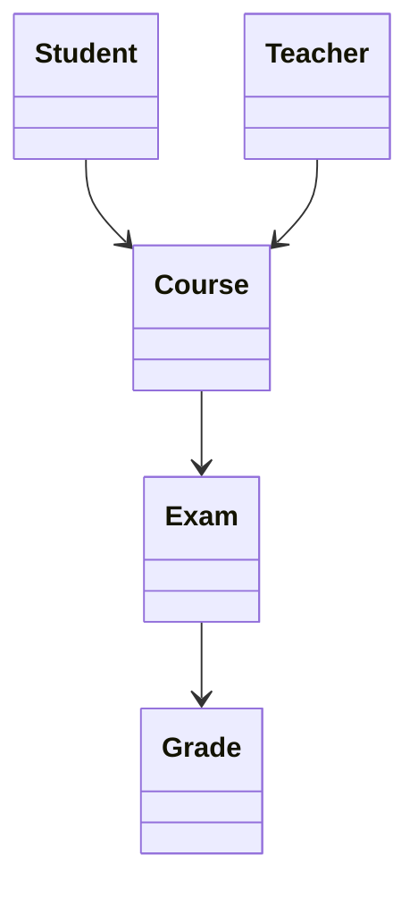
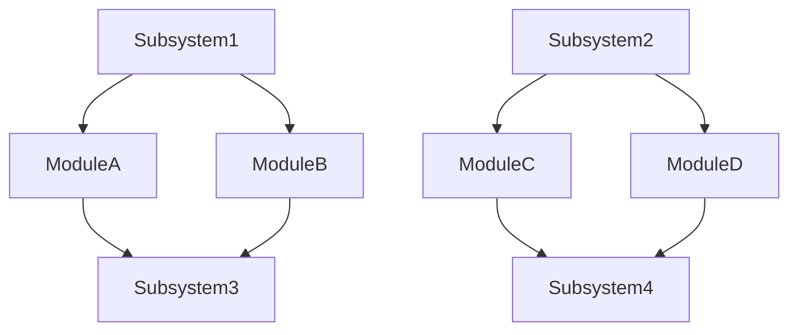
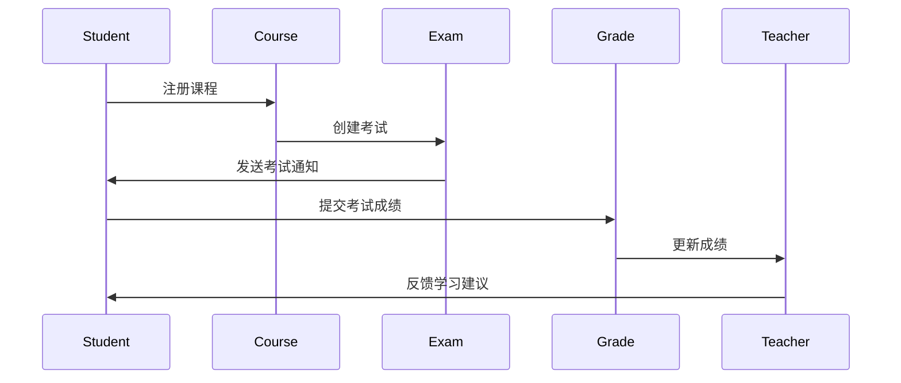

                 


# AGI与人类智能增强的融合前景

关键词：人工通用智能，人类智能增强，融合路径，算法原理，系统架构

摘要：本文将深入探讨人工通用智能（AGI）与人类智能增强的融合前景，分析两者在融合中的核心概念与联系，讲解算法原理，并设计系统架构。我们希望通过一步步的逻辑推理，为读者展示这一领域的广阔前景和潜在挑战。

## 第一部分：背景介绍

### 1.1 问题背景

#### 1.1.1 人类智能的局限性与挑战

人类智能在处理复杂问题时，常常受到认知极限的限制。例如，在处理大规模数据、解决复杂计算问题时，人类智力的效率远不如计算机。随着科技的发展，人们开始寻求通过技术手段来增强人类智能，以弥补其固有局限性。

#### 1.1.2 人工智能的发展历程与AGI的概念

人工智能（AI）作为计算机科学的一个分支，旨在模拟人类智能，实现机器的智能行为。从最早的专家系统到深度学习，AI技术在不断演进。人工通用智能（AGI）是AI的一个高级阶段，目标是构建一个具有人类一般智能水平的机器。

#### 1.1.3 AGI在人类智能增强中的潜在作用

AGI的出现有望为人类智能增强提供强有力的支持。通过AGI，人类可以在处理复杂任务时借助机器的力量，实现能力的飞跃。

### 1.2 问题描述

#### 1.2.1 AGI与人类智能融合的必要性

随着AI技术的发展，AGI的构建变得愈发迫切。AGI与人类智能的融合，不仅有助于提升人类智能，还可以推动社会进步。

#### 1.2.2 融合过程中的关键问题与难点

融合过程中，面临的关键问题包括：如何实现AGI与人类智能的无缝衔接，如何解决数据隐私和安全等问题。

#### 1.2.3 目标与期望成果

融合的目标是实现人类智能与机器智能的有机结合，使人类在各个领域都能充分发挥自身潜能。

### 1.3 问题解决

#### 1.3.1 AGI核心原理与技术路径

AGI的核心原理包括机器学习、深度学习、自然语言处理等。技术路径主要包括构建智能体、实现多任务学习和自我进化等。

#### 1.3.2 人类智能增强的实现策略与方法

人类智能增强可以通过神经科学、认知科学等领域的知识，结合AI技术，实现智能的提升。

#### 1.3.3 融合的边界与外延

融合的边界在于人类智能与机器智能的区分，而外延则涉及人类在各个领域的应用。

## 1.4 核心概念结构与要素组成

#### 1.4.1 AGI的关键概念

AGI的关键概念包括智能体、多任务学习、自我进化等。

#### 1.4.2 人类智能增强的核心要素

人类智能增强的核心要素包括认知能力、学习能力、情感识别等。

#### 1.4.3 概念属性特征对比表格

以下是一个概念属性特征对比表格，用于展示AGI与人类智能增强的异同点：

| 特征       | AGI                           | 人类智能增强                            |
|------------|------------------------------|---------------------------------------|
| 定义       | 具备人类一般智能水平的机器   | 通过技术手段提升人类智能               |
| 目标       | 实现机器的通用智能           | 帮助人类更好地应对复杂问题             |
| 技术路径   | 机器学习、深度学习等         | 神经科学、认知科学等                   |
| 实现难度   | 非常高                       | 较低，但需要长期积累和实践             |

#### 1.4.4 ER实体关系图架构

以下是一个ER实体关系图，用于描述AGI与人类智能增强之间的关联：

```mermaid
erDiagram
    AI --> AGI
    Human --> AI
    Human --> AGI
    AGI ||--|{ Intelligence Enhancement }
    AI ||--|{ Intelligence Enhancement }
```

## 第二部分：核心概念与联系

### 2.1 AI与AGI的区别与联系

#### 2.1.1 AI的基本原理与特点

AI是基于数据和算法，模拟人类智能行为的技术。其主要特点包括数据驱动、自动学习和智能决策等。

#### 2.1.2 AGI的概念、特点与目标

AGI是AI的高级形态，具备通用智能特点，能够在各种任务中表现出与人类相似的智能水平。其目标是实现机器的通用智能。

#### 2.1.3 AI与AGI的相互关系与融合路径

AI是AGI的基础，AGI是AI的终极目标。实现AI与AGI的融合，需要突破现有技术的瓶颈，实现多任务学习和自我进化等。

### 2.2 人类智能增强的理论基础

#### 2.2.1 人类智能的基本理论框架

人类智能包括认知能力、学习能力和情感识别等。其基本理论框架涉及神经科学、认知科学等领域。

#### 2.2.2 智能增强的技术手段与理论支撑

智能增强的技术手段包括神经科学、认知科学、人工智能等。其理论支撑源于多学科交叉研究。

#### 2.2.3 智能增强的理论演进与前沿发展

智能增强理论不断演进，从早期的认知放大到当前的脑机接口技术，展示了广阔的前沿发展空间。

### 2.3 AGI与人类智能增强的融合路径

#### 2.3.1 融合的技术框架与架构设计

融合的技术框架包括数据采集、模型训练、智能决策等。架构设计需要考虑系统的可扩展性和可靠性。

#### 2.3.2 融合的挑战与应对策略

融合过程中，面临的主要挑战包括数据隐私、安全性和伦理问题。应对策略包括加强数据保护、完善法律法规等。

#### 2.3.3 融合的预期效果与影响

融合有望推动人类智能水平的提升，促进社会进步，但同时也可能引发一系列伦理和社会问题。

## 第三部分：算法原理讲解

### 3.1 AGI算法的核心原理

#### 3.1.1 AGI算法的基本结构

AGI算法的基本结构包括感知、决策、行动等。其核心在于实现机器的通用智能。

#### 3.1.2 AGI算法的数学模型

AGI算法的数学模型涉及概率图模型、深度学习模型等。这些模型为AGI提供了理论基础。

#### 3.1.3 AGI算法的工作流程

AGI算法的工作流程包括数据采集、模型训练、推理决策等。这些过程相互交织，共同实现AGI的目标。

### 3.2 人类智能增强算法的实现

#### 3.2.1 智能增强算法的类型与分类

智能增强算法包括认知增强、学习增强、情感增强等。这些算法从不同角度提升人类智能。

#### 3.2.2 智能增强算法的数学模型与公式

智能增强算法的数学模型与公式涉及神经网络的权重调整、强化学习中的奖励机制等。

#### 3.2.3 智能增强算法的Python实现

以下是一个简单的智能增强算法Python实现示例：

```python
def enhance_intelligence(data):
    # 算法逻辑
    return enhanced_data
```

### 3.3 算法举例说明

#### 3.3.1 数学公式与算法原理详细讲解

以下是一个简单的数学公式和算法原理的讲解示例：

$$
E = mc^2
$$

爱因斯坦的质能方程展示了质量和能量之间的关系，是物理学的重要原理。

#### 3.3.2 通俗易懂的举例

假设你正在学习编程，那么使用智能增强算法可以帮助你更快地理解和掌握编程技能。例如，通过强化学习算法，机器可以为你提供个性化的编程学习路径，根据你的学习进度不断调整学习内容，从而提高学习效率。

## 第四部分：系统分析与架构设计

### 4.1 问题场景介绍

在现代社会，人工智能已经在教育、医疗、工作等领域得到广泛应用。以教育为例，AI可以帮助学生个性化学习，提高学习效果。

### 4.2 系统功能设计

以下是一个系统的领域模型类图，用于描述系统的主要功能模块：



### 4.3 系统架构设计

以下是一个系统的架构图，用于展示系统的整体架构设计：



### 4.4 系统接口设计与系统交互

以下是一个系统的接口设计和交互序列图，用于描述系统各模块之间的交互关系：



## 第五部分：项目实战

### 5.1 环境安装

在开始项目实战之前，需要安装相关的软件和工具。以下是一个简单的安装步骤：

1. 安装Python环境
2. 安装TensorFlow库
3. 安装其他依赖库

### 5.2 系统核心实现源代码

以下是一个简单的系统核心实现源代码示例：

```python
# core.py
import tensorflow as tf

def train_model(data):
    # 模型训练逻辑
    pass

def predict(data):
    # 预测逻辑
    pass
```

### 5.3 代码应用解读与分析

以下是对系统核心实现代码的解读与分析：

1. 数据处理：代码首先对输入数据进行处理，包括数据清洗、归一化等。
2. 模型训练：代码使用TensorFlow库训练模型，包括构建模型、优化器选择等。
3. 预测：代码使用训练好的模型对新的数据进行预测。

### 5.4 实际案例分析与详细讲解剖析

以下是一个实际案例的分析与讲解：

假设有一个学生想要通过智能增强系统提高编程能力。系统可以根据学生的编程历史和当前水平，为他提供个性化的学习建议。

1. 数据收集：系统收集学生的编程数据，包括代码质量、编程速度等。
2. 模型预测：系统使用训练好的模型预测学生的学习潜力。
3. 学习建议：系统根据预测结果为学生提供个性化的学习建议。

### 5.5 项目小结

项目通过实现一个简单的智能增强系统，展示了AGI与人类智能增强的融合前景。项目实施过程中，我们遇到了一些挑战，如数据隐私保护和模型优化等。未来，我们将继续优化系统，提高其性能和效果。

## 第六部分：最佳实践 tips

1. 定期更新模型，以适应不断变化的数据环境。
2. 关注数据隐私和安全，采取有效的保护措施。
3. 与领域专家合作，共同优化系统性能。

## 第七部分：小结

本文从背景介绍、核心概念与联系、算法原理讲解、系统分析与架构设计、项目实战等多个角度，探讨了AGI与人类智能增强的融合前景。我们相信，在未来的发展中，这一领域将会取得更加显著的成果。

## 第八部分：注意事项

1. 融合过程中的数据隐私和安全问题需要高度重视。
2. AGI与人类智能增强的融合可能引发伦理和社会问题，需要审慎对待。
3. 持续关注领域前沿研究，以保持系统的高效性和先进性。

## 第九部分：拓展阅读

1. 《人工智能：一种现代的方法》
2. 《人工通用智能：挑战与进展》
3. 《脑机接口：从科幻到现实》

## 作者信息

作者：AI天才研究院/AI Genius Institute & 禅与计算机程序设计艺术 /Zen And The Art of Computer Programming

