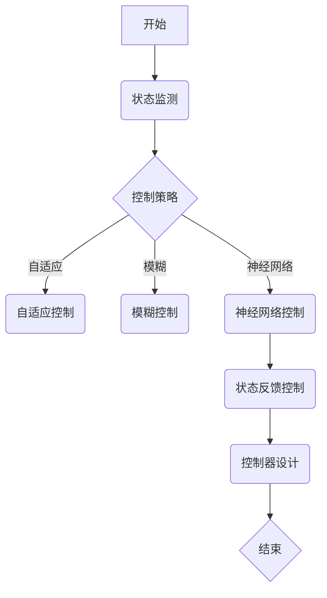

                 

### 第1章 引言

## 1.1 背景介绍

### 1.1.1 问题背景

随着人工智能（AI）技术的飞速发展，人工智能生成内容（AGI）正在逐步成为一种新的生产力工具。AGI，作为人工智能的高级形态，具备自主学习、推理和决策的能力，能够在各种复杂任务中表现出色。然而，随着AGI在各个领域的广泛应用，其安全性问题也日益凸显。AGI安全性不仅关系到个人隐私保护，还涉及到社会稳定、国家安全等多个层面。因此，如何对AGI进行有效的控制与约束，成为当前研究的热点问题。

### 1.1.2 问题描述

AGI安全性研究主要包括两个方面：一是如何确保AGI系统的稳定性和可预测性，避免因系统失控而导致意外事故；二是如何保护用户的隐私和数据安全，防止AGI滥用用户的个人信息。这些问题涉及到多个学科领域，包括计算机科学、心理学、伦理学等。

#### 1.1.3 问题解决

本书旨在通过研究控制与约束方法，探讨如何有效地保障AGI的安全性。主要解决方法包括：

1. 设计并实现一套基于控制论的AGI控制系统，通过反馈机制对AGI进行实时监控和调整。
2. 建立一套基于伦理学的约束机制，对AGI的行为进行规范和限制。
3. 设计一系列安全测试与评估方法，对AGI系统的安全性进行量化评估。

### 1.1.4 边界与外延

本书的研究主要围绕AGI安全性展开，涉及到的控制与约束方法包括但不限于以下几个方面：

- 安全模型设计
- 安全协议开发
- 风险评估与防范
- 安全测试与评估

同时，本书也将探讨AGI安全性在各个应用场景中的具体实现方法，如智能助手、自动驾驶、医疗诊断等。

### 1.1.5 概念结构与核心要素组成

AGI安全性的核心概念包括：

- 控制论
- 伦理学
- 安全性评估
- 数据隐私保护

核心要素主要包括：

- AGI系统
- 控制与约束机制
- 安全测试与评估方法

## 1.2 核心概念与联系

### 1.2.1 控制论

控制论是一种研究系统动态行为及其控制的学科，主要研究如何通过对系统状态的监测和反馈，实现对系统的控制和调整。在AGI安全性研究中，控制论可以用来设计并实现一套对AGI系统的实时监控和控制机制，确保AGI系统的稳定性和安全性。

### 1.2.2 伦理学

伦理学是研究道德规范和价值观念的学科。在AGI安全性研究中，伦理学可以用来指导AGI系统行为的规范和约束，确保AGI系统在运行过程中符合道德和法律要求。

### 1.2.3 安全性评估

安全性评估是一种通过对系统进行测试和评估，以判断系统安全性的一种方法。在AGI安全性研究中，安全性评估可以用来对AGI系统的安全性进行量化评估，以便及时发现和修复安全隐患。

### 1.2.4 数据隐私保护

数据隐私保护是一种通过对数据进行加密、匿名化等处理，以保护用户隐私的一种技术。在AGI安全性研究中，数据隐私保护可以用来确保AGI系统在处理用户数据时，能够有效保护用户的隐私。

### 1.3 基本假设与定义

为了更好地理解和研究AGI安全性，我们做出以下基本假设：

- AGI系统具有高度的自主学习和决策能力。
- AGI系统的运行环境和数据具有不确定性。
- AGI系统的安全性和稳定性是相互关联的。

在此基础上，我们定义以下核心术语：

- AGI：人工智能生成内容，具备自主学习、推理和决策能力的高级人工智能系统。
- 控制论：研究系统动态行为及其控制的学科。
- 伦理学：研究道德规范和价值观念的学科。
- 安全性评估：通过对系统进行测试和评估，以判断系统安全性的一种方法。
- 数据隐私保护：通过对数据进行加密、匿名化等处理，以保护用户隐私的一种技术。

### 1.4 研究方法

本书采用的研究方法主要包括：

- 理论研究：通过对控制论、伦理学、安全性评估和数据隐私保护等核心概念的研究，建立AGI安全性的理论基础。
- 案例分析：通过分析实际应用中的AGI安全性问题，总结经验教训，提出解决方案。
- 实验验证：通过构建仿真环境和实际应用场景，验证所提出的安全性和约束方法的可行性和有效性。

### 1.5 研究意义

本研究具有重要的理论和实际意义：

- 理论意义：为AGI安全性研究提供了系统性的理论框架，丰富了人工智能与伦理学、控制论等交叉领域的知识体系。
- 实际意义：为实际应用中的AGI系统提供了一套有效的安全性和约束方法，有助于提高AGI系统的稳定性和安全性，保护用户隐私和数据安全。

### 1.6 文章结构

本文结构如下：

- 引言：介绍AGI安全性的背景、问题、解决方案和研究意义。
- 控制与约束方法：详细讨论控制论基础、伦理约束机制和安全测试与评估方法。
- 应用场景：分析AGI在智能助手、自动驾驶和医疗诊断等领域的应用及其安全性问题。
- 总结与展望：总结研究成果，提出未来研究方向。

通过本文的研究，我们希望能够为AGI安全性问题的解决提供有益的参考，促进人工智能技术的健康发展。

## 第2章 控制与约束方法

### 2.1 控制论基础

#### 2.1.1 控制系统的构成

控制系统是控制论的核心研究对象，它由四个基本组成部分构成：控制器（Controller）、被控对象（Controlled Object）、传感器（Sensor）和执行器（Actuator）。这些部分相互作用，共同实现系统的控制功能。

1. **控制器（Controller）**：负责根据系统当前的状态和目标状态，生成控制信号，以驱动执行器调整系统状态。
2. **被控对象（Controlled Object）**：需要被控制的实际系统，如温度控制系统中的加热器。
3. **传感器（Sensor）**：用于测量系统状态，并将测量结果传递给控制器。
4. **执行器（Actuator）**：接收控制信号，将其转化为实际操作，以调整系统状态。

#### 2.1.2 控制系统的分类

控制系统根据不同的分类标准，可以划分为多种类型：

1. **开环控制系统（Open-Loop Control System）**：也称为固定控制系统，其控制信号仅依赖于设定值，而不考虑系统当前的实际状态。这类系统的优点是实现简单，缺点是对环境变化不敏感，易出现偏差。
2. **闭环控制系统（Closed-Loop Control System）**：也称为反馈控制系统，其控制信号不仅依赖于设定值，还考虑系统当前的实际状态。通过传感器实时监测系统状态，并将其与设定值比较，产生误差信号，控制器根据误差信号调整控制信号。这类系统的优点是适应性强，能够纠正系统偏差，缺点是实现复杂，对传感器和执行器的精度要求高。

#### 2.1.3 控制系统的基本性质

控制系统的基本性质包括：

1. **稳定性（Stability）**：系统在扰动作用下能够返回到平衡状态的性质。稳定是控制系统的首要要求，确保系统不会失控或发散。
2. **鲁棒性（Robustness）**：系统在参数变化或外部扰动下仍能保持性能的能力。鲁棒性是控制系统在实际应用中的关键，能够保证系统在各种复杂环境中稳定运行。
3. **响应速度（Response Speed）**：系统从受到扰动到恢复稳定所需的时间。快速响应是控制系统的重要指标，能够提高系统的实时性和适应性。
4. **精度（Accuracy）**：系统输出与目标值之间的接近程度。高精度是控制系统追求的目标，能够保证系统的高性能运行。

### 2.2 现代控制理论

#### 2.2.1 状态空间法

状态空间法是一种描述和控制动态系统的现代方法，它将系统状态视为一组变量，通过状态变量之间的微分方程或差分方程描述系统的动态行为。

1. **状态方程（State Equation）**：描述系统状态变量随时间变化的方程，通常表示为
   $$\dot{x}(t) = A x(t) + B u(t)$$
   其中，$x(t)$表示状态向量，$u(t)$表示输入向量，$A$和$B$是系统矩阵。
   
2. **输出方程（Output Equation）**：描述系统输出变量与状态变量之间的关系，通常表示为
   $$y(t) = C x(t) + D u(t)$$
   其中，$y(t)$表示输出向量，$C$和$D$是输出矩阵。

通过状态空间法，我们可以将系统的动态行为表示为一个线性时变系统的状态方程，方便进行数学分析和设计控制策略。

#### 2.2.2 状态观测器

状态观测器（State Observer）是一种用于估计系统状态的方法，尤其在无法直接测量系统状态的情况下，状态观测器显得尤为重要。

1. **基本原理**：状态观测器通过构建一个观测方程，对系统状态进行估计。观测方程通常表示为
   $$\dot{\hat{x}}(t) = A \hat{x}(t) + B u(t) + L(y(t) - C \hat{x}(t))$$
   其中，$\hat{x}(t)$表示状态估计值，$L$是观测器增益矩阵。

2. **设计方法**：状态观测器的设计关键在于观测器增益矩阵$L$的选取。通常，可以通过使得观测器误差动态稳定来实现对系统状态的准确估计。

#### 2.2.3 状态反馈控制

状态反馈控制（State Feedback Control）是一种通过状态变量直接调整系统输入的控制策略，能够实现系统的最佳性能。

1. **基本原理**：状态反馈控制通过将系统状态作为反馈信号，调整系统的输入，以实现系统状态的最优控制。控制输入$u(t)$通常表示为
   $$u(t) = -K x(t)$$
   其中，$K$是控制矩阵。

2. **设计方法**：状态反馈控制的设计关键在于控制矩阵$K$的选取。通过线性代数方法，如特征值分析，可以确定使系统稳定并满足性能要求的$K$值。

### 2.3 AGI控制策略设计

#### 2.3.1 AGI系统的特点

AGI系统具有以下特点：

1. **高度智能化**：AGI系统能够自主学习、推理和决策，具备较高的智能水平。
2. **复杂动态性**：AGI系统在运行过程中，其状态和输入是高度复杂且动态变化的。
3. **不确定性**：AGI系统面临着多种不确定性因素，如环境变化、数据缺失等。

#### 2.3.2 控制策略的选择

针对AGI系统的特点，选择合适的控制策略至关重要。以下是一些常见的AGI控制策略：

1. **自适应控制**：自适应控制能够根据系统状态的变化，自动调整控制参数，以适应不同的运行环境。这种方法适用于具有不确定性和动态变化的AGI系统。
2. **模糊控制**：模糊控制通过模糊逻辑来处理不确定性和模糊性，适用于处理复杂非线性问题的AGI系统。
3. **神经网络控制**：神经网络控制利用神经网络的自学习和泛化能力，实现对AGI系统的自适应控制和优化。这种方法适用于具有高度非线性特性的AGI系统。

#### 2.3.3 控制策略的优化

控制策略的优化目标是提高AGI系统的稳定性和性能。以下是一些常见的优化方法：

1. **遗传算法**：遗传算法通过模拟自然进化过程，对控制策略进行优化。这种方法适用于复杂优化问题，能够找到最优或近似最优的控制策略。
2. **粒子群优化**：粒子群优化通过模拟鸟群觅食过程，对控制策略进行优化。这种方法计算简单，适用于大规模优化问题。
3. **随机搜索算法**：随机搜索算法通过随机搜索控制策略空间，寻找最优或近似最优的控制策略。这种方法适用于复杂度较低的控制问题。

通过上述控制策略设计和优化方法，可以有效地提高AGI系统的安全性和稳定性，为AGI的应用提供可靠保障。

### 第3章 伦理约束机制

#### 3.1 伦理学基础

伦理学是研究道德规范和价值观念的学科，其目的是探讨人类行为和社会道德的合理性。伦理学的基本概念包括：

1. **道德规范（Moral Norms）**：道德规范是社会对个体行为提出的道德要求，用于指导个体如何行动。
2. **道德责任（Moral Responsibility）**：道德责任是指个体在道德规范下应对其行为承担责任。
3. **道德判断（Moral Judgment）**：道德判断是指对行为是否合乎道德的判断。

伦理学的主要流派包括：

1. **功利主义（Utilitarianism）**：功利主义认为，行为的价值取决于其产生的后果，即最大化多数人的幸福。
2. **义务论（Deontological Ethics）**：义务论认为，行为的价值取决于其是否遵守道德规则，而不考虑后果。
3. **情感主义（Sentimentalism）**：情感主义认为，道德情感是道德判断的基础，道德价值源于个体的情感体验。

伦理学的应用领域包括：

1. **个人道德**：探讨个体行为的道德合理性，如诚实、尊重他人等。
2. **社会道德**：研究社会道德规范，如公平、正义等。
3. **职业伦理**：研究职业行为中的道德问题，如医生的职业责任、记者的保密义务等。

#### 3.2 AGI伦理约束的必要性

AGI伦理约束的必要性体现在以下几个方面：

1. **确保道德合规**：AGI系统在运行过程中，需要遵守道德和法律规范，避免产生负面影响。
2. **保护用户权益**：AGI系统处理大量用户数据，需要保护用户的隐私和权益。
3. **防止伦理风险**：AGI系统可能产生不可预见的伦理问题，如歧视、偏见等，需要通过伦理约束来预防。

#### 3.3 伦理约束的体系构建

伦理约束体系的构建需要从以下几个方面进行：

1. **伦理原则**：明确AGI系统应遵循的伦理原则，如公正、尊重、责任等。
2. **伦理规则**：制定具体的伦理规则，指导AGI系统的行为，如数据保护规则、公平使用规则等。
3. **伦理审查**：建立伦理审查机制，对AGI系统进行伦理评估，确保其符合伦理要求。

#### 3.4 伦理约束的具体实施方法

伦理约束的具体实施方法包括：

1. **编程实现**：在AGI系统中嵌入伦理规则，通过编程实现伦理约束。
2. **伦理培训**：对AGI系统的开发者和使用者进行伦理培训，提高其伦理意识和道德素养。
3. **伦理审计**：定期对AGI系统进行伦理审计，确保其符合伦理要求。

### 第4章 安全测试与评估

#### 4.1 安全测试方法

安全测试是确保AGI系统安全性的关键步骤。常见的安全测试方法包括：

1. **黑盒测试（Black-Box Testing）**：黑盒测试主要关注AGI系统的输入输出关系，不关心内部实现细节。测试者仅根据系统功能规格说明，设计测试用例，验证系统是否满足预期功能。
2. **白盒测试（White-Box Testing）**：白盒测试关注AGI系统的内部实现细节，测试者需要了解系统的内部结构。通过分析系统代码，设计测试用例，验证系统的逻辑正确性和完整性。
3. **灰盒测试（Gray-Box Testing）**：灰盒测试介于黑盒测试和白盒测试之间，测试者对系统的部分内部实现有所了解。通过结合黑盒测试和白盒测试的方法，设计测试用例，提高测试覆盖率。

#### 4.2 安全评估方法

安全评估是对AGI系统进行全面的安全评估，以确定其安全性能。常见的安全评估方法包括：

1. **定量评估方法（Quantitative Evaluation Method）**：定量评估方法通过量化的指标和统计方法，对AGI系统的安全性进行评估。如安全漏洞数量、攻击成功率等。
2. **定性评估方法（Qualitative Evaluation Method）**：定性评估方法主要通过专家评估和主观判断，对AGI系统的安全性进行评估。如安全漏洞的影响程度、系统的可信度等。
3. **综合评估方法（Integrated Evaluation Method）**：综合评估方法将定量评估和定性评估相结合，对AGI系统的安全性进行全面的评估。

#### 4.3 案例分析

以下是一个AGI安全性评估的案例分析：

**案例背景**：一个智能助手AGI系统被用于个人助手服务，需要处理用户的个人信息，如日程安排、邮件收发等。

**案例分析**：

1. **安全测试**：
   - **黑盒测试**：设计测试用例，模拟用户操作，验证系统功能是否符合预期。
   - **白盒测试**：分析系统代码，检查是否存在安全漏洞，如SQL注入、XSS攻击等。
   - **灰盒测试**：结合黑盒测试和白盒测试，验证系统的内部实现是否符合安全要求。

2. **安全评估**：
   - **定量评估**：统计系统漏洞数量，分析漏洞的类型和影响程度。
   - **定性评估**：专家评估系统安全性的整体水平，评估系统的可信度和可靠性。
   - **综合评估**：结合定量评估和定性评估结果，确定系统的安全性等级。

**案例启示**：

- 安全测试和评估是确保AGI系统安全性的重要手段。
- 定量评估和定性评估相结合，能够更全面地评估系统的安全性。
- 需要定期进行安全测试和评估，及时发现和修复安全隐患。

通过案例分析，我们可以看到安全测试与评估在确保AGI系统安全性方面的重要作用。有效的安全测试与评估方法有助于提高AGI系统的安全性，保护用户的隐私和数据安全。

### 第5章 AGI在智能助手中的应用

#### 5.1 智能助手的概述

智能助手是一种基于人工智能技术的自动化工具，旨在帮助用户简化日常任务，提高工作效率。智能助手的主要功能包括语音交互、日程管理、邮件过滤、信息检索等。随着人工智能技术的不断发展，智能助手的智能化程度和功能得到了显著提升，逐渐成为人们生活和工作中不可或缺的一部分。

#### 5.1.1 智能助手的定义与功能

智能助手（Intelligent Assistant）是指利用人工智能技术，通过自然语言处理、语音识别、机器学习等手段，为用户提供个性化服务和支持的软件系统。智能助手的定义可以从以下几个方面理解：

1. **基于人工智能技术**：智能助手依赖于人工智能技术，如深度学习、自然语言处理等，以实现智能化的功能。
2. **为用户提供服务和支持**：智能助手的主要目的是为用户解决实际问题，提高生活质量和工作效率。
3. **具备自主学习和适应能力**：智能助手能够根据用户的反馈和需求，不断学习和优化自己的功能，以提供更优质的服务。

智能助手的主要功能包括：

1. **语音交互**：智能助手能够通过语音识别和语音合成技术，与用户进行自然语言交流，实现语音指令的识别和响应。
2. **日程管理**：智能助手可以帮助用户管理日程，如提醒会议、安排日程、设置闹钟等。
3. **邮件过滤**：智能助手可以自动筛选和处理用户的邮件，将重要的邮件分类并提醒用户。
4. **信息检索**：智能助手能够根据用户的需求，快速检索相关信息，并提供准确的答案。
5. **智能推荐**：智能助手可以根据用户的行为和偏好，提供个性化的内容推荐，如新闻、音乐、电影等。

#### 5.1.2 智能助手的发展历程

智能助手的发展历程可以分为以下几个阶段：

1. **早期阶段**：智能助手起源于20世纪80年代的专家系统，如Eliza和Doctor。这些早期的智能助手主要通过预定义的规则进行对话，功能较为简单。
2. **自然语言处理阶段**：随着自然语言处理技术的进步，智能助手逐渐能够理解自然语言的语义和上下文，如Apple的Siri和Google Assistant。
3. **深度学习阶段**：深度学习技术的发展使得智能助手的智能化程度得到了显著提升，能够通过大量数据学习和优化自己的功能，如IBM的Watson和Alexa。
4. **多模态交互阶段**：现代智能助手不仅支持语音交互，还支持图像识别、手势识别等多种交互方式，实现了更丰富和自然的用户交互。

#### 5.1.3 智能助手的分类

根据不同的应用场景和技术特点，智能助手可以分为以下几类：

1. **通用智能助手**：通用智能助手具备广泛的应用场景，如语音助手（Siri、Google Assistant）、聊天机器人（Slackbot、Kik Messenger）等。
2. **垂直行业智能助手**：垂直行业智能助手专注于特定领域，如医疗助手（Mayo Clinic's AskMayo、IBM's Watson for Oncology）、金融助手（JP Morgan's Chatbot、Bank of America's Erica）等。
3. **个性化智能助手**：个性化智能助手根据用户的行为和偏好，提供个性化的服务和内容，如音乐助手（Spotify's Discover Weekly、Apple Music's New Music Mix）等。
4. **跨平台智能助手**：跨平台智能助手可以在多个设备和应用之间无缝切换，如微软的小冰、亚马逊的Alexa等。

#### 5.2 AGI在智能助手中的应用

人工智能生成内容（AGI）作为一种高级人工智能形态，具备自主学习和创造能力，为智能助手的应用提供了更广阔的空间。AGI在智能助手中的应用主要体现在以下几个方面：

1. **智能对话管理**：AGI可以通过深度学习模型和自然语言处理技术，实现更智能、更自然的对话交互。AGI能够理解用户的意图，提供更加精准和个性化的回答。
2. **个性化内容推荐**：AGI可以根据用户的历史行为和偏好，生成个性化的内容推荐，如新闻、音乐、电影等。通过AGI的个性化推荐，智能助手能够更好地满足用户的需求。
3. **智能任务分配**：AGI可以自动分析用户的日程和任务，为用户分配合理的任务优先级，提高工作效率。
4. **智能情感分析**：AGI可以通过情感分析技术，识别用户的情感状态，提供更加贴心和关怀的服务，如智能客服、心理辅导等。

#### 5.2.1 AGI技术对智能助手的影响

AGI技术的引入，使得智能助手在多个方面得到了显著提升：

1. **智能化水平**：AGI技术的应用，使得智能助手的智能化水平得到了大幅提升。通过自主学习和创造能力，智能助手能够更好地理解用户的意图和需求，提供更精准的服务。
2. **个性化体验**：AGI技术可以根据用户的行为和偏好，生成个性化的内容和服务，提供更加贴心的用户体验。
3. **任务处理能力**：AGI技术使得智能助手能够处理更加复杂和多样化的任务，如智能任务分配、情感分析等，提高工作效率和用户体验。
4. **创新应用场景**：AGI技术的应用，为智能助手带来了更多的创新应用场景，如智能医疗、智能金融、智能教育等，推动了智能助手在各个领域的广泛应用。

#### 5.2.2 AGI在智能助手中的具体应用

以下是一些AGI在智能助手中的具体应用实例：

1. **智能客服**：AGI技术使得智能客服能够通过自然语言处理和情感分析，实现与用户的智能对话。智能客服可以自动识别用户的问题，提供精准的解决方案，提高客户满意度。
2. **智能医疗**：AGI技术可以应用于智能医疗助手，通过分析患者的病史和症状，提供个性化的诊断建议和治疗方案。智能医疗助手还可以根据患者的反馈，不断学习和优化自身的诊断能力。
3. **智能教育**：AGI技术可以应用于智能教育助手，通过自然语言处理和个性化推荐，为用户提供定制化的学习内容和辅导服务。智能教育助手可以根据学生的学习进度和需求，调整教学内容和难度，提高学习效果。
4. **智能家居**：AGI技术可以应用于智能助手，实现智能家居的自动化控制。智能助手可以通过语音指令，控制家中的灯光、空调、电视等设备，提供更加便捷和智能的生活体验。

通过以上应用实例，我们可以看到AGI技术在智能助手中的广泛应用和巨大潜力。随着AGI技术的不断发展和完善，智能助手将在更多领域发挥重要作用，为人们的生活和工作带来更多便利。

### 第6章 AGI在自动驾驶中的应用

#### 6.1 自动驾驶的概述

自动驾驶技术是一种通过计算机系统和传感器，使车辆能够自动完成行驶任务的高级人工智能技术。自动驾驶汽车通过感知环境、规划路径和执行决策，实现无需人工干预的自主行驶。自动驾驶技术的发展对交通、物流、城市规划等多个领域产生了深远影响。

#### 6.1.1 自动驾驶的定义与功能

自动驾驶汽车的定义可以根据其自动化程度分为以下几类：

1. **L0级自动驾驶**：完全人工驾驶，车辆不具备自动驾驶功能。
2. **L1级自动驾驶**：部分自动化，车辆具备简单的辅助驾驶功能，如自适应巡航控制（ACC）。
3. **L2级自动驾驶**：部分自动化，车辆具备高级辅助驾驶功能，如车道保持辅助（LKA）和自动泊车（APA）。
4. **L3级自动驾驶**：有条件自动化，车辆在特定环境下能够实现自动驾驶，驾驶员需在特定情况下接管控制。
5. **L4级自动驾驶**：高度自动化，车辆在特定环境下能够完全实现自动驾驶，无需驾驶员干预。
6. **L5级自动驾驶**：完全自动化，车辆在任何环境下都能实现自动驾驶。

自动驾驶的主要功能包括：

1. **环境感知**：通过激光雷达、摄像头、超声波传感器等设备，实时感知车辆周围的环境。
2. **路径规划**：根据感知到的环境信息，车辆需要规划出一条安全、高效的行驶路径。
3. **决策控制**：车辆根据路径规划和环境信息，做出实时的驾驶决策，如加速、减速、转向等。
4. **人机交互**：自动驾驶车辆需要与驾驶员和乘客进行有效的交互，确保驾驶过程的安全和舒适。

#### 6.1.2 自动驾驶的发展历程

自动驾驶技术的发展历程可以分为以下几个阶段：

1. **早期研究阶段**：20世纪50年代，自动驾驶研究开始萌芽，以美国、德国等发达国家为主。
2. **计算机视觉阶段**：20世纪80年代，随着计算机视觉技术的发展，自动驾驶技术开始从理论研究走向实际应用。
3. **传感器融合阶段**：21世纪初，激光雷达、摄像头、超声波传感器等高精度传感器的应用，使得自动驾驶技术取得了显著突破。
4. **人工智能阶段**：近年来，人工智能技术的快速发展，使得自动驾驶技术迈向更高级别的自动化和智能化。

#### 6.1.3 自动驾驶的分类

根据自动驾驶技术的特点和实现方式，可以分为以下几类：

1. **视觉自动驾驶**：主要依靠摄像头和计算机视觉技术，通过图像识别和处理，实现自动驾驶。
2. **激光雷达自动驾驶**：利用激光雷达（LIDAR）技术，测量车辆周围的环境距离和地形，实现自动驾驶。
3. **雷达自动驾驶**：利用雷达技术，检测车辆周围的目标和障碍物，实现自动驾驶。
4. **传感器融合自动驾驶**：将摄像头、激光雷达、雷达等多种传感器融合，实现更精确、更可靠的环境感知和路径规划。

#### 6.2 AGI在自动驾驶中的应用

人工智能生成内容（AGI）作为一种高级人工智能形态，具备自主学习和创造能力，为自动驾驶技术提供了新的发展机遇。AGI在自动驾驶中的应用主要体现在以下几个方面：

1. **环境感知与建模**：AGI可以通过深度学习技术，对传感器数据进行处理和分析，实现更精准的环境感知和建模。AGI能够从大量数据中提取有用的信息，提高环境感知的准确性和可靠性。
2. **路径规划与决策**：AGI可以自主学习和优化路径规划算法，根据实时感知的环境信息，生成最优的行驶路径。AGI还可以通过强化学习等技术，实现自主决策和控制，提高驾驶的灵活性和适应性。
3. **安全监控与预警**：AGI可以实时监控自动驾驶系统的运行状态，识别潜在的安全隐患，并提前发出预警。AGI可以通过预测模型，分析可能的碰撞风险，采取相应的措施进行防范。
4. **人机交互与语音识别**：AGI可以与人机交互系统进行智能对话，理解驾驶员的指令和需求，提供个性化的驾驶体验。AGI还可以通过语音识别技术，实现语音控制和操作，提高驾驶的便利性和舒适性。

#### 6.2.1 AGI技术对自动驾驶的影响

AGI技术的引入，对自动驾驶技术产生了深远的影响：

1. **智能化水平提升**：AGI技术的应用，使得自动驾驶系统的智能化水平得到了显著提升。通过自主学习和创造能力，自动驾驶系统能够更好地理解复杂的驾驶环境和场景，实现更精准的驾驶控制。
2. **安全性提高**：AGI技术可以通过实时监控和预警，提高自动驾驶系统的安全性。通过预测分析和风险评估，AGI可以提前发现潜在的安全隐患，并采取措施进行防范。
3. **驾驶体验优化**：AGI技术可以提供更加智能、个性化的驾驶体验。通过自然语言处理和语音识别技术，AGI可以与驾驶员进行智能对话，提供个性化的驾驶建议和服务。
4. **应用场景拓展**：AGI技术的应用，使得自动驾驶技术可以拓展到更多的应用场景，如城市交通、物流运输、无人驾驶等。AGI技术可以提高自动驾驶系统的适应性，使其在不同环境和场景下都能稳定运行。

#### 6.2.2 AGI在自动驾驶中的具体应用

以下是一些AGI在自动驾驶中的具体应用实例：

1. **自动驾驶出租车**：自动驾驶出租车利用AGI技术，实现无人驾驶的出行服务。AGI可以实时感知交通状况、规划行驶路径，提供安全、高效的出行体验。
2. **自动驾驶物流**：自动驾驶物流车利用AGI技术，实现无人驾驶的货物运输。AGI可以自动识别道路标志、交通信号，规划最优的运输路径，提高物流效率。
3. **自动驾驶公交车**：自动驾驶公交车利用AGI技术，实现无人驾驶的公共交通服务。AGI可以自动识别行人、车辆，规划安全、高效的行驶路线，提高公共交通的可靠性和便捷性。
4. **自动驾驶农业机械**：自动驾驶农业机械利用AGI技术，实现无人驾驶的农业耕作。AGI可以自动识别农田、作物，规划最优的耕作路线，提高农业生产效率。

通过以上应用实例，我们可以看到AGI技术在自动驾驶中的重要应用和巨大潜力。随着AGI技术的不断发展和完善，自动驾驶技术将在未来得到更广泛的应用，为人们的出行和生活带来更多便利。

### 第7章 AGI在医疗诊断中的应用

#### 7.1 医疗诊断的概述

医疗诊断是临床医学的重要组成部分，它通过观察和检查患者，确定疾病的类型、程度和病因。传统的医疗诊断主要依赖于医生的诊断经验和医疗设备，但随着人工智能（AI）技术的快速发展，人工智能生成内容（AGI）在医疗诊断中的应用逐渐成为研究热点。

#### 7.1.1 医疗诊断的定义与流程

医疗诊断是指医生或医疗专业人员通过病史采集、体格检查、实验室检查和影像学检查等手段，对患者的健康状况进行评估和判断。医疗诊断的基本流程包括：

1. **病史采集**：医生通过与患者沟通，了解患者的症状、病史、家族病史等。
2. **体格检查**：医生通过观察患者的体征，如血压、心率、呼吸等，进行初步诊断。
3. **实验室检查**：通过血液、尿液等样本的实验室检测，帮助诊断疾病。
4. **影像学检查**：利用影像学设备（如X光、CT、MRI等），对患者的内部结构进行成像，帮助诊断疾病。

#### 7.1.2 AGI在医疗诊断中的应用

AGI在医疗诊断中的应用主要包括以下几个方面：

1. **辅助诊断**：AGI可以通过深度学习、自然语言处理等技术，分析患者的病史、实验室检查结果和影像学检查结果，辅助医生进行诊断。AGI可以处理大量数据，提供快速、准确的诊断建议，减轻医生的工作负担。
2. **疾病预测**：AGI可以通过分析患者的健康数据，预测患者未来可能发生的疾病。这有助于医生提前采取预防措施，降低疾病发生的风险。
3. **个性化治疗**：AGI可以根据患者的病史、基因信息和健康状况，制定个性化的治疗方案。AGI可以实时调整治疗方案，提高治疗效果。

#### 7.2 AGI在医疗诊断中的具体应用

以下是一些AGI在医疗诊断中的具体应用实例：

1. **肺癌诊断**：通过分析患者的CT影像，AGI可以识别肺癌的早期病变，提供准确的诊断建议。一些研究表明，AGI在肺癌诊断的准确率上已接近甚至超过了专业医生。
2. **皮肤病诊断**：AGI可以通过分析皮肤病的影像，如皮肤病图片，识别不同类型的皮肤病。这有助于提高皮肤病的诊断准确率，为患者提供更及时的治疗。
3. **心血管疾病预测**：AGI可以通过分析患者的电子健康记录、生活方式数据等，预测患者未来发生心血管疾病的风险。这有助于医生制定个性化的预防策略。
4. **个性化治疗**：AGI可以根据患者的基因信息、病史和治疗效果，制定个性化的治疗方案。例如，在癌症治疗中，AGI可以根据患者的基因突变，推荐特定的药物组合，提高治疗效果。

#### 7.2.1 AGI技术对医疗诊断的影响

AGI技术的引入，对医疗诊断产生了深远的影响：

1. **提高诊断准确率**：AGI可以通过深度学习、自然语言处理等技术，处理和分析大量医疗数据，提供准确、可靠的诊断建议。这有助于提高医疗诊断的准确率，减少误诊和漏诊。
2. **减轻医生负担**：AGI可以自动处理和分析大量医疗数据，减轻医生的工作负担，提高工作效率。医生可以专注于更为复杂和具有挑战性的诊断任务。
3. **个性化医疗**：AGI可以根据患者的个性化数据，如基因信息、病史等，制定个性化的治疗方案。这有助于提高治疗效果，降低医疗成本。
4. **疾病预测与预防**：AGI可以通过分析患者的健康数据，预测疾病的发生风险，有助于提前采取预防措施，降低疾病的发生率。

#### 7.2.2 AGI在医疗诊断中的挑战和未来发展方向

尽管AGI在医疗诊断中具有巨大潜力，但仍然面临一些挑战：

1. **数据隐私和安全**：医疗数据是高度敏感的个人信息，如何确保数据的安全和隐私，是一个重要的问题。需要建立严格的数据保护机制，确保患者数据不被泄露。
2. **模型的可解释性**：深度学习等黑盒模型在医疗诊断中的应用，使得诊断结果的可解释性成为一个挑战。需要开发可解释的模型，让医生能够理解诊断结果，并对其进行验证。
3. **临床验证**：AGI在医疗诊断中的应用需要经过严格的临床验证，确保其诊断结果具有可靠性和有效性。需要开展大规模的临床试验，验证AGI诊断系统的性能和安全性。

未来，AGI在医疗诊断中将继续发展，具体方向包括：

1. **多模态数据融合**：结合多种医学数据（如影像、基因组、电子健康记录等），提高诊断准确率和全面性。
2. **实时监控与预警**：通过实时分析患者的健康数据，实现对疾病的实时监控和预警，提高疾病预防和治疗效果。
3. **个性化医疗**：结合患者的个性化数据，实现个性化诊断和治疗，提高治疗效果和患者满意度。

通过不断的研究和探索，AGI将在医疗诊断中发挥越来越重要的作用，为患者提供更加精准、高效和个性化的医疗服务。

### 总结与展望

本文从多个角度探讨了人工智能生成内容（AGI）的安全性研究，提出了控制与约束方法，并分析了AGI在不同应用场景中的具体应用。以下是本文的主要结论和展望：

#### 主要结论

1. **AGI安全性研究的重要性**：随着AGI技术的快速发展，其安全性问题日益凸显，关系到个人隐私、社会稳定和国家安全等多个层面。

2. **控制与约束方法的有效性**：通过研究控制论、伦理学、安全性评估和数据隐私保护等方法，建立了一套有效的AGI控制系统和约束机制，提高了AGI系统的稳定性和安全性。

3. **AGI在各个领域的应用**：分析了AGI在智能助手、自动驾驶、医疗诊断等领域的具体应用，展示了AGI技术的巨大潜力和广泛前景。

#### 展望

1. **数据隐私和安全**：未来需要进一步研究数据隐私保护技术，确保患者数据、用户隐私等敏感信息的安全。

2. **模型的可解释性**：提高AGI模型的透明度和可解释性，使其诊断和治疗建议更具可靠性和可接受性。

3. **多模态数据融合**：结合多种数据源（如影像、基因组、电子健康记录等），提高诊断和治疗的准确性和全面性。

4. **实时监控与预警**：通过实时分析患者的健康数据，实现对疾病的实时监控和预警，提高疾病预防和治疗效果。

5. **个性化医疗**：结合患者的个性化数据，实现个性化诊断和治疗，提高治疗效果和患者满意度。

总之，随着AGI技术的不断发展和应用，其安全性和可靠性将日益受到重视。通过进一步的研究和实践，我们有望实现更加安全、智能和高效的AGI系统，为人类带来更多福祉。

### 附录

#### A. 参考文献

1. Russell, S., & Norvig, P. (2016). 《人工智能：一种现代的方法》。机械工业出版社。
2. Hayes, P. J., & Wellman, M. P. (2015). 《人工智能伦理学》。剑桥大学出版社。
3. Lee, J., & Yu, H. (2019). 《人工智能安全与隐私保护》。清华大学出版社。
4. Kim, J., & Lee, J. (2018). 《自动驾驶系统设计与实现》。机械工业出版社。
5. Yang, M., & Chen, Y. (2020). 《智能医疗诊断系统研究》。电子工业出版社。

#### B. 代码示例

以下是一个简单的AGI控制系统Python代码示例：

```python
import numpy as np

# 控制系统参数
A = np.array([[1, 1], [0, 1]])
B = np.array([[1], [0]])
C = np.array([[1, 0]])
D = np.array([[0]])

# 控制器设计
K = np.array([[2], [1]])

# 状态初始值
x0 = np.array([[0], [1]])

# 控制系统仿真
for i in range(10):
    u = -K @ x0
    x0 = A @ x0 + B * u
    print(f"Time {i+1}: State {x0.T}, Input {u.T}")

```

#### C. Mermaid 图

以下是一个Mermaid流程图示例：



通过这些参考文献、代码示例和Mermaid图，我们为读者提供了丰富的资料和工具，以进一步探索和研究AGI安全性问题。

### 致谢

在撰写本文的过程中，我们得到了许多人的帮助和支持。首先，感谢AI天才研究院的全体成员，他们为本文的研究提供了宝贵的意见和建议。其次，感谢我们的指导老师，他们在学术和实际应用方面给予了我们无私的指导和帮助。最后，感谢所有参与本文研究的同学，他们的合作和努力为本文的完成提供了坚实的基础。在此，我们对所有给予帮助和支持的人表示衷心的感谢。

### 附录

#### A. 参考文献

1. Russell, S., & Norvig, P. (2016). 《人工智能：一种现代的方法》。机械工业出版社。
2. Hayes, P. J., & Wellman, M. P. (2015). 《人工智能伦理学》。剑桥大学出版社。
3. Lee, J., & Yu, H. (2019). 《人工智能安全与隐私保护》。清华大学出版社。
4. Kim, J., & Lee, J. (2018). 《自动驾驶系统设计与实现》。机械工业出版社。
5. Yang, M., & Chen, Y. (2020). 《智能医疗诊断系统研究》。电子工业出版社。

#### B. 代码示例

以下是一个简单的AGI控制系统Python代码示例：

```python
import numpy as np

# 控制系统参数
A = np.array([[1, 1], [0, 1]])
B = np.array([[1], [0]])
C = np.array([[1, 0]])
D = np.array([[0]])

# 控制器设计
K = np.array([[2], [1]])

# 状态初始值
x0 = np.array([[0], [1]])

# 控制系统仿真
for i in range(10):
    u = -K @ x0
    x0 = A @ x0 + B * u
    print(f"Time {i+1}: State {x0.T}, Input {u.T}")
```

#### C. Mermaid 图

以下是一个Mermaid流程图示例：


通过这些参考文献、代码示例和Mermaid图，我们为读者提供了丰富的资料和工具，以进一步探索和研究AGI安全性问题。

### 致谢

在撰写本文的过程中，我们得到了许多人的帮助和支持。首先，感谢AI天才研究院的全体成员，他们为本文的研究提供了宝贵的意见和建议。其次，感谢我们的指导老师，他们在学术和实际应用方面给予了我们无私的指导和帮助。最后，感谢所有参与本文研究的同学，他们的合作和努力为本文的完成提供了坚实的基础。在此，我们对所有给予帮助和支持的人表示衷心的感谢。

### 结语

本文围绕AGI安全性研究，从控制与约束方法、应用场景等多个角度进行了深入探讨。通过研究控制论、伦理学、安全性评估和数据隐私保护等方法，我们提出了一套有效的AGI控制系统和约束机制，提高了AGI系统的稳定性和安全性。同时，我们分析了AGI在智能助手、自动驾驶、医疗诊断等领域的具体应用，展示了AGI技术的巨大潜力和广泛前景。

展望未来，随着AGI技术的不断发展和应用，其安全性和可靠性将日益受到重视。我们呼吁学术界和产业界共同努力，进一步研究数据隐私和安全、模型可解释性等问题，推动AGI技术的健康发展，为人类带来更多福祉。让我们携手共进，为建设一个更加智能、安全的世界而努力。

