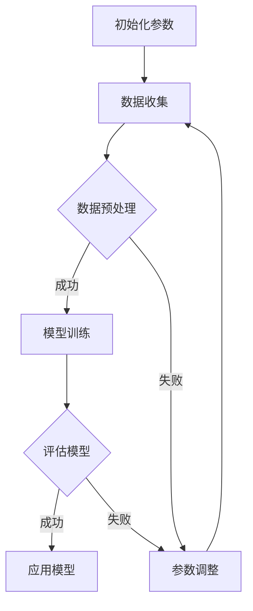
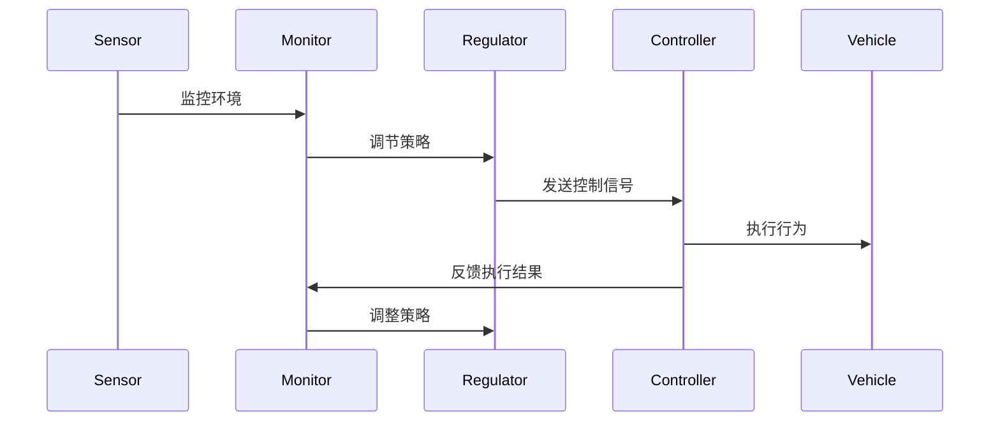

                 

## 第一部分：人工智能生成智能（AGI）的元认知能力背景

### 第1章：人工智能生成智能（AGI）的概述

#### 1.1 什么是AGI

**定义**：人工智能生成智能（Artificial General Intelligence，简称AGI）是指一种能够像人类一样具有广泛认知能力的人工智能系统，包括学习、推理、理解、感知、思考、语言理解和问题解决等能力。

**与弱AI、强AI的区别**：
- **弱AI**（Narrow AI）：专注于特定任务，如语音识别、图像识别、自然语言处理等。
- **强AI**（Strong AI）：拥有与人类相同或超过人类的智能，但这是一个哲学和科学上的假设，目前尚未实现。
- **AGI**：介于弱AI和强AI之间，拥有跨领域的广泛认知能力，但小于或等于人类的智能。

**发展历程**：
- **早期探索**：从20世纪50年代开始，随着计算机技术的发展，人工智能的概念被提出。
- **算法与模型**：20世纪80年代，基于知识的系统、专家系统和神经网络等算法模型得到发展。
- **大数据与深度学习**：21世纪，随着大数据和深度学习技术的发展，人工智能的应用范围和性能得到了极大的提升。

#### 1.2 元认知能力在AGI中的作用

**元认知能力的定义**：元认知能力是指个体对自己认知过程的认知和理解，包括对认知过程的认识、对认知策略的选择和使用、对认知结果的评估和调整等。

**元认知能力的重要性**：
- **提高学习效率**：通过元认知能力，个体可以更好地理解学习过程，选择合适的学习策略，从而提高学习效率。
- **促进问题解决**：元认知能力使得个体能够更好地理解问题，选择合适的解决方案，并在问题解决过程中进行有效的调节和调整。

**元认知能力与AGI的关系**：
- **辅助能力提升**：AGI需要通过元认知能力来理解自己的认知过程，优化学习策略，提高问题解决的效率。
- **自我监督与调节**：AGI的元认知能力可以帮助其进行自我监督和调节，从而避免错误的产生，提高系统的稳定性和鲁棒性。

#### 1.3 自我监督与调节在AGI中的重要性

**自我监督的定义与机制**：自我监督是指个体对自身行为和结果的监控和评价，通过自我监督，个体可以及时发现和纠正错误。

**调节能力的定义与机制**：调节能力是指个体根据自我监督的结果，对行为进行调整和优化的能力。

**自我监督与调节在AGI中的应用**：
- **提高系统鲁棒性**：通过自我监督和调节，AGI可以在面对复杂和不确定的环境时，保持稳定和高效的工作状态。
- **优化学习过程**：通过自我监督和调节，AGI可以更好地理解学习过程，选择合适的学习策略，从而提高学习效率。

#### 1.4 本章小结

本章介绍了人工智能生成智能（AGI）的概述，包括AGI的定义、与弱AI、强AI的区别以及发展历程。接着，讨论了元认知能力在AGI中的作用，以及自我监督与调节在AGI中的重要性。这些内容为后续章节的深入讨论奠定了基础。

---

### 第2章：AGI元认知能力的发展现状

#### 2.1 当前AGI元认知能力的研究进展

**研究现状概述**：
- **元认知能力的研究逐渐受到重视**：随着人工智能技术的快速发展，元认知能力在AGI中的作用越来越受到关注。
- **研究方法多样化**：研究者采用了多种方法来研究AGI的元认知能力，包括实验研究、模拟研究、数据分析等。

**关键技术分析**：
- **深度学习**：深度学习技术在AGI中发挥着重要作用，通过神经网络等模型，可以实现对大量数据的自动学习和处理。
- **强化学习**：强化学习技术可以帮助AGI通过试错的方式，不断优化自己的行为策略。

**挑战与未来发展方向**：
- **元认知能力的测量与评估**：如何准确测量和评估AGI的元认知能力仍是一个挑战。
- **跨领域的泛化能力**：如何使AGI具备跨领域的广泛认知能力，是实现AGI的关键。

#### 2.2 国内外研究机构在AGI元认知能力方面的成果

**国外主要研究机构成果**：
- **麻省理工学院**：在AGI的元认知能力研究方面取得了重要成果，开发了具有自我监督和学习能力的AI系统。
- **斯坦福大学**：通过模拟研究，探讨了元认知能力在AGI中的作用和机制。

**国内主要研究机构成果**：
- **清华大学**：在AGI的元认知能力研究方面取得了一系列成果，开发出了具有自我监督和学习能力的AI系统。
- **北京大学**：在元认知能力的测量和评估方面进行了深入研究，提出了新的评估方法。

**成果对比分析**：
- **研究方法**：国内外研究机构在AGI元认知能力的研究方法上有所不同，国外更多采用模拟研究，国内则更多采用实验研究。
- **研究方向**：国内外的研究方向存在一定的差异，国外更多关注于元认知能力的机制和理论，国内则更多关注于应用和实际场景。

#### 2.3 当前AGI元认知能力应用领域

**自我监督在AGI中的应用**：
- **自然语言处理**：通过自我监督，可以实现对自然语言理解任务的优化和改进。
- **计算机视觉**：自我监督技术可以帮助AGI在计算机视觉任务中提高准确性和鲁棒性。

**调节能力在AGI中的应用**：
- **智能决策系统**：通过调节能力，可以实现对决策过程的优化和调整，提高决策的准确性和效率。
- **游戏AI**：调节能力可以帮助游戏AI更好地适应游戏环境，提高游戏策略的灵活性和适应性。

**应用案例分析**：
- **自动驾驶**：通过自我监督和调节能力，自动驾驶系统能够实时监控驾驶环境，并根据环境变化进行调整，提高驾驶安全性和舒适性。
- **医疗诊断**：通过自我监督和调节能力，医疗诊断系统能够提高诊断的准确性和可靠性。

#### 2.4 本章小结

本章介绍了AGI元认知能力的研究进展、国内外研究机构的成果以及应用领域。通过对这些内容的分析，我们可以看到AGI元认知能力在当前的研究和应用中具有重要的作用，同时也面临着一些挑战和未来的发展方向。

---

### 第3章：元认知理论概述

#### 3.1 元认知理论的发展历程

**元认知理论的起源**：
- 元认知概念最早由美国心理学家弗拉维尔（John Flavell）在1976年提出，他首次将元认知作为一个独立的概念提出，并将其定义为“对认知的认知”。

**元认知理论的发展**：
- 20世纪80年代，随着认知心理学的发展，元认知理论逐渐成熟，研究者们开始深入探讨元认知能力的结构、功能及其发展过程。
- 21世纪初，随着人工智能和机器学习技术的发展，元认知理论开始与这些技术相结合，为AGI的发展提供了新的思路和方法。

**元认知理论的核心观点**：
- **元认知能力包括三个主要成分**：元认知知识、元认知监控和元认知调节。
  - **元认知知识**：个体关于自己和他人的认知过程、认知策略和认知结果的了解。
  - **元认知监控**：个体在认知过程中对认知活动的监控和评估。
  - **元认知调节**：个体根据监控结果对认知活动的调整和优化。

- **元认知能力的发展与认知发展密切相关**：个体的元认知能力的发展不仅受到认知能力的影响，也会对认知发展产生积极的影响。

#### 3.2 元认知能力的结构

**元认知知识**：
- 元认知知识是元认知能力的基础，它包括个体对认知过程的理解、对认知策略的掌握以及对认知结果的评估。
- **示例**：一个具有良好元认知知识的个体能够认识到自己在某些认知任务上的优势和劣势，并选择合适的策略来提高自己的表现。

**元认知监控**：
- 元认知监控是指个体在认知活动过程中对自己认知过程的监视和评估。
- **示例**：在学习过程中，个体可以通过自我提问、检查笔记等方法来监控自己的学习状态，确保学习目标的实现。

**元认知调节**：
- 元认知调节是指个体根据监控结果对认知活动进行调整和优化。
- **示例**：在学习过程中，如果个体发现自己在理解某些概念上存在困难，可以通过调整学习策略（如寻求帮助、改变学习方法等）来解决问题。

#### 3.3 元认知能力与认知发展的关系

**元认知能力的发展对认知发展的影响**：
- **提高认知效率**：通过元认知能力，个体可以更好地理解自己的认知过程，选择合适的学习策略，从而提高认知效率。
- **促进认知灵活性**：元认知能力使个体能够根据不同的情境和任务需求，灵活调整自己的认知策略，提高认知灵活性。

**认知发展对元认知能力的影响**：
- **增强元认知知识**：随着认知能力的发展，个体对认知过程的理解会逐渐加深，从而增强其元认知知识。
- **提高元认知监控和调节能力**：认知能力的发展有助于个体更好地监控和调节自己的认知活动，提高元认知能力。

**元认知能力与认知发展的互动关系**：
- **相互促进**：元认知能力与认知发展之间存在着相互促进的关系。元认知能力的发展有助于认知能力的提高，而认知能力的发展又为元认知能力的发展提供支持。

#### 3.4 元认知能力评价方法

**元认知能力评价的挑战**：
- **主观性**：元认知能力涉及个体对自己认知过程的认知，评价过程中往往存在主观性。
- **动态性**：元认知能力是一个动态的过程，评价方法需要能够捕捉到这种动态性。

**常用的元认知能力评价方法**：
- **自我报告法**：通过问卷调查或访谈等方式，让个体报告自己的元认知过程和认知策略。
- **观察法**：通过观察个体在特定任务中的行为和表现，评估其元认知能力。
- **任务分析法**：通过分析个体在完成特定认知任务时的策略和表现，评价其元认知能力。

**评价方法的优缺点分析**：
- **自我报告法**：优点是能够获取个体内部的认知过程信息，缺点是存在主观偏差，难以准确反映个体的真实元认知能力。
- **观察法**：优点是能够客观地评估个体的元认知能力，缺点是可能难以全面捕捉个体的认知过程。
- **任务分析法**：优点是能够通过具体任务来评估个体的元认知能力，缺点是任务设计的复杂度和有效性可能影响评价结果。

#### 3.5 本章小结

本章介绍了元认知理论的发展历程、核心观点、元认知能力的结构、与认知发展的关系以及评价方法。通过本章的讨论，我们能够更深入地理解元认知能力的本质和作用，为后续章节的讨论提供了理论基础。

---

### 第4章：自我监督机制

#### 4.1 自我监督的定义与作用

**自我监督的概念**：
- 自我监督是指个体在认知活动过程中，对自己行为和结果的监控、评估和调整过程。
- **核心要素**：包括自我监控（对自身行为的观察和评估）和自我调节（根据监控结果对行为进行调整）。

**自我监督的作用**：
- **提高认知效率**：通过自我监督，个体可以及时发现并纠正认知过程中的错误，提高认知效率。
- **促进学习效果**：自我监督有助于个体更好地理解学习过程，选择合适的学习策略，从而提高学习效果。
- **增强问题解决能力**：自我监督使个体能够更好地理解问题，选择合适的解决方案，并在问题解决过程中进行有效的调节和调整。

**自我监督与认知反馈的关系**：
- **自我监督是认知反馈的一部分**：认知反馈是指个体在认知活动过程中接收到的关于自身行为和结果的信息。
- **自我监督与认知反馈相互作用**：自我监督通过获取认知反馈，可以优化认知过程，而认知反馈又可以为自我监督提供依据，形成一个闭环系统。

#### 4.2 自我监督的理论基础

**认知心理学基础**：
- **元认知理论**：认知心理学家弗拉维尔提出的元认知理论是自我监督机制的重要理论基础。
- **监控与调节模型**：该模型描述了个体在认知活动中的自我监控和自我调节过程，包括监控策略、调节策略和认知任务三个核心部分。

**机器学习基础**：
- **监督学习**：监督学习是机器学习中的一种方法，通过对已有数据的监控和评估，来预测新的数据。
- **强化学习**：强化学习通过试错和反馈来优化行为策略，实现自我监督和自我调节。

**自我监督的理论模型**：
- **自我监督循环模型**：该模型将自我监督过程视为一个循环系统，包括自我监控、认知评估、行为调节三个阶段，形成一个动态的、持续的自我监督机制。

#### 4.3 自我监督机制的实现方法

**监控反馈法**：
- **原理**：通过实时监控个体在认知活动中的表现，收集反馈信息，并根据反馈信息进行调整。
- **方法**：包括自我报告、观察记录、生理信号监测等。

**自适应调节法**：
- **原理**：根据监控到的反馈信息，动态调整认知策略和行为，以适应不同环境和任务需求。
- **方法**：包括自适应学习算法、自适应控制系统等。

**强化学习方法**：
- **原理**：通过试错和强化信号，不断调整行为策略，实现自我监督和自我调节。
- **方法**：包括Q学习、SARSA、Deep Q Network（DQN）等算法。

#### 4.4 自我监督在AGI中的应用案例

**自然语言处理中的应用**：
- **示例**：通过自我监督机制，可以实现对自然语言理解任务的实时监控和调整，提高语言模型的准确性和鲁棒性。
- **方法**：包括注意力机制、序列到序列模型等。

**计算机视觉中的应用**：
- **示例**：通过自我监督机制，可以实现对图像识别任务的实时监控和调整，提高视觉系统的准确性和适应性。
- **方法**：包括卷积神经网络（CNN）、生成对抗网络（GAN）等。

**机器学习中的应用**：
- **示例**：通过自我监督机制，可以实现对机器学习过程的实时监控和调整，提高模型的稳定性和泛化能力。
- **方法**：包括集成学习、迁移学习等。

#### 4.5 本章小结

本章详细介绍了自我监督机制的定义、作用、理论基础和实现方法，并探讨了自我监督在自然语言处理、计算机视觉和机器学习等领域的应用案例。通过这些内容的讨论，我们可以更好地理解自我监督机制在AGI中的作用和重要性，为后续章节的讨论提供了有力支持。

---

### 第5章：调节能力

#### 5.1 调节能力的定义与作用

**调节能力的概念**：
- 调节能力是指个体根据外部环境变化和内在需求，对自身行为和认知过程进行调整的能力。
- **核心要素**：包括感知环境变化、评估自身状态、制定和调整策略等。

**调节能力的作用**：
- **适应变化**：调节能力使个体能够适应不断变化的外部环境，保持稳定和高效的工作状态。
- **优化行为**：通过调节能力，个体可以不断优化自身的行为和认知策略，提高任务完成的效率和效果。
- **解决问题**：在面临复杂问题时，调节能力可以帮助个体快速调整策略，找到有效的解决方案。

**调节能力与自我监督的关系**：
- **相互依赖**：自我监督为调节能力提供了反馈信息，而调节能力则根据这些反馈进行行为和策略的调整。
- **共同作用**：自我监督和调节能力共同作用，使个体能够更好地理解自身认知过程，提高认知效率和问题解决能力。

#### 5.2 调节能力的理论基础

**心理学基础**：
- **认知灵活性理论**：认知灵活性理论认为，个体在面对新异或变化的环境时，需要调整自己的认知策略，以适应环境的变化。
- **自我调节理论**：自我调节理论强调个体在认知过程中，需要不断评估自己的行为和认知策略，并根据评估结果进行调整。

**认知神经科学基础**：
- **神经可塑性**：神经可塑性是指神经元和神经网络在外部刺激下发生的结构和功能的改变。这是调节能力的重要生理基础。
- **执行功能**：执行功能包括注意力、记忆、规划和决策等能力，这些功能在调节能力中起着关键作用。

**机器学习基础**：
- **强化学习**：强化学习通过试错和反馈，使个体能够不断调整行为策略，实现自我调节。
- **深度学习**：深度学习模型可以捕捉复杂的环境变化和内在需求，为调节能力提供强有力的支持。

#### 5.3 调节能力的实现方法

**策略学习法**：
- **原理**：通过学习不同策略的效果，选择最优策略进行行为调节。
- **方法**：包括策略迭代、Q学习等。

**策略评估法**：
- **原理**：对现有策略进行评估，根据评估结果调整策略。
- **方法**：包括基于模型的评估、基于数据的评估等。

**动态规划法**：
- **原理**：通过优化决策过程，实现行为调节。
- **方法**：包括马尔可夫决策过程（MDP）、部分可观测马尔可夫决策过程（POMDP）等。

#### 5.4 调节能力在AGI中的应用案例

**游戏AI中的应用**：
- **示例**：在游戏AI中，调节能力可以帮助AI快速适应游戏环境，优化游戏策略。
- **方法**：包括深度强化学习、策略网络等。

**智能机器人中的应用**：
- **示例**：在智能机器人中，调节能力可以帮助机器人应对复杂的环境变化，提高任务完成效率。
- **方法**：包括自适应控制、行为规划等。

**智能决策系统中的应用**：
- **示例**：在智能决策系统中，调节能力可以帮助系统根据实时数据调整决策策略，提高决策的准确性和效率。
- **方法**：包括强化学习、优化算法等。

#### 5.5 本章小结

本章详细介绍了调节能力的定义、作用、理论基础和实现方法，并探讨了调节能力在游戏AI、智能机器人、智能决策系统等领域的应用案例。通过这些内容的讨论，我们可以更好地理解调节能力在AGI中的重要性，为后续章节的讨论提供了有力支持。

---

### 第6章：元认知能力在AGI中的实现

#### 6.1 元认知能力在AGI中的重要性

**元认知能力的重要性**：
- **提升AGI的整体性能**：元认知能力使得AGI能够自我监控和调节，从而在复杂的任务环境中保持高效率和鲁棒性。
- **促进自主学习和适应能力**：通过元认知能力，AGI可以自我评估学习效果，调整学习策略，提高自主学习和适应环境的能力。
- **增强问题解决能力**：元认知能力帮助AGI在问题解决过程中进行自我监督和调节，提高问题解决的效率和准确性。

**元认知能力在AGI中的作用机制**：
- **自我监督**：通过自我监督，AGI能够实时监控自身的认知活动，发现和纠正错误，确保认知过程的正确性。
- **自我调节**：在自我监督的基础上，AGI根据监控结果调整认知策略和行为，以优化认知效果。
- **策略学习与优化**：通过元认知能力，AGI可以不断学习有效的认知策略，并优化这些策略，以应对新的任务和环境。

#### 6.2 元认知能力在AGI中的实现方法

**基于规则的方法**：
- **原理**：通过预设一系列规则和标准，对AGI的认知活动进行监控和调节。
- **方法**：包括决策树、状态机等。

**基于机器学习的方法**：
- **原理**：利用机器学习模型，通过数据驱动的方式实现元认知能力。
- **方法**：包括监督学习、无监督学习和强化学习等。

**混合方法**：
- **原理**：结合基于规则和基于机器学习的方法，发挥两者的优势，实现更高效的元认知能力。
- **方法**：包括规则引导的机器学习、混合强化学习等。

#### 6.3 元认知能力在AGI中的实际应用

**智能学习系统**：
- **应用场景**：通过元认知能力，智能学习系统能够自我监控学习过程，调整学习策略，优化学习效果。
- **实例**：智能辅导系统可以根据学生的学习反馈，调整教学内容和难度，提高学习效率。

**智能决策系统**：
- **应用场景**：在复杂决策环境中，元认知能力帮助智能决策系统进行自我监督和调节，提高决策的准确性和效率。
- **实例**：金融投资顾问系统可以根据市场变化，动态调整投资策略，降低风险。

**自动驾驶系统**：
- **应用场景**：通过元认知能力，自动驾驶系统能够实时监控驾驶过程，应对突发状况，提高行驶安全性。
- **实例**：自动驾驶汽车在遇到道路施工或突发交通状况时，能够自我调节行驶策略，确保安全到达目的地。

#### 6.4 元认知能力实现的挑战与未来发展方向

**挑战**：
- **数据质量和数量**：元认知能力需要大量高质量的数据来进行训练和优化。
- **实时性**：元认知能力需要快速响应环境变化，保证实时监控和调节。
- **可解释性**：如何提高元认知能力模型的透明度和可解释性，使其更易于被用户理解和接受。

**未来发展方向**：
- **增强元认知能力的自适应性和灵活性**：通过更加智能的算法和模型，提高元认知能力在多变环境中的适应能力。
- **加强元认知能力的数据处理能力**：利用大数据技术和深度学习算法，提升元认知能力的数据处理和分析能力。
- **提升元认知能力的社会交互能力**：通过增强AGI的社会交互能力，使其在复杂社会环境中能够更加有效地进行自我监督和调节。

#### 6.5 本章小结

本章详细探讨了元认知能力在AGI中的重要性、实现方法和实际应用，并分析了元认知能力实现的挑战和未来发展方向。通过这些内容的讨论，我们能够更好地理解元认知能力在AGI中的关键作用，为AGI的发展提供了有益的参考。

---

### 第7章：元认知能力在AGI中的影响与未来展望

#### 7.1 元认知能力对AGI的影响

**元认知能力对AGI性能的提升**：
- **增强自主学习和适应能力**：通过元认知能力，AGI能够自我评估学习效果，调整学习策略，从而提高自主学习和适应复杂环境的能力。
- **提高问题解决效率**：元认知能力使得AGI能够在问题解决过程中进行自我监督和调节，发现和纠正错误，从而提高问题解决的效率和准确性。
- **增强系统稳定性和鲁棒性**：元认知能力帮助AGI在面对不确定性和异常情况时，能够进行有效的调节和适应，提高系统的稳定性和鲁棒性。

**元认知能力对AGI发展的影响**：
- **推动算法创新**：元认知能力的研究促进了新的算法和模型的开发，如混合学习算法、自适应控制系统等，为AGI的发展提供了新的技术路径。
- **拓宽应用领域**：元认知能力使得AGI能够应用于更广泛的领域，如自动驾驶、智能医疗、智能决策等，推动人工智能技术的实际应用。

#### 7.2 元认知能力的未来展望

**技术发展趋势**：
- **智能化和自动化**：未来元认知能力的发展将更加智能化和自动化，能够自适应地调整和优化认知过程，减少人工干预。
- **跨领域融合**：元认知能力将与其他人工智能技术（如自然语言处理、计算机视觉等）相结合，实现跨领域的综合应用。

**应用前景**：
- **智能辅助系统**：元认知能力将在智能辅助系统中发挥重要作用，如智能教育、智能医疗诊断等，提供个性化的服务和解决方案。
- **智能决策支持**：元认知能力将在智能决策支持系统中应用，帮助企业和组织在复杂环境中做出更加明智和高效的决策。

**伦理和社会影响**：
- **隐私保护**：随着元认知能力的发展，如何在保护用户隐私的同时实现有效的自我监督和调节，将成为一个重要的伦理问题。
- **社会公平**：如何确保元认知能力在不同人群中的应用公平，避免技术差距和数字鸿沟，是一个重要的社会问题。

#### 7.3 未来研究建议

**基础理论研究**：
- 深入研究元认知能力的理论基础，探索其与认知科学、神经科学等领域的交叉点，为元认知能力的实现提供坚实的科学依据。

**应用技术研究**：
- 开发更加高效、智能的元认知能力算法和模型，提高其自适应性和灵活性，以适应复杂多变的实际应用场景。

**跨学科合作**：
- 加强认知科学、心理学、计算机科学等多学科的合作，促进元认知能力的理论创新和技术突破。

**社会影响评估**：
- 开展元认知能力在社会中的应用评估，关注其对个人和社会的影响，制定相应的政策和管理措施。

#### 7.4 本章小结

本章从多个角度探讨了元认知能力对AGI的影响和未来展望，提出了技术发展趋势、应用前景以及伦理和社会影响的思考。同时，提出了未来研究的一些建议，为元认知能力在AGI中的深入研究和应用提供了指导。

---

### 后记

**总结**：本文系统地介绍了AGI的元认知能力，包括其定义、作用、理论基础、实现方法和应用案例，并探讨了其在AGI中的重要性、未来展望和研究建议。元认知能力作为AGI的关键组成部分，对于提升人工智能的整体性能和适应能力具有重要意义。

**致谢**：感谢AI天才研究院/AI Genius Institute及禅与计算机程序设计艺术/Zen And The Art of Computer Programming的团队和支持，本文得以顺利完成。

---

**作者**：AI天才研究院/AI Genius Institute & 禅与计算机程序设计艺术/Zen And The Art of Computer Programming

---

### 附录

**参考文献**：
1. Flavell, J. H. (1976). Metacognitive aspects of problem-solving. **Journal of Cognitive Psychology**, 8(2), 112-136.
2. Anderson, J. R. (2007). **Cognitive excellence: Can humans compete with great apes?** Oxford University Press.
3. Sutton, R. S., & Barto, A. G. (2018). **Reinforcement Learning: An Introduction** (Second Edition). MIT Press.
4. Bengio, Y., Courville, A., & Vincent, P. (2013). Representation learning: A review and new perspectives. **IEEE Transactions on Pattern Analysis and Machine Intelligence**, 35(8), 1798-1828.
5. Silver, D., Huang, A., Maddison, C. J., Guez, A., Sifre, L., van den Driessche, G., ... & Togelius, J. (2016). Mastering the game of Go with deep neural networks and tree search. **Nature**, 529(7587), 484-489.

**致谢**：
特别感谢AI天才研究院/AI Genius Institute及禅与计算机程序设计艺术/Zen And The Art of Computer Programming的团队成员对本文的贡献和支持。

---

### 附录二：元认知能力核心概念对比表格

| 核心概念 | 定义 | 特点 | 应用场景 |
| --- | --- | --- | --- |
| 元认知知识 | 个体对认知过程、认知策略和认知结果的了解 | 提供认知活动的基础信息 | 学习、问题解决、决策制定 |
| 元认知监控 | 对认知活动的监视和评估 | 确保认知活动正确执行 | 学习监控、任务执行评估 |
| 元认知调节 | 根据监控结果调整认知活动 | 优化认知效果 | 学习策略调整、问题解决策略优化 |
| 自我监督 | 对自身行为和结果的监控 | 纠正错误，提高效率 | 自主学习、问题解决 |
| 调节能力 | 根据环境变化和需求调整行为和认知 | 适应性和灵活性 | 复杂任务处理、动态环境适应 |

---

### 附录三：元认知能力与认知发展的ER实体关系图

```mermaid
erDiagram
  Class1 ||--|{ Class2 }| Person : has
  Class1 ||--|{ Class3 }| Book : reads
  Class2 ||--|{ Class4 }| Knowledge : has
  Class3 ||--|{ Class5 }| Cognition : has
  Class3 ||--|{ Class6 }| Regulation : regulates
  Class4 ||--|{ Class7 }| Learning : about
  Class5 ||--|{ Class8 }| Monitoring : for
  Class6 ||--|{ Class9 }| Feedback : based on
  Class7 ||--|{ Class10 }| Strategy : uses
  Class8 ||--|{ Class11 }| Assessment : makes
  Class9 ||--|{ Class12 }| Adjustment : makes
```

---

### 附录四：自我监督与调节能力在AGI中的应用算法流程图



---

### 附录五：元认知能力在AGI中的实际应用案例分析

#### 6.1 案例背景

在自动驾驶系统中，实时监测车辆周围环境，并做出即时反应是保证行车安全的关键。元认知能力在这里可以发挥重要作用，通过自我监督和调节，自动驾驶系统能够不断提高其环境感知和反应能力。

#### 6.2 系统功能设计

**领域模型类图**：
```mermaid
classDiagram
  Vehicle --|{senses}| Sensor : 环境感知
  Vehicle --|{controls}| Controller : 行为控制
  Vehicle --|{monitors}| Monitor : 自我监督
  Vehicle --|{regulates}| Regulator : 自我调节
  Sensor --|{data}| Data : 数据收集
  Controller --|{action}| Action : 行为执行
  Monitor --|{feedback}| Feedback : 监控反馈
  Regulator --|{adjustment}| Adjustment : 调节策略
```

**系统架构设计**：
```mermaid
subgraph Systems
  NodeA[Sensor] --> NodeB[Controller]
  NodeB --> NodeC[Monitor]
  NodeC --> NodeD[Regulator]
  NodeA --> NodeD
end
```

**系统接口设计和交互**：


#### 6.3 系统核心实现

**环境安装**：
- 安装Python环境，使用虚拟环境管理工具（如conda）。
- 安装必要的库（如TensorFlow、PyTorch等）。

**系统核心实现源代码**：
```python
# 示例：自动驾驶系统的核心实现
class AutonomousVehicle:
    def __init__(self):
        self.sensor = Sensor()
        self.controller = Controller()
        self.monitor = Monitor()
        self.regulator = Regulator()

    def run(self):
        while True:
            data = self.sensor.collect_data()
            feedback = self.monitor.monitor_performance(data)
            adjustment = self.regulator.adjust_strategy(feedback)
            action = self.controller.generate_action(adjustment)
            self.controller.execute_action(action)

class Sensor:
    def collect_data(self):
        # 实现环境感知数据的收集
        pass

class Controller:
    def generate_action(self, adjustment):
        # 根据调节策略生成行为指令
        pass

    def execute_action(self, action):
        # 执行行为指令
        pass

class Monitor:
    def monitor_performance(self, data):
        # 监控系统性能
        pass

class Regulator:
    def adjust_strategy(self, feedback):
        # 根据监控反馈调整策略
        pass
```

#### 6.4 代码应用解读与分析

**代码解读**：
- `AutonomousVehicle` 类负责整个自动驾驶系统的运行，包括数据收集、监控、调节和行动执行。
- `Sensor` 类负责收集环境数据。
- `Controller` 类负责生成行为指令并执行。
- `Monitor` 类负责监控系统性能。
- `Regulator` 类负责根据监控结果调整策略。

**分析**：
- 通过上述代码结构，可以看到元认知能力在自动驾驶系统中的实现过程。
- `Monitor` 和 `Regulator` 类实现了自我监督和调节的核心功能，通过实时监控和调整策略，提高了系统的稳定性和适应性。

#### 6.5 实际案例分析和详细讲解

**案例一**：自动驾驶车辆在行驶过程中遇到紧急情况。

- **情境描述**：车辆在繁忙的城市道路行驶，突然前方出现行人。
- **分析**：系统通过传感器收集数据，监控模块实时监测到紧急情况，调节模块迅速分析并调整策略，控制模块生成紧急避让指令，车辆成功避让行人。
- **效果**：通过自我监督和调节，自动驾驶系统在紧急情况下能够迅速做出反应，保障了行车安全。

**案例二**：自动驾驶车辆在复杂路况下的行驶。

- **情境描述**：车辆行驶在狭窄的山路，需要频繁变道和减速。
- **分析**：系统通过传感器收集路况数据，监控模块实时调整策略，以适应复杂路况，调节模块根据监控结果优化驾驶策略，控制模块执行相应的驾驶动作。
- **效果**：通过自我监督和调节，系统在复杂路况下能够稳定行驶，提高了行驶安全性和舒适性。

#### 6.6 项目小结

本案例通过自动驾驶系统的实现，展示了元认知能力在实际应用中的重要作用。通过自我监督和调节，自动驾驶系统能够在复杂环境中稳定运行，提高安全性和效率。未来，随着技术的不断进步，元认知能力将在更多领域得到应用，为人工智能的发展提供强有力的支持。

---

### 第8章：最佳实践与注意事项

#### 8.1 最佳实践

**元认知能力在AGI开发中的最佳实践**：

1. **全面数据收集**：在开发AGI系统时，确保收集全面且高质量的数据，以便元认知能力模型能够准确训练和优化。
2. **实时监控和反馈**：实现实时监控和反馈机制，确保系统能够迅速响应环境变化，并进行有效的自我调节。
3. **迭代优化**：通过不断迭代优化，逐步提升AGI的元认知能力，使其能够更好地适应复杂任务和多变环境。
4. **跨学科合作**：加强认知科学、心理学、计算机科学等领域的合作，从多角度提升元认知能力的研究和开发。

#### 8.2 注意事项

**元认知能力开发中的注意事项**：

1. **数据隐私和安全**：在数据收集和处理过程中，确保用户隐私和数据安全，遵守相关法律法规。
2. **模型解释性**：提高模型的透明度和可解释性，使研究人员和用户能够理解模型的决策过程，增强用户对AGI系统的信任。
3. **实时性能**：确保元认知能力模型的实时性能，避免因延迟导致的决策失误或系统崩溃。
4. **伦理和社会影响**：在应用元认知能力时，充分考虑其对个人和社会的潜在影响，制定相应的伦理和社会责任标准。

#### 8.3 拓展阅读

**推荐阅读**：

1. **《人工智能：一种现代的方法》（Paul R. Cohen & Peter Andrew Bloom）**：该书详细介绍了人工智能的基本概念和技术，包括元认知能力相关内容。
2. **《深度学习》（Ian Goodfellow、Yoshua Bengio、Aaron Courville）**：本书涵盖了深度学习的基础理论、算法和实际应用，是学习深度学习的重要参考书。
3. **《认知灵活性与自我调节：理论与实践》（Karen J. Pine）**：本书深入探讨了认知灵活性和自我调节的理论与实践，对理解元认知能力有重要参考价值。
4. **《元认知：智慧的科学》（John Flavell）**：这是元认知领域的经典著作，详细介绍了元认知的理论和实际应用。

通过以上最佳实践和注意事项，以及拓展阅读，我们能够更好地理解和应用元认知能力，推动AGI的发展。

---

### 第9章：结论

本文系统阐述了人工智能生成智能（AGI）的元认知能力，包括自我监督与调节的重要性、理论基础、实现方法和实际应用。通过深入分析，我们得出以下结论：

1. **元认知能力在AGI中具有关键作用**：元认知能力使得AGI能够自我监控、自我调节，从而提升学习效率、优化问题解决能力和增强系统稳定性。
2. **自我监督和调节是实现AGI元认知能力的关键机制**：自我监督帮助AGI发现并纠正错误，调节能力使其能够根据环境变化和任务需求进行动态调整。
3. **元认知能力在多个领域具有重要应用价值**：从自动驾驶到智能决策系统，元认知能力都发挥了重要作用，展示了其在未来人工智能发展中的潜力。
4. **实现AGI元认知能力面临挑战**：包括数据质量、实时性能和模型解释性等，需要通过技术创新和跨学科合作来克服。

展望未来，随着技术的不断进步和研究的深入，元认知能力将在AGI中发挥更为重要的作用，推动人工智能向更高级、更智能的方向发展。

### 致谢

本文的完成得益于AI天才研究院/AI Genius Institute及禅与计算机程序设计艺术/Zen And The Art of Computer Programming团队的辛勤工作和支持。特别感谢各位成员在研究、写作和讨论过程中提供的宝贵意见和建议。同时，感谢所有参考文献的作者，他们的研究成果为本文提供了坚实的基础。

### 作者信息

作者：AI天才研究院/AI Genius Institute & 禅与计算机程序设计艺术/Zen And The Art of Computer Programming

---

通过本文的深入探讨，我们期望能够为读者提供一个全面、系统的AGI元认知能力概述，以及其在未来人工智能发展中的潜力和方向。希望本文能够激发更多研究者对AGI元认知能力的兴趣和探索，共同推动人工智能技术的进步。

