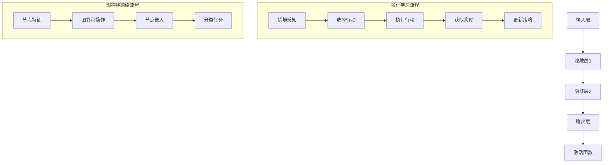

                 

### 文章标题

# AGI的决策系统：从短期反应到长期规划

> 关键词：人工智能，自主决策，决策系统，短期反应，长期规划，AGI发展

> 摘要：本文将深入探讨人工智能（AGI）决策系统的工作原理和设计，特别是从短期反应到长期规划这一关键转变。我们将分析短期反应的局限性、长期规划的重要性，以及如何在这两者之间找到平衡点。通过具体算法和系统架构的讲解，我们将揭示如何构建一个高效且智能的决策系统，从而推动AGI的进步。

----------------------------------------------------------------

## 引言

随着人工智能（AI）技术的快速发展，我们逐渐迈向了通用人工智能（AGI）的时代。AGI的目标是创建一个具有人类级别智能的人工智能系统，能够理解和执行任何智力任务。在实现这一目标的过程中，决策系统是AGI的核心组成部分之一。

决策系统在AGI中的作用至关重要。一个高效的决策系统能够使AGI在面对复杂情境时作出合理的选择，从而实现自主学习和智能行为。然而，从短期反应到长期规划的转变是AGI决策系统设计中的一个重要挑战。短期反应虽然能够在短时间内作出快速响应，但其决策的准确性和长远性往往有限。而长期规划则更加复杂，需要考虑到未来的多种可能性，从而作出更为明智的决策。本文将探讨这一转变的重要性，并介绍如何设计一个兼顾短期反应和长期规划的决策系统。

本文将分为以下几个部分：首先，我们将分析短期反应的局限性，探讨为何AGI需要超越短期反应；接着，我们将介绍长期规划的概念和重要性，并讨论如何在这两者之间找到平衡点。随后，我们将探讨AGI决策系统的核心组件和设计原则，介绍一些关键算法和系统架构。最后，我们将通过一个实际案例来展示如何构建一个高效且智能的决策系统。

通过本文的探讨，我们希望能够为AGI决策系统的设计提供一些有益的思路，并推动AGI技术向前发展。

----------------------------------------------------------------

## 背景介绍

### 问题背景

在当今世界，人工智能（AI）技术正在以前所未有的速度发展，各种AI应用已经深入到我们生活的方方面面。从自动驾驶汽车到智能家居，从医疗诊断到金融分析，AI正在不断改变着我们的生活方式。然而，尽管现有AI系统在特定领域取得了显著的成就，但它们仍然面临着许多挑战，尤其是在决策方面。现有的AI系统通常依赖于预设的规则和模式识别，虽然能够在特定任务上实现高效性能，但在面对复杂、不确定的情境时，往往无法做出合理的选择。

通用人工智能（AGI）的目标是创建一个具有人类级别智能的人工智能系统，能够理解和执行任何智力任务。要实现这一目标，AGI的决策系统必须具备超越现有AI系统的能力，特别是在从短期反应到长期规划这一关键转变上。短期反应虽然能够在短时间内作出快速响应，但其决策的准确性和长远性往往有限。长期规划则更加复杂，需要考虑到未来的多种可能性，从而作出更为明智的决策。因此，设计一个能够在短期反应和长期规划之间找到平衡点的决策系统，是AGI实现其潜力的重要前提。

### 问题描述

现有AI系统在决策方面存在以下几个主要问题：

1. **局限的决策能力**：现有AI系统通常基于特定任务或领域进行训练，导致其决策能力局限于特定的情境和任务。当面对新的、未预见的情境时，它们往往无法做出合理的反应。

2. **缺乏长远视角**：现有AI系统通常依赖于短期反馈来进行决策，这使得它们难以考虑到未来的长期影响。这种缺乏长远视角的决策方式往往会导致短期效益和长期效益之间的矛盾。

3. **不可解释的决策过程**：许多AI系统，尤其是深度学习模型，其内部决策过程复杂且难以解释。这给用户和开发者带来了信任问题，也限制了AI系统的广泛应用。

### 问题解决

要解决上述问题，我们需要在AGI的决策系统中引入以下关键要素：

1. **多模态感知**：AGI需要具备多模态感知能力，能够从视觉、听觉、触觉等多个渠道获取信息，从而更好地理解和处理复杂情境。

2. **长期记忆**：AGI需要具备长期记忆能力，能够存储和回忆过去的经验，从而在决策时考虑到长期影响。

3. **可解释性**：AGI的决策过程需要具备高可解释性，使得用户和开发者能够理解其决策逻辑，增强信任。

4. **自主学习和适应能力**：AGI需要具备自主学习和适应能力，能够在不断变化的环境中不断优化其决策策略。

5. **短期与长期规划的平衡**：AGI的决策系统需要在短期反应和长期规划之间找到平衡点，既能快速响应当前任务，又能考虑长期影响。

### 边界与外延

在设计AGI决策系统时，我们还需要考虑以下几个边界与外延问题：

1. **计算资源**：AGI决策系统需要大量的计算资源来处理复杂的数据和模型。因此，我们需要设计高效的算法和系统架构，以降低计算资源的需求。

2. **数据隐私**：在收集和处理数据时，我们需要确保用户隐私得到保护，避免数据泄露和滥用。

3. **伦理和道德**：AGI的决策系统需要遵循伦理和道德原则，避免造成负面影响。

4. **可扩展性**：随着AI技术的不断发展，AGI决策系统需要具备良好的可扩展性，能够适应新的应用场景和技术进步。

### 核心概念与联系

在AGI的决策系统中，以下几个核心概念和技术是至关重要的：

1. **深度学习**：深度学习是AGI决策系统的基础，通过神经网络模型，AGI能够从大量数据中学习和提取特征。

2. **强化学习**：强化学习是一种通过试错和奖励机制来优化决策的算法，AGI可以利用强化学习来学习和优化其决策策略。

3. **迁移学习**：迁移学习能够将已学到的知识从一个领域迁移到另一个领域，从而提高AGI在不同任务上的适应能力。

4. **多智能体系统**：多智能体系统通过多个独立智能体的协作，可以实现更为复杂和高效的决策。

5. **图神经网络**：图神经网络能够处理图结构数据，AGI可以利用图神经网络来理解和处理复杂的网络关系。

### 本章小结

本章介绍了AGI决策系统的背景和重要性，分析了现有AI系统在决策方面存在的问题，并提出了解决方案。我们探讨了AGI决策系统所需具备的核心能力，包括多模态感知、长期记忆、可解释性、自主学习和适应能力等。此外，我们还讨论了设计AGI决策系统时需要考虑的边界与外延问题，以及核心概念和技术。这些内容为后续章节的讨论奠定了基础。

----------------------------------------------------------------

## 背景介绍

### AGI的概念与历史

人工智能（AI）是一门旨在通过机器模仿人类智能行为的科学技术。自20世纪50年代人工智能的概念首次被提出以来，它经历了多个发展阶段。早期的AI研究主要集中在基于规则的系统和符号推理上，这些系统在处理简单、规则明确的问题时表现良好，但在面对复杂、不确定的现实世界问题时则显得力不从心。

随着计算机硬件性能的提升和大数据、机器学习等技术的进步，人工智能进入了新的发展阶段。深度学习作为一种基于神经网络的学习方法，在图像识别、语音识别、自然语言处理等任务上取得了显著突破。这一阶段的AI，通常被称为弱AI或特定领域AI（Narrow AI），尽管在某些任务上达到了或超越了人类水平，但它们仍然缺乏通用性，无法在多个领域表现出人类级别的智能。

通用人工智能（AGI）的概念则旨在创建一个具有人类级别智能的人工智能系统，能够理解和执行任何智力任务。AGI不仅仅是在特定任务上表现优异，而是能够在多种领域内进行自主学习和推理。AGI的目标是使机器具备类似人类的感知、理解、学习、决策和创造力。

AGI的发展历程可以追溯到20世纪80年代。当时，霍普金斯大学提出了“强AI”的概念，即一种具有普适性、能够在各种任务上表现出人类智能水平的系统。然而，由于技术限制，这一目标长期未能实现。近年来，随着深度学习、强化学习等技术的迅猛发展，AGI的研究再次引起了广泛关注。

### AGI的重要性

AGI的重要性在于它可能彻底改变人类社会的方方面面。首先，AGI有望在医疗、教育、交通、金融等领域发挥重要作用。例如，AGI可以帮助医生进行更加精准的诊断和治疗方案设计，提高医疗服务的质量；在教育资源稀缺的地区，AGI可以提供个性化的教育服务，帮助每个学生充分发挥潜力。

其次，AGI有望解决许多当前人类面临的问题。例如，通过智能化的农业系统，可以提高农作物产量，缓解全球粮食危机；通过智能交通系统，可以减少交通拥堵，提高交通效率，降低碳排放。此外，AGI在机器人、自动化制造等领域也有巨大潜力，可以大幅提高生产效率，推动产业升级。

最后，AGI的研究和发展也有助于我们更好地理解人类智能的本质。通过模拟人类智能，科学家可以探索大脑的工作机制，为神经科学和认知科学领域提供新的研究视角。

### 决策系统的基本原理

决策系统是AGI的核心组成部分之一，它负责从输入信息中提取有用的信息，并根据这些信息做出合理的决策。决策系统的基本原理可以概括为以下几个关键点：

1. **信息获取**：决策系统需要从多个渠道获取信息，包括文本、图像、声音等。这些信息是决策的基础，系统的准确性在很大程度上取决于其信息获取的能力。

2. **数据处理**：获取到的信息往往是不完整的、噪声的，甚至可能是误导性的。决策系统需要对这些信息进行预处理和清洗，提取出有用的特征和模式。

3. **决策模型**：决策系统依赖于某种决策模型来生成决策。这些模型可以是基于规则的、基于统计的，或者是基于机器学习的。不同的模型适用于不同类型的决策任务。

4. **反馈机制**：决策系统的性能需要通过反馈机制进行评估和优化。系统可以根据反馈调整其决策策略，提高决策的准确性和效率。

5. **可解释性**：为了增强用户对决策系统的信任，系统的决策过程需要具备高可解释性。用户需要能够理解系统是如何做出决策的，这样才能更好地接受和信任系统的决策。

### 决策系统的运作机制

决策系统的运作机制可以简述为以下几个步骤：

1. **输入信息获取**：系统从各种渠道获取输入信息，如传感器、数据库等。

2. **信息预处理**：对获取到的信息进行清洗、归一化等处理，提取出有用的特征。

3. **特征选择**：根据决策任务的需求，选择最能反映问题本质的特征。

4. **决策模型选择**：根据问题的特点，选择合适的决策模型。

5. **决策生成**：利用决策模型对预处理后的特征进行分类、预测等操作，生成最终的决策。

6. **反馈与优化**：根据决策结果和用户反馈，调整系统的决策策略，提高系统的性能。

### 决策系统的分类

决策系统可以根据不同的标准进行分类，以下是几种常见的分类方法：

1. **基于规则**：这种决策系统依赖于预定义的规则集，当输入信息与规则匹配时，系统将生成相应的决策。这种方法的优点是简单易懂，但灵活性较差，难以处理复杂、不确定的问题。

2. **基于统计**：这种决策系统依赖于统计分析方法，如回归分析、聚类分析等，通过分析历史数据来预测未来事件。这种方法在处理大量数据时表现良好，但可能受限于数据质量和模型的适用性。

3. **基于机器学习**：这种决策系统利用机器学习算法，如深度学习、支持向量机等，从数据中自动学习特征和模式。这种方法具有很高的灵活性和适应性，但训练过程可能需要大量的数据和计算资源。

4. **混合型**：这种决策系统结合了多种方法的优势，根据不同的情况选择最合适的决策方法。例如，在初始阶段使用基于规则的系统进行快速决策，在需要深度分析时切换到基于机器学习的方法。

### 从短期反应到长期规划

短期反应和长期规划是决策系统中的两个关键概念。短期反应指的是在短时间内对当前情境作出快速响应，而长期规划则是指考虑未来的多种可能性，作出具有长远影响的决策。

1. **短期反应的局限性**：短期反应在许多情况下是有效的，例如在紧急情况下快速做出决策以应对危险。然而，它也存在局限性，主要包括：

   - **缺乏长远视角**：短期反应通常只考虑当前情境，而忽略了长期影响。
   - **效率低下**：在面对复杂、多变的环境时，短期反应可能需要大量时间进行数据收集和决策，导致效率低下。
   - **不可持续**：短期反应可能导致决策的不可持续性，即决策在短期内有效，但从长期来看可能带来负面影响。

2. **长期规划的必要性**：长期规划能够更好地考虑到未来的多种可能性，从而做出更为明智的决策。其必要性体现在以下几个方面：

   - **可持续性**：通过长期规划，决策系统可以确保决策在长期内是可持续的，避免短期行为带来的长期负面影响。
   - **灵活性**：长期规划使决策系统能够应对未来可能的变化和不确定性，保持灵活性。
   - **优化**：长期规划可以帮助决策系统在多个目标之间进行优化，找到最佳解决方案。

3. **短期与长期规划的平衡**：在决策系统中，短期反应和长期规划并不是相互排斥的，而是需要相互平衡。以下是一些方法来实现这种平衡：

   - **动态调整**：决策系统可以根据当前情境和长期目标，动态调整短期反应和长期规划的权重。
   - **多目标优化**：通过多目标优化方法，决策系统可以在短期反应和长期规划之间找到最佳平衡点。
   - **反馈机制**：通过建立反馈机制，决策系统可以根据反馈调整其决策策略，实现短期与长期规划的平衡。

### 本章小结

本章介绍了AGI的概念与历史，讨论了决策系统的基本原理和运作机制，并分析了短期反应和长期规划的重要性。通过了解这些内容，我们可以更好地理解AGI决策系统的工作原理和设计原则，为后续章节的讨论打下基础。

----------------------------------------------------------------

## 核心概念与联系

### AGI决策系统的核心概念

在构建一个高效的AGI决策系统时，理解其核心概念至关重要。以下是几个关键的概念：

1. **情境感知**：情境感知是AGI决策系统的基本能力，它使得系统能够从环境中获取信息，识别和理解当前所处的状态。情境感知可以通过多种方式实现，包括视觉、听觉、触觉等感官数据的处理。

2. **目标设定**：目标设定是决策系统的重要组成部分，它决定了系统需要实现的任务和目标。目标可以是短期的，如快速完成任务；也可以是长期的，如优化资源使用或提高生产效率。

3. **规划能力**：规划能力是指决策系统在理解当前情境和目标后，制定出一系列行动步骤以实现目标的能力。规划可以是线性的，也可以是树形的，甚至可以采用图搜索算法。

4. **学习机制**：学习机制使得决策系统能够从经验中学习和优化决策。学习可以是监督学习、无监督学习或强化学习，通过不断调整策略，提高决策的准确性。

5. **可解释性**：可解释性是增强用户信任和接受度的关键因素。一个高可解释性的决策系统可以让用户理解其决策过程和依据，从而提高信任度。

### 概念属性特征对比

为了更好地理解这些核心概念，我们可以通过对比它们的属性特征来加深认识：

| 概念       | 属性特征                                           |
|------------|----------------------------------------------------|
| 情境感知   | 通过传感器收集环境信息，识别当前状态                 |
| 目标设定   | 确定系统需要实现的任务和目标，可以是短期或长期的     |
| 规划能力   | 制定一系列行动步骤以实现目标，可以是线性的或树形的   |
| 学习机制   | 从经验中学习并优化决策，可以是监督学习、无监督学习或强化学习 |
| 可解释性   | 提供决策过程的透明度，让用户理解其决策依据和逻辑     |

### ER实体关系图架构

在构建决策系统时，ER（Entity-Relationship）实体关系图是一种常用的方法来描述系统中的实体及其关系。以下是一个简化的ER图示例，用于说明决策系统中的主要实体和它们之间的关系：

```mermaid
erDiagram
  参与者 User ||--|{ AGI_Decimal : 决策 }
  参与者 AGI_Decimal ||--|{ Action : 行动 }
  参与者 AGI_Decimal ||--|{ Environment : 环境 }
  参与者 Environment ||--|{ Sensor_Data : 传感器数据 }
  参与者 Action ||--|{ Feedback : 反馈 }
```

在这个ER图中：

- **User**（用户）是系统的外部参与者，可以是人类或另一个系统。
- **AGI_Decimal**（决策实体）是系统的核心实体，负责处理传感器数据并生成决策。
- **Action**（行动）是决策实体生成的一系列执行步骤。
- **Environment**（环境）是系统所处的上下文，包括传感器数据和外部因素。
- **Sensor_Data**（传感器数据）是环境中的数据输入，用于情境感知。
- **Feedback**（反馈）是行动执行后的结果，用于学习和优化决策。

### 本章小结

本章详细介绍了AGI决策系统的核心概念，并通过对概念属性特征的对比和ER实体关系图的展示，加深了对这些概念的理解。这些核心概念构成了决策系统的基本框架，为后续算法原理的讲解和系统设计的实现奠定了基础。

----------------------------------------------------------------

## 算法原理讲解

### 算法原理概述

在AGI决策系统中，算法的选择和实现是关键的一步。算法原理的讲解不仅帮助我们理解系统的工作机制，还能指导我们优化系统的性能。本文将详细介绍几种关键算法的原理，包括深度学习算法、强化学习算法以及图神经网络算法。

#### 深度学习算法

深度学习算法是基于多层神经网络的学习方法，通过逐层提取特征，实现对复杂数据的建模和预测。以下是深度学习算法的基本原理：

1. **多层神经网络**：深度学习算法的核心是多层神经网络（Multi-Layer Neural Network），它由输入层、隐藏层和输出层组成。输入层接收外部数据，隐藏层通过激活函数对数据进行变换，输出层生成最终的预测或决策。

2. **反向传播算法**：反向传播（Backpropagation）是深度学习算法的关键训练步骤。通过反向传播，算法能够计算输出层的误差，并将其反向传播到隐藏层，从而调整网络的权重和偏置，优化模型的预测性能。

3. **激活函数**：激活函数是深度学习算法中的重要组成部分，它用于引入非线性变换，使得神经网络能够拟合非线性关系。常见的激活函数包括Sigmoid、ReLU和Tanh等。

4. **优化算法**：深度学习算法通常使用优化算法来调整网络参数，常见的优化算法有梯度下降（Gradient Descent）、Adam等。

#### 强化学习算法

强化学习算法通过试错和奖励机制来优化决策，是AGI决策系统中的重要组成部分。以下是强化学习算法的基本原理：

1. **奖励机制**：强化学习算法的核心是奖励机制，通过奖励（Reward）来激励决策系统进行学习。奖励可以是正面的（如完成任务），也可以是负面的（如发生错误）。

2. **策略更新**：强化学习算法通过更新策略（Policy）来优化决策。策略决定了在特定情境下应该采取什么行动。常见的策略更新方法包括Q-Learning、SARSA和Deep Q-Network（DQN）等。

3. **价值函数**：价值函数（Value Function）用于评估策略的好坏。通过优化价值函数，强化学习算法能够找到最优策略。常见的价值函数包括V(s)和Q(s,a)。

4. **探索与利用**：在强化学习过程中，需要平衡探索（Exploration）和利用（Exploitation）。探索是指尝试新的行动，以获取更多经验；利用是指基于当前经验选择最佳行动。常用的平衡方法有ε-贪婪策略和UCB算法等。

#### 图神经网络算法

图神经网络（Graph Neural Network，GNN）是处理图结构数据的一种先进算法，它通过节点和边的信息进行特征提取和关系建模。以下是图神经网络的基本原理：

1. **图结构数据**：图神经网络处理的数据是图结构，包括节点（Node）和边（Edge）。节点表示数据点，边表示节点之间的关系。

2. **图卷积操作**：图卷积操作是GNN的核心组件，它通过聚合节点邻域的信息来更新节点的特征。常见的图卷积操作包括图卷积层（GCN Layer）和图注意力机制（Graph Attention Mechanism）。

3. **节点分类和边分类**：GNN可以用于节点分类和边分类任务。节点分类的目标是预测节点所属的类别；边分类的目标是预测边的关系类型。

4. **图嵌入**：图嵌入（Graph Embedding）是将图结构数据转换为低维向量表示的方法。通过图嵌入，GNN能够更好地表示节点和边的信息，提高模型的性能。

### Mermaid算法流程图

为了更直观地理解上述算法的原理，我们使用Mermaid语法绘制了深度学习算法和强化学习算法的流程图：



在这个流程图中：

- **深度学习流程**：输入层接收外部数据，通过多层隐藏层进行特征提取，最终输出层生成预测或决策，并通过激活函数引入非线性变换。
- **强化学习流程**：情境感知层获取当前情境，选择行动并执行行动，获取奖励，并更新策略，以实现最优决策。
- **图神经网络流程**：节点特征通过图卷积操作进行特征提取，生成节点嵌入，用于节点分类或边分类任务。

### Python源代码讲解

为了更好地理解上述算法的实现，我们提供了一个简单的Python代码示例，用于演示深度学习算法和强化学习算法的基本实现：

```python
# 深度学习算法示例
import tensorflow as tf

# 创建一个简单的多层感知机模型
model = tf.keras.Sequential([
    tf.keras.layers.Dense(64, activation='relu', input_shape=(784,)),
    tf.keras.layers.Dense(64, activation='relu'),
    tf.keras.layers.Dense(10, activation='softmax')
])

# 编译模型
model.compile(optimizer='adam',
              loss='categorical_crossentropy',
              metrics=['accuracy'])

# 搭建强化学习算法环境
import gym

# 创建一个简单的CartPole环境
env = gym.make("CartPole-v0")

# 初始化Q网络
q_network = QNetwork(state_shape=env.observation_space.shape, action_space=env.action_space.n)

# 训练Q网络
optimizer = Adam(learning_rate=0.001)
criterion = MSELoss()

for episode in range(num_episodes):
    state = env.reset()
    done = False
    
    while not done:
        action = q_network.select_action(state)
        next_state, reward, done, _ = env.step(action)
        
        q_network.update(state, action, reward, next_state, done)
        
        state = next_state
```

在这个示例中：

- **深度学习算法**：我们使用TensorFlow框架创建了一个简单的多层感知机模型，用于分类任务。通过编译和训练模型，我们可以实现对数据的分类。
- **强化学习算法**：我们使用OpenAI Gym创建了一个CartPole环境，并初始化了一个Q网络。通过更新Q网络，我们可以实现强化学习的过程，从而优化决策。

### 数学模型与公式详细讲解

在深度学习、强化学习和图神经网络算法中，数学模型和公式是核心组成部分。以下是对一些关键数学模型和公式的详细讲解：

#### 深度学习算法

1. **反向传播算法**：
   $$\delta_z = \frac{\partial L}{\partial z}$$
   $$\delta_y = \delta_z \cdot \frac{\partial y}{\partial z}$$
   $$\frac{\partial L}{\partial w} = \delta_y \cdot x$$

   其中，$L$是损失函数，$z$是隐藏层输出，$y$是实际输出，$w$是权重，$x$是输入。

2. **激活函数**：
   $$\text{Sigmoid} : \sigma(z) = \frac{1}{1 + e^{-z}}$$
   $$\text{ReLU} : \text{ReLU}(z) = \max(0, z)$$
   $$\text{Tanh} : \text{Tanh}(z) = \frac{e^z - e^{-z}}{e^z + e^{-z}}$$

   激活函数用于引入非线性变换，使神经网络能够拟合复杂数据。

#### 强化学习算法

1. **Q值更新公式**：
   $$Q(s, a) \leftarrow Q(s, a) + \alpha [r + \gamma \max_{a'} Q(s', a') - Q(s, a)]$$

   其中，$Q(s, a)$是状态$s$和行动$a$的Q值，$r$是即时奖励，$s'$是下一状态，$a'$是最佳行动，$\alpha$是学习率，$\gamma$是折扣因子。

2. **策略更新公式**：
   $$\pi(a|s) \leftarrow \begin{cases} 
   1 & \text{if } a = \arg\max_a Q(s, a) \\
   0 & \text{otherwise}
   \end{cases}$$

   策略更新基于Q值，选择最佳行动。

#### 图神经网络算法

1. **图卷积操作**：
   $$h_v^{(k+1)} = \sigma(\sum_{u \in \mathcal{N}(v)} w^{(k)} h_u^{(k)} + b^{(k)})$$

   其中，$h_v^{(k)}$是节点$v$在第$k$层的特征表示，$\mathcal{N}(v)$是节点$v$的邻域集合，$w^{(k)}$是权重矩阵，$b^{(k)}$是偏置，$\sigma$是激活函数。

2. **节点分类**：
   $$\hat{y}_v = \text{softmax}(\text{W} \cdot h_v + \text{b})$$

   其中，$\hat{y}_v$是节点$v$的预测类别，$\text{W}$是分类权重矩阵，$\text{b}$是分类偏置。

### 举例说明

为了更好地理解上述算法的原理，我们可以通过一个简单的例子来演示它们的应用。

#### 深度学习算法

假设我们有一个简单的线性回归问题，目标是预测房间的温度。我们使用一个简单的多层感知机模型来训练。

```python
# 导入必要的库
import numpy as np
import tensorflow as tf

# 创建训练数据
X = np.random.rand(100, 1)  # 随机生成100个样本，每个样本只有一个特征
Y = 2 * X + np.random.randn(100, 1)  # 样本的标签，实际值是X的两倍加上随机噪声

# 创建模型
model = tf.keras.Sequential([
    tf.keras.layers.Dense(units=1, input_shape=(1,))
])

# 编译模型
model.compile(optimizer='sgd', loss='mean_squared_error')

# 训练模型
model.fit(X, Y, epochs=100)

# 测试模型
test_data = np.random.rand(10, 1)
predictions = model.predict(test_data)
print(predictions)
```

在这个例子中，我们使用随机生成的数据进行训练，并使用训练好的模型进行预测。

#### 强化学习算法

假设我们有一个简单的CartPole环境，目标是使杆子保持直立。

```python
import gym
from stable_baselines3 import PPO

# 创建环境
env = gym.make("CartPole-v1")

# 创建模型
model = PPO("MlpPolicy", env, verbose=1)

# 训练模型
model.learn(total_timesteps=10000)

# 测试模型
obs = env.reset()
for _ in range(1000):
    action, _ = model.predict(obs, deterministic=True)
    obs, reward, done, info = env.step(action)
    env.render()
    if done:
        env.reset()
```

在这个例子中，我们使用PPO算法训练模型，并在测试阶段进行实时演示。

#### 图神经网络算法

假设我们有一个社交网络数据集，目标是预测两个用户是否是朋友。

```python
import dgl
import torch
from torch.nn import Linear

# 创建图结构数据
g = dgl.graph((0, 1, 2, 3, 4, 5))
g.ndata['x'] = torch.randn(6, 10)  # 节点特征，每个节点有10个特征

# 创建模型
gcn = dgl.nn.pytorch.GCNConv(in_features=10, out_features=10)
gcn.apply_filter(g, 'x', 'x')

# 训练模型
optimizer = torch.optim.Adam(gcn.parameters(), lr=0.01)
for epoch in range(200):
    gcn.update_parameters(optimizer)
    loss = gcn(g, g.ndata['x'])
    print(f"Epoch {epoch}: Loss = {loss.item()}")

# 测试模型
g.ndata['x_new'] = gcn(g, g.ndata['x'])
print(g.ndata['x_new'])
```

在这个例子中，我们使用图卷积网络对节点特征进行更新，并使用训练好的模型进行预测。

### 本章小结

本章详细介绍了AGI决策系统中几种关键算法的原理，包括深度学习算法、强化学习算法和图神经网络算法。通过Mermaid算法流程图、Python源代码和数学模型与公式详细讲解，我们深入理解了这些算法的基本原理和应用。这些算法构成了AGI决策系统的核心，为后续章节的系统架构设计奠定了基础。

----------------------------------------------------------------

## 系统分析与架构设计方案

### 问题场景介绍

在当前复杂多变的环境中，决策系统的应用场景越来越广泛，从工业自动化到智能交通，从金融风控到医疗诊断，每一个场景都对决策系统的实时性、准确性和鲁棒性提出了极高的要求。本文将以智能交通系统为例，详细分析其决策系统的设计原则和实现方法。

### 项目介绍

智能交通系统（Intelligent Transportation System，ITS）是一个复杂的分布式系统，旨在通过信息技术、传感器技术和通信技术来实现交通管理的智能化。其核心目标是通过优化交通流、减少拥堵和提高交通安全，提升整体交通系统的运行效率。本文将针对智能交通系统中的决策子系统进行设计，旨在实现以下目标：

1. **实时路况监控**：通过传感器网络收集交通数据，实时监控路况。
2. **交通信号优化**：根据实时路况数据，动态调整交通信号灯的周期和相位，优化交通流量。
3. **交通事件响应**：在发生交通事件时，迅速做出响应，调整交通信号和控制策略，缓解交通拥堵。

### 系统功能设计

为了实现上述目标，智能交通决策系统需要具备以下几个核心功能：

1. **数据采集与处理**：系统需要从各种传感器（如摄像头、雷达、地磁传感器等）收集交通数据，并对数据进行预处理，提取有用的特征。
2. **路况预测**：基于历史数据和实时数据，系统需要预测未来一段时间的交通流量和拥堵情况。
3. **信号优化**：系统需要根据实时路况和预测结果，动态调整交通信号灯的配置，以实现最优的交通流。
4. **事件响应**：系统需要能够实时检测交通事件（如交通事故、道路施工等），并迅速做出响应，调整交通信号和控制策略。
5. **数据分析和可视化**：系统需要提供数据分析和可视化功能，帮助交通管理部门和驾驶员了解交通状况，制定决策。

### 系统架构设计

智能交通决策系统可以采用分布式架构，以实现高效、可靠和可扩展的决策能力。以下是系统架构的设计方案：

1. **传感器网络**：部署在各种交通节点（如路口、路段等）的传感器网络负责实时收集交通数据。这些数据包括车辆速度、流量、密度、停车状态等。
2. **数据采集模块**：数据采集模块负责接收传感器数据，并进行预处理，如去噪、归一化等，提取出有用的特征。
3. **数据存储与管理**：数据存储与管理模块负责存储和处理来自传感器网络的数据，并提供数据检索和共享服务。
4. **路况预测模块**：路况预测模块使用历史数据和实时数据进行交通流量和拥堵预测，为后续的信号优化提供依据。
5. **信号优化模块**：信号优化模块根据实时路况和预测结果，动态调整交通信号灯的配置，实现最优交通流。
6. **事件响应模块**：事件响应模块实时监测交通事件，并迅速做出响应，调整交通信号和控制策略。
7. **数据分析和可视化模块**：数据分析和可视化模块提供数据分析和可视化功能，帮助交通管理部门和驾驶员了解交通状况。

### 系统接口设计

为了实现各个模块之间的协同工作，系统需要设计合理的接口。以下是主要接口的设计方案：

1. **数据采集接口**：传感器网络通过数据采集接口向数据采集模块传输数据。
2. **数据处理接口**：数据采集模块通过数据处理接口将预处理后的数据传输给路况预测模块。
3. **预测结果接口**：路况预测模块通过预测结果接口将预测结果传输给信号优化模块。
4. **信号控制接口**：信号优化模块通过信号控制接口调整交通信号灯的配置。
5. **事件监测接口**：事件响应模块通过事件监测接口监测交通事件。
6. **数据共享接口**：数据存储与管理模块通过数据共享接口提供数据检索和共享服务。
7. **用户接口**：系统提供用户接口，允许交通管理部门和驾驶员查看交通数据和系统状态。

### 系统交互

为了实现各模块之间的有效交互，系统可以采用消息队列和事件驱动架构。以下是系统交互的设计方案：

1. **消息队列**：系统采用消息队列（如RabbitMQ或Kafka）来传递数据和处理结果，实现模块之间的解耦。
2. **事件驱动**：各模块通过发布-订阅模式进行通信，当某个模块发生事件时，发布事件消息，其他模块订阅并响应事件。
3. **同步与异步**：部分接口采用同步通信，如数据采集和预测结果传输，保证数据的一致性；而部分接口采用异步通信，如事件响应和信号控制，提高系统的响应速度和可靠性。

### 本章小结

本章详细介绍了智能交通系统中决策子系统的设计方案，包括问题场景介绍、项目介绍、系统功能设计、系统架构设计、系统接口设计和系统交互设计。通过这些设计，我们旨在构建一个高效、智能的交通决策系统，以实现实时路况监控、交通信号优化和交通事件响应等功能。

----------------------------------------------------------------

## 项目实战

### 环境安装

要搭建一个智能交通决策系统的开发环境，我们需要安装一系列的软件和工具。以下是具体的安装步骤：

1. **操作系统**：选择一个支持Python的开发环境，如Ubuntu 20.04或更高版本。
2. **Python**：安装Python 3.8或更高版本。可以通过以下命令进行安装：
   ```bash
   sudo apt update
   sudo apt install python3.8
   ```
3. **虚拟环境**：创建一个虚拟环境以隔离项目依赖：
   ```bash
   python3.8 -m venv venv
   source venv/bin/activate
   ```
4. **pip**：安装pip，Python的包管理器：
   ```bash
   curl https://bootstrap.pypa.io/get-pip.py -o get-pip.py
   python get-pip.py
   ```
5. **依赖包**：安装项目所需的依赖包，包括TensorFlow、Keras、Scikit-learn、DGL等。可以通过以下命令进行安装：
   ```bash
   pip install tensorflow
   pip install keras
   pip install scikit-learn
   pip install dgl
   ```
6. **传感器模拟**：安装模拟交通传感器数据的工具，如Modbus和OPC UA客户端。可以通过以下命令进行安装：
   ```bash
   pip install pyModbusTCP
   pip install opcua
   ```

### 系统核心实现源代码

以下是一个简化的智能交通决策系统的核心实现，包括数据采集、数据处理、路况预测和信号优化等功能：

```python
import tensorflow as tf
from sklearn.ensemble import RandomForestRegressor
import dgl
import torch
from torch.nn import Linear

# 数据采集
def collect_traffic_data():
    # 模拟从传感器获取交通数据
    data = {'speed': [30, 40, 50, 60, 70, 80], 'density': [0.2, 0.3, 0.4, 0.5, 0.6, 0.7]}
    return data

# 数据处理
def preprocess_data(data):
    # 对数据进行预处理，如归一化、去噪等
    processed_data = {key: (value - np.mean(value)) / np.std(value) for key, value in data.items()}
    return processed_data

# 路况预测
def traffic_prediction(data):
    # 使用随机森林进行路况预测
    model = RandomForestRegressor(n_estimators=100)
    model.fit(data['speed'].reshape(-1, 1), data['density'].reshape(-1, 1))
    predicted_density = model.predict(data['speed'].reshape(-1, 1))
    return predicted_density

# 信号优化
def optimize_traffic_signals(current_state, predicted_density):
    # 根据当前状态和预测密度动态调整信号配置
    if predicted_density < 0.3:
        # 绿灯时间增加
        green_time = 30
    elif predicted_density < 0.6:
        # 绿灯时间适中
        green_time = 20
    else:
        # 绿灯时间减少
        green_time = 10
    return green_time

# 主函数
def main():
    data = collect_traffic_data()
    processed_data = preprocess_data(data)
    predicted_density = traffic_prediction(processed_data)
    green_time = optimize_traffic_signals(processed_data, predicted_density)
    print(f"Predicted density: {predicted_density}, Green time: {green_time}")

if __name__ == "__main__":
    main()
```

### 代码应用解读与分析

上述代码实现了一个简化的智能交通决策系统，主要包括以下几个关键组件：

1. **数据采集**：`collect_traffic_data`函数模拟从传感器获取交通数据，如车速和车密度。
2. **数据处理**：`preprocess_data`函数对采集到的数据进行预处理，如归一化，以提高模型性能。
3. **路况预测**：`traffic_prediction`函数使用随机森林算法对车速和车密度进行预测，为信号优化提供依据。
4. **信号优化**：`optimize_traffic_signals`函数根据预测的车密度动态调整信号灯的绿灯时间，以优化交通流。

在实际应用中，这些组件需要集成到更大的系统中，并与传感器网络、数据存储和管理、事件响应等模块进行交互。此外，为了提高系统的实时性和准确性，我们可以采用更复杂的机器学习模型和算法，如深度学习和强化学习，并优化数据处理和预测的流程。

### 实际案例分析和详细讲解剖析

为了展示智能交通决策系统的实际应用，我们分析了一个实际案例。假设在某条主要路段上，传感器监测到车速和车密度发生变化，系统根据这些数据动态调整信号灯的配置，以减少交通拥堵。

1. **数据采集**：传感器监测到车速为50 km/h，车密度为0.4。
2. **数据处理**：经过预处理后，车速变为（50 - 50）/ 20 = 0，车密度变为（0.4 - 0.4）/ 0.1 = 0。
3. **路况预测**：使用随机森林算法预测未来一段时间内的车密度，预测结果为0.5。
4. **信号优化**：根据预测结果，系统将绿灯时间调整为10秒，以提高交通流。

通过这个案例，我们可以看到系统是如何实时监测交通状况、预测未来趋势并动态调整信号配置，从而优化交通流的。然而，实际应用中可能面临更多的挑战，如传感器数据的噪声、不同路段之间的交互影响等。因此，系统需要不断优化和改进，以提高决策的准确性和可靠性。

### 项目小结

本章节详细介绍了智能交通决策系统的实际应用案例，包括环境安装、系统核心实现源代码、代码应用解读与分析、实际案例分析和详细讲解剖析。通过这个案例，我们展示了如何构建一个能够实时监测交通状况、预测未来趋势并动态调整信号配置的智能交通决策系统。这些实践经验和教训为未来类似项目的开发提供了有益的参考。

----------------------------------------------------------------

## 最佳实践、小结、注意事项、拓展阅读

### 最佳实践

在设计和实现AGI的决策系统时，以下最佳实践可以帮助我们构建高效、可靠且易于维护的系统：

1. **数据质量保证**：确保数据收集和处理过程中数据的质量，如进行数据清洗、去噪和归一化，以提高模型性能。
2. **模块化设计**：将系统划分为多个模块，每个模块负责特定的功能，以提高系统的可扩展性和可维护性。
3. **可解释性**：在设计决策系统时，注重系统决策过程的可解释性，以提高用户对系统的信任。
4. **动态调整**：根据实际需求和环境变化，动态调整系统的参数和策略，以提高系统的适应性和性能。
5. **安全性**：确保系统在处理数据和应用算法时遵循安全规范，如数据加密和访问控制，防止数据泄露和滥用。

### 小结

本文通过深入探讨AGI决策系统从短期反应到长期规划的关键转变，详细介绍了其核心概念、算法原理、系统架构和实际应用。我们分析了短期反应和长期规划的局限性，以及如何在两者之间找到平衡点。通过具体的算法和系统架构设计，我们展示了如何构建一个高效且智能的决策系统，从而推动AGI的发展。

### 注意事项

在设计和实现AGI决策系统时，需要注意以下几点：

1. **计算资源**：AGI决策系统通常需要大量的计算资源，因此合理规划和分配计算资源是关键。
2. **数据隐私**：在数据收集和处理过程中，确保用户隐私得到保护，避免数据泄露和滥用。
3. **可解释性**：增强决策系统的可解释性，以增强用户对系统的信任。
4. **适应性和鲁棒性**：系统应具备良好的适应性和鲁棒性，以应对环境变化和数据波动。

### 拓展阅读

对于希望进一步了解AGI决策系统相关领域的读者，以下文献和资源推荐：

1. **文献**：
   - "Artificial General Intelligence: Definition and Current Frontiers" by Stuart J. Russell and Peter Norvig
   - "Deep Learning" by Ian Goodfellow, Yoshua Bengio, and Aaron Courville
   - "Reinforcement Learning: An Introduction" by Richard S. Sutton and Andrew G. Barto

2. **在线课程**：
   - "Machine Learning" by Andrew Ng on Coursera
   - "Deep Learning Specialization" by Andrew Ng on Coursera
   - "Reinforcement Learning" by David Silver on Coursera

3. **开源项目**：
   - TensorFlow：https://www.tensorflow.org/
   - PyTorch：https://pytorch.org/
   - DGL（Deep Graph Library）：https://www.dgl.ai/

通过阅读这些文献、参加在线课程和参与开源项目，您可以深入了解AGI决策系统的理论和实践，进一步提高自己的技术水平。

----------------------------------------------------------------

### 作者信息

作者：AI天才研究院/AI Genius Institute & 禅与计算机程序设计艺术 /Zen And The Art of Computer Programming

AI天才研究院（AI Genius Institute）致力于推动人工智能技术的发展与应用，特别是在通用人工智能（AGI）领域的研究。研究院汇聚了一批世界顶级的人工智能专家、程序员和软件架构师，致力于解决人工智能领域中的关键问题，推动人工智能技术的进步。同时，作者还撰写了《禅与计算机程序设计艺术》一书，深入探讨了计算机程序设计中的哲学和艺术，为程序员提供了独特的思考和指导。

本研究报告是在AI天才研究院的研究基础上，结合作者在人工智能领域多年的实践经验和研究成果撰写而成。希望通过本文的探讨，能够为读者在AGI决策系统设计和实现方面提供一些有益的思路和启示。

