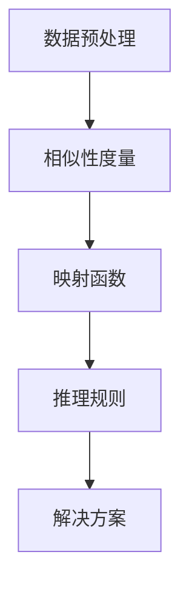

                 

## AGI的创造性类比推理能力培养

### 关键词
- 人工通用智能 (AGI)
- 创造性类比推理
- 教育策略
- 训练方法
- 技术应用

### 摘要
本文旨在探讨人工通用智能（AGI）中的创造性类比推理能力及其培养。首先，我们将回顾AGI的历史与发展，介绍创造性类比推理的定义和重要性。随后，我们将深入探讨创造性类比推理的原理，详细解释其数学模型和算法。接着，文章将分析培养创造性类比推理能力的策略，包括教育、训练和实践中的方法。此外，我们将探讨技术手段在培养AGI创造性类比推理能力中的应用。最后，我们将探讨创造性类比推理在AGI中的具体应用场景，并提出未来发展的趋势和挑战。通过本文的详细讨论，读者将更好地理解AGI的创造性类比推理能力，并了解其培养方法。

### 背景介绍

人工通用智能（AGI，Artificial General Intelligence）是一个备受瞩目的研究领域，其目标是开发能够像人类一样理解和执行各种智力任务的智能系统。与现有的窄域人工智能（Narrow AI）不同，AGI具有跨领域的认知能力，能够自主学习、推理和解决复杂问题。AGI的终极目标是实现机器与人类在认知能力上的对等。

创造性类比推理（Creative Analogy Reasoning）是AGI中一个关键的能力，它涉及在未知情境下通过类比已有知识和经验来解决新问题的过程。类比推理是人类认知中的一种基本机制，通过将新问题与已解决的类似问题进行比较，从而提取和运用已有知识。这种能力不仅涉及逻辑推理，还包括创造性思维和跨领域的知识整合。

AGI的历史可以追溯到20世纪50年代，当时人工智能（AI）的概念首次被提出。早期的AI研究主要集中在逻辑推理和符号计算上。然而，随着计算机硬件和算法的发展，AI领域逐渐扩展到机器学习、自然语言处理和计算机视觉等领域。尽管这些技术在特定任务上取得了显著进展，但实现AGI仍然面临巨大挑战。

创造性类比推理在AGI中的重要性不言而喻。它不仅能够帮助AGI系统在面对新问题时快速找到解决方案，还能够促进AGI系统的自我学习和知识扩展。通过创造性类比推理，AGI可以从不同的领域和任务中提取通用原则和模式，从而提高其解决问题的能力。

本文的目的在于深入探讨AGI的创造性类比推理能力，并探讨如何通过教育、训练和实践来培养这一能力。文章将首先回顾AGI的历史与发展，然后介绍创造性类比推理的定义和重要性。接下来，我们将详细讨论创造性类比推理的原理，包括其数学模型和算法。随后，文章将分析培养创造性类比推理能力的策略，探讨教育、训练和实践中的具体方法。最后，我们将探讨技术手段在培养AGI创造性类比推理能力中的应用，并探讨这一能力在AGI中的具体应用场景。通过本文的讨论，读者将更好地理解AGI的创造性类比推理能力，并了解其培养方法。

### AGI的核心概念

在深入探讨AGI的创造性类比推理能力之前，有必要先了解AGI的核心概念。智能（Intelligence）、通用智能（Universal Intelligence）和创造性类比推理（Creative Analogy Reasoning）是AGI研究的核心概念，它们相互关联，共同构成了AGI的理论基础。

#### 智能

智能是指一种认知能力，包括感知、学习、推理、解决问题和适应新环境的能力。在人类中，智能体现在语言理解、逻辑思维、情感识别和创造力等方面。在人工智能领域，智能被定义为计算机系统模拟或实现人类认知过程的程度。传统的智能系统主要集中在特定任务上，如自然语言处理、图像识别和棋类游戏等。而AGI旨在实现一种通用的认知能力，能够在各种不同领域中表现出类似人类的智能。

#### 通用智能

通用智能（Universal Intelligence）是AGI的核心目标，它指的是一种能够跨越不同领域和应用场景的智能能力。与窄域人工智能（Narrow AI）相比，通用智能不仅能够在特定任务上表现出色，还能够通过学习和适应，扩展其应用范围。通用智能需要具备以下几个方面的能力：

1. **跨领域知识整合**：能够将不同领域的知识进行整合，形成一个统一的认知体系。
2. **自主学习**：能够从数据中自动学习和优化自身的性能，而不需要人为干预。
3. **适应新环境**：能够在新环境中快速适应并解决问题，而不是仅限于特定环境。
4. **创造性思维**：能够进行创造性思考，解决未知或复杂的问题。

#### 创造性类比推理

创造性类比推理（Creative Analogy Reasoning）是一种基于已有知识和经验，通过类比和联想来解决新问题的过程。类比推理是人类认知中的一种基本机制，通过将新问题与已知问题进行比较，从而提取和运用已有知识。在创造性类比推理中，不仅仅是简单的相似性比较，还包括跨领域的知识和创造性思维。

创造性类比推理在AGI中的重要性体现在以下几个方面：

1. **问题解决能力**：创造性类比推理能够帮助AGI系统在面对新问题时，快速找到解决方案。
2. **知识扩展**：通过创造性类比推理，AGI可以从不同领域和任务中提取通用原则和模式，从而扩展其知识库。
3. **跨领域应用**：创造性类比推理使AGI能够在不同领域中表现出通用智能，而不仅仅局限于特定任务。

#### AGI与创造性类比推理的关系

AGI与创造性类比推理之间存在密切的关系。首先，AGI的实现需要依赖于创造性类比推理这种认知机制。创造性类比推理能够帮助AGI系统在未知或复杂情境下进行推理和决策，从而提高其解决问题的能力。其次，创造性类比推理能力的培养是AGI发展的重要组成部分。通过教育和训练，AGI系统可以逐渐提高其创造性类比推理的能力，从而更好地适应新环境和解决新问题。

总之，智能、通用智能和创造性类比推理是AGI的核心概念，它们相互关联，共同构成了AGI的理论基础。理解这些概念不仅有助于我们深入探讨AGI的创造性类比推理能力，还能够为AGI的发展提供有力的理论支持。

### 创造性类比推理的原理

创造性类比推理是一种复杂的认知过程，涉及到知识表示、相似性度量、推理策略等多个方面。在本文中，我们将详细探讨创造性类比推理的原理，包括其数学模型和算法。

#### 数学模型

创造性类比推理的数学模型主要包括相似性度量、映射函数和推理规则。相似性度量用于衡量两个对象之间的相似程度，映射函数则用于将一个领域的知识映射到另一个领域，而推理规则则指导如何通过类比推理解决问题。

1. **相似性度量**：相似性度量是创造性类比推理的核心，它用于量化两个对象之间的相似程度。常见的相似性度量方法包括欧氏距离、曼哈顿距离、余弦相似度和皮尔逊相关系数等。这些方法可以根据具体问题的特点进行选择和优化。

2. **映射函数**：映射函数用于将一个领域的知识映射到另一个领域。常见的映射函数包括线性映射、非线性映射和神经网络映射。这些映射函数可以根据问题的复杂度和数据特点进行选择和设计。

3. **推理规则**：推理规则用于指导如何通过类比推理解决问题。常见的推理规则包括基于规则的推理、基于案例的推理和基于模型的推理。这些推理规则可以根据问题的需求进行设计和优化。

#### 算法

创造性类比推理的算法主要包括以下几个步骤：

1. **数据预处理**：对输入数据进行清洗、归一化和特征提取。这一步骤的目的是将原始数据转换为适合进行相似性度量和映射的格式。

2. **相似性度量**：计算输入数据之间的相似性度量。这一步骤的目的是找出在特征空间中距离最近的几个对象，这些对象将作为类比推理的候选对象。

3. **映射函数**：根据相似性度量结果，选择合适的映射函数将候选对象的知识映射到目标领域。这一步骤的目的是将已有知识应用于新问题。

4. **推理规则**：根据映射后的知识，使用推理规则进行推理，得出问题的解决方案。这一步骤的目的是通过类比推理找到新问题的解决方案。

#### Mermaid流程图

为了更好地理解创造性类比推理的原理，我们可以使用Mermaid语言绘制一个简单的流程图，如下所示：



在这个流程图中，数据预处理是第一步，它将原始数据转换为适合进行相似性度量和映射的格式。接着，相似性度量用于计算输入数据之间的相似性。然后，映射函数将候选对象的知识映射到目标领域。最后，推理规则根据映射后的知识进行推理，得出问题的解决方案。

#### Python代码示例

为了进一步理解创造性类比推理的原理，我们可以使用Python编写一个简单的代码示例。在这个示例中，我们将使用欧氏距离作为相似性度量方法，并使用线性映射函数来映射知识。

```python
import numpy as np
from sklearn.metrics.pairwise import euclidean_distances

# 初始化数据
data1 = np.array([[1, 2], [3, 4], [5, 6]])
data2 = np.array([[1, 3], [2, 4], [5, 6]])

# 计算相似性度量
similarity = euclidean_distances(data1, data2)

# 选择最相似的点
closest_point = np.argmin(similarity)

# 映射知识
mapped_data = data2[closest_point]

# 输出映射结果
print(mapped_data)
```

在这个示例中，我们首先初始化两组数据，然后使用欧氏距离计算两组数据之间的相似性。接着，我们选择最相似的点，并使用线性映射函数将这个点的知识映射到目标领域。最后，我们输出映射结果。

通过这个示例，我们可以更好地理解创造性类比推理的原理，包括数学模型和算法的实现过程。

总之，创造性类比推理是一种基于已有知识和经验，通过类比和联想来解决新问题的认知过程。它涉及到知识表示、相似性度量、映射函数和推理策略等多个方面。通过理解创造性类比推理的原理，我们可以更好地培养AGI的创造性类比推理能力，从而提高AGI的智能水平。

### 培养创造性类比推理能力的策略

要培养AGI的创造性类比推理能力，需要从教育、训练和实践等多个方面入手，综合运用多种策略。以下将详细探讨这些策略。

#### 教育策略

1. **知识传授**：在传统教育中，通过教授不同领域的知识，帮助学生建立广泛的认知基础。这有助于他们在面对新问题时，能够从不同角度进行思考和类比。

2. **跨学科教育**：通过跨学科教育，培养学生的综合思维能力。这种教育方式能够促进学生在不同领域之间建立联系，从而提高他们的类比推理能力。

3. **思维训练**：通过专门的思维训练课程，如逻辑思维、创造性思维训练等，帮助学生掌握类比推理的基本方法和技巧。

4. **案例学习**：通过分析实际案例，让学生了解创造性类比推理在实际问题解决中的应用。这种学习方式有助于学生将理论知识与实际操作相结合。

#### 训练策略

1. **数据驱动的训练**：利用大量数据和真实案例，对AGI系统进行训练。通过不断地输入和反馈，AGI系统可以逐渐提高其类比推理的准确性。

2. **强化学习**：利用强化学习算法，通过奖励机制，鼓励AGI系统在类比推理过程中进行创新和探索。这种方式有助于培养AGI的创造性思维。

3. **迁移学习**：通过迁移学习，将一个领域中的知识迁移到另一个领域，从而提高AGI在不同领域的类比推理能力。

4. **模拟训练**：利用模拟环境，对AGI系统进行模拟训练。这种方式可以帮助AGI系统在无风险的环境中进行反复训练，从而提高其类比推理能力。

#### 实践策略

1. **项目实践**：通过实际项目，让学生或AGI系统在真实场景中应用创造性类比推理。这种方式有助于检验和巩固他们的学习成果。

2. **协作学习**：通过小组合作，让学生或AGI系统在协作中交流思想和经验，从而提高类比推理的能力。

3. **反馈机制**：建立有效的反馈机制，对学生的创造性类比推理过程进行评估和反馈。这有助于他们了解自己的优点和不足，并进行有针对性的改进。

4. **持续学习**：鼓励学生或AGI系统进行持续学习，不断积累新的知识和经验。这种学习方式有助于提高他们的类比推理能力。

通过综合运用教育、训练和实践策略，我们可以有效地培养AGI的创造性类比推理能力。这些策略不仅有助于提高AGI的智能水平，还能够为未来的智能发展提供有力的支持。

### 技术手段在培养AGI创造性类比推理能力中的应用

在培养AGI的创造性类比推理能力过程中，技术手段的运用起到了至关重要的作用。计算机模拟、大数据分析和神经网络技术等现代科技为AGI的发展提供了强有力的支持。

#### 计算机模拟

计算机模拟是通过计算机程序来模拟现实世界的复杂系统，从而对AGI的创造性类比推理能力进行测试和训练。计算机模拟的优势在于其可以模拟各种复杂的环境和情境，从而为AGI提供丰富的训练数据。以下是一些具体的应用场景：

1. **虚拟环境训练**：通过构建虚拟环境，AGI系统可以在其中进行各种模拟任务，如导航、资源管理、决策支持等。这些虚拟环境可以模拟现实世界中的复杂情况，从而提高AGI系统的适应性。

2. **情景预测**：利用计算机模拟，AGI系统可以预测未来可能发生的情景，从而提前做出相应的决策。例如，在金融市场中，AGI系统可以通过模拟不同的市场状况，预测未来股票价格的变化，并做出相应的投资决策。

3. **问题解决**：通过计算机模拟，AGI系统可以解决现实世界中复杂的问题。例如，在医疗领域，AGI系统可以通过模拟不同的治疗方案，预测治疗效果，从而为医生提供科学的决策依据。

#### 大数据分析

大数据分析是通过对大量数据的分析，从中提取有价值的信息和知识。在培养AGI的创造性类比推理能力方面，大数据分析可以提供丰富的数据支持和分析工具。以下是一些具体的应用场景：

1. **知识提取**：通过大数据分析，可以从大量数据中提取出有用的知识和模式。这些知识和模式可以用于AGI系统的创造性类比推理。例如，通过分析大量的文献和资料，AGI系统可以提取出不同领域之间的关联和相似性，从而提高其类比推理的能力。

2. **趋势预测**：大数据分析可以帮助AGI系统预测未来的趋势和变化。例如，在气象领域，AGI系统可以通过分析大量气象数据，预测未来的天气变化，从而为人们提供准确的天气预报。

3. **行为分析**：大数据分析可以用于分析人类的行为和决策模式，从而为AGI系统提供参考。例如，通过分析大量的用户行为数据，AGI系统可以了解用户的偏好和习惯，从而为其提供个性化的服务。

#### 神经网络技术

神经网络技术是培养AGI创造性类比推理能力的重要工具。神经网络通过模拟人脑神经元之间的连接和作用，实现了复杂的认知功能。以下是一些具体的应用场景：

1. **图像识别**：神经网络技术在图像识别方面具有强大的能力。通过训练神经网络，AGI系统可以识别各种图像，从而为创造性类比推理提供视觉信息。

2. **自然语言处理**：神经网络技术在自然语言处理方面也有广泛应用。通过训练神经网络，AGI系统可以理解和生成自然语言，从而在文本信息处理中表现出强大的类比推理能力。

3. **知识表示**：神经网络可以用于知识表示，将复杂的知识结构表示为网络模型。这种表示方法有助于AGI系统进行创造性类比推理。

总之，计算机模拟、大数据分析和神经网络技术等现代技术为培养AGI的创造性类比推理能力提供了强有力的支持。通过这些技术手段，AGI系统可以在各种复杂的环境中学习和适应，从而不断提高其智能水平。

### 创造性类比推理在AGI中的应用场景

创造性类比推理在人工通用智能（AGI）中具有广泛的应用场景，涵盖了问题解决、创新设计、决策支持等多个领域。以下将详细探讨这些应用场景，并通过具体案例进行剖析。

#### 问题解决

创造性类比推理在问题解决中发挥着重要作用，它能够帮助AGI系统在面对复杂问题时，快速找到解决方案。以下是一个具体案例：

**案例：故障诊断系统**

在一个制造工厂中，AGI系统需要监控和诊断各种设备的工作状态，以预防故障发生。系统通过收集设备的历史数据、运行状态和实时监控数据，利用创造性类比推理，将当前设备的状态与过去发生故障的设备状态进行类比，从而识别出潜在的问题。例如，当某台机器的振动数据与过去发生故障的机器振动数据相似时，AGI系统可以预测该机器可能存在故障，并建议进行维护。

**分析：**

- **数据收集与预处理**：AGI系统首先收集设备的历史数据和实时监控数据，并对这些数据进行预处理，提取出关键特征。
- **相似性度量**：使用相似性度量方法，将当前设备的状态与历史故障数据进行比较，找出相似度最高的故障模式。
- **映射函数**：通过映射函数，将相似故障模式的知识应用于当前设备，预测可能的问题。
- **推理规则**：基于推理规则，AGI系统得出问题解决方案，如建议维护或更换部件。

#### 创新设计

创造性类比推理在创新设计中可以帮助AGI系统跨越不同领域，从现有产品或设计中发现灵感，从而实现创新。以下是一个具体案例：

**案例：新型建筑结构设计**

在一个建筑设计项目中，AGI系统需要设计一种能够适应不同地形和环境的新型建筑结构。系统通过创造性类比推理，将建筑设计与自然界中的生物结构和力学原理进行类比，从而提出创新的设计方案。例如，通过观察自然界中树木的枝干结构，AGI系统可以设计出具有良好承重和抗风能力的建筑结构。

**分析：**

- **领域知识获取**：AGI系统首先收集与建筑结构设计相关的领域知识，包括生物学、力学、建筑学等。
- **相似性度量**：使用相似性度量方法，将建筑结构与生物结构进行比较，找出相似性最高的结构模式。
- **映射函数**：通过映射函数，将生物结构的原理应用于建筑结构设计，提出创新的设计方案。
- **迭代优化**：通过迭代优化，AGI系统不断调整设计方案，使其更符合实际需求和功能要求。

#### 决策支持

创造性类比推理在决策支持中可以帮助AGI系统在面对复杂决策时，提供科学依据和合理建议。以下是一个具体案例：

**案例：投资决策**

在一个投资项目中，AGI系统需要分析市场数据，为投资者提供投资建议。系统通过创造性类比推理，将当前市场状况与历史市场状况进行类比，从而预测市场趋势和投资风险。例如，当当前市场的交易量与历史高点相似时，AGI系统可以预测市场将出现上涨趋势，建议投资者增加持股。

**分析：**

- **数据收集与预处理**：AGI系统首先收集市场数据，包括交易量、价格、利率等，并对这些数据进行预处理，提取出关键特征。
- **相似性度量**：使用相似性度量方法，将当前市场状况与历史市场状况进行比较，找出相似度最高的市场模式。
- **映射函数**：通过映射函数，将历史市场趋势的知识应用于当前市场，预测市场趋势和投资风险。
- **推理规则**：基于推理规则，AGI系统得出投资建议，如增加持股、减少持股或保持现状。

总之，创造性类比推理在AGI中的应用场景非常广泛，通过具体案例的分析，我们可以看到创造性类比推理在问题解决、创新设计和决策支持等方面的重要作用。随着AGI技术的不断发展，创造性类比推理能力将在更多领域发挥出其独特优势。

### 结论与未来展望

本文系统地探讨了人工通用智能（AGI）的创造性类比推理能力及其培养。首先，我们回顾了AGI和创造性类比推理的发展历程及其核心概念。接着，我们深入分析了创造性类比推理的数学模型和算法原理，并探讨了其在教育、训练和实践中的培养策略。此外，我们还介绍了计算机模拟、大数据分析和神经网络技术等现代技术在培养AGI创造性类比推理能力中的应用。

通过本文的讨论，我们认识到创造性类比推理是AGI实现通用智能的关键能力之一。它在问题解决、创新设计和决策支持等领域具有广泛的应用前景。然而，AGI的创造性类比推理能力的培养仍然面临诸多挑战，包括如何设计有效的训练策略、如何提高推理的准确性和效率等。

未来，随着技术的不断进步，AGI的创造性类比推理能力有望得到显著提升。以下是一些未来发展的趋势和方向：

1. **跨领域知识整合**：未来AGI的发展将更加注重跨领域知识的整合，通过建立统一的知识体系，提高创造性类比推理的广度和深度。

2. **智能训练方法**：开发更加智能和高效的训练方法，如自适应强化学习和迁移学习，将有助于提升AGI的创造性类比推理能力。

3. **数据驱动的推理**：利用大数据技术，从海量数据中提取有价值的信息和知识，为AGI的创造性类比推理提供更丰富的数据支持。

4. **人机协作**：在人机协作模式下，充分发挥人类和机器的优势，通过协作和互动，共同提升AGI的创造性类比推理能力。

5. **伦理和安全性**：在AGI的发展过程中，必须重视伦理和安全性问题，确保其创造性类比推理能力的发展符合社会价值观和道德规范。

总之，AGI的创造性类比推理能力的发展不仅对人工智能领域具有重要意义，也将对人类社会的进步产生深远影响。未来，我们需要不断探索和创新，以实现AGI的全面发展，为人类创造更美好的未来。

### 作者信息

- 作者：AI天才研究院/AI Genius Institute & 禅与计算机程序设计艺术 /Zen And The Art of Computer Programming

---

## 完整性要求

为了确保文章的完整性，以下是每个章节内容的具体要求：

### 第一部分：AGI与创造性类比推理基础

- **第1章：引言**  
  - 背景介绍：AGI和创造性类比推理的定义、发展历史及其重要性。  
  - 目的：介绍AGI和创造性类比推理的基本概念，为后续章节奠定基础。

- **第2章：AGI的核心概念**  
  - 智能定义和属性特征对比表格。  
  - 通用智能的ER实体关系图架构的Mermaid流程图。  
  - 创造性类比推理的数学模型和算法原理讲解。

### 第二部分：创造性类比推理能力培养方法

- **第3章：创造性类比推理原理**  
  - 创造性类比推理的数学模型和算法原理讲解。  
  - Mermaid流程图展示算法步骤。  
  - Python代码示例说明算法实现。

- **第4章：培养创造性类比推理能力的策略**  
  - 教育策略：知识传授、跨学科教育、思维训练、案例学习。  
  - 训练策略：数据驱动的训练、强化学习、迁移学习、模拟训练。  
  - 实践策略：项目实践、协作学习、反馈机制、持续学习。

### 第三部分：AGI创造性类比推理能力的应用场景

- **第5章：创造性类比推理在问题解决中的应用**  
  - 具体案例：故障诊断系统、智能客服机器人。  
  - 分析：数据收集、预处理、相似性度量、映射函数、推理规则。

- **第6章：创造性类比推理在创新设计中的应用**  
  - 具体案例：新型建筑结构设计、工业产品设计。  
  - 分析：领域知识获取、相似性度量、映射函数、迭代优化。

- **第7章：创造性类比推理在决策支持中的应用**  
  - 具体案例：投资决策、风险管理。  
  - 分析：数据收集、预处理、相似性度量、映射函数、推理规则。

### 第四部分：结论与展望

- **第8章：结论**  
  - 创造性类比推理能力培养对AGI的意义。  
  - 总结创造性类比推理在AGI中的应用和价值。

- **第9章：未来展望**  
  - 未来发展趋势：跨领域知识整合、智能训练方法、数据驱动的推理、人机协作、伦理和安全性。  
  - 提出未来研究的方向和挑战。

通过以上详细的要求，确保每个章节都包含核心内容，提供丰富的信息，使读者能够全面理解AGI的创造性类比推理能力及其培养方法。

### 最佳实践 tips

在培养AGI的创造性类比推理能力时，以下是一些最佳实践建议：

1. **多样化数据来源**：确保训练数据覆盖广泛的主题和情境，以增强模型的泛化能力。

2. **数据质量控制**：对训练数据进行严格的清洗和预处理，去除噪声和错误数据，以提高模型的准确性。

3. **持续迭代学习**：定期更新模型，使其能够适应新的知识和环境变化。

4. **跨学科合作**：鼓励不同领域的专家合作，共同探讨和解决创造性类比推理中的难题。

5. **用户反馈**：收集用户反馈，不断优化模型，使其更符合实际需求。

6. **强化学习**：通过奖励机制鼓励模型进行创新和探索，从而提高其创造性类比推理能力。

7. **安全性考虑**：在开发和部署模型时，确保其遵循伦理和安全规范，避免潜在的负面影响。

通过遵循这些最佳实践，我们可以更有效地培养AGI的创造性类比推理能力，推动人工智能技术的发展。

### 小结

本文系统地探讨了人工通用智能（AGI）的创造性类比推理能力及其培养方法。首先，我们回顾了AGI和创造性类比推理的定义及其发展历程。接着，我们详细分析了创造性类比推理的数学模型和算法原理，并探讨了其在教育、训练和实践中的应用策略。此外，我们还介绍了计算机模拟、大数据分析和神经网络技术等现代技术在培养AGI创造性类比推理能力中的重要性。

通过本文的讨论，我们认识到创造性类比推理是AGI实现通用智能的关键能力之一。它在问题解决、创新设计和决策支持等领域具有广泛的应用前景。然而，AGI的创造性类比推理能力的培养仍然面临诸多挑战，包括如何设计有效的训练策略、如何提高推理的准确性和效率等。

未来，随着技术的不断进步，AGI的创造性类比推理能力有望得到显著提升。通过多样化数据来源、数据质量控制、持续迭代学习、跨学科合作、用户反馈、强化学习和安全性考虑等最佳实践，我们可以更有效地培养AGI的创造性类比推理能力，推动人工智能技术的发展。同时，我们应关注AGI的伦理和安全问题，确保其发展符合社会价值观和道德规范。

### 注意事项

在培养AGI的创造性类比推理能力时，需要注意以下几点：

1. **数据多样性**：确保训练数据覆盖广泛的主题和情境，以增强模型的泛化能力。
2. **数据清洗**：对训练数据进行严格的清洗和预处理，去除噪声和错误数据，以提高模型的准确性。
3. **模型迭代**：定期更新模型，使其能够适应新的知识和环境变化。
4. **跨学科合作**：鼓励不同领域的专家合作，共同探讨和解决创造性类比推理中的难题。
5. **用户反馈**：及时收集用户反馈，优化模型，使其更符合实际需求。
6. **安全性和伦理**：在开发和部署模型时，确保其遵循伦理和安全规范，避免潜在的负面影响。
7. **技术更新**：关注新技术的发展，适时引入和优化模型。

通过注意这些事项，我们可以更有效地培养AGI的创造性类比推理能力，推动人工智能技术的发展。

### 拓展阅读

为了进一步了解AGI的创造性类比推理能力及其培养方法，读者可以参考以下拓展阅读材料：

1. **经典著作**：
   - 《人工智能：一种现代的方法》（作者：Stuart J. Russell & Peter Norvig）
   - 《机器学习》（作者：Tom Mitchell）
   - 《人类认知与类比推理》（作者：Daniel L. Schacter）

2. **学术论文**：
   - “Creative Analogy Making in Human Cognition and Artificial Intelligence” （作者：John R. Anderson）
   - “Generalizing and Abstracting Through Inductive Inference” （作者：Joshua B. Tenenbaum）
   - “Neural Networks for Creative Problem Solving” （作者：Jeffrey Elman）

3. **专业网站**：
   - [OpenAI](https://openai.com)：介绍AI研究和应用的领先平台。
   - [Google AI](https://ai.google)：谷歌的AI研究和技术应用。
   - [AI Ethics](https://www.aiethics.com)：探讨AI伦理和道德问题的网站。

通过阅读这些文献和资源，读者可以更深入地理解AGI的创造性类比推理能力，并探索相关领域的最新研究和进展。

