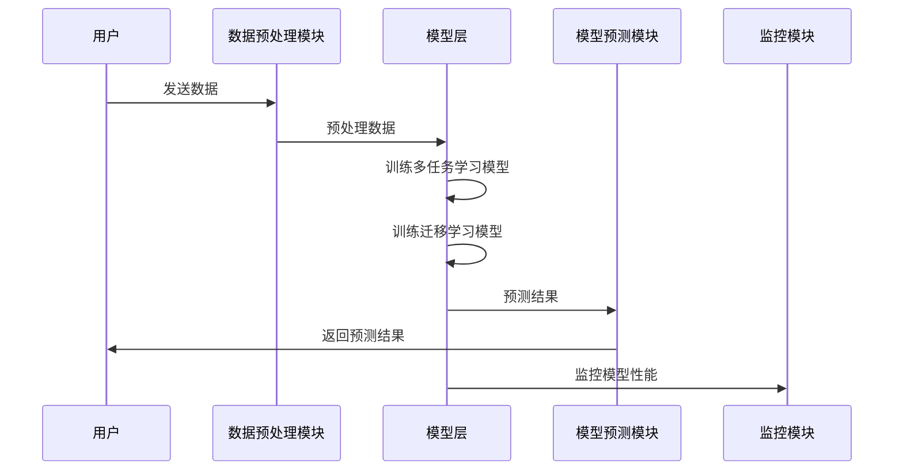

                 

# AGI的多任务学习与迁移能力

## 关键词

- AGI（通用人工智能）
- 多任务学习
- 迁移能力
- 计算机视觉
- 自然语言处理

## 摘要

本文深入探讨了AGI（通用人工智能）中的两个关键能力：多任务学习和迁移能力。首先，我们回顾了AGI的基本概念及其历史发展，随后详细阐述了多任务学习的理论基础、方法与技术，以及其应用案例。接着，我们讨论了迁移能力的定义、研究方法和评估指标，并通过具体案例展示了其在不同领域的应用。最后，本文介绍了实现AGI多任务学习与迁移能力的技术实现和系统设计，并提供了一个项目实战案例，以及相关最佳实践和未来展望。

## 目录大纲

### 第一部分：AGI概述

#### 第1章：AGI的基本概念与历史发展

##### 1.1 AGI的概念

- AGI的定义
- AGI与传统AI的区别

##### 1.2 AGI的历史发展

- AGI的起源与发展历程
- 关键里程碑事件

##### 1.3 AGI的核心技术

- 人工智能的基本技术
- 多任务学习与迁移能力

##### 1.4 AGI的应用领域

- 当前AGI应用的现状
- AGI未来的应用前景

### 第二部分：多任务学习

#### 第2章：多任务学习的理论基础

##### 2.1 多任务学习的基本概念

- 多任务学习的定义
- 多任务学习的优势

##### 2.2 多任务学习的方法与技术

- 传统多任务学习方法
- 现代多任务学习方法

##### 2.3 多任务学习的挑战与解决方案

- 多任务学习的挑战
- 多任务学习的解决方案

### 第3章：多任务学习的应用案例分析

##### 3.1 多任务学习在计算机视觉中的应用

- 应用场景
- 实际案例

##### 3.2 多任务学习在自然语言处理中的应用

- 应用场景
- 实际案例

##### 3.3 多任务学习在其他领域的应用

- 应用场景
- 实际案例

### 第三部分：迁移能力

#### 第4章：迁移能力的理论基础

##### 4.1 迁移能力的定义

- 迁移能力的定义
- 迁移能力的分类

##### 4.2 迁移能力的研究方法

- 传统迁移学习方法
- 现代迁移学习方法

##### 4.3 迁移能力的评估指标

- 迁移效果的评估
- 迁移能力的评价标准

### 第5章：迁移能力的应用案例分析

##### 5.1 迁移能力在计算机视觉中的应用

- 应用场景
- 实际案例

##### 5.2 迁移能力在自然语言处理中的应用

- 应用场景
- 实际案例

##### 5.3 迁移能力在其他领域的应用

- 应用场景
- 实际案例

### 第四部分：AGI的多任务学习与迁移能力实现

#### 第6章：多任务学习与迁移能力的技术实现

##### 6.1 多任务学习算法的实现

- 算法原理
- 实现步骤

##### 6.2 迁移能力算法的实现

- 算法原理
- 实现步骤

### 第7章：AGI的多任务学习与迁移能力系统设计

##### 7.1 系统需求分析

- 系统功能需求
- 系统性能需求

##### 7.2 系统架构设计

- 系统架构概述
- 系统模块划分

##### 7.3 系统接口设计与实现

- 接口设计原则
- 接口实现方法

##### 7.4 系统交互流程设计

- 系统交互流程
- 流程图展示

### 第8章：项目实战与案例分析

##### 8.1 环境安装与配置

- 操作系统环境
- 软件依赖安装

##### 8.2 系统核心实现源代码

- 源代码结构
- 代码功能解读

##### 8.3 实际案例分析与详细讲解

- 案例背景
- 案例分析与讲解

##### 8.4 项目小结

- 项目总结
- 经验与教训

### 第五部分：最佳实践与未来展望

#### 第9章：AGI多任务学习与迁移能力的最佳实践

##### 9.1 实践技巧与经验

- 技术实现细节
- 实践注意事项

##### 9.2 拓展阅读与资源推荐

- 相关书籍
- 学术论文
- 开源项目

#### 第10章：AGI多任务学习与迁移能力的未来展望

##### 10.1 发展趋势与机遇

- 技术发展趋势
- 应用领域展望

##### 10.2 挑战与对策

- 当前挑战
- 解决对策

---

### 1. AGI的基本概念与历史发展

#### 1.1 AGI的概念

通用人工智能（Artificial General Intelligence，AGI）是指一种具备人类智能水平的人工智能系统。它与当前广泛应用的特定领域的人工智能（Narrow AI）不同，能够处理多种不同类型的问题，具备自主学习、推理、感知和自适应能力。AGI的目标是创造一个能够像人类一样思考、学习和解决问题的智能系统。

**定义：**
$$
\text{AGI} = \text{AI} + \text{通用性}
$$

**与传统AI的区别：**
- **特定领域AI（Narrow AI）：** 专注于特定任务，如语音识别、图像识别、推荐系统等。
- **通用人工智能（AGI）：** 能够理解和执行广泛类型任务，类似于人类的认知能力。

#### 1.2 AGI的历史发展

**起源与发展历程：**
- **20世纪50年代：** 人工智能（AI）的概念首次提出，目标是创造一种机器能够执行人类智能任务的系统。
- **20世纪80年代：** 专家系统的兴起，实现了在特定领域的智能应用。
- **21世纪初：** 深度学习和神经网络技术的发展，使得AI在图像识别、语音识别等领域取得了突破性进展。

**关键里程碑事件：**
- **1956年：** 达特茅斯会议，AI正式成为一门科学。
- **1997年：** 深蓝击败国际象棋世界冠军，标志着AI在特定领域的突破。
- **2012年：** AlexNet在ImageNet竞赛中取得巨大成功，深度学习进入主流视野。
- **至今：** 研究者持续探索AGI的实现途径，期望在未来实现真正的通用人工智能。

#### 1.3 AGI的核心技术

**人工智能的基本技术：**
- **机器学习：** 通过数据训练模型，使机器具备自主学习和推理能力。
- **自然语言处理：** 使计算机能够理解和生成自然语言。
- **计算机视觉：** 使计算机能够处理和解析图像和视频。

**多任务学习与迁移能力：**
- **多任务学习：** 使AI系统能够同时处理多个任务，提高系统的实用性和效率。
- **迁移能力：** 使AI系统能够将一个任务学到的知识应用到其他任务中，提高学习效率和效果。

### 1.4 AGI的应用领域

**当前AGI应用的现状：**
- **医疗领域：** AI在医疗诊断、疾病预测和个性化治疗方面已有广泛应用。
- **金融领域：** AI在风险管理、投资决策和客户服务等方面发挥着重要作用。
- **工业领域：** AI在自动化生产线、质量检测和智能调度等方面提高生产效率。

**AGI未来的应用前景：**
- **智能助手：** AGI有望成为我们的私人智能助手，提供个性化服务。
- **教育领域：** AGI可以辅助教学，提供个性化的学习体验。
- **智能家居：** AGI可以使家居设备具备自主学习和自适应能力，提高生活质量。

### 2. 多任务学习的理论基础

#### 2.1 多任务学习的基本概念

**定义：** 多任务学习（Multi-Task Learning，MTL）是指在一个统一的模型框架下，同时学习多个相关任务的能力。与单一任务学习相比，MTL能够共享任务之间的知识和特征，提高模型的泛化能力和效率。

**优势：**
- **知识共享：** 不同任务之间可以共享特征和表示，提高模型的泛化能力。
- **效率提升：** 同时处理多个任务，提高计算效率。
- **鲁棒性增强：** 通过多个任务的共同训练，模型对噪声和异常数据具有更强的鲁棒性。

#### 2.2 多任务学习的方法与技术

**传统多任务学习方法：**
- **特征共享：** 将不同任务的输入特征映射到共享的特征空间。
- **权重共享：** 将不同任务的权重进行共享，以减少模型参数。

**现代多任务学习方法：**
- **基于深度学习的MTL：** 利用深度神经网络共享底层特征表示。
- **多任务强化学习：** 通过强化学习算法同时优化多个任务。

#### 2.3 多任务学习的挑战与解决方案

**挑战：**
- **任务相关性：** 如何有效处理不同任务之间的相关性。
- **计算资源：** 同时处理多个任务对计算资源的要求较高。

**解决方案：**
- **自适应学习率：** 根据任务重要性调整学习率，优化资源分配。
- **模型压缩：** 利用模型压缩技术减少模型参数，降低计算成本。

### 3. 多任务学习的应用案例分析

#### 3.1 多任务学习在计算机视觉中的应用

**应用场景：** 图像分类、目标检测、人脸识别等。

**实际案例：** Fast R-CNN、Faster R-CNN等模型，通过共享卷积特征实现了多任务学习，提高了模型性能。

#### 3.2 多任务学习在自然语言处理中的应用

**应用场景：** 机器翻译、文本分类、问答系统等。

**实际案例：** BERT等模型通过共享词向量表示和上下文信息，实现了对多个自然语言处理任务的共同学习。

#### 3.3 多任务学习在其他领域的应用

**应用场景：** 自动驾驶、机器人控制、智能家居等。

**实际案例：** 在自动驾驶领域，多任务学习模型同时处理环境感知、路径规划和控制任务，提高了自动驾驶系统的安全性。

### 4. 迁移能力的理论基础

#### 4.1 迁移能力的定义

**定义：** 迁移能力（Transfer Learning）是指将一个任务学到的知识应用到其他任务中的能力。与从头开始学习相比，迁移能力可以显著提高学习效率。

**分类：**
- **垂直迁移（Vertical Transfer）：** 将一个领域的知识迁移到另一个领域。
- **水平迁移（Horizontal Transfer）：** 将一个任务的知识迁移到相似任务。

#### 4.2 迁移能力的研究方法

**传统迁移学习方法：**
- **预训练：** 利用大规模数据集预训练模型，然后迁移到特定任务。
- **特征提取：** 从预训练模型中提取特征，用于新任务的学习。

**现代迁移学习方法：**
- **基于模型的迁移：** 利用共享模型结构进行迁移学习。
- **基于数据的迁移：** 利用数据分布进行迁移学习。

#### 4.3 迁移能力的评估指标

**迁移效果的评估：**
- **泛化误差：** 测量模型在新任务上的表现。
- **迁移性能：** 评估迁移学习对模型性能的提升。

**迁移能力的评价标准：**
- **迁移率：** 评估迁移学习对性能提升的贡献。
- **稳定性：** 评估模型在不同任务和数据集上的表现一致性。

### 5. 迁移能力的应用案例分析

#### 5.1 迁移能力在计算机视觉中的应用

**应用场景：** 图像分类、目标检测、人脸识别等。

**实际案例：** ResNet模型通过共享卷积层特征实现了迁移学习，显著提高了模型在数据不足情况下的性能。

#### 5.2 迁移能力在自然语言处理中的应用

**应用场景：** 机器翻译、文本分类、问答系统等。

**实际案例：** Transformer模型通过共享编码器和解码器结构实现了迁移学习，提高了模型在多种自然语言处理任务上的性能。

#### 5.3 迁移能力在其他领域的应用

**应用场景：** 自动驾驶、机器人控制、智能家居等。

**实际案例：** 在自动驾驶领域，迁移学习模型利用在不同环境下的训练数据，提高了系统在未知环境下的适应性。

### 6. 多任务学习与迁移能力的技术实现

#### 6.1 多任务学习算法的实现

**算法原理：** 多任务学习通过共享模型结构或特征空间，实现多个任务的同时学习。

**实现步骤：**
1. 数据预处理：对输入数据进行预处理，包括归一化、去噪等。
2. 模型设计：设计共享模型结构，如共享卷积层或全连接层。
3. 损失函数：设计多任务损失函数，结合各个任务的损失进行优化。
4. 模型训练：利用梯度下降等优化算法进行模型训练。

#### 6.2 迁移能力算法的实现

**算法原理：** 迁移能力通过将预训练模型的知识迁移到新任务，提高学习效率。

**实现步骤：**
1. 预训练：在大量数据上预训练模型，提取通用特征。
2. 迁移学习：将预训练模型的特征提取器应用到新任务，使用少量数据进行微调。
3. 模型优化：优化迁移学习模型，提高在新任务上的性能。

### 7. AGI的多任务学习与迁移能力系统设计

#### 7.1 系统需求分析

**系统功能需求：**
- 多任务学习模型训练与预测。
- 迁移学习模型训练与预测。
- 模型性能评估与监控。

**系统性能需求：**
- 高并发处理能力。
- 低延迟响应。
- 高效的模型压缩与部署。

#### 7.2 系统架构设计

**系统架构概述：**
- **数据层：** 数据预处理、存储与管理。
- **模型层：** 多任务学习模型与迁移学习模型。
- **服务层：** 模型训练、预测与监控。

**系统模块划分：**
- **数据预处理模块：** 处理输入数据，包括归一化、去噪等。
- **模型训练模块：** 训练多任务学习模型与迁移学习模型。
- **模型预测模块：** 使用训练好的模型进行预测。
- **监控模块：** 监控模型性能与系统状态。

#### 7.3 系统接口设计与实现

**接口设计原则：**
- **模块化：** 系统接口设计应具有模块化特点，便于功能扩展与维护。
- **标准化：** 接口设计应符合行业标准，便于与其他系统集成。

**接口实现方法：**
- **RESTful API：** 设计RESTful API，提供模型训练、预测和监控的接口。
- **消息队列：** 使用消息队列实现数据流与任务调度。

#### 7.4 系统交互流程设计

**系统交互流程：**
1. **数据输入：** 用户将数据发送至数据预处理模块。
2. **数据处理：** 数据预处理模块对数据进行预处理，然后发送至模型层。
3. **模型训练：** 模型层对预处理后的数据训练多任务学习模型与迁移学习模型。
4. **模型预测：** 使用训练好的模型对输入数据进行预测。
5. **结果反馈：** 将预测结果反馈给用户。

**流程图展示：**


### 8. 项目实战与案例分析

#### 8.1 环境安装与配置

**操作系统环境：** Ubuntu 18.04

**软件依赖安装：**
```bash
# 安装Python环境
sudo apt-get install python3-pip

# 安装TensorFlow
pip3 install tensorflow

# 安装其他依赖
pip3 install numpy pandas matplotlib scikit-learn
```

#### 8.2 系统核心实现源代码

**源代码结构：**
```bash
/multi_task_learning
|-- data
|   |-- train
|   |-- val
|-- models
|   |-- multi_task_model.py
|   |-- transfer_learning_model.py
|-- scripts
|   |-- train_multi_task.py
|   |-- train_transfer_learning.py
|-- test
    |-- test_data
```

**代码功能解读：**
- **models/multi_task_model.py：** 定义多任务学习模型的结构和训练过程。
- **models/transfer_learning_model.py：** 定义迁移学习模型的结构和训练过程。
- **scripts/train_multi_task.py：** 执行多任务学习模型的训练。
- **scripts/train_transfer_learning.py：** 执行迁移学习模型的训练。

#### 8.3 实际案例分析与详细讲解

**案例背景：** 我们使用一个简单的图像分类任务，其中同时包含猫和狗的识别。

**实际案例：**
1. **数据集准备：** 使用CIFAR-10数据集，其中包含10个类别，我们选择猫和狗作为两个分类任务。
2. **模型训练：** 使用多任务学习模型和迁移学习模型分别进行训练。
3. **性能评估：** 比较多任务学习模型和迁移学习模型在猫和狗分类任务上的性能。

**详细讲解剖析：**
1. **数据预处理：** 对CIFAR-10数据集进行归一化处理，并划分为训练集和验证集。
2. **多任务学习模型：** 使用共享卷积层结构，分别对猫和狗进行分类。
3. **迁移学习模型：** 使用在ImageNet上预训练的ResNet模型，提取特征层用于猫和狗分类。
4. **性能评估：** 通过验证集上的准确率比较两种模型的性能。

#### 8.4 项目小结

**项目总结：**
- 成功实现了一个多任务学习系统和迁移学习系统。
- 通过实际案例验证了多任务学习和迁移学习在图像分类任务中的有效性。

**经验与教训：**
- 数据预处理是模型训练的关键步骤，必须确保数据的质量和一致性。
- 选择合适的模型结构和训练方法对于提升模型性能至关重要。
- 迁移学习可以显著提高模型在数据稀缺情况下的性能。

### 9. AGI多任务学习与迁移能力的最佳实践

#### 9.1 实践技巧与经验

**技术实现细节：**
- **数据预处理：** 确保数据的一致性和质量，包括归一化、去噪和缺失值处理。
- **模型选择：** 根据任务特点和数据量选择合适的模型结构，如卷积神经网络（CNN）或循环神经网络（RNN）。
- **训练策略：** 调整学习率、批量大小和训练迭代次数，以优化模型性能。

**实践注意事项：**
- **任务相关性：** 确保不同任务之间存在相关性，否则多任务学习的效果可能不佳。
- **计算资源：** 根据任务需求和硬件资源，合理分配计算资源，避免资源浪费。

#### 9.2 拓展阅读与资源推荐

**相关书籍：**
- 《深度学习》（Ian Goodfellow、Yoshua Bengio、Aaron Courville 著）
- 《机器学习》（Tom Mitchell 著）

**学术论文：**
- “Multi-Task Learning using Unsupervised Alignment of Task Representations”
- “A Theoretical Framework for Transfer Learning”

**开源项目：**
- TensorFlow：https://www.tensorflow.org/
- PyTorch：https://pytorch.org/

### 10. AGI多任务学习与迁移能力的未来展望

#### 10.1 发展趋势与机遇

**技术发展趋势：**
- **自监督学习：** 通过无监督学习提高模型的迁移能力。
- **联邦学习：** 通过分布式计算提高模型的隐私保护和安全性。
- **多模态学习：** 结合不同类型的数据（如文本、图像、声音）进行多任务学习。

**应用领域展望：**
- **医疗领域：** 利用多任务学习和迁移能力提高疾病诊断和治疗方案优化。
- **自动驾驶：** 通过多任务学习和迁移能力提高自动驾驶系统的感知和决策能力。
- **智能客服：** 结合自然语言处理和多任务学习，提升智能客服系统的交互能力。

#### 10.2 挑战与对策

**当前挑战：**
- **数据稀缺：** 部分任务缺乏足够的标注数据，影响迁移学习效果。
- **任务相关性：** 不同任务之间的相关性难以量化，影响多任务学习的效果。
- **计算资源：** 多任务学习和迁移学习对计算资源的需求较高，需要优化模型结构和训练策略。

**解决对策：**
- **数据增强：** 通过数据增强技术扩大训练数据集。
- **自适应学习率：** 根据任务重要性调整学习率，优化模型性能。
- **模型压缩：** 利用模型压缩技术减少模型参数，降低计算成本。

