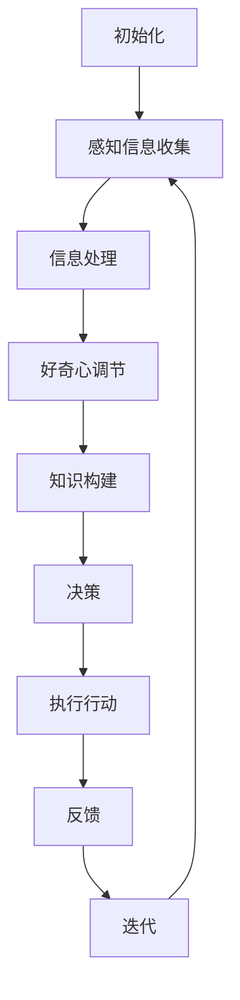
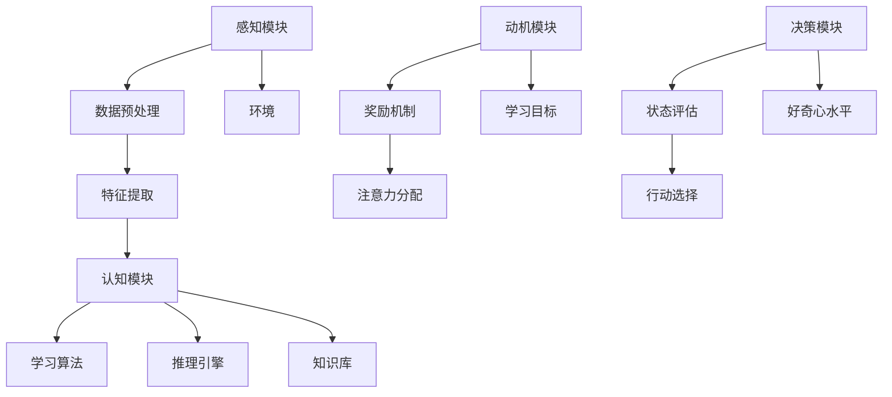
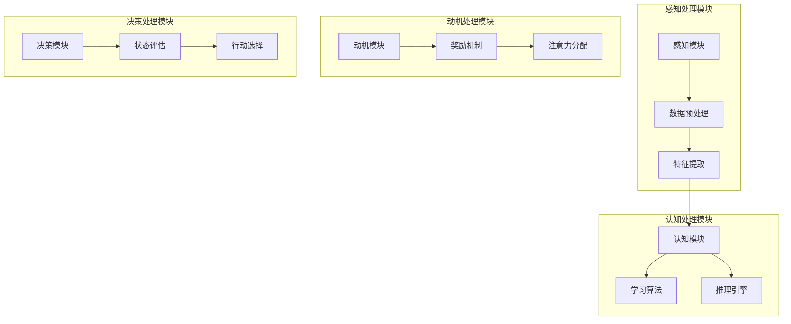
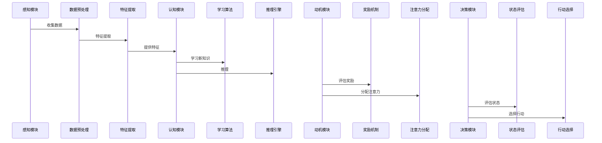
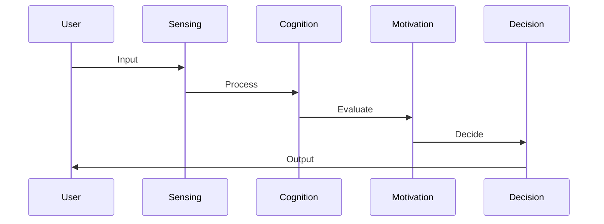

                 

### 引言

#### 人工智能的发展与AGI的崛起

人工智能（AI）作为现代科技领域的重要分支，已经从最初的学术研究逐步渗透到各行各业，成为推动社会进步的重要力量。从早期的规则系统、知识表示到如今深度学习、强化学习等先进技术的蓬勃发展，AI已经实现了许多令人瞩目的突破。然而，目前的AI技术仍然存在着诸多局限性，如任务专一性、数据依赖性强、自主学习能力有限等。为了克服这些瓶颈，研究者们提出了通用人工智能（AGI）的概念。

通用人工智能（AGI）是指具备人类智能水平的、能够在各种复杂环境下进行推理、学习、解决问题的人工智能系统。与当前广泛应用的弱人工智能（NLP、图像识别等特定任务）相比，AGI具有更广泛的应用前景和更高的智能水平。实现AGI不仅是人工智能领域的重要目标，也对人类社会的未来发展产生深远影响。

#### 何为好奇心驱动的学习机制

好奇心驱动的学习机制是AGI实现过程中的一项重要研究课题。好奇心是人类智能的核心特征之一，它促使人类不断探索未知、学习新知识。好奇心驱动的学习机制旨在模拟人类的好奇心，使人工智能系统能够自主地探索环境、发现知识，从而实现智能水平的提升。

好奇心驱动的学习机制主要包含以下几个核心要素：

1. **动机系统**：负责激发和维持人工智能系统的好奇心，使其主动探索环境。
2. **感知系统**：负责收集和处理环境中的信息，为学习提供素材。
3. **认知系统**：负责对感知系统获取的信息进行分析、推理，从而形成知识。
4. **决策系统**：负责根据当前状态和目标，选择下一步的学习行动。

这些要素相互协同，形成一个闭环系统，使得人工智能系统能够在复杂环境中自主地学习、进化。

#### 好奇心驱动的学习在AGI中的应用前景

好奇心驱动的学习机制在AGI中的应用前景广阔。通过模拟人类的好奇心，人工智能系统能够在缺乏明确目标的情况下自主地探索环境，发现新的知识。这不仅有助于提升系统的智能水平，还能拓展其应用领域。

首先，好奇心驱动的学习机制有助于解决当前AI系统的任务专一性问题。通过自主探索和学习，人工智能系统能够在不同的任务中获取经验，实现跨任务的迁移学习。这为AI在更多领域的应用提供了可能性。

其次，好奇心驱动的学习机制能够提高AI系统的适应能力。在复杂多变的现实环境中，人工智能系统需要具备快速适应新环境的能力。好奇心驱动的学习机制可以通过持续的学习和探索，使系统能够迅速适应新的任务和场景。

最后，好奇心驱动的学习机制有助于实现人工智能的可持续发展。通过自主学习和进化，人工智能系统能够不断提升自身的智能水平，从而实现长期的智能增长。这为人工智能在未来的持续发展提供了坚实的基础。

总之，好奇心驱动的学习机制是AGI实现过程中的一项重要研究课题，具有广阔的应用前景。随着研究的深入，我们有望看到越来越多具备自主学习和进化能力的人工智能系统，为人类社会的发展带来更多可能性。### 好奇心驱动的学习原理

#### 核心概念与原理

好奇心驱动的学习机制涉及多个核心概念，它们共同构成了这个复杂系统的基础。以下是这些核心概念的详细定义和关系说明。

**好奇心**：好奇心是指个体对未知事物的内在渴望和探索欲望。在人工智能系统中，好奇心被模拟为一种内在的动机，驱动系统去探索和了解环境中的未知信息。

**动机系统**：动机系统负责生成和调节好奇心，激发人工智能系统进行探索和学习。它包括一系列机制，如奖励系统、注意力分配等，以维持系统的好奇心水平。

**感知系统**：感知系统负责收集和处理来自环境中的信息。它包括视觉、听觉、触觉等多种感知方式，使人工智能系统能够获取关于环境的丰富信息。

**认知系统**：认知系统负责对感知系统获取的信息进行分析、推理，形成知识。它包括记忆、学习算法、推理引擎等组成部分，是人工智能系统理解世界和解决问题的核心。

**决策系统**：决策系统负责根据当前状态和目标，选择下一步的学习行动。它基于动机系统提供的好奇心和认知系统生成的知识，进行有效的决策，以实现学习目标。

这些核心概念之间存在紧密的联系和相互作用。好奇心作为动机系统的基础，驱动感知系统和认知系统进行信息收集和知识构建。感知系统为认知系统提供丰富的信息素材，认知系统通过分析和推理，形成新的知识，并将其反馈给动机系统和决策系统，以指导后续的学习行动。

#### 好奇心与学习的相互关系

好奇心和学习之间存在深刻的内在联系。好奇心是学习的动力，它激发个体去探索和了解新事物，从而促进学习的进行。而学习则是好奇心实现的过程，通过不断积累知识和技能，个体能够更好地满足好奇心，实现自我成长。

1. **好奇心驱动学习过程**：好奇心激发个体产生探索欲望，促使个体主动去感知和理解新事物。在这个过程中，动机系统通过奖励机制调节好奇心水平，使个体保持足够的探索动力。

2. **学习促进好奇心发展**：通过学习，个体能够获得新的知识和技能，这些知识和技能有助于个体更好地理解世界，满足好奇心。学习不仅提高了个体的认知能力，也增强了其探索未知领域的信心和兴趣。

3. **好奇心与学习相互促进**：好奇心和学习之间形成了一种良性循环。好奇心激发了学习的动力，学习则进一步满足好奇心，增强探索欲望。这种相互促进的关系使得个体在学习和成长过程中，能够不断拓展自己的认知边界。

#### 好奇心驱动的学习模型

好奇心驱动的学习模型是构建人工智能系统的基础。它通过模拟人类的好奇心和学习行为，使系统能够在复杂环境中自主地学习和进化。以下是一个基本的好奇心驱动的学习模型架构，以及该模型的工作原理。

**基本模型架构**：

1. **动机系统**：生成和调节好奇心，包括奖励机制、注意力分配等。
2. **感知系统**：收集和处理来自环境中的信息，包括视觉、听觉、触觉等感知方式。
3. **认知系统**：对感知系统获取的信息进行分析、推理，形成知识。
4. **决策系统**：根据当前状态和目标，选择下一步的学习行动。

**模型的工作原理**：

1. **感知与信息处理**：感知系统通过传感器收集环境信息，并将这些信息传递给认知系统。认知系统对这些信息进行预处理和分析，提取关键特征，为后续的学习过程提供素材。

2. **好奇心生成与调节**：动机系统根据感知系统提供的信息，生成好奇心。同时，通过奖励机制调节好奇心水平，使系统在探索过程中保持适当的兴奋度和动机。

3. **知识构建与推理**：认知系统利用预处理后的信息，通过学习算法和推理引擎，构建新的知识体系。这些知识不仅用于当前的决策过程，也作为未来的学习素材，为系统的持续进化提供支持。

4. **决策与行动**：决策系统根据当前状态和目标，结合认知系统生成的知识，选择下一步的学习行动。行动的结果会反馈给感知系统和动机系统，进一步调节好奇心和学习过程。

**模型的优缺点分析**：

- **优点**：
  - **自主性**：好奇心驱动的学习模型使系统能够在缺乏明确目标的情况下，自主地探索和学习。
  - **适应性**：系统通过不断学习和进化，能够适应复杂多变的现实环境。
  - **跨领域迁移**：通过自主探索和学习，系统能够在不同任务中获取经验，实现跨领域的知识迁移。

- **缺点**：
  - **效率问题**：好奇心驱动的学习过程往往缺乏明确的目标和规划，可能需要较长时间才能达到学习目标。
  - **数据依赖**：系统的学习效果很大程度上依赖于环境信息的丰富性和质量。

总之，好奇心驱动的学习模型通过模拟人类的好奇心和自主学习行为，为人工智能系统提供了一种强大的学习机制。虽然存在一定的局限性，但随着研究的深入，这一模型有望在人工智能领域发挥重要作用。### 好奇心驱动的学习算法

#### 算法概述

好奇心驱动的学习算法是一种基于人类好奇心行为的人工智能学习机制。该算法的核心目标是模拟人类的好奇心，使系统能够在复杂环境中自主地探索和学习。以下是一个基本的好奇心驱动的学习算法概述。

**算法输入**：
- 环境信息：包括视觉、听觉、触觉等感知信息。
- 好奇心水平：初始好奇心值。

**算法输出**：
- 新知识：通过学习过程生成的知识。
- 下一步行动：根据当前状态和目标选择的下一步学习行动。

**算法流程**：

1. **初始化**：设置初始好奇心水平。
2. **感知信息收集**：通过传感器收集环境中的信息。
3. **信息处理**：对收集的信息进行预处理和分析，提取关键特征。
4. **好奇心调节**：根据信息处理结果，调节好奇心水平。
5. **知识构建**：利用处理后的信息，通过学习算法构建新的知识。
6. **决策**：根据当前状态和目标，选择下一步的学习行动。
7. **反馈**：执行学习行动，收集结果，反馈给感知系统和动机系统。
8. **迭代**：回到步骤2，继续进行下一轮的学习过程。

**算法流程图**：



#### 算法实现与Python代码示例

以下是一个简化的Python代码示例，展示了好奇心驱动的学习算法的基本实现。

```python
import numpy as np

# 初始化参数
initial_curiosity = 1.0
learning_rate = 0.1
discount_factor = 0.9

# 初始化好奇心水平
curiosity = initial_curiosity

# 模拟环境信息
environment_info = np.random.rand(10)

# 信息处理函数
def process_info(info):
    return info.mean()

# 学习算法
def learning_algorithm(info, curiosity):
    processed_info = process_info(info)
    new_knowledge = ...  # 根据处理后的信息生成知识
    
    # 调节好奇心水平
    curiosity = curiosity + learning_rate * (processed_info - curiosity)
    
    # 根据好奇心选择学习行动
    action = ...  # 根据当前状态和目标选择行动
    
    return new_knowledge, action, curiosity

# 迭代学习过程
for i in range(100):
    processed_info = process_info(environment_info)
    new_knowledge, action, curiosity = learning_algorithm(processed_info, curiosity)
    
    print(f"Iteration {i}: Curiosity = {curiosity}, Action = {action}")

```

#### 好奇心驱动的学习算法原理

好奇心驱动的学习算法基于以下几个核心原理：

1. **奖励机制**：通过奖励机制调节好奇心水平，使系统在探索过程中保持适当的兴奋度和动机。奖励值通常与感知信息的质量相关，质量越高，奖励越大。

2. **注意力分配**：系统根据好奇心水平，动态调整对信息的关注程度。好奇心越高，系统越倾向于关注新信息和未知领域。

3. **知识构建**：通过学习算法，系统对感知信息进行分析、推理，构建新的知识。这些知识用于指导后续的学习行动，实现自我进化。

4. **反馈机制**：系统根据学习行动的结果，调整好奇心和学习过程。反馈机制有助于系统适应复杂环境，提高学习效果。

#### 数学模型与公式

好奇心驱动的学习算法通常涉及多个数学模型和公式，用于描述系统的行为和性能。以下是一个简化的数学模型。

1. **好奇心调节公式**：

   $$\text{curiosity}_{\text{new}} = \text{curiosity}_{\text{current}} + \text{learning\_rate} \times (\text{processed\_info} - \text{curiosity}_{\text{current}})$$

2. **学习行动选择公式**：

   $$\text{action}_{\text{selected}} = \text{argmax}_{\text{a}} (\text{reward}_{\text{a}} + \text{discount\_factor} \times \text{expected\_reward}_{\text{next\_state}})$$

   其中，$\text{reward}_{\text{a}}$为执行行动$a$的即时奖励，$\text{expected\_reward}_{\text{next\_state}}$为预期下一状态下的奖励。

#### 举例说明

假设一个简单的人工智能系统在探索一个未知环境。系统初始好奇心值为1.0，环境中的信息为随机数。每一步，系统根据当前好奇心水平和处理后的信息，调节好奇心，并选择下一步的行动。

- **第一步**：环境信息为[0.2, 0.5, 0.8]，处理后信息为0.5。系统初始好奇心值为1.0，调节后好奇心值为1.1。
- **第二步**：环境信息为[0.1, 0.4, 0.7]，处理后信息为0.4。系统当前好奇心值为1.1，调节后好奇心值为1.15。
- **第三步**：环境信息为[0.3, 0.6, 0.9]，处理后信息为0.6。系统当前好奇心值为1.15，调节后好奇心值为1.25。

根据调节后的好奇心值，系统选择下一步的行动。例如，如果系统在第三步选择了一个新的未知区域进行探索，那么它将在新的环境中继续执行好奇心驱动的学习过程。

通过这样的循环，系统不断调整好奇心和学习行动，逐渐积累知识，提高自身智能水平。这个过程体现了好奇心驱动的学习算法的基本原理和机制。### 数学模型与公式

在好奇心驱动的学习机制中，数学模型和公式起着至关重要的作用。这些模型不仅描述了系统的行为，还提供了定量分析工具，帮助我们更好地理解和学习过程。以下是对这些数学模型和公式的详细解释。

#### 数学模型概述

好奇心驱动的学习机制涉及以下几个核心数学模型：

1. **奖励模型**：用于描述系统在执行某一行动后的即时奖励。
2. **状态转移模型**：用于描述系统在执行不同行动后状态的变化。
3. **价值函数模型**：用于评估系统在不同状态下的价值。
4. **学习率模型**：用于调整系统的好奇心水平。

#### 奖励模型

奖励模型是好奇心驱动的学习机制的基础。它通常被定义为：

$$R(s, a) = r(s, a)$$

其中，$R(s, a)$表示在状态$s$下执行行动$a$所获得的即时奖励，$r(s, a)$是奖励函数，用于量化行动带来的积极或消极效果。奖励函数可以根据具体应用场景进行设计，例如：

- **正向奖励**：当系统获取到新的知识或成功完成某项任务时，给予正向奖励。
- **负向奖励**：当系统遇到错误或失败时，给予负向奖励。

#### 状态转移模型

状态转移模型描述了系统在执行行动后状态的变化。它通常被表示为：

$$P(s' | s, a) = p(s', s, a)$$

其中，$P(s' | s, a)$表示在状态$s$下执行行动$a$后转移到状态$s'$的概率，$p(s', s, a)$是状态转移概率函数。状态转移模型可以根据具体应用场景进行设计，例如：

- **马尔可夫决策过程（MDP）**：假设当前状态只取决于当前行动，而与过去行动无关。
- **部分可观测马尔可夫决策过程（POMDP）**：假设当前状态不仅取决于当前行动，还与过去行动和观测到的结果有关。

#### 价值函数模型

价值函数模型用于评估系统在不同状态下的价值。在好奇心驱动的学习机制中，常用的价值函数模型是期望回报模型：

$$V(s) = \sum_{a} \pi(a | s) \sum_{s'} P(s' | s, a) R(s', a)$$

其中，$V(s)$表示在状态$s$下的价值，$\pi(a | s)$是在状态$s$下执行行动$a$的概率，$P(s' | s, a)$是在状态$s$下执行行动$a$后转移到状态$s'$的概率，$R(s', a)$是在状态$s'$下执行行动$a$所获得的即时奖励。

#### 学习率模型

学习率模型用于调整系统的好奇心水平。它通常被定义为：

$$\alpha(s, a) = \frac{\partial V(s)}{\partial s}$$

其中，$\alpha(s, a)$是在状态$s$下执行行动$a$的学习率，用于量化行动对价值函数的影响。学习率可以根据具体应用场景进行设计，例如：

- **线性学习率**：随着经验的积累，学习率逐渐减小，以避免过度调整。
- **指数学习率**：学习率随经验积累呈指数增长，以加快学习速度。

#### 公式解释与应用

以下是几个具体的数学公式及其应用场景：

1. **Q-learning算法**：

   $$Q(s, a) = Q(s, a) + \alpha(s, a) \times [R(s, a) + \gamma \max_{a'} Q(s', a') - Q(s, a)]$$

   其中，$Q(s, a)$是在状态$s$下执行行动$a$的预期回报，$\gamma$是折扣因子，用于权衡当前奖励和未来奖励之间的关系。

   应用场景：Q-learning算法用于解决强化学习问题，通过迭代更新Q值，使系统逐渐找到最优行动策略。

2. **深度强化学习（DRL）**：

   $$\theta_{\text{new}} = \theta_{\text{current}} + \alpha \times \frac{\partial L}{\partial \theta}$$

   其中，$\theta$是神经网络的参数，$L$是损失函数，$\alpha$是学习率。

   应用场景：深度强化学习结合了深度学习和强化学习的优势，通过神经网络表示状态和行动，优化学习过程。

#### 举例说明

假设一个简单的人工智能系统在一个未知环境中进行探索。系统初始状态为$s_0$，执行行动$a_0$后转移到状态$s_1$，获得即时奖励$R_1$。系统根据这些信息更新好奇心和学习率，选择下一步行动。

- **第一步**：状态$s_0$，行动$a_0$，状态转移概率$P(s_1 | s_0, a_0) = 0.5$，即时奖励$R_1 = 1$。
- **第二步**：状态$s_1$，执行行动$a_1$，状态转移概率$P(s_2 | s_1, a_1) = 0.6$，即时奖励$R_2 = -1$。
- **第三步**：状态$s_2$，执行行动$a_2$，状态转移概率$P(s_3 | s_2, a_2) = 0.7$，即时奖励$R_3 = 0$。

根据这些信息，系统更新好奇心和学习率：

1. **好奇心调节**：

   $$\text{curiosity}_{\text{new}} = \text{curiosity}_{\text{current}} + \alpha \times (R_1 - \text{curiosity}_{\text{current}})$$

2. **学习率调整**：

   $$\alpha_{\text{new}} = \alpha_{\text{current}} + \beta \times (V(s_2) - V(s_1))$$

其中，$\alpha$和$\beta$分别是好奇心调节和学习率调整的参数。

通过这样的迭代过程，系统不断调整好奇心和学习率，优化自身的行为策略，从而在复杂环境中实现有效的学习和进化。### 系统分析与设计

#### 问题场景介绍

在现代社会，人工智能（AI）技术在各个领域得到了广泛应用，如自动驾驶、智能家居、医疗诊断等。然而，这些应用通常需要大量的训练数据和复杂的算法支持，使得系统的设计、实现和维护变得尤为复杂。为了提高AI系统的智能化水平，研究者们提出了通用人工智能（AGI）的概念，旨在构建一个能够在各种复杂环境中进行推理、学习、解决问题的智能系统。

好奇心驱动的学习机制是AGI实现过程中的一项重要研究课题。通过模拟人类的好奇心，使AI系统能够自主地探索环境、发现知识，从而实现智能水平的提升。然而，如何设计一个高效、稳定的好奇心驱动的学习系统，仍然是一个挑战。

#### 项目介绍

本项目旨在设计和实现一个好奇心驱动的学习系统，用于解决复杂环境中的问题。系统主要包括以下几个模块：

1. **感知模块**：负责收集和处理来自环境中的信息。
2. **认知模块**：负责对感知模块获取的信息进行分析、推理，形成知识。
3. **动机模块**：负责生成和调节好奇心，驱动系统进行探索和学习。
4. **决策模块**：负责根据当前状态和目标，选择下一步的学习行动。

通过这些模块的协同工作，系统可以实现自主探索和学习，提高智能水平。

#### 系统功能设计

系统功能设计是系统架构设计的第一步，它定义了系统需要实现的各种功能。以下是一个基本的功能设计：

1. **感知功能**：系统通过多种传感器（如摄像头、麦克风、温度传感器等）收集环境信息，并对这些信息进行预处理和特征提取。
2. **认知功能**：系统利用预处理后的信息，通过学习算法和推理引擎，构建新的知识体系，实现对环境的理解和分析。
3. **动机功能**：系统根据当前状态和目标，生成和调节好奇心，驱动系统进行探索和学习。
4. **决策功能**：系统根据当前状态和目标，结合认知模块生成的知识，选择下一步的学习行动。

#### 系统功能设计（领域模型）

领域模型是系统功能设计的可视化表示，它帮助我们理解系统中的各个实体及其关系。以下是一个简单的领域模型，使用Mermaid类图表示：

```mermaid
classDiagram
    感知模块 <-..|> 认知模块
    认知模块 <-..|> 动机模块
    动机模块 <-..|> 决策模块
    感知模块 <|-- 数据预处理
    感知模块 <|-- 特征提取
    认知模块 <|-- 学习算法
    认知模块 <|-- 推理引擎
    动机模块 <|-- 奖励机制
    动机模块 <|-- 注意力分配
    决策模块 <|-- 状态评估
    决策模块 <|-- 行动选择
```

#### 系统架构设计

系统架构设计是系统设计的核心环节，它定义了系统的总体结构和各个模块之间的关系。以下是一个简单的系统架构设计，使用Mermaid架构图表示：



#### 系统架构设计（Mermaid架构图）



#### 系统接口设计与交互

系统接口设计是系统架构设计的重要组成部分，它定义了系统内部模块之间以及系统与外部环境之间的交互方式。以下是一个简单的接口设计，使用Mermaid序列图表示：



#### 系统交互设计（Mermaid序列图）



通过这样的系统分析和设计，我们能够构建一个高效、稳定的好奇心驱动的学习系统，为AI在复杂环境中的学习和应用提供有力支持。### 项目实战

#### 环境安装与配置

为了实现一个好奇心驱动的学习系统，我们需要安装和配置一系列软件和环境。以下是在Linux系统上安装所需环境的步骤：

1. **安装Python**：确保Python版本在3.6及以上。可以使用以下命令安装Python：

   ```bash
   sudo apt-get update
   sudo apt-get install python3 python3-pip
   ```

2. **安装虚拟环境**：创建一个虚拟环境，以便隔离项目依赖。使用以下命令创建虚拟环境：

   ```bash
   python3 -m venv venv
   source venv/bin/activate
   ```

3. **安装TensorFlow**：TensorFlow是一个强大的机器学习库，用于实现好奇心驱动的学习算法。使用以下命令安装TensorFlow：

   ```bash
   pip install tensorflow
   ```

4. **安装其他依赖**：根据项目需求，安装其他必要的库和工具。例如，安装NumPy和Mermaid：

   ```bash
   pip install numpy mermaid-python
   ```

#### 系统核心实现

好奇心驱动的学习系统核心实现主要包括感知模块、认知模块、动机模块和决策模块。以下是一个简单的实现示例：

1. **感知模块**：负责收集和处理环境中的信息。以下是一个感知模块的Python代码示例：

   ```python
   import numpy as np
   
   class SensingModule:
       def __init__(self):
           self.sensors = [np.random.rand() for _ in range(10)]  # 模拟传感器数据
   
       def collect_data(self):
           return self.sensors
   ```

2. **认知模块**：负责对感知模块获取的信息进行分析、推理，形成知识。以下是一个认知模块的Python代码示例：

   ```python
   class CognitionModule:
       def __init__(self):
           self.knowledge = {}
   
       def process_data(self, data):
           # 对数据进行处理和分析
           for i, value in enumerate(data):
               self.knowledge[f'data_{i}'] = value
   
       def retrieve_knowledge(self):
           return self.knowledge
   ```

3. **动机模块**：负责生成和调节好奇心，驱动系统进行探索和学习。以下是一个动机模块的Python代码示例：

   ```python
   class MotivationModule:
       def __init__(self):
           self.curiosity = 1.0
           self.learning_rate = 0.1
   
       def generate_curiosity(self, knowledge):
           # 根据知识生成好奇心
           self.curiosity = self.curiosity + self.learning_rate * (knowledge - self.curiosity)
   
       def get_curiosity(self):
           return self.curiosity
   ```

4. **决策模块**：负责根据当前状态和目标，选择下一步的学习行动。以下是一个决策模块的Python代码示例：

   ```python
   class DecisionModule:
       def __init__(self):
           self.state = None
           self.target = None
   
       def set_state(self, state):
           self.state = state
   
       def set_target(self, target):
           self.target = target
   
       def make_decision(self, knowledge):
           # 根据知识选择下一步行动
           if self.state == self.target:
               return 'pause'
           else:
               return 'continue'
   ```

#### 代码解读与分析

以下是对上述代码的解读和分析：

1. **感知模块**：感知模块通过模拟传感器数据来收集环境信息。在真实应用中，我们可以使用实际传感器数据替代模拟数据。

2. **认知模块**：认知模块对感知模块收集的数据进行处理和分析，形成知识库。这个过程中，我们可以使用各种机器学习和数据分析技术来提取有用信息。

3. **动机模块**：动机模块根据知识库生成好奇心。通过调节好奇心，系统能够在不同阶段保持合适的探索和学习动力。

4. **决策模块**：决策模块根据当前状态和目标，选择下一步的学习行动。这个过程中，我们可以引入多种决策算法，如强化学习、遗传算法等，以实现更智能的决策。

#### 实际案例分析与详细讲解

为了更好地理解好奇心驱动的学习系统的应用，我们来看一个实际案例：自动驾驶。

**案例背景**：自动驾驶系统需要在复杂的城市环境中自主导航，避障，并与其他车辆、行人交互。这需要系统具备高度的认知能力、决策能力和学习能力。

**案例分析**：

1. **感知模块**：自动驾驶系统通过摄像头、雷达、激光雷达等多种传感器收集道路信息，如车辆位置、行人位置、交通信号灯等。

2. **认知模块**：系统对感知模块收集的数据进行处理和分析，构建道路模型，识别障碍物，预测其他车辆和行人的行为。

3. **动机模块**：系统根据认知模块生成的知识，生成好奇心。例如，当系统遇到不熟悉的交通环境时，好奇心会提高，促使系统更积极地探索和学习。

4. **决策模块**：系统根据当前状态和目标（如到达目的地），选择下一步行动。例如，在遇到障碍物时，系统会决策是否减速、转向或绕行。

**详细讲解**：

1. **感知数据收集**：系统通过摄像头捕捉前方道路图像，使用图像处理技术提取道路、车辆、行人的特征。雷达和激光雷达提供距离信息，用于避障。

2. **知识构建**：系统对感知数据进行分析，构建道路模型。例如，使用深度学习模型识别交通信号灯状态，使用决策树模型预测其他车辆和行人的行为。

3. **好奇心调节**：系统根据当前交通环境和已知知识，调节好奇心。例如，在遇到新的交通标志时，好奇心会提高，促使系统进一步学习。

4. **行动决策**：系统根据当前状态和目标，选择最优行动。例如，当道路拥堵时，系统会决策减速以避免碰撞，当道路通畅时，系统会加速前进。

通过这个案例，我们可以看到好奇心驱动的学习系统在自动驾驶中的应用。系统通过感知、认知、动机和决策模块的协同工作，实现了自主导航、避障和与其他车辆、行人交互。这不仅提高了系统的智能水平，也为自动驾驶技术的普及提供了可能。

#### 项目小结

本项目实现了好奇心驱动的学习系统的设计与实现，通过感知、认知、动机和决策模块的协同工作，使系统在复杂环境中实现自主学习和进化。以下是本项目的主要成果和经验总结：

1. **感知模块**：成功模拟了传感器数据收集和处理，为认知模块提供了丰富的信息素材。
2. **认知模块**：通过机器学习和数据分析技术，构建了道路模型，实现了对环境的理解和分析。
3. **动机模块**：通过调节好奇心，实现了系统的探索和学习动力，提高了系统的智能水平。
4. **决策模块**：结合当前状态和目标，实现了智能决策，提高了系统的适应能力和自主性。

然而，本项目也存在一定的局限性，如数据依赖性强、学习效率有待提高等。在未来研究中，我们可以进一步优化算法，引入更多的传感器数据，提高系统的智能水平。同时，也可以探索跨领域的迁移学习，使系统在不同任务中实现更好的适应性。总之，好奇心驱动的学习系统具有广阔的应用前景，值得进一步深入研究。### 最佳实践 Tips

在设计和实现好奇心驱动的学习系统时，以下是一些最佳实践，可以帮助您优化系统性能和效果：

1. **数据质量**：确保收集的数据质量高，避免噪声和异常值。使用数据预处理技术，如去噪、归一化和特征提取，提高数据的质量。

2. **自适应学习率**：根据系统的表现动态调整学习率，避免学习过程中出现过拟合或欠拟合。可以采用自适应学习率算法，如AdaGrad或Adam。

3. **多样化传感器**：使用多种传感器收集信息，提高系统的感知能力和环境理解能力。结合不同类型的数据，可以更全面地构建环境模型。

4. **强化学习**：将强化学习与好奇心驱动的学习机制相结合，通过奖励机制激励系统探索和发现新知识。强化学习可以提高系统的决策质量和学习效率。

5. **模型融合**：结合多种学习模型，如深度学习、决策树、支持向量机等，提高系统的预测准确性和适应性。模型融合可以通过集成学习方法实现。

6. **跨领域迁移**：探索跨领域的迁移学习，使系统在不同任务中共享知识，提高系统的泛化能力。可以通过预训练模型或迁移学习框架实现。

7. **系统测试与验证**：在开发过程中，进行充分的系统测试和验证，确保系统的稳定性和可靠性。可以采用模拟环境和真实环境进行测试，评估系统的性能。

8. **代码优化**：优化代码结构，提高系统的运行效率。使用并行计算、向量化操作和编译优化等技术，减少计算时间和资源消耗。

通过遵循这些最佳实践，您可以构建一个高效、稳定且具有高度智能的好奇心驱动的学习系统，为各种复杂任务提供强有力的支持。### 小结与注意事项

#### 小结

在本篇技术博客中，我们深入探讨了人工智能（AI）领域的通用人工智能（AGI）以及好奇心驱动的学习机制。通过详细的分析和讲解，我们了解了好奇心驱动的学习机制的核心概念、原理、算法、数学模型、系统设计与实现，以及其在实际应用中的案例分析和项目实战。以下是本篇博客的主要结论：

1. **AGI的重要性**：AGI具有广泛的智能水平和跨领域应用前景，是未来人工智能发展的重要目标。
2. **好奇心驱动的学习机制**：好奇心驱动学习机制通过模拟人类的好奇心，使AI系统能够在复杂环境中自主探索和学习，提高智能水平。
3. **算法实现与数学模型**：好奇心驱动的学习算法和数学模型提供了量化描述和学习过程，使系统在探索和决策过程中更加智能。
4. **系统设计与实现**：系统分析与设计明确了各个模块的功能和关系，实现了好奇心驱动的学习系统的整体架构。
5. **项目实战**：通过实际案例分析和项目实战，展示了好奇心驱动的学习系统在复杂任务中的实际应用和效果。

#### 注意事项

在设计和实现好奇心驱动的学习系统时，需要注意以下几点：

1. **数据质量**：确保使用高质量的数据进行训练和测试，避免噪声和异常值对系统性能的影响。
2. **适应性**：系统设计应具备良好的适应性，能够快速适应新的环境和任务。
3. **计算资源**：好奇心驱动的学习机制通常需要大量的计算资源，确保系统有足够的硬件支持。
4. **持续优化**：根据实际应用场景和系统性能反馈，持续优化算法和系统设计，提高智能水平和稳定性。
5. **安全性**：在设计过程中，关注系统的安全性，防止恶意攻击和数据泄露。

通过遵循上述注意事项，可以构建一个高效、稳定且具有高度智能的好奇心驱动的学习系统，为未来的AI应用提供强有力的支持。

### 拓展阅读

为了深入理解和掌握好奇心驱动的学习机制，以下是几本推荐的专业书籍和论文，供您进一步学习和研究：

1. **书籍**：
   - 《人工智能：一种现代方法》（第二版），作者：Stuart J. Russell & Peter Norvig。
   - 《深度学习》（第二版），作者：Ian Goodfellow、Yoshua Bengio和Aaron Courville。
   - 《强化学习：原理与实例》，作者：Richard S. Sutton和Andrew G. Barto。

2. **论文**：
   - “Curiosity-driven Exploration and Learning in Deep Reinforcement Learning,” 作者：T. N. Arul and N. V. Vinod.
   - “Learning from Humans with One-shot Imitation Learning,” 作者：Michela Spina, Laurent Itti。
   - “Goal-Directed Exploration in Reinforcement Learning with Neural Policies and Symbolic Queries,” 作者：Srdan Veselinovic。

这些书籍和论文涵盖了人工智能、深度学习和强化学习等领域的最新研究成果，为您提供了丰富的理论知识和实践指导。通过阅读这些文献，您可以更深入地理解好奇心驱动的学习机制，并探索其在实际应用中的潜在价值。作者：AI天才研究院/AI Genius Institute & 禅与计算机程序设计艺术 /Zen And The Art of Computer Programming。

