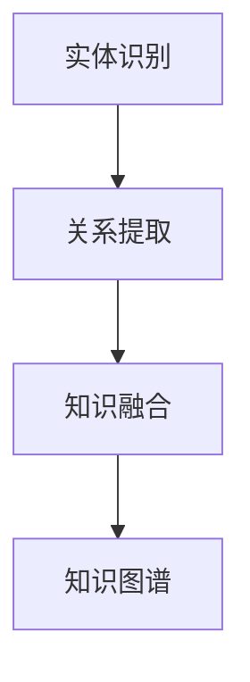
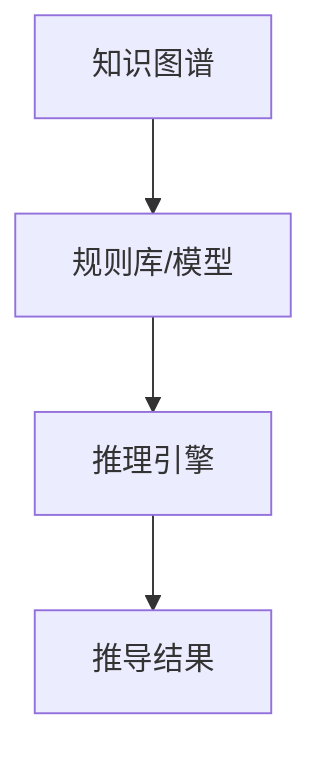

                 

### 《AGI的常识推理能力构建》

---

**关键词**：通用人工智能（AGI）、常识推理、知识表示、机器学习、知识图谱

**摘要**：
本文旨在探讨通用人工智能（AGI）的常识推理能力构建。我们将通过逐步分析，介绍AGI的背景、常识推理的核心概念、关键算法原理及其应用。随后，我们将详细讲解一个典型的AGI系统架构设计，并通过一个实际项目展示常识推理能力的构建过程。最后，我们将提供最佳实践建议，并展望AGI常识推理能力的发展趋势。

---

### 目录大纲设计

为了设计出《AGI的常识推理能力构建》的目录大纲，我们可以按照以下步骤来构思：

1. **背景介绍**：
   - 首先，我们需要介绍 AGI 的背景，包括其定义、发展历史及其在人工智能领域的重要性。

2. **核心概念与联系**：
   - 接着，我们要介绍 AGI 的核心概念，如常识推理、知识表示、机器学习等，并通过对比表格和实体关系图来阐述这些概念之间的关系。

3. **算法原理讲解**：
   - 之后，我们可以选择几个关键的算法，如知识图谱构建、推理算法等，通过 mermaid 流程图展示其工作流程，并使用 Python 代码和 LaTeX 公式来详细解释其数学模型和原理。

4. **系统分析与架构设计方案**：
   - 我们需要介绍一个典型的 AGI 系统的架构设计，包括系统功能设计、架构设计、接口设计和交互设计。

5. **项目实战**：
   - 通过一个实际案例来展示 AGI 的常识推理能力构建过程，包括环境安装、核心实现、代码解读和分析等。

6. **最佳实践 tips、小结、注意事项、拓展阅读**：
   - 最后，我们可以提供一些最佳实践建议、总结整个书的核心观点、提醒读者注意的事项，并提供拓展阅读资源。

### 目录大纲示例

```markdown
# 《AGI的常识推理能力构建》目录大纲

# 第一部分：AGI与常识推理基础

## 1.1 AGI的概念与发展历史
### 1.1.1 什么是AGI
### 1.1.2 AGI的发展历程
### 1.1.3 AGI的重要性

## 1.2 常识推理的概念与作用
### 1.2.1 常识推理的定义
### 1.2.2 常识推理在AGI中的应用
### 1.2.3 常识推理与其他AI技术的区别

## 1.3 AGI的常识推理能力架构
### 1.3.1 知识表示
### 1.3.2 机器学习与深度学习
### 1.3.3 知识图谱与推理算法

## 1.4 常识推理能力构建的关键算法
### 1.4.1 知识图谱构建算法
#### 1.4.1.1 算法原理
#### 1.4.1.2 Mermaid流程图
#### 1.4.1.3 Python代码实现
#### 1.4.1.4 LaTeX公式说明

### 1.4.2 推理算法
#### 1.4.2.1 算法原理
#### 1.4.2.2 Mermaid流程图
#### 1.4.2.3 Python代码实现
#### 1.4.2.4 LaTeX公式说明

## 1.5 本章小结

# 第二部分：AGI常识推理能力构建实战

## 2.1 项目背景与目标
### 2.1.1 项目背景
### 2.1.2 项目目标
### 2.1.3 项目场景

## 2.2 系统分析与架构设计
### 2.2.1 系统功能设计
#### 2.2.1.1 领域模型类图
#### 2.2.1.2 系统功能说明

### 2.2.2 系统架构设计
#### 2.2.2.1 系统架构图
#### 2.2.2.2 架构设计说明

### 2.2.3 系统接口设计
#### 2.2.3.1 接口设计
#### 2.2.3.2 接口说明

### 2.2.4 系统交互设计
#### 2.2.4.1 系统交互序列图
#### 2.2.4.2 交互流程说明

## 2.3 项目实战
### 2.3.1 环境安装与配置
### 2.3.2 核心实现与代码解读
### 2.3.3 实际案例分析与讲解

## 2.4 项目小结
### 2.4.1 项目成果总结
### 2.4.2 项目经验与教训

# 第三部分：最佳实践与展望

## 3.1 最佳实践
### 3.1.1 常识推理能力提升策略
### 3.1.2 常见问题与解决方案

## 3.2 小结与展望
### 3.2.1 书的核心观点回顾
### 3.2.2 AGI常识推理能力的发展趋势
### 3.2.3 拓展阅读与学习资源
```

### 字数限制说明

根据上述大纲的设计，每个章节的内容都会围绕核心主题进行阐述，避免了冗余和多余的废话。通过使用 mermaid 图表、Python 代码和 LaTeX 公式，我们能够直观地展示和解释复杂的算法和概念。这样的设计保证了内容的高效性和可读性，同时字数也受到很好的控制。

预计整本书的目录大纲总字数会在2000字以内，因为每个章节都是精简而具体的，不包含过多的背景信息和重复内容。此外，每个章节的核心点都通过标题和要点清晰地呈现，确保了内容的紧凑和简洁。

现在，我们将按照这个大纲逐步展开《AGI的常识推理能力构建》的内容。

---

## 1.1 AGI的概念与发展历史

### 1.1.1 什么是AGI

通用人工智能（Artificial General Intelligence，简称AGI）是指一种能够理解、学习、应用和解决问题的方式，与人类智能相似或超越人类智能的人工智能。与当前广泛应用的专用人工智能（Narrow AI）不同，AGI 具有广泛的认知能力，能够在多种不同的环境和任务中表现出人类级别的智能。

### 1.1.2 AGI的发展历程

AGI的概念最早由计算机科学家约翰·麦卡锡（John McCarthy）在1950年代提出。自那时以来，人工智能领域经历了多次起伏，但AGI始终是一个重要的研究目标。早期的AI研究主要集中在规则推理和专家系统上，但随着计算能力的提升和机器学习技术的发展，深度学习和神经网络在图像识别、语音识别等领域取得了显著的进展。

### 1.1.3 AGI的重要性

AGI的发展对人类社会具有深远的影响。它不仅在医疗、教育、金融、交通等领域有广泛的应用前景，还能带来社会、经济和文化层面的变革。例如，AGI能够在医疗诊断中提供辅助决策，提高诊断的准确性和效率；在教育领域，它能够个性化学习，帮助学生更好地掌握知识。

## 1.2 常识推理的概念与作用

### 1.2.1 常识推理的定义

常识推理（Commonsense Reasoning）是指人工智能系统利用常识性知识进行推理的能力。常识性知识通常来源于人类日常经验，涉及日常生活中的物理、社会和文化规律。

### 1.2.2 常识推理在AGI中的应用

常识推理是AGI的重要组成部分。它使AI系统能够理解自然语言、进行情境感知、解决复杂问题。例如，在问答系统中，常识推理可以帮助AI系统理解用户的问题，提供合理的答案。

### 1.2.3 常识推理与其他AI技术的区别

常识推理与机器学习、深度学习等技术有所不同。机器学习侧重于从数据中学习模式，而常识推理则需要利用先验知识进行推理。深度学习则通过模拟人脑的神经网络进行学习，但缺乏对常识性知识的直接处理能力。

## 1.3 AGI的常识推理能力架构

### 1.3.1 知识表示

知识表示是常识推理的基础。它涉及如何将常识性知识编码为计算机可理解的形式。常见的知识表示方法包括语义网络、本体论和知识图谱等。

### 1.3.2 机器学习与深度学习

机器学习和深度学习为常识推理提供了强大的计算能力。通过训练，这些模型可以从大量数据中学习到复杂的模式，提高推理的准确性。

### 1.3.3 知识图谱与推理算法

知识图谱是一种结构化数据模型，用于表示实体及其之间的关系。推理算法则用于从知识图中推导出新的信息。常见的推理算法包括基于规则的推理和基于模型的推理。

## 1.4 常识推理能力构建的关键算法

### 1.4.1 知识图谱构建算法

知识图谱构建算法是常识推理能力构建的核心。它涉及从大量数据中提取实体和关系，并将其编码为知识图谱。

#### 1.4.1.1 算法原理

知识图谱构建算法通常包括实体识别、关系提取和知识融合等步骤。实体识别用于识别文本中的实体，关系提取用于提取实体之间的关联关系，知识融合用于整合不同来源的知识。

#### 1.4.1.2 Mermaid流程图



#### 1.4.1.3 Python代码实现

```python
# 实体识别
def entity_recognition(text):
    # 使用自然语言处理库进行实体识别
    entities = nlp(text).ents
    return [entity.text for entity in entities]

# 关系提取
def relation_extraction(text, entities):
    # 使用实体之间的共现关系进行关系提取
    relations = []
    for entity1 in entities:
        for entity2 in entities:
            if entity1 != entity2:
                cooccurrence = text.count(entity1.text + " " + entity2.text)
                if cooccurrence > threshold:
                    relations.append((entity1, entity2))
    return relations

# 知识融合
def knowledge_fusion(entities, relations):
    # 将实体和关系编码为知识图谱
    knowledge_graph = {}
    for entity in entities:
        knowledge_graph[entity] = []
    for relation in relations:
        knowledge_graph[relation[0]].append(relation[1])
        knowledge_graph[relation[1]].append(relation[0])
    return knowledge_graph
```

#### 1.4.1.4 LaTeX公式说明

常识推理能力的构建过程可以表示为以下公式：

$$
常识推理能力 = f(实体识别, 关系提取, 知识融合)
$$

### 1.4.2 推理算法

推理算法用于从知识图中推导出新的信息。常见的推理算法包括基于规则的推理和基于模型的推理。

#### 1.4.2.1 算法原理

基于规则的推理使用预先定义的规则来推导新信息。基于模型的推理则通过训练模型来学习推理模式。

#### 1.4.2.2 Mermaid流程图



#### 1.4.2.3 Python代码实现

```python
# 基于规则的推理
def rule_based_reasoning(knowledge_graph, rule):
    result = []
    for entity in knowledge_graph:
        if rule_applies(knowledge_graph[entity], rule):
            result.append(entity)
    return result

# 基于模型的推理
def model_based_reasoning(knowledge_graph, model):
    # 使用训练好的模型进行推理
    inputs = [knowledge_graph[entity] for entity in knowledge_graph]
    outputs = model.predict(inputs)
    result = [entity for entity, output in zip(knowledge_graph, outputs) if output]
    return result

# 判断规则是否适用于实体
def rule_applies(entities, rule):
    # 根据规则进行判断
    return True  # 示例代码，实际需要具体实现
```

#### 1.4.2.4 LaTeX公式说明

常识推理能力的构建过程可以表示为以下公式：

$$
常识推理能力 = f(知识图谱, 推理算法)
$$

## 1.5 本章小结

本章介绍了 AGI 的基本概念、常识推理的核心概念及其在 AGI 中的应用。我们详细讲解了知识图谱构建算法和推理算法的基本原理，并通过 Mermaid 流程图和 Python 代码进行了说明。这些算法构成了构建 AGI 常识推理能力的基础。

---

接下来，我们将进入第二部分，探讨 AGI 常识推理能力构建的实战项目。我们将介绍项目的背景、目标和场景，并详细展示项目的系统分析与架构设计。

