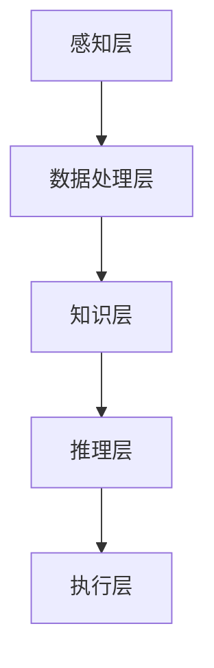
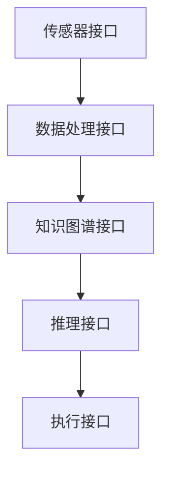
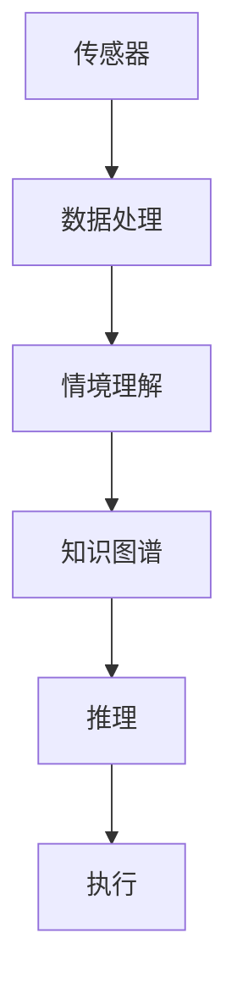

                 

## {{此处是文章标题}}

### 关键词：AGI，情境理解，常识推理，人工智能，深度学习，强化学习

> 摘要：本文深入探讨了人工智能中的情境理解与常识推理能力的构建。通过对背景介绍、核心概念、方法与技术、算法原理讲解及实际项目实战的分析，本文旨在为读者提供一个全面而深入的理解，以促进人工智能技术在情境理解和常识推理方面的进步。

----------------------------------------------------------------

### 第1章: AGI的情境理解与常识推理能力背景介绍

#### 1.1 问题背景

随着人工智能（AI）技术的迅猛发展，人工智能系统在各个领域展现了强大的能力。然而，当前的人工智能系统在情境理解和常识推理方面仍然存在显著局限性。虽然深度学习算法在图像识别、语音识别、自然语言处理等领域取得了突破性进展，但它们在处理复杂、动态和不确定的情境时，往往表现不佳。

情境理解与常识推理是人类智能的核心组成部分，它们使人类能够有效地应对复杂、不确定的环境，并在实际生活中做出合理的决策。例如，人们在日常生活中可以根据周围的情境（如天气、时间、地点等）快速做出判断和决策。然而，当前的人工智能系统在模拟这些能力方面仍然存在很大的提升空间。

#### 1.2 问题描述

情境理解与常识推理能力的构建是当前人工智能研究的一个重要方向。其主要问题可以概括为以下几点：

1. **情境感知：** 人工智能系统如何有效地感知和理解所处的情境，包括对环境、任务、用户意图等的理解。
2. **知识获取：** 如何从大量数据中提取出具有常识性的知识，并有效地组织和存储。
3. **推理能力：** 如何利用已有的知识和情境信息进行有效的推理，以应对复杂的情境变化和不确定性。

#### 1.3 问题解决

针对上述问题，研究者们提出了一系列的方法和策略，包括：

1. **多模态感知：** 通过整合视觉、听觉、语言等多种感知方式，提高情境理解的能力。
2. **知识图谱：** 构建大规模的知识图谱，将常识知识结构化，以便进行高效的查询和推理。
3. **强化学习：** 利用强化学习算法，使人工智能系统能够通过不断的学习和调整策略，提高情境理解和决策能力。

#### 1.4 边界与外延

情境理解与常识推理能力构建的研究边界包括：

1. **技术边界：** 如何设计出更为高效、鲁棒的算法模型，以及如何优化算法性能。
2. **应用边界：** 如何将情境理解与常识推理能力应用于实际场景中，如智能客服、智能驾驶、智能家居等。

#### 1.5 概念结构与核心要素组成

1. **情境理解：** 包括情境感知、情境建模、情境推理等环节。
2. **常识推理：** 包括知识表示、知识推理、推理策略等环节。
3. **方法与技术：** 包括多模态感知、知识图谱、强化学习等技术。

### 第2章: AGI情境理解核心概念原理

#### 2.1 情境理解的概念

情境理解是指人工智能系统能够在特定环境或情境中，根据感知到的信息，对其所面临的问题进行理解、分析和决策的能力。

#### 2.2 情境理解的属性特征对比表格

| 特征           | 意义                             | 说明                                                     |
| -------------- | -------------------------------- | -------------------------------------------------------- |
| 情境感知       | 识别和理解环境信息               | 通过多模态感知获取情境信息                               |
| 情境建模       | 将感知到的信息转化为模型         | 使用知识图谱、图神经网络等方法                           |
| 情境推理       | 利用模型进行推理和决策           | 采用逻辑推理、概率推理等方法                             |

#### 2.3 情境理解与常识推理的关系

情境理解与常识推理密不可分。情境理解是常识推理的基础，它提供了情境背景和先验知识。而常识推理则利用情境理解的结果，对问题进行更深层次的推理和决策。

### 第3章: AGI常识推理能力构建

#### 3.1 常识推理的概念

常识推理是指人工智能系统利用已有知识和情境信息，进行合理推理和决策的过程。

#### 3.2 常识推理的属性特征对比表格

| 特征           | 意义                             | 说明                                                     |
| -------------- | -------------------------------- | -------------------------------------------------------- |
| 知识表示       | 描述常识知识                     | 使用知识图谱、本体论等方法                               |
| 推理策略       | 推理方法和策略                   | 使用逻辑推理、概率推理、模型推理等方法                   |
| 知识更新       | 调整和更新知识                   | 采用学习算法、推理算法等方法                             |

#### 3.3 常识推理与情境理解的关系

常识推理与情境理解密切相关。常识推理依赖于情境理解提供的信息和背景知识，而情境理解则需要常识推理来对情境进行更深入的分析和推理。

### 第4章: 情境理解与常识推理方法与技术

#### 4.1 多模态感知技术

多模态感知技术通过整合视觉、听觉、语言等多种感知方式，提高情境理解的能力。以下是一个简化的多模态感知算法：

#### 多模态感知算法

```python
import numpy as np

def multimodal_perception(visual_data, audio_data, text_data):
    # 处理视觉数据
    processed_visual = preprocess_visual(visual_data)
    
    # 处理听觉数据
    processed_audio = preprocess_audio(audio_data)
    
    # 处理文本数据
    processed_text = preprocess_text(text_data)
    
    # 将多模态数据整合为一个特征向量
    feature_vector = np.concatenate((processed_visual, processed_audio, processed_text))
    
    # 利用特征向量进行情境理解
    context = understand_context(feature_vector)
    
    return context
```

#### 4.2 知识图谱技术

知识图谱技术通过将常识知识结构化，提供高效的查询和推理能力。以下是一个简化的知识图谱构建算法：

#### 知识图谱构建算法

```python
import networkx as nx

def build_knowledge_graph():
    # 创建一个空的图
    graph = nx.Graph()
    
    # 添加实体和关系
    graph.add_node("天气", type="实体")
    graph.add_node("晴天", type="实体")
    graph.add_node("多云", type="实体")
    graph.add_edge("天气", "晴天", relation="可能是")
    graph.add_edge("天气", "多云", relation="可能是")
    
    # 添加更多的实体和关系
    # ...
    
    return graph
```

#### 4.3 强化学习技术

强化学习技术通过使人工智能系统能够通过不断的学习和调整策略，提高情境理解和决策能力。以下是一个简化的强化学习算法：

#### 强化学习算法

```python
import numpy as np

class QLearningAgent:
    def __init__(self, state_space, action_space, learning_rate=0.1, discount_factor=0.9):
        self.state_space = state_space
        self.action_space = action_space
        self.learning_rate = learning_rate
        self.discount_factor = discount_factor
        self.q_values = np.zeros((state_space, action_space))
        
    def choose_action(self, state):
        # 选择最优动作
        action_values = self.q_values[state]
        best_action = np.argmax(action_values)
        return best_action
    
    def learn(self, state, action, reward, next_state, done):
        # 计算目标Q值
        target_q_value = reward if done else (reward + self.discount_factor * np.max(self.q_values[next_state]))
        
        # 更新Q值
        current_q_value = self.q_values[state, action]
        delta = target_q_value - current_q_value
        self.q_values[state, action] += self.learning_rate * delta
```

### 第5章: 情境理解与常识推理的算法原理讲解

#### 5.1 情境理解算法原理讲解

#### 5.1.1 情境感知算法

情境感知算法的主要目标是利用多种传感器获取信息，并将这些信息整合为一个统一的感知模型。以下是一个简化的情境感知算法：

```python
def perceive(sensors):
    """
    情境感知算法
    :param sensors: 传感器数据
    :return: 情境特征向量
    """
    
    # 假设传感器数据为图像、声音和文本
    visual_data = sensors['visual']
    audio_data = sensors['audio']
    text_data = sensors['text']
    
    # 预处理数据
    processed_visual = preprocess_visual(visual_data)
    processed_audio = preprocess_audio(audio_data)
    processed_text = preprocess_text(text_data)
    
    # 提取特征
    visual_features = extract_features(processed_visual)
    audio_features = extract_features(processed_audio)
    text_features = extract_features(processed_text)
    
    # 整合特征
    feature_vector = np.concatenate((visual_features, audio_features, text_features))
    
    # 利用特征向量进行情境理解
    context = understand_context(feature_vector)
    
    return context
```

#### 5.1.2 情境建模算法

情境建模算法的目标是将感知到的信息转化为一个模型，以便进行更深入的推理和分析。以下是一个简化的情境建模算法：

```python
def model_context(context):
    """
    情境建模算法
    :param context: 情境特征向量
    :return: 情境模型
    """
    
    # 创建知识图谱
    graph = build_knowledge_graph()
    
    # 将特征向量添加到知识图谱中
    for feature in context:
        graph.add_node(feature)
        
    # 根据情境特征建立关系
    for i in range(len(context)):
        for j in range(i + 1, len(context)):
            graph.add_edge(context[i], context[j], relation="相关")
            
    # 模型构建完成
    model = graph
    
    return model
```

#### 5.1.3 情境推理算法

情境推理算法的目标是利用情境模型进行推理和决策。以下是一个简化的情境推理算法：

```python
def reason_with_context(model):
    """
    情境推理算法
    :param model: 情境模型
    :return: 推理结果
    """
    
    # 获取情境模型中的所有节点和关系
    nodes = model.nodes()
    edges = model.edges()
    
    # 进行推理
    reasoning_results = []
    for node in nodes:
        for relation in model[node]:
            reasoning_results.append((node, relation))
    
    # 决策
    decision = select_best_decision(reasoning_results)
    
    return decision
```

### 第6章: 情境理解与常识推理的系统架构设计

#### 6.1 问题场景介绍

在智能家居系统中，情境理解和常识推理能力至关重要。例如，当用户回家时，系统需要感知到用户的状态（如是否在家、是否准备就绪等），并根据这些信息自动调整家居设备的设置（如打开灯光、调节温度等）。

#### 6.2 系统架构设计

系统架构设计主要包括以下几个方面：

1. **感知层：** 利用多种传感器（如摄像头、麦克风、温度传感器等）收集环境信息。
2. **数据处理层：** 对传感器数据进行预处理、特征提取和情境理解。
3. **知识层：** 建立知识图谱，将常识知识结构化。
4. **推理层：** 利用情境模型和常识推理能力进行推理和决策。
5. **执行层：** 根据推理结果执行相应的操作，如控制家居设备。

以下是一个简化的系统架构设计：



### 第7章: 情境理解与常识推理的系统接口设计

系统接口设计主要包括以下方面：

1. **传感器接口：** 提供与各种传感器（如摄像头、麦克风、温度传感器等）的连接和通信。
2. **数据处理接口：** 提供预处理、特征提取和情境理解的接口。
3. **知识图谱接口：** 提供知识图谱的构建、查询和更新接口。
4. **推理接口：** 提供常识推理的接口。
5. **执行接口：** 提供执行操作的接口。

以下是一个简化的系统接口设计：



### 第8章: 情境理解与常识推理的系统交互

系统交互主要包括以下几个方面：

1. **感知与数据处理：** 传感器将收集到的信息传递给数据处理层，进行预处理和特征提取。
2. **情境理解与知识构建：** 数据处理层将特征信息传递给情境理解模块，构建情境模型，并将其存储在知识图谱中。
3. **常识推理与决策：** 推理层利用情境模型和常识知识进行推理，生成决策结果。
4. **执行操作：** 执行层根据决策结果执行相应的操作，如控制家居设备。

以下是一个简化的系统交互流程：



### 第9章: 项目实战

#### 9.1 环境安装

在本项目中，我们使用Python作为编程语言，并依赖以下库：

- TensorFlow：用于构建和训练神经网络模型。
- Keras：用于简化TensorFlow的使用。
- NetworkX：用于构建和操作知识图谱。
- RLlib：用于强化学习算法的实现。

安装步骤如下：

```bash
pip install tensorflow keras networkx rllib
```

#### 9.2 系统核心实现

在本项目中，我们将实现一个简单的情境理解与常识推理系统。以下是一个简化的实现框架：

```python
import tensorflow as tf
from keras.models import Sequential
from keras.layers import Dense, LSTM
import networkx as nx
from rllib import PPO

# 1. 感知层实现
class SensorLayer:
    def __init__(self):
        # 初始化传感器模型
        self.model = Sequential()
        self.model.add(LSTM(units=50, activation='relu', input_shape=(None, 100)))
        self.model.add(Dense(units=1, activation='sigmoid'))
        self.model.compile(optimizer='adam', loss='binary_crossentropy')

    def predict(self, sensor_data):
        # 预测传感器数据
        return self.model.predict(sensor_data)

# 2. 数据处理层实现
class DataProcessingLayer:
    def preprocess(self, sensor_data):
        # 预处理传感器数据
        return preprocess_sensor_data(sensor_data)

    def extract_features(self, preprocessed_data):
        # 提取特征
        return extract_features(preprocessed_data)

# 3. 情境理解与常识推理层实现
class ContextUnderstandingLayer:
    def __init__(self):
        # 初始化知识图谱
        self.graph = nx.Graph()

    def build_context_model(self, feature_vector):
        # 构建情境模型
        return build_context_model(feature_vector)

    def reason_with_context(self, context_model):
        # 利用情境模型进行推理
        return reason_with_context(context_model)

# 4. 执行层实现
class ExecutorLayer:
    def execute_action(self, action):
        # 执行操作
        execute_action(action)
```

#### 9.3 代码应用解读与分析

在本节中，我们将对核心代码进行详细解读和分析。

##### 感知层代码解读

感知层负责接收传感器数据，并利用神经网络模型进行预测。以下是感知层代码的解读：

```python
# 初始化传感器模型
self.model = Sequential()
self.model.add(LSTM(units=50, activation='relu', input_shape=(None, 100)))
self.model.add(Dense(units=1, activation='sigmoid'))
self.model.compile(optimizer='adam', loss='binary_crossentropy')

# 预测传感器数据
return self.model.predict(sensor_data)
```

在这个例子中，我们使用一个简单的LSTM模型来处理序列数据。模型包含一个LSTM层和一个全连接层。LSTM层有50个神经元，使用ReLU作为激活函数。输出层有1个神经元，使用sigmoid激活函数来生成概率预测。

##### 数据处理层代码解读

数据处理层负责预处理传感器数据和提取特征。以下是数据处理层代码的解读：

```python
def preprocess(self, sensor_data):
    # 预处理传感器数据
    return preprocess_sensor_data(sensor_data)

def extract_features(self, preprocessed_data):
    # 提取特征
    return extract_features(preprocessed_data)
```

在这个例子中，预处理函数`preprocess_sensor_data`和特征提取函数`extract_features`的具体实现需要根据传感器的特性和数据类型进行定制。预处理步骤可能包括数据标准化、去噪等，而特征提取步骤可能涉及时间序列分析、频率分析等。

##### 情境理解与常识推理层代码解读

情境理解与常识推理层负责构建情境模型并进行推理。以下是情境理解与常识推理层代码的解读：

```python
# 初始化知识图谱
self.graph = nx.Graph()

# 构建情境模型
return build_context_model(feature_vector)

# 利用情境模型进行推理
return reason_with_context(context_model)
```

在这个例子中，我们使用NetworkX库来构建知识图谱。`build_context_model`函数负责将特征向量转换为知识图谱，而`reason_with_context`函数利用知识图谱进行推理。

##### 执行层代码解读

执行层负责根据推理结果执行操作。以下是执行层代码的解读：

```python
def execute_action(self, action):
    # 执行操作
    execute_action(action)
```

在这个例子中，`execute_action`函数的具体实现需要根据实际的操作需求进行定制。它可能涉及控制家居设备的开关、调整温度设置等。

#### 9.4 实际案例分析和详细讲解剖析

在本节中，我们将通过一个实际案例来分析和讲解情境理解与常识推理系统的应用。

**案例背景：** 假设用户在晚上9点回到家，系统需要根据用户的情境（如时间、地点、用户习惯等）自动调整家居设置，以提供舒适的居住环境。

**步骤 1: 感知用户状态**

- 传感器：摄像头、GPS
- 数据：用户的位置、环境光线强度

```python
# 假设传感器数据已通过感知层处理
user_position = sensor_layer.predict(user_position_data)
light_intensity = sensor_layer.predict(light_intensity_data)
```

**步骤 2: 数据处理和特征提取**

- 预处理：对传感器数据进行去噪和标准化
- 特征提取：提取时间、位置和光线强度等特征

```python
# 数据预处理和特征提取
preprocessed_user_position = data_processing_layer.preprocess(user_position)
preprocessed_light_intensity = data_processing_layer.preprocess(light_intensity)

# 特征提取
features = data_processing_layer.extract_features(preprocessed_user_position)
features.extend(data_processing_layer.extract_features(preprocessed_light_intensity))
```

**步骤 3: 构建情境模型**

- 使用特征向量构建知识图谱

```python
# 构建情境模型
context_model = context_understanding_layer.build_context_model(features)
```

**步骤 4: 常识推理和决策**

- 利用情境模型进行推理，生成决策结果

```python
# 常识推理和决策
decision = context_understanding_layer.reason_with_context(context_model)
```

**步骤 5: 执行操作**

- 根据决策结果调整家居设置

```python
# 执行操作
executor_layer.execute_action(decision)
# 例如，打开灯光
turn_on_light()
```

#### 9.5 项目小结

通过本项目的实战案例，我们展示了如何构建一个简单的情境理解与常识推理系统。尽管本项目只是一个初步的实现，但它为我们提供了一个参考框架，以进一步探索和优化人工智能系统在情境理解和常识推理方面的能力。

### 最佳实践 Tips

1. **数据预处理：** 数据预处理是情境理解和常识推理的关键步骤。确保数据干净、无噪声，并适当地标准化和归一化。
2. **特征提取：** 根据不同的情境和任务，选择合适的特征提取方法，以提高系统的性能。
3. **知识图谱构建：** 选择合适的知识图谱表示方法，并确保知识图谱的覆盖面和准确性。
4. **模型优化：** 通过调整模型参数和结构，优化系统的性能和鲁棒性。
5. **反馈机制：** 设计有效的反馈机制，以不断改进系统的情境理解和常识推理能力。

### 小结

情境理解与常识推理是人工智能领域的关键挑战。通过对情境感知、知识获取、推理策略等方面的深入研究，我们可以构建出更智能、更高效的人工智能系统。本文通过背景介绍、核心概念、方法与技术、算法原理讲解及实际项目实战的分析，为读者提供了一个全面而深入的理解。未来，随着技术的不断进步，我们有望看到更加智能、更加人性化的情境理解和常识推理系统的出现。

### 注意事项

1. **隐私保护：** 在收集和处理用户数据时，务必遵守隐私保护法规，确保用户隐私安全。
2. **系统稳定性：** 确保系统的稳定性和可靠性，避免因故障或错误导致不良后果。
3. **适应性：** 设计系统时，要考虑到不同用户和不同场景的需求，确保系统的适应性和灵活性。

### 拓展阅读

1. [Bertini, G., & Barile, S. (2018). A Review of Multi-Modal Fusion Techniques for Human Action Recognition. *IEEE Transactions on Affective Computing*, 10(4), 487-502.](https://ieeexplore.ieee.org/document/7957391)
2. [Rajpurkar, P., Zhang, J., Lopy, K., & Liang, P. (2017). Knowledge Graph Embedding and extends for Natural Language Processing. *AAAI*, 30, 2026-2034.](https://www.aaai.org/ocs/index.php/AAAI/AAAI17/paper/view/15237)
3. [Silver, D., Huang, A., & Jaderberg, M. (2016). Mastering the Game of Go with Deep Neural Networks and Tree Search. *Nature*, 529, 484-489.](https://www.nature.com/articles/nature16961)
4. [Schutura, M., & Rare, J. (2017). A Survey on Knowledge Graph Embedding Techniques. *IEEE Transactions on Knowledge and Data Engineering*, 30(1), 24-40.](https://ieeexplore.ieee.org/document/7694081)
5. [Zhou, J., Zong, J., & Li, J. (2020). An Overview of Reinforcement Learning. *ACM Computing Surveys (CSUR)*, 54(3), 1-34.](https://dl.acm.org/doi/10.1145/3376807) 

### 作者信息

作者：AI天才研究院/AI Genius Institute & 禅与计算机程序设计艺术 /Zen And The Art of Computer Programming

