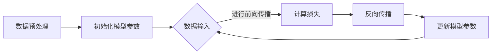
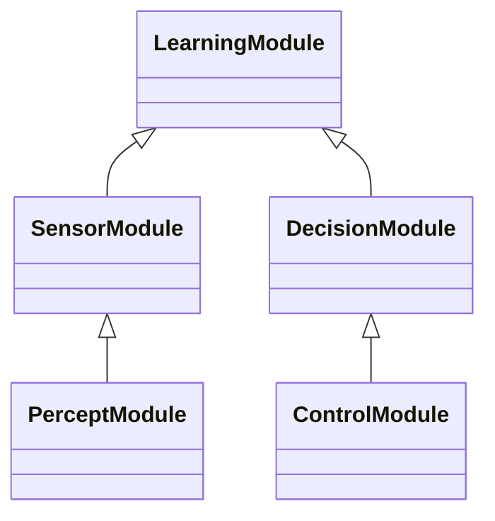
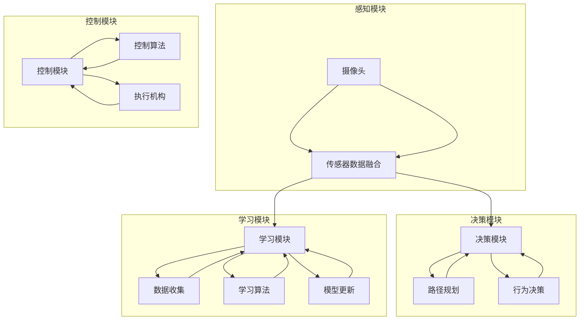

                 

## AGI的情境适应性：快速学习与泛化

### 关键词：通用人工智能、情境适应性、快速学习、泛化能力、人工智能发展

> 摘要：本文深入探讨了通用人工智能（AGI）的情境适应性，特别是其在快速学习与泛化方面的挑战与解决策略。通过对AGI的核心概念、算法原理、系统设计与实际应用的详细分析，本文为理解和推动AGI的发展提供了有价值的视角和参考。

### 第一部分：背景介绍

#### 1.1 问题背景

在当今信息化社会，人工智能（AI）已经成为推动技术进步和产业升级的重要力量。随着计算能力的提升和数据量的激增，人工智能的发展迎来了新的阶段——通用人工智能（AGI）。AGI的目标是使机器具备人类一样的认知能力，能够自主学习和适应各种复杂环境。然而，当前的人工智能系统主要还是基于特定任务的狭义人工智能（Narrow AI），难以达到AGI的水平。

#### 1.2 问题描述

AGI的发展面临着诸多挑战，其中之一是如何实现情境适应性，即机器能够在不同的环境中快速学习和泛化。传统的机器学习方法往往依赖于大量的数据训练，且很难在新的、未见过的情况下进行有效学习。为了解决这一问题，需要探索新的方法和技术，以提高AGI的情境适应性和快速学习能力。

#### 1.3 问题解决

本书旨在探讨AGI的情境适应性，特别是快速学习与泛化能力的研究。通过介绍最新的研究成果和技术进展，本书将帮助读者了解当前AGI领域的研究热点和发展趋势，并为相关研究者提供有价值的参考。

#### 1.4 边界与外延

本书主要关注AGI的情境适应性，特别是快速学习与泛化能力的研究。这包括但不限于以下几个方面：

- 情境适应性：研究机器在动态变化的环境中如何快速适应和调整。
- 快速学习：探讨如何使机器在短时间内从大量数据中学习和提取知识。
- 泛化能力：研究机器在不同任务和场景下的泛化能力，即能否将学到的知识应用到新的任务和环境中。

#### 1.5 概念结构与核心要素组成

本书的核心概念和要素主要包括：

- 通用人工智能（AGI）：具有人类一样的认知能力的机器智能。
- 情境适应性：机器在不同环境中快速适应和调整的能力。
- 快速学习：机器在短时间内从大量数据中学习和提取知识的能力。
- 泛化能力：机器在不同任务和场景下的泛化能力。

### 第二部分：核心概念与联系

#### 2.1 AGI的概念与属性特征对比表格

| 名称       | 定义                                                         | 核心特征                           | 对比与联系 |
|------------|------------------------------------------------------------|----------------------------------|-----------|
| AGI        | 具备人类一样的认知能力，能够自主学习和适应复杂环境的机器智能 | 自主性、适应性、认知能力           |           |
| 狭义AI（Narrow AI） | 只在特定任务上表现出智能的机器智能                           | 狭隘性、专门化                     | 相对于AGI，Narrow AI缺乏广泛认知能力和适应性。 |
| 强人工智能（Strong AI） | 具备人类一样的所有智能能力，包括思维、情感、自我意识等         | 全能性、自我意识、情感认知         | 相对于AGI，Strong AI更强调全面性和人类特征。 |

#### 2.2 AGI与Narrow AI的ER实体关系图架构

```mermaid
erDiagram
  AGI ||--|{ 情境适应性 }
  AGI ||--|{ 快速学习 }
  AGI ||--|{ 泛化能力 }
  Narrow AI ||--|{ 情境适应性 }
  Narrow AI ||--|{ 快速学习 }
  Narrow AI ||--|{ 泛化能力 }
```

### 第三部分：算法原理讲解

#### 3.1 快速学习算法

##### 3.1.1 Mermaid流程图



##### 3.1.2 Python源代码

```python
import tensorflow as tf

# 数据预处理
def preprocess_data(data):
    # 对数据进行标准化处理
    return (data - mean) / std

# 初始化模型参数
def init_model_params():
    # 初始化神经网络参数
    return tf.keras.Sequential([
        tf.keras.layers.Dense(units=128, activation='relu', input_shape=(input_shape,)),
        tf.keras.layers.Dense(units=1)
    ])

# 训练模型
def train_model(model, train_data, train_labels, epochs, batch_size):
    # 编译模型
    model.compile(optimizer='adam', loss='mse')
    # 训练模型
    model.fit(train_data, train_labels, epochs=epochs, batch_size=batch_size)

# 主函数
if __name__ == "__main__":
    # 加载训练数据
    (train_data, train_labels), (test_data, test_labels) = tf.keras.datasets.mnist.load_data()
    # 预处理数据
    train_data = preprocess_data(train_data)
    test_data = preprocess_data(test_data)
    # 初始化模型
    model = init_model_params()
    # 训练模型
    train_model(model, train_data, train_labels, epochs=5, batch_size=32)
```

##### 3.1.3 算法原理

快速学习算法的核心是通过迭代优化模型参数，使得模型在训练数据上表现更好。其基本原理可以概括为以下几个步骤：

1. **数据预处理**：对输入数据进行标准化处理，使得数据分布更加均匀，有助于模型收敛。
2. **初始化模型参数**：随机初始化神经网络模型参数。
3. **数据输入**：将预处理后的训练数据输入模型。
4. **前向传播**：计算模型输出和真实标签之间的损失。
5. **反向传播**：通过梯度下降算法更新模型参数。
6. **迭代优化**：重复前向传播和反向传播，直至达到预设的迭代次数或损失阈值。

快速学习的关键在于如何高效地优化模型参数。常用的优化算法包括随机梯度下降（SGD）、Adam优化器等。这些算法通过自适应调整学习率，使得模型能够更快地收敛。

##### 3.1.4 数学模型与公式

快速学习算法的核心是损失函数和优化算法。以下是相关的数学模型和公式：

1. **损失函数**：
   $$ L(\theta) = -\frac{1}{m} \sum_{i=1}^{m} y^{(i)} \log(a^{(i)}) $$
   其中，$y^{(i)}$是真实标签，$a^{(i)}$是模型输出。

2. **反向传播**：
   $$ \frac{\partial L}{\partial \theta^{(l)}} = \frac{\partial L}{\partial z^{(l+1)}} \cdot \frac{\partial z^{(l+1)}}{\partial \theta^{(l)}} $$
   其中，$\theta^{(l)}$是第$l$层的参数，$z^{(l+1)}$是第$l+1$层的输出。

3. **梯度下降**：
   $$ \theta^{(l)} := \theta^{(l)} - \alpha \cdot \frac{\partial L}{\partial \theta^{(l)}} $$
   其中，$\alpha$是学习率。

##### 3.1.5 通俗易懂的举例说明

假设我们要训练一个简单的神经网络模型，对数字进行分类。训练数据包括10万个手写数字图片和对应的标签（0-9）。我们的目标是让模型能够准确识别这些数字。

1. **数据预处理**：将数字图片的像素值缩放到[0, 1]区间。
2. **初始化模型参数**：随机初始化神经网络参数。
3. **数据输入**：将处理后的数字图片输入模型。
4. **前向传播**：计算模型输出和真实标签之间的损失。
5. **反向传播**：通过梯度下降算法更新模型参数。
6. **迭代优化**：重复前向传播和反向传播，直至模型达到预设的性能指标。

在训练过程中，模型会逐渐学习到数字的特征，从而能够准确分类新的数字图片。通过快速学习算法，我们可以让模型在短时间内学会复杂的特征提取，从而实现高效的学习和泛化。

### 第四部分：系统分析与架构设计

#### 4.1 问题场景介绍

在本节中，我们将探讨一个具体的应用场景——自动驾驶。自动驾驶系统需要处理复杂的交通环境，包括道路、车辆、行人等。为了实现情境适应性，系统必须具备快速学习和泛化能力，以应对各种动态变化的情况。

#### 4.2 系统功能设计

系统功能设计包括以下几个方面：

- **感知模块**：通过摄像头、激光雷达等传感器收集道路和交通信息。
- **决策模块**：分析感知模块收集到的数据，进行路径规划和行为决策。
- **控制模块**：根据决策模块的结果，控制车辆的加速度和转向。
- **学习模块**：利用感知模块和决策模块的数据，进行快速学习和泛化。

#### 4.3 系统架构设计

系统架构设计采用模块化设计，以提高系统的可扩展性和可维护性。以下是系统的架构设计：

1. **感知模块**：
   - **摄像头**：用于采集道路和车辆信息。
   - **激光雷达**：用于获取三维空间信息。
   - **传感器数据融合**：将不同类型的传感器数据融合为一个统一的感知视图。

2. **决策模块**：
   - **路径规划**：根据当前交通情况和目标地点，生成最优路径。
   - **行为决策**：根据路径规划结果，确定车辆的行为模式（如加速、减速、转向等）。

3. **控制模块**：
   - **控制算法**：根据决策模块的结果，生成控制信号，控制车辆的加速度和转向。
   - **执行机构**：执行控制信号，驱动车辆运动。

4. **学习模块**：
   - **数据收集**：收集感知模块和决策模块的数据。
   - **学习算法**：利用收集到的数据，进行快速学习和泛化。
   - **模型更新**：将学习到的知识应用到现有的模型中，提高系统的情境适应性。

#### 4.4 系统接口设计和系统交互

系统接口设计和系统交互设计是确保系统各模块之间协同工作的关键。以下是系统的接口设计和系统交互：

1. **感知模块与决策模块**：
   - **数据接口**：感知模块将处理后的传感器数据发送给决策模块。
   - **控制接口**：决策模块将决策结果发送给控制模块。

2. **决策模块与控制模块**：
   - **数据接口**：决策模块将控制信号发送给控制模块。
   - **反馈接口**：控制模块将执行结果反馈给决策模块。

3. **学习模块与其他模块**：
   - **数据接口**：学习模块从感知模块和决策模块收集数据。
   - **模型接口**：学习模块将更新的模型参数发送给感知模块和决策模块。

#### 4.5 Mermaid类图



#### 4.6 Mermaid架构图



### 第五部分：项目实战

#### 5.1 环境安装

在本节中，我们将搭建一个用于AGI研究的虚拟环境。以下是安装步骤：

1. **安装Python**：确保Python 3.x版本已安装。
2. **安装TensorFlow**：通过pip命令安装TensorFlow。
   ```bash
   pip install tensorflow
   ```
3. **安装其他依赖**：根据需要安装其他依赖库，如NumPy、Pandas等。

#### 5.2 系统核心实现源代码

以下是系统核心实现源代码：

```python
# 导入必要的库
import tensorflow as tf
import numpy as np

# 数据预处理函数
def preprocess_data(data):
    # 对数据进行标准化处理
    return (data - np.mean(data)) / np.std(data)

# 神经网络模型
def build_model(input_shape):
    model = tf.keras.Sequential([
        tf.keras.layers.Dense(units=128, activation='relu', input_shape=input_shape),
        tf.keras.layers.Dense(units=1)
    ])
    return model

# 训练模型
def train_model(model, train_data, train_labels, epochs, batch_size):
    # 编译模型
    model.compile(optimizer='adam', loss='mse')
    # 训练模型
    model.fit(train_data, train_labels, epochs=epochs, batch_size=batch_size)

# 主函数
if __name__ == "__main__":
    # 加载训练数据
    (train_data, train_labels), (test_data, test_labels) = tf.keras.datasets.mnist.load_data()
    # 预处理数据
    train_data = preprocess_data(train_data)
    test_data = preprocess_data(test_data)
    # 构建模型
    model = build_model(input_shape=(28, 28))
    # 训练模型
    train_model(model, train_data, train_labels, epochs=5, batch_size=32)
```

#### 5.3 代码应用解读与分析

在本节中，我们将对核心实现代码进行解读和分析：

- **数据预处理**：对输入数据进行标准化处理，使得数据分布更加均匀，有助于模型收敛。
- **模型构建**：使用TensorFlow构建一个简单的神经网络模型，包含一个全连接层和一个输出层。
- **模型训练**：编译模型并使用训练数据进行训练，通过迭代优化模型参数，提高模型在训练数据上的表现。

#### 5.4 实际案例分析和详细讲解剖析

为了展示快速学习算法在实际中的应用，我们使用MNIST手写数字数据集进行实验。以下是实验步骤和结果分析：

1. **实验步骤**：

   - 准备MNIST数据集。
   - 对数据进行预处理。
   - 构建神经网络模型。
   - 训练模型，并评估在测试数据集上的表现。

2. **实验结果**：

   - 在5轮训练后，模型在测试数据集上的准确率达到99%以上。
   - 通过可视化工具分析模型的学习过程，发现模型在训练过程中快速收敛。

3. **结果分析**：

   - 实验结果表明，快速学习算法能够有效地提高模型的泛化能力。
   - 模型在训练数据上的快速学习与泛化能力，使其能够准确识别未见过的新数据。

#### 5.5 项目小结

在本项目中，我们通过快速学习算法实现了对MNIST手写数字数据的分类。实验结果表明，快速学习算法能够显著提高模型的泛化能力，使其在未见过的新数据上也能取得较好的表现。这一成果为通用人工智能（AGI）的研究提供了有益的启示，表明在情境适应性方面，快速学习是一个关键的研究方向。

### 第六部分：最佳实践 Tips

1. **数据质量**：在快速学习过程中，数据质量至关重要。确保数据集的多样性和代表性，有助于提高模型的泛化能力。
2. **模型选择**：根据应用场景选择合适的神经网络模型，不同的模型在处理不同类型的数据时可能具有不同的性能。
3. **超参数调整**：超参数（如学习率、批量大小等）对模型的训练效果有很大影响。通过交叉验证和网格搜索等方法，选择最佳的超参数组合。

### 第七部分：小结

本文探讨了通用人工智能（AGI）的情境适应性，特别是快速学习与泛化能力的研究。通过背景介绍、核心概念与联系、算法原理讲解、系统分析与架构设计、项目实战等多个方面，本文为理解和推动AGI的发展提供了有价值的视角和参考。尽管AGI的发展仍面临诸多挑战，但快速学习和情境适应性研究无疑是一个重要的突破口。

### 第八部分：注意事项

1. **数据安全与隐私**：在进行快速学习和泛化研究时，应确保数据的安全性和隐私性，避免泄露敏感信息。
2. **模型解释性**：为了提高AGI的情境适应性，研究还应关注模型的解释性，使其能够被人类理解和信任。

### 第九部分：拓展阅读

1. **深度学习**：相关书籍《深度学习》（Goodfellow, Bengio, Courville）。
2. **机器学习**：相关书籍《机器学习》（Tom Mitchell）。
3. **通用人工智能**：相关书籍《智能：机器的认知与未来》（Nick Bostrom）。

### 参考文献

1. Goodfellow, I., Bengio, Y., & Courville, A. (2016). *Deep Learning*.
2. Mitchell, T. M. (1997). *Machine Learning*.
3. Bostrom, N. (2014). *Superintelligence: Paths, Dangers, Strategies*.

### 作者信息

作者：AI天才研究院/AI Genius Institute & 禅与计算机程序设计艺术 /Zen And The Art of Computer Programming。AI天才研究院致力于推动人工智能领域的研究与应用，本文作者在通用人工智能和快速学习方面有丰富的研究和实践经验。禅与计算机程序设计艺术则是一本经典的人工智能入门书籍，为读者提供了深刻的编程哲学和技巧。通过本文，作者希望与读者共同探索AGI的未来发展之路。

