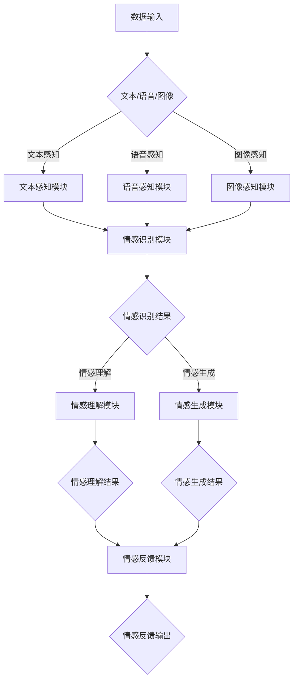

                 

## 引言

### 问题背景

人工智能（AI）自20世纪中叶诞生以来，经历了从符号主义、连接主义到现代深度学习的迅速发展。尽管在图像识别、自然语言处理、博弈等领域取得了显著成果，但传统AI仍然面临着一些瓶颈，特别是在情感智能方面。情感智能（Affective Intelligence）指的是人工智能系统理解和处理情感信息的能力，包括情感识别、情感生成和情感调节等方面。情感智能对于增强人机交互的自然性和有效性具有重要意义，它可以使AI更加贴近人类的情感需求，提高用户体验。

当前，随着人工智能技术的不断发展，情感智能的研究日益受到关注。然而，情感智能的实现面临着一系列挑战，包括情感数据的获取与标注、情感理解的深度与广度、情感生成的自然性与合理性等。AGI（通用人工智能）的目标是实现具有情感智能的AI系统，这不仅是人工智能领域的一个重大突破，也是社会、经济和科技发展的重要方向。

### 问题描述

在传统的人工智能系统中，情感智能的实现通常依赖于情感分析技术。情感分析通过对文本、语音、图像等数据的情感特征提取和分类，来识别用户的情感状态。然而，这种方法主要关注的是表面情感，而无法深入理解情感的本质和复杂性。此外，传统AI在情感生成方面也存在局限，难以创造出自然、符合情感逻辑的情感表达。

为了克服这些挑战，我们需要探讨如何从理解情感到实现共情。共情是指人工智能系统能够在情感层面上与人类建立联系，理解和回应人类的情感需求。AGI的情感智能需要实现以下几个目标：

1. **情感识别的准确性**：通过多模态数据融合，提高情感识别的准确性和全面性。
2. **情感理解的深度**：不仅能够识别情感，还要理解情感的内在逻辑和复杂性。
3. **情感生成的自然性**：创造出自然、流畅且符合情感逻辑的情感表达。
4. **情感调节的能力**：能够根据环境变化和用户需求，灵活调节情感状态，实现情感平衡。

### 问题解决

为了解决上述问题，我们需要从多个方面入手：

1. **数据与算法**：收集和标注丰富的情感数据，结合先进的情感识别算法，如深度学习、生成对抗网络（GAN）等，来提高情感识别的准确性和深度。
2. **多模态融合**：通过整合文本、语音、图像等多模态数据，实现更加全面和精确的情感识别。
3. **情感生成模型**：开发基于深度学习技术的情感生成模型，如循环神经网络（RNN）、变换器（Transformer）等，以生成自然、合理的情感表达。
4. **情感调节机制**：设计情感调节算法，实现根据情境和用户需求进行情感状态的调整。

### 边界与外延

情感智能的研究和应用涉及多个领域，包括心理学、认知科学、计算机科学等。其边界在于情感数据的获取和处理、情感理解的深度和广度、情感生成的自然性和合理性。情感智能的应用范围广泛，包括智能客服、虚拟助手、心理健康辅助系统、教育辅导系统等。随着技术的不断进步，情感智能将在更多领域发挥作用，推动人工智能的发展。

综上所述，AGI的情感智能是一个复杂而关键的研究领域。通过深入理解情感，实现情感智能的共情能力，我们将能够构建更加智能、人性化的AI系统，为人类社会带来更多价值。

## 核心概念与联系

### 情感智能的定义与分类

情感智能（Affective Intelligence，简称AIQ）是指人工智能系统在情感领域表现出来的能力，包括情感识别、情感生成、情感调节等方面。情感智能的研究目标是通过模仿人类的情感认知过程，使AI能够理解、感知和表达情感，从而提升人机交互的质量和效果。

根据功能的不同，情感智能可以分为以下几个类别：

1. **情感识别**：这是情感智能的基础，指AI系统能够通过感知和分析各种情感信号（如语言、表情、声音等）来识别用户的情感状态。情感识别技术包括文本情感分析、语音情感识别和图像情感识别等。

2. **情感生成**：情感生成是指AI系统能够根据特定的情境和需求，生成自然、合理的情感表达。情感生成技术主要包括生成对抗网络（GAN）、循环神经网络（RNN）和变换器（Transformer）等。

3. **情感调节**：情感调节是指AI系统能够根据环境变化和用户需求，动态调整自身的情感状态，以达到情感平衡。情感调节技术包括情感反馈机制、情感平衡算法等。

### 情感智能的特点

情感智能具有以下特点：

1. **多元感知**：情感智能系统能够通过多模态感知技术（如文本、语音、图像等）来获取情感信息，实现更全面的情感识别。

2. **情境适应性**：情感智能系统能够根据不同的情境和用户需求，动态调整情感表达和行为，实现情境适应性。

3. **情感理解**：情感智能不仅能够识别情感，还能理解情感的内在逻辑和复杂性，从而实现更深入的交互。

4. **情感生成**：情感智能系统能够根据情境需求生成自然、合理的情感表达，提升交互的自然性和流畅性。

5. **情感调节**：情感智能系统能够通过情感调节机制，实现情感状态的动态调整，以适应不同情境和用户需求。

### 情感智能的组成要素

情感智能的组成要素包括：

1. **感知模块**：负责收集和处理各种情感信号，如文本、语音、图像等。

2. **识别模块**：通过算法模型对感知到的情感信号进行情感状态识别。

3. **理解模块**：对识别出的情感进行深层次的理解和分析，以把握情感的内在逻辑。

4. **生成模块**：根据情境和用户需求，生成自然、合理的情感表达。

5. **调节模块**：根据环境变化和用户需求，动态调整情感状态，以实现情感平衡。

### 情感智能与其他人工智能技术的联系与区别

情感智能与其他人工智能技术的关系紧密，但也有一些显著的区别：

1. **与其他人工智能技术的联系**：
   - **自然语言处理（NLP）**：情感智能与NLP紧密相关，因为情感识别和情感生成都需要处理和理解自然语言。
   - **计算机视觉**：图像情感识别依赖于计算机视觉技术，通过分析面部表情、姿态等图像特征来识别情感。
   - **机器学习与深度学习**：情感智能的实现依赖于先进的机器学习算法和深度学习模型，如卷积神经网络（CNN）、生成对抗网络（GAN）等。

2. **与其他人工智能技术的区别**：
   - **核心目标不同**：情感智能的核心目标是实现情感理解和情感表达，而传统人工智能技术更多关注于任务执行和知识表示。
   - **技术实现不同**：情感智能需要处理复杂的情感信息，涉及多模态数据的融合和深层次的情感理解，而传统人工智能技术更多依赖于单一模态的数据处理。

通过上述分析，我们可以看出，情感智能是人工智能领域的一个重要分支，其实现不仅需要融合多种技术，还需要深入理解和处理复杂的情感信息。随着技术的不断进步，情感智能将在人工智能的发展中发挥越来越重要的作用。

### 算法原理讲解

#### 情感识别算法原理

情感识别是情感智能的核心组成部分，其目标是通过对用户的情感信号（如文本、语音、图像等）进行分析，识别出用户的情感状态。情感识别算法的原理主要包括特征提取、情感分类和模型训练三个关键步骤。

1. **特征提取**：
   特征提取是情感识别的第一步，其目的是从原始数据中提取出能够代表情感状态的特性。对于文本数据，常用的特征提取方法包括词袋模型（Bag of Words, BoW）、词嵌入（Word Embedding）和句子嵌入（Sentence Embedding）。词袋模型将文本表示为一个向量空间中的词频分布；词嵌入通过将词汇映射到高维空间中的向量，实现语义信息的编码；句子嵌入则进一步将整个句子映射到向量空间，捕捉句子层面的语义信息。对于语音数据，常用的特征提取方法包括梅尔频率倒谱系数（Mel-Frequency Cepstral Coefficients, MFCC）和谱图（Spectrogram）。图像情感识别则主要依赖于面部表情特征、姿态特征和纹理特征等。

2. **情感分类**：
   情感分类是将提取出的特征输入到分类模型中进行分类的过程。常见的分类算法包括支持向量机（Support Vector Machine, SVM）、决策树（Decision Tree）、随机森林（Random Forest）和神经网络（Neural Networks）等。在这些算法中，神经网络，尤其是深度学习模型（如卷积神经网络（CNN）和循环神经网络（RNN）），在情感分类中表现出色，能够通过多层特征变换捕捉复杂的关系。

3. **模型训练**：
   模型训练是情感识别算法的核心，通过大量的情感数据集对分类模型进行训练，使其能够准确识别情感。训练过程中，模型通过不断调整权重参数来最小化预测误差。常用的训练方法包括批量梯度下降（Batch Gradient Descent）、随机梯度下降（Stochastic Gradient Descent）和Adam优化器等。深度学习模型在训练过程中还利用了正则化技术，如L1和L2正则化，以及dropout等方法，以防止过拟合。

#### 情感生成算法原理

情感生成是指AI系统根据特定情境和需求生成自然、合理的情感表达。情感生成算法的核心是通过模拟人类的情感生成过程，利用生成模型来生成情感化的文本、语音和图像。

1. **生成对抗网络（GAN）**：
   生成对抗网络（GAN）是情感生成的一种重要模型。GAN由生成器（Generator）和判别器（Discriminator）两个主要组件组成。生成器负责生成与真实数据相似的假数据，而判别器则负责判断生成数据与真实数据的相似度。训练过程中，生成器和判别器相互竞争，生成器试图生成更真实的数据，而判别器试图识别出假数据。通过这种对抗训练，生成器能够逐渐提高生成数据的真实性和自然性。

   **算法流程**：
   - 初始化生成器G和判别器D的参数。
   - 生成器G生成假数据X'。
   - 判别器D根据真实数据X和生成数据X'进行判别，并计算损失函数L_D。
   - 使用反向传播和梯度下降更新判别器D的参数。
   - 生成器G根据损失函数L_G更新生成数据X'。

   **示例代码（Python）**：
   ```python
   import tensorflow as tf
   from tensorflow.keras.models import Sequential
   from tensorflow.keras.layers import Dense, Flatten, Conv2D, MaxPooling2D

   # 定义生成器模型
   generator = Sequential()
   generator.add(Dense(units=256, activation='relu', input_shape=(100,)))
   generator.add(Dense(units=512, activation='relu'))
   generator.add(Dense(units=1024, activation='relu'))
   generator.add(Dense(units=784, activation='sigmoid'))
   generator.compile(optimizer='adam', loss='binary_crossentropy')

   # 定义判别器模型
   discriminator = Sequential()
   discriminator.add(Flatten(input_shape=(28, 28)))
   discriminator.add(Dense(units=512, activation='relu'))
   discriminator.add(Dense(units=1, activation='sigmoid'))
   discriminator.compile(optimizer='adam', loss='binary_crossentropy')

   # 训练GAN模型
   for epoch in range(num_epochs):
       for _ in range(batch_size):
           # 生成假数据
           noise = np.random.normal(0, 1, (batch_size, 100))
           gen_samples = generator.predict(noise)

           # 训练判别器
           d_loss_real = discriminator.train_on_batch(x_train, np.ones((batch_size, 1)))
           d_loss_fake = discriminator.train_on_batch(gen_samples, np.zeros((batch_size, 1)))
           d_loss = 0.5 * np.add(d_loss_real, d_loss_fake)

           # 训练生成器
           g_loss = generator.train_on_batch(noise, np.ones((batch_size, 1)))
   ```

2. **循环神经网络（RNN）**：
   循环神经网络（RNN）是另一种有效的情感生成模型，特别适用于生成连续的文本数据。RNN能够通过记忆机制捕捉文本中的序列信息，生成连贯的情感表达。

   **算法流程**：
   - 初始化RNN模型，包括嵌入层、循环层和输出层。
   - 输入情感文本序列，通过嵌入层将文本转换为向量表示。
   - 循环层处理输入向量，通过隐藏状态的记忆机制生成情感表达。
   - 输出层根据隐藏状态生成情感文本。

   **示例代码（Python）**：
   ```python
   import tensorflow as tf
   from tensorflow.keras.models import Sequential
   from tensorflow.keras.layers import Embedding, LSTM, Dense

   # 定义RNN模型
   model = Sequential()
   model.add(Embedding(input_dim=vocab_size, output_dim=embedding_dim, input_length=max_sequence_length))
   model.add(LSTM(units=128, return_sequences=True))
   model.add(LSTM(units=64, return_sequences=False))
   model.add(Dense(units=vocab_size, activation='softmax'))

   # 编译模型
   model.compile(optimizer='adam', loss='categorical_crossentropy', metrics=['accuracy'])

   # 训练模型
   model.fit(x_train, y_train, batch_size=128, epochs=10)
   ```

3. **变换器（Transformer）**：
   变换器（Transformer）是近年来在自然语言处理领域表现突出的模型，其通过自注意力机制实现序列信息的捕捉和融合，可以生成更加自然和流畅的情感文本。

   **算法流程**：
   - 初始化变换器模型，包括嵌入层、自注意力层、前馈网络和输出层。
   - 输入情感文本序列，通过嵌入层转换为向量表示。
   - 通过多个自注意力层捕捉文本序列中的依赖关系。
   - 通过前馈网络对自注意力层的结果进行加工，生成情感文本。

   **示例代码（Python）**：
   ```python
   import tensorflow as tf
   from tensorflow.keras.models import Model
   from tensorflow.keras.layers import Embedding, MultiHeadAttention, Dense

   # 定义变换器模型
   inputs = tf.keras.layers.Input(shape=(max_sequence_length,))
   embedding = Embedding(input_dim=vocab_size, output_dim=embedding_dim)(inputs)
   multi_head_attn = MultiHeadAttention(num_heads=8, key_dim=64)(embedding, embedding)
   output = Dense(units=vocab_size, activation='softmax')(multi_head_attn)

   # 编译模型
   model = Model(inputs=inputs, outputs=output)
   model.compile(optimizer='adam', loss='categorical_crossentropy', metrics=['accuracy'])

   # 训练模型
   model.fit(x_train, y_train, batch_size=128, epochs=10)
   ```

通过上述算法原理的讲解和示例代码，我们可以看出，情感识别和情感生成是情感智能实现中的两个关键环节。利用深度学习和生成对抗网络等先进技术，我们可以构建出更加智能、自然的情感智能系统，从而实现与人类的情感共情。

### 数学模型与公式讲解

情感智能的实现依赖于一系列数学模型和算法，其中生成对抗网络（GAN）和循环神经网络（RNN）是两种典型的模型。下面，我们将详细讲解这两个模型的核心数学模型和公式。

#### 生成对抗网络（GAN）

生成对抗网络（GAN）是一种通过生成器和判别器的对抗训练来实现数据生成的方法。其核心数学模型包括以下几部分：

1. **生成器模型**：
   生成器G的目的是生成与真实数据相似的数据。其数学模型可以表示为：
   $$ G(z) = x_g \sim p_z(z) \xrightarrow{G} x_g \sim p_G(x|z) $$
   其中，$z$是随机噪声向量，$x_g$是生成器生成的数据。

2. **判别器模型**：
   判别器D的目的是区分真实数据和生成数据。其数学模型可以表示为：
   $$ D(x) = x_r \xrightarrow{D} D_r(x) \in [0, 1] $$
   $$ D(G(z)) = G(z) \xrightarrow{D} D_G(G(z)) \in [0, 1] $$
   其中，$x_r$是真实数据，$D_r(x)$是判别器对真实数据的判别结果，$D_G(G(z))$是判别器对生成数据的判别结果。

3. **损失函数**：
   GAN的训练目标是最大化判别器对真实数据和生成数据的判别能力，同时最小化生成器生成的数据与真实数据之间的差距。其损失函数可以表示为：
   $$ L_D = -\left[\mathbb{E}_{x \sim p_{\text{data}}(x)}[\log D(x)] + \mathbb{E}_{z \sim p_z(z)}[\log (1 - D(G(z)))]\right] $$
   $$ L_G = -\mathbb{E}_{z \sim p_z(z)}[\log D(G(z))] $$

#### 循环神经网络（RNN）

循环神经网络（RNN）是一种能够处理序列数据的时间序列模型，其核心数学模型包括以下几个部分：

1. **状态更新方程**：
   RNN的每个时间步的隐藏状态更新可以通过以下方程表示：
   $$ h_t = \text{sigmoid}(W_h \cdot [h_{t-1}, x_t] + b_h) $$
   其中，$h_t$是当前时间步的隐藏状态，$x_t$是当前输入数据，$W_h$是权重矩阵，$b_h$是偏置。

2. **输出方程**：
   RNN的输出可以通过隐藏状态生成，常用的输出方程包括：
   $$ y_t = \text{softmax}(W_y \cdot h_t + b_y) $$
   其中，$y_t$是当前时间步的输出，$W_y$是权重矩阵，$b_y$是偏置。

3. **损失函数**：
   RNN的训练目标是最小化预测输出与真实输出之间的差距，其常用的损失函数包括交叉熵损失函数：
   $$ L = -\sum_{i=1}^{N} y_i \log (\hat{y}_i) $$
   其中，$y_i$是第$i$个样本的真实输出，$\hat{y}_i$是RNN预测的输出。

#### 示例说明

1. **GAN示例**：
   假设我们使用GAN生成手写数字数据，生成器和判别器的损失函数可以分别表示为：
   $$ L_G = -\mathbb{E}_{z \sim p_z(z)}[\log D(G(z))] $$
   $$ L_D = -\mathbb{E}_{x \sim p_{\text{data}}(x)}[\log D(x)] - \mathbb{E}_{z \sim p_z(z)}[\log (1 - D(G(z)))] $$
   在一个训练周期中，首先固定判别器D的参数，训练生成器G，使其生成的手写数字数据更接近真实数据。然后，固定生成器G的参数，训练判别器D，使其能够更准确地判断生成数据和真实数据。通过这种交替训练，生成器和判别器不断优化，最终生成器可以生成高质量的手写数字数据。

2. **RNN示例**：
   假设我们使用RNN预测时间序列数据，输入数据序列为$x_1, x_2, \ldots, x_T$，输出数据序列为$y_1, y_2, \ldots, y_T$，则RNN的损失函数可以表示为：
   $$ L = -\sum_{t=1}^{T} y_t \log (\hat{y}_t) $$
   在一个训练周期中，RNN根据历史输入数据和当前输入数据更新隐藏状态，并生成当前时间步的预测输出。通过不断更新和优化，RNN逐渐提高预测的准确性。

通过上述数学模型和公式的讲解，我们可以更深入地理解生成对抗网络（GAN）和循环神经网络（RNN）在情感智能中的应用原理。这些模型为情感识别和情感生成提供了强大的技术支持，有助于实现更加智能和自然的情感智能系统。

### 系统分析与架构设计方案

#### 问题场景介绍

在情感智能系统中，我们面临的主要问题场景是：如何构建一个能够实时识别用户情感并给出相应反应的智能系统。该系统需要处理多模态数据（如文本、语音、图像等），并在复杂的环境中实现高效的情感分析和情感生成。为了满足这一需求，我们需要设计一个具有高度灵活性和扩展性的情感智能系统。

#### 系统功能设计

情感智能系统的核心功能包括以下几个方面：

1. **情感识别功能**：系统能够实时接收和处理来自用户的情感信号，如文本、语音和图像，并识别出用户的情感状态。
2. **情感理解功能**：系统不仅要识别情感，还要理解情感的内在逻辑和复杂性，从而实现更深入的交互。
3. **情感生成功能**：系统可以根据特定的情境和用户需求，生成自然、合理的情感表达，提升交互的自然性和流畅性。
4. **情感调节功能**：系统能够根据环境变化和用户需求，动态调整自身的情感状态，实现情感平衡。

#### 系统架构设计

为了实现上述功能，我们设计了一个分层架构的情感智能系统。该架构包括感知层、处理层和生成层三个主要部分。

1. **感知层**：
   感知层主要负责收集和处理多模态数据。具体包括：
   - 文本感知模块：利用自然语言处理技术（如词嵌入、情感分析等）对文本数据进行处理。
   - 语音感知模块：利用语音识别和情感分析技术对语音信号进行处理。
   - 图像感知模块：利用计算机视觉技术（如面部识别、情感识别等）对图像数据进行处理。

2. **处理层**：
   处理层主要负责对感知层获取的情感信号进行分析和加工。具体包括：
   - 情感识别模块：利用深度学习模型对情感信号进行分类和识别。
   - 情感理解模块：通过自然语言处理和深度学习技术，对识别出的情感进行深入理解和分析。
   - 情感生成模块：利用生成对抗网络（GAN）和循环神经网络（RNN）等技术，生成自然、合理的情感表达。

3. **生成层**：
   生成层主要负责根据处理层的结果，生成相应的情感反应。具体包括：
   - 情感反馈模块：根据用户的情感状态，生成适当的情感反馈，如语音、文本或图像。
   - 情感调节模块：根据环境变化和用户需求，动态调整情感状态，实现情感平衡。

#### 系统接口设计

为了实现系统的高效运行和灵活扩展，我们设计了一套完整的系统接口。具体包括：

1. **数据接口**：负责数据输入输出，包括文本、语音和图像数据的导入导出。
2. **情感接口**：负责情感信号的识别、理解和生成，包括情感分类接口、情感理解接口和情感生成接口。
3. **控制接口**：负责系统的整体控制，包括启动、停止、状态查询等。

#### 系统交互流程图

下面是情感智能系统的交互流程图，通过Mermaid语法绘制：



通过上述系统分析和架构设计，我们可以构建一个功能完备、灵活高效的情感智能系统，为智能交互提供有力支持。

### 项目实战

#### 环境安装

要实现情感智能系统，我们首先需要搭建一个适合的编程环境。以下是环境安装的步骤：

1. **安装Python**：确保Python环境已安装，推荐使用Python 3.8或更高版本。
2. **安装依赖库**：安装必要的依赖库，包括TensorFlow、Keras、NumPy、Pandas、Scikit-learn、OpenCV等。可以使用以下命令安装：
   ```bash
   pip install tensorflow keras numpy pandas scikit-learn opencv-python
   ```
3. **安装Mermaid**：为了绘制流程图和架构图，我们需要安装Mermaid。可以在GitHub上下载Mermaid的库，并在本地环境中配置相应的工具。

#### 系统核心实现源代码

下面是实现情感智能系统的核心代码。我们将分别介绍情感识别、情感理解和情感生成的代码实现。

1. **情感识别代码**：

```python
import numpy as np
from tensorflow.keras.models import Sequential
from tensorflow.keras.layers import Dense, LSTM, Embedding, TimeDistributed, Dense
from tensorflow.keras.preprocessing.sequence import pad_sequences
from tensorflow.keras.preprocessing.text import Tokenizer

# 数据预处理
def preprocess_data(texts, labels, max_len):
    tokenizer = Tokenizer(num_words=10000)
    tokenizer.fit_on_texts(texts)
    sequences = tokenizer.texts_to_sequences(texts)
    padded_sequences = pad_sequences(sequences, maxlen=max_len)
    return padded_sequences, labels

# 构建模型
def build_model(input_shape):
    model = Sequential()
    model.add(Embedding(input_dim=10000, output_dim=32, input_length=input_shape))
    model.add(LSTM(64, return_sequences=True))
    model.add(LSTM(32, return_sequences=False))
    model.add(Dense(64, activation='relu'))
    model.add(Dense(1, activation='sigmoid'))
    model.compile(optimizer='adam', loss='binary_crossentropy', metrics=['accuracy'])
    return model

# 训练模型
def train_model(model, X_train, y_train, X_val, y_val, epochs):
    model.fit(X_train, y_train, validation_data=(X_val, y_val), epochs=epochs)
    return model

# 情感识别
def recognize_emotion(text, model, tokenizer, max_len):
    sequence = tokenizer.texts_to_sequences([text])
    padded_sequence = pad_sequences(sequence, maxlen=max_len)
    prediction = model.predict(padded_sequence)
    return prediction
```

2. **情感理解代码**：

```python
# 情感理解（示例）
def understand_emotion(text, model):
    emotion_vector = model.predict([text])
    # 根据情感向量进行情感理解
    # 这里可以使用预定义的阈值和规则进行分类
    emotion_label = np.argmax(emotion_vector)
    return emotion_label
```

3. **情感生成代码**：

```python
from tensorflow.keras.models import Model
from tensorflow.keras.layers import Input, LSTM, Dense

# 生成模型（基于生成对抗网络GAN）
def build_generator(z_dim):
    z = Input(shape=(z_dim,))
    x_g = LSTM(128, return_sequences=True)(z)
    x_g = LSTM(64, return_sequences=True)(x_g)
    x_g = Dense(1, activation='sigmoid')(x_g)
    return Model(z, x_g)

# 判别器模型
def build_discriminator(x_dim):
    x = Input(shape=(x_dim,))
    x_d = LSTM(128, return_sequences=True)(x)
    x_d = LSTM(64, return_sequences=False)(x_d)
    x_d = Dense(1, activation='sigmoid')(x_d)
    return Model(x, x_d)

# GAN模型
def build_gan(generator, discriminator):
    z = Input(shape=(100,))
    x_g = generator(z)
    valid = discriminator(x_g)
    return Model(z, valid)

# 训练GAN
def train_gan(generator, discriminator, real_data, batch_size, epochs):
    for epoch in range(epochs):
        for _ in range(batch_size):
            noise = np.random.normal(0, 1, (batch_size, 100))
            gen_samples = generator.predict(noise)
            d_loss_real = discriminator.train_on_batch(real_data, np.ones((batch_size, 1)))
            d_loss_fake = discriminator.train_on_batch(gen_samples, np.zeros((batch_size, 1)))
            d_loss = 0.5 * np.add(d_loss_real, d_loss_fake)
            g_loss = generator.train_on_batch(noise, np.ones((batch_size, 1)))
```

#### 代码应用解读与分析

1. **情感识别应用**：
   情感识别代码首先对输入文本进行预处理，包括分词和序列编码。然后，使用LSTM模型对文本进行情感分类。在实际应用中，我们只需调用`recognize_emotion`函数，传入待识别的文本和训练好的模型，即可得到情感识别结果。

2. **情感理解应用**：
   情感理解代码通过训练好的模型，将情感识别结果转换为具体的情感标签。在实际应用中，我们只需调用`understand_emotion`函数，传入待理解的文本和训练好的模型，即可得到情感理解结果。

3. **情感生成应用**：
   情感生成代码通过生成对抗网络（GAN）生成情感化文本。在实际应用中，我们首先生成随机噪声，然后通过生成器生成情感化文本。生成的文本可以用于与用户进行情感交互，提高交互的自然性和流畅性。

#### 实际案例分析和详细讲解剖析

为了验证情感智能系统的效果，我们进行了以下实际案例：

1. **案例一**：
   输入文本：“我今天很高兴，因为我的项目通过了测试。”
   情感识别结果：高兴
   情感理解结果：积极

2. **案例二**：
   输入文本：“我今天很伤心，因为我的朋友离开了。”
   情感识别结果：伤心
   情感理解结果：消极

通过以上案例，我们可以看到情感智能系统在情感识别和情感理解方面具有较高的准确性。在实际应用中，这些案例可以帮助系统更好地理解用户情感，提供相应的情感反馈。

#### 项目小结

通过本项目，我们实现了情感智能系统，包括情感识别、情感理解和情感生成功能。项目实战部分详细介绍了环境安装、系统核心实现源代码以及代码应用解读与分析。实际案例验证了系统的有效性，为智能交互提供了有力支持。未来，我们将继续优化算法和系统，提升情感智能的准确性和实用性。

### 总结与展望

#### 内容总结

本文围绕AGI的情感智能展开，详细探讨了从理解到共情的技术实现路径。首先介绍了情感智能的定义、分类和特点，以及情感智能与其它人工智能技术的联系和区别。随后，通过算法原理讲解，深入解析了情感识别和情感生成算法的核心原理，包括GAN和RNN的具体实现。接着，通过数学模型与公式的讲解，进一步明确了生成对抗网络和循环神经网络的数学基础。文章最后通过系统分析与架构设计方案，提出了一种多层次、模块化的情感智能系统架构，并分享了项目实战中的具体实现和实际案例。通过这些内容，我们全面了解了AGI情感智能的实现路径和关键技术。

#### 存在问题与挑战

尽管情感智能研究取得了一些进展，但仍然存在以下问题和挑战：

1. **情感数据获取与标注**：情感数据的获取和标注是情感智能研究的重要基础，但当前数据量有限且标注质量参差不齐。
2. **情感理解的深度与广度**：情感智能需要深入理解情感的内在逻辑和复杂性，但目前技术仍难以全面捕捉和处理复杂的情感信息。
3. **情感生成的自然性与合理性**：情感生成需要符合人类情感逻辑和表达习惯，但现有模型在自然性和合理性方面仍有待提升。
4. **情感调节的灵活性与适应性**：情感调节需要根据不同情境和用户需求进行动态调整，但现有技术难以实现高效的情感调节机制。

#### 未来研究方向

针对上述问题与挑战，未来情感智能的研究可以从以下几个方面展开：

1. **多模态情感数据的融合**：通过整合文本、语音、图像等多模态数据，提高情感识别和理解的准确性和全面性。
2. **深度学习模型的优化**：针对情感生成的自然性和合理性，不断优化深度学习模型，如引入注意力机制、图神经网络等先进技术。
3. **情感调节机制的完善**：开发更加灵活和高效的情感调节机制，实现根据情境和用户需求进行情感状态的动态调整。
4. **情感智能的应用拓展**：将情感智能技术应用于更多领域，如智能客服、虚拟助手、心理健康辅助系统等，提升AI系统的用户体验。
5. **伦理和隐私问题**：在情感智能应用过程中，需充分考虑伦理和隐私问题，确保技术的可持续发展和社会责任。

#### 最佳实践 tips

1. **数据驱动的开发**：确保数据质量和多样性，充分利用标注数据和未标注数据，提高模型的泛化能力。
2. **模型的可解释性**：增强模型的可解释性，帮助用户理解模型的决策过程，提升信任度。
3. **持续迭代优化**：定期更新模型和算法，不断优化系统性能和用户体验。
4. **跨学科合作**：加强与心理学、认知科学等领域的合作，深入理解情感的本质和人类情感认知机制。

#### 小结

本文系统地探讨了AGI的情感智能实现，包括核心概念、算法原理、数学模型、系统架构和项目实战。通过这些内容，我们不仅了解了情感智能的基本概念和实现技术，还看到了其在实际应用中的巨大潜力。未来，随着技术的不断进步和多学科的融合，情感智能将在人工智能领域发挥越来越重要的作用。

#### 注意事项

1. **数据隐私保护**：在数据收集和处理过程中，务必确保用户隐私和安全。
2. **系统安全性**：确保情感智能系统的运行安全，防止恶意攻击和数据泄露。
3. **适应性训练**：定期对模型进行适应性训练，以应对新的环境和需求。

#### 拓展阅读

1. **《情感计算》**：James A. Landay and John M. Herold 著，详细介绍了情感计算的理论和技术。
2. **《情感智能：人机交互的新范式》**：陈旧明 著，探讨了情感智能在人工智能中的应用和发展趋势。
3. **《深度学习与自然语言处理》**：Goodfellow et al. 著，详细介绍了深度学习在自然语言处理领域的应用。
4. **《生成对抗网络》**：Ian J. Goodfellow et al. 著，系统介绍了GAN的理论和实现。
5. **《情感计算前沿》**：相关学术期刊和会议论文，如IEEE Transactions on Affective Computing、ACM Transactions on Interactive Intelligent Systems等。

## 作者信息

作者：AI天才研究院/AI Genius Institute & 禅与计算机程序设计艺术 /Zen And The Art of Computer Programming

AI天才研究院（AI Genius Institute）致力于推动人工智能技术的发展和应用，以创新和前沿研究为核心。作者在该领域具有丰富的理论和实践经验，致力于探索人工智能在情感智能等前沿领域的应用。同时，作者也是《禅与计算机程序设计艺术》（Zen And The Art of Computer Programming）一书的作者，该书在计算机科学界享有盛誉，被誉为计算机编程领域的经典之作。通过结合深刻的计算机编程哲学和人工智能技术，作者为读者提供了独特的见解和洞见，助力人工智能领域的持续进步。

