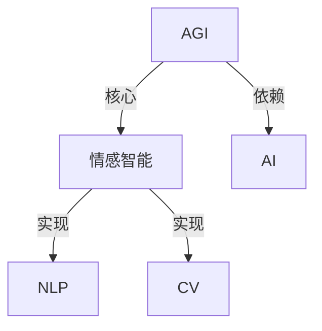
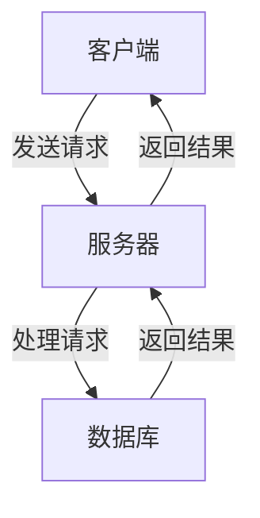
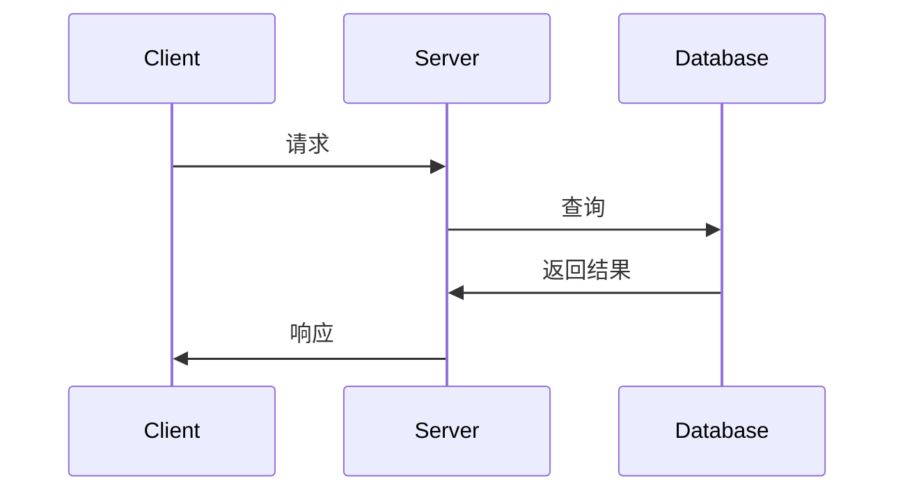

                 

### 《AGI的情感智能：理解与表达》

#### 关键词：AGI、情感智能、人工智能、算法、数学模型、系统设计、项目实战

#### 摘要：
本文将深入探讨人工智能（AI）领域中的一个前沿课题——情感智能（Emotion AI），特别是在人工通用智能（AGI）背景下的情感智能。我们将一步步分析情感智能的概念、算法原理、数学模型，以及其在系统设计与项目实战中的应用。本文的目标是为读者提供一个全面而详细的指南，帮助理解AGI的情感智能是如何被实现与表达的。

#### 目录大纲设计思路

在设计本文的目录大纲时，我们旨在提供一个清晰、层次分明的结构，使读者能够循序渐进地掌握每个关键知识点。以下是本文目录大纲的设计思路：

1. **背景介绍**：
   - 简要介绍AGI和情感智能的背景，阐述其重要性。
   - 阐明本书的目的和结构，让读者对全文有一个总体把握。

2. **核心概念与联系**：
   - 明确定义AGI和情感智能等核心概念。
   - 使用Mermaid流程图展示它们之间的关系，帮助读者直观理解。

3. **算法原理讲解**：
   - 详细介绍情感识别和表达算法的原理。
   - 结合Mermaid流程图和Python代码示例，确保读者能深入理解算法实现。

4. **数学模型和数学公式**：
   - 引入必要的数学模型和公式，使用LaTeX格式进行标注。
   - 通过详细的讲解和举例，使读者能够理解并应用这些公式。

5. **系统分析与架构设计方案**：
   - 描述一个典型的AGI情感智能系统场景。
   - 详细介绍系统的功能、架构设计、接口设计以及交互。

6. **项目实战**：
   - 通过实际项目案例，展示如何实现AGI情感智能。
   - 对项目的各个环节进行深入分析，提供实战经验和教训。

7. **最佳实践 tips、小结、注意事项、拓展阅读**：
   - 总结全文，提供实用的最佳实践建议。
   - 对项目进行小结，指出注意事项。
   - 推荐进一步阅读的材料，帮助读者深入学习。

#### 目录大纲示例

```markdown
----------------------------------------------------------------
# 《AGI的情感智能：理解与表达》

## 第一部分：背景介绍

### 1.1 问题背景
#### 1.1.1 AGI与情感智能
#### 1.1.2 当前挑战与需求

### 1.2 书籍目的
#### 1.2.1 理解AGI情感智能
#### 1.2.2 表达AGI情感智能

## 第二部分：核心概念与联系

### 2.1 AGI基础
#### 2.1.1 什么是AGI
#### 2.1.2 AGI的核心要素
#### 2.1.3 AGI的历史与发展

### 2.2 情感智能
#### 2.2.1 什么是情感智能
#### 2.2.2 情感智能的特性
#### 2.2.3 情感智能与AGI的关系

### 2.3 概念联系


## 第三部分：算法原理讲解

### 3.1 情感识别算法
#### 3.1.1 算法概述
#### 3.1.2 算法原理
#### 3.1.3 Python代码示例

### 3.2 情感表达算法
#### 3.2.1 算法概述
#### 3.2.2 算法原理
#### 3.2.3 Python代码示例

## 第四部分：数学模型和数学公式

### 4.1 情感识别模型
#### 4.1.1 数学模型
$$
P(A|B) = \frac{P(B|A)P(A)}{P(B)}
$$
#### 4.1.2 模型讲解
#### 4.1.3 举例说明

### 4.2 情感表达模型
#### 4.2.1 数学模型
$$
f(x) = a\cdot e^{-k\cdot x}
$$
#### 4.2.2 模型讲解
#### 4.2.3 举例说明

## 第五部分：系统分析与架构设计方案

### 5.1 系统场景介绍
#### 5.1.1 情感智能系统概述
#### 5.1.2 系统功能介绍

### 5.2 系统架构设计
#### 5.2.1 系统架构设计

#### 5.2.2 系统接口设计
#### 5.2.3 系统交互


## 第六部分：项目实战

### 6.1 项目介绍
#### 6.1.1 项目背景
#### 6.1.2 项目目标

### 6.2 系统核心实现
#### 6.2.1 环境安装
#### 6.2.2 系统核心代码
#### 6.2.3 代码应用解读

### 6.3 实际案例分析
#### 6.3.1 案例背景
#### 6.3.2 案例分析
#### 6.3.3 剖析与讲解

### 6.4 项目小结
#### 6.4.1 成功
#### 6.4.2 挑战
#### 6.4.3 教训

## 第七部分：最佳实践 tips、小结、注意事项、拓展阅读

### 7.1 最佳实践 tips
#### 7.1.1 开发技巧
#### 7.1.2 性能优化
#### 7.1.3 安全保障

### 7.2 小结
#### 7.2.1 本书的总结
#### 7.2.2 关键知识点回顾

### 7.3 注意事项
#### 7.3.1 使用中的注意事项
#### 7.3.2 可能遇到的问题及解决方案

### 7.4 拓展阅读
#### 7.4.1 推荐书籍
#### 7.4.2 推荐文章
#### 7.4.3 在线课程

----------------------------------------------------------------
```

这样的目录大纲能够确保文章内容的系统性和条理性，同时也能够吸引读者一步一步地深入了解情感智能在AGI中的应用。接下来，我们将根据这个大纲逐步展开详细的内容撰写。请随时让我知道您有任何问题或需要进一步的澄清。让我们开始这一逻辑清晰、结构紧凑的探讨之旅吧！

