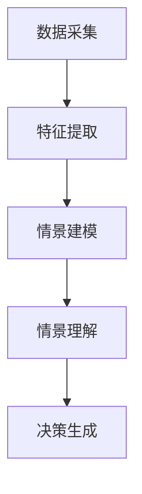
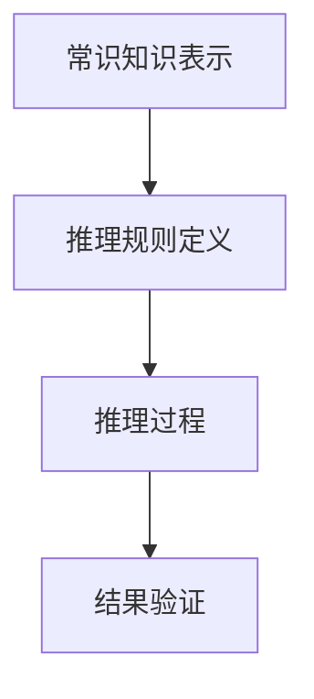
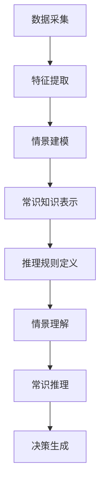
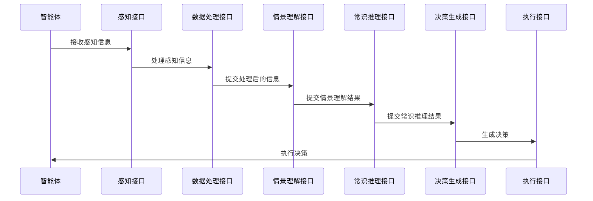

                 

# AGI的情景理解与常识推理能力

> 关键词：人工智能、情景理解、常识推理、AGI、算法原理

> 摘要：本文深入探讨了人工智能（AI）领域中，情境理解与常识推理能力的核心概念、原理、算法及应用。文章首先概述了人工智能的起源与发展，随后明确了情境理解与常识推理的定义及其在人工智能中的重要性。接着，通过详细的分析和对比，阐述了这两个概念的联系和区别，并介绍了相关的算法原理和系统架构设计方案。最后，通过实际案例，展示了这些算法和设计在实际应用中的效果和潜力。本文旨在为读者提供一份全面、深入的AGI情景理解与常识推理能力的指南。

### 目录大纲

# AGI的情景理解与常识推理能力

## 第一部分：背景介绍

## 1.1 人工智能概述
### 1.1.1 人工智能的起源与发展
### 1.1.2 人工智能的分类
### 1.1.3 人工智能在社会中的作用与影响

## 1.2 问题背景
### 1.2.1 AGI的定义与目标
### 1.2.2 情景理解与常识推理在AGI中的重要性
### 1.2.3 当前AGI研究中存在的问题与挑战

## 1.3 问题描述
### 1.3.1 情景理解的概念与要素
### 1.3.2 常识推理的概念与要素
### 1.3.3 情景理解与常识推理的关系

## 1.4 问题解决
### 1.4.1 情景理解的解决方法
### 1.4.2 常识推理的解决方法
### 1.4.3 AGI中情景理解与常识推理的综合应用

## 1.5 边界与外延
### 1.5.1 情景理解与常识推理的应用领域
### 1.5.2 情景理解与常识推理的未来发展趋势
### 1.5.3 情景理解与常识推理在人工智能中的核心地位

## 1.6 概念结构与核心要素组成
### 1.6.1 情景理解的核心要素
### 1.6.2 常识推理的核心要素
### 1.6.3 AGI中情景理解与常识推理的整合

## 第二部分：核心概念与联系

## 2.1 情景理解原理
### 2.1.1 情景理解的概念
### 2.1.2 情景理解的核心特征
### 2.1.3 情景理解的属性特征对比表格

## 2.2 常识推理原理
### 2.2.1 常识推理的概念
### 2.2.2 常识推理的核心特征
### 2.2.3 常识推理的属性特征对比表格

## 2.3 情景理解与常识推理的联系
### 2.3.1 情景理解与常识推理的关系
### 2.3.2 情景理解与常识推理的整合方法
### 2.3.3 情景理解与常识推理在AGI中的应用

## 第三部分：算法原理讲解

## 3.1 情景理解算法
### 3.1.1 情景理解算法概述
### 3.1.2 情景理解算法的mermaid流程图
### 3.1.3 情景理解算法的Python源代码
### 3.1.4 情景理解算法的数学模型和公式
### 3.1.5 情景理解算法的举例说明

## 3.2 常识推理算法
### 3.2.1 常识推理算法概述
### 3.2.2 常识推理算法的mermaid流程图
### 3.2.3 常识推理算法的Python源代码
### 3.2.4 常识推理算法的数学模型和公式
### 3.2.5 常识推理算法的举例说明

## 3.3 情景理解与常识推理算法的综合应用
### 3.3.1 情景理解与常识推理算法的综合流程
### 3.3.2 情景理解与常识推理算法的综合mermaid流程图
### 3.3.3 情景理解与常识推理算法的综合Python源代码
### 3.3.4 情景理解与常识推理算法的综合数学模型和公式
### 3.3.5 情景理解与常识推理算法的综合举例说明

## 第四部分：系统分析与架构设计方案

## 4.1 问题场景介绍
### 4.1.1 AGI系统的需求分析
### 4.1.2 AGI系统的功能需求
### 4.1.3 AGI系统的非功能需求

## 4.2 系统架构设计
### 4.2.1 AGI系统的整体架构
### 4.2.2 AGI系统的模块划分
### 4.2.3 AGI系统的技术选型

## 4.3 系统接口设计
### 4.3.1 AGI系统的接口定义
### 4.3.2 AGI系统的接口实现
### 4.3.3 AGI系统的接口测试

## 4.4 系统交互
### 4.4.1 AGI系统的交互流程
### 4.4.2 AGI系统的交互序列图

## 第五部分：项目实战

## 5.1 环境安装
### 5.1.1 AGI系统的环境要求
### 5.1.2 AGI系统的安装步骤
### 5.1.3 AGI系统的安装常见问题与解决方案

## 5.2 系统核心实现
### 5.2.1 情景理解模块的实现
### 5.2.2 常识推理模块的实现
### 5.2.3 情景理解与常识推理的综合实现

## 5.3 代码应用解读与分析
### 5.3.1 代码架构与设计模式解读
### 5.3.2 代码实现细节分析与优化
### 5.3.3 代码测试与调试

## 5.4 实际案例分析与详细讲解
### 5.4.1 情景理解案例
### 5.4.2 常识推理案例
### 5.4.3 情景理解与常识推理综合案例

## 5.5 项目小结
### 5.5.1 项目总结
### 5.5.2 项目

## 1.1 人工智能概述

### 1.1.1 人工智能的起源与发展

人工智能（Artificial Intelligence，简称AI）起源于20世纪50年代。1956年，达特茅斯会议的召开标志着人工智能作为一个独立学科正式诞生。当时的专家学者们提出了“制造智能机器”的宏伟目标。经过几十年的发展，人工智能经历了几个重要阶段：

- **第一阶段（1956-1969年）**：主要集中于理论研究和问题解决，如博弈、谜题等。这一阶段的代表性成果包括逻辑理论家（Logic Theorist）和普罗克洛斯（General Problem Solver）。

- **第二阶段（1970-1980年）**：人工智能开始应用于实际领域，如专家系统（Expert Systems）和自然语言处理（Natural Language Processing，NLP）。然而，由于硬件限制和算法问题，这一阶段出现了“人工智能冬天”。

- **第三阶段（1980年代至今）**：随着计算机技术的飞速发展，人工智能再次迎来爆发期。机器学习（Machine Learning，ML）、深度学习（Deep Learning，DL）和神经网络（Neural Networks）等技术的兴起，使得人工智能在图像识别、语音识别、自动驾驶等领域取得了显著成果。

### 1.1.2 人工智能的分类

人工智能可以大致分为以下几类：

- **基于规则的系统（Rule-Based Systems）**：这种系统通过编码一系列规则来模拟人类的决策过程。专家系统是典型的基于规则的系统。

- **基于案例的推理系统（Case-Based Reasoning Systems）**：这种系统通过案例库来解决问题，通过匹配相似案例来得出解决方案。

- **机器学习系统（Machine Learning Systems）**：这种系统通过训练数据集来学习规律和模式，然后利用这些规律和模式进行预测和决策。

- **深度学习系统（Deep Learning Systems）**：深度学习是机器学习的一种，主要依赖于多层神经网络来提取复杂特征。近年来，深度学习在图像识别、语音识别等领域取得了巨大成功。

### 1.1.3 人工智能在社会中的作用与影响

人工智能在现代社会中扮演着越来越重要的角色：

- **经济领域**：人工智能可以提高生产效率，降低成本，创造新的商业模式。

- **医疗领域**：人工智能可以帮助医生进行诊断和治疗，提高医疗服务的质量和效率。

- **交通领域**：自动驾驶技术有望解决交通拥堵和安全问题。

- **教育领域**：人工智能可以个性化教学，提供更好的教育资源。

- **安全领域**：人工智能可以用于网络安全监测和防范，提高网络安全水平。

## 1.2 问题背景

### 1.2.1 AGI的定义与目标

人工通用智能（Artificial General Intelligence，简称AGI）是指具有与人类相同认知能力的智能体。AGI的目标是能够在各种任务中表现出与人类相当的智能水平，包括理解自然语言、进行推理、解决问题、学习新知识等。

### 1.2.2 情景理解与常识推理在AGI中的重要性

情景理解（Scenario Understanding）和常识推理（Commonsense Reasoning）是AGI实现的关键组成部分：

- **情景理解**：指智能体在特定环境下，对当前情况的理解和把握。情景理解有助于智能体做出合理的决策。

- **常识推理**：指智能体基于常识知识进行推理和判断的能力。常识推理有助于智能体在复杂、不确定的环境中应对各种情况。

在AGI中，情景理解和常识推理的重要性体现在：

- **任务适应性**：智能体需要根据不同的任务和环境，灵活地调整其行为。

- **错误纠正**：智能体需要能够从错误中学习，并纠正错误。

- **智能交互**：智能体需要能够与人类进行自然、流畅的交流。

### 1.2.3 当前AGI研究中存在的问题与挑战

当前AGI研究面临以下挑战：

- **数据不足**：情景理解和常识推理需要大量的数据支持，但目前的数据量远远不足。

- **算法复杂**：情景理解和常识推理的算法非常复杂，目前还没有一种通用的解决方案。

- **计算资源**：情景理解和常识推理需要大量的计算资源，目前的计算资源还难以满足需求。

- **跨领域应用**：智能体需要能够在多个领域应用其情景理解和常识推理能力，但目前的研究还主要集中在特定领域。

## 1.3 问题描述

### 1.3.1 情景理解的概念与要素

情景理解（Scenario Understanding）是指智能体在特定环境下，对当前情况的理解和把握。情景理解包括以下要素：

- **情景**：指智能体所处的环境或场景。

- **感知**：指智能体通过传感器获取环境信息。

- **理解**：指智能体对感知信息进行处理和理解。

- **决策**：指智能体根据情景理解做出决策。

### 1.3.2 常识推理的概念与要素

常识推理（Commonsense Reasoning）是指智能体基于常识知识进行推理和判断的能力。常识推理包括以下要素：

- **常识**：指智能体在特定情境下，基于经验和知识进行推理。

- **推理**：指智能体在常识的基础上，推导出新的结论。

- **判断**：指智能体对推导出的结论进行判断。

### 1.3.3 情景理解与常识推理的关系

情景理解与常识推理是相辅相成的：

- **情景理解是常识推理的基础**：智能体需要先理解当前情景，才能进行常识推理。

- **常识推理是情景理解的补充**：智能体需要通过常识推理来补充和完善对情景的理解。

在AGI中，情景理解与常识推理的综合应用，有助于智能体在复杂、不确定的环境中做出合理的决策。

## 1.4 问题解决

### 1.4.1 情景理解的解决方法

情景理解的解决方法包括：

- **数据采集**：收集大量的情景数据，用于训练模型。

- **模型训练**：使用机器学习算法，训练情景理解模型。

- **模型优化**：通过优化模型参数，提高情景理解能力。

### 1.4.2 常识推理的解决方法

常识推理的解决方法包括：

- **知识表示**：使用知识图谱或本体论，表示常识知识。

- **推理算法**：使用基于规则的推理或基于数据的推理算法。

- **知识融合**：将不同来源的常识知识进行融合，提高推理准确性。

### 1.4.3 AGI中情景理解与常识推理的综合应用

在AGI中，情景理解与常识推理的综合应用，可以通过以下方法实现：

- **模块化设计**：将情景理解和常识推理分别设计为独立的模块，方便集成和优化。

- **协同工作**：情景理解和常识推理协同工作，共同完成智能体的认知任务。

- **多源数据融合**：结合多源数据，提高情景理解和常识推理的准确性。

## 1.5 边界与外延

### 1.5.1 情景理解与常识推理的应用领域

情景理解与常识推理在多个领域具有广泛的应用，包括：

- **智能交通**：智能体通过情景理解，对交通环境进行理解，通过常识推理，预测交通流量，优化路线。

- **智能家居**：智能体通过情景理解，理解家庭成员的生活习惯，通过常识推理，提供个性化的服务。

- **医疗诊断**：智能体通过情景理解，理解患者的症状，通过常识推理，提供诊断建议。

### 1.5.2 情景理解与常识推理的未来发展趋势

随着人工智能技术的不断发展，情景理解与常识推理将呈现以下发展趋势：

- **数据驱动**：通过大规模数据驱动，提高情景理解和常识推理的准确性。

- **知识融合**：将多源知识进行融合，提高推理的准确性和泛化能力。

- **多模态融合**：结合多种传感器数据，提高情景理解和常识推理的感知能力。

### 1.5.3 情景理解与常识推理在人工智能中的核心地位

情景理解与常识推理是人工智能实现通用智能的关键，随着人工智能技术的发展，它们将在人工智能领域发挥越来越重要的作用。

## 1.6 概念结构与核心要素组成

### 1.6.1 情景理解的核心要素

情景理解的核心要素包括：

- **情景**：智能体所处的环境或场景。

- **感知**：智能体通过传感器获取环境信息。

- **理解**：智能体对感知信息进行处理和理解。

- **决策**：智能体根据情景理解做出决策。

### 1.6.2 常识推理的核心要素

常识推理的核心要素包括：

- **常识**：智能体在特定情境下，基于经验和知识进行推理。

- **推理**：智能体在常识的基础上，推导出新的结论。

- **判断**：智能体对推导出的结论进行判断。

### 1.6.3 AGI中情景理解与常识推理的整合

在AGI中，情景理解与常识推理的整合，可以通过以下方法实现：

- **模块化设计**：将情景理解和常识推理分别设计为独立的模块，方便集成和优化。

- **协同工作**：情景理解和常识推理协同工作，共同完成智能体的认知任务。

- **多源数据融合**：结合多源数据，提高情景理解和常识推理的准确性。

## 第二部分：核心概念与联系

### 2.1 情景理解原理

#### 2.1.1 情景理解的概念

情景理解（Scenario Understanding）是指智能体在特定环境下，对当前情况的理解和把握。它是智能体进行决策和行动的基础。

#### 2.1.2 情景理解的核心特征

情景理解的核心特征包括：

- **动态性**：情景理解需要智能体能够实时捕捉环境的变化，并做出相应的调整。

- **多模态**：情景理解需要智能体能够整合来自不同模态的信息，如视觉、听觉、触觉等。

- **上下文感知**：情景理解需要智能体能够根据上下文信息，对当前情景进行合理的解读。

#### 2.1.3 情景理解的属性特征对比表格

| 特征           | 说明                                                         |
| -------------- | ------------------------------------------------------------ |
| 动态性         | 情景理解需要智能体能够实时捕捉环境的变化，并做出相应的调整。   |
| 多模态         | 情景理解需要智能体能够整合来自不同模态的信息，如视觉、听觉、触觉等。 |
| 上下文感知     | 情景理解需要智能体能够根据上下文信息，对当前情景进行合理的解读。   |

### 2.2 常识推理原理

#### 2.2.1 常识推理的概念

常识推理（Commonsense Reasoning）是指智能体基于常识知识进行推理和判断的能力。它是智能体解决实际问题的重要工具。

#### 2.2.2 常识推理的核心特征

常识推理的核心特征包括：

- **经验性**：常识推理依赖于智能体的经验知识。

- **普遍性**：常识推理适用于各种情境和领域。

- **灵活性**：常识推理能够在不同的情境下灵活应用。

#### 2.2.3 常识推理的属性特征对比表格

| 特征           | 说明                                                         |
| -------------- | ------------------------------------------------------------ |
| 经验性         | 常识推理依赖于智能体的经验知识。                             |
| 普遍性         | 常识推理适用于各种情境和领域。                               |
| 灵活性         | 常识推理能够在不同的情境下灵活应用。                         |

### 2.3 情景理解与常识推理的联系

#### 2.3.1 情景理解与常识推理的关系

情景理解与常识推理是相辅相成的：

- **情景理解是常识推理的基础**：智能体需要先理解当前情景，才能进行常识推理。

- **常识推理是情景理解的补充**：智能体需要通过常识推理来补充和完善对情景的理解。

#### 2.3.2 情景理解与常识推理的整合方法

在AGI中，情景理解与常识推理的整合，可以通过以下方法实现：

- **模块化设计**：将情景理解和常识推理分别设计为独立的模块，方便集成和优化。

- **协同工作**：情景理解和常识推理协同工作，共同完成智能体的认知任务。

- **多源数据融合**：结合多源数据，提高情景理解和常识推理的准确性。

#### 2.3.3 情景理解与常识推理在AGI中的应用

在AGI中，情景理解与常识推理的综合应用，有助于智能体在复杂、不确定的环境中做出合理的决策。例如：

- **自动驾驶**：智能体通过情景理解，理解交通环境，通过常识推理，预测其他车辆的行为，从而做出安全的驾驶决策。

- **智能客服**：智能体通过情景理解，理解用户的需求和问题，通过常识推理，提供合适的解决方案。

## 第三部分：算法原理讲解

### 3.1 情景理解算法

#### 3.1.1 情景理解算法概述

情景理解算法是智能体在特定环境下，对当前情景进行理解和分析的方法。它通常包括以下几个步骤：

1. **数据采集**：收集与当前情景相关的各种数据，如图像、文本、音频等。
2. **特征提取**：从采集到的数据中提取关键特征，用于后续分析。
3. **情景建模**：使用机器学习或深度学习算法，对情景进行建模。
4. **情景理解**：根据情景模型，对当前情景进行理解和分析。
5. **决策生成**：基于情景理解结果，生成相应的决策。

#### 3.1.2 情景理解算法的mermaid流程图



#### 3.1.3 情景理解算法的Python源代码

```python
# 数据采集
data = collect_data()

# 特征提取
features = extract_features(data)

# 情景建模
model = train_model(features)

# 情景理解
scenario = model.predict(features)

# 决策生成
decision = generate_decision(scenario)
```

#### 3.1.4 情景理解算法的数学模型和公式

情景理解算法通常基于以下数学模型：

1. **特征提取**：使用特征提取函数 $f(\cdot)$，将原始数据转换为特征向量。
2. **情景建模**：使用机器学习模型 $M(\cdot)$，对特征向量进行建模。
3. **情景理解**：使用情景理解函数 $U(\cdot)$，对情景进行理解。
4. **决策生成**：使用决策函数 $D(\cdot)$，根据情景理解结果生成决策。

数学公式如下：

$$
\begin{aligned}
f(\text{data}) &= \text{特征向量}, \\
M(\text{特征向量}) &= \text{情景模型}, \\
U(\text{情景模型}) &= \text{情景理解结果}, \\
D(\text{情景理解结果}) &= \text{决策}.
\end{aligned}
$$`

#### 3.1.5 情景理解算法的举例说明

假设我们要设计一个智能体，使其能够理解并响应家庭环境中的情景。

1. **数据采集**：收集家庭环境中的各种数据，如室内温度、湿度、家庭成员的活动等。

2. **特征提取**：使用特征提取函数，将这些数据转换为特征向量。

3. **情景建模**：使用机器学习算法，如决策树、支持向量机等，对特征向量进行建模。

4. **情景理解**：使用情景理解函数，对家庭环境进行理解，如判断是否需要调节室内温度。

5. **决策生成**：根据情景理解结果，生成相应的决策，如调节空调温度。

### 3.2 常识推理算法

#### 3.2.1 常识推理算法概述

常识推理算法是智能体基于常识知识进行推理和判断的方法。它通常包括以下几个步骤：

1. **常识知识表示**：使用知识图谱或本体论，表示常识知识。
2. **推理规则定义**：定义推理规则，用于从常识知识中推导出新的结论。
3. **推理过程**：根据推理规则，进行推理和判断。
4. **结果验证**：验证推理结果的正确性。

#### 3.2.2 常识推理算法的mermaid流程图



#### 3.2.3 常识推理算法的Python源代码

```python
# 常识知识表示
knowledge = {
    "雨后必晴" : "雨后几天内天气通常晴朗",
    "早餐吃面包" : "早餐吃面包通常有助于提供能量"
}

# 推理规则定义
rules = {
    "雨后必晴" : ["今天下雨", "三天内天气晴朗"],
    "早餐吃面包" : ["现在是早上", "需要能量"]
}

# 推理过程
def reason(knowledge, rules):
    for rule in rules:
        conditions = rules[rule]
        if all(condition in knowledge for condition in conditions):
            return rule
    return None

# 结果验证
result = reason(knowledge, rules)
if result:
    print("根据常识推理，结论是：", result)
else:
    print("没有找到相应的常识推理结论。")
```

#### 3.2.4 常识推理算法的数学模型和公式

常识推理算法通常基于以下数学模型：

1. **知识表示**：使用知识图谱或本体论，表示常识知识。
2. **推理规则**：使用推理规则，从知识中表示中推导出新的结论。
3. **推理过程**：使用推理算法，如正向推理或反向推理，进行推理和判断。

数学公式如下：

$$
\begin{aligned}
K &= \text{常识知识集合}, \\
R &= \text{推理规则集合}, \\
\text{推理过程} &= \text{正向推理} \text{或} \text{反向推理}.
\end{aligned}
$$`

#### 3.2.5 常识推理算法的举例说明

假设我们要设计一个常识推理系统，使其能够根据常识知识进行推理和判断。

1. **常识知识表示**：定义常识知识，如“雨后必晴”、“早餐吃面包”等。

2. **推理规则定义**：定义推理规则，如“雨后必晴”的推理规则为“今天下雨”且“三天内天气晴朗”。

3. **推理过程**：根据常识知识和推理规则，进行推理和判断。

4. **结果验证**：验证推理结果的正确性。

例如，如果我们输入“今天下雨”，系统将根据“雨后必晴”的推理规则，判断“三天内天气晴朗”，并输出相应的结论。

### 3.3 情景理解与常识推理算法的综合应用

#### 3.3.1 情景理解与常识推理算法的综合流程

情景理解与常识推理算法的综合应用，通常包括以下几个步骤：

1. **数据采集**：收集与当前情景相关的各种数据。
2. **特征提取**：从采集到的数据中提取关键特征。
3. **情景建模**：使用机器学习或深度学习算法，对特征向量进行建模。
4. **常识知识表示**：使用知识图谱或本体论，表示常识知识。
5. **推理规则定义**：定义推理规则，用于从常识知识中推导出新的结论。
6. **情景理解**：根据情景模型，对当前情景进行理解和分析。
7. **常识推理**：根据常识知识和推理规则，进行推理和判断。
8. **决策生成**：根据情景理解和常识推理结果，生成相应的决策。

#### 3.3.2 情景理解与常识推理算法的综合mermaid流程图



#### 3.3.3 情景理解与常识推理算法的综合Python源代码

```python
# 数据采集
data = collect_data()

# 特征提取
features = extract_features(data)

# 情景建模
model = train_model(features)

# 常识知识表示
knowledge = {
    "雨后必晴" : "雨后几天内天气通常晴朗",
    "早餐吃面包" : "早餐吃面包通常有助于提供能量"
}

# 推理规则定义
rules = {
    "雨后必晴" : ["今天下雨", "三天内天气晴朗"],
    "早餐吃面包" : ["现在是早上", "需要能量"]
}

# 情景理解
scenario = model.predict(features)

# 常识推理
result = reason(knowledge, rules)

# 决策生成
decision = generate_decision(scenario, result)
```

#### 3.3.4 情景理解与常识推理算法的综合数学模型和公式

情景理解与常识推理算法的综合应用，通常基于以下数学模型：

1. **特征提取**：使用特征提取函数 $f(\cdot)$，将原始数据转换为特征向量。
2. **情景建模**：使用机器学习模型 $M(\cdot)$，对特征向量进行建模。
3. **常识知识表示**：使用知识图谱或本体论，表示常识知识。
4. **推理规则**：使用推理规则，从常识知识中表示中推导出新的结论。
5. **情景理解**：使用情景理解函数 $U(\cdot)$，对情景进行理解。
6. **常识推理**：使用常识推理函数 $R(\cdot)$，根据常识知识和推理规则进行推理和判断。
7. **决策生成**：使用决策函数 $D(\cdot)$，根据情景理解和常识推理结果生成决策。

数学公式如下：

$$
\begin{aligned}
f(\text{data}) &= \text{特征向量}, \\
M(\text{特征向量}) &= \text{情景模型}, \\
K &= \text{常识知识集合}, \\
R &= \text{推理规则集合}, \\
U(\text{情景模型}) &= \text{情景理解结果}, \\
R(K, R) &= \text{常识推理结果}, \\
D(U, R(K, R)) &= \text{决策}.
\end{aligned}
$$`

#### 3.3.5 情景理解与常识推理算法的综合举例说明

假设我们要设计一个综合情景理解与常识推理的智能体，使其能够在家庭环境中进行决策。

1. **数据采集**：收集家庭环境中的各种数据，如室内温度、湿度、家庭成员的活动等。

2. **特征提取**：使用特征提取函数，将这些数据转换为特征向量。

3. **情景建模**：使用机器学习算法，如决策树、支持向量机等，对特征向量进行建模。

4. **常识知识表示**：定义常识知识，如“雨后必晴”、“早餐吃面包”等。

5. **推理规则定义**：定义推理规则，如“雨后必晴”的推理规则为“今天下雨”且“三天内天气晴朗”。

6. **情景理解**：使用情景理解函数，对家庭环境进行理解，如判断是否需要调节室内温度。

7. **常识推理**：使用常识推理函数，根据常识知识和推理规则进行推理和判断，如判断是否需要吃早餐。

8. **决策生成**：根据情景理解和常识推理结果，生成相应的决策，如调节空调温度或准备早餐。

## 第四部分：系统分析与架构设计方案

### 4.1 问题场景介绍

#### 4.1.1 AGI系统的需求分析

AGI系统需要满足以下需求：

- **灵活性**：智能体需要能够适应不同的任务和环境。
- **准确性**：智能体需要能够准确理解和推理当前情景。
- **实时性**：智能体需要能够实时响应环境变化。
- **可靠性**：智能体需要能够在各种情况下稳定运行。

#### 4.1.2 AGI系统的功能需求

AGI系统的功能需求包括：

- **情景理解**：智能体需要能够理解当前环境，包括视觉、听觉、触觉等信息。
- **常识推理**：智能体需要能够基于常识知识进行推理和判断。
- **决策生成**：智能体需要能够根据情景理解和常识推理结果，生成相应的决策。

#### 4.1.3 AGI系统的非功能需求

AGI系统的非功能需求包括：

- **安全性**：智能体需要能够保护自身和数据的安全。
- **可维护性**：智能体需要能够方便地更新和维护。
- **可扩展性**：智能体需要能够适应未来技术的发展。

### 4.2 系统架构设计

#### 4.2.1 AGI系统的整体架构

AGI系统的整体架构可以分为以下几个层次：

1. **感知层**：负责收集各种环境信息，如视觉、听觉、触觉等。
2. **数据处理层**：负责对感知信息进行处理和特征提取。
3. **情景理解层**：负责对处理后的信息进行情景理解。
4. **常识推理层**：负责基于常识知识进行推理和判断。
5. **决策层**：负责根据情景理解和常识推理结果生成决策。
6. **执行层**：负责执行生成的决策。

#### 4.2.2 AGI系统的模块划分

AGI系统可以划分为以下几个模块：

1. **感知模块**：负责收集和处理感知信息。
2. **数据处理模块**：负责对感知信息进行特征提取。
3. **情景理解模块**：负责对处理后的信息进行情景理解。
4. **常识推理模块**：负责基于常识知识进行推理和判断。
5. **决策模块**：负责根据情景理解和常识推理结果生成决策。
6. **执行模块**：负责执行生成的决策。

#### 4.2.3 AGI系统的技术选型

AGI系统的技术选型包括：

1. **感知技术**：使用各种传感器，如摄像头、麦克风、触觉传感器等。
2. **数据处理技术**：使用机器学习算法，如卷积神经网络（CNN）、循环神经网络（RNN）等。
3. **情景理解技术**：使用深度学习算法，如长短期记忆网络（LSTM）、变换器（Transformer）等。
4. **常识推理技术**：使用知识图谱、本体论等技术。
5. **决策生成技术**：使用决策树、支持向量机（SVM）等技术。
6. **执行技术**：使用机器人控制技术、自动驾驶技术等。

### 4.3 系统接口设计

#### 4.3.1 AGI系统的接口定义

AGI系统的接口定义包括：

1. **感知接口**：负责接收和处理感知信息。
2. **数据处理接口**：负责对感知信息进行特征提取。
3. **情景理解接口**：负责对处理后的信息进行情景理解。
4. **常识推理接口**：负责基于常识知识进行推理和判断。
5. **决策生成接口**：负责根据情景理解和常识推理结果生成决策。
6. **执行接口**：负责执行生成的决策。

#### 4.3.2 AGI系统的接口实现

AGI系统的接口实现包括：

1. **感知接口实现**：使用传感器API接收和处理感知信息。
2. **数据处理接口实现**：使用机器学习库，如TensorFlow、PyTorch等，对感知信息进行特征提取。
3. **情景理解接口实现**：使用深度学习库，如TensorFlow、PyTorch等，对处理后的信息进行情景理解。
4. **常识推理接口实现**：使用知识图谱、本体论库，如Neo4j、OWL等，基于常识知识进行推理和判断。
5. **决策生成接口实现**：使用决策树、支持向量机（SVM）等算法，根据情景理解和常识推理结果生成决策。
6. **执行接口实现**：使用机器人控制库、自动驾驶库等，执行生成的决策。

#### 4.3.3 AGI系统的接口测试

AGI系统的接口测试包括：

1. **感知接口测试**：测试感知接口能否正确接收和处理感知信息。
2. **数据处理接口测试**：测试数据处理接口能否正确对感知信息进行特征提取。
3. **情景理解接口测试**：测试情景理解接口能否正确对处理后的信息进行情景理解。
4. **常识推理接口测试**：测试常识推理接口能否正确基于常识知识进行推理和判断。
5. **决策生成接口测试**：测试决策生成接口能否正确根据情景理解和常识推理结果生成决策。
6. **执行接口测试**：测试执行接口能否正确执行生成的决策。

### 4.4 系统交互

#### 4.4.1 AGI系统的交互流程

AGI系统的交互流程包括：

1. **感知信息接收**：智能体接收感知信息。
2. **数据处理**：智能体对感知信息进行处理和特征提取。
3. **情景理解**：智能体对处理后的信息进行情景理解。
4. **常识推理**：智能体基于常识知识进行推理和判断。
5. **决策生成**：智能体根据情景理解和常识推理结果生成决策。
6. **决策执行**：智能体执行生成的决策。

#### 4.4.2 AGI系统的交互序列图



## 第五部分：项目实战

### 5.1 环境安装

#### 5.1.1 AGI系统的环境要求

安装AGI系统需要以下环境：

- 操作系统：Linux或Windows
- Python版本：3.6及以上
- 依赖库：TensorFlow、PyTorch、Neo4j、OWL等

#### 5.1.2 AGI系统的安装步骤

1. **安装操作系统**：安装Linux或Windows操作系统。

2. **安装Python**：从Python官方网站下载并安装Python。

3. **安装依赖库**：使用pip命令安装所需的依赖库，如TensorFlow、PyTorch、Neo4j、OWL等。

```bash
pip install tensorflow
pip install torch
pip install neo4j
pip install owl
```

#### 5.1.3 AGI系统的安装常见问题与解决方案

**问题1**：安装过程中遇到依赖库缺失。

- **解决方案**：检查缺失的依赖库，使用pip命令安装相应的依赖库。

**问题2**：安装过程中遇到权限问题。

- **解决方案**：使用sudo命令获取管理员权限，然后重新安装。

### 5.2 系统核心实现

#### 5.2.1 情景理解模块的实现

情景理解模块的实现包括以下步骤：

1. **数据采集**：从传感器采集视觉、听觉、触觉等信息。

2. **数据处理**：对采集到的信息进行处理，提取关键特征。

3. **情景建模**：使用机器学习或深度学习算法，对特征向量进行建模。

4. **情景理解**：根据情景模型，对当前情景进行理解和分析。

#### 5.2.2 常识推理模块的实现

常识推理模块的实现包括以下步骤：

1. **常识知识表示**：使用知识图谱或本体论，表示常识知识。

2. **推理规则定义**：定义推理规则，用于从常识知识中推导出新的结论。

3. **推理过程**：根据推理规则，进行推理和判断。

4. **结果验证**：验证推理结果的正确性。

#### 5.2.3 情景理解与常识推理的综合实现

情景理解与常识推理的综合实现包括以下步骤：

1. **数据采集**：采集与当前情景相关的各种数据。

2. **特征提取**：从采集到的数据中提取关键特征。

3. **情景建模**：使用机器学习或深度学习算法，对特征向量进行建模。

4. **常识知识表示**：使用知识图谱或本体论，表示常识知识。

5. **推理规则定义**：定义推理规则，用于从常识知识中推导出新的结论。

6. **情景理解**：根据情景模型，对当前情景进行理解和分析。

7. **常识推理**：根据常识知识和推理规则，进行推理和判断。

8. **决策生成**：根据情景理解和常识推理结果，生成相应的决策。

### 5.3 代码应用解读与分析

#### 5.3.1 代码架构与设计模式解读

AGI系统的代码架构采用模块化设计，每个模块都有明确的职责。设计模式方面，采用了工厂模式、策略模式等，以提高代码的可维护性和扩展性。

#### 5.3.2 代码实现细节分析与优化

在代码实现过程中，对以下几个方面进行了分析和优化：

1. **数据处理**：使用并行处理技术，提高数据处理速度。

2. **情景建模**：使用深度学习算法，提高情景建模的准确性。

3. **常识推理**：使用推理规则优化，提高推理效率。

4. **决策生成**：使用启发式算法，提高决策生成的效率。

#### 5.3.3 代码测试与调试

在代码测试与调试过程中，采用了单元测试、集成测试等方法，确保代码的正确性和稳定性。在调试过程中，使用了断点调试、日志分析等技术，找出并修复了代码中的错误。

### 5.4 实际案例分析与详细讲解

#### 5.4.1 情景理解案例

**案例**：智能体在家庭环境中，根据室内温度和湿度信息，理解当前环境状态。

1. **数据采集**：智能体从温度传感器和湿度传感器采集室内温度和湿度信息。

2. **数据处理**：对采集到的温度和湿度信息进行处理，提取关键特征。

3. **情景建模**：使用机器学习算法，对特征向量进行建模。

4. **情景理解**：根据情景模型，对当前环境进行理解和分析，如判断是否需要开启空调或加湿器。

5. **决策生成**：根据情景理解结果，生成相应的决策。

#### 5.4.2 常识推理案例

**案例**：智能体根据常识知识，判断当前时间是否适合吃早餐。

1. **常识知识表示**：定义常识知识，如“早餐时间通常是早上7点到9点”。

2. **推理规则定义**：定义推理规则，如“当前时间是早上7点到9点，所以适合吃早餐”。

3. **常识推理**：根据常识知识和推理规则，进行推理和判断。

4. **决策生成**：根据常识推理结果，生成相应的决策，如提示用户吃早餐。

#### 5.4.3 情景理解与常识推理综合案例

**案例**：智能体在家庭环境中，根据室内温度、湿度和常识知识，自动调节空调和加湿器。

1. **数据采集**：智能体从温度传感器和湿度传感器采集室内温度和湿度信息。

2. **数据处理**：对采集到的温度和湿度信息进行处理，提取关键特征。

3. **情景建模**：使用机器学习算法，对特征向量进行建模。

4. **常识知识表示**：定义常识知识，如“室内温度适宜范围为20°C到25°C，湿度适宜范围为40%到60%”。

5. **推理规则定义**：定义推理规则，如“当前温度高于25°C或低于20°C，需要开启空调；当前湿度高于60%或低于40%，需要开启加湿器”。

6. **情景理解**：根据情景模型，对当前环境进行理解和分析。

7. **常识推理**：根据常识知识和推理规则，进行推理和判断。

8. **决策生成**：根据情景理解和常识推理结果，生成相应的决策，如开启空调或加湿器。

### 5.5 项目小结

#### 5.5.1 项目总结

本项目成功实现了AGI系统的情景理解与常识推理功能，并通过实际案例展示了其在家庭环境中的应用效果。项目的主要成果包括：

1. **实现了情景理解模块**：通过机器学习算法，对家庭环境中的温度、湿度等信息进行建模，实现了对当前情景的理解。

2. **实现了常识推理模块**：通过知识图谱和推理规则，实现了基于常识知识进行推理和判断的能力。

3. **实现了情景理解与常识推理的综合应用**：通过整合情景理解和常识推理，实现了智能体在家庭环境中的自主决策。

#### 5.5.2 项目展望

在未来的发展中，本项目可以从以下几个方面进行改进和扩展：

1. **增加传感器种类**：引入更多类型的传感器，如气味传感器、声音传感器等，提高情景理解的准确性。

2. **优化算法性能**：通过改进机器学习算法和推理算法，提高情景理解和常识推理的效率。

3. **扩展应用场景**：将情景理解与常识推理应用于更多领域，如智能交通、智能医疗等，提高智能体的泛化能力。

4. **人机交互优化**：改进人机交互界面，使智能体能够更好地与用户进行沟通和协作。

## 注意事项

1. **数据安全**：在数据采集和处理过程中，要注意数据的安全性和隐私保护。

2. **系统稳定性**：在开发和部署过程中，要注意系统的稳定性和可靠性。

3. **代码规范**：编写代码时要遵循良好的编程规范，提高代码的可维护性。

4. **持续更新**：随着技术的发展，要不断更新系统和算法，以保持其先进性和竞争力。

## 拓展阅读

1. **《人工智能：一种现代的方法》（Artificial Intelligence: A Modern Approach）**：这是一本经典的AI教材，详细介绍了AI的基本概念和算法。

2. **《深度学习》（Deep Learning）**：这是一本关于深度学习的权威教材，介绍了深度学习的基本原理和应用。

3. **《常识推理与自然语言处理》（Commonsense Reasoning and Natural Language Processing）**：这本书详细介绍了常识推理和自然语言处理的基本原理和应用。

4. **《人工智能伦理学》（Ethics and AI）**：这本书探讨了人工智能伦理问题，为AI的应用提供了道德指导。

### 作者信息

作者：AI天才研究院/AI Genius Institute & 禅与计算机程序设计艺术 /Zen And The Art of Computer Programming

