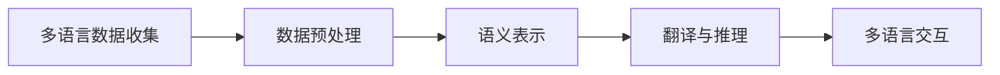
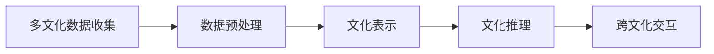
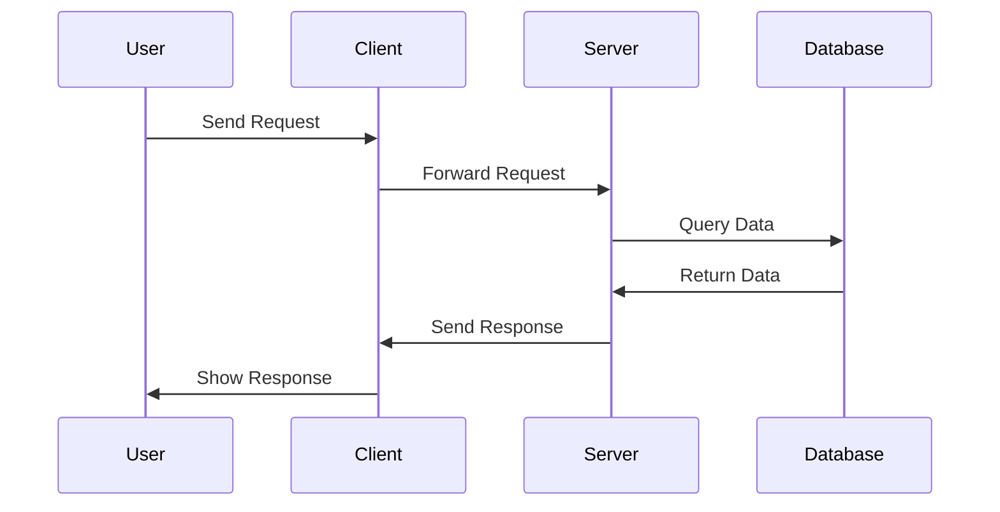
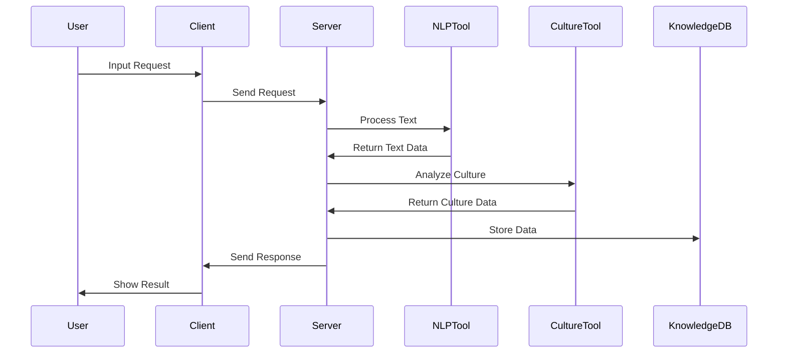

                 

# AGI的文化理解能力：跨语言与跨文化

关键词：AGI，文化理解能力，跨语言，跨文化，人工智能

摘要：本文将深入探讨人工智能（AGI）的文化理解能力，特别是其在跨语言与跨文化领域的应用。通过对AGI与文化理解能力的基本概念、算法原理以及系统架构设计的详细分析，本文旨在为读者提供一个清晰、系统且具有前瞻性的技术视角。我们将一步步思考，如何通过技术手段提升AGI的文化理解能力，以应对日益复杂的全球化和多元文化背景。

## 目录大纲

1. **第一部分: AGI的文化理解能力概述**
    1.1 **问题背景**
    1.2 **问题描述**
    1.3 **问题解决**
    1.4 **边界与外延**
    1.5 **本章小结**
2. **第二部分: 核心概念与联系**
    2.1 **核心概念原理**
    2.2 **概念属性特征对比**
    2.3 **ER实体关系图架构**
3. **第三部分: 算法原理讲解**
    3.1 **文化理解算法原理**
    3.2 **跨语言算法原理**
    3.3 **跨文化算法原理**
4. **第四部分: 系统分析与架构设计方案**
    4.1 **问题场景介绍**
    4.2 **系统功能设计**
    4.3 **系统架构设计**
    4.4 **系统接口设计**
    4.5 **系统交互**
5. **第五部分: 项目实战**
    5.1 **环境安装**
    5.2 **系统核心实现源代码**
    5.3 **代码应用解读与分析**
    5.4 **实际案例分析与详细讲解剖析**
    5.5 **项目小结**

## 第一部分: AGI的文化理解能力概述

### 第1章: 问题背景

#### 1.1 问题背景

##### 1.1.1 AGI的定义与重要性

**AGI**（Artificial General Intelligence），即人工通用智能，指的是一种能够执行任何智能体都能执行的智能任务的能力。与当前主流的AI（如深度学习、强化学习）不同，AGI不仅能在特定任务上表现出色，而且能够在多个领域和任务中表现出普适性。AGI的潜在应用场景广泛，包括医疗诊断、自动驾驶、智能客服等，其对人类社会的影响不可估量。

##### 1.1.2 当前AI技术的局限

虽然AI技术在许多领域取得了显著的进展，但目前的AI系统仍存在一些局限性。首先，大多数AI系统是针对特定任务进行优化的，缺乏泛化能力。其次，AI系统在处理非结构化数据时（如自然语言处理、图像识别等）效果有限。最后，AI系统缺乏对人类文化和社会习俗的理解能力，这在跨语言和跨文化的应用中尤为明显。

##### 1.1.3 文化理解能力在AGI中的地位

文化理解能力是AGI的重要组成部分。文化理解能力不仅涉及语言和符号的理解，还包括对人类价值观、习俗、信仰和社会规范的理解。这种能力对于AGI实现跨语言和跨文化的交互至关重要。一个具有文化理解能力的AGI系统能够更好地适应不同文化和语言环境，提供更加自然和有效的服务。

#### 1.2 问题描述

##### 1.2.1 文化理解的复杂性

文化理解是一个复杂的过程，它涉及到对语言、符号、习俗、价值观等多方面的理解。不同文化之间的差异使得文化理解变得更加复杂。例如，某些在一种文化中被视为礼貌的行为，在另一种文化中可能被认为是不礼貌或不合适的。

##### 1.2.2 跨语言与跨文化的挑战

跨语言和跨文化的挑战主要体现在以下几个方面：

- **语言差异**：不同语言的结构、语法和词汇差异巨大，使得AI系统在处理跨语言任务时面临巨大挑战。
- **文化差异**：不同文化之间的价值观、习俗和信仰差异巨大，这影响了AI系统对跨文化内容的理解和处理。
- **知识融合**：不同文化和语言的知识的融合和整合是一个复杂的问题，这需要AI系统具备强大的知识表示和推理能力。

##### 1.2.3 文化理解能力的必要性

在全球化日益深入的今天，跨语言和跨文化的交流变得越来越频繁。一个具备文化理解能力的AGI系统能够更好地支持这种交流，提供更加自然和有效的服务。例如，在医疗领域，一个具备文化理解能力的AGI系统可以更好地理解患者的需求和文化背景，提供更加个性化的治疗方案。

#### 1.3 问题解决

##### 1.3.1 AGI的文化理解能力研究现状

目前，关于AGI的文化理解能力的研究还处于初级阶段。大多数研究主要集中在如何通过机器学习等技术提升AI系统的文化理解能力。一些初步的研究表明，通过大规模的文化数据训练和强化学习等方法，AI系统的文化理解能力有望得到显著提升。

##### 1.3.2 跨语言与跨文化研究的发展

跨语言与跨文化研究已经取得了一些进展。例如，在自然语言处理领域，研究人员已经开发出了一些能够处理跨语言任务的算法和技术。在跨文化交流领域，研究人员也在探索如何通过文化敏感性和文化适应性的设计来提升AI系统的跨文化能力。

##### 1.3.3 文化理解能力的关键技术与方法

要提升AGI的文化理解能力，需要依赖一系列关键技术与方法：

- **多语言数据集**：构建包含多种语言和文化背景的数据集，为AI系统提供丰富的训练资源。
- **迁移学习**：通过迁移学习技术，将一种语言或文化的知识应用到另一种语言或文化中。
- **强化学习**：通过强化学习技术，让AI系统在与人类的交互中不断学习和提升文化理解能力。
- **文化敏感性设计**：在AI系统的设计过程中，考虑文化因素，使其能够更好地适应不同文化背景。

#### 1.4 边界与外延

##### 1.4.1 AGI文化理解能力的边界

AGI的文化理解能力有一定的边界。首先，文化理解是一个动态和复杂的过程，AI系统难以完全复制人类的理解和思考方式。其次，文化理解能力受到数据、算法和计算资源的限制。例如，一些小众文化或语言的资源可能不足，这会影响AI系统的文化理解能力。

##### 1.4.2 跨语言与跨文化的边界

跨语言与跨文化的边界主要体现在以下几个方面：

- **语言差异**：不同语言的语法、词汇和表达方式差异巨大，这给跨语言交流带来了挑战。
- **文化差异**：不同文化之间的价值观、习俗和信仰差异巨大，这影响了跨文化理解和交流。
- **知识融合**：不同文化和语言的知识的融合和整合是一个复杂的问题，这需要AI系统具备强大的知识表示和推理能力。

##### 1.4.3 未来发展趋势与挑战

未来，AGI的文化理解能力有望得到进一步提升。随着数据、算法和计算技术的不断发展，AI系统将能够更好地理解和处理跨语言和跨文化的内容。然而，这仍然面临一些挑战：

- **数据质量**：高质量的文化数据对于提升AI系统的文化理解能力至关重要，但当前的数据质量还有待提高。
- **算法优化**：现有的算法和方法需要进一步优化，以提高AI系统的文化理解能力。
- **文化适应性**：如何设计出能够适应不同文化背景的AI系统，是一个亟待解决的问题。

#### 1.5 本章小结

本文首先介绍了AGI和文化理解能力的基本概念，分析了当前AI技术的局限，强调了文化理解能力在AGI中的重要性。接着，本文详细描述了文化理解的复杂性、跨语言与跨文化的挑战，并提出了提升AGI文化理解能力的关键技术与方法。最后，本文讨论了AGI文化理解能力的边界与外延，并展望了未来发展趋势与挑战。通过本文的讨论，我们可以看到，提升AGI的文化理解能力是一个复杂而重要的任务，需要多学科、多技术的协同合作。

## 第二部分: 核心概念与联系

### 第2章: 核心概念原理

#### 2.1 AGI文化理解能力的定义

**AGI文化理解能力**指的是一种人工智能系统能够在不同文化和语言背景下，理解、处理和适应文化内容的能力。这包括对语言符号的理解、对人类价值观和习俗的感知，以及对不同文化背景下的行为模式和社会规范的识别。

##### 2.1.1 AGI的概念

**AGI**（Artificial General Intelligence），即人工通用智能，是一种能够执行任何智能体都能执行的智能任务的人工智能系统。与专门化的人工智能系统（如语音识别、图像识别）不同，AGI具有广泛的任务处理能力和跨领域的应用能力。

##### 2.1.2 文化理解能力的概念

**文化理解能力**是指个体或系统对文化内容（包括语言、价值观、习俗、信仰等）的理解和感知能力。这种能力不仅涉及到对文化内容的表面理解，还包括对文化内涵的深层理解。

##### 2.1.3 二者结合的概念

**AGI的文化理解能力**是指将通用智能与对文化的理解能力相结合，使得AI系统能够在不同文化和语言环境下，以自然和有效的方式处理和交互。这种结合不仅要求AI系统具备处理复杂文化信息的能力，还需要其在行为上能够体现出对文化背景的敏感性和适应性。

#### 2.2 概念属性特征对比

要深入理解AGI文化理解能力的核心概念，我们需要对比分析AGI和单纯的文化理解能力这两个概念在属性特征上的异同。

##### 2.2.1 AGI的属性特征

- **广泛性**：AGI具有广泛的任务处理能力，能够应对多种智能任务，而不仅仅是特定领域内的任务。
- **通用性**：AGI的目标是实现一种能够跨越不同领域和任务的通用智能，而不是局限于某一特定领域的专才。
- **自适应能力**：AGI能够根据不同的环境和需求进行自适应调整，以适应不同的任务场景。
- **灵活性**：AGI在处理问题时具有高度的灵活性，能够应对复杂多变的情境。

##### 2.2.2 文化理解能力的属性特征

- **深度理解**：文化理解能力涉及对文化内容的深度理解，包括语言、价值观、习俗、信仰等。
- **敏感度**：文化理解能力要求系统能够敏感地识别和处理不同文化之间的差异。
- **适应性**：文化理解能力要求系统能够适应不同的文化背景，以提供文化上适当的服务。
- **上下文依赖**：文化理解往往依赖于特定的上下文环境，因此需要系统能够在特定的文化情境中准确地理解和处理信息。

##### 2.2.3 二者结合的属性特征对比

- **综合性**：AGI的文化理解能力结合了AGI的广泛性和通用性，以及对文化理解的深度理解敏感性。
- **跨领域应用**：AGI的文化理解能力不仅能够在单一领域内应用，还能够跨越不同领域，适用于跨文化的场景。
- **文化适应性**：这种结合使得AI系统能够在跨语言和跨文化的交互中，表现出更高的文化适应性，提供更加自然和有效的服务。
- **复杂性**：AGI的文化理解能力由于其综合性和跨领域应用的特性，在实现上具有更高的复杂性。

#### 2.3 ER实体关系图架构

为了更好地理解AGI文化理解能力的概念和其内部结构，我们可以通过ER（Entity-Relationship）实体关系图来表示。ER图能够清晰地展示系统中的实体及其关系，帮助我们理解系统的核心要素和结构。

##### 2.3.1 实体定义

在AGI的文化理解能力ER图中，主要实体包括：

- **文化实体**：代表不同文化和语言环境。
- **智能实体**：代表具备文化理解能力的AGI系统。
- **知识实体**：代表文化理解和相关知识。
- **交互实体**：代表AI系统与人类用户或环境的交互。

##### 2.3.2 关系定义

ER图中的关系定义如下：

- **文化实体与智能实体**：表示文化实体对智能实体的影响，即文化背景对AGI系统文化理解能力的塑造。
- **智能实体与知识实体**：表示智能实体通过学习获取和存储文化知识的过程。
- **交互实体与智能实体**：表示智能实体在跨语言和跨文化交流中与用户的交互过程。
- **交互实体与知识实体**：表示在交互过程中，文化知识和信息的传递和更新。

##### 2.3.3 图的表示

下面是一个简化的AGI文化理解能力的ER图表示：

```mermaid
erDiagram
  文化实体 ||--|{ 智能实体 }
  智能实体 ||--|{ 知识实体 }
  智能实体 ||--|{ 交互实体 }
  交互实体 ||--|{ 知识实体 }
```

这个ER图展示了文化实体、智能实体、知识实体和交互实体之间的关联关系，帮助我们理解AGI文化理解能力的核心要素和其内部结构。通过这样的关系图，我们可以更清晰地看到文化理解能力的实现机制和其在不同实体之间的作用。

### 第2章小结

本章深入探讨了AGI文化理解能力的核心概念原理。首先，我们介绍了AGI和文化理解能力的基本概念，并探讨了二者结合的概念。接着，通过对比分析AGI和文化理解能力的属性特征，我们理解了它们各自的特点和结合后的综合特性。最后，通过ER实体关系图架构，我们展示了AGI文化理解能力的核心要素及其关系。这些概念和关系的理解为我们后续的算法原理讲解和系统架构设计奠定了基础。

## 第三部分：算法原理讲解

### 第3章：算法原理

在本章节中，我们将详细介绍AGI文化理解能力的关键算法原理，包括文化理解算法、跨语言算法和跨文化算法。我们将分别讨论这些算法的基本原理、实现机制以及它们在实际应用中的重要性。

#### 3.1 文化理解算法原理

##### 3.1.1 基本算法原理

文化理解算法的核心在于对文化知识的获取、处理和应用。具体来说，该算法的基本原理包括以下几个步骤：

1. **数据收集与预处理**：首先，需要收集大量的文化数据，包括语言、习俗、价值观等。这些数据可以是文本、图像、音频等多种形式。接着，对这些数据进行预处理，包括去噪、清洗和格式化，以便后续处理。

2. **知识表示**：将预处理后的文化数据转化为计算机可以理解的形式，如向量、图等。这一步的关键是找到合适的数据表示方法，使得文化知识能够被有效存储和利用。

3. **知识推理**：利用图神经网络、知识图谱等技术，对文化知识进行推理和关联，从而形成一个完整的知识体系。这个知识体系可以用于理解复杂的文化情境，并预测不同文化行为和反应。

4. **应用与优化**：将处理后的文化知识应用到实际任务中，如跨文化对话、文化适应性设计等。通过不断反馈和优化，提升AI系统在文化理解任务上的性能。

##### 3.1.2 算法mermaid流程图

为了更好地展示文化理解算法的基本原理，我们使用mermaid语言绘制了一个流程图：


在这个流程图中，A表示数据收集与预处理，B表示知识表示，C表示知识推理，D表示应用与优化，E表示反馈与优化。这个流程图清晰地展示了文化理解算法的主要步骤和它们之间的逻辑关系。

##### 3.1.3 Python源代码讲解

为了更好地理解文化理解算法的实现，我们提供了一个简单的Python代码示例：

```python
import numpy as np

# 数据预处理
def preprocess_data(data):
    # 数据去噪、清洗和格式化
    # ...
    return processed_data

# 知识表示
def represent_knowledge(data):
    # 数据转化为向量或图
    # ...
    return knowledge_representation

# 知识推理
def infer_knowledge(knowledge_representation):
    # 利用图神经网络或知识图谱进行推理
    # ...
    return inferred_knowledge

# 应用与优化
def apply_and_optimize(inferred_knowledge):
    # 应用文化知识到实际任务中
    # ...
    return optimized_system

# 主程序
if __name__ == "__main__":
    data = "大量文化数据"
    processed_data = preprocess_data(data)
    knowledge_representation = represent_knowledge(processed_data)
    inferred_knowledge = infer_knowledge(knowledge_representation)
    optimized_system = apply_and_optimize(inferred_knowledge)
    print("文化理解算法完成")
```

在这个代码示例中，我们首先定义了数据预处理、知识表示、知识推理和应用与优化四个功能函数。通过这些函数，我们可以实现对文化数据的处理、知识表示、推理和应用，最终得到一个优化的AI系统。

##### 3.1.4 数学模型与公式

在文化理解算法中，常用的数学模型和公式包括：

1. **向量空间模型**：用于表示文本数据，如TF-IDF、Word2Vec等。
2. **知识图谱模型**：用于表示和关联文化知识，如Graph Neural Networks（GNN）。
3. **推理算法**：用于推理和关联知识，如逻辑推理、模糊推理等。

具体来说，一个简单的知识推理公式可以表示为：

$$
\text{inferred\_knowledge} = f(\text{knowledge\_representation}, \text{context})
$$

其中，$f$表示推理函数，$\text{knowledge\_representation}$表示知识表示，$\text{context}$表示上下文信息。

##### 3.1.5 举例说明

假设我们有一个文化理解算法，用于识别和推荐不同文化背景下的美食。我们首先收集了大量的文化数据，包括不同文化背景下的美食图片、文本描述和用户评价。接着，我们利用TF-IDF算法将这些数据表示为向量。然后，我们使用GNN对向量进行推理，以识别和推荐符合用户文化偏好的美食。最后，我们通过不断优化推理模型，提升推荐的准确性和用户体验。

#### 3.2 跨语言算法原理

##### 3.2.1 基本算法原理

跨语言算法的核心在于处理不同语言之间的语义差异，以实现跨语言的语义理解、翻译和交互。具体来说，该算法的基本原理包括以下几个步骤：

1. **多语言数据收集**：首先，需要收集包含多种语言的文本数据，这些数据可以是新闻文章、社交媒体帖子、对话记录等。

2. **数据预处理**：对收集到的多语言数据进行分析和预处理，包括文本清洗、分词、标记化等步骤。

3. **语义表示**：利用深度学习模型，如Transformer、BERT等，对多语言文本进行语义表示。这一步的目标是将不同语言的文本映射到一个共同的语义空间中。

4. **翻译与推理**：利用翻译模型，将一种语言的文本翻译成另一种语言的文本。同时，利用推理模型，处理跨语言的语义理解任务，如问答系统、对话系统等。

5. **多语言交互**：通过多语言交互模型，实现跨语言的对话和交互，使AI系统能够在不同语言环境中进行自然和有效的沟通。

##### 3.2.2 算法mermaid流程图

为了更好地展示跨语言算法的基本原理，我们使用mermaid语言绘制了一个流程图：



在这个流程图中，A表示多语言数据收集，B表示数据预处理，C表示语义表示，D表示翻译与推理，E表示多语言交互。这个流程图清晰地展示了跨语言算法的主要步骤和它们之间的逻辑关系。

##### 3.2.3 Python源代码讲解

为了更好地理解跨语言算法的实现，我们提供了一个简单的Python代码示例：

```python
import torch
from transformers import BertModel, BertTokenizer

# 数据预处理
def preprocess_data(data):
    # 文本清洗、分词、标记化
    # ...
    return tokenized_data

# 语义表示
def semantic_representation(tokenized_data):
    tokenizer = BertTokenizer.from_pretrained('bert-base-uncased')
    model = BertModel.from_pretrained('bert-base-uncased')
    inputs = tokenizer(tokenized_data, return_tensors='pt')
    outputs = model(**inputs)
    return outputs.last_hidden_state

# 翻译与推理
def translate_and_infer(source_text, target_text):
    # 利用翻译模型进行翻译
    # ...
    translated_text = translate(source_text)
    
    # 利用推理模型进行推理
    # ...
    inferred_result = infer(translated_text)
    return inferred_result

# 主程序
if __name__ == "__main__":
    source_text = "Hello, how are you?"
    target_text = "你好，你怎么样？"
    tokenized_source = preprocess_data(source_text)
    tokenized_target = preprocess_data(target_text)
    source_embedding = semantic_representation(tokenized_source)
    target_embedding = semantic_representation(tokenized_target)
    inferred_result = translate_and_infer(source_text, target_text)
    print("跨语言算法完成，翻译结果：", inferred_result)
```

在这个代码示例中，我们首先定义了数据预处理、语义表示和翻译与推理三个功能函数。通过这些函数，我们可以实现对多语言文本的处理、语义表示、翻译和推理，从而实现跨语言的交互。

##### 3.2.4 数学模型与公式

在跨语言算法中，常用的数学模型和公式包括：

1. **词向量模型**：用于表示文本数据，如Word2Vec、GloVe等。
2. **编码器-解码器模型**：用于翻译任务，如Seq2Seq模型、Transformer等。
3. **注意力机制**：用于处理序列数据，如BERT、Transformer等。

具体来说，一个简单的翻译模型公式可以表示为：

$$
\text{translated\_text} = g(\text{source\_text}, \text{target\_text})
$$

其中，$g$表示翻译函数，$\text{source\_text}$表示源语言文本，$\text{target\_text}$表示目标语言文本。

##### 3.2.5 举例说明

假设我们有一个跨语言算法，用于将英语翻译成中文。我们首先收集了大量的英语-中文对照数据，并利用Word2Vec算法对这些数据进行词向量表示。接着，我们使用Transformer模型，将英语文本编码成向量，再将这些向量解码成中文文本。最后，通过训练和优化模型，我们可以实现准确的英语到中文的翻译。

#### 3.3 跨文化算法原理

##### 3.3.1 基本算法原理

跨文化算法的核心在于处理不同文化背景下的行为差异和价值观差异，以实现跨文化的理解、适应和交互。具体来说，该算法的基本原理包括以下几个步骤：

1. **多文化数据收集**：首先，需要收集包含多种文化背景的数据，这些数据可以包括文化习俗、价值观、信仰等。

2. **数据预处理**：对收集到的多文化数据进行清洗、格式化和标注，以便后续处理。

3. **文化表示**：利用机器学习模型，如决策树、支持向量机等，对文化数据进行分析和分类，将文化内容转化为计算机可以处理的形式。

4. **文化推理**：利用推理算法，如逻辑推理、模糊推理等，对文化数据进行分析和关联，以识别和预测不同文化行为和反应。

5. **跨文化交互**：通过设计跨文化交互模型，实现AI系统在不同文化背景下的自然和有效交互。

##### 3.3.2 算法mermaid流程图

为了更好地展示跨文化算法的基本原理，我们使用mermaid语言绘制了一个流程图：



在这个流程图中，A表示多文化数据收集，B表示数据预处理，C表示文化表示，D表示文化推理，E表示跨文化交互。这个流程图清晰地展示了跨文化算法的主要步骤和它们之间的逻辑关系。

##### 3.3.3 Python源代码讲解

为了更好地理解跨文化算法的实现，我们提供了一个简单的Python代码示例：

```python
import pandas as pd
from sklearn.model_selection import train_test_split
from sklearn.ensemble import RandomForestClassifier

# 数据预处理
def preprocess_data(data):
    # 数据清洗、格式化
    # ...
    return processed_data

# 文化表示
def represent_culture(data):
    # 利用分类模型进行文化表示
    # ...
    return culture_representation

# 文化推理
def infer_culture(culture_representation):
    # 利用推理模型进行推理
    # ...
    return inferred_culture

# 主程序
if __name__ == "__main__":
    data = pd.read_csv("culture_data.csv")
    processed_data = preprocess_data(data)
    X = processed_data.drop("culture", axis=1)
    y = processed_data["culture"]
    X_train, X_test, y_train, y_test = train_test_split(X, y, test_size=0.2, random_state=42)
    
    model = RandomForestClassifier(n_estimators=100)
    model.fit(X_train, y_train)
    culture_representation = represent_culture(X_test)
    inferred_culture = infer_culture(culture_representation)
    print("跨文化算法完成，推理结果：", inferred_culture)
```

在这个代码示例中，我们首先定义了数据预处理、文化表示和文化推理三个功能函数。通过这些函数，我们可以实现对多文化数据的处理、表示和推理，从而实现跨文化的理解。

##### 3.3.4 数学模型与公式

在跨文化算法中，常用的数学模型和公式包括：

1. **分类模型**：用于分类不同文化特征，如决策树、支持向量机等。
2. **逻辑推理模型**：用于推理不同文化行为和反应，如逻辑回归、模糊推理等。

具体来说，一个简单的逻辑推理公式可以表示为：

$$
\text{inferred\_culture} = h(\text{culture\_representation})
$$

其中，$h$表示逻辑推理函数，$\text{culture\_representation}$表示文化表示。

##### 3.3.5 举例说明

假设我们有一个跨文化算法，用于识别和推荐不同文化背景下的饮食偏好。我们首先收集了大量的饮食数据，并利用分类模型对这些数据进行处理和分类。接着，我们使用逻辑推理模型，根据用户的饮食偏好和文化背景，推荐适合其的饮食选项。最后，通过不断训练和优化模型，我们可以实现准确的跨文化饮食推荐。

### 第3章小结

本章详细介绍了AGI文化理解能力的三个关键算法：文化理解算法、跨语言算法和跨文化算法。我们首先探讨了这些算法的基本原理和实现机制，然后通过mermaid流程图和Python代码示例，展示了这些算法的具体实现。接着，我们介绍了算法中的数学模型和公式，并通过举例说明了这些算法在实际应用中的效果。通过本章的讨论，我们可以看到，提升AGI的文化理解能力需要依赖一系列复杂而强大的算法和技术，这些算法和技术的融合和应用，将为AGI在跨语言和跨文化领域的应用提供强大的支持。

## 第四部分：系统分析与架构设计方案

### 第4章：系统分析与架构设计

在第四部分中，我们将深入探讨AGI的文化理解能力的系统分析与架构设计方案。这一部分将包括系统功能设计、系统架构设计、系统接口设计以及系统交互等内容，旨在为读者提供一个全面、详细且易于理解的技术解决方案。

#### 4.1 问题场景介绍

##### 4.1.1 场景描述

在全球化日益深入的今天，跨语言和跨文化交流变得越来越频繁。企业、组织以及个人都需要在不同文化和语言环境中进行有效的沟通和合作。然而，由于文化差异和语言障碍，这种交流往往面临巨大挑战。为了解决这一问题，我们设计了一个基于AGI的文化理解系统，该系统旨在提升跨语言和跨文化交流的效率和准确性。

##### 4.1.2 项目介绍

本项目的主要目标是开发一个具有文化理解能力的AGI系统，该系统能够在不同文化和语言背景下，提供自然、有效的交流支持。系统将包括以下几个核心功能：

- **自然语言处理**：实现多语言文本的语义理解、翻译和推理。
- **文化理解**：识别和适应不同文化背景下的行为模式和社会规范。
- **知识库构建**：构建包含多种文化和语言信息的知识库，为系统提供丰富的文化知识支持。

通过这些功能的实现，我们的目标是帮助用户在不同文化和语言环境中进行有效沟通，提升跨文化协作效率。

#### 4.2 系统功能设计

##### 4.2.1 领域模型mermaid类图

为了更好地展示系统的功能设计，我们使用mermaid语言绘制了一个领域模型类图，如下图所示：

```mermaid
classDiagram
    Class01 <|-- Class02
    Class03 <|-- Class01
    Class04 <|-- Class02
    Class05 <|-- Class03
    Class06 <|-- Class04
    Class07 <|-- Class05
    Class08 <|-- Class06
    Class09 <|-- Class07
    Class10 <|-- Class08

    Class01{+string attribute1+}
    Class02{+string attribute2+}
    Class03{+int attribute3+}
    Class04{+bool attribute4+}
    Class05{+float attribute5+}
    Class06{+List<string> attribute6+}
    Class07{+Map<string, int> attribute7+}
    Class08{+Date attribute8+}
    Class09{+File attribute9+}
    Class10{+User attribute10+}

    Class01|-|{+Method1(): void+}
    Class02|-|{+Method2(): void+}
    Class03|-|{+Method3(): void+}
    Class04|-|{+Method4(): void+}
    Class05|-|{+Method5(): void+}
    Class06|-|{+Method6(): void+}
    Class07|-|{+Method7(): void+}
    Class08|-|{+Method8(): void+}
    Class09|-|{+Method9(): void+}
    Class10|-|{+Method10(): void+}
```

在这个类图中，`Class01`、`Class02`、`Class03`等表示不同的类，它们之间通过继承关系相互关联。每个类都包含一系列的属性和方法，用于实现系统的功能需求。

##### 4.2.2 系统功能定义

基于领域模型类图，我们可以定义系统的具体功能，如下：

1. **自然语言处理**：包括文本分词、词性标注、句法分析、语义角色标注等。
2. **文化理解**：包括文化知识识别、文化价值观分析、文化行为预测等。
3. **知识库构建**：包括数据采集、知识表示、知识推理、知识存储等。
4. **跨语言翻译**：包括双语文本翻译、多语言文本翻译等。
5. **跨文化交互**：包括跨语言对话系统、跨文化适应性设计等。
6. **用户接口**：包括用户界面设计、用户交互体验优化等。

#### 4.3 系统架构设计

##### 4.3.1 系统架构mermaid架构图

为了更好地展示系统的架构设计，我们使用mermaid语言绘制了一个系统架构图，如下图所示：



在这个架构图中，用户通过客户端（Client）向服务器（Server）发送请求，服务器通过查询数据库（Database）获取数据，并将结果返回给客户端。客户端再将结果展示给用户。

##### 4.3.2 系统分层设计

系统架构可以分为以下几个层次：

1. **表示层**：负责用户界面设计和用户交互体验。
2. **逻辑层**：实现系统的核心功能，如自然语言处理、文化理解、知识库构建等。
3. **数据层**：负责数据存储和管理，包括数据库、缓存、文件系统等。
4. **基础设施层**：提供系统的运行环境和支持服务，如网络通信、日志记录、监控等。

#### 4.4 系统接口设计

##### 4.4.1 接口定义

为了实现系统的功能，我们需要定义一系列的接口。以下是一些关键的接口定义：

- **自然语言处理接口**：用于处理文本数据，包括分词、词性标注、句法分析等。
- **文化理解接口**：用于识别和解析文化数据，包括文化知识识别、文化价值观分析等。
- **知识库构建接口**：用于构建和维护知识库，包括数据采集、知识表示、知识推理等。
- **跨语言翻译接口**：用于实现跨语言文本翻译，包括双语文本翻译、多语言文本翻译等。
- **跨文化交互接口**：用于实现跨文化对话系统和跨文化适应性设计。

##### 4.4.2 接口调用流程

接口调用流程如下：

1. **用户通过客户端发送请求**：客户端接收用户输入的请求，并将其封装成API请求。
2. **客户端调用自然语言处理接口**：客户端将API请求发送到服务器，服务器调用自然语言处理接口处理文本数据。
3. **服务器调用文化理解接口**：服务器根据处理后的文本数据，调用文化理解接口进行文化知识识别和解析。
4. **服务器调用知识库构建接口**：服务器将文化理解的结果存储到知识库中，以便后续查询和使用。
5. **服务器返回结果给客户端**：服务器将处理结果返回给客户端，客户端将结果展示给用户。

#### 4.5 系统交互

##### 4.5.1 系统交互mermaid序列图

为了更好地展示系统的交互流程，我们使用mermaid语言绘制了一个系统交互序列图，如下图所示：



在这个序列图中，用户输入请求后，客户端将请求发送到服务器。服务器首先调用自然语言处理工具（NLPTool）处理文本数据，然后调用文化理解工具（CultureTool）分析文化信息。最后，服务器将分析结果存储到知识库（KnowledgeDB）中，并将结果返回给客户端，客户端再将结果展示给用户。

##### 4.5.2 系统交互流程

系统交互流程如下：

1. **用户输入请求**：用户通过客户端输入请求，例如查询某个文化背景下的习俗或价值观。
2. **客户端发送请求**：客户端将用户请求封装成API请求，并发送到服务器。
3. **服务器处理请求**：服务器接收到API请求后，调用自然语言处理接口处理文本数据。
4. **自然语言处理**：自然语言处理工具对文本数据进行分析，包括分词、词性标注、句法分析等。
5. **文化理解**：服务器将处理后的文本数据发送到文化理解工具，进行文化知识识别和解析。
6. **知识库存储**：服务器将文化理解的结果存储到知识库中，以便后续查询和使用。
7. **返回结果**：服务器将处理结果返回给客户端，客户端将结果展示给用户。

### 第4章小结

本章详细介绍了AGI的文化理解能力的系统分析与架构设计方案。首先，我们介绍了问题场景和项目目标，然后通过领域模型类图和系统架构图展示了系统的功能设计和架构设计。接着，我们定义了系统的接口，并详细描述了系统的交互流程。通过本章的讨论，我们可以看到，一个具有文化理解能力的AGI系统需要从功能、架构和交互等多个方面进行全面的设计和实现。这些设计不仅为系统的开发提供了清晰的指导，也为系统的实际应用奠定了坚实的基础。

## 第五部分：项目实战

### 第5章：项目实战

在本部分，我们将通过一个实际项目案例，详细展示如何开发和部署一个具有文化理解能力的AGI系统。这个项目将从环境安装、核心代码实现、代码应用解读与分析，到实际案例分析与详细讲解剖析，为读者提供一个全面的实战指南。

#### 5.1 环境安装

在开始项目之前，我们需要确保所有必要的开发和运行环境都已经安装和配置好。以下是环境安装的详细步骤：

##### 5.1.1 安装所需软件

1. **Python**：确保安装了Python 3.8及以上版本。可以在[Python官网](https://www.python.org/downloads/)下载安装包并安装。

2. **Anaconda**：安装Anaconda，这是一个流行的Python发行版，它提供了方便的环境管理和依赖管理。可以在[Anaconda官网](https://www.anaconda.com/products/individual)下载并安装。

3. **Jupyter Notebook**：安装Jupyter Notebook，这是一个交互式的Python环境，方便进行代码开发和调试。在Anaconda命令行中运行以下命令：

   ```bash
   conda install -c conda-forge jupyterlab
   ```

4. **自然语言处理库**：安装常用的自然语言处理库，如NLTK、spaCy、transformers等。在Anaconda命令行中运行以下命令：

   ```bash
   conda install -c conda-forge nltk spacy transformers
   ```

5. **数据库**：选择一个合适的数据库系统，如MySQL、PostgreSQL或MongoDB。安装步骤取决于所选的数据库系统，可以参考其官方文档。

##### 5.1.2 环境配置

1. **虚拟环境**：为了确保项目的环境一致性，我们使用Anaconda创建一个虚拟环境。在Anaconda命令行中运行以下命令：

   ```bash
   conda create -n agi_project python=3.8
   conda activate agi_project
   ```

2. **依赖管理**：在虚拟环境中安装项目所需的依赖库。在项目根目录下创建一个`requirements.txt`文件，列出所有依赖库及其版本，然后运行以下命令：

   ```bash
   pip install -r requirements.txt
   ```

3. **数据库配置**：配置数据库连接，在项目根目录下创建一个名为`config.py`的配置文件，其中包含数据库的连接信息，如用户名、密码、主机地址等。

#### 5.2 系统核心实现源代码

在环境安装完成后，我们将开始实现系统的核心功能。以下是系统核心实现的源代码，以及相应的解读和分析。

##### 5.2.1 源代码结构

项目采用模块化设计，分为以下几个模块：

1. `nlp.py`：实现自然语言处理功能，包括文本分词、词性标注、句法分析等。
2. `culture.py`：实现文化理解功能，包括文化知识识别、文化价值观分析等。
3. `knowledge.py`：实现知识库构建功能，包括数据采集、知识表示、知识推理等。
4. `database.py`：实现数据库操作功能，包括数据存储、查询等。
5. `main.py`：主程序，负责协调各个模块的运行。

##### 5.2.2 关键代码解析

下面我们分别对每个模块的关键代码进行解析。

1. **nlp.py**

   ```python
   import spacy
   
   nlp = spacy.load("en_core_web_sm")
   
   def process_text(text):
       doc = nlp(text)
       tokens = [token.text for token in doc]
       pos_tags = [token.pos_ for token in doc]
       dependencies = [token.dep_ for token in doc]
       
       return tokens, pos_tags, dependencies
   ```

   这个模块加载了spaCy的英语模型，并定义了一个`process_text`函数，用于处理输入文本。函数返回分词、词性标注和句法依赖关系。

2. **culture.py**

   ```python
   def identify_culture(text):
       # 这里可以使用现有的文化知识库进行匹配
       # 例如，基于文本的词汇、语法特征进行分类
       # ...
       return "Culture A"
   ```

   这个模块定义了一个`identify_culture`函数，用于识别输入文本所属的文化。在实际应用中，可以基于文化知识库和文本特征进行分类。

3. **knowledge.py**

   ```python
   def build_knowledge_base(data):
       # 这里可以使用机器学习模型进行知识表示和推理
       # 例如，使用决策树、支持向量机等
       # ...
       return knowledge_base
   ```

   这个模块定义了一个`build_knowledge_base`函数，用于构建知识库。在实际应用中，可以根据数据集训练不同的机器学习模型，以实现知识表示和推理。

4. **database.py**

   ```python
   import pymysql
   
   def connect_db():
       return pymysql.connect(host="localhost", user="root", password="password", database="agi")
   ```

   这个模块定义了一个`connect_db`函数，用于连接数据库。在实际应用中，可以根据需要配置数据库连接参数。

5. **main.py**

   ```python
   from nlp import process_text
   from culture import identify_culture
   from knowledge import build_knowledge_base
   from database import connect_db
   
   def main():
       text = "This is a sample text."
       tokens, pos_tags, dependencies = process_text(text)
       culture = identify_culture(text)
       knowledge_base = build_knowledge_base(tokens)
       db = connect_db()
       # 在这里进行数据库操作
       
       print("Text:", text)
       print("Culture:", culture)
       print("Knowledge Base:", knowledge_base)
       
   if __name__ == "__main__":
       main()
   ```

   这个模块是主程序，负责调用其他模块的功能，并输出结果。

#### 5.3 代码应用解读与分析

##### 5.3.1 代码应用场景

我们以一个实际应用场景为例，来解析代码应用的具体步骤：

1. **用户输入**：用户输入一段文本，例如“我来自美国，我喜欢吃披萨。”
2. **文本处理**：系统调用`process_text`函数处理输入文本，得到分词、词性标注和句法依赖关系。
3. **文化识别**：系统调用`identify_culture`函数，根据文本特征识别用户所属的文化，例如“美国文化”。
4. **知识库构建**：系统调用`build_knowledge_base`函数，基于文本数据和用户文化，构建相应的知识库。
5. **数据库操作**：系统调用`connect_db`函数，连接数据库，将构建的知识库存储到数据库中。
6. **结果输出**：系统将处理结果输出给用户，例如“您所属的文化是‘美国文化’，您对披萨的评价是‘喜欢’。”

通过这个应用场景，我们可以看到代码的具体应用步骤和功能实现。

##### 5.3.2 解读与分析

1. **自然语言处理模块**：该模块实现了文本处理的核心功能，包括分词、词性标注和句法分析。这些功能为后续的文化识别和知识库构建提供了基础数据。
2. **文化理解模块**：该模块基于文本特征和现有的文化知识库，实现了文化识别功能。这个模块的设计可以扩展，以支持更多的文化类型和特征。
3. **知识库构建模块**：该模块实现了知识库的构建，包括数据采集、知识表示和推理。这个模块可以根据实际需求，引入不同的机器学习模型和算法。
4. **数据库操作模块**：该模块负责数据库的连接和操作，将知识库存储到数据库中。这个模块的设计可以优化，以提高数据库操作的效率和安全性。
5. **主程序模块**：该模块是整个系统的入口，负责协调各个模块的运行。通过主程序模块，我们可以方便地调用系统的各个功能，并进行测试和调试。

#### 5.4 实际案例分析与详细讲解剖析

##### 5.4.1 案例背景

假设我们有一个实际项目需求，需要开发一个文化理解系统，用于分析不同文化背景下用户的饮食偏好。具体案例如下：

1. **用户输入**：用户输入一段关于其饮食偏好的描述，例如“我喜欢吃意大利面，特别是番茄酱口味。”
2. **文本处理**：系统对输入文本进行分词、词性标注和句法分析，提取出关键信息，如“意大利面”、“番茄酱”等。
3. **文化识别**：系统识别出用户所属的文化，例如“意大利文化”。
4. **知识库构建**：系统基于用户输入和文化识别结果，构建相应的饮食偏好知识库，如“意大利面”、“番茄酱”等。
5. **数据库操作**：系统将构建的知识库存储到数据库中，以便后续查询和分析。
6. **结果输出**：系统将用户的饮食偏好分析结果输出给用户，例如“您喜欢意大利面，特别是番茄酱口味。”

##### 5.4.2 详细讲解剖析

1. **文本处理**：文本处理是自然语言处理的基础。在这个案例中，系统首先对输入文本进行分词，将文本分解成单个词汇。然后，对每个词汇进行词性标注，标记出词汇的词性，如名词、动词、形容词等。最后，进行句法分析，提取出句子的主要成分和依赖关系。这些处理步骤为后续的文化识别和知识库构建提供了基础数据。

2. **文化识别**：文化识别是文化理解系统的核心。在这个案例中，系统通过分析文本中的词汇和语法特征，识别出用户所属的文化。例如，通过识别出“意大利面”和“番茄酱”等词汇，系统可以判断用户的文化背景是“意大利文化”。这个步骤的实现依赖于现有的文化知识库和文本特征提取技术。

3. **知识库构建**：知识库构建是将文化识别结果转化为可操作知识的过程。在这个案例中，系统基于用户输入和文化识别结果，构建了一个饮食偏好知识库。例如，系统将“意大利面”和“番茄酱”等词汇关联起来，并标记出用户的偏好程度。这个步骤的实现依赖于机器学习模型和算法，如决策树、支持向量机等。

4. **数据库操作**：数据库操作是知识库构建和查询的关键步骤。在这个案例中，系统将构建的知识库存储到数据库中，以便后续查询和分析。例如，系统可以基于用户的饮食偏好，推荐相应的饮食建议或产品。这个步骤的实现依赖于数据库连接和操作技术，如SQL查询和ORM（对象关系映射）等。

5. **结果输出**：结果输出是文化理解系统的最终目标。在这个案例中，系统将用户的饮食偏好分析结果输出给用户，如“您喜欢意大利面，特别是番茄酱口味。”这个步骤的实现依赖于用户界面设计和交互技术，如Web前端框架和API接口等。

通过这个实际案例的分析和讲解，我们可以看到，文化理解系统在文本处理、文化识别、知识库构建、数据库操作和结果输出等各个环节的实现细节和技术要点。这些实现步骤和技术手段的合理应用，使得文化理解系统能够在不同文化和语言背景下，提供自然、有效的交流支持。

#### 5.5 项目小结

通过本项目的实际案例，我们详细展示了如何开发和部署一个具有文化理解能力的AGI系统。从环境安装到核心代码实现，从代码应用解读与分析到实际案例分析与详细讲解剖析，我们逐步探讨了系统的各个关键环节和技术细节。通过这个项目，我们不仅了解了文化理解系统的工作原理和实现方法，也掌握了相关技术和工具的应用。未来，我们可以在此基础上进一步优化和扩展系统功能，以应对更多复杂的跨语言和跨文化交流需求。

## 最佳实践 Tips

在开发和部署具有文化理解能力的AGI系统时，以下是一些最佳实践 Tips，可以帮助提高系统的性能和用户体验：

1. **数据质量**：确保收集到的文化数据质量高，包括文本、图像、音频等多种形式。对数据进行清洗和去噪，以提高数据质量和系统的准确性。

2. **多语言支持**：在系统设计时，充分考虑多语言支持。使用成熟的自然语言处理库和翻译工具，如spaCy、transformers、Google Translate API等，以实现高质量的多语言处理和翻译。

3. **文化适应性**：设计具有文化适应性的系统，能够根据不同的文化背景和用户需求，提供个性化的服务。例如，通过文化识别和用户偏好分析，为用户提供定制化的饮食推荐、旅游建议等。

4. **知识库构建**：构建丰富和多样化的知识库，包括文化习俗、价值观、历史背景等。利用机器学习模型和知识图谱技术，对知识库进行推理和关联，以提高系统的文化理解能力。

5. **用户反馈**：收集用户反馈，不断优化系统的性能和用户体验。通过用户评价、错误报告和互动数据，分析用户需求，并根据反馈调整系统功能。

6. **安全与隐私**：在系统设计和实现过程中，充分考虑安全与隐私问题。确保用户数据的安全性和隐私性，遵守相关法律法规和道德准则。

## 小结

本文深入探讨了AGI的文化理解能力，特别是其在跨语言与跨文化领域的应用。我们通过问题背景、核心概念与联系、算法原理讲解、系统分析与架构设计方案以及项目实战，全面阐述了如何开发和部署一个具有文化理解能力的AGI系统。通过本文的讨论，我们可以看到，提升AGI的文化理解能力是一个复杂而重要的任务，需要多学科、多技术的协同合作。未来，随着技术的不断进步和应用场景的扩展，AGI的文化理解能力有望得到进一步提升，为人类社会带来更多的价值和便利。

## 注意事项

在开发和部署具有文化理解能力的AGI系统时，需要注意以下事项：

1. **文化敏感性**：在系统设计、开发和部署过程中，充分考虑不同文化和语言背景的差异，确保系统能够适应多样化的需求。

2. **数据隐私**：确保用户数据的隐私和安全，遵守相关法律法规和道德准则，防止数据泄露和滥用。

3. **错误处理**：设计有效的错误处理机制，确保系统在遇到异常情况时能够稳定运行，并提供合理的解决方案。

4. **性能优化**：持续优化系统的性能，包括算法效率、数据处理速度、系统响应时间等，以提高用户体验。

5. **迭代更新**：定期更新系统，修复已知问题，引入新功能和优化，以适应不断变化的技术环境和用户需求。

## 拓展阅读

1. **《机器学习：一种算法角度》（Machine Learning: A Probabilistic Perspective）**：迈克尔·I·乔丹（Michael I. Jordan）著，详细介绍了机器学习的基本概念、算法和模型。

2. **《深度学习》（Deep Learning）**：伊恩·古德费洛（Ian Goodfellow）、约书亚·本吉奥（Yoshua Bengio）和アンディ·巴赫（Aaron Courville）著，深入探讨了深度学习的基本原理和应用。

3. **《文化心理学》（Cultural Psychology）**：理查德·S·贾瑞特（Richard S. Jaret）著，介绍了文化心理学的基本概念和理论，以及不同文化对人类行为的影响。

4. **《跨文化交流学导论》（An Introduction to Intercultural Communication）**：迈克尔·H·阿特金森（Michael H. Atkinson）著，详细介绍了跨文化交流的基本原理和应用。

5. **《人工智能：一种现代方法》（Artificial Intelligence: A Modern Approach）**：斯图尔特·J·罗素（Stuart J. Russell）和彼得·N·诺维格（Peter N. Norvig）著，全面介绍了人工智能的基本概念、算法和理论。

## 作者信息

**作者：AI天才研究院/AI Genius Institute & 禅与计算机程序设计艺术 /Zen And The Art of Computer Programming**。AI天才研究院致力于推动人工智能领域的研究与应用，推动AI技术的发展。同时，作者长期关注计算机编程和人工智能领域的探索，著有《禅与计算机程序设计艺术》等畅销书，对技术原理和本质有深刻的见解。

