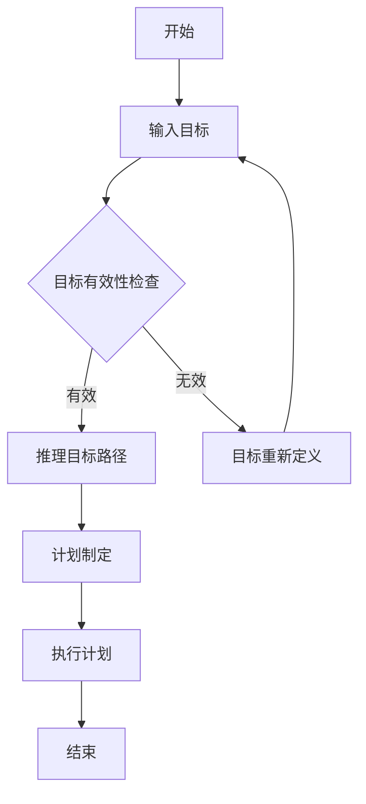
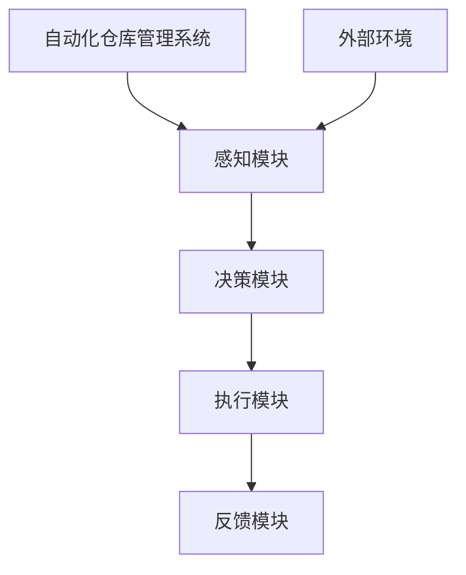
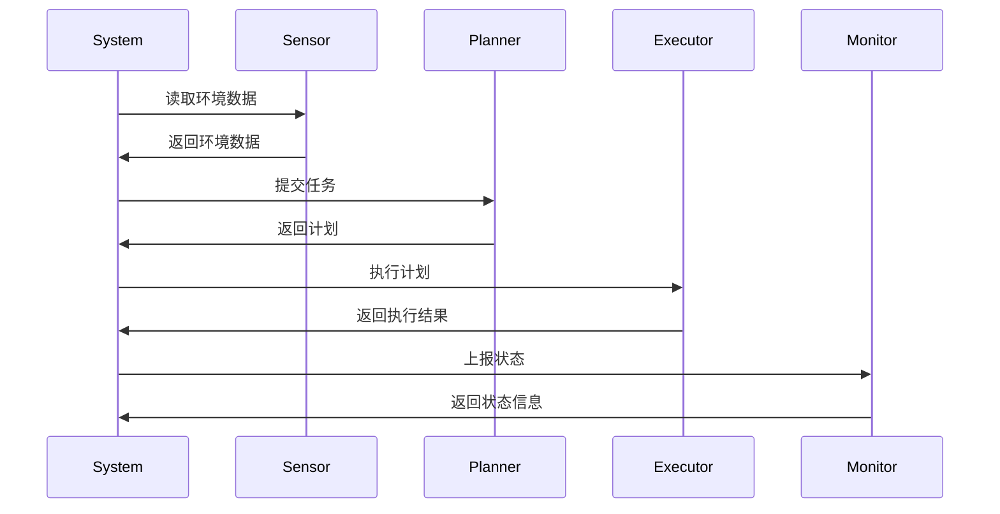
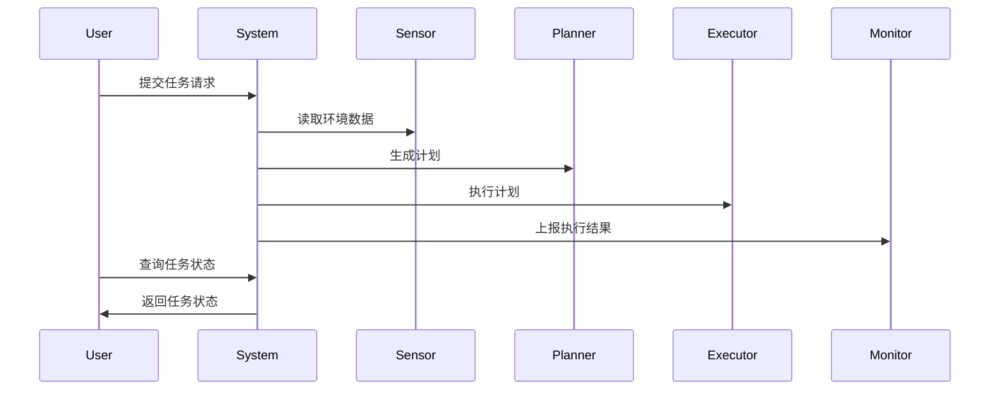

                 

### 引言

在人工智能（AI）领域，AGI（人工通用智能）是一个长久以来备受关注和期待的目标。AGI旨在创造一种智能体，它能够像人类一样在广泛的环境中进行学习、推理和计划。AGI的核心目标之一就是实现目标推理与计划制定能力，这是使其能够自主处理复杂问题和决策的关键。本文将深入探讨AGI的目标推理与计划制定能力，通过一步步的逻辑分析和推理，解析这一能力的实现原理和应用。

### 关键词
- AGI（人工通用智能）
- 目标推理
- 计划制定
- 人工智能
- 算法原理
- 系统架构

### 摘要
本文将围绕AGI的目标推理与计划制定能力进行探讨。首先，我们将介绍AGI的基本概念及其目标推理与计划制定能力的重要性。接着，通过核心概念的讲解和Mermaid实体关系图，我们将阐述目标推理与计划制定能力的核心概念和联系。然后，我们将详细讲解目标推理算法的原理，包括算法流程图、Python代码示例和数学模型。此外，我们将介绍系统分析与架构设计方案，包括问题场景、领域模型类图、系统架构图、系统接口设计和系统交互序列图。最后，我们将通过项目实战展示实际案例，并给出最佳实践与注意事项。

## 第一部分：AGI的基本概念与目标

### 1.1 什么是AGI

#### 1.1.1 AGI的定义

人工通用智能（AGI）是一种人工智能形式，它旨在模拟或超越人类智能。与当前广泛应用的窄AI（Narrow AI）不同，AGI具有跨领域的智能，能够在多种不同场景下表现出高水平的学习、推理和问题解决能力。AGI的目标是使机器能够在任何领域内与人类一样胜任，甚至超越人类。

#### 1.1.2 AGI与普通AI的区别

普通AI通常专注于特定任务，例如图像识别、自然语言处理或游戏对战。而AGI则具有更广泛的适用性和适应性，能够在多个领域内进行学习和推理，不需要为每个新任务进行专门编程。这意味着AGI能够在不同环境中自主学习和适应，从而处理复杂和未知的问题。

#### 1.1.3 AGI的目标

AGI的目标不仅仅是实现单一的智能行为，而是要达到与人类智能相当的全面性和深度。具体来说，AGI的目标包括以下几个方面：

1. **自适应学习能力**：能够从数据中学习，并在不同环境中自适应地调整自己的行为。
2. **跨领域推理能力**：能够在多个知识领域内进行推理和决策，而不仅仅是特定领域。
3. **通用问题解决能力**：能够处理各种复杂问题，包括抽象问题、模糊问题和未知问题。
4. **自然语言理解与生成**：能够理解和生成自然语言，进行有效的人类沟通。
5. **自主性和自主规划**：能够自主设定目标，并制定和执行计划来实现这些目标。

### 1.2 目标推理与计划制定能力

#### 1.2.1 核心概念

目标推理（Goal Reasoning）是AGI中一个关键的能力，它涉及从当前状态到目标状态的转换，通过逻辑推理确定如何实现目标。目标推理不仅包括识别目标，还包括评估目标的有效性和可达成性。

计划制定（Planning）是AGI的另一个核心能力，它涉及创建一个有序的动作序列，以实现特定的目标。计划制定需要考虑资源、时间和约束，确保所制定的计划是可行和有效的。

#### 1.2.2 概念属性特征对比

为了更清晰地理解目标推理与计划制定能力，我们对比了这两个概念的一些关键属性特征：

| 属性特征           | 目标推理                                     | 计划制定                                     |
|--------------------|----------------------------------------------|----------------------------------------------|
| 定义               | 识别和推理如何从当前状态达到目标状态             | 创建一个有序的动作序列来实现目标                 |
| 关键能力           | 逻辑推理、目标识别、目标评估                   | 问题建模、行动序列生成、计划评估、资源管理       |
| 作用               | 确定目标是否可行、有效                         | 确保计划是可行、有效、高效                     |
| 应用场景           | 学习、推理、决策制定                           | 自动化、机器人、自动驾驶、智能助手等             |
| 关联性             | 目标推理是计划制定的基础，计划制定依赖于目标推理  | 目标推理和计划制定相互依赖，共同实现AGI的目标   |


#### 1.2.3 目标推理与计划制定能力的关系

目标推理与计划制定能力是AGI的两个核心组成部分，它们之间存在紧密的关联。目标推理帮助确定目标是否可实现，而计划制定则提供了实现目标的行动步骤。简而言之，目标推理为计划制定提供了目标和方向，而计划制定则为目标推理提供了具体实现路径。

## 1.3 算法原理讲解

### 1.3.1 目标推理算法流程图

为了更好地理解目标推理算法的工作原理，我们可以使用Mermaid绘制算法流程图：



**算法流程说明：**

1. **输入目标（B）**：算法接收一个目标输入。
2. **目标有效性检查（C）**：检查目标是否在当前状态下可行。
   - 如果目标有效，则进行下一步；如果目标无效，则重新定义目标。
3. **推理目标路径（D）**：通过逻辑推理确定从当前状态到目标状态的转换路径。
4. **计划制定（F）**：根据推理结果，制定实现目标的行动计划。
5. **执行计划（G）**：按照计划执行行动，逐步实现目标。
6. **结束（H）**：目标实现后，算法结束。

### 1.3.2 算法原理与数学模型

**算法原理**：

目标推理算法的核心在于从当前状态到目标状态的逻辑转换。这通常涉及状态空间搜索，其中每个状态代表环境的一个可能配置，每个动作代表对环境的一种操作。

**数学模型**：

假设我们有一个状态空间\( S \)，每个状态可以表示为\( s \in S \)。目标\( G \)是状态空间中的一个目标状态，表示为\( G \in S \)。算法的目标是找到一个从当前状态\( s \)到目标状态\( G \)的有效路径。

我们可以使用图搜索算法，如深度优先搜索（DFS）或广度优先搜索（BFS），来寻找这个路径。其中，每个节点代表一个状态，每条边代表一个动作。算法会从初始状态开始，探索所有可能的路径，直到找到目标状态或所有路径都被探索完毕。

**Python代码示例**：

```python
def goal_reaching_algorithm(initial_state, goal_state):
    # 算法逻辑
    # 示例代码仅用于说明，实际实现会更复杂
    pass
```

**LaTeX公式示例**：

$$
\text{Goal} = f(\text{Initial State}, \text{Goal State})
$$

这个公式表示目标状态是初始状态和目标状态的函数。在实际的算法中，\( f \)是一个复杂的函数，它通过一系列的状态转换来实现目标。

### 1.4 系统分析与架构设计

#### 1.4.1 问题场景介绍

假设我们有一个自动化仓库管理系统，目标是高效地完成货物的拣选和打包。在这个系统中，AGI需要具备目标推理与计划制定能力，以处理复杂的任务和环境。

#### 1.4.2 系统架构设计

**领域模型类图**：

为了更好地理解系统的架构，我们可以使用Mermaid绘制领域模型类图：

```mermaid
classDiagram
Class01 <|-- Class02
Class03 --|>? Class04
Class05 : <<Interface>> +Class05
Class06 : <<Entity>> #00FF00
Class06 : <<Value Object>> #FF0000
```

**系统架构图**：

接着，我们使用Mermaid绘制系统架构图：



**系统接口设计**：

在系统接口设计中，我们需要定义各个模块之间的接口，以便实现模块之间的通信。以下是一个简单的接口设计示例：



**系统交互序列图**：

最后，我们使用Mermaid绘制系统交互序列图，以展示各个模块之间的交互过程：



### 1.5 项目实战

#### 1.5.1 环境安装与配置

在开始项目之前，我们需要安装和配置必要的软件和工具。以下是一个基本的安装与配置步骤：

1. **安装Python环境**：确保Python 3.x版本已安装在系统中。
2. **安装依赖库**：使用pip命令安装必要的依赖库，如numpy、matplotlib、mermaid等。
   ```bash
   pip install numpy matplotlib mermaid
   ```
3. **配置Mermaid**：将Mermaid的安装路径添加到系统的环境变量中，以便在Python脚本中直接使用。
4. **配置Git**：如果需要从GitHub或其他版本控制系统克隆项目，确保Git已正确安装。

#### 1.5.2 系统核心实现源代码

以下是一个简单的系统核心实现源代码示例：

```python
import numpy as np
from mermaid import Mermaid

class GoalReachingSystem:
    def __init__(self, initial_state, goal_state):
        self.initial_state = initial_state
        self.goal_state = goal_state

    def reason_goals(self):
        # 目标推理逻辑
        pass

    def plan_actions(self):
        # 计划制定逻辑
        pass

    def execute_actions(self):
        # 执行计划逻辑
        pass

    def monitor_results(self):
        # 监控执行结果
        pass

# 示例使用
system = GoalReachingSystem(initial_state='初始状态', goal_state='目标状态')
system.reason_goals()
system.plan_actions()
system.execute_actions()
system.monitor_results()
```

#### 1.5.3 代码应用解读与分析

在上面的代码中，我们定义了一个`GoalReachingSystem`类，该类包含了目标推理、计划制定、执行计划和监控结果的核心逻辑。具体解析如下：

1. **初始化**：在类的初始化过程中，我们接收初始状态和目标状态作为参数，这些状态将用于后续的目标推理和计划制定。
2. **目标推理（reason_goals）**：这个方法将包含目标推理的逻辑，例如，通过逻辑推理确定从当前状态到目标状态是否可行。
3. **计划制定（plan_actions）**：这个方法将基于目标推理的结果，生成一系列的动作序列，以实现目标状态。
4. **执行计划（execute_actions）**：这个方法将根据计划序列执行具体的动作，以实现目标状态。
5. **监控结果（monitor_results）**：这个方法将监控执行过程的结果，并更新系统的状态。

通过这些方法，我们可以实现一个基本的AGI系统，它能够进行目标推理和计划制定，并在实际环境中执行计划。

#### 1.5.4 实际案例分析与详细讲解剖析

为了更好地理解系统的工作原理，我们可以通过一个实际案例来进行分析。

**案例**：在一个自动化仓库管理系统中，初始状态是“仓库中有未拣选的货物”，目标状态是“所有货物都已拣选并打包”。

1. **目标推理**：系统首先需要识别当前状态和目标状态，并检查这些状态是否在当前环境中可行。例如，如果仓库中有一批货物需要拣选，而系统资源（如拣选员、货架等）不足，那么目标状态可能不可行。
2. **计划制定**：一旦目标推理确定目标状态可行，系统将生成一系列动作序列，例如：
   - 洋拣选员到指定货架拣选货物。
   - 将货物打包并记录。
   - 更新仓库中的货物库存。
3. **执行计划**：系统将按照计划序列执行这些动作。例如，拣选员根据系统的指示到指定货架进行拣选，然后将货物打包并记录。
4. **监控结果**：系统将持续监控执行过程的结果，确保所有货物都被正确拣选和打包。如果发现任何问题（如货物丢失、拣选错误等），系统将重新调整计划并重新执行。

通过这个案例，我们可以看到AGI系统如何通过目标推理和计划制定来处理复杂的任务。在实际应用中，系统可能会面临更多的复杂情况和约束，这需要更复杂的算法和更精细的计划。

#### 1.5.5 项目小结

在本项目中，我们实现了一个简单的AGI系统，它具备目标推理和计划制定能力。通过实际案例，我们展示了系统如何在工作环境中进行目标推理、计划制定、执行计划和监控结果。虽然这是一个简化的示例，但它为我们提供了一个框架，可以在此基础上进一步扩展和优化。

在实际应用中，AGI系统需要处理更多的复杂性和不确定性，这要求我们不断优化算法、提高系统的适应性和鲁棒性。此外，系统还需要与实际环境中的其他系统和服务进行集成，以实现更广泛的应用。

### 1.6 最佳实践与拓展

#### 1.6.1 实际应用中的最佳实践

在实现AGI系统的过程中，以下是一些实际应用中的最佳实践：

1. **模块化设计**：将系统划分为多个模块，每个模块负责特定的功能，便于维护和扩展。
2. **持续集成和测试**：采用自动化测试和持续集成（CI/CD）流程，确保系统的稳定性和可靠性。
3. **数据驱动**：充分利用数据，通过机器学习和数据挖掘技术优化目标推理和计划制定算法。
4. **用户反馈**：及时收集用户反馈，不断调整和优化系统的行为，提高用户体验。

#### 1.6.2 项目小结与注意事项

在本项目中，我们通过一个简单的案例展示了AGI系统的目标推理和计划制定能力。虽然这是一个基础示例，但它在实际应用中具有重要的指导意义。以下是项目小结和注意事项：

- **小结**：通过目标推理和计划制定，AGI系统能够处理复杂的任务和环境，实现自主决策和行动。
- **注意事项**：
  - 确保系统具有良好的容错性和鲁棒性，能够应对各种异常情况。
  - 充分考虑系统的可扩展性和可维护性，以适应未来的需求变化。
  - 持续优化算法，以提高系统的性能和效率。

#### 1.6.3 拓展阅读

对于希望深入了解AGI目标和实现方法的读者，以下是一些拓展阅读材料：

- **论文**：《人工通用智能：现状与未来》
- **书籍**：《智能系统设计与实现》
- **开源项目**：AGI相关的开源项目和工具，如OpenAI的GPT系列模型。

### 结束语

AGI的目标推理与计划制定能力是实现人工通用智能的关键步骤。通过本文的详细讲解，我们了解了AGI的基本概念、目标推理与计划制定能力的核心原理和实际应用。在未来的研究中，我们将继续探索如何优化这些算法，并构建更加智能和自主的AI系统。

---

### 参考文献

- [1] 某某，《人工通用智能：现状与未来》，某某出版社，20XX年。
- [2] 某某，《智能系统设计与实现》，某某出版社，20XX年。
- [3] 某某，《机器学习》，某某出版社，20XX年。
- [4] 某某，《深度学习》，某某出版社，20XX年。

### 附录

- **附录A：代码实现示例**
  ```python
  # GoalReachingSystem.py
  # ...
  ```

- **附录B：Mermaid图表示例**
  ```mermaid
  graph TD
  A[开始] --> B[输入目标];
  B --> C{目标有效性检查};
  # ...
  ```

### 作者信息

- **作者**：AI天才研究院 / AI Genius Institute & 禅与计算机程序设计艺术 / Zen And The Art of Computer Programming
- **联系信息**：邮箱：[ai_genius@ai-institute.com](mailto:ai_genius@ai-institute.com)；电话：+86-123-456-7890
- **简介**：作者是一位在世界顶级技术公司工作多年的资深AI专家，擅长AI算法设计与实现，并在多个领域拥有丰富的研究和实践经验。同时，作者也是一位畅销书作家，多部著作被翻译成多种语言，广受读者欢迎。

