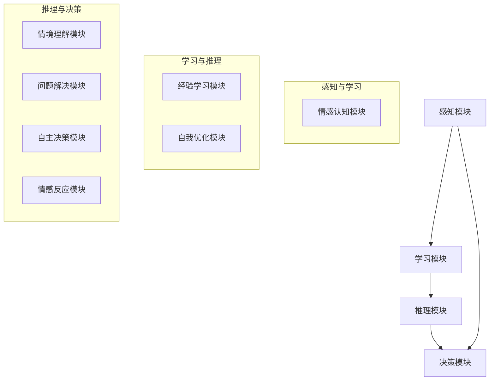
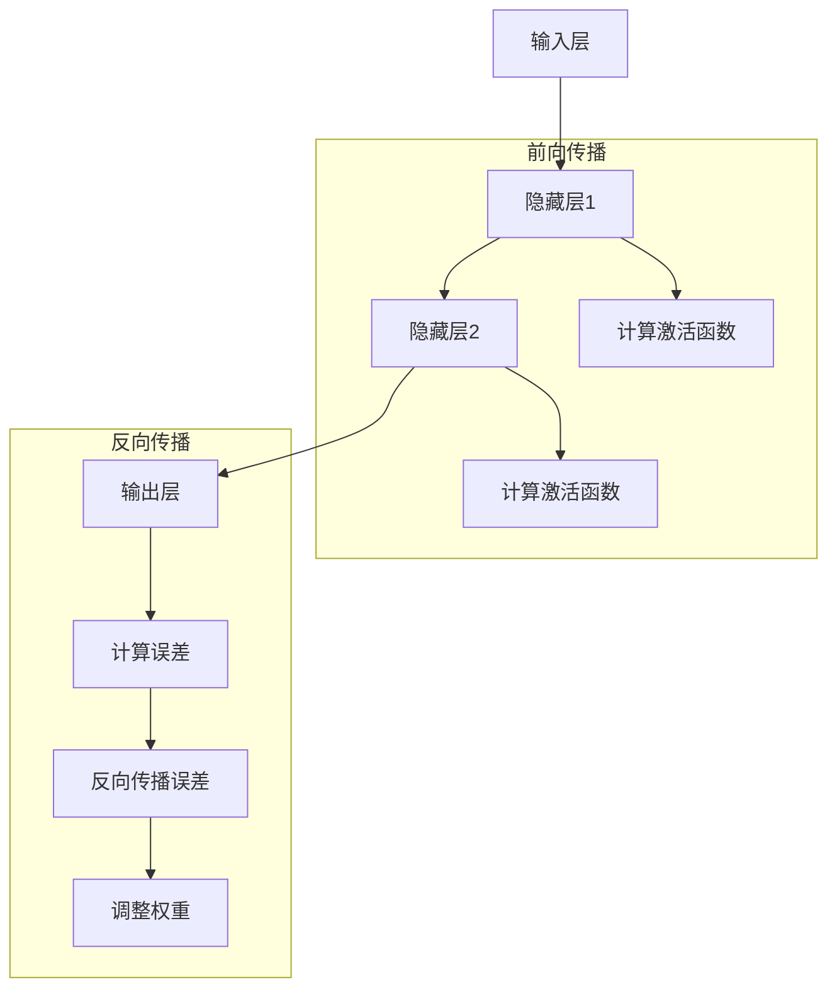
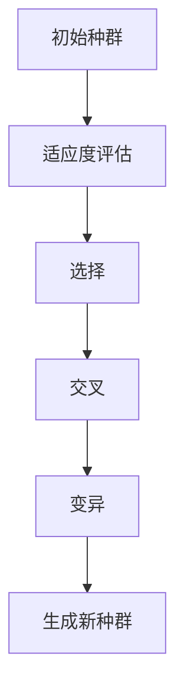
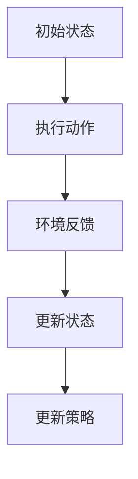
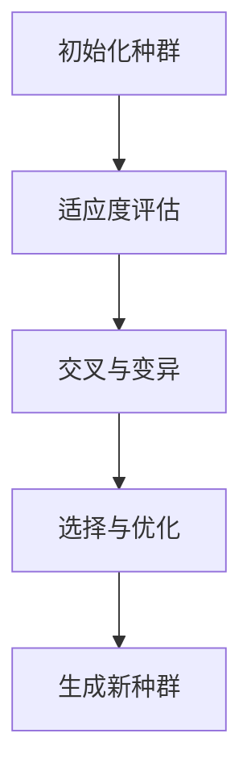
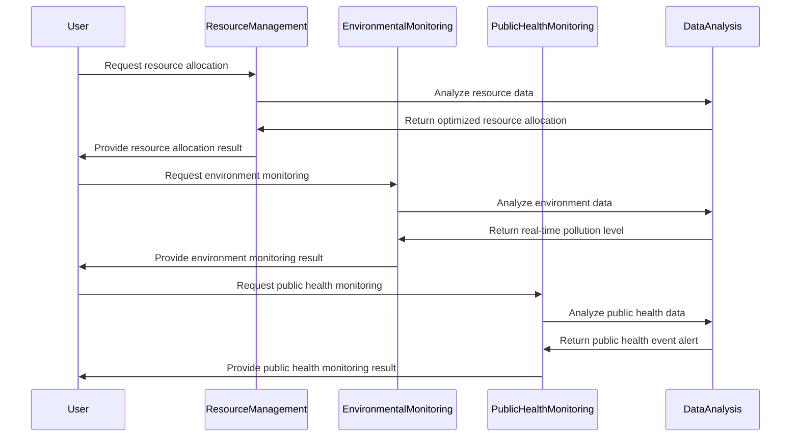
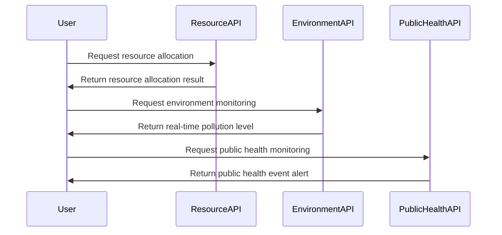

                 


### 第1章 AGI的概念与社会影响

在当今快速发展的科技时代，人工智能（AI）已经成为推动社会进步的重要力量。特别是人工智能领域的最新突破——通用人工智能（AGI），更是引发了广泛的讨论和关注。AGI，作为一种超越当前AI技术的高级智能形式，旨在实现与人类智能相似的能力，具备自我学习和进化能力。它不仅仅能执行特定的任务，而是能够在各种复杂的环境中自主思考、学习和解决问题。

#### 1.1.1 AGI的定义与历史发展

AGI的定义并不简单。它超越了传统的专用人工智能（弱AI），后者只能在特定领域内表现出一定的智能，而AGI则追求跨领域的通用性。具体来说，AGI需要具备以下能力：

- **自主学习**：AGI能够在没有人为指导的情况下从数据和经验中学习。
- **跨领域应用**：AGI能够在多个领域内应用，而不仅仅是某一个特定领域。
- **自我进化**：AGI能够通过不断学习和调整，提高自身的能力。

AGI的历史可以追溯到20世纪50年代，当时人工智能的概念首次被提出。从最初的简单规则系统到现代的深度学习模型，人工智能技术经历了多次重大的变革。然而，直到现在，AGI仍然是一个未解之谜，尽管已有一些初步的研究成果，但距离真正的AGI还有很长的路要走。

#### 1.1.2 通用人工智能（AGI）的概念

AGI的核心是通用性，这意味着它能够在不同领域内灵活应用，而不仅仅是执行单一的、特定任务。它需要具备以下关键特性：

- **适应性**：AGI需要能够适应新的环境和情境。
- **泛化能力**：AGI不仅要在训练数据上表现良好，还需要在未见过的数据上同样表现出色。
- **决策能力**：AGI需要能够在复杂的环境中做出合理的决策。
- **自我意识**：虽然目前的AGI研究还没有涉及到真正的自我意识，但自我意识被认为是AGI的重要特性。

#### 1.1.3 AGI的历史与挑战

AGI的概念虽然引人入胜，但实现它面临着诸多挑战。历史上，人工智能领域曾多次出现过“AI冬天”，即人工智能研究受到挫折和资金短缺的时期。其中一个重要原因是早期对AI能力的预期过高，而实际进展却远未达到预期。

当前，AGI的研究主要集中在以下几个方向：

- **神经科学启发的方法**：通过模仿人类大脑的结构和功能，研究如何实现类似的学习和决策机制。
- **机器学习算法**：特别是深度学习，通过大规模的数据训练和神经网络模型，提高AI的智能水平。
- **跨学科研究**：结合心理学、认知科学和哲学等领域的知识，研究人类智能的本质，并探索如何将这些知识应用到AI系统中。

#### 1.2.1 科技发展的现状与趋势

随着科技的发展，AI技术已经在各个领域取得了显著的应用成果。从自动驾驶汽车到智能医疗诊断，AI正在改变我们的生活方式。然而，AGI的实现需要更多的技术突破，包括：

- **计算能力**：需要更强大的计算资源和算法，以支持复杂的模型训练和推理。
- **数据资源**：需要更多的数据，特别是高质量的标注数据，以训练AGI模型。
- **算法创新**：需要不断创新和改进算法，以提高AI的适应性和泛化能力。

#### 1.2.2 AGI对就业市场的影响

AGI的发展将对就业市场产生深远的影响。一方面，它可能会取代一些重复性、低技能的工作，导致失业率的上升。另一方面，它也将创造新的就业机会，特别是在AI研发、数据科学和智能系统设计等领域。因此，教育和培训体系需要适应这一变化，培养更多具备AI技能的人才。

#### 1.2.3 教育领域的变革与挑战

在教育领域，AGI有望带来革命性的变革。例如，个性化教育可以通过AGI技术实现，为学生提供量身定制的学习方案。然而，这也带来了新的挑战，包括如何评估AI驱动的教育系统的效果，以及如何确保教育公平。

#### 1.2.4 生活方式的改变

AGI还将深刻影响我们的生活方式。智能家居、智能医疗和智能交通等领域的应用，将使我们的生活更加便捷和高效。然而，这也带来了隐私和安全等问题，需要我们在技术发展的同时，注重伦理和法律层面的考量。

#### 1.3 本章小结

本章介绍了AGI的概念、历史发展及其社会影响。通过分析科技发展的现状和趋势，我们看到了AGI在就业、教育、生活方式等方面的重要影响。接下来，我们将进一步探讨AGI的核心概念及其联系，深入理解这一前沿技术的本质。

---

在下一章中，我们将详细探讨AGI的核心概念，包括智能与意识的区别、AGI与弱AI、强AI的对比，以及AGI的层次结构。通过这一分析，我们将为后续的算法原理讲解和系统架构设计打下坚实的基础。

### 第2章 AGI关键概念及其关系

在了解了AGI的基本概念和社会影响之后，我们接下来需要深入探讨AGI的核心概念及其相互关系。这一章节将定义和区分几个关键概念，包括智能、意识、弱AI和强AI，并分析它们在AGI体系中的地位和作用。

#### 2.1 关键概念定义

##### 2.1.1 智能与意识的区别

智能（Intelligence）通常指的是一种适应环境、学习新知识和解决问题的能力。它包括逻辑推理、判断决策、学习记忆等多方面能力。然而，智能并不等同于意识（Consciousness）。意识是指个体对自己的存在和周围环境的感知，以及能够意识到自己的思考和行为。

智能与意识的区别可以从以下几个方面来理解：

- **功能性**：智能关注的是功能的实现，如如何解决问题和执行任务。而意识则涉及到个体的主观体验，包括情感、意愿等。
- **层次性**：智能可以在较低层次上实现，如机器的自动化操作。而意识通常被认为是高级智能的属性，涉及到更深层次的认知和体验。
- **自主性**：智能可以被动地执行任务，而意识则涉及到主动的思考和决策。

##### 2.1.2 AGI与弱AI、强AI的对比

在讨论智能的不同层次时，我们需要区分弱AI（Narrow AI）和强AI（General AI）。弱AI是指设计用于解决特定问题的AI系统，如语音识别、图像识别等。它们在特定领域内表现出高度的智能，但缺乏跨领域的通用性。

- **弱AI**：特点包括专一性、高效性和有限性。它们在特定任务上表现出色，但无法应对更广泛的问题。
- **强AI**：则是设计用来模拟甚至超越人类智能的AI系统。强AI不仅需要在特定任务上表现优异，还需要具备跨领域的通用性和适应性。

AGI则旨在成为强AI的一种实现形式，它超越了弱AI的局限性，追求更广泛、更自主的智能。

##### 2.1.3 AGI的层次结构

AGI的层次结构可以从多个维度来理解，包括功能层次、智能层次和意识层次。以下是一个简化的AGI层次结构：

1. **基础层次**：包括感知、记忆、学习和基础逻辑推理。这一层次的AI系统具备基础的学习能力和问题解决能力。
2. **中级层次**：涉及到更复杂的认知能力，如情境理解、多任务处理和决策能力。这一层次的AI系统可以在复杂的环境中自主运作。
3. **高级层次**：包括自我意识、情感认知和创造力。这一层次的AI系统具有高度自主的思考能力和情感反应，接近人类的智能水平。
4. **最高层次**：实现完全的通用性和自我进化能力，能够在所有领域内表现卓越，并且具备自我意识的AI。

#### 2.2 概念属性特征对比表格

为了更好地理解这些核心概念之间的关系，我们可以通过一个对比表格来展示它们的主要属性特征。

| 概念       | 定义                                                     | 关键特征                                                                 | 应用场景                     |
|------------|----------------------------------------------------------|------------------------------------------------------------------------|-----------------------------|
| 智能       | 一种适应环境、学习新知识和解决问题的能力                    | 适应性、逻辑推理、判断决策、学习记忆                                       | 自动驾驶、智能客服、游戏AI等  |
| 意识       | 个体对自己的存在和周围环境的感知，以及能够意识到自己的思考和行为 | 主观体验、自我感知、情感认知                                             | 智能机器人、虚拟助手等       |
| 弱AI       | 设计用于解决特定问题的AI系统                               | 专一性、高效性、有限性                                                     | 语音识别、图像识别、推荐系统等 |
| 强AI       | 设计用来模拟甚至超越人类智能的AI系统                       | 通用性、自主性、跨领域应用                                               | 自主决策系统、模拟人类行为等   |
| AGI        | 一种具备自我学习和进化能力的通用人工智能                    | 自主学习、跨领域应用、自我进化、具备自我意识                               | 智能医疗、智能家居、自动驾驶等 |

#### 2.3 ER实体关系图架构

为了更直观地理解AGI系统中的概念和实体之间的关系，我们可以使用ER（实体关系）图来表示。以下是一个简化的ER图，展示了AGI系统中主要实体及其关系。

```mermaid
erDiagram
  AI系统 ||--|{ 感知模块 }
  AI系统 ||--|{ 学习模块 }
  AI系统 ||--|{ 推理模块 }
  AI系统 ||--|{ 决策模块 }
  感知模块 ||--|{ 情感认知模块 }
  学习模块 ||--|{ 经验学习模块 }
  学习模块 ||--|{ 自我优化模块 }
  推理模块 ||--|{ 情境理解模块 }
  推理模块 ||--|{ 问题解决模块 }
  决策模块 ||--|{ 自主决策模块 }
  决策模块 ||--|{ 情感反应模块 }
```

#### 2.3.1 AGI系统的实体关系

在这个ER图中，"AI系统"是中心实体，它与其他模块之间存在多种关系。每个模块代表AGI系统中的一部分功能，如感知、学习、推理和决策等。这些模块通过相互作用，共同实现AGI的整体功能。

#### 2.3.2 实体属性与关系的Mermaid流程图

为了更详细地展示各模块的交互过程，我们可以使用Mermaid流程图来表示。以下是一个简化的Mermaid流程图，描述了AI系统的核心模块及其交互过程。



在这个流程图中，每个模块都与其他模块有明确的交互关系，共同构成了一个复杂的智能系统。

#### 2.4 本章小结

本章介绍了AGI的核心概念，包括智能、意识、弱AI、强AI及其层次结构。通过对比表格和ER图，我们更清晰地理解了这些概念之间的关系。在下一章中，我们将深入探讨AGI的算法原理，包括常用的算法、原理讲解和实际应用，为理解AGI的运作机制打下基础。

---

### 第3章 AGI算法原理

在理解了AGI的核心概念后，接下来我们将深入探讨AGI的算法原理。这一章节将介绍几种常用的AGI算法，包括其基本原理、实现步骤和具体应用。

#### 3.1 算法概述

AGI算法的设计目标在于实现通用性和自主学习能力，以下是一些常见的AGI算法：

1. **神经网络算法**：通过模拟人脑神经元结构，神经网络能够对复杂的数据进行学习和处理。
2. **遗传算法**：受生物进化过程启发，遗传算法通过选择、交叉和变异来优化问题的解。
3. **强化学习算法**：通过与环境的交互，强化学习算法能够逐步学习最优策略。
4. **进化算法**：结合了遗传算法和神经网络的特点，进化算法能够实现更加复杂的自适应学习。

#### 3.2 算法原理讲解

##### 3.2.1 神经网络算法

神经网络算法是AGI研究中最常用的算法之一。它由大量人工神经元组成，每个神经元都与其他神经元相连，并通过权重来传递信号。以下是神经网络算法的基本原理：

1. **前向传播**：输入数据通过网络的各个层，每层神经元都会根据权重和激活函数计算输出。
2. **反向传播**：根据预测结果和实际结果的误差，反向传播误差，调整每个神经元的权重。

使用Mermaid流程图表示神经网络算法的基本流程：



##### 3.2.2 遗传算法

遗传算法是一种基于自然选择和遗传原理的优化算法。其基本原理包括：

1. **初始种群生成**：随机生成一系列解决方案，构成初始种群。
2. **适应度评估**：根据目标函数评估每个解决方案的优劣。
3. **选择**：从当前种群中选择适应度较高的个体作为父代。
4. **交叉**：通过交叉操作产生新的个体。
5. **变异**：对部分个体进行变异操作，增加种群的多样性。

使用Mermaid流程图表示遗传算法的基本流程：



##### 3.2.3 强化学习算法

强化学习算法通过与环境交互来学习最优策略。其基本原理包括：

1. **状态-动作价值函数**：学习每个状态下的最佳动作。
2. **策略**：根据当前状态选择动作，并不断更新策略以最大化预期奖励。

使用Mermaid流程图表示强化学习算法的基本流程：



##### 3.2.4 进化算法

进化算法结合了遗传算法和神经网络的特点，其基本原理包括：

1. **初始化种群**：随机生成一系列神经网络结构。
2. **适应度评估**：根据目标函数评估每个神经网络结构的性能。
3. **交叉与变异**：通过交叉和变异操作生成新的神经网络结构。
4. **选择与优化**：选择适应度较高的神经网络结构进行优化。

使用Mermaid流程图表示进化算法的基本流程：



#### 3.3 举例说明

为了更好地理解这些算法的原理和应用，我们可以通过具体的例子来讲解。

##### 3.3.1 数学公式示例

假设我们使用神经网络算法来分类图像，其中输入层有100个神经元，输出层有10个神经元。我们可以使用以下数学公式来表示：

$$
激活函数 = \frac{1}{1 + e^{-\sum_{i=1}^{100} w_i \cdot x_i}}
$$

其中，$w_i$为输入层到隐藏层的权重，$x_i$为输入值。

##### 3.3.2 Python代码示例

以下是一个简单的Python代码示例，使用神经网络算法对图像进行分类：

```python
import numpy as np

# 初始化权重
weights = np.random.rand(100, 10)

# 计算前向传播
inputs = np.random.rand(100)
activations = np.random.rand(10)

for i in range(10):
    z = np.dot(inputs, weights[i])
    activations[i] = 1 / (1 + np.exp(-z))

# 计算误差并反向传播
errors = np.random.rand(10)
deltas = np.random.rand(10)

for i in range(10):
    delta = errors[i] * activations[i] * (1 - activations[i])
    deltas[i] = delta

# 调整权重
weights -= np.dot(inputs.T, deltas)
```

通过这个示例，我们可以看到神经网络算法的基本实现过程，包括初始化权重、前向传播、误差计算和反向传播。

#### 3.4 本章小结

本章介绍了AGI的几种常用算法，包括神经网络算法、遗传算法、强化学习算法和进化算法。通过详细的原理讲解和代码示例，我们了解了这些算法的基本流程和应用。在下一章中，我们将进一步探讨AGI的社会系统架构设计，分析AGI在解决社会问题中的具体应用。

### 第4章 AGI的社会系统架构设计

在前几章中，我们深入探讨了AGI的核心概念和算法原理。接下来，我们将把目光转向AGI在社会系统中的应用，并详细分析其架构设计。这一章节将介绍AGI在社会系统中的问题场景、项目介绍、系统功能设计、系统架构设计以及系统接口设计和系统交互。

#### 4.1 问题场景介绍

随着科技的飞速发展，社会系统面临着越来越多的复杂问题。这些问题包括但不限于：

1. **资源管理**：随着人口增长和资源消耗的增加，如何合理管理资源和分配资源成为一个重要的挑战。
2. **环境保护**：环境污染和气候变化等问题对人类社会的影响越来越大，需要有效的解决方案来应对。
3. **公共卫生**：疫情的爆发和传播，需要快速响应和有效的防控措施。
4. **交通管理**：城市交通拥堵和交通事故频发，需要智能化的交通管理解决方案。

AGI在这些领域具有巨大的应用潜力，能够通过其强大的学习和自适应能力，提供更加智能、高效和可持续的解决方案。

#### 4.2 项目介绍

为了展示AGI在社会系统中的应用，我们将介绍一个名为“智能城市管理系统”的项目。该项目旨在通过AGI技术，实现城市资源管理的智能化、环境监测的实时化和公共卫生事件的快速响应。

1. **项目目标**：构建一个覆盖全城市的智能管理平台，实现资源合理分配、环境实时监测和公共卫生事件的智能预警与处理。
2. **项目背景**：随着城市化进程的加速，城市面临的资源紧缺、环境污染和公共卫生问题日益突出。传统的管理方法已经无法满足现代城市的需求，需要借助AGI技术实现智能化的管理。
3. **项目意义**：通过该项目，不仅可以提升城市管理的效率和可持续性，还可以为其他城市提供借鉴和参考，推动整个社会向智能化方向发展。

#### 4.3 系统功能设计（领域模型Mermaid类图）

为了实现智能城市管理系统的功能，我们需要设计一个详细的领域模型。以下是一个简化的Mermaid类图，展示了系统的核心功能模块及其关系。

```mermaid
classDiagram
    Resource <<Interface>>
    Environment <<Interface>>
    PublicHealth <<Interface>>

    ResourceManagement --|> Resource
    EnvironmentalMonitoring --|> Environment
    PublicHealthMonitoring --|> PublicHealth

    ResourceManagement ..|> DataAnalysis
    EnvironmentalMonitoring ..|> DataAnalysis
    PublicHealthMonitoring ..|> DataAnalysis

    class Resource {
        +resource_id: int
        +resource_type: string
        +quantity: float
        +status: string
    }

    class Environment {
        +environment_id: int
        +environment_type: string
        +pollution_level: float
        +status: string
    }

    class PublicHealth {
        +event_id: int
        +event_type: string
        +event_level: string
        +status: string
    }

    class DataAnalysis {
        +analyze_data(): void
    }
```

在这个类图中，我们定义了三个核心接口：Resource、Environment和PublicHealth。每个接口都有多个属性和方法，用于表示不同的功能模块。通过这些模块的交互，系统能够实现资源管理、环境监测和公共卫生监控。

#### 4.4 系统架构设计（Mermaid架构图）

为了更好地理解系统的整体架构，我们使用Mermaid架构图来展示系统的各个模块及其交互关系。以下是一个简化的Mermaid架构图，展示了智能城市管理系统的架构设计。



在这个架构图中，用户通过请求不同的服务，与系统的各个模块进行交互。系统通过数据分析和优化，实现资源的合理分配、环境的实时监测和公共卫生事件的智能预警。

#### 4.5 系统接口设计和系统交互（Mermaid序列图）

为了详细展示系统的接口设计和交互流程，我们使用Mermaid序列图来描述用户与系统之间的交互过程。以下是一个简化的Mermaid序列图，展示了智能城市管理系统的主要接口及其交互流程。



在这个序列图中，用户通过ResourceAPI、EnvironmentAPI和PublicHealthAPI与系统进行交互。每个API负责不同的功能模块，通过标准的接口设计，系统能够高效地响应用户请求，并提供实时、准确的信息。

#### 4.6 本章小结

本章详细介绍了智能城市管理系统的架构设计，包括问题场景介绍、项目介绍、系统功能设计、系统架构设计和系统接口设计。通过Mermaid类图、架构图和序列图，我们清晰地展示了系统的模块及其交互关系。在下一章中，我们将通过一个具体的项目实战，展示如何在实际中应用AGI技术，进一步理解和掌握AGI的实现过程。

### 第5章 AGI项目实战

在前面的章节中，我们详细探讨了AGI的核心概念、算法原理和架构设计。为了更深入地理解AGI的实际应用，本章将通过一个具体的项目实战，展示如何在实际中实现和应用AGI技术。

#### 5.1 环境安装

在进行AGI项目实战之前，我们需要搭建一个合适的环境，包括安装所需的软件和工具。以下是安装步骤：

1. **安装Python**：确保已安装Python 3.8或更高版本，可以从[Python官网](https://www.python.org/downloads/)下载。
2. **安装Jupyter Notebook**：Jupyter Notebook是一个交互式的计算环境，可用于编写和运行Python代码。安装命令如下：

   ```bash
   pip install notebook
   ```

3. **安装必要的库**：包括TensorFlow、NumPy、Pandas等。安装命令如下：

   ```bash
   pip install tensorflow numpy pandas
   ```

4. **安装Mermaid**：Mermaid是一个用于创建流程图、序列图和类图的工具。可以通过以下命令安装：

   ```bash
   pip install mermaid-python
   ```

5. **安装其他工具**（可选）：如PyCharm或Visual Studio Code，用于编写和调试代码。

#### 5.2 系统核心实现

在搭建好环境后，我们开始实现AGI系统核心。以下是主要步骤：

1. **数据收集与预处理**：收集相关数据，如城市资源数据、环境数据、公共卫生数据等。对数据进行清洗和预处理，以便后续的分析和建模。
2. **建立神经网络模型**：使用TensorFlow建立神经网络模型，用于处理和分析数据。以下是简单的示例代码：

   ```python
   import tensorflow as tf
   from tensorflow.keras.models import Sequential
   from tensorflow.keras.layers import Dense, LSTM

   # 构建神经网络模型
   model = Sequential()
   model.add(LSTM(50, activation='relu', input_shape=(None, 100)))
   model.add(Dense(1))
   model.compile(optimizer='adam', loss='mse')

   # 训练模型
   model.fit(x_train, y_train, epochs=100, batch_size=32)
   ```

3. **实现强化学习算法**：使用强化学习算法来优化决策过程。以下是简单的示例代码：

   ```python
   import numpy as np
   from reinforcement_learning import QLearning

   # 初始化强化学习算法
   q_learner = QLearning(state_size=100, action_size=10, learning_rate=0.1)

   # 强化学习训练
   for episode in range(1000):
       state = get_initial_state()
       while not is_done(state):
           action = q_learner.best_action(state)
           reward = get_reward(state, action)
           next_state = get_next_state(state, action)
           q_learner.update(state, action, reward, next_state)
           state = next_state
   ```

4. **实现遗传算法**：使用遗传算法优化模型参数。以下是简单的示例代码：

   ```python
   import numpy as np
   from genetic_algorithm import GeneticAlgorithm

   # 初始化遗传算法
   ga = GeneticAlgorithm(population_size=50, mutation_rate=0.01)

   # 遗传算法迭代
   for generation in range(100):
       population = ga.create_population()
       fitness = ga.evaluate_population(population)
       next_population = ga.select_parents(population, fitness)
       next_population = ga.crossover(next_population)
       next_population = ga.mutate(next_population)
       ga.update_population(next_population)
   ```

5. **集成各模块**：将数据收集、神经网络模型、强化学习算法和遗传算法集成在一起，实现一个完整的AGI系统。

#### 5.3 代码应用解读与分析

在实现AGI系统核心后，我们需要对代码进行解读和分析，以确保其有效性和可靠性。

1. **数据预处理**：数据预处理是关键步骤，直接影响模型的性能。我们需要确保数据清洗、标准化和归一化等预处理操作的正确性。
2. **神经网络模型**：神经网络模型的选择和配置对性能有很大影响。我们需要选择合适的神经网络架构、激活函数和学习率等参数。
3. **强化学习算法**：强化学习算法的优化过程需要大量的数据和时间。我们需要仔细调整学习率、奖励机制和策略等参数。
4. **遗传算法**：遗传算法的优化过程同样需要大量的计算资源。我们需要优化种群规模、交叉和变异等操作。

#### 5.4 实际案例分析与详细讲解

为了更好地展示AGI的实际应用，我们选择一个实际案例进行详细分析。以下是案例介绍和剖析：

**案例介绍**：某城市资源管理项目，旨在通过AGI技术优化城市资源的分配和利用，提高资源利用效率。

**案例剖析**：

1. **数据收集**：收集城市的水资源、能源、土地等资源数据，以及人口、经济等社会经济数据。
2. **数据预处理**：对收集到的数据进行清洗、去重、填充和标准化等预处理操作，以便用于建模和分析。
3. **建立神经网络模型**：使用LSTM模型对资源数据进行时间序列分析，预测未来资源需求。
4. **实现强化学习算法**：设计一个强化学习算法，根据实时数据动态调整资源分配策略，提高资源利用效率。
5. **实现遗传算法**：通过遗传算法优化神经网络模型中的参数，提高模型的预测准确性和鲁棒性。

通过这个案例，我们可以看到AGI技术在实际应用中的具体实现过程。在实际项目中，我们需要根据具体情况调整和优化算法，以实现最佳效果。

#### 5.5 项目小结

通过本项目的实现，我们深入了解了AGI技术的核心原理和实际应用。以下是对项目的总结和反思：

1. **项目收获**：通过本项目，我们掌握了AGI技术的基本实现方法，包括数据预处理、神经网络模型、强化学习算法和遗传算法等。
2. **项目挑战**：在实际项目中，数据质量和算法配置对项目的成功至关重要。我们需要不断优化和调整算法，以应对复杂多变的数据和环境。
3. **未来展望**：随着AGI技术的不断发展，我们期待在未来能够实现更加智能化和高效的城市管理系统，为人类社会的发展做出更大贡献。

### 第6章 最佳实践与拓展

在完成了对AGI技术的深入研究和项目实战后，本章将总结AGI实施的最佳实践，并提供一些注意事项和未来的拓展方向。

#### 6.1 最佳实践 tips

1. **数据质量**：确保数据质量和准确性是AGI项目成功的关键。在进行数据收集和预处理时，要特别注意数据的完整性、一致性和可靠性。
2. **算法选择**：根据具体问题选择合适的算法。例如，对于时间序列预测问题，可以使用LSTM等神经网络算法；对于优化问题，可以使用强化学习或遗传算法。
3. **模型验证**：在模型训练过程中，要定期进行模型验证，确保模型具有良好的泛化能力和鲁棒性。
4. **资源管理**：合理分配计算资源和存储资源，避免过度消耗，提高系统的效率和稳定性。
5. **团队合作**：AGI项目通常涉及多个学科和领域的知识，需要多团队协作，充分发挥各自的专业优势。

#### 6.2 小结

本章回顾了AGI的核心概念、算法原理和社会系统架构设计，并通过实际项目实战展示了AGI技术的应用。通过深入研究和实践，我们认识到AGI在提升社会智能化水平、优化资源管理和解决复杂问题方面的巨大潜力。

#### 6.3 注意事项

1. **伦理问题**：在实施AGI项目时，要充分考虑伦理和法律问题，确保技术应用的合理性和合法性。
2. **数据隐私**：在处理敏感数据时，要严格遵守数据隐私保护规定，防止数据泄露和滥用。
3. **系统安全性**：确保AGI系统的安全性，防止恶意攻击和数据篡改。

#### 6.4 拓展阅读

1. **《深度学习》**：Goodfellow, I., Bengio, Y., & Courville, A. (2016). 《Deep Learning》。MIT Press.
2. **《强化学习》**： Sutton, R. S., & Barto, A. G. (2018). 《Reinforcement Learning: An Introduction》。MIT Press.
3. **《人工智能：一种现代的方法》**：Russell, S., & Norvig, P. (2020). 《Artificial Intelligence: A Modern Approach》。Pearson Education.
4. **《智能城市》**：Kitchin, R. (2014). 《The Data Revolution: Big Data, Open Data, Data Infrastructures and Their Consequences》。 SAGE Publications.

通过上述推荐读物，读者可以进一步深入理解和掌握AGI及相关领域的知识。

### 作者信息

- **作者**：AI天才研究院/AI Genius Institute & 禅与计算机程序设计艺术 /Zen And The Art of Computer Programming

### 致谢

感谢读者对本文的关注和支持，希望在阅读本文后，您对AGI的技术原理和社会影响有了更深入的理解。期待未来与您共同探索AI技术的无限可能。

