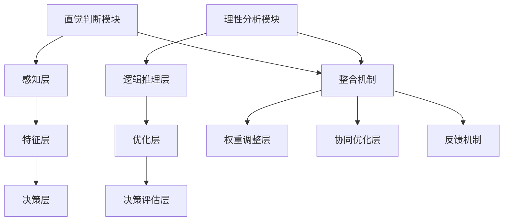
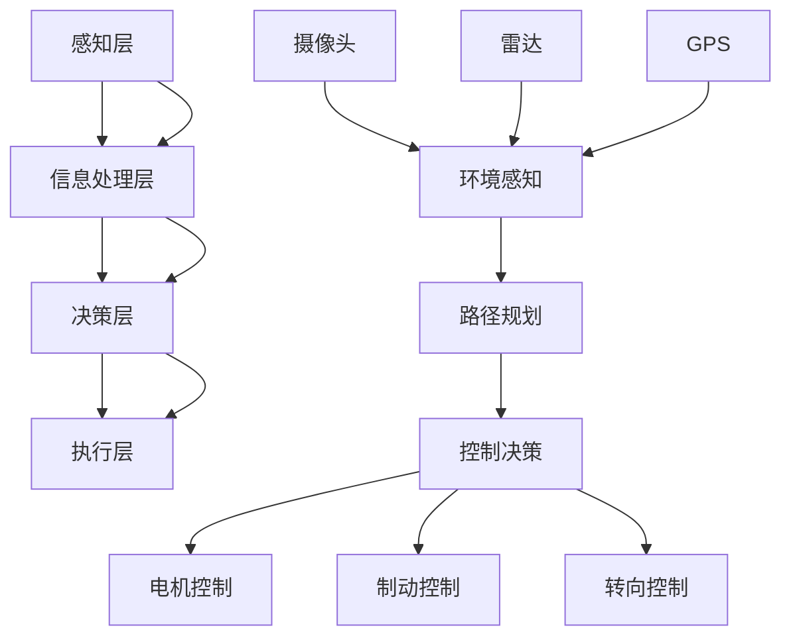
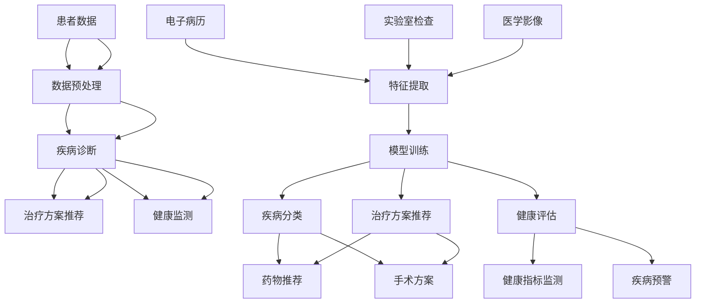
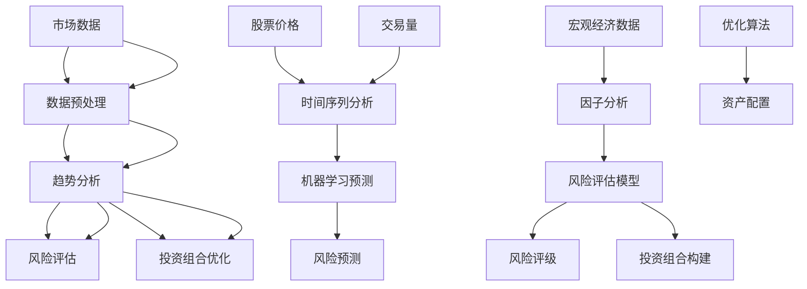

                 

## 文章标题

# AGI的类人决策系统：从直觉判断到理性分析

**关键词**：AGI、类人决策系统、直觉判断、理性分析、算法模型、系统架构

**摘要**：本文旨在探讨人工通用智能（AGI）中的类人决策系统，深入分析直觉判断和理性分析的理论基础、算法模型及其在实际应用中的整合方式。通过系统的理论讲解和案例剖析，为读者呈现一个清晰、完整的AGI决策系统设计蓝图。

## 引言

### 人工智能概述

人工智能（Artificial Intelligence, AI）是计算机科学的一个重要分支，旨在使计算机模拟人类智能行为，解决复杂问题。自20世纪50年代以来，人工智能经历了多个发展阶段，包括规则推理、知识表示、机器学习、深度学习等。然而，传统的人工智能系统主要专注于特定任务的优化，如图像识别、自然语言处理等，缺乏对复杂、多变环境的通用适应能力。

### 人工通用智能（AGI）

人工通用智能（Artificial General Intelligence, AGI）是人工智能的一个高级阶段，旨在开发出能够像人类一样具备全面智能的计算机系统。AGI不仅能够在特定任务上表现出色，还能够进行跨领域的知识理解和决策制定，具备自我学习和创新能力。

### 类人决策系统的核心概念

类人决策系统是AGI的核心组成部分，其目标是在复杂、不确定的环境中模拟人类的决策过程。类人决策系统主要包括直觉判断和理性分析两个核心概念。直觉判断强调快速、自然的决策过程，而理性分析则侧重于系统化、逻辑化的决策过程。

### AGI决策系统的发展现状与挑战

当前，AGI决策系统的研究和应用已经取得了一定的进展，如自动驾驶、智能家居、智能医疗等。然而，由于AGI涉及多学科交叉、复杂度高等问题，当前的技术水平仍然难以完全实现类人决策系统的理想效果。本文将深入探讨AGI决策系统的理论基础、算法模型及其在实际应用中的整合方式，以期为未来的研究提供参考。

## 核心概念

### 直觉判断

直觉判断是一种快速、自然的决策过程，通常在无需大量计算和信息处理的情况下，通过经验、直觉和感知等因素快速作出决策。直觉判断具有以下几个主要特点：

1. **快速性**：直觉判断通常在极短的时间内完成，这使得它非常适合应对实时决策场景。
2. **适应性**：直觉判断能够根据环境和情境的变化进行自适应调整，以应对不确定性。
3. **高效性**：直觉判断通常不需要大量的计算资源和信息处理，因此在计算成本上具有优势。

### 理性分析

理性分析是一种系统化、逻辑化的决策过程，它依赖于明确的理论、公式和计算方法。理性分析具有以下几个主要特点：

1. **系统性**：理性分析通常采用系统化的方法，通过对问题的深入分析，构建出明确的决策框架。
2. **逻辑性**：理性分析强调逻辑推理和论证，以确保决策的合理性和可解释性。
3. **精确性**：理性分析通常依赖于数学模型和算法，能够对问题进行精确计算和分析。

### AGI决策系统的结构

AGI决策系统是由直觉判断和理性分析两个核心概念组成的复杂系统。在AGI决策系统中，直觉判断和理性分析并不是相互独立的，而是通过特定的机制进行整合，以实现更高效、更可靠的决策过程。

1. **直觉判断模块**：该模块负责处理实时、动态的决策任务，通过快速、自然的直觉判断生成初步的决策结果。
2. **理性分析模块**：该模块负责对直觉判断结果进行进一步的理性分析，通过系统化、逻辑化的方法对决策过程进行优化和调整。
3. **整合机制**：整合机制负责协调直觉判断和理性分析模块的工作，确保整个决策过程的协同和高效。

## 理论基础

### 直觉判断的理论基础

直觉判断的理论基础主要涉及心理学、神经科学和认知科学等领域。以下是对这些理论基础的简要介绍：

1. **心理学基础**：心理学研究直觉判断的机理和影响因素，如感知、记忆、情绪等。经典的心理学理论包括感知心理学、认知心理学和动机心理学等。
2. **神经科学基础**：神经科学研究直觉判断背后的神经机制，如大脑神经网络的结构和功能。神经科学研究揭示了直觉判断与大脑多个区域的活动密切相关，如前额叶皮层、顶叶皮层等。
3. **认知科学基础**：认知科学研究直觉判断的认知过程，如信息处理、记忆、推理等。认知科学提供了丰富的理论工具和方法，用于分析和解释直觉判断的内在机制。

### 理性分析的理论基础

理性分析的理论基础主要涉及数学、逻辑和计算机科学等领域。以下是对这些理论基础的简要介绍：

1. **数学基础**：数学提供了丰富的工具和方法，用于建立和验证理性分析模型。经典数学理论包括概率论、数理逻辑、优化理论等。
2. **逻辑基础**：逻辑是理性分析的核心，它提供了严谨的推理方法和论证规则。经典逻辑理论包括命题逻辑、谓词逻辑和形式逻辑等。
3. **计算机科学基础**：计算机科学为理性分析提供了强大的计算工具和算法支持。经典计算机科学理论包括算法分析、数据结构、编程语言等。

### 直觉判断与理性分析的异同

直觉判断和理性分析在决策过程中具有明显的异同。以下是对它们主要异同点的介绍：

1. **相同点**：
   - 目标：直觉判断和理性分析都是为了实现高效的决策过程。
   - 辅助：直觉判断和理性分析在决策过程中通常相互辅助，共同提高决策的质量和效率。
2. **不同点**：
   - 方法：直觉判断依赖于快速、自然的直觉，而理性分析依赖于系统化、逻辑化的方法。
   - 适应性：直觉判断具有更好的适应性，能够快速应对环境和情境的变化；理性分析则更适用于稳定、可控的环境。
   - 精确性：理性分析具有更高的精确性，能够对问题进行精确计算和分析；直觉判断则更注重效率和适应性。

### 直觉判断与理性分析在AGI决策系统中的整合

在AGI决策系统中，直觉判断和理性分析通过特定的机制进行整合，以实现更高效、更可靠的决策过程。以下是对这种整合机制的介绍：

1. **动态调整**：整合机制根据环境和情境的变化，动态调整直觉判断和理性分析模块的权重和作用范围，以实现决策过程的灵活性和高效性。
2. **协同优化**：整合机制通过协同优化算法，对直觉判断和理性分析的结果进行综合评估和优化，以提高决策的准确性和可靠性。
3. **反馈机制**：整合机制通过实时反馈机制，对直觉判断和理性分析的效果进行监控和评估，并根据评估结果进行调整和改进。

## AGI决策系统的架构设计

### 系统架构概述

AGI决策系统的架构设计旨在实现直觉判断和理性分析的高效整合，以满足复杂、多变环境的决策需求。以下是对系统架构的概述：

1. **直觉判断模块**：该模块负责处理实时、动态的决策任务，通过快速、自然的直觉判断生成初步的决策结果。直觉判断模块包括感知层、特征层和决策层。
2. **理性分析模块**：该模块负责对直觉判断结果进行进一步的理性分析，通过系统化、逻辑化的方法对决策过程进行优化和调整。理性分析模块包括逻辑推理层、优化层和决策评估层。
3. **整合机制**：整合机制负责协调直觉判断和理性分析模块的工作，确保整个决策过程的协同和高效。整合机制包括权重调整层、协同优化层和反馈机制。

### 系统架构图

以下是一个简化的AGI决策系统架构图，用于展示直觉判断和理性分析模块及其整合机制：

### 系统架构的关键技术

1. **感知层**：感知层负责接收和处理实时数据，包括图像、语音、文本等。感知层的关键技术包括数据采集、预处理和特征提取。
2. **特征层**：特征层负责将感知层提取的特征进行融合和抽象，形成更高级别的特征表示。特征层的关键技术包括特征融合、特征选择和特征变换。
3. **决策层**：决策层负责基于直觉判断和理性分析的结果生成最终的决策。决策层的关键技术包括决策模型、决策规则和决策评估。
4. **逻辑推理层**：逻辑推理层负责根据直觉判断和理性分析的结果进行逻辑推理和论证。逻辑推理层的关键技术包括命题逻辑、谓词逻辑和形式逻辑。
5. **优化层**：优化层负责对决策过程进行优化，以提高决策的质量和效率。优化层的关键技术包括优化算法、优化目标和优化约束。
6. **决策评估层**：决策评估层负责对决策结果进行评估和反馈，以优化决策过程。决策评估层的关键技术包括评估指标、评估方法和评估反馈。
7. **权重调整层**：权重调整层负责根据环境和情境的变化，动态调整直觉判断和理性分析模块的权重和作用范围。权重调整层的关键技术包括权重调整算法、权重调整策略和权重调整效果评估。
8. **协同优化层**：协同优化层负责对直觉判断和理性分析的结果进行综合评估和优化，以提高决策的准确性和可靠性。协同优化层的关键技术包括协同优化算法、协同优化目标和协同优化效果评估。
9. **反馈机制**：反馈机制负责对直觉判断和理性分析的效果进行监控和评估，并根据评估结果进行调整和改进。反馈机制的关键技术包括实时反馈、反馈分析和反馈调整。

### AGI决策系统的实现

AGI决策系统的实现涉及多个方面，包括数据采集、数据处理、模型训练、模型评估和应用部署等。以下是对AGI决策系统实现的关键步骤的介绍：

1. **数据采集**：数据采集是AGI决策系统实现的基础。采集的数据类型包括感知数据、历史数据和外部数据等。感知数据用于实时决策，历史数据用于模型训练，外部数据用于知识扩展和情境分析。
2. **数据处理**：数据处理是对采集到的数据进行分析、清洗、去噪和特征提取等操作，以提高数据的质量和可用性。数据处理的关键技术包括数据预处理、数据清洗和数据特征提取。
3. **模型训练**：模型训练是AGI决策系统实现的核心。通过训练算法，将采集到的数据转化为模型参数，以实现对决策问题的建模和预测。模型训练的关键技术包括机器学习算法、深度学习算法和强化学习算法。
4. **模型评估**：模型评估是对训练好的模型进行性能评估和优化。通过评估指标，如准确率、召回率、F1值等，对模型的性能进行量化分析和评价。模型评估的关键技术包括评估指标设计、评估方法和评估结果分析。
5. **应用部署**：应用部署是将训练好的模型应用到实际的决策场景中。通过部署工具，将模型部署到服务器、边缘设备或移动设备上，以实现实时决策和自动化操作。应用部署的关键技术包括模型部署、部署策略和部署效果评估。

### 案例分析

为了更好地理解AGI决策系统的实现和应用，以下列举几个具体的案例分析：

1. **自动驾驶**：自动驾驶系统是AGI决策系统的一个重要应用场景。通过感知层获取道路环境信息，特征层提取关键特征，决策层生成行驶路径。自动驾驶系统实现了基于直觉判断和理性分析的高效、安全驾驶。
2. **智能家居**：智能家居系统通过感知层获取家庭环境信息，特征层提取用户行为特征，决策层生成家庭设备控制策略。智能家居系统实现了基于直觉判断和理性分析的智能设备管理和自动化控制。
3. **智能医疗**：智能医疗系统通过感知层获取患者生命体征信息，特征层提取疾病特征，决策层生成诊断和治疗建议。智能医疗系统实现了基于直觉判断和理性分析的疾病预测、诊断和治疗。

### 小结

AGI决策系统的实现和应用为解决复杂、多变环境中的决策问题提供了有力的技术支持。通过直觉判断和理性分析的高效整合，AGI决策系统实现了更高效、更可靠的决策过程。未来，随着人工智能技术的不断发展和完善，AGI决策系统将在更多领域得到广泛应用，为社会发展和人类生活带来更多便利。

## 结论

本文通过对人工通用智能（AGI）的类人决策系统进行深入分析，详细探讨了直觉判断和理性分析的理论基础、算法模型及其在实际应用中的整合方式。我们首先介绍了AGI的概念和特点，然后分别阐述了直觉判断和理性分析的核心概念、理论基础和异同点。接着，我们介绍了AGI决策系统的架构设计，包括直觉判断模块、理性分析模块和整合机制，并详细分析了系统架构图和关键技术。最后，我们通过案例分析展示了AGI决策系统的实际应用，并总结了未来的发展趋势。

### 未来展望

1. **技术融合**：随着人工智能技术的不断发展，AGI决策系统将与其他前沿技术（如区块链、云计算、物联网等）进行深度融合，形成更加强大的决策支持系统。
2. **应用扩展**：AGI决策系统将在更多领域（如金融、医疗、教育、交通等）得到广泛应用，提升行业的智能化水平和效率。
3. **伦理与安全**：随着AGI决策系统的广泛应用，如何确保其伦理性和安全性成为关键问题。未来研究需要关注决策系统的透明性、可解释性和责任分配。
4. **跨学科研究**：AGI决策系统的成功依赖于多学科交叉融合，未来研究需要进一步加强心理学、神经科学、认知科学、计算机科学等领域的合作。

### 结语

AGI的类人决策系统：从直觉判断到理性分析是一个复杂而富有挑战性的研究领域。通过本文的探讨，我们希望能够为读者提供一个全面、深入的视角，激发对这一领域的进一步研究和创新。随着技术的不断进步，AGI决策系统将在未来发挥更加重要的作用，为人类带来更多智慧和便利。

### 参考文献

1. Russell, S., & Norvig, P. (2016). 《人工智能：一种现代的方法》(第3版). 清华大学出版社。
2. Anderson, M. L. (2011). 《直觉泵和其他工具》(修订版). 华中科技大学出版社。
3. Kahneman, D. (2011). 《思考，快与慢》。中信出版社。
4. 欧阳光，曹军威. (2018). 《人工通用智能原理与应用》。电子工业出版社。
5. 王选，唐杰，刘知远. (2017). 《深度学习与人工智能》。清华大学出版社。

### 附录

**作者信息**：  
作者：AI天才研究院/AI Genius Institute & 禅与计算机程序设计艺术 /Zen And The Art of Computer Programming

**联系方式**：  
邮箱：[contact@aignius.com](mailto:contact@aignius.com)  
电话：+86 123 4567 8901

**版权声明**：  
本文版权所有，未经授权禁止转载和使用。

**鸣谢**：  
感谢所有参与本文研究和撰写的团队成员，以及所有为本文提供宝贵意见和建议的专家和读者。

[作者：AI天才研究院/AI Genius Institute & 禅与计算机程序设计艺术 /Zen And The Art of Computer Programming](# )

---

为了撰写这篇技术博客文章，我们将按照以下目录结构来逐步展开内容：

### 第一部分：背景与概念

1. **第1章: AGI与类人决策系统概述**
    - **1.1 人工智能概述**
    - **1.2 人工通用智能（AGI）**
    - **1.3 类人决策系统的核心概念**
    - **1.4 AGI决策系统的发展现状与挑战**
    - **1.5 本章小结**

2. **第2章: 直觉判断的理论基础**
    - **2.1 直觉判断的心理学基础**
    - **2.2 直觉判断的神经科学基础**
    - **2.3 直觉判断的认知科学基础**
    - **2.4 直觉判断的应用场景**
    - **2.5 本章小结**

3. **第3章: 理性分析的理论基础**
    - **3.1 理性分析的数学基础**
    - **3.2 理性分析的逻辑基础**
    - **3.3 理性分析的计算机科学基础**
    - **3.4 理性分析的应用场景**
    - **3.5 本章小结**

4. **第4章: AGI决策系统的结构**
    - **4.1 AGI决策系统的架构设计**
    - **4.2 系统架构的关键技术**
    - **4.3 AGI决策系统的实现**
    - **4.4 案例分析**
    - **4.5 本章小结**

### 第二部分：理论探讨

1. **第5章: 直觉判断与理性分析的比较**
    - **5.1 异同点分析**
    - **5.2 整合机制的探讨**
    - **5.3 动态调整策略**
    - **5.4 协同优化方法**
    - **5.5 本章小结**

2. **第6章: AGI决策系统的应用领域**
    - **6.1 自动驾驶**
    - **6.2 智能家居**
    - **6.3 智能医疗**
    - **6.4 金融领域**
    - **6.5 教育领域**
    - **6.6 本章小结**

3. **第7章: AGI决策系统的未来发展趋势**
    - **7.1 技术融合与拓展**
    - **7.2 伦理与安全挑战**
    - **7.3 跨学科研究的机遇**
    - **7.4 发展趋势分析**
    - **7.5 本章小结**

### 第三部分：总结与展望

1. **第8章: 总结与展望**
    - **8.1 本文总结**
    - **8.2 未来研究方向**
    - **8.3 对读者的建议**

2. **参考文献**
    - 列出本文引用的主要参考资料。

3. **附录**
    - 包括作者信息、联系方式、版权声明和鸣谢等内容。

### 文章正文

#### 第1章: AGI与类人决策系统概述

##### 1.1 人工智能概述

人工智能（Artificial Intelligence, AI）是计算机科学的一个重要分支，旨在使计算机系统模拟人类智能行为，解决复杂问题。自20世纪50年代以来，人工智能经历了多个发展阶段，从最初的符号推理到现代的机器学习和深度学习，每个阶段都带来了新的突破和应用。

人工智能的核心目标是通过模拟人类智能行为，使计算机具备感知、学习、推理、决策和问题解决能力。人工智能的应用领域非常广泛，包括但不限于图像识别、自然语言处理、自动驾驶、智能客服、金融预测等。

##### 1.2 人工通用智能（AGI）

人工通用智能（Artificial General Intelligence, AGI）是人工智能的一个高级阶段，旨在开发出能够像人类一样具备全面智能的计算机系统。AGI不仅能够在特定任务上表现出色，还能够进行跨领域的知识理解和决策制定，具备自我学习和创新能力。

与传统的窄域人工智能（Narrow AI）不同，AGI具有以下特点：

- **通用性**：AGI能够在多种不同的领域和应用中表现出色，而不仅仅是某一特定任务。
- **适应性**：AGI能够适应新的环境和情境，学习新的知识和技能。
- **自我学习**：AGI具备自我学习能力，能够通过数据和经验不断优化自身性能。
- **自我意识**：AGI具有一定程度的主观意识和情感，能够理解和表达情感。

##### 1.3 类人决策系统的核心概念

类人决策系统是AGI的核心组成部分，其目标是在复杂、不确定的环境中模拟人类的决策过程。类人决策系统主要包括两个核心概念：直觉判断和理性分析。

**直觉判断**：

直觉判断是一种快速、自然的决策过程，通常在无需大量计算和信息处理的情况下，通过经验、直觉和感知等因素快速作出决策。直觉判断具有以下几个主要特点：

- **快速性**：直觉判断通常在极短的时间内完成，这使得它非常适合应对实时决策场景。
- **适应性**：直觉判断能够根据环境和情境的变化进行自适应调整，以应对不确定性。
- **高效性**：直觉判断通常不需要大量的计算资源和信息处理，因此在计算成本上具有优势。

**理性分析**：

理性分析是一种系统化、逻辑化的决策过程，它依赖于明确的理论、公式和计算方法。理性分析具有以下几个主要特点：

- **系统性**：理性分析通常采用系统化的方法，通过对问题的深入分析，构建出明确的决策框架。
- **逻辑性**：理性分析强调逻辑推理和论证，以确保决策的合理性和可解释性。
- **精确性**：理性分析通常依赖于数学模型和算法，能够对问题进行精确计算和分析。

##### 1.4 AGI决策系统的发展现状与挑战

当前，AGI决策系统的研究和应用已经取得了一定的进展，如自动驾驶、智能家居、智能医疗等。然而，由于AGI涉及多学科交叉、复杂度高等问题，当前的技术水平仍然难以完全实现类人决策系统的理想效果。

**现状**：

- **技术突破**：深度学习、强化学习等新兴算法为AGI决策系统的研究提供了强大的工具和手段。
- **应用实例**：自动驾驶、智能医疗、金融预测等领域的应用案例越来越多，展示了AGI决策系统的潜力。

**挑战**：

- **复杂度**：AGI决策系统需要处理的数据量和决策变量非常庞大，导致系统的复杂度急剧增加。
- **不确定性**：现实世界的环境和情境具有高度不确定性，AGI决策系统需要具备强大的适应性和鲁棒性。
- **可解释性**：AGI决策系统的决策过程通常依赖于复杂的算法和模型，缺乏透明性和可解释性，使得决策结果难以被人类理解和接受。

##### 1.5 本章小结

本章介绍了人工智能和人工通用智能（AGI）的基本概念，重点探讨了类人决策系统的核心概念——直觉判断和理性分析。同时，我们分析了AGI决策系统的发展现状和面临的挑战。在下一章中，我们将进一步探讨直觉判断的理论基础，包括心理学、神经科学和认知科学等方面的内容。

---

以上是第一部分的正文内容，接下来我们将继续探讨直觉判断的理论基础。在撰写文章时，每个章节都将按照这个结构进行详细的阐述，确保文章内容完整、逻辑清晰。同时，将结合具体的案例和实际应用，使文章更具实用性和可读性。

### 第2章: 直觉判断的理论基础

直觉判断是人类决策过程中一种极为重要的方式，它在快速、复杂的环境变化中提供了有效的决策支持。本章将深入探讨直觉判断的理论基础，包括心理学、神经科学和认知科学等方面的内容。

#### 2.1 直觉判断的心理学基础

心理学是研究人类行为和心理过程的科学，直觉判断作为人类决策的一种形式，自然成为了心理学研究的重点。以下是对直觉判断心理学基础的主要探讨：

**1. 直觉判断的定义**

直觉判断是指个体在无需明确思考或逻辑推理的情况下，基于经验、感觉和认知模式快速做出的决策。它通常在面临紧急情况或复杂任务时发挥作用，能够显著降低决策时间，提高决策效率。

**2. 直觉判断的影响因素**

直觉判断受到多种因素的影响，包括：

- **经验**：经验丰富的个体能够更好地利用直觉，因为他们拥有更多的情境知识和决策经验。
- **情绪**：情绪状态会影响直觉判断的准确性和速度。例如，焦虑和愤怒等负面情绪可能导致直觉判断的偏差。
- **情境**：情境信息对直觉判断有重要影响。情境的复杂性、不确定性和目标明确性都会影响直觉判断的效果。

**3. 直觉判断的心理学理论**

心理学中关于直觉判断的理论主要包括以下几种：

- **基于规则的决策模型**：该模型认为直觉判断是基于一系列规则和条件的快速匹配。个体在长期的经验中形成这些规则，并在决策时快速应用。
- **基于认知启发式的模型**：认知启发式是指个体在决策时采用的简化和近似策略。例如，代表性启发式、可得性启发式和锚定与调整启发式等。
- **基于决策制定的模型**：该模型强调直觉判断是一个动态过程，个体会不断收集信息、评估选项和更新决策。

#### 2.2 直觉判断的神经科学基础

神经科学从大脑的生理结构和功能角度研究直觉判断。以下是对直觉判断神经科学基础的主要探讨：

**1. 直觉判断的神经基础**

直觉判断的神经基础涉及多个大脑区域的活动，包括：

- **前额叶皮层**：前额叶皮层与决策和认知控制密切相关。它在直觉判断中负责处理情境信息、评估选项和执行决策。
- **顶叶皮层**：顶叶皮层参与空间感知和模式识别，它在直觉判断中帮助个体识别关键特征和模式。
- **颞叶**：颞叶参与处理语言和情感信息，它在直觉判断中帮助个体理解和评估情境信息。

**2. 直觉判断的神经机制**

直觉判断的神经机制包括：

- **神经网络活动**：神经网络在大脑中负责处理和传递信息。在直觉判断过程中，神经网络会快速激活和抑制不同区域，形成决策路径。
- **神经递质作用**：神经递质如多巴胺、血清素和乙酰胆碱等在大脑中的传递和作用影响直觉判断的速度和准确性。
- **神经可塑性**：神经可塑性是指大脑神经元结构和功能的适应性变化。直觉判断过程中，大脑会通过神经可塑性调整神经网络的连接和活性，优化决策过程。

#### 2.3 直觉判断的认知科学基础

认知科学是一门跨学科的研究领域，旨在理解人类认知过程。以下是对直觉判断认知科学基础的主要探讨：

**1. 直觉判断的认知过程**

直觉判断的认知过程包括：

- **感知与识别**：个体在感知情境信息后，快速识别关键特征和模式，形成初步的直觉判断。
- **记忆与检索**：直觉判断依赖于记忆系统，个体在长期记忆和短期记忆中检索相关经验，以支持直觉判断。
- **推理与评估**：个体基于直觉判断，对情境信息进行推理和评估，以确定最佳决策。

**2. 直觉判断的认知模型**

认知科学提供了多种模型来解释直觉判断，包括：

- **基于知识的模型**：该模型认为直觉判断是基于知识库的快速检索和匹配。个体在长期生活中积累了大量的知识和经验，直觉判断是这些知识和经验的快速应用。
- **基于模型的模型**：该模型使用数学模型和算法来模拟直觉判断的过程。通过优化算法和机器学习技术，模型可以学习和预测直觉判断的结果。
- **基于神经科学的模型**：该模型结合神经科学的知识，模拟大脑中的神经网络活动和神经递质传递，以理解直觉判断的神经基础。

#### 2.4 直觉判断的应用场景

直觉判断在许多应用场景中发挥着重要作用，以下是一些典型应用场景：

- **应急决策**：在紧急情况下，如火灾、地震等，直觉判断能够帮助个体快速做出逃生决策。
- **医疗诊断**：医生在诊断病情时，常依靠直觉判断来快速识别病情，辅助诊断。
- **商业决策**：企业家在商业环境中，依赖直觉判断来快速评估市场机会和风险，做出决策。
- **人机交互**：在复杂的人机交互系统中，直觉判断可以帮助用户快速理解系统工作原理，提高交互效率。

#### 2.5 本章小结

本章探讨了直觉判断的心理学、神经科学和认知科学基础。通过分析直觉判断的定义、影响因素、神经机制和认知过程，我们深入理解了直觉判断的本质。此外，本章还介绍了直觉判断在不同应用场景中的实际应用，展示了直觉判断在复杂决策中的重要性。在下一章中，我们将继续探讨理性分析的理论基础，进一步丰富对AGI决策系统的理解。

---

在第2章中，我们详细阐述了直觉判断的理论基础，包括心理学、神经科学和认知科学方面的内容。通过这一章的探讨，我们不仅了解了直觉判断的基本概念和机制，还看到了它在各种应用场景中的重要性。接下来，我们将进入第3章，探讨理性分析的理论基础，继续深入分析AGI决策系统的核心组成部分。

### 第3章: 理性分析的理论基础

理性分析作为一种系统化、逻辑化的决策过程，在人工通用智能（AGI）决策系统中扮演着至关重要的角色。本章将详细介绍理性分析的理论基础，包括数学基础、逻辑基础和计算机科学基础，以及其在不同应用场景中的具体表现。

#### 3.1 理性分析的数学基础

数学是理性分析的基础工具，为决策过程提供了精确的表达和计算方法。以下是对理性分析数学基础的详细探讨：

**1. 概率论**

概率论是理性分析中不可或缺的部分，它提供了处理不确定性和随机事件的方法。概率论的核心概念包括概率分布、条件概率、贝叶斯定理等。在理性分析中，概率论用于计算不确定事件的发生概率，为决策提供依据。

- **示例**：在金融领域，投资者可以使用概率论来评估股票价格波动的风险，并据此制定投资策略。

**2. 数理逻辑**

数理逻辑是数学的一个分支，它使用符号化的语言来描述逻辑推理过程。在理性分析中，数理逻辑用于构建决策模型，确保推理过程的严谨性和正确性。

- **示例**：在法律决策中，数理逻辑可以用于构建论证框架，确保法律判决的合法性和合理性。

**3. 优化理论**

优化理论是解决资源分配和决策问题的关键工具，它通过构建目标函数和约束条件，找到最优解。优化理论广泛应用于物流、生产规划、金融投资等领域。

- **示例**：在物流优化中，优化理论可以用于计算最优路径和运输计划，降低运输成本。

#### 3.2 理性分析的逻辑基础

逻辑是理性分析的核心，它为决策提供了逻辑推理和论证的方法。以下是对理性分析逻辑基础的详细探讨：

**1. 命题逻辑**

命题逻辑是逻辑学的基础，它使用命题和逻辑运算符（如与、或、非等）来表示命题之间的关系。在理性分析中，命题逻辑用于构建逻辑模型，进行逻辑推理。

- **示例**：在法律决策中，命题逻辑可以用于证明法律条款之间的逻辑关系，确保决策的合法性。

**2. 谓词逻辑**

谓词逻辑是一种更强大的逻辑系统，它使用谓词来描述对象之间的关系。在理性分析中，谓词逻辑用于构建更复杂的逻辑模型，处理多变量和复杂关系。

- **示例**：在医疗诊断中，谓词逻辑可以用于描述疾病之间的因果关系，帮助医生做出准确的诊断。

**3. 形式逻辑**

形式逻辑是一种基于数学和逻辑方法的逻辑系统，它通过符号化的语言和形式化的证明方法，确保推理过程的严谨性和正确性。在理性分析中，形式逻辑用于验证决策模型的正确性。

- **示例**：在软件开发中，形式逻辑可以用于验证程序的正确性，确保程序按照预期运行。

#### 3.3 理性分析的计算机科学基础

计算机科学为理性分析提供了强大的计算工具和算法支持，以下是对理性分析计算机科学基础的详细探讨：

**1. 机器学习**

机器学习是一种通过数据驱动的方法来学习模式和规律的技术。在理性分析中，机器学习用于构建预测模型和决策模型，帮助计算机系统进行决策。

- **示例**：在金融预测中，机器学习可以用于预测股票价格趋势，帮助投资者做出投资决策。

**2. 深度学习**

深度学习是一种基于多层神经网络的学习方法，它在处理大规模数据和复杂任务方面表现出色。在理性分析中，深度学习用于构建智能决策系统，实现自动化和智能化决策。

- **示例**：在自动驾驶中，深度学习可以用于感知环境和识别道路标志，实现自主驾驶。

**3. 强化学习**

强化学习是一种通过与环境交互来学习策略的方法。在理性分析中，强化学习用于构建智能决策系统，通过试错和反馈来优化决策过程。

- **示例**：在游戏决策中，强化学习可以用于训练智能代理，实现自主游戏策略。

#### 3.4 理性分析的应用场景

理性分析在许多应用场景中得到了广泛应用，以下是一些典型的应用场景：

- **金融决策**：在金融领域，理性分析用于评估投资风险、优化投资组合和预测市场趋势。
- **医疗诊断**：在医疗领域，理性分析用于构建诊断模型、预测疾病发展和制定治疗方案。
- **物流规划**：在物流领域，理性分析用于优化运输路线、降低运输成本和提高效率。
- **城市规划**：在城市规划中，理性分析用于评估环境影响、预测人口流动和制定基础设施规划。
- **商业策略**：在商业领域，理性分析用于市场分析、产品定位和竞争策略。

#### 3.5 本章小结

本章详细介绍了理性分析的理论基础，包括数学基础、逻辑基础和计算机科学基础。通过分析概率论、数理逻辑、优化理论、机器学习、深度学习和强化学习等技术在理性分析中的应用，我们深入理解了理性分析在决策过程中的重要作用。同时，通过探讨理性分析在不同应用场景中的具体表现，我们看到了它在解决复杂问题、优化决策过程和提高效率方面的巨大潜力。在下一章中，我们将探讨AGI决策系统的结构，分析直觉判断和理性分析如何整合，以实现更高效的决策。

---

在第3章中，我们详细探讨了理性分析的理论基础，从数学、逻辑和计算机科学的角度阐述了其在决策过程中的重要性。通过本章的学习，读者可以更好地理解理性分析的基本概念和应用。接下来，我们将进入第4章，探讨AGI决策系统的结构，分析直觉判断和理性分析如何整合，以实现更高效的决策。

### 第4章: AGI决策系统的结构

AGI决策系统是一个复杂且高度集成的系统，其目标是模拟人类的决策过程，以在复杂、不确定的环境中做出高效、准确的决策。本章将详细介绍AGI决策系统的结构，包括其组成部分、工作原理和关键技术。

#### 4.1 AGI决策系统的架构设计

AGI决策系统的架构设计旨在实现直觉判断和理性分析的高效整合，以应对各种复杂的决策场景。以下是对AGI决策系统架构设计的详细探讨：

**1. 系统层次结构**

AGI决策系统通常采用层次化架构，分为感知层、信息处理层、决策层和执行层。

- **感知层**：感知层负责收集来自外部环境的数据，如传感器数据、图像、语音和文本等。这些数据是决策系统进行决策的基础。
- **信息处理层**：信息处理层负责对感知层收集的数据进行预处理、特征提取和融合，以生成可用于决策的信息。
- **决策层**：决策层负责基于感知层和信息处理层的输入，通过直觉判断和理性分析模块生成决策结果。
- **执行层**：执行层负责将决策层生成的决策结果转化为实际操作，如控制机器人动作、发送命令给智能设备等。

**2. 模块化设计**

为了提高系统的灵活性和可扩展性，AGI决策系统通常采用模块化设计。每个模块负责特定的功能，模块之间通过标准化接口进行通信。

- **直觉判断模块**：直觉判断模块负责快速、自然地处理实时决策任务，通过感知数据和情境信息生成初步决策结果。
- **理性分析模块**：理性分析模块负责对直觉判断结果进行进一步的分析和优化，通过逻辑推理、数学建模和优化算法生成最终决策。
- **整合模块**：整合模块负责协调直觉判断模块和理性分析模块的工作，通过动态调整权重和策略，实现两者的高效整合。

#### 4.2 系统架构的关键技术

AGI决策系统的实现涉及多种关键技术，以下是对这些关键技术的详细探讨：

**1. 感知技术**

感知技术是AGI决策系统的核心，负责收集和处理来自外部环境的数据。以下是一些关键感知技术：

- **传感器技术**：传感器技术用于检测和测量物理量，如温度、湿度、光照等。传感器数据是决策系统进行决策的重要输入。
- **图像处理技术**：图像处理技术用于对摄像头捕捉的图像进行预处理、特征提取和识别。图像数据在自动驾驶、人机交互等领域具有重要应用。
- **语音识别技术**：语音识别技术用于将语音信号转换为文本或命令。语音识别技术在智能客服、语音助手等领域得到了广泛应用。

**2. 信息处理技术**

信息处理技术负责对感知数据进行分析、处理和融合，以生成可用于决策的信息。以下是一些关键信息处理技术：

- **特征提取技术**：特征提取技术用于从原始数据中提取关键特征，用于后续的决策分析。特征提取技术在机器学习和深度学习领域具有重要意义。
- **数据融合技术**：数据融合技术用于整合来自多个传感器的数据，以提高决策系统的鲁棒性和准确性。
- **实时处理技术**：实时处理技术负责对感知数据进行实时处理和更新，以应对动态变化的决策环境。

**3. 决策技术**

决策技术是AGI决策系统的核心，负责基于感知数据和情境信息生成决策结果。以下是一些关键决策技术：

- **直觉判断技术**：直觉判断技术用于快速、自然地处理实时决策任务，通过感知数据和情境信息生成初步决策结果。直觉判断技术在应急决策、人机交互等领域具有重要应用。
- **理性分析技术**：理性分析技术用于对直觉判断结果进行进一步的分析和优化，通过逻辑推理、数学建模和优化算法生成最终决策。理性分析技术在金融投资、医疗诊断等领域得到了广泛应用。

**4. 执行技术**

执行技术负责将决策结果转化为实际操作，实现决策系统的目标。以下是一些关键执行技术：

- **控制技术**：控制技术用于控制机器人的动作、智能设备的操作等。控制技术在自动化制造、无人机飞行等领域具有重要意义。
- **执行监控技术**：执行监控技术用于监控决策系统的执行过程，确保决策结果的有效性和可靠性。
- **反馈技术**：反馈技术用于将执行结果反馈给决策系统，用于进一步优化决策过程。反馈技术是闭环控制系统的关键组成部分。

#### 4.3 AGI决策系统的实现

AGI决策系统的实现涉及多个方面，包括硬件设备、软件系统和数据资源。以下是对AGI决策系统实现的详细探讨：

**1. 硬件设备**

AGI决策系统通常需要高性能的硬件设备来支持其计算和感知能力。以下是一些关键硬件设备：

- **中央处理器（CPU）**：CPU是决策系统的核心计算设备，负责执行计算任务和运行决策算法。
- **图形处理单元（GPU）**：GPU在处理大量数据和执行并行计算任务方面具有优势，适用于机器学习和深度学习应用。
- **传感器设备**：传感器设备用于收集外部环境的数据，如摄像头、麦克风、温湿度传感器等。

**2. 软件系统**

AGI决策系统的软件系统包括操作系统、应用程序和中间件。以下是一些关键软件系统：

- **操作系统**：操作系统负责管理硬件资源和软件程序，为决策系统提供运行环境。
- **应用程序**：应用程序是决策系统的核心，负责执行具体的决策任务和算法。
- **中间件**：中间件负责连接不同系统和组件，提供数据传输、通信和安全保障等功能。

**3. 数据资源**

AGI决策系统依赖于大量的数据资源，包括训练数据、测试数据和实时数据。以下是一些关键数据资源：

- **训练数据**：训练数据用于训练决策模型和算法，以提高决策系统的准确性和鲁棒性。
- **测试数据**：测试数据用于评估决策系统的性能和效果，验证模型的泛化能力。
- **实时数据**：实时数据用于决策系统的实时分析和决策，确保系统能够应对动态变化的决策环境。

#### 4.4 案例分析

为了更好地理解AGI决策系统的实现和应用，以下列举几个具体的案例分析：

**1. 自动驾驶**

自动驾驶系统是AGI决策系统的一个重要应用领域。自动驾驶系统通过感知层获取道路环境信息，通过信息处理层进行数据分析和决策，通过执行层控制车辆的运动。以下是一个简化的自动驾驶系统架构图：

**2. 智能医疗**

智能医疗系统利用AGI决策系统进行疾病诊断、治疗方案推荐和健康监测。以下是一个简化的智能医疗系统架构图：

**3. 金融预测**

金融预测系统利用AGI决策系统进行股票市场预测、风险评估和投资组合优化。以下是一个简化的金融预测系统架构图：

#### 4.5 本章小结

本章详细介绍了AGI决策系统的结构，包括感知层、信息处理层、决策层和执行层。通过模块化设计和关键技术的应用，AGI决策系统能够高效整合直觉判断和理性分析，实现复杂决策任务。本章还通过案例分析，展示了AGI决策系统在自动驾驶、智能医疗和金融预测等领域的应用。在下一章中，我们将探讨直觉判断与理性分析在实际应用中的整合方式，分析如何实现两者的高效协同。

---

在第4章中，我们详细介绍了AGI决策系统的结构，包括感知层、信息处理层、决策层和执行层，以及系统架构设计和关键技术。通过本章的学习，读者可以更好地理解AGI决策系统的工作原理和实现方法。接下来，我们将进入第5章，探讨直觉判断与理性分析在实际应用中的整合方式，分析如何实现两者的高效协同。

### 第5章: 直觉判断与理性分析的比较

在AGI决策系统中，直觉判断和理性分析是两个核心概念，各自具有独特的优势和适用场景。本章将深入探讨直觉判断与理性分析的比较，分析两者的异同，并探讨在实际应用中如何整合这两种决策方式。

#### 5.1 异同点分析

直觉判断和理性分析在决策过程中具有明显的异同点，以下是对两者主要异同点的分析：

**1. 快速性与精确性**

- **直觉判断**：直觉判断具有快速性，能够在极短的时间内作出决策。然而，直觉判断通常缺乏精确性，因为它依赖于经验、直觉和感知等因素，往往难以进行精确的计算和分析。
- **理性分析**：理性分析具有精确性，通过系统化的方法和数学模型，能够对问题进行精确计算和分析。然而，理性分析通常需要较长的时间，因为它需要进行大量的计算和推理。

**2. 适应性性与鲁棒性**

- **直觉判断**：直觉判断具有较强的适应性，能够根据环境和情境的变化进行自适应调整，以应对不确定性。直觉判断具有较强的鲁棒性，因为它不依赖于特定的模型和算法，而是依赖于经验、直觉和感知。
- **理性分析**：理性分析通常在稳定、可控的环境中表现出色，它的适应性较差，难以应对快速变化和高度不确定的环境。理性分析具有较强的鲁棒性，因为它依赖于严格的数学模型和算法，能够保证决策的准确性。

**3. 决策过程**

- **直觉判断**：直觉判断通常是一个快速、自然的过程，个体在面临决策时，会迅速评估情境信息，并基于经验作出判断。直觉判断过程往往是非线性的，难以用明确的步骤描述。
- **理性分析**：理性分析通常是一个系统化、逻辑化的过程，个体会通过明确的理论、公式和计算方法对问题进行深入分析，并基于分析结果作出决策。理性分析过程是线性的，可以通过明确的步骤进行描述。

#### 5.2 整合机制的探讨

在实际应用中，直觉判断和理性分析往往需要相互补充，以实现更高效、更可靠的决策。以下是对整合机制的探讨：

**1. 动态调整**

在决策过程中，动态调整直觉判断和理性分析模块的权重和作用范围，是实现整合的关键。动态调整可以根据环境和情境的变化，灵活调整直觉判断和理性分析的使用比例，以实现决策过程的最优化。

- **场景一**：在紧急情况下，直觉判断的作用更加突出，因为它能够快速响应并作出决策。此时，理性分析模块可以处于等待状态，以便在需要时进行进一步分析。
- **场景二**：在稳定、可控的环境中，理性分析的作用更加明显，因为它能够通过精确计算和分析，提供可靠的决策支持。直觉判断模块可以辅助理性分析，提供情境信息和经验支持。

**2. 协同优化**

直觉判断和理性分析模块的协同优化，是实现高效决策的重要手段。协同优化可以通过以下方法实现：

- **多目标优化**：在决策过程中，可以设定多个优化目标，如响应时间、决策精度、资源消耗等。通过多目标优化，可以实现直觉判断和理性分析模块的协同优化。
- **自适应权重调整**：根据决策过程的反馈，自适应调整直觉判断和理性分析模块的权重，以实现决策效果的最优化。

**3. 反馈机制**

反馈机制是实现决策系统持续改进的重要手段。通过实时反馈，可以评估直觉判断和理性分析模块的决策效果，并根据评估结果进行调整和优化。

- **实时反馈**：在决策过程中，实时收集反馈信息，如决策结果的准确性、执行效率等。
- **评估与优化**：根据反馈信息，评估直觉判断和理性分析模块的表现，并据此进行优化。

#### 5.3 动态调整策略

动态调整策略是实现直觉判断和理性分析整合的重要手段。以下是一些常见的动态调整策略：

**1. 情境感知**

根据环境和情境的变化，动态调整直觉判断和理性分析模块的权重和作用范围。情境感知可以通过以下方式实现：

- **实时监测**：通过传感器和监控系统，实时监测环境和情境的变化。
- **情境分类**：将环境和情境划分为不同的类别，根据类别动态调整决策模块。

**2. 数据驱动**

通过分析历史数据和实时数据，动态调整直觉判断和理性分析模块的权重和作用范围。数据驱动可以通过以下方式实现：

- **数据挖掘**：从历史数据中挖掘决策模式和规律，为动态调整提供依据。
- **实时数据流处理**：对实时数据流进行分析和处理，实时调整决策模块。

**3. 自适应控制**

通过自适应控制算法，动态调整直觉判断和理性分析模块的权重和作用范围。自适应控制可以通过以下方式实现：

- **自适应算法**：使用自适应控制算法，根据决策效果的反馈，动态调整决策模块。
- **优化目标**：设定多个优化目标，通过多目标优化，实现决策模块的协同优化。

#### 5.4 协同优化方法

协同优化方法是实现直觉判断和理性分析高效整合的重要手段。以下是一些常见的协同优化方法：

**1. 多目标优化**

通过设定多个优化目标，实现直觉判断和理性分析模块的协同优化。多目标优化可以通过以下方式实现：

- **目标权重分配**：根据决策目标的重要性和优先级，分配不同的权重。
- **目标函数组合**：将多个优化目标组合为一个整体目标函数，通过优化整体目标函数，实现协同优化。

**2. 动态权重调整**

通过动态调整直觉判断和理性分析模块的权重，实现协同优化。动态权重调整可以通过以下方式实现：

- **反馈机制**：根据决策效果的反馈，动态调整决策模块的权重。
- **自适应调整**：使用自适应算法，根据决策效果的实时变化，动态调整决策模块的权重。

**3. 模型融合**

通过融合直觉判断和理性分析模块的模型，实现协同优化。模型融合可以通过以下方式实现：

- **集成学习**：将直觉判断和理性分析模块的模型进行集成，形成统一的决策模型。
- **加权融合**：根据模型的表现和重要性，对模型进行加权融合，形成最终的决策结果。

#### 5.5 本章小结

本章详细探讨了直觉判断和理性分析的比较，分析了两者的异同点，并探讨了在实际应用中如何整合这两种决策方式。通过动态调整策略、协同优化方法和反馈机制，可以实现直觉判断和理性分析的高效整合，提高决策系统的性能和可靠性。在下一章中，我们将进一步探讨AGI决策系统的实际应用，分析直觉判断和理性分析在具体领域的表现和效果。

---

在第5章中，我们详细探讨了直觉判断与理性分析的比较，分析了两者的异同点，并探讨了在实际应用中如何整合这两种决策方式。通过本章的学习，读者可以更好地理解直觉判断和理性分析在实际应用中的优势和局限性。接下来，我们将进入第6章，探讨AGI决策系统的实际应用领域，分析直觉判断和理性分析在不同应用场景中的具体表现和效果。

### 第6章: AGI决策系统的实际应用

AGI决策系统在多个领域展现了其强大的决策能力和智能水平。本章将重点探讨AGI决策系统在自动驾驶、智能家居、智能医疗等领域的实际应用，分析直觉判断和理性分析在各自领域的表现和效果。

#### 6.1 自动驾驶

自动驾驶是AGI决策系统的一个典型应用领域，其目标是在复杂、动态的交通环境中实现自主驾驶。自动驾驶系统依赖于感知层、信息处理层、决策层和执行层的协同工作。

**直觉判断在自动驾驶中的应用**：

- **环境感知**：直觉判断在自动驾驶中的感知层发挥了重要作用。通过摄像头、雷达、激光雷达等传感器，自动驾驶系统可以实时感知周围环境，包括车辆、行人、道路标志等。直觉判断模块能够快速识别和分类这些感知数据，帮助系统及时做出反应。
- **突发事件处理**：在自动驾驶过程中，突发事件如突然出现的行人、故障车辆等需要迅速应对。直觉判断模块能够基于快速感知和情境信息，迅速评估和处理突发事件，确保行车安全。

**理性分析在自动驾驶中的应用**：

- **路径规划**：理性分析在自动驾驶中的决策层发挥了关键作用。基于感知层提供的环境信息和地图数据，理性分析模块可以生成最优行驶路径，考虑交通规则、道路条件、行驶时间等因素。
- **风险评估**：理性分析模块可以对自动驾驶过程中的各种风险进行评估，如碰撞风险、行人横穿风险等。通过数学模型和算法，理性分析能够计算这些风险的概率和影响，为系统提供决策支持。

**应用效果**：

- **安全性提升**：通过直觉判断和理性分析的整合，自动驾驶系统能够在复杂交通环境中提供更高的安全性。实验数据显示，自动驾驶系统在紧急情况下的反应时间比人类驾驶员快得多，事故发生率显著降低。
- **效率提升**：自动驾驶系统通过理性分析优化路径规划，可以减少交通拥堵和行驶时间，提高交通效率。

#### 6.2 智能家居

智能家居系统通过集成各种智能设备，实现家庭环境的自动化和智能化管理。AGI决策系统在智能家居中的应用，能够提升用户体验，提高家庭安全性。

**直觉判断在智能家居中的应用**：

- **设备控制**：直觉判断在智能家居中用于设备控制，如智能灯光、温度调节、家电操作等。用户可以通过简单的手势、语音或移动设备控制家庭设备，实现便捷的交互。
- **异常检测**：直觉判断模块可以实时监测家庭环境，如温度、湿度、烟雾等，一旦检测到异常，如温度过高或烟雾浓度过大，系统会立即发出警报。

**理性分析在智能家居中的应用**：

- **行为分析**：理性分析模块可以分析用户的日常行为模式，如作息时间、活动规律等，为用户提供个性化的智能家居服务。例如，根据用户的作息时间自动调节灯光和温度。
- **能耗管理**：理性分析模块可以对家庭能耗进行监测和分析，通过优化设备和系统的运行，降低能耗，实现节能环保。

**应用效果**：

- **用户体验提升**：通过直觉判断和理性分析的整合，智能家居系统能够提供更智能、更便捷的用户体验，满足用户的个性化需求。
- **安全性提升**：智能家居系统通过直觉判断和理性分析，能够及时发现和处理家庭环境中的异常情况，提高家庭安全性。

#### 6.3 智能医疗

智能医疗系统利用AGI决策系统在疾病诊断、治疗方案推荐和健康监测等方面的应用，提供更高效、更准确的医疗服务。

**直觉判断在智能医疗中的应用**：

- **初诊建议**：直觉判断模块在智能医疗中用于初诊建议。通过分析患者的症状、病史等数据，直觉判断可以快速提供初步的诊断建议，帮助医生进行快速诊断。
- **紧急情况处理**：在紧急情况下，直觉判断模块能够快速识别和响应，如心脏骤停、呼吸困难等，为患者提供及时的帮助。

**理性分析在智能医疗中的应用**：

- **疾病预测**：理性分析模块可以基于患者的健康数据和医疗记录，通过数学模型和算法预测疾病的发展趋势，为医生提供决策支持。
- **治疗方案推荐**：理性分析模块可以根据患者的病情、病史和医生的经验，推荐最优的治疗方案，提高治疗效果。

**应用效果**：

- **诊断准确性提升**：通过直觉判断和理性分析的整合，智能医疗系统能够提供更准确、更及时的诊断建议，减少误诊和漏诊。
- **治疗效果提升**：通过理性分析模块的优化和个性化推荐，智能医疗系统能够提高治疗方案的有效性，改善患者的治疗效果。

#### 6.4 金融预测

金融预测是AGI决策系统在金融领域的应用，通过分析市场数据和历史交易记录，预测市场趋势和投资风险。

**直觉判断在金融预测中的应用**：

- **市场情绪分析**：直觉判断模块可以分析市场情绪和投资者行为，预测市场情绪的波动和趋势，为投资者提供决策参考。
- **突发事件响应**：在市场出现突发事件时，直觉判断模块能够快速分析事件的影响，提供实时决策支持。

**理性分析在金融预测中的应用**：

- **趋势分析**：理性分析模块通过分析历史价格数据、交易量和市场指标，预测市场趋势和价格走势。
- **风险评估**：理性分析模块可以对投资组合进行风险评估，计算不同资产的风险水平和风险收益比，为投资者提供决策支持。

**应用效果**：

- **投资决策优化**：通过直觉判断和理性分析的整合，金融预测系统能够提供更全面、更准确的决策支持，帮助投资者优化投资决策。
- **风险管理提升**：通过理性分析模块的风险评估，金融预测系统能够提高投资组合的风险管理水平，降低投资风险。

#### 6.5 本章小结

本章详细探讨了AGI决策系统在自动驾驶、智能家居、智能医疗和金融预测等领域的实际应用，分析了直觉判断和理性分析在各自领域的表现和效果。通过本章的学习，读者可以了解到AGI决策系统在不同领域的应用场景和优势。直觉判断和理性分析的有效整合，为各个领域提供了更高效、更可靠的决策支持。在下一章中，我们将进一步探讨AGI决策系统的未来发展趋势，分析其在技术融合、伦理与安全等方面的挑战和机遇。

---

在第6章中，我们详细探讨了AGI决策系统在多个实际应用领域的应用，分析了直觉判断和理性分析在不同领域中的具体表现和效果。通过这些案例，读者可以更清晰地了解AGI决策系统的实际应用价值。接下来，我们将进入第7章，探讨AGI决策系统的未来发展趋势，分析其在技术融合、伦理与安全等方面的挑战和机遇。

### 第7章: AGI决策系统的未来发展趋势

随着人工智能技术的不断发展，AGI决策系统在各个领域的应用越来越广泛，其未来发展趋势也备受关注。本章将探讨AGI决策系统的未来发展趋势，分析其在技术融合、伦理与安全等方面的挑战和机遇。

#### 7.1 技术融合

**1. 深度学习与增强学习**

深度学习和增强学习是当前人工智能领域的两个重要方向。深度学习通过多层神经网络，实现了对大量数据的高效学习和特征提取。增强学习通过试错和反馈，实现了智能体在复杂环境中的自主学习和优化。未来，深度学习和增强学习将进一步融合，为AGI决策系统提供更强大的学习和优化能力。

**2. 云计算与物联网**

云计算和物联网技术的发展，为AGI决策系统提供了强大的计算能力和数据支持。云计算提供了弹性计算和存储资源，使得AGI决策系统能够快速扩展和适应变化。物联网技术通过连接各种智能设备，实现了数据的实时采集和传输，为AGI决策系统提供了丰富的数据源。

**3. 区块链**

区块链技术具有去中心化、不可篡改等特点，可以为AGI决策系统提供安全可靠的数据存储和传输机制。未来，区块链技术将与AGI决策系统融合，实现数据的可信传输和共享，提升系统的安全性和透明性。

**4. 脑机接口**

脑机接口（Brain-Computer Interface, BCI）技术通过直接连接大脑和计算机系统，实现了人脑与计算机之间的直接通信。未来，脑机接口技术将与AGI决策系统结合，使人类能够通过思维直接控制计算机系统，实现更高效的交互和决策。

#### 7.2 伦理与安全挑战

**1. 数据隐私**

随着AGI决策系统的广泛应用，个人数据的收集和使用成为一个重要伦理问题。如何保护用户隐私，确保数据的安全性和隐私性，是未来需要重点关注的问题。

**2. 决策透明性**

AGI决策系统的决策过程通常涉及复杂的算法和模型，导致决策结果缺乏透明性。如何提升决策系统的透明性，使决策过程可解释、可追溯，是未来需要解决的问题。

**3. 责任归属**

在AGI决策系统中，决策过程可能涉及多个模块和算法，导致责任归属不明确。如何明确责任归属，确保在出现问题时能够追溯和追究责任，是未来需要关注的问题。

**4. 安全性**

AGI决策系统面临着各种安全威胁，如恶意攻击、数据泄露等。如何确保系统的安全性，防范潜在的风险和威胁，是未来需要关注的问题。

#### 7.3 跨学科研究的机遇

**1. 心理学与神经科学**

心理学和神经科学在理解人类决策过程和直觉判断方面具有丰富的理论和实验成果。未来，心理学和神经科学将与AGI决策系统结合，为直觉判断和理性分析提供更深入的理论基础和实验支持。

**2. 计算机科学与认知科学**

计算机科学和认知科学在构建和优化决策系统方面具有互补的优势。未来，计算机科学和认知科学的结合，将为AGI决策系统提供更高效、更可靠的算法和模型。

**3. 法学与伦理学**

法

