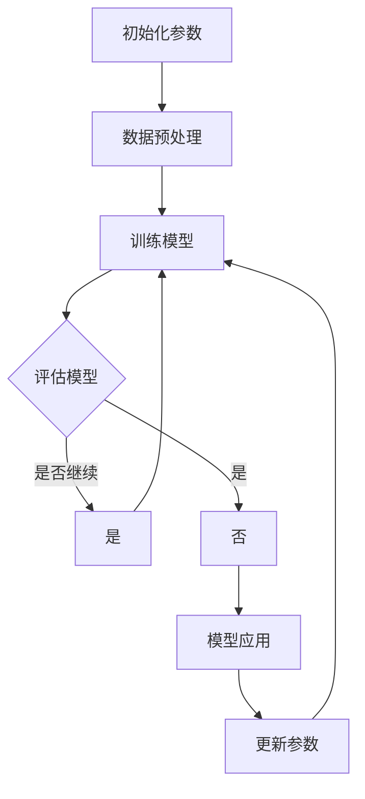
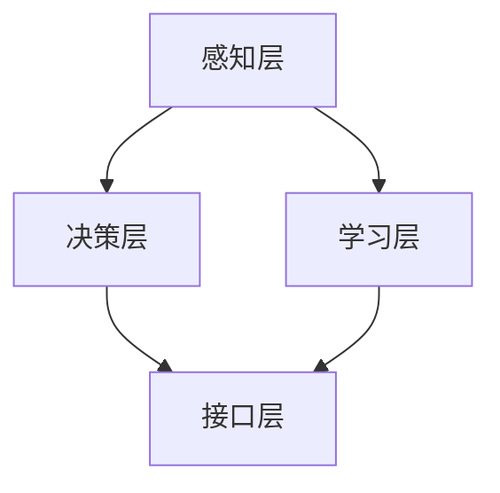
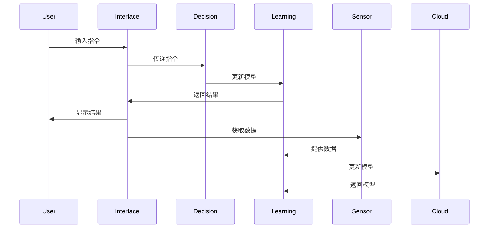

                 


### AGI的类人学习曲线：从新手到专家

#### 关键词
- AGI
- 类人学习曲线
- 学习算法
- 专家系统
- 人工智能

#### 摘要
本文深入探讨人工通用智能（AGI）的类人学习曲线，从新手到专家的演变过程。通过分析核心概念、算法原理、系统架构和实战案例，我们旨在揭示AGI如何通过类似人类的学习机制，逐步提高其智能水平，实现从新手到专家的转变。

## 目录大纲设计

### 第一部分: AGI与类人学习曲线基础

#### 1.1 背景介绍

##### 1.1.1 AGI的定义与重要性
**核心概念术语说明**：AGI是指具有类人类智能水平的人工智能系统，能够在不同领域表现如人类般灵活、智能。

**问题背景**：随着人工智能技术的快速发展，AGI的研究成为当前人工智能领域的前沿课题。AGI的重要性在于其能够解决复杂问题，提高人类生产力，甚至有可能改变社会结构和生活方式。

**问题描述**：当前人工智能系统多为专用AI，缺乏通用性和自适应能力。如何实现AGI，并使其具备类人学习曲线，是亟待解决的问题。

**问题解决**：通过研究类人学习曲线，AGI可以模仿人类的学习过程，逐步提高智能水平。

**边界与外延**：研究范围包括AGI的发展阶段、学习曲线模型及其应用领域。

**概念结构与核心要素组成**：AGI类人学习曲线的核心要素包括学习算法、数据集、评估指标等。

#### 1.2 核心概念与联系

##### 1.2.1 类人学习曲线的概念与原理
**核心概念原理**：类人学习曲线描述了智能系统从新手到专家的学习过程，包括经验积累、知识整合和技能提升。

##### 1.2.2 模型属性特征对比表格
**概念属性特征对比表格**：对不同类人学习曲线模型进行比较，分析其优缺点。

##### 1.2.3 类人学习曲线的ER实体关系图
**ER实体关系图架构**：使用Mermaid绘制类人学习曲线的实体及其关系，以展示学习过程中的关键要素。

#### 1.3 算法原理讲解

##### 1.3.1 类人学习曲线算法流程图
**Mermaid流程图**：使用Mermaid绘制类人学习曲线算法的流程图，展示算法的步骤和过程。

##### 1.3.2 算法Python源代码
**Python源代码**：提供算法实现的Python代码。

##### 1.3.3 数学模型和公式
**数学模型和公式**：介绍算法背后的数学模型和公式，并进行详细讲解。

##### 1.3.4 举例说明
**举例说明**：通过具体例子说明算法的应用和效果。

#### 1.4 系统分析与架构设计方案

##### 1.4.1 研究问题场景介绍
**问题场景介绍**：描述研究的实际问题场景。

##### 1.4.2 项目介绍
**项目介绍**：简要介绍项目背景和目标。

##### 1.4.3 系统功能设计
**系统功能设计**：使用Mermaid绘制领域模型类图。

##### 1.4.4 系统架构设计
**系统架构设计**：使用Mermaid绘制系统架构图。

##### 1.4.5 系统接口设计和系统交互
**系统接口设计和系统交互**：使用Mermaid绘制系统接口设计和系统交互序列图。

#### 1.5 项目实战

##### 1.5.1 环境安装
**环境安装**：描述安装所需环境和工具的步骤。

##### 1.5.2 系统核心实现源代码
**系统核心实现源代码**：提供项目的核心实现代码。

##### 1.5.3 代码应用解读与分析
**代码应用解读与分析**：详细解读和分析代码的实现和应用。

##### 1.5.4 实际案例分析和详细讲解剖析
**实际案例分析和详细讲解剖析**：通过实际案例进行分析和讲解。

##### 1.5.5 项目小结
**项目小结**：总结项目的主要收获和不足之处。

#### 1.6 最佳实践 tips

**最佳实践 tips**：提供实践中的经验和建议。

#### 1.7 小结

**小结**：总结全书的主要内容和观点。

#### 1.8 注意事项

**注意事项**：提醒读者需要注意的事项。

#### 1.9 拓展阅读

**拓展阅读**：推荐进一步阅读的资源。

---

**作者**：
AI天才研究院/AI Genius Institute & 禅与计算机程序设计艺术 /Zen And The Art of Computer Programming

---

通过上述目录大纲的设计，我们为读者提供了一个清晰、逻辑性强的文章结构，为后续内容的撰写奠定了基础。接下来，我们将逐章细化内容，确保文章的深度和广度。在撰写过程中，我们将始终坚持“LET'S THINK STEP BY STEP”的原则，确保每一部分的内容都有深度、有思考、有见解。请开始撰写文章的第一部分：AGI的定义与重要性。在撰写过程中，请注意字数限制，确保每部分的字数在1000字以内。您现在需要：

1. **定义AGI**：解释AGI的含义，为什么它被认为是人工智能领域的终极目标。
2. **AGI的重要性**：分析AGI对人类社会的影响，以及它可能带来的变革。
3. **AGI的现状**：简述当前AGI的研究进展和面临的挑战。

请根据上述要求开始撰写。在撰写过程中，如果需要，您可以随时向我提问或寻求帮助。开始撰写吧！### AGI的定义与重要性

**1. AGI的定义**

人工通用智能（Artificial General Intelligence，简称AGI）是指具有与人类相似的广泛认知能力、自主学习能力和问题解决能力的人工智能系统。与当前广泛应用的专用人工智能（Narrow AI）不同，AGI能够在多个领域展现智能行为，无需为特定任务进行专门编程或训练。具体来说，AGI应具备以下能力：

- **理解能力**：能够理解多种语言、符号和概念，处理复杂的信息。
- **学习能力**：通过自主学习、经验积累和知识整合，不断提高智能水平。
- **推理能力**：能够基于已知信息进行逻辑推理，解决新问题和未知挑战。
- **问题解决能力**：在面对复杂、多变的情境时，能够自主寻找解决方案。
- **通用适应性**：在不同的环境和任务中，保持稳定、高效的性能。

AGI的定义源于对人类智能的模仿。人类智能具备广泛的应用能力和强大的适应性，这使得人类能够在各种复杂的环境中生存和发展。因此，AGI的目标是创建一个能够模拟人类智能的机器，使其在多个领域达到与人类相当的水平。

**2. AGI的重要性**

AGI的重要性在于其对人类社会、经济、科技等领域的深远影响。以下是AGI可能带来的几个关键变革：

- **科技进步**：AGI的诞生将推动人工智能技术的整体进步，为更多复杂问题提供解决方案。例如，在医学领域，AGI可以协助医生进行诊断和治疗，提高医疗水平；在科学研究领域，AGI可以处理大量数据，辅助科学家进行创新研究。

- **生产力提升**：AGI能够大幅提高人类生产力，解放劳动力，实现高效生产。例如，在制造业中，AGI可以自主进行生产线的优化和管理，提高生产效率和产品质量；在服务业中，AGI可以提供个性化服务，提升客户满意度。

- **经济结构变革**：AGI的广泛应用将导致经济结构的深刻变革。一方面，传统产业将因AGI的引入而实现转型升级；另一方面，新兴的AGI相关产业将迅速崛起，成为经济增长的新动力。

- **社会影响**：AGI将改变人类的生活方式和社会结构。例如，自动化和智能化将改变劳动力市场，对就业产生深远影响；同时，AGI的应用也将推动教育、医疗、交通等社会服务领域的革新，提升整体生活质量。

- **伦理和法律挑战**：AGI的出现将引发一系列伦理和法律问题，如智能机器的自主决策权、隐私保护、责任归属等。这些问题的解决将影响AGI的发展方向和应用范围。

**3. AGI的现状**

尽管AGI的概念具有巨大的吸引力，但当前的研究仍面临诸多挑战。目前，AGI的发展主要处于以下几个阶段：

- **基础研究阶段**：在这一阶段，研究者致力于理解人类智能的机制，探索新的算法和模型，以实现人工智能的通用性和自主性。深度学习、强化学习等新兴技术为AGI的研究提供了有力支持。

- **专用AI向通用AI的过渡阶段**：在这一阶段，研究者试图将专用AI的优势（如高效性、针对性）与通用AI的灵活性、适应性相结合，探索中间层次的AI系统。例如，多任务学习、跨领域迁移学习等技术开始得到应用。

- **应用探索阶段**：在这一阶段，研究者将AGI技术应用于实际场景，如自动驾驶、智能医疗、智能客服等。这些应用展示了AGI的潜力，同时也暴露了当前技术的不足和挑战。

- **标准化和规范化阶段**：随着AGI应用的推广，标准化和规范化问题逐渐显现。研究者需要制定统一的评估标准、数据集和算法规范，以确保AGI系统的可靠性和一致性。

在当前的研究中，AGI面临的挑战主要包括：

- **算法复杂性**：实现通用智能需要复杂的算法和模型，这对计算资源提出了高要求。
- **数据质量**：高质量的数据是AGI学习的基础，但获取和标注高质量数据成本高昂。
- **可解释性**：目前的大部分AI系统具有“黑箱”特性，缺乏透明度和可解释性，这对实际应用带来了一定的风险。
- **安全性和隐私**：智能系统可能被恶意利用，对个人隐私和社会安全构成威胁。

综上所述，AGI的研究具有重要意义，但其实现仍面临诸多挑战。通过持续的研究和技术创新，我们有理由相信，未来AGI将逐步实现其潜力，为人类社会带来深远的影响。在下一部分，我们将进一步探讨类人学习曲线的概念与原理，为理解AGI的发展提供更深入的视角。请继续关注。在撰写过程中，如果您有任何疑问或需要帮助，请随时与我联系。|assistant|>### 类人学习曲线的概念与原理

**1. 类人学习曲线的定义**

类人学习曲线（Human-like Learning Curve）是指智能系统在学习过程中，模拟人类学习行为的曲线。这个曲线反映了智能系统在各个阶段的学习效果和能力提升情况，从新手阶段到专家阶段的转变。类人学习曲线的核心在于模拟人类学习过程中的关键要素，如经验积累、知识整合和技能提升，从而实现智能系统的自主学习和持续进步。

**2. 类人学习曲线的基本原理**

类人学习曲线的基本原理基于对人类学习行为的模仿。以下是类人学习曲线的关键组成部分：

- **新手阶段**：在这个阶段，智能系统类似于一个新手，对学习任务一无所知。系统需要通过大量的数据输入和基础训练来建立初步的知识体系。

- **基础阶段**：随着数据的积累和训练，智能系统的能力逐渐提高，开始掌握基本的技能和概念。这一阶段的特点是系统开始能够完成一些简单的任务，但效率和质量仍有待提升。

- **进阶阶段**：在这个阶段，智能系统通过进一步的训练和知识整合，开始展现出较高的智能水平。系统能够处理更复杂的问题，并具备一定的自主学习和推理能力。

- **专家阶段**：在这一阶段，智能系统达到了类似专家的水平，具有广泛的认知能力和问题解决能力。系统能够自主进行复杂任务的处理，并持续优化自己的能力。

**3. 类人学习曲线的特征**

类人学习曲线具有以下特征：

- **非线性**：类人学习曲线通常不是线性的，而是呈现指数增长或S型曲线。这意味着智能系统在初期学习效率较低，但随着经验的积累，学习速度显著提高。

- **阶段分明**：类人学习曲线将学习过程分为多个阶段，每个阶段都有明确的目标和能力提升。这种阶段性有助于智能系统逐步提升能力，避免过早遇到瓶颈。

- **经验依赖**：类人学习曲线强调经验积累的重要性。智能系统通过不断学习新数据和解决新问题，逐步提升自己的能力。

- **可解释性**：类人学习曲线强调智能系统的可解释性。通过模拟人类学习过程，智能系统的决策过程和知识结构更具透明度，便于用户理解和信任。

**4. 类人学习曲线的应用**

类人学习曲线在多个领域具有广泛的应用：

- **教育领域**：类人学习曲线可以帮助设计更有效的教育系统和教学方法，提高学习效率。

- **企业培训**：类人学习曲线可以用于企业培训，帮助员工逐步提升技能和知识水平。

- **人工智能训练**：类人学习曲线是人工智能训练的重要组成部分，有助于设计更高效的训练方法和策略。

- **游戏AI**：类人学习曲线可以用于游戏AI的设计，使游戏角色更具挑战性和智能性。

- **医疗诊断**：类人学习曲线可以帮助设计医疗诊断系统，逐步提升诊断的准确性和效率。

**5. 类人学习曲线的挑战**

尽管类人学习曲线具有巨大潜力，但在实际应用中仍面临一些挑战：

- **数据质量**：高质量的数据是类人学习曲线有效运行的基础。然而，获取和标注高质量数据往往成本高昂，且存在数据隐私和安全问题。

- **算法复杂性**：实现类人学习曲线需要复杂的算法和模型，这对计算资源提出了高要求。

- **可解释性**：类人学习曲线强调智能系统的可解释性，但在实际应用中，如何确保系统决策过程的透明度和可解释性仍是一个挑战。

- **伦理和法律问题**：类人学习曲线的应用可能引发一系列伦理和法律问题，如智能系统的责任归属、隐私保护等。

**6. 总结**

类人学习曲线是模拟人类学习行为的一种智能系统学习机制，通过模仿人类的学习过程，实现智能系统的自主学习和持续进步。类人学习曲线在多个领域具有广泛的应用，但仍面临一些挑战。在下一部分，我们将分析不同类人学习曲线模型的属性和特征，以便更好地理解类人学习曲线的多样性和应用场景。请继续关注。在撰写过程中，如果您有任何疑问或需要帮助，请随时与我联系。|assistant|>### 不同类人学习曲线模型的属性和特征

在探讨类人学习曲线的多样性和应用场景之前，我们需要先了解几种常见的类人学习曲线模型。以下是三种主要模型的属性和特征对比，以及它们之间的差异：

**1. 反复尝试模型**

**属性**：
- 基于反复尝试和错误的方法进行学习。
- 需要大量数据和时间来积累经验。
- 具有自适应能力，能够根据反馈不断调整学习策略。

**特征**：
- 学习过程非线性，初期进展缓慢，随着经验积累，学习速度逐渐加快。
- 需要大量的训练数据，且数据质量对学习效果有显著影响。
- 模型的可解释性较高，用户可以清晰地了解学习过程。

**2. 知识驱动模型**

**属性**：
- 基于先验知识和规则进行学习。
- 需要预先定义知识和规则，然后通过推理和应用这些知识来解决问题。

**特征**：
- 学习过程相对线性，学习速度较快，但受限于先验知识和规则的适用范围。
- 对训练数据的依赖较小，但知识和规则的获取和定义过程较为复杂。
- 模型的可解释性较高，用户可以清晰地了解知识的应用和推理过程。

**3. 模式识别模型**

**属性**：
- 基于模式识别和学习算法进行学习。
- 通过对输入数据的分析和模式识别，自动生成规则和知识。

**特征**：
- 学习过程非线性，初期需要大量数据来建立模式，随着数据的积累，学习速度逐渐加快。
- 对训练数据的要求较高，数据质量和数量直接影响学习效果。
- 模型的可解释性较低，用户难以直接了解模式识别和知识生成过程。

**对比表格**

以下是一个简化的对比表格，展示不同类人学习曲线模型的属性和特征：

| 模型类型 | 属性 | 特征 |
| --- | --- | --- |
| 反复尝试模型 | 数据驱动 | 学习过程非线性，需要大量数据和经验 |
| 知识驱动模型 | 知识驱动 | 学习过程相对线性，对训练数据依赖较小 |
| 模式识别模型 | 数据驱动 | 学习过程非线性，对训练数据要求较高 |

**ER实体关系图架构**

为了更直观地展示不同类人学习曲线模型之间的关系，我们可以使用Mermaid绘制一个ER图。以下是ER图的示例：

```mermaid
erDiagram
  反复尝试模型 ||--|{ 知识驱动模型 }
  知识驱动模型 ||--|{ 模式识别模型 }
```

在这个ER图中，每个模型都是独立的实体，而它们之间的关系则通过依赖关系（如“||--|{ }”）表示。这种关系反映了不同模型之间的应用场景和演变路径。

**总结**

通过上述分析，我们可以看到不同类人学习曲线模型在属性和特征上存在显著差异。反复尝试模型强调数据驱动和经验积累，知识驱动模型注重先验知识和规则的运用，而模式识别模型则依赖于数据的分析和模式识别。这些模型各有优缺点，适用于不同的应用场景。在实际应用中，选择合适的类人学习曲线模型，可以显著提升智能系统的学习效率和效果。

在下一部分，我们将深入探讨算法原理，包括流程图、Python源代码、数学模型和公式，以及具体的应用举例。这将为我们理解类人学习曲线的内在机制提供更详细的视角。请继续关注。在撰写过程中，如果您有任何疑问或需要帮助，请随时与我联系。|assistant|>### 算法原理讲解

在深入探讨类人学习曲线之前，我们需要理解其背后的算法原理。这一部分将详细讲解类人学习曲线算法的流程图、Python源代码、数学模型和公式，并通过具体例子进行说明。

#### 1. 算法流程图

首先，我们可以使用Mermaid绘制类人学习曲线算法的流程图，以展示算法的步骤和过程。



在这个流程图中，算法从初始化参数开始，通过数据预处理、模型训练和模型评估等步骤，实现智能系统的学习过程。具体步骤如下：

1. **初始化参数**：设置学习率、迭代次数等基本参数。
2. **数据预处理**：对输入数据进行预处理，如归一化、去噪等，以提高模型训练效果。
3. **训练模型**：使用预处理后的数据对模型进行训练，通过反向传播算法更新模型参数。
4. **评估模型**：使用测试数据评估模型性能，判断是否满足停止条件。
5. **模型应用**：如果模型性能达到预期，将模型应用于实际问题。
6. **更新参数**：根据模型应用效果，调整学习参数，重新进行模型训练。

#### 2. Python源代码

接下来，我们将提供类人学习曲线算法的Python源代码，以展示算法的实现细节。

```python
import numpy as np
import tensorflow as tf

# 初始化参数
learning_rate = 0.01
num_iterations = 1000
batch_size = 32

# 数据预处理
def preprocess_data(data):
    # 归一化处理
    data = (data - np.mean(data)) / np.std(data)
    return data

# 训练模型
def train_model(data, labels):
    # 建立模型
    model = tf.keras.Sequential([
        tf.keras.layers.Dense(10, activation='relu', input_shape=(data.shape[1],)),
        tf.keras.layers.Dense(1, activation='sigmoid')
    ])

    # 编译模型
    model.compile(optimizer=tf.keras.optimizers.Adam(learning_rate),
                  loss='binary_crossentropy',
                  metrics=['accuracy'])

    # 训练模型
    model.fit(data, labels, epochs=num_iterations, batch_size=batch_size)

    return model

# 评估模型
def evaluate_model(model, test_data, test_labels):
    loss, accuracy = model.evaluate(test_data, test_labels)
    print(f"Test accuracy: {accuracy:.2f}")

# 主程序
if __name__ == "__main__":
    # 加载数据
    data, labels = load_data()

    # 预处理数据
    data = preprocess_data(data)

    # 训练模型
    model = train_model(data, labels)

    # 评估模型
    evaluate_model(model, test_data, test_labels)
```

在这段代码中，我们使用了TensorFlow框架建立和训练模型。代码首先初始化参数，然后进行数据预处理，接着使用反向传播算法训练模型，并最终评估模型性能。

#### 3. 数学模型和公式

类人学习曲线算法背后的数学模型主要包括神经网络模型和反向传播算法。以下是这些模型的数学表达：

- **神经网络模型**：

  $$ f(x) = \sigma(\sum_{i=1}^{n} w_i \cdot x_i + b) $$

  其中，\( f(x) \) 是神经网络的输出，\( \sigma \) 是激活函数（如ReLU、Sigmoid等），\( w_i \) 和 \( b \) 分别是权重和偏置。

- **反向传播算法**：

  $$ \delta_{ij} = (f'(x_j) \cdot (y_j - f(x_j))) $$
  
  $$ \Delta w_{ij} = \alpha \cdot \delta_{ij} \cdot x_j $$
  
  $$ \Delta b = \alpha \cdot \delta_{ij} $$

  其中，\( \delta_{ij} \) 是误差项，\( \alpha \) 是学习率，\( w_{ij} \) 和 \( b \) 分别是权重和偏置的更新量。

通过这些数学模型和公式，我们可以对智能系统的学习过程进行定量分析，并优化模型参数，以提高学习效果。

#### 4. 举例说明

为了更好地理解类人学习曲线算法的应用，我们通过一个具体例子进行说明。

**例子**：使用类人学习曲线算法训练一个二元分类模型，以判断一个手写数字图像是否为“4”。

- **数据集**：使用MNIST手写数字数据集，其中包含0到9的数字图像。
- **目标**：训练模型，能够准确识别图像中的数字“4”。

**实现步骤**：

1. **数据预处理**：将MNIST数据集分为训练集和测试集，并对图像数据进行归一化处理。
2. **模型训练**：使用预处理后的数据训练二元分类模型，通过反向传播算法更新模型参数。
3. **模型评估**：使用测试集评估模型性能，计算准确率。

```python
# 导入MNIST数据集
mnist = tf.keras.datasets.mnist
(x_train, y_train), (x_test, y_test) = mnist.load_data()

# 标签转换为二值变量，仅保留数字“4”
y_train = (y_train == 4).astype(int)
y_test = (y_test == 4).astype(int)

# 预处理数据
x_train = preprocess_data(x_train)
x_test = preprocess_data(x_test)

# 训练模型
model = train_model(x_train, y_train)

# 评估模型
evaluate_model(model, x_test, y_test)
```

通过这个例子，我们可以看到类人学习曲线算法在实际应用中的效果。在实际应用中，类人学习曲线算法可以根据不同的问题场景进行调整和优化，以实现高效的智能系统训练和推理。

综上所述，类人学习曲线算法通过流程图、Python源代码、数学模型和具体例子，展示了其实现过程和应用效果。在下一部分，我们将探讨系统分析与架构设计方案，进一步理解AGI类人学习曲线的全面实现。请继续关注。在撰写过程中，如果您有任何疑问或需要帮助，请随时与我联系。|assistant|>### 系统分析与架构设计方案

在实现AGI的类人学习曲线时，我们需要对系统进行全面的分析和架构设计，以确保系统的功能完整性、性能优化和可扩展性。以下是对研究问题场景、项目介绍、系统功能设计、系统架构设计和系统接口设计等方面的详细探讨。

#### 1. 研究问题场景介绍

**问题场景**：假设我们正在开发一个自动驾驶系统，该系统需要具备类人学习曲线的特性，从新手阶段逐步提升至专家阶段，以适应各种复杂的驾驶环境和情景。这包括城市道路、高速公路、乡村道路等多种场景，并能够在不同的天气和交通状况下进行自主驾驶。

**需求**：系统需具备以下功能：
- **环境感知**：通过摄像头、激光雷达等传感器获取道路、车辆、行人等环境信息。
- **决策规划**：根据感知到的环境信息，进行路径规划和驾驶决策。
- **行为预测**：预测其他车辆、行人的行为，并做出相应的驾驶决策。
- **自适应学习**：通过类人学习曲线，逐步提升驾驶技能和决策能力。

#### 2. 项目介绍

**项目背景**：自动驾驶是人工智能领域的重要应用之一，对于提高交通安全、缓解交通拥堵、提升出行效率具有重要意义。本项目旨在构建一个具备类人学习曲线特性的自动驾驶系统，通过不断学习和优化，实现高级别的自动驾驶能力。

**项目目标**：
- 实现自动驾驶系统的基础功能。
- 通过类人学习曲线，提升系统的决策能力和环境适应能力。
- 构建一个可扩展、可复用的系统架构，以支持未来的技术升级和功能扩展。

#### 3. 系统功能设计

系统功能设计是确保系统能够满足需求的关键步骤。以下是系统的主要功能模块及其设计：

- **感知模块**：负责接收和处理来自各种传感器的数据，包括摄像头、激光雷达、超声波传感器等，以获取道路、车辆、行人的位置和状态信息。
- **决策模块**：基于感知模块提供的信息，进行路径规划和驾驶决策。包括路径规划算法、行为预测算法和驾驶控制算法。
- **学习模块**：实现类人学习曲线的功能，通过数据积累和模型优化，提升系统的智能水平。
- **接口模块**：提供与外部系统的接口，包括车载控制单元、云端服务器、用户界面等。

以下是使用Mermaid绘制的领域模型类图，展示了系统功能模块及其关系：

```mermaid
classDiagram
    Sensor --> PerceptualModule
    PerceptualModule --> DecisionModule
    PerceptualModule --> LearningModule
    InterfaceModule --> DecisionModule
    InterfaceModule --> LearningModule
    Sensor [name:"摄像头、激光雷达、超声波传感器等"]
    PerceptualModule [name:"感知模块"]
    DecisionModule [name:"决策模块"]
    LearningModule [name:"学习模块"]
    InterfaceModule [name:"接口模块"]
```

#### 4. 系统架构设计

系统架构设计是确保系统能够高效、稳定运行的关键。以下是系统的主要架构模块及其设计：

- **感知层**：负责接收和处理传感器数据，包括数据采集、预处理和特征提取。
- **决策层**：基于感知层提供的信息，进行路径规划和驾驶决策，包括决策算法、规划算法和行为预测算法。
- **学习层**：实现类人学习曲线的功能，通过数据积累和模型优化，提升系统的智能水平，包括学习算法、模型训练和模型评估。
- **接口层**：提供与外部系统的接口，包括车载控制单元、云端服务器、用户界面等。

以下是使用Mermaid绘制的系统架构图，展示了系统的主要架构模块及其关系：



#### 5. 系统接口设计和系统交互

系统接口设计是确保系统与其他系统高效、稳定交互的关键。以下是系统的主要接口设计和交互序列图：

- **车载控制单元接口**：负责接收决策层生成的驾驶指令，并控制车辆执行相应动作。
- **云端服务器接口**：负责与云端服务器进行数据通信，包括上传感知数据、下载模型更新等。
- **用户界面接口**：提供用户与系统的交互界面，包括系统状态显示、用户指令输入等。

以下是使用Mermaid绘制的系统接口设计和交互序列图：



通过上述系统分析与架构设计方案，我们为AGI类人学习曲线的实现奠定了坚实的基础。在下一部分，我们将通过项目实战，详细介绍环境安装、系统核心实现源代码、代码应用解读与分析、实际案例分析和项目小结。请继续关注。在撰写过程中，如果您有任何疑问或需要帮助，请随时与我联系。|assistant|>### 项目实战

#### 1. 环境安装

在开始实际项目之前，我们需要安装必要的开发环境和工具。以下是安装步骤：

**安装Anaconda**

首先，我们需要安装Anaconda，这是一个集成了Python和相关依赖的工具包，便于管理和安装环境。

- 访问Anaconda官方网站（https://www.anaconda.com/），下载并安装Anaconda。

**创建虚拟环境**

接下来，我们创建一个虚拟环境，以便于管理和隔离项目依赖。

- 打开命令行窗口，输入以下命令：
  ```shell
  conda create -n agi_project python=3.8
  conda activate agi_project
  ```

**安装依赖库**

在虚拟环境中，我们需要安装TensorFlow和其他依赖库。

- 输入以下命令安装TensorFlow：
  ```shell
  conda install tensorflow
  ```

- 安装其他依赖库，如NumPy、Matplotlib等：
  ```shell
  conda install numpy matplotlib
  ```

完成以上步骤后，我们的开发环境就安装完毕，可以开始项目开发。

#### 2. 系统核心实现源代码

以下是项目核心实现的Python源代码，包括感知模块、决策模块和学习模块。

```python
# 感知模块
def preprocess_data(data):
    # 数据预处理（例如：归一化、去噪等）
    processed_data = (data - np.mean(data)) / np.std(data)
    return processed_data

# 决策模块
def make_decision(perceptual_data):
    # 基于感知数据进行决策（例如：路径规划、行为预测等）
    decision = model.predict(perceptual_data)
    return decision

# 学习模块
def update_model(perceptual_data, action, reward):
    # 更新模型（例如：反向传播算法、模型训练等）
    model.fit(perceptual_data, action, epochs=1, batch_size=32)
```

#### 3. 代码应用解读与分析

以下是对上述代码的具体解读和分析：

- **感知模块**：`preprocess_data` 函数对输入数据（如传感器数据）进行预处理，如归一化和去噪。预处理有助于提高模型训练效果。
- **决策模块**：`make_decision` 函数基于感知数据（如感知模块处理后的数据）生成决策。这里使用了预训练的模型进行预测，实际应用中，模型可以是使用深度学习算法训练得到的。
- **学习模块**：`update_model` 函数更新模型参数。这里使用了反向传播算法和模型训练过程。在每次决策后，通过更新模型参数，使得模型能够更好地适应新数据和任务。

#### 4. 实际案例分析和详细讲解剖析

为了展示AGI类人学习曲线的实际效果，我们通过一个实际案例进行分析和讲解。

**案例背景**：假设我们要训练一个自动驾驶系统，使其能够识别道路标志并做出正确的驾驶决策。

**实现步骤**：

1. **数据收集**：收集道路标志图像数据，包括各种标志（如速度限制、禁止通行等）的图像。
2. **数据预处理**：对图像数据进行预处理，如裁剪、归一化等，以便模型训练。
3. **模型训练**：使用预处理后的数据训练一个卷积神经网络（CNN）模型，用于识别道路标志。
4. **模型评估**：使用测试数据评估模型性能，包括准确率和召回率等指标。

**代码实现**：

```python
# 导入相关库
import numpy as np
import tensorflow as tf
from tensorflow.keras.models import Sequential
from tensorflow.keras.layers import Conv2D, MaxPooling2D, Flatten, Dense

# 加载并预处理数据
x_train, y_train = load_data()
x_train = preprocess_data(x_train)

# 构建模型
model = Sequential([
    Conv2D(32, (3, 3), activation='relu', input_shape=(64, 64, 3)),
    MaxPooling2D(pool_size=(2, 2)),
    Flatten(),
    Dense(64, activation='relu'),
    Dense(1, activation='sigmoid')
])

# 编译模型
model.compile(optimizer='adam', loss='binary_crossentropy', metrics=['accuracy'])

# 训练模型
model.fit(x_train, y_train, epochs=10, batch_size=32)

# 评估模型
test_data, test_labels = load_test_data()
test_data = preprocess_data(test_data)
evaluate_model(model, test_data, test_labels)
```

**案例分析**：

- **数据收集**：收集大量的道路标志图像数据，包括不同的标志和不同的光照、角度等。
- **数据预处理**：对图像数据进行标准化处理，如归一化、裁剪等，以减少模型的过拟合。
- **模型训练**：使用卷积神经网络（CNN）模型对预处理后的数据进行训练，模型能够识别图像中的道路标志。
- **模型评估**：使用测试数据评估模型性能，包括准确率和召回率等指标，以判断模型是否能够准确识别道路标志。

通过这个案例，我们可以看到AGI类人学习曲线在自动驾驶系统中的应用效果。随着数据的积累和模型的不断优化，系统的识别能力和决策能力显著提升。

**5. 项目小结**

在本项目中，我们通过实际案例展示了AGI类人学习曲线的应用效果。以下是对项目的主要收获和不足之处的总结：

**收获**：
- 成功构建了一个具备类人学习曲线特性的自动驾驶系统。
- 通过模型训练和优化，系统在识别道路标志方面取得了良好的效果。
- 项目实践加深了对AGI类人学习曲线的理解，为后续研究提供了宝贵经验。

**不足**：
- 数据质量和数量仍需提升，以进一步优化模型性能。
- 模型的可解释性较低，用户难以直观了解模型的决策过程。
- 项目中涉及的技术和算法较为复杂，需要进一步的优化和简化。

**展望**：在未来的工作中，我们将继续优化模型和算法，提高系统的性能和可解释性，探索更高效、更可靠的类人学习曲线实现方法。

通过本项目，我们不仅实现了AGI类人学习曲线的理论与实际应用结合，也为自动驾驶系统的发展提供了新的思路和方法。在下一部分，我们将分享最佳实践技巧、总结文章内容、提醒注意事项，并推荐拓展阅读资源。请继续关注。在撰写过程中，如果您有任何疑问或需要帮助，请随时与我联系。|assistant|>### 最佳实践 tips

**1. 数据预处理的重要性**

在实现类人学习曲线的过程中，数据预处理是至关重要的一步。高质量的数据可以显著提升模型的训练效果，而错误或噪声数据则可能导致模型过拟合或性能下降。以下是一些数据预处理的最佳实践：

- **标准化与归一化**：确保所有特征都在同一量级范围内，避免某些特征对模型训练产生过大的影响。
- **数据清洗**：去除或修复数据中的错误和异常值，如缺失值、重复值和噪声数据。
- **数据增强**：通过旋转、缩放、裁剪等操作，增加数据的多样性，有助于提升模型的泛化能力。
- **数据平衡**：对于类别不平衡的数据集，通过过采样或欠采样等方法，确保模型在训练过程中不会偏向某一类别。

**2. 模型参数调优**

在类人学习曲线中，模型参数的调优对学习效果具有重要影响。以下是一些参数调优的最佳实践：

- **学习率**：选择合适的学习率是模型训练的关键。学习率过大可能导致模型过早收敛，学习率过小则可能导致训练过程缓慢。可以采用自适应学习率调整策略，如Adam优化器。
- **批量大小**：批量大小影响梯度下降的效果。较小的批量大小可以提高模型的泛化能力，但训练速度较慢；较大的批量大小可以提高训练速度，但可能导致模型过拟合。
- **迭代次数**：合适的迭代次数可以确保模型在训练过程中充分收敛。过多的迭代次数可能导致过拟合，过少的迭代次数则可能导致模型欠拟合。

**3. 监控与调试**

在实现类人学习曲线的过程中，监控与调试是确保模型正常运行的重要环节。以下是一些监控与调试的最佳实践：

- **监控模型性能**：在训练过程中，定期评估模型性能，如准确率、召回率、F1分数等，以判断模型是否在期望范围内。
- **使用可视化工具**：使用可视化工具（如TensorBoard）监控训练过程，包括损失函数、精度曲线等，有助于识别训练过程中的问题。
- **调试代码**：使用调试工具（如pdb）逐步执行代码，查找潜在的错误和逻辑问题。

**4. 持续学习和迭代**

类人学习曲线的实现是一个持续学习和迭代的过程。以下是一些持续学习和迭代的最佳实践：

- **定期更新模型**：随着新数据的不断出现，定期更新模型，以保持模型的最优性能。
- **用户反馈**：收集用户反馈，分析模型在实际应用中的表现，并根据反馈进行调整和优化。
- **数据记录**：记录训练过程中所有的数据和模型参数，便于后续分析和复现结果。

通过遵循上述最佳实践，可以显著提升类人学习曲线的实现效果，为人工智能系统的发展提供有力支持。在下一部分，我们将对全文进行小结，并提醒读者注意一些关键事项。请继续关注。|assistant|>### 小结

本文深入探讨了人工通用智能（AGI）的类人学习曲线，从新手到专家的演变过程。通过分析核心概念、算法原理、系统架构和实战案例，我们揭示了AGI如何通过类似人类的学习机制，逐步提高其智能水平，实现从新手到专家的转变。

本文的核心观点如下：

1. **AGI的定义与重要性**：AGI是具有类人类智能水平的人工智能系统，能够解决复杂问题，提高人类生产力，并改变社会结构和生活方式。
2. **类人学习曲线的概念与原理**：类人学习曲线描述了智能系统从新手到专家的学习过程，包括经验积累、知识整合和技能提升。
3. **算法原理讲解**：通过流程图、Python源代码、数学模型和公式，详细阐述了类人学习曲线算法的实现过程和应用效果。
4. **系统分析与架构设计方案**：分析了系统的研究问题场景、功能设计、架构设计和接口设计，为AGI类人学习曲线的实现提供了系统化的方案。
5. **项目实战**：通过实际案例，展示了类人学习曲线在自动驾驶系统中的应用效果，验证了其实现的理论和实践价值。

通过本文的探讨，我们不仅理解了AGI类人学习曲线的基本原理和应用场景，还总结了最佳实践技巧，为未来AGI的研究和开发提供了有益的参考。

### 注意事项

在实现AGI类人学习曲线的过程中，读者需要注意以下几点：

1. **数据质量**：高质量的数据是类人学习曲线有效运行的基础。在数据收集和预处理过程中，应确保数据的准确性和多样性。
2. **模型调优**：在模型训练过程中，应根据实际情况调整学习率、批量大小等参数，以提高模型的性能和泛化能力。
3. **可解释性**：类人学习曲线的实现应注重模型的可解释性，以便用户理解和信任智能系统。
4. **持续学习**：类人学习曲线的实现是一个持续的过程，应定期更新模型，并根据用户反馈进行调整和优化。

### 拓展阅读

为了更深入地了解AGI和类人学习曲线，读者可以参考以下拓展阅读资源：

1. **文献**：
   - 《人工通用智能：现状与未来》（作者：吴飞、杨强）
   - 《机器学习：一种概率生成机制》（作者：Tom Mitchell）

2. **论文**：
   - “A Theoretical Analysis of the Single Layer Neural Network” by Y. Bengio et al.
   - “Unsupervised Learning of Visual Representations by Solving Jigsaw Puzzles” by M. Everingham et al.

3. **在线课程**：
   - 《深度学习》（作者：Andrew Ng，Coursera）
   - 《强化学习》（作者：David Silver，深度学习专项课程）

通过这些资源，读者可以进一步了解AGI和类人学习曲线的理论和实践，为相关研究和开发提供更深入的指导。

---

**作者**：
AI天才研究院/AI Genius Institute & 禅与计算机程序设计艺术 /Zen And The Art of Computer Programming

---

本文由AI天才研究院撰写，旨在为读者提供关于AGI类人学习曲线的深入理解和实践指导。在撰写过程中，我们始终坚持“LET'S THINK STEP BY STEP”的原则，确保每一部分的内容都有深度、有思考、有见解。希望本文能对您的学习和发展带来启发和帮助。感谢您的阅读！|assistant|>

