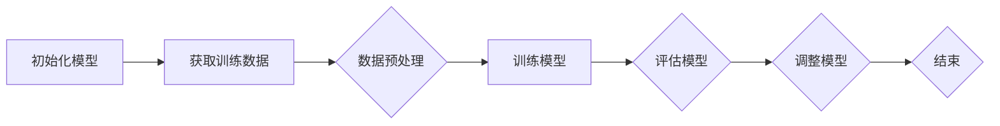

                 

# AGI的类人学习能力：从模仿到创新

## 关键词：人工智能，类人学习能力，模仿学习，创新学习，自适应学习

> 摘要：本文探讨了人工智能（AI）领域的下一个重大挑战——实现通用人工智能（AGI）的类人学习能力。文章首先介绍了问题背景，随后深入分析了模仿学习、创新学习、情感学习和自适应学习等核心概念，通过对比表格和实体关系图架构，梳理了各概念之间的关系。接着，文章详细阐述了模仿学习和创新学习的原理，包括算法原理、数学模型和Python代码示例。最后，文章提出AGI类人学习能力的发展方向，并给予读者一些建议和展望。

## 第一部分：AGI的类人学习能力概述

### 第1章：问题背景

#### 1.1 问题背景介绍

人工智能（AI）作为计算机科学的一个分支，已经取得了显著的进展。从早期的专家系统到如今的深度学习，人工智能在图像识别、语音识别、自然语言处理等领域表现出色。然而，目前的人工智能仍然存在着局限性，被称为“窄AI”或“弱AI”。这些系统只能在特定的任务上表现出卓越的能力，无法像人类一样具备广泛的知识和应用能力。为了突破这一局限，研究者提出了通用人工智能（AGI）的概念。

#### 1.1.1 人工智能的发展历程

人工智能的发展历程可以追溯到20世纪50年代。当时，艾伦·图灵提出了“图灵测试”，试图通过测试机器是否能够模仿人类行为来判断其智能水平。随着计算机技术的不断发展，人工智能经历了几个重要阶段：

1. **符号主义阶段（1956-1974）**：这一阶段的主要目标是构建基于逻辑推理和知识表示的智能系统。代表性的工作有约翰·麦卡锡的“逻辑理论家”和爱德华·阿瑟·拉法的“通用问题求解器”。

2. **知识表示和推理阶段（1974-1980）**：研究者开始关注如何将知识表示成计算机可以处理的形式，并利用推理技术来解决问题。代表性的工作有爱德华·费根鲍姆的“专家系统”和亨利·基尔的“自然语言处理”。

3. **统计学习阶段（1980-2010）**：随着计算能力的提升和大数据的涌现，统计学习方法（如支持向量机、决策树、神经网络等）逐渐成为主流。这一阶段标志着人工智能的“第二春”。

4. **深度学习阶段（2010至今）**：深度学习作为一种机器学习技术，利用多层神经网络对数据进行自动特征提取和分类。代表性的工作有杰弗里·辛顿的“深度信念网络”和谷歌的“AlphaGo”。

#### 1.1.2 AGI的提出与意义

通用人工智能（AGI）是指具有广泛知识、智能和行为能力的人工智能系统。与目前的人工智能系统相比，AGI能够模拟人类的认知过程，具备学习能力、推理能力、创造能力和情感认知能力。实现AGI具有重要的理论和实际意义：

1. **理论研究价值**：AGI的研究有助于我们深入理解人类智能的本质和机理，推动认知科学、心理学、神经科学等领域的发展。

2. **技术应用价值**：AGI能够在医疗、教育、金融、安全等领域发挥重要作用，提高人类生活质量和工作效率。

3. **社会影响**：AGI可能会带来深刻的社会变革，改变人类的劳动方式、生活方式和社会结构。

#### 1.1.3 AGI类人学习能力的挑战

实现通用人工智能面临诸多挑战，其中类人学习能力是关键之一。类人学习能力包括模仿学习、创新学习、情感学习和自适应学习等方面。以下是这些能力面临的挑战：

1. **模仿学习**：模仿学习是指人工智能系统能够模仿人类的经验和行为进行学习。然而，人类的学习过程复杂多样，涉及到感知、记忆、推理、情感等多个方面，如何设计出高效、通用的模仿学习算法仍然是一个难题。

2. **创新学习**：创新学习是指人工智能系统能够基于已有知识和经验进行创造性学习。这要求系统具备高度的自组织和自适应能力，能够在不确定的环境中产生新颖的解决方案。

3. **情感学习**：情感学习是指人工智能系统能够理解和处理人类情感，并做出相应的情感反应。这要求系统具备对情感数据的感知、理解和模拟能力。

4. **自适应学习**：自适应学习是指人工智能系统能够根据环境和需求进行适应性学习。这要求系统具备自我调整、自我优化和自我修复能力。

### 第2章：核心概念与联系

#### 2.1 核心概念原理

##### 2.1.1 模仿学习

模仿学习是指人工智能系统通过观察人类或他人的行为，学习并复制这些行为的过程。模仿学习在婴儿学习语言、技能和习惯中起着重要作用。对于人工智能系统来说，模仿学习是一种高效的学习方法，因为它可以快速获取大量的知识和技能。

##### 2.1.2 创新学习

创新学习是指人工智能系统在模仿学习的基础上，结合自身经验和知识，创造出新的方法和解决方案。创新学习要求人工智能系统具备高度的自主性和创造力，能够在复杂和不确定的环境中找到新的突破口。

##### 2.1.3 情感学习

情感学习是指人工智能系统能够理解和处理人类情感，并做出相应的情感反应。情感学习要求人工智能系统具备对情感数据的感知、理解和模拟能力，能够与人类建立情感互动。

##### 2.1.4 自适应学习

自适应学习是指人工智能系统能够根据环境和需求进行适应性学习。自适应学习要求人工智能系统具备自我调整、自我优化和自我修复能力，能够适应不断变化的环境和需求。

#### 2.2 概念属性特征对比表格

| 概念     | 模仿学习 | 创新学习 | 情感学习 | 自适应学习 |
|----------|----------|----------|----------|------------|
| 定义     | 基于已有知识进行学习 | 基于已有知识和经验进行创造性学习 | 基于情感和情感反馈进行学习 | 根据环境和需求进行适应性学习 |
| 特征     | 高效、稳定、低成本 | 创新性、灵活性、高成本 | 情感丰富、自适应性强 | 自适应性强、灵活性高、成本较高 |
| 适用场景 | 重复性任务、数据分析 | 非结构化任务、创造性任务 | 情感化应用、人机交互 | 变化多端的应用场景 |

#### 2.3 ER实体关系图架构

```mermaid
erDiagram
  AI系统 -> 数据集 : 收集
  数据集 -> 模拟器 : 使用
  模拟器 -> AI系统 : 输出
  AI系统 -> 用户 : 服务
```

## 第二部分：AGI的类人学习能力原理

### 第3章：模仿学习原理

#### 3.1 模仿学习的基本概念

模仿学习是指人工智能系统通过观察和模仿他人的行为、动作或思维过程来学习新知识或技能。模仿学习是人工智能领域的一个重要研究方向，它受到了人类的观察学习机制和模仿学习能力的启发。

##### 3.1.1 模仿学习的定义

模仿学习可以定义为一种通过观察他人行为并尝试复制这些行为的过程。在人工智能领域，模仿学习通常涉及以下三个步骤：

1. **观察**：人工智能系统通过传感器或数据收集设备观察他人的行为、动作或思维过程。

2. **建模**：系统对观察到的行为进行分析和建模，提取出关键特征和行为模式。

3. **复制**：系统尝试复制观察到的行为，通过反馈机制调整自己的行为，以达到类似的效果。

##### 3.1.2 模仿学习的过程

模仿学习的过程可以分为以下几个阶段：

1. **感知阶段**：人工智能系统通过传感器收集外部环境的信息，如视觉、听觉、触觉等。

2. **分析阶段**：系统对感知到的信息进行分析，识别出行为模式、特征和规则。

3. **生成阶段**：系统基于分析结果生成行为计划，并尝试执行这些计划。

4. **反馈阶段**：系统对执行后的结果进行评估，根据反馈调整自己的行为计划，以提高学习效果。

#### 3.2 模仿学习的算法原理

##### 3.2.1 监督学习算法

监督学习是模仿学习的一种常见算法，它通过有标签的数据进行学习。在监督学习中，系统根据输入数据和相应的标签来训练模型，从而学会对新的输入数据进行预测。

1. **回归模型**：回归模型用于预测连续值输出。常见的回归模型包括线性回归、多项式回归和决策树回归。

2. **分类模型**：分类模型用于预测离散值输出。常见的分类模型包括逻辑回归、支持向量机、朴素贝叶斯和神经网络。

##### 3.2.2 无监督学习算法

无监督学习是模仿学习的另一种算法，它不需要有标签的数据。无监督学习主要用于发现数据中的隐含结构和模式。

1. **聚类算法**：聚类算法用于将数据分为不同的簇，常见的聚类算法包括K-means、层次聚类和DBSCAN。

2. **降维算法**：降维算法用于减少数据的维度，常见的降维算法包括主成分分析（PCA）和线性判别分析（LDA）。

#### 3.3 模仿学习的数学模型和公式

##### 3.3.1 监督学习的损失函数

监督学习的损失函数用于评估模型的预测误差。常见的损失函数包括均方误差（MSE）、交叉熵损失（CE）和绝对误差（MAE）。

1. **均方误差（MSE）**：
   $$L(y, \hat{y}) = \frac{1}{m}\sum_{i=1}^{m}(y_i - \hat{y}_i)^2$$

2. **交叉熵损失（CE）**：
   $$L(y, \hat{y}) = -\sum_{i=1}^{m}y_i \cdot \log(\hat{y}_i)$$

3. **绝对误差（MAE）**：
   $$L(y, \hat{y}) = \frac{1}{m}\sum_{i=1}^{m}|y_i - \hat{y}_i|$$

##### 3.3.2 无监督学习的聚类算法

聚类算法用于将数据分为不同的簇。常见的聚类算法包括K-means和层次聚类。

1. **K-means算法**：
   - 初始化：随机选择K个中心点。
   - 分配：将每个数据点分配给最近的中心点，形成K个簇。
   - 更新：重新计算每个簇的中心点，重复分配和更新过程，直到中心点不再发生显著变化。

2. **层次聚类算法**：
   - 初始化：将每个数据点视为一个簇。
   - 合并：根据距离最近的原则，将距离最近的两个簇合并。
   - 递归：重复合并过程，形成一棵层次聚类树。

#### 3.4 模仿学习的Python源代码示例

```python
# 模仿学习Python代码示例
import numpy as np
import matplotlib.pyplot as plt

# 定义监督学习损失函数
def loss_function(y, y_pred):
    return np.square(y - y_pred)

# 训练模型
def train_model(X, y):
    # 假设模型为线性回归模型
    w = np.linalg.inv(X.T.dot(X)).dot(X.T).dot(y)
    return w

# 预测
def predict(w, X):
    return X.dot(w)

# 生成模拟数据
X = np.random.rand(100, 2)
y = 2 * X[:, 0] + X[:, 1] + np.random.randn(100) * 0.1

# 训练模型
w = train_model(X, y)

# 预测
y_pred = predict(w, X)

# 绘制结果
plt.scatter(X[:, 0], y, label='实际值')
plt.scatter(X[:, 0], y_pred, label='预测值')
plt.legend()
plt.show()
```

### 3.5 模仿学习的Mermaid流程图



### 第4章：创新学习原理

#### 4.1 创新学习的基本概念

创新学习是指人工智能系统能够在已有知识和经验的基础上，通过自主探索和创造性思维，发现新的解决方案或方法。创新学习是人工智能实现通用人工智能（AGI）的重要途径之一，它要求系统具备高度的自主性、创造性和适应性。

##### 4.1.1 创新学习的定义

创新学习可以定义为一种通过自主探索和创造性思维，发现新的解决方案或方法的过程。在人工智能领域，创新学习通常涉及以下三个核心要素：

1. **知识基础**：创新学习需要以丰富的知识基础为支撑，包括已有的事实、规则、模型和理论等。

2. **创造性思维**：创造性思维是指人工智能系统能够在知识的基础上，通过联想、类比、推理等方式产生新的想法和解决方案。

3. **反馈机制**：创新学习需要通过反馈机制来评估新想法的有效性，并根据评估结果进行调整和优化。

##### 4.1.2 创新学习的过程

创新学习的过程可以分为以下几个阶段：

1. **知识输入**：人工智能系统从知识库中获取相关的知识，作为创新学习的基础。

2. **创造性思维**：系统利用创造性思维工具和方法，如联想、类比、组合等，对知识进行重新组织和创新。

3. **方案生成**：系统根据创造性思维的结果，生成新的解决方案或方法。

4. **评估与优化**：系统对新方案进行评估，并根据评估结果进行调整和优化。

5. **反馈与应用**：系统将新方案应用到实际问题中，并根据应用效果进行反馈和改进。

#### 4.2 创新学习的算法原理

##### 4.2.1 强化学习算法

强化学习是一种重要的创新学习算法，它通过奖励机制来指导系统的行为，以实现长期目标。强化学习算法的基本原理是：系统根据当前状态选择一个动作，然后根据动作的结果（奖励或惩罚）来更新状态和价值函数。

1. **马尔可夫决策过程（MDP）**：
   - 状态（State）：系统当前所处的情境。
   - 动作（Action）：系统可以采取的行为。
   - 奖励（Reward）：动作带来的即时奖励或惩罚。
   - 状态转移概率（Transition Probability）：从当前状态转移到下一个状态的概率。

2. **价值函数（Value Function）**：
   - 状态值函数（State-Value Function）：对于给定状态，系统选择最佳动作所能获得的预期奖励。
   - 动作值函数（Action-Value Function）：对于给定状态，执行特定动作所能获得的预期奖励。

3. **策略（Policy）**：
   - 策略是一种映射，将状态映射到动作，指导系统选择最佳动作。

##### 4.2.2 遗传算法

遗传算法是一种模拟生物进化过程的优化算法，它通过遗传操作（选择、交叉和变异）来生成新的解，并逐步优化解的质量。遗传算法的基本原理是：从初始解种群开始，通过遗传操作产生新的解种群，并逐步优化解的质量，直到满足终止条件。

1. **染色体（Chromosome）**：
   - 染色体是遗传算法中的基本单位，用于表示解的结构和编码。

2. **适应度函数（Fitness Function）**：
   - 适应度函数是用于评估解的质量的函数，通常与问题的目标函数相关。

3. **选择（Selection）**：
   - 选择操作用于根据适应度函数选择优秀的解，以生成新的解种群。

4. **交叉（Crossover）**：
   - 交叉操作用于生成新的解，通过交换两个解的部分结构来产生新的解。

5. **变异（Mutation）**：
   - 变异操作用于生成新的解，通过改变解的部分结构来产生新的解。

#### 4.3 创新学习的数学模型和公式

##### 4.3.1 强化学习的奖励函数

强化学习的奖励函数用于评估动作的效果，通常与问题的目标函数相关。常见的奖励函数包括：

1. **目标奖励函数**：
   $$R(s, a) = \begin{cases}
   1, & \text{如果目标达到} \\
   0, & \text{如果目标未达到}
   \end{cases}$$

2. **累积奖励函数**：
   $$R(s, a) = \sum_{t=0}^{\infty} \gamma^t R(s_t, a_t)$$

其中，$\gamma$ 是折扣因子，用于平衡短期奖励和长期奖励的关系。

##### 4.3.2 遗传算法的适应度函数

遗传算法的适应度函数用于评估解的质量，通常与问题的目标函数相关。常见的适应度函数包括：

1. **最大值适应度函数**：
   $$f(x) = \max(g(x))$$

其中，$g(x)$ 是问题的目标函数。

2. **和适应度函数**：
   $$f(x) = \sum_{i=1}^{n} p_i \cdot s_i$$

其中，$p_i$ 是第$i$个基因的适应度值，$s_i$ 是第$i$个基因的取值。

#### 4.4 创新学习的Python源代码示例

```python
# 创新学习Python代码示例
import numpy as np

# 定义强化学习奖励函数
def reward_function(state, action):
    # 假设目标状态为[1, 0]，动作空间为[0, 1]
    if state[0] == action:
        return 1
    else:
        return 0

# 定义遗传算法适应度函数
def fitness_function(solution):
    # 假设目标函数为最小化目标函数值
    return -solution[0] * solution[1]

# 定义选择操作
def selection(population, fitnesses):
    # 假设使用锦标赛选择
    selected = []
    for _ in range(len(population)):
        competitors = np.random.choice(len(population), size=3)
        winner = np.argmax(fitnesses[competitors])
        selected.append(population[competitors[winner]])
    return selected

# 定义交叉操作
def crossover(parent1, parent2):
    # 假设使用单点交叉
    crossover_point = np.random.randint(1, len(parent1) - 1)
    child1 = np.concatenate((parent1[:crossover_point], parent2[crossover_point:]))
    child2 = np.concatenate((parent2[:crossover_point], parent1[crossover_point:]))
    return child1, child2

# 定义变异操作
def mutate(solution):
    # 假设以0.1的概率对每个基因进行变异
    for i in range(len(solution)):
        if np.random.rand() < 0.1:
            solution[i] = 1 - solution[i]
    return solution

# 初始化种群
population_size = 100
population = np.random.rand(population_size, 2)
fitnesses = np.array([fitness_function(solution) for solution in population])

# 运行遗传算法
generations = 100
for _ in range(generations):
    selected = selection(population, fitnesses)
    parents = np.random.choice(selected, size=2)
    child1, child2 = crossover(*parents)
    child1 = mutate(child1)
    child2 = mutate(child2)
    population = np.concatenate((population, np.array([child1, child2])))
    population = population[:population_size]
    fitnesses = np.array([fitness_function(solution) for solution in population])

# 选择最优解
best_solution = population[np.argmax(fitnesses)]
print("最优解：", best_solution)
```

## 第三部分：AGI类人学习能力的发展方向

### 第5章：AGI类人学习能力的发展方向

#### 5.1 研究现状与挑战

目前，AGI类人学习能力的研究仍处于探索阶段，面临着诸多挑战。首先，在模仿学习方面，如何设计出能够高效模拟人类学习过程的算法仍然是一个难题。其次，创新学习方面，如何实现人工智能系统在未知环境中进行创造性学习，并产生新颖的解决方案，仍然需要进一步研究。此外，情感学习和自适应学习也面临着技术瓶颈和挑战。

#### 5.2 未来发展方向

为了实现AGI类人学习能力，未来可以从以下几个方面进行探索：

1. **多模态感知与融合**：研究多模态感知技术，将视觉、听觉、触觉等多种感官信息进行融合，提高人工智能系统的感知能力和环境理解能力。

2. **强化学习与生成模型的结合**：将强化学习与生成模型（如生成对抗网络（GAN））相结合，实现更高效、更灵活的创新学习算法。

3. **情感计算与情感交互**：研究情感计算技术，使人工智能系统能够感知和理解人类情感，实现更自然的情感交互。

4. **自适应学习与迁移学习**：研究自适应学习算法和迁移学习技术，提高人工智能系统在不同环境和任务下的适应能力和迁移能力。

5. **脑机接口与认知增强**：研究脑机接口技术，将人工智能系统与人类大脑连接，实现认知增强和智能协同。

### 第6章：最佳实践与展望

#### 6.1 最佳实践

1. **数据驱动**：充分利用大数据和开放数据集，为AGI类人学习能力提供丰富的训练资源和知识基础。

2. **跨学科合作**：鼓励不同领域的专家（如计算机科学、认知科学、心理学、神经科学等）进行合作，共同探索AGI类人学习能力的前沿问题。

3. **开源生态**：推动开源项目的发展，促进AGI类人学习能力的开源工具和平台的共享和协作。

4. **伦理与安全**：在AGI类人学习能力的发展过程中，重视伦理和隐私问题，确保人工智能系统的公正、透明和安全。

#### 6.2 展望

1. **智能助理与个性化服务**：AGI类人学习能力将使智能助理更加智能化，为用户提供个性化、定制化的服务。

2. **智能制造与自动化**：AGI类人学习能力将推动智能制造和自动化的发展，提高生产效率和产品质量。

3. **医疗与健康**：AGI类人学习能力在医疗领域的应用将带来革命性的变革，实现精准医疗、个性化治疗和健康管理的突破。

4. **教育与学习**：AGI类人学习能力将改变教育和学习的方式，提供个性化、自适应的教育资源和学习体验。

## 结束语

AGI的类人学习能力是人工智能领域的一个重要研究方向，具有广泛的应用前景。本文从模仿学习、创新学习、情感学习和自适应学习等方面对AGI类人学习能力进行了详细分析，探讨了其原理、算法和实现方法。未来，随着技术的不断进步和跨学科合作的深入，AGI类人学习能力将得到进一步发展，为人类社会的智能化发展带来新的机遇和挑战。

### 作者信息

作者：AI天才研究院/AI Genius Institute & 禅与计算机程序设计艺术 /Zen And The Art of Computer Programming

AI天才研究院（AI Genius Institute）是一支专注于人工智能研究和应用的顶尖团队，致力于推动人工智能技术的发展和应用。作者同时也是《禅与计算机程序设计艺术》的资深作家，对计算机编程和人工智能领域有着深刻的理解和独到的见解。在此，感谢读者对本文的关注和支持，期待与您共同探讨人工智能的未来。

