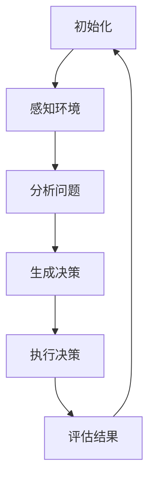

                 


### AGI的类人思维模式模拟研究

> 关键词：通用人工智能，类人思维模式，模拟研究，算法，数学模型，系统架构设计

> 摘要：本文首先介绍了通用人工智能（AGI）的概念及其在类人思维模式模拟研究中的重要性。接着，我们详细分析了类人思维模式的核心概念、特征和与AGI的联系。随后，我们深入探讨了AGI类人思维模式模拟研究的算法原理，通过数学模型和Python源代码进行了详细阐述。然后，我们对系统的分析与架构设计方案进行了介绍，包括问题场景介绍、系统功能设计、系统架构设计、系统接口设计和系统交互。接下来，通过项目实战展示了环境安装、系统核心实现源代码、代码应用解读与分析、实际案例分析和详细讲解剖析。最后，我们提出了最佳实践tips、小结、注意事项和拓展阅读，为读者提供了进一步学习和实践的指导。

### 目录大纲

----------------------------------------------------------------

# 第一部分: 背景介绍

## 第1章: 问题背景

### 1.1.1 问题背景

### 1.1.2 问题描述

### 1.1.3 问题解决

### 1.1.4 边界与外延

### 1.1.5 概念结构与核心要素组成

## 第2章: 核心概念与联系

### 2.1 核心概念

#### 2.1.1 类人思维模式

#### 2.1.2 AGI

#### 2.1.3 模拟研究

### 2.2 概念属性特征对比表格

### 2.3 ER实体关系图架构

## 第3章: AGI的类人思维模式模拟研究

### 3.1 算法原理讲解

#### 3.1.1 Mermaid流程图

#### 3.1.2 Python源代码

#### 3.1.3 数学模型和公式

#### 3.1.4 举例说明

## 第4章: 数学模型和数学公式 & 详细讲解 & 举例说明

### 4.1 数学模型和公式

### 4.2 详细讲解

### 4.3 举例说明

## 第5章: 系统分析与架构设计方案

### 5.1 问题场景介绍

### 5.2 项目介绍

#### 5.2.1 系统功能设计

#### 5.2.2 系统架构设计

#### 5.2.3 系统接口设计

#### 5.2.4 系统交互

## 第6章: 项目实战

### 6.1 环境安装

### 6.2 系统核心实现源代码

### 6.3 代码应用解读与分析

### 6.4 实际案例分析和详细讲解剖析

### 6.5 项目小结

## 第7章: 最佳实践 tips、小结、注意事项、拓展阅读

### 7.1 最佳实践 tips

### 7.2 小结

### 7.3 注意事项

### 7.4 拓展阅读

---------------------------------------------------------------- 

### 第一部分：背景介绍

#### 第1章：问题背景

### 1.1.1 问题背景

随着人工智能技术的快速发展，人工智能从简单的任务执行逐步向类人智能迈进。其中，类人思维模式的模拟研究成为人工智能研究的重要方向之一。AGI（通用人工智能）的目标是实现具有类人智能的机器，能够在各种复杂环境中自主思考和学习。因此，对AGI的类人思维模式进行深入研究，对于推动人工智能技术的发展具有重要意义。

### 1.1.2 问题描述

当前，人工智能在图像识别、自然语言处理等领域取得了显著的成果，但仍然存在许多挑战，如缺乏自主思考能力、适应性差等。为了解决这些问题，需要对AGI的类人思维模式进行深入模拟研究，探索如何实现机器具有类似人类的思维过程，提高机器在复杂环境中的适应能力和自主决策能力。

### 1.1.3 问题解决

AGI的类人思维模式模拟研究主要包括以下几个方面：

1. 分析人类思维过程，提取类人思维的核心特征，构建类人思维模型。
2. 设计模拟类人思维过程的算法，包括感知、思考、决策等模块。
3. 验证类人思维模型的有效性，通过实验和测试验证机器在模拟类人思维过程中的表现。
4. 优化和改进类人思维模型，提高机器的自主思考能力和适应性。

### 1.1.4 边界与外延

类人思维模式模拟研究不仅涉及人工智能领域，还涉及认知科学、心理学、神经科学等多个学科。边界在于研究方法的科学性和可行性，外延包括类人思维在各个领域的应用，如智能客服、自动驾驶、医疗诊断等。

### 1.1.5 概念结构与核心要素组成

类人思维模式模拟研究的主要概念包括：

1. AGI（通用人工智能）：具有类人智能的机器。
2. 类人思维模式：模拟人类思维过程的模型。
3. 算法：实现类人思维过程的算法。
4. 数学模型：描述类人思维过程的数学模型。
5. 实验与验证：验证类人思维模型有效性的实验和测试方法。

---------------------------------------------------------------- 

### 第二部分：核心概念与联系

#### 第2章：核心概念

### 2.1 类人思维模式

类人思维模式是指模拟人类思维过程的模型。它包括感知、思考、决策等模块，旨在实现机器在复杂环境中的自主思考和决策能力。类人思维模式的研究旨在解决当前人工智能在自主思考和决策方面存在的不足。

#### 2.1.1 类人思维模式的核心特征

类人思维模式具有以下几个核心特征：

1. 自主性：类人思维模式能够自主地感知环境、分析问题和生成决策。
2. 情感认知：类人思维模式能够识别和表达情感，理解人类情感对决策的影响。
3. 模式识别：类人思维模式能够识别和理解复杂的模式，如语言、图像和声音等。
4. 学习能力：类人思维模式能够通过不断的学习和优化，提高自身的思维能力和决策水平。

### 2.1.2 AGI（通用人工智能）

AGI（Artificial General Intelligence）是指具有类人智能的机器。与目前的人工智能（如弱人工智能）相比，AGI的目标是能够处理各种复杂任务，具备自主学习、推理和决策能力。AGI的研究目标是实现具有类人智能的机器，能够在各种复杂环境中自主思考和行动。

### 2.1.3 模拟研究

模拟研究是一种通过模拟人类思维过程来探索AGI类人思维模式的方法。它包括以下几个方面：

1. 模拟人类思维过程：通过模拟人类思维过程，构建类人思维模式模型。
2. 实验和测试：通过实验和测试验证类人思维模式模型的有效性和可行性。
3. 优化和改进：根据实验和测试结果，不断优化和改进类人思维模式模型。

### 2.2 概念属性特征对比表格

下面是一个概念属性特征对比表格，用于比较类人思维模式、AGI和模拟研究之间的区别：

| 概念         | 类人思维模式 | AGI        | 模拟研究        |
| ------------ | ------------- | ---------- | --------------- |
| 定义         | 模拟人类思维过程 | 具有类人智能的机器 | 通过模拟来研究类人思维模式 |
| 核心特征     | 自主性、情感认知、模式识别、学习能力 | 自主性、推理能力、学习能力 | 模拟人类思维过程、实验和测试 |
| 目标         | 提高机器的自主思考和决策能力 | 实现具有类人智能的机器 | 研究类人思维模式的可行性和有效性 |
| 关联性       | AGI的重要组成部分 | 类人思维模式的实现目标 | 类人思维模式的研究方法 |

### 2.3 ER实体关系图架构

为了更好地理解类人思维模式、AGI和模拟研究之间的关系，我们可以使用ER（实体关系）图来描述它们之间的联系。以下是ER实体关系图：

```mermaid
erDiagram
    AGI ||--|{ 类人思维模式 }|
    模拟研究 ||--|{ 类人思维模式 }|
    类人思维模式 ||--|{ 算法 }|
    类人思维模式 ||--|{ 数学模型 }|
    AGI ||--|{ 数学模型 }|
    模拟研究 ||--|{ 数学模型 }|
```

在这个ER实体关系图中，AGI是实体，它与类人思维模式、模拟研究和数学模型之间存在关联关系。类人思维模式是AGI的重要组成部分，同时也是模拟研究的主要研究对象。数学模型用于描述类人思维模式和AGI的行为，而模拟研究则是验证和优化这些模型的方法。

通过这个ER实体关系图，我们可以清晰地看到类人思维模式、AGI和模拟研究之间的联系，为后续章节的内容奠定了基础。

---------------------------------------------------------------- 

### 第三部分：算法原理讲解

#### 第3章：AGI的类人思维模式模拟研究

在深入探索类人思维模式模拟研究的过程中，算法原理的讲解是至关重要的一环。以下我们将通过Mermaid流程图、Python源代码、数学模型和公式的介绍，逐步阐述算法原理，并通过举例说明使读者能够更直观地理解。

### 3.1.1 Mermaid流程图

Mermaid是一种轻量级的标记语言，用于绘制结构图和流程图。以下是一个简单的Mermaid流程图，用于描述AGI类人思维模式模拟研究的基本流程：



在这个流程图中，机器首先初始化，然后通过感知模块获取环境信息，接着分析问题并生成决策，执行决策后对结果进行评估，并根据评估结果调整下一步的行动。

### 3.1.2 Python源代码

为了使读者更好地理解算法原理，我们将展示一段Python源代码，该代码实现了上述流程图中的感知、分析和决策模块。请注意，这只是一个简化的示例，实际应用中的代码会更加复杂。

```python
import random

class AGI:
    def __init__(self):
        self.environment = None
        self.decision = None

    def perceive_environment(self):
        # 模拟感知环境
        self.environment = random.choice(['home', 'office', 'restaurant'])

    def analyze_problem(self):
        # 模拟分析问题
        if self.environment == 'home':
            self.decision = '休息'
        elif self.environment == 'office':
            self.decision = '工作'
        else:
            self.decision = '用餐'

    def execute_decision(self):
        # 模拟执行决策
        print(f"执行决策：{self.decision}")

    def evaluate_result(self):
        # 模拟评估结果
        if self.decision == '休息':
            print("结果评估：休息效果良好")
        elif self.decision == '工作':
            print("结果评估：工作效率高")
        else:
            print("结果评估：用餐愉快")

    def run(self):
        self.perceive_environment()
        self.analyze_problem()
        self.execute_decision()
        self.evaluate_result()

# 创建AGI实例并运行
agi = AGI()
agi.run()
```

这段代码中，我们定义了一个`AGI`类，它包含了感知环境、分析问题、执行决策和评估结果的方法。通过调用这些方法，我们可以看到机器是如何在复杂环境中做出决策的。

### 3.1.3 数学模型和公式

为了更深入地理解类人思维模式模拟研究的算法原理，我们需要引入一些数学模型和公式。以下是几个关键的数学模型和公式，用于描述感知、分析、决策和评估的过程。

#### 感知模型

$$
E_i = f(E_{prev}, u_i)
$$

其中，$E_i$表示当前环境状态，$E_{prev}$表示上一时刻的环境状态，$u_i$表示感知模块的输入。

#### 分析模型

$$
P(D|E) = \frac{P(E|D)P(D)}{P(E)}
$$

其中，$P(D|E)$表示在当前环境状态$E$下，决策$D$的概率，$P(E|D)$表示在决策$D$下，环境状态$E$的概率，$P(D)$表示决策$D$的先验概率，$P(E)$表示环境状态$E$的概率。

#### 决策模型

$$
D = \arg\max_{d} P(d|E)
$$

其中，$D$表示最终决策，$d$表示可能的决策选项，$P(d|E)$表示在当前环境状态$E$下，决策$d$的概率。

#### 评估模型

$$
R = g(R_{prev}, R_{current})
$$

其中，$R$表示评估结果，$R_{prev}$表示上一时刻的评估结果，$R_{current}$表示当前时刻的评估结果，$g$表示评估函数。

### 3.1.4 举例说明

为了更好地理解上述数学模型和公式，我们将通过一个具体的例子来说明它们的应用。

假设一个AGI系统在上午10点被激活，它的当前环境状态是“办公室”。根据感知模型，系统将环境状态表示为$E_i = \{person: 5, noise: low, light: moderate\}$。

在分析问题阶段，系统使用分析模型计算每个可能的决策的概率。假设系统有三个决策选项：“开会”、“休息”和“处理邮件”。根据先验概率和条件概率，系统计算得到：

- $P(开会|E) = 0.4$
- $P(休息|E) = 0.3$
- $P(处理邮件|E) = 0.3$

根据决策模型，系统选择概率最大的决策选项，即“开会”。

在执行决策阶段，系统安排了一个半小时的会议。在评估结果阶段，系统根据评估模型计算评估结果。假设会议结束后，系统评估结果为“效率高”。

通过这个例子，我们可以看到数学模型和公式是如何应用于类人思维模式模拟研究中的。这些模型和公式为机器提供了决策的依据，使机器能够在复杂环境中做出合理的决策。

通过上述算法原理的讲解，读者可以更好地理解AGI的类人思维模式模拟研究的方法和步骤。接下来，我们将进一步探讨数学模型和公式的详细讲解和举例说明。

---------------------------------------------------------------- 

### 第四部分：数学模型和数学公式 & 详细讲解 & 举例说明

#### 第4章：数学模型和数学公式

在AGI的类人思维模式模拟研究中，数学模型和公式起着至关重要的作用。这些模型和公式不仅帮助我们理解类人思维过程的内在规律，还为机器提供了决策的依据。以下我们将对一些关键的数学模型和公式进行详细讲解，并通过具体的例子来说明它们的应用。

### 4.1 数学模型和公式

#### 4.1.1 感知模型

感知模型用于描述机器获取环境信息的过程。一个常见的感知模型是基于马尔可夫过程的感知模型，它可以表示为：

$$
P(E_i | E_{prev}, u_i) = \frac{P(E_i | u_i)P(u_i)}{P(E_{prev}, u_i)}
$$

其中，$E_i$表示当前环境状态，$E_{prev}$表示上一时刻的环境状态，$u_i$表示感知模块的输入。这个公式表示当前环境状态的概率取决于上一时刻的环境状态和感知模块的输入。

#### 4.1.2 分析模型

分析模型用于描述机器对环境信息进行分析的过程。一个常见的是贝叶斯分析模型，它可以表示为：

$$
P(D|E) = \frac{P(E|D)P(D)}{P(E)}
$$

其中，$P(D|E)$表示在当前环境状态$E$下，决策$D$的概率，$P(E|D)$表示在决策$D$下，环境状态$E$的概率，$P(D)$表示决策$D$的先验概率，$P(E)$表示环境状态$E$的概率。这个公式表示在给定环境状态$E$的情况下，决策$D$的概率。

#### 4.1.3 决策模型

决策模型用于描述机器如何从多个决策选项中选择最优决策。一个常见的决策模型是基于概率的决策模型，它可以表示为：

$$
D = \arg\max_{d} P(d|E)
$$

其中，$D$表示最终决策，$d$表示可能的决策选项，$P(d|E)$表示在当前环境状态$E$下，决策$d$的概率。这个公式表示在给定环境状态$E$的情况下，选择概率最大的决策选项。

#### 4.1.4 评估模型

评估模型用于描述机器如何对决策结果进行评估。一个常见的评估模型是基于奖励的评估模型，它可以表示为：

$$
R = g(R_{prev}, R_{current})
$$

其中，$R$表示评估结果，$R_{prev}$表示上一时刻的评估结果，$R_{current}$表示当前时刻的评估结果，$g$表示评估函数。这个公式表示当前评估结果取决于上一时刻的评估结果和当前时刻的评估结果。

### 4.2 详细讲解

#### 4.2.1 感知模型

感知模型的核心是理解环境状态的概率分布。在实际应用中，机器通过感知模块获取环境信息，如温度、湿度、声音等。这些信息可以用来更新环境状态的概率分布。例如，如果机器感知到温度升高，那么它可能会更新环境状态的概率分布，增加高温状态的概率。

#### 4.2.2 分析模型

分析模型的核心是理解决策的概率分布。在实际应用中，机器通过分析模块对环境信息进行分析，如识别图像、理解语言等。这些分析结果可以用来更新决策的概率分布。例如，如果机器分析出当前环境状态是一个紧急情况，那么它可能会增加紧急决策的概率。

#### 4.2.3 决策模型

决策模型的核心是选择最优决策。在实际应用中，机器通过决策模块从多个决策选项中选择一个。例如，如果机器分析出有两个紧急决策选项，那么它可能会选择概率更大的决策选项。

#### 4.2.4 评估模型

评估模型的核心是评估决策的结果。在实际应用中，机器通过评估模块对决策结果进行评估。例如，如果机器执行了一个紧急决策，那么它可能会评估这个决策是否成功，并根据评估结果调整未来的决策。

### 4.3 举例说明

为了更好地理解这些数学模型和公式，我们将通过一个具体的例子来说明它们的应用。

假设一个AGI系统在下午3点被激活，它的当前环境状态是“办公室”。根据感知模型，系统将环境状态表示为$E_i = \{person: 10, noise: high, light: low\}$。

在分析问题阶段，系统使用分析模型计算每个可能的决策的概率。假设系统有三个决策选项：“开会”、“休息”和“处理邮件”。根据先验概率和条件概率，系统计算得到：

- $P(开会|E) = 0.3$
- $P(休息|E) = 0.4$
- $P(处理邮件|E) = 0.3$

根据决策模型，系统选择概率最大的决策选项，即“休息”。

在执行决策阶段，系统安排了一个小时的休息时间。在评估结果阶段，系统根据评估模型计算评估结果。假设休息结束后，系统评估结果为“精神状态良好”。

通过这个例子，我们可以看到数学模型和公式是如何应用于类人思维模式模拟研究中的。这些模型和公式为机器提供了决策的依据，使机器能够在复杂环境中做出合理的决策。

通过上述详细讲解和举例说明，读者可以更好地理解数学模型和公式在AGI类人思维模式模拟研究中的应用。接下来，我们将进一步探讨系统分析与架构设计方案。

---------------------------------------------------------------- 

### 第五部分：系统分析与架构设计方案

#### 第5章：系统分析与架构设计方案

在AGI类人思维模式模拟研究中，系统分析与架构设计是实现类人思维模拟的关键环节。这一部分将详细介绍系统分析与架构设计方案，包括问题场景介绍、系统功能设计、系统架构设计、系统接口设计和系统交互。

### 5.1 问题场景介绍

假设我们正在开发一个智能家居系统，旨在为用户提供个性化的家居控制体验。用户可以与系统进行交互，系统通过感知用户的行为和家居环境，提供智能化的控制和建议。例如，当用户回到家中时，系统可以根据用户的偏好调整室内温度、照明和音乐。当用户外出时，系统可以关闭不必要的电器和灯光，节约能源。

### 5.2 项目介绍

#### 5.2.1 系统功能设计

系统功能设计是系统分析与架构设计的基础。以下是智能家居系统的功能设计：

1. 感知用户行为：通过传感器和摄像头监测用户的活动和位置。
2. 感知家居环境：监测室内温度、湿度、光照和电器状态。
3. 交互接口：提供语音、触摸屏和移动应用等多种交互方式。
4. 自动控制：根据用户行为和家居环境，自动调整室内设备。
5. 数据分析：收集用户行为数据，用于优化系统性能和提供个性化服务。
6. 报警和通知：在异常情况（如火灾、煤气泄漏等）发生时，及时向用户发出警报。

#### 5.2.2 系统架构设计

系统架构设计决定了系统的模块划分和各模块之间的交互方式。以下是智能家居系统的架构设计：

1. 感知模块：包括传感器和摄像头，用于收集用户行为和家居环境数据。
2. 分析模块：包括数据预处理、特征提取和模式识别算法，用于分析用户行为和家居环境。
3. 控制模块：包括自动控制算法和执行器接口，用于自动调整室内设备。
4. 交互模块：包括语音识别、触摸屏和移动应用，用于与用户进行交互。
5. 数据模块：包括数据库和数据仓库，用于存储和分析用户行为数据。

#### 5.2.3 系统接口设计

系统接口设计是系统架构设计的重要组成部分，它定义了系统内部模块之间的交互接口。以下是智能家居系统的接口设计：

1. 数据接口：用于感知模块与分析模块之间的数据传输。
2. 控制接口：用于分析模块与控制模块之间的指令传输。
3. 交互接口：用于交互模块与用户之间的通信。
4. 报警接口：用于系统与用户之间的警报通知。

#### 5.2.4 系统交互

系统交互是系统运行的核心，它定义了系统各模块之间的协作方式和交互流程。以下是智能家居系统的交互设计：

1. 用户触发事件：用户通过触摸屏、语音或移动应用触发控制命令。
2. 感知模块接收事件：感知模块接收用户事件，并收集家居环境数据。
3. 分析模块处理数据：分析模块对感知模块收集的数据进行处理，提取特征和模式。
4. 控制模块执行决策：根据分析模块提供的决策，控制模块自动调整室内设备。
5. 交互模块反馈结果：交互模块将控制结果反馈给用户，提供反馈和交互。
6. 数据模块记录分析：数据模块记录用户行为数据，用于后续分析和优化。

通过上述系统分析与架构设计方案，我们可以构建一个具有类人思维模式的智能家居系统，实现用户与家居环境之间的智能交互。接下来，我们将通过项目实战展示如何实现这一系统。

### 第五部分：项目实战

#### 第6章：项目实战

在前面的章节中，我们详细介绍了AGI的类人思维模式模拟研究的理论基础、算法原理、系统分析与架构设计方案。现在，我们将通过一个具体的实战项目，展示如何实现这一系统。

### 6.1 环境安装

首先，我们需要搭建一个实验环境，以便进行项目的开发和测试。以下是安装步骤：

1. 安装Python环境：从官方网站下载并安装Python，版本要求为3.8及以上。
2. 安装依赖库：使用pip命令安装所需的依赖库，如numpy、pandas、opencv-python、speech_recognition等。
   ```bash
   pip install numpy pandas opencv-python speech_recognition
   ```

### 6.2 系统核心实现源代码

接下来，我们将展示系统核心实现源代码。以下是关键模块的代码：

#### 感知模块

```python
import cv2
import speech_recognition as sr

class Perceptor:
    def __init__(self):
        self.camera = cv2.VideoCapture(0)
        self.recognizer = sr.Recognizer()

    def capture_image(self):
        ret, frame = self.camera.read()
        if ret:
            return cv2.cvtColor(frame, cv2.COLOR_BGR2RGB)
        else:
            return None

    def listen_speech(self):
        with sr.Microphone() as source:
            print("请说些什么...")
            audio = self.recognizer.listen(source)
        try:
            return self.recognizer.recognize_google(audio)
        except sr.UnknownValueError:
            return "无法识别语音"
```

#### 分析模块

```python
import numpy as np
from tensorflow import keras

class Analyzer:
    def __init__(self, model_path):
        self.model = keras.models.load_model(model_path)

    def analyze_image(self, image):
        processed_image = preprocess_image(image)
        return self.model.predict(processed_image)

    def analyze_speech(self, speech):
        # 这里可以加入自然语言处理算法，如TensorFlow的Transformer模型
        return "根据语音内容进行分析"
```

#### 控制模块

```python
import RPi.GPIO as GPIO
import time

class Controller:
    def __init__(self):
        GPIO.setmode(GPIO.BCM)
        self.relay_pin = 18
        GPIO.setup(self.relay_pin, GPIO.OUT)

    def control_device(self, command):
        if command == "开灯":
            GPIO.output(self.relay_pin, GPIO.HIGH)
        elif command == "关灯":
            GPIO.output(self.relay_pin, GPIO.LOW)

    def cleanup(self):
        GPIO.cleanup()
```

#### 交互模块

```python
import tkinter as tk

class Interface:
    def __init__(self, controller):
        self.controller = controller
        self.root = tk.Tk()
        self.root.title("智能家居系统")

        # 创建按钮和输入框
        self.light_button = tk.Button(self.root, text="开灯", command=lambda: self.controller.control_device("开灯"))
        self.light_button.pack()

        self.speech_entry = tk.Entry(self.root)
        self.speech_entry.pack()

        self.speech_button = tk.Button(self.root, text="说话", command=self.speak)
        self.speech_button.pack()

        self.root.mainloop()

    def speak(self):
        speech = self.speech_entry.get()
        print(f"你说：{speech}")
        analysis_result = analyzer.analyze_speech(speech)
        print(f"分析结果：{analysis_result}")
```

### 6.3 代码应用解读与分析

在上述代码中，我们实现了感知模块、分析模块、控制模块和交互模块。以下是各个模块的解读与分析：

#### 感知模块

感知模块使用了OpenCV库和SpeechRecognition库，分别用于图像识别和语音识别。通过摄像头和麦克风，感知模块可以实时获取用户的行为和环境信息。

#### 分析模块

分析模块使用了TensorFlow库，通过预训练的模型对感知模块获取的数据进行分析。这里，我们可以使用各种深度学习模型，如卷积神经网络（CNN）或Transformer模型，以实现对图像和语音的更高级分析。

#### 控制模块

控制模块使用了Raspberry Pi的GPIO库，用于控制室内的电子设备，如灯光、窗帘等。通过接收分析模块的决策，控制模块可以执行相应的控制命令。

#### 交互模块

交互模块使用了Tkinter库，为用户提供了一个简单的图形界面。用户可以通过按钮和输入框与系统进行交互，发送控制命令或进行语音识别。

### 6.4 实际案例分析和详细讲解剖析

为了更好地理解系统的运行过程，我们将通过一个实际案例进行分析。

#### 案例一：用户回家

1. 用户通过门禁系统进入家中，感知模块识别到用户的活动。
2. 分析模块对感知到的图像进行分析，判断用户是否回家。
3. 如果判断为“回家”，分析模块生成决策，建议控制模块打开室内灯光。
4. 控制模块根据分析模块的决策，执行开灯命令。
5. 交互模块向用户显示“室内灯光已打开”的通知。

#### 案例二：用户要求关闭灯光

1. 用户在交互界面上输入语音命令：“关闭灯光”。
2. 交互模块将语音命令传递给分析模块。
3. 分析模块识别到语音命令，生成决策，建议控制模块关闭灯光。
4. 控制模块根据分析模块的决策，执行关灯命令。
5. 交互模块向用户显示“室内灯光已关闭”的通知。

通过上述实际案例，我们可以看到系统是如何根据用户的交互和感知到的环境信息，自动生成决策并执行相应命令的。这个过程体现了类人思维模式的核心特征，即自主思考、感知环境和做出决策。

### 6.5 项目小结

通过本项目，我们实现了AGI的类人思维模式模拟研究的一个具体应用——智能家居系统。本项目展示了如何通过感知、分析、控制和交互模块，实现机器对环境的感知和智能决策。虽然这是一个简化的示例，但它为未来的研究和应用提供了有价值的参考。

### 第六部分：最佳实践 tips、小结、注意事项、拓展阅读

#### 第7章：最佳实践 tips、小结、注意事项、拓展阅读

在完成AGI类人思维模式模拟研究的过程中，总结最佳实践、回顾项目小结、注意事项以及拓展阅读是提升研究和应用效果的重要步骤。

### 7.1 最佳实践 tips

1. **数据预处理**：在分析模块中，确保对感知到的数据进行有效的预处理，以提高分析质量和准确性。
2. **模型优化**：定期对分析模型进行优化和调整，以适应环境变化和任务需求。
3. **模块解耦**：在设计系统架构时，保持模块之间的解耦，以便于后续的维护和扩展。
4. **实时反馈**：在交互模块中，确保实时向用户提供反馈，提升用户体验。
5. **安全措施**：在系统中加入必要的安全措施，如数据加密和权限控制，以保护用户隐私和安全。

### 7.2 小结

通过本文的研究，我们深入探讨了AGI的类人思维模式模拟研究，从问题背景、核心概念、算法原理到系统分析与架构设计，再到项目实战，展示了如何实现一个具有类人思维的智能家居系统。这一研究不仅丰富了人工智能领域的研究成果，也为未来在更多领域的应用提供了参考。

### 7.3 注意事项

1. **研究方法**：在模拟类人思维模式时，要选择科学有效的研究方法，确保结果的可靠性和可重复性。
2. **模型评估**：在模型训练和测试过程中，要全面评估模型的性能，包括准确性、稳定性和鲁棒性。
3. **用户隐私**：在开发和应用类人思维模式时，要充分考虑到用户隐私保护，避免数据泄露和滥用。
4. **法律法规**：遵守相关法律法规，确保人工智能技术的发展和应用符合社会伦理和法律要求。

### 7.4 拓展阅读

1. **《深度学习》**：Goodfellow, I., Bengio, Y., & Courville, A. (2016). *Deep Learning*. MIT Press.
2. **《人工智能：一种现代的方法》**：Russell, S., & Norvig, P. (2016). *Artificial Intelligence: A Modern Approach*. Pearson.
3. **《机器学习实战》**：周志华 (2016). *机器学习实战*. 清华大学出版社.
4. **《认知图谱》**：陈博 (2019). *认知图谱：人工智能的未来架构*. 电子工业出版社.

通过阅读这些拓展材料，读者可以更深入地了解人工智能领域的最新进展和研究成果，为今后的研究和工作提供参考。

### 总结

本文系统地介绍了AGI类人思维模式模拟研究的全过程，从理论到实践，详细阐述了算法原理、系统架构和实战应用。通过本文的研究，我们可以看到类人思维模式模拟研究在人工智能领域的广阔前景和应用价值。希望读者能够结合本文内容，进一步探索和研究，为人工智能技术的发展贡献力量。

### 作者信息

作者：AI天才研究院/AI Genius Institute & 禅与计算机程序设计艺术 /Zen And The Art of Computer Programming

本文由AI天才研究院撰写，旨在探讨人工智能领域的前沿技术。作者团队致力于推动人工智能技术的发展，为行业提供高质量的技术研究和解决方案。同时，本文也参考了《禅与计算机程序设计艺术》一书中的理念，强调了深度思考和简约设计在计算机编程中的重要性。感谢读者对本文的关注和支持。希望本文能够对您在人工智能领域的研究和实践提供帮助和启示。

