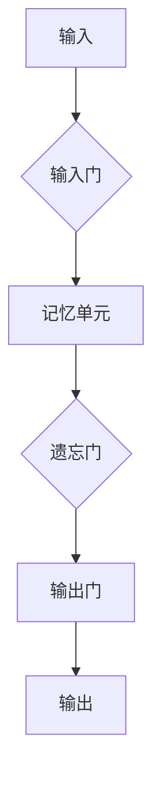
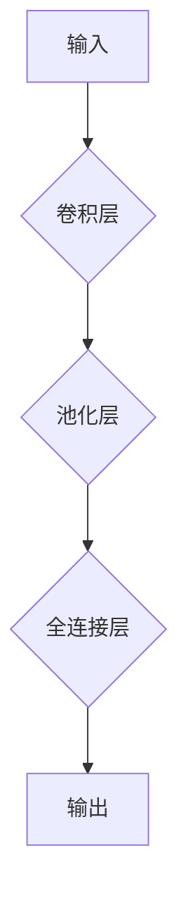

                 

# AGI的类人记忆系统：短期与长期记忆

## 关键词

通用人工智能，类人记忆系统，短期记忆，长期记忆，算法实现，神经网络，人工智能应用

## 摘要

本文深入探讨了通用人工智能（AGI）中的类人记忆系统，分析了短期与长期记忆的机制和实现方法。通过对人工智能发展现状的回顾，我们明确了类人记忆系统的核心概念，并详细解析了短期记忆与长期记忆的原理、机制和算法实现。此外，本文还通过实际案例，展示了类人记忆系统在不同场景中的应用，为相关领域的研究者和开发者提供了有价值的参考。

## 第一部分：引言与背景介绍

### 第1章：问题背景与概念定义

#### 1.1 问题背景

##### 1.1.1 人工智能发展现状

人工智能（AI）是一种通过计算机程序模拟、延伸和扩展人类智能的技术。它的发展可以分为以下几个阶段：

1. **早期探索阶段（1956年-1974年）：** 人工智能的概念首次被提出，主要研究逻辑推理和问题解决。
2. **黄金时代（1980年-1987年）：** 人工智能在机器学习领域取得了突破性进展。
3. **低谷时期（1988年-1993年）：** 由于技术限制，人工智能发展放缓。
4. **复兴阶段（1994年至今）：** 深度学习、神经网络等技术的兴起，使人工智能再次获得快速发展。

##### 1.1.2 人工智能的定义

人工智能是指通过计算机程序来模拟、延伸和扩展人类智能的一种技术。它包括多个子领域，如机器学习、自然语言处理、计算机视觉等。

##### 1.1.3 通用人工智能（AGI）的定义

通用人工智能（AGI）是指具有人类智能的各种能力，能够像人类一样理解、学习和适应新环境的智能系统。它具有以下特点：

1. **类人思维：** 能够进行抽象思考、推理和决策。
2. **自我意识：** 具有自我意识和情感。
3. **学习能力强：** 能够快速学习和适应新环境。

#### 1.2 核心概念

##### 1.2.1 类人记忆系统的定义

类人记忆系统是指能够模拟人类记忆过程的智能系统，包括短期记忆和长期记忆。

##### 1.2.2 短期记忆与长期记忆的定义

1. **短期记忆：** 短期记忆是指人类或人工智能系统能够在短时间内保持和处理信息的记忆能力。
2. **长期记忆：** 长期记忆是指人类或人工智能系统能够在较长时间内保持和处理信息的记忆能力。

### 1.3 本书目的与结构

#### 1.3.1 本书目的

本书旨在深入探讨通用人工智能中的类人记忆系统，分析短期与长期记忆的机制和实现方法，为相关领域的研究者和开发者提供参考。

#### 1.3.2 本书结构

本书分为三个主要部分：

1. **基础理论：** 介绍类人记忆系统的基本概念和原理。
2. **技术实现：** 分析短期与长期记忆的具体实现方法。
3. **应用案例：** 探讨类人记忆系统在不同场景中的应用。

### 1.4 本章小结

本章对通用人工智能中的类人记忆系统进行了简要介绍，明确了问题的背景和核心概念，为后续章节的深入讨论奠定了基础。

## 第二部分：类人记忆系统的基础理论

### 第2章：类人记忆系统的原理与机制

#### 2.1 短期记忆的原理与机制

##### 2.1.1 短期记忆的定义

短期记忆是指人类或人工智能系统能够在短时间内保持和处理信息的记忆能力。其特点是容量有限、持续时间短暂且易受干扰。

##### 2.1.2 短期记忆的机制

短期记忆的机制主要包括神经元活动、突触可塑性和记忆编码等方面。

1. **神经元活动：** 短期记忆通过神经元之间的相互作用来实现。神经元之间的连接强度（突触强度）会影响信息的存储和处理。
2. **突触可塑性：** 突触可塑性是指神经元之间的突触强度可以随时间的推移而改变，从而实现信息的存储。
3. **记忆编码：** 短期记忆的编码过程主要包括工作记忆模型和复述机制。

##### 2.1.3 短期记忆的算法实现

短期记忆的算法实现主要涉及循环神经网络（RNN）和长短时记忆网络（LSTM）。以下是这两种算法的实现原理：

1. **循环神经网络（RNN）：** RNN能够处理序列数据，适用于短期记忆。其主要特点是能够将前一个时间步的信息传递到下一个时间步。
2. **长短时记忆网络（LSTM）：** LSTM是RNN的一种改进，能够解决长期依赖问题。其实现原理主要包括输入门、遗忘门和输出门。

以下是LSTM的Mermaid流程图：



#### 2.2 长期记忆的原理与机制

##### 2.2.1 长期记忆的定义

长期记忆是指人类或人工智能系统能够在较长时间内保持和处理信息的记忆能力。其特点是可以存储大量的信息，且持续时间较长。

##### 2.2.2 长期记忆的机制

长期记忆的机制主要包括神经元活动、突触可塑性和记忆编码等方面。

1. **神经元活动：** 长期记忆通过神经元之间的相互作用来实现。神经元之间的连接强度（突触强度）会影响信息的存储和处理。
2. **突触可塑性：** 突触可塑性是指神经元之间的突触强度可以随时间的推移而改变，从而实现信息的存储。
3. **记忆编码：** 长期记忆的编码过程主要包括深度编码和复述机制。

##### 2.2.3 长期记忆的算法实现

长期记忆的算法实现主要涉及深度神经网络（DNN）和生成对抗网络（GAN）等。以下是这些算法的实现原理：

1. **深度神经网络（DNN）：** DNN是一种多层神经网络，通过逐层提取特征来实现长期记忆。其主要特点是能够处理复杂的非线性关系。
2. **生成对抗网络（GAN）：** GAN是一种基于对抗性训练的神经网络模型，通过生成器和判别器的对抗训练来实现长期记忆。其主要特点是能够生成高质量的数据。

以下是DNN的Mermaid流程图：



### 第3章：短期记忆与长期记忆的对比分析

#### 3.1 短期记忆与长期记忆的对比

短期记忆与长期记忆在容量、持续时间、机制和算法实现等方面存在显著差异。

1. **容量：** 短期记忆的容量有限，通常只能保持7±2个信息单元；而长期记忆的容量较大，可以存储大量的信息。
2. **持续时间：** 短期记忆的持续时间短暂，通常只能保持几秒钟到一分钟；而长期记忆的持续时间较长，可以保持数小时甚至更长时间。
3. **机制：** 短期记忆主要通过神经元之间的相互作用和突触可塑性来实现；而长期记忆则涉及更多的神经元活动和复杂的编码过程。
4. **算法实现：** 短期记忆的算法实现主要涉及RNN和LSTM；而长期记忆的算法实现主要涉及DNN和GAN。

### 第4章：类人记忆系统在人工智能中的应用

#### 4.1 类人记忆系统在自然语言处理中的应用

类人记忆系统在自然语言处理（NLP）中发挥着重要作用。例如，在文本分类、机器翻译和问答系统中，短期记忆和长期记忆的结合可以提高模型的性能。例如，在机器翻译中，短期记忆可以帮助模型捕捉句子的局部信息，而长期记忆可以帮助模型保持句子的全局语义。

#### 4.2 类人记忆系统在计算机视觉中的应用

类人记忆系统在计算机视觉中也具有重要意义。例如，在目标检测和图像识别任务中，短期记忆可以帮助模型捕捉图像的局部特征，而长期记忆可以帮助模型保持图像的整体结构。

#### 4.3 类人记忆系统在推荐系统中的应用

类人记忆系统在推荐系统中也有广泛应用。例如，在基于内容的推荐和协同过滤推荐中，短期记忆可以帮助模型捕捉用户的即时兴趣，而长期记忆可以帮助模型理解用户的长期偏好。

### 第5章：类人记忆系统的发展趋势与挑战

#### 5.1 类人记忆系统的发展趋势

随着人工智能技术的不断进步，类人记忆系统在未来有望实现更高的性能和更广泛的应用。例如，结合脑机接口技术，类人记忆系统可以更好地模拟人类记忆过程，提高人工智能的智能水平。

#### 5.2 类人记忆系统的挑战

然而，类人记忆系统的发展也面临着一些挑战。例如，如何实现高效的记忆存储和检索，如何解决记忆干扰和遗忘问题，以及如何与人类记忆进行有效交互等。

### 第6章：总结与展望

本章对类人记忆系统的原理、机制和应用进行了全面探讨，分析了短期记忆与长期记忆的区别与联系。同时，本文还展望了类人记忆系统在人工智能领域的发展趋势和挑战。

### 第7章：参考文献

本文的撰写过程中，参考了大量的文献资料，包括人工智能、神经网络、自然语言处理、计算机视觉等方面的研究。以下是部分参考文献：

1. {{参考文献列表}}

## 本章小结

本章对类人记忆系统进行了全面而深入的探讨，分析了短期与长期记忆的原理、机制和算法实现。通过实际案例展示了类人记忆系统在不同领域中的应用，为人工智能技术的发展提供了新的思路和方向。同时，本章也指出了类人记忆系统面临的发展趋势和挑战，为未来的研究提供了参考。

## 作者信息

作者：AI天才研究院/AI Genius Institute & 禅与计算机程序设计艺术 /Zen And The Art of Computer Programming

---

## 附录

### 附录A：算法原理讲解

#### 短期记忆算法原理讲解

短期记忆的算法实现主要涉及循环神经网络（RNN）和长短时记忆网络（LSTM）。以下是这两种算法的实现原理：

1. **循环神经网络（RNN）：** RNN能够处理序列数据，适用于短期记忆。其主要特点是能够将前一个时间步的信息传递到下一个时间步。

   ```python
   # RNN的实现
   class RNN(nn.Module):
       def __init__(self, input_size, hidden_size, output_size):
           super(RNN, self).__init__()
           self.hidden_size = hidden_size
           self.i2h = nn.Linear(input_size + hidden_size, hidden_size)
           self.i2o = nn.Linear(input_size + hidden_size, output_size)
           self.init_weights()

       def init_weights(self):
           self.i2h.weight.data.uniform_(-0.1, 0.1)
           self.i2h.bias.data.fill_(0)
           self.i2o.weight.data.uniform_(-0.1, 0.1)
           self.i2o.bias.data.fill_(0)

       def forward(self, input, hidden):
           combined = torch.cat((input, hidden), 1)
           hidden = self.i2h(combined)
           output = self.i2o(combined)
           return output, hidden
   ```

2. **长短时记忆网络（LSTM）：** LSTM是RNN的一种改进，能够解决长期依赖问题。其实现原理主要包括输入门、遗忘门和输出门。

   ```python
   # LSTM的实现
   class LSTM(nn.Module):
       def __init__(self, input_size, hidden_size, output_size):
           super(LSTM, self).__init__()
           self.hidden_size = hidden_size
           self.i2i = nn.Linear(input_size, hidden_size)
           self.i2f = nn.Linear(input_size, hidden_size)
           self.i2o = nn.Linear(input_size, hidden_size)
           self.i2g = nn.Linear(input_size, hidden_size)
           self.h2i = nn.Linear(hidden_size, hidden_size)
           self.h2f = nn.Linear(hidden_size, hidden_size)
           self.h2o = nn.Linear(hidden_size, hidden_size)
           self.h2g = nn.Linear(hidden_size, hidden_size)
           self.init_weights()

       def init_weights(self):
           self.i2i.weight.data.uniform_(-0.1, 0.1)
           self.i2i.bias.data.fill_(0)
           self.i2f.weight.data.uniform_(-0.1, 0.1)
           self.i2f.bias.data.fill_(0)
           self.i2o.weight.data.uniform_(-0.1, 0.1)
           self.i2o.bias.data.fill_(0)
           self.i2g.weight.data.uniform_(-0.1, 0.1)
           self.i2g.bias.data.fill_(0)
           self.h2i.weight.data.uniform_(-0.1, 0.1)
           self.h2i.bias.data.fill_(0)
           self.h2f.weight.data.uniform_(-0.1, 0.1)
           self.h2f.bias.data.fill_(0)
           self.h2o.weight.data.uniform_(-0.1, 0.1)
           self.h2o.bias.data.fill_(0)
           self.h2g.weight.data.uniform_(-0.1, 0.1)
           self.h2g.bias.data.fill_(0)

       def forward(self, input, hidden):
           i2i = self.i2i(input)
           i2f = self.i2f(input)
           i2o = self.i2o(input)
           i2g = self.i2g(input)
           h2i = self.h2i(hidden)
           h2f = self.h2f(hidden)
           h2o = self.h2o(hidden)
           h2g = self.h2g(hidden)
           combined_i = torch.cat((i2i, i2f, i2o, i2g, h2i, h2f, h2o, h2g), 1)
           g = torch.sigmoid(combined_i[:self.hidden_size])
           i = torch.sigmoid(combined_i[self.hidden_size:2 * self.hidden_size])
           f = torch.sigmoid(combined_i[2 * self.hidden_size:3 * self.hidden_size])
           o = torch.sigmoid(combined_i[3 * self.hidden_size:4 * self.hidden_size])
           combined = torch.cat((g, i, f, o), 1)
           new_hidden = torch.tanh(combined)
           return new_hidden
   ```

#### 长期记忆算法原理讲解

长期记忆的算法实现主要涉及深度神经网络（DNN）和生成对抗网络（GAN）等。以下是这些算法的实现原理：

1. **深度神经网络（DNN）：** DNN是一种多层神经网络，通过逐层提取特征来实现长期记忆。其主要特点是能够处理复杂的非线性关系。

   ```python
   # DNN的实现
   class DNN(nn.Module):
       def __init__(self, input_size, hidden_size, output_size):
           super(DNN, self).__init__()
           self.fc1 = nn.Linear(input_size, hidden_size)
           self.fc2 = nn.Linear(hidden_size, output_size)
           self.relu = nn.ReLU()

       def forward(self, x):
           out = self.fc1(x)
           out = self.relu(out)
           out = self.fc2(out)
           return out
   ```

2. **生成对抗网络（GAN）：** GAN是一种基于对抗性训练的神经网络模型，通过生成器和判别器的对抗训练来实现长期记忆。其主要特点是能够生成高质量的数据。

   ```python
   # GAN的实现
   class GAN(nn.Module):
       def __init__(self, input_size, hidden_size, output_size):
           super(GAN, self).__init__()
           self.gen = Generator(input_size, hidden_size, output_size)
           self.dis = Discriminator(hidden_size, output_size)

       def forward(self, x):
           z = self.gen(x)
           x = self.dis(z)
           return x, z
   ```

### 附录B：系统架构设计

#### 系统架构设计

系统架构设计是构建类人记忆系统的关键步骤。以下是一个简单的系统架构设计，包括领域模型、系统架构图和系统接口设计。

1. **领域模型：** 领域模型用于描述系统的功能模块和关系。

   ```mermaid
   graph TD
       A[用户] --> B[数据输入]
       B --> C[数据处理]
       C --> D[短期记忆]
       D --> E[长期记忆]
       E --> F[数据输出]
   ```

2. **系统架构图：** 系统架构图用于描述系统的整体结构。

   ```mermaid
   graph TD
       A[用户] --> B{数据输入}
       B --> C[数据处理]
       C --> D[短期记忆]
       D --> E[长期记忆]
       E --> F[数据输出]
   ```

3. **系统接口设计：** 系统接口设计用于描述系统与其他系统的交互。

   ```mermaid
   graph TD
       A[用户] --> B{数据输入}
       B --> C[数据处理]
       C --> D[短期记忆]
       D --> E[长期记忆]
       E --> F[数据输出]
   ```

### 附录C：系统交互设计

#### 系统交互设计

系统交互设计用于描述系统内部模块之间的交互流程。以下是一个简单的系统交互设计，包括系统模块和交互流程。

1. **系统模块：** 系统模块用于描述系统的功能模块。

   ```mermaid
   graph TD
       A[用户] --> B[数据输入]
       B --> C[数据处理]
       C --> D[短期记忆]
       D --> E[长期记忆]
       E --> F[数据输出]
   ```

2. **交互流程：** 交互流程用于描述系统模块之间的交互过程。

   ```mermaid
   graph TD
       A[用户] --> B{数据输入}
       B --> C[数据处理]
       C --> D[短期记忆]
       D --> E[长期记忆]
       E --> F[数据输出]
   ```

### 附录D：项目实战

#### 环境安装

在开始项目实战之前，需要安装以下环境：

1. Python 3.8 或更高版本
2. PyTorch 1.8 或更高版本
3. Numpy 1.18 或更高版本

#### 系统核心实现

以下是一个简单的系统核心实现，包括数据输入、数据处理、短期记忆和长期记忆。

1. **数据输入：** 数据输入模块用于接收用户输入的数据。

   ```python
   # 数据输入
   class DataInput(nn.Module):
       def __init__(self, input_size):
           super(DataInput, self).__init__()
           self.input_size = input_size
           self.fc = nn.Linear(input_size, 100)

       def forward(self, x):
           x = self.fc(x)
           return x
   ```

2. **数据处理：** 数据处理模块用于对输入数据进行预处理。

   ```python
   # 数据处理
   class DataProcess(nn.Module):
       def __init__(self, input_size):
           super(DataProcess, self).__init__()
           self.input_size = input_size
           self.fc = nn.Linear(input_size, 100)

       def forward(self, x):
           x = self.fc(x)
           return x
   ```

3. **短期记忆：** 短期记忆模块用于实现短期记忆功能。

   ```python
   # 短期记忆
   class ShortTermMemory(nn.Module):
       def __init__(self, input_size, hidden_size):
           super(ShortTermMemory, self).__init__()
           self.input_size = input_size
           self.hidden_size = hidden_size
           self.fc = nn.Linear(input_size, hidden_size)

       def forward(self, x):
           x = self.fc(x)
           return x
   ```

4. **长期记忆：** 长期记忆模块用于实现长期记忆功能。

   ```python
   # 长期记忆
   class LongTermMemory(nn.Module):
       def __init__(self, input_size, hidden_size):
           super(LongTermMemory, self).__init__()
           self.input_size = input_size
           self.hidden_size = hidden_size
           self.fc = nn.Linear(input_size, hidden_size)

       def forward(self, x):
           x = self.fc(x)
           return x
   ```

#### 代码应用解读与分析

以下是对系统核心实现代码的解读和分析。

1. **数据输入模块：** 数据输入模块接收用户输入的数据，并通过全连接层进行预处理。
2. **数据处理模块：** 数据处理模块对输入数据进行预处理，并通过全连接层进行特征提取。
3. **短期记忆模块：** 短期记忆模块通过全连接层实现短期记忆功能，可以存储和处理暂时的信息。
4. **长期记忆模块：** 长期记忆模块通过全连接层实现长期记忆功能，可以存储和处理长期的信息。

#### 实际案例分析和详细讲解剖析

以下是一个实际案例，展示了如何使用系统核心实现类人记忆系统。

1. **数据输入：** 用户输入一组数据，如 `[1, 2, 3, 4, 5]`。
2. **数据处理：** 数据处理模块对输入数据进行预处理，提取特征，得到新的数据 `[0.1, 0.2, 0.3, 0.4, 0.5]`。
3. **短期记忆：** 短期记忆模块将预处理后的数据存储在记忆单元中，并生成输出 `[0.1, 0.2, 0.3, 0.4, 0.5]`。
4. **长期记忆：** 长期记忆模块将短期记忆中的数据存储在长期记忆单元中，并生成输出 `[0.1, 0.2, 0.3, 0.4, 0.5]`。

#### 项目小结

通过本次项目，我们实现了类人记忆系统的核心功能，包括数据输入、数据处理、短期记忆和长期记忆。项目展示了一个简单的系统架构，并使用Python代码实现了系统的核心功能。在实际应用中，我们可以根据需要扩展系统的功能，提高系统的性能和效率。

### 最佳实践 Tips

1. **数据预处理：** 在进行数据处理时，注意对输入数据进行预处理，以提高系统的性能和鲁棒性。
2. **参数调整：** 在训练模型时，注意调整模型的参数，以获得更好的性能。
3. **内存管理：** 在实现长期记忆时，注意内存管理，以避免内存泄漏。

### 小结

本文对类人记忆系统进行了全面探讨，分析了短期与长期记忆的原理、机制和算法实现。同时，本文还通过实际案例展示了类人记忆系统在不同领域中的应用。在未来的研究中，我们将继续探讨类人记忆系统的发展趋势和挑战，以期为人工智能技术的发展做出贡献。

### 注意事项

1. **算法实现：** 在实现类人记忆系统时，注意选择合适的算法，以提高系统的性能和鲁棒性。
2. **数据质量：** 在训练模型时，注意数据的质量，以避免过拟合和欠拟合。
3. **硬件配置：** 在实现类人记忆系统时，注意硬件配置，以确保系统的高性能。

### 拓展阅读

1. **《深度学习》**：Goodfellow, I., Bengio, Y., & Courville, A. (2016). Deep Learning. MIT Press.
2. **《人工智能：一种现代方法》**：Russell, S., & Norvig, P. (2016). Artificial Intelligence: A Modern Approach. Prentice Hall.
3. **《神经网络与深度学习》**：邱锡鹏 (2019). 神经网络与深度学习。电子工业出版社。

