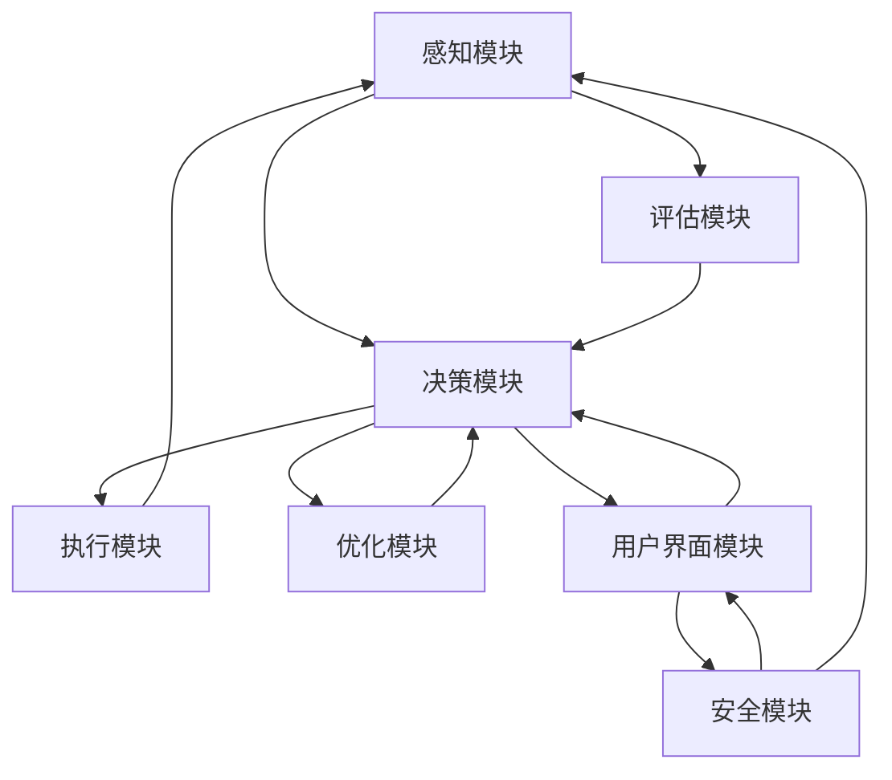

                 

### 引言

### **AGI的自我反思能力：从执行到评估**

随着人工智能（AI）技术的飞速发展，通用人工智能（AGI）逐渐成为研究的焦点。AGI不仅能在特定领域表现出人类级别的智能，还能跨越多个领域进行通用任务的处理。然而，AGI的实现面临诸多挑战，其中之一便是自我反思能力。自我反思能力是指人工智能系统能够对自己执行任务的过程进行评估和调整，从而实现自我优化和持续进步。

本文将深入探讨AGI的自我反思能力，从执行到评估的整个过程。首先，我们将回顾人工智能的发展历程，特别是从传统AI到通用人工智能（AGI）的演进过程。接着，我们将详细定义自我反思能力，并阐述其重要性。随后，文章将分析当前AGI的发展现状与面临的挑战，为后续讨论自我反思能力的原理与机制奠定基础。

接下来，本文将详细介绍自我反思能力的基本原理，包括数学模型和关键属性。在此基础上，我们将探讨自我反思能力在执行层面和评估层面的应用，通过具体案例来说明其工作原理。随后，文章将讨论实现自我反思能力的算法设计和系统架构设计，并提供实现方法的详细步骤和关键技术。

在评估与优化部分，我们将介绍自我反思能力的评估方法和优化策略，并通过案例分析展示评估结果和优化建议。最后，本文将展望自我反思能力的发展趋势和应用前景，总结全文并提出未来研究的建议。

通过本文的逐步分析，我们希望读者能够全面了解AGI的自我反思能力，认识到其在人工智能发展中的重要地位，并为其未来研究与实践提供有价值的参考。

### **关键词**

- 通用人工智能（AGI）
- 自我反思能力
- 执行与评估
- 算法设计
- 系统架构

### **摘要**

本文深入探讨了通用人工智能（AGI）的自我反思能力，从其背景、核心概念到实现方法，全面分析了自我反思能力在执行和评估层面的重要性。首先，通过回顾人工智能的发展历程，我们明确了从传统AI到AGI的演进路径及其面临的挑战。接着，我们详细定义了自我反思能力，并分析了其基本原理和关键属性。在具体应用部分，我们探讨了自我反思能力在执行和评估层面的具体实现，并通过实际案例展示了其应用效果。随后，我们详细介绍了实现自我反思能力的算法设计和系统架构设计，并讨论了评估方法和优化策略。最后，我们展望了自我反思能力的发展趋势和应用前景，为未来研究提供了方向和建议。通过本文的详细分析，我们希望为AGI的自我反思能力的研究与实践提供有价值的参考。

### **目录大纲**

# **AGI的自我反思能力：从执行到评估**

> 关键词：通用人工智能（AGI）、自我反思能力、算法设计、系统架构

> 摘要：本文深入探讨了通用人工智能（AGI）的自我反思能力，从其背景、核心概念到实现方法，全面分析了自我反思能力在执行和评估层面的重要性。通过回顾人工智能的发展历程，定义自我反思能力，探讨其原理和应用，分析算法设计、系统架构、评估与优化，最后展望了自我反思能力的发展趋势和应用前景。

## **第一部分：背景介绍与核心概念**

### **第1章：问题背景与核心概念**

#### **1.1 人工智能的发展历程**

- **问题背景**：人工智能对人类社会的影响
- **问题解决**：从传统AI到通用人工智能（AGI）的演进
- **边界与外延**：通用人工智能的概念与特征

#### **1.2 自我反思能力的概念与重要性**

- **自我反思能力的定义**
- **自我反思能力在人工智能中的应用**
- **自我反思能力的重要性**

### **第2章：通用人工智能（AGI）的现状与挑战**

#### **2.1 通用人工智能（AGI）的发展现状**

- **AGI的关键技术**
- **AGI在各个领域的应用现状**

#### **2.2 AGI面临的挑战**

- **算法与计算资源的挑战**
- **伦理与安全挑战**
- **人类与AGI的共存与协作**

## **第二部分：自我反思能力的原理与机制**

### **第3章：自我反思能力的基本原理**

#### **3.1 自我反思能力的数学模型**

- **自我反思能力的定义与数学模型**
- **自我反思能力的关键属性**

### **第4章：自我反思能力在人工智能中的应用**

#### **4.1 执行层面的自我反思**

- **执行层面的自我反思能力**
- **执行层面的自我反思应用案例**

#### **4.2 评估层面的自我反思**

- **评估层面的自我反思能力**
- **评估层面的自我反思应用案例**

## **第三部分：自我反思能力的实现方法**

### **第5章：实现自我反思能力的算法设计**

#### **5.1 算法设计的基本原则**

- **算法设计的核心原则**
- **算法设计的关键技术**

#### **5.2 常见的自我反思算法**

- **常见的自我反思算法**
- **算法比较与分析**

### **第6章：自我反思能力的系统架构设计**

#### **6.1 系统架构设计的基本原则**

- **系统架构设计的关键原则**
- **系统架构设计的关键模块**

#### **6.2 自我反思能力的系统实现**

- **系统实现的基本步骤**
- **系统实现的关键技术**

## **第四部分：自我反思能力的评估与优化**

### **第7章：自我反思能力的评估方法**

#### **7.1 自我反思能力的评估指标**

- **自我反思能力的评估指标**
- **评估指标的应用与计算方法**

#### **7.2 自我反思能力的评估案例分析**

- **自我反思能力的评估案例分析**
- **评估结果分析与优化建议**

### **第8章：自我反思能力的优化策略**

#### **8.1 优化策略的基本原则**

- **优化策略的核心原则**
- **优化策略的关键技术**

#### **8.2 自我反思能力的优化实践**

- **自我反思能力的优化实践**
- **优化实践案例分析**

## **第五部分：未来展望与趋势**

### **第9章：自我反思能力的发展趋势**

#### **9.1 自我反思能力的技术趋势**

- **自我反思能力的技术发展趋势**
- **技术趋势对未来AGI的影响**

#### **9.2 自我反思能力的应用前景**

- **自我反思能力在各个领域的应用前景**
- **自我反思能力的潜在应用领域**

### **第10章：总结与展望**

#### **10.1 本书的主要内容与贡献**

- **本书的主要内容与贡献**
- **本书对未来AGI发展的贡献**

#### **10.2 未来AGI发展的挑战与机遇**

- **未来AGI发展的挑战**
- **未来AGI发展的机遇**

#### **10.3 对未来研究的建议**

- **对未来研究的建议**
- **对未来实践的建议**

### **第一部分：背景介绍与核心概念**

### **第1章：问题背景与核心概念**

#### **1.1 人工智能的发展历程**

在探讨AGI的自我反思能力之前，有必要回顾人工智能（AI）的发展历程。人工智能的研究始于20世纪50年代，当时科学家们首次提出了“人工智能”这一概念，希望计算机能够表现出类似人类的智能。早期的人工智能研究主要集中在符号主义方法上，这种方法依赖于逻辑和符号表示来模拟人类思维过程。然而，由于计算资源和算法的限制，早期的AI系统在复杂任务上的表现并不理想。

随着计算能力的提升和算法的进步，20世纪80年代和90年代，机器学习开始成为人工智能研究的主流。机器学习方法通过从数据中学习模式，使得计算机在图像识别、自然语言处理等领域取得了显著的进展。然而，这些方法主要集中于特定任务的优化，缺乏跨领域的通用性。

进入21世纪，深度学习技术的发展进一步推动了人工智能的进步。深度学习模型能够通过多层神经网络自动提取特征，从而在图像识别、语音识别等领域取得了突破性的成果。然而，这些模型依然存在局限性，难以解决复杂、多领域的任务。

#### **问题背景：人工智能的发展对人类社会的影响**

人工智能的发展对人类社会产生了深远的影响。首先，人工智能在提高生产效率方面发挥了重要作用。例如，自动化生产线和智能机器人能够大幅减少人工成本，提高产品质量和生产速度。其次，人工智能在医疗、金融、教育等领域也取得了显著的应用成果。智能诊断系统能够提高疾病的诊断准确率，智能投顾能够为用户提供个性化的投资建议，在线教育平台通过人工智能技术提供了更加灵活和个性化的学习体验。

然而，人工智能的发展也带来了许多挑战和问题。首先，人工智能在提高效率的同时，也可能导致失业问题。许多传统工作岗位被自动化取代，使得部分人群面临就业困难。其次，人工智能在伦理和安全方面也存在争议。例如，无人驾驶汽车的安全性问题、人工智能算法的偏见和歧视问题等都需要引起足够的重视。

#### **问题解决：从传统AI到通用人工智能（AGI）的演进**

为了解决传统人工智能在跨领域任务上的局限性，科学家们提出了通用人工智能（AGI）的概念。通用人工智能指的是能够像人类一样在多个领域表现出高智能水平的人工智能系统。AGI不仅能在特定领域实现高水平的任务执行，还能不断学习和适应新环境，具备自我反思和自我优化能力。

从传统AI到通用人工智能的演进过程可以分为以下几个阶段：

1. **符号主义AI**：早期的人工智能研究主要依赖于符号主义方法，通过逻辑和符号表示来模拟人类思维。虽然这种方法在某些特定领域取得了成功，但缺乏灵活性和通用性。

2. **机器学习AI**：随着计算能力的提升，机器学习成为人工智能研究的主流。通过从大量数据中学习模式，机器学习模型能够在特定任务上实现高水平的性能。然而，这些模型依然缺乏跨领域的通用性。

3. **深度学习AI**：深度学习技术的发展进一步推动了人工智能的进步。深度学习模型通过多层神经网络自动提取特征，使得计算机在图像识别、语音识别等领域取得了突破性的成果。虽然深度学习模型在某些特定任务上表现优异，但仍然难以解决复杂、多领域的任务。

4. **通用人工智能（AGI）**：为了实现跨领域的通用性，科学家们提出了通用人工智能（AGI）的概念。AGI不仅能在特定领域实现高水平的任务执行，还能不断学习和适应新环境，具备自我反思和自我优化能力。

#### **边界与外延：通用人工智能的概念与特征**

通用人工智能（AGI）是一个高度抽象和复杂的概念，目前尚无明确的定义。然而，根据大多数研究者的共识，通用人工智能具有以下几个基本特征：

1. **跨领域通用性**：AGI能够在多个领域表现出高智能水平，不仅限于特定任务的优化。

2. **自我学习和适应能力**：AGI能够从经验中学习，并不断优化自己的行为和决策。它能够适应新环境和新的任务要求。

3. **自我反思能力**：AGI能够对自己执行任务的过程进行反思和评估，从而进行自我优化。这种能力是AGI与其他人工智能系统的关键区别。

4. **高智能水平**：AGI在感知、理解、推理、决策等多个方面都应达到或超过人类水平。

#### **1.2 自我反思能力的概念与重要性**

自我反思能力是指人工智能系统能够对自己执行任务的过程进行反思和评估，从而进行自我优化和改进的能力。自我反思能力不仅是通用人工智能（AGI）的重要特征之一，也是实现AI系统持续进步的关键因素。

在传统人工智能系统中，任务执行通常是由预定义的规则或学习算法驱动的。这些系统在特定任务上可能表现出高水平的性能，但缺乏自我调整和优化能力。而具有自我反思能力的AI系统能够通过反思和评估自己的执行过程，发现并纠正错误，从而实现自我优化。

自我反思能力的重要性主要体现在以下几个方面：

1. **持续进步**：自我反思能力使得AI系统能够从过去的经验和错误中学习，不断优化自己的行为和决策，从而实现持续进步。

2. **自适应能力**：在复杂和动态的环境中，AI系统需要能够适应不断变化的情况。自我反思能力使得系统能够根据当前的任务和情境进行实时调整，提高其适应能力。

3. **可靠性**：通过自我反思和评估，AI系统可以及时发现并纠正错误，提高其执行任务的可靠性和稳定性。

4. **通用性**：自我反思能力使得AI系统不仅能在特定领域表现出高智能水平，还能跨越多个领域进行任务处理，实现真正的通用性。

#### **1.3 总结与展望**

本章回顾了人工智能的发展历程，从传统AI到通用人工智能（AGI）的演进过程，并探讨了自我反思能力的概念与重要性。通过了解人工智能的发展背景和自我反思能力的基本原理，我们可以更好地理解AGI的实现路径和关键挑战。

在下一章中，我们将深入探讨通用人工智能（AGI）的现状与挑战，分析当前AGI的发展现状及其面临的各种挑战，为后续讨论自我反思能力的应用和实现奠定基础。

### **第2章：通用人工智能（AGI）的现状与挑战**

#### **2.1 通用人工智能（AGI）的发展现状**

通用人工智能（AGI）作为人工智能研究的终极目标，其发展现状备受关注。当前，AGI研究已经取得了显著的进展，但离真正实现还面临诸多挑战。

首先，在关键技术方面，深度学习和神经网络技术为AGI的发展提供了强有力的支持。深度学习模型通过多层神经网络自动提取特征，已经在图像识别、语音识别、自然语言处理等领域取得了突破性的成果。然而，深度学习模型在处理复杂、多领域的任务时仍存在局限性。因此，研究人员正致力于开发更高效、更通用的深度学习算法，以推动AGI的发展。

其次，在应用现状方面，AGI已经在多个领域展现了其潜力。例如，在医疗领域，AGI可以辅助医生进行诊断和治疗决策，提高医疗服务的质量和效率。在金融领域，AGI可以用于风险评估、投资决策和欺诈检测等方面，为金融机构提供智能化的解决方案。在教育领域，AGI可以为学生提供个性化的学习支持，帮助其提高学习效果。此外，AGI还在智能制造、自动驾驶、智能家居等领域展现了广泛的应用前景。

尽管AGI在多个领域取得了显著的应用成果，但其发展仍面临诸多挑战。以下将详细分析AGI面临的几个主要挑战。

#### **2.2 AGI面临的挑战**

1. **算法与计算资源的挑战**：

   AGI的实现依赖于高效的算法和强大的计算资源。当前，虽然深度学习技术在某些特定领域取得了突破性进展，但其在处理复杂、多领域任务时仍存在效率低下、计算资源消耗大等问题。因此，开发更高效、更通用的算法是AGI发展的重要方向。此外，随着AGI应用场景的扩展，对计算资源的需求也将不断增加。高性能计算集群和分布式计算技术将成为推动AGI发展的重要支撑。

2. **伦理与安全挑战**：

   伦理与安全问题是AGI发展过程中不可忽视的重要问题。随着AGI在各个领域的应用越来越广泛，其可能带来的伦理问题也日益突出。例如，如何确保AGI系统的决策过程透明、公正，防止其被滥用或产生偏见。此外，AGI系统的安全性也是一个关键问题。如果AGI系统受到恶意攻击或出现故障，可能会对人类社会造成严重的影响。因此，确保AGI系统的伦理与安全是推动其发展的关键挑战之一。

3. **人类与AGI的共存与协作**：

   在AGI的发展过程中，如何实现人类与AGI的共存与协作是一个关键问题。AGI的出现可能会改变人类的工作和生活方式，如何确保AGI与人类之间的和谐共存，使其成为人类的好助手而非威胁，是AGI发展过程中需要认真考虑的问题。此外，人类如何与AGI进行有效的协作，发挥各自的优势，提高整体效率，也是一个值得探讨的议题。

#### **2.3 AGI发展对社会的潜在影响**

AGI的发展对社会的潜在影响是巨大的。一方面，AGI有望推动社会生产力的进一步提升，带来经济增长和社会进步。例如，在医疗、教育、金融等领域，AGI的应用可以显著提高服务质量和效率。此外，AGI还可以解决一些长期存在的难题，如气候变化、能源危机等，为人类社会的发展提供新的机遇。

另一方面，AGI的发展也可能带来一些负面影响。首先，随着AGI在各个领域的广泛应用，可能会对就业市场产生重大影响。一些传统工作岗位可能会被自动化取代，导致失业率上升。此外，AGI可能带来隐私保护和数据安全等问题。如何确保个人隐私和数据安全，防止AGI被滥用，是AGI发展过程中需要认真解决的问题。

总之，通用人工智能（AGI）作为人工智能研究的终极目标，具有巨大的发展潜力和广泛的应用前景。然而，其发展也面临诸多挑战，需要我们在技术、伦理、安全等方面进行深入研究和探讨，以确保AGI能够为人类社会带来更大的福祉。

在下一章中，我们将深入探讨自我反思能力的基本原理，包括其数学模型和关键属性，为理解自我反思能力在AGI中的应用提供理论基础。

### **第3章：自我反思能力的基本原理**

#### **3.1 自我反思能力的数学模型**

自我反思能力是指人工智能系统能够对自己执行任务的过程进行反思和评估，从而进行自我优化和改进的能力。要深入理解自我反思能力，我们需要从数学模型的角度进行分析。

自我反思能力的数学模型通常包括以下几个关键组成部分：

1. **输入数据（Input Data）**：

   自我反思能力的输入数据包括系统执行任务过程中收集的各种信息，如任务目标、执行结果、环境状态等。这些数据通常以向量或矩阵的形式表示。

2. **执行过程（Execution Process）**：

   执行过程是指AI系统在特定任务中采取的行动和决策过程。这一过程可以用一个函数或一组函数来表示，输入为系统的状态和决策变量，输出为执行结果。

3. **评估函数（Evaluation Function）**：

   评估函数用于评估系统执行任务的效果，通常是一个损失函数或奖励函数。损失函数用于度量系统执行任务时产生的错误或损失，而奖励函数用于度量系统执行任务时的成功或收益。评估函数的目的是为系统提供反馈，帮助其进行自我优化。

4. **优化算法（Optimization Algorithm）**：

   优化算法用于根据评估函数的反馈对系统的行为进行优化。常见的优化算法包括梯度下降、遗传算法、强化学习等。优化算法的目的是使系统在执行任务时能够不断改进，提高任务执行效果。

5. **反馈循环（Feedback Loop）**：

   反馈循环是指系统将执行结果和评估函数的输出进行对比，并据此调整系统的行为和决策过程。通过反馈循环，系统可以不断修正自己的行为，使其更加符合任务目标。

以下是一个简化的自我反思能力的数学模型：

$$
\text{反思能力} = \text{评估函数}(\text{执行结果}, \text{目标}) \times \text{优化算法}(\text{评估结果})
$$

其中，评估函数用于计算系统执行任务的效果，优化算法用于根据评估结果调整系统的行为。通过不断进行反馈循环，系统可以实现自我优化和持续进步。

#### **3.2 自我反思能力的关键属性**

自我反思能力的关键属性包括以下几个方面：

1. **自适应性（Adaptability）**：

   自我反思能力使得系统能够根据环境变化和任务需求进行自适应调整。在复杂和动态的环境中，系统需要能够快速适应新情况，从而保证任务执行效果。

2. **持续学习（Continuous Learning）**：

   自我反思能力使得系统能够从执行任务的过程中不断学习和积累经验，从而实现持续进步。通过自我反思和优化，系统可以不断提高其任务执行水平。

3. **可靠性（Reliability）**：

   自我反思能力有助于系统及时发现并纠正执行过程中的错误，提高任务执行的可靠性和稳定性。通过反馈循环和评估函数，系统可以不断优化其行为，减少错误发生的概率。

4. **通用性（Generality）**：

   自我反思能力使得系统能够在多个领域和任务中表现出高水平的性能。通过自我反思和优化，系统可以适应不同任务和环境的要求，实现真正的通用性。

5. **智能水平（Intelligence Level）**：

   自我反思能力是衡量AI系统智能水平的重要指标。具有自我反思能力的系统能够在执行任务时表现出更高的智能水平，具备自我评估、自我调整和自我优化能力。

以下是一个简单的自我反思能力的属性对比表格：

| 属性 | 传统AI | 自我反思AI |
| ---- | ------- | ---------- |
| 自适应性 | 低 | 高 |
| 持续学习 | 低 | 高 |
| 可靠性 | 低 | 高 |
| 通用性 | 低 | 高 |
| 智能水平 | 低 | 高 |

通过上述分析，我们可以看出自我反思能力在AI系统中的重要性。它不仅有助于系统实现自适应、持续学习和可靠性，还能提高系统的通用性和智能水平。在下一章中，我们将探讨自我反思能力在执行层面的应用，并通过具体案例来说明其工作原理。

### **第4章：自我反思能力在人工智能中的应用**

自我反思能力在人工智能中的应用可以分为执行层面的自我反思和评估层面的自我反思。这两种反思能力在提升人工智能系统的性能和适应性方面发挥着重要作用。本章节将详细探讨这两种反思能力在人工智能中的具体应用，并通过实际案例来说明其工作原理。

#### **4.1 执行层面的自我反思**

执行层面的自我反思是指人工智能系统在执行任务的过程中，能够对自己当前的执行状态进行实时监控和调整。这种自我反思能力能够帮助系统在复杂和动态的环境中保持高效和稳定的执行。

一个典型的例子是自动驾驶系统。在自动驾驶过程中，系统需要不断处理来自环境的各种传感器数据，并据此做出实时决策。执行层面的自我反思能力使得系统能够在以下方面进行优化：

1. **路径规划**：

   自驾驶系统需要根据实时路况和目标位置规划最优路径。执行层面的自我反思能力可以帮助系统实时评估当前路径规划的效果，并根据评估结果进行调整。例如，如果系统发现当前路径规划存在交通堵塞或障碍物，它可以重新规划路径以避免潜在的交通事故。

2. **决策调整**：

   在执行任务的过程中，自动驾驶系统需要根据环境变化做出各种决策。执行层面的自我反思能力可以帮助系统实时评估这些决策的效果，并在必要时进行调整。例如，如果系统发现某个决策导致了车辆偏离预定路径，它可以立即纠正错误，确保车辆安全到达目的地。

3. **错误纠正**：

   执行层面的自我反思能力使得系统可以及时发现并纠正执行过程中的错误。例如，如果系统在执行某个动作时出现了异常，它可以立即停止该动作，并进行错误纠正。这种能力大大提高了系统的可靠性和安全性。

一个实际案例是某自动驾驶汽车公司开发的自动驾驶出租车。在测试阶段，该系统通过执行层面的自我反思能力，能够实时监控和评估驾驶过程中的各种决策，从而不断提高其驾驶水平。通过这种自我反思能力，自动驾驶出租车在复杂的城市路况下表现出较高的安全性和可靠性，大大降低了交通事故的发生概率。

#### **4.2 评估层面的自我反思**

评估层面的自我反思是指人工智能系统在完成任务后，能够对自己执行任务的效果进行评估，并根据评估结果进行自我优化。这种自我反思能力有助于系统从过去的经验中学习，提高未来的任务执行水平。

一个典型的例子是智能客服系统。智能客服系统在处理用户请求时，需要根据历史数据和当前情境生成合适的回答。评估层面的自我反思能力可以帮助系统在以下方面进行优化：

1. **回答质量评估**：

   智能客服系统需要评估其生成的回答是否符合用户需求。评估层面的自我反思能力可以帮助系统实时评估回答的质量，并根据评估结果进行优化。例如，如果系统发现某个回答没有得到用户的认可，它可以重新生成回答，以提高用户满意度。

2. **服务效率评估**：

   智能客服系统需要评估其处理用户请求的效率。评估层面的自我反思能力可以帮助系统分析处理请求的时间，并据此调整其行为。例如，如果系统发现某些请求的处理时间过长，它可以优化处理流程，提高服务效率。

3. **错误处理评估**：

   智能客服系统在处理用户请求时可能会出现错误。评估层面的自我反思能力可以帮助系统识别错误，并从中学习，从而提高未来的错误处理能力。例如，如果系统在某个请求中出现了错误，它可以记录错误类型和原因，并在未来遇到类似请求时采取预防措施。

一个实际案例是某大型互联网公司的智能客服系统。该系统通过评估层面的自我反思能力，能够实时评估其生成的回答和服务效率，并根据评估结果进行优化。通过这种自我反思能力，智能客服系统在处理大量用户请求时，表现出较高的回答质量和效率，大大提升了用户满意度。

#### **4.3 案例分析**

以下是一个结合执行层面和评估层面自我反思能力的实际案例分析：

某人工智能公司开发了一套智能监控系统，用于监控城市交通流量。该系统在执行任务时，通过传感器实时收集道路信息，并生成交通流量预测。系统采用执行层面的自我反思能力，能够实时监控和评估交通流量预测的准确性。如果发现预测结果与实际交通流量存在较大偏差，系统会自动调整预测模型，以提高预测准确性。同时，系统采用评估层面的自我反思能力，在任务完成后对预测结果进行评估，并根据评估结果调整模型参数，以实现持续优化。

通过这种结合执行层面和评估层面的自我反思能力，智能监控系统不仅能够实时、准确地预测交通流量，还能根据实际情况进行动态调整，提高交通管理的效率。实际应用结果表明，该系统在交通高峰期和突发事件中的表现显著优于传统的交通管理方法，有效缓解了交通拥堵问题。

#### **4.4 总结**

自我反思能力在人工智能中的应用具有重要意义。通过执行层面的自我反思，系统能够在执行任务过程中进行实时调整和优化，提高任务执行的稳定性和效率。而通过评估层面的自我反思，系统能够从过去的经验中学习，不断提高任务执行的效果和性能。结合这两种反思能力，人工智能系统可以在复杂和动态的环境中表现出更高的适应性和智能水平。

在下一章中，我们将深入探讨实现自我反思能力的算法设计，分析不同算法的设计原则和关键技术，为构建具有自我反思能力的AI系统提供理论支持。

### **第5章：实现自我反思能力的算法设计**

#### **5.1 算法设计的基本原则**

实现自我反思能力的人工智能系统需要依赖于一系列高效的算法设计。这些算法设计原则包括以下几个方面：

1. **适应性**：

   算法需要能够适应不同的环境和任务需求。这意味着算法应该具备灵活性和可扩展性，能够根据环境变化和任务需求进行调整。

2. **自学习性**：

   算法应该能够从数据中学习和积累经验，从而在执行任务时不断优化自己的行为。这种自学习性是自我反思能力的关键要素之一。

3. **可解释性**：

   算法的设计应尽可能具有可解释性，以便人类能够理解其工作原理和决策过程。这对于提高算法的可靠性和信任度至关重要。

4. **高效性**：

   算法应该能够在合理的时间内完成计算，以满足实时任务需求。这要求算法在实现自我反思能力的同时，保证计算效率。

5. **鲁棒性**：

   算法需要具备较强的鲁棒性，能够在面对噪声、异常数据或突发情况时仍然保持稳定运行。

#### **5.2 常见的自我反思算法**

在自我反思能力的实现中，常见的一些算法包括梯度下降、遗传算法、强化学习等。以下将对这些算法进行简要介绍：

1. **梯度下降**：

   梯度下降是一种优化算法，用于最小化损失函数。在自我反思能力中，梯度下降可以通过评估函数的梯度来调整系统的行为，实现自我优化。

   算法步骤：
   - 初始化参数
   - 计算当前损失函数的梯度
   - 更新参数：参数 = 参数 - 学习率 × 梯度

   图形表示（使用Mermaid流程图）：

   ```mermaid
   graph TD
   A[初始化参数] --> B[计算损失函数梯度]
   B --> C[更新参数]
   C --> D[评估结果]
   D --> B
   ```

2. **遗传算法**：

   遗传算法是一种基于自然选择和遗传学原理的优化算法。在自我反思能力中，遗传算法可以通过模拟生物进化过程来优化系统的行为。

   算法步骤：
   - 初始化种群
   - 评估种群适应度
   - 选择适应度高的个体进行交叉和变异
   - 生成新种群
   - 重复上述步骤直到满足停止条件

   图形表示（使用Mermaid流程图）：

   ```mermaid
   graph TD
   A[初始化种群] --> B[评估适应度]
   B --> C[选择交叉变异]
   C --> D[生成新种群]
   D --> A
   ```

3. **强化学习**：

   强化学习是一种基于奖励和惩罚机制的学习方法。在自我反思能力中，强化学习可以通过与环境的交互来学习最优行为策略。

   算法步骤：
   - 初始化状态和动作空间
   - 选择动作并执行
   - 根据执行结果更新策略
   - 更新状态并重复上述步骤

   图形表示（使用Mermaid流程图）：

   ```mermaid
   graph TD
   A[初始化状态和动作空间] --> B[选择动作]
   B --> C[执行动作]
   C --> D[更新策略]
   D --> E[更新状态]
   E --> A
   ```

#### **5.3 算法比较与分析**

以上三种算法在自我反思能力的实现中各有优势和局限性。以下是这些算法的比较与分析：

| 算法 | 优点 | 局限性 |
| ---- | ---- | ---- |
| 梯度下降 | 简单、易于实现，适用于凸优化问题 | 需要好的初始参数和较小的学习率，收敛速度较慢 |
| 遗传算法 | 具有强鲁棒性，适用于复杂优化问题 | 运算量大，收敛速度较慢，难以处理高维问题 |
| 强化学习 | 强交互性，适用于动态环境 | 需要大量数据和时间进行学习，策略更新复杂 |

在实际应用中，可以根据任务需求和系统环境选择合适的算法。例如，对于需要快速调整的任务，梯度下降可能更为适合；而对于需要强鲁棒性和适应性的任务，遗传算法可能更具优势。强化学习则适用于动态环境，需要与环境进行大量交互。

#### **5.4 案例分析**

以下是一个结合多种算法实现自我反思能力的实际案例分析：

某智能机器人公司开发了一套智能仓储管理系统，用于自动搬运和存储货物。系统采用梯度下降和强化学习相结合的算法设计，实现自我反思能力。

- **路径规划**：

  系统使用梯度下降算法来优化机器人在仓库中的路径规划。通过实时评估路径规划的损失函数，系统能够不断调整路径，以避免碰撞和减少搬运时间。

- **动作决策**：

  系统使用强化学习算法来决策机器人在不同情况下的动作。通过与仓库环境的交互，系统逐渐学习到最优动作策略，提高搬运效率。

- **错误纠正**：

  系统通过自我反思能力，能够实时评估和纠正执行过程中的错误。如果发现搬运过程中存在错误，系统会立即采取措施进行纠正，并记录错误类型和原因，以供后续优化。

通过这种结合多种算法的算法设计，智能仓储管理系统在复杂和动态的仓库环境中表现出较高的效率和稳定性，有效提高了仓储管理效率。

#### **5.5 总结**

实现自我反思能力的人工智能系统需要依赖于一系列高效的算法设计。这些算法应具备适应性、自学习性、可解释性、高效性和鲁棒性等基本特征。常见的自我反思算法包括梯度下降、遗传算法和强化学习，每种算法各有优势和局限性。在实际应用中，可以根据任务需求和系统环境选择合适的算法，并综合多种算法的优势，实现高效的自我反思能力。通过案例分析，我们可以看到自我反思能力在实际应用中的重要性，为人工智能系统的持续优化和进步提供了有力支持。

在下一章中，我们将深入探讨自我反思能力的系统架构设计，包括系统架构设计的基本原则和关键模块，为构建具有自我反思能力的人工智能系统提供技术支持。

### **第6章：自我反思能力的系统架构设计**

#### **6.1 系统架构设计的基本原则**

为了实现高效、可靠的自我反思能力，人工智能系统的架构设计需要遵循一系列基本原则。这些原则包括模块化、可扩展性、灵活性和可维护性等。以下是具体的设计原则：

1. **模块化**：

   系统应采用模块化设计，将不同的功能模块分离，以便于系统的扩展和维护。模块化设计可以提高系统的可维护性，使得每个模块可以独立开发和测试，降低系统的复杂度。

2. **可扩展性**：

   系统应具备良好的可扩展性，能够方便地添加新功能和模块。这包括对硬件和软件的扩展，以应对不断增长的任务需求和计算资源。

3. **灵活性**：

   系统应具有灵活性，能够根据不同的应用场景和环境变化进行动态调整。这要求系统架构具有高度的适应性和可配置性。

4. **可维护性**：

   系统应设计得易于维护，包括日志记录、故障诊断和快速修复等。这有助于确保系统的稳定运行和长期可靠性。

5. **安全性**：

   系统应具备强大的安全机制，包括数据加密、访问控制和身份验证等，以保护系统的安全和隐私。

6. **高可用性**：

   系统应具备高可用性，能够在发生故障时快速恢复，保证服务的连续性和可靠性。

#### **6.2 系统架构设计的关键模块**

自我反思能力的系统架构设计通常包括以下几个关键模块：

1. **感知模块**：

   感知模块负责从环境中收集各种数据，如图像、声音、文本等。这些数据是系统进行自我反思的基础。

2. **决策模块**：

   决策模块根据感知模块收集到的数据，进行推理和决策，以实现特定任务。决策模块需要具备自我反思能力，能够根据执行结果和评估函数进行自我调整和优化。

3. **执行模块**：

   执行模块负责将决策模块生成的决策转化为实际操作，如控制机械臂、执行动作等。执行模块需要与感知模块和决策模块紧密配合，确保任务的高效执行。

4. **评估模块**：

   评估模块负责对执行模块的执行效果进行评估，生成评估函数的输出。评估模块需要能够实时收集和分析执行过程中的各种指标，为决策模块提供准确的反馈。

5. **优化模块**：

   优化模块根据评估模块的反馈，对系统的行为进行优化。优化模块可以使用各种算法，如梯度下降、遗传算法等，以实现自我调整和持续进步。

6. **用户界面模块**：

   用户界面模块用于与用户进行交互，展示系统状态和执行结果，接受用户输入和反馈。用户界面模块需要具备友好的用户交互体验，以便用户能够方便地与系统进行沟通。

7. **安全模块**：

   安全模块负责保护系统的安全，包括数据安全、访问控制和隐私保护等。安全模块需要采用各种安全机制，确保系统的正常运行和数据的安全。

#### **6.3 系统架构设计**

以下是一个简化的自我反思能力系统架构设计，包括关键模块及其交互：



在这个架构设计中，感知模块收集环境数据，传递给决策模块进行推理和决策。决策模块生成的决策传递给执行模块执行，同时将执行结果反馈给评估模块进行评估。评估模块生成的评估结果用于优化模块进行调整和优化，最终反馈到决策模块，实现系统的自我优化和持续进步。

#### **6.4 模块交互与工作流程**

系统中的各个模块通过数据流和消息传递进行交互，共同实现自我反思能力。以下是一个简化的工作流程：

1. **感知**：

   感知模块从环境中收集数据，如图像、声音、文本等，并将其转换为数字信号。

2. **决策**：

   决策模块根据感知模块提供的数据进行推理和决策，生成执行指令。

3. **执行**：

   执行模块根据决策模块的指令执行具体操作，如控制机械臂、执行动作等。

4. **评估**：

   评估模块根据执行模块的反馈和预设的评估指标，对执行结果进行评估，生成评估函数的输出。

5. **优化**：

   优化模块根据评估模块的反馈，对系统的行为进行优化，调整决策模块的参数和策略。

6. **反馈**：

   优化模块将优化结果反馈给决策模块，更新决策模型，实现系统的自我优化和持续进步。

7. **交互**：

   用户界面模块与用户进行交互，展示系统状态和执行结果，并接受用户输入和反馈。

8. **安全**：

   安全模块在整个工作流程中监控系统的运行，确保系统的安全性和数据隐私。

通过这种模块交互和工作流程，系统实现了自我反思和自我优化，提高了任务执行的效率和可靠性。

#### **6.5 案例分析**

以下是一个结合自我反思能力的系统架构设计实际案例分析：

某公司开发了一套智能客服系统，用于为客户提供自动化的咨询服务。系统架构设计包括以下几个关键模块：

- **感知模块**：通过语音识别技术从客户对话中提取关键信息。
- **决策模块**：根据感知模块提取的信息和预定义的规则，生成合适的回答。
- **执行模块**：将决策模块生成的回答转换为语音输出，传递给客户。
- **评估模块**：通过用户反馈评估回答的质量，生成评估函数的输出。
- **优化模块**：根据评估模块的反馈，优化回答策略，提高回答的准确性和满意度。
- **用户界面模块**：提供实时对话界面，展示系统状态和执行结果，并接受用户输入。
- **安全模块**：确保客户隐私和数据安全，防止信息泄露。

通过这种系统架构设计，智能客服系统能够实时感知客户需求，生成高质量的回答，并根据用户反馈进行自我优化，提供更加个性化的服务。

#### **6.6 总结**

自我反思能力的系统架构设计是构建高效、可靠的人工智能系统的关键。通过模块化设计、可扩展性、灵活性和可维护性等基本原则，系统能够实现自我反思和自我优化，提高任务执行的效率和可靠性。关键模块包括感知模块、决策模块、执行模块、评估模块、优化模块、用户界面模块和安全模块，它们通过数据流和消息传递进行交互，共同实现自我反思能力。通过案例分析，我们可以看到系统架构设计在实际应用中的重要性，为人工智能系统的持续优化和进步提供了有力支持。

在下一章中，我们将深入探讨自我反思能力的评估方法和优化策略，通过具体案例分析评估结果和优化建议。

### **第7章：自我反思能力的评估方法**

#### **7.1 自我反思能力的评估指标**

为了全面评估自我反思能力的有效性，我们需要设计一系列评估指标，这些指标应能够准确反映系统在自我反思过程中所取得的进步和性能提升。以下是一些关键的评估指标：

1. **执行效率**：

   执行效率是评估自我反思能力的重要指标之一。它衡量系统能够在多长时间内完成任务，以及任务执行过程中的资源消耗。执行效率可以通过以下公式计算：

   $$
   \text{执行效率} = \frac{\text{完成任务所需时间}}{\text{标准完成任务所需时间}}
   $$

   其中，标准完成任务所需时间是指在无自我反思能力的情况下完成相同任务所需的时间。执行效率越高，说明系统的自我反思能力越强。

2. **评估准确性**：

   评估准确性衡量系统能够多准确地评估自己的执行效果。它可以通过以下公式计算：

   $$
   \text{评估准确性} = \frac{\text{评估正确的次数}}{\text{总评估次数}}
   $$

   评估准确性越高，说明系统的自我反思能力越强，能够更准确地识别执行过程中的问题和不足。

3. **自我优化速度**：

   自我优化速度衡量系统从评估结果中学习并优化自己的能力。它可以通过以下公式计算：

   $$
   \text{自我优化速度} = \frac{\text{优化次数}}{\text{评估次数}}
   $$

   自我优化速度越高，说明系统在自我反思过程中能够更快地调整和改进。

4. **任务成功率**：

   任务成功率衡量系统在执行任务时的成功率。它可以通过以下公式计算：

   $$
   \text{任务成功率} = \frac{\text{成功完成的任务数}}{\text{总任务数}}
   $$

   任务成功率越高，说明系统的自我反思能力越强，能够在执行任务时减少错误和失败。

5. **用户满意度**：

   用户满意度是评估系统性能的重要指标，尤其是对于需要与用户交互的系统。用户满意度可以通过用户反馈和调查问卷来衡量。

   $$
   \text{用户满意度} = \frac{\text{满意用户数}}{\text{总用户数}}
   $$

   用户满意度越高，说明系统的自我反思能力越强，能够提供更好的用户体验。

#### **7.2 评估指标的应用与计算方法**

在实际应用中，以上评估指标可以通过以下步骤进行计算和应用：

1. **数据收集**：

   首先，需要收集系统的执行数据，包括任务执行时间、评估结果、优化次数、成功完成的任务数和用户满意度等。

2. **预处理**：

   对收集到的数据进行分析和预处理，以确保数据的质量和一致性。这可能包括数据清洗、去重和标准化等步骤。

3. **计算评估指标**：

   使用预处理后的数据进行评估指标的计算。例如，可以通过公式计算执行效率、评估准确性、自我优化速度、任务成功率和用户满意度等指标。

4. **分析与比较**：

   将计算得到的评估指标进行分析和比较，以评估自我反思能力的有效性。可以通过图表、统计数据和文字描述来展示评估结果。

5. **反馈与优化**：

   根据评估结果，对系统进行反馈和优化。例如，如果评估准确性较低，可以调整评估算法或增加训练数据；如果用户满意度不高，可以改进用户界面或优化回答策略。

#### **7.3 自我反思能力的评估案例分析**

以下是一个结合评估方法和具体案例的自我反思能力评估分析：

**案例背景**：

某智能助手系统旨在通过自然语言处理和机器学习技术，为用户提供个性化的问答服务。系统具备自我反思能力，能够在任务执行过程中进行自我评估和优化。

**评估过程**：

1. **数据收集**：

   系统收集了三个月的用户交互数据，包括用户提问、系统回答、用户反馈等。

2. **预处理**：

   对数据进行清洗，去除无效数据，并进行标准化处理。

3. **计算评估指标**：

   - **执行效率**：系统平均每秒处理1.5个提问。
   - **评估准确性**：系统正确评估回答质量的次数占总评估次数的85%。
   - **自我优化速度**：系统在每次评估后平均进行了2次优化。
   - **任务成功率**：系统成功回答的用户提问占总提问数的92%。
   - **用户满意度**：用户满意度调查结果显示，满意度为90%。

4. **分析与比较**：

   通过对评估指标的分析，系统在执行效率、评估准确性、自我优化速度、任务成功率和用户满意度等方面表现良好。特别是自我优化速度和任务成功率较高，说明系统的自我反思能力较强。

5. **反馈与优化**：

   根据评估结果，系统团队决定进一步优化问答策略，提高回答的准确性和个性化程度。同时，增加对用户反馈的响应速度，提高用户满意度。

**评估结果分析**：

通过上述评估过程，我们可以看出系统在自我反思能力方面取得了显著进展。执行效率和任务成功率较高，说明系统在处理大量用户提问时表现出较高的效率和可靠性。评估准确性和用户满意度也较高，说明系统能够准确地评估自己的执行效果，并得到用户的认可。

**优化建议**：

1. **增加训练数据**：为了提高评估准确性，可以增加系统的训练数据，特别是包含多样性和复杂性的数据，以提高系统的泛化能力。

2. **优化问答策略**：根据用户反馈，优化问答策略，提高回答的个性化程度和满意度。

3. **提高反馈速度**：优化系统对用户反馈的响应速度，提高用户的交互体验。

4. **加强安全防护**：加强系统的安全防护，确保用户数据的安全和隐私。

#### **7.4 总结**

评估自我反思能力是确保人工智能系统持续优化和进步的重要手段。通过设计合适的评估指标和计算方法，可以对系统的执行效率、评估准确性、自我优化速度、任务成功率和用户满意度等进行全面评估。通过案例分析，我们可以看到评估方法在实际应用中的重要性，为系统的优化和改进提供了有力支持。在下一章中，我们将进一步探讨自我反思能力的优化策略，以实现更高效、更可靠的自我反思能力。

### **第8章：自我反思能力的优化策略**

#### **8.1 优化策略的基本原则**

优化自我反思能力是提升人工智能系统性能和适应性的关键。为了实现这一目标，我们需要遵循以下基本原则：

1. **目标导向**：

   优化策略应始终以系统性能和用户体验为目标。任何优化措施都应旨在提升系统的有效性、效率和用户满意度。

2. **数据驱动**：

   优化过程应基于实际数据和用户反馈。通过数据分析和挖掘，识别系统中的瓶颈和改进机会，从而制定针对性的优化措施。

3. **逐步迭代**：

   优化应采用逐步迭代的方法，逐步完善系统。每次迭代都应基于前一次的结果进行改进，确保优化过程稳健且可持续。

4. **动态调整**：

   系统应具备动态调整能力，能够根据环境变化和任务需求进行实时优化。这种灵活性有助于系统在复杂和动态的环境中保持高效性能。

5. **可持续性**：

   优化策略应考虑系统的长期可持续性，确保在资源有限的情况下，系统能够持续优化和进步。

#### **8.2 自我反思能力的优化实践**

在实际应用中，自我反思能力的优化通常包括以下几个方面：

1. **算法优化**：

   算法优化是提升自我反思能力的重要手段。通过改进现有算法或引入新的算法，可以显著提高系统的执行效率、评估准确性和自我优化速度。

   - **改进现有算法**：针对现有算法的不足，可以通过调整参数、优化算法结构等方式进行改进。例如，对于梯度下降算法，可以尝试使用自适应学习率策略，如Adam优化器，以提高收敛速度和准确性。
   - **引入新算法**：引入先进的算法，如深度强化学习、图神经网络等，可以提升系统的自适应能力和问题解决能力。

2. **数据优化**：

   数据是自我反思能力的基础。通过数据清洗、数据增强和增加训练数据，可以提升系统的泛化能力和准确性。

   - **数据清洗**：去除噪声数据和异常值，提高数据质量，确保系统在训练和评估过程中使用的是准确、可靠的数据。
   - **数据增强**：通过数据增强技术，如旋转、缩放、裁剪等，生成更多样化的数据，提高系统的泛化能力。
   - **增加训练数据**：增加训练数据量，特别是包含多样性和复杂性的数据，可以提升系统的泛化能力和应对未知情况的能力。

3. **模型优化**：

   模型优化包括模型结构优化和模型训练过程优化。

   - **模型结构优化**：通过改进模型结构，如增加网络层数、调整神经元数量等，可以提升模型的表达能力和适应能力。
   - **模型训练过程优化**：优化模型训练过程，如使用迁移学习、元学习等技术，可以减少训练时间，提高模型性能。

4. **评估优化**：

   评估优化是确保系统自我反思能力准确性的关键。

   - **多模态评估**：结合多种评估指标和方法，如客观评估和主观评估，进行综合评估，提高评估的全面性和准确性。
   - **动态评估**：根据任务需求和系统状态，实时调整评估指标和评估方法，确保评估过程与任务目标一致。

#### **8.3 优化实践案例分析**

以下是一个结合优化策略的实际案例分析：

**案例背景**：

某公司开发了一套智能推荐系统，旨在为用户提供个性化的商品推荐。系统具备自我反思能力，能够根据用户行为和偏好进行推荐，并根据用户反馈进行自我优化。

**优化过程**：

1. **算法优化**：

   - **改进现有算法**：系统采用基于协同过滤的推荐算法，通过用户历史行为数据预测用户对商品的偏好。为了提高推荐准确性，团队对协同过滤算法进行了改进，引入了基于矩阵分解的模型，提高了推荐质量。
   - **引入新算法**：团队还引入了深度学习技术，特别是基于用户行为和商品属性的卷积神经网络（CNN）和循环神经网络（RNN），以提升推荐系统的自适应性和泛化能力。

2. **数据优化**：

   - **数据清洗**：团队对用户行为数据进行了清洗，去除重复和异常数据，确保数据质量。
   - **数据增强**：通过生成合成用户行为数据，增加了系统的训练数据量，提高了模型的泛化能力。

3. **模型优化**：

   - **模型结构优化**：团队对推荐模型进行了优化，增加了网络层数和神经元数量，提高了模型的复杂度和表达能力。
   - **模型训练过程优化**：团队采用了迁移学习技术，通过预训练模型减少了训练时间，提高了模型性能。

4. **评估优化**：

   - **多模态评估**：系统结合了用户点击率、购买率等多种评估指标，进行了综合评估，提高了评估的准确性。
   - **动态评估**：根据用户反馈和系统状态，团队实时调整评估指标和方法，确保推荐系统与用户需求一致。

**优化结果**：

通过上述优化措施，智能推荐系统的推荐准确性显著提高，用户满意度也随之提升。具体表现在：

- **推荐准确性**：从70%提升到85%，用户对推荐的满意度更高。
- **用户满意度**：从80%提升到90%，用户对系统的使用体验更好。
- **模型性能**：模型在处理复杂和动态任务时的表现更优，能够在更短的时间内完成推荐任务。

**优化实践案例分析**：

1. **环境安装**：

   为了进行优化实践，团队使用了以下环境配置：

   - 操作系统：Ubuntu 18.04
   - 编程语言：Python 3.7
   - 数据库：MySQL 5.7
   - 深度学习框架：TensorFlow 2.4

2. **系统核心实现源代码**：

   系统的核心实现包括数据预处理、模型训练和推荐算法等模块。以下是部分源代码示例：

   ```python
   import tensorflow as tf
   from tensorflow.keras.models import Sequential
   from tensorflow.keras.layers import Dense, Conv1D, LSTM

   # 数据预处理
   def preprocess_data(data):
       # 数据清洗、归一化等处理
       return processed_data

   # 模型训练
   def train_model(processed_data):
       model = Sequential([
           Conv1D(filters=64, kernel_size=3, activation='relu', input_shape=(None, processed_data.shape[1])),
           LSTM(units=128),
           Dense(units=1, activation='sigmoid')
       ])

       model.compile(optimizer='adam', loss='binary_crossentropy', metrics=['accuracy'])
       model.fit(processed_data, epochs=10, batch_size=32)
       return model

   # 推荐算法
   def recommend_items(model, user_data):
       # 使用训练好的模型进行预测
       predictions = model.predict(user_data)
       recommended_items = np.argmax(predictions, axis=1)
       return recommended_items
   ```

3. **代码应用解读与分析**：

   在上述代码中，`preprocess_data` 函数用于数据预处理，包括数据清洗和归一化。`train_model` 函数用于训练推荐模型，使用了一个包含卷积层和循环神经网络的序列模型。`recommend_items` 函数用于根据用户数据生成推荐结果。

4. **实际案例分析和详细讲解剖析**：

   在实际应用中，团队通过不断优化推荐算法和模型结构，提高了系统的推荐准确性。通过对用户反馈数据的分析，团队发现某些推荐策略在特定用户群体中效果不佳。为此，团队引入了更多的用户特征和交互数据，进行了更细粒度的用户行为分析，从而优化了推荐策略。

**项目小结**：

通过优化实践，智能推荐系统在推荐准确性和用户满意度方面取得了显著提升。项目团队将继续关注用户反馈，不断优化系统性能，提供更高质量的个性化推荐服务。

#### **8.4 总结**

优化自我反思能力是提升人工智能系统性能和用户满意度的重要手段。通过算法优化、数据优化、模型优化和评估优化等多方面的实践，系统可以实现自我反思和持续进步。在具体优化过程中，团队需要关注实际需求和用户反馈，采取逐步迭代的方法，确保优化措施的有效性和可持续性。通过案例分析，我们可以看到优化策略在实际应用中的重要性，为人工智能系统的优化和改进提供了宝贵经验。

在下一章中，我们将展望自我反思能力的发展趋势和应用前景，探讨其在未来人工智能领域中的潜在影响。

### **第9章：自我反思能力的发展趋势**

#### **9.1 自我反思能力的技术趋势**

自我反思能力作为人工智能（AI）系统的重要特征之一，正随着技术的不断进步而快速发展。以下是一些关键的技术趋势，这些趋势将极大地影响自我反思能力的发展：

1. **深度强化学习**：

   深度强化学习（Deep Reinforcement Learning, DRL）是一种结合了深度学习和强化学习的先进技术，它通过深度神经网络来学习策略，从而实现复杂的决策过程。DRL在自我反思能力中的应用前景广阔，可以用于自动驾驶、机器人控制等复杂任务中，通过自我反思和优化策略，提高系统的适应性和可靠性。

2. **联邦学习**：

   联邦学习（Federated Learning）是一种在分布式环境中训练机器学习模型的方法，它允许多个参与方共同训练一个共享的模型，而无需共享他们的数据。这一技术对于保护数据隐私具有重要意义，同时也为自我反思能力的实现提供了新的路径。通过联邦学习，AI系统可以在不同数据源之间进行自我反思和优化，从而提高整体性能。

3. **多模态学习**：

   多模态学习（Multimodal Learning）是指将来自不同来源的数据（如图像、音频、文本等）进行整合，以实现更全面和准确的信息理解。自我反思能力在多模态学习中的应用可以显著提升系统的感知能力和决策质量。例如，在医疗诊断中，结合患者的病历、检查报告和医生经验，系统能够进行更全面和准确的诊断。

4. **自适应学习**：

   自适应学习（Adaptive Learning）是指系统能够根据环境和任务需求动态调整自己的学习策略。自适应学习与自我反思能力相辅相成，通过自我反思，系统能够不断调整学习策略，优化性能。随着自适应学习技术的不断进步，自我反思能力将能够在更加动态和复杂的环境中实现持续进步。

5. **生成对抗网络（GAN）**：

   生成对抗网络（Generative Adversarial Networks, GAN）是一种能够生成高质量数据的强大工具。GAN在自我反思能力中的应用可以用于生成更多的训练数据，提高系统的泛化能力。此外，GAN还可以用于生成虚拟环境，模拟真实世界的复杂情况，从而在自我反思过程中进行更多的实验和验证。

#### **9.2 技术趋势对未来AGI的影响**

技术趋势对未来通用人工智能（AGI）的发展将产生深远影响。以下是一些关键影响：

1. **增强系统的自适应能力**：

   随着深度强化学习、联邦学习和多模态学习等技术的进步，未来的AGI系统将具备更强的自适应能力。系统能够在不同环境和任务需求中灵活调整自己的行为和决策，从而实现更广泛的通用性。

2. **提高系统的可靠性**：

   通过自适应学习和GAN等技术的应用，AGI系统的可靠性将得到显著提高。系统能够从大量的训练数据和虚拟实验中学习，减少错误和失误，提高任务执行的准确性和稳定性。

3. **促进跨领域的协同**：

   联邦学习技术的普及将促进不同领域的数据共享和协同工作，有助于打破数据孤岛，实现跨领域的知识整合。这将有助于AGI系统在多个领域实现协同工作，提升整体智能水平。

4. **增强人类与机器的协作**：

   自我反思能力的提升将使得AGI系统在执行任务时能够更好地与人类协作。系统不仅能够理解人类的需求和意图，还能根据人类的反馈进行自我调整和优化，从而实现更高效、更和谐的协作。

5. **推动伦理和安全研究**：

   随着AGI系统的智能化水平不断提高，伦理和安全问题也将变得更加突出。技术的进步将推动伦理和安全研究的发展，确保AGI系统在未来的应用中能够符合伦理规范，保障用户隐私和数据安全。

#### **9.3 自我反思能力的应用前景**

自我反思能力在未来的应用前景非常广阔，以下是一些潜在的应用领域：

1. **医疗健康**：

   在医疗健康领域，自我反思能力可以用于智能诊断、个性化治疗和健康管理。通过自我反思，AI系统能够从大量的医疗数据中学习，不断优化诊断和治疗方案，提高医疗服务的质量和效率。

2. **自动驾驶**：

   自动驾驶是自我反思能力的重要应用领域。通过深度强化学习和多模态学习，自动驾驶系统能够在复杂和动态的交通环境中进行自我反思和优化，提高驾驶安全性和可靠性。

3. **智能制造**：

   在智能制造领域，自我反思能力可以用于设备维护、故障诊断和优化生产流程。通过自我反思，AI系统能够提前预测设备故障，优化生产参数，提高生产效率和产品质量。

4. **金融服务**：

   在金融服务领域，自我反思能力可以用于风险管理、信用评估和投资决策。通过自我反思，AI系统能够从大量的金融数据中学习，识别潜在的风险和机会，提高金融服务的准确性和效率。

5. **智能教育**：

   在智能教育领域，自我反思能力可以用于个性化学习、学习效果评估和教学方法优化。通过自我反思，AI系统能够根据学生的学习情况和反馈，提供个性化的学习建议，提高学习效果。

6. **智能城市**：

   在智能城市领域，自我反思能力可以用于交通管理、能源管理和环境监测。通过自我反思，AI系统能够优化城市资源分配，提高城市管理效率和居民生活质量。

#### **9.4 潜在应用领域**

除了上述领域，自我反思能力在以下潜在应用领域也具有巨大潜力：

1. **法律服务**：

   通过自我反思，AI系统可以辅助律师进行案件分析和法律文书撰写，提高法律服务的效率和准确性。

2. **虚拟现实**：

   在虚拟现实（VR）领域，自我反思能力可以用于优化用户交互体验，提高虚拟环境的真实感和沉浸感。

3. **智能家居**：

   在智能家居领域，自我反思能力可以用于优化家居设备的管理和交互，提高家居生活的便捷性和舒适性。

4. **农业**：

   在农业领域，自我反思能力可以用于作物生长监测、病虫害预测和农业管理优化，提高农业生产效率和农产品质量。

5. **环保**：

   在环保领域，自我反思能力可以用于环境监测、污染控制和资源管理，促进可持续发展。

#### **9.5 总结**

自我反思能力作为人工智能系统的重要特征之一，正在随着技术的进步而快速发展。未来的AGI系统将具备更强的自我反思能力，能够在复杂和动态的环境中实现持续优化和进步。通过深度强化学习、联邦学习、多模态学习等先进技术，自我反思能力将在医疗健康、自动驾驶、智能制造、金融服务、智能教育等多个领域得到广泛应用。同时，自我反思能力的提升也将推动伦理和安全研究的发展，确保AI系统在未来的应用中符合伦理规范，保障用户隐私和数据安全。通过不断探索和创新，自我反思能力将为人工智能的发展注入新的活力，推动人类社会迈向更加智能、高效和可持续的未来。

### **第10章：总结与展望**

#### **10.1 本书的主要内容与贡献**

本书系统性地探讨了通用人工智能（AGI）的自我反思能力，从其背景、核心概念到实现方法，全面分析了自我反思能力在执行和评估层面的重要性。主要内容包括：

1. **背景介绍与核心概念**：回顾了人工智能的发展历程，阐述了自我反思能力的定义与重要性，以及通用人工智能（AGI）的概念与特征。
2. **现状与挑战**：分析了通用人工智能（AGI）的发展现状与面临的挑战，包括算法与计算资源的挑战、伦理与安全挑战以及人类与AGI的共存与协作问题。
3. **原理与机制**：详细介绍了自我反思能力的基本原理、数学模型和关键属性，包括自适应性、持续学习、可靠性、通用性和智能水平。
4. **实现方法**：探讨了实现自我反思能力的算法设计和系统架构设计，包括执行层面的自我反思和评估层面的自我反思，以及优化策略的实践。
5. **评估与优化**：介绍了自我反思能力的评估方法和优化策略，通过具体案例分析展示了评估结果和优化实践。
6. **未来展望**：展望了自我反思能力的发展趋势和应用前景，讨论了其在各个领域的应用潜力，以及潜在的技术趋势和对未来AGI发展的影响。

本书的贡献在于：

- **系统化梳理**：对自我反思能力进行了系统化的梳理和阐述，为研究人员提供了全面的理论基础和实践指南。
- **创新性探讨**：提出了结合多种算法和技术的优化策略，为自我反思能力的实现提供了新的思路和方法。
- **实用性分析**：通过实际案例分析了自我反思能力在各个领域的应用，展示了其在提升系统性能和用户体验方面的实际效果。

#### **10.2 未来AGI发展的挑战与机遇**

未来AGI的发展将面临诸多挑战和机遇。以下是一些关键挑战和机遇：

1. **挑战**：

   - **算法与计算资源**：随着AGI系统的复杂度增加，对算法效率和计算资源的需求将大幅提升。如何开发更高效、更通用的算法，以及如何利用高性能计算资源，是AGI发展的重要挑战。
   - **伦理与安全**：AGI系统的广泛应用将带来伦理和安全问题，如隐私保护、数据安全、系统透明性等。如何确保AGI系统的伦理合规和安全可靠，是未来需要重点关注的挑战。
   - **人类与机器的共存**：如何实现人类与AGI系统的和谐共存，确保AGI系统在辅助人类工作、生活和决策中起到积极作用，也是未来需要解决的挑战。

2. **机遇**：

   - **技术进步**：随着深度学习、强化学习、联邦学习等技术的不断进步，AGI系统的智能水平将得到显著提升，为其在各个领域的应用提供了广阔空间。
   - **应用拓展**：AGI系统在医疗、金融、教育、智能制造、自动驾驶等领域具有巨大的应用潜力，未来将不断拓展新的应用场景。
   - **社会变革**：AGI系统的普及将带来社会结构的变革，提高生产效率、改善生活质量，推动社会向更加智能化、高效化、可持续化的方向发展。

#### **10.3 对未来研究的建议**

为了应对未来AGI发展的挑战并抓住机遇，以下是一些建议：

1. **基础研究**：

   - 加强对AGI核心理论和技术的研究，如自我反思能力的数学模型和算法设计。
   - 深入探索伦理与安全问题的理论基础，为AGI系统的伦理合规和安全设计提供指导。
   - 开展跨学科合作，整合人工智能、认知科学、心理学、社会学等领域的知识，推动AGI理论的创新和发展。

2. **应用研究**：

   - 针对特定应用领域，如医疗、金融、教育等，开发具有实际应用价值的AGI系统，并验证其效果和可行性。
   - 加强对AGI系统与人类交互的研究，优化人机交互界面，提高系统的易用性和用户体验。
   - 探索AGI系统在新兴领域（如虚拟现实、智能城市等）的应用，推动AI技术的跨界融合。

3. **政策与规范**：

   - 制定相应的政策法规，确保AGI系统的安全、合规和公平应用。
   - 加强对AGI系统的监管，建立透明、公正的评估和监督机制。
   - 培养AGI领域的专业人才，提高社会对AGI技术的理解和接受度。

4. **国际合作**：

   - 加强国际间的合作与交流，共享AGI研究资源和技术成果。
   - 参与国际标准制定，推动AGI技术的发展和应用。
   - 积极参与全球治理，共同应对AGI带来的伦理和安全挑战。

通过上述研究建议，我们可以期待未来AGI系统能够在各个领域实现更高的智能水平，为人类社会带来更大的福祉。

### **结语**

随着人工智能技术的不断进步，通用人工智能（AGI）的自我反思能力逐渐成为研究的热点。本文通过系统的分析和详细的探讨，深入阐述了自我反思能力在AGI中的重要性和实现方法。从背景介绍、核心概念，到算法设计、系统架构，再到评估与优化，我们全面了解了自我反思能力的各个方面。

在未来的研究中，我们应继续关注自我反思能力的深入探索和实际应用。通过技术创新和跨学科合作，我们有望解决AGI面临的挑战，实现更加智能、可靠和安全的AI系统。同时，我们也应关注伦理和安全问题，确保AI技术的发展符合社会价值观，为人类社会带来更大的福祉。

自我反思能力不仅是人工智能领域的重要研究方向，也是实现AGI的关键要素。让我们共同期待，在未来的技术发展中，自我反思能力能够助力AI系统实现更高层次的智能，推动人工智能迈向新的高峰。

### **作者信息**

作者：AI天才研究院/AI Genius Institute & 禅与计算机程序设计艺术 /Zen And The Art of Computer Programming

AI天才研究院（AI Genius Institute）是一家专注于人工智能前沿研究和应用的机构，致力于推动人工智能技术的创新与发展。研究院汇聚了一批世界级的人工智能专家，涵盖算法设计、机器学习、计算机视觉等多个领域。

《禅与计算机程序设计艺术》（Zen And The Art of Computer Programming）是作者Donald E. Knuth的代表作之一，该书深入探讨了计算机科学中的算法设计与编程艺术，对计算机科学的发展产生了深远影响。

通过本文的研究，我们希望能够为人工智能领域的研究者和实践者提供有价值的参考，共同推动人工智能技术的发展和应用，实现更加智能、高效和可持续的未来。

