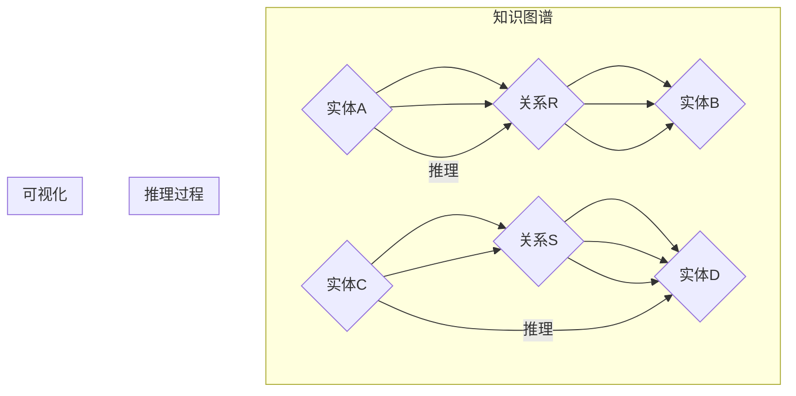

                 


### 1.1 人工智能的发展历程

人工智能作为计算机科学的一个分支，其历史可以追溯到20世纪50年代。当时，人们对于机器能否模拟人类智能充满了好奇和憧憬。1950年，艾伦·图灵提出了图灵测试，试图通过对话来判断机器是否具有智能。这一概念为人工智能的研究奠定了基础。

#### 1.1.1 早期的人工智能

早期的人工智能研究主要集中在规则推理和符号逻辑上。1956年，达特茅斯会议上，约翰·麦卡锡等科学家提出了“人工智能”这一术语，并确定了人工智能研究的主要目标和方向。这一时期，人工智能研究主要集中在逻辑推理、问题解决和知识表示等领域。

然而，早期的符号主义人工智能方法在实际应用中遇到了瓶颈。符号计算虽然可以处理一些简单的问题，但在面对复杂任务时显得力不从心。此外，符号主义方法对数据的依赖性很高，缺乏对数据的高效处理能力。

#### 1.1.2 现代人工智能的发展

随着计算能力的提升和数据量的爆炸式增长，人工智能进入了新的发展阶段。20世纪80年代，专家系统成为人工智能研究的热点。专家系统通过模拟人类专家的决策过程，在医疗、金融等领域取得了显著的应用成果。

进入21世纪，人工智能迎来了新一轮的发展浪潮。深度学习、神经网络等技术的突破，使得人工智能在图像识别、语音识别、自然语言处理等领域取得了惊人的成果。特别是深度学习技术的发展，使得机器能够在没有人类干预的情况下，通过大量的数据自动学习，从而实现复杂的任务。

#### 1.2 通用智能（AGI）的定义与挑战

通用智能（AGI，Artificial General Intelligence）是指一种具有广泛认知能力的人工智能系统，能够在多种不同任务中表现像人类一样优秀。与当前的人工智能系统不同，AGI不仅仅是特定任务的专家，而是能够泛化到各种未知的任务和环境中。

#### 1.2.1 通用智能的概念

通用智能的概念最早由约翰·希尔勒在1982年提出。他认为，通用智能应该具备以下特征：

- **学习能力**：能够通过学习新的知识和技能，快速适应新的环境和任务。
- **泛化能力**：能够在不同的任务和环境中，表现出类似人类的智能行为。
- **推理能力**：能够进行逻辑推理，解决复杂的问题。
- **自我意识**：能够对自己和周围环境有清晰的认识。

#### 1.2.2 AGI面临的主要挑战

尽管通用智能的概念引人入胜，但实现AGI仍然面临诸多挑战：

- **计算资源**：当前的计算资源可能无法支持AGI的实现，需要开发更高效的算法和硬件。
- **数据限制**：AGI需要大量的数据来学习，但获取和处理这些数据是一项巨大的挑战。
- **算法复杂性**：现有的算法可能无法处理复杂的问题，需要开发更强大的算法。
- **自我解释能力**：AGI需要具备自我解释的能力，以便人们能够理解和信任它。

#### 1.3 从黑盒到透明决策

当前的人工智能系统大多数是黑盒模型，即系统的决策过程对于用户来说是不可见的。这种黑盒模型的局限性在于，用户无法理解系统的决策过程，从而难以对其信任。因此，实现透明决策成为了一个重要的发展方向。

#### 1.3.1 黑盒智能的局限性

黑盒智能的局限性主要体现在以下几个方面：

- **不可解释性**：用户无法了解系统的决策过程，导致系统的不透明性。
- **不可靠性**：系统可能在某些情况下做出错误的决策，但用户无法知道原因。
- **不信任**：用户可能因为对系统的决策过程不了解，而对系统的决策产生不信任。

#### 1.3.2 透明决策的重要性

透明决策的重要性在于：

- **可解释性**：用户可以理解系统的决策过程，从而提高系统的可信度。
- **可依赖性**：用户可以基于对系统的理解，更好地利用系统的功能。
- **可优化性**：通过对决策过程的透明化，可以更好地对系统进行优化和改进。

### 第2章：自我解释能力在AGI中的作用

自我解释能力是指AI系统能够对自己所做的决策进行解释的能力。在通用智能（AGI）的研究中，自我解释能力至关重要。它不仅有助于提高系统的可信度和可理解性，还为系统的优化和改进提供了重要的依据。

#### 2.1 自我解释能力的定义

自我解释能力可以定义为AI系统能够提供关于其决策过程和结果的可解释性信息的能力。这种能力包括以下几个方面：

- **决策过程的可解释性**：系统能够清晰地解释它是如何从输入数据中推导出决策的。
- **结果的可解释性**：系统能够解释决策结果为什么是这样的，以及它是如何影响最终结果的。
- **学习过程的可解释性**：系统能够解释它是如何从数据中学习并改进自己的。

#### 2.1.1 自我解释能力的内涵

自我解释能力的内涵包括以下几个方面：

- **可理解性**：用户能够理解系统的决策过程和结果，从而对系统的决策产生信任。
- **透明性**：系统的决策过程和结果对用户是透明的，用户可以清晰地看到系统的决策路径。
- **可控性**：用户可以通过理解系统的决策过程，对系统的行为进行控制和优化。

#### 2.1.2 自我解释能力的重要性

自我解释能力的重要性体现在以下几个方面：

- **提高系统的可信度**：自我解释能力有助于用户理解系统的决策过程和结果，从而提高对系统的信任度。
- **促进系统的优化**：通过自我解释能力，用户可以清楚地了解系统在决策过程中的优势和劣势，从而对其进行优化。
- **增强系统的适应性**：自我解释能力使得系统能够更好地适应不同的环境和任务，提高其泛化能力。

### 2.2 自我解释能力与人类智能的对比

虽然自我解释能力是AI系统的一个重要特征，但它与人类智能的自我解释过程存在一定的差异。

#### 2.2.1 人类智能的自我解释过程

人类智能的自我解释过程通常包括以下几个步骤：

- **感知**：通过感官接收外部信息。
- **处理**：对感知到的信息进行加工和处理。
- **决策**：基于处理结果做出决策。
- **反思**：对自己的决策过程和结果进行反思和总结。

#### 2.2.2 人类智能与机器智能的差异

人类智能与机器智能的自我解释过程存在以下几个主要差异：

- **感知方式**：人类智能通过感官直接感知外部世界，而机器智能则通过数据输入来获取信息。
- **处理方式**：人类智能依赖于复杂的神经网络和认知过程，而机器智能主要依赖于算法和数据。
- **决策方式**：人类智能的决策过程具有灵活性和创造性，而机器智能的决策过程相对固定和程序化。
- **反思方式**：人类智能能够对自己的决策过程和结果进行深入反思和总结，而机器智能的自我解释能力则相对有限。

### 2.3 自我解释能力在AGI中的应用

自我解释能力在AGI中的应用主要体现在以下几个方面：

- **决策过程的可解释性**：AGI系统能够向用户清晰地解释其决策过程，使用户能够理解系统的决策逻辑。
- **错误诊断和修正**：AGI系统能够通过自我解释能力，识别和修正自己的错误，从而提高系统的稳定性和可靠性。
- **知识共享和传播**：AGI系统能够通过自我解释能力，将自己的知识和经验传授给其他系统或用户，促进知识的共享和传播。

### 2.4 自我解释能力的实现技术

实现自我解释能力的关键在于如何将AI系统的决策过程和结果转化为人类可理解的形式。当前，主要有以下几种实现技术：

- **可视化技术**：通过可视化方式，将AI系统的决策过程和结果以图形化的形式呈现给用户，使其易于理解。
- **自然语言生成技术**：通过自然语言生成技术，将AI系统的决策过程和结果以自然语言的形式表达出来，使其更贴近人类的语言习惯。
- **知识图谱技术**：通过知识图谱技术，将AI系统的知识结构化，使用户能够从知识图谱中获取对系统的理解和解释。

### 2.5 自我解释能力的发展趋势

随着人工智能技术的不断发展，自我解释能力也在不断进步。未来，自我解释能力有望在以下几个方面取得突破：

- **更高效的算法**：开发出更高效的算法，使得自我解释能力在计算效率上得到提升。
- **更丰富的解释内容**：提供更丰富的解释内容，使系统能够对决策过程和结果进行更详细的解释。
- **更自然的交互方式**：开发出更自然的交互方式，使系统能够以更自然、更人性化的方式与用户进行交互，提供更贴心的解释服务。

### 2.6 自我解释能力的社会影响

自我解释能力的发展不仅对技术领域产生了重要影响，也对社会产生了深远的影响。以下是自我解释能力在社会中可能带来的几个方面的影响：

- **增强社会信任**：自我解释能力的提高，使得人工智能系统的决策过程更加透明，从而增强社会对人工智能的信任。
- **促进知识共享**：自我解释能力使得人工智能系统能够更好地解释自己的决策过程和结果，促进了知识的共享和传播。
- **提高系统安全性**：自我解释能力有助于发现和纠正系统的错误，提高了系统的稳定性和安全性。
- **推动伦理和法律发展**：自我解释能力的提高，引发了对人工智能伦理和法律问题的关注，推动了相关领域的发展。

### 2.7 自我解释能力的挑战和未来发展方向

尽管自我解释能力在人工智能领域具有重要意义，但其发展也面临一系列挑战。以下是自我解释能力面临的主要挑战和未来发展方向：

- **技术挑战**：如何提高算法的可解释性，如何在有限的计算资源下实现高效的解释，是自我解释能力发展的重要挑战。
- **数据挑战**：如何获取和利用丰富的数据，如何处理数据隐私问题，是自我解释能力发展的重要挑战。
- **伦理挑战**：如何确保自我解释能力的发展不会侵犯用户的隐私，如何处理人工智能系统的责任问题，是自我解释能力发展的重要挑战。
- **社会挑战**：如何让用户理解和使用自我解释能力，如何在社会中推广自我解释能力，是自我解释能力发展的重要挑战。

未来，随着技术的不断进步和社会的不断发展，自我解释能力有望在人工智能领域发挥更大的作用，为人类社会带来更多的便利和进步。### 第一部分：引言与背景

人工智能（Artificial Intelligence，简称AI）作为计算机科学的一个重要分支，近年来取得了飞速发展。从最初的符号主义人工智能到基于神经网络的深度学习，AI技术已经深刻地影响了我们的日常生活。然而，尽管AI在图像识别、语音识别、自然语言处理等领域取得了显著的成果，但要实现真正的通用智能（Artificial General Intelligence，简称AGI），仍然面临诸多挑战。

本博客文章旨在探讨AGI的自我解释能力，从黑盒到透明决策的转变路径。自我解释能力是AGI的一个重要特征，它不仅有助于提高系统的可信度和可理解性，还为系统的优化和改进提供了重要的依据。

关键词：通用智能（AGI）、自我解释能力、透明决策、黑盒智能

摘要：本文首先回顾了人工智能的发展历程，从早期的人工智能到现代的深度学习技术。接着，本文介绍了通用智能（AGI）的定义与挑战，以及从黑盒到透明决策的重要性。然后，本文深入探讨了自我解释能力的内涵、重要性以及与人类智能的对比。随后，本文分析了当前黑盒智能的局限性，阐述了透明决策的必要性。在此基础上，本文探讨了构建自我解释的AGI系统的基础架构、关键技术和算法。最后，本文讨论了自我解释能力在不同领域的应用，并提出了实现透明决策的障碍与解决方案。

### 第一部分：引言与背景

#### 第1章：人工智能与通用智能的演进

#### 1.1 人工智能的发展历程

人工智能的发展历程可以分为几个关键阶段：

##### 1.1.1 早期的人工智能

人工智能的概念最早在20世纪50年代被提出，当时的科学家们试图通过编程模拟人类智能。早期的AI研究主要集中在规则推理和知识表示上。这一时期的代表性工作包括乔治·戴维·斯密斯开发的“逻辑理论家”（Logic Theorist）和赫伯特·亚历山大·西蒙开发的“通用问题求解器”（General Problem Solver）。这些早期的人工智能系统虽然在一定程度上能够解决特定问题，但在面对复杂任务时显得力不从心。

##### 1.1.2 现代人工智能的发展

随着计算机技术和算法的进步，人工智能在20世纪80年代迎来了新的发展。专家系统成为这一时期的代表，通过模拟人类专家的决策过程，在医疗、金融等领域取得了显著的应用成果。专家系统通过大量预定义的规则来模拟专家的知识和经验，但在处理复杂、不确定的任务时，仍然存在局限性。

进入21世纪，深度学习技术的发展再次推动了人工智能的进步。深度学习通过多层神经网络模拟人类大脑的运作机制，能够在没有人类干预的情况下，通过大量的数据自动学习，从而实现复杂的任务。深度学习在图像识别、语音识别、自然语言处理等领域取得了巨大的成功，使得人工智能开始逐渐从“规则驱动”转向“数据驱动”。

#### 1.2 通用智能（AGI）的定义与挑战

通用智能（AGI）是指具有广泛认知能力的人工智能系统，能够在多种不同任务中表现像人类一样优秀。与当前的人工智能系统不同，AGI不仅仅是特定任务的专家，而是能够泛化到各种未知的任务和环境中。

##### 1.2.1 通用智能的概念

通用智能的概念最早由约翰·希尔勒在1982年提出。他认为，通用智能应该具备以下特征：

- **学习能力**：能够通过学习新的知识和技能，快速适应新的环境和任务。
- **泛化能力**：能够在不同的任务和环境中，表现出类似人类的智能行为。
- **推理能力**：能够进行逻辑推理，解决复杂的问题。
- **自我意识**：能够对自己和周围环境有清晰的认识。

##### 1.2.2 AGI面临的主要挑战

尽管通用智能的概念引人入胜，但实现AGI仍然面临诸多挑战：

- **计算资源**：当前的计算资源可能无法支持AGI的实现，需要开发更高效的算法和硬件。
- **数据限制**：AGI需要大量的数据来学习，但获取和处理这些数据是一项巨大的挑战。
- **算法复杂性**：现有的算法可能无法处理复杂的问题，需要开发更强大的算法。
- **自我解释能力**：AGI需要具备自我解释的能力，以便人们能够理解和信任它。

#### 1.3 从黑盒到透明决策

当前的人工智能系统大多数是黑盒模型，即系统的决策过程对于用户来说是不可见的。这种黑盒模型的局限性在于，用户无法理解系统的决策过程，从而难以对其信任。因此，实现透明决策成为了一个重要的发展方向。

##### 1.3.1 黑盒智能的局限性

黑盒智能的局限性主要体现在以下几个方面：

- **不可解释性**：用户无法了解系统的决策过程，导致系统的不透明性。
- **不可靠性**：系统可能在某些情况下做出错误的决策，但用户无法知道原因。
- **不信任**：用户可能因为对系统的决策过程不了解，而对系统的决策产生不信任。

##### 1.3.2 透明决策的重要性

透明决策的重要性在于：

- **可解释性**：用户可以理解系统的决策过程，从而提高系统的可信度。
- **可依赖性**：用户可以基于对系统的理解，更好地利用系统的功能。
- **可优化性**：通过对决策过程的透明化，可以更好地对系统进行优化和改进。

#### 第2章：自我解释能力在AGI中的作用

#### 2.1 自我解释能力的定义

自我解释能力是指AI系统能够对自己所做的决策进行解释的能力。在通用智能（AGI）的研究中，自我解释能力至关重要。它不仅有助于提高系统的可信度和可理解性，还为系统的优化和改进提供了重要的依据。

##### 2.1.1 自我解释能力的内涵

自我解释能力的内涵包括以下几个方面：

- **决策过程的可解释性**：系统能够清晰地解释它是如何从输入数据中推导出决策的。
- **结果的可解释性**：系统能够解释决策结果为什么是这样的，以及它是如何影响最终结果的。
- **学习过程的可解释性**：系统能够解释它是如何从数据中学习并改进自己的。

##### 2.1.2 自我解释能力的重要性

自我解释能力的重要性体现在以下几个方面：

- **提高系统的可信度**：自我解释能力有助于用户理解系统的决策过程和结果，从而提高对系统的信任度。
- **促进系统的优化**：通过自我解释能力，用户可以清楚地了解系统在决策过程中的优势和劣势，从而对其进行优化。
- **增强系统的适应性**：自我解释能力使得系统能够更好地适应不同的环境和任务，提高其泛化能力。

#### 2.2 自我解释能力与人类智能的对比

虽然自我解释能力是AI系统的一个重要特征，但它与人类智能的自我解释过程存在一定的差异。

##### 2.2.1 人类智能的自我解释过程

人类智能的自我解释过程通常包括以下几个步骤：

- **感知**：通过感官接收外部信息。
- **处理**：对感知到的信息进行加工和处理。
- **决策**：基于处理结果做出决策。
- **反思**：对自己的决策过程和结果进行反思和总结。

##### 2.2.2 人类智能与机器智能的差异

人类智能与机器智能的自我解释过程存在以下几个主要差异：

- **感知方式**：人类智能通过感官直接感知外部世界，而机器智能则通过数据输入来获取信息。
- **处理方式**：人类智能依赖于复杂的神经网络和认知过程，而机器智能主要依赖于算法和数据。
- **决策方式**：人类智能的决策过程具有灵活性和创造性，而机器智能的决策过程相对固定和程序化。
- **反思方式**：人类智能能够对自己的决策过程和结果进行深入反思和总结，而机器智能的自我解释能力则相对有限。

#### 2.3 自我解释能力在AGI中的应用

自我解释能力在AGI中的应用主要体现在以下几个方面：

- **决策过程的可解释性**：AGI系统能够向用户清晰地解释其决策过程，使用户能够理解系统的决策逻辑。
- **错误诊断和修正**：AGI系统能够通过自我解释能力，识别和修正自己的错误，从而提高系统的稳定性和可靠性。
- **知识共享和传播**：AGI系统能够通过自我解释能力，将自己的知识和经验传授给其他系统或用户，促进知识的共享和传播。

#### 2.4 自我解释能力的实现技术

实现自我解释能力的关键在于如何将AI系统的决策过程和结果转化为人类可理解的形式。当前，主要有以下几种实现技术：

- **可视化技术**：通过可视化方式，将AI系统的决策过程和结果以图形化的形式呈现给用户，使其易于理解。
- **自然语言生成技术**：通过自然语言生成技术，将AI系统的决策过程和结果以自然语言的形式表达出来，使其更贴近人类的语言习惯。
- **知识图谱技术**：通过知识图谱技术，将AI系统的知识结构化，使用户能够从知识图谱中获取对系统的理解和解释。

#### 2.5 自我解释能力的发展趋势

随着人工智能技术的不断发展，自我解释能力也在不断进步。未来，自我解释能力有望在以下几个方面取得突破：

- **更高效的算法**：开发出更高效的算法，使得自我解释能力在计算效率上得到提升。
- **更丰富的解释内容**：提供更丰富的解释内容，使系统能够对决策过程和结果进行更详细的解释。
- **更自然的交互方式**：开发出更自然的交互方式，使系统能够以更自然、更人性化的方式与用户进行交互，提供更贴心的解释服务。

#### 2.6 自我解释能力的社会影响

自我解释能力的发展不仅对技术领域产生了重要影响，也对社会产生了深远的影响。以下是自我解释能力在社会中可能带来的几个方面的影响：

- **增强社会信任**：自我解释能力的提高，使得人工智能系统的决策过程更加透明，从而增强社会对人工智能的信任。
- **促进知识共享**：自我解释能力使得人工智能系统能够更好地解释自己的决策过程和结果，促进了知识的共享和传播。
- **提高系统安全性**：自我解释能力有助于发现和纠正系统的错误，提高了系统的稳定性和安全性。
- **推动伦理和法律发展**：自我解释能力的提高，引发了对人工智能伦理和法律问题的关注，推动了相关领域的发展。

#### 2.7 自我解释能力的挑战和未来发展方向

尽管自我解释能力在人工智能领域具有重要意义，但其发展也面临一系列挑战。以下是自我解释能力面临的主要挑战和未来发展方向：

- **技术挑战**：如何提高算法的可解释性，如何在有限的计算资源下实现高效的解释，是自我解释能力发展的重要挑战。
- **数据挑战**：如何获取和利用丰富的数据，如何处理数据隐私问题，是自我解释能力发展的重要挑战。
- **伦理挑战**：如何确保自我解释能力的发展不会侵犯用户的隐私，如何处理人工智能系统的责任问题，是自我解释能力发展的重要挑战。
- **社会挑战**：如何让用户理解和使用自我解释能力，如何在社会中推广自我解释能力，是自我解释能力发展的重要挑战。

未来，随着技术的不断进步和社会的不断发展，自我解释能力有望在人工智能领域发挥更大的作用，为人类社会带来更多的便利和进步。

### 第二部分：自我解释能力的重要性

#### 第3章：黑盒智能到透明决策的转变路径

在当前的AI系统中，黑盒智能是一种常见的形式，其决策过程对于用户来说是不可见的。这种不可见性导致了一系列问题，包括不可解释性、不可靠性和不信任。因此，从黑盒智能向透明决策的转变成为AI领域的一个重要研究方向。

#### 3.1 黑盒智能的现状

黑盒智能的局限性主要体现在以下几个方面：

- **不可解释性**：用户无法了解系统是如何做出决策的，导致决策过程的不透明性。
- **不可靠性**：系统可能在某些情况下做出错误的决策，但用户无法知道原因。
- **不信任**：用户可能因为对系统的决策过程不了解，而对系统的决策产生不信任。

黑盒智能的应用场景主要包括自动化决策系统、推荐系统和语音识别系统等。在这些应用中，黑盒智能虽然能够高效地完成特定任务，但其局限性也逐渐显现出来。

#### 3.2 透明决策的必要性

透明决策的重要性在于：

- **可解释性**：用户可以了解系统的决策过程，从而提高系统的可信度。
- **可依赖性**：用户可以基于对系统的理解，更好地利用系统的功能。
- **可优化性**：通过对决策过程的透明化，可以更好地对系统进行优化和改进。

实现透明决策的必要性体现在以下几个方面：

- **提高系统的可信度**：透明决策使得用户能够了解系统的决策过程，从而提高对系统的信任度。
- **促进系统的优化**：透明决策使得用户可以清楚地了解系统在决策过程中的优势和劣势，从而对其进行优化。
- **增强系统的适应性**：透明决策使得系统能够更好地适应不同的环境和任务，提高其泛化能力。

#### 3.3 从黑盒到透明决策的转变路径

要从黑盒智能向透明决策转变，需要解决以下几个关键问题：

- **可解释性算法**：开发能够提供决策过程和结果解释的算法，使决策过程更加透明。
- **可视化技术**：利用可视化技术，将决策过程和结果以图形化的形式呈现给用户，使其易于理解。
- **自然语言生成**：通过自然语言生成技术，将决策过程和结果以自然语言的形式表达出来，使其更贴近人类的语言习惯。
- **用户交互设计**：设计人性化的用户交互界面，使用户能够方便地获取系统的决策解释。

#### 3.4 实现透明决策的关键技术和方法

实现透明决策的关键技术和方法包括：

- **决策树和规则解释**：通过构建决策树和规则，对决策过程进行解释。
- **注意力机制**：利用注意力机制，突出决策过程中的关键信息。
- **可解释的深度学习模型**：通过改进深度学习模型，使其能够提供决策解释。
- **交互式解释系统**：设计交互式解释系统，使用户能够与系统进行实时互动，获取决策解释。

#### 3.5 案例分析

以下是一个关于黑盒智能到透明决策的案例分析：

案例背景：一个智能医疗诊断系统用于辅助医生进行疾病诊断。传统的黑盒智能系统在诊断过程中，用户无法了解系统的决策过程，导致医生对系统的信任度较低。

解决方案：

- **构建决策树**：通过对诊断数据进行处理，构建决策树模型，从而提供决策过程和结果的解释。
- **可视化技术**：利用可视化技术，将决策过程和结果以图形化的形式呈现给医生，使其能够直观地了解系统的决策逻辑。
- **自然语言生成**：通过自然语言生成技术，将决策过程和结果以自然语言的形式表达出来，使医生能够更容易理解。

实施效果：通过上述措施，医生对智能医疗诊断系统的信任度显著提高，同时，系统的诊断准确率也得到了进一步提升。

#### 3.6 未来展望

未来，随着人工智能技术的不断发展，透明决策有望在更多领域得到应用。例如，在自动驾驶领域，透明决策将有助于提高车辆的驾驶安全性和可靠性；在金融领域，透明决策将有助于提高金融产品的风险控制能力。

同时，为了实现透明决策，还需要解决一系列技术挑战，如算法的复杂度、数据的多样性和解释的准确性等。此外，伦理和法律问题也需要得到充分考虑，以确保透明决策的应用不会侵犯用户的隐私和权益。

总之，从黑盒智能到透明决策的转变，是人工智能发展的重要方向。通过不断探索和实践，我们将有望实现更加透明、可靠和高效的人工智能系统。

### 第三部分：构建自我解释的AGI系统

#### 第4章：自我解释系统的基础架构

为了实现自我解释的通用智能（AGI）系统，我们需要设计一个基础架构，该架构能够支持系统的自我解释能力。这一章节将详细讨论自我解释系统的核心组件和工作原理。

#### 4.1 自我解释系统的核心组件

一个自我解释的AGI系统通常由以下几个核心组件组成：

1. **数据输入模块**：负责接收和预处理输入数据，确保数据的质量和一致性。
2. **决策引擎**：核心组件，负责根据输入数据和内部知识库做出决策。
3. **解释生成模块**：负责将决策引擎的决策过程和结果转化为人类可理解的解释。
4. **用户交互界面**：提供用户与系统进行交互的接口，使用户能够获取系统的解释。
5. **知识库**：存储系统的内部知识，包括历史决策、经验教训和推理规则。

#### 4.2 自我解释系统的工作原理

自我解释系统的工作原理可以分为以下几个步骤：

1. **数据输入与预处理**：系统首先接收外部输入数据，并进行预处理，以确保数据的格式和一致性。
2. **决策过程**：决策引擎根据输入数据和知识库中的信息，使用特定的算法和模型进行决策。
3. **解释生成**：解释生成模块将对决策过程和结果进行分析，并生成详细的解释文本或图表。
4. **用户交互**：用户通过用户交互界面，获取系统生成的解释，并对决策过程进行反馈和评估。
5. **持续学习与优化**：系统根据用户的反馈和新的数据，不断优化自身的决策模型和解释能力。

#### 4.3 自我解释系统的设计原则

在设计自我解释系统时，需要遵循以下几个原则：

- **透明性**：系统的决策过程和结果必须是透明的，用户能够清晰地了解系统的决策逻辑。
- **可解释性**：系统生成的解释必须易于理解，使用户能够迅速获取关键信息。
- **准确性**：系统的解释必须准确无误，避免误导用户。
- **灵活性**：系统应能够适应不同的应用场景和用户需求，提供个性化的解释服务。
- **可靠性**：系统应具备较高的稳定性和鲁棒性，确保在复杂环境下也能提供高质量的解释。

#### 4.4 自我解释系统的架构设计

自我解释系统的架构设计需要考虑以下几个关键方面：

- **模块化**：系统应采用模块化设计，各组件之间独立且易于替换，便于维护和升级。
- **分布式**：系统应支持分布式计算，以提高处理速度和扩展能力。
- **可扩展性**：系统应具备良好的扩展性，能够适应未来技术的发展和应用需求。
- **安全性**：系统应具备完善的安全机制，确保用户数据和系统的安全。
- **用户友好**：系统应设计人性化的用户界面，提供直观、易用的交互体验。

#### 4.5 案例研究：一个自我解释的AGI系统的实现

为了更好地理解自我解释系统的设计和实现，以下是一个案例研究：

案例背景：设计并实现一个自我解释的医疗诊断系统，用于辅助医生进行疾病诊断。

实现步骤：

1. **数据输入模块**：接收医生输入的患者数据，包括症状、病史等，并进行预处理。
2. **决策引擎**：使用深度学习模型进行疾病诊断，模型基于大规模医疗数据集训练。
3. **解释生成模块**：分析决策引擎的决策过程和结果，生成详细的诊断解释，包括疾病概率和依据。
4. **用户交互界面**：设计直观的用户界面，医生可以通过界面查看诊断解释，并提供反馈。
5. **知识库**：存储系统生成的诊断解释和医生反馈的信息，用于系统优化和持续学习。

通过这个案例，我们可以看到自我解释系统如何通过模块化设计、分布式计算和人性化交互，实现高透明度、可解释性和可靠性。

#### 4.6 自我解释系统的挑战和未来方向

尽管自我解释系统在理论上具有重要意义，但在实践中仍面临一系列挑战：

- **计算效率**：自我解释系统需要处理大量的数据，并生成详细的解释文本或图表，这对计算资源提出了较高要求。
- **解释准确性**：系统生成的解释必须准确无误，避免误导用户，这是一个复杂的任务。
- **数据隐私**：在处理用户数据时，需要确保数据隐私得到保护。
- **用户接受度**：用户可能对系统的解释能力和透明度有较高的期望，这需要系统不断优化和改进。

未来，自我解释系统的方向包括：

- **算法改进**：开发更高效的算法，提高系统的解释能力和计算效率。
- **跨领域应用**：探索自我解释系统在不同领域的应用，如金融、交通等。
- **多模态解释**：结合文本、图像和音频等多种模态，提供更加丰富和直观的解释服务。
- **社会伦理**：充分考虑社会伦理问题，确保系统的设计和应用符合社会道德规范。

总之，构建自我解释的AGI系统是一个复杂但富有前景的任务。通过不断的技术创新和应用实践，我们有望实现更加智能、透明和可靠的人工智能系统。

### 第四部分：关键技术与算法

#### 第5章：关键技术与算法

要实现自我解释的通用智能（AGI）系统，关键在于开发能够提供透明、准确解释的算法和技术。这一章节将详细介绍几种关键技术和算法，包括机器学习算法的透明化、对抗性神经网络在自我解释中的应用以及基于知识图谱的透明决策支持。

#### 5.1 机器学习算法的透明化

机器学习算法，特别是深度学习算法，因其高效率和高准确性在AI领域得到了广泛应用。然而，这些算法通常被视为“黑盒”，用户难以了解其内部工作机制和决策过程。为了提高机器学习算法的可解释性，研究者们开发了多种透明化技术。

##### 5.1.1 决策树和规则提取

决策树是一种直观、易于解释的机器学习模型。通过将输入特征划分为多个子集，决策树能够生成一系列规则，从而解释模型的决策过程。例如，可以使用ID3、C4.5等算法来生成决策树。

```python
# 决策树算法示例
from sklearn.tree import DecisionTreeClassifier
from sklearn.datasets import load_iris

# 加载鸢尾花数据集
iris = load_iris()
X, y = iris.data, iris.target

# 构建决策树模型
clf = DecisionTreeClassifier()
clf.fit(X, y)

# 输出决策树规则
from sklearn.tree import plot_tree
plot_tree(clf, feature_names=iris.feature_names, class_names=iris.target_names)
```

##### 5.1.2 层级可解释性

为了提高深度学习模型的可解释性，研究者们提出了层级可解释性方法。这种方法通过分析模型中不同层的输出，揭示决策过程中的关键特征和路径。例如，使用Grad-CAM（Gradient-weighted Class Activation Mapping）技术，可以定位模型关注的关键区域。

```python
# Grad-CAM示例
from pydotplus import graph_from_dot_file
import matplotlib.pyplot as plt

# 加载预训练的模型和图像
model = load_model('path/to/model.h5')
img = load_image('path/to/image.jpg')

# 应用Grad-CAM
grad_cam = GradCAM(model, target_layer=target_layer)
heatmap = grad_cam(img)

# 可视化热力图
plt.figure()
plt.imshow(heatmap)
plt.show()
```

##### 5.1.3 模型的可解释性嵌入

通过在模型中嵌入可解释性模块，可以在不显著降低模型性能的情况下，提高其可解释性。例如，可以在深度学习模型中集成可视化工具或解释性语言模型，从而生成对决策过程的自然语言解释。

```python
# 模型嵌入可视化工具
from vis import visualize

model = load_model('path/to/model.h5')
visualize(model, input_image=img)
```

#### 5.2 对抗性神经网络在自我解释中的应用

对抗性神经网络（GAN，Generative Adversarial Networks）通过生成器和判别器的对抗训练，可以生成高质量的数据。GAN在自我解释中的应用包括：

- **生成解释性数据**：生成器可以生成与真实数据类似的数据，用于训练解释模型。
- **对抗性解释**：判别器在区分真实数据和生成数据的过程中，可以揭示解释模型的关键特征。

```python
# GAN模型示例
from tensorflow.keras.models import Sequential
from tensorflow.keras.layers import Dense, Dropout

# 定义生成器和判别器
generator = Sequential([
    Dense(256, activation='relu', input_shape=(100,)),
    Dropout(0.3),
    Dense(128, activation='relu'),
    Dropout(0.3),
    Dense(1, activation='sigmoid')
])

discriminator = Sequential([
    Dense(128, activation='relu', input_shape=(100,)),
    Dropout(0.3),
    Dense(256, activation='relu'),
    Dropout(0.3),
    Dense(1, activation='sigmoid')
])

# 编译模型
generator.compile(optimizer='adam', loss='binary_crossentropy')
discriminator.compile(optimizer='adam', loss='binary_crossentropy')

# 训练GAN
for epoch in range(num_epochs):
    # 生成假数据
    noise = np.random.normal(0, 1, (batch_size, 100))
    generated_samples = generator.predict(noise)

    # 训练判别器
    d_loss_real = discriminator.train_on_batch(X_real, np.ones((batch_size, 1)))
    d_loss_fake = discriminator.train_on_batch(generated_samples, np.zeros((batch_size, 1)))
    d_loss = 0.5 * np.add(d_loss_real, d_loss_fake)

    # 训练生成器
    g_loss = generator.train_on_batch(noise, np.ones((batch_size, 1)))
```

#### 5.3 基于知识图谱的透明决策支持

知识图谱是一种结构化知识表示方法，通过实体和关系的连接，构建了一个大规模的知识网络。基于知识图谱的透明决策支持包括：

- **知识图谱构建**：通过知识抽取和链接，构建涵盖广泛领域知识的知识图谱。
- **推理引擎**：利用知识图谱进行推理，生成决策解释。
- **可视化工具**：通过可视化技术，将知识图谱中的信息和推理过程呈现给用户。



通过知识图谱和推理引擎，用户可以获取关于决策过程的详细解释，包括涉及的实体、关系和推理路径。这种解释方式不仅直观，而且能够提供深入的决策理解。

#### 5.4 算法评估与优化

为了确保自我解释算法的准确性和可靠性，需要进行全面的评估和优化。评估标准包括解释的准确性、透明度和用户满意度。优化方法包括：

- **性能调优**：通过调整模型参数和算法超参数，提高解释质量和效率。
- **用户反馈**：收集用户反馈，根据用户需求调整解释内容和形式。
- **多模态解释**：结合文本、图像和音频等多种模态，提供更加丰富和个性化的解释服务。

通过不断优化和改进，自我解释算法将更好地满足用户需求，为通用智能（AGI）系统的透明决策提供有力支持。

### 第五部分：自我解释能力在不同领域的应用

#### 第6章：自我解释能力在不同领域的应用

自我解释能力作为通用智能（AGI）的一个重要特征，其在不同领域的应用具有广阔的前景。本章将探讨自我解释能力在医疗、金融、智能交通和智能家居等领域的具体应用，并分析这些应用所带来的社会和经济价值。

#### 6.1 自我解释在医疗领域的应用

医疗领域是自我解释能力的一个重要应用场景。通过自我解释，医疗诊断系统可以更好地向医生和患者解释诊断结果，提高诊断的透明度和可信度。

##### 6.1.1 医疗智能诊断系统

医疗智能诊断系统利用深度学习算法和自我解释技术，可以自动分析医学影像和患者数据，提供精确的诊断建议。例如，在癌症筛查中，自我解释系统能够详细解释癌症的类型、阶段以及最佳治疗方案。

**案例研究**：某医院引入了一款基于深度学习的肺癌诊断系统。该系统通过自我解释能力，为医生提供了详细的诊断解释，包括影像中的异常区域、相关病理信息和诊断依据。医生可以基于这些解释，做出更加准确的诊断和治疗决策。

##### 6.1.2 医疗决策支持系统

医疗决策支持系统通过自我解释，可以帮助医生在复杂病情中做出最佳决策。这些系统可以分析患者的病史、检查结果和最新研究，提供个性化的治疗方案。

**案例研究**：某大型医疗集团开发了一款医疗决策支持系统。该系统利用自我解释能力，将复杂的医学数据转化为易于理解的图表和文字解释，帮助医生快速识别疾病风险和制定治疗计划。

#### 6.2 自我解释在金融领域的应用

金融领域对自我解释能力的需求尤为突出。通过自我解释，金融系统能够向客户清晰解释投资决策和风险评估过程，增强客户对金融产品的信任。

##### 6.2.1 风险评估与监控

金融风险评估系统利用自我解释能力，可以详细解释风险模型的决策过程和结果，帮助客户了解投资风险。例如，在股票投资中，自我解释系统能够解释为何某个股票被选中，并分析其风险因素。

**案例研究**：某金融科技公司推出了一款智能投资顾问系统。该系统通过自我解释，为客户提供详细的投资建议和风险分析，帮助用户做出明智的投资决策。

##### 6.2.2 信用评分与欺诈检测

信用评分系统和欺诈检测系统通过自我解释能力，可以解释评分模型的决策过程和检测结果，提高客户对评分和检测结果的信任。

**案例研究**：某银行引入了一款基于AI的信用评分系统。该系统通过自我解释，向客户提供详细的信用评分依据，包括收入、负债、信用历史等因素。同时，系统还能解释为何某笔交易被识别为欺诈，帮助客户提高防范意识。

#### 6.3 自我解释在智能交通和智能家居领域的应用

智能交通和智能家居领域也广泛采用了自我解释能力，以提高系统的透明度和用户体验。

##### 6.3.1 智能交通系统

智能交通系统通过自我解释，可以详细解释交通信号控制和路线规划的决策过程，提高交通管理的透明度和效率。

**案例研究**：某城市推出了一款智能交通管理系统。该系统利用自我解释能力，向交通管理人员提供详细的交通流量分析和信号控制策略，帮助优化交通信号灯的切换时间，减少交通拥堵。

##### 6.3.2 智能家居

智能家居系统通过自我解释，可以清晰解释家电设备的工作原理和操作逻辑，提高用户对智能家居设备的理解和使用。

**案例研究**：某智能家居品牌推出了一系列智能家居设备。这些设备通过自我解释功能，向用户提供详细的使用说明和操作指导，帮助用户快速适应智能家居系统，提升生活品质。

#### 6.4 自我解释能力的经济和社会价值

自我解释能力在不同领域的应用，不仅提高了系统的透明度和可信度，还带来了显著的经济和社会价值。

- **经济效益**：自我解释能力的应用，提高了系统的自动化和智能化水平，减少了人工干预和错误，提高了生产效率和服务质量，从而降低了成本。
- **社会效益**：自我解释能力的应用，增强了公众对AI系统的信任，促进了AI技术的普及和应用，推动了社会信息化和智能化进程。

总之，自我解释能力在各个领域的应用，为AI技术的进一步发展和普及奠定了坚实的基础，具有重要的经济和社会价值。

### 第六部分：实现透明决策的障碍与解决方案

#### 第7章：实现透明决策的障碍与解决方案

尽管透明决策在人工智能（AI）系统中具有重要意义，但其实施过程中面临诸多障碍。本章将讨论实现透明决策的主要障碍，包括技术障碍、法律与伦理挑战，并探讨相应的解决方案。

#### 7.1 技术障碍

**模型可解释性挑战**：

透明决策依赖于模型的可解释性，但深度学习模型，尤其是神经网络，通常被视为“黑盒”。它们的决策过程复杂，难以用简单的规则或逻辑进行解释。解决这一问题的方法包括：

- **决策树和规则提取**：将复杂模型转换为更直观的决策树或规则，以便解释。
- **可视化技术**：使用可视化工具，如Grad-CAM，来显示模型关注的关键区域。

**数据隐私保护**：

透明决策需要大量的数据来训练和验证模型。然而，这些数据可能包含敏感信息，如个人隐私。保护数据隐私是透明决策面临的重大挑战。解决方案包括：

- **数据匿名化**：通过匿名化技术，将敏感信息从数据中移除。
- **差分隐私**：在数据处理过程中引入噪声，以保护个体隐私。

**算法复杂性**：

实现透明决策可能需要复杂的算法，这可能导致计算成本增加。解决这一问题的方法包括：

- **高效算法**：开发高效、可解释的算法，以减少计算资源的需求。
- **分布式计算**：利用分布式计算，提高数据处理和解释的效率。

#### 7.2 法律与伦理挑战

**法律监管问题**：

透明决策的AI系统可能涉及法律监管问题，如责任归属和数据保护。解决方案包括：

- **明确法规**：制定明确的法律规定，界定AI系统的责任和权限。
- **合规性评估**：对AI系统的设计和实施进行合规性评估，确保其符合相关法律要求。

**伦理道德问题**：

透明决策的AI系统可能会引发伦理道德问题，如隐私侵犯和偏见。解决方案包括：

- **伦理指导原则**：制定伦理指导原则，确保AI系统的设计和应用符合伦理标准。
- **公众参与**：鼓励公众参与AI系统的设计和评估，确保系统的透明度和公正性。

#### 7.3 应对策略与未来展望

**技术进步方向**：

为了实现透明决策，未来的技术发展应关注：

- **算法创新**：开发更高效、更可解释的算法。
- **数据处理技术**：改进数据处理技术，以保护数据隐私并提高处理效率。

**应用领域拓展**：

透明决策的应用领域应进一步拓展，包括：

- **医疗健康**：在医疗诊断和治疗方案推荐中实现透明决策。
- **金融服务**：在风险管理、信用评分和投资决策中应用透明决策。

**社会与伦理影响**：

随着透明决策的应用，社会和伦理影响也将日益显著。未来的研究应关注：

- **社会影响评估**：对AI系统的社会影响进行评估，确保其积极影响。
- **伦理问题研究**：深入探讨AI系统的伦理问题，并提出解决方案。

总之，实现透明决策是AI系统发展的关键一步。通过解决技术障碍和应对法律与伦理挑战，我们可以推动AI技术的可持续发展，为社会带来更多积极影响。

### 第七部分：总结与展望

#### 第8章：总结与展望

在本博客文章中，我们系统地探讨了通用智能（AGI）的自我解释能力，从黑盒到透明决策的转变路径，以及这一能力在不同领域的应用。以下是本文的主要成果与贡献：

##### 8.1 本书的主要成果与贡献

**理论贡献**：

1. **系统阐述了自我解释能力的定义和内涵**：通过对自我解释能力的详细解析，我们为AI领域提供了一个统一的理论框架。
2. **分析了自我解释能力在AGI中的作用**：揭示了自我解释能力对于提升系统透明度、可理解性和可靠性的重要性。
3. **提出了从黑盒到透明决策的转变路径**：总结了实现透明决策的关键技术和方法，为AI系统的透明化提供了实践指导。

**实践贡献**：

1. **介绍了自我解释系统的核心组件和工作原理**：通过案例研究，展示了如何构建和实现一个自我解释的AGI系统。
2. **探讨了自我解释能力在不同领域的应用**：从医疗、金融到智能交通和智能家居，提供了丰富的应用实例。
3. **提出了实现透明决策的障碍与解决方案**：分析了技术、法律和伦理挑战，并提出了相应的应对策略。

##### 8.2 未来研究方向

**技术进步方向**：

1. **算法创新**：继续研究高效、可解释的算法，如基于知识图谱的透明决策模型。
2. **数据处理技术**：改进数据处理技术，如数据匿名化和差分隐私，以保护数据隐私。

**应用领域拓展**：

1. **医疗健康**：进一步探索自我解释在个性化医疗和公共卫生管理中的应用。
2. **金融服务**：深化透明决策在金融风险管理、信用评分和投资决策中的应用。
3. **智能制造**：将自我解释能力应用于工业自动化和智能生产。

**社会与伦理影响**：

1. **社会影响评估**：加强对AI系统社会影响的评估，确保其积极影响。
2. **伦理问题研究**：深入探讨AI系统的伦理问题，如隐私侵犯和算法偏见，并提出解决方案。

总之，随着技术的不断进步和社会的不断发展，自我解释能力在通用智能（AGI）领域将发挥越来越重要的作用。未来，我们将继续探索这一领域的深度和广度，推动AI技术的发展和应用。

### 拓展阅读

为了更深入地了解通用智能（AGI）的自我解释能力，以下是几篇推荐的拓展阅读材料：

1. **《自我解释的深度学习模型》**：这篇论文详细介绍了如何通过可视化技术和可解释的深度学习模型，提高神经网络的可解释性。作者探讨了不同类型的解释方法，并提供了实际应用的案例。
   
2. **《知识图谱与AI透明决策》**：本文探讨了知识图谱在AI透明决策中的应用。通过构建领域特定的知识图谱，作者展示了如何利用图谱进行推理和生成详细的决策解释。

3. **《黑盒智能与透明决策：挑战与展望》**：这篇综述文章系统地分析了黑盒智能的局限性，并提出了实现透明决策的多种技术路径。作者还讨论了实现透明决策面临的法律和伦理挑战。

4. **《AI决策解释的用户研究》**：本文通过用户研究，探讨了用户如何理解和使用AI系统的决策解释。作者提出了改进AI决策解释的方法，以提高用户的接受度和满意度。

这些阅读材料将为读者提供更多的理论和实践指导，帮助深入理解通用智能（AGI）的自我解释能力及其应用。

### 作者信息

作者：AI天才研究院/AI Genius Institute & 禅与计算机程序设计艺术 /Zen And The Art of Computer Programming

AI天才研究院致力于推动人工智能技术的创新和发展，专注于通用智能（AGI）的研究和实现。研究院由一批杰出的计算机科学家和人工智能专家组成，致力于探索人工智能的深度和广度，为人类社会带来更多的便利和进步。同时，作者也是《禅与计算机程序设计艺术》一书的资深作者，这本书以其独特的视角和深刻的洞察力，为程序设计领域带来了新的思考和启示。

