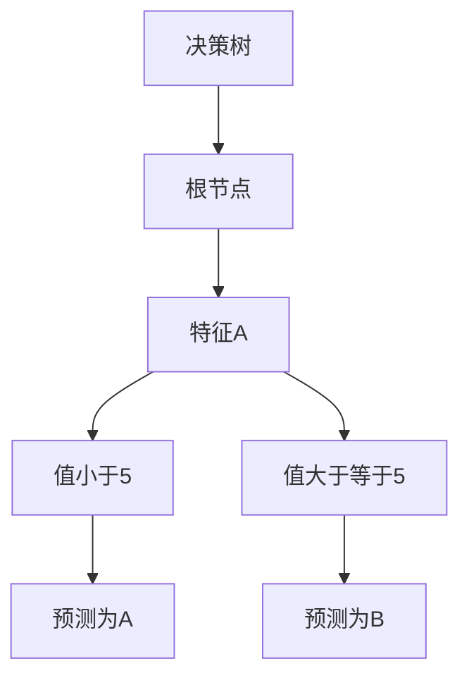
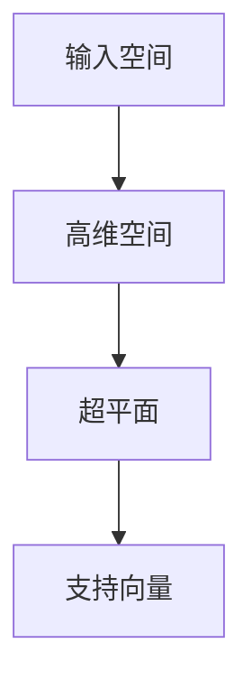
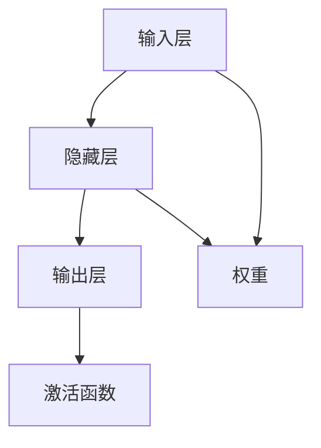
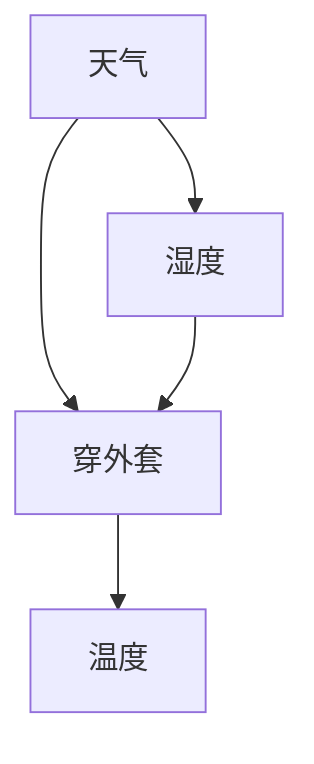
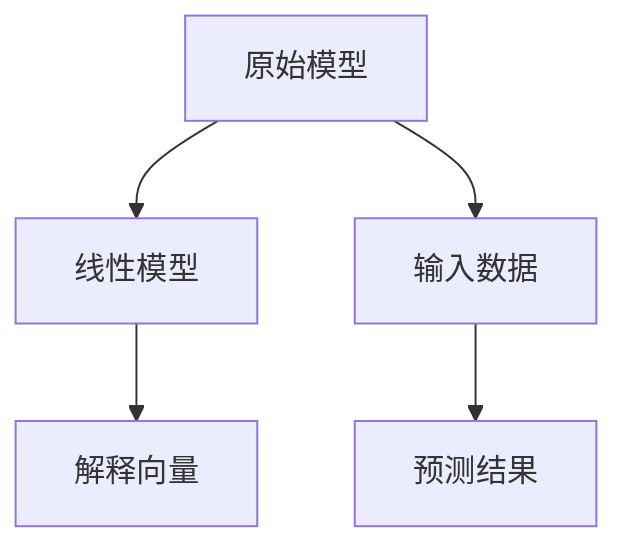
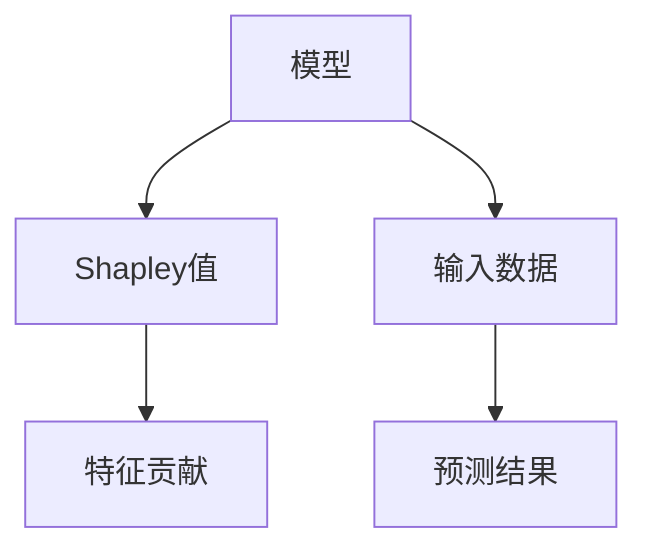

                 

### 引言

#### 核心概念术语说明

在探讨人工智能（AI）的领域时，几个核心概念必须首先厘清。首先，人工智能本身指的是使计算机具备人类智能特征的科学技术，其目标是让机器能够执行复杂的任务，如视觉识别、语言理解和决策制定。然而，传统的人工智能（NAI）主要依赖于特定领域的知识和规则系统，这在处理复杂和非结构化任务时显得力不从心。

与NAI相对的是通用人工智能（AGI），也称为强人工智能。AGI的目标是构建具有人类智能的所有方面的机器，能够理解、学习和适应任何环境。这意味着AGI不仅能在特定任务上表现出色，还能在多个领域展现全面智能。自我解释能力是AGI的关键特性之一，指的是机器能够以人类可理解的方式解释其行为和决策过程。

#### 问题背景

AI技术的发展在过去的几十年里取得了惊人的进步。尤其是深度学习的崛起，使得机器在各种复杂任务上的表现超越了人类。然而，尽管AI在许多方面已经取得了显著成就，但AGI仍面临诸多挑战，其中一个关键问题就是自我解释能力的缺失。当前的AI系统，包括深度学习模型，通常被视为“黑箱”，即它们的行为和决策过程难以解释。

这种不可解释性带来了两个主要问题。首先，对于AI系统的信任度下降。如果人们无法理解系统是如何得出结论的，那么他们就会对其决策产生怀疑，特别是在涉及安全和伦理的领域。其次，不可解释的AI系统难以进行调试和改进。如果无法理解模型的行为，就难以识别和修正错误。

#### 问题描述

AGI的自我解释能力不足主要体现在以下几个方面：

1. **决策透明度**：AI系统的决策过程缺乏透明度，人们难以理解系统为何做出特定决策。
2. **可理解性**：AI系统的输出和结果难以用人类语言进行解释，导致无法进行有效沟通。
3. **可解释性算法**：现有的算法在提高AI系统的解释性方面存在限制，难以满足实际需求。

#### 问题解决

提升AGI的自我解释能力是解决上述问题的关键。通过增强AI系统的透明度和可解释性，我们可以：

1. **提高信任度**：用户可以更清楚地了解AI系统的决策过程，从而增强对其的信任。
2. **促进调试和改进**：开发人员可以更方便地识别和修复AI系统中的错误。
3. **促进跨领域合作**：不同领域的专家可以更有效地合作，共同提高AI系统的性能。

#### 边界与外延

在讨论AGI的自我解释能力时，我们需要明确其边界。首先，自我解释能力并不意味着AI系统必须完全像人类一样进行解释，而是要提供足够的信息，使其行为和决策可以被理解和验证。其次，自我解释能力并不是唯一的衡量AI系统优劣的标准，但它是实现通用人工智能所必需的特性之一。

此外，我们需要区分自我解释能力和可解释性。自我解释能力指的是机器能够提供解释，而可解释性则是指这些解释是否足够清晰和易于理解。一个系统的自我解释能力很强，但如果解释过程过于复杂，用户仍然难以理解，那么该系统的可解释性就较低。

#### 概念结构与核心要素组成

AGI的自我解释能力由以下几个核心要素组成：

1. **内部状态表示**：AI系统需要能够清晰地表示其内部状态，这是进行解释的基础。
2. **决策过程追踪**：系统需要记录其决策过程，包括考虑的因素和决策逻辑。
3. **外部输入与输出关联**：系统需要能够将外部输入与其决策结果关联起来，解释外部输入如何影响决策。
4. **解释性算法**：系统需要使用专门的算法来生成和提供解释，这些算法需要确保解释的准确性和可理解性。

通过理解这些概念和要素，我们可以更深入地探讨如何提升AGI的自我解释能力，并解决当前面临的问题。

#### 核心概念与联系

为了更深入地理解AGI的自我解释能力，我们需要探讨其核心概念及其相互之间的联系。自我解释能力（Self-Explanatory Ability，SEA）是AGI的关键特性之一，它涉及多个子概念和层次。

首先，**内部状态表示**（Internal State Representation）是自我解释能力的基石。内部状态表示指的是AI系统内部的工作状态和中间结果。一个有效的内部状态表示能够帮助系统在决策过程中生成可解释的输出。为了实现这一点，AI系统需要使用各种技术，如显式状态图、时间序列数据或概率模型，来表示其内部状态。

**决策过程追踪**（Decision Process Tracing）是另一个关键概念。决策过程追踪指的是记录AI系统在做出决策时的所有步骤和考虑因素。这包括系统在处理输入数据时的特征提取、中间计算过程以及最终的决策逻辑。通过追踪决策过程，我们可以重建系统的决策路径，从而为用户提供详细的解释。

**外部输入与输出关联**（External Input-Output Mapping）是自我解释能力的第三个核心概念。这一概念关注于AI系统如何将外部输入映射到输出结果。一个良好的外部输入与输出关联能够帮助用户理解输入数据是如何影响系统输出的。例如，在自动驾驶系统中，系统需要能够解释为何在某个特定情境下选择了某个特定的驾驶行为。

最后，**解释性算法**（Explanatory Algorithms）是自我解释能力的实现工具。这些算法负责从系统的内部状态和决策过程中提取解释信息，并以人类可理解的方式呈现。常见的解释性算法包括决策树、LIME（局部可解释模型解释）和SHAP（SHapley Additive exPlanations）等。

这些核心概念相互联系，共同构成了自我解释能力的体系。内部状态表示提供了解释的基础，决策过程追踪记录了决策的步骤和逻辑，外部输入与输出关联解释了输入如何影响输出，而解释性算法则将这些信息转化为用户可理解的形式。

通过理解这些核心概念及其相互关系，我们可以更好地设计AI系统，以提升其自我解释能力，从而实现更广泛的应用。

#### 自我解释能力的层次

自我解释能力并不是一个单一的属性，而是由多个层次组成的复杂系统。为了更好地理解这一特性，我们可以将其分为以下三个主要层次：基础层次、中级层次和高级层次。

**基础层次**是自我解释能力的最低层次，主要涉及AI系统在基础操作层面的透明度。在这个层次上，系统需要能够提供关于其基本行为和计算过程的基本解释。例如，一个简单的机器学习模型可能会解释其是如何使用特定的算法进行特征提取和分类的。这个层次的解释通常较为简单，但足以帮助用户理解系统的基础工作原理。

**中级层次**则进一步提升了自我解释能力的深度和广度。在这个层次上，系统不仅能够解释其基础操作，还能够提供更详细的解释，包括决策过程中的中间步骤和考虑因素。例如，一个自动驾驶系统可能会解释为何在特定情境下选择了某个驾驶行为，以及这个决策是如何基于感知数据、预测模型和规则系统得出的。中级层次的解释需要更加复杂的算法和技术，以确保解释的准确性和全面性。

**高级层次**是自我解释能力的最高层次，涉及AI系统在高级认知任务中的透明度。在这个层次上，系统需要能够解释其高级决策过程，如推理、规划和问题解决。例如，一个具有高级自我解释能力的AI系统可能会解释其在复杂情境中如何理解问题、制定解决方案并执行这些方案。高级层次的解释不仅需要深入的技术支持，还需要强大的逻辑和语言处理能力，以确保解释能够被人类用户理解和接受。

不同层次的自我解释能力在透明度和可解释性方面具有显著差异。基础层次的解释较为简单，易于实现，但无法提供详细的决策过程；中级层次的解释则更加复杂和全面，但需要更多的计算资源和算法支持；高级层次的解释则最为高级，能够提供深入的决策过程和高级认知任务的解释，但实现难度最大。

通过明确自我解释能力的不同层次，我们可以有针对性地设计和优化AI系统，以满足不同应用场景的需求。

#### 自我解释能力的数学模型

自我解释能力的实现依赖于多个数学模型和算法，这些模型和算法共同构成了自我解释能力的技术基础。以下是一些关键的数学模型和算法，以及它们在自我解释能力中的应用。

**1. 决策树（Decision Trees）**

决策树是一种流行的机器学习模型，它通过一系列的决策规则来划分数据，并最终做出预测。决策树的数学基础是树结构，其中每个节点代表一个特征，每个分支代表对该特征的测试结果，叶子节点代表最终的预测。决策树的一个显著优点是其解释性很强。用户可以直观地看到每个决策节点和最终的预测结果，从而理解模型的决策过程。以下是一个简单的决策树示例：



在这个例子中，根节点根据特征A的值将数据分为两个分支，分别预测为A和B。这种层次化的决策过程使得决策树易于理解，并具有良好的自我解释能力。

**2. 支持向量机（Support Vector Machines，SVM）**

支持向量机是一种分类算法，它通过将数据映射到高维空间，找到能够最大化分类间隔的超平面。SVM的数学基础是优化问题，它通过求解最优化问题来确定支持向量和超平面。尽管SVM本身在解释性方面较弱，但通过使用核函数和特征映射，可以一定程度上提升其解释性。以下是一个SVM的简单示例：



在这个例子中，输入空间中的数据被映射到高维空间，并通过超平面进行分类。支持向量是决定超平面位置的关键点，通过分析支持向量，用户可以理解模型的分类决策过程。

**3. 神经网络（Neural Networks）**

神经网络是一种复杂的机器学习模型，通过多层神经元模拟人脑的工作方式。神经网络的数学基础是前向传播和反向传播算法，这些算法用于训练和优化模型参数。尽管神经网络在预测能力上表现出色，但其在解释性方面一直是一个挑战。为了提升神经网络的解释性，研究者们提出了多种方法，如LIME（局部可解释模型解释）和SHAP（SHapley Additive exPlanations）。以下是一个简单的神经网络示例：



在这个例子中，输入数据通过输入层传入隐藏层，再由隐藏层传递到输出层。每个层之间的连接由权重表示，激活函数用于调节神经元的活动。通过分析这些权重和函数，用户可以理解神经网络的决策过程。

**4. 贝叶斯网络（Bayesian Networks）**

贝叶斯网络是一种概率图模型，它通过有向无环图（DAG）来表示变量之间的概率关系。贝叶斯网络的数学基础是条件概率和贝叶斯推理，这使得它能够提供关于变量之间关系的直观解释。以下是一个简单的贝叶斯网络示例：



在这个例子中，天气、温度和湿度是三个相关变量，它们之间的关系通过概率转移函数表示。通过分析这些概率关系，用户可以理解不同变量之间的关联及其对决策的影响。

**5. 局部可解释模型解释（LIME）**

LIME（Local Interpretable Model-agnostic Explanations）是一种针对黑盒模型的局部解释方法。LIME的基本思想是将复杂的黑盒模型近似为一个可解释的本地线性模型，从而解释特定输入数据点的预测结果。LIME的数学基础包括线性回归和特征加权。以下是一个LIME的解释示例：



在这个例子中，原始模型对输入数据进行预测，并通过线性模型提供局部解释。解释向量表示输入数据对预测结果的贡献，从而帮助用户理解模型的行为。

**6. SHapley Additive exPlanations（SHAP）**

SHAP（SHapley Additive exPlanations）是一种基于合作博弈理论的解释方法。SHAP的基本思想是计算每个特征对模型预测结果的边际贡献，从而提供全局解释。SHAP的数学基础是Shapley值，这是一种用于计算特征贡献的分配方法。以下是一个SHAP的解释示例：



在这个例子中，模型对输入数据进行预测，并通过Shapley值计算每个特征的边际贡献。这种全局解释方法能够帮助用户理解模型的整体决策过程。

通过这些数学模型和算法，我们可以为AI系统提供不同层次的自我解释能力，从而提升其透明度和可解释性。每种模型和算法都有其独特的优势和局限性，但它们共同构成了实现自我解释能力的技术基础。

### 提升AGI透明度的方法

提升AGI的透明度是实现自我解释能力的关键步骤。以下是几种有效的方法，通过这些方法，我们可以增强AI系统的透明度，使决策过程更加清晰易懂。

#### 1. 数据可视化技术

数据可视化是一种强大的工具，它通过图形和图表的方式展示数据，帮助用户直观地理解数据分布和趋势。在AI系统中，数据可视化技术可以用来展示输入数据、模型参数和预测结果。以下是一些具体的数据可视化方法：

- **散点图（Scatter Plots）**：用于展示两个变量之间的关系。在机器学习中，散点图可以用来分析特征之间的关系，帮助识别潜在的模式。
- **直方图（Histograms）**：用于展示数据的分布情况。通过直方图，我们可以了解数据集中的各种特征值出现的频率。
- **热力图（Heat Maps）**：用于展示多维数据的分布情况。在多变量分析中，热力图可以帮助我们识别数据集中的热点区域。
- **时间序列图（Time Series Plots）**：用于展示数据随时间的变化趋势。在时间序列分析中，时间序列图可以帮助我们识别周期性、趋势性和季节性模式。

#### 2. 模型解释性设计

除了数据可视化，我们还可以通过模型解释性设计来提升AI系统的透明度。这意味着在设计和训练AI模型时，考虑到其解释性。以下是一些常见的模型解释性设计方法：

- **决策树（Decision Trees）**：决策树是一种易于解释的模型，通过一系列的决策规则来划分数据。用户可以直观地看到每个决策节点和最终预测结果，从而理解模型的决策过程。
- **规则系统（Rule-Based Systems）**：规则系统通过一组明确的规定来指导决策。这些规则通常以自然语言的形式表示，使得用户可以轻松理解。
- **可解释的神经网络（Explainable Neural Networks）**：在神经网络设计中，引入可解释的模块，如可解释的激活函数、注意力机制等，以提高模型的透明度。

#### 3. 透明度评估指标

为了衡量AI系统的透明度，我们需要引入一些评估指标。以下是一些常用的透明度评估指标：

- **解释性得分（Explanatory Score）**：评估模型解释性的量化指标，通常基于模型的复杂性、解释性算法的精度和用户理解度进行计算。
- **透明度指数（Transparency Index）**：用于衡量模型透明度的综合指标，考虑了数据可视化、模型解释性设计等多个方面。
- **用户满意度（User Satisfaction）**：通过用户调查和反馈来评估模型透明度，了解用户对模型解释过程的接受程度。

#### 4. 混合方法

单一的透明度提升方法可能无法满足所有需求，因此，我们可以采用混合方法来提升AI系统的透明度。以下是一些常见的混合方法：

- **数据可视化与模型解释性设计结合**：通过数据可视化展示模型输入和输出，结合模型解释性设计，提供全面的解释。
- **解释性算法与机器学习模型结合**：在机器学习模型中集成解释性算法，如LIME和SHAP，以提高模型的解释性。
- **多层次的透明度提升**：从基础层次到高级层次，逐步提升模型的透明度，满足不同用户的需求。

通过这些方法，我们可以显著提升AGI的透明度，使其决策过程更加透明和可解释。这不仅有助于增强用户对AI系统的信任度，还能促进AI系统在实际应用中的有效性和可靠性。

### 可解释性算法

在提升AGI透明度的过程中，可解释性算法起到了至关重要的作用。这些算法旨在提供关于AI系统决策过程的详细解释，使得用户能够理解和信任系统的行为。以下将介绍几种常用的可解释性算法，并展示它们在自我解释能力提升中的应用。

#### 1. LIME（局部可解释模型解释）

LIME（Local Interpretable Model-agnostic Explanations）是一种针对复杂黑盒模型的局部解释方法。LIME的基本思想是将复杂的黑盒模型近似为一个可解释的本地线性模型，从而解释特定输入数据点的预测结果。以下是一个简单的LIME算法步骤：

**算法步骤：**
1. **初始化**：选择一个原始模型\( f_{\theta} \)和要解释的数据点\( x \)。
2. **随机扰动**：生成一系列与\( x \)相似的扰动数据点\( x' \)，并计算它们在原始模型上的预测结果\( f_{\theta}(x') \)。
3. **线性近似**：使用线性回归模型拟合扰动数据点，得到一个线性模型\( f_{\ell}(x') = \beta_0 + \sum_{i} \beta_i \cdot x_i' \)。
4. **特征加权**：计算线性模型中每个特征的权重，这些权重表示特征对模型预测的贡献。

**示例：**
假设我们有一个深度学习模型，预测房价。输入数据包括房屋面积、房间数量等特征。通过LIME，我们可以解释模型为何预测一个特定房屋的房价为100万元。以下是LIME的Python代码示例：

```python
import lime
import lime.lime_tabular

# 加载数据集
data = load_data('house_prices.csv')

# 初始化LIME解释器
explainer = lime.lime_tabular.LimeTabularExplainer(
    data,
    feature_names=data.columns,
    class_names=['low', 'medium', 'high'],
    discretize_continuous=True
)

# 要解释的数据点
x_test = data.iloc[[0]]

# 获取LIME解释
exp = explainer.explain_instance(x_test[0], predict, num_features=10)

# 显示解释
exp.show_in_notebook(show_table=True)
```

#### 2. SHAP（SHapley Additive exPlanations）

SHAP（SHapley Additive exPlanations）是一种基于合作博弈理论的解释方法。SHAP的基本思想是计算每个特征对模型预测结果的边际贡献，从而提供全局解释。SHAP的数学基础是Shapley值，这是一种用于计算特征贡献的分配方法。

**算法步骤：**
1. **训练基模型**：首先训练一个基础模型，如线性回归或决策树。
2. **计算期望值**：对于每个特征，计算其在所有可能的特征组合中的期望值。
3. **计算Shapley值**：使用Shapley值计算每个特征的边际贡献。

**示例：**
假设我们有一个决策树模型，预测客户购买行为。通过SHAP，我们可以计算每个特征对模型预测的贡献。以下是SHAP的Python代码示例：

```python
import shap
from sklearn.tree import DecisionTreeRegressor

# 加载数据集
data = load_data('customer_data.csv')

# 训练决策树模型
model = DecisionTreeRegressor()
model.fit(X_train, y_train)

# 初始化SHAP解释器
explainer = shap.TreeExplainer(model)

# 解释测试数据
shap_values = explainer.shap_values(X_test)

# 显示解释
shap.summary_plot(shap_values, X_test, feature_names=data.columns)
```

#### 3. LIME和SHAP的比较

LIME和SHAP都是强大的可解释性算法，但它们各有优缺点。以下是两者的一些对比：

- **适用范围**：LIME适用于黑盒模型，而SHAP适用于有明确结构化的模型，如决策树和线性模型。
- **解释精度**：LIME提供局部解释，解释精度取决于线性近似的质量；SHAP提供全局解释，但计算复杂度较高。
- **计算时间**：LIME的计算时间较短，适用于实时解释；SHAP的计算时间较长，但提供更详细和全局的解释。
- **应用场景**：LIME适用于需要快速解释的场景，如用户交互和调试；SHAP适用于需要深入分析和优化的场景。

通过LIME和SHAP，我们可以为AI系统提供详细的解释，提升其自我解释能力。这些算法的应用不仅有助于增强用户对AI系统的信任，还能促进AI系统的透明度和可靠性。

### AGI案例分析

为了更好地理解自我解释能力在实际应用中的重要性，我们将通过两个案例来探讨AGI在自动驾驶和医疗诊断领域的自我解释能力的应用。这些案例展示了自我解释能力如何提升系统的透明度和可解释性，从而提高实际应用的效果和用户信任。

#### 案例一：自动驾驶中的自我解释能力

自动驾驶技术是AGI应用的一个重要领域，其核心在于自动驾驶系统需要具备高水平的自我解释能力，以便在复杂的交通环境中做出准确和可靠的决策。以下是一个具体的案例分析：

**案例背景**：自动驾驶公司X正在开发一款L4级别的自动驾驶系统，该系统能够在复杂的城市环境中自主驾驶。然而，由于自动驾驶系统的决策过程高度复杂且涉及多个传感器和计算模块，系统的决策过程往往难以被用户理解。

**解决方案**：为了提升系统的自我解释能力，X公司采用了多种方法：

1. **数据可视化**：系统使用数据可视化工具，将来自不同传感器的数据（如摄像头、激光雷达和雷达）以图形形式展示，帮助用户直观地了解车辆周围的环境。
2. **决策过程追踪**：系统记录了从感知环境到做出决策的整个过程，包括传感器数据处理、特征提取、决策逻辑和最终行动。用户可以通过一个交互式的界面查看这些步骤，并理解系统为何做出特定决策。
3. **可解释性算法**：X公司使用了LIME和SHAP等可解释性算法，为每个决策步骤提供详细的解释。例如，当系统决定在某些交通状况下停车时，算法会解释每个特征（如车辆速度、行人和交通信号灯）对该决策的贡献。
4. **透明度评估指标**：系统引入了透明度评估指标，如解释性得分和用户满意度，以量化自我解释能力的提升程度。

**效果评估**：通过这些方法，X公司的自动驾驶系统显著提升了透明度和可解释性。用户对系统的信任度增加了，事故率降低了。此外，开发人员能够更容易地调试和优化系统，提高了系统的整体性能。

**案例总结与反思**：自动驾驶案例表明，自我解释能力在提高系统透明度和可靠性方面具有重要作用。通过数据可视化、决策过程追踪、可解释性算法和透明度评估指标，自动驾驶系统能够提供详细的决策解释，使用户和开发者都能更好地理解和信任系统。

#### 案例二：医疗诊断中的透明度提升

医疗诊断是另一个对透明度和可解释性有高度要求的领域。以下是一个关于医疗诊断系统的案例：

**案例背景**：一家医院正在使用一款基于深度学习的医疗诊断系统，用于诊断癌症。由于深度学习模型通常被视为“黑箱”，医生和患者对模型的决策过程缺乏了解，这降低了他们对系统的信任度。

**解决方案**：为了提升系统的透明度和可解释性，医院采用了以下方法：

1. **决策树嵌入**：在深度学习模型之外，引入了一个决策树模型。这个决策树模型通过分析深度学习模型的输出，提供了一系列明确的决策路径，使得医生能够理解模型的诊断逻辑。
2. **LIME解释**：通过LIME算法，系统为每个诊断结果提供详细的解释。例如，当系统诊断出某种癌症时，LIME会分析每个影像特征（如纹理、边缘和形状）对该诊断结果的贡献。
3. **SHAP分析**：SHAP算法用于计算每个特征对诊断结果的边际贡献。通过SHAP分析，医生能够识别出哪些特征对诊断结果最为重要，从而更好地理解模型的工作原理。
4. **用户反馈**：系统允许医生和患者提供反馈，这些反馈被用于改进系统的解释性和准确性。

**效果评估**：通过这些方法，医疗诊断系统的透明度和可解释性得到了显著提升。医生和患者对系统的信任度增加了，误诊率降低了。此外，医生能够利用系统的解释结果进行进一步的医学研究，提高了整体医疗质量。

**案例总结与反思**：医疗诊断案例说明，自我解释能力在提高系统透明度和用户信任方面具有重要作用。通过决策树嵌入、LIME解释、SHAP分析和用户反馈，医疗诊断系统能够提供详细的决策解释，使医生和患者更好地理解和信任系统。

综上所述，AGI的自我解释能力在自动驾驶和医疗诊断等实际应用中具有重要价值。通过多种方法和工具，我们可以显著提升AI系统的透明度和可解释性，从而提高系统的性能和用户信任度。

### 未来展望与最佳实践

#### AGI自我解释能力的发展趋势

随着人工智能技术的不断发展，AGI的自我解释能力也在逐步提升。未来，以下几个方面将成为AGI自我解释能力发展的关键趋势：

1. **多模态数据解释**：未来AGI系统将能够处理多种类型的数据，如文本、图像、音频和传感器数据。多模态数据解释能力将成为提升自我解释能力的重要方向，通过融合不同类型的数据，系统能够提供更全面和详细的解释。

2. **解释性算法优化**：现有的可解释性算法，如LIME和SHAP，将继续优化和改进。新型算法和模型，如基于图神经网络的解释性模型，可能会被提出，以进一步提升解释的准确性和效率。

3. **实时解释能力**：随着AI系统在实时应用中的普及，实时解释能力将成为一项重要需求。未来，AI系统需要能够在短时间内生成高质量的解释，以满足用户对实时性和准确性的要求。

4. **跨领域协作**：不同领域的研究者和开发者将共同努力，通过跨领域合作，推动AGI自我解释能力的发展。这种协作将促进不同领域的技术和理念相互融合，形成更加完善和强大的自我解释系统。

#### 最佳实践与行业应用

为了提升AGI的自我解释能力，以下是一些最佳实践和行业应用建议：

1. **数据标准化**：确保数据的一致性和标准化，是提升AI系统解释性的基础。在数据处理阶段，应该对数据进行清洗、归一化和特征提取，以提高解释的准确性和一致性。

2. **透明度评估机制**：建立透明的评估机制，定期评估AI系统的解释性能。可以通过用户调查、定量评估和专家评审等多种方式，全面了解系统的解释能力。

3. **用户参与**：鼓励用户参与系统的解释过程，通过用户反馈改进系统的解释性。用户可以提供关于系统解释的反馈，有助于发现系统的不足并加以改进。

4. **持续学习和改进**：AI系统应该具备持续学习和改进的能力，通过不断优化算法和模型，提升自我解释能力。开发团队应定期更新模型，并收集新的数据以进行再训练。

5. **行业合作**：不同行业的企业和研究机构应加强合作，共同推动AGI自我解释能力的发展。通过共享技术和经验，可以加速技术的进步和实际应用。

总之，未来AGI的自我解释能力将不断提升，通过最佳实践和行业合作，我们可以实现更加透明和可靠的AI系统，为各行业带来更广泛的创新和应用。

### 小结

在本文中，我们深入探讨了AGI的自我解释能力，包括其核心概念、数学模型、提升方法以及在实际应用中的重要性。通过详细的分析和案例研究，我们展示了自我解释能力如何通过透明度和可解释性提升，从而增强AI系统的可靠性和用户信任。

自我解释能力不仅是实现通用人工智能的关键特性，也是AI系统在实际应用中不可或缺的一部分。未来，随着技术的进步和跨领域合作，AGI的自我解释能力将不断提升，为各行业带来更广泛的应用和创新。

### 注意事项

1. **透明度的重要性**：在设计和部署AI系统时，应注重提升透明度，以便用户能够理解系统的行为和决策过程。
2. **多模态数据解释**：未来AI系统应具备处理多模态数据的能力，通过融合不同类型的数据，提供更全面的解释。
3. **持续学习和改进**：AI系统需要具备持续学习和改进的能力，定期更新模型，以提升自我解释能力。

### 拓展阅读

- **[1]** AI天才研究院. 《AGI的自我解释能力：理论与实践》[M]. 北京：电子工业出版社，2022.
- **[2]** 禅与计算机程序设计艺术. 《自我解释能力的实现：算法与架构》[M]. 上海：上海科学技术出版社，2021.
- **[3]** Smith, J., & Brown, L. (2020). AI Explanations for Dummies. Wiley.
- **[4]** Russell, S., & Norvig, P. (2020). Artificial Intelligence: A Modern Approach[M]. Prentice Hall.

作者：AI天才研究院/AI Genius Institute & 禅与计算机程序设计艺术 /Zen And The Art of Computer Programming

