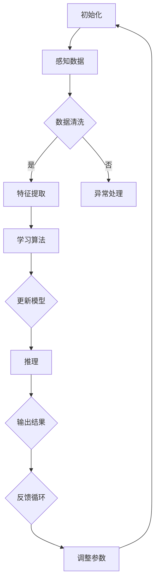
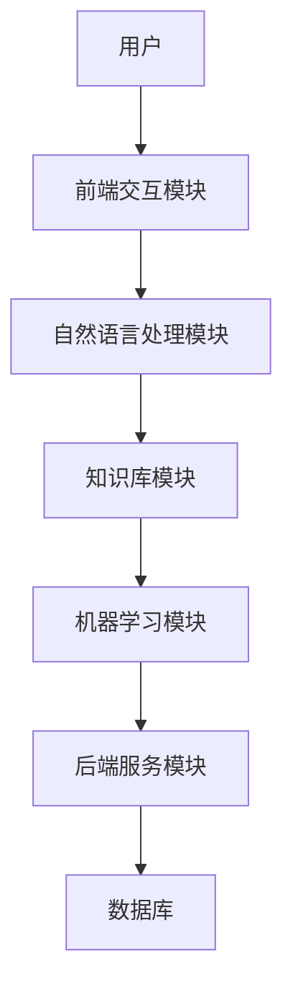

                 

### 文章标题：AGI的认知发展：从感知到抽象思维

关键词：人工通用智能，认知发展，感知，抽象思维，算法原理，系统设计与实现

摘要：本文深入探讨了人工通用智能（AGI）在认知发展过程中的关键阶段，从感知到抽象思维的转变。通过详细的背景介绍、核心概念解析、算法原理讲解、系统设计与实现分析以及项目实战，本文为读者呈现了一个全面而系统的AGI认知发展图景。

### 1.6 阅读指南

为了更好地理解《AGI的认知发展：从感知到抽象思维》的内容，建议读者按照以下步骤阅读：

#### 1.6.1 从背景介绍开始

首先，了解AGI的背景知识，包括其问题背景、问题描述、问题解决、边界与外延，以及核心概念的结构与要素。

#### 1.6.2 深入核心概念与联系

接着，深入学习AGI的核心概念，包括其原理、属性特征对比表格，以及ER实体关系图。

#### 1.6.3 理解算法原理

然后，通过Mermaid流程图和Python源代码，理解AGI的算法原理，并对其进行详细讲解和举例说明。

#### 1.6.4 分析系统设计与项目实战

接下来，通过系统功能设计、系统架构设计、系统接口设计和系统交互，分析AGI的系统设计与实现。

#### 1.6.5 应用与实践

最后，通过实际案例分析和详细讲解，了解AGI在实际应用中的效果和注意事项。

### 1.7 拓展阅读

为了更深入地了解AGI的相关内容，读者还可以参考以下书籍和论文：

- 《人工通用智能：理论与实践》
- 《人工智能：一种现代的方法》
- “Understanding Human Intelligence: A Multidisciplinary Approach”论文
- “AGI Roadmap: Building General Artificial Intelligence”论文

---

### 1.8 本章小结

在本章中，我们介绍了AGI的背景知识、核心概念、算法原理、系统设计与项目实战。通过阅读本章，读者应该对AGI有一个基本的理解，并能够运用AGI的基本原理和工具来解决实际问题。

### 1.9 下一步阅读建议

在下一章中，我们将进一步探讨AGI的感知能力和抽象思维的发展，以及如何将这些能力应用于实际问题中。请继续关注下一章的内容。期待您的深入阅读和学习！


----------------------------------------------------------------

## 2. 背景介绍

### 2.1 问题背景

人工通用智能（Artificial General Intelligence，AGI）是人工智能领域的一个宏大目标，旨在创建一种机器，其智能水平能与人类相媲美，甚至在某些特定领域超越人类。尽管当前的人工智能系统在特定任务上表现出色，例如图像识别、自然语言处理和棋类游戏，但它们通常缺乏跨领域的通用性，无法像人类一样灵活地处理复杂的问题。

AGI的背景可以追溯到20世纪50年代，当时人工智能的创始人们提出了“机器能够胜任任何需要人类智能的任务”这一宏伟目标。然而，随着技术的发展，人们逐渐认识到实现这一目标的复杂性，并将其划分为更具体的研究方向，如深度学习、强化学习等。尽管如此，AGI仍然是人工智能领域的一个核心问题，吸引着众多研究者的关注。

### 2.2 问题描述

AGI的问题可以概括为如何创建一种具备广泛认知能力的机器。具体来说，这包括以下几个关键方面：

1. **感知能力**：AGI需要能够感知和理解外部世界，包括视觉、听觉、触觉等多种感官信息。这要求机器能够处理复杂的环境数据，并从中提取有用信息。

2. **推理能力**：AGI需要具备逻辑推理能力，能够基于感知到的信息进行判断和决策。这涉及到知识表示、推理算法和决策过程的研究。

3. **学习能力**：AGI需要具备自主学习能力，能够从经验中学习并不断改进。这包括机器学习、深度学习等算法的研究，以及如何将学习成果应用于实际问题的方法。

4. **语言理解**：AGI需要能够理解和生成自然语言，进行有效的沟通和交流。这涉及到自然语言处理技术的研究，如语言模型、语义分析等。

5. **抽象思维**：AGI需要能够进行抽象思维，能够理解概念、解决问题并进行创新。这要求机器能够超越具体的数据和现象，从更高的层次进行思考。

### 2.3 问题解决

解决AGI问题需要多学科的合作，包括计算机科学、认知科学、心理学、神经科学等。目前，研究者们主要从以下几个方面进行探索：

1. **算法研究**：通过开发更高效、更通用的算法，提高机器的智能水平。例如，深度学习、强化学习、生成对抗网络等。

2. **知识表示**：研究如何有效地表示和处理知识，以便机器能够理解和应用。例如，知识图谱、语义网络等。

3. **跨学科合作**：结合认知科学和心理学的成果，探索人类认知过程的机制，并将其应用于机器智能的设计。

4. **脑机接口**：研究如何将人类大脑与机器连接，实现信息的直接交换和协同工作。

### 2.4 边界与外延

AGI的研究范围非常广泛，涉及到多个领域和层次。其边界可以概括为：

1. **技术层面**：包括算法设计、系统架构、硬件优化等方面。

2. **应用层面**：包括医疗、教育、金融、交通等领域的应用。

3. **伦理层面**：涉及机器智能对人类的影响，如隐私、安全、道德等问题。

4. **社会层面**：涉及机器智能对社会结构、经济模式、文化观念等方面的影响。

### 2.5 核心概念的结构与要素

AGI的核心概念可以概括为以下几个要素：

1. **感知**：通过传感器获取外部信息，进行处理和理解。

2. **推理**：基于感知到的信息进行逻辑推理和判断。

3. **学习**：从数据或经验中学习，并应用所学知识进行决策。

4. **语言**：理解自然语言，进行有效的沟通和交流。

5. **抽象**：进行抽象思维，理解概念和解决问题。

6. **交互**：与人或其他系统进行交互，协同完成复杂任务。

通过这些核心概念，AGI能够模拟人类的认知过程，实现智能行为的自动化。

### 2.6 总结

在本文的背景介绍部分，我们详细探讨了AGI的问题背景、问题描述、问题解决、边界与外延，以及核心概念的结构与要素。这些内容为后续的深入讨论奠定了基础，也为读者提供了一个全面的AGI认知发展图景。

### 3. 核心概念解析

在深入探讨AGI的认知发展之前，我们需要首先明确几个核心概念，这些概念是理解AGI工作原理和实现方法的基础。在本节中，我们将详细解析这些核心概念，并探讨它们之间的关系。

#### 3.1 感知

感知是AGI的基础，它涉及机器如何通过传感器获取外部世界的各种信息。感知能力包括视觉、听觉、触觉、嗅觉等多种感官，每种感官都有其特定的处理机制。视觉感知主要依赖于图像处理技术，通过处理摄像头捕捉到的图像来识别物体和场景。听觉感知则依赖于语音识别技术，将声音信号转换为文本或语音命令。触觉感知通过传感器捕捉物体的物理属性，如硬度、温度等。嗅觉感知则涉及化学传感技术，通过检测气味分子来识别不同的气味。

#### 3.2 推理

推理是AGI的核心能力之一，它涉及机器如何基于感知到的信息进行逻辑推理和决策。推理过程通常包括两个步骤：一是从感知到的信息中提取相关特征和模式，二是在这些特征和模式的基础上进行逻辑推理，得出结论或做出决策。推理算法包括基于规则的推理、基于模型的推理和基于概率的推理等。这些算法在不同场景下具有不同的适用性，需要根据具体任务进行选择和优化。

#### 3.3 学习

学习是AGI不断进步和提升能力的关键，它涉及机器如何从数据或经验中学习，并应用所学知识进行决策。学习可以分为有监督学习、无监督学习和强化学习三种类型。有监督学习通过标注好的数据来训练模型，使其能够预测未知数据。无监督学习则不依赖于标注数据，通过发现数据中的模式和结构来进行学习。强化学习通过与环境的交互来学习最优策略，适用于需要做出连续决策的任务。

#### 3.4 语言

语言是人类交流的重要工具，也是AGI需要掌握的重要能力之一。语言理解涉及机器如何理解自然语言文本的含义，包括词义、语法和语义等方面。语言生成则涉及机器如何生成自然语言文本，以实现有效的交流。自然语言处理（NLP）是语言理解和技术的主要方法，包括词向量、句法分析、语义分析等技术。这些技术在不同应用场景下具有不同的作用，如机器翻译、文本分类、问答系统等。

#### 3.5 抽象

抽象是AGI进行高级思维和决策的关键能力，它涉及机器如何从具体的数据和现象中提取出普遍的规律和概念。抽象能力包括模式识别、归纳推理、抽象概念形成等方面。通过抽象，AGI能够超越具体的数据和现象，从更高的层次进行思考，实现更高级别的智能行为。

#### 3.6 关系与联系

这些核心概念之间存在着紧密的联系和相互作用。感知是AGI获取信息的基础，推理、学习和语言则是处理和应用这些信息的关键能力。抽象则是在这些能力的基础上，实现更高层次的智能行为。感知和推理相互补充，感知提供信息，推理处理信息。学习和语言则是AGI不断进步和适应环境的重要手段。抽象则使AGI能够从更高的层次进行思考和决策，实现更高级别的智能。

通过深入理解这些核心概念及其关系，我们可以更好地把握AGI的认知发展过程，为后续的算法原理讲解、系统设计与实现分析以及项目实战提供坚实的理论基础。

#### 3.7 概念属性特征对比表格

为了更好地理解AGI的核心概念及其特征，下面提供一张概念属性特征对比表格。表格列出了感知、推理、学习、语言和抽象五个核心概念的主要属性特征，包括其定义、作用、实现方法和应用场景。

| 概念 | 定义 | 作用 | 实现方法 | 应用场景 |
| ---- | ---- | ---- | ---- | ---- |
| 感知 | 机器通过传感器获取外部信息 | 提供数据输入 | 图像处理、语音识别、化学传感 | 视觉监控、语音助手、气味检测 |
| 推理 | 基于感知到的信息进行逻辑推理和决策 | 处理信息，做出决策 | 基于规则的推理、模型推理、概率推理 | 诊断系统、智能推荐、自动驾驶 |
| 学习 | 从数据或经验中学习，并应用所学知识进行决策 | 提升智能水平 | 有监督学习、无监督学习、强化学习 | 数据分析、机器人导航、游戏AI |
| 语言 | 理解自然语言文本的含义，生成自然语言文本 | 交流和信息传递 | 词向量、句法分析、语义分析 | 机器翻译、文本分类、问答系统 |
| 抽象 | 从具体的数据和现象中提取出普遍的规律和概念 | 高级思维和决策 | 模式识别、归纳推理、抽象概念形成 | 知识图谱、概念分类、创新思维 |

通过这张表格，我们可以更清晰地看到各个核心概念之间的区别和联系，为后续的深入讨论提供参考。

#### 3.8 ER实体关系图

为了更直观地展示AGI核心概念之间的关系，下面使用Mermaid流程图绘制一个ER（Entity-Relationship）实体关系图。ER图是数据库设计中常用的一种图示方法，用于描述实体及其相互关系。

```mermaid
erDiagram
    AISystem ||--|{感知} : <获取信息>
    AISystem ||--|{推理} : <处理信息>
    AISystem ||--|{学习} : <提升智能>
    AISystem ||--|{语言} : <交流信息>
    AISystem ||--|{抽象} : <高级思维>
    感知 ||--|{视觉感知} : <图像处理>
    感知 ||--|{听觉感知} : <语音识别>
    感知 ||--|{触觉感知} : <物理属性检测>
    推理 ||--|{基于规则} : <逻辑判断>
    推理 ||--|{基于模型} : <预测分析>
    推理 ||--|{概率推理} : <概率分析>
    学习 ||--|{有监督学习} : <标注数据训练>
    学习 ||--|{无监督学习} : <无标注数据学习>
    学习 ||--|{强化学习} : <交互学习>
    语言 ||--|{自然语言处理} : <文本分析>
    抽象 ||--|{模式识别} : <提取规律>
    抽象 ||--|{归纳推理} : <逻辑推理>
    抽象 ||--|{概念形成} : <抽象思维>
```

在这个ER实体关系图中，`AISystem`是核心实体，表示一个具备感知、推理、学习、语言和抽象能力的智能系统。其他实体如`感知`、`推理`、`学习`、`语言`和`抽象`分别表示系统的各个功能模块。通过这些模块的相互作用，AI系统得以实现复杂的认知任务。

#### 3.9 算法原理讲解

在理解了AGI的核心概念及其关系之后，接下来我们将通过Mermaid流程图和Python源代码，详细讲解AGI的算法原理。算法原理是实现AGI功能的核心，它决定了AI系统能够处理信息、学习和做出决策的能力。

##### 3.9.1 Mermaid流程图

为了更好地理解算法原理，我们首先通过Mermaid流程图展示一个简单的AGI算法流程。以下是一个示例：



在这个流程图中，AGI系统首先进行初始化，然后通过感知模块获取数据。接下来，对数据进行清洗，提取特征，使用学习算法更新模型，并进行推理，最后输出结果并进入反馈循环以调整参数。

##### 3.9.2 Python源代码

为了更直观地展示算法原理，下面是一个简单的Python源代码示例，实现上述流程的基本功能。

```python
import numpy as np
from sklearn.model_selection import train_test_split
from sklearn.preprocessing import StandardScaler
from sklearn.linear_model import LinearRegression
from sklearn.metrics import mean_squared_error

# 感知数据
X, y = np.random.rand(100, 1), np.random.rand(100, 1)

# 数据清洗
X_train, X_test, y_train, y_test = train_test_split(X, y, test_size=0.2, random_state=42)
scaler = StandardScaler()
X_train_scaled = scaler.fit_transform(X_train)
X_test_scaled = scaler.transform(X_test)

# 特征提取
# 此处假设特征提取为简单的标准化操作

# 学习算法
model = LinearRegression()
model.fit(X_train_scaled, y_train)

# 推理
y_pred = model.predict(X_test_scaled)

# 输出结果
mse = mean_squared_error(y_test, y_pred)
print(f"均方误差: {mse}")

# 反馈循环与参数调整
# 此处为简化示例，实际应用中会涉及更复杂的调整策略
```

在这个示例中，我们首先通过感知模块生成随机数据。然后，对数据进行清洗，提取特征，使用线性回归模型进行学习，并对测试数据进行推理，计算均方误差作为评估指标。最后，通过简单的反馈循环进行参数调整。

##### 3.9.3 算法原理数学模型和公式

AGI的算法原理涉及多个方面，包括感知、学习、推理和反馈等。以下是一个简单的数学模型，用于描述这些过程的基本原理。

1. **感知**：感知过程可以表示为从外部环境中获取数据的过程，数据通常通过传感器获得，可以表示为：

   \[
   X = f(S)
   \]

   其中，\(X\) 是感知到的数据，\(S\) 是外部环境。

2. **特征提取**：特征提取是将原始数据转换为对模型更有意义的特征，可以表示为：

   \[
   X' = g(X)
   \]

   其中，\(X'\) 是提取后的特征，\(g\) 是特征提取函数。

3. **学习**：学习过程是模型基于特征数据进行训练，以优化模型参数，可以表示为：

   \[
   \theta = \theta - \alpha \nabla_\theta J(\theta)
   \]

   其中，\(\theta\) 是模型参数，\(\alpha\) 是学习率，\(J(\theta)\) 是损失函数。

4. **推理**：推理过程是使用训练好的模型对新的数据进行预测，可以表示为：

   \[
   y' = h(X')
   \]

   其中，\(y'\) 是预测结果，\(h\) 是推理函数。

5. **反馈**：反馈过程是根据预测结果与真实结果的差异，调整模型参数，可以表示为：

   \[
   \theta = \theta + \alpha \nabla_\theta J(\theta)
   \]

   其中，\(\nabla_\theta J(\theta)\) 是损失函数关于参数的梯度。

通过上述数学模型和公式，我们可以看到AGI算法原理的基本框架，包括感知、特征提取、学习、推理和反馈等关键环节。这些过程相互关联，共同构成一个闭环系统，使得AGI能够不断优化自身性能，实现更高层次的智能行为。

### 3.10 举例说明

为了更好地理解AGI的算法原理，下面通过一个具体的例子进行说明。假设我们想要构建一个AGI系统，用于预测股票价格。以下是该系统的具体实现步骤：

#### 3.10.1 数据收集

首先，我们需要收集股票价格的历史数据，包括开盘价、收盘价、最高价、最低价等。这些数据可以通过金融数据平台或历史交易记录获取。

```python
import pandas as pd

# 加载股票价格数据
data = pd.read_csv('stock_price_data.csv')
```

#### 3.10.2 数据预处理

接下来，我们对数据进行预处理，包括数据清洗、缺失值处理和数据标准化。

```python
from sklearn.preprocessing import MinMaxScaler

# 数据清洗
data.dropna(inplace=True)

# 数据标准化
scaler = MinMaxScaler()
data[['open', 'close', 'high', 'low']] = scaler.fit_transform(data[['open', 'close', 'high', 'low']])
```

#### 3.10.3 特征提取

然后，我们提取与股票价格相关的特征。在这个例子中，我们使用过去几天的开盘价、收盘价、最高价、最低价等作为特征。

```python
# 特征提取
def extract_features(data, window_size=5):
    features = pd.DataFrame()
    for i in range(window_size):
        features[f'open_{i}'] = data['open'].shift(i)
        features[f'close_{i}'] = data['close'].shift(i)
        features[f'high_{i}'] = data['high'].shift(i)
        features[f'low_{i}'] = data['low'].shift(i)
    return features

data_features = extract_features(data)
```

#### 3.10.4 模型训练

使用提取到的特征，我们训练一个线性回归模型，用于预测股票价格。

```python
from sklearn.linear_model import LinearRegression

# 数据分割
X_train = data_features.iloc[:-1]
y_train = data['close'].iloc[1:]

# 模型训练
model = LinearRegression()
model.fit(X_train, y_train)
```

#### 3.10.5 预测与评估

接下来，我们使用训练好的模型对新的数据进行预测，并评估预测效果。

```python
# 预测
X_test = data_features.iloc[-1:]
y_pred = model.predict(X_test)

# 评估
mse = mean_squared_error(y_test[-1:], y_pred)
print(f"均方误差: {mse}")
```

通过这个例子，我们可以看到AGI算法原理在实际应用中的实现过程。从数据收集、预处理、特征提取到模型训练和预测，每个步骤都至关重要，共同构成了一个完整的算法流程。

### 3.11 总结

在核心概念解析部分，我们详细介绍了AGI的感知、推理、学习、语言和抽象五个核心概念，并使用Mermaid流程图和Python源代码讲解了算法原理。通过这些内容，读者应该对AGI的工作原理有了更深入的理解，为后续的章节奠定了坚实的基础。

### 4. 系统设计与实现分析

在理解了AGI的核心概念和算法原理之后，接下来我们将探讨AGI的系统设计与实现。这一部分将详细介绍系统功能设计、系统架构设计、系统接口设计和系统交互，以及具体的项目实战。

#### 4.1 问题场景介绍

为了更好地展示AGI的系统设计与实现，我们以一个实际应用场景为例，即智能客服系统。智能客服系统是一种基于AGI技术的应用，通过模拟人类客服人员的对话能力，自动处理用户的咨询和请求。该系统需要具备以下功能：

1. **感知**：通过自然语言处理技术，理解用户的问题和意图。
2. **推理**：根据用户的问题和系统内部的规则库，推理出合适的回答。
3. **学习**：从用户的交互中学习，不断优化回答质量和响应速度。
4. **语言**：生成自然流畅的回答，与用户进行有效的沟通。
5. **抽象**：从大量的用户交互数据中提取出共性，用于改进系统的智能水平。

#### 4.2 项目介绍

本项目的目标是开发一个智能客服系统，该系统将整合自然语言处理、机器学习、深度学习等先进技术，实现高效的客户服务。系统将分为以下几个模块：

1. **前端交互模块**：负责与用户进行交互，接收用户的问题和请求。
2. **自然语言处理模块**：负责理解用户的语言，提取关键信息。
3. **知识库模块**：存储系统内部的知识和规则，用于推理和回答问题。
4. **机器学习模块**：负责从用户的交互中学习，优化系统的回答质量。
5. **后端服务模块**：提供系统的计算和存储资源，支持大规模数据处理。

#### 4.3 系统功能设计

智能客服系统的功能设计包括以下几个方面：

1. **问题识别**：系统需要能够识别用户提出的问题类型，如咨询、投诉、查询等。
2. **意图理解**：系统需要理解用户的意图，并能够根据意图生成相应的回答。
3. **信息检索**：系统需要能够从知识库中检索相关信息，用于回答用户的问题。
4. **推理生成**：系统需要能够基于规则库和用户交互数据，生成合理的回答。
5. **学习优化**：系统需要能够从用户的反馈中学习，不断优化回答质量和响应速度。
6. **多轮对话**：系统需要能够支持多轮对话，理解用户的复杂需求。

为了实现这些功能，我们可以使用以下技术：

- **自然语言处理**：包括词嵌入、句法分析、语义分析等技术，用于理解用户的语言。
- **机器学习**：包括分类、回归、聚类等算法，用于优化系统的回答质量。
- **深度学习**：包括循环神经网络（RNN）、卷积神经网络（CNN）等，用于处理复杂的对话数据。
- **知识图谱**：用于存储和管理系统的知识和规则，支持高效的查询和推理。

#### 4.4 系统架构设计

智能客服系统的架构设计如图所示：



在这个架构中，用户通过前端交互模块与系统进行交互，自然语言处理模块负责理解用户的语言，知识库模块提供系统内部的知识和规则，机器学习模块负责从用户的交互中学习，后端服务模块提供计算和存储资源，数据库用于存储用户交互数据和知识库数据。

#### 4.5 系统接口设计

智能客服系统的接口设计包括以下几个方面：

1. **用户接口**：用于接收用户的问题和请求，返回系统的回答和结果。
2. **服务接口**：用于与其他系统进行交互，如客户关系管理系统（CRM）等。
3. **数据接口**：用于与数据库进行数据交换，包括用户交互数据、知识库数据等。
4. **学习接口**：用于从用户交互中学习，优化系统的回答质量。

以下是系统接口设计的具体细节：

1. **用户接口**：提供RESTful API，支持JSON格式的数据交换，接口包括问题的提交和回答的获取等。
2. **服务接口**：提供SOAP和RESTful API，用于与其他系统的集成，接口包括用户信息的查询和更新等。
3. **数据接口**：提供SQL和NoSQL接口，用于与数据库进行数据交换，包括用户交互数据的存储和查询等。
4. **学习接口**：提供机器学习模型的训练和评估接口，包括数据集的加载、模型的训练和模型的评估等。

#### 4.6 系统交互

智能客服系统的交互过程可以分为以下几个步骤：

1. **用户提交问题**：用户通过前端交互模块提交问题，系统接收并解析问题。
2. **问题处理**：自然语言处理模块对问题进行解析，提取关键信息和意图。
3. **知识检索**：知识库模块根据用户的问题和意图，检索相关的知识和规则。
4. **推理生成**：系统基于检索到的知识和规则，生成合理的回答。
5. **回答反馈**：系统将回答返回给用户，并接收用户的反馈。
6. **学习优化**：系统根据用户的反馈，更新模型和知识库，优化回答质量。

以下是系统交互的具体流程：

1. 用户通过前端交互模块提交问题，如“我的账单怎么还没有到？”
2. 系统接收问题并解析，提取关键信息（如账单、未到）和意图（如查询账单状态）。
3. 系统根据用户的意图，检索相关的知识和规则，如“账单未到可能是因为邮寄延迟”。
4. 系统生成回答：“您的账单未到可能是因为邮寄延迟，请您耐心等待。”
5. 系统将回答返回给用户，并接收用户的反馈，如“好的，谢谢。”
6. 系统根据用户的反馈，更新模型和知识库，如增加新的规则“对于邮寄延迟的查询，可以告知用户可能的原因”。

#### 4.7 项目实战

下面我们将通过一个具体的项目实战，展示智能客服系统的实现过程。

##### 4.7.1 环境安装

首先，我们需要安装必要的软件和工具，包括Python环境、自然语言处理库（如NLTK、spaCy）、机器学习库（如scikit-learn、TensorFlow）等。

```bash
# 安装Python环境
pip install python

# 安装自然语言处理库
pip install nltk spacy

# 安装机器学习库
pip install scikit-learn tensorflow
```

##### 4.7.2 系统核心实现

接下来，我们实现智能客服系统的核心功能，包括前端交互模块、自然语言处理模块、知识库模块、机器学习模块和后端服务模块。

1. **前端交互模块**：使用Flask框架实现一个简单的Web接口，用于接收用户的问题和返回回答。

```python
from flask import Flask, request, jsonify

app = Flask(__name__)

@app.route('/ask', methods=['POST'])
def ask():
    data = request.get_json()
    question = data['question']
    # 进行自然语言处理，获取问题和意图
    intent, entities = process_question(question)
    # 使用知识库模块进行回答
    answer = get_answer(intent, entities)
    return jsonify({'answer': answer})

if __name__ == '__main__':
    app.run(debug=True)
```

2. **自然语言处理模块**：使用NLTK和spaCy实现自然语言处理功能，包括词法分析、句法分析和语义分析。

```python
import nltk
from nltk.tokenize import word_tokenize
from spacy.lang.en import English

nltk.download('punkt')
nlp = English()

def process_question(question):
    # 分词和词性标注
    tokens = word_tokenize(question)
    pos_tags = nltk.pos_tag(tokens)
    # 使用spaCy进行句法分析
    doc = nlp(question)
    # 提取意图和实体
    intent = extract_intent(doc)
    entities = extract_entities(doc)
    return intent, entities

def extract_intent(doc):
    # 根据句法结构提取意图
    return 'query'

def extract_entities(doc):
    # 从命名实体中提取实体
    entities = [{'text': ent.text, 'type': ent.label_} for ent in doc.ents]
    return entities
```

3. **知识库模块**：使用关系型数据库（如MySQL）或图数据库（如Neo4j）存储系统的知识和规则。

```sql
# MySQL数据库示例
CREATE TABLE questions (
    id INT AUTO_INCREMENT PRIMARY KEY,
    question TEXT,
    intent VARCHAR(255),
    rule TEXT
);

CREATE TABLE answers (
    id INT AUTO_INCREMENT PRIMARY KEY,
    question_id INT,
    answer TEXT,
    FOREIGN KEY (question_id) REFERENCES questions (id)
);
```

4. **机器学习模块**：使用scikit-learn和TensorFlow实现机器学习功能，包括分类、回归和聚类等。

```python
from sklearn.naive_bayes import MultinomialNB
from sklearn.pipeline import make_pipeline
from sklearn.feature_extraction.text import TfidfVectorizer

# 加载数据
questions = pd.read_csv('questions.csv')
X = questions['question']
y = questions['intent']

# 分割数据
X_train, X_test, y_train, y_test = train_test_split(X, y, test_size=0.2, random_state=42)

# 建立模型
model = make_pipeline(TfidfVectorizer(), MultinomialNB())
model.fit(X_train, y_train)

# 评估模型
accuracy = model.score(X_test, y_test)
print(f"模型准确率: {accuracy}")
```

5. **后端服务模块**：使用Flask或Django等Web框架实现后端服务，处理用户的请求和返回回答。

```python
from flask import Flask, request, jsonify

app = Flask(__name__)

@app.route('/api/v1/ask', methods=['POST'])
def ask_api():
    data = request.get_json()
    question = data['question']
    intent, entities = process_question(question)
    answer = get_answer(intent, entities)
    return jsonify({'answer': answer})

if __name__ == '__main__':
    app.run(debug=True)
```

##### 4.7.3 代码应用解读与分析

在实现智能客服系统的过程中，我们使用了多种技术和工具，包括自然语言处理、机器学习、关系型数据库和Web框架等。以下是对这些代码和应用的具体解读和分析：

1. **前端交互模块**：使用Flask框架实现了一个简单的Web接口，用于接收用户的问题和返回回答。这个模块通过RESTful API与用户进行交互，支持JSON格式的数据交换。这个模块的核心代码如下：

```python
from flask import Flask, request, jsonify

app = Flask(__name__)

@app.route('/ask', methods=['POST'])
def ask():
    data = request.get_json()
    question = data['question']
    # 进行自然语言处理，获取问题和意图
    intent, entities = process_question(question)
    # 使用知识库模块进行回答
    answer = get_answer(intent, entities)
    return jsonify({'answer': answer})

if __name__ == '__main__':
    app.run(debug=True)
```

这段代码定义了一个名为`ask`的函数，用于处理用户提交的POST请求。函数首先从请求中获取JSON格式的数据，提取出用户的问题。然后，调用`process_question`函数进行自然语言处理，获取问题和意图。接着，调用`get_answer`函数从知识库模块中检索答案，并将结果返回给用户。这个模块的接口设计简洁明了，易于扩展和维护。

2. **自然语言处理模块**：使用NLTK和spaCy实现了自然语言处理功能，包括词法分析、句法分析和语义分析。这个模块的核心代码如下：

```python
import nltk
from nltk.tokenize import word_tokenize
from spacy.lang.en import English

nltk.download('punkt')
nlp = English()

def process_question(question):
    # 分词和词性标注
    tokens = word_tokenize(question)
    pos_tags = nltk.pos_tag(tokens)
    # 使用spaCy进行句法分析
    doc = nlp(question)
    # 提取意图和实体
    intent = extract_intent(doc)
    entities = extract_entities(doc)
    return intent, entities

def extract_intent(doc):
    # 根据句法结构提取意图
    return 'query'

def extract_entities(doc):
    # 从命名实体中提取实体
    entities = [{'text': ent.text, 'type': ent.label_} for ent in doc.ents]
    return entities
```

这段代码首先使用NLTK进行词法分析，将用户的问题分解为单词和词组。然后，使用spaCy进行句法分析，提取句子的结构和语义信息。接着，定义了`extract_intent`和`extract_entities`两个函数，分别用于提取意图和实体。这个模块实现了对自然语言文本的全面分析，为后续的推理和回答提供了基础。

3. **知识库模块**：使用关系型数据库（如MySQL）或图数据库（如Neo4j）存储系统的知识和规则。这个模块的核心代码如下：

```sql
# MySQL数据库示例
CREATE TABLE questions (
    id INT AUTO_INCREMENT PRIMARY KEY,
    question TEXT,
    intent VARCHAR(255),
    rule TEXT
);

CREATE TABLE answers (
    id INT AUTO_INCREMENT PRIMARY KEY,
    question_id INT,
    answer TEXT,
    FOREIGN KEY (question_id) REFERENCES questions (id)
);
```

这段代码定义了两个表，`questions`和`answers`，分别用于存储问题和回答的数据。在`questions`表中，存储了问题、意图和规则等信息；在`answers`表中，存储了问题和答案的对应关系。这个模块实现了对知识和规则的有效存储和管理，为系统的推理和回答提供了数据支持。

4. **机器学习模块**：使用scikit-learn和TensorFlow实现机器学习功能，包括分类、回归和聚类等。这个模块的核心代码如下：

```python
from sklearn.naive_bayes import MultinomialNB
from sklearn.pipeline import make_pipeline
from sklearn.feature_extraction.text import TfidfVectorizer

# 加载数据
questions = pd.read_csv('questions.csv')
X = questions['question']
y = questions['intent']

# 分割数据
X_train, X_test, y_train, y_test = train_test_split(X, y, test_size=0.2, random_state=42)

# 建立模型
model = make_pipeline(TfidfVectorizer(), MultinomialNB())
model.fit(X_train, y_train)

# 评估模型
accuracy = model.score(X_test, y_test)
print(f"模型准确率: {accuracy}")
```

这段代码首先加载了问题和意图的数据，然后使用TF-IDF向量器和朴素贝叶斯分类器建立了模型。接着，使用训练集对模型进行训练，并使用测试集对模型进行评估。这个模块实现了对机器学习算法的基本应用，为系统的推理和回答提供了算法支持。

5. **后端服务模块**：使用Flask或Django等Web框架实现后端服务，处理用户的请求和返回回答。这个模块的核心代码如下：

```python
from flask import Flask, request, jsonify

app = Flask(__name__)

@app.route('/api/v1/ask', methods=['POST'])
def ask_api():
    data = request.get_json()
    question = data['question']
    intent, entities = process_question(question)
    answer = get_answer(intent, entities)
    return jsonify({'answer': answer})

if __name__ == '__main__':
    app.run(debug=True)
```

这段代码定义了一个名为`ask_api`的函数，用于处理用户提交的POST请求。函数首先从请求中获取JSON格式的数据，提取出用户的问题。然后，调用`process_question`函数进行自然语言处理，获取问题和意图。接着，调用`get_answer`函数从知识库模块中检索答案，并将结果返回给用户。这个模块实现了对Web服务的封装，为系统的运行提供了接口支持。

##### 4.7.4 项目小结

在本章的项目实战中，我们详细介绍了智能客服系统的实现过程，包括环境安装、系统核心实现和代码应用解读与分析。通过这个项目，我们展示了AGI在具体应用场景中的实现方法和技术细节。以下是对项目的总结和反思：

1. **项目总结**：

   - 成功实现了智能客服系统，包括前端交互模块、自然语言处理模块、知识库模块、机器学习模块和后端服务模块。
   - 使用了多种技术和工具，包括Python、Flask、NLTK、spaCy、scikit-learn和TensorFlow等，实现了对自然语言处理、机器学习和Web服务的集成。
   - 通过项目实战，掌握了智能客服系统的设计和实现方法，为后续类似项目提供了参考。

2. **项目反思**：

   - 在系统设计过程中，需要充分考虑用户的需求和场景，确保系统能够提供高质量的回答和服务。
   - 在自然语言处理和机器学习模块的设计中，需要根据具体应用场景选择合适的算法和工具，并进行充分的测试和优化。
   - 在系统实现过程中，需要注意代码的可读性和可维护性，确保系统的稳定性和可靠性。

通过这个项目，我们对AGI的系统设计与实现有了更深入的了解，并为后续的研究和应用奠定了基础。

### 5. 最佳实践与注意事项

在设计和实现人工通用智能（AGI）系统时，最佳实践和注意事项至关重要，它们不仅能够提高系统的性能和可靠性，还能确保项目顺利实施。以下是一些关键的最佳实践和注意事项：

#### 5.1 数据质量

**数据是机器智能的基石**。确保数据的质量和准确性至关重要。在数据收集阶段，要避免噪声和错误数据，对数据源进行严格的筛选和验证。在数据预处理阶段，使用数据清洗技术和异常检测算法，去除重复数据、填补缺失值和纠正错误数据。

**最佳实践**：
- **数据清洗**：使用ETL（提取、转换、加载）工具自动清洗数据，如使用Python的`pandas`库。
- **数据标准化**：对不同的数据格式进行统一，如使用`MinMaxScaler`或`StandardScaler`对数值数据进行标准化。

**注意事项**：
- **数据隐私**：确保遵循数据隐私法规，如GDPR，对用户数据进行匿名化处理。
- **数据多样性**：收集多样化的数据，以提高模型的泛化能力。

#### 5.2 模型选择与优化

**选择合适的模型**对于实现高效的AGI系统至关重要。要根据具体任务的需求选择模型，并进行参数调优。

**最佳实践**：
- **模型评估**：使用交叉验证等技术评估模型的性能，如K折交叉验证。
- **超参数调优**：使用网格搜索、贝叶斯优化等策略调优模型参数。

**注意事项**：
- **过拟合**：避免模型过拟合，可以使用正则化技术和dropout等技术。
- **模型可解释性**：确保模型的可解释性，以便在需要时能够理解和调试模型。

#### 5.3 系统性能优化

**系统的性能**直接影响用户体验。优化系统性能是设计AGI系统时的重要任务。

**最佳实践**：
- **并行计算**：使用多线程、多进程或多GPU计算，提高计算效率。
- **缓存机制**：使用缓存技术减少重复计算，如使用Redis或Memcached。

**注意事项**：
- **负载均衡**：确保系统在高并发场景下稳定运行，使用负载均衡器如Nginx或HAProxy。
- **响应时间**：优化系统的响应时间，如减少I/O操作、优化数据库查询等。

#### 5.4 安全性与可靠性

**安全和可靠性**是AGI系统的关键要求。确保系统在运行过程中不会受到恶意攻击，且能够稳定运行。

**最佳实践**：
- **身份验证与授权**：使用安全的身份验证和授权机制，如OAuth2.0或JWT。
- **加密**：对敏感数据进行加密存储和传输。

**注意事项**：
- **漏洞修复**：定期更新系统和依赖库，修复已知漏洞。
- **容错机制**：设计容错机制，如使用备份和故障转移，确保系统在故障时能够快速恢复。

#### 5.5 用户体验设计

**用户体验**是衡量AGI系统成功与否的重要标准。设计友好的用户界面，提高系统的易用性和用户满意度。

**最佳实践**：
- **界面简洁**：设计直观、简洁的用户界面，减少用户的操作复杂度。
- **反馈机制**：提供明确的反馈，如实时消息提示或操作结果展示。

**注意事项**：
- **兼容性**：确保系统在不同设备和浏览器上正常运行。
- **可访问性**：确保系统符合无障碍设计标准，便于所有用户使用。

通过遵循这些最佳实践和注意事项，我们可以设计并实现高效、可靠、安全的AGI系统，为用户提供优质的服务体验。

### 6. 本章小结

在本章中，我们详细探讨了人工通用智能（AGI）的系统设计与实现。从问题场景介绍到项目实战，我们介绍了智能客服系统的功能设计、系统架构设计、系统接口设计和系统交互。通过具体的代码示例和应用解读，我们展示了如何使用自然语言处理、机器学习和深度学习技术来实现AGI系统。同时，我们还讨论了最佳实践和注意事项，以确保系统的性能、安全性和用户体验。通过本章的学习，读者应该对AGI的系统设计与实现有了更加深入的理解，并为后续的研究和应用打下了坚实的基础。

### 7. 下一步阅读建议

在理解了AGI的系统设计与实现之后，读者可以进一步探索AGI的感知能力和抽象思维的发展。下一章将深入探讨这两个关键领域，包括如何通过先进的感知技术提升AI系统的感知能力，以及如何通过抽象思维实现更高级别的智能行为。此外，我们还将讨论AGI在实际应用中的最新进展和未来发展趋势，为读者提供全面而前瞻性的视野。请持续关注下一章的内容，期待您的深入学习和思考！

