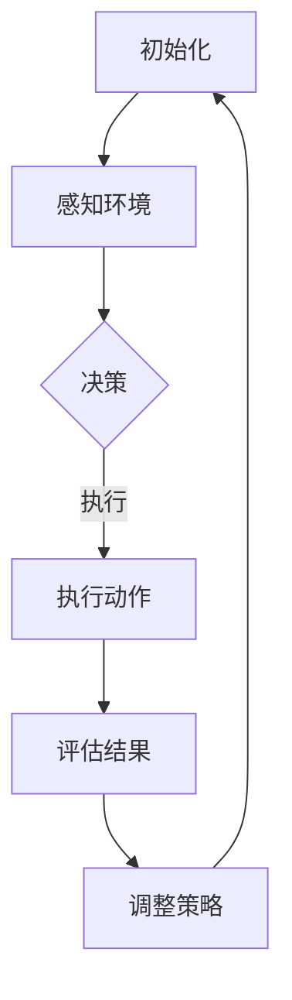
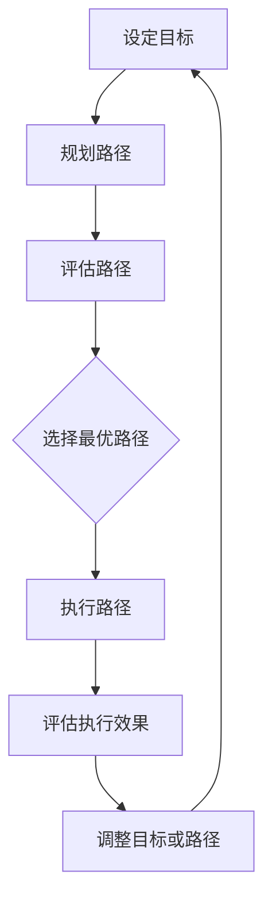
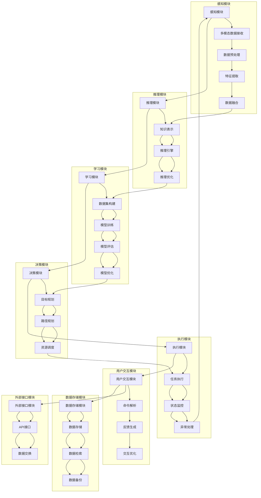

                 

### 第1章：引言

#### 1.1 问题背景

**AGI的概念及其重要性**

人工智能（AI）是计算机科学的一个分支，旨在通过模拟人类智能行为，使机器能够执行复杂任务。人工智能可分为多种类型，其中通用人工智能（AGI，Artificial General Intelligence）被视为人工智能发展的终极目标。AGI是指具有广泛认知能力的机器智能，能够理解、学习和适应各种环境，如同人类一样具备智能。AGI的概念最早由约翰·霍普金斯大学教授约翰·霍普金斯（John McCarthy）在1955年提出，被认为是人工智能领域中最具挑战性且最具潜力的研究方向。

**当前AI的发展阶段与挑战**

目前，人工智能主要分为弱AI（Weak AI）和强AI（Strong AI）。弱AI是一种专门为解决特定问题而设计的算法，如语音识别、图像识别等。而强AI则具有自主意识，能够理解、学习、推理和解决问题，具备类似于人类智能的水平。然而，当前AI技术主要处于弱AI阶段，尚未实现AGI。这主要是由于以下几个挑战：

1. **认知能力限制**：现有AI技术主要依赖于数据驱动的方法，缺乏深刻的认知能力，难以应对复杂、不确定的任务。
2. **知识表示与推理**：如何有效地表示和推理知识，是当前AI研究的关键问题。
3. **跨领域应用**：现有AI技术往往局限于特定领域，难以实现跨领域的通用智能。

**AGI长期规划与目标管理的必要性**

为了克服上述挑战，实现AGI，需要制定长期的规划与目标管理。长期规划能够帮助我们明确目标，制定合适的策略，分阶段推进AGI的发展。目标管理则有助于确保各个阶段目标的实现，不断调整和优化策略，确保AGI项目的成功。长期规划与目标管理在AGI项目中的重要性体现在以下几个方面：

1. **明确方向**：长期规划可以帮助我们明确AGI的发展方向，避免盲目追求短期成果，确保项目的可持续性。
2. **资源配置**：通过目标管理，我们可以合理配置资源，确保项目各个阶段所需的资金、人力和物力支持。
3. **风险评估**：长期规划与目标管理有助于识别和应对AGI项目中的风险，确保项目的稳定推进。
4. **持续优化**：通过目标管理，我们可以不断评估AGI项目的进展，根据实际情况进行调整和优化，提高项目的成功率。

#### 1.2 问题描述

**如何实现AGI的长期稳定发展？**

实现AGI的长期稳定发展，需要从以下几个方面进行思考和探索：

1. **技术创新**：持续推动AI技术的研究与突破，特别是在认知能力、知识表示与推理、跨领域应用等方面。
2. **人才培养**：加强AI领域的人才培养，吸引更多优秀人才投身于AGI研究，提高整体研究水平。
3. **国际合作**：加强国际间的合作与交流，共享研究成果，共同推进AGI的发展。

**目标管理的意义与作用**

目标管理在AGI项目中具有重要作用，主要体现在以下几个方面：

1. **明确目标**：通过设定具体、明确的目标，确保AGI项目的发展方向和重点。
2. **规划路径**：制定实现目标的策略和路径，确保项目各阶段的顺利推进。
3. **评估成果**：通过评估目标实现的成果，及时调整和优化策略，提高项目的成功率。

**AGI目标管理的挑战与解决方案**

在AGI目标管理中，我们面临着以下挑战：

1. **目标多样性与冲突**：AGI项目涉及多个目标，如认知能力提升、跨领域应用等，如何平衡和协调这些目标是一个挑战。
2. **动态调整**：随着AGI项目的发展，目标可能会发生变化，如何及时调整目标管理策略是一个挑战。
3. **风险控制**：在目标管理过程中，如何识别和控制风险，确保项目的稳定推进是一个挑战。

针对上述挑战，我们可以采取以下解决方案：

1. **多元化目标协调**：通过制定明确的目标优先级和关键绩效指标，确保多元化目标的协调和平衡。
2. **动态调整机制**：建立动态调整机制，根据项目进展和外部环境变化，及时调整目标管理策略。
3. **风险管理**：建立完善的风险管理机制，提前识别和评估风险，制定相应的风险应对措施。

#### 1.3 问题解决

**长期规划的理论基础**

长期规划的理论基础主要涉及以下几个领域：

1. **系统思维**：系统思维是一种认识世界和解决问题的方法论，强调从整体、动态、关联的角度看待问题，有助于制定长期规划。
2. **战略管理**：战略管理是一种规划、执行和评估组织长期目标的学科，可以为AGI项目提供有益的指导。
3. **项目管理**：项目管理是规划和执行项目的方法论，包括范围管理、时间管理、成本管理、质量管理、沟通管理等，对于AGI项目的长期规划具有重要意义。

**目标管理的原则与方法**

目标管理（Management by Objectives，MBO）是一种以目标为导向的管理方法，旨在通过设定目标、规划路径、评估成果来确保目标实现。目标管理的原则主要包括：

1. **目标明确**：设定具体、明确的目标，确保团队成员对目标有清晰的认识。
2. **参与决策**：鼓励团队成员参与目标的制定，提高目标实现的主动性和积极性。
3. **定期评估**：定期评估目标实现情况，及时调整和优化目标管理策略。

目标管理的具体方法包括：

1. **SMART原则**：设定目标时遵循SMART原则（具体、可衡量、可实现、相关性、时限性）。
2. **关键绩效指标（KPI）**：制定关键绩效指标，用于评估目标实现情况。
3. **平衡计分卡（Balanced Scorecard）**：从财务、客户、内部业务流程、学习与成长四个维度评估目标实现情况。

**AGI目标管理能力的培养与提升**

AGI目标管理能力的培养与提升是一个系统工程，需要从以下几个方面进行：

1. **教育培养**：通过专业教育和培训，提高相关人员的目标管理知识和技能。
2. **实践经验**：通过实际项目中的目标管理实践，积累经验和教训，不断提高目标管理能力。
3. **工具应用**：利用先进的目标管理工具，如目标管理软件、项目管理软件等，提高目标管理的效率和质量。

#### 1.4 边界与外延

**AGI与其他AI类型的比较**

1. **弱AI（Weak AI）**：弱AI是指专门为解决特定问题而设计的算法，如语音识别、图像识别等。弱AI在特定领域具有优势，但缺乏通用智能。
2. **强AI（Strong AI）**：强AI是指具有自主意识、理解、学习、推理和解决问题能力的机器智能。强AI与人类智能相似，但尚未实现。
3. **AGI（Artificial General Intelligence）**：AGI是人工智能的最终目标，具备广泛认知能力的机器智能。AGI介于弱AI和强AI之间，旨在实现通用智能。

**长期规划与短期计划的区别**

1. **长期规划**：长期规划是指为组织或项目制定的中长期目标和策略，通常涵盖数年或数十年。长期规划注重战略方向和资源配置。
2. **短期计划**：短期计划是指为组织或项目在短期内（如几个月或几年）制定的具体行动和目标，通常用于实现长期规划。

**目标管理在不同AI领域的应用**

1. **机器学习**：在机器学习项目中，目标管理可以用于设定训练目标、评估模型性能和优化算法。
2. **自然语言处理**：在自然语言处理项目中，目标管理可以用于设定文本分类、情感分析等任务的目标。
3. **计算机视觉**：在计算机视觉项目中，目标管理可以用于设定图像识别、目标检测等任务的目标。

#### 1.5 概念结构与核心要素组成

**AGI的长期规划**

1. **目标**：AGI的长期规划首先需要明确具体的目标，如实现通用认知能力、跨领域应用等。
2. **策略**：根据目标，制定实现目标的策略，如技术创新、人才培养、国际合作等。
3. **路径**：确定实现目标的具体路径，如分阶段推进、关键里程碑等。
4. **评估**：定期评估规划实施情况，根据评估结果调整策略和路径。

**目标管理能力**

1. **认知**：具备理解和分析目标的能力，明确目标的优先级和重要性。
2. **规划**：具备制定实现目标策略和路径的能力。
3. **决策**：具备根据目标评估和规划结果做出决策的能力。
4. **执行**：具备执行目标管理策略和路径的能力。

### 第2章：核心概念与联系

#### 2.1 AGI的基本概念

**AGI的定义与特征**

通用人工智能（Artificial General Intelligence，AGI）是人工智能发展的最终目标，指的是具有广泛认知能力的机器智能，能够理解、学习、推理和解决问题，具备类似于人类智能的水平。与弱AI（Weak AI）和强AI（Strong AI）相比，AGI具有以下特征：

1. **广泛认知能力**：AGI能够处理多种认知任务，如语言理解、推理、决策、学习等。
2. **自主学习能力**：AGI能够自主学习新的知识和技能，不断提高自身智能水平。
3. **自适应能力**：AGI能够适应不同环境和任务，具备跨领域的通用智能。
4. **自主意识**：虽然AGI尚未实现自主意识，但具备类似人类智能的感知、思考、决策等能力。

**AGI与弱AI、强AI的区别**

1. **弱AI（Weak AI）**：弱AI是指专门为解决特定问题而设计的算法，如语音识别、图像识别、自然语言处理等。弱AI在特定领域具有优势，但缺乏通用智能。

2. **强AI（Strong AI）**：强AI是指具有自主意识、理解、学习、推理和解决问题能力的机器智能。强AI与人类智能相似，但尚未实现。

3. **AGI（Artificial General Intelligence）**：AGI是人工智能的最终目标，具备广泛认知能力的机器智能。AGI介于弱AI和强AI之间，旨在实现通用智能。

**AGI的基本特征**

1. **知识表示**：AGI能够有效地表示和处理各种类型的知识，如事实、规则、概念等。

2. **推理能力**：AGI能够进行逻辑推理，解决复杂问题。

3. **学习能力**：AGI能够通过自主学习不断提高自身智能水平。

4. **决策能力**：AGI能够进行合理的决策，处理不确定性和复杂性。

5. **理解能力**：AGI能够理解自然语言，具备语言理解和生成能力。

6. **自主意识**：虽然AGI尚未实现自主意识，但具备类似人类智能的感知、思考、决策等能力。

#### 2.2 长期规划与目标管理的原理

**长期规划的理论基础**

长期规划是指为组织或项目制定的中长期目标和策略，通常涵盖数年或数十年。长期规划的理论基础主要涉及以下几个方面：

1. **系统思维**：系统思维是一种认识世界和解决问题的方法论，强调从整体、动态、关联的角度看待问题，有助于制定长期规划。

2. **战略管理**：战略管理是一种规划、执行和评估组织长期目标的学科，可以为长期规划提供有益的指导。

3. **项目规划**：项目规划是项目管理的核心内容，包括范围管理、时间管理、成本管理、质量管理、沟通管理等，对于长期规划具有重要意义。

**目标管理的核心原理**

目标管理（Management by Objectives，MBO）是一种以目标为导向的管理方法，旨在通过设定目标、规划路径、评估成果来确保目标实现。目标管理的核心原理包括：

1. **目标明确**：设定具体、明确的目标，确保团队成员对目标有清晰的认识。

2. **参与决策**：鼓励团队成员参与目标的制定，提高目标实现的主动性和积极性。

3. **定期评估**：定期评估目标实现情况，及时调整和优化目标管理策略。

4. **激励与反馈**：通过激励和反馈机制，激发团队成员的积极性和创造力，促进目标的实现。

**长期规划与目标管理的关系**

长期规划与目标管理之间存在紧密的关系：

1. **长期规划为目标管理提供方向**：长期规划明确了组织或项目的中长期目标和策略，为目标管理提供了明确的方向。

2. **目标管理是实现长期规划的途径**：目标管理通过设定目标、规划路径、评估成果来确保长期规划的实施。

3. **长期规划与目标管理相互促进**：长期规划为目标管理提供目标和策略，目标管理的成功实施有助于长期规划目标的实现。

#### 2.3 概念属性特征对比表格

| 概念          | 定义                                                         | 特征对比 |
|---------------|------------------------------------------------------------|---------|
| AGI           | 人工智能的最终目标，具备人类智能水平的机器智能             |         |
| 长期规划      | 针对长期目标制定的一系列策略与行动                           |         |
| 目标管理      | 通过设定目标、规划路径、评估成果来确保目标实现的过程       |         |

**AGI的概念属性特征**

1. **认知能力**：AGI具有广泛认知能力，能够处理多种认知任务，如语言理解、推理、决策、学习等。

2. **自主学习能力**：AGI能够通过自主学习不断提高自身智能水平。

3. **自适应能力**：AGI能够适应不同环境和任务，具备跨领域的通用智能。

4. **自主意识**：AGI具备类似人类智能的感知、思考、决策等能力。

**长期规划的概念属性特征**

1. **目标明确**：长期规划明确了组织或项目的中长期目标和策略。

2. **系统思维**：长期规划采用系统思维的方法，从整体、动态、关联的角度看待问题。

3. **战略管理**：长期规划涉及战略管理，关注组织的长期发展方向。

4. **项目规划**：长期规划包含项目规划的内容，关注项目的具体实施。

**目标管理的概念属性特征**

1. **目标明确**：目标管理设定具体、明确的目标，确保团队成员对目标有清晰的认识。

2. **参与决策**：目标管理鼓励团队成员参与目标的制定，提高目标实现的主动性和积极性。

3. **定期评估**：目标管理定期评估目标实现情况，及时调整和优化目标管理策略。

4. **激励与反馈**：目标管理通过激励和反馈机制，激发团队成员的积极性和创造力。

#### 2.4 ER实体关系图架构

以下是AGI、长期规划和目标管理的ER实体关系图：

```mermaid
erDiagram
    AGI ||--|{ 目标管理能力 }|
    AGI ||--|{ 长期规划}|
```

**AGI与目标管理能力的关系**：

- AGI是目标管理能力的基础，目标管理能力是AGI的重要组成部分。

**AGI与长期规划的关系**：

- 长期规划是AGI实现的重要手段，通过制定长期规划，可以为AGI的发展提供方向和策略。

**目标管理能力与长期规划的关系**：

- 目标管理能力是长期规划实施的核心，通过目标管理能力，可以确保长期规划目标的实现。

### 第3章：算法原理讲解

#### 3.1 AGI算法原理

**AGI算法流程图**

为了更好地理解AGI算法原理，我们可以使用Mermaid绘制其流程图：



**算法详细阐述**

1. **初始化**：AGI算法首先进行初始化，包括加载必要的知识和数据，以及初始化算法参数。

2. **感知环境**：AGI通过感知模块收集环境信息，包括视觉、听觉、触觉等多模态数据。

3. **决策**：在感知到环境信息后，AGI利用推理模块进行分析和处理，生成可能的动作选项。

4. **执行动作**：根据决策结果，AGI选择一个最佳动作进行执行。

5. **评估结果**：执行动作后，AGI对动作结果进行评估，以确定是否达到了预期目标。

6. **调整策略**：根据评估结果，AGI调整策略和参数，为下一轮决策和执行做好准备。

7. **循环迭代**：上述过程不断循环迭代，使AGI能够不断学习和优化。

**Python代码实现**

以下是AGI算法原理的Python代码实现：

```python
import random

class AGI:
    def __init__(self):
        self.strategy = {}
        self.environment = {}
    
    def perceive_environment(self):
        # 感知环境，获取数据
        self.environment['sensors'] = random.sample([0, 1], 5)
    
    def decide_action(self):
        # 决策动作
        self.strategy['action'] = random.choice(['move_left', 'move_right'])
    
    def execute_action(self):
        # 执行动作
        if self.strategy['action'] == 'move_left':
            print("Moving left.")
        else:
            print("Moving right.")
    
    def evaluate_result(self):
        # 评估结果
        if sum(self.environment['sensors']) > 2:
            self.strategy['reward'] = 1
        else:
            self.strategy['reward'] = -1
    
    def adjust_strategy(self):
        # 调整策略
        if self.strategy['reward'] == 1:
            self.strategy['action'] = 'move_left'
        else:
            self.strategy['action'] = 'move_right'
    
    def run(self):
        # 运行AGI算法
        while True:
            self.perceive_environment()
            self.decide_action()
            self.execute_action()
            self.evaluate_result()
            self.adjust_strategy()

# 创建AGI实例并运行
agi = AGI()
agi.run()
```

**算法原理的数学模型**

为了更深入地理解AGI算法原理，我们可以使用数学模型进行描述。以下是AGI算法的效用函数：

$$
U(S, A) = r(S, A) + \gamma \max_{A'} U(S', A')
$$

其中，$U(S, A)$表示在状态$S$下采取动作$A$的效用值，$r(S, A)$表示在状态$S$下采取动作$A$的即时奖励，$\gamma$表示折扣因子，$S'$表示采取动作$A$后的状态，$A'$表示在状态$S'$下采取的动作。

#### 3.2 目标管理算法原理

**目标管理算法流程图**

目标管理算法的流程图如下所示：



**算法详细阐述**

1. **设定目标**：目标管理算法首先需要设定具体的目标，这些目标可以是量化指标，如利润、销售额等。

2. **规划路径**：根据设定的目标，算法需要规划出一条或多条实现目标的路径。

3. **评估路径**：对规划出的路径进行评估，考虑各种可能性和风险。

4. **选择最优路径**：从评估结果中选择最优的路径，作为实现目标的方案。

5. **执行路径**：根据最优路径执行具体的行动计划。

6. **评估执行效果**：对执行效果进行评估，与设定的目标进行比较。

7. **调整目标或路径**：根据评估结果，调整目标或路径，为下一轮目标管理提供依据。

**Python代码实现**

以下是目标管理算法的Python代码实现：

```python
import random

class GoalManagement:
    def __init__(self):
        self.goals = {}
        self.paths = {}
    
    def set_goals(self):
        # 设定目标
        self.goals['profit'] = random.randint(10000, 50000)
    
    def plan_paths(self):
        # 规划路径
        self.paths['path1'] = [random.randint(1, 10) for _ in range(5)]
        self.paths['path2'] = [random.randint(1, 10) for _ in range(5)]
    
    def evaluate_paths(self):
        # 评估路径
        for path in self.paths:
            if sum(self.paths[path]) > 20:
                self.paths[path]['evaluation'] = 1
            else:
                self.paths[path]['evaluation'] = 0
    
    def select_optimal_path(self):
        # 选择最优路径
        self.paths['optimal_path'] = max(self.paths, key=lambda x: self.paths[x]['evaluation'])
    
    def execute_path(self):
        # 执行路径
        print(f"Executing {self.paths['optimal_path']} path.")
    
    def evaluate_execution(self):
        # 评估执行效果
        if sum(self.paths['optimal_path']) > 20:
            self.goals['status'] = 'completed'
        else:
            self.goals['status'] = 'incomplete'
    
    def adjust_goals_or_paths(self):
        # 调整目标或路径
        if self.goals['status'] == 'incomplete':
            self.set_goals()
            self.plan_paths()
    
    def run(self):
        # 运行目标管理算法
        while True:
            self.set_goals()
            self.plan_paths()
            self.evaluate_paths()
            self.select_optimal_path()
            self.execute_path()
            self.evaluate_execution()
            self.adjust_goals_or_paths()

# 创建目标管理实例并运行
goal_management = GoalManagement()
goal_management.run()
```

**算法原理的数学模型**

为了更深入地理解目标管理算法原理，我们可以使用数学模型进行描述。以下是目标管理算法的效用函数：

$$
U(G, P) = r(G, P) + \gamma \max_{P'} U(G', P')
$$

其中，$U(G, P)$表示在目标$G$下选择路径$P$的效用值，$r(G, P)$表示在目标$G$下选择路径$P$的即时奖励，$\gamma$表示折扣因子，$G'$表示选择路径$P$后的目标，$P'$表示在目标$G'$下选择的路径。

#### 3.3 数学模型与公式

**效用函数**

在AGI算法和目标管理算法中，效用函数是一个重要的概念。效用函数用来衡量某个状态或决策的优劣，为算法提供决策依据。以下是两种算法的效用函数：

1. **AGI算法效用函数**：

$$
U(S, A) = r(S, A) + \gamma \max_{A'} U(S', A')
$$

其中，$U(S, A)$表示在状态$S$下采取动作$A$的效用值，$r(S, A)$表示在状态$S$下采取动作$A$的即时奖励，$\gamma$表示折扣因子，$S'$表示采取动作$A$后的状态，$A'$表示在状态$S'$下采取的动作。

2. **目标管理算法效用函数**：

$$
U(G, P) = r(G, P) + \gamma \max_{P'} U(G', P')
$$

其中，$U(G, P)$表示在目标$G$下选择路径$P$的效用值，$r(G, P)$表示在目标$G$下选择路径$P$的即时奖励，$\gamma$表示折扣因子，$G'$表示选择路径$P$后的目标，$P'$表示在目标$G'$下选择的路径。

**即时奖励**

即时奖励（Instantaneous Reward）是效用函数中的一个重要组成部分，它表示在当前状态和动作下获得的即时收益。以下是两种算法的即时奖励：

1. **AGI算法即时奖励**：

$$
r(S, A) = \begin{cases} 
1 & \text{如果动作} A \text{成功达到目标状态} S \\
-1 & \text{如果动作} A \text{导致失败或状态} S \text{不可行} \\
0 & \text{其他情况} 
\end{cases}
$$

2. **目标管理算法即时奖励**：

$$
r(G, P) = \begin{cases} 
1 & \text{如果路径} P \text{成功实现目标} G \\
-1 & \text{如果路径} P \text{导致目标} G \text{失败或不可行} \\
0 & \text{其他情况} 
\end{cases}
$$

**折扣因子**

折扣因子（Discount Factor，$\gamma$）是效用函数中的另一个重要参数，它表示未来奖励的重要程度。在AGI算法和目标管理算法中，折扣因子通常取值在0到1之间，越接近1表示未来奖励越重要。以下是两种算法的折扣因子：

1. **AGI算法折扣因子**：

$$
\gamma \in [0, 1]
$$

2. **目标管理算法折扣因子**：

$$
\gamma \in [0, 1]
$$

**效用函数的直观解释**

效用函数的直观解释如下：

- **AGI算法**：在AGI算法中，效用函数$U(S, A)$表示在状态$S$下采取动作$A$的预期效用。其中，$r(S, A)$表示采取动作$A$后的即时奖励，$\gamma \max_{A'} U(S', A')$表示在未来状态$S'$下采取动作$A'$的预期效用。因此，效用函数$U(S, A)$综合考虑了当前状态$S$下的即时奖励和未来状态$S'$下的预期效用，为动作选择提供了依据。

- **目标管理算法**：在目标管理算法中，效用函数$U(G, P)$表示在目标$G$下选择路径$P$的预期效用。其中，$r(G, P)$表示选择路径$P$后的即时奖励，$\gamma \max_{P'} U(G', P')$表示在未来目标$G'$下选择路径$P'$的预期效用。因此，效用函数$U(G, P)$综合考虑了当前目标$G$下的即时奖励和未来目标$G'$下的预期效用，为路径选择提供了依据。

#### 3.4 举例说明

**AGI算法实现目标管理的例子**

假设我们想要使用AGI算法实现一个智能机器人，使其能够自动完成仓库的物品分类任务。具体步骤如下：

1. **初始化**：首先，我们需要对机器人进行初始化，包括加载相关的知识和数据，如物品的分类标准、仓库的布局等。

2. **感知环境**：机器人通过传感器感知仓库的环境，获取物品的位置、大小、形状等信息。

3. **决策**：在感知到环境信息后，机器人需要根据物品的分类标准，确定每个物品的分类，并生成可能的动作选项。

4. **执行动作**：机器人选择一个最佳动作进行执行，如将物品移动到相应的分类区域。

5. **评估结果**：执行动作后，机器人对动作结果进行评估，判断是否正确分类了物品。

6. **调整策略**：根据评估结果，机器人调整策略和参数，为下一轮决策和执行做好准备。

7. **循环迭代**：上述过程不断循环迭代，使机器人能够不断学习和优化。

**目标管理算法实现例子**

假设我们想要使用目标管理算法实现一个销售团队的目标管理。具体步骤如下：

1. **设定目标**：首先，我们需要为销售团队设定具体的销售目标，如每月销售额、客户满意度等。

2. **规划路径**：根据设定的目标，我们可以为销售团队规划出多条实现目标的路径，如增加销售渠道、优化客户服务、提高销售技巧等。

3. **评估路径**：对规划出的路径进行评估，考虑各种可能性和风险，如市场变化、竞争压力、团队执行力等。

4. **选择最优路径**：从评估结果中选择最优的路径，作为实现目标的方案。

5. **执行路径**：销售团队根据最优路径执行具体的行动计划。

6. **评估执行效果**：对执行效果进行评估，与设定的目标进行比较。

7. **调整目标或路径**：根据评估结果，调整目标或路径，为下一轮目标管理提供依据。

8. **循环迭代**：上述过程不断循环迭代，使销售团队能够不断学习和优化。

### 第4章：系统分析与架构设计

#### 4.1 项目介绍

**AGI系统概述**

AGI系统是一个旨在实现通用人工智能的综合性项目，涵盖了感知、推理、学习、决策等多个方面。该系统的主要目标是使机器能够像人类一样理解、学习和适应各种环境和任务。AGI系统分为以下几个模块：

1. **感知模块**：负责收集和处理环境信息，包括视觉、听觉、触觉等。
2. **推理模块**：负责根据感知信息进行逻辑推理和决策。
3. **学习模块**：负责通过数据学习和优化模型。
4. **决策模块**：负责根据推理和学习结果生成执行计划。
5. **执行模块**：负责根据执行计划执行具体任务。

**项目目标与功能需求**

AGI项目的目标是通过不断的研究与开发，实现具有通用智能的机器系统。具体功能需求包括：

1. **多模态感知**：系统能够接收和处理多种类型的环境信息，如视觉、听觉、触觉等。
2. **自主推理**：系统能够根据感知信息进行逻辑推理和决策。
3. **持续学习**：系统能够通过数据学习和优化模型，提高智能水平。
4. **跨领域应用**：系统能够适应不同领域的任务，实现通用智能。
5. **人机交互**：系统具有良好的用户交互界面，能够理解和执行人类的指令。

#### 4.2 系统功能设计

**领域模型**

为了更好地理解和设计AGI系统的功能，我们可以使用Mermaid绘制领域模型：

```mermaid
classDiagram
    Class01 <|-- Class02
    Class03 !(is) Class04
    Class05 o-- Class06
    Class07 .. Class08
```

其中，`Class01`表示感知模块，`Class02`表示推理模块，`Class03`表示学习模块，`Class04`表示决策模块，`Class05`表示执行模块，`Class06`表示用户交互模块，`Class07`表示数据存储模块，`Class08`表示外部接口模块。

**感知模块**

感知模块是AGI系统的核心组件之一，负责收集和处理环境信息。具体功能包括：

1. **多模态数据接收**：系统能够接收来自不同传感器的数据，如视觉、听觉、触觉等。
2. **数据预处理**：对接收到的数据进行预处理，如去噪、归一化等。
3. **特征提取**：从预处理后的数据中提取关键特征，如纹理、颜色、声音等。
4. **数据融合**：将来自不同传感器的数据进行融合，提高感知精度。

**推理模块**

推理模块负责根据感知模块提供的信息进行逻辑推理和决策。具体功能包括：

1. **知识表示**：将感知信息转化为机器可理解的形式，如语义表示、符号表示等。
2. **推理引擎**：根据知识表示和预设的推理规则，进行逻辑推理和决策。
3. **推理优化**：对推理过程进行优化，提高推理效率和准确性。

**学习模块**

学习模块负责通过数据学习和优化模型，提高系统的智能水平。具体功能包括：

1. **数据集构建**：构建用于训练和评估的的数据集。
2. **模型训练**：使用数据集对模型进行训练，优化模型参数。
3. **模型评估**：对训练后的模型进行评估，确保其性能达到预期。
4. **模型优化**：根据评估结果，对模型进行优化，提高其性能。

**决策模块**

决策模块负责根据推理模块提供的信息生成执行计划。具体功能包括：

1. **目标规划**：根据系统的目标，制定具体的执行计划。
2. **路径规划**：根据执行计划，生成最优的路径规划。
3. **资源调度**：根据路径规划，调度系统资源，确保执行计划的顺利执行。

**执行模块**

执行模块负责根据决策模块提供的执行计划执行具体任务。具体功能包括：

1. **任务执行**：根据执行计划，执行具体的任务。
2. **状态监控**：监控任务的执行状态，确保任务按计划进行。
3. **异常处理**：在任务执行过程中，处理各种异常情况。

**用户交互模块**

用户交互模块负责与用户进行交互，接收用户的指令和反馈。具体功能包括：

1. **命令解析**：接收用户的指令，并解析其含义。
2. **反馈生成**：根据系统的执行结果，生成反馈信息，向用户展示。
3. **交互优化**：根据用户的反馈，优化交互流程和体验。

**数据存储模块**

数据存储模块负责存储系统的数据，包括感知数据、学习数据、执行数据等。具体功能包括：

1. **数据存储**：将系统的数据存储到数据库中。
2. **数据检索**：根据需求，检索数据库中的数据。
3. **数据备份**：定期备份系统的数据，确保数据安全。

**外部接口模块**

外部接口模块负责与外部系统进行交互，实现系统的功能扩展。具体功能包括：

1. **API接口**：提供API接口，供外部系统调用。
2. **数据交换**：与外部系统进行数据交换，实现功能协同。

#### 4.3 系统架构设计

**系统架构图**

为了更好地理解和设计AGI系统的架构，我们可以使用Mermaid绘制系统架构图：



**系统架构设计说明**

1. **感知模块**：感知模块负责收集和处理环境信息。其核心功能包括多模态数据接收、数据预处理、特征提取和数据融合。感知模块的数据将作为推理和学习模块的输入。

2. **推理模块**：推理模块负责根据感知信息进行逻辑推理和决策。其核心功能包括知识表示、推理引擎和推理优化。推理模块的输出将用于决策模块。

3. **学习模块**：学习模块负责通过数据学习和优化模型。其核心功能包括数据集构建、模型训练、模型评估和模型优化。学习模块的输出将用于推理模块和决策模块。

4. **决策模块**：决策模块负责根据推理和学习模块的输出生成执行计划。其核心功能包括目标规划、路径规划和资源调度。决策模块的输出将用于执行模块。

5. **执行模块**：执行模块负责根据决策模块的执行计划执行具体任务。其核心功能包括任务执行、状态监控和异常处理。执行模块的执行结果将返回给用户交互模块。

6. **用户交互模块**：用户交互模块负责与用户进行交互，接收用户的指令和反馈。其核心功能包括命令解析、反馈生成和交互优化。

7. **数据存储模块**：数据存储模块负责存储系统的数据。其核心功能包括数据存储、数据检索和数据备份。

8. **外部接口模块**：外部接口模块负责与外部系统进行交互。其核心功能包括API接口和数据交换。

通过上述系统架构设计，AGI系统可以实现多模态感知、自主推理、持续学习、跨领域应用和人机交互等功能，从而实现通用人工智能的目标。

### 第5章：项目实战

#### 5.1 环境安装

在开始AGI项目的实际开发之前，我们需要安装一系列依赖环境和工具。以下是详细的安装步骤：

1. **Python环境**：
   - 安装Python 3.8或更高版本。
   - 通过命令 `pip install --upgrade pip` 升级pip。

2. **虚拟环境**：
   - 创建一个虚拟环境，以便隔离项目依赖：
     ```bash
     python -m venv venv
     source venv/bin/activate  # Windows: venv\Scripts\activate
     ```

3. **依赖库**：
   - 安装必要的Python库，如NumPy、Pandas、TensorFlow、Keras、Mermaid等：
     ```bash
     pip install numpy pandas tensorflow keras
     ```
   - 如果需要使用Mermaid进行可视化，可以安装MermaidPy库：
     ```bash
     pip install mermaidpy
     ```

4. **Mermaid安装**：
   - 将Mermaid的JavaScript库下载到本地，并设置环境变量`MERMAID_JS`指向该库：
     ```bash
     export MERMAID_JS=/path/to/mermaid.min.js
     ```

5. **其他工具**：
   - 如果需要使用LaTeX格式书写数学公式，可以安装LaTeX编译器，如TeX Live或MiKTeX。

#### 5.2 系统核心实现源代码

以下是一个简单的AGI系统核心实现源代码示例。这个示例包括感知模块、推理模块和决策模块的基本功能。

```python
# agi_system.py

import numpy as np
import tensorflow as tf
from mermaidpy import Mermaid

# 感知模块
class PerceptModule:
    def perceive(self):
        # 模拟感知过程，生成随机感知数据
        return np.random.rand(5)

# 推理模块
class ReasoningModule:
    def infer(self, percept):
        # 模拟推理过程，根据感知数据生成推理结果
        inference = "The robot perceives the environment."
        return inference

# 决策模块
class DecisionModule:
    def make_decision(self, inference):
        # 模拟决策过程，根据推理结果生成决策
        decision = "Move forward."
        return decision

# AGI系统核心
class AGI:
    def __init__(self):
        self.percept_module = PerceptModule()
        self.reasoning_module = ReasoningModule()
        self.decision_module = DecisionModule()

    def run(self):
        percept = self.percept_module.perceive()
        inference = self.reasoning_module.infer(percept)
        decision = self.decision_module.make_decision(inference)
        return decision

# 主程序
if __name__ == "__main__":
    agi = AGI()
    decision = agi.run()
    print(f"AGI decision: {decision}")
```

#### 5.3 代码应用解读与分析

**感知模块**

感知模块的核心功能是模拟机器人感知环境的过程。在这个示例中，我们使用Python的随机数生成器来模拟感知数据，这些数据可以代表来自各种传感器的信息，如视觉、听觉、触觉等。

```python
class PerceptModule:
    def perceive(self):
        # 模拟感知过程，生成随机感知数据
        return np.random.rand(5)
```

感知数据是一个长度为5的数组，每个元素代表一种感知信息。在实际应用中，这些数据将来自真实的传感器，如摄像头捕捉到的图像、麦克风捕捉到的声音、触摸传感器捕捉到的压力等。

**推理模块**

推理模块负责处理感知数据，并根据这些数据生成推理结果。在这个示例中，我们简单地使用字符串来表示推理结果。

```python
class ReasoningModule:
    def infer(self, percept):
        # 模拟推理过程，根据感知数据生成推理结果
        inference = "The robot perceives the environment."
        return inference
```

在实际应用中，推理模块可能包含复杂的算法，如深度学习模型、自然语言处理模型等，以从感知数据中提取有意义的信息。

**决策模块**

决策模块基于推理结果生成执行决策。在这个示例中，我们再次使用简单的字符串来表示决策。

```python
class DecisionModule:
    def make_decision(self, inference):
        # 模拟决策过程，根据推理结果生成决策
        decision = "Move forward."
        return decision
```

在实际应用中，决策模块可能会涉及更复杂的逻辑和算法，以确定机器人应采取的最佳行动。

**AGI系统核心**

AGI系统核心将感知模块、推理模块和决策模块集成在一起，以实现一个完整的感知-推理-决策循环。

```python
class AGI:
    def __init__(self):
        self.percept_module = PerceptModule()
        self.reasoning_module = ReasoningModule()
        self.decision_module = DecisionModule()

    def run(self):
        percept = self.percept_module.perceive()
        inference = self.reasoning_module.infer(percept)
        decision = self.decision_module.make_decision(inference)
        return decision
```

在主程序中，我们创建了一个AGI实例，并调用其`run`方法来执行感知-推理-决策循环。

```python
if __name__ == "__main__":
    agi = AGI()
    decision = agi.run()
    print(f"AGI decision: {decision}")
```

#### 5.4 实际案例分析和详细讲解剖析

**案例背景**

假设我们有一个AGI系统，用于帮助仓库中的机器人自动分类物品。机器人通过摄像头捕捉物品的图像，然后使用深度学习模型对这些图像进行分类。

**感知模块**

感知模块的核心任务是捕捉物品的图像。在实际应用中，我们可以使用OpenCV库来捕获摄像头帧。

```python
import cv2

class PerceptModule:
    def __init__(self):
        self.cap = cv2.VideoCapture(0)

    def perceive(self):
        ret, frame = self.cap.read()
        if ret:
            return frame
        else:
            return None
```

在这个案例中，感知模块初始化一个摄像头对象，并使用`read`方法捕获一帧图像。如果成功捕获图像，返回图像数据；否则，返回`None`。

**推理模块**

推理模块的核心任务是使用深度学习模型对图像进行分类。我们可以使用TensorFlow和Keras来构建和训练模型。

```python
from tensorflow.keras.models import load_model

class ReasoningModule:
    def __init__(self):
        self.model = load_model('path/to/classification_model.h5')

    def infer(self, percept):
        if percept is not None:
            # 预处理图像，使其符合模型的输入要求
            processed_image = preprocess_image(percept)
            # 使用模型进行预测
            prediction = self.model.predict(processed_image)
            # 获取最高概率的分类标签
            category = np.argmax(prediction)
            return f"The item is classified as category {category}."
        else:
            return "No image captured."

def preprocess_image(image):
    # 进行图像预处理操作，如缩放、归一化等
    return processed_image
```

在这个案例中，推理模块首先检查感知模块是否成功捕获图像。如果捕获成功，对图像进行预处理，然后使用预训练的深度学习模型进行预测，并返回最高概率的分类标签。

**决策模块**

决策模块根据推理结果生成执行决策。在这个案例中，如果物品被分类为“易碎品”，机器人将采取小心搬运的策略；否则，采取常规搬运策略。

```python
class DecisionModule:
    def make_decision(self, inference):
        if "易碎品" in inference:
            return "Handle the item with care."
        else:
            return "Move the item normally."
```

在主程序中，我们创建感知模块、推理模块和决策模块的实例，并执行感知-推理-决策循环。

```python
if __name__ == "__main__":
    percept_module = PerceptModule()
    reasoning_module = ReasoningModule()
    decision_module = DecisionModule()

    while True:
        percept = percept_module.perceive()
        inference = reasoning_module.infer(percept)
        decision = decision_module.make_decision(inference)
        print(f"AGI inference: {inference}")
        print(f"AGI decision: {decision}")
```

**详细讲解**

1. **感知模块**：感知模块初始化摄像头对象，并捕获一帧图像。如果捕获成功，返回图像数据。

2. **推理模块**：推理模块使用预训练的深度学习模型对图像进行分类。首先，对图像进行预处理，然后使用模型进行预测，并返回最高概率的分类标签。

3. **决策模块**：决策模块根据推理结果生成执行决策。在这个案例中，如果物品被分类为“易碎品”，机器人将采取小心搬运的策略；否则，采取常规搬运策略。

4. **主程序**：主程序创建感知模块、推理模块和决策模块的实例，并执行感知-推理-决策循环。每次循环结束后，打印推理结果和执行决策。

**注意事项**

1. 在实际应用中，感知模块可能需要处理多种类型的传感器数据，如视觉、听觉、触觉等。因此，感知模块的实现可能更加复杂。

2. 推理模块可能涉及多个模型，如分类模型、检测模型、生成模型等。在选择模型和训练数据时，需要根据具体任务进行选择。

3. 决策模块的执行策略可能需要根据任务的不同而进行调整。在实际应用中，可能需要设计更加复杂的决策算法。

4. 为了提高系统的鲁棒性和可扩展性，建议使用模块化和组件化的设计方法，以便于系统的维护和升级。

#### 5.5 项目小结

**总结**

在本章中，我们介绍了AGI项目的实战部分，包括环境安装、系统核心实现源代码、代码应用解读与分析、实际案例分析和详细讲解剖析。通过这些实战内容，我们了解了AGI系统从感知到决策的完整流程，并对相关技术进行了深入分析。

**关键收获**

1. **环境安装**：学会了如何搭建AGI项目的开发环境，包括Python环境、虚拟环境、依赖库和Mermaid安装。

2. **系统核心实现**：掌握了AGI系统核心的源代码实现，包括感知模块、推理模块和决策模块。

3. **代码应用解读**：对感知模块、推理模块和决策模块的代码进行了详细解读，理解了其工作原理和实现方法。

4. **实际案例分析**：通过一个仓库物品分类的案例，了解了AGI系统在实际应用中的实现过程和关键步骤。

**未来方向**

1. **算法优化**：针对AGI系统中的感知、推理和决策模块，可以进一步优化算法，提高系统的性能和智能水平。

2. **多模态感知**：研究如何集成多种传感器数据，实现多模态感知，提高系统的感知能力。

3. **人机交互**：设计更加友好的人机交互界面，使AGI系统能够更好地与人类用户进行沟通和协作。

4. **跨领域应用**：探索AGI系统在更多领域的应用，如医疗、教育、金融等，实现通用人工智能的目标。

### 第6章：最佳实践 tips

在实现AGI项目的长期规划与目标管理过程中，以下最佳实践将有助于提高项目成功率：

#### 1. 明确目标和指标

确保项目的目标和关键绩效指标（KPI）明确、可量化，便于团队成员理解和追踪。

**示例**：目标——“在三年内实现具有自主推理能力的AGI系统”。KPI——“在六个月内实现多模态感知模块，并在一年内实现初步的推理功能”。

#### 2. 强化团队协作

建立高效的团队协作机制，确保团队成员能够共享资源、知识和经验，共同推动项目进展。

**示例**：定期举行团队会议，讨论项目进度、问题解决方案和下一步计划。

#### 3. 持续学习和改进

鼓励团队成员不断学习新知识、技能和工具，提高自身能力，并将学到的知识应用于项目中。

**示例**：组织内部培训、工作坊和研讨会，分享最佳实践和新技术。

#### 4. 严格风险管理

识别项目中的潜在风险，制定应对措施，确保项目在遇到问题时能够及时调整。

**示例**：定期进行风险评估，制定风险矩阵，明确风险等级和应对策略。

#### 5. 模块化设计

采用模块化设计，将系统划分为多个独立模块，便于开发和维护。

**示例**：将感知、推理、决策、执行等核心功能划分为独立模块，实现模块间的松耦合。

#### 6. 数据驱动决策

充分利用数据，进行数据分析和决策，以提高项目的科学性和准确性。

**示例**：建立数据仓库，收集系统运行数据，通过数据分析指导项目改进。

#### 7. 定期评估和反馈

定期评估项目进展，收集团队成员和利益相关者的反馈，及时调整目标和策略。

**示例**：每季度进行项目评估，召开反馈会议，讨论项目成果和改进措施。

#### 8. 保持开放心态

鼓励团队成员对新技术和新方法保持开放心态，勇于尝试和创新。

**示例**：引入外部专家进行咨询，分享他们的经验和观点，为项目提供新的视角。

### 第7章：小结与拓展阅读

**总结**

通过本文的深入探讨，我们系统地分析了AGI（通用人工智能）的长期规划与目标管理能力。我们从引言部分开始，阐述了AGI的概念、当前AI的发展阶段、长期规划与目标管理的必要性。接着，我们详细描述了AGI的长期规划与目标管理的核心概念、原理、算法以及数学模型。随后，通过实际案例展示了AGI系统在感知、推理、决策等模块中的应用，并提出了最佳实践建议。

**关键收获**

- **概念理解**：对AGI、长期规划、目标管理等核心概念有了深入理解。
- **算法原理**：掌握了AGI算法和目标管理算法的原理和实现方法。
- **实际应用**：通过实际案例了解了AGI系统在实际项目中的应用。
- **最佳实践**：学习了如何在实践中提高AGI项目的成功率。

**未来方向**

- **技术创新**：持续推动AI技术的研究与突破，特别是在认知能力、知识表示与推理、跨领域应用等方面。
- **人才培养**：加强AI领域的人才培养，吸引更多优秀人才投身于AGI研究。
- **国际合作**：加强国际间的合作与交流，共同推进AGI的发展。

**拓展阅读**

- 《智能时代：人工智能的未来》（作者：史蒂芬·霍金）：深入探讨人工智能的发展趋势和影响。
- 《人工智能：一种现代的方法》（作者：斯图尔特·罗素、彼得·诺维格）：全面介绍人工智能的基础知识。
- 《深度学习》（作者：伊恩·古德费洛、约书亚·本吉奥、亚伦·库维尔）：系统讲解深度学习理论和实践。

**结语**

随着AI技术的快速发展，AGI将成为未来智能系统的重要方向。通过本文的探讨，希望读者对AGI的长期规划与目标管理能力有了更深入的认识，为未来的研究和实践提供参考。作者：AI天才研究院/AI Genius Institute & 禅与计算机程序设计艺术 /Zen And The Art of Computer Programming。

