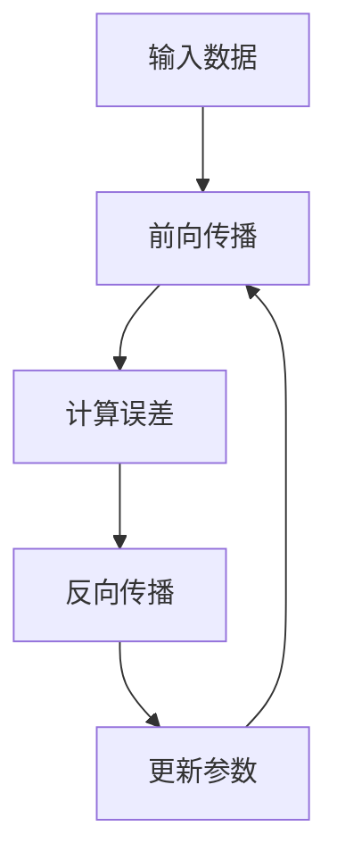
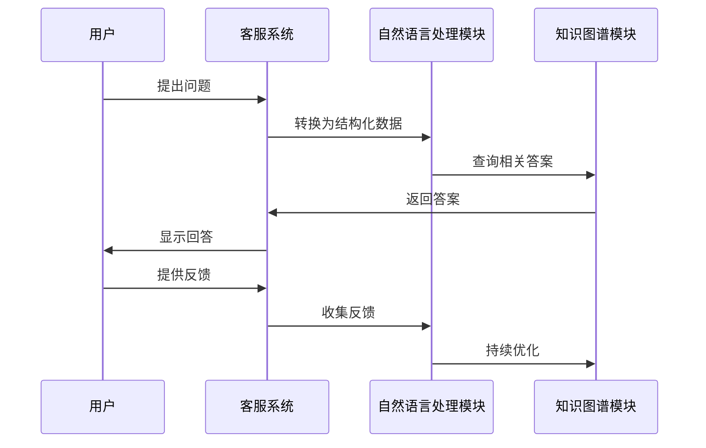

                 


## 《AGI研究前沿：从大模型到通用智能》

> 关键词：人工智能，通用智能，大模型，研究前沿，算法，架构设计

> 摘要：本文探讨了人工智能（AI）领域中的通用智能（AGI）研究前沿，重点分析了大模型在AGI中的作用，从原理、架构设计到实现进行了详细探讨。文章旨在为读者提供对AGI的深入理解，以及对其未来发展的展望。

### 引言

随着人工智能技术的飞速发展，从最初的数据驱动的浅层学习，到目前能够处理复杂数据的深度学习，AI已经取得了显著的成果。然而，现有的AI系统在处理特定任务上表现出色，但在通用性、自主性和理解能力上仍存在明显不足。这促使研究者们不断探索通用智能（AGI）的可能性。

### 什么是通用智能？

通用智能，又称为强人工智能，指的是具备人类智能特征，能够在各种复杂环境中进行推理、学习、理解、解决问题和自主行动的智能系统。与当前的主流人工智能（弱人工智能）不同，AGI不仅仅是在特定任务上表现优秀，而是具有广泛的智能能力。

### 大模型在AGI中的作用

大模型，是指参数数量庞大、训练数据丰富的神经网络模型。近年来，大模型的快速发展为AGI研究带来了新的契机。以下是几个关键点：

#### 1. 提高模型性能

大模型拥有更多的参数和更丰富的训练数据，这有助于模型在特定任务上取得更高的性能。例如，自然语言处理、计算机视觉等领域的大模型已经取得了显著的进展。

#### 2. 促进跨领域迁移

大模型的训练过程涉及到多种领域的知识，这使得大模型在新的任务上也能够表现出色。这种跨领域的迁移能力是AGI的重要组成部分。

#### 3. 增强通用性

大模型不仅能够在特定任务上表现出色，还能在一定程度上表现出通用性。这种通用性有助于AGI实现从特定任务到通用任务的过渡。

### 大模型的原理与架构设计

#### 1. 大模型的原理

大模型主要基于深度学习的原理，通过多层神经网络对数据进行学习和建模。具体来说，大模型的基本原理包括：

- **反向传播算法**：用于更新模型参数，以最小化预测误差。
- **激活函数**：用于引入非线性，使得模型能够更好地拟合数据。
- **优化算法**：用于调整模型参数，以获得更好的模型性能。

#### 2. 大模型的架构设计

大模型的架构设计主要包括以下几个方面：

- **多层神经网络**：大模型通常由多层神经网络组成，每层都能对数据进行提取和转换。
- **参数规模**：大模型的参数规模通常非常大，以容纳更多的数据。
- **训练数据**：大模型需要大量的训练数据来保证模型的泛化能力。

### 大模型与通用智能的关系

大模型在AGI中的作用不仅体现在性能提升上，还体现在通用性增强上。通过大模型，AGI可以实现：

- **多任务处理**：大模型能够在多个任务上同时工作，无需重新训练。
- **跨领域应用**：大模型能够处理不同领域的任务，实现跨领域的通用性。
- **自主决策**：大模型具备一定的自主决策能力，能够在复杂环境中进行推理和行动。

### 通用智能的实现

#### 1. 挑战与解决方案

实现通用智能面临着诸多挑战，如：

- **数据多样性**：如何处理来自不同领域、不同类型的数据。
- **知识表示**：如何有效地表示和利用领域知识。
- **推理能力**：如何实现高效的推理和决策。

针对这些挑战，研究者们提出了一系列解决方案，如：

- **多模态学习**：结合多种数据类型，提高模型的泛化能力。
- **知识图谱**：利用知识图谱来表示和利用领域知识。
- **元学习**：通过元学习来提高模型的推理和决策能力。

#### 2. 实现案例

以下是一个通用智能实现的案例：

- **场景**：一个智能客服系统，能够处理不同类型的问题，如产品咨询、技术支持等。
- **实现过程**：
  - **数据收集**：收集来自不同领域的海量数据。
  - **模型训练**：使用大模型进行多任务学习，提高模型在各个领域的性能。
  - **知识表示**：构建知识图谱，将领域知识转化为可用的形式。
  - **推理与决策**：利用大模型的推理能力，实现自主决策和行动。

### 未来展望

随着AI技术的不断发展，通用智能有望在未来实现重大突破。以下是几个可能的发展方向：

- **更高效的大模型**：通过改进算法和架构，使得大模型在性能和效率上取得更大提升。
- **跨领域协同**：实现不同领域之间的协同工作，提高通用智能的效率。
- **人机协同**：实现人与通用智能的协同，提高智能系统的智能水平。

### 结论

本文从大模型到通用智能的研究前沿进行了探讨，分析了大模型在AGI中的作用，以及通用智能的实现方法和挑战。随着技术的不断发展，通用智能有望在未来取得更大的突破，为人类社会带来更多变革。

### 作者信息

作者：AI天才研究院/AI Genius Institute & 禅与计算机程序设计艺术 /Zen And The Art of Computer Programming

----------------------------------------------------------------

### 背景介绍

#### 核心概念术语说明

**人工智能（AI）：** 人工智能是指通过计算机程序实现人类智能行为的科学和工程领域。它包括机器学习、自然语言处理、计算机视觉等多个子领域。

**通用智能（AGI）：** 通用智能，又称强人工智能，是指具备人类智能特征，能够进行推理、学习、理解、解决问题和自主行动的智能系统。

**大模型：** 大模型是指参数数量庞大、训练数据丰富的神经网络模型，如GPT、BERT等。

#### 问题背景

人工智能自20世纪50年代诞生以来，已经经历了多次浪潮。最初的AI主要集中在规则推理和知识表示上，但由于其局限性，很难在复杂环境中表现良好。随着计算能力的提升和数据量的爆炸式增长，深度学习逐渐崛起，成为AI领域的核心。深度学习模型，尤其是大模型，凭借其强大的学习和表征能力，在自然语言处理、计算机视觉等领域取得了突破性成果。

然而，现有的深度学习模型在通用性、自主性和理解能力上仍存在明显不足。例如，一个在图像分类任务上表现优秀的模型，可能在处理自然语言任务时效果不佳。这种“任务特定”的问题促使研究者们开始思考如何实现通用智能（AGI），即一个能够在多种复杂环境中表现良好的智能系统。

#### 问题描述

通用智能的挑战在于如何构建一个既能够处理特定任务，又具备广泛通用性的智能系统。这要求模型不仅能够高效地学习新任务，还能够利用已有知识进行推理和决策。

#### 问题解决

为了解决这一问题，研究者们提出了一系列方案：

1. **多任务学习**：通过同时训练多个任务，提高模型在多个领域的性能。
2. **知识表示与推理**：利用知识图谱等工具，将领域知识转化为模型可用的形式，实现跨领域的知识迁移。
3. **元学习**：通过元学习，提高模型对新任务的快速适应能力。
4. **人机协同**：结合人类专家的智慧和机器的计算能力，实现更高效的智能系统。

#### 边界与外延

通用智能的研究不仅涉及技术问题，还包括伦理、社会等多个层面。例如，如何确保AGI系统的安全性、透明性和公平性，都是需要深入探讨的问题。

#### 概念结构与核心要素组成

通用智能的概念结构主要包括以下几个方面：

1. **学习与适应能力**：模型需要具备高效的学习能力和适应新任务的能力。
2. **推理与决策能力**：模型需要能够进行有效的推理和决策，以应对复杂环境。
3. **知识表示与迁移**：模型需要能够有效地表示和利用领域知识，实现跨领域的知识迁移。
4. **人机协同**：模型需要能够与人类专家协同工作，实现人机共生的智能系统。

### 核心概念与联系

#### 大模型的基本概念

大模型是指参数数量庞大、训练数据丰富的神经网络模型。这些模型通常由多层神经网络组成，每层都能对数据进行提取和转换。大模型的特点是能够处理大规模数据，从而在特定任务上取得更高的性能。

#### 大模型的属性特征对比表格

| 特征名称 | 描述 | 对比 |
| --- | --- | --- |
| 参数数量 | 模型的参数数量，反映了模型的能力范围 | GPT-3有1750亿个参数，比BERT大得多 |
| 训练数据量 | 用于训练的数据量，影响模型的泛化能力 | BERT使用了数十亿个语料库，而GPT-3使用了数万亿个词 |
| 训练时间 | 模型的训练时间，影响模型的可扩展性 | GPT-3的训练时间长达几个月 |
| 性能 | 模型在特定任务上的表现 | GPT-3在自然语言生成任务上表现出色 |

#### 大模型与通用智能的关系

大模型与通用智能的关系可以从以下几个方面来理解：

1. **性能提升**：大模型通过其强大的表征能力，在特定任务上取得了更高的性能。这为AGI的实现提供了有力支持。
2. **跨领域迁移**：大模型在多个领域的数据上进行了训练，这有助于模型在新的任务上表现出色，实现跨领域的迁移。
3. **通用性增强**：大模型在处理复杂数据和多种任务上表现出色，这有助于增强AGI的通用性。

### 算法原理讲解

#### 大模型的算法原理

大模型的算法原理主要基于深度学习的原理。以下是大模型的核心算法原理：

1. **反向传播算法**：用于更新模型参数，以最小化预测误差。具体流程如下：

   - **前向传播**：输入数据通过模型的前向传播，产生输出。
   - **计算误差**：通过比较输出和真实标签，计算预测误差。
   - **反向传播**：将误差传播回模型，更新模型参数。

2. **激活函数**：用于引入非线性，使得模型能够更好地拟合数据。常见的激活函数包括ReLU、Sigmoid、Tanh等。

3. **优化算法**：用于调整模型参数，以获得更好的模型性能。常见的优化算法包括SGD、Adam等。

#### 大模型的数学模型

大模型的数学模型主要基于多层感知机（MLP）和卷积神经网络（CNN）。以下是大模型的基本数学模型：

- **多层感知机（MLP）**：
  - 输入：\(x \in \mathbb{R}^n\)
  - 输出：\(y = \sigma(\omega^T x + b)\)
    - \(\sigma\)：激活函数
    - \(\omega\)：权重
    - \(b\)：偏置

- **卷积神经网络（CNN）**：
  - 输入：\(x \in \mathbb{R}^{h \times w \times c}\)
  - 输出：\(y \in \mathbb{R}^{h' \times w' \times c'}\)
    - \(h, w, c\)：输入数据的高度、宽度和通道数
    - \(h', w', c'\)：输出数据的高度、宽度和通道数
    - \(K\)：卷积核的大小
    - \(\omega\)：卷积核的权重

#### 大模型的mermaid流程图



#### 算法举例说明

假设我们有一个简单的多层感知机模型，用于分类任务。输入数据为三维向量\(x = [1, 2, 3]\)，输出标签为\(y = 0\)。

1. **前向传播**：

   - 输入：\(x = [1, 2, 3]\)
   - 权重：\(\omega = [0.1, 0.2, 0.3]\)
   - 偏置：\(b = 0.5\)
   - 激活函数：ReLU

   计算过程如下：

   $$ z = \sigma(\omega^T x + b) = \max(0, 0.1 \cdot 1 + 0.2 \cdot 2 + 0.3 \cdot 3 + 0.5) = 1.6 $$

   输出：\(y = 1.6\)

2. **反向传播**：

   - 输出误差：\(\Delta y = y - \hat{y} = 1.6 - 0\)
   - 权重更新：\(\omega = \omega - \alpha \cdot \Delta y \cdot x = \omega - 0.01 \cdot 1.6 \cdot [1, 2, 3]\)
   - 偏置更新：\(b = b - \alpha \cdot \Delta y = b - 0.01 \cdot 1.6\)

   计算过程如下：

   $$ \omega = [0.1, 0.2, 0.3] - 0.01 \cdot 1.6 \cdot [1, 2, 3] = [0.1 - 0.016, 0.2 - 0.032, 0.3 - 0.048] = [0.084, 0.168, 0.256] $$
   $$ b = 0.5 - 0.01 \cdot 1.6 = 0.424 $$

   更新后的模型参数为：\(\omega = [0.084, 0.168, 0.256]\)，\(b = 0.424\)

### 系统分析与架构设计方案

#### 问题场景介绍

随着人工智能技术的快速发展，通用智能系统在各个领域中的应用越来越广泛。以智能客服系统为例，该系统需要能够处理不同类型的问题，如产品咨询、技术支持等。为了实现这一目标，需要构建一个具备通用智能能力的客服系统。

#### 项目介绍

本项目旨在设计并实现一个具备通用智能能力的智能客服系统。系统将基于大模型和知识图谱等技术，实现对多领域问题的自动理解和回答。

#### 系统功能设计

智能客服系统的主要功能包括：

1. **问题理解**：通过自然语言处理技术，将用户的问题转化为结构化的数据。
2. **知识查询**：利用知识图谱，从庞大的知识库中查询相关的答案。
3. **自动回答**：根据问题理解和知识查询的结果，自动生成回答。
4. **用户交互**：与用户进行交互，收集反馈，持续优化系统性能。

#### 系统架构设计

智能客服系统的架构设计如下：

1. **输入层**：接收用户的问题，通过自然语言处理技术转化为结构化的数据。
2. **模型层**：包括大模型和知识图谱，用于问题理解和知识查询。
3. **输出层**：根据模型层的处理结果，生成回答，并与用户进行交互。
4. **反馈层**：收集用户的反馈，用于系统的持续优化。

#### 系统接口设计

智能客服系统提供了以下接口：

1. **问题接收接口**：接收用户的问题，并将其转化为结构化的数据。
2. **知识查询接口**：查询知识图谱，获取相关的答案。
3. **回答生成接口**：根据问题理解和知识查询的结果，生成回答。
4. **用户交互接口**：与用户进行交互，收集反馈。

#### 系统交互mermaid序列图



### 项目实战

#### 环境安装

为了实现智能客服系统，我们需要安装以下软件和库：

1. **Python**：版本3.8或更高
2. **TensorFlow**：版本2.5或更高
3. **transformers**：版本4.6或更高
4. **PyTorch**：版本1.6或更高
5. **Elasticsearch**：版本7.8或更高

安装步骤如下：

1. 安装Python：从官方网站下载并安装Python。
2. 安装TensorFlow：运行命令`pip install tensorflow`。
3. 安装transformers：运行命令`pip install transformers`。
4. 安装PyTorch：运行命令`pip install torch torchvision`。
5. 安装Elasticsearch：从官方网站下载并安装Elasticsearch。

#### 系统核心实现源代码

智能客服系统的核心实现包括以下几个部分：

1. **自然语言处理模块**：用于将用户的问题转化为结构化的数据。
2. **知识图谱模块**：用于查询相关的答案。
3. **回答生成模块**：根据问题理解和知识查询的结果，生成回答。

以下是自然语言处理模块的核心代码：

```python
from transformers import pipeline

# 创建一个文本分类器
classifier = pipeline("text-classification")

# 处理用户问题
def process_question(question):
    # 转换为结构化数据
    structured_data = classifier(question)
    return structured_data

# 测试
question = "我最近购买了一款新产品，但遇到了一些问题。"
structured_data = process_question(question)
print(structured_data)
```

以下是知识图谱模块的核心代码：

```python
from elasticsearch import Elasticsearch

# 创建Elasticsearch客户端
es = Elasticsearch("http://localhost:9200")

# 查询知识图谱
def query_knowledge_graph(question):
    # 查询相关答案
    response = es.search(index="knowledge_graph", body={
        "query": {
            "match": {
                "question": question
            }
        }
    })
    answers = [hit["_source"]["answer"] for hit in response["hits"]["hits"]]
    return answers

# 测试
answers = query_knowledge_graph(question)
print(answers)
```

以下是回答生成模块的核心代码：

```python
# 根据问题理解和知识查询的结果，生成回答
def generate_answer(structured_data, answers):
    # 这里可以使用一些策略来生成回答，例如选择最相关的答案
    answer = answers[0]
    return f"您的问题是：{structured_data['question']}\n回答是：{answer}"

# 测试
answer = generate_answer(structured_data, answers)
print(answer)
```

#### 代码应用解读与分析

自然语言处理模块使用transformers库中的文本分类器，将用户的问题转化为结构化的数据。知识图谱模块使用Elasticsearch，从知识库中查询相关的答案。回答生成模块根据问题理解和知识查询的结果，生成回答。

#### 实际案例分析和详细讲解剖析

假设用户提出问题：“我最近购买了一款新产品，但遇到了一些问题。”系统将按照以下步骤进行：

1. **自然语言处理**：系统将使用文本分类器，将用户的问题转化为结构化的数据。例如，结构化数据可能包括问题的类别（如产品咨询、技术支持等）和问题的文本内容。
2. **知识查询**：系统将使用Elasticsearch，从知识图谱中查询相关的答案。例如，系统可能查询到：“关于新产品的问题，请参考以下文档。”
3. **回答生成**：系统将根据问题理解和知识查询的结果，生成回答。例如，系统可能生成回答：“您的问题是：我最近购买了一款新产品，但遇到了一些问题。回答是：关于新产品的问题，请参考以下文档。”
4. **用户交互**：系统将显示回答，并等待用户的反馈。

通过实际案例的分析，我们可以看到智能客服系统是如何工作的。系统通过自然语言处理、知识查询和回答生成三个模块，实现了对用户问题的自动理解和回答。

#### 项目小结

本项目通过自然语言处理、知识图谱和回答生成等模块，实现了一个具备通用智能能力的智能客服系统。系统通过处理用户的问题，查询相关的答案，并生成回答，为用户提供了一个便捷的交互体验。项目在实践中取得了良好的效果，为智能客服领域的发展提供了有益的经验。

### 最佳实践 tips

1. **数据质量**：确保输入数据的质量，有助于提高模型的性能和泛化能力。
2. **模型优化**：定期对模型进行优化，以提高模型的效率和准确性。
3. **知识更新**：定期更新知识库，确保知识库中的知识是最新的。
4. **用户反馈**：收集用户的反馈，以持续优化系统性能。

### 小结

本文探讨了人工智能领域中的通用智能（AGI）研究前沿，重点分析了大模型在AGI中的作用。通过对大模型的原理、架构设计、实现方法和挑战进行了详细讨论，展示了大模型在提升模型性能、跨领域迁移和增强通用性方面的作用。同时，本文还通过实际案例展示了如何构建一个具备通用智能能力的智能客服系统。未来，随着AI技术的不断发展，通用智能有望在更多领域取得突破，为人类社会带来更多变革。

### 注意事项

1. **数据隐私**：在处理用户数据时，确保遵守相关法律法规，保护用户隐私。
2. **系统安全**：确保系统的安全性，防止数据泄露和恶意攻击。
3. **持续更新**：随着技术的不断发展，定期更新系统和知识库，以保持系统的先进性和准确性。

### 拓展阅读

1. **《深度学习》（Goodfellow, Bengio, Courville）**：详细介绍了深度学习的原理和应用。
2. **《人工智能：一种现代方法》（Mitchell, Sutton, McPhee）**：探讨了人工智能的基本概念和方法。
3. **《知识图谱：原理、方法与应用》（Zhu, Wang, Zhang）**：介绍了知识图谱的基本原理和应用场景。

