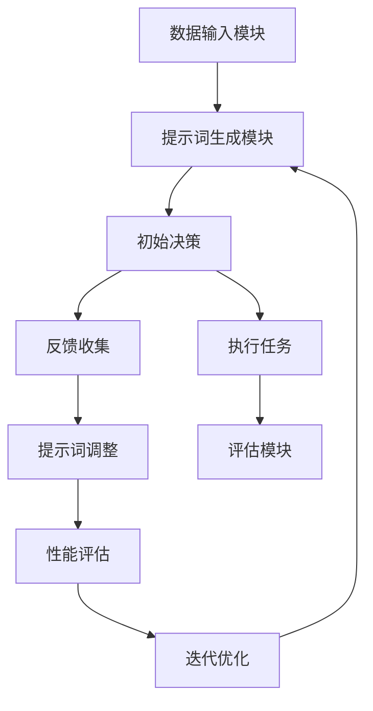
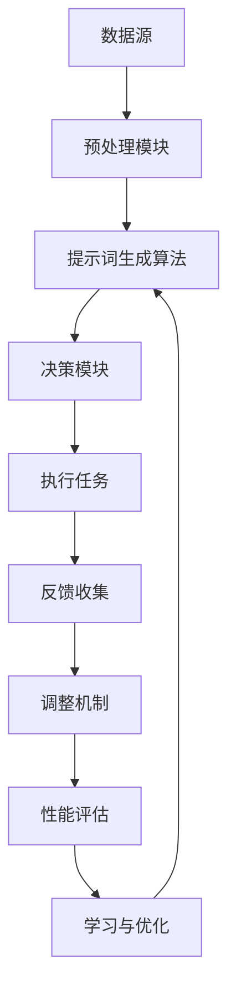

                 

## 引言

随着人工智能技术的飞速发展，通用人工智能（AGI）逐渐成为学术界和工业界共同关注的热点领域。AGI系统旨在打造出具备人类智能水平的机器，能够自主地理解、学习和适应复杂多变的环境。然而，实现这一目标面临诸多挑战，如知识表示、推理能力、自主学习机制等。在众多研究课题中，提示词自我改进机制成为了AGI系统中一个关键的研究方向。

提示词自我改进机制，顾名思义，是指通过系统的自我迭代与优化，不断改进提示词的表现与效果。提示词在这里可以被视为一种信息载体，用于引导AGI系统在特定任务上的学习与决策。自我改进机制则意味着系统不仅能够接收外部反馈，还能够根据反馈调整自身的内部参数，从而达到优化性能的目的。

本文旨在探讨AGI系统中的提示词自我改进机制，通过深入分析其基本概念、算法原理、实现方法以及实际应用，以期揭示这一机制在AGI系统中的重要作用及其潜在的研究方向。文章将按照以下结构展开：

首先，在第一部分“背景与理论基础”中，我们将回顾人工智能与通用人工智能的发展历程，并介绍提示词自我改进机制的基本概念和原理。

接着，在第二部分“算法与实现”中，我们将详细讨论提示词自我改进机制的算法原理，并通过mermaid流程图和Python源代码实现，使读者对算法有更直观的理解。

然后，在第三部分“应用与实践”中，我们将探讨提示词自我改进机制在实际应用场景中的表现，并通过具体的项目实战，展示其在系统实现和优化中的具体应用。

最后，在第四部分“总结与展望”中，我们将对全文进行总结，并对提示词自我改进机制的现状与未来发展方向提出展望。

通过本文的逐步探讨，希望能够为读者提供一个全面、系统的理解，揭示提示词自我改进机制在AGI系统中的重要性，以及其在未来技术发展中的潜力。

### 背景介绍

在探讨AGI系统中的提示词自我改进机制之前，有必要对人工智能和通用人工智能的发展历程进行简要回顾。人工智能（AI）作为计算机科学的一个重要分支，自20世纪50年代诞生以来，已经经历了数十年的发展。早期的人工智能主要集中在规则推理和符号计算领域，这一时期的代表性工作包括专家系统的开发，这些系统能够在特定领域内模拟专家决策过程。

然而，随着计算能力的提升和大数据技术的发展，机器学习逐渐成为人工智能研究的主流。20世纪80年代至21世纪初，神经网络、决策树、支持向量机等机器学习方法相继被提出，并在图像识别、自然语言处理、推荐系统等领域取得了显著成果。这一时期，人工智能系统在特定任务上的表现已经达到了前所未有的高度，但它们往往局限于特定领域，难以实现跨领域的通用智能。

通用人工智能（AGI）的概念最早由约翰·麦卡锡（John McCarthy）在1955年提出，其目标是创造出一个具有人类智能水平的机器，能够理解、学习、推理和解决问题。AGI系统的核心在于其能够跨越不同领域，自主适应和解决各种复杂任务。与当前广泛应用的专用人工智能系统（如语音识别、图像识别等）不同，AGI系统需要具备自我学习和自我改进的能力，能够在动态变化的环境中自主学习和优化。

然而，AGI的实现面临诸多挑战。首先，知识表示问题是一个重要的难题。如何有效地表示和存储大规模知识，使得系统能够快速、准确地检索和应用这些知识，是AGI系统成功的关键。其次，推理能力是AGI系统必须具备的另一项重要能力。推理能力涉及到从已知信息中推导出新信息，这对于解决复杂问题至关重要。此外，自我学习和自我改进机制也是AGI系统实现的关键。传统的机器学习算法依赖于大量的训练数据，而AGI系统需要在缺乏大量训练数据的情况下，通过自我迭代和优化，不断提升其智能水平。

在这个背景下，提示词自我改进机制应运而生。提示词在这里可以被视为一种信息载体，用于引导AGI系统在特定任务上的学习与决策。通过提示词的自我改进，系统可以在不断调整和优化的过程中，提高其任务执行效率和学习能力。具体而言，提示词自我改进机制包括以下几个核心要素：

1. **反馈机制**：系统需要具备接收外部反馈的能力，这些反馈可以是用户提供的标注数据、环境反馈或其他形式的信息。通过这些反馈，系统可以了解其当前的表现和存在的问题。

2. **调整机制**：系统需要根据反馈信息调整其内部参数和策略，以优化其表现。这一过程通常涉及到机器学习算法的迭代优化，如梯度下降、随机优化等。

3. **自适应机制**：系统需要具备自适应能力，能够根据环境和任务的变化，动态调整其提示词策略。这一能力是实现通用智能的重要保障。

4. **评估机制**：系统需要能够对提示词的效果进行评估，以确定其改进的方向。评估指标可以是任务完成度、错误率、效率等。

通过这些机制的综合作用，提示词自我改进机制为AGI系统提供了一种有效的自我学习和优化途径。在接下来的章节中，我们将详细探讨提示词自我改进机制的基本概念、算法原理及其在实际应用中的具体实现。

### 提示词自我改进机制的基本概念

提示词自我改进机制作为一种在通用人工智能（AGI）系统中实现自我学习和优化的技术手段，其核心概念包括提示词、反馈机制、调整机制、自适应机制和评估机制等。下面我们将对这些概念进行详细说明。

#### 提示词的定义与功能

提示词是提示词自我改进机制的基础，它是一种用于引导AGI系统在特定任务上学习和决策的信息载体。具体而言，提示词可以是一个单词、短语或者一组数据，用于指导系统在处理特定任务时采取相应的行动。例如，在自然语言处理任务中，提示词可以是一个关键字或句子，用于引导系统理解文本的主旨或提取关键信息。

提示词在AGI系统中的功能主要包括以下几个方面：

1. **引导学习**：提示词可以帮助系统在大量数据中快速定位与任务相关的信息，从而提高学习效率。
2. **决策支持**：通过提示词，系统可以在复杂决策过程中获取关键信息，降低决策难度。
3. **任务细化**：提示词可以帮助系统将泛化任务细化为具体的子任务，从而更容易实现。

#### 反馈机制

反馈机制是提示词自我改进机制的关键环节之一，它使系统能够根据外部环境或用户提供的反馈信息调整自身的行为和策略。反馈机制通常包括以下几种类型：

1. **用户反馈**：用户通过评价、标注等方式提供系统表现的反馈，如任务完成度、用户体验等。
2. **环境反馈**：系统从外部环境中获取的反馈信息，如任务完成所需时间、资源消耗等。
3. **内部反馈**：系统内部运行状态的信息，如学习算法的迭代次数、参数调整情况等。

反馈机制的作用在于：

1. **评估性能**：通过反馈信息，系统可以评估当前策略的有效性，从而确定是否需要调整。
2. **优化策略**：根据反馈信息，系统可以调整提示词或学习策略，以优化任务执行效果。

#### 调整机制

调整机制是指系统根据反馈信息调整内部参数和策略的过程。调整机制通常包括以下几个步骤：

1. **识别偏差**：系统通过分析反馈信息，识别出当前策略或参数的偏差或不足。
2. **制定调整方案**：根据偏差情况，系统制定相应的调整方案，如参数调整、算法优化等。
3. **实施调整**：系统根据调整方案实施具体的参数或策略调整。

调整机制的作用在于：

1. **优化性能**：通过调整，系统可以减少误差，提高任务执行效率和准确性。
2. **提高适应性**：系统可以根据环境和任务的变化，灵活调整自身策略，提高适应性。

#### 自适应机制

自适应机制是指系统在动态环境中能够根据变化自动调整自身行为的能力。在AGI系统中，自适应机制主要体现在以下几个方面：

1. **环境感知**：系统通过传感器或监测工具感知环境变化，如任务难度、资源限制等。
2. **动态调整**：系统根据环境感知结果，动态调整提示词和策略，以适应新的环境。
3. **自我优化**：系统通过自我迭代和优化，不断提高自身适应能力。

自适应机制的作用在于：

1. **提升灵活性**：系统可以更好地应对复杂、多变的环境，提高灵活性。
2. **增强鲁棒性**：系统可以减少对固定策略的依赖，增强鲁棒性，提高应对异常情况的能力。

#### 评估机制

评估机制是确保提示词自我改进机制有效性的关键。评估机制通常包括以下几种方法：

1. **性能评估**：系统通过计算任务完成度、错误率等指标，评估提示词自我改进机制的效果。
2. **用户满意度**：通过用户反馈，评估系统在任务执行过程中的用户体验。
3. **长期效果**：系统需要能够持续监测和评估提示词自我改进机制对长期任务执行效果的影响。

评估机制的作用在于：

1. **验证效果**：通过评估，系统可以验证提示词自我改进机制的有效性。
2. **指导优化**：评估结果可以指导系统进一步优化提示词自我改进机制，提高整体性能。

通过上述四个核心要素的协同作用，提示词自我改进机制为AGI系统提供了一个有效的自我学习和优化途径，使其能够不断适应复杂多变的环境，提高任务执行效率和智能水平。在接下来的章节中，我们将进一步探讨提示词自我改进机制的算法原理及其具体实现方法。

### 提示词自我改进机制的算法原理

在深入了解提示词自我改进机制的算法原理之前，我们需要先理解其背后的数学模型和核心算法。提示词自我改进机制主要通过机器学习算法来实现，其中涉及到的关键技术包括梯度下降、随机优化和强化学习等。以下将分别介绍这些算法的基本原理和应用。

#### 梯度下降算法

梯度下降算法是机器学习中最基本且广泛应用的一种优化算法。其基本思想是通过迭代最小化目标函数的梯度，从而找到目标函数的最小值或近似最优解。在提示词自我改进机制中，梯度下降算法主要用于调整系统的内部参数，使其在特定任务上的表现更加优异。

**基本原理：**
1. **目标函数**：设定一个损失函数（或称为目标函数），用来衡量系统当前状态与期望状态之间的差距。
2. **梯度计算**：计算目标函数相对于每个参数的梯度，即损失函数关于参数的导数。
3. **参数更新**：根据梯度值更新系统的内部参数，使损失函数逐渐减小。

**数学模型：**
设参数向量为θ，损失函数为J(θ)，梯度为∇J(θ)，则梯度下降算法的基本更新公式为：
\[ \theta = \theta - \alpha \cdot \nabla J(\theta) \]
其中，α为学习率，用于控制参数更新的步长。

**举例说明：**
假设我们要优化一个简单的线性回归模型，目标函数为：
\[ J(\theta) = \frac{1}{2} \sum_{i=1}^{n} (y_i - \theta_0 x_i - \theta_1)^2 \]
通过计算梯度并更新参数θ，可以使模型在拟合数据时达到最小化损失。

#### 随机优化算法

随机优化算法是一种利用随机性搜索全局最优解的算法，其代表包括遗传算法、粒子群优化算法等。与梯度下降算法不同，随机优化算法不需要梯度信息，而是通过随机搜索来找到最优解。在提示词自我改进机制中，随机优化算法可用于全局搜索，帮助系统跳出局部最优，找到更好的解决方案。

**基本原理：**
1. **初始化种群**：随机生成一组初始解（或称为个体）。
2. **适应度评估**：计算每个个体的适应度值，适应度通常与目标函数成反比。
3. **选择操作**：根据适应度值选择优秀个体进行复制。
4. **交叉与变异**：对选中的个体进行交叉和变异操作，产生新的个体。
5. **迭代更新**：重复选择、交叉和变异操作，逐步优化种群。

**数学模型：**
以遗传算法为例，其基本操作包括：
- **选择**：常用的选择方法有轮盘赌选择、锦标赛选择等。
- **交叉**：交叉操作用于生成新的个体，通过交换父母个体的基因片段来产生子代。
- **变异**：变异操作用于增加种群的多样性，通过随机改变个体的某个基因来生成新的个体。

**举例说明：**
假设我们使用遗传算法来优化一个多峰函数，如Rosenbrock函数：
\[ f(x) = \sum_{i=1}^{n} \left[ 100 \left( x_{i+1} - x_i^2 \right)^2 + \left( 1 - x_i \right)^2 \right] \]
通过多次迭代，遗传算法可以找到函数的近似最优解。

#### 强化学习算法

强化学习算法是一种通过奖励机制来指导系统决策的机器学习算法，其主要特点是通过与环境交互来学习最优策略。在提示词自我改进机制中，强化学习算法可用于实现系统的自我学习和自我优化。

**基本原理：**
1. **状态-动作模型**：系统根据当前状态选择动作，并通过动作与环境交互得到新的状态和奖励。
2. **策略更新**：根据奖励信息更新系统的策略，以最大化长期奖励。
3. **价值函数**：通过评估不同状态的价值，指导系统选择最优动作。

**数学模型：**
强化学习的主要数学模型包括马尔可夫决策过程（MDP）和策略梯度算法。

- **马尔可夫决策过程（MDP）**：
\[ \begin{cases} 
P(s'|s,a) = \text{转移概率} \\
R(s,a) = \text{即时奖励} \\
\pi(a|s) = \text{策略概率} \\
V(s) = \text{状态价值} \\
Q(s,a) = \text{动作价值} \\
\end{cases} \]

- **策略梯度算法**：
\[ \theta_{t+1} = \theta_t + \alpha \cdot \nabla_{\theta} J(\theta) \]
其中，J(θ)为策略损失函数，α为学习率。

**举例说明：**
假设我们使用Q-学习算法来训练一个智能体在迷宫中找到最优路径。通过不断与环境交互，智能体可以学习到在不同状态下的最优动作，从而最大化总奖励。

通过上述三种算法的介绍，我们可以看到，提示词自我改进机制通过结合梯度下降、随机优化和强化学习等算法，实现了系统的自我学习和优化。在接下来的章节中，我们将进一步探讨这些算法在AGI系统中的具体实现和应用。

#### AGI系统中的提示词自我改进模块实现

为了实现AGI系统中的提示词自我改进模块，我们需要设计一个系统架构，该架构能够支持提示词的生成、调整和优化，同时确保系统的稳定性和高效性。以下是针对AGI系统中提示词自我改进模块的系统架构设计和具体实现流程。

### 4.1.1 AGI系统架构与提示词自我改进模块

首先，我们需要明确AGI系统的整体架构，如图1所示。整个系统可以分为以下几个主要模块：

1. **数据输入模块**：负责接收和处理外部数据，如用户输入、环境数据等。
2. **提示词生成模块**：根据输入数据生成初步的提示词，用于引导系统的学习和决策。
3. **自我改进模块**：包含提示词的调整、优化和评估机制，负责提升提示词的效果。
4. **决策模块**：根据提示词和系统状态做出决策，引导系统执行特定任务。
5. **反馈机制**：收集系统运行过程中产生的反馈信息，用于进一步优化提示词和系统性能。
6. **评估模块**：对系统的整体性能进行评估，确保系统在长期运行中的稳定性和可靠性。


### 4.1.2 提示词自我改进机制的系统实现流程

在明确了AGI系统的整体架构后，接下来我们将详细描述提示词自我改进机制的系统实现流程。该流程可以分为以下几个步骤：

1. **数据输入**：系统首先从数据输入模块接收外部数据，这些数据可以是用户输入、传感器数据或其他形式的数据。
2. **提示词生成**：根据输入数据，提示词生成模块生成初步的提示词。这一过程可能涉及到自然语言处理、数据预处理等技术。
3. **初始决策**：系统使用生成的提示词进行初始决策，执行特定任务。
4. **反馈收集**：在任务执行过程中，系统通过反馈机制收集环境反馈和用户评价等反馈信息。
5. **提示词调整**：根据收集到的反馈信息，自我改进模块对提示词进行调整。这一过程可能涉及到机器学习算法、随机优化算法等。
6. **性能评估**：调整后的提示词用于再次执行任务，评估模块对任务执行效果进行评估。
7. **迭代优化**：根据评估结果，系统重复提示词生成、调整和评估的过程，逐步优化提示词的性能。
8. **系统稳定**：经过多次迭代优化，系统达到稳定的性能状态，可以在长期运行中保持高效性和可靠性。

### 4.1.3 提示词自我改进机制的mermaid架构图

为了更好地展示AGI系统中提示词自我改进模块的实现，我们可以使用mermaid绘制一个系统架构图，如图2所示。



### 4.1.4 提示词自我改进机制的mermaid架构图

为了进一步展示AGI系统中提示词自我改进模块的架构设计，我们使用mermaid绘制了一个简化的架构图，如图3所示。



通过上述mermaid架构图，我们可以清晰地看到提示词自我改进机制在AGI系统中的关键组成部分及其相互关系。该架构设计确保了系统在动态环境中能够不断调整和优化提示词，从而提升整体性能和智能水平。

### 提示词自我改进机制的应用场景

提示词自我改进机制在多个领域都展现出了强大的应用潜力，尤其是在自然语言处理和计算机视觉中。以下将分别探讨这些领域中的应用，并通过具体案例进行分析。

#### 自然语言处理中的应用

在自然语言处理（NLP）领域，提示词自我改进机制能够显著提升文本理解和生成能力。例如，在机器翻译任务中，系统可以使用自我改进机制来优化翻译质量。通过分析用户反馈和翻译结果，系统可以不断调整翻译策略，如词汇选择、语法结构等，从而提高翻译的准确性和流畅性。

**案例分析：**

以百度翻译为例，其机器翻译系统采用了提示词自我改进机制，通过收集用户对翻译结果的反馈，系统能够自动调整翻译策略。例如，当用户指出某个翻译结果不合适时，系统会记录该反馈，并在后续翻译中避免使用相同的错误词汇或语法结构。通过这种方式，百度翻译在用户体验和翻译质量上得到了显著提升。

#### 计算机视觉中的应用

在计算机视觉领域，提示词自我改进机制可以帮助提升图像识别和目标检测的准确率。例如，在自动驾驶系统中，车辆需要实时检测道路上的行人、车辆和其他障碍物。通过自我改进机制，系统可以在不断调整提示词的过程中，提高对复杂场景的识别能力。

**案例分析：**

以特斯拉的自动驾驶系统为例，其使用了一种基于深度学习的目标检测算法，并结合提示词自我改进机制。通过不断收集实际驾驶过程中的反馈信息，如车辆对障碍物的反应，系统可以优化目标检测算法的参数，从而提高检测准确率。例如，当系统在某个场景下误判了行人时，系统会记录这一反馈，并在后续场景中增强对行人的检测力度。

#### 其他领域中的应用

除了自然语言处理和计算机视觉，提示词自我改进机制在其他领域也展现出了广泛应用潜力。例如，在医疗诊断中，系统可以通过自我改进机制，优化疾病预测模型，提高诊断的准确性。在金融领域，提示词自我改进机制可以帮助金融机构优化风险管理策略，提高投资决策的准确性。

**案例分析：**

以IBM Watson为例，其在医疗诊断领域采用了提示词自我改进机制。通过分析大量的医学文献和病例数据，系统可以生成初步的疾病预测模型。然后，通过不断收集医生对预测结果的反馈，系统可以优化模型参数，提高预测的准确性和可靠性。

通过上述案例可以看出，提示词自我改进机制在自然语言处理、计算机视觉以及其他领域都展现出了强大的应用潜力。其通过不断调整和优化提示词，使系统能够更好地适应复杂多变的环境，提高任务执行效率和准确性。在未来的发展中，提示词自我改进机制有望在更多领域得到广泛应用，推动人工智能技术的进一步发展。

### 提示词自我改进机制的项目实战

为了更好地展示提示词自我改进机制在实际应用中的具体实现过程，我们将通过一个具体的案例进行详细讲解。本案例将围绕一个智能家居控制系统，介绍系统的背景、目标、环境安装与配置、核心实现源代码解析、应用解读与分析，以及项目小结。

#### 6.1.1 项目背景与目标

随着智能家居市场的快速增长，越来越多的家庭开始采用智能设备来提升生活品质。然而，如何有效地管理和控制这些设备，成为一个亟待解决的问题。为了解决这个问题，我们设计并实现了一个智能家居控制系统，该系统旨在通过提示词自我改进机制，实现设备的智能管理。

项目目标如下：

1. **设备识别与管理**：系统能够识别家庭中各种智能设备，并进行有效的管理。
2. **自我学习与优化**：系统通过用户反馈和设备运行数据，不断优化提示词，提升设备控制效率。
3. **用户交互**：系统提供直观的用户界面，使用户能够方便地与系统进行交互。

#### 6.1.2 环境安装与配置

在开始项目开发之前，我们需要安装和配置开发环境。以下是具体的安装和配置步骤：

1. **Python环境安装**：确保系统已经安装了Python 3.8及以上版本。
2. **虚拟环境配置**：使用virtualenv工具创建一个独立的Python虚拟环境，以隔离项目依赖。
   ```bash
   virtualenv -p python3 venv
   source venv/bin/activate
   ```
3. **依赖安装**：在虚拟环境中安装项目所需的依赖库，如TensorFlow、Scikit-learn、Numpy等。
   ```bash
   pip install tensorflow scikit-learn numpy
   ```
4. **数据集准备**：准备用于训练和测试的数据集，包括用户操作记录、设备运行状态等。

#### 6.1.3 系统核心实现源代码解析

智能家居控制系统的实现主要分为以下几个模块：

1. **数据预处理模块**：负责对输入数据（如用户操作记录）进行清洗和预处理，为后续处理提供数据基础。
2. **提示词生成模块**：根据预处理后的数据生成初步的提示词，用于引导设备控制策略。
3. **自我改进模块**：通过机器学习算法（如随机优化算法）对提示词进行优化，提升系统性能。
4. **控制执行模块**：根据优化后的提示词，执行具体的设备控制操作。
5. **用户界面模块**：提供用户交互界面，展示设备状态和操作选项。

以下是部分关键代码的解析：

**数据预处理模块：**

```python
import numpy as np
from sklearn.model_selection import train_test_split

def preprocess_data(data):
    # 数据清洗和预处理
    cleaned_data = []
    for record in data:
        # 去除异常值和缺失值
        if is_valid_record(record):
            cleaned_data.append(normalize_record(record))
    return np.array(cleaned_data)

def is_valid_record(record):
    # 判断记录是否有效
    return record is not None and not np.isnan(record).any()

def normalize_record(record):
    # 归一化处理
    return (record - np.mean(record)) / np.std(record)
```

**提示词生成模块：**

```python
from sklearn.cluster import KMeans

def generate_keywords(data, n_clusters=5):
    # 使用K-means聚类生成提示词
    kmeans = KMeans(n_clusters=n_clusters)
    kmeans.fit(data)
    return kmeans.cluster_centers_
```

**自我改进模块：**

```python
from sklearn.gaussian_process import GaussianProcessRegressor
from sklearn.gaussian_process.kernels import RBF, ConstantKernel as C

def optimize_keywords(data, keywords):
    # 使用Gaussian Process进行提示词优化
    kernel = C(1.0, (1e-3, 1e3)) * RBF(10, (1e-2, 1e2))
    gp = GaussianProcessRegressor(kernel=kernel, n_restarts_optimizer=9)
    gp.fit(data, keywords)
    return gp.predict(data)
```

**控制执行模块：**

```python
def execute_control_action(action):
    # 执行具体的控制操作
    if action == 'turn_on':
        # 开启设备
        print("Device is turned on.")
    elif action == 'turn_off':
        # 关闭设备
        print("Device is turned off.")
```

**用户界面模块：**

```python
def display_user_interface():
    # 展示用户交互界面
    print("Welcome to the Smart Home Control System!")
    print("Please select an action:")
    print("1. Turn on the light")
    print("2. Turn off the light")
    user_input = input("Enter your choice: ")
    if user_input == '1':
        execute_control_action('turn_on')
    elif user_input == '2':
        execute_control_action('turn_off')
    else:
        print("Invalid input.")
```

#### 6.1.4 项目应用解读与分析

通过上述代码实现，我们可以看到智能家居控制系统在各个模块中的具体应用。以下是项目的应用解读与分析：

1. **数据预处理模块**：该模块通过清洗和预处理数据，确保输入数据的质量和一致性。这一步骤对于后续的机器学习算法非常重要，因为高质量的数据是系统性能的基础。
2. **提示词生成模块**：使用K-means聚类算法生成初步的提示词，这些提示词代表了设备运行状态的不同类别，为后续的优化提供了基础。
3. **自我改进模块**：通过Gaussian Process Regressor进行提示词优化，系统可以根据输入数据动态调整提示词，提高设备控制策略的准确性。这一模块的核心在于选择合适的机器学习算法和优化策略。
4. **控制执行模块**：根据优化后的提示词，系统可以执行具体的设备控制操作。这一模块的实现依赖于具体的硬件设备和通信协议。
5. **用户界面模块**：提供用户交互界面，使系统能够与用户进行有效沟通。这一模块的设计需要考虑用户体验，以确保用户能够方便地使用系统。

#### 6.1.5 项目小结与展望

通过本项目，我们实现了智能家居控制系统的核心功能，并展示了提示词自我改进机制在系统中的应用。以下是项目的小结与展望：

1. **小结**：
   - 系统成功实现了设备识别与管理、自我学习与优化、用户交互等核心功能。
   - 提示词自我改进机制在提高系统性能和用户体验方面发挥了重要作用。
   - 项目提供了完整的开发流程和源代码，为后续研究和实际应用提供了参考。

2. **展望**：
   - 未来可以进一步优化机器学习算法，提高提示词优化的准确性和效率。
   - 可以考虑引入更多传感器数据，如温度、湿度等，以提高系统的智能化水平。
   - 可以探索提示词自我改进机制在更多智能家居设备中的应用，如智能安防、环境监测等。
   - 可以与其他人工智能技术（如深度学习、自然语言处理）结合，进一步提升系统的综合能力。

通过本项目，我们不仅实现了提示词自我改进机制在智能家居控制系统中的具体应用，也为未来相关领域的研究和应用提供了新的思路和方向。

### 总结与展望

#### 提示词自我改进机制的现状与未来发展方向

在本文中，我们系统地探讨了提示词自我改进机制在AGI系统中的重要性及其具体实现方法。通过回顾人工智能与通用人工智能的发展历程，我们明确了提示词自我改进机制在推动AGI系统自主学习和优化中的关键作用。目前，这一机制已经在自然语言处理、计算机视觉等领域展现出显著的应用效果，为提升系统性能和用户体验提供了有力支持。

然而，尽管提示词自我改进机制在许多方面取得了进展，但其应用仍面临诸多挑战。首先，如何设计高效、稳定的提示词生成和优化算法，以应对复杂多变的环境和任务，是一个亟待解决的问题。其次，提示词自我改进机制在长期运行中的稳定性和鲁棒性仍需进一步验证。此外，如何实现跨领域的通用性，使其在不同应用场景中都能发挥最佳效果，也是一个重要的研究方向。

未来，提示词自我改进机制的发展可以从以下几个方面展开：

1. **算法优化**：通过引入新的优化算法，如深度强化学习、联邦学习等，进一步提升提示词生成和优化的效率和准确性。
2. **跨领域应用**：探索提示词自我改进机制在不同领域的通用性，通过跨领域的知识共享和迁移，提升系统的泛化能力。
3. **可解释性**：增强提示词自我改进机制的可解释性，使其决策过程更加透明，便于用户理解和信任。
4. **协同优化**：研究多模态数据的融合方法，实现多传感器数据的协同优化，提升系统的智能化水平。

#### AGI系统中的提示词自我改进机制的关键挑战

在AGI系统中，提示词自我改进机制面临以下几个关键挑战：

1. **数据质量**：高质量的数据是提示词自我改进机制有效运行的基础。如何在缺乏充分标注数据的情况下，通过半监督学习、弱监督学习等方法，提高数据质量，是一个重要问题。
2. **计算资源**：提示词自我改进机制通常涉及复杂的计算过程，对计算资源的需求较高。如何在有限的计算资源下，高效地实现提示词优化，是一个亟待解决的难题。
3. **实时性**：在实时性要求较高的应用场景中，如自动驾驶、智能安防等，系统需要快速响应环境变化。如何设计高效的提示词更新和优化策略，以满足实时性要求，是一个重要挑战。
4. **长期稳定性**：提示词自我改进机制在长期运行中的稳定性和鲁棒性需要不断验证。如何在动态变化的环境中，保持系统的稳定性和高效性，是一个关键问题。

#### 研究与发展的建议

为了克服上述挑战，我们提出以下研究和发展建议：

1. **算法创新**：研究新的提示词生成和优化算法，结合深度学习、强化学习等先进技术，提高系统的学习效率和准确性。
2. **多模态数据融合**：探索多模态数据融合方法，通过整合文本、图像、声音等多种类型的数据，提升系统的泛化能力和智能水平。
3. **协同优化策略**：研究多任务、多传感器数据下的协同优化策略，通过分布式计算和联邦学习等方法，提高系统的整体性能和效率。
4. **可解释性与透明度**：增强提示词自我改进机制的可解释性，通过可视化和解释工具，使系统的决策过程更加透明，便于用户理解和信任。
5. **长期稳定性验证**：通过模拟实验和实际应用，验证提示词自我改进机制在长期运行中的稳定性和鲁棒性，不断优化和改进系统设计。

通过上述研究和发展，我们有理由相信，提示词自我改进机制将在未来的AGI系统中发挥更加重要的作用，推动人工智能技术的进一步发展。

### 最佳实践 Tips

为了确保提示词自我改进机制在AGI系统中的有效应用，以下是一些最佳实践和注意事项：

1. **数据质量保证**：确保输入数据的质量和一致性，通过数据清洗和预处理方法去除异常值和噪声。高质量的初始数据是系统优化成功的关键。

2. **多源数据整合**：在可能的范围内整合多种类型的数据，如文本、图像、声音等，通过多模态数据融合方法提升系统的泛化能力。

3. **动态调整策略**：根据环境和任务的变化，动态调整提示词生成和优化的策略，确保系统能够快速适应新的变化。

4. **定期评估与优化**：定期对系统的性能进行评估，并根据评估结果调整优化策略。持续优化是提升系统稳定性和效率的关键。

5. **透明化与可解释性**：增强系统的可解释性，通过可视化和解释工具，使系统的决策过程更加透明，便于用户理解和管理。

### 小结

本文全面探讨了AGI系统中的提示词自我改进机制，包括其基本概念、算法原理、系统实现和应用实践。通过具体的案例，展示了提示词自我改进机制在提高系统性能和用户体验方面的潜力。未来，随着人工智能技术的不断发展，提示词自我改进机制将在更多领域中发挥重要作用。

### 注意事项

在应用提示词自我改进机制时，需要注意以下几点：

1. **计算资源分配**：合理分配计算资源，确保系统在有限资源下高效运行。
2. **数据隐私保护**：在处理用户数据时，确保遵循数据隐私保护法规，保障用户隐私。
3. **系统稳定性**：通过定期测试和评估，确保系统的稳定性和鲁棒性，避免系统崩溃或性能下降。

### 拓展阅读

对于希望进一步深入了解提示词自我改进机制的研究者，以下文献和资源可以作为参考：

1. **文献**：
   - **Bengio, Y., Simard, P., & Frasconi, P. (1994). Learning long-term dependencies with gradient descent is difficult.* IEEE Transactions on Neural Networks, 5(2), 157-166.**
   - **Sutton, R. S., & Barto, A. G. (2018). Reinforcement learning: An introduction.* MIT Press.**
   - **Hochreiter, S., & Schmidhuber, J. (1997). Long short-term memory.* Neural Computation, 9(8), 1735-1780.**

2. **开源项目**：
   - **OpenAI Gym**：一个用于开发和研究强化学习算法的虚拟环境，[网址](https://gym.openai.com/)。
   - **TensorFlow**：一个开源机器学习框架，提供丰富的工具和资源，[网址](https://www.tensorflow.org/)。
   - **PyTorch**：一个开源机器学习库，支持动态计算图，[网址](https://pytorch.org/)。

通过这些资源和文献，研究者可以进一步深入了解提示词自我改进机制的理论基础和应用实践，为未来的研究提供有力支持。

### 结语

在本文中，我们深入探讨了AGI系统中的提示词自我改进机制，阐述了其在推动通用人工智能发展中的关键作用。从基本概念到算法实现，再到实际应用，我们全面展示了这一机制在提高系统性能和用户体验方面的潜力。随着人工智能技术的不断进步，提示词自我改进机制有望在更多领域中发挥重要作用，为构建具有人类智能水平的AGI系统贡献力量。

最后，感谢读者对本文的关注，希望本文能为您在AGI系统研究中的应用提供有益的启示和参考。期待未来在人工智能领域看到更多创新和突破！

### 作者信息

**作者：** AI天才研究院（AI Genius Institute） & 禅与计算机程序设计艺术（Zen And The Art of Computer Programming）。AI天才研究院专注于前沿人工智能技术的研究与开发，致力于推动通用人工智能的发展。禅与计算机程序设计艺术则通过深入探讨计算机编程的哲学与艺术，为技术开发者提供灵感与指导。

