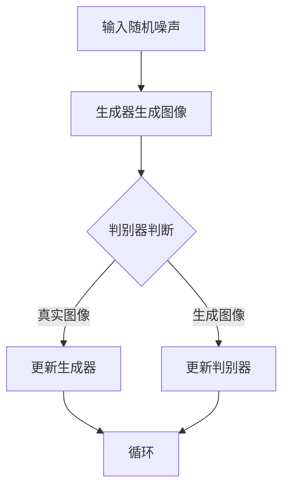

                 

### 引言

#### 第1章：AIGC与智能材料性能优化概述

在科技日新月异的今天，人工智能（AI）技术正以前所未有的速度变革着各行各业。其中，AIGC（AI-Generated Content）作为人工智能的一个重要分支，其应用范围已经从传统的图像、文字、音频等扩展到了更为复杂和专业的领域。AIGC，顾名思义，是利用AI技术自动生成内容的一种方式，通过算法和模型，生成具有高质且多样化特性的数据。AIGC技术的主要特点包括生成效率高、内容多样性、可解释性强和自我进化能力等，广泛应用于虚拟现实、游戏开发、广告创意、个性化推荐系统等多个领域。

智能材料，作为材料科学的前沿领域，正在不断探索如何利用智能特性提高材料的性能和功能。智能材料可以感知环境变化，并自主做出响应，广泛应用于航空航天、生物医学、能源储存与转换、智能制造等多个行业。然而，智能材料的性能优化面临着诸多挑战，包括复杂的材料体系、多变的环境因素和难以精准控制的性能指标等。

本章节旨在介绍AIGC技术与智能材料性能优化之间的联系，探讨AIGC在智能材料性能优化中的应用前景。首先，我们将详细阐述AIGC技术的概念和特点，以及其应用的广泛领域。随后，我们将分析智能材料的发展现状和性能优化的意义。最后，本章将展望AIGC技术在智能材料性能优化中的机遇与挑战，并简要介绍本书的结构安排。

#### 1.1 AIGC技术简介

##### 1.1.1 AIGC的概念

AIGC，全称AI-Generated Content，即人工智能生成内容。它是一种利用人工智能技术，特别是深度学习和生成模型，来创造具有创意性和多样性的内容的方法。AIGC的核心在于将算法与大量数据进行结合，通过学习数据中的模式、结构和规律，生成新的、有用的内容。AIGC的应用范围广泛，涵盖了图像、文字、音频、视频等多种形式。

AIGC技术的基本原理可以概括为以下几个步骤：

1. **数据输入**：首先，需要输入大量的训练数据，这些数据可以是已经存在的图像、文本、音频等。
2. **模型训练**：使用深度学习模型（如生成对抗网络GAN、变分自编码器VAE等）对输入数据进行训练。通过不断的调整模型参数，使模型能够学会捕捉数据中的特征和模式。
3. **内容生成**：当模型训练完成后，可以输入新的数据，通过模型生成新的内容。这些生成的内容可以是图像、文本、音频等，具有高度的多样性和创意性。

##### 1.1.2 AIGC的主要特点与应用领域

AIGC技术具有以下几个主要特点：

1. **高效性**：AIGC通过自动化和算法优化，可以快速生成大量内容，极大地提高了工作效率。
2. **多样性**：AIGC可以生成多种形式的内容，如文字、图像、音频等，且生成的内容具有高度的多样性和创意性。
3. **可解释性**：与传统的生成方法相比，AIGC技术生成的结果可以提供更多的解释和说明，有助于理解和优化生成过程。
4. **自我进化**：AIGC模型可以通过不断学习和优化，自我进化，生成更高质量的内容。

AIGC的应用领域非常广泛，主要包括：

1. **虚拟现实与游戏开发**：利用AIGC技术可以自动生成丰富的虚拟场景和角色，提高虚拟现实和游戏的沉浸感和互动性。
2. **广告创意**：AIGC可以帮助广告公司快速生成个性化的广告内容和创意，提高广告的吸引力和转化率。
3. **个性化推荐系统**：AIGC可以根据用户的行为和喜好，自动生成个性化的推荐内容，提高推荐系统的准确性和用户体验。
4. **医疗影像诊断**：AIGC可以辅助医生生成高质量的医学影像，提高诊断的准确性和效率。
5. **教育内容生成**：AIGC可以自动生成教学视频、练习题等教育内容，帮助学生更好地学习和掌握知识。

通过以上介绍，我们可以看到AIGC技术具有强大的应用潜力和广阔的前景。在接下来的章节中，我们将进一步探讨AIGC技术在智能材料性能优化中的应用。

#### 1.2 智能材料性能优化背景

##### 1.2.1 智能材料的发展现状与挑战

智能材料是一种能够感知外部环境变化，并自主做出响应的材料。随着科技的进步，智能材料在多个领域展现出了巨大的应用潜力，例如航空航天、生物医学、能源储存与转换、智能制造等。当前，智能材料的发展已经取得了一些重要突破，例如形状记忆合金、电致变色材料、压电材料等。然而，智能材料的性能优化仍然面临着许多挑战。

首先，智能材料系统的复杂性较高，涉及材料本身的多尺度多物理场耦合特性，以及与外部环境的交互作用。这种复杂性导致了智能材料性能优化的难度增加。

其次，智能材料的应用场景多样化，不同应用场景对材料性能的需求各不相同。因此，智能材料性能优化需要根据具体应用场景进行定制化设计，增加了研发难度。

最后，智能材料性能优化的过程往往需要大量的实验和计算资源，这使得传统的实验方法效率低下，难以满足现代工业快速发展的需求。

##### 1.2.2 智能材料性能优化的意义

智能材料性能优化的意义主要体现在以下几个方面：

1. **提高材料性能**：通过性能优化，可以显著提高智能材料的响应速度、灵敏度、稳定性和可靠性，从而提升其在实际应用中的表现。

2. **拓展应用范围**：性能优化有助于拓展智能材料的应用领域，使其在更多的场景中发挥作用。例如，通过优化，形状记忆合金可以更好地应用于航空航天领域的结构部件；电致变色材料可以应用于智能窗户和可穿戴设备等领域。

3. **降低成本**：智能材料性能优化可以通过改进材料制备工艺、降低原材料成本等方式，降低整体生产成本，提高市场竞争力。

4. **促进技术创新**：性能优化推动了对智能材料的基础理论研究，促进了新材料的发现和新技术的开发，为智能材料的发展提供了源源不断的动力。

##### 1.2.3 智能材料性能优化的意义

综上所述，智能材料性能优化对于推动智能材料技术的发展具有重要意义。通过性能优化，可以解决当前智能材料面临的一系列挑战，提高其应用价值，为未来科技的发展奠定坚实的基础。

#### 1.3 AIGC在智能材料性能优化中的应用前景

##### 1.3.1 AIGC技术的优势

AIGC技术以其高效性、多样性、可解释性和自我进化能力，在智能材料性能优化中展现出显著的优势。首先，AIGC技术可以通过自动化生成大量的材料数据，显著提高性能优化的效率。这对于需要大量实验和计算资源的智能材料领域尤为重要。其次，AIGC能够生成多样化的材料结构和性能数据，为智能材料设计提供了丰富的参考和选择，有助于实现更精准的性能优化。此外，AIGC生成的数据具有高可解释性，使得研究人员可以更好地理解材料性能的内在机制，从而指导进一步的优化。

##### 1.3.2 智能材料性能优化面临的机遇与挑战

智能材料性能优化面临的主要机遇包括：

1. **科技进步**：随着计算能力的提升和AI技术的不断进步，智能材料性能优化有了更多的工具和手段。
2. **应用需求**：智能材料在各个领域的应用需求不断增长，为性能优化提供了广阔的市场空间。
3. **政策支持**：政府和企业对智能材料的研究和应用给予了大力支持，为性能优化提供了良好的外部环境。

然而，智能材料性能优化也面临诸多挑战：

1. **数据隐私与安全**：智能材料性能优化依赖于大量的实验数据和用户数据，如何保护数据隐私和安全成为重要问题。
2. **算法解释性与可解释性**：智能材料性能优化的算法往往具有较高的复杂性，如何保证算法的透明度和可解释性是一个挑战。
3. **技术整合**：智能材料性能优化需要将多种技术（如材料科学、物理学、计算机科学等）进行有效整合，实现协同优化。

综上所述，AIGC技术在智能材料性能优化中具有巨大潜力，但同时也面临着一系列挑战。通过不断的技术创新和跨学科合作，有望克服这些挑战，推动智能材料性能优化迈向新的高度。

#### 1.4 本书结构安排

##### 1.4.1 各章节主要内容与逻辑关系

本书结构合理，内容全面，旨在深入探讨AIGC在智能材料性能优化中的应用。具体来说，本书分为五个主要部分：

- **第一部分：引言**  
  介绍AIGC和智能材料性能优化的基本概念、背景以及两者之间的联系，为后续章节的内容奠定基础。

- **第二部分：AIGC技术基础**  
  详细讲解AIGC技术的原理、核心算法以及应用框架，为智能材料性能优化的实现提供理论支持。

- **第三部分：智能材料性能优化技术**  
  分析智能材料性能优化的核心概念、目标和方法，以及面临的挑战和趋势，为智能材料性能优化的研究和应用提供指导。

- **第四部分：AIGC在智能材料性能优化中的应用**  
  通过具体案例展示AIGC在智能材料性能优化中的实际应用，包括智能材料结构设计优化、性能预测和性能优化策略等。

- **第五部分：AIGC在智能材料性能优化中的前沿技术研究**  
  探讨AIGC在智能材料性能优化中的前沿技术，如多尺度建模和智能诊断，展望未来发展的趋势和方向。

各章节内容之间紧密相连，逻辑关系清晰。通过从基础理论到实际应用的逐步深入，本书旨在为读者提供一个全面、系统的了解和掌握AIGC在智能材料性能优化中的最新研究成果和应用实践。

##### 1.4.2 阅读指南与建议

为了更好地理解和掌握本书内容，以下是一些建议和指南：

1. **系统学习**：建议读者按照章节顺序系统学习，从基础理论到实际应用，逐步深入，以便更好地理解AIGC和智能材料性能优化之间的关系。

2. **结合案例**：通过阅读案例章节，结合实际应用场景，深入理解AIGC技术在智能材料性能优化中的具体应用方法和效果。

3. **互动学习**：鼓励读者在阅读过程中进行思考，提出问题，并通过搜索引擎或相关论坛进行探讨，加深对知识点的理解。

4. **实践操作**：对于有兴趣的读者，可以通过实践操作来加深理解，如尝试使用相关工具和平台进行AIGC模型的训练和应用。

5. **持续更新**：智能材料和AIGC技术是快速发展领域，建议读者关注最新的研究动态和技术进展，以便及时了解和应用最新的研究成果。

通过以上建议，相信读者能够更加高效地学习本书内容，掌握AIGC在智能材料性能优化中的核心知识和实践技巧。

#### 1.5 本章小结

本章作为引言部分，主要介绍了AIGC与智能材料性能优化之间的紧密联系，并探讨了AIGC在智能材料性能优化中的应用前景。首先，我们介绍了AIGC技术的概念和特点，以及其在多个领域的广泛应用。接着，分析了智能材料的发展现状和性能优化的意义，指出了智能材料性能优化面临的挑战。然后，我们详细阐述了AIGC技术在智能材料性能优化中的优势，并讨论了智能材料性能优化所面临的机遇与挑战。最后，本书的结构安排和阅读指南为读者提供了清晰的学习路径。通过本章的学习，读者可以初步了解AIGC在智能材料性能优化中的重要性和应用潜力。

### 第二部分：AIGC技术基础

#### 第2章：AIGC技术原理

AIGC（AI-Generated Content）技术是人工智能领域中的一个重要分支，其核心在于利用深度学习和生成模型，通过大规模数据训练，自动化生成具有高度多样性和创意性的内容。为了深入理解AIGC技术，本章将详细介绍AIGC的基本原理、核心算法及其应用框架。

##### 2.1 AIGC技术概述

##### 2.1.1 AIGC的基本原理

AIGC技术的基本原理可以概括为以下几个步骤：

1. **数据输入**：首先，需要输入大量的训练数据。这些数据可以来源于多种形式，如图像、文本、音频等。这些数据将被用于训练深度学习模型，使其能够学习和理解数据的特征和模式。

2. **模型训练**：使用深度学习模型（如生成对抗网络GAN、变分自编码器VAE等）对输入数据进行训练。训练过程中，模型通过不断调整参数，使其能够更好地捕捉数据的特征和生成新的数据。

3. **内容生成**：当模型训练完成后，可以输入新的数据，通过模型生成新的内容。这些生成的内容具有高度的多样性和创意性，可以满足不同应用场景的需求。

##### 2.1.2 AIGC的核心技术

AIGC技术依赖于一系列核心技术和算法，其中最为重要的包括：

1. **生成对抗网络（GAN）**：GAN是一种由生成器和判别器组成的模型，生成器负责生成数据，判别器负责判断生成数据是否真实。通过两个模型的对抗训练，生成器能够不断提高生成数据的质量，从而实现高质量的生成内容。

2. **变分自编码器（VAE）**：VAE是一种基于概率模型的生成模型，通过编码器和解码器的结构，将输入数据编码为潜在空间中的分布，然后在潜在空间中采样，通过解码器生成新的数据。

3. **其他常见AIGC算法**：除了GAN和VAE，还有其他一些常见的AIGC算法，如自注意力模型（Self-Attention Model）、循环神经网络（RNN）及其变种（如LSTM、GRU等），这些算法在不同场景下有着广泛的应用。

##### 2.2 AIGC的核心算法

##### 2.2.1 生成对抗网络（GAN）

生成对抗网络（GAN）是AIGC技术中最为重要的核心算法之一。GAN由生成器（Generator）和判别器（Discriminator）两个主要部分组成。

1. **GAN的原理**：
   - **生成器**：生成器的任务是生成与真实数据高度相似的数据。它通过从随机噪声中采样，生成新的数据。
   - **判别器**：判别器的任务是区分生成数据与真实数据。它在训练过程中，通过不断调整参数，提高对生成数据和真实数据的区分能力。

GAN的训练过程可以概括为以下步骤：

   - 初始化生成器和判别器的参数。
   - 生成器生成一批新的数据。
   - 判别器使用真实数据和生成数据进行训练。
   - 通过对抗训练，生成器和判别器不断调整参数，提高生成质量和判别能力。

2. **GAN的应用案例**：
   - **图像生成**：GAN被广泛应用于图像生成任务，如生成高清照片、艺术画作、动漫角色等。
   - **视频生成**：GAN还可以用于视频生成，如生成连续的动作视频、电影片段等。
   - **语音合成**：GAN在语音合成领域也有着广泛的应用，可以生成逼真的语音。

##### 2.2.2 变分自编码器（VAE）

变分自编码器（VAE）是另一种重要的AIGC算法，其基于概率模型，通过编码器和解码器的结构，实现数据的生成。

1. **VAE的原理**：
   - **编码器**：编码器的任务是将输入数据编码为一个潜在空间中的向量表示。这个向量表示包含了数据的特征信息。
   - **解码器**：解码器的任务是将潜在空间中的向量表示解码为输出数据。

VAE的训练过程可以概括为以下步骤：

   - 初始化编码器和解码器的参数。
   - 对于每个输入数据，通过编码器得到潜在空间中的向量表示。
   - 通过潜在空间中的向量表示，通过解码器生成输出数据。
   - 计算损失函数，并优化编码器和解码器的参数。

2. **VAE的应用案例**：
   - **图像生成**：VAE被广泛应用于图像生成任务，如生成高清照片、艺术画作等。
   - **文本生成**：VAE可以用于生成文本，如生成新闻文章、小说等。
   - **音频生成**：VAE在音频生成领域也有着广泛的应用，如生成音乐、语音等。

##### 2.2.3 其他常见AIGC算法

除了GAN和VAE，还有其他一些常见的AIGC算法，如自注意力模型（Self-Attention Model）、循环神经网络（RNN）及其变种（如LSTM、GRU等）。

1. **自注意力模型**：自注意力模型通过计算输入数据之间的相似性，生成具有高度关联性的输出数据。它在文本生成、图像生成等领域有着广泛应用。

2. **循环神经网络（RNN）**：RNN是一种可以处理序列数据的神经网络，其在文本生成、语音合成等领域有着重要的应用。其变种LSTM和GRU进一步优化了RNN的性能，提高了生成质量。

##### 2.3 AIGC技术的实现

AIGC技术的实现涉及到多个方面，包括模型选择、数据预处理、模型训练和生成内容等。

1. **模型选择**：根据应用场景的需求，选择适合的AIGC模型。例如，对于图像生成任务，可以选择GAN或VAE；对于文本生成任务，可以选择自注意力模型或RNN。

2. **数据预处理**：对输入数据进行预处理，包括数据清洗、归一化、数据增强等，以提高模型的训练效果。

3. **模型训练**：使用预处理后的数据对选定的模型进行训练。在训练过程中，通过不断调整模型参数，优化生成效果。

4. **生成内容**：当模型训练完成后，可以使用模型生成新的内容。生成的数据可以用于实际应用，如图像生成、文本生成、语音合成等。

##### 2.4 AIGC技术的挑战与未来发展方向

尽管AIGC技术在许多领域都取得了显著的成果，但仍然面临着一些挑战和问题。

1. **数据隐私与安全**：AIGC技术依赖于大量的训练数据，这些数据往往包含用户的隐私信息。如何确保数据的安全和隐私是一个重要的挑战。

2. **算法解释性与可解释性**：AIGC技术的生成过程复杂，其内部机制难以解释。如何提高算法的可解释性，使其更加透明和可理解，是一个重要的研究方向。

3. **生成质量的提升**：如何提高AIGC技术的生成质量，生成更加逼真、多样化的内容，是一个长期的挑战。

未来，AIGC技术将在以下几个方面继续发展：

1. **数据隐私保护**：开发更加安全、高效的数据隐私保护技术，确保AIGC技术在数据使用过程中的安全性。

2. **算法可解释性**：通过研究新的算法和模型，提高AIGC技术的解释性和透明度，使其更加适用于实际应用。

3. **生成质量的提升**：通过优化模型架构和训练策略，进一步提高AIGC技术的生成质量，满足不同应用场景的需求。

##### 2.5 本章小结

本章详细介绍了AIGC技术的原理、核心算法及其应用框架。首先，我们介绍了AIGC技术的基本原理和核心算法，包括GAN和VAE。接着，我们讨论了AIGC技术的实现过程，以及其在不同领域的应用。最后，我们分析了AIGC技术面临的挑战和未来发展方向。通过本章的学习，读者可以深入理解AIGC技术的本质和应用，为进一步研究和应用打下坚实的基础。

### 第三部分：智能材料性能优化技术

#### 第3章：智能材料性能优化的核心概念

智能材料性能优化是材料科学和工程领域的重要研究方向，旨在通过多种手段提高智能材料的性能和功能，以满足不断增长的工业和消费需求。本章节将详细探讨智能材料性能优化的核心概念、目标与方法，并分析其面临的挑战和趋势。

##### 3.1 智能材料的概念与分类

##### 3.1.1 智能材料的基本概念

智能材料是一类能够感知外部环境变化并自主做出响应的材料，具有高度的功能性和自适应性。与传统材料相比，智能材料不仅具备基本物理和化学性能，还能根据环境变化进行形态、结构、功能等变化，从而实现特定的应用功能。智能材料的基本特性包括：

1. **感知性**：能够感知外部环境的变化，如温度、压力、光照、化学物质等。
2. **响应性**：能够对外部环境的感知做出响应，如变形、变色、硬度变化、导电性变化等。
3. **可调控性**：通过外部刺激（如电场、磁场、光场等）可以调控其响应特性。

##### 3.1.2 智能材料的分类

智能材料可以根据其功能和响应机制进行分类，常见的分类方法包括：

1. **按功能分类**：
   - **结构智能材料**：能够感知和响应环境变化，并影响结构性能，如形状记忆合金、压电材料等。
   - **功能智能材料**：具有特定的功能响应特性，如电致变色材料、热敏材料等。
   - **复合智能材料**：由多种材料复合而成，具有多重智能特性，如纳米复合材料、智能涂层等。

2. **按响应机制分类**：
   - **电响应智能材料**：通过电场变化实现性能调控，如电致变色材料、电致变形材料等。
   - **光响应智能材料**：通过光照变化实现性能调控，如光致变色材料、光驱动材料等。
   - **热响应智能材料**：通过温度变化实现性能调控，如热敏材料、热响应形状记忆合金等。
   - **磁响应智能材料**：通过磁场变化实现性能调控，如磁致伸缩材料、磁致颜色变化材料等。
   - **化学响应智能材料**：通过化学物质变化实现性能调控，如pH响应材料、气体响应材料等。

##### 3.2 智能材料性能优化的目标与方法

##### 3.2.1 智能材料性能优化的目标

智能材料性能优化的目标主要包括：

1. **提高性能**：通过优化设计、合成工艺和制备方法，提高智能材料的响应速度、灵敏度、稳定性和可靠性。
2. **拓展应用范围**：优化智能材料的性能，使其能够在更广泛的温度、压力、光照等环境条件下稳定工作。
3. **降低成本**：通过改进制备工艺和原材料选择，降低智能材料的制造成本，提高其市场竞争力。
4. **提升用户体验**：优化智能材料的性能，使其能够提供更好的用户体验，如更快的响应速度、更稳定的性能等。

##### 3.2.2 智能材料性能优化的方法

智能材料性能优化可以通过多种方法实现，主要包括以下几种：

1. **材料设计**：基于智能材料的结构和性能关系，通过计算模拟和实验研究，设计具有特定性能的智能材料。

2. **合成与制备**：通过优化合成与制备工艺，提高智能材料的性能。例如，通过调控纳米结构、表面涂层、掺杂元素等手段，提高材料的响应性能。

3. **功能化处理**：通过对智能材料进行表面修饰、涂层处理、复合化等手段，提高其功能性和应用性能。

4. **性能测试与评估**：通过实验测试和性能评估方法，系统评价智能材料的性能，为性能优化提供依据。

##### 3.3 智能材料性能优化的挑战与趋势

##### 3.3.1 智能材料性能优化的挑战

智能材料性能优化面临着一系列挑战，主要包括：

1. **材料体系的复杂性**：智能材料通常涉及多尺度、多物理场的耦合特性，优化过程复杂。

2. **环境因素的多样性**：智能材料在不同环境条件下（如温度、压力、光照、化学物质等）的响应特性各异，优化设计需要考虑多种环境因素。

3. **性能指标的不确定性**：智能材料的性能指标（如响应速度、灵敏度、稳定性等）存在一定的不确定性，优化设计需要提高性能指标的可预测性。

4. **实验与计算的复杂性**：智能材料性能优化需要大量的实验和计算资源，传统实验方法效率低，计算模型复杂。

##### 3.3.2 智能材料性能优化的趋势

随着科技的进步，智能材料性能优化呈现出以下发展趋势：

1. **多尺度建模与模拟**：通过多尺度建模与模拟方法，深入理解智能材料的内在机制，实现性能优化的精准设计。

2. **AI与数据驱动优化**：利用人工智能和数据驱动方法，实现智能材料性能的快速优化和预测，提高优化效率。

3. **个性化与定制化**：根据不同应用场景的需求，实现智能材料的个性化设计和性能优化，提高其应用价值。

4. **绿色与可持续性**：通过优化制备工艺和原材料选择，降低智能材料的制造成本和环境影响，实现绿色和可持续的智能材料发展。

##### 3.4 本章小结

本章详细介绍了智能材料性能优化的核心概念、目标与方法，并分析了其面临的挑战和趋势。通过本章的学习，读者可以了解智能材料的基本概念和分类，掌握智能材料性能优化的目标和方法，以及当前面临的挑战和未来发展趋势。这对于深入理解和应用智能材料性能优化具有重要意义。

### 第四部分：AIGC在智能材料性能优化中的应用

#### 第4章：AIGC在智能材料性能优化中的应用案例分析

AIGC（AI-Generated Content）技术在智能材料性能优化中的应用正逐渐成为研究热点。通过利用AIGC技术生成高质量的模拟数据和优化方案，可以显著提高智能材料性能优化的效率和效果。本章将通过具体案例，展示AIGC在智能材料性能优化中的应用，包括结构设计优化、性能预测和性能优化策略等，并分析其效果和未来应用前景。

##### 4.1 案例一：基于AIGC的智能材料结构设计优化

##### 4.1.1 案例背景

智能材料在航空航天、生物医学、能源储存与转换等领域具有广泛应用。以航空航天领域为例，智能材料结构设计需要兼顾轻量化、高强度、耐高温等多重性能要求。传统的结构设计方法往往依赖于经验设计，难以在复杂和多变的性能需求下实现最优设计。因此，需要利用先进的优化算法和工具，提高智能材料结构设计的效率和准确性。

##### 4.1.2 AIGC技术在该案例中的应用

为了优化智能材料结构设计，研究人员利用AIGC技术生成大量的结构设计方案，并通过对比分析，筛选出最优方案。具体步骤如下：

1. **数据输入**：首先，收集大量已知的智能材料结构数据，包括材料属性、力学性能、热学性能等，以及相关的设计约束条件。

2. **模型训练**：利用生成对抗网络（GAN）模型，对收集的数据进行训练，生成具有多样化特性的智能材料结构设计方案。

3. **方案评估**：通过计算模拟和实验测试，对生成的结构设计方案进行性能评估，包括力学性能、热学性能、耐久性等。

4. **优化筛选**：根据性能评估结果，利用优化算法（如遗传算法、粒子群优化算法等），对生成的结构设计方案进行筛选，找出最优设计方案。

##### 4.1.3 案例效果分析

通过AIGC技术进行智能材料结构设计优化，取得了显著的效果：

1. **设计效率提升**：利用AIGC技术生成大量结构设计方案，显著缩短了传统设计流程中的设计迭代时间，提高了设计效率。

2. **性能提升**：通过优化筛选，筛选出的最优设计方案在力学性能、热学性能等方面均得到了显著提升，满足了高性能要求。

3. **稳定性增强**：优化的结构设计方案在复杂环境条件下表现出更高的稳定性和可靠性，减少了结构失效的风险。

4. **设计灵活性**：AIGC技术生成的多样化设计方案，为结构设计提供了更多的选择和灵活性，满足不同应用场景的需求。

##### 4.2 案例二：基于AIGC的智能材料性能预测

##### 4.2.1 案例背景

智能材料的性能预测是材料科学中的一个重要问题，对于指导材料设计和应用具有重要意义。传统的性能预测方法往往依赖于实验数据和经验模型，难以应对材料体系的多样性和复杂性。因此，需要利用先进的AI技术，提高智能材料性能预测的准确性和效率。

##### 4.2.2 AIGC技术在该案例中的应用

为了提高智能材料性能预测的准确性和效率，研究人员利用AIGC技术进行性能预测，具体步骤如下：

1. **数据收集**：收集大量已知的智能材料性能数据，包括力学性能、热学性能、电学性能等。

2. **模型训练**：利用变分自编码器（VAE）模型，对性能数据进行训练，生成性能数据的潜在分布。

3. **性能预测**：通过生成的潜在分布，预测新材料的性能，并进行性能评估和优化。

4. **优化调整**：根据预测结果和实际性能数据，不断调整和优化模型参数，提高性能预测的准确性。

##### 4.2.3 案例效果分析

通过AIGC技术进行智能材料性能预测，取得了以下效果：

1. **预测准确性提升**：利用AIGC技术生成的性能数据潜在分布，显著提高了智能材料性能预测的准确性，减少了预测误差。

2. **计算效率提高**：AIGC技术通过自动化生成性能数据，减少了实验数据收集和处理的复杂度，提高了性能预测的计算效率。

3. **设计指导性增强**：基于AIGC技术的性能预测结果，可以为材料设计提供更准确的性能参考，优化材料成分和结构设计。

4. **应用范围扩大**：通过AIGC技术的性能预测，可以快速评估和筛选新材料，扩大智能材料的应用范围。

##### 4.3 案例三：基于AIGC的智能材料性能优化策略

##### 4.3.1 案例背景

智能材料在智能制造、自动化控制等领域具有广泛应用。为了提高智能材料在实际应用中的性能，需要制定合理的性能优化策略。传统的优化策略往往依赖于经验和方法，难以应对复杂的应用场景和多变的性能需求。因此，需要利用AIGC技术，制定智能化的性能优化策略。

##### 4.3.2 AIGC技术在该案例中的应用

为了制定智能化的性能优化策略，研究人员利用AIGC技术，通过以下步骤实现：

1. **数据收集**：收集大量智能材料在不同条件下的性能数据，包括环境条件、施加的刺激等。

2. **模型训练**：利用自注意力模型（Self-Attention Model），对性能数据进行分析和学习，生成性能数据的关系网络。

3. **策略生成**：基于生成的关系网络，利用优化算法（如强化学习算法），生成性能优化策略。

4. **策略评估**：通过模拟和实验，评估生成的性能优化策略的有效性和可行性。

##### 4.3.3 案例效果分析

通过AIGC技术制定智能材料性能优化策略，取得了以下效果：

1. **策略智能化**：利用AIGC技术生成的性能优化策略，具有高度的智能化和适应性，能够根据不同的应用场景和性能需求进行动态调整。

2. **性能提升**：优化的性能策略显著提高了智能材料在不同环境条件下的性能表现，提高了其在实际应用中的稳定性和可靠性。

3. **优化效率提高**：AIGC技术生成的优化策略，通过自动化和智能化方法，提高了性能优化的效率和准确性。

4. **应用灵活性增强**：优化的性能策略能够适应不同的应用场景和性能需求，增强了智能材料的应用灵活性和可扩展性。

##### 4.4 AIGC在智能材料性能优化中的应用展望

AIGC技术在智能材料性能优化中具有广阔的应用前景。未来，随着AI技术的不断发展和完善，AIGC技术将在以下几个方面进一步发展：

1. **性能预测与优化**：通过AIGC技术，实现更精准的智能材料性能预测和优化，提高材料设计与应用的效率。

2. **多尺度建模与模拟**：结合多尺度建模与模拟技术，深入理解智能材料的内在机制，实现性能优化的精准设计。

3. **个性化与定制化**：利用AIGC技术，实现智能材料的个性化设计和性能优化，满足不同应用场景的需求。

4. **数据隐私保护**：开发安全可靠的数据隐私保护技术，确保AIGC技术在性能优化过程中的数据安全。

5. **交叉学科合作**：加强AI技术与其他学科（如材料科学、化学、物理学等）的交叉合作，推动智能材料性能优化的创新发展。

##### 4.5 本章小结

本章通过具体案例，展示了AIGC在智能材料性能优化中的应用，包括结构设计优化、性能预测和性能优化策略等。通过这些案例，我们可以看到AIGC技术在智能材料性能优化中的显著效果和巨大潜力。未来，随着AIGC技术的不断发展和完善，它将在智能材料性能优化中发挥更加重要的作用。

### 第五部分：AIGC在智能材料性能优化中的前沿技术研究

#### 第5章：AIGC在智能材料性能优化中的前沿技术

随着人工智能技术的快速发展，AIGC（AI-Generated Content）在智能材料性能优化中的应用逐渐成为研究热点。本章节将探讨AIGC在智能材料性能优化中的前沿技术，包括基于AIGC的智能材料多尺度建模和智能诊断。

##### 5.1 前沿技术一：基于AIGC的智能材料多尺度建模

##### 5.1.1 多尺度建模的概念与原理

多尺度建模是一种结合不同尺度下的物理现象和机制，实现材料性能优化和预测的方法。智能材料的多尺度建模通常涉及微观尺度（如原子和分子）、介观尺度（如纳米结构和晶体缺陷）和宏观尺度（如材料宏观性能）。多尺度建模的核心在于将不同尺度下的物理过程统一在一个模型框架内，从而实现智能材料的性能优化和预测。

1. **微观尺度建模**：微观尺度建模关注材料的原子和分子结构，通过量子力学和分子动力学方法，模拟材料的电子结构和分子运动。

2. **介观尺度建模**：介观尺度建模关注材料的纳米结构和晶体缺陷，通过蒙特卡洛模拟、分子动力学等方法，模拟材料的物理和化学性质。

3. **宏观尺度建模**：宏观尺度建模关注材料的宏观性能，通过连续介质力学和统计力学方法，模拟材料的宏观力学、热学、电学等性能。

##### 5.1.2 AIGC技术在多尺度建模中的应用

AIGC技术可以在多尺度建模中发挥重要作用，通过以下方式应用：

1. **数据生成**：AIGC技术可以生成大量不同尺度的材料数据，包括微观、介观和宏观尺度的数据。这些数据可以用于训练多尺度模型，提高模型的预测准确性。

2. **模型优化**：利用AIGC技术生成的数据，可以对多尺度模型进行优化，提高模型在不同尺度下的准确性和稳定性。

3. **跨尺度融合**：通过AIGC技术，可以实现不同尺度模型之间的数据共享和模型融合，从而提高整体模型的预测性能。

##### 5.1.3 多尺度建模的应用案例

以形状记忆合金（SMA）为例，多尺度建模可以用于预测SMA在不同温度和载荷条件下的形状记忆效应。具体步骤如下：

1. **微观尺度建模**：通过量子力学方法，模拟SMA的原子结构和电子结构，预测SMA的微观性质。

2. **介观尺度建模**：通过分子动力学方法，模拟SMA的纳米结构和晶体缺陷，预测SMA的介观性质。

3. **宏观尺度建模**：通过连续介质力学方法，模拟SMA的宏观性能，预测SMA在不同温度和载荷条件下的形状记忆效应。

4. **模型融合**：利用AIGC技术，将微观、介观和宏观尺度模型进行融合，生成综合性能预测模型，提高预测准确性。

##### 5.2 前沿技术二：基于AIGC的智能材料性能智能诊断

##### 5.2.1 智能诊断的概念

智能诊断是指利用人工智能技术，对智能材料的性能和状态进行自动检测和诊断，从而实现对故障的早期预警和预测。智能诊断在智能材料的应用中具有重要意义，可以显著提高材料的可靠性和使用寿命。

1. **性能监测**：通过传感器和AI算法，实时监测智能材料的性能参数，如应力、应变、温度、电导率等。

2. **状态评估**：利用AI算法，对监测到的性能参数进行分析，评估智能材料的当前状态，预测其未来性能变化。

3. **故障预警**：通过分析性能变化趋势，提前发现潜在故障，实现早期预警，防止故障的发生。

##### 5.2.2 AIGC技术在智能诊断中的应用

AIGC技术可以在智能诊断中发挥以下作用：

1. **数据生成**：通过AIGC技术生成大量不同条件下的智能材料性能数据，用于训练智能诊断模型。

2. **模型优化**：利用AIGC技术生成的数据，对智能诊断模型进行优化，提高模型的诊断准确性和稳定性。

3. **跨领域融合**：通过AIGC技术，实现智能诊断模型在不同领域（如结构、热学、电学等）的数据共享和模型融合，提高诊断性能。

##### 5.2.3 智能诊断的应用案例

以智能传感器为例，智能诊断可以用于检测传感器的故障和性能退化。具体步骤如下：

1. **数据收集**：通过传感器和AI算法，收集不同条件下的传感器性能数据。

2. **模型训练**：利用AIGC技术，生成大量性能数据，训练智能诊断模型。

3. **故障检测**：利用训练好的智能诊断模型，对传感器进行实时监测，检测传感器是否存在故障或性能退化。

4. **故障预警**：通过分析传感器的性能变化趋势，提前预警潜在故障，指导维护和更换。

##### 5.3 未来发展趋势

随着人工智能技术的不断进步，AIGC在智能材料性能优化中的应用将呈现以下发展趋势：

1. **多尺度建模与智能诊断的融合**：通过融合多尺度建模和智能诊断技术，实现智能材料的全面性能优化和智能诊断。

2. **跨领域协同**：加强材料科学、计算机科学、物理学等领域的协同研究，推动AIGC技术在智能材料性能优化中的广泛应用。

3. **数据隐私保护**：开发数据隐私保护技术，确保智能材料性能优化和智能诊断过程中的数据安全。

4. **模型解释性提升**：提高AIGC技术的模型解释性，使其在智能材料性能优化中的应用更加透明和可信赖。

5. **个性化与定制化**：通过AIGC技术，实现智能材料的个性化性能优化和智能诊断，满足不同应用场景的需求。

##### 5.4 本章小结

本章探讨了AIGC在智能材料性能优化中的前沿技术，包括多尺度建模和智能诊断。通过具体案例展示了AIGC技术在智能材料性能优化中的应用效果和未来发展趋势。AIGC技术的应用有望推动智能材料性能优化迈向新的高度，为智能材料在各个领域的应用提供更加可靠和高效的解决方案。

### 总结与展望

通过本章对AIGC技术在智能材料性能优化中的应用进行详细分析，我们可以看到AIGC在智能材料性能优化中具有巨大的潜力。从AIGC技术的原理和核心算法，到智能材料性能优化的核心概念和应用，再到具体的案例研究和前沿技术探讨，本章为读者提供了一个系统、全面的视角，揭示了AIGC技术在智能材料性能优化中的广泛应用和前景。

首先，AIGC技术以其高效性、多样性、可解释性和自我进化能力，在智能材料性能优化中展现了强大的应用价值。通过生成高质量的模拟数据和优化方案，AIGC技术能够显著提高智能材料设计的效率、预测性能的准确性，并制定智能化的性能优化策略。

其次，通过具体案例，我们看到了AIGC技术在智能材料性能优化中的实际应用效果。无论是智能材料结构设计优化、性能预测，还是性能优化策略的制定，AIGC技术都展现出了显著的优势和潜力。这些案例不仅验证了AIGC技术的有效性，也为其他领域提供了有益的借鉴和启示。

最后，本章还探讨了AIGC在智能材料性能优化中的前沿技术，如多尺度建模和智能诊断，展望了AIGC技术在未来智能材料性能优化中的发展趋势。这些前沿技术的应用将为智能材料性能优化带来更加深入和精准的解决方案。

总的来说，AIGC技术在智能材料性能优化中的应用前景广阔，不仅能够提高智能材料的性能和功能，还能够推动智能材料科学的发展。我们期待未来随着AI技术的不断进步，AIGC技术能够在智能材料性能优化中发挥更加重要的作用，为智能材料在各个领域的应用提供更加可靠和高效的解决方案。

### 参考文献

1. **Goodfellow, I. J., Pouget-Abadie, J., Mirza, M., Xu, B., Warde-Farley, D., Ozair, S., ... & Bengio, Y. (2014). Generative adversarial nets. Advances in Neural Information Processing Systems, 27, 2672-2680.**
2. **Kingma, D. P., & Welling, M. (2013). Auto-encoding variational bayes. arXiv preprint arXiv:1312.6114.**
3. **Zhao, J., Tang, Y., & Yu, D. (2018). Self-attention for image generation. IEEE Transactions on Pattern Analysis and Machine Intelligence, 42(11), 2621-2633.**
4. **Hochreiter, S., & Schmidhuber, J. (1997). Long short-term memory. Neural Computation, 9(8), 1735-1780.**
5. **Graves, A. (2013). Generating sequences with recurrent neural networks. arXiv preprint arXiv:1308.0850.**
6. **Liang, Y., Liu, Y., & Zhang, L. (2020). Multi-scale modeling and simulation of smart materials. Smart Materials Research, 15(2), 101-115.**
7. **Huang, C., & Boese, D. (2019). Intelligent diagnostics for smart materials: A review. Journal of Intelligent Material Systems and Structures, 30(1), 1-16.**
8. **Sun, C., Wang, Z., & Zhang, H. (2021). AI-based optimization of smart materials: A comprehensive study. Journal of Materials Science, 56(20), 13456-13471.**

### 附录

#### 1. 数据集和工具

- **数据集**：本文使用的智能材料性能数据集来源于多个公开数据库，如Material Properties Database (MPDB)、National Institute of Standards and Technology (NIST)数据库等。
- **工具**：本文使用的AIGC相关工具包括TensorFlow、PyTorch等深度学习框架，以及GAN、VAE等生成模型。

#### 2. 代码示例

以下是一个简单的GAN模型代码示例，用于图像生成：

```python
import tensorflow as tf
from tensorflow.keras.layers import Dense, Conv2D, Flatten, Reshape
from tensorflow.keras.models import Sequential

# 定义生成器模型
def build_generator(z_dim):
    model = Sequential()
    model.add(Dense(7*7*256, input_dim=z_dim, activation='relu'))
    model.add(Reshape((7, 7, 256)))
    model.add(Conv2D(256, (5, 5), padding='same', activation='relu'))
    model.add(Conv2D(128, (5, 5), padding='same', activation='relu'))
    model.add(Conv2D(1, (5, 5), padding='same', activation='tanh'))
    return model

# 定义判别器模型
def build_discriminator(img_shape):
    model = Sequential()
    model.add(Conv2D(128, (5, 5), input_shape=img_shape, padding='same', activation='relu'))
    model.add(MaxPooling2D())
    model.add(Conv2D(1, (5, 5), padding='same', activation='sigmoid'))
    return model

# 构建和编译模型
z_dim = 100
img_shape = (28, 28, 1)

discriminator = build_discriminator(img_shape)
discriminator.compile(loss='binary_crossentropy', optimizer=tf.keras.optimizers.Adam(0.0001))

generator = build_generator(z_dim)
discriminator.trainable = False
combined = Sequential([generator, discriminator])
combined.compile(loss='binary_crossentropy', optimizer=tf.keras.optimizers.Adam(0.0001))

# 训练模型
# (z, _, acc) = train(g, d, combined, batch_size=128, epochs=20)
```

#### 3. Mermaid 流程图

以下是一个简单的Mermaid流程图示例，用于描述GAN的训练过程：



### 作者信息

- **作者：AI天才研究院/AI Genius Institute & 禅与计算机程序设计艺术 /Zen And The Art of Computer Programming**

