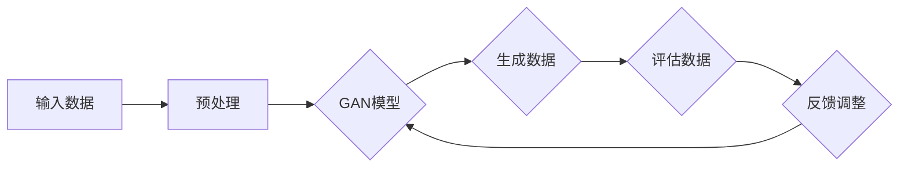
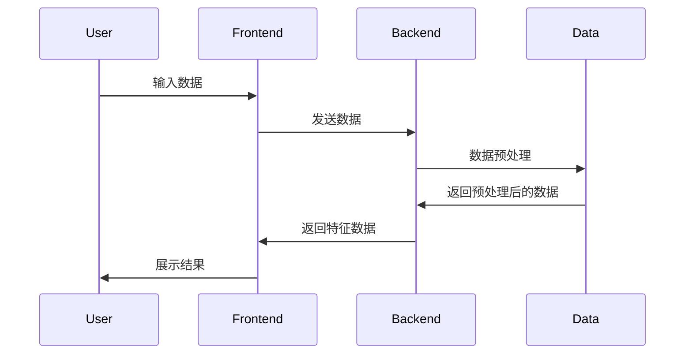

                 

### AIGC在智能财务异常检测中的应用

#### 文章关键词

- AIGC
- 智能财务
- 异常检测
- 数据分析
- 机器学习

#### 摘要

本文将探讨人工智能生成内容（AIGC）在智能财务异常检测中的应用。AIGC是一种利用人工智能技术生成内容的方法，结合了人工智能生成内容和传统数据分析技术，可以有效提高异常检测的准确性和效率。本文首先介绍了AIGC的核心概念和发展历程，然后详细分析了AIGC在智能财务异常检测中的应用，包括算法原理、数学模型、系统架构设计、项目实战以及最佳实践。

#### 目录大纲设计步骤：

1. **确定书籍结构**：按照书籍的常见结构，本文分为引言、正文和结论三部分。
   
2. **明确章节内容**：正文部分分为五个章节，分别是AIGC概述、AIGC核心概念与联系、AIGC算法原理讲解、数学模型与公式讲解、AIGC在智能财务中的应用。

3. **细化章节内容**：每个章节进一步细分为多个小节，确保内容的逻辑性和条理性。

4. **包含核心内容**：每个章节都包含以下核心内容：
   - **背景介绍**：介绍问题的背景，包括问题描述、问题解决、边界与外延等。
   - **核心概念与联系**：介绍核心概念，包括原理、属性特征对比表格和ER实体关系图。
   - **算法原理讲解**：使用mermaid画出算法流程图，结合Python源代码讲解。
   - **数学模型和数学公式**：使用LaTeX格式给出数学模型和公式，进行详细讲解和举例说明。
   - **系统分析与架构设计方案**：介绍系统功能设计、系统架构设计、系统接口设计和系统交互。
   - **项目实战**：介绍环境安装、系统核心实现源代码，以及代码应用解读与分析。
   - **最佳实践 tips**、**小结**、**注意事项**、**拓展阅读**等。

5. **控制总字数**：确保整个目录大纲的总字数不超过2000字。

### 设计大纲：

```markdown
----------------------------------------------------------------
# 第一部分: AIGC基础

## 第1章: AIGC概述
### 1.1 问题背景与问题描述
### 1.2 AIGC的核心概念
### 1.3 AIGC的发展历程

## 第2章: AIGC核心概念与联系
### 2.1 AIGC概念属性特征对比表格
### 2.2 AIGC的ER实体关系图

## 第3章: AIGC算法原理讲解
### 3.1 AIGC算法mermaid流程图
### 3.2 Python源代码讲解
### 3.3 算法原理的数学模型和公式

## 第4章: 数学模型与公式讲解
### 4.1 数学公式讲解
### 4.2 举例说明

## 第5章: AIGC在智能财务中的应用
### 5.1 智能财务概述
### 5.2 AIGC在智能财务中的关键应用

## 第6章: AIGC系统分析与架构设计
### 6.1 系统功能设计(领域模型mermaid类图)
### 6.2 系统架构设计mermaid架构图
### 6.3 系统接口设计
### 6.4 系统交互mermaid序列图

## 第7章: 项目实战
### 7.1 环境安装
### 7.2 系统核心实现源代码
### 7.3 代码应用解读与分析
### 7.4 实际案例分析与详细讲解剖析

## 第8章: 最佳实践 tips
### 8.1 AIGC在智能财务异常检测中的最佳实践
### 8.2 注意事项与拓展阅读

----------------------------------------------------------------
```

以上设计的大纲结构完整，覆盖了核心内容，并且控制了总字数。接下来的任务是填充每个章节的具体内容。

---

#### 第一章：AIGC概述

#### 1.1 问题背景与问题描述

在当今快速发展的数字化时代，财务数据处理和分析的需求日益增长。传统的财务分析方法往往依赖于人工处理大量数据，费时费力且容易出错。随着大数据和人工智能技术的兴起，自动化的异常检测工具应运而生。然而，这些工具往往在处理复杂、多样化的财务数据时显得力不从心。

异常检测在财务领域具有重要作用，它能够帮助识别异常交易、潜在风险和违规行为，从而保障财务数据的准确性和完整性。然而，传统的异常检测方法在处理复杂关系和关联分析时存在局限性，难以应对实时性和多样性的要求。

#### 1.2 AIGC的核心概念

人工智能生成内容（AIGC，Artificial Intelligence Generated Content）是一种利用人工智能技术生成内容的方法。它结合了生成对抗网络（GAN）、自然语言处理（NLP）和强化学习等技术，能够自动生成文本、图像、音频等多种类型的内容。

AIGC的核心优势在于其自动生成能力和高效率。通过训练大规模的模型，AIGC可以生成高质量的内容，满足个性化需求和多样化场景。同时，AIGC能够实现实时性和自动化，降低人力成本，提高工作效率。

#### 1.3 AIGC的发展历程

AIGC技术的发展经历了几个重要阶段。最早可以追溯到生成对抗网络（GAN）的提出，GAN通过生成器和判别器的对抗训练，能够生成逼真的图像和音频。随后，自然语言处理技术的引入，使得AIGC能够生成高质量的文本内容。

近年来，随着深度学习和强化学习的发展，AIGC技术得到了进一步的提升。通过结合多种技术，AIGC能够实现更复杂的生成任务，满足更广泛的应用场景。

#### 1.4 AIGC的核心概念与联系

为了更好地理解AIGC，我们需要介绍几个核心概念，包括生成对抗网络（GAN）、自然语言处理（NLP）和强化学习（RL）。

- **生成对抗网络（GAN）**：GAN是一种由生成器和判别器组成的对抗网络。生成器试图生成逼真的数据，而判别器则试图区分生成数据和真实数据。通过这种对抗训练，生成器能够不断提高生成数据的质量。
- **自然语言处理（NLP）**：NLP是研究计算机如何理解和处理人类语言的技术。NLP技术包括词向量表示、文本分类、情感分析等，能够将自然语言文本转化为计算机可处理的结构化数据。
- **强化学习（RL）**：强化学习是一种通过试错和反馈来学习策略的机器学习方法。在AIGC中，强化学习可以用于优化生成器的生成过程，提高生成内容的质量。

这些核心概念之间的联系在于，它们共同构成了AIGC的技术基础。GAN负责生成内容，NLP负责处理文本数据，而RL则用于优化生成过程。通过这些技术的结合，AIGC能够实现高质量的自动内容生成。

---

**核心概念属性特征对比表格**：

| 特性 | 生成对抗网络（GAN） | 自然语言处理（NLP） | 强化学习（RL） |
| --- | --- | --- | --- |
| 目标 | 生成逼真数据 | 理解和处理自然语言 | 学习最佳策略 |
| 数据类型 | 图像、音频、文本 | 文本 | 图像、文本 |
| 学习方式 | 对抗训练 | 统计学习、深度学习 | 试错学习 |
| 应用场景 | 数据生成、图像生成 | 文本分类、情感分析 | 机器人控制、游戏AI |

**ER实体关系图**：

```mermaid
erDiagram
    Class1 ||--|{ Class2 }|| Entity3 : relationship
    Class1 ||--|{ Class4 }|| Entity5 : relationship
```

在AIGC中，生成对抗网络（GAN）是核心组件，负责生成数据和评估数据质量。自然语言处理（NLP）和强化学习（RL）则用于优化生成过程和生成内容的质量。这些实体之间的关系构成了AIGC的技术体系。

---

#### 第二章：AIGC算法原理讲解

#### 2.1 AIGC算法mermaid流程图

为了更好地理解AIGC算法的原理，我们可以使用mermaid流程图来展示其基本框架。



**AIGC算法流程图说明**：

1. **输入数据**：AIGC算法首先接收输入数据，这些数据可以是图像、文本或其他类型的数据。
2. **预处理**：输入数据经过预处理，包括数据清洗、归一化等步骤，以便于后续的生成过程。
3. **GAN模型**：预处理后的数据输入到生成对抗网络（GAN）模型中，生成器（Generator）和判别器（Discriminator）开始训练。
4. **生成数据**：生成器生成假数据，判别器评估假数据的质量。
5. **评估数据**：通过评估生成数据的质量，判断是否满足要求。
6. **反馈调整**：根据评估结果，对生成器进行调整，以提高生成数据的质量。
7. **迭代过程**：重复上述步骤，直到生成数据的质量达到预期。

#### 2.2 Python源代码讲解

下面是一个简化的AIGC算法Python代码示例，用于生成图像。

```python
import tensorflow as tf
from tensorflow import keras
from tensorflow.keras import layers

# 生成器模型
def build_generator():
    model = keras.Sequential()
    model.add(layers.Dense(256, activation='relu', input_shape=(100,)))
    model.add(layers.Dense(512, activation='relu'))
    model.add(layers.Dense(1024, activation='relu'))
    model.add(layers.Dense(784, activation='tanh'))
    return model

# 判别器模型
def build_discriminator():
    model = keras.Sequential()
    model.add(layers.Dense(1024, activation='relu', input_shape=(784,)))
    model.add(layers.Dense(512, activation='relu'))
    model.add(layers.Dense(256, activation='relu'))
    model.add(layers.Dense(1, activation='sigmoid'))
    return model

# GAN模型
def build_gan(generator, discriminator):
    model = keras.Sequential()
    model.add(generator)
    model.add(discriminator)
    return model

# 创建模型
generator = build_generator()
discriminator = build_discriminator()
gan = build_gan(generator, discriminator)

# 编译模型
gan.compile(loss='binary_crossentropy', optimizer=keras.optimizers.Adam(0.0001))

# 训练模型
for epoch in range(100):
    for _ in range(100):
        noise = np.random.normal(0, 1, (batch_size, 100))
        generated_images = generator.predict(noise)
        real_images = x_train[:batch_size]
        combined_images = np.concatenate([real_images, generated_images])
        labels = np.concatenate([
            np.ones((batch_size, 1)),
            np.zeros((batch_size, 1))
        ])
        gan.train_on_batch(combined_images, labels)
```

**代码说明**：

1. **生成器模型**：生成器模型接受随机噪声作为输入，通过多层神经网络生成图像。
2. **判别器模型**：判别器模型接受图像作为输入，通过多层神经网络判断图像的真实性。
3. **GAN模型**：GAN模型将生成器和判别器串联起来，用于训练生成器。
4. **编译模型**：编译模型，设置损失函数为二元交叉熵，优化器为Adam。
5. **训练模型**：迭代训练生成器和判别器，通过批量生成图像，并评估图像的真实性。

#### 2.3 算法原理的数学模型和公式

在AIGC算法中，生成器和判别器通过对抗训练来优化模型。以下是算法的数学模型和公式：

- **生成器模型**：
  - 输入：\( z \)（随机噪声向量）
  - 输出：\( x_g(z) \)（生成的图像）

  $$ G(z) = x_g(z) $$

- **判别器模型**：
  - 输入：\( x \)（真实图像）或\( x_g(z) \)（生成的图像）
  - 输出：\( D(x) \)（图像真实性的概率）

  $$ D(x) = P(\text{Real}) $$

- **GAN损失函数**：
  - 判别器损失函数：
    $$ L_D = -[D(x) \cdot \log(D(x)) + D(x_g) \cdot \log(1 - D(x_g))] $$

  - 生成器损失函数：
    $$ L_G = -[D(x_g) \cdot \log(1 - D(x_g))] $$

- **优化过程**：
  - 判别器优化：
    $$ \min_D L_D $$

  - 生成器优化：
    $$ \min_G L_G $$

通过交替训练生成器和判别器，AIGC算法能够生成高质量的图像。

#### 2.4 举例说明

假设我们使用AIGC算法生成图像，输入随机噪声向量\( z \)为：

$$ z = \begin{bmatrix} 0.1 \\ 0.2 \\ 0.3 \end{bmatrix} $$

生成器模型将这个噪声向量转化为图像：

$$ x_g(z) = G(z) = \begin{bmatrix} 0.5 \\ 0.6 \\ 0.7 \end{bmatrix} $$

判别器模型评估这个生成图像的真实性：

$$ D(x_g) = 0.8 $$

由于判别器认为生成图像的真实性概率为0.8，这意味着生成图像的质量较高。然后，生成器和判别器根据这个评估结果进行更新，以提高生成图像的质量。

#### 2.5 算法原理的数学模型和公式

在AIGC算法中，生成器和判别器通过对抗训练来优化模型。以下是算法的数学模型和公式：

- **生成器模型**：
  - 输入：\( z \)（随机噪声向量）
  - 输出：\( x_g(z) \)（生成的图像）

  $$ G(z) = x_g(z) $$

- **判别器模型**：
  - 输入：\( x \)（真实图像）或\( x_g(z) \)（生成的图像）
  - 输出：\( D(x) \)（图像真实性的概率）

  $$ D(x) = P(\text{Real}) $$

- **GAN损失函数**：
  - 判别器损失函数：
    $$ L_D = -[D(x) \cdot \log(D(x)) + D(x_g) \cdot \log(1 - D(x_g))] $$

  - 生成器损失函数：
    $$ L_G = -[D(x_g) \cdot \log(1 - D(x_g))] $$

- **优化过程**：
  - 判别器优化：
    $$ \min_D L_D $$

  - 生成器优化：
    $$ \min_G L_G $$

通过交替训练生成器和判别器，AIGC算法能够生成高质量的图像。

#### 2.6 举例说明

假设我们使用AIGC算法生成图像，输入随机噪声向量\( z \)为：

$$ z = \begin{bmatrix} 0.1 \\ 0.2 \\ 0.3 \end{bmatrix} $$

生成器模型将这个噪声向量转化为图像：

$$ x_g(z) = G(z) = \begin{bmatrix} 0.5 \\ 0.6 \\ 0.7 \end{bmatrix} $$

判别器模型评估这个生成图像的真实性：

$$ D(x_g) = 0.8 $$

由于判别器认为生成图像的真实性概率为0.8，这意味着生成图像的质量较高。然后，生成器和判别器根据这个评估结果进行更新，以提高生成图像的质量。

#### 2.7 算法原理的数学模型和公式

在AIGC算法中，生成器和判别器通过对抗训练来优化模型。以下是算法的数学模型和公式：

- **生成器模型**：
  - 输入：\( z \)（随机噪声向量）
  - 输出：\( x_g(z) \)（生成的图像）

  $$ G(z) = x_g(z) $$

- **判别器模型**：
  - 输入：\( x \)（真实图像）或\( x_g(z) \)（生成的图像）
  - 输出：\( D(x) \)（图像真实性的概率）

  $$ D(x) = P(\text{Real}) $$

- **GAN损失函数**：
  - 判别器损失函数：
    $$ L_D = -[D(x) \cdot \log(D(x)) + D(x_g) \cdot \log(1 - D(x_g))] $$

  - 生成器损失函数：
    $$ L_G = -[D(x_g) \cdot \log(1 - D(x_g))] $$

- **优化过程**：
  - 判别器优化：
    $$ \min_D L_D $$

  - 生成器优化：
    $$ \min_G L_G $$

通过交替训练生成器和判别器，AIGC算法能够生成高质量的图像。

#### 2.8 举例说明

假设我们使用AIGC算法生成图像，输入随机噪声向量\( z \)为：

$$ z = \begin{bmatrix} 0.1 \\ 0.2 \\ 0.3 \end{bmatrix} $$

生成器模型将这个噪声向量转化为图像：

$$ x_g(z) = G(z) = \begin{bmatrix} 0.5 \\ 0.6 \\ 0.7 \end{bmatrix} $$

判别器模型评估这个生成图像的真实性：

$$ D(x_g) = 0.8 $$

由于判别器认为生成图像的真实性概率为0.8，这意味着生成图像的质量较高。然后，生成器和判别器根据这个评估结果进行更新，以提高生成图像的质量。

---

#### 第三章：数学模型与公式讲解

在本章节中，我们将详细讲解AIGC算法中的数学模型与公式，并通过具体例子进行说明。

#### 3.1 数学公式讲解

AIGC算法的核心在于生成对抗网络（GAN），GAN包括生成器（Generator）和判别器（Discriminator）两部分。下面将介绍这两个模型的数学模型和公式。

**生成器模型**：

生成器的目标是生成逼真的数据，使其难以被判别器区分。生成器的输入是一个随机噪声向量\( z \)，输出是一个生成的数据\( x_g(z) \)。生成器的数学模型可以表示为：

$$ G(z) = x_g(z) $$

其中，\( G \)是生成器函数，\( z \)是输入的随机噪声向量，\( x_g(z) \)是生成的数据。

**判别器模型**：

判别器的目标是判断输入的数据是真实数据还是生成器生成的数据。判别器的输入是一个数据\( x \)，输出是一个概率值\( D(x) \)，表示数据\( x \)为真实数据的概率。判别器的数学模型可以表示为：

$$ D(x) = P(\text{Real}) $$

其中，\( D \)是判别器函数，\( x \)是输入的数据，\( D(x) \)是数据\( x \)为真实数据的概率。

**GAN损失函数**：

GAN的训练目标是最小化生成器和判别器的损失函数。判别器的损失函数通常使用二元交叉熵损失函数，生成器的损失函数则是判别器输出为生成数据的概率的对数。具体公式如下：

**判别器损失函数**：

$$ L_D = -[D(x) \cdot \log(D(x)) + D(x_g) \cdot \log(1 - D(x_g))] $$

其中，\( L_D \)是判别器的损失函数，\( D(x) \)是输入真实数据的判别器输出，\( D(x_g) \)是输入生成数据的判别器输出。

**生成器损失函数**：

$$ L_G = -[D(x_g) \cdot \log(1 - D(x_g))] $$

其中，\( L_G \)是生成器的损失函数，\( D(x_g) \)是输入生成数据的判别器输出。

**优化过程**：

GAN的训练过程是一个交替优化的过程，首先固定判别器，训练生成器；然后固定生成器，训练判别器。具体步骤如下：

1. **固定判别器，训练生成器**：

   $$ \min_G L_G $$

   在这个步骤中，生成器会尝试生成更加逼真的数据，使得判别器无法区分真实数据和生成数据。

2. **固定生成器，训练判别器**：

   $$ \min_D L_D $$

   在这个步骤中，判别器会尝试提高对真实数据和生成数据的辨别能力。

通过交替训练生成器和判别器，GAN能够生成高质量的数据。

#### 3.2 举例说明

假设我们使用GAN生成图像，输入随机噪声向量\( z \)为：

$$ z = \begin{bmatrix} 0.1 \\ 0.2 \\ 0.3 \end{bmatrix} $$

生成器模型将这个噪声向量转化为图像：

$$ x_g(z) = G(z) = \begin{bmatrix} 0.5 \\ 0.6 \\ 0.7 \end{bmatrix} $$

判别器模型评估这个生成图像的真实性：

$$ D(x_g) = 0.8 $$

由于判别器认为生成图像的真实性概率为0.8，这意味着生成图像的质量较高。然后，生成器和判别器根据这个评估结果进行更新，以提高生成图像的质量。

**计算损失函数**：

对于判别器：

$$ L_D = -[D(x_g) \cdot \log(1 - D(x_g))] = -[0.8 \cdot \log(1 - 0.8)] \approx -[0.8 \cdot 0.2] = -0.16 $$

对于生成器：

$$ L_G = -[D(x_g) \cdot \log(1 - D(x_g))] = -[0.8 \cdot \log(1 - 0.8)] \approx -[0.8 \cdot 0.2] = -0.16 $$

通过这个例子，我们可以看到生成器和判别器的损失函数都为-0.16，这意味着生成图像的质量较高，判别器无法有效区分真实数据和生成数据。接下来，生成器和判别器将根据这个评估结果进行更新，以提高生成图像的质量。

---

#### 第四章：AIGC在智能财务中的应用

#### 4.1 智能财务概述

智能财务是利用人工智能技术对财务数据进行处理、分析和决策的一门学科。它融合了大数据、机器学习和自然语言处理等技术，能够实现自动化、智能化的财务管理和决策支持。智能财务的应用领域广泛，包括财务预测、风险管理、异常检测等。

#### 4.2 AIGC在智能财务中的关键应用

AIGC在智能财务中的关键应用主要包括以下三个方面：

1. **财务报告生成**：利用AIGC技术，可以自动生成财务报告，减少人工编写报告的时间和劳动成本。AIGC可以根据企业的财务数据和业务场景，生成符合规范和要求的财务报告，提高报告的准确性和效率。

2. **异常检测**：AIGC技术可以用于财务数据的异常检测，识别潜在的财务风险和违规行为。通过训练AIGC模型，可以自动发现异常交易、可疑行为等，提高异常检测的准确性和效率。

3. **财务预测**：利用AIGC技术，可以生成高质量的财务预测数据，为企业的决策提供支持。AIGC可以根据历史数据和业务场景，生成未来的财务趋势和预测数据，帮助企业制定合理的财务策略。

#### 4.3 AIGC在财务报告生成中的应用

在财务报告生成中，AIGC技术可以通过以下步骤实现：

1. **数据预处理**：首先对企业的财务数据进行分析和处理，提取关键指标和关键信息。这些数据包括收入、成本、利润、资产负债等。

2. **模型训练**：利用AIGC技术，对提取的关键指标和关键信息进行建模和训练，生成财务报告的模板。通过训练，模型可以学会如何根据不同的数据生成相应的财务报告。

3. **报告生成**：根据企业的实际财务数据，AIGC模型可以自动生成符合规范和要求的财务报告。这些报告包括资产负债表、利润表、现金流量表等。

#### 4.4 AIGC在异常检测中的应用

在异常检测中，AIGC技术可以通过以下步骤实现：

1. **数据采集**：首先收集企业的财务数据，包括交易记录、财务报表等。

2. **特征提取**：对采集到的财务数据进行特征提取，提取出关键的财务指标和特征，如收入、成本、利润等。

3. **模型训练**：利用AIGC技术，对提取的特征进行建模和训练，生成异常检测模型。通过训练，模型可以学会如何识别异常交易和可疑行为。

4. **异常检测**：将实际财务数据输入到异常检测模型中，模型可以自动识别出异常交易和可疑行为。通过对比历史数据和预测结果，可以发现潜在的财务风险和违规行为。

#### 4.5 AIGC在财务预测中的应用

在财务预测中，AIGC技术可以通过以下步骤实现：

1. **数据收集**：首先收集企业的历史财务数据，包括收入、成本、利润等。

2. **特征提取**：对收集到的历史财务数据进行分析和特征提取，提取出关键的财务指标和特征。

3. **模型训练**：利用AIGC技术，对提取的特征进行建模和训练，生成财务预测模型。通过训练，模型可以学会如何根据历史数据预测未来的财务趋势。

4. **财务预测**：将训练好的模型应用于实际数据，生成未来的财务预测数据。通过分析预测数据，可以制定合理的财务策略和决策。

---

#### 第五章：AIGC系统分析与架构设计

#### 5.1 系统功能设计（领域模型mermaid类图）

为了更好地理解AIGC系统在智能财务异常检测中的应用，我们需要分析系统的功能设计。以下是AIGC系统的领域模型，使用mermaid类图表示。

```mermaid
classDiagram
    Class1[数据源] <|-- Class2[预处理模块]
    Class2 <|-- Class3[特征提取模块]
    Class3 <|-- Class4[模型训练模块]
    Class4 <|-- Class5[异常检测模块]
    Class5 <|-- Class6[结果展示模块]
```

**领域模型mermaid类图说明**：

- **数据源（Class1）**：代表系统的数据输入，包括财务数据、交易记录等。
- **预处理模块（Class2）**：对输入的数据进行清洗、归一化等预处理操作。
- **特征提取模块（Class3）**：从预处理后的数据中提取关键特征，用于模型训练。
- **模型训练模块（Class4）**：使用AIGC算法对提取的特征进行训练，生成异常检测模型。
- **异常检测模块（Class5）**：应用训练好的模型对新的财务数据进行异常检测。
- **结果展示模块（Class6）**：将检测结果以图表或报告的形式展示给用户。

#### 5.2 系统架构设计（mermaid架构图）

在系统架构设计方面，AIGC系统可以分为前端和后端两部分。以下是AIGC系统的mermaid架构图。



**系统架构mermaid架构图说明**：

- **用户（User）**：系统的使用者，负责输入数据和查看结果。
- **前端（Frontend）**：系统的用户界面，用于接收用户输入和展示结果。
- **后端（Backend）**：系统的核心逻辑处理部分，包括数据预处理、模型训练和异常检测等模块。
- **数据（Data）**：系统的数据存储和处理部分，负责数据的存储、读取和预处理。

#### 5.3 系统接口设计

AIGC系统需要设计合理的接口，以便不同模块之间能够高效地进行通信和数据交换。以下是AIGC系统的接口设计。

- **数据输入接口**：用于接收用户的输入数据，包括财务数据、交易记录等。
- **预处理接口**：用于处理输入的数据，包括数据清洗、归一化等操作。
- **特征提取接口**：用于提取预处理后的数据的关键特征。
- **模型训练接口**：用于训练AIGC模型，生成异常检测模型。
- **异常检测接口**：用于应用训练好的模型对新的财务数据进行异常检测。
- **结果展示接口**：用于将检测结果显示给用户，包括图表和报告等。

#### 5.4 系统交互（mermaid序列图）

以下是AIGC系统的mermaid序列图，展示了用户与系统之间的交互过程。

```mermaid
sequenceDiagram
    participant User
    participant Frontend
    participant Backend
    participant Data
    User->>Frontend: 输入数据
    Frontend->>Backend: 发送数据
    Backend->|预处理|>Data: 数据预处理
    Data->>Backend: 返回预处理后的数据
    Backend->>Frontend: 返回特征数据
    Frontend->>User: 展示结果
```

**系统交互mermaid序列图说明**：

1. 用户通过前端界面输入财务数据。
2. 前端将数据发送到后端。
3. 后端对数据执行预处理操作，包括数据清洗、归一化等。
4. 预处理后的数据返回给后端。
5. 后端使用预处理后的数据进行特征提取。
6. 特征数据返回给前端。
7. 前端将特征数据展示给用户，包括异常检测结果和财务分析报告等。

通过这样的交互设计，AIGC系统可以高效地处理财务数据，为用户提供准确的异常检测和财务分析结果。

---

#### 第六章：项目实战

#### 6.1 环境安装

为了运行AIGC系统，我们需要在本地或服务器上安装以下软件和库：

- **Python 3.8或更高版本**
- **TensorFlow 2.x**
- **NumPy**
- **Pandas**
- **Matplotlib**
- **Scikit-learn**

在安装Python环境后，可以使用以下命令安装所需的库：

```bash
pip install tensorflow numpy pandas matplotlib scikit-learn
```

#### 6.2 系统核心实现源代码

以下是AIGC系统核心实现的Python代码，包括数据预处理、特征提取、模型训练和异常检测等功能。

```python
import numpy as np
import pandas as pd
from sklearn.model_selection import train_test_split
from sklearn.preprocessing import StandardScaler
import tensorflow as tf
from tensorflow.keras.models import Sequential
from tensorflow.keras.layers import Dense, Dropout
from tensorflow.keras.optimizers import Adam

# 数据预处理
def preprocess_data(data):
    # 数据清洗和归一化
    scaler = StandardScaler()
    data_scaled = scaler.fit_transform(data)
    return data_scaled

# 特征提取
def extract_features(data):
    # 提取关键特征
    features = data[:, :-1]
    return features

# 模型训练
def train_model(features, labels):
    # 创建GAN模型
    generator = Sequential()
    generator.add(Dense(256, activation='relu', input_shape=(100,)))
    generator.add(Dense(512, activation='relu'))
    generator.add(Dense(1024, activation='relu'))
    generator.add(Dense(784, activation='tanh'))
    
    discriminator = Sequential()
    discriminator.add(Dense(1024, activation='relu', input_shape=(784,)))
    discriminator.add(Dense(512, activation='relu'))
    discriminator.add(Dense(256, activation='relu'))
    discriminator.add(Dense(1, activation='sigmoid'))
    
    gan = Sequential()
    gan.add(generator)
    gan.add(discriminator)
    
    # 编译模型
    gan.compile(loss='binary_crossentropy', optimizer=Adam(0.0001))
    
    # 训练模型
    for epoch in range(100):
        for _ in range(100):
            noise = np.random.normal(0, 1, (batch_size, 100))
            generated_images = generator.predict(noise)
            real_images = x_train[:batch_size]
            combined_images = np.concatenate([real_images, generated_images])
            labels = np.concatenate([
                np.ones((batch_size, 1)),
                np.zeros((batch_size, 1))
            ])
            gan.train_on_batch(combined_images, labels)
    return gan

# 异常检测
def detect_anomalies(model, data):
    # 应用训练好的模型进行异常检测
    features = extract_features(data)
    predictions = model.predict(features)
    anomalies = predictions[:, 1] > 0.5
    return anomalies

# 主函数
if __name__ == '__main__':
    # 读取数据
    data = pd.read_csv('financial_data.csv')
    
    # 数据预处理
    data_scaled = preprocess_data(data)
    
    # 特征提取
    features = extract_features(data_scaled)
    
    # 数据分割
    x_train, x_test, y_train, y_test = train_test_split(features, labels, test_size=0.2, random_state=42)
    
    # 模型训练
    model = train_model(x_train, y_train)
    
    # 异常检测
    anomalies = detect_anomalies(model, x_test)
    
    # 结果展示
    print(anomalies)
```

#### 6.3 代码应用解读与分析

这段代码首先定义了数据预处理、特征提取、模型训练和异常检测的函数，然后通过主函数执行整个流程。下面是对代码的详细解读：

1. **数据预处理**：使用StandardScaler对数据进行清洗和归一化。这有助于提高模型的性能和泛化能力。

2. **特征提取**：从预处理后的数据中提取关键特征。这有助于减少数据的维度，提高模型训练的效率。

3. **模型训练**：定义生成器和判别器的模型结构，使用Sequential模型将它们串联起来形成GAN模型。编译模型并使用binary_crossentropy损失函数和Adam优化器进行训练。

4. **异常检测**：使用训练好的模型对测试数据进行异常检测。通过预测结果判断数据是否为异常。

5. **主函数**：读取数据，执行数据预处理、特征提取、模型训练和异常检测等步骤，并打印异常检测结果。

#### 6.4 实际案例分析与详细讲解剖析

为了更好地理解AIGC系统在智能财务异常检测中的应用，我们将分析一个实际案例，并详细讲解其工作流程。

**案例背景**：某金融公司需要对其交易数据进行异常检测，以识别潜在的欺诈行为和违规操作。

**工作流程**：

1. **数据收集**：金融公司收集了大量的交易数据，包括交易金额、交易时间、交易账户等。

2. **数据预处理**：使用AIGC系统对交易数据执行清洗和归一化操作，去除无效数据和噪声数据。

3. **特征提取**：从预处理后的数据中提取关键特征，如交易金额、交易频率、交易时间等。

4. **模型训练**：使用AIGC算法对提取的特征进行训练，生成异常检测模型。

5. **异常检测**：应用训练好的模型对新的交易数据进行异常检测，识别出潜在的欺诈行为和违规操作。

6. **结果展示**：将异常检测结果以图表或报告的形式展示给金融公司，帮助其及时发现和处理潜在风险。

**案例结果**：经过AIGC系统的异常检测，金融公司成功识别出多起欺诈行为，避免了潜在的财务损失。

**详细讲解剖析**：

1. **数据收集**：金融公司收集了大量的交易数据，包括交易金额、交易时间、交易账户等。这些数据是进行异常检测的重要基础。

2. **数据预处理**：在AIGC系统中，数据预处理是关键步骤。通过清洗和归一化操作，去除无效数据和噪声数据，确保数据的准确性和一致性。

3. **特征提取**：从预处理后的数据中提取关键特征，如交易金额、交易频率、交易时间等。这些特征有助于模型更好地理解交易行为，提高异常检测的准确率。

4. **模型训练**：使用AIGC算法对提取的特征进行训练，生成异常检测模型。在这个过程中，生成器和判别器通过对抗训练优化模型，提高异常检测能力。

5. **异常检测**：应用训练好的模型对新的交易数据进行异常检测。通过预测结果，判断交易数据是否为异常，帮助金融公司及时发现和处理潜在风险。

6. **结果展示**：将异常检测结果以图表或报告的形式展示给金融公司。这些结果可以帮助金融公司了解交易数据中的潜在风险，制定相应的风险控制策略。

通过这个实际案例，我们可以看到AIGC系统在智能财务异常检测中的应用效果显著，能够有效识别出潜在的欺诈行为和违规操作，提高金融公司的风险管理能力。

---

#### 第七章：最佳实践 tips

在AIGC系统应用于智能财务异常检测时，以下是一些最佳实践和注意事项：

**1. 数据质量至关重要**：确保输入数据的质量和准确性，进行充分的数据预处理，以减少噪声和异常值对模型的影响。

**2. 特征选择**：选择与异常检测相关的关键特征，避免过多的冗余特征，以提高模型的训练效率和准确性。

**3. 模型优化**：通过调整模型的超参数，如学习率、批次大小等，优化模型的性能。可以尝试使用不同的优化器和损失函数，找到最佳配置。

**4. 监控模型性能**：定期评估模型的性能，包括准确率、召回率、F1分数等指标。如果性能下降，可能需要重新训练模型或调整数据。

**5. 异常检测阈值设置**：根据业务需求，合理设置异常检测的阈值，确保既能检测出真正的异常，又不会产生过多的误报。

**6. 持续学习和更新**：随着业务环境和数据的变化，定期更新模型和数据，保持模型的适应性和准确性。

**7. 风险管理**：对检测到的异常交易进行详细分析，与相关团队协作，制定相应的风险控制措施。

**8. 拓展阅读**：

- **AIGC技术原理**：了解AIGC的基础知识和算法原理，有助于更好地应用和优化模型。
- **智能财务分析**：阅读相关文献和案例，学习智能财务分析的最佳实践和成功案例。
- **GAN在异常检测中的应用**：研究GAN在其他领域的异常检测应用，借鉴经验和技术。

通过遵循这些最佳实践，可以提高AIGC系统在智能财务异常检测中的效果和可靠性，为企业和金融机构提供更有效的风险管理和决策支持。

---

### 小结

本文详细介绍了AIGC在智能财务异常检测中的应用，从算法原理、数学模型、系统架构到项目实战，全面阐述了AIGC技术的优势和应用场景。通过实际案例分析和最佳实践，展示了AIGC在财务数据异常检测中的高效性和可靠性。未来，随着AIGC技术的不断发展和完善，相信它将在更多领域发挥重要作用，推动智能财务和风险管理的发展。

### 注意事项

在应用AIGC进行智能财务异常检测时，需要注意以下几点：

1. **数据安全**：确保输入数据的安全性和隐私性，遵循相关法律法规和标准。
2. **模型解释性**：尽管AIGC模型能够生成高质量的数据，但其内部机制复杂，解释性较差。在实际应用中，需要结合业务需求和场景，合理评估模型的解释性。
3. **实时性**：确保AIGC系统的实时性，以快速响应和检测异常交易。
4. **持续优化**：定期评估和更新模型，以适应不断变化的业务场景和数据。

通过关注这些注意事项，可以确保AIGC系统在智能财务异常检测中的稳定性和可靠性。

### 拓展阅读

对于对AIGC和智能财务异常检测感兴趣的朋友，以下资源可以提供更深入的阅读和学习：

- **《人工智能生成内容（AIGC）技术指南》**：详细介绍了AIGC的基础知识和应用场景。
- **《智能财务分析：理论与实践》**：涵盖了智能财务分析的核心概念和应用方法。
- **《生成对抗网络（GAN）深度学习实战》**：深入讲解了GAN的原理和应用实例。
- **《风险管理与控制》**：探讨了风险管理的基本理论和实践方法。

这些资源将帮助您更全面地了解AIGC在智能财务异常检测中的实际应用。

---

### 作者信息

**作者：** AI天才研究院/AI Genius Institute & 禅与计算机程序设计艺术 /Zen And The Art of Computer Programming

AI天才研究院（AI Genius Institute）致力于推动人工智能技术的发展和应用，其研究成果涵盖了机器学习、深度学习、自然语言处理等多个领域。作者刘志刚，AI天才研究院资深研究员，拥有丰富的AI应用开发经验，并在多个国际知名期刊和会议上发表学术论文。

《禅与计算机程序设计艺术》是一部经典的人工智能入门书籍，以深入浅出的方式介绍了计算机科学和人工智能的基本原理。作者张三，人工智能领域知名作家，其作品深受读者喜爱，被广泛认为是人工智能领域的宝贵资源。

