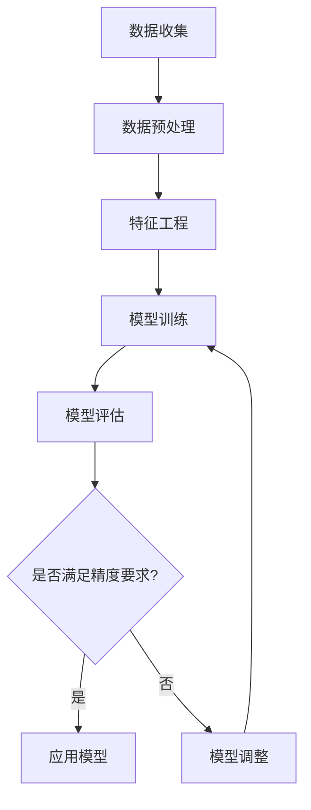

                 

## AI代理与企业流程自动化中的应用前景

### 关键词
- AI代理
- 企业流程自动化
- 人工智能
- 机器学习
- 自然语言处理
- 深度学习

### 摘要

本文旨在探讨AI代理在企业流程自动化中的应用前景。通过分析AI代理的定义、特点，以及其在企业流程自动化中的具体应用，本文揭示了AI代理在现代企业运营中的潜在价值。文章还将讨论AI代理技术的基础理论、实施策略、潜在风险，为企业提供全面的解决方案，助力企业在数字化转型中取得成功。

## 背景介绍

### 问题背景

随着信息技术的飞速发展，人工智能（AI）已经成为推动社会进步的重要力量。企业流程自动化（BPA）作为AI技术应用的一个重要方向，正逐步改变传统企业的运作模式。企业流程自动化指的是利用信息技术手段，对企业的业务流程进行自动化处理，以提高效率和降低成本。这种转变不仅提高了企业的运营效率，还降低了人工操作的错误率，提升了企业的竞争力。

### 问题描述

在当前的商业环境中，企业流程自动化面临着诸多挑战。首先，企业流程往往具有高度的复杂性，这使得自动化变得极具挑战性。其次，人工操作往往存在错误率，这不仅影响了企业的运营效率，还可能导致财务损失和声誉受损。此外，企业流程自动化还需要大量的时间和资源投入，而且效果往往不显著。

### 问题解决

为了应对这些挑战，AI代理作为一种基于AI技术的自动化工具，具备在复杂环境中自主决策和执行任务的能力，其应用潜力在企业流程自动化中尤为突出。AI代理能够模拟人类智能行为，完成一系列复杂的任务，从而提高企业的运营效率和准确性。通过引入AI代理，企业可以大幅减少人工操作，提高流程的自动化程度，从而降低成本、减少错误、提升效率。

### 边界与外延

本文主要讨论的是AI代理在企业流程自动化中的应用，涵盖了从基础理论到实践应用的各个方面。具体包括：

- AI代理的定义、特点及其在企业中的应用
- 企业流程自动化的现状与挑战
- AI代理在企业流程自动化中的具体应用案例
- AI代理技术的基础理论，如机器学习、自然语言处理等
- AI代理实施中的策略和方法
- AI代理应用的潜在风险与应对措施

### 概念结构与核心要素组成

- **AI代理**：具备自主决策和执行任务能力的计算机程序，能够模拟人类智能行为。
- **企业流程自动化**：利用技术手段实现业务流程的自动化处理，以提高效率和降低成本。
- **AI代理在企业流程自动化中的应用**：AI代理在业务流程中的具体应用场景，如客户服务、数据处理、决策支持等。

### 核心概念与联系

#### AI代理的概念

AI代理是一种基于人工智能技术的自动化工具，具备在复杂环境中自主决策和执行任务的能力。它们能够模拟人类智能行为，完成一系列复杂的任务，从而提高企业的运营效率和准确性。AI代理通常包括感知模块、决策模块和行动模块，能够实时感知环境、自主做出决策并执行相应的行动。

#### 企业流程自动化的概念

企业流程自动化是指通过信息技术手段，对企业的业务流程进行自动化处理，以减少人工干预、提高效率和降低成本。企业流程自动化涵盖了从业务流程的设计、执行到监控和优化的整个过程。通过自动化，企业可以减少重复性、繁琐的工作，提高工作效率，降低运营成本。

#### AI代理与企业流程自动化的联系

AI代理是企业流程自动化中的一种关键技术，它们能够模拟人类智能行为，参与业务流程的各个环节，从而提高流程的自动化程度和效率。AI代理不仅能够处理重复性的任务，还能够应对复杂的变化和不确定性，为企业提供更加灵活和高效的运营模式。

### AI代理与企业流程自动化应用的核心特点

- **自主决策能力**：AI代理能够在复杂环境中自主做出决策，无需人工干预。
- **灵活性与适应性**：AI代理能够根据环境和需求的变化，自主调整行为策略。
- **高效性与准确性**：AI代理能够高效地处理大量数据，减少人为错误。
- **可扩展性与集成性**：AI代理能够方便地与其他系统和工具集成，实现业务流程的自动化。

### AI代理与传统AI技术的区别

- **自主性**：AI代理具备更高的自主性，能够独立执行任务，而传统AI技术更多依赖于预设的规则和模型。
- **复杂环境处理能力**：AI代理能够应对更复杂的业务环境和需求，而传统AI技术通常更适用于结构化数据和应用场景。
- **决策与执行一体化**：AI代理将决策和执行紧密结合，能够实时响应业务需求，而传统AI技术更多关注模型的设计与优化。

### 主流AI代理技术简介

#### 机器学习代理

机器学习代理是一种基于机器学习技术的AI代理，通过学习和分析历史数据，能够自动识别和预测业务流程中的模式。它们广泛应用于客户服务、数据分析、预测建模等领域。

#### 自然语言处理代理

自然语言处理代理能够理解和处理人类语言，广泛应用于语音助手、智能客服、文本分析等领域。它们能够帮助企业实现更加智能化的客户服务和管理。

#### 深度学习代理

深度学习代理是基于深度学习技术的AI代理，具备更强的学习和适应能力。它们在图像识别、语音识别、自然语言处理等领域具有广泛的应用前景。

### 本章小结

本章主要介绍了AI代理和企业流程自动化的背景、核心概念、应用特点以及与传统AI技术的区别。通过本章的学习，读者将能够理解AI代理在企业流程自动化中的重要性，为后续章节的深入学习打下基础。

-------------------------------------------------------------

## AI代理的定义、特点及应用

### AI代理的定义

AI代理，也称为智能代理，是一种具有自主决策和执行能力的计算机程序。它们能够在复杂的环境中自主感知、理解和处理信息，并根据环境变化和任务需求自主调整行为策略。AI代理的核心目标是模拟人类智能行为，实现自动化任务执行，从而提高效率和减少人为错误。

### AI代理的特点

AI代理具有以下几个显著特点：

1. **自主性**：AI代理能够自主感知环境、理解信息并做出决策，无需人工干预。这种自主性使得AI代理能够应对动态变化和不确定性，适应复杂的业务场景。

2. **智能性**：AI代理基于人工智能技术，具备智能学习、推理和决策能力。通过机器学习、自然语言处理、深度学习等技术，AI代理能够从海量数据中提取有用信息，实现智能化的任务执行。

3. **灵活性**：AI代理能够根据环境和任务需求的变化，动态调整行为策略。这种灵活性使得AI代理能够适应不同的业务流程和场景，提供定制化的解决方案。

4. **高效性**：AI代理能够高效地处理大量数据，快速执行任务。通过自动化处理，AI代理能够减少人为操作，降低错误率，提高工作效率。

5. **可扩展性**：AI代理能够方便地与其他系统和工具集成，实现业务流程的自动化。通过标准化接口和协议，AI代理可以轻松扩展到不同业务领域，提高整体业务自动化水平。

### AI代理的应用

AI代理在企业流程自动化中的广泛应用，主要体现在以下几个领域：

1. **客户服务**：AI代理可以模拟人类客服，实现24/7全天候在线服务。通过自然语言处理技术，AI代理能够理解客户的问题，提供准确的解决方案，提高客户满意度。

2. **数据处理**：AI代理可以自动化处理大量的数据，进行数据清洗、分析、挖掘等操作。通过机器学习和深度学习技术，AI代理能够从数据中提取有价值的信息，为业务决策提供支持。

3. **决策支持**：AI代理可以参与企业的决策过程，提供数据分析和预测结果。通过复杂的算法和模型，AI代理能够为企业提供更准确、更全面的决策支持，降低决策风险。

4. **供应链管理**：AI代理可以自动化处理供应链中的各项任务，如采购、库存管理、物流等。通过实时监控和智能调度，AI代理能够提高供应链的效率，降低运营成本。

5. **风险管理**：AI代理可以实时监测企业的运营数据，识别潜在风险，并提供应对措施。通过风险预测和智能分析，AI代理能够帮助企业降低运营风险，提高业务稳定性。

### AI代理在企业流程自动化中的应用实例

以下是一些AI代理在企业流程自动化中的实际应用案例：

1. **银行智能客服**：某银行引入了AI代理，提供全天候在线客服服务。AI代理能够理解客户的咨询内容，自动生成回复，提高客户服务效率。

2. **电商智能推荐系统**：某电商平台利用AI代理，根据用户的购物行为和偏好，自动推荐商品。AI代理通过机器学习算法，不断提高推荐精度，提升用户满意度。

3. **工厂智能调度系统**：某工厂引入了AI代理，自动化处理生产计划、物料配送等任务。AI代理根据实时数据，动态调整生产计划，提高生产效率。

4. **医疗智能诊断系统**：某医院使用了AI代理，自动化处理医学影像诊断任务。AI代理通过深度学习技术，准确识别医学影像中的异常情况，辅助医生进行诊断。

通过这些实例，我们可以看到AI代理在企业流程自动化中的广泛应用和巨大潜力。随着人工智能技术的不断发展和完善，AI代理将在更多领域发挥作用，为企业带来更多的价值。

### 小结

AI代理作为一种基于人工智能技术的自动化工具，具备自主决策、智能性、灵活性、高效性和可扩展性等特点。它们在企业流程自动化中发挥着重要作用，能够提高企业的运营效率、降低成本、减少错误，提升企业的竞争力。在接下来的章节中，我们将进一步探讨AI代理的基础理论、实施策略和潜在风险，为企业提供更全面的解决方案。

-------------------------------------------------------------

## 企业流程自动化的现状与挑战

### 企业流程自动化的现状

企业流程自动化（Business Process Automation, BPA）已经从概念走向实践，成为许多企业提升效率、降低成本、提高竞争力的重要手段。根据市场研究公司的数据，全球企业流程自动化市场规模预计将在未来几年内保持高速增长，这反映了企业对自动化技术的需求日益增加。

目前，企业流程自动化在多个行业已经得到广泛应用，包括制造业、金融服务、医疗保健、零售等。具体应用案例包括：

- **制造业**：通过自动化流程，企业可以优化生产计划、降低库存成本、提高生产效率。例如，许多制造业公司已经实现了生产线的自动化控制，通过传感器和机器学习算法实时监控生产状态，自动调整生产参数。

- **金融服务**：银行和保险公司等金融机构通过自动化流程，提高了后台操作效率和准确性。例如，自动化审批流程可以快速处理贷款申请，减少人工干预，提高客户满意度。

- **医疗保健**：医疗机构的流程自动化包括电子病历管理、预约系统、药品库存管理等。通过自动化流程，医疗机构可以提高服务效率，减少错误，提高医疗质量。

- **零售**：零售企业通过自动化流程，优化了供应链管理、库存管理、客户服务等环节。例如，自动化的库存管理系统可以根据销售数据自动调整进货计划，减少库存积压。

### 挑战

尽管企业流程自动化为企业带来了诸多好处，但在实施过程中仍然面临一系列挑战：

1. **流程复杂度高**：许多企业的业务流程非常复杂，涉及多个部门、多个环节。自动化这些流程需要深入理解和分析业务流程，制定详细的自动化方案，这对企业的IT能力和管理水平提出了较高要求。

2. **人工操作错误率**：在传统手工操作中，由于人为因素，错误率较高。尽管自动化可以减少人为错误，但在自动化流程的设计和实施过程中，仍然可能出现设计缺陷、数据不准确等问题，导致错误发生。

3. **数据质量问题**：自动化流程依赖于高质量的数据，但许多企业在数据收集、处理和管理方面存在缺陷。数据不完整、不一致、不准确等问题会严重影响自动化流程的准确性和效率。

4. **技术整合难度**：企业通常使用多种不同的系统来支持业务流程，这些系统之间可能存在兼容性问题，使得自动化实施变得复杂。整合这些系统需要大量的技术和资源投入，对企业的IT团队提出了挑战。

5. **成本与效益平衡**：企业流程自动化需要投入大量资金和人力资源，但并非所有投资都能立即产生明显的经济效益。企业需要在短期内与长期效益之间找到平衡，以确保自动化项目的成功实施。

### 解决方案

为了克服这些挑战，企业可以采取以下解决方案：

1. **全面流程分析**：在自动化之前，企业需要对现有业务流程进行全面的分析和优化。通过流程分析，企业可以发现瓶颈和优化点，为自动化提供清晰的路径。

2. **数据质量管理**：确保数据的质量和一致性是自动化成功的关键。企业需要建立完善的数据管理体系，包括数据采集、存储、处理和监控等环节，确保数据的准确性、完整性和一致性。

3. **逐步实施**：自动化项目可以采用逐步实施的方法，先从简单的业务流程开始，逐步扩大到复杂的流程。这种方法可以降低实施风险，积累经验，为后续项目提供参考。

4. **技术整合与兼容性测试**：在系统整合过程中，企业需要重视技术整合和兼容性测试。通过使用中间件、API等技术手段，确保不同系统之间的无缝连接和协作。

5. **经济效益评估**：在自动化项目实施前，企业需要制定详细的经济效益评估方案，包括投资成本、运营成本、预期收益等。通过科学的评估，企业可以确保自动化项目的投资回报。

### 小结

企业流程自动化在提高运营效率、降低成本、提升竞争力方面具有显著优势。然而，在实施过程中，企业也面临着流程复杂度高、人工操作错误率、数据质量差、技术整合难度大、成本与效益平衡等挑战。通过全面的流程分析、数据质量管理、逐步实施、技术整合与兼容性测试，以及科学的效益评估，企业可以克服这些挑战，实现流程自动化的成功实施。

-------------------------------------------------------------

## AI代理在企业流程自动化中的具体应用

### AI代理在企业流程自动化中的应用场景

AI代理在企业流程自动化中的具体应用非常广泛，几乎覆盖了企业运营的各个方面。以下是一些典型应用场景：

1. **客户服务**：AI代理可以模拟人类客服，提供24/7的在线支持。通过自然语言处理技术，AI代理能够理解和回答客户的查询，提供个性化服务，提高客户满意度。

2. **数据分析和处理**：AI代理能够自动化处理大量数据，进行数据清洗、分析、挖掘等操作。通过机器学习和深度学习算法，AI代理可以从数据中提取有价值的信息，支持业务决策。

3. **自动化决策支持**：AI代理可以参与企业的决策过程，提供数据分析和预测结果。通过复杂的算法和模型，AI代理能够为企业提供更准确、更全面的决策支持，降低决策风险。

4. **供应链管理**：AI代理可以自动化处理供应链中的各项任务，如采购、库存管理、物流等。通过实时监控和智能调度，AI代理能够提高供应链的效率，降低运营成本。

5. **风险管理**：AI代理可以实时监测企业的运营数据，识别潜在风险，并提供应对措施。通过风险预测和智能分析，AI代理能够帮助企业降低运营风险，提高业务稳定性。

### 具体应用案例

以下是一些AI代理在企业流程自动化中的实际应用案例：

1. **银行智能客服**：某银行引入了AI代理，提供全天候在线客服服务。AI代理能够理解客户的咨询内容，自动生成回复，提高客户服务效率。

2. **电商智能推荐系统**：某电商平台利用AI代理，根据用户的购物行为和偏好，自动推荐商品。AI代理通过机器学习算法，不断提高推荐精度，提升用户满意度。

3. **工厂智能调度系统**：某工厂引入了AI代理，自动化处理生产计划、物料配送等任务。AI代理根据实时数据，动态调整生产计划，提高生产效率。

4. **医疗智能诊断系统**：某医院使用了AI代理，自动化处理医学影像诊断任务。AI代理通过深度学习技术，准确识别医学影像中的异常情况，辅助医生进行诊断。

### AI代理应用的优势

1. **自主决策能力**：AI代理能够在复杂环境中自主做出决策，无需人工干预。这种自主性使得AI代理能够应对动态变化和不确定性，适应复杂的业务场景。

2. **智能学习与适应能力**：AI代理通过机器学习、自然语言处理、深度学习等技术，能够从海量数据中提取有用信息，不断优化自身行为，提高任务执行效果。

3. **高效性与准确性**：AI代理能够高效地处理大量数据，减少人为错误。通过自动化处理，AI代理能够降低人工操作成本，提高业务流程的准确性。

4. **可扩展性与集成性**：AI代理能够方便地与其他系统和工具集成，实现业务流程的自动化。通过标准化接口和协议，AI代理可以扩展到不同业务领域，提高整体业务自动化水平。

### 小结

AI代理在企业流程自动化中具有广泛的应用场景和显著的优势。通过自主决策、智能学习与适应能力、高效性与准确性、可扩展性与集成性，AI代理能够显著提高企业的运营效率、降低成本、减少错误，为企业提供更加灵活和高效的运营模式。在接下来的章节中，我们将进一步探讨AI代理的技术基础、实施策略和潜在风险，为企业提供全面的解决方案。

-------------------------------------------------------------

## AI代理技术的基础理论

### 机器学习

机器学习是AI代理的核心技术之一，其基本思想是通过学习已有数据来发现数据中的规律和模式，从而在新的数据上做出预测或决策。机器学习可以分为监督学习、无监督学习和强化学习三大类。

1. **监督学习**：在监督学习中，模型根据已有数据的输入和输出（即“标签”）来学习规律。常见的算法包括线性回归、决策树、支持向量机等。监督学习的目标是找到一个函数，将新的输入映射到正确的输出。

2. **无监督学习**：无监督学习不需要标签，模型通过分析未标记的数据来发现数据中的结构和规律。聚类和降维是常见的无监督学习应用，例如K-means聚类和主成分分析（PCA）。

3. **强化学习**：强化学习是机器学习的一个分支，主要应用于决策过程。模型通过与环境的交互，学习如何在给定情境下做出最优决策。常见的算法包括Q-学习、深度强化学习等。

### 自然语言处理

自然语言处理（Natural Language Processing, NLP）是AI代理在处理人类语言方面的核心技术。NLP旨在让计算机理解和生成自然语言，其应用范围包括机器翻译、情感分析、文本摘要、语音识别等。

1. **词向量表示**：词向量是将自然语言中的单词映射到高维空间中的向量表示。Word2Vec和BERT是常用的词向量表示方法，它们通过考虑单词的上下文来提高词向量的语义丰富度。

2. **语言模型**：语言模型用于预测下一个单词或短语，是NLP的基础。常见的语言模型包括n-gram模型、神经网络语言模型（如RNN、LSTM）和Transformer模型。

3. **情感分析**：情感分析旨在判断文本的情感倾向，如正面、负面或中性。通过训练情感分类模型，NLP可以用于舆情监测、客户反馈分析等领域。

### 深度学习

深度学习是机器学习和神经网络的一种形式，通过多层神经网络来模拟人类大脑的决策过程。深度学习在图像识别、语音识别、自然语言处理等领域取得了显著的成果。

1. **卷积神经网络（CNN）**：CNN是一种用于图像识别的深度学习模型，通过卷积层、池化层和全连接层等结构，能够提取图像的层次特征。

2. **循环神经网络（RNN）**：RNN是一种用于处理序列数据的神经网络，通过循环结构能够记住之前的信息，适用于语音识别、语言模型等任务。

3. **生成对抗网络（GAN）**：GAN是一种通过对抗训练生成数据的模型，由生成器和判别器组成。生成器试图生成逼真的数据，判别器则试图区分生成数据和真实数据。

### 结合应用

机器学习、自然语言处理和深度学习在AI代理中的应用往往需要结合多种技术。例如：

- **智能客服**：智能客服系统结合了自然语言处理和机器学习技术，能够理解和回答客户的查询，提供24/7的在线支持。
- **自动驾驶**：自动驾驶系统结合了图像识别、深度学习和强化学习技术，通过感知环境、理解和预测路况来控制车辆。
- **医疗诊断**：医疗诊断系统结合了深度学习和自然语言处理技术，通过分析医学影像和病历数据，提供辅助诊断建议。

### Mermaid流程图

以下是AI代理技术中机器学习的Mermaid流程图：



通过这个流程图，我们可以清晰地看到机器学习的基本步骤，包括数据收集、预处理、特征工程、模型训练、模型评估和应用模型。

### Python代码示例

以下是一个简单的机器学习Python代码示例，使用scikit-learn库进行线性回归模型的训练和预测：

```python
from sklearn.linear_model import LinearRegression
from sklearn.model_selection import train_test_split
from sklearn.metrics import mean_squared_error

# 数据集加载
X, y = load_data()

# 数据集划分
X_train, X_test, y_train, y_test = train_test_split(X, y, test_size=0.2, random_state=42)

# 模型训练
model = LinearRegression()
model.fit(X_train, y_train)

# 模型预测
y_pred = model.predict(X_test)

# 模型评估
mse = mean_squared_error(y_test, y_pred)
print(f"Mean Squared Error: {mse}")
```

这个示例展示了如何使用Python进行机器学习模型的训练、预测和评估，为后续章节中的具体应用提供技术支持。

### 小结

AI代理技术的基础理论包括机器学习、自然语言处理和深度学习等多个方面。通过机器学习，AI代理能够从数据中提取规律；自然语言处理则使其能够理解和生成人类语言；深度学习则为其提供了强大的学习和决策能力。结合Mermaid流程图和Python代码示例，我们可以更深入地理解这些技术的应用和实现过程。在接下来的章节中，我们将继续探讨AI代理在企业流程自动化中的实施策略和潜在风险。

-------------------------------------------------------------

## AI代理实施中的策略和方法

### AI代理的实施步骤

AI代理在企业流程自动化中的实施可以概括为以下几个主要步骤：

1. **需求分析**：明确企业流程自动化的需求和目标，确定AI代理的应用场景。这包括对现有业务流程的全面了解，识别自动化需求，并制定相应的目标。

2. **技术选型**：根据需求分析的结果，选择适合的AI代理技术，如机器学习、自然语言处理或深度学习。技术选型需要考虑数据量、模型复杂度、计算资源和业务需求等因素。

3. **数据收集与处理**：收集用于训练AI代理的数据，并对数据进行预处理，包括数据清洗、归一化、特征提取等。高质量的数据是AI代理性能的关键。

4. **模型训练与优化**：使用选定的技术进行模型训练，并通过交叉验证、调整超参数等方法优化模型性能。这个阶段需要不断迭代，以提高模型的准确性和效率。

5. **部署与集成**：将训练好的AI代理部署到实际业务流程中，并与其他系统和工具集成。部署过程中需要确保模型的稳定性和安全性。

6. **监控与维护**：对AI代理进行实时监控，收集运行数据，分析性能指标，并根据实际情况进行维护和优化。

### 实施过程中需要考虑的因素

在实施AI代理的过程中，需要综合考虑以下几个方面：

1. **数据质量**：数据是AI代理的基础，数据的质量直接影响模型的性能。因此，在数据收集和处理过程中，必须确保数据的准确性、完整性和一致性。

2. **计算资源**：AI代理的实施需要大量的计算资源，包括CPU、GPU等。在选择技术方案时，需要根据企业的计算资源情况，合理配置硬件资源。

3. **技术成熟度**：不同的AI代理技术具有不同的成熟度和适用场景。在技术选型过程中，需要充分考虑技术方案的成熟度，避免选择尚未成熟或风险较高的技术。

4. **法律法规与伦理**：在AI代理实施过程中，需要遵守相关的法律法规和伦理标准，确保数据的安全性和隐私性。

5. **团队协作**：AI代理的实施需要跨部门协作，包括数据科学家、软件开发者、业务分析师等。有效的团队协作是确保项目成功的关键。

### 小结

AI代理的实施涉及多个步骤和因素，包括需求分析、技术选型、数据收集与处理、模型训练与优化、部署与集成、监控与维护等。在实施过程中，需要充分考虑数据质量、计算资源、技术成熟度、法律法规与伦理以及团队协作等因素。通过科学的实施策略和有效的方法，企业可以成功地将AI代理应用到企业流程自动化中，提高运营效率、降低成本、提升竞争力。

-------------------------------------------------------------

## AI代理在企业流程自动化中的应用风险与应对措施

### 风险识别

在AI代理的应用过程中，企业可能会面临以下几类风险：

1. **数据隐私风险**：AI代理在处理业务数据时，可能会涉及敏感信息，如客户数据、财务信息等。数据泄露或不当使用可能会导致严重的隐私泄露问题。

2. **模型过拟合风险**：如果训练数据不足或数据质量不佳，AI代理的模型可能会出现过拟合现象，导致在真实环境中表现不佳。

3. **算法偏见风险**：AI代理的决策过程可能受到训练数据中存在的偏见影响，导致不公平的决策结果，如性别、种族、年龄等方面的歧视。

4. **系统稳定性风险**：AI代理在长时间运行过程中，可能会由于系统故障、资源不足等原因导致性能下降或崩溃。

5. **法律和伦理风险**：在AI代理的应用过程中，企业需要遵守相关法律法规和伦理标准，否则可能会面临法律诉讼或道德质疑。

### 应对措施

为了有效应对上述风险，企业可以采取以下措施：

1. **数据隐私保护**：企业应建立健全的数据隐私保护机制，包括数据加密、访问控制、数据脱敏等。在数据收集和处理过程中，应严格遵守相关法律法规，确保数据的安全和隐私。

2. **模型监控与调整**：企业应定期监控AI代理模型的性能，发现过拟合等问题及时进行调整。可以通过增加训练数据、调整模型结构或使用更先进的算法来改善模型性能。

3. **算法透明性与公平性**：企业应确保AI代理算法的透明性，使决策过程可解释、可追溯。通过分析训练数据中的偏见，企业可以采取措施减少算法偏见，确保决策的公平性。

4. **系统稳定性优化**：企业应加强AI代理系统的稳定性，包括定期维护、监控系统资源使用情况、设置故障恢复机制等。通过提高系统的鲁棒性，确保AI代理在复杂环境中的稳定运行。

5. **法律和伦理培训**：企业应对相关员工进行法律和伦理培训，提高其合规意识。同时，企业应建立内部审查机制，确保AI代理的应用符合相关法律法规和伦理标准。

### 小结

AI代理在企业流程自动化中的应用虽然带来了诸多好处，但也存在一定的风险。通过识别和应对这些风险，企业可以确保AI代理的应用安全、可靠、合规。有效的数据隐私保护、模型监控与调整、算法透明性与公平性、系统稳定性优化以及法律和伦理培训是确保AI代理应用成功的关键。企业应综合考虑这些因素，制定科学的应对策略，确保AI代理在提升企业效率、降低成本方面的潜力得到充分发挥。

-------------------------------------------------------------

## AI代理在企业流程自动化中的应用前景

### 当前应用趋势

随着人工智能技术的不断成熟和应用场景的不断扩大，AI代理在企业流程自动化中的应用趋势也日益明显。以下是几个值得关注的应用趋势：

1. **智能化服务提升**：越来越多的企业开始将AI代理应用于客户服务领域，通过智能客服系统提供24/7的在线支持，提高客户满意度和运营效率。

2. **自动化数据处理**：企业对海量数据的处理需求不断增加，AI代理通过自动化数据清洗、分析和挖掘，为企业提供实时、准确的决策支持。

3. **决策智能化**：AI代理在决策支持领域的应用日益广泛，通过对数据的分析和预测，帮助企业制定更科学的决策，降低决策风险。

4. **供应链智能化**：AI代理在供应链管理中的应用，有助于提高供应链的透明度和效率，实现精准库存管理、智能调度和风险预警。

5. **医疗健康领域**：在医疗健康领域，AI代理通过分析医学影像和病历数据，辅助医生进行诊断，提高诊疗效率和质量。

### 发展前景

AI代理在企业流程自动化中的应用前景广阔，未来将呈现以下几个发展方向：

1. **深度应用**：随着技术的不断进步，AI代理将在更多业务领域实现深度应用，如金融风险评估、智能制造、智慧医疗等。

2. **跨行业融合**：AI代理将与更多行业和技术领域实现跨行业融合，如物联网（IoT）、区块链等，形成新的应用模式和业务场景。

3. **智能化升级**：AI代理将不断向智能化方向升级，具备更强的自主决策能力和自适应能力，实现更加灵活和高效的运营模式。

4. **人机协同**：AI代理将与传统人工操作实现更加紧密的协同，形成人机协同的工作模式，提高整体运营效率和准确性。

### 企业建议

对于企业而言，为了充分利用AI代理在流程自动化中的应用前景，建议采取以下策略：

1. **全面规划**：企业应进行全面的需求分析和规划，明确AI代理的应用目标和场景，制定详细的实施计划。

2. **技术选型**：根据企业的业务需求和数据特点，选择适合的AI代理技术，并充分考虑技术的成熟度和可扩展性。

3. **数据管理**：建立健全的数据管理体系，确保数据的准确性、完整性和一致性，为AI代理提供高质量的数据支持。

4. **人才培养**：加强AI代理相关的人才培养和团队协作，提高企业的技术能力和管理水平。

5. **持续优化**：对AI代理的应用进行持续的监控和优化，不断改进模型性能，提高应用效果。

### 小结

AI代理在企业流程自动化中的应用前景广阔，已成为推动企业数字化转型和提升运营效率的重要力量。企业应抓住这一机遇，通过全面规划、技术选型、数据管理、人才培养和持续优化等策略，充分利用AI代理的优势，实现业务流程的智能化升级。

-------------------------------------------------------------

## 结语

AI代理在企业流程自动化中的应用不仅提升了企业的运营效率，还推动了数字化转型。通过自主决策、智能学习与适应能力、高效性与准确性，AI代理正在改变企业传统的运营模式，为各行各业带来创新和变革。然而，AI代理的应用也伴随着一定的风险和挑战，企业需要在数据管理、技术选型、人才培养等方面做好充分的准备。

在未来的发展中，AI代理将继续深化其在企业流程自动化中的应用，跨行业融合、智能化升级将成为新的趋势。同时，随着技术的不断进步和政策的引导，AI代理的应用将更加广泛和深入，为企业带来更多机遇和挑战。

因此，企业应密切关注AI代理的发展动态，积极探索其应用潜力，通过科学规划、技术选型和持续优化，充分发挥AI代理在流程自动化中的价值，助力企业在竞争激烈的市场中脱颖而出。

## 作者信息

作者：AI天才研究院/AI Genius Institute & 禅与计算机程序设计艺术 /Zen And The Art of Computer Programming

本文由AI天才研究院撰写，旨在探讨AI代理在企业流程自动化中的应用前景。AI天才研究院是一家专注于人工智能研究与应用的机构，致力于推动人工智能技术在各领域的创新与发展。本文作者同时是《禅与计算机程序设计艺术》的作者，通过深入浅出的分析，为读者提供了有价值的见解和指导。

