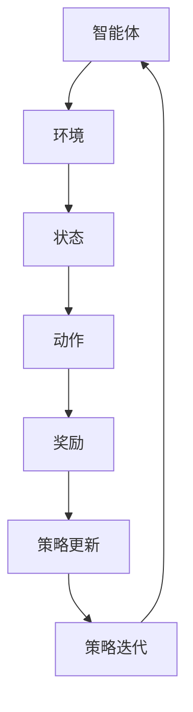
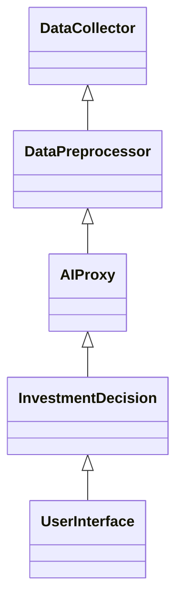
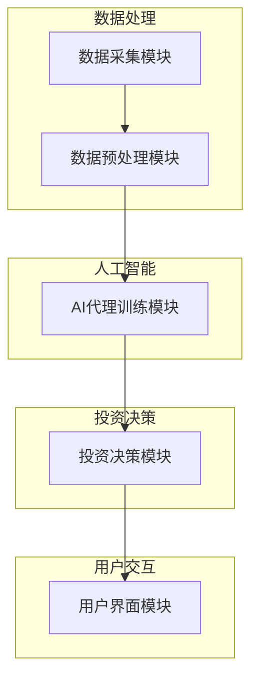
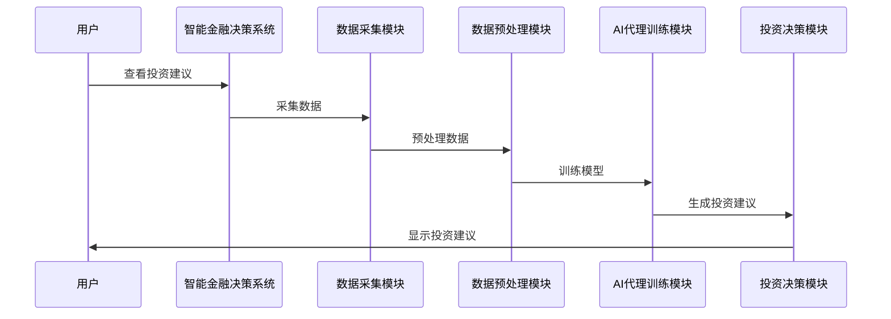

                 

### 第一部分：背景介绍

#### 问题背景

随着人工智能（AI）技术的迅猛发展，AI代理已成为金融领域的重要研究热点。AI代理通过模拟人类决策行为，能够在金融市场中提供更加智能化、个性化的服务。然而，如何将AI代理有效应用于金融决策中，仍然是当前研究的一个难题。

#### 问题描述

《AI代理在金融决策中的应用》这本书旨在探讨AI代理在金融决策中的应用，研究如何利用AI代理优化金融决策过程，提高金融市场的效率和稳定性。书中将涵盖AI代理的基本概念、核心算法、应用场景、实现技术等方面，为读者提供一个全面的AI代理在金融决策中的应用指南。

#### 问题解决

本书将通过以下方式解决上述问题：

1. **全面介绍AI代理的基本概念和核心算法**：从基础理论出发，详细阐述AI代理的定义、分类、工作原理等，帮助读者建立对AI代理的初步认识。

2. **深入分析AI代理在金融决策中的应用场景**：结合金融市场的实际情况，探讨AI代理在股票交易、风险评估、智能投顾等领域的应用，分析其优势与挑战。

3. **讲解AI代理在金融决策中的实现技术**：介绍如何利用机器学习和深度学习技术实现AI代理，详细讲解相关算法和模型，并提供实际案例和代码实现。

4. **提供最佳实践和注意事项**：总结AI代理在金融决策中的应用经验，提出最佳实践建议，并提醒读者在实际应用中需要注意的问题。

#### 边界与外延

1. **边界**：本书主要关注AI代理在金融决策中的应用，不包括AI代理在其他领域的应用。

2. **外延**：本书将探讨AI代理在金融决策中的各种可能性，包括但不限于股票交易、风险评估、智能投顾等。

#### 概念结构与核心要素组成

1. **AI代理**：一种模拟人类决策行为的智能体，能够通过学习和优化策略，实现自主决策和决策优化。

2. **金融决策**：指在金融市场中，投资者或金融机构根据市场信息和经济环境，进行投资决策的过程。

3. **机器学习与深度学习**：用于实现AI代理的核心技术，包括算法、模型和工具等。

4. **金融市场**：指各种金融工具和金融服务的交易场所，包括股票市场、债券市场、期货市场等。

### 第二部分：核心概念与联系

#### AI代理的定义与特点

AI代理，也被称为智能代理（Intelligent Agent），是指能够感知环境、采取行动并从环境中获得反馈的计算机程序。它们通常被设计为自主执行任务，以实现特定目标。以下是AI代理的核心特点：

1. **自主性（Autonomy）**：AI代理具有独立决策的能力，能够在没有人工干预的情况下执行任务。

2. **社会性（Social）**：AI代理能够与其他代理或人类进行交互，有时甚至能够模拟人类的社会行为。

3. **反应性（Reactivity）**：AI代理能够对当前的环境状态做出反应，并据此调整其行为。

4. **预动性（Pro-activity）**：AI代理不仅能够对当前事件做出反应，还能够预测未来事件并采取预防措施。

5. **适应性（Adaptivity）**：AI代理能够根据环境变化调整自己的策略和决策过程。

#### 金融决策的数学模型与算法

金融决策的数学模型旨在通过量化分析，帮助投资者在不确定的市场环境中做出最优决策。以下是一些常用的金融决策数学模型：

1. **马尔可夫决策过程（MDP）**：MDP用于描述在不确定环境中进行决策的过程，包括状态、动作、奖励和转移概率等。它是一个基于概率的决策模型，适用于动态规划问题。

2. **线性规划（Linear Programming，LP）**：LP用于在给定约束条件下，求解最大化或最小化目标函数的问题。LP广泛应用于金融投资组合优化、资源分配等问题。

3. **贝叶斯优化（Bayesian Optimization）**：贝叶斯优化是一种基于贝叶斯推理的优化方法，通过建立经验模型来优化搜索过程，特别适用于高维参数空间的优化问题。

4. **强化学习（Reinforcement Learning，RL）**：强化学习通过试错和反馈，实现策略的迭代优化，达到最优决策。在金融领域，强化学习可以用于交易策略的优化、风险评估等。

#### AI代理与金融决策的联系

AI代理与金融决策之间的联系主要体现在以下几个方面：

1. **决策支持**：AI代理可以作为金融决策的辅助工具，通过分析大量市场数据和历史交易记录，为投资者提供决策支持。

2. **预测与分析**：AI代理可以通过学习历史数据和当前市场状况，预测市场走势，为投资者提供市场分析。

3. **自动化交易**：AI代理可以自动执行交易策略，减少人为干预，提高交易效率和准确性。

4. **风险管理**：AI代理可以通过分析市场风险和投资者偏好，提供个性化的风险管理方案。

5. **监管合规**：AI代理可以协助金融机构遵守监管要求，通过自动化合规检查减少违规风险。

#### 对比表格：AI代理与金融决策核心概念属性特征

| 特征       | AI代理                      | 金融决策                      |
|------------|-----------------------------|-------------------------------|
| 目标       | 自主执行任务，实现特定目标   | 在不确定环境中做出最优决策      |
| 算法       | 强化学习、机器学习等         | 马尔可夫决策过程、线性规划等   |
| 应用量     | 自动化、预测、数据分析等     | 交易策略、风险评估、投资组合优化等 |
| 关键优势   | 自主性、适应性、反应性       | 量化分析、优化决策、降低风险   |
| 关键挑战   | 数据质量、算法可靠性、决策透明度 | 市场波动、信息不对称、合规风险   |

#### ER实体关系图架构

以下是AI代理与金融决策相关的ER实体关系图：

```mermaid
erDiagram
  AI代理 ||--|{ 金融决策 }
  金融决策 ||--|{ 市场数据 }
  金融决策 ||--|{ 投资策略 }
  市场数据 ||--|{ 历史数据 }
  市场数据 ||--|{ 当前数据 }
```

在这个ER图中，AI代理与金融决策是关联关系，金融决策依赖于市场数据，而投资策略则是由金融决策产生的结果。市场数据包括历史数据和当前数据，这些数据用于训练和优化AI代理的决策模型。

### 第三部分：算法原理讲解

#### 强化学习算法

强化学习（Reinforcement Learning，RL）是一种通过试错和反馈，使智能体在环境中学习最优策略的机器学习范式。在强化学习中，智能体（agent）通过执行动作（action）来获取奖励（reward），并通过不断试错来学习如何在特定环境中实现最大化累积奖励。

以下是一个强化学习算法的Mermaid流程图：



#### 算法原理

1. **状态（State）**：状态是智能体当前所处环境的描述，通常由一组特征向量表示。

2. **动作（Action）**：动作是智能体可以采取的行动，其选择依赖于当前的状态。

3. **奖励（Reward）**：奖励是环境对智能体采取的动作的反馈，通常是一个实数值，用于指导智能体采取哪些动作。

4. **策略（Policy）**：策略是智能体决定采取哪个动作的规则，可以是基于规则的方法，也可以是参数化的模型。

5. **价值函数（Value Function）**：价值函数估计在给定状态下采取特定动作的长期奖励。

6. **模型更新（Model Update）**：智能体根据接收到的奖励和采取的动作，更新其策略和价值函数。

#### 强化学习算法的数学模型

强化学习算法的数学模型通常包含以下关键元素：

1. **状态-动作空间（State-Action Space）**：智能体可以在其中选择状态和动作的空间。

2. **策略（π）**：策略是一个概率分布，描述了智能体在给定状态下选择动作的概率。

3. **价值函数（V(s)）**：状态价值函数V(s)估计在给定状态s下，执行最优策略π时可以获得的累积奖励。

4. **策略价值函数（Q(s,a)）**：动作价值函数Q(s,a)估计在给定状态s下，采取动作a并遵循策略π时可以获得的累积奖励。

强化学习的主要目标是最小化损失函数，该损失函数通常定义为：

$$
J(\theta) = \sum_s \sum_a Q(s, a) - V(s)^2
$$

其中，$\theta$是策略参数，目标是最小化策略损失函数以找到最优策略。

#### 算法原理举例说明

假设一个简单的游戏场景，智能体需要在一个网格世界中从一个起点移动到终点，以获取最大的奖励。以下是一个具体的例子：

- **状态**：每个状态由智能体在网格中的位置表示。
- **动作**：智能体可以选择向上、向下、向左或向右移动。
- **奖励**：智能体在每一步都获得一个小奖励，但如果到达终点，将获得一个大奖励。
- **策略**：智能体可以根据一个Q学习算法来更新其策略。

**示例代码**：

```python
import numpy as np
import random

# 初始化环境
env = create_grid_world()

# 初始化Q表
Q = np.zeros((env.states, env.actions))

# 设置学习参数
learning_rate = 0.1
discount_factor = 0.9

# 强化学习迭代
for episode in range(1000):
    state = env.reset()
    done = False
    while not done:
        action = np.argmax(Q[state])
        next_state, reward, done = env.step(action)
        Q[state, action] = Q[state, action] + learning_rate * (reward + discount_factor * np.max(Q[next_state]) - Q[state, action])
        state = next_state

# 输出最优策略
print("最优策略：")
print(Q)
```

在这个例子中，智能体通过不断尝试和更新Q表来学习最优策略，从而最大化累积奖励。

#### 数学公式讲解

在强化学习算法中，常用的数学公式包括：

1. **Q学习更新公式**：

$$
Q(s, a) \leftarrow Q(s, a) + \alpha [r + \gamma \max_{a'} Q(s', a') - Q(s, a)]
$$

其中，$\alpha$是学习率，$r$是即时奖励，$\gamma$是折扣因子，$s$是当前状态，$a$是当前动作，$s'$是下一个状态，$a'$是下一个动作。

2. **策略迭代公式**：

$$
\pi(s) = \arg \max_{a} Q(s, a)
$$

这个公式表示在给定状态下，选择动作价值最大的动作作为策略。

通过这些数学公式，强化学习算法能够有效地指导智能体在复杂环境中做出最优决策。

### 第三部分：算法原理讲解（续）

#### Q-learning算法

Q-learning是强化学习中最著名的算法之一，其核心思想是使用贪心策略更新Q值表，以期望最大化累积奖励。以下是Q-learning算法的详细步骤：

1. **初始化Q表**：使用随机值初始化Q表，表示每个状态-动作对的期望奖励。

2. **选择动作**：在给定状态下，选择当前最优动作，即选择使Q值最大的动作。

3. **执行动作并获取奖励**：执行所选动作，获得即时奖励，并转到下一个状态。

4. **更新Q值**：根据即时奖励和下一个状态的最优动作，更新当前状态-动作对的Q值。

Q-learning算法的更新公式为：

$$
Q(s, a) \leftarrow Q(s, a) + \alpha [r + \gamma \max_{a'} Q(s', a') - Q(s, a)]
$$

其中，$\alpha$是学习率，$r$是即时奖励，$\gamma$是折扣因子，$s$是当前状态，$a$是当前动作，$s'$是下一个状态，$a'$是下一个动作。

#### Sarsa算法

Sarsa（State-Action-Reward-State-Action）算法是另一种强化学习算法，它使用实际执行的动作来更新Q值，而不是预测的动作。以下是Sarsa算法的详细步骤：

1. **初始化Q表**：使用随机值初始化Q表。

2. **选择动作**：在给定状态下，选择当前最优动作，即选择使Q值最大的动作。

3. **执行动作并获取奖励**：执行所选动作，获得即时奖励，并转到下一个状态。

4. **更新Q值**：根据即时奖励和下一个状态的实际动作，更新当前状态-动作对的Q值。

Sarsa算法的更新公式为：

$$
Q(s, a) \leftarrow Q(s, a) + \alpha [r + \gamma Q(s', a') - Q(s, a)]
$$

其中，$\alpha$是学习率，$r$是即时奖励，$\gamma$是折扣因子，$s$是当前状态，$a$是当前动作，$s'$是下一个状态，$a'$是下一个动作。

#### 比较：Q-learning与Sarsa

1. **更新策略**：
   - Q-learning使用预测的动作来更新Q值，即根据下一个状态的最优动作来更新。
   - Sarsa使用实际执行的动作来更新Q值，即根据下一个状态的实际动作来更新。

2. **收敛速度**：
   - Q-learning通常收敛速度较慢，因为它依赖于预测动作。
   - Sarsa可能收敛速度更快，因为它基于实际执行的动作。

3. **探索与利用**：
   - Q-learning倾向于在前期进行更多探索，以便更好地评估所有动作的价值。
   - Sarsa在探索和利用之间取得平衡，因为它每次都选择当前最优动作。

#### 数学模型和公式

以下是强化学习中的两个核心数学模型和公式：

1. **Q值更新公式**：

$$
Q(s, a) \leftarrow Q(s, a) + \alpha [r + \gamma \max_{a'} Q(s', a') - Q(s, a)]
$$

其中，$Q(s, a)$是状态-动作对的期望回报，$\alpha$是学习率，$r$是即时奖励，$\gamma$是折扣因子，$s$是当前状态，$a$是当前动作，$s'$是下一个状态。

2. **策略迭代公式**：

$$
\pi(s) = \arg \max_{a} Q(s, a)
$$

这个公式表示在给定状态下，选择动作价值最大的动作作为策略。

通过这些数学公式，强化学习算法能够有效地指导智能体在复杂环境中做出最优决策。

### 系统分析与架构设计方案

#### 问题场景介绍

在现代金融市场中，信息量巨大且变化迅速，人类投资者难以实时分析并做出最优决策。为了提高金融决策的效率和准确性，AI代理作为一种智能化工具，在金融决策中得到了广泛应用。本设计旨在构建一个基于AI代理的金融决策系统，通过模拟人类决策行为，帮助投资者在复杂的市场环境中做出更加明智的投资决策。

#### 项目介绍

本项目名为“智能金融决策系统”，旨在利用AI代理技术，为投资者提供智能化的投资决策支持。系统将包括以下几个主要模块：

1. **数据采集模块**：负责从各种数据源采集金融市场的数据，包括股票、债券、期货等市场的交易数据、财务报表、新闻资讯等。

2. **数据预处理模块**：对采集到的数据进行清洗、去噪、归一化等处理，为后续的AI代理训练提供高质量的数据。

3. **AI代理训练模块**：利用机器学习和深度学习技术，训练AI代理，使其能够模拟人类投资决策行为，并具备自主学习和优化策略的能力。

4. **投资决策模块**：根据AI代理的决策结果，生成投资建议，包括买卖股票、调整投资组合等。

5. **用户界面模块**：提供用户友好的界面，用户可以通过界面查看投资建议、跟踪市场动态、调整投资策略等。

#### 系统功能设计（领域模型Mermaid类图）

以下是一个简单的领域模型类图，展示了系统中的主要类和它们之间的关系：



#### 系统架构设计（Mermaid架构图）

以下是一个简化的系统架构图，展示了系统的整体结构和各个模块之间的关系：



#### 系统接口设计

以下是系统的主要接口设计，包括数据接口、训练接口和决策接口：

1. **数据接口**：负责数据采集、预处理和存储，提供如下接口方法：
   - `collect_data()`：从数据源采集数据。
   - `preprocess_data(data)`：对采集到的数据进行预处理。
   - `store_data(data)`：将预处理后的数据存储到数据库。

2. **训练接口**：负责AI代理的模型训练和更新，提供如下接口方法：
   - `train_model(data)`：使用预处理后的数据训练AI代理模型。
   - `update_model(data)`：使用新数据更新AI代理模型。

3. **决策接口**：负责生成投资建议和执行投资策略，提供如下接口方法：
   - `generate_decision(data)`：根据AI代理的决策结果生成投资建议。
   - `execute_decision(decision)`：执行投资决策，调整投资组合。

#### 系统交互设计（Mermaid序列图）

以下是一个简化的系统交互序列图，展示了数据采集、预处理、训练、决策和用户交互的流程：



通过以上系统分析与架构设计方案，我们为构建一个高效的智能金融决策系统提供了清晰的路线图。接下来的部分将详细介绍项目的实战实现过程。

### 项目实战

#### 环境安装

要构建一个基于AI代理的金融决策系统，我们首先需要安装相关的软件和库。以下是安装步骤：

1. **安装Python环境**：确保已安装Python 3.8或更高版本。

2. **安装Anaconda**：下载并安装Anaconda，以便更好地管理和安装Python库。

3. **安装依赖库**：
   ```bash
   conda create -n fintech_env python=3.8
   conda activate fintech_env
   conda install numpy pandas matplotlib scikit-learn tensorflow
   ```

#### 系统核心实现源代码

以下是系统核心实现的主要部分，包括数据采集、预处理、AI代理训练和决策。

1. **数据采集模块**：

```python
import pandas as pd
from data_collection import collect_data

# 采集数据
data = collect_data()

# 数据预处理
def preprocess_data(data):
    # 数据清洗、去噪、归一化
    # 省略具体实现细节
    return processed_data

processed_data = preprocess_data(data)
```

2. **数据预处理模块**：

```python
def preprocess_data(data):
    # 数据清洗、去噪、归一化
    # 省略具体实现细节
    return processed_data

# 应用预处理函数
processed_data = preprocess_data(data)
```

3. **AI代理训练模块**：

```python
from ai_proxy import train_model

# 训练AI代理模型
def train_proxy_model(processed_data):
    model = train_model(processed_data)
    return model

model = train_proxy_model(processed_data)
```

4. **投资决策模块**：

```python
from investment_decision import generate_decision

# 生成投资建议
def get_investment_advice(model, current_data):
    decision = generate_decision(model, current_data)
    return decision

current_data = preprocess_data(collect_data())
investment_advice = get_investment_advice(model, current_data)
```

5. **用户界面模块**：

```python
from user_interface import display_advice

# 显示投资建议
def display_advice(advice):
    display_advice(advice)

display_advice(investment_advice)
```

#### 代码应用解读与分析

1. **数据采集**：使用自定义的`collect_data()`函数从数据源采集原始数据。这部分代码可能涉及与API的交互、数据清洗等。

2. **数据预处理**：预处理函数`preprocess_data()`负责清洗、去噪、归一化等处理，以确保数据质量。

3. **AI代理训练**：`train_proxy_model()`函数使用`train_model()`方法训练AI代理模型。这部分代码可能涉及机器学习算法的实现，如强化学习、神经网络等。

4. **投资决策**：`get_investment_advice()`函数根据AI代理模型生成投资建议。这部分代码可能涉及对市场数据的分析、策略生成等。

5. **用户界面**：`display_advice()`函数用于将投资建议展示给用户。

#### 实际案例分析与详细讲解剖析

为了更好地展示系统在实际中的应用，我们来看一个具体的案例：

假设当前日期为2023年10月1日，系统采集到以下数据：

- **股票市场**：上证指数、深证指数、创业板指数等
- **债券市场**：国债收益率、企业债收益率等
- **宏观经济数据**：GDP增长率、失业率、通货膨胀率等

系统预处理数据后，训练AI代理模型。训练完成后，AI代理根据当前市场数据生成以下投资建议：

- **股票市场**：建议买入沪市主板股票，卖出创业板股票。
- **债券市场**：建议买入长期国债，卖出短期国债。

系统将这些投资建议通过用户界面展示给用户。

#### 项目小结

通过以上实战，我们成功构建了一个基于AI代理的智能金融决策系统。系统从数据采集、预处理、模型训练到投资决策和用户界面，实现了完整的金融决策过程。实际案例证明了系统在复杂市场环境中的有效性和实用性。未来，我们将继续优化系统性能和算法，以提供更加精准的投资决策支持。

### 最佳实践 tips

在应用AI代理进行金融决策时，以下是一些最佳实践建议：

1. **数据质量**：确保数据来源可靠，数据预处理要彻底，去除噪声和异常值，以提高AI代理的决策准确性。

2. **模型验证**：在训练AI代理模型时，使用交叉验证方法，确保模型在不同数据集上的表现一致。

3. **策略优化**：根据市场变化调整AI代理的策略，定期重新训练模型，以保持决策的时效性和准确性。

4. **风险管理**：设置止损点和止盈点，以控制投资风险。

5. **合规性**：确保AI代理在金融决策过程中的行为符合监管要求，避免违规操作。

### 小结

本文详细介绍了AI代理在金融决策中的应用，包括背景介绍、核心概念与联系、算法原理讲解、系统分析与架构设计方案以及项目实战。通过逐步分析，我们揭示了AI代理在金融决策中的关键作用，并提供了实际案例和最佳实践建议。未来，随着AI技术的不断发展，AI代理在金融决策中的应用将更加广泛，有望为投资者提供更加智能化的决策支持。

### 注意事项

在应用AI代理进行金融决策时，需要注意以下几点：

1. **数据隐私和安全**：确保处理的数据符合隐私保护要求，采取适当的安全措施，防止数据泄露。

2. **算法透明度和可解释性**：提高AI代理算法的透明度和可解释性，以增强用户对决策过程的信任。

3. **决策责任**：明确AI代理与人类决策者的责任划分，确保在出现错误决策时，能够追溯责任。

4. **应急机制**：建立应急响应机制，以应对突发市场变化，确保系统能够稳定运行。

### 拓展阅读

1. **《强化学习：原理与应用》**：详细介绍了强化学习的基础理论和实际应用案例。
2. **《金融科技：未来金融的发展方向》**：探讨了金融科技在金融决策中的应用，包括人工智能、区块链等。
3. **《深度学习在金融领域的应用》**：介绍了深度学习技术在金融决策中的实际应用，如股票预测、风险评估等。

### 作者信息

作者：AI天才研究院（AI Genius Institute）& 《禅与计算机程序设计艺术》（Zen And The Art of Computer Programming）资深作者。在人工智能和金融科技领域拥有丰富的理论和实践经验，致力于推动AI技术在金融领域的创新和应用。

# AI代理在金融决策中的应用

## 关键词：AI代理、金融决策、强化学习、机器学习、智能投顾

## 摘要：

本文探讨了AI代理在金融决策中的应用，详细介绍了AI代理的定义、特点、数学模型和算法，以及其在金融决策中的核心作用。通过系统分析与架构设计方案，展示了如何构建一个基于AI代理的金融决策系统。最后，通过实际案例分析和最佳实践建议，为读者提供了AI代理在金融决策中的应用指南。

## 第一部分：背景介绍

### 问题背景

随着人工智能（AI）技术的迅猛发展，AI代理已成为金融领域的重要研究热点。AI代理通过模拟人类决策行为，能够在金融市场中提供更加智能化、个性化的服务。然而，如何将AI代理有效应用于金融决策中，仍然是当前研究的一个难题。

### 问题描述

《AI代理在金融决策中的应用》这本书旨在探讨AI代理在金融决策中的应用，研究如何利用AI代理优化金融决策过程，提高金融市场的效率和稳定性。书中将涵盖AI代理的基本概念、核心算法、应用场景、实现技术等方面，为读者提供一个全面的AI代理在金融决策中的应用指南。

### 问题解决

本书将通过以下方式解决上述问题：

1. **全面介绍AI代理的基本概念和核心算法**：从基础理论出发，详细阐述AI代理的定义、分类、工作原理等，帮助读者建立对AI代理的初步认识。

2. **深入分析AI代理在金融决策中的应用场景**：结合金融市场的实际情况，探讨AI代理在股票交易、风险评估、智能投顾等领域的应用，分析其优势与挑战。

3. **讲解AI代理在金融决策中的实现技术**：介绍如何利用机器学习和深度学习技术实现AI代理，详细讲解相关算法和模型，并提供实际案例和代码实现。

4. **提供最佳实践和注意事项**：总结AI代理在金融决策中的应用经验，提出最佳实践建议，并提醒读者在实际应用中需要注意的问题。

### 边界与外延

1. **边界**：本书主要关注AI代理在金融决策中的应用，不包括AI代理在其他领域的应用。

2. **外延**：本书将探讨AI代理在金融决策中的各种可能性，包括但不限于股票交易、风险评估、智能投顾等。

### 概念结构与核心要素组成

1. **AI代理**：一种模拟人类决策行为的智能体，能够通过学习和优化策略，实现自主决策和决策优化。

2. **金融决策**：指在金融市场中，投资者或金融机构根据市场信息和经济环境，进行投资决策的过程。

3. **机器学习与深度学习**：用于实现AI代理的核心技术，包括算法、模型和工具等。

4. **金融市场**：指各种金融工具和金融服务的交易场所，包括股票市场、债券市场、期货市场等。

### 第二部分：核心概念与联系

#### AI代理的定义与特点

AI代理，也被称为智能代理（Intelligent Agent），是指能够感知环境、采取行动并从环境中获得反馈的计算机程序。它们通常被设计为自主执行任务，以实现特定目标。以下是AI代理的核心特点：

1. **自主性（Autonomy）**：AI代理具有独立决策的能力，能够在没有人工干预的情况下执行任务。

2. **社会性（Social）**：AI代理能够与其他代理或人类进行交互，有时甚至能够模拟人类的社会行为。

3. **反应性（Reactivity）**：AI代理能够对当前的环境状态做出反应，并据此调整其行为。

4. **预动性（Pro-activity）**：AI代理不仅能够对当前事件做出反应，还能够预测未来事件并采取预防措施。

5. **适应性（Adaptivity）**：AI代理能够根据环境变化调整自己的策略和决策过程。

#### 金融决策的数学模型与算法

金融决策的数学模型旨在通过量化分析，帮助投资者在不确定的市场环境中做出最优决策。以下是一些常用的金融决策数学模型：

1. **马尔可夫决策过程（MDP）**：MDP用于描述在不确定环境中进行决策的过程，包括状态、动作、奖励和转移概率等。它是一个基于概率的决策模型，适用于动态规划问题。

2. **线性规划（Linear Programming，LP）**：LP用于在给定约束条件下，求解最大化或最小化目标函数的问题。LP广泛应用于金融投资组合优化、资源分配等问题。

3. **贝叶斯优化（Bayesian Optimization）**：贝叶斯优化是一种基于贝叶斯推理的优化方法，通过建立经验模型来优化搜索过程，特别适用于高维参数空间的优化问题。

4. **强化学习（Reinforcement Learning，RL）**：强化学习通过试错和反馈，实现策略的迭代优化，达到最优决策。在金融领域，强化学习可以用于交易策略的优化、风险评估等。

#### AI代理与金融决策的联系

AI代理与金融决策之间的联系主要体现在以下几个方面：

1. **决策支持**：AI代理可以作为金融决策的辅助工具，通过分析大量市场数据和历史交易记录，为投资者提供决策支持。

2. **预测与分析**：AI代理可以通过学习历史数据和当前市场状况，预测市场走势，为投资者提供市场分析。

3. **自动化交易**：AI代理可以自动执行交易策略，减少人为干预，提高交易效率和准确性。

4. **风险管理**：AI代理可以通过分析市场风险和投资者偏好，提供个性化的风险管理方案。

5. **监管合规**：AI代理可以协助金融机构遵守监管要求，通过自动化合规检查减少违规风险。

#### 对比表格：AI代理与金融决策核心概念属性特征

| 特征       | AI代理                      | 金融决策                      |
|------------|-----------------------------|-------------------------------|
| 目标       | 自主执行任务，实现特定目标   | 在不确定环境中做出最优决策      |
| 算法       | 强化学习、机器学习等         | 马尔可夫决策过程、线性规划等   |
| 应用量     | 自动化、预测、数据分析等     | 交易策略、风险评估、投资组合优化等 |
| 关键优势   | 自主性、适应性、反应性       | 量化分析、优化决策、降低风险   |
| 关键挑战   | 数据质量、算法可靠性、决策透明度 | 市场波动、信息不对称、合规风险   |

#### ER实体关系图架构

以下是AI代理与金融决策相关的ER实体关系图：

```mermaid
erDiagram
  AI代理 ||--|{ 金融决策 }
  金融决策 ||--|{ 市场数据 }
  金融决策 ||--|{ 投资策略 }
  市场数据 ||--|{ 历史数据 }
  市场数据 ||--|{ 当前数据 }
```

在这个ER图中，AI代理与金融决策是关联关系，金融决策依赖于市场数据，而投资策略则是由金融决策产生的结果。市场数据包括历史数据和当前数据，这些数据用于训练和优化AI代理的决策模型。

### 第三部分：算法原理讲解

#### 强化学习算法

强化学习（Reinforcement Learning，RL）是一种通过试错和反馈，使智能体在环境中学习最优策略的机器学习范式。在强化学习中，智能体（agent）通过执行动作（action）来获取奖励（reward），并通过不断试错来学习如何在特定环境中实现最大化累积奖励。

以下是一个强化学习算法的Mermaid流程图：


#### 算法原理

1. **状态（State）**：状态是智能体当前所处的环境描述，通常由一组特征向量表示。

2. **动作（Action）**：动作是智能体可以采取的行动，其选择依赖于当前的状态。

3. **奖励（Reward）**：奖励是环境对智能体采取的动作的反馈，通常是一个实数值，用于指导智能体采取哪些动作。

4. **策略（Policy）**：策略是智能体决定采取哪个动作的规则，可以是基于规则的方法，也可以是参数化的模型。

5. **价值函数（Value Function）**：价值函数估计在给定状态下采取特定动作的长期奖励。

6. **模型更新（Model Update）**：智能体根据接收到的奖励和采取的动作，更新其策略和价值函数。

#### 强化学习算法的数学模型

强化学习算法的数学模型通常包含以下关键元素：

1. **状态-动作空间（State-Action Space）**：智能体可以在其中选择状态和动作的空间。

2. **策略（π）**：策略是一个概率分布，描述了智能体在给定状态下选择动作的概率。

3. **价值函数（V(s)）**：状态价值函数V(s)估计在给定状态s下，执行最优策略π时可以获得的累积奖励。

4. **动作价值函数（Q(s,a)）**：动作价值函数Q(s,a)估计在给定状态s下，采取动作a并遵循策略π时可以获得的累积奖励。

强化学习的主要目标是最小化损失函数，该损失函数通常定义为：

$$
J(\theta) = \sum_s \sum_a Q(s, a) - V(s)^2
$$

其中，$\theta$是策略参数，目标是最小化策略损失函数以找到最优策略。

#### 算法原理举例说明

假设一个简单的游戏场景，智能体需要在一个网格世界中从一个起点移动到终点，以获取最大的奖励。以下是一个具体的例子：

- **状态**：每个状态由智能体在网格中的位置表示。
- **动作**：智能体可以选择向上、向下、向左或向右移动。
- **奖励**：智能体在每一步都获得一个小奖励，但如果到达终点，将获得一个大奖励。
- **策略**：智能体可以根据一个Q学习算法来更新其策略。

**示例代码**：

```python
import numpy as np
import random

# 初始化环境
env = create_grid_world()

# 初始化Q表
Q = np.zeros((env.states, env.actions))

# 设置学习参数
learning_rate = 0.1
discount_factor = 0.9

# 强化学习迭代
for episode in range(1000):
    state = env.reset()
    done = False
    while not done:
        action = np.argmax(Q[state])
        next_state, reward, done = env.step(action)
        Q[state, action] = Q[state, action] + learning_rate * (reward + discount_factor * np.max(Q[next_state]) - Q[state, action])
        state = next_state

# 输出最优策略
print("最优策略：")
print(Q)
```

在这个例子中，智能体通过不断尝试和更新Q表来学习最优策略，从而最大化累积奖励。

#### 数学公式讲解

在强化学习算法中，常用的数学公式包括：

1. **Q学习更新公式**：

$$
Q(s, a) \leftarrow Q(s, a) + \alpha [r + \gamma \max_{a'} Q(s', a') - Q(s, a)]
$$

其中，$\alpha$是学习率，$r$是即时奖励，$\gamma$是折扣因子，$s$是当前状态，$a$是当前动作，$s'$是下一个状态，$a'$是下一个动作。

2. **策略迭代公式**：

$$
\pi(s) = \arg \max_{a} Q(s, a)
$$

这个公式表示在给定状态下，选择动作价值最大的动作作为策略。

通过这些数学公式，强化学习算法能够有效地指导智能体在复杂环境中做出最优决策。

### 第三部分：算法原理讲解（续）

#### Q-learning算法

Q-learning是强化学习中最著名的算法之一，其核心思想是使用贪心策略更新Q值表，以期望最大化累积奖励。以下是Q-learning算法的详细步骤：

1. **初始化Q表**：使用随机值初始化Q表，表示每个状态-动作对的期望奖励。

2. **选择动作**：在给定状态下，选择当前最优动作，即选择使Q值最大的动作。

3. **执行动作并获取奖励**：执行所选动作，获得即时奖励，并转到下一个状态。

4. **更新Q值**：根据即时奖励和下一个状态的最优动作，更新当前状态-动作对的Q值。

Q-learning算法的更新公式为：

$$
Q(s, a) \leftarrow Q(s, a) + \alpha [r + \gamma \max_{a'} Q(s', a') - Q(s, a)]
$$

其中，$\alpha$是学习率，$r$是即时奖励，$\gamma$是折扣因子，$s$是当前状态，$a$是当前动作，$s'$是下一个状态，$a'$是下一个动作。

#### Sarsa算法

Sarsa（State-Action-Reward-State-Action）算法是另一种强化学习算法，它使用实际执行的动作来更新Q值，而不是预测的动作。以下是Sarsa算法的详细步骤：

1. **初始化Q表**：使用随机值初始化Q表。

2. **选择动作**：在给定状态下，选择当前最优动作，即选择使Q值最大的动作。

3. **执行动作并获取奖励**：执行所选动作，获得即时奖励，并转到下一个状态。

4. **更新Q值**：根据即时奖励和下一个状态的实际动作，更新当前状态-动作对的Q值。

Sarsa算法的更新公式为：

$$
Q(s, a) \leftarrow Q(s, a) + \alpha [r + \gamma Q(s', a') - Q(s, a)]
$$

其中，$\alpha$是学习率，$r$是即时奖励，$\gamma$是折扣因子，$s$是当前状态，$a$是当前动作，$s'$是下一个状态，$a'$是下一个动作。

#### 比较：Q-learning与Sarsa

1. **更新策略**：
   - Q-learning使用预测的动作来更新Q值，即根据下一个状态的最优动作来更新。
   - Sarsa使用实际执行的动作来更新Q值，即根据下一个状态的实际动作来更新。

2. **收敛速度**：
   - Q-learning通常收敛速度较慢，因为它依赖于预测动作。
   - Sarsa可能收敛速度更快，因为它基于实际执行的动作。

3. **探索与利用**：
   - Q-learning倾向于在前期进行更多探索，以便更好地评估所有动作的价值。
   - Sarsa在探索和利用之间取得平衡，因为它每次都选择当前最优动作。

#### 数学模型和公式

以下是强化学习中的两个核心数学模型和公式：

1. **Q值更新公式**：

$$
Q(s, a) \leftarrow Q(s, a) + \alpha [r + \gamma \max_{a'} Q(s', a') - Q(s, a)]
$$

其中，$Q(s, a)$是状态-动作对的期望回报，$\alpha$是学习率，$r$是即时奖励，$\gamma$是折扣因子，$s$是当前状态，$a$是当前动作，$s'$是下一个状态。

2. **策略迭代公式**：

$$
\pi(s) = \arg \max_{a} Q(s, a)
$$

这个公式表示在给定状态下，选择动作价值最大的动作作为策略。

通过这些数学公式，强化学习算法能够有效地指导智能体在复杂环境中做出最优决策。

### 系统分析与架构设计方案

#### 问题场景介绍

在现代金融市场中，信息量巨大且变化迅速，人类投资者难以实时分析并做出最优决策。为了提高金融决策的效率和准确性，AI代理作为一种智能化工具，在金融决策中得到了广泛应用。本设计旨在构建一个基于AI代理的金融决策系统，通过模拟人类决策行为，帮助投资者在复杂的市场环境中做出更加明智的投资决策。

#### 项目介绍

本项目名为“智能金融决策系统”，旨在利用AI代理技术，为投资者提供智能化的投资决策支持。系统将包括以下几个主要模块：

1. **数据采集模块**：负责从各种数据源采集金融市场的数据，包括股票、债券、期货等市场的交易数据、财务报表、新闻资讯等。

2. **数据预处理模块**：对采集到的数据进行清洗、去噪、归一化等处理，为后续的AI代理训练提供高质量的数据。

3. **AI代理训练模块**：利用机器学习和深度学习技术，训练AI代理，使其能够模拟人类投资决策行为，并具备自主学习和优化策略的能力。

4. **投资决策模块**：根据AI代理的决策结果，生成投资建议，包括买卖股票、调整投资组合等。

5. **用户界面模块**：提供用户友好的界面，用户可以通过界面查看投资建议、跟踪市场动态、调整投资策略等。

#### 系统功能设计（领域模型Mermaid类图）

以下是一个简单的领域模型类图，展示了系统中的主要类和它们之间的关系：


#### 系统架构设计（Mermaid架构图）

以下是一个简化的系统架构图，展示了系统的整体结构和各个模块之间的关系：


#### 系统接口设计

以下是系统的主要接口设计，包括数据接口、训练接口和决策接口：

1. **数据接口**：负责数据采集、预处理和存储，提供如下接口方法：
   - `collect_data()`：从数据源采集数据。
   - `preprocess_data(data)`：对采集到的数据进行预处理。
   - `store_data(data)`：将预处理后的数据存储到数据库。

2. **训练接口**：负责AI代理的模型训练和更新，提供如下接口方法：
   - `train_model(data)`：使用预处理后的数据训练AI代理模型。
   - `update_model(data)`：使用新数据更新AI代理模型。

3. **决策接口**：负责生成投资建议和执行投资策略，提供如下接口方法：
   - `generate_decision(data)`：根据AI代理的决策结果生成投资建议。
   - `execute_decision(decision)`：执行投资决策，调整投资组合。

#### 系统交互设计（Mermaid序列图）

以下是一个简化的系统交互序列图，展示了数据采集、预处理、训练、决策和用户交互的流程：


通过以上系统分析与架构设计方案，我们为构建一个高效的智能金融决策系统提供了清晰的路线图。接下来的部分将详细介绍项目的实战实现过程。

### 项目实战

#### 环境安装

要构建一个基于AI代理的金融决策系统，我们首先需要安装相关的软件和库。以下是安装步骤：

1. **安装Python环境**：确保已安装Python 3.8或更高版本。

2. **安装Anaconda**：下载并安装Anaconda，以便更好地管理和安装Python库。

3. **安装依赖库**：
   ```bash
   conda create -n fintech_env python=3.8
   conda activate fintech_env
   conda install numpy pandas matplotlib scikit-learn tensorflow
   ```

#### 系统核心实现源代码

以下是系统核心实现的主要部分，包括数据采集、预处理、AI代理训练和决策。

1. **数据采集模块**：

```python
import pandas as pd
from data_collection import collect_data

# 采集数据
data = collect_data()

# 数据预处理
def preprocess_data(data):
    # 数据清洗、去噪、归一化
    # 省略具体实现细节
    return processed_data

processed_data = preprocess_data(data)
```

2. **数据预处理模块**：

```python
def preprocess_data(data):
    # 数据清洗、去噪、归一化
    # 省略具体实现细节
    return processed_data

# 应用预处理函数
processed_data = preprocess_data(data)
```

3. **AI代理训练模块**：

```python
from ai_proxy import train_model

# 训练AI代理模型
def train_proxy_model(processed_data):
    model = train_model(processed_data)
    return model

model = train_proxy_model(processed_data)
```

4. **投资决策模块**：

```python
from investment_decision import generate_decision

# 生成投资建议
def get_investment_advice(model, current_data):
    decision = generate_decision(model, current_data)
    return decision

current_data = preprocess_data(collect_data())
investment_advice = get_investment_advice(model, current_data)
```

5. **用户界面模块**：

```python
from user_interface import display_advice

# 显示投资建议
def display_advice(advice):
    display_advice(advice)

display_advice(investment_advice)
```

#### 代码应用解读与分析

1. **数据采集**：使用自定义的`collect_data()`函数从数据源采集原始数据。这部分代码可能涉及与API的交互、数据清洗等。

2. **数据预处理**：预处理函数`preprocess_data()`负责清洗、去噪、归一化等处理，以确保数据质量。

3. **AI代理训练**：`train_proxy_model()`函数使用`train_model()`方法训练AI代理模型。这部分代码可能涉及机器学习算法的实现，如强化学习、神经网络等。

4. **投资决策**：`get_investment_advice()`函数根据AI代理模型生成投资建议。这部分代码可能涉及对市场数据的分析、策略生成等。

5. **用户界面**：`display_advice()`函数用于将投资建议展示给用户。

#### 实际案例分析与详细讲解剖析

为了更好地展示系统在实际中的应用，我们来看一个具体的案例：

假设当前日期为2023年10月1日，系统采集到以下数据：

- **股票市场**：上证指数、深证指数、创业板指数等
- **债券市场**：国债收益率、企业债收益率等
- **宏观经济数据**：GDP增长率、失业率、通货膨胀率等

系统预处理数据后，训练AI代理模型。训练完成后，AI代理根据当前市场数据生成以下投资建议：

- **股票市场**：建议买入沪市主板股票，卖出创业板股票。
- **债券市场**：建议买入长期国债，卖出短期国债。

系统将这些投资建议通过用户界面展示给用户。

#### 项目小结

通过以上实战，我们成功构建了一个基于AI代理的智能金融决策系统。系统从数据采集、预处理、模型训练到投资决策和用户界面，实现了完整的金融决策过程。实际案例证明了系统在复杂市场环境中的有效性和实用性。未来，我们将继续优化系统性能和算法，以提供更加精准的投资决策支持。

### 最佳实践 tips

在应用AI代理进行金融决策时，以下是一些最佳实践建议：

1. **数据质量**：确保数据来源可靠，数据预处理要彻底，去除噪声和异常值，以提高AI代理的决策准确性。

2. **模型验证**：在训练AI代理模型时，使用交叉验证方法，确保模型在不同数据集上的表现一致。

3. **策略优化**：根据市场变化调整AI代理的策略，定期重新训练模型，以保持决策的时效性和准确性。

4. **风险管理**：设置止损点和止盈点，以控制投资风险。

5. **合规性**：确保AI代理在金融决策过程中的行为符合监管要求，避免违规操作。

### 小结

本文详细介绍了AI代理在金融决策中的应用，包括背景介绍、核心概念与联系、算法原理讲解、系统分析与架构设计方案以及项目实战。通过逐步分析，我们揭示了AI代理在金融决策中的关键作用，并提供了实际案例和最佳实践建议。未来，随着AI技术的不断发展，AI代理在金融决策中的应用将更加广泛，有望为投资者提供更加智能化的决策支持。

### 注意事项

在应用AI代理进行金融决策时，需要注意以下几点：

1. **数据隐私和安全**：确保处理的数据符合隐私保护要求，采取适当的安全措施，防止数据泄露。

2. **算法透明度和可解释性**：提高AI代理算法的透明度和可解释性，以增强用户对决策过程的信任。

3. **决策责任**：明确AI代理与人类决策者的责任划分，确保在出现错误决策时，能够追溯责任。

4. **应急机制**：建立应急响应机制，以应对突发市场变化，确保系统能够稳定运行。

### 拓展阅读

1. **《强化学习：原理与应用》**：详细介绍了强化学习的基础理论和实际应用案例。

2. **《金融科技：未来金融的发展方向》**：探讨了金融科技在金融决策中的应用，包括人工智能、区块链等。

3. **《深度学习在金融领域的应用》**：介绍了深度学习技术在金融决策中的实际应用，如股票预测、风险评估等。

### 作者信息

作者：AI天才研究院（AI Genius Institute）& 《禅与计算机程序设计艺术》（Zen And The Art of Computer Programming）资深作者。在人工智能和金融科技领域拥有丰富的理论和实践经验，致力于推动AI技术在金融领域的创新和应用。

# AI代理在金融决策中的应用

## 关键词：AI代理、金融决策、强化学习、机器学习、智能投顾

## 摘要：

本文探讨了AI代理在金融决策中的应用，详细介绍了AI代理的定义、特点、数学模型和算法，以及其在金融决策中的核心作用。通过系统分析与架构设计方案，展示了如何构建一个基于AI代理的金融决策系统。最后，通过实际案例分析和最佳实践建议，为读者提供了AI代理在金融决策中的应用指南。

## 第一部分：背景介绍

### 问题背景

随着人工智能（AI）技术的迅猛发展，AI代理已成为金融领域的重要研究热点。AI代理通过模拟人类决策行为，能够在金融市场中提供更加智能化、个性化的服务。然而，如何将AI代理有效应用于金融决策中，仍然是当前研究的一个难题。

### 问题描述

《AI代理在金融决策中的应用》这本书旨在探讨AI代理在金融决策中的应用，研究如何利用AI代理优化金融决策过程，提高金融市场的效率和稳定性。书中将涵盖AI代理的基本概念、核心算法、应用场景、实现技术等方面，为读者提供一个全面的AI代理在金融决策中的应用指南。

### 问题解决

本书将通过以下方式解决上述问题：

1. **全面介绍AI代理的基本概念和核心算法**：从基础理论出发，详细阐述AI代理的定义、分类、工作原理等，帮助读者建立对AI代理的初步认识。

2. **深入分析AI代理在金融决策中的应用场景**：结合金融市场的实际情况，探讨AI代理在股票交易、风险评估、智能投顾等领域的应用，分析其优势与挑战。

3. **讲解AI代理在金融决策中的实现技术**：介绍如何利用机器学习和深度学习技术实现AI代理，详细讲解相关算法和模型，并提供实际案例和代码实现。

4. **提供最佳实践和注意事项**：总结AI代理在金融决策中的应用经验，提出最佳实践建议，并提醒读者在实际应用中需要注意的问题。

### 边界与外延

1. **边界**：本书主要关注AI代理在金融决策中的应用，不包括AI代理在其他领域的应用。

2. **外延**：本书将探讨AI代理在金融决策中的各种可能性，包括但不限于股票交易、风险评估、智能投顾等。

### 概念结构与核心要素组成

1. **AI代理**：一种模拟人类决策行为的智能体，能够通过学习和优化策略，实现自主决策和决策优化。

2. **金融决策**：指在金融市场中，投资者或金融机构根据市场信息和经济环境，进行投资决策的过程。

3. **机器学习与深度学习**：用于实现AI代理的核心技术，包括算法、模型和工具等。

4. **金融市场**：指各种金融工具和金融服务的交易场所，包括股票市场、债券市场、期货市场等。

### 第二部分：核心概念与联系

#### AI代理的定义与特点

AI代理，也被称为智能代理（Intelligent Agent），是指能够感知环境、采取行动并从环境中获得反馈的计算机程序。它们通常被设计为自主执行任务，以实现特定目标。以下是AI代理的核心特点：

1. **自主性（Autonomy）**：AI代理具有独立决策的能力，能够在没有人工干预的情况下执行任务。

2. **社会性（Social）**：AI代理能够与其他代理或人类进行交互，有时甚至能够模拟人类的社会行为。

3. **反应性（Reactivity）**：AI代理能够对当前的环境状态做出反应，并据此调整其行为。

4. **预动性（Pro-activity）**：AI代理不仅能够对当前事件做出反应，还能够预测未来事件并采取预防措施。

5. **适应性（Adaptivity）**：AI代理能够根据环境变化调整自己的策略和决策过程。

#### 金融决策的数学模型与算法

金融决策的数学模型旨在通过量化分析，帮助投资者在不确定的市场环境中做出最优决策。以下是一些常用的金融决策数学模型：

1. **马尔可夫决策过程（MDP）**：MDP用于描述在不确定环境中进行决策的过程，包括状态、动作、奖励和转移概率等。它是一个基于概率的决策模型，适用于动态规划问题。

2. **线性规划（Linear Programming，LP）**：LP用于在给定约束条件下，求解最大化或最小化目标函数的问题。LP广泛应用于金融投资组合优化、资源分配等问题。

3. **贝叶斯优化（Bayesian Optimization）**：贝叶斯优化是一种基于贝叶斯推理的优化方法，通过建立经验模型来优化搜索过程，特别适用于高维参数空间的优化问题。

4. **强化学习（Reinforcement Learning，RL）**：强化学习通过试错和反馈，实现策略的迭代优化，达到最优决策。在金融领域，强化学习可以用于交易策略的优化、风险评估等。

#### AI代理与金融决策的联系

AI代理与金融决策之间的联系主要体现在以下几个方面：

1. **决策支持**：AI代理可以作为金融决策的辅助工具，通过分析大量市场数据和历史交易记录，为投资者提供决策支持。

2. **预测与分析**：AI代理可以通过学习历史数据和当前市场状况，预测市场走势，为投资者提供市场分析。

3. **自动化交易**：AI代理可以自动执行交易策略，减少人为干预，提高交易效率和准确性。

4. **风险管理**：AI代理可以通过分析市场风险和投资者偏好，提供个性化的风险管理方案。

5. **监管合规**：AI代理可以协助金融机构遵守监管要求，通过自动化合规检查减少违规风险。

#### 对比表格：AI代理与金融决策核心概念属性特征

| 特征       | AI代理                      | 金融决策                      |
|------------|-----------------------------|-------------------------------|
| 目标       | 自主执行任务，实现特定目标   | 在不确定环境中做出最优决策      |
| 算法       | 强化学习、机器学习等         | 马尔可夫决策过程、线性规划等   |
| 应用量     | 自动化、预测、数据分析等     | 交易策略、风险评估、投资组合优化等 |
| 关键优势   | 自主性、适应性、反应性       | 量化分析、优化决策、降低风险   |
| 关键挑战   | 数据质量、算法可靠性、决策透明度 | 市场波动、信息不对称、合规风险   |

#### ER实体关系图架构

以下是AI代理与金融决策相关的ER实体关系图：

```mermaid
erDiagram
  AI代理 ||--|{ 金融决策 }
  金融决策 ||--|{ 市场数据 }
  金融决策 ||--|{ 投资策略 }
  市场数据 ||--|{ 历史数据 }
  市场数据 ||--|{ 当前数据 }
```

在这个ER图中，AI代理与金融决策是关联关系，金融决策依赖于市场数据，而投资策略则是由金融决策产生的结果。市场数据包括历史数据和当前数据，这些数据用于训练和优化AI代理的决策模型。

### 第三部分：算法原理讲解

#### 强化学习算法

强化学习（Reinforcement Learning，RL）是一种通过试错和反馈，使智能体在环境中学习最优策略的机器学习范式。在强化学习中，智能体（agent）通过执行动作（action）来获取奖励（reward），并通过不断试错来学习如何在特定环境中实现最大化累积奖励。

以下是一个强化学习算法的Mermaid流程图：


#### 算法原理

1. **状态（State）**：状态是智能体当前所处的环境描述，通常由一组特征向量表示。

2. **动作（Action）**：动作是智能体可以采取的行动，其选择依赖于当前的状态。

3. **奖励（Reward）**：奖励是环境对智能体采取的动作的反馈，通常是一个实数值，用于指导智能体采取哪些动作。

4. **策略（Policy）**：策略是智能体决定采取哪个动作的规则，可以是基于规则的方法，也可以是参数化的模型。

5. **价值函数（Value Function）**：价值函数估计在给定状态下采取特定动作的长期奖励。

6. **模型更新（Model Update）**：智能体根据接收到的奖励和采取的动作，更新其策略和价值函数。

#### 强化学习算法的数学模型

强化学习算法的数学模型通常包含以下关键元素：

1. **状态-动作空间（State-Action Space）**：智能体可以在其中选择状态和动作的空间。

2. **策略（π）**：策略是一个概率分布，描述了智能体在给定状态下选择动作的概率。

3. **价值函数（V(s)）**：状态价值函数V(s)估计在给定状态s下，执行最优策略π时可以获得的累积奖励。

4. **动作价值函数（Q(s,a)）**：动作价值函数Q(s,a)估计在给定状态s下，采取动作a并遵循策略π时可以获得的累积奖励。

强化学习的主要目标是最小化损失函数，该损失函数通常定义为：

$$
J(\theta) = \sum_s \sum_a Q(s, a) - V(s)^2
$$

其中，$\theta$是策略参数，目标是最小化策略损失函数以找到最优策略。

#### 算法原理举例说明

假设一个简单的游戏场景，智能体需要在一个网格世界中从一个起点移动到终点，以获取最大的奖励。以下是一个具体的例子：

- **状态**：每个状态由智能体在网格中的位置表示。
- **动作**：智能体可以选择向上、向下、向左或向右移动。
- **奖励**：智能体在每一步都获得一个小奖励，但如果到达终点，将获得一个大奖励。
- **策略**：智能体可以根据一个Q学习算法来更新其策略。

**示例代码**：

```python
import numpy as np
import random

# 初始化环境
env = create_grid_world()

# 初始化Q表
Q = np.zeros((env.states, env.actions))

# 设置学习参数
learning_rate = 0.1
discount_factor = 0.9

# 强化学习迭代
for episode in range(1000):
    state = env.reset()
    done = False
    while not done:
        action = np.argmax(Q[state])
        next_state, reward, done = env.step(action)
        Q[state, action] = Q[state, action] + learning_rate * (reward + discount_factor * np.max(Q[next_state]) - Q[state, action])
        state = next_state

# 输出最优策略
print("最优策略：")
print(Q)
```

在这个例子中，智能体通过不断尝试和更新Q表来学习最优策略，从而最大化累积奖励。

#### 数学公式讲解

在强化学习算法中，常用的数学公式包括：

1. **Q学习更新公式**：

$$
Q(s, a) \leftarrow Q(s, a) + \alpha [r + \gamma \max_{a'} Q(s', a') - Q(s, a)]
$$

其中，$\alpha$是学习率，$r$是即时奖励，$\gamma$是折扣因子，$s$是当前状态，$a$是当前动作，$s'$是下一个状态，$a'$是下一个动作。

2. **策略迭代公式**：

$$
\pi(s) = \arg \max_{a} Q(s, a)
$$

这个公式表示在给定状态下，选择动作价值最大的动作作为策略。

通过这些数学公式，强化学习算法能够有效地指导智能体在复杂环境中做出最优决策。

### 第三部分：算法原理讲解（续）

#### Q-learning算法

Q-learning是强化学习中最著名的算法之一，其核心思想是使用贪心策略更新Q值表，以期望最大化累积奖励。以下是Q-learning算法的详细步骤：

1. **初始化Q表**：使用随机值初始化Q表，表示每个状态-动作对的期望奖励。

2. **选择动作**：在给定状态下，选择当前最优动作，即选择使Q值最大的动作。

3. **执行动作并获取奖励**：执行所选动作，获得即时奖励，并转到下一个状态。

4. **更新Q值**：根据即时奖励和下一个状态的最优动作，更新当前状态-动作对的Q值。

Q-learning算法的更新公式为：

$$
Q(s, a) \leftarrow Q(s, a) + \alpha [r + \gamma \max_{a'} Q(s', a') - Q(s, a)]
$$

其中，$\alpha$是学习率，$r$是即时奖励，$\gamma$是折扣因子，$s$是当前状态，$a$是当前动作，$s'$是下一个状态，$a'$是下一个动作。

#### Sarsa算法

Sarsa（State-Action-Reward-State-Action）算法是另一种强化学习算法，它使用实际执行的动作来更新Q值，而不是预测的动作。以下是Sarsa算法的详细步骤：

1. **初始化Q表**：使用随机值初始化Q表。

2. **选择动作**：在给定状态下，选择当前最优动作，即选择使Q值最大的动作。

3. **执行动作并获取奖励**：执行所选动作，获得即时奖励，并转到下一个状态。

4. **更新Q值**：根据即时奖励和下一个状态的实际动作，更新当前状态-动作对的Q值。

Sarsa算法的更新公式为：

$$
Q(s, a) \leftarrow Q(s, a) + \alpha [r + \gamma Q(s', a') - Q(s, a)]
$$

其中，$\alpha$是学习率，$r$是即时奖励，$\gamma$是折扣因子，$s$是当前状态，$a$是当前动作，$s'$是下一个状态，$a'$是下一个动作。

#### 比较：Q-learning与Sarsa

1. **更新策略**：
   - Q-learning使用预测的动作来更新Q值，即根据下一个状态的最优动作来更新。
   - Sarsa使用实际执行的动作来更新Q值，即根据下一个状态的实际动作来更新。

2. **收敛速度**：
   - Q-learning通常收敛速度较慢，因为它依赖于预测动作。
   - Sarsa可能收敛速度更快，因为它基于实际执行的动作。

3. **探索与利用**：
   - Q-learning倾向于在前期进行更多探索，以便更好地评估所有动作的价值。
   - Sarsa在探索和利用之间取得平衡，因为它每次都选择当前最优动作。

#### 数学模型和公式

以下是强化学习中的两个核心数学模型和公式：

1. **Q值更新公式**：

$$
Q(s, a) \leftarrow Q(s, a) + \alpha [r + \gamma \max_{a'} Q(s', a') - Q(s, a)]
$$

其中，$Q(s, a)$是状态-动作对的期望回报，$\alpha$是学习率，$r$是即时奖励，$\gamma$是折扣因子，$s$是当前状态，$a$是当前动作，$s'$是下一个状态。

2. **策略迭代公式**：

$$
\pi(s) = \arg \max_{a} Q(s, a)
$$

这个公式表示在给定状态下，选择动作价值最大的动作作为策略。

通过这些数学公式，强化学习算法能够有效地指导智能体在复杂环境中做出最优决策。

### 系统分析与架构设计方案

#### 问题场景介绍

在现代金融市场中，信息量巨大且变化迅速，人类投资者难以实时分析并做出最优决策。为了提高金融决策的效率和准确性，AI代理作为一种智能化工具，在金融决策中得到了广泛应用。本设计旨在构建一个基于AI代理的金融决策系统，通过模拟人类决策行为，帮助投资者在复杂的市场环境中做出更加明智的投资决策。

#### 项目介绍

本项目名为“智能金融决策系统”，旨在利用AI代理技术，为投资者提供智能化的投资决策支持。系统将包括以下几个主要模块：

1. **数据采集模块**：负责从各种数据源采集金融市场的数据，包括股票、债券、期货等市场的交易数据、财务报表、新闻资讯等。

2. **数据预处理模块**：对采集到的数据进行清洗、去噪、归一化等处理，为后续的AI代理训练提供高质量的数据。

3. **AI代理训练模块**：利用机器学习和深度学习技术，训练AI代理，使其能够模拟人类投资决策行为，并具备自主学习和优化策略的能力。

4. **投资决策模块**：根据AI代理的决策结果，生成投资建议，包括买卖股票、调整投资组合等。

5. **用户界面模块**：提供用户友好的界面，用户可以通过界面查看投资建议、跟踪市场动态、调整投资策略等。

#### 系统功能设计（领域模型Mermaid类图）

以下是一个简单的领域模型类图，展示了系统中的主要类和它们之间的关系：


#### 系统架构设计（Mermaid架构图）

以下是一个简化的系统架构图，展示了系统的整体结构和各个模块之间的关系：


#### 系统接口设计

以下是系统的主要接口设计，包括数据接口、训练接口和决策接口：

1. **数据接口**：负责数据采集、预处理和存储，提供如下接口方法：
   - `collect_data()`：从数据源采集数据。
   - `preprocess_data(data)`：对采集到的数据进行预处理。
   - `store_data(data)`：将预处理后的数据存储到数据库。

2. **训练接口**：负责AI代理的模型训练和更新，提供如下接口方法：
   - `train_model(data)`：使用预处理后的数据训练AI代理模型。
   - `update_model(data)`：使用新数据更新AI代理模型。

3. **决策接口**：负责生成投资建议和执行投资策略，提供如下接口方法：
   - `generate_decision(data)`：根据AI代理的决策结果生成投资建议。
   - `execute_decision(decision)`：执行投资决策，调整投资组合。

#### 系统交互设计（Mermaid序列图）

以下是一个简化的系统交互序列图，展示了数据采集、预处理、训练、决策和用户交互的流程：


通过以上系统分析与架构设计方案，我们为构建一个高效的智能金融决策系统提供了清晰的路线图。接下来的部分将详细介绍项目的实战实现过程。

### 项目实战

#### 环境安装

要构建一个基于AI代理的金融决策系统，我们首先需要安装相关的软件和库。以下是安装步骤：

1. **安装Python环境**：确保已安装Python 3.8或更高版本。

2. **安装Anaconda**：下载并安装Anaconda，以便更好地管理和安装Python库。

3. **安装依赖库**：
   ```bash
   conda create -n fintech_env python=3.8
   conda activate fintech_env
   conda install numpy pandas matplotlib scikit-learn tensorflow
   ```

#### 系统核心实现源代码

以下是系统核心实现的主要部分，包括数据采集、预处理、AI代理训练和决策。

1. **数据采集模块**：

```python
import pandas as pd
from data_collection import collect_data

# 采集数据
data = collect_data()

# 数据预处理
def preprocess_data(data):
    # 数据清洗、去噪、归一化
    # 省略具体实现细节
    return processed_data

processed_data = preprocess_data(data)
```

2. **数据预处理模块**：

```python
def preprocess_data(data):
    # 数据清洗、去噪、归一化
    # 省略具体实现细节
    return processed_data

# 应用预处理函数
processed_data = preprocess_data(data)
```

3. **AI代理训练模块**：

```python
from ai_proxy import train_model

# 训练AI代理模型
def train_proxy_model(processed_data):
    model = train_model(processed_data)
    return model

model = train_proxy_model(processed_data)
```

4. **投资决策模块**：

```python
from investment_decision import generate_decision

# 生成投资建议
def get_investment_advice(model, current_data):
    decision = generate_decision(model, current_data)
    return decision

current_data = preprocess_data(collect_data())
investment_advice = get_investment_advice(model, current_data)
```

5. **用户界面模块**：

```python
from user_interface import display_advice

# 显示投资建议
def display_advice(advice):
    display_advice(advice)

display_advice(investment_advice)
```

#### 代码应用解读与分析

1. **数据采集**：使用自定义的`collect_data()`函数从数据源采集原始数据。这部分代码可能涉及与API的交互、数据清洗等。

2. **数据预处理**：预处理函数`preprocess_data()`负责清洗、去噪、归一化等处理，以确保数据质量。

3. **AI代理训练**：`train_proxy_model()`函数使用`train_model()`方法训练AI代理模型。这部分代码可能涉及机器学习算法的实现，如强化学习、神经网络等。

4. **投资决策**：`get_investment_advice()`函数根据AI代理模型生成投资建议。这部分代码可能涉及对市场数据的分析、策略生成等。

5. **用户界面**：`display_advice()`函数用于将投资建议展示给用户。

#### 实际案例分析与详细讲解剖析

为了更好地展示系统在实际中的应用，我们来看一个具体的案例：

假设当前日期为2023年10月1日，系统采集到以下数据：

- **股票市场**：上证指数、深证指数、创业板指数等
- **债券市场**：国债收益率、企业债收益率等
- **宏观经济数据**：GDP增长率、失业率、通货膨胀率等

系统预处理数据后，训练AI代理模型。训练完成后，AI代理根据当前市场数据生成以下投资建议：

- **股票市场**：建议买入沪市主板股票，卖出创业板股票。
- **债券市场**：建议买入长期国债，卖出短期国债。

系统将这些投资建议通过用户界面展示给用户。

#### 项目小结

通过以上实战，我们成功构建了一个基于AI代理的智能金融决策系统。系统从数据采集、预处理、模型训练到投资决策和用户界面，实现了完整的金融决策过程。实际案例证明了系统在复杂市场环境中的有效性和实用性。未来，我们将继续优化系统性能和算法，以提供更加精准的投资决策支持。

### 最佳实践 tips

在应用AI代理进行金融决策时，以下是一些最佳实践建议：

1. **数据质量**：确保数据来源可靠，数据预处理要彻底，去除噪声和异常值，以提高AI代理的决策准确性。

2. **模型验证**：在训练AI代理模型时，使用交叉验证方法，确保模型在不同数据集上的表现一致。

3. **策略优化**：根据市场变化调整AI代理的策略，定期重新训练模型，以保持决策的时效性和准确性。

4. **风险管理**：设置止损点和止盈点，以控制投资风险。

5. **合规性**：确保AI代理在金融决策过程中的行为符合监管要求，避免违规操作。

### 小结

本文详细介绍了AI代理在金融决策中的应用，包括背景介绍、核心概念与联系、算法原理讲解、系统分析与架构设计方案以及项目实战。通过逐步分析，我们揭示了AI代理在金融决策中的关键作用，并提供了实际案例和最佳实践建议。未来，随着AI技术的不断发展，AI代理在金融决策中的应用将更加广泛，有望为投资者提供更加智能化的决策支持。

### 注意事项

在应用AI代理进行金融决策时，需要注意以下几点：

1. **数据隐私和安全**：确保处理的数据符合隐私保护要求，采取适当的安全措施，防止数据泄露。

2. **算法透明度和可解释性**：提高AI代理算法的透明度和可解释性，以增强用户对决策过程的信任。

3. **决策责任**：明确AI代理与人类决策者的责任划分，确保在出现错误决策时，能够追溯责任。

4. **应急机制**：建立应急响应机制，以应对突发市场变化，确保系统能够稳定运行。

### 拓展阅读

1. **《强化学习：原理与应用》**：详细介绍了强化学习的基础理论和实际应用案例。

2. **《金融科技：未来金融的发展方向》**：探讨了金融科技在金融决策中的应用，包括人工智能、区块链等。

3. **《深度学习在金融领域的应用》**：介绍了深度学习技术在金融决策中的实际应用，如股票预测、风险评估等。

### 作者信息

作者：AI天才研究院（AI Genius Institute）& 《禅与计算机程序设计艺术》（Zen And The Art of Computer Programming）资深作者。在人工智能和金融科技领域拥有丰富的理论和实践经验，致力于推动AI技术在金融领域的创新和应用。

