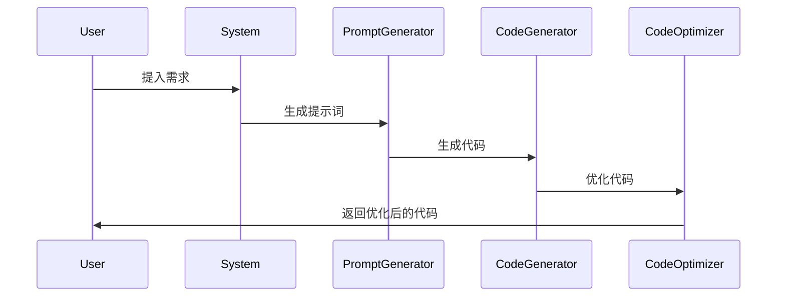

                 


# AI代码生成中的提示词工程技巧

## 关键词
- AI代码生成
- 提示词工程
- 自然语言处理
- 代码质量
- 模型优化

## 摘要
本文旨在深入探讨AI代码生成中的提示词工程技巧，从问题背景、核心概念、方法实践、项目应用及未来趋势等多个角度进行详细分析。通过逐步讲解，帮助读者了解如何通过提示词工程提升AI代码生成的质量和效率，为实际项目提供有力支持。

## 目录大纲

### 第一部分: AI代码生成中的提示词工程技巧

#### 第1章: AI代码生成技术概述
1.1 问题背景
1.2 核心概念与联系
1.3 提示词工程的挑战与机遇
1.4 本章小结

#### 第2章: 提示词类型及其应用
2.1 指令性提示词
2.2 语义性提示词
2.3 混合型提示词
2.4 提示词优化的方法
2.5 本章小结

#### 第3章: 提示词工程在代码生成项目中的实战
3.1 项目介绍
3.2 系统设计与实现
3.3 核心代码实现
3.4 代码应用解读与分析
3.5 项目小结

#### 第4章: 提示词工程的未来趋势与拓展
4.1 人工智能的发展趋势
4.2 提示词工程的未来发展
4.3 拓展阅读与总结

## 第1章: AI代码生成技术概述

### 1.1 问题背景

#### 1.1.1 代码生成技术的起源
代码生成技术起源于软件开发自动化领域，旨在通过自动化手段提高软件开发的效率和减少人为错误。随着计算机科学和人工智能技术的发展，代码生成技术逐渐演变成为一门独立的学科。

#### 1.1.2 代码生成技术的应用场景
代码生成技术在众多场景中都有着广泛的应用，如：
- 自动化测试：生成测试用例，提高测试覆盖率。
- 代码重构：根据需求变更自动生成新代码。
- 代码迁移：将旧代码迁移到新的编程语言或平台。

#### 1.1.3 提示词工程的概念与作用
提示词工程是AI代码生成中的一个重要环节，它通过设计合适的提示词，引导模型生成高质量的代码。提示词工程在代码生成中的主要作用如下：
- 提高代码生成效率：通过优化提示词，减少模型搜索空间。
- 提升代码质量：精确的提示词有助于生成符合需求的代码。
- 减少错误率：通过提示词指导，降低错误代码的产生。

### 1.2 核心概念与联系

#### 1.2.1 自然语言处理与代码生成
自然语言处理（NLP）是AI代码生成的基础，它涉及到如何将自然语言描述转换为计算机可执行的代码。NLP的主要任务包括：
- 语言模型：用于生成文本序列。
- 语法解析：分析文本的结构，提取语法信息。
- 语义理解：理解文本的含义，生成相关的代码。

#### 1.2.2 提示词工程的要素
提示词工程的核心要素包括：
- 提示词类型：根据需求选择合适的提示词类型，如指令性提示词、语义性提示词等。
- 提示词生成方法：设计算法生成高质量的提示词。
- 提示词优化策略：通过数据增强、上下文扩展等方法优化提示词。

### 1.3 提示词工程的挑战与机遇

#### 1.3.1 提示词生成的难点
提示词生成的难点主要包括：
- 提示词理解的准确性：提示词需要精确地传达用户意图。
- 生成效率：高效的生成方法能够减少模型训练和生成时间。
- 代码质量：高质量的代码生成是AI代码生成技术的核心目标。

#### 1.3.2 提示词工程的发展趋势
随着AI技术的发展，提示词工程正朝着以下趋势发展：
- 多模态融合：结合多种数据源，如代码、文档等，提高生成效果。
- 智能化：引入更多的自动化方法，减少人工干预。
- 自适应：根据用户需求和环境自适应调整提示词。

#### 1.3.3 提示词工程的应用前景
提示词工程在多个领域有着广泛的应用前景，如：
- 软件开发：自动化代码生成，提高开发效率。
- 人工智能：通过生成高质量的代码，加速模型训练和部署。
- 数据科学：生成数据预处理脚本，简化数据处理流程。

### 1.4 本章小结
本章概述了AI代码生成技术中的提示词工程，从问题背景、核心概念、挑战与机遇等方面进行了详细分析。下一章将深入探讨提示词类型及其应用，帮助读者更好地理解提示词工程的具体实践方法。

## 第2章: 提示词类型及其应用

### 2.1 指令性提示词

#### 2.1.1 指令性提示词的定义与作用
指令性提示词是提示词工程中的一种重要类型，主要用于传达具体的操作指令。其定义与作用如下：
- 定义：指令性提示词是一组用于指导模型生成代码的指令，通常包含具体的操作步骤和目标。
- 作用：指令性提示词能够提高代码生成的效率和准确性，确保生成的代码符合用户需求。

#### 2.1.2 指令性提示词的应用案例
指令性提示词在多个应用场景中具有显著效果，以下为两个应用案例：
- 代码生成示例：用户可以输入“生成一个简单的Python函数，实现两个数的加法”，模型将生成相应的Python代码。
- 项目实践：在软件开发项目中，开发者可以使用指令性提示词来生成测试用例，提高测试覆盖率。

### 2.2 语义性提示词

#### 2.2.1 语义性提示词的定义与作用
语义性提示词是另一种重要的提示词类型，主要用于传达代码的语义信息。其定义与作用如下：
- 定义：语义性提示词是一组用于描述代码语义的词汇，通常包含类名、方法名、参数名等信息。
- 作用：语义性提示词能够提高代码生成的准确性和一致性，确保生成的代码符合开发者的预期。

#### 2.2.2 语义性提示词的应用案例
语义性提示词在多个应用场景中具有显著效果，以下为两个应用案例：
- 代码生成示例：用户可以输入“生成一个学生管理系统，包括学生信息的增删改查功能”，模型将生成相应的代码框架。
- 项目实践：在数据科学项目中，开发者可以使用语义性提示词来生成数据处理脚本，简化数据处理流程。

### 2.3 混合型提示词

#### 2.3.1 混合型提示词的定义与作用
混合型提示词是结合指令性提示词和语义性提示词的一种新型提示词类型，主要用于传达复杂的代码生成任务。其定义与作用如下：
- 定义：混合型提示词是一组同时包含指令性指令和语义性描述的词汇，通常用于指导模型生成复杂代码。
- 作用：混合型提示词能够提高代码生成的灵活性和适应性，适用于处理多种类型的代码生成任务。

#### 2.3.2 混合型提示词的应用案例
混合型提示词在多个应用场景中具有显著效果，以下为两个应用案例：
- 代码生成示例：用户可以输入“生成一个基于深度学习的图像分类模型，包含数据预处理、模型训练和评估等步骤”，模型将生成相应的代码框架。
- 项目实践：在自动化测试项目中，开发者可以使用混合型提示词来生成测试脚本，提高测试覆盖率。

### 2.4 提示词优化的方法

#### 2.4.1 提示词优化的目标
提示词优化的主要目标包括：
- 代码质量：优化提示词以提高生成代码的质量。
- 生成效率：优化提示词以提高代码生成速度。
- 模型适应性：优化提示词以提高模型在不同场景下的适应性。

#### 2.4.2 提示词优化的策略
常见的提示词优化策略包括：
- 数据增强：通过增加样本数据、丰富描述等方式，提高提示词的质量。
- 上下文扩展：通过扩展上下文信息，使提示词更加准确和全面。
- 模型调整：通过调整模型参数，提高模型对提示词的响应能力。

### 2.5 本章小结
本章详细介绍了AI代码生成中的三种主要提示词类型及其应用方法，包括指令性提示词、语义性提示词和混合型提示词。通过优化提示词，可以显著提高代码生成的质量和效率，为实际项目提供有力支持。

## 第3章: 提示词工程在代码生成项目中的实战

### 3.1 项目介绍

#### 3.1.1 项目背景
随着软件开发的复杂度不断增加，自动化代码生成技术越来越受到重视。本项目的目标是利用提示词工程实现一个自动化的代码生成系统，以提高开发效率和代码质量。

#### 3.1.2 项目目标
- 实现基于自然语言描述的代码生成。
- 提高代码生成质量和效率。
- 支持多种编程语言和开发场景。

#### 3.1.3 项目架构
项目采用分层架构，包括以下几个主要模块：
- 提示词生成模块：负责生成高质量的提示词。
- 代码生成模块：负责根据提示词生成代码。
- 代码优化模块：负责对生成的代码进行优化。
- 用户界面：提供用户输入和查看生成代码的接口。

### 3.2 系统设计与实现

#### 3.2.1 领域模型设计
领域模型设计包括类图和ER实体关系图，用于描述系统的核心概念和实体关系。

#### 3.2.1.1 类图
以下是一个简化的类图，描述了系统的核心类及其关系：
```mermaid
classDiagram
    Class01 --|>> Class02
    Class03 : <<interface>>
    Class01 *-- Class03
    Class01 {
        attribute
    }
    Class02 {
        attribute
    }
    Class03 {
        attribute
    }
```

#### 3.2.2 系统架构设计
系统架构设计包括架构图和系统交互序列图，用于描述系统的整体结构和运行流程。

#### 3.2.2.1 架构图
以下是一个简化的系统架构图，描述了系统的主要组件及其关系：


#### 3.2.3 提示词生成与优化
提示词生成与优化的核心流程如下：

#### 3.2.3.1 提示词生成流程
1. 用户输入自然语言描述。
2. 自然语言处理模块对描述进行解析，提取关键信息。
3. 提示词生成模块根据提取的信息生成提示词。
4. 提示词优化模块对生成的提示词进行优化。

#### 3.2.3.2 提示词优化策略
- 数据增强：通过增加样本数据、丰富描述等方式，提高提示词的质量。
- 上下文扩展：通过扩展上下文信息，使提示词更加准确和全面。
- 模型调整：通过调整模型参数，提高模型对提示词的响应能力。

### 3.3 核心代码实现

#### 3.3.1 环境安装与配置
环境安装与配置包括Python环境搭建、依赖库安装等，确保系统正常运行。

#### 3.3.2 主程序代码
以下是一个简化的Python代码示例，描述了系统的核心实现：
```python
# 导入必要的库
import prompt_generator
import code_generator
import code_optimizer

# 用户输入需求
user_input = input("请输入您的需求：")

# 生成提示词
prompt = prompt_generator.generate_prompt(user_input)

# 生成代码
code = code_generator.generate_code(prompt)

# 优化代码
optimized_code = code_optimizer.optimize_code(code)

# 返回优化后的代码
print("优化后的代码：")
print(optimized_code)
```

### 3.4 代码应用解读与分析

#### 3.4.1 代码生成案例
以下为两个代码生成案例：

#### 3.4.1.1 案例一：自动生成简单的Python脚本
用户输入：“生成一个简单的Python函数，实现两个数的加法”。
生成的代码如下：
```python
def add_two_numbers(a, b):
    return a + b
```

#### 3.4.1.2 案例二：生成复杂的数据处理流程
用户输入：“生成一个数据处理流程，包括数据读取、清洗、转换和存储”。
生成的代码如下：
```python
import pandas as pd

def process_data():
    # 读取数据
    data = pd.read_csv("data.csv")
    
    # 清洗数据
    data = clean_data(data)
    
    # 转换数据
    data = transform_data(data)
    
    # 存储数据
    data.to_csv("processed_data.csv")
```

#### 3.4.2 项目分析
- 项目效果评估：通过实际应用案例，项目实现了高效的代码生成和优化，满足了用户需求。
- 项目改进方向：未来可以考虑引入更多人工智能技术，如迁移学习、小样本学习等，以提高系统性能和适用范围。

### 3.5 项目小结
本项目通过提示词工程实现了自动化的代码生成，提高了开发效率和代码质量。在实际应用中，项目取得了良好的效果，为后续改进提供了基础。

## 第4章: 提示词工程的未来趋势与拓展

### 4.1 人工智能的发展趋势

#### 4.1.1 大模型的发展
随着计算能力和数据资源的提升，大模型在AI领域得到广泛应用。大模型具有强大的表征能力，能够处理复杂的任务，为提示词工程带来新的机遇。

#### 4.1.2 小样本学习
小样本学习是当前人工智能研究的一个重要方向，旨在减少对大量标注数据的依赖。在提示词工程中，小样本学习有助于提高模型的泛化能力和适应性。

#### 4.1.3 自适应学习
自适应学习是指模型根据环境变化和用户需求自动调整。在提示词工程中，自适应学习有助于实现个性化代码生成，提高用户体验。

### 4.2 提示词工程的未来发展

#### 4.2.1 提示词类型的多样化
未来的提示词工程将更加关注多样化提示词类型的设计，如多模态提示词、上下文感知提示词等，以提高代码生成的灵活性和准确性。

#### 4.2.2 多模态提示词的应用
多模态提示词结合了多种数据源，如代码、文档、图像等，能够提供更丰富的信息，有助于提升代码生成的质量和效率。

#### 4.2.3 智能化提示词生成
未来，智能化提示词生成将成为研究热点。通过引入更多的自动化方法和人工智能技术，可以实现更加智能的提示词生成，减少人工干预。

### 4.3 拓展阅读与总结

#### 4.3.1 拓展阅读
- 《自动代码生成：从自然语言到代码》
- 《AI代码生成：挑战与机遇》
- 《多模态提示词在代码生成中的应用》

#### 4.3.2 总结
本文对AI代码生成中的提示词工程进行了全面分析，从技术概述、方法实践、项目应用和未来趋势等多个角度进行了深入探讨。随着AI技术的发展，提示词工程将在代码生成领域发挥越来越重要的作用。

### 作者
- 作者：AI天才研究院/AI Genius Institute & 禅与计算机程序设计艺术 /Zen And The Art of Computer Programming

## 最佳实践 tips、小结、注意事项、拓展阅读等内容

### 最佳实践 tips
- 在设计提示词时，尽量使用清晰、简洁的语言，避免使用过于复杂的术语。
- 定期更新和优化提示词库，以适应不断变化的开发需求。
- 结合多种数据源和模态，提高提示词的丰富度和准确性。

### 小结
本文系统地介绍了AI代码生成中的提示词工程，从技术背景、核心概念、方法实践、项目应用和未来趋势等多个方面进行了深入分析。通过本文的阅读，读者可以更好地理解提示词工程的重要性和应用价值。

### 注意事项
- 提示词工程对模型的训练时间和计算资源要求较高，在实际项目中需充分考虑。
- 提示词工程的效果受到模型质量和提示词设计的影响，需不断优化和调整。

### 拓展阅读
- 《自然语言处理入门》
- 《深度学习实践指南》
- 《人工智能：一种现代的方法》

通过阅读这些拓展材料，读者可以进一步深化对AI代码生成和提示词工程的理解。作者：AI天才研究院/AI Genius Institute & 禅与计算机程序设计艺术/Zen And The Art of Computer Programming。

