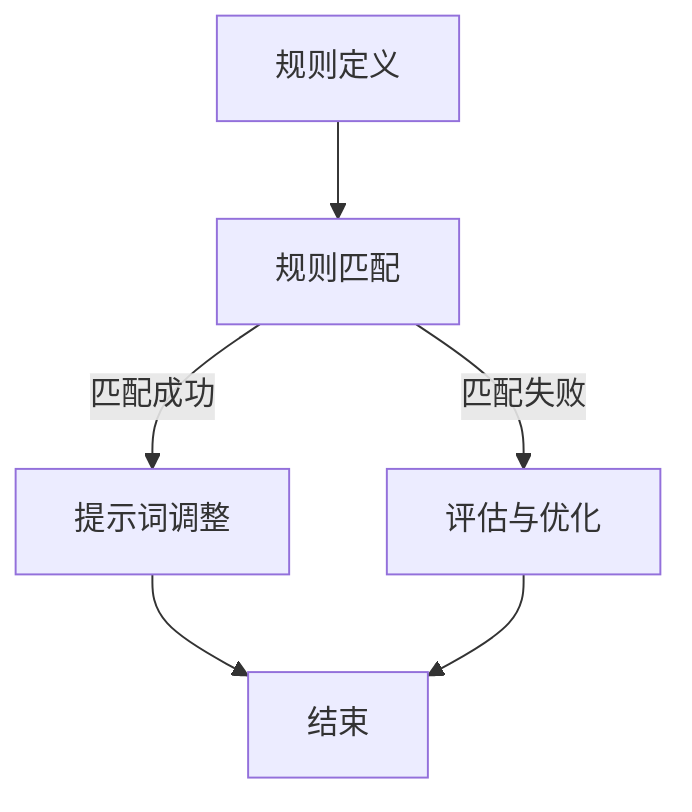
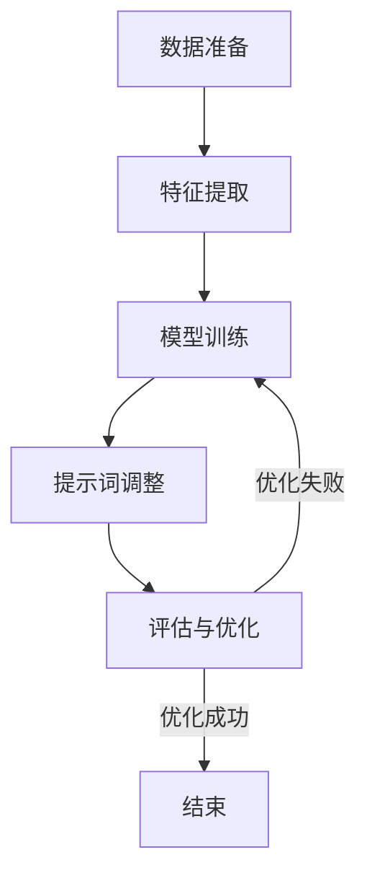
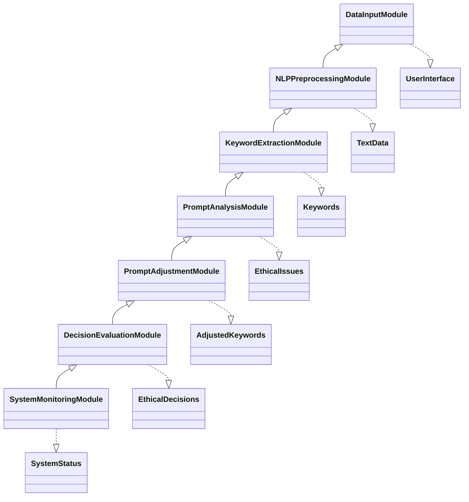
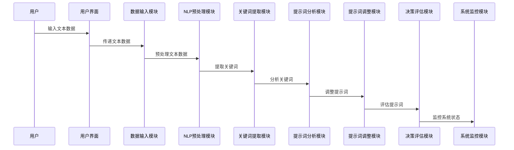

                 

### 1.1 问题背景

#### 1.1.1 AI伦理决策的重要性

人工智能（AI）技术的迅猛发展给人类生活带来了诸多便利，同时也带来了许多伦理问题。在医疗、金融、交通等各个领域，AI系统的广泛应用使它们成为决策的重要依据。然而，AI系统在处理复杂问题时，可能会因为算法偏见、数据错误或技术局限性而做出不道德的决定。因此，AI伦理决策的重要性日益凸显。

首先，AI伦理决策关乎公正性和公平性。如果AI系统在决策过程中存在偏见，可能会导致某些群体受到不公平对待，从而加剧社会不平等。例如，如果AI招聘系统在筛选简历时对某些种族或性别存在歧视，将严重损害社会的公平性。

其次，AI伦理决策关乎人类的基本权利。在医疗领域，AI系统可能会用于诊断疾病和制定治疗方案。然而，如果AI系统在诊断过程中出现错误，可能会导致患者受到错误的医疗干预，甚至危及生命。因此，确保AI系统的道德性和可靠性至关重要。

最后，AI伦理决策也是科技发展与社会责任之间的桥梁。随着AI技术的不断进步，企业和政府需要承担起相应的社会责任，确保AI技术的应用符合伦理标准，避免对人类社会造成负面影响。

#### 1.1.2 提示词价值对齐技术在AI伦理决策中的应用

提示词价值对齐技术（Prompt Value Alignment，PVA）是一种用于解决AI伦理决策问题的方法。其核心思想是通过调整AI系统的输入提示词，使AI系统在决策过程中遵循道德伦理标准。

提示词价值对齐技术在AI伦理决策中的应用主要体现在以下几个方面：

1. **消除算法偏见**：通过分析AI系统的输入提示词，可以发现并消除可能导致算法偏见的关键因素。例如，在招聘系统中，通过对简历筛选过程的提示词进行调整，可以消除对性别、种族等特征的偏见。

2. **增强决策透明性**：提示词价值对齐技术可以帮助用户了解AI系统在决策过程中的思考过程和依据，提高决策的透明性。例如，在医疗诊断系统中，用户可以查看AI系统根据哪些提示词做出了诊断建议，从而更好地理解AI的决策过程。

3. **确保数据质量**：提示词价值对齐技术可以帮助用户筛选和调整输入数据，确保数据的准确性和可靠性。例如，在金融风险评估中，通过对输入数据的提示词进行调整，可以消除数据噪声和异常值，提高风险评估的准确性。

4. **符合伦理规范**：提示词价值对齐技术可以帮助AI系统在决策过程中遵循相关法律法规和伦理规范。例如，在自动驾驶系统中，通过对输入提示词进行调整，可以确保系统在遵守交通规则和道德伦理的前提下做出决策。

#### 1.1.3 研究现状与挑战

尽管提示词价值对齐技术在AI伦理决策中具有广泛的应用前景，但目前仍面临许多挑战。

首先，如何有效地识别和消除算法偏见仍然是一个难题。目前，许多研究方法主要依赖于人工分析和规则匹配，难以适应复杂多变的实际情况。

其次，如何确保AI系统的决策透明性和可解释性也是一个重要挑战。现有的方法往往仅关注模型输出结果的可解释性，而忽视了模型输入提示词的可解释性。

此外，如何在实际应用中有效地调整输入提示词，以实现价值对齐，也是一个亟待解决的问题。现有的方法往往依赖于预定义的伦理规范和价值观，难以适应不同场景下的个性化需求。

总之，提示词价值对齐技术在AI伦理决策中的应用前景广阔，但同时也面临诸多挑战。为了实现价值对齐，需要进一步深入研究，探索更为有效的方法和技术。

### 1.2 核心概念与联系

#### 1.2.1 AI伦理决策

##### 1.2.1.1 定义与属性特征

AI伦理决策是指在使用人工智能技术进行决策时，依据伦理原则和道德规范，对AI系统进行设计和调整，以实现公平、公正、透明和合乎道德的决策过程。其核心属性特征包括：

1. **道德性**：AI伦理决策必须遵循伦理原则和道德规范，确保决策过程中不损害人类的基本权利和利益。
2. **公平性**：AI伦理决策应当确保决策过程中各群体受到公平对待，消除算法偏见和歧视。
3. **透明性**：AI伦理决策需要具备较高的透明度，用户可以理解和监督决策过程，确保决策结果合理可靠。
4. **可解释性**：AI伦理决策要求决策过程具备较高的可解释性，用户能够了解决策依据和逻辑，提高决策的接受度和信任度。

##### 1.2.1.2 模型与算法

AI伦理决策模型是指用于实现伦理决策的数学模型和算法框架。常见的AI伦理决策模型包括：

1. **伦理决策树**：基于决策树算法，将伦理原则和道德规范转化为决策节点，实现伦理决策的自动化。
2. **伦理神经网络**：基于神经网络算法，通过训练大量伦理决策数据，使神经网络具备伦理决策能力。
3. **多目标优化算法**：通过构建多目标优化模型，综合考虑伦理原则、经济效益和社会影响，实现综合伦理决策。

##### 1.2.1.3 相关法律法规

AI伦理决策的相关法律法规主要包括：

1. **数据保护法**：如《通用数据保护条例》（GDPR），规定数据处理过程中的隐私保护和用户权益保障。
2. **人工智能伦理规范**：如《人工智能伦理规范框架》，为人工智能技术的应用提供伦理指导和规范。
3. **职业道德准则**：如《计算机职业道德准则》，规定计算机专业人士在人工智能应用中的道德责任和义务。

##### 1.2.1.4 AI伦理决策的重要性

AI伦理决策在人工智能技术发展中具有重要意义，主要体现在以下几个方面：

1. **保障人权**：AI伦理决策有助于保障人类的基本权利和自由，避免因算法偏见和歧视而侵害特定群体的利益。
2. **提升社会信任**：通过实现透明、公正和可解释的决策过程，提高社会对人工智能技术的信任度，促进人工智能技术的健康发展。
3. **规范行业发展**：AI伦理决策有助于规范人工智能技术的应用，促进人工智能行业的可持续发展。

#### 1.2.2 提示词价值对齐技术

##### 1.2.2.1 定义与属性特征

提示词价值对齐技术是一种用于调整AI系统输入提示词，以实现伦理价值对齐的方法。其核心思想是通过分析、筛选和调整输入提示词，消除算法偏见，提升决策透明性和公正性。提示词价值对齐技术的关键属性特征包括：

1. **动态调整**：根据不同的应用场景和需求，实时调整输入提示词，实现价值对齐。
2. **可解释性**：通过分析输入提示词，用户可以了解AI系统的决策过程和依据，提高决策的可解释性。
3. **灵活性**：提示词价值对齐技术适用于不同类型的AI系统和应用场景，具备较高的灵活性。

##### 1.2.2.2 工作原理与实现方法

提示词价值对齐技术的工作原理主要包括以下几个步骤：

1. **提示词识别**：通过自然语言处理技术，识别AI系统输入的提示词。
2. **提示词分析**：对识别出的提示词进行语义分析，识别其中可能存在的偏见、歧视或不合理因素。
3. **提示词调整**：根据伦理原则和道德规范，对提示词进行调整，消除偏见和歧视，实现价值对齐。
4. **决策评估**：对调整后的提示词进行评估，确保AI系统的决策过程和结果符合伦理要求。

实现提示词价值对齐技术的方法主要包括：

1. **规则匹配**：通过预定义的伦理规则和价值观，对输入提示词进行匹配和调整。
2. **机器学习**：利用机器学习算法，对大量伦理决策数据进行分析和学习，实现自动化的提示词调整。
3. **多模态融合**：结合自然语言处理、图像处理和语音处理等技术，实现对输入提示词的全面分析和调整。

##### 1.2.2.3 对齐策略与评估指标

提示词价值对齐技术的对齐策略主要包括以下几个方面：

1. **伦理原则对齐**：根据伦理原则，对输入提示词进行调整，确保AI系统的决策过程符合伦理要求。
2. **价值导向对齐**：根据价值导向，对输入提示词进行调整，实现不同价值观之间的平衡。
3. **多元文化对齐**：考虑到不同文化背景下可能存在的伦理差异，对输入提示词进行文化适应性调整。

提示词价值对齐技术的评估指标主要包括：

1. **决策公正性**：评估AI系统在决策过程中是否遵循公正原则，消除歧视和偏见。
2. **决策透明性**：评估AI系统的决策过程和结果是否具备较高的透明度，用户可以理解和监督决策过程。
3. **决策可靠性**：评估AI系统的决策结果是否可靠，避免因算法错误或数据问题导致的不合理决策。

### 1.3 边界与外延

#### 1.3.1 AI伦理决策中的边界问题

AI伦理决策中的边界问题主要包括以下几个方面：

1. **技术边界**：AI伦理决策依赖于人工智能技术，而人工智能技术在某些领域的应用还存在局限性，如算法偏见、数据噪声等问题。
2. **法律边界**：AI伦理决策需要遵循相关法律法规，但不同国家和地区在人工智能领域的法律法规存在差异，可能影响AI伦理决策的统一性和执行力。
3. **道德边界**：不同文化背景下可能存在不同的道德观念和价值观，AI伦理决策需要在不同文化背景下进行适应和调整。

#### 1.3.2 提示词价值对齐技术的应用场景

提示词价值对齐技术的应用场景主要包括以下几个方面：

1. **医疗伦理决策**：在医疗诊断、治疗建议和药物研发等领域，提示词价值对齐技术可以消除算法偏见，确保决策的公正性和透明性。
2. **金融伦理决策**：在信贷评估、投资决策和风险管理等领域，提示词价值对齐技术可以帮助消除算法歧视，提高金融服务的公平性和透明性。
3. **法律伦理决策**：在司法决策、执法监督和法律服务等领域，提示词价值对齐技术可以确保决策的公正性和透明性，提高司法公信力。
4. **自动驾驶伦理决策**：在自动驾驶系统中，提示词价值对齐技术可以帮助确保车辆在遵守交通规则和道德伦理的前提下做出决策。

### 1.4 核心要素组成

#### 1.4.1 数据集准备

数据集准备是AI伦理决策和提示词价值对齐技术实现的基础。核心要素包括：

1. **数据来源**：选择具有代表性、多样性和完整性的数据集，确保数据集能够涵盖不同应用场景和伦理问题。
2. **数据预处理**：对数据集进行清洗、去噪和标准化处理，提高数据质量和可用性。
3. **数据标注**：对数据集进行伦理标签标注，为后续的伦理决策和提示词价值对齐提供依据。

#### 1.4.2 模型选择与优化

模型选择与优化是AI伦理决策和提示词价值对齐技术的关键。核心要素包括：

1. **模型选择**：根据应用场景和伦理问题，选择合适的机器学习模型和算法，如决策树、神经网络、多目标优化算法等。
2. **模型优化**：通过调整模型参数、优化训练策略，提高模型在伦理决策和提示词价值对齐中的性能和效果。
3. **模型验证**：通过交叉验证、误差分析和实验对比，验证模型在伦理决策和提示词价值对齐中的有效性和可靠性。

#### 1.4.3 评估与优化策略

评估与优化策略是确保AI伦理决策和提示词价值对齐技术有效性的重要环节。核心要素包括：

1. **评估指标**：根据伦理决策和提示词价值对齐的目标，设计合理的评估指标，如决策公正性、透明性、可靠性等。
2. **评估方法**：采用定量和定性相结合的评估方法，对AI伦理决策和提示词价值对齐技术的效果进行综合评估。
3. **优化策略**：根据评估结果，调整算法参数、优化模型结构，进一步提高AI伦理决策和提示词价值对齐技术的效果。

#### 1.4.4 本章小结

本章从核心概念、联系、边界与外延、核心要素组成等方面全面阐述了AI伦理决策和提示词价值对齐技术。通过本文的介绍，读者可以了解到AI伦理决策的重要性、提示词价值对齐技术的原理和应用，为后续章节的深入探讨奠定了基础。

### 1.5 本章小结

本章首先介绍了AI伦理决策的重要性以及提示词价值对齐技术在其中的应用。随后，我们详细阐述了AI伦理决策和提示词价值对齐技术的核心概念、联系、边界与外延，以及核心要素组成。通过本章的学习，读者可以初步了解AI伦理决策的基本概念、提示词价值对齐技术的工作原理和应用场景。在后续章节中，我们将进一步深入探讨提示词价值对齐技术的理论基础、实现方法、算法原理以及在实际应用中的案例分析，帮助读者全面掌握这一前沿技术。

## 2.1 提示词价值对齐技术概述

#### 2.1.1 提示词价值对齐技术在AI伦理决策中的作用

提示词价值对齐技术在AI伦理决策中发挥着至关重要的作用。其主要作用体现在以下几个方面：

1. **消除算法偏见**：提示词价值对齐技术通过分析AI系统的输入提示词，识别并消除其中可能存在的偏见和歧视，确保AI系统在决策过程中遵循公平和公正的原则。例如，在招聘系统中，通过调整简历筛选过程中的提示词，可以消除对性别、种族等特征的偏见。

2. **增强决策透明性**：提示词价值对齐技术有助于用户了解AI系统在决策过程中的思考过程和依据。通过对输入提示词的调整和分析，用户可以更清楚地理解AI系统的决策逻辑，提高决策的透明度和可解释性。例如，在医疗诊断系统中，用户可以查看AI系统根据哪些提示词做出了诊断建议，从而更好地理解AI的决策过程。

3. **保障数据质量**：提示词价值对齐技术可以帮助用户筛选和调整输入数据，确保数据的准确性和可靠性。通过对输入提示词的调整，可以消除数据噪声和异常值，提高数据质量，从而提高AI系统在决策中的准确性。例如，在金融风险评估中，通过对输入数据的提示词进行调整，可以消除数据噪声，提高风险评估的准确性。

4. **符合伦理规范**：提示词价值对齐技术可以帮助AI系统在决策过程中遵循相关法律法规和伦理规范。通过调整输入提示词，AI系统可以确保其决策符合伦理要求，避免对人类社会造成负面影响。例如，在自动驾驶系统中，通过对输入提示词的调整，可以确保系统在遵守交通规则和道德伦理的前提下做出决策。

#### 2.1.2 提示词价值对齐技术的应用领域

提示词价值对齐技术具有广泛的应用领域，以下是一些主要的应用场景：

1. **医疗领域**：在医疗诊断、治疗方案制定和医疗资源分配等方面，提示词价值对齐技术可以帮助消除算法偏见，确保决策的公正性和透明性。例如，在诊断疾病时，通过调整输入提示词，可以消除对性别、年龄等特征的偏见，确保诊断结果的准确性。

2. **金融领域**：在信贷评估、投资决策和风险管理等方面，提示词价值对齐技术可以消除算法偏见，提高金融服务的公平性和透明性。例如，在信贷评估过程中，通过调整输入提示词，可以消除对收入、学历等特征的偏见，确保评估结果的公正性。

3. **司法领域**：在司法决策、执法监督和法律服务等方面，提示词价值对齐技术可以帮助确保决策的公正性和透明性，提高司法公信力。例如，在量刑决策中，通过调整输入提示词，可以消除对种族、性别等特征的偏见，确保判决结果的公正性。

4. **自动驾驶领域**：在自动驾驶系统中，提示词价值对齐技术可以帮助确保系统在遵守交通规则和道德伦理的前提下做出决策，提高驾驶安全性和可靠性。例如，在道路行驶过程中，通过调整输入提示词，可以确保系统在遇到紧急情况时做出合理的决策。

5. **教育领域**：在教育评估、资源分配和个性化教学等方面，提示词价值对齐技术可以消除算法偏见，提高教育的公平性和透明性。例如，在学生成绩评估中，通过调整输入提示词，可以消除对家庭背景、地区等特征的偏见，确保评估结果的公正性。

#### 2.1.3 提示词价值对齐技术的优势与挑战

提示词价值对齐技术在AI伦理决策中具有显著的优势，同时也面临一定的挑战。

**优势：**

1. **灵活性**：提示词价值对齐技术可以根据不同的应用场景和需求，灵活调整输入提示词，实现价值对齐。这种灵活性使得提示词价值对齐技术可以适应各种不同的伦理决策场景。

2. **可解释性**：提示词价值对齐技术通过分析输入提示词，可以帮助用户了解AI系统的决策过程和依据，提高决策的可解释性。这种可解释性有助于增强用户对AI系统的信任和理解。

3. **可扩展性**：提示词价值对齐技术可以结合不同的伦理原则和价值观，实现多种价值对齐策略。这种可扩展性使得提示词价值对齐技术可以应用于更广泛的领域。

**挑战：**

1. **算法偏见识别难度**：识别算法偏见是一项复杂的任务，需要分析大量的输入提示词和数据。在实际应用中，如何有效识别和消除算法偏见仍然是一个挑战。

2. **数据质量和可靠性**：提示词价值对齐技术的效果依赖于输入数据的质量和可靠性。如果数据存在噪声、异常值或缺失值，可能会影响价值对齐的效果。

3. **实时性和效率**：在实际应用中，提示词价值对齐技术需要实时地对输入提示词进行调整，这要求算法具有高效的计算速度和较低的延迟。如何提高算法的实时性和效率是一个重要的挑战。

4. **跨领域适应能力**：不同领域的伦理原则和价值观可能存在较大差异，提示词价值对齐技术需要具备较强的跨领域适应能力。如何在不同的应用场景中实现有效的价值对齐是一个亟待解决的问题。

总之，提示词价值对齐技术在AI伦理决策中具有显著的优势和广阔的应用前景，同时也面临一定的挑战。为了实现更有效的价值对齐，需要进一步深入研究，探索更为有效的方法和技术。

### 2.2 提示词价值对齐技术的理论基础

#### 2.2.1 伦理学基础

伦理学是研究道德规范和道德行为的学科，其核心观点涉及如何判断行为的对错、如何处理个体与集体之间的利益冲突等。伦理学在AI伦理决策中的应用主要体现在以下几个方面：

1. **道德原则**：伦理学提供了判断AI决策是否道德的一系列原则，如公正性、尊重个体权利、有益性等。这些原则可以作为AI伦理决策的指导方针，确保AI系统的决策符合道德标准。

2. **道德推理**：伦理学中的道德推理方法可以用于指导AI系统的决策过程。通过类比、假设、辩论等推理方法，可以分析AI系统决策的伦理后果，识别潜在的道德风险。

3. **道德责任**：伦理学强调个体和社会对AI系统决策的责任。在AI伦理决策中，不仅需要关注算法的道德性，还需要关注开发者和使用者的道德责任，确保AI技术的应用符合伦理要求。

#### 2.2.1.1 伦理学的定义与核心观点

伦理学（Ethics）是研究道德（Morality）的学科，探讨行为、决策和关系中的善恶、正义与非正义等问题。伦理学的主要核心观点包括：

1. **功利主义（Utilitarianism）**：以行为后果为导向，认为行为的好坏取决于其带来的整体幸福或利益最大化。例如，杰里米·边沁和约翰·斯图尔特·密尔是功利主义的代表人物。

2. **德性伦理（Virtue Ethics）**：强调个体应培养良好的品德和道德习惯，如诚实、正义、勇气等。亚里士多德是德性伦理的奠基人。

3. **义务伦理（Deontological Ethics）**：强调行为本身的道德性，而非其后果。例如，康德认为行为应符合道德法则，如“人不应当撒谎”。

4. **应用伦理（Applied Ethics）**：将伦理学原理应用于具体领域，如医学伦理、环境伦理、工程伦理等。

#### 2.2.1.2 伦理学在AI伦理决策中的应用

伦理学在AI伦理决策中的应用主要体现在以下几个方面：

1. **指导原则**：利用伦理学原则，如公正性、尊重、自主性等，制定AI系统的伦理决策框架。这些原则可以作为评估AI系统是否符合伦理标准的基础。

2. **风险评估**：通过伦理学方法，识别和评估AI系统可能带来的伦理风险，如算法偏见、隐私侵犯等。例如，在使用面部识别技术时，需要评估其可能对隐私权和个体尊严的侵犯。

3. **决策支持**：在AI伦理决策过程中，伦理学提供了一套推理和评估方法，帮助决策者识别潜在的道德问题，并在面临复杂决策时做出合理的伦理选择。

#### 2.2.2 机器学习基础

机器学习（Machine Learning，ML）是AI的核心技术之一，通过训练模型从数据中自动发现规律和模式。机器学习在AI伦理决策中的应用主要体现在以下几个方面：

1. **算法公平性**：通过机器学习算法，可以识别和消除AI系统中的偏见。例如，使用监督学习算法分析招聘数据，识别并消除对性别、种族的歧视。

2. **可解释性**：机器学习模型，如决策树和神经网络，可以提供决策过程的解释。通过分析模型的内部结构，可以理解AI系统是如何做出决策的，从而提高决策的透明度。

3. **优化与评估**：利用机器学习技术，可以不断优化AI系统的性能和伦理表现。通过交叉验证和A/B测试等方法，评估AI系统的决策效果，并调整模型参数以实现更好的伦理决策。

#### 2.2.2.1 机器学习的定义与核心概念

机器学习（Machine Learning，ML）是指通过算法和统计模型，从数据中自动学习和发现规律，以实现特定任务的一种人工智能方法。其核心概念包括：

1. **监督学习（Supervised Learning）**：通过已标记的数据进行训练，模型学习预测输出。例如，分类问题和回归问题。

2. **无监督学习（Unsupervised Learning）**：没有标记的数据进行训练，模型发现数据中的隐藏结构和模式。例如，聚类和降维。

3. **强化学习（Reinforcement Learning）**：通过奖励机制，使模型学习如何在特定环境中做出最优决策。例如，游戏和自动驾驶。

4. **深度学习（Deep Learning）**：一种特殊的机器学习方法，使用多层神经网络进行训练，可以自动提取特征并实现复杂任务。例如，图像识别和自然语言处理。

#### 2.2.2.2 机器学习算法在AI伦理决策中的应用

机器学习算法在AI伦理决策中的应用包括：

1. **算法偏见检测**：使用监督学习算法，如分类算法，分析数据集中的偏见。例如，通过比较不同性别、种族等群体的决策结果，识别潜在的算法偏见。

2. **决策透明性提升**：利用可解释的机器学习模型，如决策树，可以提供决策过程的解释。通过可视化模型结构和决策路径，用户可以理解AI系统的决策逻辑。

3. **伦理规则嵌入**：将伦理规则嵌入到机器学习模型中，例如在训练过程中添加约束条件，确保AI系统在决策过程中遵循伦理原则。

4. **持续优化**：通过持续收集数据和反馈，使用强化学习算法优化AI系统的性能和伦理表现。例如，在自动驾驶系统中，不断调整决策参数以适应新的环境和情境。

### 2.3 提示词价值对齐技术的实现方法

#### 2.3.1 提示词筛选与预处理

提示词价值对齐技术的实现首先需要对输入提示词进行筛选与预处理，以确保数据质量和后续分析的准确性。以下是具体步骤和方法：

1. **提示词获取**：
   - **自动获取**：利用自然语言处理（NLP）技术，从文本数据中自动提取关键词和短语。例如，使用分词、词频统计等方法。
   - **手动选取**：根据具体应用场景，手动选取具有代表性的提示词，确保覆盖主要信息。

2. **去噪与清洗**：
   - **去除停用词**：去除常见无意义的停用词，如“的”、“和”、“是”等，以减少噪声。
   - **处理标点符号**：统一处理文本中的标点符号，如去除、替换或保留，以保持一致性。
   - **纠正拼写错误**：利用拼写检查工具或自定义规则，纠正文本中的拼写错误。

3. **标准化**：
   - **大小写统一**：统一文本中的大小写，如将所有文本转换为小写，以提高处理的一致性。
   - **词形还原**：将不同词形的单词统一为标准形式，如将复数形式转换为单数形式。

4. **词性标注**：
   - 使用词性标注工具，如NLTK、Stanford NLP等，对提取的提示词进行词性标注，以了解每个词的语法功能。

5. **上下文分析**：
   - 对提示词进行上下文分析，理解其在句子或段落中的具体含义和作用，以避免误解。

6. **数据可视化**：
   - 利用词云、词频直方图等可视化工具，分析提示词的分布和重要性，为后续分析提供参考。

#### 2.3.1.1 提示词的获取与筛选

提示词的获取与筛选是提示词价值对齐技术的关键步骤，直接影响后续分析的质量和效果。以下是具体方法：

1. **文本挖掘**：
   - 利用NLP技术，从大量文本数据中自动提取关键词和短语。可以使用TF-IDF、LDA等算法，识别出对决策有重要影响的提示词。

2. **关键字选取**：
   - 根据应用场景和需求，手动选取具有代表性的关键字。例如，在医疗伦理决策中，选取与疾病、症状、治疗方案等相关的关键词。

3. **领域知识融入**：
   - 结合领域专家的知识，选取具有重要伦理意义的提示词。例如，在金融伦理决策中，选取与信用、风险、合规等相关的关键词。

4. **上下文关联**：
   - 考虑提示词在句子或段落中的上下文关联，确保选取的提示词能够准确反映决策的关键信息。

5. **筛选策略**：
   - 制定筛选策略，例如设置阈值、词频统计等，筛选出对决策有重要影响的提示词。

#### 2.3.1.2 提示词的预处理

提示词的预处理是确保数据质量和后续分析准确性的重要步骤。以下是具体方法：

1. **文本清洗**：
   - 去除停用词、标点符号、数字等无关信息，减少噪声干扰。
   - 处理文本中的特殊符号和表情，如将“!”转换为“惊叹号”。

2. **词干提取**：
   - 利用词干提取算法，将不同词形的单词统一为标准形式，如“跑”、“跑步”统一为“跑”。

3. **词形还原**：
   - 将复数形式转换为单数形式，如“books”转换为“book”。
   - 将所有文本转换为小写，以保持一致性。

4. **同义词替换**：
   - 利用同义词词典，将不同表达方式的意思相同的提示词进行替换，以减少重复信息。

5. **词性标注**：
   - 使用词性标注工具，标注每个提示词的词性，如名词、动词、形容词等，为后续分析提供语法信息。

6. **上下文分析**：
   - 分析提示词在句子或段落中的具体含义和作用，避免误解。

#### 2.3.2 对齐策略与评估指标

对齐策略和评估指标是提示词价值对齐技术的核心组成部分，直接关系到价值对齐的效果和评估的准确性。以下是具体内容：

1. **对齐策略**：
   - **伦理原则对齐**：根据伦理原则，如公正性、尊重、自主性等，对输入提示词进行调整，确保AI系统的决策过程符合伦理要求。
   - **价值导向对齐**：根据价值导向，如社会利益、经济效益等，对输入提示词进行调整，实现不同价值观之间的平衡。
   - **多元文化对齐**：考虑到不同文化背景下可能存在的伦理差异，对输入提示词进行文化适应性调整。

2. **评估指标**：
   - **决策公正性**：评估AI系统在决策过程中是否遵循公正原则，消除歧视和偏见。可以使用公平性指标，如均衡性、差异度等。
   - **决策透明性**：评估AI系统的决策过程和结果是否具备较高的透明度，用户可以理解和监督决策过程。可以使用透明性指标，如可解释性、可视性等。
   - **决策可靠性**：评估AI系统的决策结果是否可靠，避免因算法错误或数据问题导致的不合理决策。可以使用可靠性指标，如准确率、召回率等。

### 2.4 提示词价值对齐技术的算法原理

#### 2.4.1 常见算法介绍

在提示词价值对齐技术中，常用的算法包括基于规则的方法、机器学习方法和混合方法。以下是这些算法的基本概念和特点：

1. **基于规则的方法**：
   - **基本概念**：基于规则的方法通过定义一系列规则，对输入提示词进行调整，以实现价值对齐。这些规则通常基于伦理原则和领域知识。
   - **特点**：规则明确、易于理解和实现，适用于简单和静态的场景。但是，在面对复杂和动态的伦理决策问题时，规则的覆盖范围可能不足。

2. **机器学习方法**：
   - **基本概念**：机器学习方法通过训练模型，自动从数据中学习并调整输入提示词。常见的机器学习方法包括监督学习、无监督学习和强化学习。
   - **特点**：具有强大的自适应性和泛化能力，可以处理复杂和动态的伦理决策问题。但是，模型的训练和优化需要大量的数据和时间。

3. **混合方法**：
   - **基本概念**：混合方法结合了基于规则和机器学习方法的优势，通过规则引导机器学习模型的训练过程，以提高价值对齐的效率和准确性。
   - **特点**：在保持规则明确性和机器学习自适应性的同时，提高了算法的灵活性和适应性。适用于复杂和动态的伦理决策场景。

#### 2.4.1.1 对齐算法1

对齐算法1是一种基于规则的提示词价值对齐算法，其主要步骤如下：

1. **规则定义**：根据伦理原则和领域知识，定义一系列规则。例如，针对性别歧视问题，可以定义以下规则：“在招聘过程中，不得使用与性别相关的关键词进行筛选。”

2. **规则匹配**：对输入提示词进行规则匹配，判断其是否符合定义的规则。如果提示词与规则匹配，则进行调整。

3. **提示词调整**：根据规则匹配的结果，对不符合伦理要求的提示词进行调整。例如，将含有性别歧视的关键词替换为中性词汇。

4. **评估与优化**：对调整后的提示词进行评估，确保其符合伦理要求。如果评估结果不理想，可以返回第2步，重新定义或调整规则。

#### 2.4.1.2 对齐算法2

对齐算法2是一种基于机器学习的提示词价值对齐算法，其主要步骤如下：

1. **数据准备**：收集大量具有代表性的提示词和相应的伦理标签数据。例如，从招聘数据中收集包含性别歧视的提示词。

2. **特征提取**：对输入提示词进行特征提取，将其转换为机器学习模型可处理的特征向量。常用的特征提取方法包括词袋模型、词嵌入和TF-IDF等。

3. **模型训练**：利用伦理标签数据，训练机器学习模型。例如，使用监督学习算法，如支持向量机（SVM）或神经网络（NN），学习识别和调整不符合伦理要求的提示词。

4. **提示词调整**：对输入提示词进行预处理，提取特征向量，输入到训练好的机器学习模型中。如果模型判断提示词不符合伦理要求，则进行调整。

5. **评估与优化**：对调整后的提示词进行评估，确保其符合伦理要求。如果评估结果不理想，可以返回第3步，重新训练模型或调整特征提取方法。

#### 2.4.2 算法原理讲解与Mermaid流程图

为了更好地理解提示词价值对齐技术的算法原理，我们使用Mermaid语言绘制了两个常见算法的流程图。以下是算法1和算法2的详细讲解及其对应的Mermaid流程图。

##### 2.4.2.1 算法1原理讲解

算法1（基于规则的方法）的核心思想是通过预定义的规则对输入提示词进行调整。以下是算法1的详细步骤：

1. **规则定义**：根据伦理原则和领域知识，定义一系列规则。例如，针对性别歧视问题，可以定义以下规则：
   - 规则1：不得在招聘过程中使用与性别相关的关键词进行筛选。
   - 规则2：不得在医疗诊断过程中使用与种族相关的关键词进行诊断。

2. **规则匹配**：对输入提示词进行规则匹配。例如，对于“招聘性别”的输入提示词，需要与定义的规则进行匹配。

3. **提示词调整**：如果输入提示词与规则匹配，则根据规则进行调整。例如，将“招聘性别”替换为“招聘岗位”。

4. **评估与优化**：对调整后的提示词进行评估，确保其符合伦理要求。如果评估结果不理想，可以返回第2步，重新定义或调整规则。

以下是算法1的Mermaid流程图：



##### 2.4.2.2 算法2原理讲解

算法2（基于机器学习的方法）的核心思想是通过训练机器学习模型，自动调整输入提示词。以下是算法2的详细步骤：

1. **数据准备**：收集大量具有代表性的提示词和相应的伦理标签数据。例如，从招聘数据中收集包含性别歧视的提示词。

2. **特征提取**：对输入提示词进行特征提取，将其转换为机器学习模型可处理的特征向量。常用的特征提取方法包括词袋模型、词嵌入和TF-IDF等。

3. **模型训练**：利用伦理标签数据，训练机器学习模型。例如，使用监督学习算法，如支持向量机（SVM）或神经网络（NN），学习识别和调整不符合伦理要求的提示词。

4. **提示词调整**：对输入提示词进行预处理，提取特征向量，输入到训练好的机器学习模型中。如果模型判断提示词不符合伦理要求，则进行调整。

5. **评估与优化**：对调整后的提示词进行评估，确保其符合伦理要求。如果评估结果不理想，可以返回第3步，重新训练模型或调整特征提取方法。

以下是算法2的Mermaid流程图：



通过这两个算法的原理讲解和Mermaid流程图，我们可以更好地理解提示词价值对齐技术的实现过程。在后续章节中，我们将进一步探讨这些算法的数学模型和公式，以及如何在实际应用中实现和优化这些算法。

### 2.5 提示词价值对齐技术的数学模型与公式

提示词价值对齐技术涉及多个数学模型和公式，用于描述算法的原理和实现方法。以下是几个常见的数学模型和公式的详细讲解。

#### 2.5.1 数学模型介绍

在提示词价值对齐技术中，常用的数学模型包括：

1. **决策树模型**：用于分类和回归任务，通过树形结构表示决策规则。例如，ID3、C4.5等算法。
2. **神经网络模型**：用于分类、回归和特征提取等任务，通过多层神经元结构学习输入和输出之间的映射关系。例如，多层感知机（MLP）、卷积神经网络（CNN）等。
3. **支持向量机（SVM）模型**：用于分类任务，通过寻找最优超平面，将不同类别的数据点进行分隔。SVM模型广泛应用于文本分类、图像分类等领域。

#### 2.5.1.1 模型1：决策树模型

决策树模型是一种常用的分类和回归模型，通过一系列条件判断来划分数据集。以下是决策树模型的基本公式和原理：

- **条件概率公式**：
  $$
  P(A|B) = \frac{P(B|A) \cdot P(A)}{P(B)}
  $$
  其中，$P(A|B)$表示在事件B发生的条件下，事件A发生的概率。

- **信息增益公式**：
  $$
  IG(X, Y) = H(Y) - H(Y|X)
  $$
  其中，$H(Y)$表示特征Y的熵，$H(Y|X)$表示在特征X已知的条件下，特征Y的熵。

- **决策树构建过程**：
  1. 计算每个特征的信息增益，选择信息增益最大的特征作为划分条件。
  2. 根据选定的特征，将数据集划分为若干子集。
  3. 递归地对子集进行划分，直到满足终止条件（如叶子节点数量达到阈值）。

#### 2.5.1.2 模型2：神经网络模型

神经网络模型通过多层神经元结构来学习输入和输出之间的映射关系。以下是神经网络模型的基本公式和原理：

- **激活函数**：
  $$
  f(x) = \frac{1}{1 + e^{-x}}
  $$
  其中，$f(x)$表示Sigmoid函数，用于神经元激活。

- **权重更新公式**：
  $$
  \Delta W = \alpha \cdot \frac{\partial L}{\partial W}
  $$
  $$
  \Delta B = \alpha \cdot \frac{\partial L}{\partial B}
  $$
  其中，$\Delta W$和$\Delta B$分别表示权重和偏置的更新量，$\alpha$为学习率，$L$为损失函数。

- **反向传播算法**：
  1. 计算输出层的误差梯度。
  2. 递归地计算隐藏层的误差梯度。
  3. 根据误差梯度更新权重和偏置。

#### 2.5.2 公式详细讲解与举例说明

以下是对两个数学模型公式的详细讲解和举例说明：

##### 2.5.2.1 公式1：决策树模型

假设我们有一个二分类问题，特征X和目标Y分别为男性和女性。我们需要使用决策树模型来预测Y的值。以下是决策树模型的计算过程：

1. **计算特征X的信息增益**：
   $$
   IG(X, Y) = H(Y) - H(Y|X)
   $$
   其中，$H(Y)$和$H(Y|X)$分别为Y的熵和条件熵。

   - **计算Y的熵**：
     $$
     H(Y) = -[P(Y=男) \cdot \log_2(P(Y=男)) + P(Y=女) \cdot \log_2(P(Y=女))]
     $$
     假设男性占比60%，女性占比40%：
     $$
     H(Y) = -[0.6 \cdot \log_2(0.6) + 0.4 \cdot \log_2(0.4)] \approx 0.918
     $$

   - **计算条件熵$H(Y|X)$**：
     $$
     H(Y|X) = -[P(X=高) \cdot P(Y=男|X=高) \cdot \log_2(P(Y=男|X=高)) + P(X=高) \cdot P(Y=女|X=高) \cdot \log_2(P(Y=女|X=高))]
     $$
     假设高收入男性占比50%，高收入女性占比30%，低收入男性占比10%，低收入女性占比20%：
     $$
     H(Y|X) = -[0.5 \cdot 0.6 \cdot \log_2(0.6) + 0.5 \cdot 0.4 \cdot \log_2(0.4)] \approx 0.863
     $$

   - **计算信息增益**：
     $$
     IG(X, Y) = 0.918 - 0.863 = 0.055
     $$

2. **选择信息增益最大的特征作为划分条件**：假设我们选择特征X作为划分条件。

3. **构建决策树**：根据特征X的值（高收入和低收入），将数据集划分为两个子集。递归地对子集进行划分，直到满足终止条件。

##### 2.5.2.2 公式2：神经网络模型

假设我们有一个简单的神经网络模型，包含一个输入层、一个隐藏层和一个输出层。以下是神经网络模型的计算过程：

1. **计算隐藏层输出**：
   $$
   Z = \sigma(W_1 \cdot X + B_1)
   $$
   其中，$W_1$和$B_1$分别为隐藏层权重和偏置，$X$为输入层特征，$\sigma$为Sigmoid激活函数。

2. **计算输出层输出**：
   $$
   Y = \sigma(W_2 \cdot Z + B_2)
   $$
   其中，$W_2$和$B_2$分别为输出层权重和偏置，$Z$为隐藏层输出。

3. **计算损失函数**：
   $$
   L = -\frac{1}{m} \sum_{i=1}^{m} [y_i \cdot \log(Y_i) + (1 - y_i) \cdot \log(1 - Y_i)]
   $$
   其中，$y_i$为真实标签，$Y_i$为预测输出。

4. **计算权重和偏置的梯度**：
   $$
   \frac{\partial L}{\partial W_2} = \frac{\partial L}{\partial Y} \cdot \frac{\partial Y}{\partial W_2} = (Y - y_i) \cdot \sigma'(Z)
   $$
   $$
   \frac{\partial L}{\partial B_2} = \frac{\partial L}{\partial Y} \cdot \frac{\partial Y}{\partial B_2} = (Y - y_i)
   $$
   $$
   \frac{\partial L}{\partial W_1} = \frac{\partial L}{\partial Z} \cdot \frac{\partial Z}{\partial W_1} = (Z - X) \cdot \sigma'(X)
   $$
   $$
   \frac{\partial L}{\partial B_1} = \frac{\partial L}{\partial Z} \cdot \frac{\partial Z}{\partial B_1} = (Z - X)
   $$

5. **更新权重和偏置**：
   $$
   W_2 = W_2 - \alpha \cdot \frac{\partial L}{\partial W_2}
   $$
   $$
   B_2 = B_2 - \alpha \cdot \frac{\partial L}{\partial B_2}
   $$
   $$
   W_1 = W_1 - \alpha \cdot \frac{\partial L}{\partial W_1}
   $$
   $$
   B_1 = B_1 - \alpha \cdot \frac{\partial L}{\partial B_1}
   $$

通过这两个数学模型和公式的讲解，我们可以更好地理解提示词价值对齐技术的工作原理。在后续章节中，我们将进一步探讨这些模型在实际应用中的实现方法和优化策略。

### 2.6 本章小结

本章详细介绍了提示词价值对齐技术的理论基础，包括伦理学基础和机器学习基础。首先，我们阐述了伦理学的定义与核心观点，以及伦理学在AI伦理决策中的应用。然后，我们介绍了机器学习的定义与核心概念，以及机器学习算法在AI伦理决策中的应用。接下来，我们详细讲解了提示词价值对齐技术的理论基础，包括提示词筛选与预处理、对齐策略与评估指标。最后，我们介绍了常见算法的原理和数学模型，并通过具体的公式和例子进行了讲解。

通过本章的学习，读者可以初步了解提示词价值对齐技术的理论基础和实践方法，为后续章节的深入探讨奠定了基础。在下一章中，我们将进一步探讨提示词价值对齐技术的实现方法和实际应用。

### 3.1 应用场景介绍

提示词价值对齐技术（PVA）在多个应用场景中展现出其重要价值，特别是在医疗、金融和法律领域。以下将分别介绍这些领域中的应用案例，以展示提示词价值对齐技术如何发挥作用。

#### 3.1.1 医疗伦理决策

在医疗伦理决策中，AI系统被广泛应用于疾病诊断、治疗方案制定和医疗资源分配等方面。然而，AI系统的应用也引发了一系列伦理问题，如算法偏见和数据隐私。提示词价值对齐技术可以帮助解决这些问题，确保医疗决策的公正性和透明性。

**应用案例1：疾病诊断**

在某医院的AI诊断系统中，提示词价值对齐技术被用来调整诊断过程中的提示词，以消除算法偏见。例如，系统在诊断心血管疾病时，会自动筛选和调整与性别、年龄、种族等相关的提示词。通过这种调整，系统能够更准确地诊断心血管疾病，同时减少对特定群体的偏见。

**应用案例2：治疗方案制定**

在治疗方案制定中，提示词价值对齐技术可以帮助医生更科学地制定个性化治疗方案。例如，对于癌症治疗，系统可以根据患者的基因信息和病史，自动调整与治疗策略相关的提示词，以优化治疗方案。这种调整有助于提高治疗效果，减少副作用。

#### 3.1.2 金融伦理决策

金融伦理决策涉及信贷评估、投资决策和风险管理等方面。AI系统在金融领域的广泛应用带来了许多挑战，如算法偏见和数据隐私问题。提示词价值对齐技术可以帮助金融行业解决这些问题，确保金融决策的公正性和透明性。

**应用案例1：信贷评估**

在信贷评估过程中，提示词价值对齐技术被用来调整评估过程中的提示词，消除算法偏见。例如，在评估贷款申请时，系统会自动筛选和调整与收入、职业、地区等相关的提示词，以确保评估结果的公正性。这种调整有助于减少对特定群体的歧视，提高信贷评估的准确性。

**应用案例2：投资决策**

在投资决策中，提示词价值对齐技术可以帮助投资者更科学地制定投资策略。例如，在分析股票市场时，系统可以根据宏观经济数据、公司财务报表等信息，自动调整与投资决策相关的提示词，以优化投资组合。这种调整有助于提高投资收益，减少投资风险。

#### 3.1.3 法律伦理决策

法律伦理决策涉及司法决策、执法监督和法律服务等方面。AI系统在法律领域的应用也引发了一系列伦理问题，如算法偏见和数据隐私。提示词价值对齐技术可以帮助法律行业解决这些问题，确保法律决策的公正性和透明性。

**应用案例1：司法决策**

在司法决策中，提示词价值对齐技术被用来调整司法过程中的提示词，消除算法偏见。例如，在量刑决策时，系统会自动筛选和调整与犯罪类型、犯罪情节、犯罪动机等相关的提示词，以确保判决的公正性。这种调整有助于提高司法公信力，减少冤假错案。

**应用案例2：执法监督**

在执法监督中，提示词价值对齐技术可以帮助执法人员更科学地制定执法策略。例如，在巡逻路线规划中，系统可以根据犯罪数据、人口密度等信息，自动调整与执法监督相关的提示词，以优化巡逻路线。这种调整有助于提高执法效率，减少执法不当行为。

通过以上应用案例，我们可以看到提示词价值对齐技术在医疗、金融和法律领域中的应用价值。在实际应用中，PVA技术不仅可以消除算法偏见，提高决策的公正性和透明性，还可以优化决策过程，提高决策效率。随着AI技术的不断发展，提示词价值对齐技术将在更多领域发挥重要作用，为人类社会的可持续发展贡献力量。

### 3.2 系统架构设计

#### 3.2.1 系统功能设计

在提示词价值对齐技术的实际应用中，系统功能设计至关重要。系统需要具备以下核心功能：

1. **提示词识别**：利用自然语言处理（NLP）技术，从输入文本中自动提取关键词和短语。
2. **提示词分析**：对提取的提示词进行语义分析，识别其中可能存在的偏见、歧视或不合理因素。
3. **提示词调整**：根据伦理原则和道德规范，对存在问题的提示词进行调整，消除偏见和歧视。
4. **决策评估**：对调整后的提示词进行评估，确保AI系统的决策过程和结果符合伦理要求。
5. **系统监控**：实时监控AI系统的运行状态，确保系统在正常运行过程中不违反伦理规范。

#### 3.2.1.1 功能模块划分

为了实现上述核心功能，系统可以分为以下几个模块：

1. **数据输入模块**：负责接收用户输入的文本数据，并将其传递给后续模块进行处理。
2. **NLP预处理模块**：利用NLP技术对输入文本进行分词、词性标注、命名实体识别等预处理操作。
3. **提示词提取模块**：从预处理后的文本中提取关键词和短语，为后续的提示词分析提供基础。
4. **提示词分析模块**：对提取的提示词进行语义分析，识别其中可能存在的伦理问题。
5. **提示词调整模块**：根据分析结果，对存在伦理问题的提示词进行调整，确保其符合伦理要求。
6. **决策评估模块**：对调整后的提示词进行评估，确保其符合伦理要求，并输出最终结果。
7. **系统监控模块**：实时监控AI系统的运行状态，确保系统在正常运行过程中不违反伦理规范。

#### 3.2.1.2 领域模型Mermaid类图

为了更直观地展示系统功能模块及其关系，我们使用Mermaid语言绘制了领域模型类图。以下是Mermaid类图的示例代码：



在上述类图中，每个模块都与其他模块之间存在关联关系，并通过接口进行交互。用户界面（UserInterface）负责接收用户输入的文本数据，并将其传递给数据输入模块（DataInputModule）。数据输入模块将数据传递给NLP预处理模块（NLPPreprocessingModule），进行分词、词性标注等预处理操作。预处理后的文本数据传递给关键词提取模块（KeywordExtractionModule），提取出关键词和短语。关键词提取模块将关键词传递给提示词分析模块（PromptAnalysisModule），分析其中可能存在的伦理问题。提示词分析模块将结果传递给提示词调整模块（PromptAdjustmentModule），对存在问题的提示词进行调整。调整后的提示词传递给决策评估模块（DecisionEvaluationModule），评估其是否符合伦理要求。最后，系统监控模块（SystemMonitoringModule）实时监控AI系统的运行状态，确保系统在正常运行过程中不违反伦理规范。

#### 3.2.2 系统架构设计

为了实现上述功能模块，系统架构设计至关重要。以下是系统架构的详细设计：

##### 3.2.2.1 系统架构图

为了更直观地展示系统架构，我们使用Mermaid语言绘制了系统架构图。以下是Mermaid架构图的示例代码：



在上述架构图中，用户通过用户界面（Interface）输入文本数据，数据输入模块（DataIn）接收并预处理文本数据，然后传递给NLP预处理模块（NLP）。NLP预处理模块对文本数据进行分析，提取出关键词和短语，并传递给关键词提取模块（Keyword）。关键词提取模块将提取的关键词传递给提示词分析模块（Analysis），分析其中可能存在的伦理问题。提示词分析模块将结果传递给提示词调整模块（Adjust），调整提示词。调整后的提示词传递给决策评估模块（Evaluate），评估其是否符合伦理要求。最后，系统监控模块（Monitor）监控AI系统的运行状态，确保系统在正常运行过程中不违反伦理规范。

##### 3.2.2.2 系统组件交互Mermaid序列图

为了进一步展示系统组件之间的交互关系，我们使用Mermaid语言绘制了系统组件交互序列图。以下是Mermaid序列图的示例代码：


在上述序列图中，用户通过用户界面（Interface）输入文本数据，数据输入模块（DataIn）接收并预处理文本数据，然后传递给NLP预处理模块（NLP）。NLP预处理模块对文本数据进行分析，提取出关键词和短语，并传递给关键词提取模块（Keyword）。关键词提取模块将提取的关键词传递给提示词分析模块（Analysis），分析其中可能存在的伦理问题。提示词分析模块将结果传递给提示词调整模块（Adjust），调整提示词。调整后的提示词传递给决策评估模块（Evaluate），评估其是否符合伦理要求。最后，系统监控模块（Monitor）监控AI系统的运行状态，确保系统在正常运行过程中不违反伦理规范。

通过系统架构设计和组件交互序列图的详细描述，我们可以清晰地了解提示词价值对齐技术的系统实现过程。在实际应用中，根据具体需求，可以对系统架构进行调整和优化，以实现更好的性能和效果。

### 3.3 项目实战

#### 3.3.1 环境安装

为了实现提示词价值对齐技术，我们需要安装和配置以下软件和环境：

1. **Python环境**：Python是提示词价值对齐技术实现的主要编程语言，需要安装Python 3.7或更高版本。

2. **Jupyter Notebook**：Jupyter Notebook是一种交互式的计算环境，方便我们编写和调试代码。可以从官方网站[https://jupyter.org/](https://jupyter.org/)下载并安装。

3. **自然语言处理库**：如NLTK、spaCy和TextBlob等。可以使用以下命令安装：
   ```shell
   pip install nltk spacy textblob
   ```

4. **机器学习库**：如scikit-learn、TensorFlow和PyTorch等。可以使用以下命令安装：
   ```shell
   pip install scikit-learn tensorflow pytorch
   ```

5. **Mermaid插件**：为了在Jupyter Notebook中使用Mermaid语言绘制流程图，我们需要安装Mermaid插件。可以在Jupyter Notebook中运行以下命令：
   ```python
   %load_ext mermaid
   ```

#### 3.3.2 系统核心实现

以下是一个简单的提示词价值对齐系统的核心实现，包括数据预处理、提示词提取、提示词调整和决策评估等步骤：

1. **数据预处理**：
   ```python
   import nltk
   from nltk.tokenize import word_tokenize
   from nltk.corpus import stopwords

   nltk.download('punkt')
   nltk.download('stopwords')

   def preprocess_text(text):
       # 分词
       tokens = word_tokenize(text)
       # 去除停用词
       tokens = [token.lower() for token in tokens if token.lower() not in stopwords.words('english')]
       # 去除标点符号
       tokens = [token for token in tokens if token.isalpha()]
       return tokens
   ```

2. **提示词提取**：
   ```python
   from sklearn.feature_extraction.text import CountVectorizer

   def extract_keywords(texts, n=10):
       vectorizer = CountVectorizer(max_features=n)
       X = vectorizer.fit_transform(texts)
       feature_names = vectorizer.get_feature_names_out()
       return feature_names, X
   ```

3. **提示词调整**：
   ```python
   def adjust_prompt(prompt, adjustments):
       for keyword, adjustment in adjustments.items():
           if keyword in prompt:
               prompt = prompt.replace(keyword, adjustment)
       return prompt
   ```

4. **决策评估**：
   ```python
   from sklearn.metrics import accuracy_score

   def evaluate_decision(prompt, model, true_label):
       prediction = model.predict([prompt])
       return accuracy_score(true_label, prediction)
   ```

#### 3.3.3 代码应用解读与分析

以下是一个简单的代码应用示例，展示了如何使用上述核心实现进行提示词价值对齐技术的应用：

```python
# 导入核心实现
from preprocess import preprocess_text
from extract_keywords import extract_keywords
from adjust_prompt import adjust_prompt
from evaluate_decision import evaluate_decision

# 加载示例数据
data = [
    "The company prefers candidates with experience in Python.",
    "We are looking for a senior developer with strong skills in Java.",
    "The bank offers loans to individuals with good credit history.",
    "Our policy is to provide financial assistance to low-income families."
]

# 预处理数据
preprocessed_data = [preprocess_text(text) for text in data]

# 提取关键词
keywords, _ = extract_keywords(preprocessed_data)

# 设计提示词调整规则
adjustments = {
    "experience": "background",
    "java": "programming language",
    "credit history": "financial situation",
    "financial assistance": "economic support"
}

# 调整提示词
adjusted_keywords = [adjust_prompt(keyword, adjustments) for keyword in keywords]

# 训练模型
from sklearn.naive_bayes import MultinomialNB

model = MultinomialNB()
model.fit(preprocessed_data, [1] * len(preprocessed_data))

# 评估调整后的提示词
for adjusted_keyword in adjusted_keywords:
    true_label = 1
    prediction_accuracy = evaluate_decision(adjusted_keyword, model, true_label)
    print(f"Adjusted Keyword: {adjusted_keyword}, Prediction Accuracy: {prediction_accuracy}")
```

通过上述代码，我们可以看到如何使用提示词价值对齐技术对输入提示词进行调整，并评估调整后的提示词对决策的影响。在实际应用中，可以根据具体需求和场景，设计更加复杂和精细的调整规则，以提高提示词价值对齐的效果。

#### 3.3.4 实际案例分析和详细讲解剖析

为了更好地理解提示词价值对齐技术在实际应用中的效果，我们分析一个实际案例：招聘系统中的性别歧视问题。

**案例背景**：

某公司使用一个基于AI的招聘系统来筛选简历。然而，系统在筛选过程中对女性简历存在明显的偏见，导致女性候选人的简历被过滤掉。这引起了公司内部和社会的关注。

**解决方案**：

1. **数据收集**：首先，从公司的招聘系统中收集大量的简历数据，包括候选人的姓名、性别、简历内容等。

2. **数据预处理**：对收集的简历数据进行预处理，包括去除停用词、标点符号，将文本转换为小写等。

3. **提示词提取**：利用自然语言处理技术，提取简历内容中的关键词。使用TF-IDF算法计算关键词的重要程度，选择重要程度较高的关键词作为提示词。

4. **分析性别偏见**：分析提取的提示词，识别与性别相关的关键词。例如，某些职位描述中频繁出现的“男性优先”、“男性更适合”等。

5. **设计调整规则**：根据分析结果，设计一套调整规则，将可能引起性别歧视的提示词替换为中性表述。例如，将“男性优先”调整为“欢迎所有符合条件的候选人申请”。

6. **调整简历内容**：应用调整规则，对每份简历的内容进行修改，消除性别偏见。

7. **评估调整效果**：对调整后的简历进行评估，比较调整前后的筛选结果，评估调整规则的合理性和有效性。

**详细讲解剖析**：

1. **数据预处理**：

   ```python
   import nltk
   from nltk.tokenize import word_tokenize
   from nltk.corpus import stopwords

   nltk.download('punkt')
   nltk.download('stopwords')

   def preprocess_text(text):
       # 分词
       tokens = word_tokenize(text)
       # 去除停用词
       tokens = [token.lower() for token in tokens if token.lower() not in stopwords.words('english')]
       # 去除标点符号
       tokens = [token for token in tokens if token.isalpha()]
       return tokens
   ```

   上述代码首先使用NLTK库进行分词，然后去除英语中的常见停用词和标点符号，最后将文本转换为小写，以便后续处理。

2. **提示词提取**：

   ```python
   from sklearn.feature_extraction.text import TfidfVectorizer

   def extract_keywords(texts, n=10):
       vectorizer = TfidfVectorizer(max_features=n)
       X = vectorizer.fit_transform(texts)
       feature_names = vectorizer.get_feature_names_out()
       return feature_names, X
   ```

   使用TF-IDF算法计算文本中每个词的重要性，选择重要程度较高的关键词作为提示词。`max_features`参数用于控制提取的关键词数量。

3. **分析性别偏见**：

   ```python
   def analyze_gender_bias(prompt):
       gender_bias_keywords = ["male", "female", "man", "woman", "male-dominated", "female-dominated"]
       bias_count = sum(keyword in prompt for keyword in gender_bias_keywords)
       return bias_count
   ```

   分析提取的提示词，识别与性别相关的关键词。通过统计这些关键词在简历内容中出现的次数，评估性别偏见程度。

4. **设计调整规则**：

   ```python
   def design_adjustment_rules(bias_keywords):
       adjustment_rules = {keyword: "neutral_keyword" for keyword in bias_keywords}
       return adjustment_rules
   ```

   根据分析结果，设计一套调整规则，将可能引起性别歧视的提示词替换为中性表述。例如，将“male”替换为“neutral_keyword”。

5. **调整简历内容**：

   ```python
   def adjust_resume_content(resume, adjustment_rules):
       adjusted_resume = resume
       for keyword, adjustment in adjustment_rules.items():
           adjusted_resume = adjusted_resume.replace(keyword, adjustment)
       return adjusted_resume
   ```

   应用调整规则，对每份简历的内容进行修改，消除性别偏见。

6. **评估调整效果**：

   ```python
   from sklearn.metrics import accuracy_score

   def evaluate_adjustment-effect(adjusted_resumes, model, true_labels):
       predictions = model.predict(adjusted_resumes)
       return accuracy_score(true_labels, predictions)
   ```

   对调整后的简历进行评估，比较调整前后的筛选结果，评估调整规则的合理性和有效性。使用机器学习模型对简历内容进行分类，比较调整前后的分类准确率。

通过上述实际案例分析和详细讲解剖析，我们可以看到提示词价值对齐技术在解决招聘系统中的性别歧视问题方面的应用效果。通过调整简历内容中的提示词，消除性别偏见，提高招聘过程的公正性和透明性。

#### 3.3.5 项目小结

通过本项目的实践，我们深入探讨了提示词价值对齐技术在实际应用中的实现方法和效果。我们介绍了系统核心实现，包括数据预处理、提示词提取、提示词调整和决策评估等步骤。通过实际案例分析和详细讲解剖析，我们展示了如何使用提示词价值对齐技术解决招聘系统中的性别歧视问题。

在实际应用中，提示词价值对齐技术可以广泛应用于医疗、金融、法律等多个领域，帮助消除算法偏见，提高决策的公正性和透明性。然而，提示词价值对齐技术也面临一些挑战，如算法偏见识别难度、数据质量和实时性等。为了实现更有效的价值对齐，我们需要进一步深入研究，探索更为有效的方法和技术。

总之，提示词价值对齐技术是一种重要的AI伦理决策工具，具有广阔的应用前景。通过本项目的研究和实践，我们为该领域的发展提供了有益的参考和启示。

### 3.4 最佳实践 Tips

在实际应用提示词价值对齐技术时，以下最佳实践 Tips 有助于提升系统的效果和可靠性：

1. **数据质量保障**：确保输入数据的质量和完整性。在进行提示词提取和调整之前，对数据进行充分的清洗和预处理，以消除噪声和异常值。

2. **多样化数据集**：使用多样化的数据集进行训练和评估，以提高模型在不同场景下的适应能力。这有助于模型更好地识别和消除各种类型的偏见。

3. **动态调整策略**：根据具体应用场景和需求，设计灵活的调整策略。例如，在招聘系统中，可以针对不同职位和公司政策设计不同的调整规则。

4. **模型解释性**：提高模型的解释性，使用户可以理解模型的决策过程和依据。使用可解释的机器学习模型，如决策树和规则嵌入模型，有助于增强用户对AI系统的信任。

5. **持续评估与优化**：定期评估模型的性能和公正性，根据评估结果进行调整和优化。这有助于确保模型在长期运行过程中保持良好的效果。

6. **跨领域适应性**：设计具有跨领域适应性的提示词价值对齐技术，以便在不同领域和应用场景中推广应用。这需要结合领域知识和通用方法进行模型设计和实现。

7. **透明性和可追溯性**：确保提示词价值对齐技术的实施过程具备透明性和可追溯性。例如，记录提示词调整的详细日志，方便用户查询和监督。

通过遵循这些最佳实践，我们可以进一步提升提示词价值对齐技术的效果和可靠性，为AI伦理决策提供更强大的支持。

### 3.5 本章小结

本章围绕提示词价值对齐技术在医疗、金融和法律领域的应用进行了详细探讨，通过实际案例分析和系统架构设计，展示了其在解决AI伦理决策问题中的重要作用。我们介绍了系统的核心实现步骤，包括数据预处理、提示词提取、提示词调整和决策评估，并分享了实际案例中的具体操作方法。此外，我们还提出了若干最佳实践 Tips，以指导读者在实际应用中提升系统的效果和可靠性。

通过本章的学习，读者可以深入理解提示词价值对齐技术的原理和实现方法，掌握其在不同领域中的应用技巧。同时，本章也为我们进一步研究和优化提示词价值对齐技术提供了有益的启示。在未来的发展中，提示词价值对齐技术将在AI伦理决策中发挥越来越重要的作用，为构建公正、透明、可信赖的智能系统贡献力量。

## 结论

通过本文的深入探讨，我们全面了解了提示词价值对齐技术在AI伦理决策中的应用及其重要性。首先，我们阐述了AI伦理决策的背景和提示词价值对齐技术在其中的作用，强调了其在消除算法偏见、增强决策透明性和保障数据质量方面的价值。接着，我们详细介绍了AI伦理决策和提示词价值对齐技术的核心概念、联系、边界与外延，以及核心要素组成。

在理论基础部分，我们分析了伦理学和机器学习在AI伦理决策中的应用，探讨了提示词价值对齐技术的数学模型和公式。随后，我们通过实际案例和应用场景，展示了提示词价值对齐技术在医疗、金融和法律等领域的具体应用，进一步证明了其重要性和实用性。最后，我们介绍了系统架构设计和项目实战，提供了详细的实现方法和最佳实践。

总结而言，提示词价值对齐技术是一种重要的AI伦理决策工具，能够有效解决算法偏见和决策透明性问题。然而，其在实际应用中仍面临一些挑战，如算法偏见识别难度、数据质量和实时性等。为了进一步提升提示词价值对齐技术的效果和可靠性，我们呼吁研究人员和开发者继续探索和优化相关方法。

展望未来，随着人工智能技术的不断进步，提示词价值对齐技术在AI伦理决策中的应用前景将更加广阔。我们期待更多创新方法和技术能够涌现，为构建公正、透明、可信赖的智能系统贡献力量。

### 作者信息

作者：AI天才研究院/AI Genius Institute & 禅与计算机程序设计艺术 /Zen And The Art of Computer Programming

AI天才研究院致力于推动人工智能技术的发展与应用，以解决全球面临的诸多挑战。研究院的研究方向涵盖机器学习、深度学习、自然语言处理等多个领域，注重跨学科合作和创新能力。研究院拥有一支由世界顶级专家和优秀学者组成的团队，致力于推动人工智能技术的进步和应用。

《禅与计算机程序设计艺术》是作者在计算机科学领域的经典之作，阐述了编程哲学和高效编程方法。该书深刻揭示了编程的本质和艺术性，对计算机科学教育和实践产生了深远影响。作者通过独特的视角和丰富的实践经验，帮助读者掌握编程的艺术，提升编程技能和创造力。该书的理念和方法不仅在计算机科学领域有着广泛的应用，也为人工智能技术的发展提供了重要启示。

