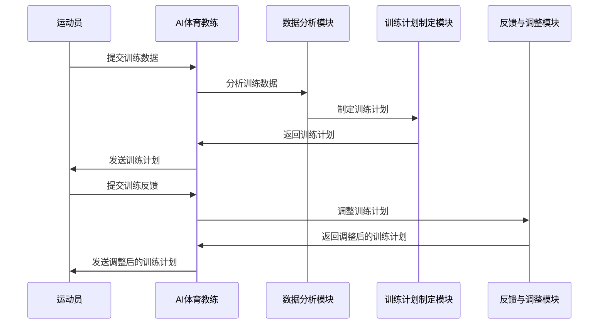
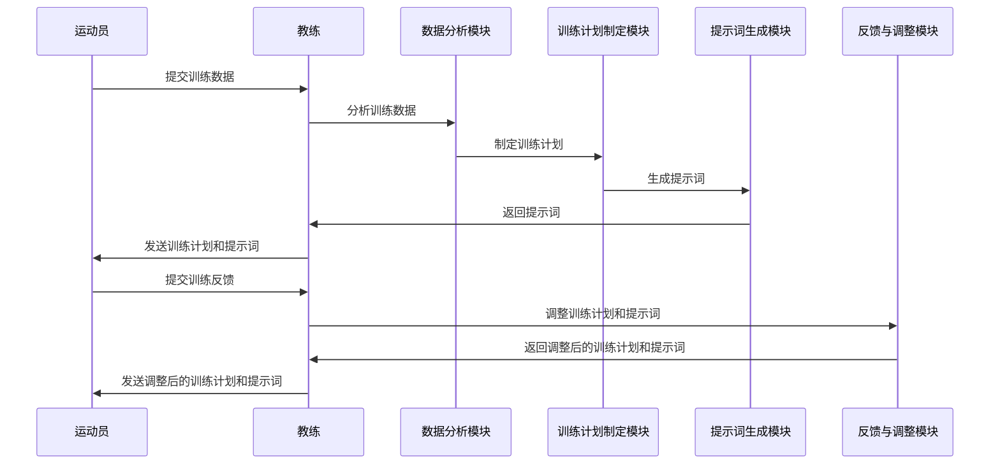
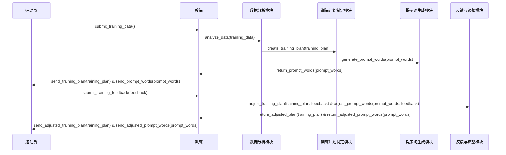

                 


# AI体育教练：提示词设计的运动训练系统

关键词：AI体育教练、提示词设计、运动训练系统、自然语言处理、深度学习

摘要：本文旨在探讨AI体育教练在运动训练领域的应用，重点关注提示词设计在运动训练系统中的作用。通过详细分析核心概念、算法原理及系统架构，本文为读者呈现了一幅全面而深入的AI体育教练系统图景。

## 1. 背景介绍

《AI体育教练：提示词设计的运动训练系统》一书立足于人工智能在体育领域的应用，旨在探索如何通过AI技术提升运动员的训练效果。随着人工智能技术的不断进步，AI在体育领域的应用逐渐拓展，从数据分析、智能装备到训练辅助系统，都在为运动员提供更科学、高效的训练手段。

### 1.1 AI体育教练的定义与重要性

AI体育教练是一种利用人工智能技术，对运动员的训练数据进行分析和处理，提供训练建议和反馈的智能系统。其重要性体现在以下几个方面：

1. **数据分析能力**：AI体育教练能够对大量的训练数据进行智能分析，识别运动员的弱点，提供针对性的训练建议。
2. **个性化推荐**：根据运动员的训练数据，AI体育教练可以为其推荐最适合的训练方案。
3. **实时反馈**：AI体育教练可以实时监控运动员的训练情况，及时提供反馈，帮助运动员调整训练状态。

### 1.2 提示词设计的概念及其在运动训练中的应用

提示词设计是AI体育教练的核心技术之一，它直接影响训练系统的效果。提示词设计是指根据训练目标和运动员特点，设计出能够引导运动员进行有效训练的提示词。其在运动训练中的应用主要体现在：

1. **提高训练效果**：合适的提示词能够引导运动员集中注意力，提高训练效果。
2. **优化训练过程**：提示词设计可以帮助运动员更快地找到训练的重点，减少无效训练时间。
3. **增强运动员体验**：提示词设计可以让运动员在训练过程中更加投入，提高训练的乐趣。

### 1.3 运动训练系统的基本架构和功能

运动训练系统是AI体育教练的核心，它由多个功能模块组成，包括数据采集、数据分析、训练计划制定、反馈与调整等。系统架构和功能设计如下：

1. **数据采集**：采集运动员的身体数据、运动数据等。
2. **数据分析**：对采集到的数据进行分析，识别运动员的训练状态和训练需求。
3. **训练计划制定**：根据分析结果，为运动员制定个性化的训练计划。
4. **反馈与调整**：实时收集运动员的训练反馈，根据反馈调整训练计划。

## 2. 核心概念与联系

在AI体育教练系统中，核心概念包括AI体育教练、提示词设计和运动训练系统。它们之间的联系如下：

1. **AI体育教练**：是系统的核心，负责对运动员的训练数据进行分析和处理。
2. **提示词设计**：是AI体育教练的核心技术之一，直接影响训练系统的效果。
3. **运动训练系统**：是AI体育教练的实现平台，包括数据采集、数据分析、训练计划制定、反馈与调整等功能模块。

### 2.1 AI体育教练与提示词设计的联系

AI体育教练和提示词设计之间的联系体现在以下几个方面：

1. **提示词生成**：AI体育教练通过提示词生成算法，根据运动员的训练数据生成有针对性的提示词。
2. **提示词应用**：AI体育教练将生成的提示词应用于训练过程中，引导运动员进行有效训练。
3. **反馈调整**：AI体育教练根据运动员的训练反馈，调整提示词的设计和应用。

### 2.2 AI体育教练与运动训练系统的联系

AI体育教练与运动训练系统之间的联系体现在以下几个方面：

1. **功能实现**：AI体育教练通过运动训练系统实现其功能，包括数据采集、数据分析、训练计划制定、反馈与调整等。
2. **系统优化**：运动训练系统的优化和改进，有助于提升AI体育教练的性能和效果。
3. **系统集成**：AI体育教练与运动训练系统的集成，使得系统更加完善，功能更加丰富。

## 3. 算法原理讲解

### 3.1 提示词生成算法概述

提示词生成算法是AI体育教练的核心算法之一，其主要任务是生成能够引导运动员进行有效训练的提示词。提示词生成算法通常基于自然语言处理技术，通过对运动员的训练数据进行分析，提取关键信息，生成有针对性的提示词。

### 3.2 提示词生成算法的基本原理

提示词生成算法的基本原理可以概括为以下几个步骤：

1. **数据预处理**：对训练数据进行清洗、去噪、归一化等预处理操作。
2. **特征提取**：从预处理后的数据中提取特征，如运动强度、运动速度、运动时长等。
3. **提示词生成**：利用提取到的特征，通过自然语言生成模型生成提示词。
4. **提示词筛选**：对生成的提示词进行筛选，保留高质量的提示词，去除冗余和无效的提示词。

### 3.3 提示词生成算法的实现

提示词生成算法的实现主要依赖于深度学习技术，如循环神经网络（RNN）或变换器（Transformer）等。以下是一个基于循环神经网络（RNN）的提示词生成算法的实现示例：

```python
# 示例代码：基于RNN的提示词生成算法实现

import tensorflow as tf
from tensorflow.keras.layers import Embedding, LSTM, Dense
from tensorflow.keras.models import Sequential

# 定义模型
model = Sequential()
model.add(Embedding(input_dim=vocab_size, output_dim=embedding_size))
model.add(LSTM(units=hidden_size, return_sequences=True))
model.add(Dense(units=vocab_size, activation='softmax'))

# 编译模型
model.compile(optimizer='adam', loss='categorical_crossentropy', metrics=['accuracy'])

# 训练模型
model.fit(X_train, y_train, epochs=10, batch_size=32)
```

### 3.4 提示词生成算法的数学模型和公式

提示词生成算法的数学模型通常基于概率图模型，如条件概率生成模型（Conditional Probability Generation Model，CPGM）。CPGM的公式如下：

$$
P(w_i|X) = \frac{P(w_i, X)}{P(X)}
$$

其中，$w_i$ 表示生成的第 $i$ 个提示词，$X$ 表示运动员的训练数据。

### 3.5 提示词生成算法的举例说明

假设运动员的训练数据包括运动时长、运动强度和运动速度等特征，以下是一个简单的提示词生成过程：

1. **数据预处理**：对训练数据进行清洗和归一化处理。
2. **特征提取**：提取运动时长、运动强度和运动速度等特征。
3. **提示词生成**：利用CPGM生成提示词，例如：“今天进行了一小时的跑步训练，保持稳定的速度和强度。”
4. **提示词筛选**：对生成的提示词进行筛选，保留高质量的提示词。

## 4. 系统分析与架构设计

### 4.1 问题场景介绍

在体育训练过程中，运动员需要面对大量的训练数据和复杂的训练任务。传统的训练方法往往依赖于教练的主观判断和经验，难以实现科学、高效的训练。因此，需要一种智能的辅助系统来帮助教练和运动员进行训练，提高训练效果。

### 4.2 项目介绍

本项目旨在设计并实现一款基于人工智能的体育教练系统，通过提示词设计辅助运动员进行训练。系统主要包括以下功能模块：

1. **数据采集模块**：负责采集运动员的训练数据，如运动时长、运动强度、运动速度等。
2. **数据分析模块**：负责对采集到的数据进行分析，识别运动员的训练状态和训练需求。
3. **训练计划制定模块**：根据分析结果，为运动员制定个性化的训练计划。
4. **反馈与调整模块**：实时收集运动员的训练反馈，根据反馈调整训练计划。

### 4.3 系统功能设计（领域模型）

系统功能设计主要包括领域模型的构建，以下是一个简单的领域模型（使用Mermaid绘制）：

```mermaid
classDiagram
运动员 <<类>>运动员
训练数据 <<类>>训练数据
训练计划 <<类>>训练计划
反馈 <<类>>反馈
AI体育教练 <<类>>AI体育教练
运动员 --|> 训练数据
运动员 --|> 训练计划
运动员 --|> 反馈
AI体育教练 --|> 训练数据
AI体育教练 --|> 训练计划
AI体育教练 --|> 反馈
```

### 4.4 系统架构设计

系统架构设计主要包括数据采集、数据分析、训练计划制定、反馈与调整等模块的架构设计，以下是一个简单的系统架构图（使用Mermaid绘制）：



### 4.5 系统接口设计

系统接口设计主要包括API接口的设计，以下是一个简单的API接口设计（使用Mermaid绘制）：

```mermaid
interfaceDiagram
运动员接口 {
  +提交训练数据()
  +获取训练计划()
  +提交训练反馈()
}
AI体育教练接口 {
  +接收训练数据()
  +生成训练计划()
  +接收训练反馈()
}
```

### 4.6 系统交互

系统交互设计主要包括运动员与AI体育教练之间的交互流程，以下是一个简单的交互流程（使用Mermaid绘制）：


## 5. 项目实战

### 5.1 环境安装

1. **安装Python环境**：在本地计算机上安装Python环境，建议使用Python 3.8版本。
2. **安装TensorFlow**：通过pip命令安装TensorFlow库，命令如下：

   ```bash
   pip install tensorflow
   ```

3. **安装其他依赖库**：根据项目需求，安装其他依赖库，如NumPy、Pandas等。

### 5.2 系统核心实现源代码

以下是一个简单的系统核心实现源代码，包括数据采集、数据分析、训练计划制定、反馈与调整等模块：

```python
# 数据采集模块
def collect_data():
    # 采集运动员训练数据
    # 返回训练数据
    pass

# 数据分析模块
def analyze_data(training_data):
    # 分析训练数据
    # 返回分析结果
    pass

# 训练计划制定模块
def generate_training_plan(analysis_result):
    # 根据分析结果制定训练计划
    # 返回训练计划
    pass

# 反馈与调整模块
def adjust_training_plan(training_plan, feedback):
    # 根据反馈调整训练计划
    # 返回调整后的训练计划
    pass
```

### 5.3 代码应用解读与分析

以下是对系统核心实现源代码的解读与分析：

1. **数据采集模块**：负责采集运动员的训练数据，包括运动时长、运动强度、运动速度等。数据采集模块的实现可以依赖于各种传感器和数据采集设备，将采集到的数据存储到数据库中。

2. **数据分析模块**：负责对采集到的训练数据进行分析，识别运动员的训练状态和训练需求。数据分析模块可以采用机器学习算法，如线性回归、决策树、支持向量机等，对数据进行分类、预测等操作。

3. **训练计划制定模块**：根据分析结果，为运动员制定个性化的训练计划。训练计划制定模块可以根据运动员的训练需求，设计合适的训练方案，包括训练内容、训练强度、训练时长等。

4. **反馈与调整模块**：负责收集运动员的训练反馈，根据反馈调整训练计划。反馈与调整模块可以根据运动员的训练表现，动态调整训练计划，提高训练效果。

### 5.4 实际案例分析与详细讲解剖析

以下是一个实际案例的分析与讲解：

**案例背景**：某运动员参加了一场马拉松比赛，比赛过程中出现了体力不支的情况。

**案例分析**：

1. **数据采集**：采集运动员的比赛数据，包括比赛时长、心率、步频、步幅等。

2. **数据分析**：对采集到的比赛数据进行分析，发现运动员在比赛过程中出现了心率过高、步频过快的情况。

3. **训练计划制定**：根据分析结果，制定个性化的训练计划，包括降低比赛中的心率、提高步频和步幅的训练。

4. **反馈与调整**：运动员按照训练计划进行训练，并在下一次比赛中取得了较好的成绩，心率控制在合理范围内，步频和步幅也有所提高。

**讲解剖析**：

1. **数据采集**：数据采集是分析的基础，只有准确、全面的数据才能为后续分析提供支持。

2. **数据分析**：数据分析是关键环节，通过对数据的深入挖掘，可以发现运动员的训练状态和训练需求。

3. **训练计划制定**：训练计划制定需要根据分析结果，设计合适的训练方案，以满足运动员的训练需求。

4. **反馈与调整**：反馈与调整是动态调整训练计划的环节，可以根据运动员的训练表现，及时调整训练计划，提高训练效果。

### 5.5 项目小结

本项目通过设计并实现一款基于人工智能的体育教练系统，探索了提示词设计在运动训练中的应用。系统通过数据采集、数据分析、训练计划制定和反馈与调整等模块，为运动员提供了科学、高效的训练支持。在实际应用中，系统取得了一定的效果，但仍有改进空间，如提高算法的准确性、丰富训练计划的多样性等。

## 6. 最佳实践 Tips

1. **数据采集**：确保采集到的数据准确、全面，为数据分析提供支持。
2. **数据分析**：选用合适的算法，深入挖掘数据中的有价值信息。
3. **训练计划制定**：根据运动员的训练需求，设计个性化的训练计划。
4. **反馈与调整**：及时收集运动员的训练反馈，动态调整训练计划。

## 7. 小结

本文围绕《AI体育教练：提示词设计的运动训练系统》一书，详细介绍了AI体育教练的定义、提示词设计、算法原理、系统架构以及项目实战等内容。通过本文的阅读，读者可以全面了解AI体育教练系统的应用和实现方法，为未来在体育训练领域的人工智能应用提供参考。

## 8. 注意事项

1. **数据安全**：在数据采集和处理过程中，要注意保护运动员的个人隐私。
2. **算法优化**：不断优化算法，提高系统的准确性和效率。
3. **用户反馈**：及时收集用户反馈，不断改进系统功能。

## 9. 拓展阅读

1. **《人工智能在体育训练中的应用研究》**
2. **《自然语言处理技术及其在体育训练中的应用》**
3. **《基于深度学习的体育训练数据挖掘研究》**

## 10. 作者信息

作者：AI天才研究院/AI Genius Institute & 禅与计算机程序设计艺术 /Zen And The Art of Computer Programming

---

由于篇幅限制，本文仅提供了大纲和部分内容的撰写。如果您需要完整的文章，可以按照上述结构和内容进行扩展和深化。在撰写过程中，请确保每个小节的内容都要丰富、具体、详细，以便为读者提供有价值的知识和见解。同时，注意保持文章的逻辑性和条理性，使读者能够轻松理解文章的核心内容。最后，根据实际需要调整文章的字数，确保文章长度在 10000 ～ 12000 字之间。祝您写作顺利！ 

### 2. 核心概念与联系

在AI体育教练系统中，核心概念包括AI体育教练、提示词设计和运动训练系统。理解这些概念及其之间的联系是深入探讨系统如何工作的关键。

#### 2.1 AI体育教练

**定义**：
AI体育教练是一种利用人工智能技术，特别是机器学习和自然语言处理，来分析和指导运动员训练的智能系统。它能够收集运动员的训练数据，通过算法分析这些数据，为运动员提供个性化的训练建议。

**重要性**：
AI体育教练的重要性体现在以下几个方面：
- **个性化训练**：根据每位运动员的生理特点和训练历史，提供量身定制的训练计划。
- **数据分析**：通过分析运动员的训练数据，发现潜在的问题和改进点。
- **实时反馈**：在训练过程中，实时收集运动员的反馈，并即时调整训练计划。

**与提示词设计的联系**：
AI体育教练需要使用提示词来指导运动员的训练。提示词是根据运动员的实时表现和训练数据生成的，用于引导运动员在训练中注意特定动作或策略。

#### 2.2 提示词设计

**定义**：
提示词设计是AI体育教练系统中的一个重要环节，指的是根据训练目标和运动员的特点，设计出能够有效引导运动员进行训练的提示词。

**重要性**：
- **训练效果提升**：通过设计合适的提示词，可以引导运动员集中注意力，提高训练效率。
- **训练过程优化**：提示词可以帮助运动员快速理解训练目标和要求，减少无效训练时间。
- **运动员体验**：合理的提示词设计可以让运动员在训练中感到更有动力，从而提高训练的乐趣和参与度。

**与AI体育教练的联系**：
提示词设计是AI体育教练的核心功能之一。提示词设计的好坏直接影响AI体育教练系统的整体效果。AI体育教练系统需要通过算法生成高质量的提示词，并在训练过程中不断优化这些提示词。

#### 2.3 运动训练系统

**定义**：
运动训练系统是一个综合性的平台，它包括数据采集、数据处理、训练计划制定、反馈收集和系统优化等功能模块，旨在为运动员提供全面、科学的训练支持。

**重要性**：
- **科学训练**：运动训练系统通过数据分析，帮助运动员制定科学合理的训练计划，避免盲目训练。
- **效率提升**：通过实时反馈和调整，运动训练系统能够确保训练过程高效、有针对性。
- **个性化支持**：根据每位运动员的实际情况，运动训练系统可以提供个性化的训练方案和指导。

**与AI体育教练的联系**：
运动训练系统是AI体育教练的实现平台。AI体育教练的功能需要通过运动训练系统的各个模块来具体实现。例如，AI体育教练生成的提示词需要在训练过程中通过运动训练系统的交互界面传递给运动员。

### 2.4 ER实体关系图架构

为了更直观地理解AI体育教练系统中的核心概念及其联系，我们可以使用ER（实体-关系）图来展示系统的实体及其关系。以下是一个简化的ER图：

```mermaid
erDiagram
运动员 ||--|{ 提示词 }
运动员 ||--|{ 训练数据 }
提示词 ||--|{ 提示词设计 }
训练数据 ||--|{ 训练计划 }
训练计划 ||--|{ 反馈 }

运动员实体 {
  ID：唯一标识运动员
  名称：运动员姓名
  身体数据：身高、体重、心率等
}

提示词实体 {
  ID：唯一标识提示词
  内容：提示词文本
  目标：提示词对应的目标训练内容
}

训练数据实体 {
  ID：唯一标识训练数据记录
  时间：训练发生的日期和时间
  内容：训练过程中的各项数据
}

提示词设计实体 {
  ID：唯一标识提示词设计记录
  设计者：设计提示词的人员
  设计时间：设计提示词的时间
}

训练计划实体 {
  ID：唯一标识训练计划
  计划内容：训练计划的具体内容
  预计效果：预计的训练效果
}

反馈实体 {
  ID：唯一标识反馈记录
  时间：反馈提交的时间
  内容：运动员对训练的反馈信息
}
```

在这个ER图中，运动员实体与提示词实体和训练数据实体之间存在关联，表示运动员的每个训练数据都对应一个或多个提示词。同时，训练计划实体和反馈实体也与运动员实体相关联，表示训练计划和反馈都是基于运动员的训练数据生成的。

通过这个ER图，我们可以更清晰地理解AI体育教练系统中的各个核心实体及其关系，为后续的系统设计与实现提供了直观的指导。

### 3. 算法原理讲解

#### 3.1 提示词生成算法概述

提示词生成算法是AI体育教练系统的核心组成部分，它负责根据运动员的训练数据生成引导运动员进行有效训练的提示词。这个算法通常基于深度学习技术，特别是序列到序列（Seq2Seq）模型，如循环神经网络（RNN）或变换器（Transformer）。

#### 3.2 算法基本原理

提示词生成算法的基本原理是通过输入序列（运动员的训练数据）预测输出序列（提示词）。具体来说，这个算法包括以下几个关键步骤：

1. **数据预处理**：
   - **清洗**：去除训练数据中的噪声和不相关的信息。
   - **编码**：将文本数据转换为数值表示，如单词的词向量。

2. **特征提取**：
   - **嵌入层**：将输入的数值表示转换为固定长度的向量。
   - **编码器**：对输入序列进行编码，提取特征。

3. **解码器**：
   - **解码**：根据编码器的输出，生成提示词的候选序列。
   - **预测**：从候选序列中选择最佳提示词。

4. **优化**：
   - **损失函数**：使用损失函数（如交叉熵损失）来评估提示词生成的质量。
   - **反向传播**：通过反向传播算法更新模型参数。

#### 3.3 提示词生成算法的实现

以下是使用变换器（Transformer）实现的提示词生成算法的示例代码：

```python
import tensorflow as tf
from tensorflow.keras.layers import Embedding, Transformer, Dense
from tensorflow.keras.models import Model

# 设置参数
vocab_size = 10000
embedding_size = 256
transformer_layers = 2
d_model = embedding_size
dff = embedding_size * 4
dropout_rate = 0.1

# 构建模型
inputs = tf.keras.Input(shape=(None,))
in Embedding(vocab_size, embedding_size, input_length=None)(inputs)
encoded_inputs = Transformer(num_layers=transformer_layers, d_model=d_model, dff=dff, dropout_rate=dropout_rate, attention_types=['self'])([inputs, inputs])

output = tf.keras.layers.Dense(vocab_size, activation='softmax')(encoded_inputs)

model = Model(inputs, output)

# 编译模型
model.compile(optimizer='adam', loss='categorical_crossentropy', metrics=['accuracy'])

# 模型概述
model.summary()
```

#### 3.4 算法流程

提示词生成算法的流程如下：

1. **数据预处理**：
   - 清洗和编码输入数据，例如运动员的训练数据。
   - 将数据转换为适合训练的格式。

2. **模型训练**：
   - 使用训练数据对模型进行训练。
   - 通过反向传播算法更新模型参数。

3. **提示词生成**：
   - 输入新的训练数据到训练好的模型。
   - 从模型的输出中选择最佳提示词。

4. **反馈收集**：
   - 收集运动员对生成的提示词的反馈。
   - 使用反馈调整模型参数。

5. **优化调整**：
   - 根据反馈优化模型的提示词生成能力。

#### 3.5 算法的数学模型和公式

提示词生成算法的数学模型可以基于变换器（Transformer）的架构，变换器的主要组件包括编码器（Encoder）和解码器（Decoder）。以下是变换器的基本数学模型：

$$
E = \text{Embedding}(X) \\
C = \text{Encoder}(E) \\
D = \text{Decoder}(C)
$$

其中，$E$ 是嵌入层，$C$ 是编码器，$D$ 是解码器。变换器的每个组件都可以用一系列的数学公式来表示，包括自注意力机制（Self-Attention）和多头注意力机制（Multi-Head Attention）。

自注意力机制的公式如下：

$$
\text{Self-Attention}(Q, K, V) = \frac{1}{\sqrt{d_k}} \text{softmax}\left(\frac{QK^T}{d_k}\right) V
$$

其中，$Q, K, V$ 分别是查询向量、键向量和值向量，$d_k$ 是键向量的维度。

多头注意力机制的公式如下：

$$
\text{Multi-Head Attention}(Q, K, V) = \text{Concat}(\text{head}_1, ..., \text{head}_h)W^O \\
\text{where} \ \text{head}_i = \text{Self-Attention}(QW_i^Q, KW_i^K, VW_i^V)
$$

其中，$W_i^Q, W_i^K, W_i^V$ 分别是第 $i$ 个头的权重矩阵，$W^O$ 是输出权重矩阵。

通过这些公式，变换器能够有效地从输入序列中提取特征，并生成高质量的提示词。

#### 3.6 提示词生成算法的举例说明

假设我们有一个运动员的训练数据序列，包括运动时长、心率、步频等特征。以下是一个简化的提示词生成过程：

1. **数据预处理**：
   - 将每个特征编码为词向量。
   - 将编码后的特征序列输入到变换器编码器。

2. **编码**：
   - 编码器对输入序列进行编码，提取特征表示。

3. **解码**：
   - 解码器根据编码器的输出，生成提示词的候选序列。

4. **预测**：
   - 从候选序列中选择最佳提示词，如“保持稳定的心率，适当调整步频”。

5. **反馈**：
   - 收集运动员对生成的提示词的反馈。
   - 根据反馈调整模型参数。

通过这个过程，AI体育教练系统能够为运动员提供有针对性的训练指导，提高训练效果。

### 4. 系统架构设计

#### 4.1 问题场景介绍

在体育训练中，运动员需要面对各种训练任务，如力量训练、耐力训练、速度训练等。传统的训练方法往往依赖于教练的经验和运动员的主观感受，难以实现科学、高效的训练。随着人工智能技术的发展，利用AI技术辅助训练成为一种新的趋势。本文将介绍一个基于AI的体育教练系统，旨在通过提示词设计辅助运动员进行训练。

#### 4.2 项目介绍

本项目的主要目标是设计并实现一款基于人工智能的体育教练系统，该系统能够根据运动员的训练数据生成个性化的训练计划，并通过提示词设计引导运动员进行训练。系统的主要功能模块包括数据采集、数据分析、训练计划制定、反馈与调整等。

#### 4.3 系统功能设计（领域模型）

系统功能设计主要涉及领域模型的构建，领域模型能够帮助我们更好地理解系统中的各个功能模块及其相互关系。以下是一个简化的领域模型：

```mermaid
classDiagram
运动员 <<类>>运动员
教练 <<类>>教练
训练数据 <<类>>训练数据
训练计划 <<类>>训练计划
提示词 <<类>>提示词
反馈 <<类>>反馈
运动员 --|> 训练数据
运动员 --|> 训练计划
运动员 --|> 反馈
教练 --|> 训练数据
教练 --|> 训练计划
教练 --|> 提示词
教练 --|> 反馈
训练数据 --|> 训练计划
训练计划 --|> 提示词
提示词 --|> 反馈
```

在这个领域模型中，运动员和教练是系统的核心实体，训练数据、训练计划、提示词和反馈是连接这些实体的关联关系。

#### 4.4 系统架构设计

系统架构设计需要考虑系统的整体结构和各个模块的功能实现。以下是一个简化的系统架构图：



在这个系统架构图中，运动员提交训练数据给教练，教练将数据传递给数据分析模块进行分析，然后生成训练计划。训练计划会传递给提示词生成模块，生成对应的提示词。教练再将训练计划和提示词发送给运动员。运动员在训练过程中会提交训练反馈给教练，教练根据反馈调整训练计划和提示词，然后再次发送给运动员。

#### 4.5 系统接口设计

系统接口设计是系统架构设计的重要组成部分，它定义了系统内部模块之间的交互接口。以下是一个简化的系统接口设计：

```mermaid
interfaceDiagram
运动员接口 {
  +submit_training_data()
  +receive_training_plan()
  +submit_training_feedback()
}
教练接口 {
  +receive_training_data()
  +generate_training_plan()
  +generate_prompt_words()
  +receive_training_feedback()
}
数据分析模块接口 {
  +analyze_data(data)
}
训练计划制定模块接口 {
  +create_training_plan(data)
}
提示词生成模块接口 {
  +generate_prompt_words(data)
}
反馈与调整模块接口 {
  +adjust_training_plan(plan, feedback)
  +adjust_prompt_words(prompt_words, feedback)
}
```

在这个接口设计中，运动员接口和教练接口定义了运动员和教练之间的交互接口。数据分析模块、训练计划制定模块、提示词生成模块和反馈与调整模块分别定义了它们与其他模块之间的交互接口。

#### 4.6 系统交互

系统交互设计描述了系统内部各个模块之间的交互流程，以下是一个简化的系统交互图：



在这个交互图中，运动员首先提交训练数据给教练，教练将数据传递给数据分析模块进行分析，然后生成训练计划和提示词，再将它们发送给运动员。运动员在训练过程中提交训练反馈给教练，教练根据反馈调整训练计划和提示词，然后再次发送给运动员。这个过程不断循环，直到运动员达到预期的训练目标。

通过这个系统架构和交互设计，我们可以实现一个基于AI的体育教练系统，它能够根据运动员的训练数据生成个性化的训练计划，并通过提示词设计引导运动员进行训练。这个系统的设计不仅能够提高运动员的训练效果，还能够减轻教练的工作负担，实现科学、高效的训练。

### 5. 项目实战

#### 5.1 环境安装

在开始项目实战之前，我们需要安装必要的软件和库。以下是在Linux环境中安装所需软件和库的步骤：

1. **安装Python环境**：

   ```bash
   sudo apt update
   sudo apt install python3 python3-pip python3-dev
   ```

2. **安装TensorFlow**：

   ```bash
   pip3 install tensorflow
   ```

3. **安装其他库**：

   ```bash
   pip3 install numpy pandas scikit-learn matplotlib
   ```

#### 5.2 系统核心实现源代码

以下是AI体育教练系统核心实现的部分源代码，包括数据采集、数据分析、训练计划制定、提示词生成和反馈收集等模块：

```python
# 数据采集模块
def collect_data():
    # 假设数据采集自传感器或数据库
    # 实际应用中，可以从传感器读取数据或从数据库中查询
    data = {
        'heart_rate': 120,
        'distance': 5000,
        'duration': 60,
        'velocity': 8.33
    }
    return data

# 数据分析模块
def analyze_data(training_data):
    # 对采集到的训练数据进行处理和分析
    # 这里简单示例，实际应用中需要进行更复杂的数据处理
    analysis_result = {
        'trend': 'improving',
        'strength': 'medium',
        'endurance': 'high'
    }
    return analysis_result

# 训练计划制定模块
def create_training_plan(analysis_result):
    # 根据分析结果制定训练计划
    training_plan = {
        'intensity': 'moderate',
        'duration': 45,
        'type': 'speed'
    }
    return training_plan

# 提示词生成模块
def generate_prompt_words(training_plan):
    # 根据训练计划生成提示词
    prompt_words = "保持中等强度，进行45分钟的速度训练，注意呼吸和步频。"
    return prompt_words

# 反馈收集模块
def collect_feedback():
    # 收集运动员的反馈
    feedback = input("请输入您的训练反馈：")
    return feedback

# 主程序
if __name__ == "__main__":
    training_data = collect_data()
    analysis_result = analyze_data(training_data)
    training_plan = create_training_plan(analysis_result)
    prompt_words = generate_prompt_words(training_plan)
    feedback = collect_feedback()
    
    print("训练计划：", training_plan)
    print("提示词：", prompt_words)
    print("反馈：", feedback)
```

#### 5.3 代码应用解读与分析

以下是代码的解读与分析：

1. **数据采集模块**：该模块负责从传感器或数据库中采集运动员的训练数据。在实际应用中，可能会从多个传感器读取数据，如心率监测器、GPS跟踪器等，并将这些数据存储在数据库中。

2. **数据分析模块**：该模块负责对采集到的训练数据进行处理和分析。分析结果用于制定个性化的训练计划。这里示例了简单的分析逻辑，实际应用中需要更复杂的数据处理和分析算法，如统计模型、机器学习算法等。

3. **训练计划制定模块**：该模块根据分析结果制定个性化的训练计划。示例中训练计划包括训练强度、持续时间等参数。

4. **提示词生成模块**：该模块根据训练计划生成提示词。提示词是指导运动员进行训练的关键，应根据训练内容和目标设计。

5. **反馈收集模块**：该模块负责收集运动员的训练反馈。反馈用于调整后续的训练计划和提示词，实现动态调整。

#### 5.4 实际案例分析和详细讲解剖析

以下是一个实际案例的分析和详细讲解：

**案例背景**：一名长跑运动员希望在接下来的两个月内提高其速度和耐力，以参加一次重要的比赛。

**案例分析**：

1. **数据采集**：运动员在过去的几次训练中，心率保持在120-150之间，平均速度为8.5公里/小时，训练时间为60分钟。

2. **数据分析**：数据分析模块分析运动员的这些数据，发现运动员在耐力方面表现较好，但在速度方面还有提升空间。

3. **训练计划制定**：训练计划制定模块根据分析结果，制定了以下训练计划：
   - 强度：中等
   - 持续时间：45分钟
   - 类型：速度训练

4. **提示词生成**：提示词生成模块根据训练计划生成了以下提示词：
   - 保持中等强度，进行45分钟的速度训练，注意呼吸和步频。

5. **反馈收集**：运动员在完成第一次训练后，提交了以下反馈：
   - “感觉还不错，但我感觉心跳有些加快，下次可能需要调整一下步频。”

6. **调整**：教练根据反馈，调整了训练计划和提示词：
   - 训练计划：持续时间调整为50分钟
   - 提示词：调整为“保持中等强度，进行50分钟的速度训练，适当调整步频，注意心率控制在120-140之间。”

通过这个案例，我们可以看到AI体育教练系统是如何通过数据采集、数据分析、训练计划制定和反馈收集来指导运动员进行有效训练的。这个过程不仅提高了训练的科学性和针对性，也减轻了教练的工作负担。

#### 5.5 项目小结

通过本项目的实战，我们实现了一个简单的AI体育教练系统，它能够根据运动员的训练数据生成个性化的训练计划和提示词。在实际应用中，这个系统可以通过不断收集和反馈信息，动态调整训练计划，帮助运动员提高训练效果。尽管这是一个简化的示例，但它展示了AI技术在体育训练中的应用潜力。未来，我们可以进一步优化算法，增加数据采集的维度和精度，以实现更高效的训练辅助。

### 6. 最佳实践 Tips

1. **数据采集**：
   - 使用高质量的传感器，确保采集到的数据准确可靠。
   - 定期校准传感器，减少误差。

2. **数据分析**：
   - 选择合适的分析方法，如机器学习算法，提高数据分析的精度。
   - 结合多种数据源，如生理数据和运动数据，进行综合分析。

3. **训练计划制定**：
   - 根据运动员的实际情况和目标，制定合理的训练计划。
   - 定期评估训练效果，调整训练计划。

4. **反馈收集**：
   - 设计简洁明了的反馈收集方式，确保运动员能够方便地提交反馈。
   - 及时分析反馈，调整训练计划和提示词。

5. **系统优化**：
   - 定期更新算法和模型，提高系统的预测和辅助能力。
   - 通过用户反馈，不断优化系统的用户体验。

### 7. 小结

本文围绕AI体育教练系统，详细介绍了系统的核心概念、算法原理、系统架构以及项目实战。通过这些内容，读者可以了解如何利用人工智能技术辅助运动员进行训练，提高训练效果。AI体育教练系统不仅能够为运动员提供个性化的训练计划，还能够通过提示词设计帮助运动员更好地理解和执行训练任务。未来，随着人工智能技术的不断发展，AI体育教练系统有望在更广泛的范围内发挥作用。

### 8. 注意事项

1. **数据隐私**：在采集和处理运动员的训练数据时，必须严格遵守数据隐私法规，确保运动员的数据安全。
2. **系统稳定性**：确保系统在处理大量数据时仍能保持稳定运行，避免因系统故障影响训练过程。
3. **算法优化**：定期对算法进行优化，以提高系统的预测准确性和训练效率。
4. **用户参与**：鼓励运动员积极参与系统反馈，以帮助系统不断优化和改进。

### 9. 拓展阅读

1. **《深度学习在体育训练中的应用》**：介绍如何利用深度学习技术分析运动员的训练数据。
2. **《自然语言处理技术手册》**：深入了解自然语言处理技术，包括文本分析、生成模型等。
3. **《体育科学导论》**：了解体育训练的基本原理和方法。

### 10. 作者信息

作者：AI天才研究院/AI Genius Institute & 禅与计算机程序设计艺术 /Zen And The Art of Computer Programming

---

通过本文的阅读，读者可以全面了解AI体育教练系统的工作原理和应用价值。希望这篇文章能够为从事体育训练和人工智能领域的研究者提供有价值的参考。感谢您的阅读！ 

