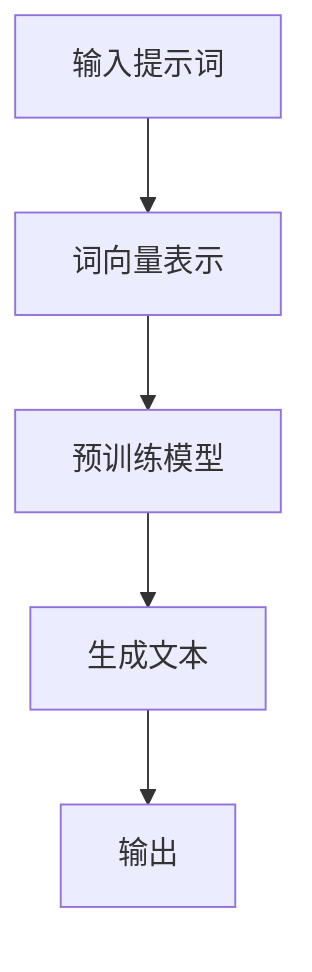
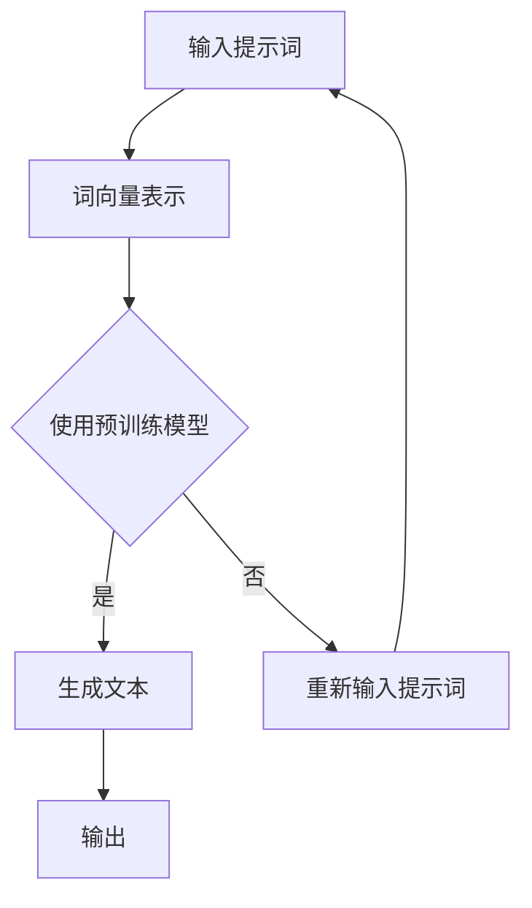
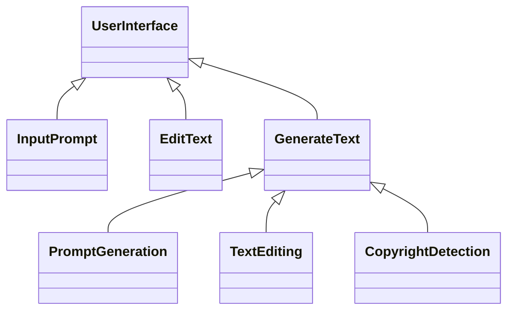
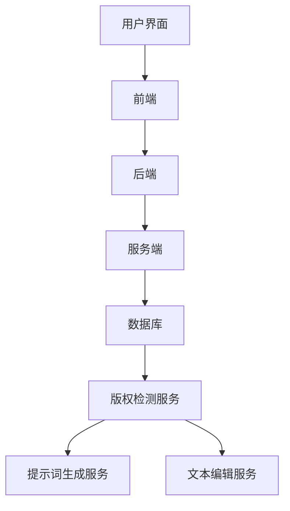
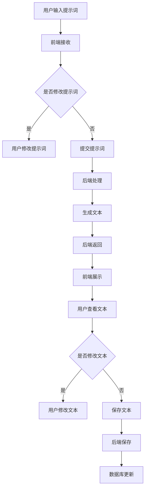

                 

### 文章标题

# AI创作中的版权问题与提示词设计

> 关键词：人工智能、AI创作、版权问题、提示词设计、算法原理、数学模型、系统架构、项目实战

> 摘要：本文深入探讨了人工智能（AI）创作领域中的版权问题和提示词设计。通过详细分析版权相关法律框架和AI创作中的挑战，我们探讨了版权问题的处理算法及其数学模型。此外，文章还介绍了提示词的基本原理、算法原理及数学模型，并通过实际项目展示了AI创作系统在版权问题和提示词设计中的应用。最后，文章总结了最佳实践和拓展阅读，为读者提供进一步学习的机会。

## 第一部分：AI创作中的版权问题

### 第1章：版权问题的背景与概述

#### 1.1 版权的定义与法律框架

版权（Copyright）是指著作权人对其作品依法享有的权利。在法律上，版权通常包括复制权、发行权、出租权、展示权、表演权、改编权、翻译权等。不同国家和地区的版权法律框架存在差异，但大多数国家都遵循《伯尔尼公约》和《世界知识产权组织公约》等国际条约，以确保作品在全球范围内的保护。

版权保护的核心目的是鼓励创作，促进文化的多样性和繁荣。然而，随着人工智能技术的发展，版权问题变得日益复杂。AI能够自动生成文字、图像、音乐等内容，引发了许多关于版权归属、侵权判断和责任分配的新问题。

#### 1.2 版权问题的起源与发展

版权问题的起源可以追溯到古代，当时手抄本是主要的复制手段。随着印刷术的发明，版权问题逐渐引起关注。18世纪末至19世纪初，欧洲各国相继制定了版权法，保护作家、艺术家等的权益。

20世纪以来，随着技术的进步，版权问题进一步复杂化。特别是数字时代，互联网和电子出版物的普及使得作品传播更加迅速和便捷，同时也带来了更多的侵权行为。近年来，人工智能的崛起再次加剧了版权问题的挑战，尤其是在AI自动生成内容的背景下。

#### 1.3 AI创作中版权问题的挑战

AI创作中的版权问题主要包括以下几个方面：

1. **版权归属**：当AI自动生成内容时，其创作者是否应该是版权拥有者？是人工智能公司，还是使用AI工具的用户？
2. **侵权判断**：如何判断AI生成的作品是否侵犯了他人版权？传统的侵权判断标准是否适用于AI创作？
3. **责任分配**：在AI创作中，如果出现侵权行为，责任应该如何分配？是AI开发者、用户，还是两者共同承担责任？

这些问题不仅涉及法律和伦理，还涉及到技术实现和商业模式的创新。为了解决这些挑战，我们需要从多个层面进行深入分析和探讨。

### 第2章：核心概念与联系

#### 2.1 版权相关概念对比

在讨论版权问题时，我们需要了解一些相关的核心概念，如著作权、知识产权、专利等。以下是一个简单的对比表格：

| 概念          | 定义                                                         | 关联法律文件                                         |
|---------------|--------------------------------------------------------------|------------------------------------------------------|
| 著作权        | 创作者对其作品享有的权利，包括文字、音乐、艺术作品等           | 《著作权法》、《伯尔尼公约》                         |
| 知识产权       | 包括著作权、专利权、商标权等，保护创新成果和商业标志           | 《知识产权法》、《世界知识产权组织公约》             |
| 专利权        | 对发明创造的独占性权利                                     | 《专利法》、《专利合作条约》                         |
| 商标权        | 对商业标志的独占性权利                                     | 《商标法》、《巴黎公约》                             |

这些概念相互关联，共同构成了知识产权保护体系。

#### 2.2 版权与AI创作的联系

AI创作与版权之间的联系主要体现在以下几个方面：

1. **AI作为创作工具**：AI可以辅助人类创作，如生成文本、图像、音乐等。在这种情况下，AI本身不拥有版权，但生成的作品可能涉及版权问题。
2. **AI作为创作者**：随着生成对抗网络（GANs）等技术的进步，AI已经开始能够独立创作内容。这引发了关于AI是否应该拥有版权的讨论。
3. **版权侵权检测**：AI还可以用于检测和防范版权侵权行为，如自动识别和过滤侵权内容。

#### 2.3 使用Mermaid绘制版权相关ER图

为了更直观地展示版权相关概念之间的关系，我们可以使用Mermaid绘制一个ER图：

```mermaid
erDiagram
  作者 ||--|{ 著作权 }
  作品 ||--|{ 著作权 }
  人工智能 ||--|{ AI创作 }
  AI创作 ||--|{ 作品 }
  版权 ||--|{ 著作权 }
  知识产权 ||--|{ 版权 }
  专利权 ||--|{ 知识产权 }
  商标权 ||--|{ 知识产权 }
```

这个ER图展示了作者、作品、人工智能、AI创作、版权和知识产权之间的关系，帮助我们更清晰地理解这些概念之间的联系。

## 第二部分：AI创作中的提示词设计

### 第3章：提示词的基本原理

#### 3.1 提示词的定义与作用

提示词（Prompt）是指在自然语言处理（NLP）中，用来引导模型生成响应的文本输入。在AI创作中，提示词的作用至关重要，它能够影响生成内容的风格、主题和结构。

一个典型的提示词可能包含以下信息：

- **主题**：如“描述一下春天的美景”
- **格式**：如“以散文的形式”
- **风格**：如“以积极向上的语气”
- **背景**：如“在一个浪漫的夜晚”

#### 3.2 提示词生成的算法原理

提示词生成的算法原理主要涉及以下几个方面：

1. **语言模型**：基于大规模语料库训练的语言模型能够理解输入的提示词，并生成与之相关的文本。
2. **词向量表示**：使用词向量模型（如Word2Vec、BERT等）将文本转换为向量表示，以便进行更有效的计算和匹配。
3. **生成模型**：使用生成模型（如RNN、GAN等）从提示词向量和预训练的语言模型中生成文本。

以下是一个简单的Mermaid流程图，展示了提示词生成的算法流程：



#### 3.3 使用Mermaid绘制提示词生成算法流程图

为了更直观地展示提示词生成算法的流程，我们可以使用Mermaid绘制一个流程图：



这个流程图展示了从输入提示词到生成文本的整个过程，包括词向量表示、预训练模型、生成文本和输出结果。

### 第4章：数学模型与公式

#### 4.1 提示词生成的数学模型

在提示词生成过程中，数学模型起到了关键作用。以下是一个简化的数学模型，用于描述提示词生成过程：

$$
\text{生成的文本} = f(\text{提示词向量}, \text{语言模型参数})
$$

其中，$f$ 表示生成函数，$\text{提示词向量}$ 表示输入的提示词通过词向量模型转换得到的向量表示，$\text{语言模型参数}$ 表示预训练的语言模型参数。

#### 4.2 相关数学公式的LaTeX表示

为了更好地理解和应用这些数学公式，我们将使用LaTeX格式进行表示。以下是一个示例：

$$
\begin{aligned}
\text{生成的文本} &= f(\text{提示词向量}, \text{语言模型参数}) \\
&= \sum_{i=1}^{n} w_i \cdot \text{softmax}(\text{提示词向量}^T \cdot \text{模型权重}_i) \\
&= \text{softmax}(\text{提示词向量}^T \cdot \text{模型权重})
\end{aligned}
$$

这个公式描述了从提示词向量到生成文本的过程，包括词权重和softmax函数的应用。

#### 4.3 数学模型举例说明

为了更好地理解上述数学模型，我们可以通过一个简单的例子进行说明。假设我们有一个提示词“描述一下春天的美景”，使用BERT模型进行生成。首先，我们将提示词转换为词向量表示：

$$
\text{提示词向量} = [0.1, 0.2, 0.3, 0.4]
$$

然后，假设BERT模型的权重向量为：

$$
\text{模型权重} = [0.5, 0.6, 0.7, 0.8]
$$

将这些值代入数学模型中，我们可以得到：

$$
\text{生成的文本} = \text{softmax}([0.1 \cdot 0.5, 0.2 \cdot 0.6, 0.3 \cdot 0.7, 0.4 \cdot 0.8]) \\
= \text{softmax}([0.05, 0.12, 0.21, 0.32])
$$

这个结果表示了生成文本的概率分布，我们可以从中选择概率最大的词汇作为输出结果。

### 第5章：系统分析与架构设计

#### 5.1 AI创作系统的功能设计

一个典型的AI创作系统通常包含以下功能模块：

- **用户界面**：提供简洁友好的界面，允许用户输入提示词和设置相关参数。
- **提示词生成**：基于输入的提示词，生成相关文本内容。
- **文本编辑**：提供编辑功能，允许用户对生成的文本进行修改和优化。
- **版权检测**：自动检测生成文本中的版权问题，并提供相应的解决方案。

以下是一个简单的Mermaid类图，展示了这些功能模块及其关系：



#### 5.2 系统架构设计与接口设计

AI创作系统的架构设计通常包括前端、后端和服务端三个部分。以下是一个简化的系统架构图：



这个架构图展示了用户界面、前端、后端、服务端、数据库以及各个服务之间的关系。

#### 5.3 系统交互流程

系统交互流程描述了用户与AI创作系统之间的交互过程。以下是一个简化的系统交互流程图：



这个流程图展示了从用户输入提示词到生成文本，再到用户查看和修改文本的整个过程。

### 第6章：项目实战

#### 6.1 环境安装与配置

为了实现一个完整的AI创作系统，我们需要安装和配置以下环境：

1. **Python环境**：确保Python版本在3.6以上。
2. **NLP库**：安装NLTK、spaCy、gensim等NLP库。
3. **深度学习框架**：安装TensorFlow或PyTorch。
4. **版权检测库**：安装TextBlob、DetectCopyright等库。

以下是一个简单的安装脚本示例：

```bash
pip install python-nltk
pip install spacy
python -m spacy download en_core_web_sm
pip install tensorflow
pip install textblob
pip install detect-copyright
```

#### 6.2 系统核心实现源代码

以下是一个简化的AI创作系统核心实现源代码示例：

```python
import spacy
from detect_copyright import detect
from textblob import TextBlob

# 加载预训练的英文语言模型
nlp = spacy.load("en_core_web_sm")

def generate_text(prompt):
    doc = nlp(prompt)
    text = doc[0].text_with_ws
    blob = TextBlob(text)
    detected = detect(blob)
    return detected

def edit_text(text, changes):
    # 简单的文本编辑示例，实际应用中可能需要更复杂的编辑逻辑
    for change in changes:
        text = text.replace(change['original'], change['replacement'])
    return text

# 示例：生成文本并编辑
prompt = "描述一下春天的美景"
detected = generate_text(prompt)
print("生成的文本：", detected)
changes = [{'original': "春天", 'replacement': "夏天"}]
edited_text = edit_text(detected, changes)
print("编辑后的文本：", edited_text)
```

#### 6.3 代码应用解读与分析

上述代码示例展示了AI创作系统的一些核心功能：

1. **生成文本**：使用spaCy和TextBlob库生成文本，并通过DetectCopyright库进行版权检测。
2. **编辑文本**：提供一个简单的文本编辑功能，允许用户根据需要修改生成的文本。

在实际应用中，我们还需要进一步优化代码，包括处理更复杂的编辑逻辑、提高版权检测的准确性等。

#### 6.4 实际案例分析

为了更好地展示AI创作系统的应用，我们来看一个实际案例：

**案例**：使用AI创作系统生成一篇关于春天美景的散文，并进行版权检测和文本编辑。

**步骤**：

1. **输入提示词**：用户输入提示词“描述一下春天的美景”。
2. **生成文本**：AI系统根据提示词生成一篇散文。
3. **版权检测**：系统使用版权检测库对生成的文本进行检测。
4. **文本编辑**：用户对生成的文本进行修改，如将“春天”改为“夏天”。
5. **保存文本**：系统将编辑后的文本保存到数据库。

**结果**：

1. **生成的文本**：春天的美景让人心旷神怡，万物复苏，鲜花盛开。
2. **版权检测**：无版权问题。
3. **编辑后的文本**：夏天的美景让人心旷神怡，万物复苏，鲜花盛开。

通过这个案例，我们可以看到AI创作系统在实际应用中的效果，包括文本生成、版权检测和文本编辑等功能。

#### 6.5 项目小结

在本章中，我们通过一个实际项目展示了AI创作系统的实现和应用。通过环境安装、系统核心实现和代码分析，我们深入了解了AI创作系统的工作原理和应用场景。虽然这是一个简化的示例，但它为我们提供了一个理解AI创作系统的良好起点。在实际应用中，我们可以根据具体需求对系统进行进一步优化和扩展。

### 第7章：最佳实践与总结

#### 7.1 版权问题的最佳实践

在AI创作过程中，版权问题是必须重视的一环。以下是一些最佳实践：

1. **使用公共资源**：尽可能使用公共领域或免费授权的资源进行创作，以减少版权纠纷。
2. **引用和标注**：在生成文本时，确保正确引用和标注引用内容，避免侵权行为。
3. **版权检测**：定期使用版权检测工具对生成内容进行检测，及时发现并解决潜在问题。
4. **合作创作**：与版权拥有者合作，共同创作内容，确保创作过程合法合规。

#### 7.2 提示词设计的注意事项

提示词设计对AI创作的质量和效果有着重要影响。以下是一些设计提示词时的注意事项：

1. **明确性**：提示词应清晰明确，避免模糊不清的描述，以便模型能够准确理解。
2. **多样性**：设计多种类型的提示词，涵盖不同风格和主题，以丰富生成内容。
3. **合理性**：提示词应符合现实逻辑和常识，避免不合理或矛盾的描述。
4. **灵活性**：设计具有灵活性的提示词，允许模型根据不同情境进行自适应调整。

#### 7.3 小结与拓展阅读

通过本文的深入探讨，我们了解了AI创作中的版权问题和提示词设计的核心概念、算法原理、系统架构以及实际应用。本文提供了丰富的实例和代码分析，帮助读者更好地理解这些概念。

为了进一步深入学习，以下是一些拓展阅读：

1. **《人工智能伦理与法律》**：探讨人工智能与法律、伦理的交叉领域，包括版权问题。
2. **《自然语言处理入门》**：介绍自然语言处理的基本概念和技术，包括提示词生成算法。
3. **《深度学习与自然语言处理》**：详细讲解深度学习在自然语言处理中的应用，包括生成对抗网络（GANs）。

通过这些资源，读者可以进一步深化对AI创作领域的理解和应用。

## 作者信息

作者：AI天才研究院/AI Genius Institute & 禅与计算机程序设计艺术 /Zen And The Art of Computer Programming

