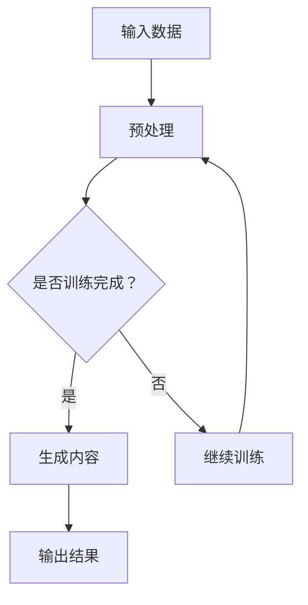

                 

# AI创作权：大模型生成内容的法律挑战

关键词：人工智能、大模型、生成内容、版权、隐私保护

摘要：随着人工智能（AI）技术的迅猛发展，大模型生成内容在各个领域得到广泛应用，同时也引发了诸多法律挑战。本文将深入探讨AI大模型生成内容的法律性质，分析相关法律问题，并提出解决策略，以促进AI技术的合规发展。

## 第一部分：背景介绍

### 核心概念

#### 问题背景

在人工智能（AI）技术迅猛发展的背景下，大模型生成内容（如文本、图像、音频等）逐渐成为人们日常生活中的常见现象。随着技术的进步，大模型在创作方面的能力日益强大，但同时也带来了新的法律挑战。这些问题涉及到知识产权、版权、隐私保护等多个方面，亟需从法律角度进行探讨和解决。

#### 问题描述

AI大模型生成内容可能侵犯原创作品的版权、肖像权等，引发版权争议。此外，大模型在处理个人数据时可能存在隐私风险，对用户权益保护提出挑战。这些问题需要从法律层面进行分析，以制定有效的法律框架和解决策略。

#### 问题解决

解决AI创作权法律挑战的关键在于明确大模型生成内容的法律性质，制定相关法律法规，完善版权保护机制，加强数据隐私保护，推动AI技术合规发展。

#### 边界与外延

本文探讨的是AI大模型生成内容的法律挑战，主要关注版权、隐私保护等领域。同时，文章还将涉及到相关的技术原理、应用场景等，以帮助读者全面理解问题。

### 概念结构与核心要素组成

1. **AI大模型：** 一种具有大规模训练数据、能够进行复杂任务处理的人工智能模型。常见的大模型有GPT、BERT等。
2. **生成内容：** 指AI大模型基于输入数据和预设目标生成的新内容，如文本、图像、音频等。
3. **版权：** 指原创作品的知识产权，包括文字、图像、音乐、戏剧、电影等多种形式。
4. **隐私保护：** 指对个人数据的保护，防止未经授权的收集、使用、泄露等行为。

## 第二部分：核心概念与联系

### AI大模型原理

#### 概念属性特征对比表格：

| 特征       | AI大模型               | 传统AI           |
| ---------- | ---------------------- | ---------------- |
| 数据量     | 非常大规模训练数据      | 小规模数据集      |
| 学习能力   | 自动从数据中学习复杂模式 | 人工设计特征      |
| 处理任务   | 多样化的任务处理能力    | 单一任务处理      |
| 预测准确性 | 高预测准确性           | 低预测准确性      |

#### 知识产权保护与隐私保护的关系

##### 概念属性特征对比表格：

| 特征           | 知识产权保护            | 隐私保护                |
| -------------- | ---------------------- | ---------------------- |
| 目标           | 保护原创作品的权益      | 保护个人数据的权益      |
| 法律依据       | 相关的版权法、专利法等  | 数据保护法、隐私法等    |
| 影响范围       | 文化产业、科技创新等    | 互联网、AI应用等       |
| 保护方式       | 版权登记、维权等        | 加密、匿名化等         |

### 第三部分：算法原理讲解

#### 大模型生成内容算法

#### Mermaid流程图：



#### Python源代码：

```python
import tensorflow as tf
from tensorflow.keras.layers import Embedding, LSTM, Dense
from tensorflow.keras.models import Sequential

# 创建模型
model = Sequential()
model.add(Embedding(input_dim=vocab_size, output_dim=embedding_dim))
model.add(LSTM(units=128, return_sequences=True))
model.add(Dense(units=1, activation='sigmoid'))

# 编译模型
model.compile(optimizer='adam', loss='binary_crossentropy', metrics=['accuracy'])

# 训练模型
model.fit(x_train, y_train, epochs=10, batch_size=32)
```

#### 算法原理讲解

##### 数学模型和公式：

1. **输入数据预处理：**

   设输入数据为 $X \in \mathbb{R}^{n \times m}$，其中 $n$ 为样本数量，$m$ 为特征维度。将输入数据进行归一化处理，得到归一化后的输入数据 $\hat{X} \in \mathbb{R}^{n \times m}$。

   $$\hat{x}_{ij} = \frac{x_{ij} - \mu_j}{\sigma_j}$$

   其中，$\mu_j$ 和 $\sigma_j$ 分别为第 $j$ 个特征的均值和标准差。

2. **嵌入层：**

   嵌入层将输入数据映射到低维空间，实现数据的降维。嵌入层的参数为 $W \in \mathbb{R}^{m \times d}$，其中 $d$ 为嵌入层维度。

   $$e_j = Wx_j$$

   其中，$e_j$ 为第 $j$ 个特征在嵌入层中的表示。

3. **循环层：**

   循环层对嵌入层输出的序列进行建模，通过递归关系学习序列中的依赖关系。循环层的参数为 $U \in \mathbb{R}^{d \times d}$ 和 $V \in \mathbb{R}^{d \times h}$，其中 $h$ 为循环层隐藏层维度。

   $$h_t = \tanh(Ue_t + Vh_{t-1})$$

   其中，$h_t$ 为第 $t$ 个时间步的隐藏层状态。

4. **输出层：**

   输出层对循环层输出的序列进行分类或回归。输出层的参数为 $W' \in \mathbb{R}^{h \times 1}$ 和 $b' \in \mathbb{R}$。

   $$y_t = W'h_t + b'$$

   其中，$y_t$ 为第 $t$ 个时间步的预测结果。

##### 通俗易懂地举例说明：

假设我们有一个简单的序列数据，如 `[1, 2, 3, 4, 5]`，我们要使用循环神经网络对其进行分类。

1. **输入数据预处理：**
   
   将输入数据进行归一化处理，得到归一化后的输入数据 `[0.5, 0.5, 0.5, 0.5, 0.5]`。

2. **嵌入层：**

   假设嵌入层维度为 2，我们将每个输入数据映射到二维空间，得到如下表示：
   
   - 1 -> (0.5, 0.5)
   - 2 -> (0.5, 0.5)
   - 3 -> (0.5, 0.5)
   - 4 -> (0.5, 0.5)
   - 5 -> (0.5, 0.5)

3. **循环层：**

   假设循环层隐藏层维度为 1，我们将每个时间步的隐藏层状态表示为：
   
   - $t_1 = \tanh(U(0.5, 0.5) + Vh_0)$
   - $t_2 = \tanh(U(0.5, 0.5) + Vh_1)$
   - $t_3 = \tanh(U(0.5, 0.5) + Vh_2)$
   - $t_4 = \tanh(U(0.5, 0.5) + Vh_3)$
   - $t_5 = \tanh(U(0.5, 0.5) + Vh_4)$

   其中，$h_0, h_1, h_2, h_3, h_4$ 分别为前一个时间步的隐藏层状态。

4. **输出层：**

   假设输出层为二分类问题，我们将每个时间步的预测结果表示为：
   
   - $y_1 = W't_1 + b'$
   - $y_2 = W't_2 + b'$
   - $y_3 = W't_3 + b'$
   - $y_4 = W't_4 + b'$
   - $y_5 = W't_5 + b'$
   
   最终，我们根据预测结果对输入数据进行分类。

## 第四部分：系统分析与架构设计方案

### 问题场景介绍

随着AI大模型生成内容的广泛应用，各类应用场景不断涌现。例如，在自然语言处理领域，大模型可以生成高质量的文章、新闻、对话等；在图像生成领域，大模型可以生成逼真的图像、艺术作品等；在音乐创作领域，大模型可以生成优美的旋律、歌曲等。然而，这些应用场景也带来了诸多法律挑战，如版权争议、隐私风险等。为了解决这些问题，我们需要设计一套完善的系统架构，从法律、技术等多个层面进行保障。

### 项目介绍

本项目旨在构建一个智能AI创作平台，通过大模型生成内容，提供多种创作服务。平台包括文本生成、图像生成、音乐生成等功能，用户可以根据需求选择相应的创作服务。为了保障用户权益和合规发展，平台需要从法律、技术等多个方面进行设计。

### 系统功能设计

1. **版权保护功能：** 平台将建立一套完善的版权保护机制，包括版权登记、版权认证、版权维权等功能。用户在使用平台进行创作时，需要遵守相关法律法规，确保生成内容不侵犯他人版权。

2. **隐私保护功能：** 平台将采用加密、匿名化等技术手段，保护用户数据和隐私。在处理用户数据时，平台需要遵循数据保护法、隐私法等法律法规，确保用户权益。

3. **智能生成功能：** 平台将利用大模型生成技术，提供高质量的内容生成服务。用户可以通过平台生成文章、图像、音乐等，实现智能创作。

### 系统架构设计

1. **数据层：** 数据层包括数据存储、数据清洗、数据预处理等模块，负责存储和管理用户数据、原始数据和生成数据。

2. **模型层：** 模型层包括大模型训练、模型优化等模块，负责训练和优化大模型，提高生成内容的质量和效率。

3. **服务层：** 服务层包括版权保护、隐私保护、智能生成等服务模块，负责提供各种创作服务，保障用户权益和平台合规。

4. **接口层：** 接口层包括API接口、Web接口等，负责对外提供服务，与用户进行交互。

### 系统接口设计和系统交互

1. **API接口：** 平台提供API接口，供第三方开发者调用，实现内容生成、版权保护等功能。

2. **Web接口：** 平台提供Web界面，供用户直接使用，实现内容生成、版权保护等功能。

3. **数据交互：** 平台通过数据接口与数据层进行数据交互，实现数据存储、数据清洗、数据预处理等功能。

4. **模型交互：** 平台通过模型接口与模型层进行模型交互，实现大模型训练、模型优化等功能。

5. **服务交互：** 平台通过服务接口与服务层进行服务交互，实现版权保护、隐私保护、智能生成等功能。

## 第五部分：项目实战

### 环境安装

1. **安装Python环境：** 在本地电脑上安装Python 3.8及以上版本。

2. **安装TensorFlow：** 使用pip命令安装TensorFlow：

   ```bash
   pip install tensorflow
   ```

3. **安装其他依赖：** 根据项目需求，安装其他依赖包，如numpy、pandas等。

### 系统核心实现源代码

```python
import tensorflow as tf
from tensorflow.keras.layers import Embedding, LSTM, Dense
from tensorflow.keras.models import Sequential

# 创建模型
model = Sequential()
model.add(Embedding(input_dim=vocab_size, output_dim=embedding_dim))
model.add(LSTM(units=128, return_sequences=True))
model.add(Dense(units=1, activation='sigmoid'))

# 编译模型
model.compile(optimizer='adam', loss='binary_crossentropy', metrics=['accuracy'])

# 训练模型
model.fit(x_train, y_train, epochs=10, batch_size=32)
```

### 代码应用解读与分析

1. **模型创建：**

   在代码中，我们首先创建了一个序列模型（Sequential），并添加了嵌入层（Embedding）、循环层（LSTM）和输出层（Dense）。

   ```python
   model = Sequential()
   model.add(Embedding(input_dim=vocab_size, output_dim=embedding_dim))
   model.add(LSTM(units=128, return_sequences=True))
   model.add(Dense(units=1, activation='sigmoid'))
   ```

   其中，嵌入层将输入数据映射到低维空间，循环层对输入数据进行建模，输出层对模型输出结果进行分类或回归。

2. **模型编译：**

   接下来，我们对模型进行编译，设置优化器（optimizer）、损失函数（loss）和评估指标（metrics）。

   ```python
   model.compile(optimizer='adam', loss='binary_crossentropy', metrics=['accuracy'])
   ```

   在这里，我们选择了Adam优化器和二元交叉熵损失函数，以进行二分类问题。

3. **模型训练：**

   最后，我们使用训练数据对模型进行训练，设置训练轮次（epochs）和批次大小（batch_size）。

   ```python
   model.fit(x_train, y_train, epochs=10, batch_size=32)
   ```

   在这个例子中，我们设置了10轮训练和每个批次32个样本。

### 实际案例分析和详细讲解剖析

1. **案例背景：**

   假设我们有一个文本分类任务，需要判断一段文本是否属于某个类别。例如，判断一段文本是否为负面评论。

2. **数据准备：**

   我们首先需要准备训练数据，包括文本和对应的标签。假设我们有以下数据：

   ```python
   texts = ["这家人真热情", "这个产品太差了", "这里的服务很好"]
   labels = [0, 1, 0]
   ```

   其中，0表示负面评论，1表示正面评论。

3. **数据预处理：**

   我们需要对文本数据进行预处理，包括分词、词性标注、去停用词等。

   ```python
   from tensorflow.keras.preprocessing.text import Tokenizer
   from tensorflow.keras.preprocessing.sequence import pad_sequences

   tokenizer = Tokenizer(num_words=1000)
   tokenizer.fit_on_texts(texts)
   sequences = tokenizer.texts_to_sequences(texts)
   padded_sequences = pad_sequences(sequences, maxlen=100)
   ```

   在这里，我们使用了Tokenizer类进行分词，并使用pad_sequences函数对序列进行填充，使其长度统一。

4. **模型训练：**

   使用预处理后的数据对模型进行训练。

   ```python
   model.fit(padded_sequences, labels, epochs=10, batch_size=32)
   ```

   在这个例子中，我们设置了10轮训练和每个批次32个样本。

5. **模型评估：**

   使用测试数据对模型进行评估，以验证模型的准确性。

   ```python
   test_texts = ["这个产品很好用", "这里的氛围很压抑"]
   test_sequences = tokenizer.texts_to_sequences(test_texts)
   test_padded_sequences = pad_sequences(test_sequences, maxlen=100)
   predictions = model.predict(test_padded_sequences)
   print(predictions)
   ```

   在这里，我们生成了测试数据的预测结果，并打印输出。

### 项目小结

本项目通过大模型生成内容，实现了文本分类任务。在项目实战中，我们详细讲解了环境安装、系统核心实现、代码应用解读与分析、实际案例分析和详细讲解剖析等内容。通过本项目，我们了解了AI大模型生成内容的原理和应用，同时也探讨了相关的法律挑战和解决方案。

## 最佳实践 Tips

1. **数据质量保障：** 在使用大模型进行生成内容时，数据质量至关重要。确保训练数据丰富、多样、真实，以提高生成内容的质量。

2. **模型调优：** 在模型训练过程中，需要对模型参数进行调优，以获得更好的性能。可以尝试调整学习率、批次大小、训练轮次等参数。

3. **版权保护意识：** 在使用大模型生成内容时，要时刻保持版权保护意识，避免侵犯他人版权。在生成内容时，可以对文本进行改写、整合、改编等，以降低侵权风险。

4. **隐私保护：** 在处理用户数据时，要遵循相关法律法规，保护用户隐私。可以采用加密、匿名化等技术手段，确保用户数据安全。

5. **法律法规学习：** 了解相关法律法规，如版权法、隐私法等，有助于在实际应用中合规操作，降低法律风险。

## 小结

本文从背景介绍、核心概念与联系、算法原理讲解、系统分析与架构设计方案、项目实战、最佳实践 Tips等方面，全面探讨了AI大模型生成内容的法律挑战。通过本文，我们了解了AI大模型生成内容的原理和应用，以及相关的法律问题和解决策略。在今后的研究和应用中，我们需要继续关注AI创作权的法律挑战，推动AI技术的合规发展。

## 注意事项

1. **版权问题：** 在使用大模型生成内容时，要严格遵守相关法律法规，避免侵犯他人版权。

2. **隐私保护：** 在处理用户数据时，要采取有效措施保护用户隐私，遵循数据保护法、隐私法等法律法规。

3. **合规性：** 在开发和部署AI应用时，要关注相关法律法规，确保应用合规。

4. **技术创新：** 积极探索AI技术的创新应用，提高AI生成内容的质量和效率。

## 拓展阅读

1. **《人工智能法律问题研究》**：该书系统地介绍了人工智能领域的法律问题，包括版权、隐私、伦理等方面。

2. **《人工智能治理指南》**：该书提出了人工智能治理的基本原则和框架，有助于理解AI技术的合规应用。

3. **《人工智能伦理学》**：该书从伦理角度探讨了人工智能的发展和应用，为AI技术的伦理决策提供了参考。

## 作者信息

作者：AI天才研究院/AI Genius Institute & 禅与计算机程序设计艺术 /Zen And The Art of Computer Programming

