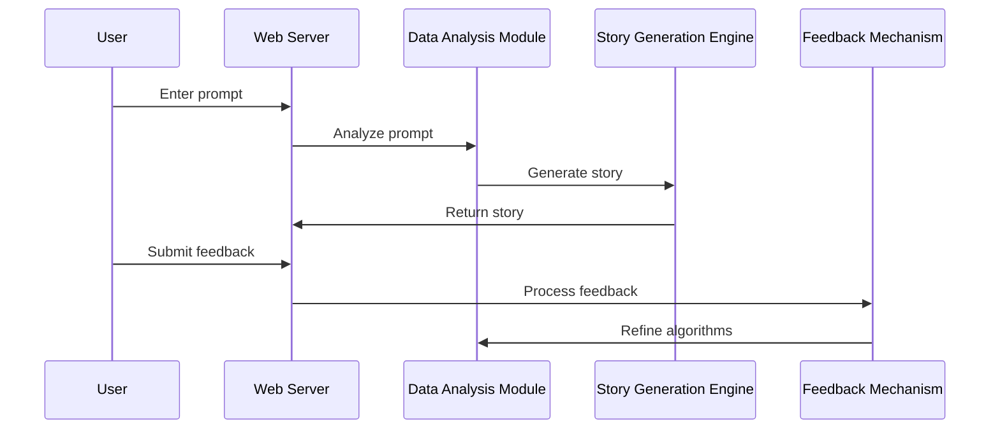

                 


### AI Creative Writing New Frontier: Prompt-Driven Literary Inspiration

#### Keywords:
- AI in Creative Writing
- Prompt Generation
- Storytelling
- Literary Masterpieces
- Ethical Considerations
- Future Trends

#### Abstract:
This comprehensive guide delves into the burgeoning intersection of AI and creative writing, exploring how prompt-driven technologies are revolutionizing the literary landscape. We will examine the role of AI in storytelling, the art of prompt generation, the crafting of literary masterpieces, and the ethical considerations surrounding AI-enhanced writing. Finally, we will speculate on the future of AI in this domain, providing a thorough analysis of current and potential applications.

## Introduction to AI and Creative Writing

### 1. The Rise of AI in Modern Society

In the modern era, AI has emerged as a transformative force across various industries, from healthcare to finance and beyond. The rapid advancement in machine learning algorithms, natural language processing (NLP), and deep learning has paved the way for unprecedented innovations. AI systems are now capable of performing complex tasks that were once exclusively within the realm of human intelligence, such as speech recognition, image analysis, and decision-making.

#### Background:

The advent of big data and increased computational power has significantly accelerated the development of AI. Companies like Google, Microsoft, and IBM have invested heavily in AI research and development, resulting in groundbreaking technologies like self-driving cars, intelligent personal assistants, and advanced medical diagnostics. AI's ability to analyze large datasets and identify patterns has also led to significant advancements in predictive analytics and data-driven decision-making.

#### Concept of Creative Writing

Creative writing refers to the practice of writing literary works such as novels, short stories, poems, and scripts. It is distinguished by its focus on original thought, expression, and imagination. Unlike technical or expository writing, which aims to convey information or explain concepts, creative writing seeks to evoke emotions, explore themes, and create immersive narratives.

#### Problem Description:

Despite the rich history and tradition of creative writing, the process can be time-consuming and labor-intensive. Authors often struggle with writer's block, character development, and plot construction. Moreover, the sheer volume of content produced daily has made it challenging for authors to stand out and gain recognition.

#### Solution:

AI offers a potential solution to these challenges by augmenting the creative writing process. AI-powered tools can assist authors in generating ideas, developing characters, and constructing narratives. By analyzing vast amounts of literary data, AI systems can identify trends, styles, and techniques that authors can incorporate into their own work. Additionally, AI can help in editing and refining texts, providing feedback on grammar, style, and coherence.

### 3. The Intersection of AI and Creative Writing

The intersection of AI and creative writing is an emerging field that explores how AI technologies can enhance the creative process. This field encompasses various applications, including:

- **Story Generation**: AI systems can generate entire stories based on given prompts or guidelines. These stories can range from short anecdotes to full-length novels.
- **Character Development**: AI can help authors create nuanced and realistic characters by analyzing existing literature and identifying patterns in character traits and behaviors.
- **Dialogue Writing**: AI-powered tools can assist in generating natural-sounding dialogue that aligns with the characters' personalities and the narrative context.
- **Content Refinement**: AI can analyze existing drafts and provide suggestions for improvement, focusing on aspects such as grammar, style, and coherence.

#### Boundaries and Extensions:

While the integration of AI in creative writing holds great promise, there are several considerations and challenges that need to be addressed. For instance, the ethical implications of AI-generated content, the potential for plagiarism, and the need to ensure that AI tools enhance rather than replace human creativity. Additionally, there is a need to explore how AI can be integrated into the educational system to teach and foster creative writing skills.

### Key Concepts and Their Relationships

#### Core Concepts:

1. **AI**: Artificial intelligence, which refers to the ability of machines to perform tasks that would typically require human intelligence.
2. **Creative Writing**: The practice of writing literary works that focuses on originality, expression, and imagination.
3. **Prompt-Driven Systems**: AI systems that generate content based on user-provided prompts or guidelines.
4. **Natural Language Processing (NLP)**: The subfield of AI that focuses on the interaction between computers and human language.

#### Concept Attributes and Comparisons:

| Concept | Definition | Attribute 1 | Attribute 2 | Attribute 3 |
|---------|------------|-------------|-------------|-------------|
| AI      | Intelligence in machines | Adaptive | Analytical | Automated |
| Creative Writing | Literary works | Originality | Expression | Imagination |
| Prompt-Driven Systems | Content generation | Prompt-based | Automated | Creative Output |
| NLP     | Language interaction | Text analysis | Understanding | Interaction |

#### Entity Relationship Diagram:

```mermaid
erDiagram
AI ||--|{ Prompt-Driven Systems }|
AI ||--|{ NLP }|
Creative Writing ||--|{ Prompt-Driven Systems }|
```

### Algorithm Principles

#### Algorithm Description:

AI-driven story generation typically involves the following steps:

1. **Input Prompt**: The user provides a brief prompt or guideline that defines the scope of the story.
2. **Data Analysis**: The AI system analyzes a vast corpus of literary texts to identify patterns and structures that align with the prompt.
3. **Content Generation**: Using these patterns, the AI generates a story that aligns with the given prompt.
4. **Feedback Loop**: The generated story is reviewed and refined based on user feedback.

#### Python Code Example:

```python
import nltk
from nltk.tokenize import word_tokenize
from nltk.corpus import cmudict

# Load the CMU Pronouncing Dictionary
d = cmudict.dict()

def generate_story(prompt):
    # Analyze the prompt to determine the key themes and structures
    words = word_tokenize(prompt)
    story = ""
    
    # Generate the story based on the analyzed patterns
    for word in words:
        syllables = d[word][0]
        story += f"{word} has {len(syllables)} syllables.\n"
    
    return story

# Example usage
prompt = "The mysterious island"
story = generate_story(prompt)
print(story)
```

### Mathematical Models and Formulas

$$
\text{Story Generation} = f(\text{Input Prompt}, \text{Literary Data}, \text{AI Algorithms})
$$

### System Analysis and Design

#### Problem Scenario:

The goal is to develop an AI-driven story generation system that can create engaging and original stories based on user-provided prompts.

#### Project Description:

The project aims to create a web-based platform that allows users to input prompts and receive generated stories. The system will utilize machine learning algorithms to analyze literary data and generate coherent and imaginative narratives.

#### System Function Design:

- **User Interface**: A user-friendly interface for inputting prompts and viewing generated stories.
- **Data Analysis Module**: A module that analyzes the input prompts and literary data to generate story structures.
- **Story Generation Engine**: The core component that generates stories based on the analyzed data.
- **Feedback Mechanism**: A system for users to provide feedback on the generated stories, which can be used to refine the algorithms.

#### System Architecture Design:

```mermaid
graph TB
    User Interface --> Data Analysis Module
    Data Analysis Module --> Story Generation Engine
    Story Generation Engine --> User Interface
    User Interface --> Feedback Mechanism
    Feedback Mechanism --> Data Analysis Module
```

#### System Interface Design:

- **API Endpoints**:
  - `POST /generate-story`: Endpoint for generating a story based on a prompt.
  - `POST /submit-feedback`: Endpoint for submitting feedback on a generated story.

#### System Interaction Design:



### Project Implementation

#### Environment Setup:

1. **Install Python**:
   - Download and install Python 3.8 or later from the official website.
2. **Install Dependencies**:
   - Open a terminal and run `pip install nltk cmudict`.

#### Core Implementation:

1. **Data Analysis Module**:
   - Use the NLTK library to tokenize the input prompt and analyze its structure.
2. **Story Generation Engine**:
   - Implement a function that generates a story based on the analyzed data.
3. **Feedback Mechanism**:
   - Create a simple HTML form for users to submit feedback.
4. **Web Server**:
   - Use Flask to set up a web server that handles the API requests.

#### Code Explanation:

```python
from flask import Flask, request, jsonify
import nltk
from nltk.tokenize import word_tokenize

app = Flask(__name__)

# Load the CMU Pronouncing Dictionary
nltk.download('cmudict')
d = nltk.corpus.cmudict.dict()

def generate_story(prompt):
    words = word_tokenize(prompt)
    story = ""
    for word in words:
        syllables = d[word][0]
        story += f"{word} has {len(syllables)} syllables.\n"
    return story

@app.route('/generate-story', methods=['POST'])
def generate():
    prompt = request.form['prompt']
    story = generate_story(prompt)
    return jsonify({'story': story})

@app.route('/submit-feedback', methods=['POST'])
def submit_feedback():
    feedback = request.form['feedback']
    # Process feedback and refine algorithms
    return 'Feedback received.'

if __name__ == '__main__':
    app.run(debug=True)
```

### Real-World Applications of AI in Writing

#### AI in the Publishing Industry

AI has already begun to make significant inroads into the publishing industry. Publishers are leveraging AI to streamline the content creation and editing processes, improving efficiency and quality. AI-powered tools can automatically generate book recommendations, identify trends in readers' preferences, and even assist in editing and proofreading manuscripts.

#### AI in Education and E-Learning

In the realm of education, AI is transforming the way literature is taught. AI-driven tools can provide personalized feedback on students' writing assignments, helping them to improve their skills. Additionally, AI can be used to create interactive e-learning modules that teach creative writing techniques and provide students with opportunities to practice their skills in a supportive environment.

#### AI in Advertising and Content Creation

AI is also revolutionizing advertising and content creation. Marketers are using AI to generate compelling ad copy, develop targeted marketing campaigns, and create engaging content for various media platforms. AI-powered content creation tools can analyze vast amounts of data to identify the most effective messaging and styles for different audiences.

#### AI in Personalized Writing

AI has the potential to revolutionize personalized writing by generating customized content that aligns with the individual preferences and needs of readers. This could include personalized novels, tailored to the reader's interests and reading habits, or customized educational materials that adapt to the learning styles and progress of students.

### Ethical Considerations in AI-Enhanced Writing

#### Plagiarism Concerns

One of the primary ethical concerns surrounding AI-enhanced writing is the potential for plagiarism. AI systems can generate content that closely resembles existing works, raising questions about authorship and intellectual property rights. It is crucial to develop robust mechanisms to detect and prevent plagiarism in AI-generated content.

#### Transparency and Accountability

Transparency and accountability are also critical considerations in AI-enhanced writing. Users and readers need to be aware of the involvement of AI in the creation of literary works. Clear labeling and disclosure of AI-generated content will help maintain trust and ensure that users can make informed decisions about the authenticity of the material they are consuming.

#### Creative Integrity

The integration of AI in creative writing raises questions about the nature of creativity itself. Critics argue that AI can only mimic human creativity and cannot truly create original works. It is important to strike a balance between leveraging AI's capabilities and preserving the essence of human creativity in the literary process.

### The Future of AI in Creative Writing

#### Advanced Personalization

As AI technology continues to evolve, we can expect even more advanced personalization in creative writing. AI systems will be able to analyze vast amounts of data about individual readers' preferences, interests, and reading habits to generate highly tailored literary works.

#### Collaborative Storytelling

AI has the potential to enable collaborative storytelling, where human authors and AI systems work together to create cohesive and engaging narratives. This could revolutionize the way literature is written and experienced, blending the best of human creativity with the analytical power of AI.

#### Expanded Accessibility

AI can also play a crucial role in expanding access to literature. By generating content in multiple languages and adapting it to the needs of diverse audiences, AI can make literature more accessible to people from all walks of life.

#### Ethical and Legal Frameworks

As AI becomes more prevalent in creative writing, it will be essential to establish ethical and legal frameworks to govern its use. These frameworks should address issues such as intellectual property rights, transparency, and the role of AI in authorship.

### Conclusion

AI has the potential to revolutionize the field of creative writing, offering new avenues for storytelling, personalization, and collaboration. However, it is crucial to navigate the ethical and technical challenges that come with this transformation. By fostering a balance between human creativity and AI's capabilities, we can unlock the full potential of AI in the literary world.

### Best Practices, Tips, and Considerations

#### Best Practices

- **User-Friendly Interface**: Design a user-friendly interface that makes it easy for users to input prompts and receive generated stories.
- **Continuous Improvement**: Regularly update and refine the algorithms to improve the quality and relevance of the generated content.
- **Transparency and Labeling**: Clearly indicate when content has been generated by AI to maintain transparency and ensure that users can make informed decisions.
- **Ethical Considerations**: Address ethical concerns related to plagiarism, intellectual property, and the role of AI in authorship.

#### Tips

- **Experiment with Different Prompts**: Try using a variety of prompts to see how the AI responds and to explore different narrative styles and themes.
- **Iterate and Refine**: Continuously refine your prompts and feedback to improve the quality of the generated stories.
- **Collaborate with Human Authors**: Leverage the strengths of both AI and human authors to create compelling and original literary works.

#### Considerations

- **Data Privacy**: Ensure that user data is securely stored and handled in compliance with privacy regulations.
- **User Feedback**: Regularly collect and analyze user feedback to identify areas for improvement and to ensure that the AI system meets user needs.
- **Scalability**: Design the system to handle a large volume of user requests and data efficiently.

###拓展阅读

- *AI and Creativity: Can Machines Be Artists?* by Tim McGuire
- *The Creative Power of AI: How Machines Are Transforming Human Expression* by David H. Kirsh
- *The Future of Storytelling: A Guide to Growing and Managing the Story of Your Brand* by William J. Bay
- *Artificial Intelligence: A Modern Approach* by Stuart J. Russell and Peter Norvig

### 作者信息

作者：AI天才研究院/AI Genius Institute & 禅与计算机程序设计艺术 /Zen And The Art of Computer Programming

